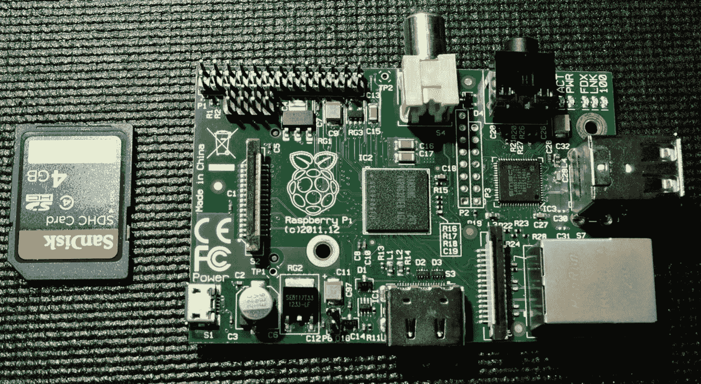
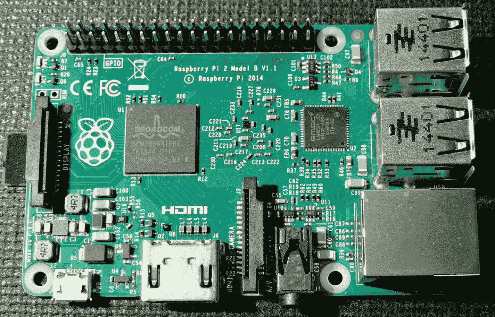
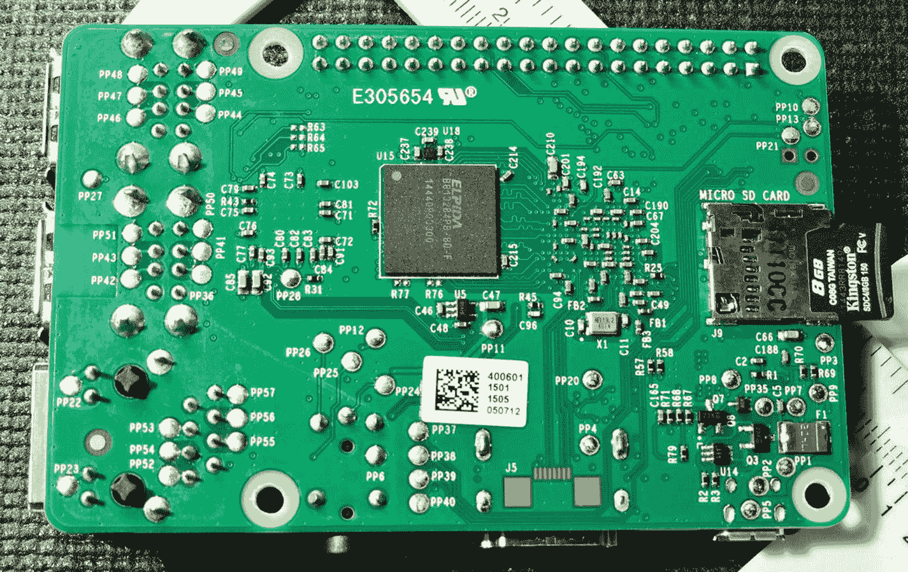
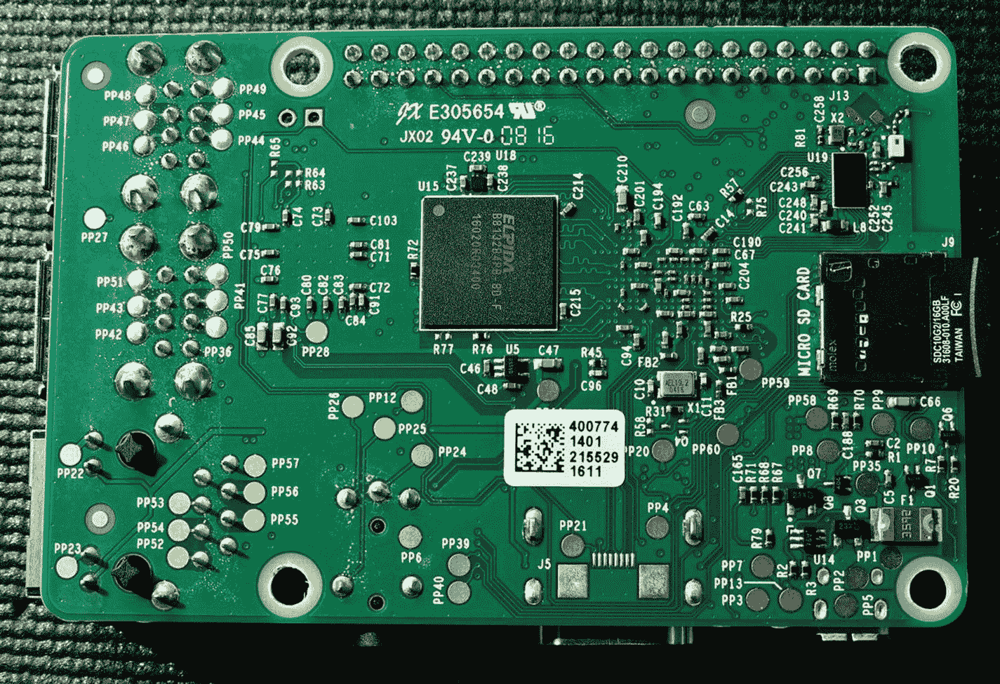
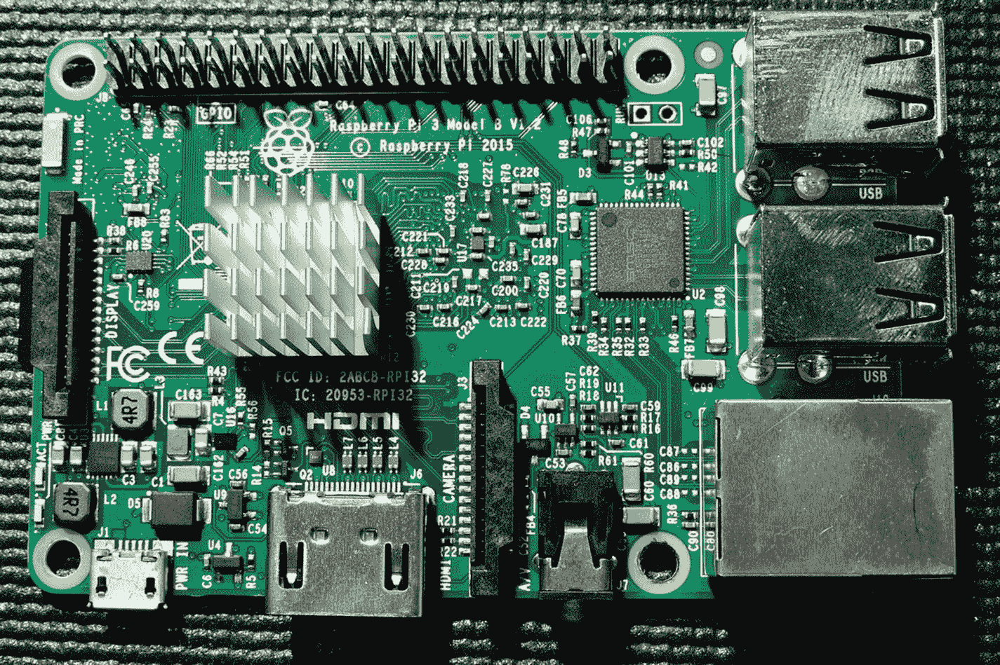
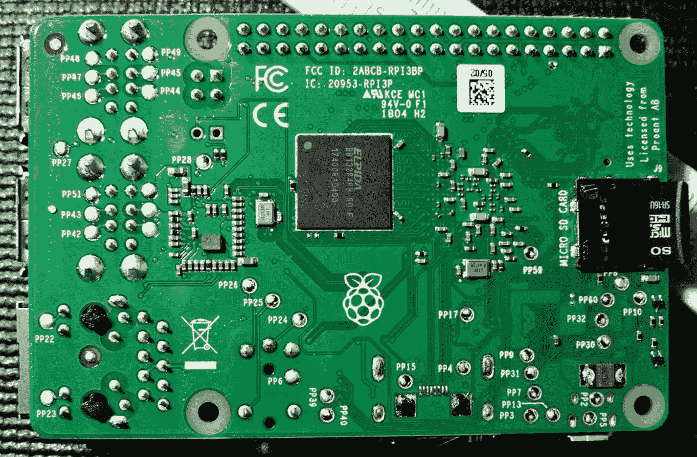
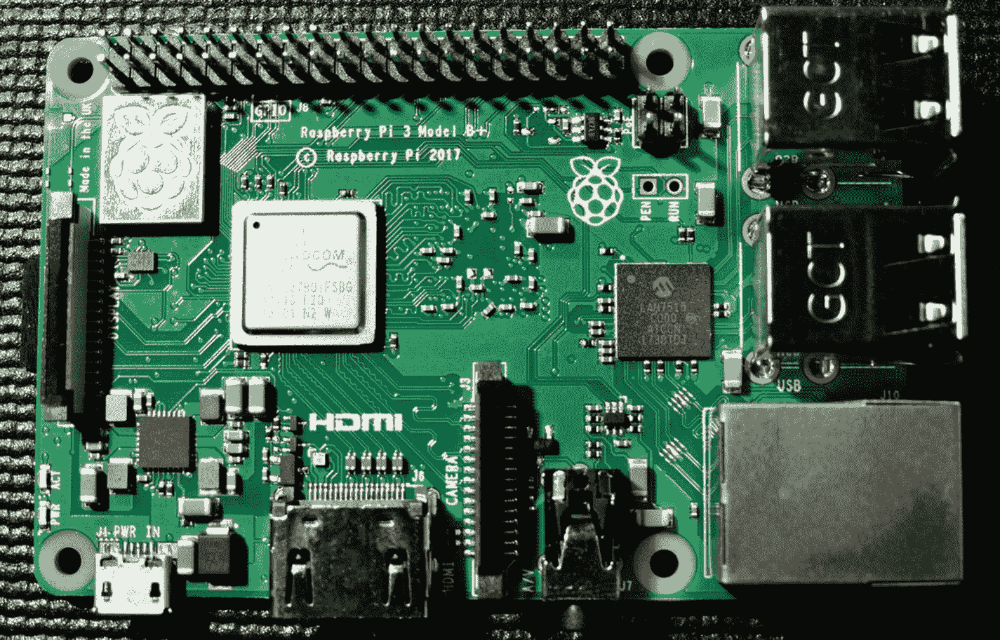
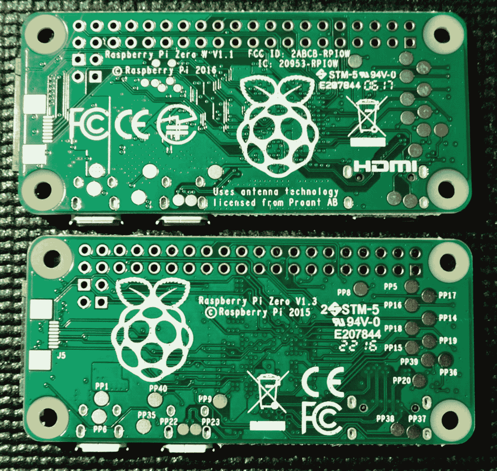
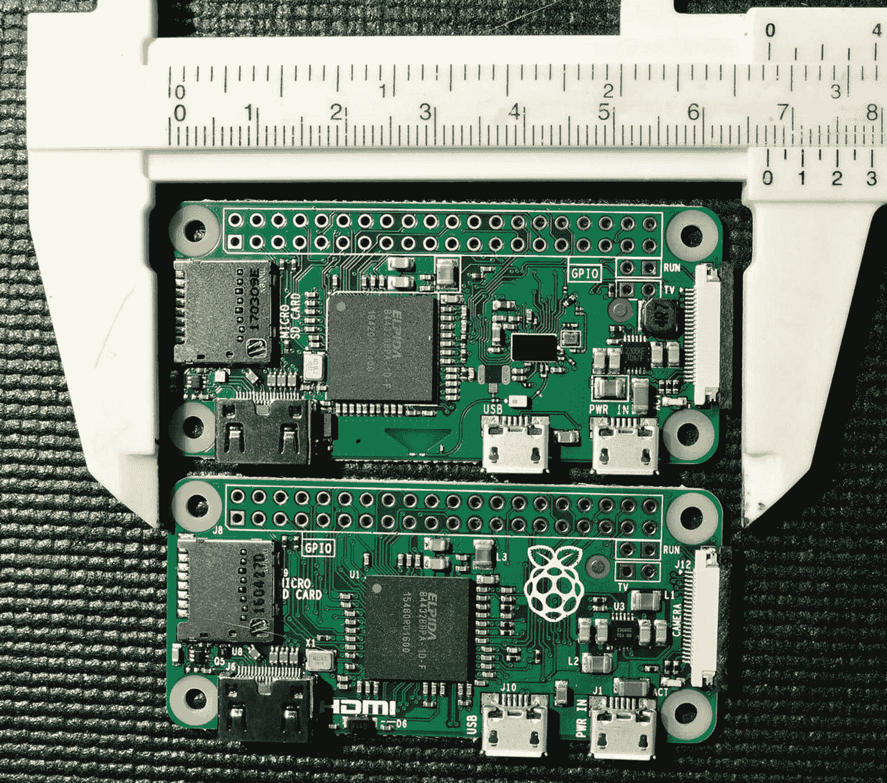

# 一、树莓派

Raspberry Pi 在两个层面上令人惊叹——信用卡大小的 SBC(单板计算机)的高级功能和它的价格。即使有今天的圆周率的竞争对手，树莓圆周率仍然是至高无上的，因为很少有人能击败它的价格。此外，它还享有强大的软件和社区支持。

价格是 Pi 的一个重要优势，而竞争对手并不总是欣赏这一点。爱好者和制造者正在以新的、有时是冒险的方式应用圆周率。一些刚开始的人不想因为一个新手的失误而失去他们的 SBC。在低 Pi 价位，亏损可以不灰心的吸收。想象一下，一名学生以 349 美元的价格购买了一台英特尔焦耳 1 (当它被提供时)，并意外地举杯庆祝。这足以让大多数人放弃了！价格让每个人在学习中无所畏惧。

## SBC 库存

在考虑关于 Raspberry Pi 中资源的细节之前，做一个高级清单是有用的。在这一章中，让我们列出当你购买 Pi 时你会得到什么。

在本书中，您将从两个角度研究每种资源:

*   硬件本身——它是什么以及它是如何工作的

*   背后的驱动软件和 API

在某些情况下，硬件背后会有一个或多个内核模块，形成设备驱动程序层。它们公开了应用程序和硬件设备之间的接口软件 API。例如，应用程序通过使用`ioctl(2)`调用与驱动程序通信，而驱动程序与总线上的 I2C 设备通信。`/sys/class`文件系统是设备驱动程序向应用程序公开自己的另一种方式。在第 [12](12.html) 章研究 GPIO(通用输入/输出)时，你会看到这一点。

有些情况下，Raspbian Linux 中不存在驱动程序，这需要您使用“裸机”方法。例如，使用软件创建 PWM 信号。通过将 GPIO 寄存器映射到应用存储空间，可以直接从应用程序中获得所需的结果。直接访问和驱动程序访问各有利弊。

因此，虽然汇总清单仅列出了硬件设备，但您将在前面的章节中更详细地检查每个资源。

## 模型

硬件清单直接受到被检查设备型号的影响。这些年来，已经生产了几种型号，从型号 B 开始，然后是型号 a。从那时起，其他几种装置也开始出现，这些总结在表 [1-1](#Tab1) 中。更多细节可以在网上看到。 2

表 1-1

树莓 Pi 模型综述

<colgroup><col class="tcol1 align-left"> <col class="tcol2 align-left"> <col class="tcol3 align-left"> <col class="tcol4 align-left"> <col class="tcol5 align-left"> <col class="tcol6 align-left"></colgroup> 
| 

模型

 | 

介绍

 | 

价格

 | 

中央处理器

 | 

社会学

 | 

混杂的

 |
| --- | --- | --- | --- | --- | --- |
| 模型 A | 2013 年 2 月 | $25 | ARMv6Z 战斗机 | BCM2835 | 32 位 |
| 模型 A | 2014 年 11 月 | $20 | ARMv6Z 战斗机 | BCM2835 | 32 位 |
| B 型 | 2012 年 4 月 | $35 | ARMv6Z 战斗机 | BCM2835 | 32 位 |
|   | 2014 年 7 月 | $25 | ARMv6Z 战斗机 | BCM2835 | 32 位 |
| B 2 型 | 2015 年 2 月 | $35 | ARMv7-A 战斗机 | BCM2836 | 四路 32 位 |
| 型号 B 2 (1.2) | 2016 年 10 月 | $35 | ARMv8-A 突击步枪 | BCM2837 | 四路 32/64 位 |
| 模型 B 3 | 2016 年 2 月 | $35 | ARMv8-A 突击步枪 | BCM2837 | 四路 32/64 位 |
| 型号 B 3+ | 2018 年 3 月 | $35 | ARMv8-A 突击步枪 | BCM2837B0 | 四路 32/64 位 |
| 计算模块 1 | 2016 年 1 月 | $30 | ARMv6Z 战斗机 | BCM2835 | 32 位 |
| 计算模块 3 | 2017 年 1 月 | $30 | ARMv8-A 突击步枪 | BCM2837 | 四路 64 位 |
| 计算模块 3 Lite | 2017 年 1 月 | $25 | ARMv8-A 突击步枪 | BCM2837 | 四路 64 位 |
| 零(1.2) | 2015 年 11 月 | $5 | ARMv6Z 战斗机 | BCM2834 | 32 位 |
| 零(1.3) | 2016 年 5 月 | $5 | ARMv6Z 战斗机 | BCM2834 | 32 位 |
| 零瓦特 | 2017 年 2 月 | $10 | ARMv6Z 战斗机 | BCM2834 | 无线 32 位 |

## 树莓 Pi 型号 B

图 [1-1](#Fig1) 展示了树莓 Pi 模型 B，第 1 代。这款主板于 2012 年 4 月发布，售价 35 美元。请注意，它使用了大 SDHC(安全数字高容量)卡，显示在照片的左边。下面的插座如图 [1-2](#Fig2) 所示。GPIO 当时是一个 26 针的插头，和后来的 A 型一样。还有一个标记为 P5 的 4x2 接头，它有电源、接地和四个 GPIO 引脚。

图 1-1

树莓 Pi 型号 B(顶部)，第 1 代

采用的 ARM 架构是 ARMv6Z。单个 32 位内核运行速度为 700 MHz，使用 256 MB SDRAM。2016 年 5 月，这一数字增加到了 512 MB。该板包括 2 个 USB 端口、15 针 MIPI 摄像头接口、LCD MIPI 接口、HDMI 和 RCA 复合视频输出、3.5 毫米音频插孔和 GPIOs。网络接口由一个 10/100 Mbit/s 的以太网适配器组成。

图 1-2

树莓 Pi 型号 B(下图)，第 1 代

额定功率约为 700 毫安(3.5 瓦)，取自微型 USB 连接器或接头带。

## 树莓 Pi 2 型号 B

树莓 Pi 2 型号 B 于 2015 年 2 月上市，售价 35 美元。该型号采用 ARMv7A 32 位架构。主要改进是支持四个 CPU(中央处理器)内核，运行频率为 900 MHz。另一个改进是 1 GB 的 SDRAM，允许更大的应用混合。图 [1-3](#Fig3) 示出了 pcb 的顶部，而图 [1-4](#Fig4) 示出了底部。

其他值得注意的变化包括用于 GPIO 的 Raspberry Pi 标准化 40 引脚排线。提供了四个 USB 端口，并将安装孔移到了 pcb(印刷电路板)上。

图 1-3

树莓 Pi 2 型号 B 的顶部

主板还使用微 SDHC 插槽来存储文件。图 [1-3](#Fig3) 显示其从 pcb 下方的左中部伸出。空闲时功耗降至 220 毫安(1.1 瓦)，但在压力下会跃升至 820 毫安(4.1 瓦)。这就需要一个更大的电源适配器来为设备供电。

图 1-4

树莓 Pi 2 型号 B 的底部

## 树莓 Pi 3 型号 B

2016 年 2 月，树莓 Pi 3 Model B 上市，售价也是 35 美元。这提供了 arm V8-64/32 位架构。四核以 1.2 GHz 的速度运行，并配有 1 GB 的 SDRAM。另一个礼物是增加了 IEEE 802.11n-2009 无线支持和蓝牙 4.1。图 [1-5](#Fig5) 示出了 pcb 的顶侧，而图 [1-6](#Fig6) 示出了底部。

空闲时功耗为 300 mA (1.5 W)，但在压力下会增加到 1.34 A (6.7 W)。图中显示了添加到 CPU 的散热器，但不包括在内。添加散热器可以防止内核降低时钟速度来调节温度。

图 1-6

树莓 Pi 3 型号 B 的底部

图 1-5

树莓 Pi 3 型号 B 的顶部

## 树莓 Pi 3 型号 B+

这款机型于 2018 年 3 月上市，价格也是 35 美元。是一款 *64 位*，1.4 GHz 四核，1gb SDRAM。网络端口支持 10/100/1000 Mbit/s 以太网，尽管由于其内部使用 USB 集线器，最高速度被限制在 300 Mbit/s 左右。无线支持现在包括用于双频 2.4/5 GHz 操作的 802.11ac。蓝牙升级到蓝牙 4.2 LS BLE。

空闲时功耗为 459 毫安(2.295 瓦)，满负荷时增加到 1.13 安(5.661 瓦)。注意图 [1-7](#Fig7) 中 CPU 芯片上的金属帽。这有助于在不需要散热器的情况下散热(尽管使用散热器可能仍然是有益的)。pcb 的底面如图 [1-8](#Fig8) 所示。

图 1-8

树莓 Pi 3 型号 B+的底部

图 1-7

树莓 Pi 3 型号 B+的顶部

## 树莓派零度

并非每个 maker 项目都需要 64 位四核和 1gb SDRAM 的全部资源。首款树莓 Pi Zero 于 2015 年 11 月问世，后来于 2016 年 5 月升级。单价为 5 美元，是许多小型项目的理想 SBC。

Zero 是一款 ARMv6Z 架构(32 位)器件，以 1 GHz 运行单核。SDRAM 限制在 512 MB，对于大多数项目来说还是很够用的。第一个零缺少 MIPI 相机接口，该接口是在 2016 年修订版中添加的。

为了节省成本，没有焊接头带或连接器。如果最终用户需要，pcb 上还有复合视频的标记点。HDMI 输出通过迷你 HDMI 连接器提供，立体声音频通过 PWM(脉宽调制)GPIO 提供。零上也没有有线以太网端口。它可以通过使用一个微型 USB 端口和一个以太网适配器来提供。

电源通过另一个 Micro-USB 连接器提供，空闲时的功耗为 100 mA (0.5 W)，压力下为 350 mA (1.75 W)。图 [1-9](#Fig9) 和 [1-10](#Fig10) 显示了树莓派零和树莓派零 w

图 1-10

树莓 Pi Zero(底部)和树莓 Pi Zero W(顶部)的底部

图 1-9

树莓派 Zero(底部)和树莓派 Zero W(顶部)的顶部

## 树莓派零度 W

Raspberry Pi Zero W 名称中的“W”是一个赠品，它通过 Zero 上的无线功能得到增强。它的定价是 10 美元。支持的无线标准有 802.11n 和蓝牙 4.1。与 Zero 一样，Zero W 没有有线以太网连接器，只有一个 Micro-USB 端口(另一个仅用于电源)。拥有 WIFI (WIFI 是 Wi-Fi 联盟的商标)接入大大增加了设备的通信多功能性。

## 哪个型号？

自然产生的问题是“买哪个型号？”答案很像买车——视情况而定。如果你正在寻找一台可以连接键盘、鼠标和显示器的廉价电脑，那么就买一台功能最强大的设备，比如 Raspberry Pi 3 型号 B+另一类涉及 AI(人工智能)或视频识别的项目是强大硬件的另一个例子。

为了建造一些必须在室外经受天气考验并拍摄鸟巢中鸟类的照片，那么带有 WIFI 连接的 Raspberry Pi Zero W 似乎是合适的。也许有其他项目根本不需要网络接入，在这些项目中，像零这样的最低价格是适用的。最好的消息是，你有很多低价的选择。