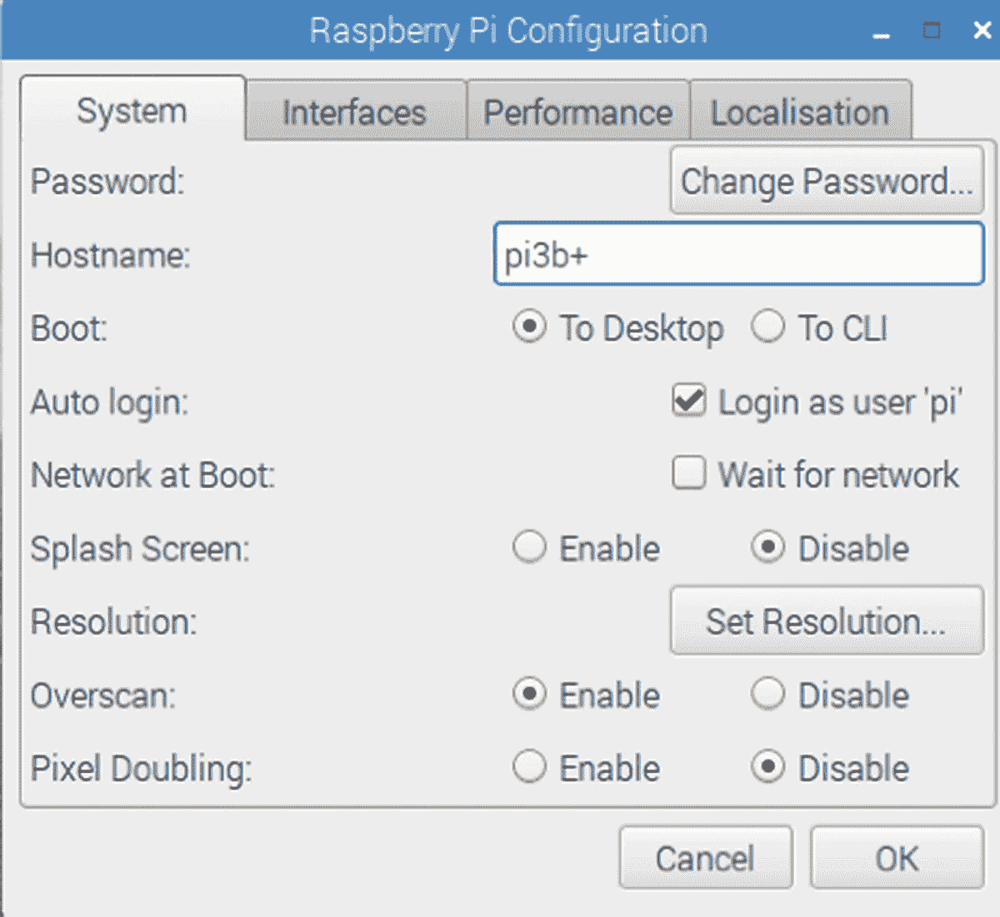
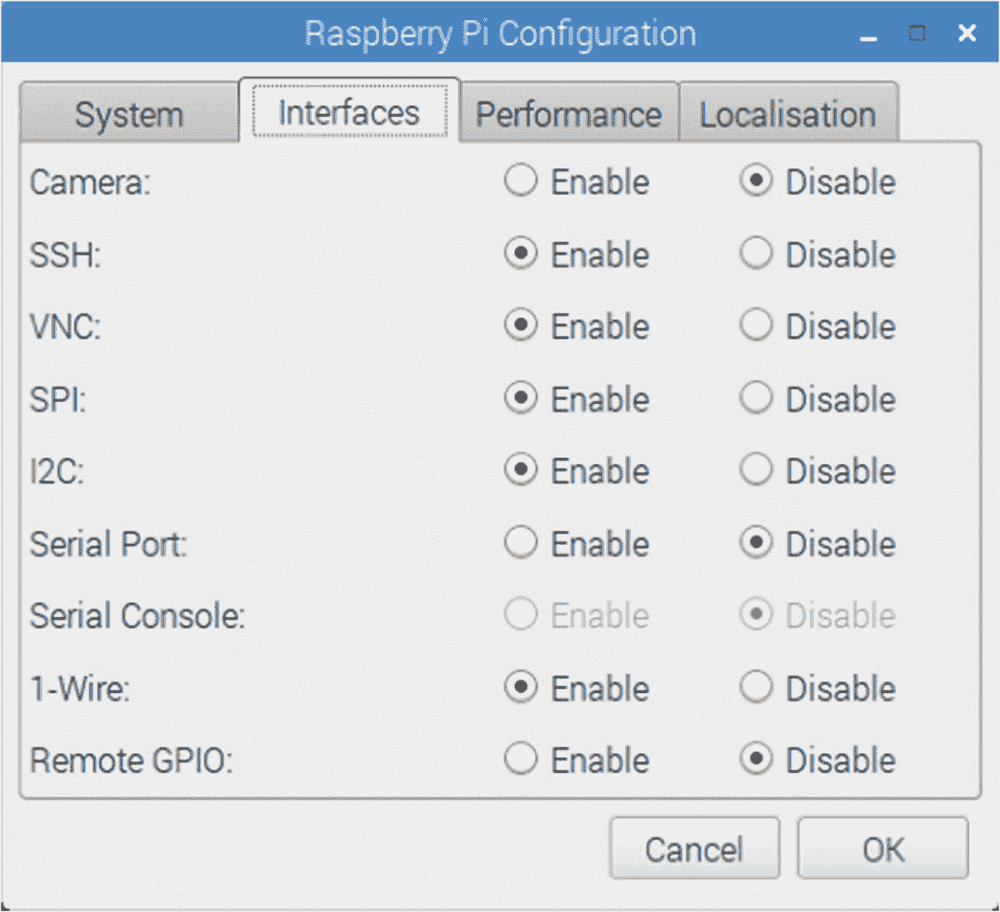
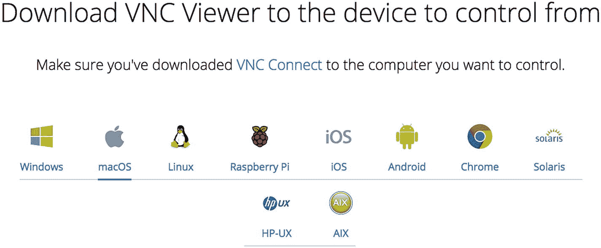
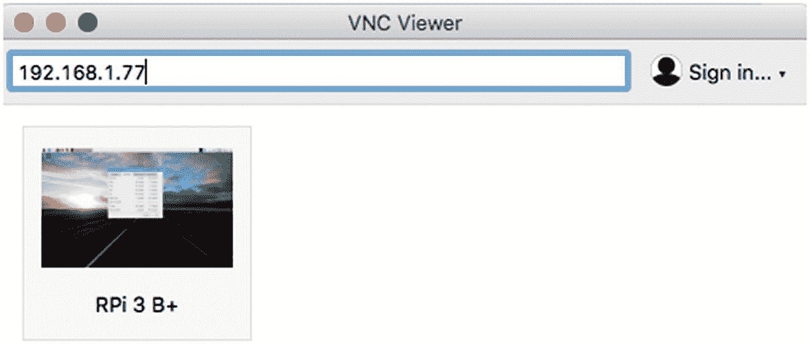
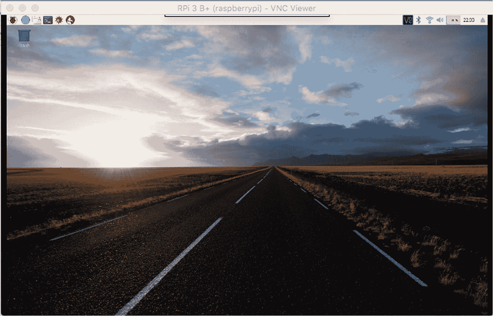
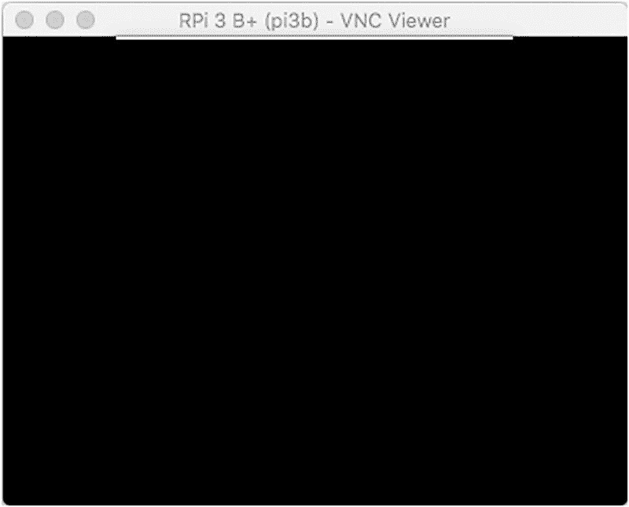
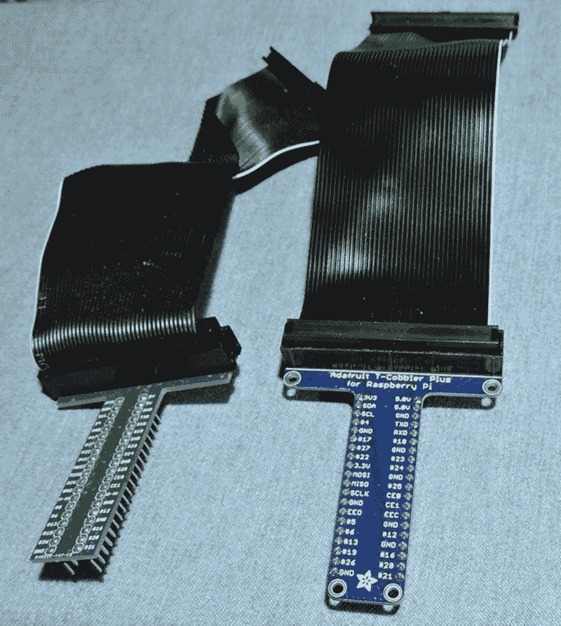

# 二、准备

虽然假设您已经开始使用 Raspberry Pi，但是在阅读本书的其余部分之前，您可能还需要做一些事情。例如，如果您通常使用笔记本电脑或台式计算机，您可能更喜欢从那里访问您的 Pi。

如果你计划完成本书中的大部分或全部项目，我强烈推荐你使用 Adafruit Pi T-Cobbler(本章后面会讲到)。该硬件以一种你可以在试验板上访问的方式断开 GPIO 线。

## 静态 IP 地址

标准的 Raspbian 映像提供了一个有能力的 Linux 系统，当插入网络时，它使用 DHCP(动态主机配置协议)自动为它分配一个 IP 地址。如果您想从台式机或笔记本电脑远程连接到它，那么 DHCP 分配的动态 IP 地址是有问题的。

有可下载的扫描网络的 Windows 程序。如果你用的是 Linux 或者 Mac 主机，可以用`nmap`扫描一下。下面是一个来自 Devuan Linux 的会话示例，使用了`nmap`命令。这里扫描的 IP 地址范围从 1 到 250:

```sh
root@devuan:~# nmap -sP 192.168.1.1-250

Starting Nmap 6.47 ( http://nmap.org ) at 2018-06-01 19:59 EDT
Nmap scan report for 192.168.1.1
Host is up (0.00026s latency).
MAC Address: C0:FF:D4:95:80:04 (Unknown)
Nmap scan report for 192.168.1.2
Host is up (0.044s latency).
MAC Address: 00:1B:A9:BD:79:02 (Brother Industries)
Nmap scan report for 192.168.1.77
Host is up (0.15s latency).
MAC Address: B8:27:EB:ED:48:B1 (Raspberry Pi Foundation)
Nmap scan report for 192.168.1.121
Host is up (0.00027s latency).
MAC Address: 40:6C:8F:11:B8:AE (Apple)
Nmap scan report for 192.168.1.80
Host is up.
Nmap done: 250 IP addresses (4 hosts up) scanned in 7.54 seconds
root@devuan:~#

```

在本例中，Raspberry Pi 被标识在 192.168.1.77 上，并带有完整的 MAC 地址(这些地址出现在报告“Raspberry Pi Foundation”的行上方)。虽然这种发现方法是可行的，但是它需要时间并且不方便。

如果您更喜欢将您的 Raspberry Pi 更改为使用静态 IP 地址，请参见第 [8](08.html) 章中的“有线以太网”部分以获取说明。

## 使用 SSH

如果您知道您的 Raspberry Pi 的 IP 地址，使用 nmap 发现了它，或者在您的 hosts 文件中注册了名称，您可以使用 SSH 登录到它。在本例中，我们以用户`pi`的身份从 Devuan Linux 机器登录到主机 192.168.1.77:

```sh
$ ssh pi@192.168.1.77
pi@192.168.1.77's password:
Linux raspberrypi 4.14.34-v7+ #1110 SMP Mon Apr 16 15:18:51 BST 2018 armv7l

The programs included with the Debian GNU/Linux system are free software;
the exact distribution terms for each program are described in the individual files in /usr/share/doc/*/copyright.

Debian GNU/Linux comes with ABSOLUTELY NO WARRANTY, to the extent permitted by applicable law.
Last login: Fri Jun  1 20:07:24 2018 from 192.168.1.80
$

```

还可以使用`scp`命令将文件复制到 Raspberry Pi 或从 Raspberry Pi 复制文件。在 Raspberry Pi 上执行`man scp`操作，了解使用信息。

如果有 X-Window 服务器在运行，也可以在您的笔记本电脑/台式机上显示 X-Window 系统(X-Window)图形。(Windows 用户可以为此使用 Cygwin，从`www.cygwin.com`开始提供。)以 Linux 为例，首先配置 X-Window 服务器的安全性以允许请求。在这里，我将采用懒惰的方法，通过使用`xhost`命令允许所有主机(在不是 Pi 或者是另一个 Pi 的 Linux 机器上):

```sh
$ xhost +
access control disabled, clients can connect from any host
$

```

现在使用带-Y 选项的 ssh 登录到远程 Pi:

```sh
$ ssh pi@192.168.1.77 -Y
pi@192.168.1.77's password:
Warning: No xauth data; using fake authentication data for X11 forwarding.
Linux raspberrypi 4.14.34-v7+ #1110 SMP Mon Apr 16 15:18:51 BST 2018 armv7l

The programs included with the Debian GNU/Linux system are free software;
the exact distribution terms for each program are described in the individual files in /usr/share/doc/*/copyright.

Debian GNU/Linux comes with ABSOLUTELY NO WARRANTY, to the extent permitted by applicable law.
Last login: Fri Jun  1 20:14:40 2018 from 192.168.1.80
$

```

从 Raspberry Pi 会话中，我们可以启动 xpdf，以便它在本地 Linux 机器上打开一个窗口:

```sh
$ xpdf &

```

如果失败，尝试在遥控器(pi)上导出一个显示变量，以通知软件 X-Window 服务器和屏幕的位置:

```sh
$ export DISPLAY=192.168.1.80:0

```

这里，我已经指定了 Devuan Linux 地址(或者，可以使用一个`/etc/hosts`名称),并指示 Raspberry Pi 使用 Linux 的显示号`:0`。我们在后台运行`xpdf`命令，这样我们就可以在当前的 SSH 会话中继续发出命令。同时，xpdf 窗口将在 Linux 屏幕上打开，而 xpdf 程序在 Raspberry Pi 上运行。

这并不能让您以图形方式访问 Pi 的桌面，但是对于开发人员来说，SSH 通常就足够了。如果你想远程图形访问树莓的桌面，一个选择是使用 VNC。

## 远程桌面

如果你已经在使用笔记本电脑或你最喜欢的台式电脑，你可以通过网络方便地访问你的 Raspberry Pi 的图形桌面。一旦 Raspberry Pi 的 VNC 服务器配置完毕，您所需要的就是在您的访问计算机上安装一个 VNC 客户端。这消除了连接到 Raspberry Pi 的键盘、鼠标和 HDMI 显示设备的需要。换句话说，您可以“无头”地运行 Pi。

让 VNC 工作需要一点设置。Raspbian Linux 已经采取措施让它变得简单。如果设置不正确，当您尝试登录时，VNC 查看器只会显示黑屏。

要使用 VNC，您必须安装桌面软件(GUI)。这也将使您更容易配置它。如果你安装了一个 Raspbian *Lite* 发行版，它将*不*包括必要的桌面服务器软件。

启动图形桌面，然后从树莓图标(左上角)，下拉菜单，选择“首选项”，并选择“树莓 Pi 配置。”这将弹出一个如图 [2-1](#Fig1) 所示的对话框。



图 2-1

树莓 Pi 配置对话框。请注意 Boot:选项是如何选中单选按钮“To Desktop”的。

您可能已经将“引导”选项设置为“到桌面”，但是现在单击它。这将导致桌面软件在启动后启动，以便您可以通过 VNC 连接到它。

将桌面配置为重启后启动后，您还需要如图 [2-2](#Fig2) 所示，通过点击“接口”选项卡来启用 VNC 服务器。



图 2-2

VNC 在对话框的接口选项卡中启用

在“接口”对话框中，单击标有“启用”的 VNC 单选按钮单击右下角的确定保存您的设置。然后重启你的 Pi。请等待重新启动和图形桌面启动的时间。

### vnc 查看器

为了访问 VNC 服务器，在客户端需要一个相应的 VNC 浏览器。一种解决方案是使用来自以下网站的免费 realvnc 查看器:

[T2`https://www.realvnc.com/en/connect/download/viewer/`](https://www.realvnc.com/en/connect/download/viewer/)

从该网站上，您可以找到您最喜爱的台式机的下载链接，如图 [2-3](#Fig3) 所示。忽略网站对“VNC 连接”的引用



图 2-3

VNC 浏览器的各种下载选项。忽略本页的“VNC 连接”信息。

根据您的桌面平台下载并安装。

当您启动查看器时，您会看到一个类似于图 [2-4](#Fig4) 所示的小对话框。一旦您成功登录，图标就会出现(如图所示)。



图 2-4

初始 VNC 浏览器对话框和一个以前使用的登录图标

成功连接并登录后，您应该会看到您的 Pi 桌面。图 [2-5](#Fig5) 举例说明了一个桌面窗口(在 Mac 上)。



图 2-5

在 Mac 上连接的树莓 Pi VNC 会话

如果您的 VNC 浏览器连接并似乎挂起，请耐心等待。VNC 屏幕更新的速度将取决于您的网络传输图形数据的能力。我发现我可以通过 WIFI 连接在 Pi 3 B+上使用 VNC，没有太多延迟。

虽然 VNC 的设施非常适合提供远程图形桌面访问，但不言而喻，其性能不适合观看视频或快速动作游戏。

### 黑色 VNC 屏幕

如果您将 Pi 的配置更改为引导至命令行模式(参见图 [2-1](#Fig1) 按钮“至 CLI”)，而不是桌面模式，当您使用 VNC 查看器时，您将会遇到黑屏(参见图 [2-6](#Fig6) )。选择命令行模式会导致桌面软件不运行，即使您可能启用了 VNC(图 [2-2](#Fig2) “启用”)。



图 2-6

黑色的 VNC 浏览器屏幕表示桌面软件没有运行

要重新获得 VNC 桌面访问，您必须将配置更改为“至桌面”(图 [2-1](#Fig1) )，然后重新启动。另一种方法是转到命令行(控制台或 ssh)并手动启动 X 服务器。从控制台登录，只需执行以下操作:

```sh
$ startx

```

从 ssh 会话中，您需要成为 root 用户(使用 sudo):

```sh
$ sudo -i
root@pi3bplus:~# startx

```

让服务器软件有时间启动后，VNC 查看器应该能够连接到您的桌面。当然，如果您注销 ssh 会话，服务器也会退出并终止桌面访问。

## 试验板设置

没有试验板和 Pi T-Cobbler 适配器也可以工作，但是你会发现有了高质量的试验板和适配器，实验会有趣得多。推荐的 T-Cobbler 可以从 Adafruit 购买，图 [2-7](#Fig7) 中有一个便宜的副本。

[T2`https://www.adafruit.com/product/2028`](https://www.adafruit.com/product/2028)



图 2-7

两个 Pi T-Cobbler 试验板适配器。请注意，来自中国(左)的单位需要一个电缆扭曲。推荐 Adafruit 单位(右)。

## 摘要

抛开这些细节不谈，本书的其余部分可以专注于 Raspberry Pi 必须提供的各种资源。Pi 提供了很多内容，让我们开始吧。