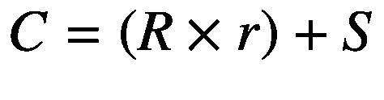
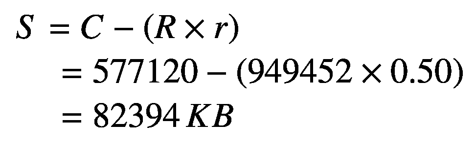
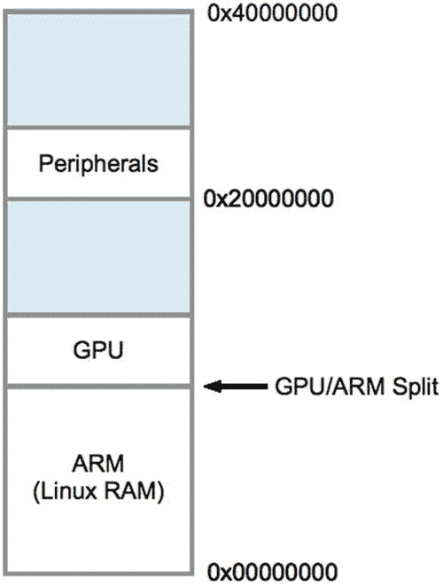

# 五、同步动态随机访问内存

最初的 Model B Rev 2.0 Raspberry Pi 有 512 MB 的 SDRAM(同步动态随机访问存储器)，而旧版本和 Model A 有 256 MB。现代的 Pi 现在配备了 1 GB 的内存，除了 Raspberry Pi Zero，它有 512 MB。相比之下，AVR 类 ATmega328P 有 2 KB 的静态 RAM！

一般 Pi 开发人员并不太关心内存硬件，因为操作系统为管理程序使用提供了丰富的工具。然而，让我们研究一些有用的 Raspbian Linux 接口，它们告诉我们内存是如何被利用的。您还将研究如何直接从您的 Linux 应用访问内存映射的 ARM 外设。

## /proc/meminfo

伪文件`/proc/meminfo`为我们提供了关于内存使用的信息。这些信息因体系结构和内核使用的编译选项而有所不同。让我们研究一个由运行 Raspbian Linux 的 Raspberry Pi 3 Model B+生成的示例:

```sh
$ cat /proc/meminfo
MemTotal:         949452 kB
MemFree:          631676 kB
MemAvailable:     756320 kB
Buffers:           20532 kB
Cached:           158004 kB
SwapCached:            0 kB
Active:           170108 kB
Inactive:         107020 kB
Active(anon):      99576 kB

Inactive(anon):    13172 kB
Active(file):      70532 kB
Inactive(file):    93848 kB
Unevictable:           0 kB
Mlocked:               0 kB
SwapTotal:        102396 kB
SwapFree:         102396 kB
Dirty:                40 kB
Writeback:             0 kB
AnonPages:         98596 kB
Mapped:            79016 kB
Shmem:             14152 kB
Slab:              22444 kB
SReclaimable:      10640 kB
SUnreclaim:        11804 kB
KernelStack:        1768 kB
PageTables:         3376 kB
NFS_Unstable:          0 kB
Bounce:                0 kB
WritebackTmp:          0 kB
CommitLimit:      577120 kB
Committed_AS:     809528 kB
VmallocTotal:    1114112 kB
VmallocUsed:           0 kB
VmallocChunk:          0 kB
CmaTotal:           8192 kB
CmaFree:            6796 kB

```

所有显示的内存值右边都有单位 *KB* ，表示千(1，024)字节。这些报告值在网上有详细描述。 <sup>7</sup> 但是让我们总结一些有趣的价值。

### 记忆总数

`MemTotal`行表示可用内存的总量，减去一些保留的二进制区域。注意，分配给 GPU 的内存不计入`MemTotal`。一些所有者可能会选择分配最少 16 MB 给 GPU，以便在不使用图形桌面时获得更多可用内存。默认分配 64 MB。

如果进一步细分，考虑分配给 GPU 的内存，我们会发现大约有 32 MB 的内存未计算在内，如表 [5-1](#Tab1) 所示。由于 GPU 寻址内存的方式不同，这将因 Pi 型号和分配的 GPU 内存而异。

表 5-1

GPU 和主内存故障

<colgroup><col class="tcol1 align-left"> <col class="tcol2 align-right"> <col class="tcol3 align-left"></colgroup> 
| 

记忆

 | 

B 型

 | 

评论

 |
| --- | --- | --- |
| 同步动态随机访问内存(Synchronous Dynamic random access memory) | 1，048，576 KB | 配备硬件的存储器 |
| 记忆总数 | 949，452 KB | /proc/meminfo |
| 差异 | 99，124 KB | 剩余内存 |
| gpu_mem | 65，536 KB | /boot/config.txt(默认情况下 gpu_mem=64) |
| 差异 | 33，588 KB | 下落不明 |

### 记忆自由

`MemFree`通常表示英特尔 x86 平台上以千字节为单位的`LowFree` + `HighFree`内存的总和。对于 ARM，这只是表示用户空间程序可用的内存量。

### 缓冲

该值表示内核中用于原始磁盘块等的临时缓冲区。这个值不应该比大约 20 MB 大太多。 <sup>8</sup>

### 藏起

该值表示已缓存的读取文件内容(页面缓存)。这不包括为`SwapCached`报告的内容。

### 交换的

显示的`SwapCached`值代表换出的内存，现在又换回。为了提高效率，这些内存页面仍然由交换磁盘空间表示，以备再次需要。该值被报告为零的事实是一个可喜的迹象，表明没有发生交换或者交换不再相关。

### 活跃的

`Active`内存值表示最近使用的不回收的内存，除非绝对必要。

### 不活动的

该值表示不活动的内存，并且可能在需要内存时被回收。

### 活动(匿名)

该值表示不是由文件备份且处于活动状态的内存。除非绝对必要，否则不会回收活动内存。

### 不活动(匿名)

该值表示没有文件备份且不活动的内存。如果需要内存，非活动内存可以回收。

### 活动(文件)

该值表示活动的文件支持内存。只有绝对需要时，才会回收活动内存。

### 不活动(文件)

该值表示由文件支持的非活动内存。当需要内存时，非活动内存可以回收。

### 不可战胜的

此数量反映了无法回收的内存总量。例如，被锁定的内存不能被回收。

### 锁定的

该值报告锁定的内存量。

### 交换总量

该值以千字节为单位报告可用的交换空间总量。

### 交换自由

该值以千字节为单位报告剩余的可用交换空间量。

### 肮脏的

该值表示已修改并等待写入磁盘的内存的千字节数。

### 回复

该值报告写回磁盘的内存量(以千字节为单位)。

### 匿名页面

这表示映射到用户空间的非文件支持的内存页面。

### 计划

该值报告已经映射到内存中的文件。这可能包括库代码。

### 施姆

这个参数似乎没有被很好地记录。但是，它表示以千字节为单位的共享内存量。

### 平板

这个参数被称为“内核数据结构缓存”

### 可索赔的

这个参数被描述为“可能被回收的`Slab`的一部分，例如缓存。”

### 阳光回收

这个参数被描述为“在内存压力下不能被回收的部分”

### 内核堆栈

该值报告内核堆栈使用的内存。

### 页面表格

该值报告内核中使用的页表所需的内存量。显然，随着需要管理的内存越来越多，就有更多的内存专用于页表。

### NFS _ 不稳定

该值表示“发送到服务器，但尚未提交到稳定存储的 NFS 页面”该示例数据表明没有使用 NFS。

### 活力

这将报告用于“块设备反弹缓冲区”的内存

### 写回 Tmp

此参数报告 FUSE 用于“临时写回缓冲区”的内存

### 承诺限制

文件指出:

> 根据过量使用比率(`vm.overcommit_ratio`)，这是系统上当前可分配的内存总量。只有在启用了严格过量使用会计时，才遵守该限制(模式 2`vm.overcommit_memory`)。`CommitLimit`通过以下公式计算:


例如，一个具有 1 GB 物理 RAM 和 7 GB 交换空间且`vm.overcommit_ratio`为 30 的系统将产生 7.3 GB 的`CommitLimit`。有关更多细节，请参见`vm/overcommitaccounting`中的内存过量使用文档。

该公式可以写成如下形式:



此公式的元素描述如下:

*   *C* 是超量承诺限制。

*   *R* 是可用的物理 RAM(`MemTotal`)。

*   *S* 是可用的交换空间(`SwapTotal`)。

*   *r* 是超量承诺比率百分比(以分数表示)。

`/proc/meminfo`数据中未报告过量使用比率 r。为了获得这个比率，我们查阅另一个伪文件。这个例子取自 2.0 版的模型 B，但它似乎是所有 Pi 的通用值:

```sh
$ cat /proc/sys/vm/overcommit_ratio
50

```

值 50 应解释为 r = 0.50 (50%)。

使用超量使用公式，可以计算出可用交换空间的 S 值:



用户可以通过在伪文件中写入一个值来配置超量使用比率。本例将比率更改为 35%:

```sh
$ sudo -i
# echo 35 >/proc/sys/vm/overcommit_ratio
# cat /proc/sys/vm/overcommit_ratio
35

```

### 已提交 _ 作为

该参数描述如下:

> 系统上当前分配的内存量。提交的内存是由进程分配的所有内存的总和，即使它还没有被它们“使用”。malloc()的 1 GB 内存，但只使用了 300 MB 的进程只会显示为使用了 300 MB 的内存，即使它有为整个 1 GB 分配的地址空间。这 1 GB 是由虚拟机“提交”的内存，分配应用可以随时使用。在系统上启用严格过量使用时(`vm.overcommit_memory`中的模式 2)，将不允许超过`CommitLimit`(详见上文)的分配。如果需要保证在成功分配内存后，进程不会因为缺少内存而失败，这是非常有用的。

### VmallocTotal

这表示分配的虚拟内存地址空间的总量。

### 虚拟专用

这是正在使用的虚拟内存量，以千字节为单位。

### VmallocChunk

该值报告了`vmalloc`区域的最大大小，单位为千字节。

## 物理内存

通常，物理内存不是应用程序员关心的问题，因为操作系统及其驱动程序提供了一种抽象的、通常是可移植的访问方式。然而，如果没有这种支持，则需要直接访问 PWM 控制器等外设。

图 [5-1](#Fig1) 展示了原始 Pi 模型 B 在 Raspberry Pi 上使用的物理寻址(为简单起见)。SDRAM 从物理地址零开始，直到 ARM/GPU 分割点(第 [17 章](17.html)定义了分割点)。在 Pi Model B 上，ARM 外设从地址 0x20000000 开始映射到物理存储器，这个起始地址是程序员非常感兴趣的。



图 5-1

物理内存布局

对于现代 Pi 模型，我们不能假定起始外设地址为常数。在本书的后面，将展示一种在运行时确定该值的方法。

在标有外设的区域，表 [5-2](#Tab2) 中所示的偏移量和地址是我们感兴趣的。

表 5-2

Raspberry Pi 型的外设失调

<colgroup><col class="tcol1 align-left"> <col class="tcol2 align-left"> <col class="tcol3 align-left"> <col class="tcol4 align-left"> <col class="tcol5 align-left"></colgroup> 
| 

外围的

 | 

抵消

 | 

地址

 | 

描述

 | 

c 偏移宏

 |
| --- | --- | --- | --- | --- |
| **基地** | 0x00000000 | 0x20000000 | 起始地址 | bcm 2708 _ 基本周长 |
| **PADS_GPIO** | 0x00100000 | 0x20100000 | 衬垫底座 | PADS_GPIO_BASE |
| **GPIO 00..27** | 0x0010002C | 0x2010002C | GPIO 00..27 个垫子 | PADS_GPIO_00_27 |
| **GPIO 28..45** | 0x00100030 | 0x20100030 | GPIO 28..45 个垫子 | PADS_GPIO_28_45 |
| **GPIO 46..53** | 0x00100034 | 0x20100034 | GPIO 46..53 个垫子 | PADS_GPIO_46_53 |
| **时钟** | 0x00101000 | 0x20101000 | 时钟寄存器 | CLK_BASE |
| **GPIO** | 0x00200000 | 0x20200000 | GPIO 寄存器 | GPIO_BASE |
| **gppu** | 0x00200025 | 0x20200025 | 上拉使能 |   |
| **gppuclk 0** | 0x00200026 | 0x20200026 | 上拉时钟 0 |   |
| **gppuclk 1** | 0x00200027 | 0x20200027 | 上拉时钟 1 |   |
| **脉宽调制** | 0x0020C000 | 0x2020C000 | PWM 寄存器 | PWM_BASE |

## 存储器交换

要在 Linux 下获得对物理内存的访问，您需要使用`/dev/mem`字符设备和`mmap(2)`系统调用。这里显示的是`/dev/mem`节点:

```sh
$ ls -l /dev/mem
crw-r----- 1 root kmem 1, 1 Jun  5 20:24 /dev/mem

```

从显示的所有权信息来看，很明显您需要 root 权限来访问它。这是明智的，因为一个进程可能会导致对物理内存的直接访问。在应用如何处理这种内存访问时要小心。

这里显示了`mmap(2)`系统调用 API:

```sh
#include <sys/mman.h>

void ∗mmap(
  void     ∗addr,    /∗Address to use ∗/
  size_t    length,   /∗Number of bytes to access ∗/
  int       prot,     /∗Memory protection ∗/
  int       flags,    /∗Option flags ∗/
  int       fd,       /∗Opened file descriptor ∗/
  off_t     offset    /∗Starting off set ∗/
) ;

```

与其查看这个有点复杂的系统调用可用的所有选项和标志，不如让我们看看我们在下面的代码中使用的选项和标志:

```sh
static char ∗map = 0;

static void
gpio_init() {
    int fd;
    char ∗map;

    fd = open("/dev/mem",O_RDWR|O_SYNC) ;   /∗Needs root access ∗/
    if ( fd < 0 ) {
        perror("Opening /dev/mem") ;
        exit(1) ;
    }

    map = (char ∗) mmap(
        NULL,                  /∗ Any address ∗/
        BLOCK_SIZE,            /∗ # of bytes ∗/
        PROT_READ|PROT_WRITE,
        MAP_SHARED,            /∗Shared ∗/
        fd,                    /∗ /dev/mem ∗/
        GPIO_BASE              /∗ Offset to GPIO ∗/
    ) ;

    if ( (long)map == −1L ) {
        perror("mmap(/dev/mem)");
        exit(1) ;
    }

    close(fd);
    ugpio = (volatile unsigned ∗)map;
}

```

这段代码执行的第一件事是打开设备驱动程序节点`/dev/mem`。它被打开用于读和写(`O_RDWR`)，选项标志`O_SYNC`要求对这个文件描述符的任何`write(2)`调用都会导致阻塞调用程序的执行，直到它完成。

### 地址

接下来，调用`mmap(2)`调用。address 参数提供了`NULL`(零)，这样内核就可以选择将它映射到调用者地址空间的何处。如果应用要指定一个要使用的起始地址，而内核不能使用它，那么系统调用将会失败。返回起始地址，并将其分配给前面清单中的字符指针`map`。

### 长度

在本例中，参数 2 由宏`BLOCK_SIZE`提供。这是您希望映射到地址空间的字节数。这在前面的程序中定义为 4 KB:

```sh
#define BLOCK_SIZE (4∗1024)

```

虽然应用可能不需要映射完整的 4 KB 物理内存，但`mmap(2)`可能坚持使用页面大小的倍数。这可以通过命令行进行验证，如下所示:

```sh
$ getconf PAGE_SIZE
4096

```

程序可以通过使用`sysconf(2)`系统调用直接确定这一点:

```sh
#include <unistd.h>

    ...
    long sz = sysconf(_SC_PAGESIZE);

```

### 保护

第三个`mmap(2)`参数由标志`PROT_READ`和`PROT_WRITE`提供。这表明应用希望对内存映射区域进行读写访问。

### 旗帜

向`flags`参数提供值`MAP_SHARED`。这允许对底层映射的非独占访问。

### 文件描述符

此参数提供了要映射到内存中的基础打开文件。在这种情况下，我们通过使用打开的设备驱动程序节点`/dev/mem`将一个物理 ARM 内存区域映射到我们的应用中。

### 抵消

最后一个参数指定了物理内存中开始访问的位置。对于 GPIO 寄存器，它是原始 Pi 模型 b 上的地址 0x20200000。

### 返回值

如果成功，返回值将是一个应用地址，指向我们请求的物理内存区域。应用员不需要关心这个地址是什么，除了保存和使用它进行访问。

返回值也用于指示失败，因此应对此进行检查和处理:

```sh
if ( (long) map == –1L )  {
    perror("mmap(/dev/mem)");
    exit(1);
}

```

返回的地址(指针)`map`被转换成一个长整数并与`-1L`进行比较。这是指示发生错误的神奇值。错误代码在`errno`中找到。

### 不稳定的

GPIO 初始化代码的最后一部分将地址`map`分配给另一个变量`ugpio`，如下所示:

```sh
ugpio = (volatile unsigned ∗)map;

```

值`ugpio`已在程序中提前定义:

```sh
static volatile unsigned ∗ugpio = 0;

```

关于这一点有两件事值得注意:

*   数据类型是无符号的`int`(Pi 上的 32 位)。

*   指向的数据被标记为 *volatile。*

由于 Pi 寄存器的大小为 32 位，因此将其作为 32 位字来访问通常更方便。无符号数据类型非常适合这种情况。但是在使用这个指针时要小心*偏移量*，因为它们是*字*而不是字节偏移量。

关键字`volatile`告诉编译器不要通过指针变量优化对内存的访问。想象这样一段代码，它读取一个外设寄存器，然后再次读取同一个寄存器，看看是否有事件发生。一个优化编译器可能会对自己说，“我已经在 CPU 寄存器 *R* 中有了这个值，所以我就用它，因为它更快。”但这段代码的效果是，它永远不会看到外设寄存器中的位发生变化，因为数据没有被取回到寄存器中。`volatile`关键字强制编译器检索该值，即使使用仍然在寄存器中找到的值会更快。

## 虚拟内存

在上一节中，您了解了如何在应用中访问物理内存，前提是您拥有访问权限(root 或`setuid`)。Broadcom Corporation PDF 手册“BCM2835 ARM 外设”第 5 页也在右侧显示了一个*虚拟*内存布局。这不应与之前检查的*物理*内存布局相混淆。使用`mmap(2).`可以通过`/dev/kmem`驱动节点访问虚拟内存

## 摘要

一些参数如`Buffers`会影响 Raspbian Linux 在 Pi 上的性能。例如，为从磁盘读取的文件数据分配了多少内存？其他配置参数决定了有多少 SDRAM 专用于 GPU。

可能内存分配最重要的方面是有多少内存可供开发者应用使用。因此,`MemFree`的值是一个有用的度量。当超过物理内存限制时，交换参数就会变成感兴趣的度量。

最后，介绍了使用`mmap(2)`直接访问 Raspberry Pi 外设。在 Raspbian Linux 获得 PWM 等外设的设备驱动程序之前，直接访问技术将是必要的。即使有驱动程序支持，有时也有充分的理由直接访问外设寄存器。