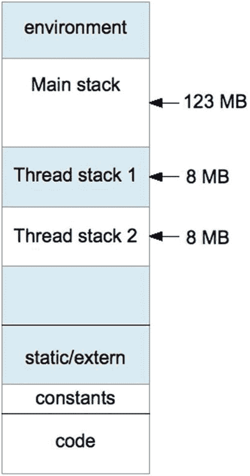

# 六、中央处理器

自从第一个 B 型和 A 型后继者以来，已经出现了几个树莓派的型号。在本章中，将介绍 ARM 架构以及您的 Pi 所支持的 CPU 特性。然后将介绍用于管理应用程序中 CPU 的 Linux API(应用程序编程接口)(线程)。

## /proc/cpuinfo

Raspbian Linux 在`/proc/cpuinfo`提供了一个不错的字符设备，用来列出关于你的 CPU 的信息。清单 [6-1](#PC1) 中提供了一个取自树莓 Pi 3 型号 B+的样本。您不需要 root 访问权限来读取这些信息。

```sh
$ cat /proc/cpuinfo
processor        : 0
model name       : ARMv7 Processor rev 4 (v7l)
BogoMIPS         : 38.40
Features         : half thumb fastmult vfp edsp neon vfpv3 tls vfpv4 \ idiva idivt vfpd32 lpae evtstrm crc32
CPU implementer  : 0x41
CPU architecture : 7
CPU variant      : 0x0
CPU part         : 0xd03
CPU revision     : 4
...
Hardware         : BCM2835
Revision         : a020d3
Serial           : 00000000d4b81de4

Listing 6-1Session output listing /proc/cpuinfo on a Raspberry Pi 3 model B+

```

有四组处理器标识为 0 到 3(图中只显示了第一组)。文件底部列出了硬件、版本和序列号。

处理器组中有一行标记为“型号名称”在本例中，我们看到列出了“ARMv7 处理器版本 4 (v7l)”。同样在底部，列出了值为“BCM2835”的“硬件”。让我们花点时间来讨论一下架构名称的含义。

## ARM 架构

架构是一种设计。在这种情况下，它定义了 ARM 程序员的模型，包括寄存器、寻址、存储器、异常和操作的所有方面。在 Raspberry Pi 环境中，使用了不同的 ARM 架构，如表 [6-1](#Tab1) 所列。

表 6-1

Raspberry Pi ARM 架构和实现

<colgroup><col class="tcol1 align-left"> <col class="tcol2 align-left"> <col class="tcol3 align-left"> <col class="tcol4 align-left"></colgroup> 
| 

架构名称

 | 

总线尺寸

 | 

指令集

 | 

社会学

 |
| --- | --- | --- | --- |
| ARMv6Z 战斗机 | 32 位 | 手臂和拇指(16 位) | BCM2835 |
| ARMv7-A 战斗机 | 32 位 | 手臂和拇指(16 位) | BCM2836 |
| ARMv8-A 突击步枪 | 32/64 位 | AArch32(与 ARMv7-A 兼容)和 AArch64 执行状态。 | BCM2837 |

总线尺寸和指令集列中总结了设计和一般功能。每一种新的架构都为指令集和其他处理器特性增加了新的功能。

SoC(片上系统)列标识了 Broadcom 架构的*实现*。

新的 ARMv8-A 架构有两种可能的运行状态:

*   AArch32，与 ARMv7-A 架构兼容。

*   AArch64，采用全新 ARM 64 位指令集。

执行状态必须在系统启动时选择，这就是为什么 Raspbian Linux 在 Raspberry Pi 3 模型 B+上报告以下内容:

```sh
$ uname -m
armv7l

```

它运行 AArch32 执行状态，以便与 32 位 Raspbian Linux 代码兼容。希望有一天，我们能看到真正的 64 位 Raspbian Linux。

### 建筑后缀

较新的架构有一个后缀来标识 Cortex 系列:

*   “A”代表 Cortex-一系列*应用*处理器。

*   “R”代表 Cortex-R 系列的*实时*处理器。

*   “M”代表 Cortex-M 系列低功耗、*微控制器*处理器。

在架构名称 ARMv7-A 或 ARMv8-A 中，我们看到它们属于应用处理器系列。这些是完全有能力的成员，而 Cortex-R 和 Cortex-M 家族通常是子集或专门从事少数领域。

## 特征

再次查看/proc/cpuinfo 输出，注意标有“Features”的那一行。它有一个识别特征的名称列表，这些特征对于 CPU(中央处理器)是唯一的。表 [6-2](#Tab2) 列出了一些你可能会看到的手臂特征。

表 6-2

可能在/proc/cpuinfo 中列出的 ARM 特性

<colgroup><col class="tcol1 align-left"> <col class="tcol2 align-left"></colgroup> 
| 

功能名称

 | 

描述

 |
| --- | --- |
| 一半 | 半字加载和存储 |
| 拇指 | 16 位 Thumb 指令集支持 |
| 法斯特穆特 | 32x32 产生 64 位乘法支持 |
| 心室充盈压 | 早期 SIMD 向量浮点指令 |
| 处理器 | DSP 扩展 |
| 氖 | 高级 SIMD/氖支持 |
| vfpv3 | VFP 版本 3 支持 |
| 坦克激光瞄准镜（Tank Laser-Sight 的缩写） | TLS 寄存器 |
| vfpv4 | 具有快速上下文切换的 VFP 版本 4 |
| 伊迪瓦 | ARM 模式下的 SDIV 和 UDIV 硬件部门 |
| idivt | Thumb 模式下的 SDIV 和 UDIV 硬件部门 |
| vfpd32 | 具有 32 个 D 寄存器的 VFP |
| LPA(巴勒) | 大型物理地址扩展(32 位架构上的 4 GB 以上物理内存) |
| evtstrm | 使用通用架构定时器的内核事件流 |
| crc32 | CRC-32 硬件加速支持 |

## 执行环境

与 CPU 的概念相联系的是程序执行本身。在查看程序执行之前，先从高层次上了解一下执行上下文。图 [6-1](#Fig1) 显示了正在执行的程序的运行环境。



图 6-1

程序执行上下文

在地址空间的最低端是包含程序代码的“文本”区域。虚拟内存的这个区域是只读的，除了可执行代码之外，它还保存只读的程序常量。

下一个区域(地址递增)包含未初始化数组、缓冲区、静态 C 变量和`extern`存储的块。

在内存的高端是程序的环境变量，比如`PATH`。通过使用`getenv("PATH")`并打印返回的地址，您可以很容易地检查这一点。它的地址可能是您的 Raspberry Pi 应用程序中最高的地址，除非是另一个环境变量。

在此之下，主程序的堆栈开始向下增长。每个函数调用都会导致在当前堆栈框架下创建一个新的堆栈框架。

如果你现在给程序添加一个线程，就必须为它分配一个新的堆栈。在 Pi 上的实验表明，第一个线程堆栈是在主堆栈的起点以下大约 123 MB 处创建的。第二个线程的堆栈分配比第一个线程低大约 8 MB。每个新线程的堆栈(默认情况下)被分配 8 MB 的堆栈空间。

动态分配的内存是从位于`static` / `extern`区域和堆栈底端之间的*堆*中分配的。

## 线

每个程序都有一个主执行线程。但是有时需要多线程的性能优势，尤其是在具有四个内核的 Pi 上。

### pthread 标题

所有`pthread`函数都需要以下头文件:

```sh
#include <pthread.h>

```

当使用`pthreads`链接程序时，添加链接器选项:

*   `-lpthread`

*   `to`链接 pthread 库。

### pthread 错误处理

pthread 例程成功时返回零，失败时*返回错误代码*。值`errno`是用于这些调用的*而不是*。

这背后的原因可能是人们认为传统的 Unix `errno`方法将在不久的将来被淘汰(那时 POSIX 线程正在被标准化)。`errno`的最初用途如下:

```sh
extern int errno;

```

然而，这种方法不适用于线程程序。想象两个线程同时用`open(2)`打开文件，失败时设置`errno`值。两个线程不能共享同一个`errno`的`int`值。

与其以这种方式改变大量已经使用`errno`的代码，不如实现其他方法，为每个线程提供自己的私有`errno`副本。这就是今天使用`errno`的程序必须包含头文件`errno.h`的原因之一。头文件负责定义对`errno`的线程特定引用。

因为 pthread 标准是在`errno`解决方案普遍出现之前开发的，所以 pthread 库直接返回错误代码，成功时返回零。如果今天要重写 Unix，所有的系统调用可能都是这样的。

### pthread_create(3)

函数`pthread_create(3)`用于创建一个新的执行线程。函数调用看起来比实际情况更令人畏惧:

```sh
int pthread_create(
  pthread_t ∗thread,
  const pthread_attr_t ∗attr,
  void ∗(∗start_routine)(void ∗),
  void ∗arg
);

```

对`pthread_create(3)`的调用创建了一个新的堆栈，设置了寄存器，并执行其他内务处理。让我们来描述一下论点:

<colgroup><col class="tcol1 align-left"> <col class="tcol2 align-left"></colgroup> 
| 

错误

 | 

描述

 |
| --- | --- |
| 再一次 | 资源不足，无法创建另一个线程，或者遇到了系统对线程数量的限制。 |
| 埃因瓦尔 | 属性中的设置无效。 |
| 草莓！草莓 | 没有权限设置在属性中指定的调度策略和参数。 |

*   `thread`:第一个参数只是一个指向`pthread_t`变量的指针，用来接收创建的线程的 ID 值。ID 值允许您查询和控制创建的线程。如果调用成功，线程 ID 将返回给调用程序。

*   `attr`:这是一个指向提供各种选项和参数的`pthread_attr_t`属性对象的指针。如果您可以接受默认值，只需提供零或`NULL`。

*   `start_routine`:如下面的代码所示，这只是一个接受空指针并返回空指针的开始例程的名称。

*   `arg`:这个通用指针被传递给`start_routine`。它可能指向线程函数感兴趣的任何东西(`start_routine`)。通常这是一个包含值的结构，或者在 C++程序中，它可以是一个对象的指针。如果不需要参数值，则提供零(或`NULL`)。

*   `returns`:功能成功返回零；否则，返回错误号(不在`errno`中)。

参数 3 的 C 语言语法对于初学 C 的程序员来说有点讨厌。让我们展示参数 3 的函数是什么样子的:

```sh
void ∗
start_routine(void ∗arg) {
    ...
    return some_ptr;
}

```

下面可能是最简单的线程创建示例:

```sh
static void ∗
my_thread(void ∗arg) {
    ...                                    // thread execution
    return 0;
}

int
main(int argc, char ∗∗argv) {
    pthread_t tid;                         // Thread   ID
    int rc;

    rc = pthread_create(&tid,0,my_thread,0);
    assert(!rc);

```

此示例不使用线程属性(参数 2 为零)。我们也不关心传入`my_thread()`的值，所以参数 4 被提供了一个零。参数 3 只需要告诉系统调用执行什么函数。如果线程成功创建(由`assert(3)`宏测试)，则`rc`的值将为零。

此时，主线程和函数`my_thread()`并行执行。因为 Raspberry Pi 上只有一个 CPU，所以在任何时刻都只有一个 CPU 执行。但是它们同时执行，以抢先的方式交换执行时间块。当然，每个都使用自己的堆栈运行。

线程`my_thread()`通过返回。

### pthread_attr_t

有几个线程属性可以获取和设置。为了使这个速成课程简短，您将只看可能是最重要的属性(堆栈大小)。有关属性和函数的完整列表，可以查看手册页:

```sh
$ man pthread_attr_init

```

要初始化一个新的属性，或者释放一个先前初始化的 pthread 属性，使用这一对例程:

<colgroup><col class="tcol1 align-left"> <col class="tcol2 align-left"></colgroup> 
| 

错误

 | 

描述

 |
| --- | --- |
| 伊诺梅 | 资源(内存)不足 |

*   `attr`:初始化/销毁的`pthread_attr_t`变量的地址

*   `returns`:成功时为零，失败时为错误代码(不在`errno`中)

```sh
int pthread_attr_init(pthread_attr_t ∗attr);
int pthread_attr_destroy(pthread_attr_t ∗attr);

```

`pthread_attr_init(3)`的 Linux 实现可能永远不会返回`ENOMEM`错误，但是其他 Unix 平台可能会。

以下是创建和销毁属性对象的简单示例:

```sh
pthread_attr_t attr;

pthread_attr_init(&attr);    // Initialize attr
...
pthread_attr_destroy(&attr); // Destroy attr

```

线程最重要的属性之一可能是堆栈大小属性:

*   `attr`:指向要从中获取值或在其中建立属性的属性的指针。

*   `stacksize`:设置属性时的栈大小值，取栈大小时指向接收`size_t`变量的指针。

*   `returns`:如果调用成功，返回零；否则，返回错误号(不在`errno`中)。

```sh
int pthread_attr_setstacksize(pthread_attr_t *attr, size_t stacksize);
int pthread_attr_getstacksize(pthread_attr_t *attr, size_t *stacksize);

```

`pthread_attr_setstacksize(3)`可能出现以下错误:

<colgroup><col class="tcol1 align-left"> <col class="tcol2 align-left"></colgroup> 
| 

错误

 | 

描述

 |
| --- | --- |
| 埃因瓦尔 | 堆栈大小小于 PTHREAD_STACK_MIN (16，384)字节。 |

Linux 手册页进一步指出:

> *在某些系统上，如果堆栈大小不是系统页面大小的倍数，*pthread _ attr _ setstacksize()*可能会失败，并出现错误* EINVAL *。*

以下简单示例获取系统默认堆栈大小，并将其增加 8 MB:

```sh
pthread_attr_t attr;
size_t         stksiz;

pthread_attr_init(&attr);                     // Initialize attr
pthread_attr_getstacksize (&attr,&stksiz);    // Get stack size
stksiz  += 8 ∗ 1024 ∗ 1024;                   // Add 8 MB
pthread_attr_setstacksize(&attr,stksiz);      // Set stack size

```

系统默认值由`attr`的初始化提供。然后就是从`attr`对象中“获取”一个值，然后在对`pthread_attr_setstacksize()`的调用中放入一个新的堆栈大小。

注意，这组操作只是简单地准备了属性对象`attr`用于`pthread_create()`调用。实际创建线程时，该属性在新线程中生效:

```sh
pthread_attr_t attr;

...
rc = pthread_create(&tid,&attr,my_thread,0);

```

### pthread_join(3)

在前面的`pthread_create()`示例中，主程序创建了`my_thread()`并开始执行它。在某个时刻，主程序将要结束，想要退出(或返回)。如果主程序在`my_thread()`完成前退出，整个进程和其中的线程都会被破坏，即使它们还没有完成。

为了使主程序等待直到线程完成，使用函数`pthread_join(3)`:

*   `thread`:要连接的螺纹的螺纹 ID。

*   `retval`:指向`void *`变量的指针，用于接收返回值。如果您对返回值不感兴趣，可以给该参数提供零(或`NULL`)。

*   `returns`:函数成功返回零；否则，返回错误号(不在`errno`中)。

```sh
int pthread_join(pthread_t thread, void **retval);

```

下面的例子增加了`pthread_join(3)`，这样主程序直到`my_thread()`退出后才退出。

```sh
int
main(int argc,char ∗∗argv) {
      pthread_t tid;                            // Thread ID
      void ∗retval = 0;                         // Returned value pointer
      int rc;

      rc = pthread_create(&tid,0,my_thread,0);
      assert(!rc);
      rc = pthread_join(tid,&retval);           // Wait for my_thread()
      assert(!rc);
      return 0;
}

```

### pthread_detach(3)

函数`pthread_join(3)`使调用者等待，直到指示的线程返回。然而，有时一个线程被创建后就不再被检查了。当该线程退出时，它的一些资源被保留，以允许对它进行连接操作。如果永远不会有连接，那么最好在线程退出时将其遗忘，并立即释放其资源。

`pthread_detach(3)`函数用于指示在指定的线程上不会执行任何连接。这样，命名线程就被配置为在退出时自动释放自己。

```sh
int pthread_detach(pthread_t thread);

```

参数和返回值如下:

<colgroup><col class="tcol1 align-left"> <col class="tcol2 align-left"></colgroup> 
| 

错误

 | 

描述

 |
| --- | --- |
| 埃因瓦尔 | 线程不是可连接的线程。 |
| esrsch(欧洲核子研究中心) | 找不到 ID 为 thread 的线程。 |

*   `thread`:要改变的线程的线程 ID，以便它在完成时不会等待加入。它的资源将在指定线程终止时立即释放。

*   `returns`:如果呼叫成功，则为零；否则返回错误代码(不在`errno`中)。

`pthread_detach`函数只需要线程 ID 值作为它的参数:

```sh
pthread_t tid;             // Thread ID
int rc;

rc = pthread_create(&tid,0,my_thread,0);
assert(!rc);
pthread_detach(tid);      // No joining with this thread

```

### pthread_self(3)

有时候，在一段代码中找出当前的*线程 ID 是什么是很方便的。`pthread_self(3)`功能是这项工作的合适工具:*

```sh
pthread_t pthread_self(void);

```

此处显示了其使用示例:

```sh
pthread_t tid;

tid = pthread_self();

```

### pthread_kill(3)

`pthread_kill(3)`函数允许调用者向另一个线程发送信号。线程信号的处理超出了本文的范围。但是这个函数有一个非常有用的应用，我们很快就会看到:

```sh
#include <signal.h>

int pthread_kill(pthread_t thread, int sig);

```

注意，函数原型和信号定义需要`signal.h`的头文件。

<colgroup><col class="tcol1 align-left"> <col class="tcol2 align-left"></colgroup> 
| 

错误

 | 

描述

 |
| --- | --- |
| 埃因瓦尔 | 指定了无效信号。 |
| esrsch(欧洲核子研究中心) | 找不到 ID 为 thread 的线程。 |

*   `thread`:这是你要发信号(或测试)的线程 ID。

*   这是你想发出的信号。或者，提供零来测试线程是否存在。

*   `returns`:如果调用成功，返回零，或者返回一个错误代码(不在`errno`)。

函数的一个有用的应用是测试另一个线程是否存在。如果`sig`参数被设置为 0，则不会传递实际信号，但仍会执行错误检查。如果函数返回零，你知道线程仍然*存在*。

但是当线程存在的时候意味着什么呢？是不是说现在还是*在执行*？还是意味着它没有作为`pthread_join(3)`的一部分被回收，或者作为`pthread_detach(3)`清理的结果？

原来，当线程*存在*时，意味着它还在执行。换句话说，它*还没有从启动的线程函数中返回*。如果线程已经返回，则认为它不能接收信号。

基于此，您知道当线程仍在执行时，您将得到一个零返回。当返回错误代码`ESRCH`时，您知道线程已经完成。

## 互斥体

虽然严格来说互斥锁不是 CPU 的主题，但它与线程的讨论是分不开的。一个*互斥体*是一个锁定装置，它允许软件设计者停止一个或多个线程，而另一个线程正在处理一个共享资源。换句话说，一个线程接收独占访问。这是促进线程间通信所必需的。我在这里将简单地描述互斥 API，而不是互斥应用背后的理论。

### pthread_mutex_create(3)

互斥体通过对`pthread_mutex_init(3)`的系统调用进行初始化:

<colgroup><col class="tcol1 align-left"> <col class="tcol2 align-left"></colgroup> 
| 

错误

 | 

描述

 |
| --- | --- |
| 再一次 | 系统缺少必要的资源(内存除外)来初始化另一个互斥体。 |
| 伊诺梅 | 内存不足，无法初始化互斥体。 |
| 草莓！草莓 | 调用方没有执行该操作的权限。 |
| 电子布西 | 该实现检测到有人试图重新初始化 mutex 引用的对象，mutex 是以前初始化过但尚未销毁的 mutex。 |
| 埃因瓦尔 | attr 指定的值无效。 |

*   `mutex`:指向要初始化的`pthread_mutex_t object`的指针。

*   `attr`:指向`pthread_mutexattr_t`对象的指针，描述互斥选项。如果您可以接受默认值，请提供零(或`NULL`)。

*   `returns`:如果调用成功，返回零；否则，返回错误代码(不在`errno`中)。

```sh
int pthread_mutex_init(
    pthread_mutex_t ∗mutex,
    const pthread_mutexattr_t ∗attr
);

```

这里提供了一个互斥体初始化的示例:

```sh
pthread_mutex_t mutex;
int rc;

rc = pthread_mutex_init(&mutex,0);
assert (!rc);

```

### pthread_mutex_destroy(3)

当应用程序不再需要互斥体时，它应该使用`pthread_mutex_destroy(3)`来释放它的资源:

<colgroup><col class="tcol1 align-left"> <col class="tcol2 align-left"></colgroup> 
| 

错误

 | 

描述

 |
| --- | --- |
| 电子布西 | 互斥体被锁定或与`pthread_cond_wait(3)`或`pthread_cond_timedwait(3)`一起使用。 |
| 埃因瓦尔 | 互斥体指定的值无效。 |

*   `mutex`:要释放资源的互斥体的地址。

*   `returns`:成功返回零，失败返回错误码(不在`errno`)。

```sh
pthread_mutex_t mutex ;
int rc;

...
rc = pthread_mutex_destroy(&mutex);
assert(!rc);

```

### pthread_mutex_lock(3)

当一个线程需要独占访问一个资源时，它必须锁定该资源的互斥体。只要协作线程遵循相同的先锁定过程，它们就不能同时访问共享对象。

<colgroup><col class="tcol1 align-left"> <col class="tcol2 align-left"></colgroup> 
| 

错误

 | 

描述

 |
| --- | --- |
| 埃因瓦尔 | 互斥体是用值为 PTHREAD_PRIO_PROTECT 的协议属性创建的，调用线程的优先级高于互斥体的当前优先级上限。或者互斥体指定的值没有引用初始化的互斥体对象。 |
| 再一次 | 已超过互斥体的最大递归锁数。 |
| EDEADLK | 当前线程已经拥有互斥体。 |

*   `mutex`:指向要锁定的互斥体的指针。

*   `returns`:如果互斥锁成功，返回零；否则返回错误代码(不在`errno`中)。

```sh
int pthread_mutex_lock(pthread_mutex_t ∗mutex);

```

下面显示了正在调用的函数:

```sh
pthread_mutex_t mutex;
int rc;

...
rc = pthread_mutex_lock(&mutex);

```

### pthread_mutex_unlock(3)

当不再需要对资源的独占访问时，互斥体被解锁:

<colgroup><col class="tcol1 align-left"> <col class="tcol2 align-left"></colgroup> 
| 

错误

 | 

描述

 |
| --- | --- |
| 埃因瓦尔 | mutex 指定的值没有引用初始化的 mutex 对象。 |
| 草莓！草莓 | 当前线程不拥有互斥体。 |

*   `mutex`:指向要解锁的互斥体的指针。

*   `returns`:如果互斥锁解锁成功，返回零；否则返回错误代码(不在`errno`中)。

```sh
int pthread_mutex_unlock(pthread_mutex_t ∗mutex);

```

这里提供了一个解锁互斥体的简单示例:

```sh
pthread_mutex_t mutex;
int rc;

...
rc = pthread_mutex_unlock(&mutex);

```

## 条件变量

有时，互斥体本身不足以在不同线程之间高效地调度 CPU。互斥体和条件变量经常一起使用来促进线程间的通信。起初，新来者可能会对这个概念感到困惑。

当我们有互斥时，为什么我们需要条件变量？

考虑在构建一个最多可以容纳八个项目的软件队列时需要做些什么。在我们对某些东西进行排队之前，我们需要首先查看队列是否已满。但是在我们锁定队列之前，我们无法测试它——否则，另一个线程可能会在我们眼皮底下改变事情。

所以我们锁定了队列，但是发现它已经满了。我们现在要干嘛？我们只是解锁并再试一次吗？这是可行的，但是会浪费 CPU 时间。如果我们有某种方法在队列不再满的时候得到提醒，那不是更好吗？

条件变量与互斥体和“信号”(各种类型)协同工作。用伪代码的术语来说，试图将一个项目放入队列的程序将执行以下步骤:

1.  锁定互斥锁。在锁定队列之前，我们无法检查队列中的任何内容。

2.  检查队列的容量。我们能在里面放一个新项目吗？如果是这样:
    1.  将新项目放入队列中。

    2.  解锁并退出。

3.  如果队列已满，则执行以下步骤:
    1.  使用一个条件变量，用相关的互斥体“等待”它。

    2.  当控制从等待中返回时，返回到步骤 2。

条件变量对我们有什么帮助？考虑以下步骤:

1.  互斥体被锁定(1)。

2.  执行等待(3a)。这将导致内核执行以下操作:
    1.  将调用线程置于睡眠状态(置于内核等待队列中)。

    2.  解锁在步骤 1 中锁定的互斥锁。

在步骤 2b 中解锁互斥体是必要的，以便另一个线程可以对队列做一些事情(希望从队列中取出一个条目，这样它就不再满了)。如果互斥锁保持锁定，那么没有线程能够移动。

在未来的某个时间点，另一个线程将执行以下操作:

1.  锁定互斥体。

2.  在队列中查找条目(当前队列已满)，并从中取出一个条目。

3.  解锁互斥体。

4.  向“服务员”正在使用的条件变量发出信号，以便它能够被唤醒。

等待线程随后醒来:

1.  内核让“等待”线程准备就绪。

2.  互斥体被成功重新锁定。

一旦该线程在互斥锁被锁定的情况下醒来，它就可以重新检查队列，看看是否有空间对某个项目进行排队。注意，只有当线程已经重新获得互斥锁时，它才会被唤醒。这就是为什么条件变量在使用时与互斥体成对出现的原因。

### pthread_cond_init(3)

像任何其他对象一样，条件变量需要初始化:

<colgroup><col class="tcol1 align-left"> <col class="tcol2 align-left"></colgroup> 
| 

错误

 | 

描述

 |
| --- | --- |
| 再一次 | 该系统缺乏必要的资源。 |
| 伊诺梅 | 内存不足，无法初始化条件变量。 |
| 电子布西 | 实现检测到有人试图重新初始化 cond 引用的对象，cond 是一个先前已初始化但尚未销毁的条件变量。 |
| 埃因瓦尔 | attr 指定的值无效。 |

*   `cond`:指向要初始化的`pthread_cond_t`结构的指针。

*   `attr`:指向`cond`变量属性的指针，如果提供了一个变量属性，则提供零(或`NULL`)。

*   `returns`:如果调用成功，返回零；否则返回错误代码(不在`errno`中)。

```sh
int pthread_cond_init(
  pthread_cond_t             ∗cond,
  const pthread_condattr_t   ∗attr
);

```

### pthread_cond_destroy(3)

当不再需要条件(`cond`)变量时，应通过以下调用释放其资源:

<colgroup><col class="tcol1 align-left"> <col class="tcol2 align-left"></colgroup> 
| 

错误

 | 

描述

 |
| --- | --- |
| 电子布西 | 检测到试图销毁 cond 引用的对象，而该对象正被另一个线程中的 pthread_cond_wait()或 pthread_cond_timedwait()引用。 |
| 埃因瓦尔 | cond 指定的值无效。 |

*   `cond`:待释放的条件变量。

*   `returns`:如果呼叫成功，则为零；否则，返回错误代码(不在`errno`中)。

```sh
int pthread_cond_destroy(pthread_cond_t ∗cond);

```

### pthread_cond_wait(3)

这个函数是队列解决方案的一半。调用`pthread_cond_wait(3)`函数时互斥体已经被锁定。然后内核会让调用线程休眠(在等待队列上)来释放 CPU，同时解锁互斥体。调用线程保持阻塞状态，直到条件变量`cond`以某种方式发出信号(稍后将详细介绍)。

当线程被内核唤醒时，系统调用返回互斥锁。此时，线程可以检查应用程序的条件(比如队列长度),如果情况良好就继续执行，或者再次调用`pthread_cond_wait(3)`继续等待。

<colgroup><col class="tcol1 align-left"> <col class="tcol2 align-left"></colgroup> 
| 

错误

 | 

描述

 |
| --- | --- |
| 埃因瓦尔 | cond，mutex 指定的值无效。或者为同一条件变量上的并发 pthread_cond_timedwait()或 pthread_cond_wait()操作提供了不同的互斥体。 |
| 草莓！草莓 | 在调用时，互斥体不属于当前线程。 |

*   `cond`:指向用于唤醒调用的条件变量的指针。

*   `mutex`:指向与条件变量相关联的互斥体的指针。

*   `returns`:成功返回零；否则返回错误代码(不在`errno`中)。

```sh
int pthread_cond_wait(pthread_cond_t *cond, pthread_mutex_t *mutex);

```

下面的代码片段显示了排队函数如何使用它。(假设初始化`mutex`和`cond`。)

```sh
pthread_mutex_t mutex;
pthread_cond_t cond;

...
pthread_mutex_lock(&mutex);

while ( queue.length >=max_length )
    pthread_cond_wait(&cond,&mutex);

// queue the item
...
pthread_mutex_unlock(&mutex);

```

`while`循环重试测试以查看队列是否“未满”当多个线程插入到队列中时,`while`循环是必要的。根据时间的不同，另一个线程可能会比当前线程先排队一个项目，使队列再次变满。

### pthread_cond_signal(3)

当从队列中取出一个条目时，需要一种机制来唤醒试图将一个条目放入整个队列的线程。一个唤醒选项是`pthread_cond_signal(3)`系统调用:

<colgroup><col class="tcol1 align-left"> <col class="tcol2 align-left"></colgroup> 
| 

错误

 | 

描述

 |
| --- | --- |
| 埃因瓦尔 | cond 值不是指初始化的条件变量。 |

*   `cond`:指向用于向一个线程发送信号的条件变量的指针。

*   `returns`:如果函数调用成功，返回零；否则，返回错误号(不在`errno`中)。

```sh
int pthread_cond_signal(pthread_cond_t ∗cond);

```

如果没有其他线程在等待，那么这就不是错误。但是，如果一个或多个线程正在等待指定的条件变量，此函数会唤醒一个等待线程。

如果发出一个线程将“工作”的信号，那么出于*性能*的原因，这个调用是首选的当存在一些特殊情况，一些线程可能成功，而另一些可能失败时，您需要一个*广播*调用来代替。当它可以使用时，唤醒*一个*线程可以节省 CPU 周期。

### pthread_cond_broadcast(3)

这是`pthread_cond_signal(3)`的广播变体。如果多个服务员有不同的测试，应该使用广播让*所有*服务员醒来并考虑发现的情况。

<colgroup><col class="tcol1 align-left"> <col class="tcol2 align-left"></colgroup> 
| 

错误

 | 

描述

 |
| --- | --- |
| 埃因瓦尔 | cond 值不是指初始化的条件变量。 |

*   `cond`:指向条件变量的指针，条件变量*被*发信号，唤醒*所有*等待线程。

*   `returns`:调用成功返回零；否则，返回错误号(不在`errno`中)。

```sh
int pthread_cond_broadcast(pthread_cond_t ∗cond);

```

没有服务员的时候广播是*不是*错误。

## 摘要

本章介绍了 CPU 是一种有待开发的资源。描述了/proc/cpuinfo 驱动程序，它提供了您的 CPU 能力(和处理器数量)的快速摘要。

还介绍了 ARM 架构，让您了解架构与实现的不同，例如，BCM2837 是 Broadcom 对 ARMv8-A 架构的实现。对于 C 程序员来说，本章以对 Linux 支持的 pthread API 的快速浏览结束。