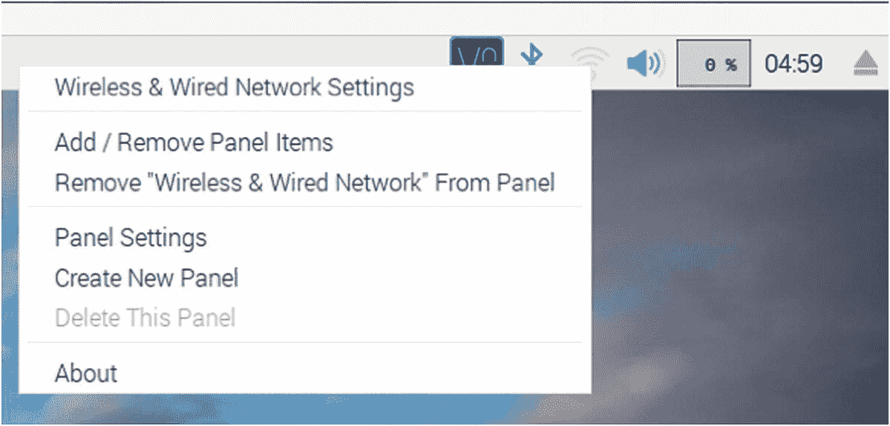
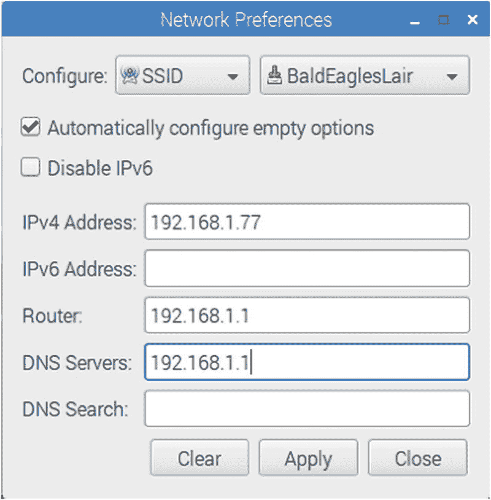
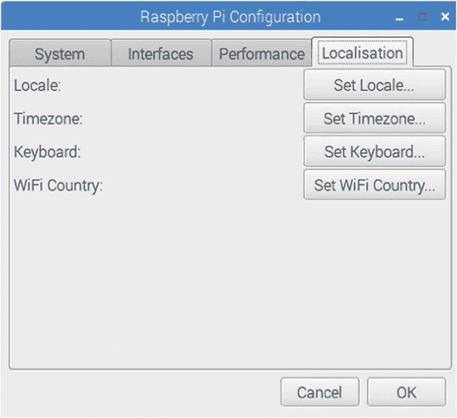
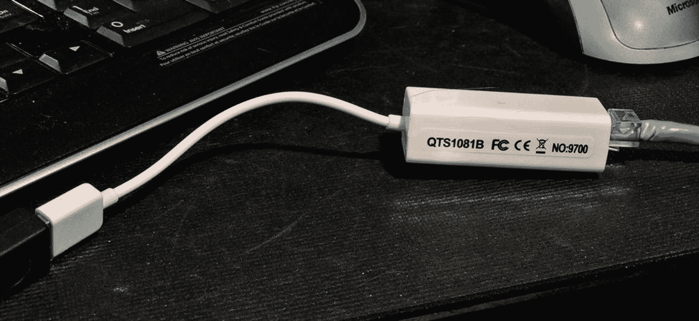

# 八、以太网

无论是有线还是无线，网络已经成为日常生活的重要组成部分。在您的 Raspberry Pi 上安装一个网络适配器可以让您连接到它，并在您的台式机或笔记本电脑上舒适地工作。它还允许 Pi 上的应用与外界通信。即使当 Raspberry Pi 作为嵌入式项目的一部分部署时，网络接口仍然会继续发光。远程日志和控制只是几个例子。

## 有线以太网

标准 Raspbian SD 卡映像提供有线网络连接，使用 DHCP(动态主机配置协议)自动为其分配 IP 地址。如果您使用 HDMI 输出和键盘设备在 Pi 上工作，动态分配的 IP 地址不是问题。但是，如果您想去掉附加的显示器和键盘，并进行“无头”操作，那么通过网络连接到 Pi 是很有吸引力的。唯一的问题是 DHCP 分配的 IP 地址可能会改变。

DHCP 不会总是使用不同的 IP 地址，因为它会暂时向 T2 出租该地址。但是动态分配的地址使得当它改变时很难从另一台计算机连接到您的 Raspberry Pi。正如在第 [2](02.html) 章中所讨论的，您可以使用`nmap`命令来扫描它，但是这并不方便(这个例子来自 Devuan Linux):

```sh
root@devuan:~# nmap -sP 192.168.1.1-250

Starting Nmap 6.47 ( http://nmap.org ) at 2018-06-01 19:59 EDT
Nmap scan report for 192.168.1.1
Host is up (0.00026s latency).
MAC Address: C0:FF:D4:95:80:04 (Unknown)
Nmap scan report for 192.168.1.12
Host is up (0.044s latency).
MAC Address: 00:1B:A9:BD:79:12 (Brother Industries)
Nmap scan report for 192.168.1.77
Host is up (0.15s latency).
MAC Address: B8:27:EB:ED:48:B1 (Raspberry Pi Foundation)
Nmap scan report for 192.168.1.121
Host is up (0.00027s latency).
MAC Address: 40:6C:8F:11:8B:AE (Apple)
Nmap scan report for 192.168.1.89
Host is up.
Nmap done: 250 IP addresses (4 hosts up) scanned in 7.54 seconds
root@devuan:~#

```

如果您在学校或离家在外使用您的 Pi，使用 DHCP 可能仍然是您的最佳选择。如果你在旅行时将它接入不同的网络，DHCP 会正确设置你的 IP 地址，*会负责域名服务器配置*。但是，如果您在家里使用您的设备，或者您的学校可以为您分配一个有效的 IP 地址，静态 IP 地址可以简化访问。

### 注意

确保获得批准并分配 IP 地址，以防止网络冲突。

### 静态有线地址

设置静态有线以太网地址的最简单方法是使用图形桌面并打开“无线和有线网络设置”对话框这可以通过右键单击扬声器图标左侧的 WIFI 图标在屏幕右上角找到。图 [8-1](#Fig1) 所示。



图 8-1

包含“无线和有线网络设置”对话框的弹出式菜单

选择并单击“无线和有线网络设置”应该会出现如图 [8-2](#Fig2) 所示的对话框。


图 8-2

“网络首选项”对话框

要配置有线接口，请选择“接口”，然后选择“eth0”。如果你愿意，让“自动配置空选项”保持选中状态，就像我在图中所做的那样。填写您的地址、路由器和 DNS 服务器信息，点击“应用”，然后点击“关闭”此操作更新了什么？以下行将被附加到文件/etc/dhcpcd.conf 中:

```sh
interface eth0
inform 192.168.1.177
static routers=192.168.1.1
static domain_name_servers=192.168.1.1

```

建立这些设置后，有线以太网端口应自动分配静态 IP 地址`192.168.1.177`,在本例中。

## 无线配置

无线网络接口的配置方式与有线适配器类似。调出您在图 [8-2](#Fig2) 中看到的对话框，除了您将选择“SSID”而不是“接口”图 [8-3](#Fig3) 显示无线配置对话框。



图 8-3

无线配置对话框

在“SSID”的右侧，选取您想要加入的无线网络。单击应用，然后单击关闭。完成此操作后，文件/etc/dhcpcd.conf 将更新为:

```sh
SSID BaldEaglesLair
inform 192.168.1.77
static routers=192.168.1.1
static domain_name_servers=192.168.1.1

```

### 疯狂的

图形对话框工作很好，除了如果您重复无线网络的配置，您将在文件的底部得到添加的条目。如果同一个 SSID 的多个设置发生冲突，您的无线网络可能永远无法工作。如果是这种情况，您需要编辑文件以删除冲突的重复项:

```sh
# sudo -i
# nano /etc/dhcpcd.conf

```

### WIFI 国家

如果您还没有这样做，请确保您的 WIFI 国家已正确配置。从桌面左上方的树莓下拉菜单中选择“首选项”，然后选择“树莓 Pi 配置”点击图 [8-4](#Fig4) 中所示的“本地化”标签。



图 8-4

带有 WIFI 国家设置的“本地化”选项卡

一旦有，这是一个简单的事情，点击“设置 WIFI 国家”选择您的国家。这是一个重要的配置项目，因为它决定了您所在国家的无线 LAN(局域网)适配器的合法工作频率。

### 测试静态 IP 地址

一旦你配置好了，最简单的事情就是重启你的 Raspberry Pi 让新的设置生效。通常，图形对话框会让您的更改几乎立即生效。

一个好的手动检查是使用`ifconfig`命令:

```sh
$ ifconfig eth0
eth0: flags=4163<UP,BROADCAST,RUNNING,MULTICAST>  mtu 1500
        inet 192.168.1.177  netmask 255.255.255.0  broadcast 192.168.1.255
        inet6 fe80::8cc8:d1d2:61ba:d377  prefixlen 64  scopeid 0x20<link>
        ether b8:27:eb:b8:1d:e4  txqueuelen 1000  (Ethernet)
        RX packets 10505  bytes 900810 (879.6 KiB)
        RX errors 0  dropped 0  overruns 0  frame 0
        TX packets 26412  bytes 14866204 (14.1 MiB)
        TX errors 0  dropped 0 overruns 0  carrier 0  collisions 0

```

由此您可以看到有线网络适配器的 IP 地址配置如下:

```sh
inet 192.168.1.177  netmask 255.255.255.0  broadcast 192.168.1.255

```

同样，您可以检查无线适配器:

```sh
$ ifconfig wlan0
wlan0: flags=4163<UP,BROADCAST,RUNNING,MULTICAST>  mtu 1500
        inet 192.168.1.77  netmask 255.255.255.0  broadcast 192.168.1.255
        inet6 fe80::dd0c:a1af:9a22:a0c0  prefixlen 64  scopeid 0x20<link>
        ether b8:27:eb:ed:48:b1  txqueuelen 1000  (Ethernet)
        RX packets 24977  bytes 1777643 (1.6 MiB)
        RX errors 0  dropped 0  overruns 0  frame 0
        TX packets 6924  bytes 7627770 (7.2 MiB)
        TX errors 0  dropped 0 overruns 0  carrier 0  collisions 0

```

现在让我们检查一下名字是*解析*。通常，我会推荐使用`nslookup`或`dig`命令，但是 Raspbian 上没有预装这两个命令。所以让我们使用`ping`命令:

```sh
$ ping -c 1 google.com
PING google.com (172.217.0.238) 56(84) bytes of data.
64 bytes from yyz10s03-in-f14.1e100.net (172.217.0.238): icmp_seq=1 ttl=55 time=17.9 ms

--- google.com ping statistics ---
1 packets transmitted, 1 received, 0% packet loss, time 0ms
rtt min/avg/max/mdev = 17.931/17.931/17.931/0.000 ms

```

在本例中，我们看到`google.com`被查找并转换为 IP 地址`172.217.0.238`(您的尝试可能有所不同)。由此，我们得出结论，名称服务正在工作。`ping`命令行上的`-c1`选项导致只执行一次 ping。否则，`ping`将继续尝试，您可能需要`^C`来中断它的执行。

如果名称`google.com`无法解析，您需要对`/etc/resolv.conf`进行故障诊断。它应该看起来像这样(注意名称服务器行):

```sh
$ cat /etc/resolv.conf
# Generated by resolvconf
search subversive.cats.ca
nameserver 192.168.1.1

```

有关此文件的更多信息，请参考:

```sh
$ man 5 resolv.conf

```

### USB 适配器

如果您有有线 USB 以太网适配器，您也可以设置网络。图 [8-5](#Fig5) 显示了一个廉价装置的例子。当你已经有一个像 Raspberry Pi 3 B+这样的内置有线适配器时，它应该在你的对话框中显示为“interface”“et h1”。用于树莓 Pi Zero(非 Zero W)时，会显示为“eth0”。这是一个与你的零暂时交流的好方法。

如果您的 Raspbian Linux 支持的话，也可以使用无线 USB 适配器。通常需要加载特定于设备的固件来提供支持。还要记住，无线适配器可能需要来自 USB 端口的 350 到 500 mA 的电流。

Radicom 宣传他们的非无线型号 LUHM200 型号最大需要 165 mA(未经证实是否支持 Raspbian Linux)。Pi 兼容性列表可在以下网站找到:

[T2`https://elinux.org/RPi_USB_Ethernet_adapters`](https://elinux.org/RPi_USB_Ethernet_adapters)

该网站列出了一些其他的电流消耗数据，包括一个需要 250 毫安的苹果适配器。一般来说，*有线*适配器应该比无线适配器消耗少得多，并且在支持时，应该不需要特殊的驱动程序。我的单位如图 [8-5](#Fig5) 所示使用了大约 45 mA。



图 8-5

插入 USB 延长线的有线 USB 以太网适配器

### /etc/hosts 文件

如果你的 Raspberry Pi 有一个静态的 IP 地址，为什么不用一个主机名来更新你的 Linux 或者 OS X 文件呢？例如，您的 hosts 文件可以添加以下行:

```sh
$ cat /etc/hosts
. . .
192.168.1.177 rasp raspi rpi pi # My Raspberry Pi

```

现在，您可以使用主机名`rasp`、`raspi`、`rpi`或`pi`在网络上访问您的 Raspberry Pi。

## Pi Direct

鉴于 Raspberry Pi SBCs(单板计算机)的低成本，您可以在您的主 Raspberry Pi 3 B+之外运行另一个 Pi 作为卫星。如果你是一名游戏开发人员，你可能想利用卫星 Pi 进行 VR(虚拟现实)显示。如果两者之间的网络连接足够快，这将为您提供 2 倍的 HDMI 输出。对于较轻的图形负载，您甚至可以使用 Raspberry Pi Zero。

为了探索这种可能性，让我们概述一下通过有线以太网连接直接链接两个 Raspberry Pi 的步骤。我将使用通过 WIFI(接口 wlan0)访问的 Raspberry Pi 3 B+，但通过两者上的有线 eithernet 端口(两者上的接口 eth0)链接卫星 Pi (Raspberry Pi 3 B， *not plus* )。远程(卫星)Pi 将通过 Pi 3 B+完全访问互联网。

过去有必要使用以太网*交叉*电缆，但现在没有必要了。以太网固件现在自动配置带有直电缆的端口。图 [8-6](#Fig6) 展示了我将用来简化讨论的示例网络。现在花一点时间沉浸其中。


图 8-6

Pi 3 B+和点对点连接 Pi 3 B 的示例网络

在这个例子中，我们将重点讨论 Pi 3 B+和 Pi 3 B。但是请注意，B+节点的互联网接入通过 WIFI 路由器(192.168.1.1)经由 WIFI(接口 wlan0)到达。这是通过位于 192.168.0.1 的 ISP 路由器传送的。B+节点的桌面访问也是通过 WIFI，使用 IP 地址 192.168.1.77。

要解决的问题如下:

*   在 B+和 B 之间建立点对点连接，在两个 Pi 上使用从 eth0 到 eth0 的电缆。

*   启用 IP 路由，以便所有连接请求都通过 B+(来自 B)。

*   启用从 B 到 internet 的转发(这包括设置名称服务器访问)。

启用除互联网转发之外的所有功能非常简单。让最后一步工作，以便您可以从互联网上升级您的远程 Pi (B)有点棘手。我们开始吧。

### 点对点

第一步是让 Pi 3 B(远程 Pi)与 Pi 3 B+ (B+)对话。这需要两个 Pi 主机的合作。让我们从远程 Pi 开始(使用 Pi 3 B 键盘、鼠标和显示器进行初始设置)。

#### 远程 Pi 配置

要让远程 Pi 设置其 eth0 有线连接，请编辑以下文件(以 root 用户身份):

```sh
# nano /etc/dhcpcd.conf

```

添加/编辑行，使您最终得到:

```sh
interface eth0
inform 192.168.2.86
static ip_address=192.168.2.86/24
static domain_name_servers=192.168.1.1
static routers=192.168.2.87

```

如果您以前来过这里，请确保注释掉或者禁用对接口 eth0 的旧引用。

*   `inform`选项在启动时告诉 DHCP 以太网接口 eth0 将使用 IP 地址 192.168.2.86 启动。

*   除了`/24`指示网络和主机地址之间的边界之外，`static ip_address`行指定了相同的内容。

*   `static domain_name_servers`行配置名称服务器请求应该去哪里。在这里，我们将名称服务器请求转发到位于 192.168.1.1 的 WIFI 路由器。

*   这条线在这里至关重要。它会将所有发往未知主机的流量“翻墙”发送给 Pi 3 B+主机。

192.168.2.87 是那个直连有线链路的 B+端(审图 [8-6](#Fig6) )。重要的是，IP 地址是该链路的 *B+端。如果您错误地提供了 192.168.2.86，它最终会尝试转发给自己(B)。*

保存这些更改并重新启动。在它出现后，您应该能够验证它的 IP 地址和路由表，如下所示(通过键盘和显示器):

```sh
# ifconfig eth0
eth0: flags=4163<UP,BROADCAST,RUNNING,MULTICAST>  mtu 1500
        inet 192.168.2.86  netmask 255.255.255.0  broadcast 192.168.2.255
        inet6 fe80::595f:6363:5a8:d68  prefixlen 64  scopeid 0x20<link>
        ether b8:27:eb:4d:56:6f  txqueuelen 1000  (Ethernet)
        RX packets 163  bytes 13423 (13.1 KiB)
        RX errors 0  dropped 0  overruns 0  frame 0
        TX packets 143  bytes 22865 (22.3 KiB)
        TX errors 0  dropped 0 overruns 0  carrier 0  collisions 0

```

如果链接没有启动(运行)，先不要担心。我们在连接的 B+端还有工作要做。检查路由:

*   目的地 0.0.0.0 代表默认目的地。我们从第一行看到，它被配置为发送到 192.168.2.87(点对点的 B+端)链路。

*   第二行表示默认情况下，192.168.2.0 的任何网络请求也将被路由。

```sh
# route -n
Kernel IP routing table
Destination  Gateway      Genmask         Flags Metric Ref Use Iface
0.0.0.0        192.168.2.87 0.0.0.0       UG    202    0   0   eth0
192.168.2.0  0.0.0.0      255.255.255.0 U     202    0   0   eth0

```

这将完成远程 Pi (B)配置。

#### WIFI Pi (B+)

现在，我们必须配置 Pi 3 B+,以便它也能提供点对点接口 eth0。编辑其文件/etc/dhcpcd.conf，以便为 eth0 保留以下行:

*   当界面可用时，行`auto eth0`调出界面。

*   行`interface eth0`导致所有后续行应用于该接口。

*   `inform`行告诉 DHCP 服务器接口 eth0 的 IP 地址是 192.168.2.87。

*   `static ip_address`行指定 IP 地址，并用`/24`间接指定网络任务。

*   `nogateway`选项表示没有要配置的网关(在 192.168.2.0 网络上找不到其他主机)。

```sh
auto eth0
interface eth0
inform 192.168.2.87
static ip_address=192.168.2.87/24
nogateway

```

重新启动 Pi 3 B+(和 Pi 3 B)后，您现在应该有了两者之间的直接链接。检查 Pi 3 B+:

```sh
# ifconfig eth0
eth0: flags=4163<UP,BROADCAST,RUNNING,MULTICAST>  mtu 1500
        inet 192.168.2.87  netmask 255.255.255.0  broadcast 192.168.2.255
        inet6 fe80::8cc8:d1d2:61ba:d377  prefixlen 64  scopeid 0x20<link>
        ether b8:27:eb:b8:1d:e4  txqueuelen 1000  (Ethernet)
        RX packets 26  bytes 3670 (3.5 KiB)
        RX errors 0  dropped 0  overruns 0  frame 0
        TX packets 31  bytes 4206 (4.1 KiB)
        TX errors 0  dropped 0 overruns 0  carrier 0  collisions 0

```

希望您的链接既有地址 192.168.2.87，也有 up(“运行”)。还要检查常规:

```sh
# route -n
Kernel IP routing table
Destination  Gateway      Genmask       Flags Metric Ref Use Iface
0.0.0.0      192.168.1.1  0.0.0.0       UG   303       0     0   wlan0
192.168.1.0  0.0.0.0      255.255.255.0 U    303       0     0    wlan0
192.168.2.0  0.0.0.0      255.255.255.0 U    202       0     0    eth0

```

在此显示中，请注意以下内容:

*   默认网关是 192.168.1.1(来自早期的 WIFI 设置)。所以任何主机不知道怎么路由的东西都会翻墙扔给 WIFI 路由器处理。

*   任何与 WIFI 路由器网络(192.168.1.0)相关的内容也会被路由到 WIFI 路由器。

*   任何被定向到网络 192.168.2.0 的内容都被发送到接口 eth0，这是我们到远程 Pi 的点对点链路。

从这个 B+端，让我们使用远程端的 IP 号测试登录到远程 Pi (B ):

```sh
$ ssh pi@192.168.2.86
pi@192.168.2.86's password:
Linux raspberrypi3 4.14.34-v7+ #1110 SMP ...

```

目前为止一切顺利。

#### iptables

我希望我能告诉你我们结束了。不幸的是，还剩下两个步骤。在 B+上，我们必须:

*   启用 IP 转发

*   配置 iptables，以便它知道如何转发哪些数据包。

默认情况下禁用 IP 转发功能，因为它可能会导致安全漏洞。当你需要的时候，把这个单独的设置设为关可以让你安心。

##### 启用 IP 转发

要打开 IP 转发，请执行以下操作:

```sh
# sysctl -w net.ipv4.ip_forward=1
net.ipv4.ip_forward = 1

```

`-w`选项会更新系统文件以保存您的设置。如果没有此选项，该设置将不会在下次重新启动时恢复。IP 转发尚未投入使用——这只是允许转发数据包。

##### 配置 IP 转发

现在我们将注意力转向 Linux 中的`iptables`工具。如果你像我一样，你可能会抱怨“我真的需要学习所有这些关于防火墙的东西吗？”或者也许是“唉，我只是想让它工作！”请原谅，只需要多一点点。

如果你还没有弄乱`iptables`的话，那么你可以跳过清除这一步。如果您已经安装了想要保留的防火墙规则，您也会想要避免清除。否则，我们检查一下`iptables`，然后清除规则。首先列出过滤器:

```sh
# iptables -L
Chain INPUT (policy ACCEPT)
target     prot opt source               destination

Chain FORWARD (policy ACCEPT)
target     prot opt source               destination

Chain OUTPUT (policy ACCEPT)
target     prot opt source               destination

```

如果一切都很清楚，这就是你应该在显示屏上看到的。当您不使用`-t`选项时，您隐式地引用了一个名为`filters`的表。但是，我们还必须检查名为`nat`的表:

```sh
# iptables -L -t nat
Chain PREROUTING (policy ACCEPT)
target     prot opt source               destination

Chain INPUT (policy ACCEPT)
target     prot opt source               destination

Chain OUTPUT (policy ACCEPT)
target     prot opt source               destination

Chain POSTROUTING (policy ACCEPT)
target     prot opt source               destination

```

显示屏上没有任何添加的规则。如果您看到想要删除的规则，请使用-F 和-X 选项将其全部清除:

```sh
# iptables -F
# iptables -F -t nat
# iptables -X
# iptables -X -t nat

```

运行这些命令后，您应该能够获得如前所示的空列表。`-F`选项删除所有的规则链。X 删除任何特殊的用户定义的链。同样，当没有`-t`选项时，就好像您指定了`-t filters`。选项`-t nat`适用于网络地址转换(NAT)表。

现在我们可以告诉 iptables 转发我们的数据包，并在必要时应用 NAT。

```sh
# iptables -t nat -A POSTROUTING -o wlan0 -j MASQUERADE

```

该命令附加到`nat`表中，以引导任何转发到接口`wlan0`的数据包进行网络地址转换(NATted)。这些数据包被“伪装”成来自 192.18.1.77(b+)，而不是远程 Pi (B)。

准备就绪后，让我们在远程 Pi (B)上重新测试。

#### 第二次远程 Pi 测试

用键盘登录远程 Pi (B ),测试链路路由:

```sh
$ ping 192.168.1.1
PING 192.168.1.1 (192.168.1.1) 56(84) bytes of data.
64 bytes from 192.168.1.1: icmp_seq=1 ttl=63 time=3.22 ms
64 bytes from 192.168.1.1: icmp_seq=2 ttl=63 time=4.12 ms
^C
--- 192.168.1.1 ping statistics ---
2 packets transmitted, 2 received, 0% packet loss, time 1001ms
rtt min/avg/max/mdev = 3.229/3.675/4.121/0.446 ms

```

如果事情是正确的，这个 ping 您的 WIFI 网关应该是成功的，如这个例子所示。目前为止，一切顺利。

另一个很好的测试是 ping google:

```sh
$ ping 8.8.8.8

```

如果失败了，这可能表明你的网络(或谷歌)的其他部分有问题。

假设这是成功的，尝试测试名称解析器:

```sh
# ping google.com
PING google.com (172.217.0.110) 56(84) bytes of data.
...

```

事实上，它显示你 192.217.0.110(在这个例子中)一个 IP 号码的名称 google.com 意味着名称服务器正在工作。

作为最后的测试，您应该能够进行`apt-get`更新:

```sh
# apt-get update
Hit:1 http://archive.raspberrypi.org/debian stretch InRelease
Hit:2 http://raspbian.raspberrypi.org/raspbian stretch InRelease
Reading package lists... Done

```

此时，您应该能够像往常一样理解这一点:

```sh
# apt-get upgrade

```

#### 持久性 iptables

为了避免每次都必须设置`iptables`，我们需要让规则在引导时可恢复。但是在我们保存规则之前，让我们确保我们没有破坏现有的文件。`/etc/iptables`目录应该还不存在:

```sh
# ls -d /etc/iptables
ls: cannot access '/etc/iptables': No such file or directory

```

如果没有，现在就创建它:

```sh
# mkdir /etc/iptables

```

如果该目录确实存在，检查名为`rules`的文件是否已经存在或者没有重要内容:

```sh
# cat /etc/iptables/rules

```

假设规则文件尚不存在或者没有实质性内容，我们可以将我们的`iptables`规则保存到这个文件中:

```sh
# iptables-save >/etc/iptables/rules

```

要在引导时自动恢复 iptables 规则，请创建/编辑以下文件:

```sh
# nano /etc/dhcpcd.enter-hook

```

向其中添加以下行:

```sh
iptables-restore </etc/iptables/rules

```

保存编辑。现在，当您启动时，DHCP 服务器应该从该文件中恢复您的`iptables`规则。

## 布图规则检测

即使事情进展顺利，也很高兴能验证这种`iptables`东西正在工作。通过添加`-v`选项，用计数列出规则，`iptables`命令可以显示正在执行的规则:

```sh
# iptables -L -v
Chain INPUT (policy ACCEPT 1277 packets, 122K bytes)
 pkts bytes target     prot opt in     out     source               destination

Chain FORWARD (policy ACCEPT 258 packets, 83716 bytes)
 pkts bytes target     prot opt in     out     source               destination

Chain OUTPUT (policy ACCEPT 1181 packets, 120K bytes)
 pkts bytes target     prot opt in     out     source               destination

```

从这个显示中，我们可以确认除了关于输入和输出规则的信息之外，还转发了 258 个数据包。通过添加`-t nat`选项，相同的报告可用于`nat`表。

## 接近

刚才概述的过程允许您以间接的方式登录到您的远程 Pi。使用本章的例子，您将首先 ssh 到 192.168.1.77，然后从那里 ssh 到 192.168.2.86。如果没有额外的配置，您将无法直接从台式计算机 ssh 到 192.168.2.86。这是可以做到的，但是这个话题超出了我们的范围。

然而，目前的安排确实允许两个 Pi 相互直接通信。游戏应用可以利用共享的 CPU 资源，并利用两个 HDMI 显示器。作为一个额外的奖励，远程 Pi 还可以访问互联网，包括用`apt-get`更新的能力。

## 安全

本演示是一个*入门*示例。有更多的选项和规则可以用于更好的保护。但是，如果您已经在防火墙后运行，那么就没有必要增加管理的复杂性。

如果你的 Pi 没有在防火墙后面，并且你计划直接在互联网上暴露你的设备，那么你必须花时间去学习更多关于`iptables`和防火墙原理的知识。

## 摘要

本章介绍了如何使用图形桌面配置无线和有线以太网适配器。这非常适合正常和常规的情况。

然而，对于特殊的配置，事情会变得更加复杂。本章的其余部分讲述了文件的编辑和`iptables`设置，以建立点对点连接。这允许远程 Pi 通过第一个 Pi 访问互联网。了解如何保存`iptables`配置并在引导时哄 DHCP 服务器恢复这些规则，就完成了这幅画面。以此为起点，您可以扩展您的网络配置知识，以满足特殊需求。