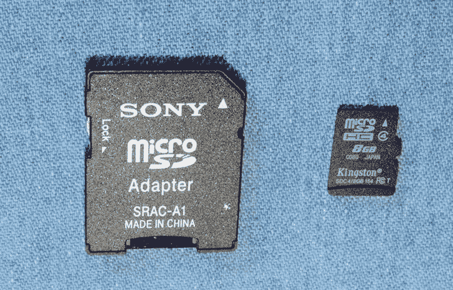
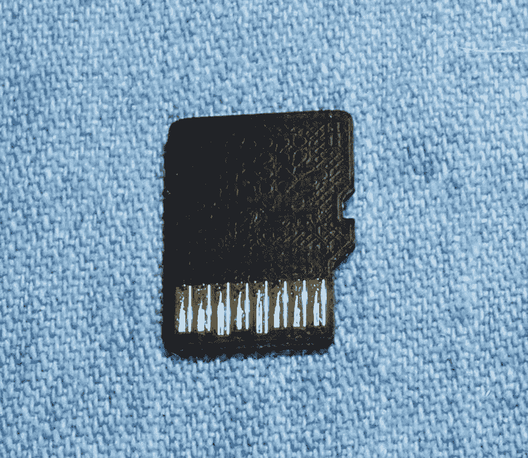

# 九、SD 卡存储

文件系统是 Linux 借鉴的 Unix 系统设计的核心。传统上，大容量存储需求是通过硬盘子系统来满足的。然而，随着主机变得像信用卡一样小，闪存技术已经取代了笨重的机械驱动器。

## SD 卡介质

第一个私家侦探用的是标准尺寸的 SD 卡。然而，所有较新的型号现在都使用如图 [9-1](#Fig1) 所示的 MicroSD 卡，以及标准 SD 适配器。



图 9-1

SD MicroSD 适配器(左侧)和 8 GB MicroSD 卡(右侧)

MicroSD 底面的 8 个引脚如图 [9-2](#Fig2) 所示。



图 9-2

MicroSD 卡的底部，有 8 个引脚暴露在外

## SD 卡基础知识

SD 卡包括一个内部控制器，也称为闪存处理器(FSP)。在这种配置中，主机仅提供命令并等待响应。FSP 负责完成命令所需的所有擦除、编程和读取操作。以这种方式，随着新的性能和存储密度的实现，闪存卡设计的复杂性被允许增加。

SD 卡管理扇区大小为 512 字节的数据。为了与现有操作系统兼容，特意将它设计为与 IDE 磁盘驱动器相同。主机发出的命令包括扇区地址，以允许一个或多个扇区的读/写。

### 注意

操作系统可能会使用多个 512 字节的扇区。

命令和数据受 FSP 生成的 CRC(循环冗余校验)码保护。FSP 还会在写入后自动执行读取，以验证数据是否正确写入。 <sup>9</sup> 如果写入有缺陷，FSP 会自动纠正，必要时用另一个物理扇区替换。

SD 卡的软错误率远低于磁盘驱动器。在极少数情况下，当发现错误时，最后一道防线是纠正 ECC(纠错码)，它允许数据恢复。这些错误在介质中被纠正，以防止将来出现不可恢复的错误。所有这些活动对主机都是透明的。

## 拉斯比安块大小

操作系统使用的块大小可能是介质扇区大小的倍数。为了确定在 Raspbian 下使用的物理块大小，我们首先发现根文件系统是如何挂载的(下面的清单已经被修改):

```sh
$ mount
/dev/mmcblk0p2 on / type ext4 (rw,noatime,data=ordered)
...
/dev/mmcblk0p1 on /boot type vfat (rw,relatime,fmask=0022,dmask=0022, \
      codepage=437,iocharset=ascii,shortname=mixed,errors=remount-ro)

```

由此我们推断用于根文件系统的设备是`/dev/mmcblk0p2`。使用的命名约定告诉我们以下内容:

<colgroup><col class="tcol1 align-left"> <col class="tcol2 align-left"> <col class="tcol3 align-left"> <col class="tcol4 align-left"></colgroup> 
| 

成分

 | 

名字

 | 

数字

 | 

类型

 |
| --- | --- | --- | --- |
| 前缀 | /dev/mmcblk |   | MMC 块 |
| 设备号 | Zero | Zero |   |
| 分区号码 | p2 | Two |   |

从前面的`mount`命令输出中，注意到`/boot`文件系统被挂载在`/dev/mmcblk0p1`上。这表明`/boot`文件系统来自同一个 SD 卡设备的分区 1。

使用设备信息，我们参考`/sys`伪文件系统来找出物理和逻辑扇区大小。这里我们提供`mmcblk0`作为第三级路径名限定符来查询设备:

```sh
$ cat /sys/block/mmcblk0/queue/physical_block_size
  512
$ cat /sys/block/mmcblk0/queue/logical_block_size
  512
$

```

显示的结果告诉我们，本例中使用的 Raspbian Linux 使用 512 字节的块(扇区)大小，无论是物理上还是逻辑上。这与 SD 卡的扇区大小完全匹配。

### 磁盘高速缓存

在我们检查已安装的 SD 卡文件系统时，我们还要检查所使用的设备节点的类型:

```sh
$ ls -l /dev/mmcblk0p?
brw-rw---- 1 root disk 179, 1 Jun 19 07:42 /dev/mmcblk0p1
brw-rw---- 1 root disk 179, 2 Jun 19 07:42 /dev/mmcblk0p2

```

示例输出在 brw-rw 字段的开头显示一个`b`。这告诉我们磁盘设备是一个*块*设备，而不是一个*字符*设备。(相关的字符设备将显示一个`c`。)块设备对于文件系统非常重要，因为它们提供了磁盘缓存功能，可以极大地提高文件系统的性能。输出显示`root`(分区 2)和`/boot`(分区 1)文件系统都是使用块设备挂载的。

## 容量和性能

SD 卡允许在介质限制范围内配置数据总线宽度。所有 SD 卡都从一条数据位线开始，直到存储卡的容量已知。在知道介质的能力之后，数据总线可以在软件控制下扩展，如支持的那样。表 [9-1](#Tab1) 总结了 SD 卡的功能。 <sup>10</sup>

表 9-1

SD 卡功能

<colgroup><col class="tcol1 align-left"> <col class="tcol2 align-left"> <col class="tcol3 align-left"> <col class="tcol4 align-left"> <col class="tcol5 align-left"></colgroup> 
| 

标准

 | 

描述

 | 

大于

 | 

直到

 | 

数据总线

 |
| --- | --- | --- | --- | --- |
| 级计算中心 | 标准容量 | Zero | 2 GB | 1 位 |
| SDHC(消歧义) | 大容量 | 2 GB | 32 GB | 4 位 |
| SDXC(消歧义) | 扩展容量 | 32 GB | 2 TB | 4 位 |

## 转移模式

SD 卡使用三种基本的数据传输模式:

*   SPI 总线模式

*   1 位标清模式

*   4 位标清模式

### SPI 总线模式

SPI 总线模式主要由使用支持 SPI 总线的小型微控制器的消费电子产品使用。检查表 [9-2](#Tab2) 显示，在此模式下，数据一次传输 1 位(引脚 2 或 7)。

表 9-2

spi 总线模式微秒

<colgroup><col class="tcol1 align-left"> <col class="tcol2 align-left"> <col class="tcol3 align-left"> <col class="tcol4 align-left"> <col class="tcol5 align-left"> <col class="tcol6 align-left"></colgroup> 
| 

别针

 | 

名字

 | 

输入－输出

 | 

逻辑

 | 

描述

 | 

精力

 |
| --- | --- | --- | --- | --- | --- |
| one | 网络计算机 |   |   |   |   |
| Two | /CS | 我 | 包裹邮递(Parcel Post) | 卡选择(低电平有效) | 特许测量员 |
| three | 国防情报部 | 我 | 包裹邮递(Parcel Post) | 数据输入 | 工业博物馆 |
| four | 电源电压 | S | S | 电源 |   |
| five | 时钟信号 | 我 | 包裹邮递(Parcel Post) | 时钟 | sclk-sclk-sclk-sclk-sclk-sclk-sclk-sclk-sclk-sclk-sclk-sclk |
| six | 虚存系统 | S | S | 地面 |   |
| seven | 防御命令(Defense Order) | O | 包裹邮递(Parcel Post) | 数据输出 | 军事情报部门组织(Military Intelligence Service Organization) |
| eight |   |   |   | 内向的; 寡言少语的; 矜持的 |   |

各种 SD 卡连接的使用方式各不相同，如表[9-2](#Tab2)I/O 和逻辑列中的助记符所示。表 [9-3](#Tab3) 是这些的图例，也适用于表 [9-4](#Tab4) 。

表 9-3

I/O 和逻辑图例

<colgroup><col class="tcol1 align-left"> <col class="tcol2 align-left"> <col class="tcol3 align-left"></colgroup> 
| 

注释

 | 

意义

 | 

笔记

 |
| --- | --- | --- |
| 我 | 投入 | 相对于卡片 |
| O | 输出 |
| 输入－输出 | 输入或输出 |
| 包裹邮递(Parcel Post) | 推/拉逻辑 |
| 平均海面 | 明渠 |
| S | 电源 |
| 网络计算机 | 未连接 | 或逻辑高 |

### 标清模式

SD 模式允许改变数据总线宽度，以增加 SDHC 和 SDXC 卡支持的 I/O 速率。更高的数据时钟速率也能提高传输速率。表 [9-4](#Tab4) 列出了引脚分配。

表 9-4

微型标清模式引脚

<colgroup><col class="tcol1 align-left"> <col class="tcol2 align-left"> <col class="tcol3 align-left"> <col class="tcol4 align-left"> <col class="tcol5 align-left"></colgroup> 
| 

别针

 | 

名字

 | 

输入－输出

 | 

逻辑

 | 

描述

 |
| --- | --- | --- | --- | --- |
| one | DAT2 | 输入－输出 | 包裹邮递(Parcel Post) | dota2 |
| Two | CD/日期 3 | 输入－输出 | 包裹邮递(Parcel Post) | 卡检测/数据 3 |
| three | 煤矿管理局 | 输入－输出 | 聚丙烯/外径 | 命令/响应 |
| four | 电源电压 | S | S | 电源 |
| five | 时钟信号 | 我 | 包裹邮递(Parcel Post) | 时钟 |
| six | 虚存系统 | S | S | 地面 |
| seven | 日期 0 | 输入－输出 | 包裹邮递(Parcel Post) | 数据 0 |
| eight | DAT1 | 输入－输出 | 包裹邮递(Parcel Post) | 数据 1 |

### 磨损均衡

不幸的是，对于执行的每个*写*操作，闪存遭受*磨损*(因为每个写操作需要擦除和编程数据块)。闪存的设计要求擦除和重写大块存储器，即使单个扇区的值已经改变。因此，损耗均衡被用作延长介质寿命的技术。损耗均衡通过将数据移动到不同的物理块，同时保留相同的逻辑地址来延长寿命。

在没有支持文档的情况下，给定的存储卡是否支持损耗均衡是一个公开的问题。一些制造商可能根本不实施损耗均衡，或者使用较低水平的过度配置。SD 卡标准中没有规定损耗均衡，因此没有制造商被迫遵循 SanDisk 的领导。

## 直接文件系统挂载

有时候，在 Pi 离线的情况下，使用 Linux 对 SD 卡文件系统进行更改是很方便的。如果您有 USB 卡适配器，这也可以通过不同的 Pi 来完成。使用连接到 Linux 系统的 SD 卡插槽或 SD 卡读卡器，您可以直接挂载文件系统。

但是，您如何知道要安装什么呢？您至少可以应用两个有用的命令:

*   lsblk(消歧义)

*   布瑞克

`lsblk`命令非常适合向您展示块设备和分区安排:

```sh
# lsblk
NAME     MAJ:MIN   RM     SIZE   RO   TYPE MOUNTPOINT
sda        8:0      0   149.1G    0   disk
├─sda1    8:1      0   147.3G    0   part /
├─sda2    8:2      0       1K    0   part
└─sda5    8:5      0     1.8G    0   part [SWAP]
sdb        8:16     1    14.5G    0   disk
├─sdb1    8:17     1    41.8M    0   part
└─sdb2    8:18     1    14.5G    0   part
sr0       11:0      1    1024M    0   rom
#

```

从这个显示中，您可以看到 Linux 根文件系统是从`/dev/sda1`开始挂载的。我们的 SD 卡出现在`/dev/sdb`上，有分区`sdb1`和`sdb2`。`blkid`命令给了我们更多的信息，包括分区标签:

```sh
# blkid
/dev/sda1: UUID="51d355c1-2fe1-4f0e-aaae-01d526bb27b5" TYPE="ext4" PARTUUID="61c63d91-01"
/dev/sda5: UUID="83a322e3-11fe-4a25-bd6c-b877ab0321f9" TYPE="swap" PARTUUID="61c63d91-05"
/dev/sdb1: LABEL="boot" UUID="A75B-DC79" TYPE="vfat" PARTUUID="2e37b5e0-01"
/dev/sdb2: LABEL="rootfs" UUID="485ec5bf-9c78-45a6-9314-32be1d0dea38" TYPE="ext4" \
           PARTUUID="2e37b5e0-02"

```

这个显示表明我们的 Pi `/boot`分区在`/dev/sdb1`上，而它的根分区在`/dev/sdb2`上可用。这些可以直接安装。首先确保您有目录条目来挂载它们(如果它们还不存在的话):

```sh
# mkdir /mnt/1
# mkdir /mnt/2

```

现在它们可以安装在:

```sh
# mount /dev/sdb1 /mnt/1
# mount /dev/sdb2 /mnt/2

```

这样挂载之后，您可以随意列出或更改/mnt/1 或/mnt/2 目录中的文件。

### 只读问题

当 Linux 抱怨你的 SD 卡是只读的，你会怎么做？

```sh
# mount /dev/sdb1 -o rw /mnt/1
mount: /dev/sdb1 is write-protected, mounting read-only

```

这个问题至少有三个可能的原因:

*   MicroSD 适配器上的开关已经滑到“保护”(或锁定)位置。

*   Linux 在设备上有一个软件锁。

*   或者 MicroSD 适配器有故障(连接不良)。

#### MicroSD 适配器开关

用于 MicroSD 适配器的滑动开关可能是一个真正的麻烦，因为它会意外地滑入“锁定”位置。解决办法是把它拉回来，并调整开关设置。

#### 软件保护

另一种可能是 Linux 在设备上有一个软件锁。`-r1`选项打开该功能:

```sh
# hdparm -r1 /dev/sdb1

/dev/sdb1:
 setting readonly to 1 (on)
 readonly      =  1 (on)
# mount /dev/sdb1 /mnt/1
mount: /dev/sdb1 is write-protected, mounting read-only
#

```

使用`-r1`命令的`hdparm`命令可以为设备设置软件锁。尝试在启用此锁的情况下装载文件系统会导致只读装载。解决方案是使用选项`-r0`禁用该保护:

```sh
# hdparm -r0 /dev/sdb1

/dev/sdb1:
 setting readonly to 0 (off)
 readonly      =  0 (off)
# mount /dev/sdb1 /mnt/1

```

#### MicroSD 适配器质量

当这个只读问题第一次发生在我身上时，我以为问题出在我使用的 Linux 计算机的硬件上。通过研究，我发现有些人报告说他们的 MicroSD 适配器有问题。在尝试了三种不同的 MicroSD 适配器后，我最终获得了成功。前两个适配器连接不良，导致设备只读。

如果您的 MicroSD 卡配有适配器，那可能就是您想要使用的适配器。然而，这并不能保证成功。

## 图像文件

如果您无法直接安装 SD 卡，那么您仍然可以操作图像文件。这可能是下载的 Raspbian 图像，也可能是一个朋友以某种方式提供给你的。也许他们是从电脑的 SD 卡上创建的图像:

```sh
# dd if=/dev/sdb of=/tmp/sdcard.img bs=1024k

```

这个`dd`命令使用 1 MB (1024k)的块大小将输入磁盘(`/dev/sdb`)复制到输出文件(`/tmp/sdcard.img`)。大块大小用于提高效率。

镜像文件的问题是它包含两个分区。如果它是一个单独的分区，那么它可以直接挂载。分区需要我们做更多的工作。安装`kpartx`将使这项任务变得更容易:

```sh
# apt-get install kpartx

```

现在，当我们有一个镜像文件要挂载时，我们可以如下使用它:

```sh
# kpartx -v -a /tmp/sdcard.img
add map loop0p1 (254:0): 0 85611 linear /dev/loop0 8192
add map loop0p2 (254:1): 0 30351360 linear /dev/loop0 98304

```

注意名字`loop0p1`和`loop0p2`？使用它们在映像文件中挂载文件系统分区:

```sh
# mount /dev/mapper/loop0p1 /mnt/1
# mount /dev/mapper/loop0p2 /mnt/2

```

现在您将在`/mnt/1`中找到您的`/boot`文件，并且在`/mnt/2`中挂载 Pi 根分区。完成更改后，卸载分区:

```sh
# umount /mnt/1
# umount /mnt/2

```

卸载文件系统后，您可以将映像文件复制回 SD 卡。

## 摘要

本章简要介绍了 SD 卡及其操作。然后研究了在 Raspberry Pi 之外使用 SD 卡文件系统的两种不同方式——直接在 Linux 上挂载 SD 卡和挂载图像文件。两者都有其用途，尤其是在救援行动中。