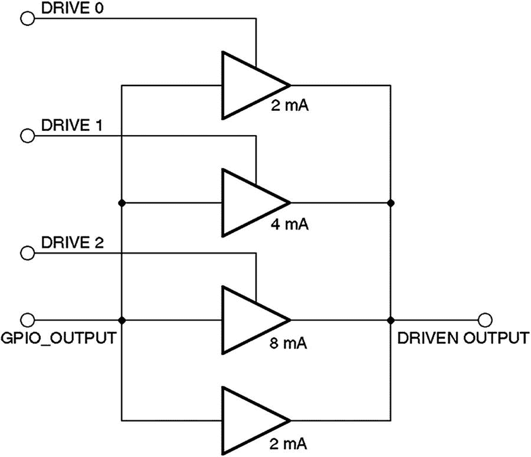
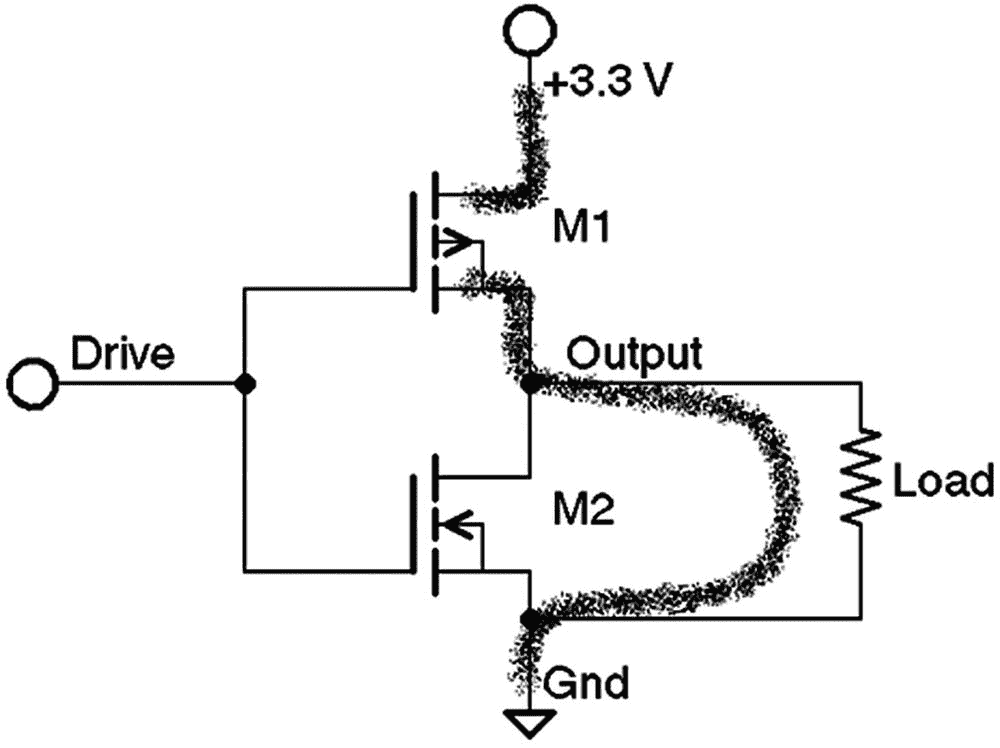
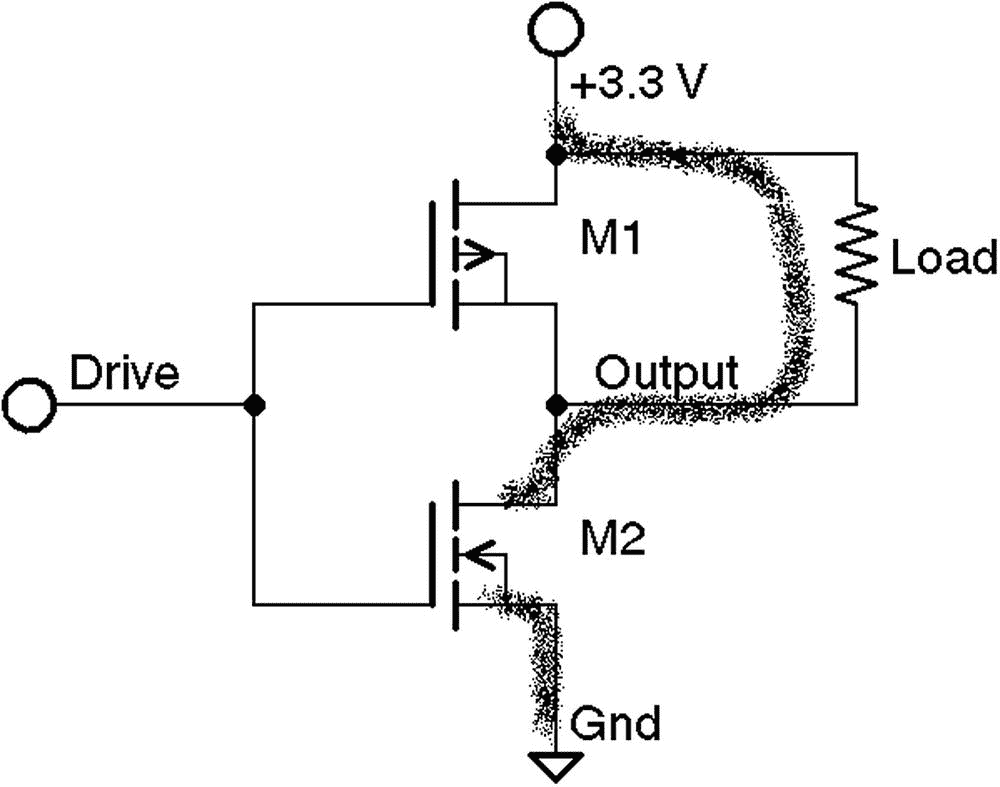
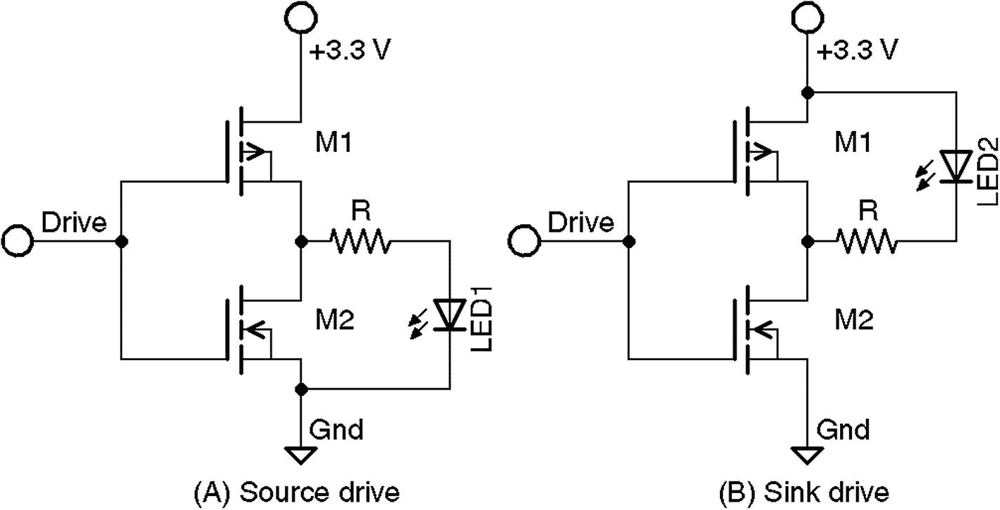
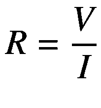
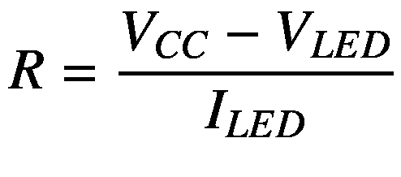
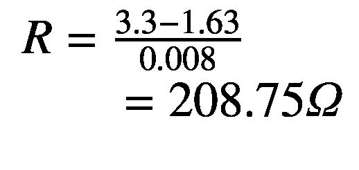
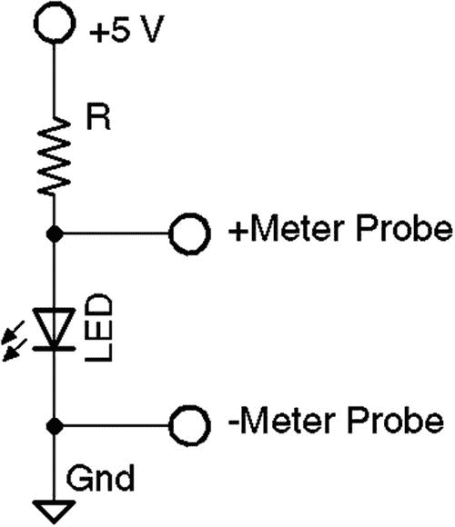
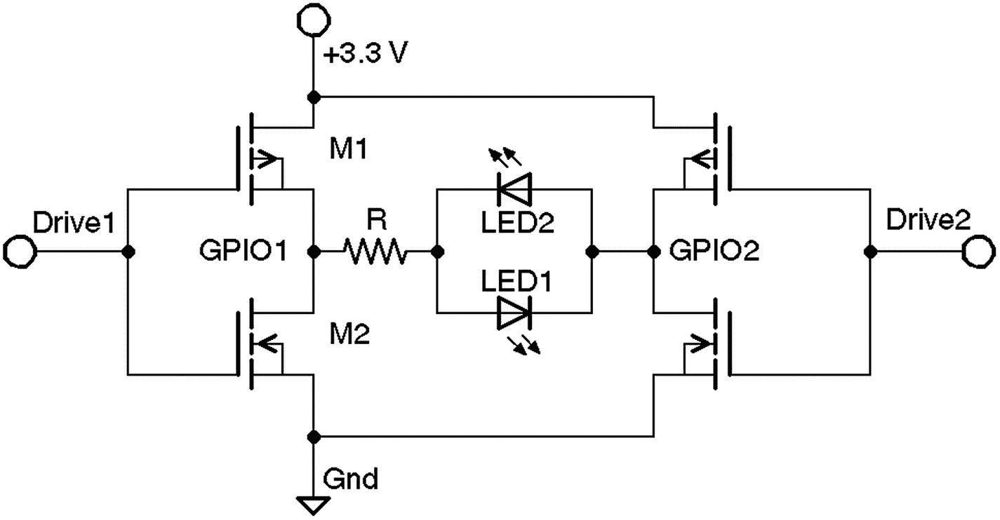

# 十一、GPIO 硬件

通用 I/O 是 Raspberry Pi 用户最关心的话题，因为这是与外界的接口。Pi 设计灵活，允许在软件控制下重新配置 I/O 引脚。例如，GPIO 14 可以是输入、输出，或者作为串行端口 TX 数据线工作。

与 Pi 的 GPIO 接口相关的挑战之一是它使用弱 CMOS 3.3 V 接口。GPIO 引脚也容易受到 ESD(静电放电)损坏，并且是弱驱动(2 至 16 mA)。最后，有限的 GPIO 功率必须从总备用电流容量(原始 Pi 型号 B 上为 50 mA)中进行预算。使用适配器板克服了这些问题，但会大大增加成本。因此，这为提出廉价有效的自行解决方案提供了肥沃的土壤。

## 引脚和名称

表 [11-1](#Tab1) 和 [11-2](#Tab2) 展示了现代 Raspberry Pi 模型的 GPIO 连接。表 [11-1](#Tab1) 列出了奇数引脚，而表 [11-2](#Tab2) 提供了 20x2 头带上的偶数引脚。

表 11-2

现代 Raspberry Pi 的偶数 GPIO 引脚

<colgroup><col class="tcol1 align-center"> <col class="tcol2 align-center"> <col class="tcol3 align-center"> <col class="tcol4 align-left"></colgroup> 
| 

别针

 | 

通用输入输出接口

 | 

名字

 | 

描述

 |
| --- | --- | --- | --- |
| P1-02 |   |   | +5 V 电源 |
| P1-04 |   |   | +5 V 电源 |
| P1-06 |   |   | 地面 |
| P1-08 | GPIO-14 | TXD0 | UART 发送 |
| P1-10 | GPIO-15 | RXD0 | UART 接收 |
| P1-12 | GPIO-18 | GPIO_GEN1 |   |
| P1-14 |   |   | 地面 |
| P1-16 | GPIO-23 | GPIO_GEN4 |   |
| P1-18 | GPIO-24 | GPIO-GEN5 |   |
| P1-20 |   |   | 地面 |
| P1-22 | GPIO-25 | GPIO-GEN6 |   |
| P1-24 | GPIO-8 | SPI_CE0_N |   |
| P1-26 | GPIO-7 | SPI_CE1_N |   |
| P1-28 |   | S7-1200 可编程控制器 | I2C ID EEPROM 时钟 |
| P1-30 |   |   | 地面 |
| P1-32 | GPIO-12 |   |   |
| P1-34 |   |   | 地面 |
| P1-36 | GPIO-16 |   |   |
| P1-38 | GPIO-20 |   |   |
| P1-40 | GPIO-21 |   |   |

表 11-1

现代 Raspberry Pi 的奇数 GPIO 引脚

<colgroup><col class="tcol1 align-center"> <col class="tcol2 align-center"> <col class="tcol3 align-center"> <col class="tcol4 align-left"></colgroup> 
| 

别针

 | 

通用输入输出接口

 | 

名字

 | 

描述

 |
| --- | --- | --- | --- |
| P1-01 |   |   | 来自稳压器的+3.3 V 电源 |
| P1-03 | GPIO-2 |   | I2C SDA1(带 1 个*)。*8kω上拉电阻) |
| P1-05 | GPIO-3 |   | I2C SCL1(带 1 *)。*8kω上拉电阻) |
| P1-07 | GPIO-4 | GPIO_GCLK(通用串行总线) | 通用时钟输出或单线 |
| P1-09 |   |   | 地面 |
| P1-11 | GPIO-17 | GPIO_GEN0 |   |
| P1-13 | GPIO-27 | GPIO_GEN2 |   |
| P1-15 | GPIO-22 | GPIO_GEN3 |   |
| P1-17 |   |   | 来自稳压器的+3.3 V 电源 |
| P1-19 | GPIO-10 | SPI_MOSI |   |
| P1-21 | GPIO-9 | SPI_MISO |   |
| P1-23 | GPIO-11 | SPI_CLK 函数 |   |
| P1-25 |   |   | 地面 |
| P1-27 |   | ID_SD | I2C ID EEPROM 数据 |
| P1-29 | GPIO-5 |   |   |
| P1-31 | GPIO-6 |   |   |
| P1-33 | GPIO-13 |   |   |
| P1-35 | GPIO-19 |   |   |
| P1-37 | GPIO-26 |   |   |
| P1-39 |   |   | 地面 |

### GPIO 交叉引用

通常你可能知道你想要的 GPIO，但是找到管脚号需要一点搜索。表 [11-3](#Tab3) 是一个方便的交叉引用，按 GPIO 号排序，并列出了相应的管脚号。

表 11-3

GPIO 交叉引用

<colgroup><col class="tcol1 align-center"> <col class="tcol2 align-center"> <col class="tcol3 align-center"> <col class="tcol4 align-center"> <col class="tcol5 align-center"> <col class="tcol6 align-center"> <col class="tcol7 align-center"> <col class="tcol8 align-center"></colgroup> 
| 

通用输入输出接口

 | 

别针

 | 

通用输入输出接口

 | 

别针

 | 

通用输入输出接口

 | 

别针

 | 

通用输入输出接口

 | 

别针

 |
| --- | --- | --- | --- | --- | --- | --- | --- |
| GPIO-2 | P1-03 | GPIO-9 | P1-21 | GPIO-16 | P1-36 | GPIO-23 | P1-16 |
| GPIO-3 | P1-05 | GPIO-10 | P1-19 | GPIO-17 | P1-11 | GPIO-24 | P1-18 |
| GPIO-4 | P1-07 | GPIO-11 | P1-23 | GPIO-18 | P1-12 | GPIO-25 | P1-22 |
| GPIO-5 | P1-29 | GPIO-12 | P1-32 | GPIO-19 | P1-35 | GPIO-26 | P1-37 |
| GPIO-6 | P1-31 | GPIO-13 | P1-33 | GPIO-20 | P1-38 | GPIO-27 | P1-13 |
| GPIO-7 | P1-26 | GPIO-14 | P1-08 | GPIO-21 | P1-40 |   |   |
| GPIO-8 | P1-24 | GPIO-15 | P1-10 | GPIO-22 | P1-15 |  |   |

## 复位后的配置

复位时，大多数 GPIO 引脚被配置为通用输入，但有一些例外。然而，随着 Raspbian Linux 的变化和新的 Pi 模型的引入，可能不存在可以安全假设的引导 GPIO 状态。如果您使用 GPIO，那么应该在使用前进行配置。

## 上拉电阻

如前所述，GPIO 2 和 3 (I2C 引脚)有一个连接到+3.3 V 供电轨的外部电阻，以满足 I2C 要求。其余 GPIO 引脚由 SoC 中的内部 50*k*ω电阻拉高或拉低。内部上拉电阻很弱，只能有效地为未连接的 GPIO 输入提供定义的状态。CMOS(互补金属氧化物半导体)输入不应在其逻辑高电平和低电平之间浮动。当外部电路需要上拉电阻时，最好提供外部上拉电阻，而不是依靠内部弱电阻。

### 配置上拉电阻

GPIO 引脚的上拉配置可以使用 SoC 寄存器`GPPUP`和`GPPUDCLK0/1`在 C 程序中进行配置。Pi GPPUP 寄存器的布局如表 [11-4](#Tab4) 所示。

表 11-4

Raspberry Pi GPPUP 寄存器

<colgroup><col class="tcol1 align-center"> <col class="tcol2 align-center"> <col class="tcol3 align-left"> <col class="tcol4 align-center"> <col class="tcol5 align-center"></colgroup> 
| 

位

 | 

田

 | 

描述

 | 

类型

 | 

重置

 |
| --- | --- | --- | --- | --- |
| 31-2 | - | 未使用的 GPIO 引脚上拉/下拉 | 稀有 | Zero |
| 1-0 | PUD | 00 关—禁用上拉/下拉 01 下拉使能 10 上拉使能 11 保留 | 拆装 | Zero |

`GPPUDCLK0`寄存器布局的布局如表 [11-5](#Tab5) 所示。

表 11-5

GPPUDCLK0 寄存器布局

<colgroup><col class="tcol1 align-center"> <col class="tcol2 align-center"> <col class="tcol3 align-left"> <col class="tcol4 align-left"> <col class="tcol5 align-center"> <col class="tcol6 align-center"></colgroup> 
| 

位

 | 

田

 | 

描述

 | 

类型

 | 

重置

 |
| --- | --- | --- | --- | --- |
| 31-0 | PUDCLKn | n = 0..31 | 拆装 | Zero |
| Zero | 没有影响 |   |   |
| one | 断言时钟 |

最后，`GPPUDCLK1`寄存器布局如表 [11-6](#Tab6) 所示。

表 11-6

GPPUDCLK1 寄存器布局

<colgroup><col class="tcol1 align-center"> <col class="tcol2 align-center"> <col class="tcol3 align-left"> <col class="tcol4 align-left"> <col class="tcol5 align-center"> <col class="tcol6 align-center"></colgroup> 
| 

位

 | 

田

 | 

描述

 | 

类型

 | 

重置

 |
| --- | --- | --- | --- | --- |
| 31-22 | - | 内向的; 寡言少语的; 矜持的 | 稀有 | Zero |
| 21-0 | PUDCLKn | n = 32..53 | 拆装 | Zero |
| Zero | 没有影响 |
| one | 断言时钟 |

Broadcom 文档描述了上拉电阻编程的一般程序，如下所示:

1.  将所需的上拉配置写入 32 位`GPPUP`寄存器最右边的 2 位。配置选项如下:

    `00`:禁用上拉控制。

    `01`:启用下拉控制。

    `10`:使能上拉控制。

2.  等待 150 个周期，以便记录之前的写操作。

3.  向正在配置的 32 个 GPIO 引脚组中的每个 GPIO 位置写入 1 位。

    gpio 0–31 由寄存器`GPPUDCLK0`配置。

4.  再等待 150 个周期，让步骤 3 注册。

5.  将`00`写入`GPPUP`以移除控制信号。

6.  再等待 150 个周期，让步骤 5 注册。

7.  最后，写入`GPPUDCLK0/1`删除时钟。

由于单词*时钟*，Broadcom 的程序可能看起来很混乱。使用前述程序写入`GPPUP`和`GPPUDCLK0/1`寄存器旨在向内部上拉电阻触发器(其数据时钟输入)提供一个*脉冲*。首先在步骤 1 中建立状态，然后在步骤 3 中将配置的 1 位变为高电平(针对选定的 GPIO 引脚)。第 5 步建立零状态，然后在第 7 步发送到触发器时钟输入。

文档还指出，无法读取上拉驱动器*的当前设置*(没有寄存器访问权限可用于读取这些触发器)。当您考虑到状态由这些被过程改变的内部触发器保持时，这是有意义的。幸运的是，在配置特定 GPIO 引脚的状态时，您只需更改由`GPPUDCLK0/1`寄存器选择的引脚。其他保持不变。第 [16 章](16.html)将演示如何在 C 程序中改变上拉电阻。

## 驱动力

就电流而言，一个 GPIO 引脚可以提供多大的驱动力？SoC(片上系统)的设计使得每个 GPIO 引脚可以安全地吸收或提供高达 16 mA 的电流而不会造成损害。驱动强度可通过软件配置，范围为 2 至 16 mA。

表 [11-7](#Tab7) 列出了用于配置 GPIO 驱动强度的 SoC 寄存器。共有三个寄存器，影响三组 28 个 GPIO 引脚(两组影响用户可访问的 GPIO)。压摆率、滞后和驱动强度设置都适用于组级别。驱动强度通过 2 mA 至 16 mA 范围内的 3 位值进行配置，增量为 2 mA。当写入这些寄存器时，域 PASSWRD 必须包含十六进制值`0x5A`，以防意外更改。

表 11-7

GPIO 焊盘控制

<colgroup><col class="tcol1 align-left"> <col class="tcol2 align-left"> <col class="tcol3 align-left"> <col class="tcol4 align-left"> <col class="tcol5 align-left"> <col class="tcol6 align-left"></colgroup> 
| 

位

 | 

田

 | 

描述

 | 

输入－输出

 | 

重置

 |
| --- | --- | --- | --- | --- |
| 31:24 | 密码(p) | 0x5A | 写入时必须是 0x5A | W | 0x00 |
| five past eleven p.m. | 内向的; 寡言少语的; 矜持的 | 0x00 | 写为零，读为不在乎 | 拆装 |   |
| 04:04 | 许多 | 转换速度 |   |   |
| Zero | 转换速率受限 | 拆装 | one |
| one | 转换速率不受限制 |
| 03:03 | HYST | 使能输入迟滞 |   |   |
| Zero | 有缺陷的 | 拆装 | one |
| one | 使能够 |
| two o'clock | 驱动器 | 驱动力 | 拆装 | three |
| Zero | 2 毫安 |
| one | 4 毫安 |
| Two | 6 毫安 |
| three | 8 毫安(默认，28 至 45 除外) |
| four | 10 毫安 |
| five | 12 毫安 |
| six | 14 毫安 |
| seven | 16 毫安(GPIO 28 至 45) |

要直观了解 Raspberry Pi 如何控制驱动强度，请参见图 [11-1](#Fig1) 。控制线 Drive0 至 Drive2 由 Drive 寄存器中的位使能。这三条控制线禁用(零)时，只有底部的 2 mA 放大器有效(该放大器始终使能输出)。这代表最弱的驱动强度设置。

图 11-1

驱动强度控制

当 Drive 0 设为 1 时，顶部放大器使能，增加另一个 2 mA 驱动，总电流为 4 mA。使能驱动器 1 会再增加 4 mA 的驱动器，总计 8 mA。使能驱动 2 可使总驱动能力达到 16 mA。

应该提到的是，这些驱动能力是*而不是限流器*。他们所做的是应用或多或少的放大器驱动。如果 GPIO 输出连接到轻负载，如 CMOS 芯片或 MOSFET 晶体管，消耗的电流很少，则最低 2 mA 的驱动就足够了。当 GPIO 输出加载较高的电流负载时，单个 2 mA 缓冲器可能不足以将逻辑电平保持在规格范围内。通过施加更大的驱动力，输出电压电平被控制在正确的工作范围内。

## 逻辑电平

Raspberry Pi GPIO 引脚使用 3.3 V 逻辑电平。原始 BCM2835 SoC 的精确逻辑级规格如下(新型号可能略有不同)。

<colgroup><col class="tcol1 align-left"> <col class="tcol2 align-left"> <col class="tcol3 align-left"></colgroup> 
| 

参数

 | 

伏特

 | 

描述

 |
| --- | --- | --- |
| *V* *他* | ≤0〖t0〗。 8 | 低输入电压 |
| *V*T3】IHT5】 | ≥1〖t0〗。 3 | 电压，输入高 |

V IL 和 V IH 之间的电压电平分别对于逻辑值 0 和 1 被认为是模糊的或未定义的，必须避免。当驱动 LED 等电流负载时，这一点就不那么重要了。

## 输入引脚

GPIO 输入引脚只能承受 0 至 3.3 V(最大值)之间的电压。与使用更高电压的其它电路(如 TTL 逻辑，使用 5 V)接口时要小心。SoC 不能耐受过压，可能会被损坏。

虽然芯片上有保护二极管来防止负输入摆幅和过压，但这些二极管很弱，只能释放静电荷。Broadcom 没有记录这些保护二极管的电流容量。

## 输出引脚

作为输出 GPIO 引脚，用户对电流限制负全部责任。没有*没有*限流。当输出引脚处于高电平状态时，作为电压源，它试图提供 3.3 V 电压(在晶体管和电源电压调节器的限制范围内)。

如果该输出对地短路，则尽可能多的电流会流过。这可能会导致永久性损伤。

输出也能在前面列出的电压规格下工作。但是附加的负载会扭曲工作电压范围。一个输出引脚可以*提供*或*吸收*电流。所需的电流量和配置的*输出驱动*的量会改变工作电压曲线。只要您保持在所配置的驱动能力的电流限制内，您的 Pi 就应该满足电压规格。

### 源电流

图 [11-2](#Fig2) 显示了 GPIO 端口如何向其负载(显示为电阻)提供电流。电流从+3.3 V 电源流出，通过晶体管*M*T5】1，流出 GPIO 引脚，进入*负载，然后*接地。因此，需要高电平(逻辑 1)才能将电流送入负载。这是一个*高电平有效*配置的例子。

图 11-2

GPIO 通过负载从晶体管 M1 获得电流

### 下沉电流

图 [11-3](#Fig3) 说明了 GPIO 输出如何使用晶体管 M2 通过负载将电流吸收到地。由于*负载*连接到+3.3 V 电源，电流从电源*流入*负载，然后通过 *M* *2* 流入 GPIO 输出引脚接地。为了通过负载发送电流，将逻辑 0 写入输出端口，使其成为*低电平有效*配置。

图 11-3

通过 M2 从负载流出的 GPIO 吸电流

### 驱动 led

当 LED 接到 GPIO 输出端口时，*负载*变成 LED 和*限流电阻*。图 [11-4](#Fig4) 说明了从 GPIO 驱动 LED 的两种方式。

图 11-4

Raspberry Pi GPIO 通过一个限流电阻驱动两个 led。(A)左侧的高电平有效配置。(B)右侧的低电平有效配置。

GPIO 输出驱动器中使用的 MOSFETs 是互补的。请注意代表 M1 的箭头与代表 M2 的箭头有何不同。这些晶体管充当开关。驱动信号从写入的 GPIO 输出位反转。向输出写入 1 位时，M1 和 M2 栅极的驱动信号为低电平。低电平打开 M1，同时关闭 M2。以这种方式，对于给定的驱动信号，只有上部或下部晶体管导通。

当 GPIO 写入 1 位时，LED1 点亮，因为 GPIO 晶体管 M1 通过 LED1 提供电流(查看图 [11-2](#Fig2) )。因为 1 位打开 LED，这被称为有效*高*配置。

当一个 0 位被写到 GPIO 时，LED2 被点亮，因为晶体管 M2 导通，将电流吸收到地(查看图 [11-3](#Fig3) )。因为 0 位打开 LED，这被称为有效*低*配置。

为了限制流经 LED 的电流并保护输出晶体管，应使用限流电阻(R)。使用欧姆定律计算电阻:

与所有二极管一样，LED 具有正向压降(V F ),这使得数学计算稍微复杂了一些。在计算电阻时，应从电源电压(V CC )中减去该正向压降。对于红色 led，电压降通常在 1.63 至 2.03 V 之间。

已知 LED 所需的电流消耗，所需电阻可通过下式计算:

其中:

*V*T3】CCT5】是电源电压(+3.3 V)。

*V* *LED* 为 LED 的正向压降。

*I* *LED* 为 LED 所需的电流消耗。

对于 *V* *LED* 来说，最好假设最坏的情况，假设最低电压降为 1.63 V。对于 5 mm LED 的亮度来说，大约 8 mA 是合理的，这样我们就可以计算限制电阻的电阻:

由于电阻采用标准值，因此我们四舍五入至最接近的标准 10%元件值 220ω。

### 注意

向下舍入电阻会导致更高的电流。宁可错在电流小。

LED 和 220ω限流电阻可根据图 [11-4](#Fig4) 接线，无论是高电平有效(A)还是低电平有效(B)配置。

### 其他 LED 颜色

一些纯绿色、蓝色、白色和 UV(紫外线)led 的 V F 约为 3.3 V。这些 led 会让您计算出零欧姆或接近零欧姆的电阻。这种情况下，不需要限流电阻。

另一方面，黄色 led 的 V F 约为 1.8 V。使用 led 时，通常不会有数据手册。尤其是当你把它们从垃圾箱里拿出来的时候。最好使用图 [11-5](#Fig5) 的试验板电路测量 V F 。在这种测量中，使用 5 V 或更高的电源。这样，如果你的 V F 测量值接近或高于 3.3 V，你可以得到一个好的读数。将您的 DMM(数字万用表)探针连接到指定点并测量电压。假设电阻约为 220 至 330 欧姆(使用 3 mm 或更小的 led 时更高)。

图 11-5

测量未知 LED 的正向电压(V F

尽管有测量正向电压的所有预防措施，您仍然可以计算 220 或 330 欧姆的 10%电阻值。但这让您放心，GPIO 不会受到任何伤害。对于更高电压的 led，可以安全地消除限流电阻。如果有任何疑问，请测量 LED 开启时消耗的电流。它不应超过 16 mA，以保持在 Pi 的驱动极限内。

### 驱动逻辑接口

对于 led 来说，接口的要求相当简单。如果当输出端口处于一种状态时 LED 亮起，而在另一种状态时 LED 熄灭，则接口成功。如果遵守最大电流限制，这两种状态下 GPIO 输出引脚上出现的精确电压就无关紧要了。

与逻辑接口时，输出*电压*至关重要。对于接收逻辑，输出电平必须至少为*V*T5】IH才能可靠地记录 1 位(对于 BCM2835，这是 1.3 V)。同样，输出应小于 *V* *IL* ，以便在接收器中可靠地记录 0(对于 BCM2835，这是 0.8V)。这些限值之间的任何电压电平*都是不明确的*，可能导致接收器随机看到 0 或 1。

不同逻辑系列之间的接口有多种方法。文档“Microchip 3V Tips'n Tricks”提供了一个很好的信息来源 12 另一篇题为“3V 和 5V 应用接口，AN240”的文档描述了系统间接口的问题和挑战。 13 举例来说，它描述了如果不采取预防措施，一个 5 V 系统最终会提高 3.3 V 的电源电压。

接口方法包括直接连接(安全时)、分压电阻、二极管电阻网络和更复杂的运算放大器比较器。“自定义 Raspberry Pi 接口”中有整整一章专门讨论这个主题 14 选择方法时，记得考虑接口必要的切换速度。

### 驱动双色 led

这是一个提到驱动双色 led 的好地方。其中一些被配置成使得一个 LED 被正向偏置，而另一个被反向偏置，但是使用两个引线。或者你可以只使用一对连接在一起的发光二极管，如图 [11-6](#Fig6) 所示。这具有只需要两个 GPIO 输出的优势。要改变颜色，只需改变一对 GPIO 输出的极性。

图 11-6

驱动双色 LED 或 LED 对

表 [11-8](#Tab8) 总结了 GPIO 对可能状态的真值表。当两个 GPIO 输出具有不同的状态时，因为电流可以流动，所以一个 LED 或另一个 LED 被点亮。当两个 GPIOs 具有相同的状态时，没有电流可以关闭两个 led。当 LED1 和 LED2 提供不同的颜色时，您可以通过选择哪个 LED 正向偏置来选择颜色输出。

表 11-8

图 [11-6](#Fig6) 中双色 led 驱动真值表

<colgroup><col class="tcol1 align-center"> <col class="tcol2 align-center"> <col class="tcol3 align-left"></colgroup> 
| 

GPIO-1

 | 

GPIO-2

 | 

结果

 |
| --- | --- | --- |
| 低的 | 低的 | 两个指示灯都不亮 |
| 低的 | 高的 | LED2 正向偏置(导通)，LED1 关断 |
| 高的 | 低的 | LED1 正向偏置(导通)，LED2 关断 |
| 高的 | 高的 | 两个指示灯都不亮 |

需要注意的一个复杂情况是，不同颜色的 led 的 V F 可能会有很大不同。你需要在限流电阻上妥协。确保 GPIO 输出永远不需要超过 16 mA 的源电流或吸电流。

## 交错函数

配置 GPIO 引脚时，您必须选择它是输入、输出还是替代功能(如 UART)。完整的选择列表如表 [11-9](#Tab9) 所示。*替代功能 x* 的确切含义取决于所配置的引脚。

表 11-9

替代功能选择

<colgroup><col class="tcol1 align-left"> <col class="tcol2 align-left"> <col class="tcol3 align-left"></colgroup> 
| 

密码

 | 

选择的功能

 | 

中高音

 |
| --- | --- | --- |
| 000 | GPIO 引脚是一个输入。 |   |
| 001 | GPIO 引脚是一个输出。 |   |
| One hundred | GPIO 引脚是备用功能 0。 | Zero |
| One hundred and one | GPIO 引脚是备用功能 1。 | one |
| One hundred and ten | GPIO 引脚是备用功能 2。 | Two |
| One hundred and eleven | GPIO 引脚是备用功能 3。 | three |
| 011 | GPIO 引脚是备用功能 4。 | four |
| 010 | GPIO 引脚是备用功能 5。 | five |

表中 Code 列显示的值用于配置寄存器本身。替代功能编号列在 ALT 栏中。在编程时，保持这两者的一致性可能会令人困惑。选择功能后，将根据外设类型对配置进行微调。

### 输出引脚

当引脚配置为输出时，配置的其余元素包括:

*   逻辑感

*   输出状态

GPIO 引脚的输出状态可以设置为一个 32 位字，一次影响 32 个 GPIO，也可以单独设置或清零。通过单独的置位/清零操作，主机可以改变单个位，而不会干扰其它位的状态，也不必知道它们的状态。

### 输入引脚

由于提供了额外的硬件功能，输入引脚更加复杂。这要求输入 GPIO 引脚配置如下:

*   检测上升输入信号(同步/异步)

*   检测下降输入信号(同步/异步)

*   检测高电平信号

*   检测低电平信号

*   逻辑感

*   中断处理(由驱动程序处理)

*   选择不上拉；使用上拉或下拉电阻

一旦做出这些选择，就可以接收与输入信号变化相关的数据，或者简单地查询引脚的当前状态。

### 浮动电位

如果没有提供或配置上拉或下拉电阻，*未连接的* GPIO 输入可能会“浮动”。当输入端*连接*到驱动电路时，该电路将提供非浮动电压电平。GPIO 输入使用 MOSFET 晶体管。本质上，它只对电压敏感(不像双极晶体管那样对电流敏感)。因此，当输入未连接时，GPIO 输入可以感应电压，包括附近的静电(像猫一样)。

输出 GPIO 引脚箝位在输出电平，使内部输入晶体管处于安全状态。当 GPIO 配置为输入时，通常最好配置一个上拉或下拉电阻。这将把信号拉高或接地。当保持悬空时，静电将是随机的，需要 ESD(静电放电二极管)保护二极管来释放电荷。

## 摘要

本章介绍了 Raspberry Pi GPIO 的一些硬件特性。这为您提供了它的能力和局限性的坚实基础。Pi 的设计为 GPIO 提供了相当大的灵活性，包括驱动电平、上拉电阻和替代功能。

接下来的章节将介绍使用 GPIO 端口的不同方法，包括从 C 程序直接访问。