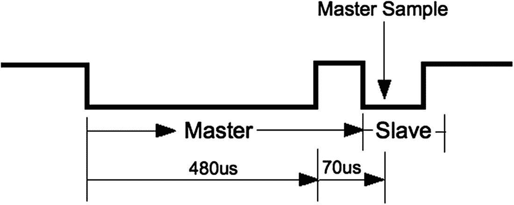
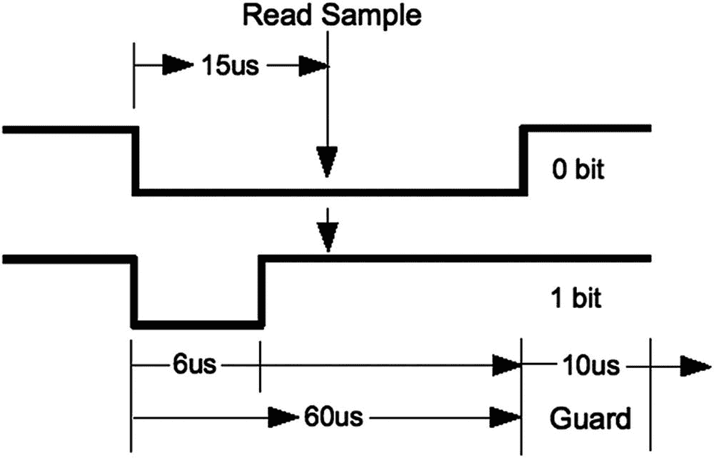
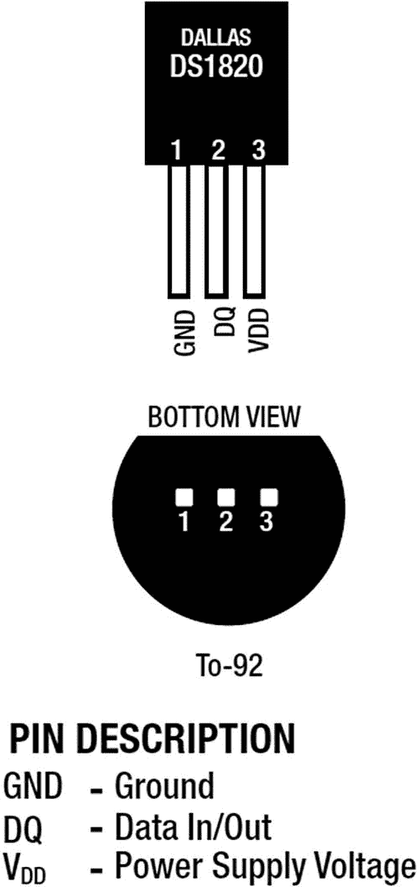
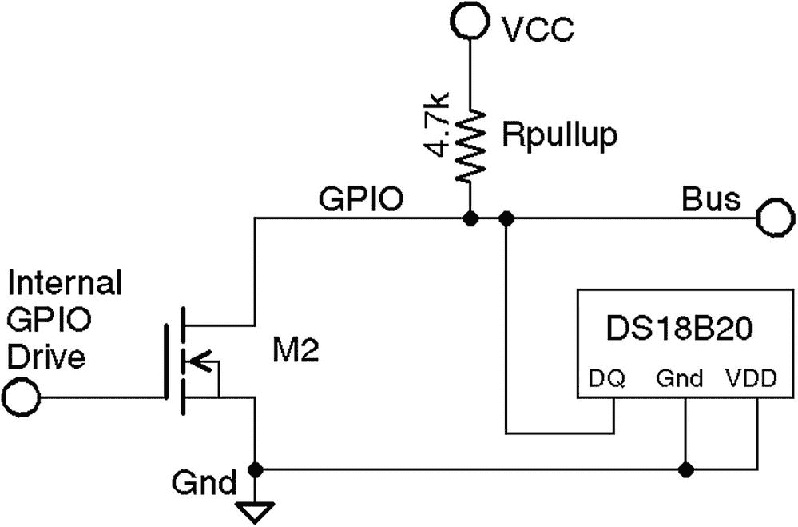
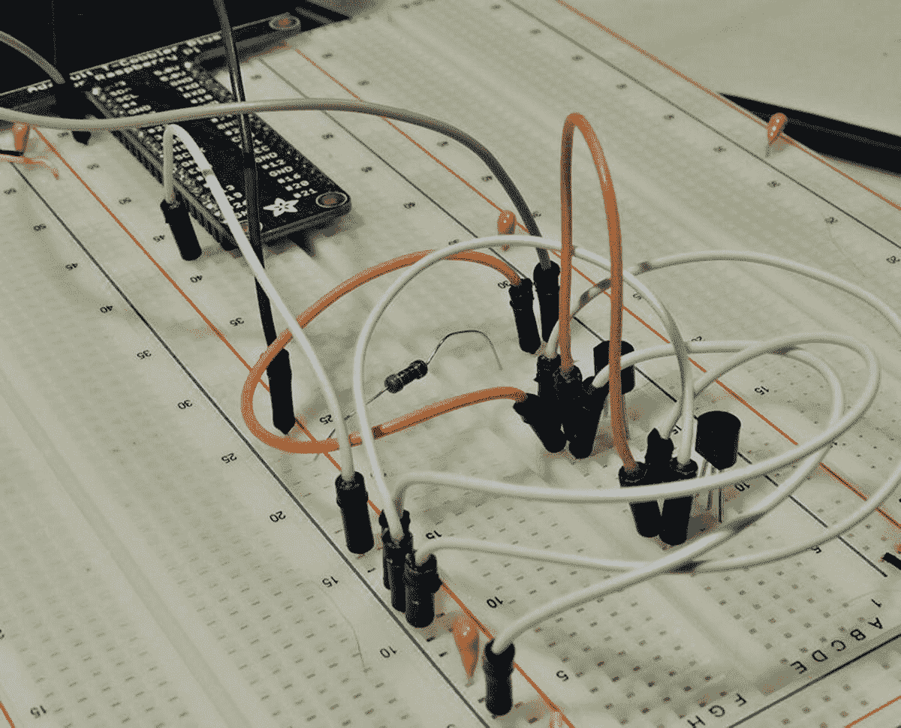

# 十四、单线驱动器

单线协议最初是由达拉斯半导体公司为 iButton 开发的。这种通信协议很有吸引力，可以应用到其他设备上，并很快被其他制造商采用。本章概述了 1-Wire 协议及其在 Raspberry Pi 中的支持方式。

## 单线线路和电源

1-Wire 协议实际上使用了两条导线，但不包括接地线:

*   *数据*:用于数据通信的单线

*   *地线*:地线或“回线”

单线协议设计用于与温度传感器等低数据量设备通信。它通过在用于数据通信的同一根电线上供电来提供低成本的遥感。当数据线处于高状态(也是线路的空闲状态)时，每个传感器可以从数据线接受电力。被吸走的少量功率为芯片的内部电容充电(通常约为 800 pF)。 <sup>15</sup>

当数据线有效(变为低电平)时，传感器芯片继续使用内部电容(寄生模式)。数据通信导致数据线在低电平和高电平之间波动。每当线路电平再次回到高电平时，即使是短暂的瞬间，电容也会重新充电。

该器件还提供一个可选的 V <sub>DD</sub> 引脚，允许直接向其供电。这有时用在寄生模式不够好的时候。这当然需要额外的电线，增加了成本。本章将重点讨论寄生模式，其中 V <sub>DD</sub> 接地。

## 线路驱动

数据线由主设备和从设备中的*开漏*晶体管驱动。当晶体管都处于*关断*状态时，该线由*上拉电阻*保持高电平。为了发出信号，一个晶体管导通，将线路拉低到地电位。

图 [14-1](#Fig1) 显示了连接到总线的主机(GPIO)的简化示意图。一些电压 V(通常为+5 V)通过上拉电阻*R*<sub>T5】上拉</sub> 施加到 1 线总线上。当开漏晶体管*M*T10】2 处于 *Off* 状态时，由于上拉电阻的作用，总线上的电压保持高电平。当主设备激活晶体管*M*T16】2 时，电流将从总线流向地，类似于信号短路。连接到总线的从设备将看到接近零的电压。


图 14-1

单线驱动电路

同样，当从机收到响应信号时，主机监听总线，同时从机激活其驱动晶体管。每当所有驱动晶体管关闭时，总线返回高空闲状态。

主机可以请求所有从机复位。主机发出请求后，它会放弃总线，并允许总线返回高电平。连接到总线的所有从机在短暂停顿后都会将线路拉低，以此作为响应。多个从机会同时将线路拉低，但这是允许的。这通知主设备至少有一个从设备连接到总线。此外，该程序将所有从机置于已知的复位状态。

## 主人和奴隶

主机始终控制着单线总线。奴隶只有在被要求的时候才会和主人说话。从不存在从设备到从设备的通信。

如果主机发现由于某种原因通信变得困难，它可能会强制总线复位。这纠正了可能在线路上叽叽喳喳的错误从设备。

## 草案

本节介绍单线通信协议。了解一些信号如何工作不仅有趣，而且可能有助于故障排除。更多信息可在互联网上获得。 <sup>16</sup>

### 重置

图 [14-2](#Fig2) 提供了单线协议复位程序的简化时序图。当主驱动器开始时，它复位 1 线总线，将所有从器件置于已知状态。



图 14-2

单线复位协议

对于复位，总线被拉低并保持约 480 μs，然后总线被释放，上拉电阻再次将其拉高。短时间后，连接到总线的从设备开始响应，将线路拉低并保持一段时间。几个奴隶可以同时参与其中。主机在释放总线后约 70 μs 对总线进行采样。如果它发现线路为低电平，它知道至少有一个从机连接并响应。

在主采样点之后不久，所有从机再次释放总线并进入监听状态。它们不会再次响应，直到主机明确寻址从机。为了简单起见，我们将省略所使用的发现协议。

### 注意

每个从机都有一个保证唯一的地址。

### 数据输入输出

数据协议如图 [14-3](#Fig3) 所示。无论是写入 0 还是 1 位，发送设备都会将总线拉低。这宣告了数据位的开始。



图 14-3

0 数据位的单线读/写

发送 0 时，线路保持低电平约 60 μs，然后总线被释放，并允许返回高电平。当发送 1 位时，在释放总线之前，线路仅保持低电平约 6 μs。另一个数据位直到前一位开始后 70 μs 才开始。这使得位之间有 10 μs 的保护时间。这样，接收机就有充足的时间来处理该位，并获得一定的信号抗噪能力。

当线路变为低电平时，接收器会注意到数据位的到来。然后，它启动一个定时器，以大约 15 μs 的时间对总线进行采样，如果总线仍处于低电平状态，则会记录一个 0 数据位。否则，数据位被解释为 1。注册数据位后，接收器继续等待，直到线路返回高电平(在 0 位的情况下)。

接收器保持空闲，直到它注意到线路再次变低，宣布下一位开始。

发送方可以是主方，也可以是从方，但是主方总是控制谁可以接着发言。除非主设备请求，否则从设备不会写入总线。

## 从属支持

表 [14-1](#Tab1) 列出了 Raspbian Linux 支持的从设备。列出的模块名可以在内核源代码目录`arch/arm/machbcm2708/slave`中找到。

表 14-1

单线从驱动器支持

<colgroup><col class="tcol1 align-left"> <col class="tcol2 align-left"> <col class="tcol3 align-left"></colgroup> 
| 

设备

 | 

组件

 | 

描述

 |
| --- | --- | --- |
| DS18S20 | w1 _ 热温度 | 精密数字温度计 |
| DS18B20 突击步枪 | 可编程分辨率温度计 |
| DS1822 | Econo 数字温度计 |
| ds28 和 00 | 带 PIO 的 9 至 12 位数字温度计 |
| bq27000 | w1_bq27000.c | 高精度电池监控器 |
| DS2408 | w1_ds2408.c | 八通道可寻址开关 |
| DS2423 | w1 _ ds2423.c 型电脑 | 带计数器的 4 KB RAM |
| DS2431 | w1 _ ds2431.c | 1 KB EEPROM |
| DS2433 | w1 _ ds2433.c | 4 KB EEPROM |
| DS2760 | w1 _ ds2760.c | 精密锂离子电池监控器 |
| DS2780 | w1 _ ds2780.c | 独立燃油表 |

## 配置

随着 Linux 设备树的出现，现在有必要为单线驱动程序配置访问。编辑文件`/boot/config.txt`并添加以下行:

```sh
dtoverlay=w1-gpio,gpiopin=4,pullup=on

```

参数`gpiopin=4`指定 1 线总线在 GPIO4 上。这在过去是硬编码在驱动程序中的，但是现在允许你做不同的选择。如果未指定参数，它仍然是默认值。

参数`pullup=on`通常是成功操作所必需的。即使我将一个 4.7 千欧的电阻连接到+3.3 V 总线，我也无法让我的器件在寄生模式下工作。我建议您提供这个参数。编辑完文件后，重新启动以使其生效。

在`/boot`目录中有一些有趣的文档:

```sh
$ less /boot/overlays/README
...
Name:   w1-gpio
Info:   Configures the w1-gpio Onewire interface module.
        Use this overlay if you *don't* need a GPIO to drive an external
        pullup.
Load:   dtoverlay=w1-gpio,<param>=<val>
Params: gpiopin        GPIO for I/O (default "4")

        pullup         Non-zero, "on", or "y" to enable the parasitic
                       power (2-wire, power-on-data) feature

```

引用的`README`文件还包含一个名为`w1-gpio-pullup`的条目，除非您知道为什么要使用它，否则您应该避免使用它。它需要一个额外的 GPIO 来上拉总线(默认为 GPIO5)。

## 读数温度

对常用温度传感器的支持可以在内核模块`w1_therm`中找到。当您第一次启动 Raspbian Linux 时，该模块可能不会被加载。您可以使用`lsmod`命令来检查它(清单中不需要 root):

```sh
$ lsmod
Module             Size   Used by
snd_bcm2835       12808   1
snd_pcm           74834   1 snd_bcm2835
snd_seq           52536   0
...

```

模块`w1_therm`依赖于另一个名为`wire`的驱动模块。要验证驱动程序模块是否已加载，请检查伪文件系统:

```sh
$ ls –l /sys/bus/w1
ls: cannot access /sys/bus/w1 : No such file or directory

```

没有找到路径名`/sys/bus/w1`，我们确认设备驱动程序没有被加载。

加载模块`w1_therm`将会带来它的大部分依赖模块:

```sh
$ sudo modprobe w1_therm
$ lsmod
Module                 Size   Used by
w1_therm               2705   0
wire                  23530   1 w1_therm
cn                     4649   1 wire
snd_bcm2835           12808   1
snd_pcm               74834   1 snd_bcm2835
...

```

加载完`wire`模块后，您会看到`/sys/bus/w1/devices`目录。还需要一个模块:

```sh
$ sudo modprobe w1_gpio
$ lsmod
Module                   Size   Used by
w1_gpio                  1283   0
w1_therm                 2705   0
wire                    23530   2 w1_therm,w1_gpio
cn                       4649   1 wire
snd_bcm2835             12808   1
...
$ cd /sys/bus/w1/devices
$ ls
w1_bus_master1

```

一旦模块`w1_gpio`被加载，配置的 GPIO 端口就会有一个总线主驱动程序。总线主控器通过创建符号链接`devices/w1_bus_master1`来表明其存在。转到/sys/bus/w1 目录并列出它，以查看其中关联的伪文件。长长的行被缩短了:

```sh
# pwd
/sys/bus/w1
# ls -lR .
.:
total 0
drwxr-xr-x 2 root root    0 Jul  6 06:47 devices
drwxr-xr-x 4 root root    0 Jul  6 06:47 drivers
-rw-r--r-- 1 root root 4096 Jul  6 06:47 drivers_autoprobe
--w------- 1 root root 4096 Jul  6 06:47 drivers_probe
--w------- 1 root root 4096 Jul  6 06:47 uevent

./devices:
total 0
lrwxrwxrwx 1 root root 0 Jul  6 06:47 28-00000478d75e -> ...
lrwxrwxrwx 1 root root 0 Jul  6 06:47 28-0000047931b5 -> ...
lrwxrwxrwx 1 root root 0 Jul  6 06:47 w1_bus_master1 -> ...

./drivers:
total 0
drwxr-xr-x 2 root root 0 Jul  6 06:47 w1_master_driver
drwxr-xr-x 2 root root 0 Jul  6 06:47 w1_slave_driver

./drivers/w1_master_driver:
total 0
--w------- 1 root root 4096 Jul  6 06:47 bind
--w------- 1 root root 4096 Jul  6 06:47 uevent
--w------- 1 root root 4096 Jul  6 06:47 unbind
lrwxrwxrwx 1 root root    0 Jul  6 06:47 w1_bus_master1 -> ...

./drivers/w1_slave_driver:
total 0
lrwxrwxrwx 1 root root    0 Jul  6 06:47 28-00000478d75e -> ...
lrwxrwxrwx 1 root root    0 Jul  6 06:47 28-0000047931b5 -> ...
--w------- 1 root root 4096 Jul  6 06:47 bind
--w------- 1 root root 4096 Jul  6 06:47 uevent
--w------- 1 root root 4096 Jul  6 06:47 unbind

```

伪文件名`28-00000478d75e`和`28-0000047931b5`是作者的两个 DS18B20 设备的设备条目。如果您没有立即看到您的条目，请不要担心，因为发现协议需要时间来找到它们。

### 从属设备

图 [14-4](#Fig4) 显示了 Dallas DS18B20 从设备的引脚排列。该温度传感器是许多单线从机的典型器件。



图 14-4

DS18B20 引脚排列

从设备由代表产品系列的一对数字标识，后面是连字符和十六进制序列号。ID 28-00000478d75e 就是一个例子。您可能还想尝试不同的设备，如类似的 DS18S20。图 [14-5](#Fig5) 显示了连接到 Raspberry Pi GPIO 的 DS18B20。



图 14-5

1 线，带 DS18B20 从电路，使用 V <sub>CC</sub> =3.3 V 和 4.7 k 上拉电阻

当一切正常时，总线主设备会自动检测从设备，作为其定期扫描的一部分。当您的设备被发现时，它们会以类似`28-0000028f6667.`的名称出现在设备子目录中

以下示例显示了两个 DS18B20 温度传感器如何出现在 1 线总线上:

```sh
$ cd /sys/bus/w1/devices
$ ls
28−00000478d75e 28−0000047931b5 w1_bus_master1
$

```

图 [14-6](#Fig6) 展示了作者使用的试验板设置。



图 14-6

带有两个 DS18B20 温度传感器的试验板连接到 Raspberry Pi

### 读取温度

从器件的温度可以通过读取其`w1_slave`伪文件来读取。在本例中，我们读取了两个 DS18B20 温度传感器，它们的精度应该达到 0.5°c，将这两个传感器一起读取应该显示出相当好的一致性(它们彼此非常接近):

```sh
# cd /sys/bus/w1/devices
# cat 28-00000478d75e/w1_slave
a6 01 4b 46 7f ff 0a 10 f6 : crc=f6 YES
a6 01 4b 46 7f ff 0a 10 f6 t=26375

```

以 t=26375 结尾的第二行表示读数为 26.375 摄氏度。

如果驱动程序在读取设备时遇到问题，DS18B20 的响应可能如下所示:

```sh
# cd /sys/bus/w1/devices
# cat 28-00000478d75e/w1_slave
50 05 4b 46 7f ff 0c 10 1c : crc=1c YES
50 05 4b 46 7f ff 0c 10 1c t=85000

```

值 t=85000 是绝对的泄露。如果您看到这种情况，请检查您的布线，尤其是上拉电阻。该电路需要一个 4.7 千欧的上拉电阻至+3.3 V。

## 摘要

在本章中，使用 1 线 Linux 支持来读取 Dallas Semiconductor DS18B20 温度传感器。表 [14-1](#Tab1) 列出了您可能会用到的几种其他类型的单线传感器。有了司机的支持，使用这样的传感器变得轻而易举。