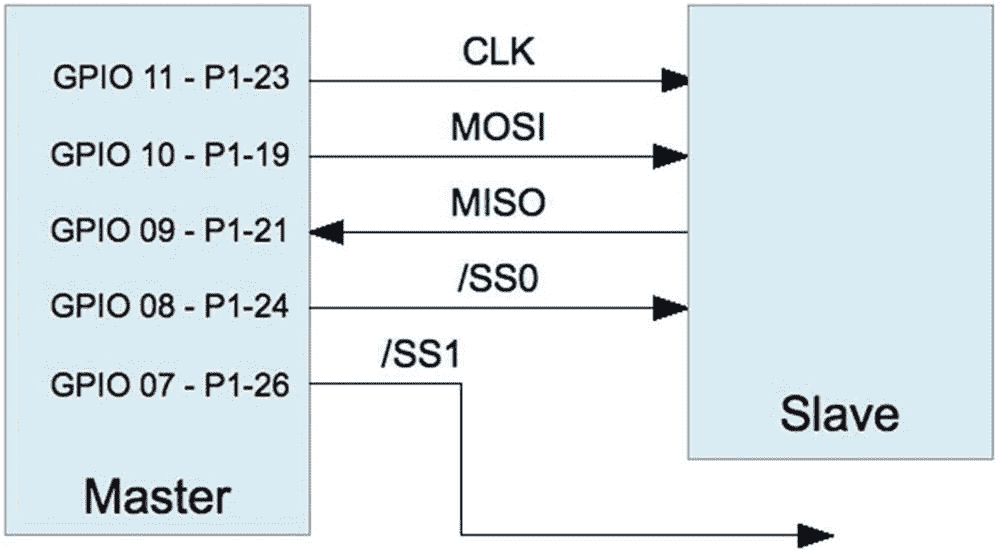
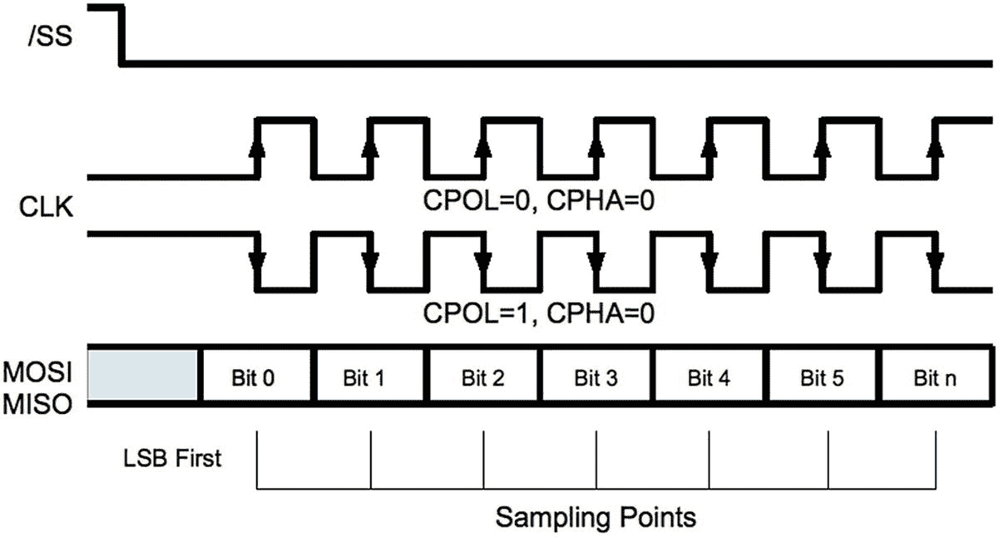
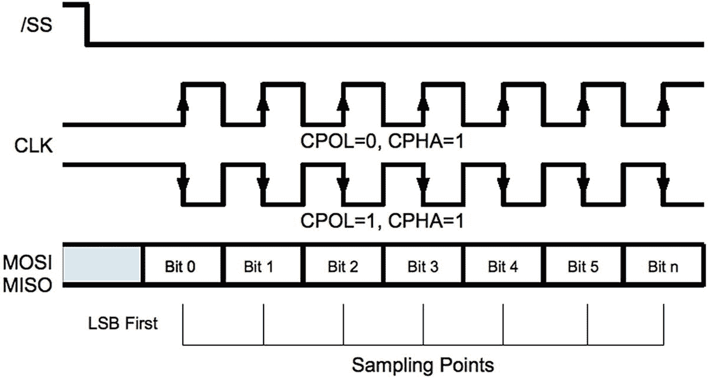
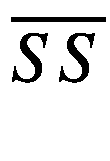
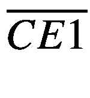
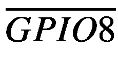
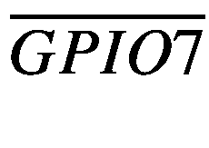

# 十六、SPI 总线

串行外设接口总线，被亲切地称为 *spy* ，是由摩托罗拉命名的同步串行接口。<sup>18</sup>SPI 协议以全双工模式工作，允许它同时发送和接收数据。一般来说，SPI 比 I <sup>2</sup> C 协议有速度优势，但是需要更多的连接。

## SPI 基础知识

SPI 总线上的器件以主机/从机方式通信。多个从机共存于一条给定的 SPI 总线上，每个从机由一个从机选择信号(也称为片选)选择通信。图 [16-1](#Fig1) 显示 Raspberry Pi 作为主机与一个从机通信。除了将使用不同的从机选择信号之外，将如图所示连接额外的从机。



图 16-1

SPI 接口

数据通过 MOSI 线从主机传输到从机(主机输出，从机输入)。当主机发送每个位时，从机同时在 MISO 线上发送数据(主机输入，从机输出)。位从主机移入从机，位从从机移入主机。两次传输都在系统时钟的节拍下进行(CLK)。

许多 SPI 器件仅支持 8 位传输，而其他器件则更加灵活。SPI 总线是事实上的标准，这意味着数据传输宽度和 SPI 模式没有标准。<sup>18</sup>SPI 控制器也可以配置为首先传输最高有效位或最低有效位。所有这些灵活性都会导致混乱。

## SPI 模式

SPI 以四种可能的时钟信号模式之一工作，基于两个参数:

<colgroup><col class="tcol1 align-left"> <col class="tcol2 align-left"></colgroup> 
| 

参数

 | 

描述

 |
| --- | --- |
| 断续器 | 时钟极性 |
| CPHA | 时钟相位 |

每个参数有两种可能性，因此 SPI 有四种可能的工作模式。表 [16-1](#Tab1) 列出了所有四种可用模式。注意，给定的模式通常用一对数字来表示，如 *1，0* 或简单地称为模式 *2* (对于同一模式，如表中所示)。两种引用类型都显示在模式列中。

表 16-1

*SPI* *模式*

<colgroup><col class="tcol1 align-center"> <col class="tcol2 align-center"> <col class="tcol3 align-center"> <col class="tcol4 align-center"> <col class="tcol5 align-left"></colgroup> 
| 

断续器

 | 

CPHA

 | 

方式

 | 

描述

 |
| --- | --- | --- | --- |
| Zero | Zero | 0,0 | Zero | 同相时钟，在上升沿采样 |
| Zero | one | 0,1 | one | 同相时钟，在下降沿采样 |
| one | Zero | 1,0 | Two | 反相时钟，在上升沿采样 |
| one | one | 1,1 | three | 反相时钟，在下降沿采样 |
|   | **时钟感应** | **描述** |
| 非反转 | 信号为空闲低电平，有效高电平 |
| 反向的 | 信号为高电平空闲，低电平有效 |

外围设备制造商在开始时没有定义标准的信号惯例。因此，SPI 控制器通常允许配置四种模式中的任何一种，而其余的只允许两种模式。然而，一旦选择了一种模式，同一总线上的所有从机都必须同意。

## 发信号

时钟极性决定空闲时钟电平，而相位决定数据线是在时钟信号上升还是下降时进行采样。图 [16-2](#Fig2) 显示了模式 0，0，这可能是 SPI 信号的首选形式。在图 [16-2](#Fig2) 中，通过激活(从机选择)首先选择从机。一次只能选择一个从机，因为必须有一个从机驱动 MISO 线。选择从机后不久，主机驱动 MOSI 线，从机用第一个数据位同时驱动 MISO 线。这可能是最高位，也可能是最低位，具体取决于控制器的配置。该图首先显示最低有效位。



图 16-2

SPI 信号，模式 0 和 2

在模式 0，0 下，当时钟线从高电平变为低电平时，第一位被读入主机和从机。该时钟跳变位于数据位单元的中间。随着时钟从高电平变为低电平，其余位依次同时输入主机和从机。当主机停用从机选择线时，传输结束。当时钟极性反转时(CPOL = 1，CPHA = 0)，图 [16-2](#Fig2) 所示的时钟信号简单反转。数据在数据单元中同时计时，但在时钟的上升沿计时。

图 [16-3](#Fig3) 显示了相位设置为 1 (CPHA = 1)的时钟信号。当时钟不反转时(CPOL = 0)，数据在上升沿输入。时钟必须比相位为 0 (CPHA = 0)时提前半个时钟周期转换到非理想状态。当 SPI 模式为 1，1 时，数据在时钟的下降沿读入。



图 16-3

SPI 信号模式 1 和 3

虽然这四种不同的模式可能会造成混淆，但必须认识到，数据是在数据位单元内同时采样的。数据位总是在数据单元的中点进行采样。当时钟相位为 0 (CPHA = 0)时，根据 CPOL，数据在时钟的下降沿或上升沿进行采样。当时钟相位为 1 (CPHA = 1)时，根据 CPOL，数据在时钟的上升沿或下降沿进行采样。

## 从属选择

与 I <sup>2</sup> C 不同，在 I<sup>2</sup>C 中，从机通过发送地址寻址，SPI 总线为每个从机使用一条专用选择线。Raspberry Pi 将表 [16-2](#Tab2) 中列出的 GPIO 引脚用作从机选择线(也称为芯片使能线)。

表 16-2

Raspberry Pi 内置芯片使能引脚

<colgroup><col class="tcol1 align-center"> <col class="tcol2 align-center"> <col class="tcol3 align-center"></colgroup> 
| 

通用输入输出接口

 | 

芯片使能

 | 

第一亲代

 |
| --- | --- | --- |
| eight |  | P1-24 |
| seven |  | P1-26 |

Raspbian Linux 内核驱动程序只支持使用这两条芯片使能线。但是，驱动程序的设计使得您不必使用它们，或者只使用这些。例如，在用户软件控制下，可以使用不同的 GPIO 引脚作为选择。应用只负责在数据 I/O 之前激活从机选择 GPIO 线，并在之后将其停用。当驱动器控制从属选择时，这是自动完成的。

## 驱动程序支持

要启用 SPI 驱动程序，请编辑`/boot/config.txt`文件，取消对该行的注释，如下所示:

```sh
dtparam=spi=on

```

然后重新启动:

```sh
# sync
# /sbin/shutdown -r now

```

重新启动后，使用`lsmod`命令，您应该看到驱动程序`spi_bcm2835`列在其他驱动程序中。

```sh
$ lsmod
Module                  Size  Used by
fuse                  106496  3
rfcomm                 49152  6
...
spi_bcm2835            16384  0
...

```

一旦出现内核模块支持，设备驱动程序节点应该会出现:

```sh
$ ls /dev/spi*
/dev/spidev0.0  /dev/spidev0.1
$

```

这两个设备节点是根据应该激活哪个从机选择来命名的，如表 [16-3](#Tab3) 所示。

表 16-3

SPI 器件节点

<colgroup><col class="tcol1 align-left"> <col class="tcol2 align-left"> <col class="tcol3 align-left"> <col class="tcol4 align-left"> <col class="tcol5 align-left"></colgroup> 
| 

路径名

 | 

公共汽车

 | 

设备

 | 

通用输入输出接口

 | 



 |
| --- | --- | --- | --- | --- |
| /dev/spidev0.0 | Zero | Zero | eight |  |
| /dev/spidev0.1 | Zero | one | seven |  |

如果您用 C 宏`SPI_NO_CS`打开这些设备节点中的任何一个，所选择的节点没有任何区别。宏`SPI_NO_CS`指示从机选择将由应用而不是驱动程序执行，如果使用任何选择的话。当只连接一个从设备时，是否可以使用永久硬连线选择。

## SPI API

像 Linux 下的 I <sup>2</sup> C 一样，SPI 的裸机 API 包括对`ioctl(2)`的调用，以配置接口和同步读/写。通常的`read(2)`和`write(2)`系统调用可以用于单向传输。

### 头文件

SPI 编程所需的头文件如下:

```sh
#include <fcntl.h>
#include <unistd.h>
#include <stdint.h>
#include <sys/ioctl.h>
#include <linux/types.h>
#include <linux/spi/spidev.h>

```

`spidev.h include`文件定义了几个宏和`struct spi_ioc_transfer`。表 [16-4](#Tab4) 列出了声明的主要宏。宏`SPI_CPOL`和`SPI_CPHA`用于值`SPI_MODE_x`的定义。如果您愿意，可以使用`SPI_CPOL`和`SPI_CPHA`来代替模式宏。

表 16-4

SPI 宏定义

<colgroup><col class="tcol1 align-left"> <col class="tcol2 align-center"> <col class="tcol3 align-left"></colgroup> 
| 

巨

 | 

支持

 | 

描述

 |
| --- | --- | --- |
| SPI_CPOL | 是 | 时钟极性反转(CPOL = 1) |
| SPI_CPHA | 是 | 时钟相位为 1 (CPHA = 1) |
| SPI_MODE_0 | 是 | SPI 模式 0.0(cpol = 0，CPHA = 0) |
| SPI_MODE_1 | 是 | SPI 模式 0.1(cpol = 0，CPHA = 1) |
| SPI_MODE_2 | 是 | SPI 模式 1.0(cpol = 1，CPHA = 0) |
| SPI_MODE_3 | 是 | SPI 模式 1.1(cpol = 1，CPHA = 1) |
| SPI _ CS _ 高电平 | 是 | 片选高电平有效 |
| SPI_LSB_FIRST | 不 | LSB 首先传输 |
| SPI _ 线 | 不 | 使用 3 线数据 I/O 模式 |
| SPI_LOOP | 不 | MOSI/MISO 数据线环路 |
| SPI_NO_CS | 是 | 不应用芯片选择 |
| SPI _ 就绪 | 不 | 启用额外就绪信号 |

与 SPI 器件通信包括以下系统调用:

*   `open(2)`:打开 SPI 设备驱动节点

*   `read(2)`:读取但无传输

*   `write(2)`:写入数据，同时丢弃接收的数据

*   `ioctl(2)`:用于配置和双向输入输出

*   `close(2)`:关闭 SPI 设备驱动节点

在 SPI 通信中，`read(2)`和`write(2)`的使用一般不常见。通常，`ioctl(2)`用于促进同步读/写传输。

### 开放式设备

为了通过内核驱动程序执行 SPI 通信，您需要使用`open(2)`打开其中一个设备节点。设备路径名的一般格式是

```sh
/dev/spidev<bus>.<device>

```

以下是打开总线 0、设备 0 的代码片段。

```sh
int fd;

fd = open("/dev/spidev0.0",O_RDWR);
if ( fd < 0 ) {
    perror("Unable to open SPI driver");
    exit(1);
}

```

因为 SPI 通常涉及读写，所以驱动器通常为读写(`O_RDWR`)打开。

### SPI 宏模式

在执行 SPI 通信之前，需要选择通信模式。表 [16-5](#Tab5) 列出了可用于配置 SPI 模式的 C 语言宏。

表 16-5

SPI 宏模式

<colgroup><col class="tcol1 align-left"> <col class="tcol2 align-left"> <col class="tcol3 align-left"></colgroup> 
| 

巨

 | 

影响

 | 

评论

 |
| --- | --- | --- |
| SPI_CPOL | CPOL = 1 | 或者使用 SPI_MODE_x |
| SPI_CPHA | CPHA = 1 | 或者使用 SPI_MODE_x |
| SPI _ CS _ 高电平 | SS 高电平有效 | 与众不同的 |
| SPI_NO_CS | 不要断言选择 | 未使用/应用控制 |

这些位值简单地进行“或”运算，以指定所需的选项。使用`SPI_CPOL`意味着 CPOL = 1。它的不存在意味着 CPOL = 0。类似地，使用`SPI_CPHA`意味着 CPHA = 1，否则 CPHA = 0。宏`SPI_MODE_x`使用`SPI_CPOL`和`SPI_CPHA`来定义它们，所以不要在你的代码中同时使用它们。模式定义如下所示:

```sh
#define SPI_MODE_0 (0|0)
#define SPI_MODE_1 (0|SPI_CPHA)
#define SPI_MODE_2 (SPI_CPOL|0)
#define SPI_MODE_3 (SPI_CPOL|SPI_CPHA)

```

不支持的选项不会显示，尽管将来可能会支持其中的一个或多个选项。

下面是一个定义`SPI_MODE_0`的例子:

```sh
uint8_t mode = SPI_MODE_0;
int rc;

rc = ioctl(fd,SPI_IOC_WR_MODE,&mode);
if ( rc < 0 ) {
    perror("Can't set SPI write mode.");

```

如果您想了解 SPI 驱动器当前的配置，您可以使用`ioctl(2)`读取 SPI 模式，如下所示:

```sh
uint8_t mode;
int rc;

rc = ioctl(fd,SPI_IOC_RD_MODE,&mode);
if ( rc < 0 ) {
     perror("Can't get SPI read mode.");

```

### 每字位数

SPI 驱动器需要知道每个 I/O 字要传输多少位。虽然驱动程序可能会默认为 8 位，但最好不要依赖它。请注意，在 LoSSI 模式(低速串行接口)下，Pi 仅支持 8 位或 9 位。这通过以下`ioctl(2)`调用进行配置:

```sh
uint8_t bits = 8;
int rc;

rc = ioctl(fd, SPI_IOC_WR_BITS_PER_WORD,&bits);
if ( rc < 0 ) {
    perror ("Can't set bits per SPI word.");

```

可以用`ioctl(2)`获取当前配置的值，如下所示:

```sh
uint8_t bits;
int rc;

rc = ioctl(fd,SPI_IOC_RD_BITS_PER_WORD,&bits);
if ( rc == −1 ) {
    perror("Can't get bits per SPI word.");

```

当位数不是 8 的偶数倍时，假设这些位是右对齐的。例如，如果字长设置为 4 位，则传输最低有效的 4 位。高阶位被忽略。

同样，当接收数据时，最低有效位包含数据。然而，所有这些在 Pi 上都是理论上的，因为驱动程序只支持字节范围的传输。

### 时钟频率

要配置数据传输速率，您可以使用`ioctl(2)`设置时钟速率，如下所示:

```sh
uint32_t speed = 500000; /* Hz */
int rc;

rc = ioctl(fd,SPI_IOC_WR_MAX_SPEED_HZ,&speed);
if ( rc < 0 ) {
    perror("Can't configure SPI clock rate.");

```

speed 中提供的时钟速率应该是 2 的倍数(它会自动向下舍入)。可以使用下面的`ioctl(2)`调用获取当前配置的时钟速率:

```sh
uint32_t speed; /* Hz */
int rc;

rc = ioctl(fd,SPI_IOC_RD_MAX_SPEED_HZ,&speed);
if ( rc < 0 ) {
    perror("Can't get SPI clock rate.");

```

### 数据输入输出

SPI 通信通常会在发送数据的同时接收数据。因此，不能使用`read(2)`和`write(2)`系统调用。然而，`ioctl(2)`调用将同时执行读和写。

`ioctl(2)`调用的`SPI_IOC_MESSAGE(n)`形式使用以下结构作为其参数:

```sh
struct spi_ioc_transfer {
    __u64   tx_buf;        /* Ptr to tx buffer */
    __u64   rx_buf;        /* Ptr to rx buffer */
    __u32   len;           /* # of bytes */
    __u32   speed_hz;      /* Clock rate in Hz */
    __u16   delay_usecs;   /* Delay in microseconds */
    __u8    bits_per_word; /* Bits per "word" */
    __u8    cs_change;     /* Apply chip select */
    __u32   pad;           /* Reserved */
};

```

`tx_buf`和`rx_buf`结构成员被定义为 64 位无符号整数(`__u64`)。因此，在对缓冲区指针进行赋值时，必须对其进行强制转换:

```sh
uint8_t tx[32], rx[32];
struct spi_ioc_transfer tr;

tr.tx_buf = (unsigned long) tx;
tr.rx_buf = (unsigned long ) rx;

```

在 Raspberry Pi 上，您将看到简单地将指针指向`unsigned long`的示例代码。编译器会自动将这些 32 位值提升为 64 位值。这在 Pi 上是安全的，因为指针值的大小是 32 位。

如果您不想接收数据(可能因为它是“无关紧要”的数据)，您可以将接收缓冲区清空:

```sh
uint8_t tx[32];
struct spi_ioc_transfer tr;

tr.tx_buf = (unsigned long) tx;
tr.rx_buf = 0;                  /* ignore received data */

```

请注意，要接收数据，主机必须始终发送数据，以便将数据移出从机外设。如果发送任何字节都可以，可以省略发送缓冲器。然后，驱动器将自动发送零字节，以将从机数据移出。

也允许从您正在接收的缓冲区传输到:

```sh
uint8_t io[32];
struct spi_ioc_transfer tr;

tr.tx_buf = (unsigned long) io;         /* Transmit buffer */
tr.rx_buf = (unsigned long) io;         /* is also recv buffer */

```

`len`结构成员表示 I/O 传输的字节数。接收和发送缓冲区(当两者都使用时)应该传输相同数量的字节。

成员`speed_hz`定义了您希望用于该 I/O 的时钟频率，单位为 Hz。在 I/O 期间，这将覆盖模式设置中配置的任何值。必要时，该值将自动向下舍入到支持的时钟速率。

当值`speed_hz`为 0 时，使用之前配置的时钟速率(`SPI_IOC_WR_MAX_SPEED_HZ`)。

当`delay_usecs`成员不为零时，它指定传输之间延迟的微秒数。它在传输结束时应用，而不是在传输开始时应用。当单个`ioctl(2)`请求中有多个 I/O 传输时，这允许中间有时间，以便外设可以处理数据。

`bits_per_word`成员定义了一个“字”单元中有多少位。通常单位是 1 字节(8 位)，但也不需要(但注意 Raspbian Linux 驱动程序在 LoSSI 模式下只支持 8 位或 9 位)。

当`bits_per_word`值为 0 时，使用之前从`SPI_IOC_WR_BITS_PER_WORD`配置的值。

`cs_change`成员被视为布尔值。为 0 时，驱动器不执行片选。应用需要通知外设它被选中(通常 GPIO 引脚被拉低)。I/O 完成后，应用必须取消选择从外设。

当`cs_change`成员为`true`(非零)时，选择的从机将*依赖于打开的*设备路径名。总线和从机地址嵌入在设备名称中:

```sh
/dev/spidev<bus>.<device>

```

当`cs_change`为`true`时，驱动器在 I/O 之前断言`spidev0.0`的，断言`spidev0.1`的，并在完成后将其去激活。当然，使用这两个节点需要两个不同的`open(2)`调用。

`SPI_IOC_MESSAGE(n)`宏在`ioctl(2)`调用中用于执行一个或多个 SPI I/O 操作。这个宏不同寻常，因为它需要一个参数 *n* 。(这与 I2C 的方法有很大不同。)这指定了您想要执行的 I/O 传输次数。为每个所需的传输声明并配置一个`spi_ioc_transfer`结构数组，如下例所示:

```sh
struct spi_ioc_transfer io[3];    /* Define 3 transfers */
int rc;

io[0].tx_buf = ...;               /* Configure I/O */
...
io[2].bits_per_word = 8;

rc = ioctl(fd,SPI_IOC_MESSAGE(3),& io[0]);

```

前面的示例将执行三次 I/O 传输。由于应用从未在这些 I/o 之间执行任何 GPIO 操作，这适用于与一个特定的从设备通信。

以下示例代码将所有概念结合在一起，以演示一个 I/o。`spi_ioc_transfer`结构被初始化，以便发送 32 个字节，同时接收 32 个字节。

```sh
uint8_t tx[32], rx[32];
struct spi_ioc_transfer tr;
int rc;

tr.tx_buf        = (unsigned long) tx;
tr.rx_buf        = (unsigned long) rx;
tr.len           = 32;
tr.delay_usecs   = delay;
tr.speed_hz      = speed;
tr.bits_per_word = bits;

rc = ioctl(fd,SPI_IOC_MESSAGE(1),&tr);
if ( rc < 1 ) {
    perror("Can't send spi message");

```

这里发生单个 I/O 传输，数据从阵列`tx`发送，并被阵列`rx`接收。`ioctl(2)`调用的返回值返回传输的字节数(本例中为 32)。否则，返回`-1`以指示发生了错误。

### 关闭

像所有 Unix I/O 操作一样，当不再需要打开的文件描述符时，设备必须关闭(否则将在进程终止时关闭):

```sh
close(fd);

```

### 写

如果接收的数据不重要，可以使用`write(2)`系统调用。但是，请注意，这个调用不可能有延迟。

### 阅读

`read(2)`系统调用实际上不适合 SPI，因为主机必须在 MOSI 上传输数据，以便从机在 MISO 线路上发回位。然而，当使用`read(2)`时，驱动器将自动发送必要的零位以完成读取。(请注意，您的外设将接受零字节，而不会产生意外后果。)就像`write(2)`呼叫一样，没有延迟是可能的。

## SPI 测试

开发 SPI 通信软件时，您可以执行简单的环回测试来测试您的框架。一旦框架通过检查，您就可以将注意力转移到与实际设备的通信上。

虽然 Pi 硬件不支持`SPI_LOOP`模式位，但您仍然可以通过从 MOSI 输出连接回 MISO 输入引脚的导线(连接 GPIO 10 至 GPIO 9)来实现 SPI 总线的物理环路。

接下来显示的一个简单程序演示了这种类型的环回测试。它会将 4 个字节(0x12、0x23、0x45 和 0x67)写入 SPI 驱动器。因为您已经将 MOSI 引脚连接到 MISO 输入端，所以任何发送的信号都会被接收到。

当程序执行时，它将报告收到的字节数和四个十六进制值:

```sh
$ sudo ./spiloop
rc=4 12 23 45 67
$

```

如果移除 MOSI 与 MISO 之间的导线，并将 MISO 连接到高电平(+3.3 V)，则应该能够读取所有接收字节的 0xFF。如果随后将 MISO 接地，则每个字节将接收 0x00。确保使用正确的销以避免损坏(清单 [16-1](#PC24) )。

```sh
/********************************************
 * spiloop.c − Example loop test
 * Connect MOSI (GPIO 10) to MISO (GPIO 9)
 ********************************************/
0005: #include <stdio.h>
0006: #include <errno.h>
0007: #include <stdlib.h>
0008: #include <stdint.h>
0009: #include <fcntl.h>
0010: #include <unistd.h>
0011: #include <sys/ioctl.h>
0012: #include <linux/types.h>
0013: #include <linux/spi/spidev.h>
0014:
0015: static void
0016: errxit(const char *msg) {
0017:   perror(msg);
0018:   exit(1);
0019: }
0020:
0021: int
0022: main(int argc, char ** argv) {
0023:   static uint8_t tx[] = {0x12, 0x23, 0x45, 0x67};
0024:   static uint8_t rx[] = {0xFF, 0xFF, 0xFF, 0xFF};
0025:   struct spi_ioc_transfer ioc = {
0026:       .tx_buf = (unsigned long) tx,
0027:       .rx_buf = (unsigned long) rx,
0028:       .len = 4,
0029:       .speed_hz = 100000,
0030:       .delay_usecs = 10,
0031:       .bits_per_word = 8,
0032:       .cs_change = 1
0033:   };
0034:   uint8_t mode = SPI_MODE_0;
0035:   int rc, fd=-1;
0036:
0037:   fd = open("/dev/spidev0.0",O_RDWR);
0038:   if ( fd < 0 )
0039:       errxit("Opening SPI device.");
0040:
0041:   rc = ioctl(fd,SPI_IOC_WR_MODE,&mode);
0042:   if ( rc < 0 )

0043:       errxit("ioctl (2) setting SPI mode.");
0044:
0045:   rc = ioctl(fd,SPI_IOC_WR_BITS_PER_WORD,&ioc.bits_per_word);
0046:   if ( rc < 0 )
0047:       errxit("ioctl (2) setting SPI bits perword.");
0048:
0049:   rc = ioctl(fd,SPI_IOC_MESSAGE(1),&ioc);
0050:   if ( rc < 0 )
0051:       errxit("ioctl (2) for SPI I/O");
0052:   close(fd);
0053:
0054:   printf("rc=%d %02X %02X %02X %02X\n",
0055:       rc, rx[0], rx[1], rx[2], rx[3]);
0056:   return 0;
0057: }

Listing 16-1The spiloop.c SPI loopback program

```

## 摘要

本文介绍了 SPI 总线及其操作，以及 C 编程 API。本章以一个简单的 SPI 环路测试程序结束。运行这个不需要额外的硬件。

该循环测试很好地覆盖了所应用的 API。读取器可以更进一步，通过 SPI 总线访问实际的从机。最后一步是将从机选择添加到整体画面中，以及设备所需的任何命令/响应处理。您现在是 SPI 大师了！