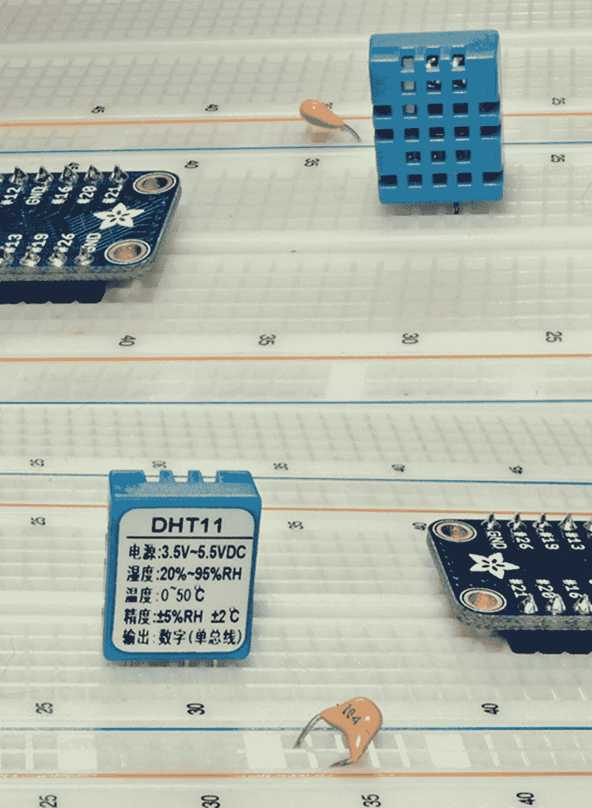
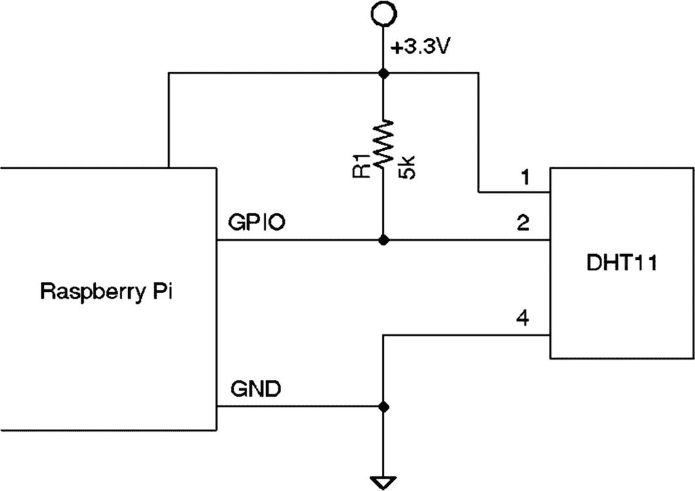
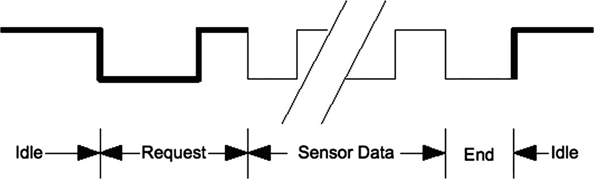
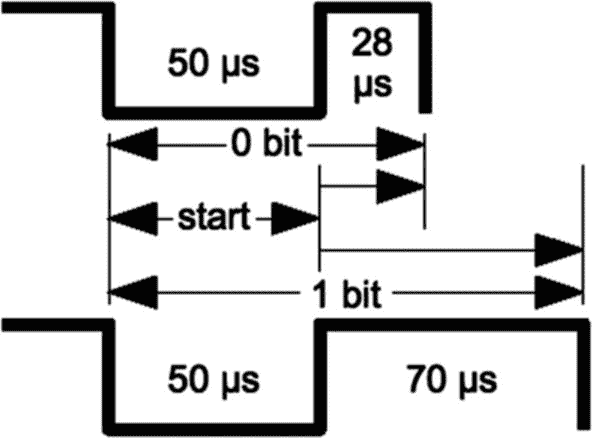
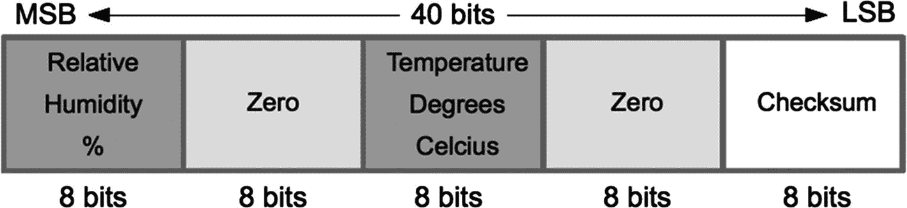
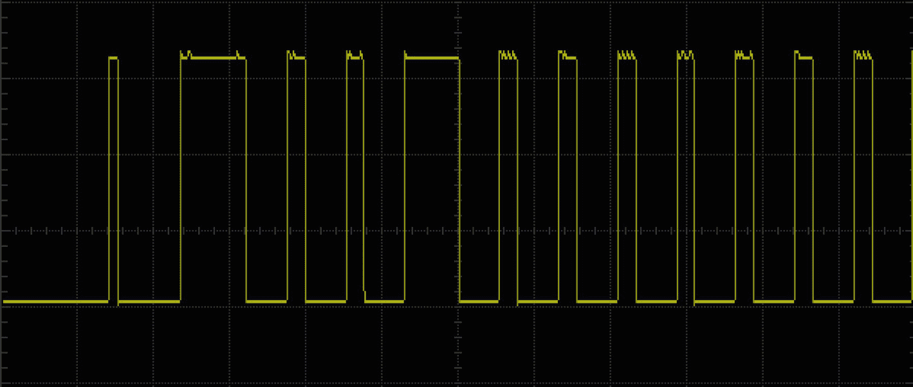

# 二十二、DHT11 传感器

DHT11 湿度和温度传感器是由 D-Robotics UK ( [`www.droboticsonline.com`](https://www.droboticsonline.com) )制造的经济型外设。它能够在 0 至 50°C 的工作温度范围内测量 20%至 90% RH 之间的相对湿度，精确度为±5% RH。温度测量范围为 0 至 50°C，精度为±2°C，两个值均以 8 位分辨率返回。

这种分配对于 Linux 应用程序来说是一种挑战，因为要适应信号时序限制。例如，在 Pi 启动传感器后，要测量的第一个事件发生在大约 12 μs 内。这需要一些特殊的处理。这个项目使用直接 GPIO 访问，因为 sysfs 驱动程序根本无法处理相关事件的速率。

## 特征

DHT 传感器使用的信号*与 1 线协议*相似，但响应时间不同。此外，没有设备序列号支持。这些因素使得该设备与 Linux 内核中的单线驱动程序不兼容。图 [22-1](#Fig1) 显示了位于试验板上的 DHT11 传感器。



图 22-1

DHT11 传感器前视图(左)，后视图(右)。引脚 1 是面向封装正面的最左侧引脚(左图)。

与许多单线外设不同，DHT11 传感器需要电源。数据手册指出，DHT11 可以在 3.3 至 5.5 V 的范围内供电(这也可以在图 [22-1](#Fig1) 中的器件背面看到)。从 Raspberry Pi 的 3.3 V 电源供电，可将信号电平保持在 GPIO 的安全范围内。该器件的功耗介于 0.5 和 2.5 mA 之间。对于那些担心电池寿命的人来说，其待机电流据说为 100 至 150 μA。

## 电路

图 [22-2](#Fig2) 显示了 Raspberry Pi 和 DHT11 传感器之间的一般电路连接。引脚 4 连接到公共地，而引脚 1 连接到 3.3 V 电源。引脚 2 是信号引脚，与选定的 GPIO 引脚通信。`dht11.c`的程序列表被配置为使用 GPIO 22。这可以在命令行上覆盖。



图 22-2

DHT11 电路

当 Pi 监听 GPIO 引脚而 DHT11 不发送数据时，线路会悬空。因此， *R* <sub>1</sub> 用于将线路上拉至 3.3 V 的电平。数据手册建议使用 5kω电阻(可以安全地用更常见的 4.7 千欧电阻代替)。激活时，GPIO 引脚或传感器上的负载小于 1 mA。数据手册还指出，5 千欧电阻应适用于最长 20 米的电缆。

## 草案

传感器只有在主人(Raspberry Pi)的刺激下才会说话。主机必须首先在总线上发出请求，并等待传感器做出响应。DHT 传感器响应 40 位信息，其中 8 位是校验和。

### 总体协议

整个信号协议是这样工作的:

1.  由于上拉电阻的原因，线路空闲为高电平。

2.  主机将线路拉低至少 18 ms，以发出读请求信号，然后释放总线，使线路返回高电平状态。

3.  暂停约 20 至 40 μs 后，传感器会将线路拉低 80 μs，然后再让线路返回高电平 80 μs，这表示它打算返回数据。

4.  然后，DHT11 将 40 位信息写入总线:每一位以 50 μs 低电平开始，随后是:
    1.  26 至 28 μs 的高电平表示 0 位

    2.  70 μs 高电平表示 1 位

5.  当传感器再次将线路拉低 50 μs 时，传输结束。

6.  传感器释放总线，使线路回到高空闲状态。

图 [22-3](#Fig3) 显示了传感器的整体协议。主控制用粗线表示，而传感器控制用细线表示。最初，总线处于空闲状态，直到主机将线路拉低并释放它(标记为 Request)。传感器抓取总线并发出信号表示总线正在响应(80 μs 低电平，然后 80 μs 高电平)。传感器以 40 位传感器数据结束，再一次转变为低电平(标记为 End)以标志最后一位的结束。



图 22-3

通用 DHT11 协议

### 数据位

如图 [22-4](#Fig4) 所示，每个传感器数据位开始转换为低电平，然后转换为高电平。当线路作为下一位的一部分再次变为低电平时，该位结束。最后一位由一个最终的低到高转换来标记。



图 22-4

DHT11 数据位

每个数据位从转换到低电平开始，持续 50 μs。最后一位之后最终转换到低电平也持续 50 μs。在该位从低电平转换到高电平之后，如果高电平仅持续 26 到 28 μs，则该位变为 0 位。1 位则保持高电平 70 μs。

### 数据格式

图 [22-5](#Fig5) 显示了 40 位传感器响应，首先传输最高有效位。数据手册规定了 16 位相对湿度、16 位摄氏度温度和 8 位校验和。然而，DHT11 总是为湿度和温度分数字节发送 0。因此，该器件每次测量的精度实际上只有 8 位。据推测，其他模型(或未来的模型)提供了更高精度的分数值。



图 22-5

DHT11 数据格式

校验和是前 4 个字节的简单总和。任何进位溢出都被简单地丢弃。这种校验和使您的应用程序在面临可能的接收错误时更有信心接收到正确的值。

图 [22-6](#Fig6) 显示了 DHT11 信号的总体范围轨迹。在该图中，水平轴由 Pi 驱动的 30 ms 低电平信号控制，用于唤醒器件。DHT11 在第一个初始尖峰后发送其 40 位数据，如右图所示。数据手册指出，每秒钟对传感器的查询不应超过一次。


图 22-6

DHT11 信号的范围跟踪概述

DHT11 响应数据的特写如图 [22-7](#Fig7) 所示。第一个高电平脉冲(左侧)来自 Pi，它释放总线并允许上拉电阻提高总线电压。12 μs 后，DHT11 将总线拉低 80 μs，然后让总线再拉高 80 μs，这标志着随后 40 位数据的开始。



图 22-7

DHT11 响应数据位开始的范围跟踪

### 软件

为读取 Raspberry Pi 上的 DHT11 传感器而编写的用户空间软件使用 GPIO 引脚的直接寄存器访问。这种方法带来的挑战包括:

*   短时序:26 至 70 μs

*   Linux 内核中的抢占式调度延迟

一种方法是计算在到达位的末端之前(当线路变低时)程序可以读取高电平信号的次数。然后决定 0 位用于较短时间，1 位用于较长时间。经过一些实验后，可以画出一条分界线，其中较短的信号表示 0，而其他信号表示 1。

### 源代码

这个项目的源代码可以在以下目录中找到:

```sh
$ cd ~/RPi/dht11

```

要从头开始重建应用程序，请执行以下操作:

```sh
$ make clobber
$ make

```

使用-h 选项可以获得帮助:

```sh
$ ./dht11 -h
Usage: ./dht11 [-g gpio] [-h]
where:
      -g gpio   Specify GPIO pin (22 is default)
      -h        This help

```

### 时机

这种应用的主要挑战之一是执行快速准确的计时。但是，我们无法通过 NTP 守护程序(网络时间协议)更新系统时钟来获得准确的时间测量。因此，我们不依赖挂钟的时间感，而是使用 Linux *单调*时钟。这也可以由系统稍微调整，但我们保证这个时钟只在时间上向前递增。

清单 [22-1](#PC5) 展示了用于从 Raspbian Linux 获取单调时间的短内联函数。Linux 将 struct timespec 声明为:

```sh
struct timespec {
    time_t  tv_sec;     /* seconds */
    long    tv_nsec;    /* and nanoseconds */
}

```

所以我们的`timeofday()`函数将返回秒和纳秒。

```sh
0042: static inline void
0043: timeofday(struct timespec *t) {
0044:     clock_gettime(CLOCK_MONOTONIC,t);
0045: }

Listing 22-1The dht11.c, timeofday() function

```

计算经过时间的一般程序是:

1.  捕捉初始时间(称之为 t0)。

2.  在事件发生后捕获当前时间(称之为 t1)。

清单 [22-2](#PC6) 中`ns_diff()`形式的 a 函数用于计算经过的时间。

```sh
0057: static inline long
0058: ns_diff(struct timespec *t0,struct timespec *t1) {
0059:     int dsec = (int)(t1->tv_sec - t0->tv_sec);
0060:     long dns = t1->tv_nsec - t0->tv_nsec;
0061:
0062:     assert(dsec >= 0);
0063:     dns += dsec * 1000000000L;
0064:     return dns;
0065: }

Listing 22-2The dht11.c, ns_diff() function to calculate elapsed time in nanoseconds

```

### 主循环

主循环位于 main()函数中。处理完命令行选项后，循环的顶部如清单 [22-3](#PC7) 所示。

```sh
0192: gpio_open();
0193:
0194: gpio_configure_io(gpio_pin,Output);
0195: gpio_write(gpio_pin,1);
0196:
0197: for (;; ++reading) {
0198:        wait_ready();
0199:
0200:        gpio_write(gpio_pin,1);
0201:        gpio_configure_io(gpio_pin,Output);
0202:        wait_ms(3);

Listing 22-3The top of the main loop in dht11.c

```

第 192 行初始化用于直接 GPIO 访问的库(见源文件`libgp.c`和`libgp.h`)。随后，GPIO 引脚被配置为线 194 中的输出，并且最初在线 195 中被驱动为高电平。

主循环从第 197 行开始。计数器变量`reading`仅用于在输出报告中提供递增的读数计数器。第 198 行启动功能`wait_ready()`，稍后将对其进行描述。其目的是防止程序查询 DHT11 设备的频率超过每秒一次。如果查询太频繁，设备就无法响应。

在确定可以查询 DHT11 设备之后，行 200 将 GPIO 输出的电平设置为高。除了第一次进入环路，GPIO 被配置为一个*输入*引脚。在将其配置为线 201 中的*输出*之前将其设置为高意味着当 GPIO 再次成为输出时，从其当前输入状态转换为高时没有毛刺。线路 202 简单地等待 3 ms 以允许线路稳定。

### 等待毫秒( )

为了提供相当精确的毫秒级等待功能，使用了`poll(2)`系统调用(清单 [22-4](#PC8) )。这通常用于监控打开的文件描述符。但是`poll(2)`可以不带描述符使用，利用它的超时参数(第 92 行的参数三)。注意参数二是如何表示零个文件描述符条目的。

```sh
0087: static void
0088: wait_ms(int ms) {
0089: struct pollfd p[1];
0090: int rc;
0091:
0092: rc = poll(&p[0],0,ms

);
0093: assert(!rc);
0094: }

Listing 22-4The wait_ms() function in dht11.c

```

### 等待就绪( )

该功能用于防止过于频繁地查询设备。清单 [22-5](#PC9) 展示了所使用的代码。

```sh
0067: static void
0068: wait_ready(void) {
0069: static struct timespec t0 = {0L,0L};
0070: struct timespec t1;
0071:
0072: if ( !t0.tv_sec ) {
0073:        timeofday(&t0);
0074:        --t0.tv_sec;
0075: }
0076:
0077: for (;;) {
0078:        timeofday(&t1);
0079:        if ( ms_diff(&t0,&t1) >= 1000 ) {
0080:              t0 = t1;
0081:              return;
0082:        }
0083:        usleep(100);
0084:  }
0085: }

Listing 22-5The wait_ready() function in dht11.c

```

变量`t0`的`static`值用零建立。当第一次输入代码时，日期/时间在第 73 行被初始化，然后减去一秒(第 74 行)。减去 1 允许第一次立即通过。

第 77 到 84 行中的循环每 100 微秒采样一次时间，如果从最后一次设备请求开始至少过去了一秒钟，则在第 81 行返回。

### 阅读 DHT11

现在有趣的部分来了——读取设备响应。清单 [22-6](#PC10) 展示了所使用的逻辑。回想一下，线路 206 驱动总线线路为低，以唤醒设备。那么 30 ms 是在 GPIO 变成*输入*引脚之前使用的延迟时间(第 207 和 208 行)。通过将 GPIO 配置为输入引脚，我们现在让上拉电阻接管并将总线电压上拉至+3.3 V。

此时，DHT11 将最终抢占总线并做出响应。我们使用函数`wait_change()`等待换行(第 210 行)。它返回总线线路的当前(最终)状态，并用过去的纳秒数填充变量`nsec`。

第一次转换有时发生得如此之快(在 Raspberry Pi 3 B+上)，以至于它看到自己的 GPIO 线在上拉电阻完成其工作之前*从低到高。第 219 行测试了这一点，如果这确实是真的，我们等待另一个信号转换——我们关心的信号转换，即从高到低的转换(第 220 行)。如果最终状态仍然是 1 位，或者`nsec`中的时间太高，我们拒绝响应并重新开始(第 221 到 223 行)。*

```sh
0206:        gpio_write(gpio_pin,0);
0207:        wait_ms(30);
0208:        gpio_configure_io(gpio_pin,Input);
0209:
0210:        b = wait_change(&nsec);
0211:
0212:        /*
0213:         * If the returned value is 1, it is likely
0214:         * that we were fast enough to catch the
0215:         * pullup resistor action. When that happens
0216:         * look for the next transition

(expecting
0217:         * b == 0).
0218:         */
0219:        if ( b == 1 )
0220:              b = wait_change(&nsec);
0221:        if ( b || nsec > 20000 ) { // Expecting about 12 us
0222:              printf("%04d: Fail, b0=%d, %ld nsec\n",reading,b,nsec);
0223:              continue;
0224:        }
0225:
0226:        /*
0227:         * This is the 80 us transition from 0 to 1:
0228:         */
0229:        b = wait_change(&nsec);
0230:        if ( !b || nsec < 40000 || nsec > 90000 ) {
0231:              printf("%04d: Fail, b1=%d, %ld nsec\n",reading,b,nsec);
0232:              continue;
0233:        }
0234:
0235:        /*
0236:         * Wait for the 80 us transition from 1 to 0:
0237:         */
0238:        b = wait_change(&nsec);
0239:
0240:        if ( b != 0 || nsec < 40000 || nsec > 90000 ) {
0241:              printf("%04d: Fail, b2=%d, %ld nsec\n",reading,b,nsec);
0242:              continue;
0243:        }
0244:
0245:        /*
0246:         * Read the 40-bit value from the DHT11\. The
0247:         * returned value is distilled into 16-bits:
0248:         */
0249:        unsigned resp = read_40bits();

Listing 22-6Reading the DHT11 response in dht11.c

```

在进入线 229 时，该线为低。等待下一个转换应该报告总线已经变高，时间接近 80 μs。如果最终状态不是高，或者时间太长，则在第 230 到 232 行拒绝响应。

如果通过，则在第 240 到 243 行测量从高到低的下一次转换。同样，如果测量的信号不正确，响应被拒绝，程序在循环的顶部再次尝试。

最后，在第 259 行，DHT11 的 40 位响应准备好被读取。

### 等待 _ 更改( )

wait_change()函数用于监控 GPIO 的信号变化。如果信号最初为低电平，它会一直等待，直到信号变为高电平并重新开启。如果信号最初为高电平，它会一直等到信号变为低电平并返回 0。除了等待状态更改之外，还会返回经过的纳秒数。该功能如清单 [22-7](#PC11) 所示。

```sh
0024: static volatile bool timeout = false;
...
0096: static inline int
0097: wait_change(long *nsec) {
0098:  int b1;
0099:  struct timespec t0, t1;
0100:  int b0 = gpio_read(gpio_pin);
0101:
0102:  timeofday(&t0);
0103:
0104:  while ( (b1 = gpio_read(gpio_pin)) == b0 && !timeout )
0105:       ;
0106:  timeofday(&t1);
0107:
0108:  if ( !timeout ) {
0109:        *nsec = ns_diff(&t0,&t1);
0110:        return b1;
0111:  }
0112:  *nsec = 0;
0113:  return 0;
0114: }

Listing 22-7The wait_change() function from dht11.c

```

程序读取 GPIO 的当前读数，并将其保存在变量`b0`(第 100 行)。初始时间`t0`在线 102 中被捕获。第 104 行和第 105 行的 null 语句形成了一个紧密的循环。当前的 GPIO 读数被读取并存入变量`b1`。只要`b1`的值等于初始值`b0`，循环就继续。变量`timeout`也被测试。只要`volatile bool timeout`保持`false`，循环就会继续。稍后，我们将看到`timeout`值是如何设置的。

一旦 GPIO 从初始值改变，循环通常退出。停止时间被捕获到第 106 行的`t1`中。只要没有超时，第 109 行计算并返回经过的纳秒数。第 110 行返回 GPIO 的当前状态。

当超时发生时，我们简单地返回零表示经过的时间，返回零表示当前的 GPIO 值。此时的目的是跳出 while 循环。错过的事件可能会发生，尤其是因为 Linux 操作系统可以抢占程序的执行。如果它试图读取 40 位数据，但错过了一个或两个信号变化的读数，循环可能会永远挂起。

### 超时处理

考虑到程序挂起的可能性，使用了间隔计时器。在一个关键部分的开始，通过调用清单 [22-8](#PC12) 中的 set_timer()来启动定时器。这在 Linux 内核中启动了一个定时器，除了启动之外，我们不需要管理它。

间隔定时器的配置在结构定时器中建立(第 28 到 31 行)。我们不希望计时器重启，所以将`timer.it_interval`成员初始化为零(第 29 行)。第 34 行和第 35 行确定了我们希望在定时器到期之前经过的时间。一旦定时器到期，它将不会自动更新。

当定时器到期时，Linux 内核将调用我们在第 145 到 147 行声明的名为`sigalrm_handler()`的超时处理程序。它所做的只是将布尔变量`timeout`设置为`true`。信号处理程序被异步调用。因此，它们决不能调用不可重入的例程，如`printf()`或`malloc()`等。因为电话随时可能打来。当信号在执行过程中中断`malloc()`时，你不会想要调用`malloc()`。

还因为信号处理器是*异步*，它的处理就像另一个线程。如果变量`timeout`没有被声明为`volatile`，循环代码可能永远不会注意到它被更改为 true，因为编译器将该值缓存在寄存器中。

```sh
0026: static inline void
0027: set_timer(long usec) {
0028:  static struct itimerval timer = {
0029:        { 0, 0 },    // Interval
0030:        { 0, 0 }     // it_value
0031:  };
0032:  int rc;
0033:
0034:  timer.it_value.tv_sec = 0;
0035:  timer.it_value.tv_usec = usec;
0036:
0037:  rc = setitimer(ITIMER_REAL,&timer,NULL);
0038:  assert(!rc);
0039:  timeout = false;
0040: }
...
0144: static void
0145: sigalrm_handler(int signo) {
0146:  timeout = true;
0147: }

Listing 22-8The timer and handler in dht11.c

```

信号 SIGALRM 的定时器处理程序的初始设置在主程序中执行，如清单 [22-9](#PC13) 所示。一旦建立了超时处理程序，它只需要调用`set_timer()`来启动它。这是在读取总线上信号的较大循环开始时执行的。如果定时器在 DHT11 的整个响应被读取之前被触发，则循环从清单 [22-7](#PC11) 的第 104 行退出。

```sh
0187:  new_action.sa_handler = sigalrm_handler;
0188:  sigemptyset(&new_action.sa_mask);
0189:  new_action.sa_flags = 0;
0190:  sigaction(SIGALRM,&new_action,NULL);

Listing 22-9The timer setup in dht11.c

```

## 示范

一旦你接通电源，演示程序就可以开始了。该示例说明了将 GPIO 指定为 22，但这是默认值。

```sh
$ ./dht11 -g22
0000: RH 32% Temperature 25 C
0001: RH 32% Temperature 26 C
0002: RH 32% Temperature 26 C
0003: RH 32% Temperature 26 C
0004: RH 32% Temperature 26 C
0005: RH 32% Temperature 26 C
0006: RH 32% Temperature 26 C
0007: RH 32% Temperature 26 C
0008: RH 32% Temperature 26 C

```

在快速 Pi 上，比如 Pi 3 B+，您应该看到这样的输出。如果您没有看到任何成功的读取，那么检查您的布线。不要忘记上拉电阻。

但是，由于错过了事件，可能会看到一些错误:

```sh
0040: RH 32% Temperature 26 C
0041: Fail, Checksum error.
0101: RH 32% Temperature 26 C
0102: RH 32% Temperature 26 C
0103: RH 32% Temperature 26 C
0104: RH 32% Temperature 26 C
0105: Fail, Checksum error.
0106: RH 32% Temperature 26 C

```

不要对此感到惊讶，因为我们是在非实时操作系统上执行信号的实时测量。由于性能较低，Raspberry Pi Zero 和 Zero W 可能会出现更多错误。零点仍然会经常返回好的读数，足以使项目有价值。在一个已完成的项目中，您只需修改代码来隐藏错误报告。

## 摘要

本章解决了在不提供实时调度的系统上读取 DHT11 实时信号的困难。通过使用直接 GPIO 访问，我们获得了足够快的访问速度来测量信号变化。如果程序因等待丢失事件而停滞不前，应用间隔计时器可以提供恢复安全性。这些是解决棘手问题必须做的一些偷偷摸摸的事情。