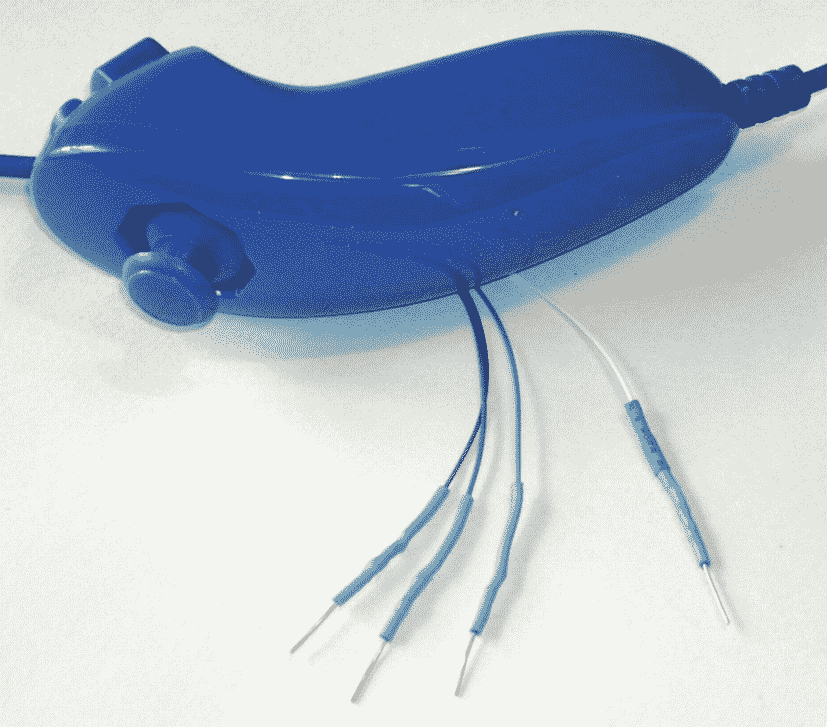
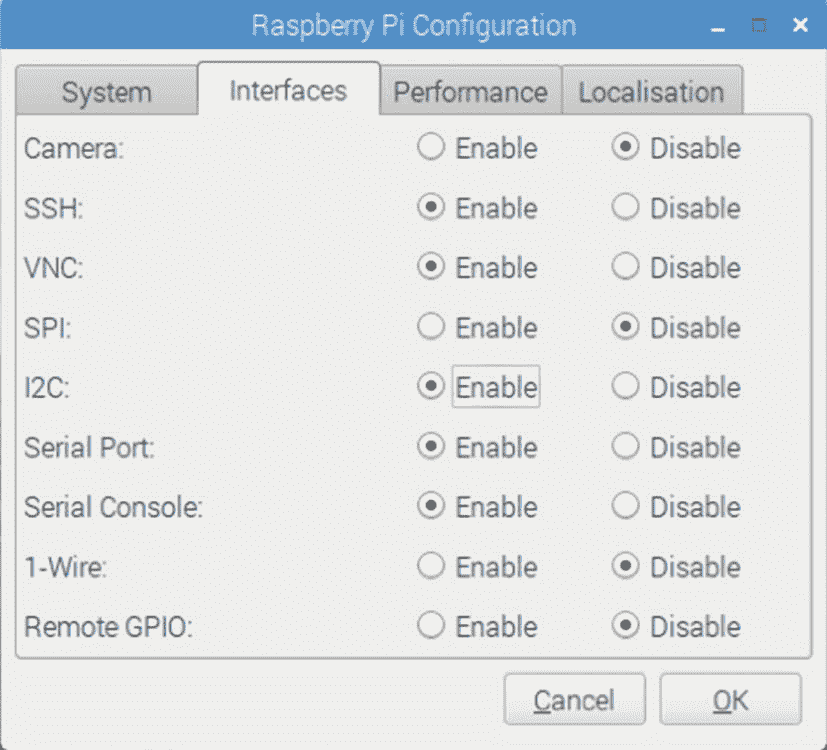

# 二十三、双节棍鼠标

你可能没有实际使用任天堂 Wii 双节棍作为树莓派鼠标，但它是一个很好的例子，说明液晶触摸屏如何提供输入事件。

双截棍有两个按钮:一个 X-Y 操纵杆；以及 X、Y 和 Z 加速度计。传感器数据通过 I <sup>2</sup> C 总线进行通信。这也将给我们一个使用 I <sup>2</sup> C C API 的练习。让我们来为 X Window 系统桌面实现一个双节棍定点设备。

## 项目概述

我们面临的挑战分为两大类:

*   双截棍设备的 I <sup>2</sup> C 数据通信

*   将检测到的数据插入 X 窗口系统桌面事件队列

让我们首先从 Linux API 的角度检查 I <sup>2</sup> C，然后完成将接收到的事件插入 X Window 系统这一章。

## 双截棍特色

双截棍的基本物理和数据特征列于表 [23-1](#Tab1) 中。

表 23-1

双截棍控件和数据特征

<colgroup><col class="tcol1 align-left"> <col class="tcol2 align-center"> <col class="tcol3 align-center"> <col class="tcol4 align-left"></colgroup> 
| 

用户界面特征

 | 

位

 | 

数据

 | 

硬件/芯片

 |
| --- | --- | --- | --- |
| c 按钮 | one | 布尔代数学体系的 | 薄膜开关 |
| z 按钮 | one | 布尔代数学体系的 | 薄膜开关 |
| X-Y 操纵杆 | 8x2 | 整数 | 30 千欧姆电位器 |
| x、Y 和 Z 加速度计 | 10x3 | 整数 | ST LIS3L02 系列 |

对于作为鼠标的应用，C 和 Z 按钮代替了鼠标左键和右键。操纵杆用于定位鼠标光标。虽然双截棍通常以 400 kHz 的时钟频率运行，但它在 100 kHz I <sup>2</sup> C 频率下也能正常工作。

## 连接器引脚排列

有四根线:其中两根是电源和地线(一些单元可能有两根额外的线，一根连接到屏蔽层，另一根连接到未使用的中心引脚)。其余两根线用于 I <sup>2</sup> C 通信(SDA 和 SCL)。表 [23-2](#Tab2) 显示了电缆端连接器内的连接。

表 23-2

双节棍电缆连接

<colgroup><col class="tcol1 align-center"> <col class="tcol2 align-center"> <col class="tcol3 align-center"></colgroup> 
| 

圣地亚哥

 | 

等级

 | 

接地

 |
| --- | --- | --- |
| +3.3 伏 | 不适用 | 国家药品监督管理局 |

Nunchuk 连接器非常不标准。有些人已经推出了自己的适配器，使用双面 PCB 来匹配内部连接。其他人从易贝购买了适配器。廉价的克隆双节棍也可以在易贝找到。随着越来越多的克隆适配器以更具竞争力的价格上市，没有理由切断克隆适配器的连接器。

### 小费

当心双节棍赝品。

如果你真的切断了连接器，你会很快发现没有标准的电线配色方案。你唯一能指望的是引脚的布局如表 [23-2](#Tab2) 所示。如果你有一个真正的 Wii 双截棍，表 [23-3](#Tab3) 中列出的电线颜色可能是有效的。标有“克隆线”的列列出了我自己的克隆线的线颜色。*你的可能会不同*。

表 23-3

双节棍连接器布线

<colgroup><col class="tcol1 align-center"> <col class="tcol2 align-center"> <col class="tcol3 align-center"> <col class="tcol4 align-center"> <col class="tcol5 align-center"></colgroup> 
| 

别针

 | 

Wii Wire

 | 

克隆线

 | 

描述

 | 

第一亲代

 |
| --- | --- | --- | --- | --- |
| 接地 | 白色的 | 白色的 | 地面 | P1-25 |
| 国家药品监督管理局 | 格林（姓氏）；绿色的 | 蓝色 | 数据 | P1-03 |
| +3.3 伏 | 红色 | 红色 | 电源 | P1-01 |
| 圣地亚哥 | 黄色 | 格林（姓氏）；绿色的 | 时钟 | P1-05 |

<sup>*克隆电线颜色各异！*</sup>

在您从克隆体上切下连接器之前，考虑您将需要追踪连接器到一个电线颜色。切断电缆，为连接器留下大约 3 英寸的电线。然后，您可以切断绝缘层，用欧姆表(或查看电缆端连接器内部)追踪引脚到导线。

图 [23-1](#Fig1) 为作者的克隆双截棍，连接器被切断。代替连接器的是焊接实心线末端，并在焊接点上施加一块热缩材料。实心线端非常适合插入原型试验板。



图 23-1

双截棍克隆，电线末端焊接在

## 启用 I2C

您需要启用您的 I2C 支持。进入 Raspberry Pi 配置面板，打开 I2C(图 [23-2](#Fig2) )。然后重启使其生效。



图 23-2

在 Raspberry Pi 配置面板中启用 I2C 支持

## 测试连接

将 I <sup>2</sup> C 连接插入 Pi，并用`i2cdetect`命令探测。

```sh
$ i2cdetect -y 1
     0  1  2  3  4  5  6  7  8  9  a  b  c  d  e  f
00:          -- -- -- -- -- -- -- -- -- -- -- -- --
10: -- -- -- -- -- -- -- -- -- -- -- -- -- -- -- --
20: -- -- -- -- -- -- -- -- -- -- -- -- -- -- -- --
30: -- -- -- -- -- -- -- -- -- -- -- -- -- -- -- --
40: -- -- -- -- -- -- -- -- -- -- -- -- -- -- -- --
50: -- -- 52 -- -- -- -- -- -- -- -- -- -- -- -- --
60: -- -- -- -- -- -- -- -- -- -- -- -- -- -- -- --
70: -- -- -- -- -- -- -- --
$

```

如果双截棍正在工作，它将显示在十六进制地址 52 处。验证完硬件之后，是时候继续软件了。

## 双截棍 I <sup>2</sup> C 协议

双截棍包含一个古怪的小控制器，通过 I <sup>2</sup> C 总线进行通信。为了知道写入的字节存储在哪里，写入的第一个字节必须是 8 位寄存器地址。换句话说，每次写入双节棍都需要满足以下要求:

*   一个*寄存器*地址字节，随后是

*   要写入连续位置的零个或多个*数据*字节

因此，对于写操作，发送到双节棍的第一个字节告诉它从哪里开始。接收到的任何后续写入字节写入时，寄存器地址都会递增。

### 小费

不要将寄存器地址与双节棍的 I <sup>2</sup> C 地址 0x52 混淆。

也可以写入寄存器地址，然后读取字节。该程序指定了要读取的数据字节的起始位置。

Nunchuk 控制器的奇特之处在于，写入寄存器地址和读取数据之间必须有短暂的延迟。先执行写操作，然后立即执行读操作不起作用。然而，在寄存器地址之后立即写入数据确实会成功。

### 加密

双截棍被设计成提供一个*加密的*链接。但是，可以通过某种方式初始化来禁用它。失败程序如下:

1.  将 0x55 写入 Nunchuk 寄存器位置 0xF0。

2.  暂停一下。

3.  将 0x00 写入 Nunchuk 寄存器位置 0xFB。

下面说明了所涉及的消息序列。注意，这是作为两个分开的 I <sup>2</sup> C 写操作来执行的:

<colgroup><col class="tcol1 align-left"> <col class="tcol2 align-center"> <col class="tcol3 align-left"> <col class="tcol4 align-left"> <col class="tcol5 align-center"></colgroup> 
| 

写

 | 

中止

 | 

写

 |
| --- | --- | --- |
| 寡霉素敏感比较因子 | Fifty-five | - | 运货单(freight bill) | 00 |

一旦成功执行，所有将来的数据都将以未加密的形式返回。

### 读取传感器数据

双节棍的全部意义在于读取它的传感器数据。当被请求时，它返回如表 [23-4](#Tab4) 所示格式的 6 字节数据。

表 23-4

Nunchuk Data

<colgroup><col class="tcol1 align-center"> <col class="tcol2 align-center"> <col class="tcol3 align-left"></colgroup> 
| 

字节

 | 

位

 | 

描述

 |
| --- | --- | --- |
| one |   | 模拟杆 x 轴值 |
| Two |   | 模拟棒 y 轴值 |
| three |   | x 加速度位 9:2 |
| four |   | y 加速度位 9:2 |
| five |   | z 加速度位 9:2 |
| six | Zero | 按下 z 按钮(低电平有效) |
| one | 按下 c 按钮(低电平有效) |
| 3:2 | x 加速度位 1:0 |
| 5:4 | y 加速度位 1:0 |
| 7:6 | z 加速度位 1:0 |

一些数据被分割成多个字节。例如，X 加速度位 9:2 从字节 3 获得。最低 2 位位于字节 6 的第 3 位和第 2 位。这些共同构成 9 位 X 加速度值。

为了检索这些数据，我们总是需要告诉双节棍从哪里开始。因此，该序列总是从写入偏移量 0x00 开始，然后暂停:

<colgroup><col class="tcol1 align-center"> <col class="tcol2 align-center"> <col class="tcol3 align-left"> <col class="tcol4 align-center"> <col class="tcol5 align-center"> <col class="tcol6 align-center"> <col class="tcol7 align-center"> <col class="tcol8 align-center"></colgroup> 
| 

写

 | 

中止

 | 

读取 6 个字节

 |
| --- | --- | --- |
| 00 | - | 01 | 02 | 03 | 04 | 05 | 06 |

双节棍不允许我们在一个`ioctl(2)`调用中，作为两个 I/O 消息来做这件事。写入零后必须有一个停顿。那么这六个数据字节可以作为一个单独的 I <sup>2</sup> C 读操作来读取。但是，如果暂停时间过长，Nunchuk 控制器就会超时，导致返回不正确的数据。所以我们必须用双截棍的方式做事。

## Linux 用户界面

虽然阅读双节棍很有趣，但我们需要将它作为鼠标应用到桌面上。我们需要根据从中读取的内容插入鼠标事件。

Linux `uinput`驱动程序允许程序员开发非标准的输入驱动程序，以便可以将事件注入到输入流中。这种方法允许在不改变应用代码的情况下添加新的输入流(比如触摸屏输入)。

可以在以下站点找到 uinput API 的文档:

*   “1.7。输入模块“ [`https://www.kernel.org/doc/html/v4.12/input/uinput.html`](https://www.kernel.org/doc/html/v4.12/input/uinput.html)

另一个信息来源是设备驱动程序源代码本身:

```sh
drivers/input/misc/uinput.c

```

本章提供的示例程序有助于将所有必要的细节整合在一起。

### 使用头文件

`uinput` API 所需的头文件包括以下内容:

```sh
#include <sys/ioctl.h>
#include <linux/input.h>
#include <linux/uinput.h>

```

为了利用 I <sup>2</sup> C 编译代码，您还需要安装`libi2c`开发库，如果您还没有这样做的话:

```sh
$ sudo apt-get install libi2c-dev

```

### 打开设备节点

打开设备节点，连接到`uinput`设备驱动程序:

```sh
/dev/uinput

```

以下是必需的`open(2)`调用的示例:

```sh
int fd;

fd = open("/dev/uinput",O_WRONLY|O_NONBLOCK);
if ( fd < 0 ) {
    perror("Opening /dev/uinput");
    ...

```

### 配置事件

为了插入事件，驱动程序必须配置为接受它们。下面代码中对`ioctl(2)`的每次调用都会基于参数*事件*启用一类事件。以下是一个概括的例子:

```sh
int rc;
unsigned long event = EV_KEY;

rc = ioctl(fd,UI_SET_EVBIT,event);
assert(!rc);

```

表 [23-5](#Tab5) 中提供了`UI_SET_EVBIT`事件类型的列表。最常用的事件类型是`EV_SYN`、`EV_KEY`和`EV_REL`(或`EV_ABS`)。

表 23-5

uinput 事件类型列表

<colgroup><col class="tcol1 align-center"> <col class="tcol2 align-left"></colgroup> 
| 

从头文件输入. h

 |
| --- |
| 巨 | 描述 |
| 我的儿子 | 事件同步/分离 |
| EV_KEY | 按键/按钮状态改变 |
| 家庭暴力 | 相对轴鼠标状变化 |
| 电动汽车 _ABS | 绝对轴鼠标状变化 |
| ev _ MSC(MSC)工作表 | 杂项事件 |
| 电动自行车 _ 软件 | 二进制(开关)状态变化 |
| 电动汽车 _LED | LED 开/关变化 |
| S7-1200 可编程控制器 | 输出到声音设备 |
| 电动汽车代表 | 用于自动重复设备 |
| 电动汽车 | 向输入设备强制反馈命令 |
| EV_PWR | 电源按钮/开关事件 |
| 电动汽车 _ FF _ 状态 | 接收力反馈设备状态 |

### 警告

不要将事件类型放在一起。设备驱动程序期望每个事件类型被分别注册*。*

 *#### 配置 EV_KEY

一旦您注册了提供`EV_KEY`事件的意图，您需要注册所有可能使用的关键代码。虽然这看起来很麻烦，但它确实可以防止错误程序注入垃圾。下面的代码注册了它注入转义键代码的意图:

```sh
int rc;

rc = ioctl(fd,UI_SET_KEYBIT,KEY_ESC);
assert(!rc);

```

要配置所有可能的密钥，可以使用循环。但不要注册密钥代码 0 ( `KEY_RESERVED`)或 255；包含文件表明代码 255 是为 at 键盘驱动程序的特殊需要而保留的。

```sh
int rc;
unsigned long key;

for ( key=1; key<255; ++key ) {
    rc = ioctl(fd,UI_SET_KEYBIT,key);
    assert(!rc);
}

```

#### 鼠标按钮

除了键码，同样的`ioctl(2,UI_SET_KEYBIT)`调用用于注册鼠标、操纵杆和其他按钮事件。这包括来自触控板、平板电脑和触摸屏的触摸事件。头文件`linux/input.h`中定义了按钮代码的长列表。常见的嫌疑人如表 [23-6](#Tab6) 所示。

表 23-6

关键事件宏

<colgroup><col class="tcol1 align-center"> <col class="tcol2 align-center"> <col class="tcol3 align-left"></colgroup> 
| 

巨

 | 

同义词

 | 

描述

 |
| --- | --- | --- |
| BTN _ 左 | btn _ 鼠标 | 鼠标左键 |
| BTN 对吗 |   | 鼠标右键 |
| BTN 中部 |   | 鼠标中键 |
| BTN_SIDE |   | 鼠标侧键 |

以下示例显示了应用注入鼠标左键和右键事件的意图:

```sh
int rc;

rc=ioctl(fd,UI_SET_KEYBIT,BTN_LEFT);
assert(!rc);
rc = ioctl(fd,UI_SET_KEYBIT,BTN_RIGHT);
assert(!rc);

```

#### 配置电动汽车 _REL

为了注入`EV_REL`事件，必须预先登记相对运动的类型。有效参数代码的完整列表如表 [23-7](#Tab7) 所示。以下示例表明了注入 x 轴和 y 轴相对运动的意图:

表 23-7

UI_SET_RELBIT 选项

<colgroup><col class="tcol1 align-center"> <col class="tcol2 align-left"></colgroup> 
| 

巨

 | 

目的

 |
| --- | --- |
| REL_X | 发送相对 X 变化 |
| 继电器 _Y | 发送相对 Y 变化 |
| REL_Z | 发送相对 Z 值变化 |
| REL_RX | x 轴倾斜 |
| 继电器 _RY | y 轴倾斜 |
| rel _ 罗马 | z 轴倾斜 |
| REL_HWHEEL | 水平车轮更换 |
| REL_DIAL | 转盘改变 |
| REL 车轮 | 换车轮 |
| REL_MISC | 多方面的 |

```sh
rc = ioctl(fd,UI_SET_RELBIT,REL_X);
assert(!rc);
rc = ioctl(fd,UI_SET_RELBIT,REL_Y);
assert(!rc);

```

#### 配置 EV_ABS

虽然这个项目不使用`EV_ABS`选项，但是了解这个特性可能是有用的。这个事件代表绝对的光标移动，它也需要意图的注册。`EV_ABS`代码的完整列表在`linux/input.h`中定义。表 [23-8](#Tab8) 中定义了通常的嫌疑人。

表 23-8

绝对光标移动事件宏

<colgroup><col class="tcol1 align-left"> <col class="tcol2 align-left"></colgroup> 
| 

巨

 | 

描述

 |
| --- | --- |
| ABS_X | 将 X 移动到这个绝对 X 坐标 |
| ABS_Y | 将 Y 移动到这个绝对 Y 坐标 |

以下是注册绝对 x 轴和 y 轴事件意图的示例:

```sh
int rc;

rc = ioctl(fd,UI_SET_ABSBIT,ABS_X);
assert(!rc);
rc = ioctl(fd,UI_SET_ABSBIT,ABS_X);
assert(!rc);

```

除了注册注入这些事件的意图之外，还需要定义一些坐标参数。下面是一个例子:

```sh
struct uinput_user_dev uinp;

uinp.absmin[ABS_X] = 0;
uinp.absmax[ABS_X] = 1023;

uinp.absfuzz[ABS_X] = 0;
uinp.absflat[ABS_X] = 0;

uinp.absmin[ABS_Y] = 0;
uinp.absmax[ABS_Y] = 767;

uinp.absfuzz[ABS_Y] = 0;
uinp.absflat[ABS_Y] = 0;

```

这些值必须作为`ioctl(2,UI_DEV_CREATE)`操作的一部分来建立，这将在下面描述。

### 创建节点

在所有向`uinput`设备驱动程序的注册完成后，最后一步是创建`uinput`节点。这将由接收应用使用，以便读取注入的事件。这涉及两个编程步骤:

1.  用`write(2)`将结构`uinput_user_dev`信息写入文件描述符。

2.  执行`ioctl(2,UI_DEV_CREATE)`以创建`uinput`节点。

第一步涉及填充以下结构:

```sh
struct input_id {
    __u16       bustype;
    __u16       vendor;
    __u16       product;
    __u16       version;
};

struct uinput_user_dev {
    char        name[UINPUT_MAX_NAME_SIZE];
    struct input_id id;
    int         ff_effects_max;
    int         absmax[ABS_CNT];
    int         absmin[ABS_CNT];
    int         absfuzz[ABS_CNT];
    int         absflat[ABS_CNT];
};

```

下面提供了一个填充这些结构的示例。如果您计划注入`EV_ABS`事件，您还必须填充`abs`成员，在“配置`EV_ABS`一节中提到过。

```sh
       struct uinput_user_dev uinp;
       int rc;

       memset(&uinp,0,sizeof uinp);

       strncpy(uinp.name,"nunchuk",UINPUT_MAX_NAME_SIZE);

       uinp.id.bustype = BUS_USB;
       uinp.id.vendor = 0x1;
       uinp.id.product = 0x1;
       uinp.id.version = 1;

//       uinp.absmax[ABS_X] = 1023; /∗EV_ABS only ∗/
//       ...

       rc = write(fd,&uinp,sizeof(uinp));
       assert(rc == sizeof(uinp));

```

对`write(2)`的调用将所有这些重要信息传递给`uinput`驱动程序。现在剩下的就是请求创建一个设备节点供应用使用:

```sh
int rc;

rc = ioctl(fd,UI_DEV_CREATE);
assert(!rc);

```

该步骤使`uinput`驱动程序使一个设备节点出现在伪目录`/dev/input`中。这里显示了一个示例:

```sh
$ ls -l /dev/input
total 0
crw-rw---- 1 root input 13, 64 Jul 26 06:11 event0
crw-rw---- 1 root input 13, 63 Jul 26 04:50 mice
crw-rw---- 1 root input 13, 32 Jul 26 06:11 mouse0

```

当程序运行时，设备`/dev/input/event0`是双截棍创建的`uinput`节点。

### 发布 EV_KEY 事件

下面的代码片段显示了如何发布一个按键按下事件，然后是一个按键按下事件:

```sh
 1 static void
 2 uinput_postkey(int fd,unsigned key) {
 3     struct input_event ev;
 4     int rc;
 5
 6     memset(&ev,0,sizeof(ev));
 7     ev.type = EV_KEY;
 8     ev.code = key;
 9     ev.value = 1;
10
11     rc = write(fd,&ev,sizeof(ev));
12     assert(rc == sizeof(ev));
13
14     ev.value = 0;
15     rc = write(fd,&ev,sizeof(ev));
16     assert(rc == sizeof(ev));
17 }

```

从这个例子中，您可以看到每个事件都是通过编写适当初始化的`input_event`结构来提交的。该示例说明了名为`type`的成员被设置为`EV_KEY`，`code`被设置为按键代码，并且通过将成员`value`设置为 1 来指示按键(第 9 行)。

为了注入一个键向上事件，`value`被重置为 0(第 14 行)并且该结构被再次写入。

鼠标按钮事件以同样的方式工作，除了您为`code`成员提供鼠标按钮代码。例如:

```sh
memset(&ev,0,sizeof(ev));
ev.type = EV_KEY;
ev.code = BTN_RIGHT;        /∗Right click ∗/
ev.value = 1;

```

### 发布 EV_REL 活动

为了发布相对的鼠标移动，我们将`input_event`填充为类型`EV_REL`。成员`code`被设置为事件类型(本例中为`REL_X`或`REL_Y`)，相对运动的值在成员`value`中建立:

```sh
static void
uinput_movement(int fd,int x,inty) {
     struct input_event ev;
     int rc;

     memset(&ev,0,sizeof(ev));
     ev.type = EV_REL;
     ev.code = REL_X;
     ev.value = x;

     rc = write(fd,&ev,sizeof(ev));
     assert(rc == sizeof(ev));

     ev.code = REL_Y;
     ev.value = y;
     rc = write(fd,&ev,sizeof(ev));
     assert (rc == sizeof(ev));
}

```

请注意，`REL_X`和`REL_Y`事件是分别创建的。如果您希望接收应用避免单独处理这些，该怎么办呢？`EV_SYN`事件在这方面有所帮助(下)。

### 发布 EV_SYN 事件

`uinput`驱动程序推迟事件的传递，直到`EV_SYN`事件被注入。`EV_SYN`事件的`SYN_REPORT`类型导致排队的事件被清除并报告给感兴趣的应用。下面是一个例子:

```sh
static void
uinput_syn(int fd) {
    struct input_event ev;
    int rc;

    memset(&ev,0,sizeof(ev));
    ev.type = EV_SYN;
    ev.code = SYN_REPORT;
    ev.value = 0;
    rc = write(fd,&ev,sizeof(ev));
    assert(rc == sizeof(ev));
}

```

例如，对于鼠标相对移动事件，您可以注入一个`REL_X`和`REL_Y`，然后注入一个`SYN_REPORT`事件，让应用将它们视为一组。

### 关闭输入

这涉及到两个步骤:

1.  `/dev/input/event%d`节点的破坏

2.  文件描述符的关闭

以下示例显示了这两种情况:

```sh
int rc;

rc = ioctl(fd,UI_DEV_DESTROY);
assert(!rc);
close(fd);

```

关闭文件描述符意味着`ioctl(2,UI_DEV_DESTROY)`操作。应用可以选择销毁设备节点，同时保持文件描述符打开。

## x 窗口

只有当我们的桌面系统在监听时，我们新的`uinput`设备节点的创建才是有用的。Raspbian Linux 的 X-Window 系统需要一点配置帮助来注意我们的弗兰肯斯坦创造。下面的定义可以添加到`/usr/share/X11/xorg.conf.d`目录中。将文件命名为`20-nunchuk.conf`:

```sh
# Nunchuck event queue

Section "InputClass"
        Identifier "Raspberry Pi Nunchuk"
        Option "Mode" "Relative"
        MatchDevicePath "/dev/input/event0"
        Driver "evdev"
EndSection

# End 20−nunchuk.conf

```

只有当你的双截棍`uinput`设备显示为`/dev/input/event0`时，这个配置更改才会生效。如果你的树莓 Pi 上有其他专门的输入设备，它可以被命名为`event1`或其他数字。请参阅下一节“测试双节棍”获取故障排除信息。

重启 X-Window 服务器，让配置文件被注意到。

### 小费

通常，你的双截棍程序应该已经在运行了。但是 X-Window 服务器会在双节棍启动时注意到它。

## 输入实用程序

当编写基于事件的代码时，你会发现包`input-utils`非常有用。可以从命令行安装该软件包，如下所示:

```sh
$ sudo apt-get install input-utils

```

将安装以下命令:

*   `lsinput(8)`:列出`uinput`个设备

*   `input-events(8)`:转储选中的`uinput`事件

*   `input-kbd(8)`:键盘地图显示

本章使用前两个实用程序:`lsinput(8)`和`input-events(8)`。

## 测试双截棍

现在硬件、驱动和软件都准备好了，是时候练习双截棍了。不幸的是，应用无法直接识别您创建的`uinput`节点。当 Nunchuk 程序运行时，节点可能显示为`/dev/input/event0`或其他一些已存在的编号节点。如果您想在 Linux 引导过程中启动一个 Nunchuk 驱动程序，您需要创建一个脚本来编辑注册了实际设备名的文件。受影响的 X-Windows 配置文件如下:

```sh
/usr/share/X11/xord.conf.d/20-nunchuk.conf

```

脚本(如下所示)决定了 Nunchuk 程序创建了哪个节点。以下是运行 Nunchuk 程序时的运行示例:

```sh
$ ./findchuk
/dev/input/event0

```

当没有找到节点时，`findchuk`脚本用一个非零代码退出，并向`stderr`打印一条消息:

```sh
$ ./findchuk
Nunchuk uinput device not found.
$ echo $?
1

```

清单 [23-1](#PC28) 中显示了`findchuk`脚本。

```sh
#!/bin/bash
###############################################################
# Find the Nunchuck
###############################################################
#
# This script locates the Nunchuk uinput device by searching the
# /sys/devices/virtual/input pseudo directory for names of the form:
# input[0_9]∗. For all subdirectories found, check the ./name pseudo
# file, which will contain "nunchuk". Then we derive the /dev path
# from a sibling entry named event[0_9]∗. That will tell use the
# /dev/input/event%d pathname, for the Nunchuk.

DIR=/sys/devices/virtual/input  # Top level directory

set_eu

cd "$DIR"
find . −type d −name 'input[0−9]∗' | (
      set −eu
      while read dirname ; do
              cd "$DIR/$dirname"
              if [−f "name"] ; then
                     set +e
                     name=$(cat name)
                     set −e
                     if [ $(cat name) = nunchuk ] ; then
                            event="/dev/input/$ (ls−devent[0−9]∗)"
                            echo $event
                            exit 0             # Found it
                     fi
              fi
      done

      echo "Nunchuk uinput device not found." >&2
      exit 1
)

# End findchuk

Listing 23-1The findchuk shell script 

```

### 测试。/双节棍

当您想要查看正在接收的双节棍数据时，您可以添加`-d`命令行选项:

```sh
$ ./nunchuk −d
Raw nunchuk data: [83] [83] [5C] [89] [A2] [63]
.stick_x = 0083 (131)
.stick_y = 0083 (131)
.accel_x = 0170 (368)
.accel_y = 0226 (550)
.accel_z = 0289 (649)
.z_button= 0
.c_button= 0

```

第一行报告接收到的数据的原始字节。其余的行以解码后的形式报告数据。当原始数据报告按钮按下为低电平有效时，Z 和 C 按钮在解码数据中报告为 1。左列中的值是十六进制格式，而括号中的值是十进制格式。

### 公用事业输入

当双截棍程序运行时，您应该能够在列表中看到双截棍`uinput`设备:

```sh
$ lsinput
/dev/input/event0
   bustype : BUS_USB
   vendor  : 0x1
   product : 0x1
   version : 1
   name    : "nunchuk"
   bits ev : EV_SYN EV_KEY EV_REL

```

在这个例子中，双截棍显示为`event0`。

### 公用事业输入-事件

在开发与`uinput`相关的代码时，`input-events`实用程序是一个很大的帮助。这里我们为`event0`运行它(命令行上的参数 0)，其中双节棍鼠标设备是:

```sh
$ input-events 0
/dev/input/event0
   bustype   : BUS_USB
   vendor    : 0x1
   product   : 0x1
   version   : 1
   name      : "nunchuk"
   bits ev   : EV_SYN EV_KEY EV_REL

waiting for events
23:35:15.345105: EV_KEY BTN_LEFT (0x110) pressed
23:35:15.345190: EV_SYN code=0 value=0
23:35:15.517611: EV_KEY BTN_LEFT (0x110) released
23:35:15.517713: EV_SYN code=0 value=0
23:35:15.833640: EV_KEY BTN_RIGHT (0x111) pressed
23:35:15.833727: EV_SYN code=0 value=0
23:35:16.019363: EV_KEY BTN_RIGHT (0x111) released
23:35:16.019383: EV_SYN code=0 value=0
23:35:16.564129: EV_REL REL_X −1
23:35:16.564213: EV_REL REL_Y 1
23:35:16.564261: EV_SYN code=0 value=0
...

```

## 该计划

I <sup>2</sup> C 编程的一些有趣的方面作为 I <sup>2</sup> C 设备编程的例子在 C 中给出。项目目录是:

```sh
$ cd ~/RPi/nunchuk

```

将要呈现的源模块被命名为`nunchuck.c`。

要访问 I2C 巴士，我们必须首先打开它，如清单 [23-2](#PC33) 所示。第 44 行打开了总线，由/dev/i2s-1 标识。如果 I <sup>2</sup> C 总线没有在 Raspberry Pi 控制面板中启用，这将会失败。

```sh
0039: static void
0040: i2c_init(const char *node) {
0041:  unsigned long i2c_funcs = 0;    /* Support flags */
0042:  int rc;
0043:
0044:  i2c_fd = open(node,O_RDWR);   /* Open driver /dev/i2s-1 */
0045:  if ( i2c_fd < 0 ) {
0046:        perror("Opening /dev/i2s-1");
0047:        puts("Check that I2C has been enabled in the "
                  "control panel\n");
0048:        abort();
0049:  }
0050:
0051:  /*
0052:   * Make sure the driver supports plain I2C I/O:
0053:   */
0054:  rc = ioctl(i2c_fd,I2C_FUNCS,&i2c_funcs);
0055:  assert(rc >= 0);
0056:  assert(i2c_funcs & I2C_FUNC_I2C);
0057: }

Listing 23-2Opening the I2C bus in nunchuk.c

```

一旦总线被成功打开，线路 54 中的`ioctl(2)`调用返回可用的功能支持。第 56 行中的断言宏测试正常的 I <sup>2</sup> C 函数使用宏`I2C_FUNC_I2C`是可用的。如果在应用宏后没有位保持为真，断言将中止程序。

函数 nunchuk_init()用于初始化 nunchuk 并破解它的加密(清单 [23-3](#PC34) )。

```sh
0062: static void
0063: nunchuk_init(void) {
0064:  static char init_msg1[] = { 0xF0, 0x55 };
0065:  static char init_msg2[] = { 0xFB, 0x00 };
0066:  struct i2c_rdwr_ioctl_data msgset;
0067:  struct i2c_msg iomsgs[1];
0068:  int rc;
0069:
0070:  iomsgs[0].addr = 0x52;          /* Address of Nunchuk */
0071:  iomsgs[0].flags = 0;            /* Write */
0072:  iomsgs[0].buf = init_msg1;      /* Nunchuk 2 byte sequence */
0073:  iomsgs[0].len = 2;              /* 2 bytes */
0074:
0075:  msgset.msgs = iomsgs;
0076:  msgset.nmsgs = 1;
0077:
0078:  rc = ioctl(i2c_fd,I2C_RDWR,&msgset);
0079:  assert(rc == 1);
0080:
0081:  timed_wait(0,200,0);            /* Nunchuk needs time */
0082:
0083:  iomsgs[0].addr = 0x52;          /* Address of Nunchuk */
0084:  iomsgs[0].flags = 0;            /* Write */
0085:  iomsgs[0].buf = init_msg2;      /* Nunchuk 2 byte sequence */
0086:  iomsgs[0].len = 2;              /* 2 bytes */
0087:
0088:  msgset.msgs = iomsgs;
0089:  msgset.nmsgs = 1;
0090:
0091:  rc = ioctl(i2c_fd,I2C_RDWR,&msgset);
0092:  assert(rc == 1);
0093: }

Listing 23-3Initializing the Nunchuk in nunchuk.c

```

第 70 到 76 行初始化这些结构，将初始消息发送给 nunchuk。线 78 和 79 将该信息传递给设备。第 81 行为双节棍控制器提供了必要的暂停。第 83 到 92 行发送后续消息来破解加密。

最后给出的代码清单是用于读取双截棍的代码(清单 [23-4](#PC35) )。行 106 是一个延迟，以防止多次读取使 I <sup>2</sup> C 设备不堪重负。

```sh
0098: static int
0099: nunchuk_read(nunchuk_t *data) {
0100:   struct i2c_rdwr_ioctl_data msgset;
0101:   struct i2c_msg iomsgs[1];
0102:   char zero[1] = { 0x00 };        /* Written byte */
0103:   unsigned t;
0104:   int rc;
0105:
0106:   timed_wait(0,15000,0);
0107:
0108:   /*
0109:    * Write the nunchuk register address of 0x00 :
0110:    */
0111:   iomsgs[0].addr = 0x52;          /* Nunchuk address */
0112:   iomsgs[0].flags = 0;            /* Write */
0113:   iomsgs[0].buf = zero;           /* Sending buf */
0114:   iomsgs[0].len = 1;              /* 6 bytes */
0115:
0116:   msgset.msgs = iomsgs;
0117:   msgset.nmsgs = 1;
0118:
0119:   rc = ioctl(i2c_fd,I2C_RDWR,&msgset);
0120:   if ( rc < 0 )
0121:           return -1;              /* I/O error */
0122:
0123:   timed_wait(0,200,0);            /* Zzzz, nunchuk needs time */
0124:
0125:   /*
0126:    * Read 6 bytes starting at 0x00 :
0127:    */
0128:   iomsgs[0].addr = 0x52;                  /* Nunchuk address */
0129:   iomsgs[0].flags = I2C_M_RD;             /* Read */
0130:   iomsgs[0].buf = (char *)data->raw;      /* Receive raw bytes here */
0131:   iomsgs[0].len = 6;                      /* 6 bytes */
0132:
0133:   msgset.msgs = iomsgs; 

0134:   msgset.nmsgs = 1;
0135:
0136:   rc = ioctl(i2c_fd,I2C_RDWR,&msgset);
0137:   if ( rc < 0 )
0138:           return -1;                      /* Failed */
0139:
0140:   data->stick_x = data->raw[0];
0141:   data->stick_y = data->raw[1];
0142:   data->accel_x = data->raw[2] << 2;
0143:   data->accel_y = data->raw[3] << 2;
0144:   data->accel_z = data->raw[4] << 2;
0145:
0146:   t = data->raw[5];
0147:   data->z_button = t & 1 ? 0 : 1;
0148:   data->c_button = t & 2 ? 0 : 1;
0149:   t >>= 2;
0150:   data->accel_x |= t & 3;
0151:   t >>= 2;
0152:   data->accel_y |= t & 3;
0153:   t >>= 2;
0154:   data->accel_z |= t & 3;
0155:   return 0;
0156: }

Listing 23-4The nunchuk_read() function in nunchuk.c

```

第 111 到 117 行准备了一条消息，告诉 nunchuk 我们想从寄存器 0 开始读取 6 个字节。第 199 行的`ioctl(2)`调用启动它。第 123 行再次将时间给了古怪的双节棍控制器。之后，发出六个字节的读命令是安全的(第 128 到 136 行)。

剩余的 140 到 155 行从返回的 nunchuk 寄存器信息中提取相关信息。

## 摘要

本章介绍了向 Raspberry Pi 的图形桌面添加设备的 uinput 机制。此外，它还提供了一个 I<sup>2</sup>C C C 程序的工作示例。有了提供的编程和输入实用程序，您就可以构建自己创建的定制界面了。*