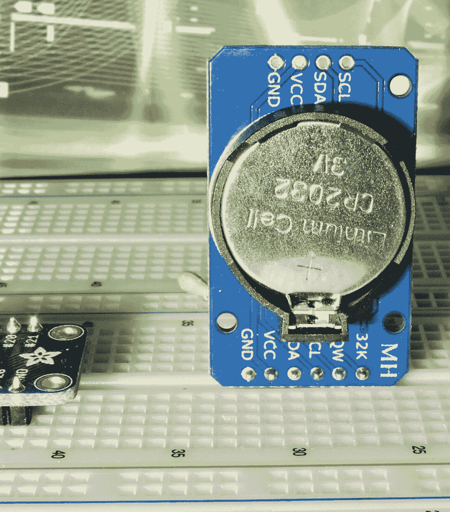
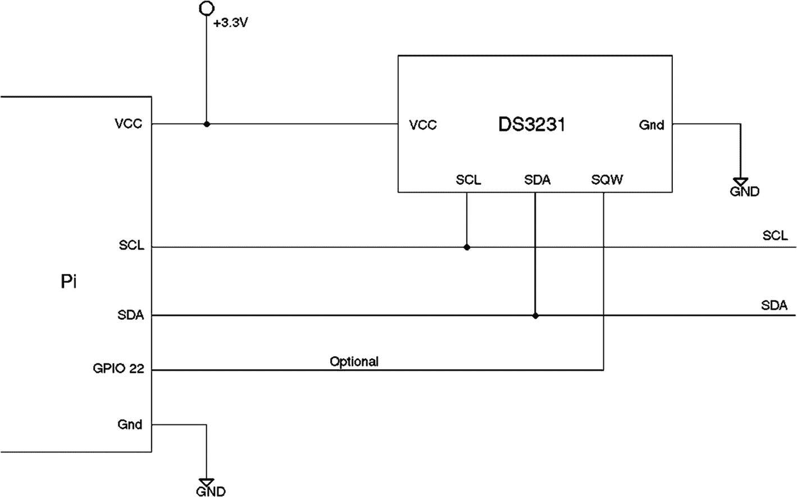

# 二十五、实时时钟

为 Arduino 出售的 DS3231 模块非常适合 Raspberry Pi，因为该 IC 的工作电压范围为+2.3 至 5.5 V。这允许 Pi 用户从 Pi 的+3.3 V 电源供电，并将其连接到 I <sup>2</sup> C 总线。该模块带有备用电池，允许它在 Pi 断电时保持准确的时间。DS3231 包括温度测量和调节，以保持计时精度。

本章将使用 C 程序来设置和读取日期/时间。此外，如果有应用，可以从 GPIO 端口检测到 1 Hz 输出。DS3231 RTC(实时时钟)还提供相当精确的温度读数。

## DS3231 概述

模块的正面照片如图 [25-1](#Fig1) 所示。该模块装配有直角引脚，可以很好地插入试验板。我的也是从易贝运来的，装有电池，但不要指望这个。通常有电池运输限制。您可能需要单独购买电池。


图 25-1

插入试验板的 DS3231 模块的前视图

从连接标签列表来看，很明显这是一个 I <sup>2</sup> C 设备。除了电源和 I <sup>2</sup> C 连接，还有一个标为 SQW 的输出，可以配置为产生 1 赫兹的脉冲。在本章中，我建议您将其连接到 GPIO 22 进行演示。图 [25-2](#Fig2) 显示了 pcb 的背面。



图 25-2

安装了电池的 DS3231 的背面视图

### 小费

建议提前购买新电池，因为电池通常在到达时已经耗尽，或者根据运输规定不包括在内。

## 连接

DS3231 模块还包括一个可以使用的 AT24C32 4kx8 I <sup>2</sup> C EEPROM，但这将留给读者作为练习。影响 RTC 芯片的接线图如图 [25-3](#Fig3) 所示。SQW 输出的连接是可选的。它可以用来以精确的时间间隔获得 1 赫兹的脉冲。



图 25-3

将 DS3231 连接到树莓派 I2C 总线

模块在+3.3 V 下运行，因此很容易接线，因为 Pi 和模块共享同一电源。只需将 SDA 和 SCL 连接和电源连接到设备。不要忘记接地。

当模块连接到 Pi 的 I <sup>2</sup> C 总线时，您应该能够检测到它。

```sh
$ i2cdetect -y 1
     0  1  2  3  4  5  6  7  8  9  a  b  c  d  e  f
00:          -- -- -- -- -- -- -- -- -- -- -- -- --
10: -- -- -- -- -- -- -- -- -- -- -- -- -- -- -- --
20: -- -- -- -- -- -- -- -- -- -- -- -- -- -- -- --
30: -- -- -- -- -- -- -- -- -- -- -- -- -- -- -- --
40: -- -- -- -- -- -- -- -- -- -- -- -- -- -- -- --
50: -- -- -- -- -- -- -- 57 -- -- -- -- -- -- -- --
60: -- -- -- -- -- -- -- -- 68 -- -- -- -- -- -- --
70: -- -- -- -- -- -- -- --

```

显示的数字是发现的设备的十六进制地址。0x68 器件是 DS3231，而 0x57 是 AT24C32 EEPROM 器件。如果您的设备未被发现，请关闭您的 Pi 并重新检查您的线路。

### 注意

DS3231 RTC 使用 I2C 地址 0x68。

## 寄存器映射

DS3231 与以前的 5 V DS1307 芯片兼容，但在其他特性中增加了两个报警。清单 [25-1](#PC2) 中说明了 DS3231 寄存器在 C 语言中的声明。寄存器布局的每个部分都被描述为一个子结构。例如，`struct s_00`是寄存器在字节偏移量 0x00 处的布局。

```sh
0023: struct s_ds3231_regs {
0024:   struct s_00 {                  /* Seconds */
0025:           uint8_t secs_1s  : 4;   /* Ones digit: seconds */
0026:           uint8_t secs_10s : 3;   /* Tens digit: seconds */
0027:           uint8_t mbz_0    : 1;
0028:   } s00;
0029:   struct s_01 {                  /* Minutes */
0030:           uint8_t mins_1s  : 4;   /* Ones digit: minutes */
0031:           uint8_t mins_10s : 3;   /* Tens digit: minutes */
0032:           uint8_t mbz_1    : 1;
0033:   } s01;
0034:   union u_02 {                   /* Hours */
0035:           struct  {
0036:                   uint8_t hour_1s  : 4;   /* Ones digit: hours */
0037:                   uint8_t hour_10s : 1;   /* Tens digit: hours (24hr mode) */
0038:                   uint8_t ampm     : 1;   /* AM=0/PM=1 */
0039:                   uint8_t mode_1224: 1;   /* Mode bit: 12=1/24=0 hour format */
0040:           } hr12;
0041:           struct  {
0042:                   uint8_t hour_1s  : 4;   /* Ones digit: hours */
0043:                   uint8_t hour_10s : 3;   /* Tens digit: hours (24hr mode) */
0044:                   uint8_t mode_1224: 1;   /* Mode bit: 12=1/24=0 hour format */
0045:           } hr24;
0046:   } u02;
0047:   struct s_03 {                   /* Weekday */
0048:           uint8_t wkday    : 3;   /* Day of week (1-7) */
0049:           uint8_t mbz_2    : 5;
0050:   } s03;
0051:   struct s_04 {                   /* Day of month */

0052:           uint8_t day_1s   : 4;   /* Ones digit: day of month (1-31) */
0053:           uint8_t day_10s  : 2;   /* Tens digit: day of month */
0054:           uint8_t mbz_3    : 2;
0055:   } s04;
0056:   struct s_05 {                   /* Month */
0057:           uint8_t month_1s : 4;   /* Ones digit: month (1-12) */
0058:           uint8_t month_10s: 1;   /* Tens digit: month */
0059:           uint8_t mbz_4    : 2;
0060:           uint8_t century  : 1;   /* Century */
0061:   } s05;
0062:   struct s_06 {                   /* Year */
0063:           uint8_t year_1s  : 4;   /* Ones digit: BCD year */
0064:           uint8_t year_10s : 4;   /* Tens digit: BCD year */
0065:   } s06;
0066:   struct s_07 {                   /* Alarm Seconds */
0067:           uint8_t alrms01  : 4;   /* Alarm BCD 1s seconds */
0068:           uint8_t alrms10  : 3;   /* Alarm BCD 10s Seconds */
0069:           uint8_t AxM1     : 1;   /* Alarm Mask 1 */
0070:   } s07;                          /* Alarm Seconds */
0071:   struct s_08 {                   /* Alarm Minutes */
0072:           uint8_t alrmm01  : 4;   /* Alarm BCD 1s Minutes */
0073:           uint8_t alrmm10  : 3;   /* Alarm BCD 10s Minutes */
0074:           uint8_t AxM2     : 1;   /* Alarm Mask 2 */
0075:   } s08;                          /* Alarm Minutes */
0076:   union u_09 {                    /* Alarm Hours */
0077:           struct  {
0078:                   uint8_t alr_hr10 : 1;   /* Alarm 10s Hours */
0079:                   uint8_t alr_ampm : 1;   /* Alarm am=0/pm=1 */
0080:                   uint8_t alr_1224 : 1;   /* Alarm 12=1 */
0081:                   uint8_t AxM3     : 1;   /* Alarm Mask 3 */
0082:           } ampm;

0083:           struct  {
0084:                   uint8_t alr_hr10 : 2;   /* Alarm 10s Hours */
0085:                   uint8_t alr_1224 : 1;   /* Alarm 24=0 */
0086:                   uint8_t AxM3     : 1;   /* Alarm Mask 3 */
0087:           } hrs24;
0088:   } u09;                          /* Alarm 1 Hours */
0089:   union u_0A {                    /* Alarm Date */
0090:           struct  {
0091:                   uint8_t day1s    : 4;   /* Alarm 1s date */
0092:                   uint8_t day10s   : 2;   /* 10s date */
0093:                   uint8_t dydt     : 1;   /* Alarm dy=1 */
0094:                   uint8_t AxM4     : 1;   /* Alarm Mask 4 */
0095:           } dy;
0096:           struct  {
0097:                   uint8_t day1s    : 4;   /* Alarm 1s date */
0098:                   uint8_t day10    : 2;   /* Alarm 10s date */
0099:                   uint8_t dydt     : 1;   /* Alarm dt=0 */
0100:                   uint8_t AxM4     : 1;   /* Alarm Mask 4 */
0101:           } dt;
0102:   } u0A;
0103:   struct s_08 s0B;                /* Alarm 2 Minutes */
0104:   union u_09 u0C;                 /* Alarm 2 Hours */
0105:   union u_0A u0D;                 /* Alarm 2 Date */
0106:   struct s_0E {                   /* Control */
0107:           uint8_t A1IE     : 1;   /* Alarm 1 Int enable */
0108:           uint8_t A2IE     : 1;   /* Alarm 2 Int enable */
0109:           uint8_t INTCN    : 1;   /* SQW signal when 1 */
0110:           uint8_t RS1      : 1;   /* Rate select 1 */
0111:           uint8_t RS2      : 1;   /* Rate select 2 */
0112:           uint8_t CONV     : 1;   /* Temp conversion */
0113:           uint8_t BBSQW    : 1;   /* Enable square wave */
0114:           uint8_t NEOSC    : 1;   /* /EOSC: Enable */
0115:   } s0E;

0116:   struct s_0F {                   /* Control/status */
0117:           uint8_t A1F      : 1;   /* Alarm 1 Flag */
0118:           uint8_t A2F      : 1;   /* Alarm 2 Flag */
0119:           uint8_t bsy      : 1;   /* Busy flag */
0120:           uint8_t en32khz  : 1;   /* Enable 32kHz out */
0121:           uint8_t zeros    : 3;
0122:           uint8_t OSF      : 1;   /* Stop Osc when 1 */
0123:   } s0F;
0124:   struct s_10 {                   /* Aging offset */
0125:           int8_t data      : 8;   /* Data */
0126:   } s10;
0127:   struct s_11 {
0128:           int8_t temp      : 8;   /* Signed int temp */
0129:   } s11;
0130:   struct s_12 {
0131:           uint8_t mbz      : 6;
0132:           uint8_t frac     : 2;   /* Fractional temp bits */
0133:   } s12;
0134: } __attribute__((packed));

Listing 25-1The full C language register map for the DS3231

```

### 寄存器 0x00(秒)

0x00 处的寄存器由两个位域组成:s00.secs_1s 和 s00.secs_10s，重复如下:

```sh
0024:   struct s_00 {                   /* Seconds */
0025:           uint8_t secs_1s  : 4;   /* Ones digit: seconds */
0026:           uint8_t secs_10s : 3;   /* Tens digit: seconds */
0027:           uint8_t mbz_0    : 1;
0028:   } s00;

```

对于阅读本文的学生来说，有必要解释一下 C 语言的位域。冒号和后面的数字指定了字段的位宽。被分割的字段由类型决定，在这种情况下是一个无符号字节(`uint8_t`)。首先列出的字段指定最低有效位(在 Pi 上)，随后的位字段代表较高编号的位。例如，字段`s00.secs_1s`定义了位 3-0(最右边)，而`s00.secs_10s`定义了位 6-4，并且`s00.mbz_0`声明了位 7-6(最左边的两位)。指定位字段使我们不必使用按位和移位操作来移入和移出值。

成员`secs_1s`和`secs_10s`代表 BCD(二进制编码十进制)数字，表示以秒为单位的时间。因此，值 0x23(在 uint8_t 中)字节表示十进制值 23。当 DS3231 IC 计时时，RTC(实时时钟)会自动增加这些时间值和其他时间值。

### 寄存器 0x01(分钟)

分钟读数在字节偏移量 0x01 处提供，格式类似于秒部分。同样，成员`mins_10s`和`mins_1s`是分钟时间部分的 BCD 数字。

```sh
0029:   struct s_01 {                   /* Minutes */
0030:           uint8_t mins_1s  : 4;   /* Ones digit: minutes */
0031:           uint8_t mins_10s : 3;   /* Tens digit: minutes */
0032:           uint8_t mbz_1    : 1;
0033:   } s01;

```

名称类似于`mbz_1`的字段是“必须为零”字段，否则可以忽略。

### 寄存器 0x02(小时)

字节偏移量 0x02 处的小时部分更有趣一些，因为它可以存在于两个*视图*中。组件`u03.hr12`选择 12 小时制，而工会成员`u02.hr24`选择 24 小时制。使用的视图由成员`mode_1224`决定。当成员`mode_1224`是 1 位时，那么要使用的正确视图是`u02.hr12`，否则应该使用`u02.hr24`。

```sh
0034:   union u_02 {                    /* Hours */
0035:           struct  {
0036:                   uint8_t hour_1s  : 4;   /* Ones digit: hours */
0037:                   uint8_t hour_10s : 1;   /* Tens digit: hours (24hr mode) */
0038:                   uint8_t ampm     : 1;   /* AM=0/PM=1 */
0039:                   uint8_t mode_1224: 1;   /* Mode bit: 12=1/24=0 hour format */
0040:           } hr12;
0041:           struct  {
0042:                   uint8_t hour_1s  : 4;   /* Ones digit: hours */
0043:                   uint8_t hour_10s : 3;   /* Tens digit: hours (24hr mode) */
0044:                   uint8_t mode_1224: 1;   /* Mode bit: 12=1/24=0 hour format */
0045:           } hr24;
0046:   } u02;

```

成员值`hours_10s`和`hours_1s`也是以十进制数字表示每小时时间的 BCD 值。在 24 小时制中，有一个额外的位来描述较大的每小时 10 位数字。

在 12 小时制中，当该位是 0 位时，`u02.hr12.ampm`的值代表 AM，否则代表 PM。

### 寄存器 0x03(工作日)

在字段`s03.wkday`中的偏移量 0x03 处找到工作日值。

```sh
0047:   struct s_03 {                   /* Weekday */
0048:           uint8_t wkday    : 3;   /* Day of week (1-7) */
0049:           uint8_t mbz_2    : 5;
0050:   } s03;

```

请注意，有效值的范围是从 1 到 7。Unix/Linux 使用 0–6 的值范围来表示工作日。

### 寄存器 0x04(一月中的某一天)

寄存器偏移量 0x04 包含一个月中的某一天。

```sh
0051:   struct s_04 {                   /* Day of month */
0052:           uint8_t day_1s   : 4;   /* Ones digit: day of month (1-31) */
0053:           uint8_t day_10s  : 2;   /* Tens digit: day of month */
0054:           uint8_t mbz_3    : 2;
0055:   } s04;

```

成员`day_10s`和`day_1s`是一个月中某一天的 BCD 值，范围为 1 到 31。

### 寄存器 0x05(月)

寄存器偏移量 0x05 保存一年中的月份。

```sh
0056:   struct s_05 {                   /* Month */
0057:           uint8_t month_1s : 4;   /* Ones digit: month */
0058:           uint8_t month_10s: 1;   /* Tens digit: month */
0059:           uint8_t mbz_4    : 2;
0060:           uint8_t century  : 1;   /* Century */
0061:   } s05;

```

值`month_10s`和`months_1s`是月份的 BCD 数字，范围是 1 到 12。提供成员`century`是为了表示从 1999 年到 2000 年的世纪交替。

### 寄存器 0x06(年)

年份由寄存器偏移量 0x06 提供。

```sh
0062:   struct s_06 {                   /* Year */
0063:           uint8_t year_1s  : 4;   /* Ones digit: BCD year */
0064:           uint8_t year_10s : 4;   /* Tens digit: BCD year */
0065:   } s06;

```

`year_10s`和`year_1s`成员对提供年份的 BCD 数字。

### 寄存器 0x07(报警 1 秒)

DS3231 芯片支持两种报警。该寄存器提供报警 1 秒的值。

```sh
0066:   struct s_07 {                   /* Alarm Seconds */
0067:           uint8_t alrms01  : 4;   /* Alarm BCD 1s seconds */
0068:           uint8_t alrms10  : 3;   /* Alarm BCD 10s Seconds */
0069:           uint8_t AxM1     : 1;   /* Alarm Mask 1 */
0070:   } s07;

```

成员`alrms01`和`alrms10`构成了报警 1 的 BCD 形式的一对秒数字。位域 AxM1 是一个位，决定报警的秒数必须匹配(AxM1=0)，或者每秒触发一次报警(AxM1=1)。

### 寄存器 0x08(报警 1 分钟)

报警 1 的分钟数由偏移量 0x08 的寄存器指定。

```sh
0071:   struct s_08 {                   /* Alarm Minutes */
0072:           uint8_t alrmm01  : 4;   /* Alarm BCD 1s Minutes */
0073:           uint8_t alrmm10  : 3;   /* Alarm BCD 10s Minutes */
0074:           uint8_t AxM2     : 1;   /* Alarm Mask 2 */
0075:   } s08;

```

成员`alrmm10`和`alrmm01`根据掩码位`AxM2`指定定义报警分钟的 BCD 对。

### 寄存器 0x09(报警 1 小时)

寄存器偏移量 0x09 保存报警的小时时间。

```sh
0076:   union u_09 {                    /* Alarm Hours */
0077:           struct  {
0078:                   uint8_t alr_hr10 : 1;   /* Alarm 10s Hours */
0079:                   uint8_t alr_ampm : 1;   /* Alarm am=0/pm=1 */
0080:                   uint8_t alr_1224 : 1;   /* Alarm 12=1 */
0081:                   uint8_t AxM3     : 1;   /* Alarm Mask 3 */
0082:           } ampm;
0083:           struct  {
0084:                   uint8_t alr_hr10 : 2;  /* Alarm 10s Hours */
0085:                   uint8_t alr_1224 : 1;   /* Alarm 24=0 */
0086:                   uint8_t AxM3     : 1;   /* Alarm Mask 3 */
0087:           } hrs24;

```

像前面描述的 union `u_02`一样，根据使用的是 12 小时制还是 24 小时制，有两种视图。根据屏蔽位`AxM3`应用小时。

### 寄存器 0x0A(报警 1 日期)

要应用的报警日期由 DS1332 寄存器文件中的偏移量 0x0A 给出。

```sh
0089:   union u_0A {                    /* Alarm Date */
0090:           struct  {
0091:                   uint8_t day1s    : 4;   /* Alarm 1s date */
0092:                   uint8_t day10s   : 2;   /* 10s date */
0093:                   uint8_t dydt     : 1;   /* Alarm dy=1 */
0094:                   uint8_t AxM4     : 1;   /* Alarm Mask 4 */
0095:           } dy;
0096:           struct  {
0097:                   uint8_t day1s    : 4;   /* Alarm 1s date */
0098:                   uint8_t day10    : 3;   /* Alarm 10s date */
0099:                   uint8_t dydt     : 1;   /* Alarm dt=0 */
0100:                   uint8_t AxM4     : 1;   /* Alarm Mask 4 */
0101:           } dt;
0102:   } u0A;

```

这是两个视图的联合，根据使用的是工作日(`dydt=1`)还是一个月中的某一天(`dydt=0`)。对`day10s`和`day1s`是指定日期的 BCD 对。掩码 AxM4 决定了日期如何影响报警。

### 警报 2

报警 2 类似于报警 1，除了它缺少秒说明符。

```sh
0103:   struct s_08 s0B;                /* Alarm 2 Minutes */
0104:   union u_09 u0C;                 /* Alarm 2 Hours */
0105:   union u_0A u0D;                 /* Alarm 2 Date */

```

它在其他方面的用法是一样的。

### 寄存器 0x0E(控制)

寄存器偏移量 0x0E 提供了一些控制选项。

```sh
0106:   struct s_0E {                   /* Control */
0107:           uint8_t A1IE     : 1;   /* Alarm 1 Int enable */
0108:           uint8_t A2IE     : 1;   /* Alarm 2 Int enable */
0109:           uint8_t INTCN    : 1;   /* SQW signal when 1 */
0110:           uint8_t RS1      : 1;   /* Rate select 1 */
0111:           uint8_t RS2      : 1;   /* Rate select 2 */
0112:           uint8_t CONV     : 1;   /* Temp conversion */
0113:           uint8_t BBSQW    : 1;   /* Enable square wave */
0114:           uint8_t NEOSC    : 1;   /* /EOSC: Enable */
0115:   } s0E;

```

成员位`A1IE`和`A2IE`设置为 1 位时启用报警中断。`INTCN`决定芯片发出中断信号(低电平有效)还是方波输出(`INTCN` =1)。选项`BBSQW`也必须设为 1 位，以启用方波输出。当位`RS1`和`RS2`都设置为零时，为方波输出选择 1 Hz 的速率。`CONV`用于启用芯片温度的读取。最后，位`NEOSC` ( *不是* `EOSC`)在为 0 位时使能振荡器，否则在为真时停止振荡器。

#### 读数温度

DS3231 能够保持精确的时间，部分原因是它能够监控自身的温度并进行补偿。可以通过执行以下操作读取温度:

1.  检查`BSY`标志和`CONV`标志是否未设置。

2.  设置`CONV`标志开始转换。

3.  当`CONV`标志复位至零时，读取偏移量 0x11 和 0x12 处的寄存器值。

### 寄存器 0x0F(控制/状态)

寄存器偏移量 0x0F 提供更多控制和状态位。

```sh
0116:   struct s_0F {                   /* Control/status */
0117:           uint8_t A1F      : 1;   /* Alarm 1 Flag */
0118:           uint8_t A2F      : 1;   /* Alarm 2 Flag */
0119:           uint8_t bsy      : 1;   /* Busy flag */
0120:           uint8_t en32khz  : 1;   /* Enable 32kHz out */
0121:           uint8_t zeros    : 3;
0122:           uint8_t OSF      : 1;   /* Stop Osc when 1 */
0123:   } s0F;

```

标志`A1F`和`A2F`指示相应的警报何时被触发。成员`bsy`是设备的忙碌标志。当与其他选项结合使用时，成员`en32khz`启用 32 kHz 信号输出。当标志`OSF`设置为 1 位时，振荡器停止工作。

### 寄存器 0x10(老化)

DS3231 内部使用的老化值，用于根据温度调整计时，可以从该寄存器中读取。它是一个有符号的 8 位数字。

```sh
0124:   struct s_10 {                   /* Aging offset */
0125:           int8_t data      : 8;   /* Data */
0126:   } s10;

```

### 寄存器 0x11 和 0x12(温度)

这对寄存器用于读取 DS3231 的内部温度，精确到四分之一摄氏度。

```sh
0127:   struct s_11 {
0128:           int8_t temp      : 8;   /* Signed int temp */
0129:   } s11;
0130:   struct s_12 {
0131:           uint8_t mbz      : 6;
0132:           uint8_t frac     : 2;   /* Fractional temp bits */
0133:   } s12;

```

`s11.temp`的值包含以摄氏度为单位的整数部分。`s12.frac`包含一对指定值为 0 到 3 的位。温度的形成可以由下式确定:

```sh
s11.temp + (float) s12.frac * 0.25;

```

## 从 DS3231 读取

目录中提供了程序`ds3231.c`的完整源代码:

```sh
$ cd ~/RPi/ds3231

```

构建或强制重新构建它，如下所示:

```sh
$ make clobber
rm -f *.o core errs.t
rm -f ds3231
$ make
gcc -c -Wall -O0 -g ds3231.c -o ds3231.o
gcc ds3231.o -o ds3231
sudo chown root ./ds3231
sudo chmod u+s ./ds3231

```

清单 [25-2](#PC22) 中显示了从 DS3231 设备中执行读取的功能。

```sh
0136: static const char *node = "/dev/i2c-1";
0137: static int i2c_fd = -1;                  /* Device node: /dev/i2c-1 */
...
0175: static bool
0176: i2c_rd_rtc(ds3231_regs_t *rtc) {
0177:   struct i2c_rdwr_ioctl_data msgset;
0178:   struct i2c_msg iomsgs[2];
0179:   char zero = 0x00;               /* Register 0x00 */
0180:
0181:   iomsgs[0].addr = 0x68;          /* DS3231 */
0182:   iomsgs[0].flags = 0;            /* Write */
0183:   iomsgs[0].buf = &zero;          /* Register 0x00 */
0184:   iomsgs[0].len = 1;
0185:
0186:   iomsgs[1].addr = 0x68;          /* DS3231 */
0187:   iomsgs[1].flags = I2C_M_RD;     /* Read */
0188:   iomsgs[1].buf = (char *)rtc;
0189:   iomsgs[1].len = sizeof *rtc;
0190:
0191:   msgset.msgs = iomsgs;
0192:   msgset.nmsgs = 2;
0193:
0194:   return ioctl(i2c_fd,I2C_RDWR,&msgset) == 2;
0195: }

Listing 25-2The i2c_rd_rtc() function for the DS3231

```

该代码假设 I <sup>2</sup> C 总线已经打开，文件描述符保存在`i2c_fd`(第 137 行)。两个消息被组装到第 178 行的数组`iomsgs`中。第 181 行到第 184 行准备写入一个字节，表示我们从 DS3231 中的寄存器偏移量`0x00`开始寻址。第 186 行到第 189 行准备一条消息，将设备的所有寄存器读入缓冲结构`rtc`。当`ioctl(2)`返回`2`时，读取成功，表示两个消息被成功执行。

## 写入 DS3231

清单 [25-3](#PC23) 列出了用于写入 DS3231 器件的函数。

```sh
0198: static bool
0199: i2c_wr_rtc(ds3231_regs_t *rtc) {
0200:   struct i2c_rdwr_ioctl_data msgset;
0201:   struct i2c_msg iomsgs[1];
0202:   char buf[sizeof *rtc + 1];      /* Work buffer */
0203:
0204:   buf[0] = 0x00;                  /* Register 0x00 */
0205:   memcpy(buf+1,rtc,sizeof *rtc);  /* Copy RTC info */
0206:
0207:   iomsgs[0].addr = 0x68;          /* DS3231 Address */
0208:   iomsgs[0].flags = 0;            /* Write */
0209:   iomsgs[0].buf = buf;            /* Register + data */
0210:   iomsgs[0].len = sizeof *rtc + 1; /* Total msg len */
0211:
0212:   msgset.msgs = &iomsgs[0];
0213:   msgset.nmsgs = 1;
0214:
0215:   return ioctl(i2c_fd,I2C_RDWR,&msgset) == 1;
0216: }

Listing 25-3The function i2c_wr_rtc() for writing to the DS3231

```

该功能类似于读取功能，只是只需要一条`ioctl(2)`消息。要写入的 RTC 值被复制到行 205 中的`buf`。第一个字节被设置为`0x00`,以指示我们想要开始写入的寄存器编号。在第 207 到 210 行中准备消息，并且在第 215 行中执行实际的写入。当`ioctl(2)`返回值 1 时，操作成功，表示执行了一条成功消息。

## 读数温度

对于那些想知道温度的人，清单 [25-4](#PC24) 中提供了读取温度的函数。

```sh
0221: static float
0222: read_temp(void) {
0223:   ds3231_regs_t rtc;
0224:
0225:   do      {
0226:           if ( !i2c_rd_rtc(&rtc) ) {
0227:                   perror("Reading RTC for temp.");
0228:                   exit(2);
0229:           }
0230:   } while ( rtc.s0F.bsy || rtc.s0F.CONV ); /* Until not busy */
0231:
0232:   rtc.s0E.CONV = 1;               /* Start conversion */
0233:
0234:   if ( !i2c_wr_rtc(&rtc) ) {
0235:           perror("Writing RTC to read temp.");
0236:           exit(2);
0237:   }
0238:
0239:   do      {
0240:           if ( !i2c_rd_rtc(&rtc) ) {
0241:                   perror("Reading RTC for conversion.");
0242:                   exit(2);
0243:           }
0244:   } while ( rtc.s0E.CONV );       /* Until converted */
0245:
0246:   return rtc.s11.temp + (float)rtc.s12.frac * 0.25;
0247: }

Listing 25-4Reading the DS3231 temperature

```

当`s0F.bsy`或`s0F.CONV`标志为真时，该函数首先循环，表示器件正忙。在第 232 行设置`s0E.CONV`标志，然后在第 234 行写到设备。此后，DS3231 被轮询以查看`s0E.CONV`标志何时归零。一次一个。CONV 复位后，我们可以安全地从`s11`和`s12`寄存器中读取温度(第 246 行)。

## 演示时间

一旦根据图 [25-3](#Fig3) 编译并连接了演示，我们就可以练习 C 程序了。-h 选项报告使用信息:

```sh
$ ./ds3231 -h
Usage:  /ds3231 [-S time] [-f format] [-d] [-e] [-v] [-h]
where:
        -s      Set RTC clock based upon system date
        -f fmt  Set date format
        -e      Enable 1 Hz output on SQW
        -d      Disable 1 Hz output on SQW
        -t      Display temperature
        -S time Set DS3231 time from given
        -v      Verbose, show SQW register settings
        -h      This help

```

### 读取日期/时间

要读取仪器的当前日期/时间，只需运行程序:

```sh
$ ./ds3231
RTC time is 2018-08-05 00:54:55 (Sunday)

```

如果出现错误，再次运行`i2c-detect`并确保设备接线正确。

### 读取温度

要读取温度，请使用-t 选项:

```sh
$ ./ds3231 -t
RTC time is 2018-08-05 01:23:06 (Sunday)
Temperature is 26.75 C

```

温度读数的准确性相当不错，这一事实有助于其计时的稳定性。

## 设置 RTC

您可以使用-S 选项设置 RTC 时间:

```sh
$ ./ds3231 -S '2018-08-04 12:00:00'
Set RTC to 2018-08-04 12:00:00 (Saturday)
RTC time is 2018-08-04 12:00:00 (Saturday)

```

第二个打印行是从 RTC 设备读回的值。如果需要使用不同的日期/时间格式，请提供-f 选项。

## 1 赫兹方波

要测试 1 Hz SQW 输出，请使用-e (enable)命令。-v (verbose)选项只是通过显示一些值来确认:

```sh
$ ./ds3231 -ev
RTC time is 2018-08-05 01:24:34 (Sunday)
 BBSQW=1 INTCN=0 RS2=0 RS1=0

```

现在运行本书前面使用的 evinput 程序来监控 GPIO 22 引脚(假设您按照图 [25-3](#Fig3) 进行了接线)。如果您选择了其他 GPIO，请替换您使用的 GPIO:

```sh
$ ../evinput/evinput -g22
Monitoring for GPIO input changes:

GPIO 22 changed: 0
GPIO 22 changed: 1
GPIO 22 changed: 0
GPIO 22 changed: 1
GPIO 22 changed: 0
GPIO 22 changed: 1
GPIO 22 changed: 0

```

从输出中，您可以看到输入以大约半秒的速度变化(一个完整的周期需要一秒)。

## 内核支持

到目前为止，我们已经使用 C 程序对 DS3231 器件进行了测试。但是您可能已经知道 Raspbian Linux 支持 DS3231 的内核模块。在设置它之前，您需要禁用 ntp(至少暂时禁用):

```sh
# systemctl disable systemd-timesyncd.service

```

要在内核中配置 ds3231 模块支持，请执行以下操作:

1.  `sudo -i`

2.  编辑`/boot/config.txt`并在文件末尾添加行`dtoverlay=i2c-rtc,ds3231`。

3.  对同一文件取消注释或添加“`dtparam=i2c_arm=on`”。

4.  编辑文件`/lib/udev/hwclock-set`并注释掉下面三行，在前面加一个散列(`#`):

    ```sh
    #if [ -e /run/systemd/system ] ; then
    #    exit 0
    #fi

    ```

5.  重新启动

重新启动后，尝试以下操作:

```sh
# hwclock -r
2018-08-04 08:13:18.719447-0400

```

您可以对照`ds3231`程序进行检查:

```sh
# ~pi/RPi/ds3231/ds3231
RTC time is 2018-08-04 12:14:23 (Saturday)

```

这里有四个小时的时差，但这是时区和夏令时的差异。当我的 Pi 被配置时，它保持 UTC 时间。要将 DS3231、内核模块和系统日期都放在同一个页面上，可以执行以下操作:

```sh
# ~pi/RPi/ds3231/ds3231 -S '2018-08-05 02:22:00'
Set RTC to 2018-08-05 02:22:00 (Sunday)
RTC time is 2018-08-05 02:22:00 (Sunday)
root@rpi3bplus:~# hwclock -s
root@rpi3bplus:~# date
Sat Aug  4 22:22:26 EDT 2018
root@rpi3bplus:~#

```

当涉及时区偏移时，这可能会令人困惑。在`ds3231 -S`命令中，我将日期/时间设置为所需的 UTC 日期/时间。然后，命令`hwclock -s`使其复位 DS3231 芯片的系统时间感。接下来，`date`命令用我的时区偏移量报告当地时间。

## 摘要

ds3231 是 Raspberry Pi 的完美伴侣，尤其是当它们没有联网时。凭借备用电池，ds3231 每月将精确时间保持在几秒之内。

所展示的程序让您深入了解芯片的操作，并练习从 C 与芯片通信。在 C 程序中，应用了位域语言特性的演示。这通常只在系统或设备编程中出现。

最后，演示了 ds3231 的 Raspbian 内核支持，以便您可以在未来的 Pi 项目中使用它。如果你正在寻找一个 I <sup>2</sup> C 项目，为什么不尝试与板载 EEPROM 通信呢？