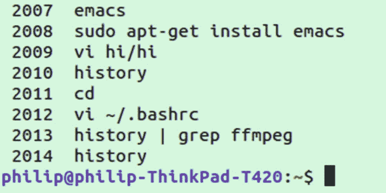
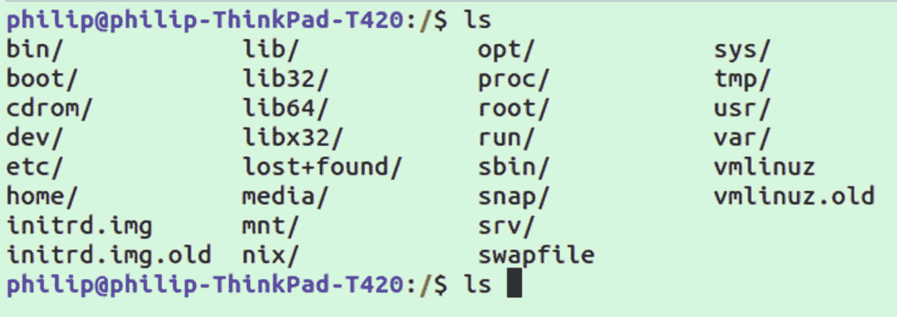
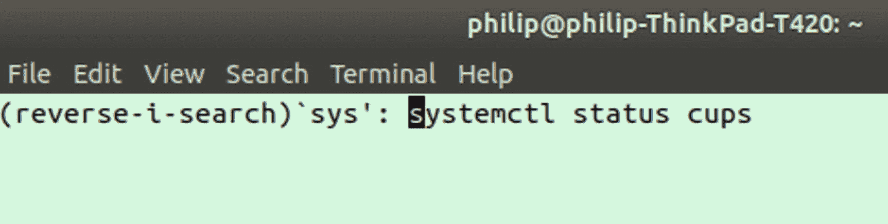
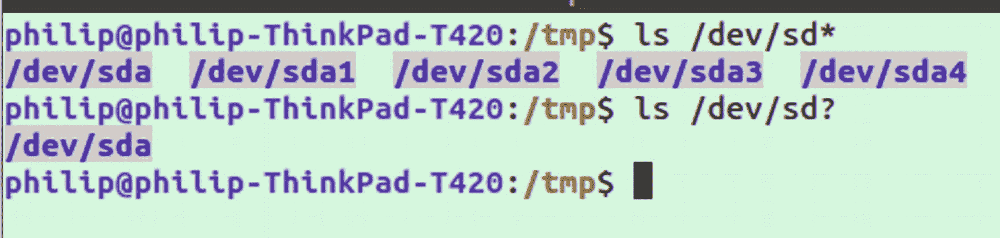

# 三、历史和快捷方式

在这一章中，我们将研究如何使用 shell 历史、bash 终端的内置键盘快捷键和文件 globbing。这些技巧将帮助您在输入新命令、重复以前的命令或修改部分编写的命令时动作更快。

## 历史

指尖上有许多有用的命令是很好的，但是有了这么多，很容易迷失方向。这就是`history`命令派上用场的地方。大多数 Linux 系统都应该预装了`history`命令。运行该命令将返回上次运行命令的列表。

默认情况下，大多数系统在删除旧的历史记录之前只会保留大约 2000 条命令。我建议增加这个数字。你可以通过修改你的`~/.bashrc`；搜索包含`HISTSIZE`和`HISTFILESIZE`的行:

```sh
# see HISTSIZE and HISTFILESIZE in bash(1)
HISTSIZE=10000
HISTFILESIZE=10000

```

也可以将您的历史记录设置为无限制；只需声明一个空值:

```sh
HISTSIZE=
HISTFILESIZE=

```

为了在保存大量命令时节省空间，我喜欢打开`ignoreboth`和`erasedups`。`ignoreboth`是一个由`ignoredups`和`ignorespace`组合而成的简写。`ignoredups`选项使连续运行多次的命令只被记录一次。`ignorespace`选项导致以空格开头的命令不被保存到历史记录中。因此，如果出于某种原因你不想保存一个命令，只需在它前面加上一个空格。`erasedups`选项实际上会在你每次运行一个命令时检查你的整个历史，并删除它的任何其他实例。`erasedups`的一个潜在缺点是，如果您获得历史记录，然后运行多个命令，删除一个命令会改变数字，在这种情况下，您必须再次运行`history`来更新正确的数字，或者意外运行错误的命令。

```sh
HISTFILESIZE=10000
# don't save duplicate lines or lines starting with space
# See bash(1) for more options
HISTCONTROL=ignoreboth:erasedups

```

另一个值得打开的历史选项是`histappend`,当你使用多个终端会话时，它有助于跟踪历史。默认情况下，当终端实例关闭时，历史文件将被覆盖，而不是被追加。这将导致仅保存上次关闭会话的历史记录。您可以通过以下方式打开`histappend`

```sh
# append to the history file, don't overwrite it
shopt -s histappend

```

滚动 10000 行会花很长时间；这就是`grep`派上用场的地方。假设您记得使用`ffmpeg`来剪切视频，但是您不记得确切的标志和输入。简单地跑

```sh
history | grep ffmpeg

```

一旦你看到你正在寻找的命令，你可以使用左边的数字快速再次运行它。历史输出的另一个例子如图 [3-1](#Fig1) 所示。



图 3-1

命令历史

给定图 [3-1](#Fig1) 中所示的历史输出，我们可以通过输入

```sh
!2007

```

此工作流程将大大加快您输入命令的速度。在某些情况下，您可以通过使用！？而不是仅仅！。例如，如果我们想运行图 [3-1](#Fig1) 中的命令 2012，我们可以运行

```sh
!?vi

```

这样做的目的是搜索历史中包含`vi`的最近命令。只要字符串在命令中，它也不必引用命令的开头。因此，以下内容也会导致命令 2012 运行:

```sh
!?bash

```

使用前面的使用`history`的方法可以大大提高你输入命令的速度。但是，您必须小心，因为如果文本出现在您想要的命令之外的命令中，它将自动运行。

## Bash 快捷方式

键盘快捷键在大多数程序中都很方便，bash 也是如此。您应该知道 bash shell 有大量的键盘快捷键。就我个人而言，我只使用其中的一些命令，但是我使用的那些命令非常有用。

当你第一次开始时，你可能会发现你只用一两个。你可能会慢慢地、逐渐地学习命令，一旦适应了，你可能会决定在你的常规工作流程中添加更多的命令。从这里列出的几个有用的命令开始，当你习惯了它们之后，再回来尝试合并更多的命令。

使用 bash 时最基本的快捷键是 tab 键。双击 tab 键激活自动完成功能，如图 [3-2](#Fig2) 所示。为了进行演示，请尝试编写`ls`命令，后跟一个空格，并在按 enter 键之前，轻按 tab 键两次。



图 3-2

双击可用于自动完成的文件夹

您应该会看到工作目录中的所有文件，如图 [3-2](#Fig2) 所示。Tab 可以以这种方式用于几乎任何以文件作为输入的命令。

Note

使用`ctrl`加一个字母的快捷键是基于大多数发行版的默认组合键。如果您发现这些快捷键在您的机器上不起作用，您会希望看到下一节“Emacs 与 Vim 键盘绑定”。因为默认模式可能在你的系统上不同或者已经被改变。如果你的发行版给绑定分配了一些全局行为，这些快捷方式也可能不起作用。例如，在使用 Xubuntu 时，我发现一些我最常用的 bash 键盘快捷键不起作用。我最后做了一些研究，发现了一个特定于发行版的设置面板，在那里我可以删除一些全局快捷键，这些快捷键会导致应用程序特定的快捷键再次激活。

除了 tab，我用的最多的键盘快捷键是`ctrl+b`和`ctrl+a`。

*ctrl+a =将文本光标移动到命令的开头*

*ctrl+b =将文本光标移动到命令的末尾*

因此，如果你写了一个很长的命令，并在按 enter 键之前发现了一个打字错误，你可以使用`ctrl+a`快速返回并修复它，然后返回到使用`ctrl+b`时的位置。

我经常发现自己把这个和`&&`结合使用。这告诉 bash 只有在第一个命令成功运行之后，才在`&&`之后运行该命令。或者，如果您希望不管第一个命令是否成功都运行第二个命令，您可以使用单个`&`(例如，如果`tmp.txt`不存在，使用`&&`时`git add *`不会运行，而使用`&`时会运行)。

比方说，你已经输入了命令`git add *`，但是你意识到你有一个你想首先删除的文件。只需按下`ctrl+a`将光标移动到终端输入的第一个字符，并将命令改为

```sh
rm tmp.txt && git add *

```

不要删除已经写好的内容，以后再重新输入，只需在开头写下先决条件命令，并用`&&`将其链接起来。将几个命令链接在一起并让它们都成功运行是一件令人满意的事情。我可能会这样想，因为在输入一连串命令后的那一瞬间，可能是在等待命令处理的时候倒一杯咖啡的最佳时机。

我使用的另外两个命令是`ctrl+c`和`ctrl+d`。

*ctrl+c =取消当前命令*

*ctrl+d =关闭当前端子*

按下`ctrl+d`只是关闭当前的终端实例，产生与运行命令`exit`相同的结果。显而易见的用途是在结束时快速关闭终端窗口，但是您也可以使用它来关闭其他程序，如 tmux 或结束 ssh 会话。

你是否曾经写了一个很长的命令，然后意识到你想做一些完全不同的事情？当这种情况发生时，我们的本能是按住退格键，因为这似乎是永远的。下次试试`ctrl+c`，清除输入的简称。它会给你一个新的输入，而不需要执行命令。

如果您经常发现自己在运行命令`clear`，您会想要记下`ctrl+l`。

*ctrl+l =清除屏幕上的所有文本，在终端会话顶部留下一个新的命令行*

表 [3-1](#Tab1) 列出了所有 Emacs 键盘快捷键(大多数系统的默认模式)。

表 3-1

默认(Emacs 风格)bash 键盘快捷键列表

<colgroup><col class="tcol1 align-left"> <col class="tcol2 align-left"></colgroup> 
| 

顺序

 | 

描述

 |
| --- | --- |
| ctrl+a | 转到行首 |
| ctrl+e 组合键 | 走到这条线的尽头 |
| alt+b | 将光标向后移动一个单词 |
| Ctrl+b | 将光标向后移动一个字符 |
| alt+f | 将光标向前移动一个单词 |
| ctrl+f | 将光标向前移动一个字符 |
| alt+t | 交换最后两个单词 |
| Ctrl+t | 交换最后两个字符 |
| alt+r | 如果您从历史记录中修改了命令，重置更改 |
| ctrl+k | 删除光标后的所有内容 |
| ctrl+u | 删除光标前的所有内容 |
| ctrl+w 组合键 | 删除最后一个单词 |
| ctrl+y | 粘贴删除的单词(相当于 ctrl+w 的撤消) |
| Ctrl+l | 清除过去的终端输出(与`clear`命令相同) |
| ctrl+z 组合键 | 后台运行进程 |

### Emacs 与 Vim 键盘绑定

一个有趣的事实是，bash 键盘快捷键实际上是基于 Emacs(一个流行的开源文本编辑器)中的键绑定。许多在 bash 中工作的键绑定也可以在 Emacs 中工作。然而，可以在 bash 中启用类似 Vim 的键绑定。为此，请运行以下命令:

```sh
set -o vi

```

运行`set -o vi`将只为您当前的会话设置 Vim 键绑定；要永久启用它，您应该将它添加到您的`.bashrc`文件中。通过在您的`.inputrc`文件中添加下面一行，您可以设置 bash 甚至更多的程序同时使用 Vim 绑定:

```sh
set editing-mode vi

```

或者，如果您想显式地指定 Emacs 样式的绑定，您可以添加

```sh
set editing-mode emacs

```

`.inputrc`文件影响所有使用 GNU readline 库的程序的输入，这是一个流行的库，被一些实用程序使用，包括 bash 和其他操作系统，如 OpenBSD。一些使用 GNU readline 库的程序包括但不限于

*   *Abiword，Amanda，Atari800，Bacula，Bareos，GNU bc，BlueZ，Cdecl，ConnMan，Freeciv，FreeRADIUS，GNU ftp，NetKit ftp，FVWM，GDB，GPG，guile，Hatari，hunspell，LFP，NetworkManager，nfss，parted，rc shell，Samba，SQLite，GNU Units，VICE，wesnoth，WPA Supplicant，Lua REPL，Python REPL，Ruby REPL …】*

因此，在`.inputrc`中改变的任何设置都会影响它们。默认情况下，`.inputrc`文件并不存在，但是如果添加的话，将会影响 bash 接收输入的方式。除了在缺省 emacs 模式和 vi 模式之间改变之外，终端的其他行为也可以被修改。我们将在下一章深入探讨`.inputrc`。

`vi`风格的键绑定没有一组等价的快捷键，而是模仿了分别输入和运行命令的模式。如果您正在使用`vi`模式并按下`esc`，您将切换到命令模式，在那里您可以使用一些(但不是全部)`vi`命令，如`0`前进到行首、`$`前进到行尾、`w`前进一个单词、`b`后退一个单词。

如果您不熟悉 Vim 或`vi`以及各种命令，我们建议坚持使用默认的 Emacs 键绑定，尽管 Vim 绝对值得学习，在本书中将有一章专门介绍 Vim。在阅读完它并熟悉使用 Vim 之后，您可能希望返回到 bash 设置并尝试使用`vi`风格的快捷方式。我使用 Vim 作为编辑器，但仍然更喜欢 bash 上的 Emacs 风格的键绑定，因为它们很简单，也是常见的默认设置。

### 反向搜索

上一节我们没有讨论的另一个快捷方式是`ctrl+r`用于反向搜索。我更喜欢使用`history`命令，但是许多人更喜欢使用交互式反向搜索。

按下`ctrl+r`后，你将进入一个交互模式，如果你开始键入一个先前写好的命令，它将显示在自动完成中，如图 [3-3](#Fig3) 所示。



图 3-3

终端中的反向搜索

一旦看到想要运行的命令，就可以按 enter 键运行它。或者，您可以按 tab 键返回到正常的 shell 模式，命令已准备好运行或修改。例如，给定前面的命令，我可以按 tab，然后按`ctrl+e`转到行尾，删除`cups`，然后编写一个不同的服务来获取状态。

如果你已经开始在反向搜索中编写一个命令，而自动完成不是你想要的，你可以按`ctrl+r`再返回。所以在所示的例子中，按下`ctrl+r`将显示历史上以`sys`开始的下一场比赛。

### 文件成组或通配符

文件 globbing 是 Linux 中的一个特性，它允许通过使用通配符来表示多个文件。最广为人知的通配符是`*`，它代表一个或多个任意字符。例如，运行

```sh
echo *

```

这将对当前目录中的所有文件运行命令`echo`。通配符也可以与其他字符结合使用，例如:

```sh
ls /dev/sd*

```

它不会返回`/dev/`中的所有文件，而只会返回文件夹中以“sd”开头的文件。

`*`不是唯一可以使用的字符，尽管它是最常用的。globbing 的另一个通配符是`?`。`?`字符与`*`相似，它可以表示任何字符，但它只是单个字符，而不是任何数量。如果我们将前面的命令修改为

```sh
ls /dev/sd?

```

我们现在只取回以“sd”开头并有一个额外字符的文件，而不是取回所有以“sd”开头的文件。注意图 [3-4](#Fig4) 中两者的输出差异。



图 3-4

比较*和？通配符

最后一个可以使用的字符，或者更确切地说是字符组合，是方括号`[]`，这是一个内部经常使用字符的集合。例如，如果我们想重复前面的命令，该命令使用了`?`，但也包括其他驱动器，如`sdb`和`sdc`(如果存在，我们可以这样做

```sh
ls /dev/sd[abc]

```

这将匹配单个字符，只要它是括号内指定的字符，在本例中是 a、b 或 c。

## 摘要

在这一章中，我们研究了 bash 历史、快捷方式和文件打包的使用。通过使用这些技术，您可以大大加快工作流程，因为您输入命令时需要写得更少。