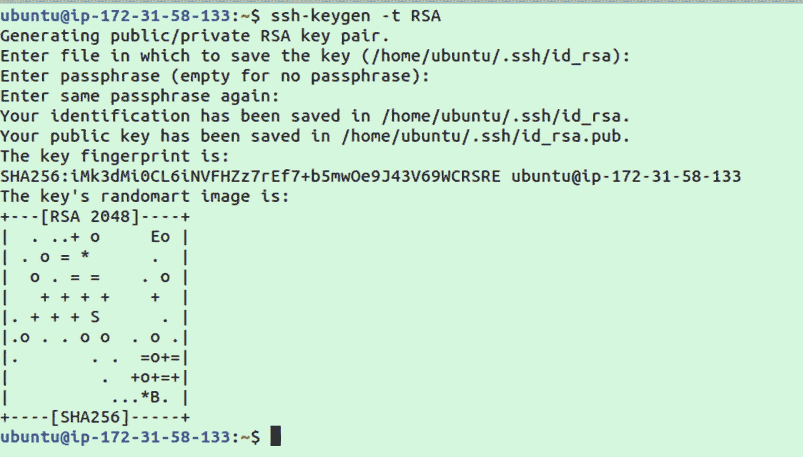
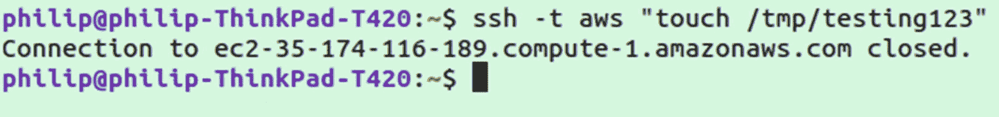
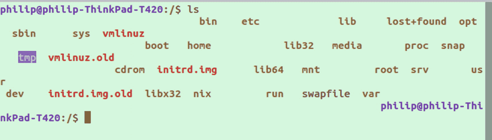
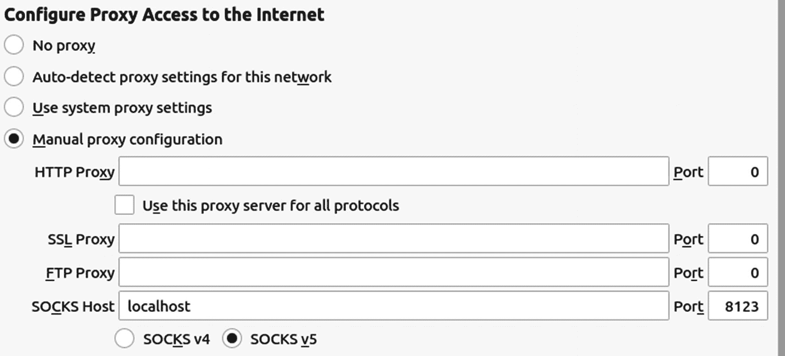
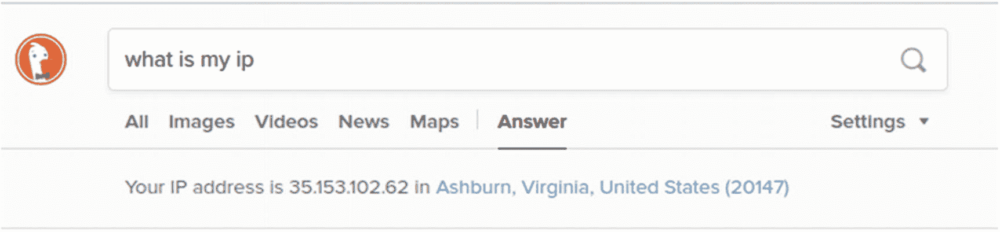

# 5.使用 SSH

在本章中，我们将了解 SSH(安全外壳)。SSH 是系统管理中最常用的工具之一。它允许您通过加密连接连接到远程服务器或设备。它也是构建在 SSH 之上的其他程序的基础，例如 X2Go，它是一个 Linux，相当于 RDP(远程桌面协议)客户端，如 VNC。

通过使用 SFTP(安全文件传输协议)命令，SSH 也可以以类似于 FTP(文件传输协议)的方式用于文件传输(下一章将详细介绍)。

在某些情况下，SSH 只是用作代理流量的一种手段，以隐藏用户或脚本的位置或 IP 地址。这可以通过 SSH 隧道和 SOCKS 代理来实现。

## SSH 的历史

虽然 SSH 只能追溯到 1995 年，但它实际上是建立在早在 1969 年的早期程序上的，比如`telnet`。SSH 默认监听端口 22，离`telnet`使用的端口 23 只有一个端口。历史上，几乎所有的 Linux 系统都是通过分时系统使用的，在分时系统中，一台中央计算机可以通过几个不同的基于文本的终端连接。这些基于文本的终端除了远程连接到中央计算机所需的软件之外，不包括任何东西。

这段历史对 Linux 操作系统有很大的影响。很明显，SSH 等基于文本的工具仍在广泛使用，允许多个用户连接到一个服务器来运行作业、访问数据和管理系统。

像`telnet`(电传网络的缩写)这样的早期程序的主要缺陷是它们缺乏安全性。使用`telnet`，客户端和服务器之间的通信是完全未加密的明文(包括任何密码)。双向加密和更高级的安全特性使得 SSH 在流行程度上迅速超越了早期的工具，如`telnet`。

虽然`telnet`几乎已经被 SSH 完全取代，但今天仍然有一些有趣的在线服务，包括 ASCII 格式的*星球大战*，telnet 上基于文本的在线象棋，以及 telnet 上的天气查询服务。

```sh
telnet towel.blinkenlights.nl

telnet freechess.org 5000

telnet rainmaker.wunderground.com

```

图 [5-1](#Fig1) 显示了来自`towel.blinkenlights.nl`的基于文本的开场动画。


图 5-1

基于文本的远程登录星球大战再现

## 基本的 SSH 使用

您想要熟悉的用于连接服务器的最重要的命令是 SSH。SSH 是用于远程连接到服务器、计算机和嵌入式设备的程序。它提供到服务器或设备的安全加密连接，并被广泛使用。当谈到远程管理服务器时，除了非常有限的特定于供应商的管理仪表板之外，确实没有 SSH 的替代方案。

要检查您的系统是否预装了 SSH，请尝试运行

```sh
which ssh

```

如果您获得了一个`ssh`文件的文件位置，就可以开始了。否则，继续安装它:

```sh
sudo apt-get install ssh

```

如果您已经运行了一个打开连接的服务器或设备，那么它就像运行

```sh
ssh <username>@<address>

```

之后会提示您输入密码。

### 使用 ssh-keygen 的密钥对

如果您已经使用 SSH 和密码成功登录到服务器或设备，您首先要做的事情之一就是切换到使用公钥鉴定。有两个主要好处:

*   密钥对被认为比密码更安全。

*   密钥对更方便，因为它们不需要密码。

一对密钥由两部分组成，第一部分是私钥，它将保留在您的计算机上，永远不应该共享；第二部分是公钥，它可以公开共享，用于签署请求，任何拥有公钥的人都可以验证请求来自您。

要开始创建密钥对，首先运行

```sh
ssh-keygen

```

系统会提示您选择密码；这是可选的。密码短语只是用来在本地加密您的私钥。这样，如果有人获得了你的笔记本电脑和私人密钥，他们将无法读取它，假设你选择了一个强密码。

如果您正确地遵循了这些说明，您应该会得到如图 [5-2](#Fig2) 所示的输出。



图 5-2

ssh-keygen 的输出

接下来，我们将把新的公钥复制到我们的远程 SSH 服务器/设备上；SSH 有一个内置命令来简化这一过程:

```sh
ssh-copy-id <username>@<address>

```

您将再次被提示输入登录服务器的密码。一旦该命令成功运行，您将能够自动登录到服务器，而无需使用服务器密码。但是，如果您选择一个密码来加密您的私钥，您将需要在使用该密钥之前输入该密码。

### PEM 和其他关键文件

在某些情况下，服务器可能会使用 PEM 文件，这是隐私增强邮件的缩写。一个流行的例子是 Amazon EC2 服务器。这些键使用`-i`标志指定，例如:

```sh
ssh -i <pem-file-location> <username>@<address>

```

使用`-i`标志的另一种方法是使用`ssh-add`将您的密钥添加到会话中，例如:

```sh
ssh-add <pem-file-location>

```

这将向身份验证代理添加密钥文件。它将保持活动状态，直到 SSH 重新启动，这主要发生在计算机重新启动时。

上述方法并不特定于 PEM 文件，而是可以用于 SSH 服务器所需的任何密钥文件。其他的还有 PPY，Putty 私钥的简称，或者`.pub` files，公钥的简称。

### 禁用服务器上的密码登录

我们提到过使用 ssh 密钥对的主要好处之一是它比密码认证更安全。为了获得这种附加安全性的好处，您必须在服务器上禁用密码登录。当您第一次添加密钥对时，服务器将允许使用这两种方法中的任何一种登录。由于 keypair 更安全，建议您关闭使用密码的功能，以避免任何类型的暴力攻击。

首先，使用 SSH 连接到服务器。然后你需要找到文件`/etc/ssh/sshd_config`。打开`sshd_config`，修改提及`ChallengeResponseAuthentication`的行；您需要确保它被设置为`no`，如下所示:

```sh
ChallengeResponseAuthentication no

```

其次，在同一个文件中，找到提到`PasswordAuthentication`的那一行，将其设置为 no:

```sh
PasswordAuthentication no

```

这两个设置将确保密码不能用于登录服务器。因此，在更改这些值之前，确保公钥身份验证正常工作非常重要。否则，您可能会发现自己完全被锁定在服务器之外。

最后，还有最后一个步骤，让 SSH 服务器重新加载已经更改的设置，这样它们才能生效。为此，请运行以下命令:

```sh
service sshd restart

```

重启 SSH 服务器的最后一步值得注意，因为它并不特定于这个设置。每当您对 SSH 配置进行任何更改时，您都需要在服务器上重新启动服务，以使这些更改生效。

### 带有 SSH 配置文件的服务器昵称

使 SSH 变得简单一点的另一个便利技巧是创建一个客户端 SSH 配置文件。您可以使用它为您经常登录的每台服务器创建默认用户名、服务器 IP 和身份验证密钥文件。当您经常需要在多个服务器或设备之间切换时，这变得特别有用。

您需要做的第一件事是创建 SSH 配置文件，该文件应该位于`~/.ssh/config`:

```sh
touch ~/.ssh/config

```

接下来，您需要确保它拥有正确的权限:

```sh
chmod 600 ~/.ssh/config

```

完成后，您可以打开配置文件并为您的每台服务器创建一个条目。例如，我将使用我目前正在使用的 AWS 服务器:

```sh
Host aws
 Hostname ec2-35-174-116-189.compute-1.amazonaws.com
 User ubuntu

```

现在，我可以不指定完整的主机名和用户，而是

```sh
ssh -i ~/.ssh/file.pem aws

```

您可能不需要`-i ~/.ssh/file.pem`，这取决于您的服务器是否需要身份文件。关键文件类型`.pub`或`.ppk`也可以与`-i`一起使用。

我们可以通过将身份文件添加到我们的配置中来进一步简化这一过程:

```sh
Host aws
 Hostname ec2-35-174-116-189.compute-1.amazonaws.com
 User ubuntu
 IdentityFile ~/.ssh/file.pem

```

现在我们可以简单地做

```sh
ssh aws

```

要为多个服务器添加条目，只需在配置文件中添加下面的附加块。这使得连接到不同的服务器更加容易，因为你不需要记住每个服务器的地址。

Note

`IdentityFile`也可用于指定公钥/私钥登录的 RSA 密钥。尽管默认情况下该值是`~/.ssh/id_rsa`。因此，如果您使用默认的密钥位置，就不需要添加它。

## 在连接上运行命令

有时您只想连接到服务器来运行一个命令。这通常与必须连续在几个相似的设备或服务器上执行一些修复有关。在一个例子中，我工作的一家公司有几个设备有一个错误，破坏了我们的配置管理设置。修复方法是简单地删除这些设备上的一个锁定文件。我们能够通过创建一个 for 循环来快速修复所有这些问题，该循环获取每个设备的 IP，连接，然后运行所需的命令。

Note

如果您经常发现自己必须连接到多个系统来运行相同的命令、修改配置或更新程序，那么您会想要查看 Ansible 程序，这是一个轻量级的开源程序，用于在几台机器上同时进行相同的更改。Ansible 构建在 SSH 之上，因此当您编写一个配置发送到多个设备时，它实际上是通过 SSH 连接并在幕后运行命令。Ansible 的其他受欢迎的替代品包括木偶、厨师和盐。

为此，您只需在 ssh 命令的末尾提供一个带引号的命令，例如:

```sh
ssh user@server.com "touch /tmp/testing123"

```

连接后，您几乎会立即断开连接并返回到您的本地机器命令行，如图 [5-3](#Fig3) 所示。



图 5-3

指定在 SSH 连接上运行的命令

如果您想在连接上运行一个命令，但不想立即断开连接，您可以修改命令 run on connection 来启动一个 bash 会话:

```sh
ssh user@server.com "touch /tmp/testing123; bash"

```

这将运行命令，然后将您置于 bash 会话中，不会断开连接。

## 中断挂起的 SSH 会话

使用 SSH 时可能出现的一个常见问题是，您让一个会话在后台或另一个窗口中运行，当您返回时，它完全冻结了。连接问题也可能是 SSH 会话挂起的常见原因。当客户端失去与服务器的连接时，它将挂起，直到服务器重新连接。您可能会想尝试按 ctrl+c 或 ctrl+d，但即使这样也不会结束冻结的 SSH 会话。

当这种情况发生时，退出会话的最简单方法是按 enter 键，然后按`~`，再按`.`。这样做应该会退出会话并返回如下消息

```sh
Connection to yourServer.com closed.

```

这种组合键是最广为人知的转义序列，但不是唯一的。如果你改为按回车键，`~`，然后`?`，你将得到所有支持的转义序列列表，包括表 [5-1](#Tab1) 中的那些。

表 5-1

转义序列列表

<colgroup><col class="tcol1 align-left"> <col class="tcol2 align-left"></colgroup> 
| 

顺序

 | 

描述

 |
| --- | --- |
| ~. | 终止连接(以及任何多路复用会话) |
| ~B | 向远程系统发送中断 |
| ~C | 打开命令行 |
| ~R | 请求重置密钥 |
| ~V/v | 减少/增加详细程度(日志级别) |
| ~^Z | 暂停 ssh |
| ~# | 列出转发的连接 |
| ~& | 后台 ssh(等待连接终止时) |
| ~? | 列出所有序列 |
| ~~ | 通过键入两次来发送转义字符 |

在大多数情况下，您主要希望使用常规的`~.`，当然，除非您刚刚输入了一个换行符，并且您确实希望键入`~`字符；在这种情况下，只需第二次点击它。还要注意的是，如果`~`是一行的第一个字符，它只会被作为转义序列读取；如果你已经进入了一行，你需要先按回车键或者清除输入。

## 保持健康

有时当你不得不中断连接时，或者如果你曾经不得不使用类似`minicom`的程序或者有时甚至是 SSH 来使用串行端口连接到一个设备，你将会有如图 [5-4](#Fig4) 所示的终端窗口故障。当这种故障发生时，您键入的字符可能不会像您预期的那样出现。这可能会导致意外的行为，使终端屏幕的大部分内容不可读，或者只是看起来不正确。


图 5-4

终端中的 ASCII 乱码故障(又名 mojibake)

或者您可能没有得到图中所示的 ASCII 类型的字符，但是您的空格是关闭的，终端通常不按预期运行；参见图 [5-5](#Fig5) 了解可能出现的奇怪间距类型。



图 5-5

视觉间距毛刺

如果这些小故障或任何视觉上的事情发生，你可以使用`stty sane`来修复你的终端，而不必关闭并重新打开。简单地跑

```sh
stty sane

```

在这种情况下可以使用的另一个命令是`reset`，它不带任何参数独立运行(不要与 reboot 混淆，reboot 将重新启动系统)。

```sh
reset

```

## 停止 SSH 挂起

能够从一个挂起的 SSH 会话中断开连接是很好的，但是如果能够完全避免这种情况发生就更好了。根据您的系统，默认情况下这可能不是问题，但是可以在您的客户端的`/etc/ssh/ssh_config`文件中更改`ServerAliveInterval`设置。

此设置告诉客户端多久向服务器发送一次信号，以确认您仍然连接并使用该连接。如果您在文件中没有看到`ServerAliveInterval`的实例，请添加以下几行:

```sh
Host *
ServerAliveInterval 100

```

您必须在出现问题的服务器上编辑同一个文件`/etc/ssh/sshd_config`:

```sh
ClientAliveInterval 60
TCPKeepAlive yes
ClientAliveCountMax 10000

```

这告诉服务器，如果没有收到任何保持会话活动的消息，则每 60 秒向客户端发送一条保持活动消息。`TCPKeepAlive`确保防火墙不会丢弃空闲连接，而`ClientAliveCountMax`指定服务器将在多长时间内保持发送保活消息，即使没有从客户端听到任何消息。

## SSH 隧道

SSH 隧道是通过 SSH 将一台计算机上的端口转发到远程计算机的过程。SSH 隧道有多种用途，我们将在接下来的章节中介绍。

## 本地 SSH 隧道

最简单的 SSH 隧道之一是本地隧道，它将本地端口绑定到远程机器上的地址。例如，我们可以使用`-L`标志将本地端口 8080 绑定到一个通过远程机器访问的网站:

```sh
ssh -L 8080:textfiles.com:80 user@server.com

```

在写这篇文章的时候，这在 textfiles.com 网站上运行得很好(这是一段有趣的互联网历史。查看 Jason Scott 的 Defcon 17 演讲，了解背后的故事)。不幸的是，这取决于你想隧道网站，它可能会或可能不会工作。像`nginx`这样的现代服务器软件实际上会检查你的浏览器中正在使用的主机名，但由于不匹配而无法工作。

在某些情况下，网站无法通过隧道工作，因为它们会检查浏览器使用的 URL，并且在使用“localhost”时会出现故障。Youtube 等大多数流行的网络应用程序都是如此。如果你想通过隧道访问一个不工作的网站，你可以通过更新`/etc/hosts`将该 URL 映射到你自己的服务器的 IP 地址，或者你可以发送一个虚假的标题，声称你的主机名实际上是预定的网站。根据您的操作系统，您可能需要安装`curl`。

```sh
sudo apt-get install curl

```

下面是一个使用`curl`手动设置带有`-H`标志的主机头的例子:

```sh
curl -H "Host: youtube.com" -L localhost:8080

```

这应该会返回 YouTube 的源代码。如果您想要一种更实用的方法来使用 SSH 隧道进行 web 浏览，我们在下一节关于 SOCKS 代理的内容中提供了一个更好的解决方案。

虽然这个例子向我们展示了本地 SSH 隧道是如何工作的，但它并没有确切地展示为什么会使用它。对于任何与浏览相关的内容，下一节中显示的 SOCKS 代理方法将是首选。

当您想要通过 SSH 访问服务器上运行的服务时，SSH 隧道就很方便了。这是一种特别安全的方式来为一个小团体提供 web 服务，而不必担心很多安全问题。由于该网站只对那些通过端口 22 上的 SSH 访问它的人可用，因此不存在可能以公开登录页面为目标的攻击威胁。

## 用 SSH 创建 SOCKS 代理

SSH 非常适合连接到远程服务器和设备，但它实际上可以用于各种用途。其中之一是创建一个 SOCKS 代理连接，当使用像 web 浏览器这样的应用程序时，它可以用来在本地计算机上引导流量。

SOCKS 代理具有与使用 VPN(虚拟专用网络)相关的大部分好处，包括

*   匿名网页浏览

*   绕过地理定位封锁

*   绕过本地网络或 ISP 的网站阻止

*   比 VPN 还快

请记住，第一个好处“匿名网页浏览”只是部分真实，这取决于你打算匿名的人和你用来代理流量的服务器。如果你试图向政府隐藏你的身份，并且你使用的服务器是以你的名字注册的，这可能不会有效。

然而，从你正在访问的网站的角度来看，他们只会看到你的终端服务器的 IP 地址。例如，他们可能看到流量来自位于美国东部的 AWS 服务器。

当使用您自己的服务器作为 SOCKS 代理时，需要记住的另一个警告是，一些服务器提供商的 IP 可能会被标记为 SOCKS 代理，并受到一些服务和网站的限制。这是因为许多自动化脚本和恶意服务都来自这些类型的服务器。如果您使用的是较小的主机提供商的服务器，您可能会绕过这类问题。

要开始，只需运行以下命令，用用户名和主机替换您自己的用户名和主机:

```sh
ssh -D 8123 -f -C -q -N user@server.com

```

这里包含的标志如表 [5-2](#Tab2) 所示。

表 5-2

使用的标志

<colgroup><col class="tcol1 align-left"> <col class="tcol2 align-left"></colgroup> 
| 

旗

 | 

描述

 |
| --- | --- |
| -D 8123 | 绑定到端口 8123 的连接 |
| -f | 将进程转移到后台 |
| -丙 | 发送前压缩数据 |
| q | 安静模式 |
| 同-EN | 不要执行远程命令 |

如果运行没有错误，您应该让 SOCKS 代理监听端口 8123 ( *随意用另一个*替换端口号)。我们可以使用`ps`和`grep`进行双重检查:

```sh
ps aux | grep ssh

```

如果正在运行，您应该看到您运行的命令被列为正在运行的进程。使用代理取决于您使用的具体应用程序。作为一个例子，我们来看看 Firefox。在 Firefox 中打开偏好设置，然后向下滚动到“网络设置”在网络设置中，如图 [5-6](#Fig6) 所示，您可以使用“localhost”配置“手动代理配置”,并将您选择的端口作为 SOCKS 主机。



图 5-6

设置 web 浏览器使用 SOCKS 代理

在 Firefox 上更新您的代理并保存后，您需要验证它是否按预期工作。要做到这一点，你需要找到一个网站来检查你的 IP 地址。我的首选方法是去 [`www.duckduckgo.com`](http://www.duckduckgo.com) (面向隐私的搜索引擎)，搜索“我的 ip 是什么”这样做应该会显示你的 IP 地址和位置，如图 [5-7](#Fig7) 所示，而不必点击进入任何第三方网站。



图 5-7

DuckDuckGo 显示我们的远程 SSH 服务器的 IP

## 反向 SSH 隧道

SSH 是连接远程服务器和设备的一个很好的工具，但是有时防火墙和路由器会碍事。例如，如果你家里有一个运行 Linux 服务器的 Raspberry Pi，并且想从你的本地网络之外通过 SSH 连接到它，你可能会因为路由器和互联网提供商的限制而遇到麻烦。

一个很好的解决方法是创建一个反向 SSH 隧道。反向 SSH 隧道依赖于相关设备来维持活动的传出连接。例如，我们的 Raspberry Pi 将持续保持与远程服务器的连接。因为是 Pi 对传入连接有限制，而不是相反，所以 Pi 进行传出连接没有问题。

当我们准备好 SSH 到 Pi 时，我们实际上在隧道内创建了我们的连接，这是 Pi 的输出连接。因此，Pi 在其自己的输出连接中接收输入连接。

要建立一个反向 SSH 隧道，首先在相关的服务器上打开一个终端会话；在这种情况下，我们的树莓派在防火墙后面。运行以下命令:

```sh
ssh -R 9876:localhost:22 user@server.com

```

`-R`标志在作为主要 SSH 连接的隧道内创建一个较小的隧道；`-R`代表远程，作为隧道入口点在远程机器上；这类似于`-L`旗，除了`-L`旗在本地侧有入口点。

另请注意，我们已经选择端口 9876 作为进入远程端的内部隧道在本地端结束的位置。请随意将端口 9876 与设备上任何未使用的端口交换。

一旦准备好连接到运行反向代理的设备，只需像平常一样使用 SSH，但要指定上一步中使用的端口。因此，在我们的示例中，我们将使用以下命令:

```sh
ssh -p 9876 user@server.com

```

## 通过反向代理服务网站

这种类型的 SSH 隧道是流行的开发工具 ngrok 的基础。Ngrok 允许开发人员立即将运行在本地机器上的 web 应用程序发布到 web URL 上，供任何人查看。您可以使用自己的 web 服务器做同样的事情。

为了演示，首先我们将创建一个运行在端口 8080 上的最小站点。如果你运行的是最新版本的 Ubuntu，默认情况下你应该已经安装了`python3`；否则你需要安装它。

```sh
cd /tmp
echo Hello World > index.html
python3 -m http.server 8080

```

运行这三行代码后，您将能够在 web 浏览器中转到 localhost:8080，并看到文本“Hello World”。我们的小站点运行在端口 8080 上，现在我们可以运行以下命令:

```sh
ssh -R 8080:localhost:8080 user@myServer.com

```

这将把我们本地机器上的端口 8080 镜像到远程服务器上的端口 8080，从而允许我们在一个活动的 IP 上演示我们的本地主机网站。

## SSH 代理跳转

有时您不想直接连接到 SSH 服务器。使用跳转框有两个主要原因:

*   通过仅允许从特定 IP 或非公共网络连接到最终目标服务器来降低安全风险。

*   您不希望最终的目的服务器记录您的实际 IP 地址。

在第一种情况下，您的目标服务器可能在公共互联网上不可用。在这种情况下，跳转框充当一个 DMZ ( *非军事区*)，您可以从这里进行连接。这意味着受保护的盒子是完全隐藏的，不会被端口扫描器或任何扫描开放互联网的恶意脚本发现。

您可以使用`-J`标志来使用跳转服务器，如下所示:

```sh
ssh -J user@server1.com user@server2.com

```

当使用跳转服务器时，使用 SSH 配置文件会很方便，因为您不能使用`-i`标志直接指定跳转服务器的身份文件，但是如果您使用本章中描述的 SSH 配置文件，您可以在那里定义身份文件。

如果你的情况更符合试图隐藏你的起源，你甚至可以使用一系列的跳转服务器。有了多个跳转服务器，即使是连接到目的服务器的跳转服务器也不会知道你的 IP 地址。通过提供多个以逗号分隔的跳转服务器，您可以使用多个跳转服务器:

```sh
ssh -J user@jump1.com,user@jump2.com user@server.com

```

## 更改 SSH 服务器上的默认端口

有几个原因可能导致您想要更改 SSH 服务器的默认端口——如果您知道您将从一个网络连接到服务器，该网络限制了除端口 80 或 443 之外的任何出站连接。

或者，如果您将使用密码验证，并且希望降低服务器被可能尝试暴力攻击的爬虫发现的机会，在这种情况下，请使用不常见的端口，如 79279。如果您不确定您选择的随机端口是否不常见，您可以使用`nmap`进行检查。`nmap`默认情况下不会安装，因此您必须通过您的软件包管理器安装它:

```sh
sudo apt-get install nmap

```

一旦安装了'`nmap`'，使用以下命令:

```sh
nmap --top-ports 1000 localhost -v -oG -

```

这将返回 1000 个最受欢迎的端口列表，您可以`reference`查看您的端口是否匹配。

## 打开防火墙

在更改端口之前，务必确保您没有防火墙或其他会阻止传入流量的配置。要检查是否启用了防火墙，请运行

```sh
sudo ufw status

```

如果`ufw`正在运行，您可能需要将其配置为接受来自您想要的端口的流量。如果它没有运行，您可能仍然需要处理您的云提供商安全设置。例如，Amazon AWS 安全实例的安全规则是在服务器本身之外的安全组规则中设置的。许多其他云提供商遵循相同的模式，只开放端口 22(可能还有端口 80 和 443)，以使服务器在默认情况下是安全的。请咨询您的服务器提供商，了解是否需要额外的步骤来允许端口访问。

如果`ufw`正在运行，你可以通过运行告诉它允许你的端口

```sh
sudo ufw allow <port-number>

```

## 修改 sshd_config

可以通过编辑文件`/etc/ssh/sshd_config`来修改 SSH 服务器的设置。在更改活动服务器上的端口之前，请确保该端口是可访问的。如果您将端口更改为阻止传入请求的端口，可能会将您自己锁定在服务器之外。要更改默认端口，只需找到如下注释行

```sh
#Port 22

```

取消对线路和交换机 22 的注释，使用您选择的端口:

```sh
Port 7929

```

Note

SSH 服务器的默认端口也可以在您的客户端 SSH 配置文件中指定，这样您就不需要在连接到服务器时使用-p 标志来指定它。

更新文件后，您需要重新启动 SSH 服务:

```sh
sudo service ssh restart

```

## 摘要

在本章中，我们了解了如何使用 SSH 和一些常见的配置远程连接到服务器或设备。这些配置包括关闭密码登录以使用密钥对，切换默认端口，以及通过修改保持活动设置来停止挂起。我们研究了 SSH 隧道和常见用法，比如创建 SOCKS 代理。

虽然这个列表很难涵盖 SSH 使用的所有地方和方式，但是它为使用一些常用设置连接到远程服务器打下了良好的基础。