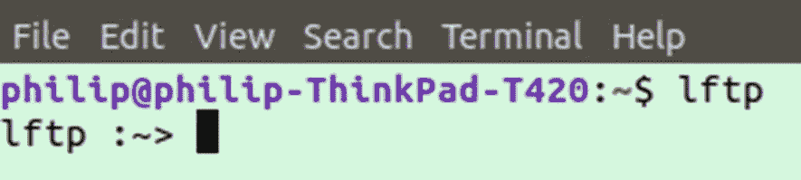
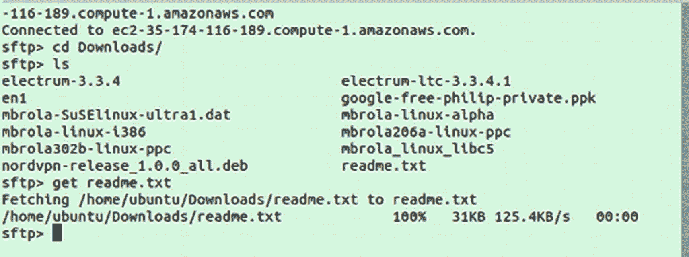
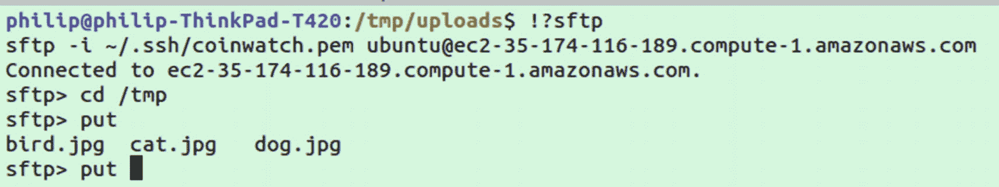

# 六、文件传输

在这一章中，我们将看看在机器之间传输文件的各种程序。

## 文件传送协议

传输文件最常见的协议之一是 FTP ( *文件传输协议*)。要开始使用 FTP，你应该安装`lftp`，一个复杂的文件传输程序。该程序主要用于 FTP，但也可用于其他协议:

```sh
sudo apt-get install lftp

```

安装`lftp`后，您可以使用以下命令进入交互模式

```sh
lftp

```

这将打开一个交互式 shell，您可以在其中运行特定于`lftp`的命令。它看起来应该类似于图 [6-1](#Fig1) 。



图 6-1

lftp 交互模式

`lftp` shell 的行为很像普通的 bash shell，让您可以访问几个命令，比如`ls`和`cd`。您还可以获得额外的命令。要查看可用的命令，只需输入`?`并按回车键。

需要知道的最重要的命令是`connect`，它被简单地用作

```sh
connect -u <username> <server-address>

```

之后，系统会提示您输入密码。连接后，您可以使用下载文件

```sh
get <file-name>

```

或使用上传

```sh
put <file-name>

```

Note

如果你正在寻找 FTP 服务器来练习，并且不想建立自己的 FTP 服务器，使用谷歌呆子寻找不安全的 FTP 服务器可能是有用的。Google dork 是一个搜索词，用于使用搜索词查找特定的应用程序或不安全的网站。寻找 FTP 服务器的一个好方法是`intitle:"index of" inurl:ftp`。

## science for the people 为人类服务的科学

Note

对于 SFTP 和 SCP(下一节)，您可以在本地主机上测试这些命令，而不是指定一个远程服务器。只需使用本地主机和您的用户名。当然，从一个本地主机到另一个本地主机并没有比类似于`mv`的命令提供更多的好处，但是它确实允许您在没有远程服务器设置的情况下测试这些命令。

您可能熟悉 FTP，它是文件传输协议的缩写。它通常与 FileZilla 等 GUI 程序一起使用，用于向服务器上传和下载文件。在 PHP 最流行的时候，使用 FileZilla 更新服务器的`www`目录是标准做法。

虽然像 FileZilla 这样的程序仍然被广泛使用，但这些程序现在使用了一种叫做 FTPS 的新的安全版本的 FTP。FTP 有一个主要弱点，使得攻击者能够在用户连接到服务器时，嗅探到 FTP 服务器的流量并获取用户凭据。

FTP 的另一个流行且易于使用的替代方法是 SFTP。SFTP 支持文件传输，看起来和感觉上像 FTP，但通过端口 22，SSH 会话使用的同一端口。如果您已经在服务器上使用了 SSH，那么使用 SFTP 连接它应该没有问题。它不需要在服务器或连接客户端上安装任何额外的软件。大多数 SSH 安装都应该包含 SFTP，除了极少数轻量级版本。

首先，只需使用您已经在使用的命令通过`ssh`连接到您的服务器，并使用`sftp`代替，例如:

```sh
sftp ubuntu@myserver.com

```

或者，如果您使用 PEM 文件进行身份验证(这在 AWS 服务器中很常见),请使用

```sh
sftp -i ~/.ssh/key.pem ubuntu@myserver.com

```

连接前需要注意的一点是，您连接的目录将是您打算下载或上传的目录。

一旦登录到服务器，您将能够使用一些通常在`ssh`会话中可用的命令，但不是全部。最重要的是，您将能够使用`ls`和`cd` ( *就像使用 FTP* )来浏览您的文件系统。

如果您想下载一个文件，导航到相关文件夹并使用`get`命令:

```sh
get readme.txt

```

如果一切正常，您应该会看到一些确认下载的输出，如图 [6-2](#Fig2) 所示。



图 6-2

使用 lftp 从远程服务器获取文件

从那时起，通过按 ctrl+c 断开`sftp`连接。一旦回到本地机器，运行`ls`，您应该会看到下载的文件。

你可能想利用的另一个上传文件的功能是`put`。与`get`一样，在通过`sftp`连接之前，导航到包含您想要上传的文件的文件夹。然后与`sftp`连接；在服务器上，导航到您想要上传文件的位置。键入`put`，确保包含`put`后的空格，然后按 tab 键。在`put`之后按 tab 应该会显示目录中的文件列表。在图 [6-3](#Fig3) 中，你可以看到鸟、猫和狗的图像文件。



图 6-3

使用自动完成功能查看可以放入哪些文件

从这一点来说，我可以简单地完成三个选项中的一个，或者如果您意识到您在错误的文件夹中，您可以开始键入替代路径，例如，`../`或`/`，然后再次按 tab 以帮助找到您想要上传的文件。

Note

在章节 [5](05.html) 中，我们看了如何创建一个`~/.ssh/config`文件来创建包含服务器、用户名和其他选项的快捷方式。这个相同的配置文件也适用于 SFTP 和 SCP。

## 单细胞蛋白质

SCP 是 secure copy protocol 的缩写，是 SSH 附带的另一种文件协议。功能类似于 SFTP，但它没有交互方面。使用 SCP 的上传或下载必须在一个命令中声明，而不是首先连接到一台机器，然后才能浏览目录。

总的来说，SCP 似乎比 SFTP 更糟糕，因为它没有提供额外的功能，交互性也更差。但是，SCP 的优势是文件传输速度比 SFTP 快。对于中小型文件，这可能会被忽视，但如果你是移动一个大文件，你可能会决定用 SCP 而不是 SFTP。如果您将文件作为脚本的一部分进行传输，您也可以考虑使用 SCP，交互模式实际上是一种阻碍而不是一种好处。

要从服务器下载文件，只需运行`scp`，然后运行`username@serverName`，然后运行`:/file/location` ( *，不带空格*，然后作为第二个参数运行您希望在本地机器上保存文件的路径，例如:

```sh
scp ubuntu@myserver.com:/tmp/myFile.txt ./

```

许多在`ssh`和`sftp`上起作用的标志也将在`scp`上起作用——例如，如果您需要使用 PEM 文件登录到您的服务器:

```sh
scp -i ~/.ssh/mykey.pem ubuntu@myserver.com:/tmp/myFile.txt ./

```

如果您需要将文件上传到服务器，只需切换路径的顺序:

```sh
scp ./ ubuntu@myserver.com:/tmp/myFile.txt

```

## 备份

Note

如果您使用密码登录您的服务器，您需要设置公钥认证，如第 [5](05.html) 章“ssh-keygen 的密钥对”一节所述除了设置 SSH 之外，您的远程服务器唯一需要安装的是`rsync`。

Rsync 是另一个在 Linux 系统上上传和下载文件的工具，但它的功能更像是一个自动备份系统，类似于 Dropbox 提供的服务。设置完成后，它将监控一个系统上的目标文件夹，如果有任何文件被添加或更改，它们将被同步到远程服务器。这很方便，因为与一些定制备份脚本不同，它将只保存新的或更改的文件，而不是定期运行备份文件夹的`scp`命令。

要开始使用，请安装`rsync`:

```sh
sudo apt-get install rsync

```

要使用该程序，您需要运行以下命令:

```sh
rsync -r --progress \
  ~/backup ubuntu@<myserver.com>:/home/ubuntu/backup

```

在前面的命令中，我们首先指定我们的本地文件夹`~/backup`，这是我们想要备份的文件夹。在文件夹之后，我们指定用户名和服务器`ubuntu@<myserver.com>`,您将用您的服务器信息替换它。如果没有空格，我们就有了`:/home/ubuntu/back`,这是我们将要备份文件的文件夹位置。

虽然我们首先指定本地文件夹，但这不是必需的。如果我们想将远程服务器备份到本地文件夹，我们只需交换参数的顺序，然后运行以下命令:

```sh
rsync -r --progress \
  ubuntu@<myserver.com>:/home/ubuntu/backup ~/backup

```

我们使用的可选标志是`-r`和`--progress`,前者导致文件夹被递归备份，后者提供一些关于备份过程进行到什么程度的视觉反馈。

如果您正在使用一个身份文件，您将需要使用`-e`标志并指定用于启动会话的特定 SSH 命令。我们使用添加身份文件的例子，但是如果您想以任何方式修改 SSH，您可以使用`-e`标志。然而，在某些情况下，比如更改远程服务器用于 SSH 的端口，`rsync`提供了自己的标志`--port`(和往常一样，您可以查看手册页以获得选项的完整列表)。

```sh
rsync -r --progress \
  -e "ssh -i /home/philip/.ssh/key.pem" \
  ~/backup ubuntu@myserver.com:/home/ubuntu/backup

```

如前所述，我们使用了`-r`标志。如果没有`-r`选项，文件夹中的文件将不会被备份。有几个选项可以和`rsync`一起使用；表 [6-1](#Tab1) 中列出了一些最常见的。

表 6-1

常见 rsync 选项

<colgroup><col class="tcol1 align-left"> <col class="tcol2 align-left"> <col class="tcol3 align-left"></colgroup> 
| 

短旗

 | 

满旗

 | 

描述

 |
| --- | --- | --- |
| -v | -冗长 | 更详细的输出 |
| q | 安静 | 无文本输出 |
| ［构成动植物的古名或拉丁化的现代名］ | -存档 | 同步时归档文件 |
| -r | -递归 | 递归同步目录 |
| -b | -备份 | 制作备份 |
| -你 | -更新 | 如果目的地较新，不要复制文件 |
| -我 | -链接 | 复制符号链接 |
| 同-EN | -预演 | 试验 |
| -e | -rsh="command " | 指定远程外壳命令 |
| z | -压缩 | 同步时压缩数据 |
| -h | -人类可读 | 人类可读格式的尺寸 |
|   | -进步 | 同步过程中显示进度 |

### 为 Rsync 设置 Cron 作业

我们已经看到使用`rsync`备份整个文件夹或一组文件夹是多么容易，但是它还不是完全自动的。为了让生活变得简单一点，我们可以创建一个 cron 作业来自动执行定期调用命令的过程。

为此，我们将创建一个 cron 作业，但首先让我们在脚本文件中移动备份命令。您可以在您喜欢的任何位置创建该文件；定制脚本的一个常见位置是`/usr/local/bin/`。打开您的脚本文件，在我们的例子中，我们将使用`/usr/local/bin/backup.sh`，添加一个 shebang，并粘贴特定于您的服务器和备份文件夹位置的`rsync`命令:

```sh
#!/usr/bin/env bash

rsync -r --progress \
  ~/backup ubuntu@myserver.com:/home/ubuntu/backup

```

确保将用户、服务器和文件夹替换到您的特定设置中。如果您想要备份多个文件夹，您可以在第一个文件夹下添加额外的`rsync`命令。保存后，请确保为新文件添加执行权限:

```sh
chmod +x /usr/local/bin/backup.sh

```

最后，我们将通过运行`crontab -e`创建 cron 作业，并在文件底部添加

```sh
0 0 * * * /usr/local/bin/backup.sh

```

有了这个设置，你的系统应该在每天午夜进行备份。

### 同音双向同步

我们已经看到了`rsync`如何使从一台机器到另一台机器的备份变得容易，但这与像 Dropbox 这样提供双向同步的流行服务不太一样。如果你需要以两种方式同步文件，你可以使用建立在`rsync`之上的`unison`程序，它提供双向同步。

确保在您想要同步的两台机器上都安装了`unison`:

```sh
sudo apt-get install unison

```

由于没有用`unison`指定一个`.pem`键的选项，你只能将它添加到`ssh`中，并让`ssh`在需要时提供它。你可以通过运行(*你必须在每次系统重启时运行这个步骤*)

```sh
ssh-add <path/to/file.pem>

```

完成后，您就可以运行`unison`:

```sh
unison -auto -batch \
  ~/backup  \
  ssh://ubuntu@server.com//home/ubuntu/backup/

```

建议使用`-auto`和`-batch`标志来使过程自动化；如果没有它们，您将被手动要求验证每个同步的文件。

#### 当文件同步更改时自动同步

不幸的是，包括 Ubuntu 在内的一些包管理器上可用的版本`unison`不包括监控文件系统的配套二进制文件`unison-fsmonitor`。这给你留下了两个选择:

1.  使用 cron 作业定期检查，就像我们使用 rsync 一样。

2.  从源代码手动编译 unison。

如果您想使用 cron 的简单方法，只需参考上一节关于 rsync 的内容，用一个`unison`命令替换`backup.sh`中的`rsync`命令；您可能还想增加 cron 作业的频率。如果您想从源代码编译以获得在文件改变时立即自动同步的能力，请继续阅读，我们将介绍从源代码编译所需的步骤。为避免任何错误，请确保两台机器上的`rsync`版本相同。

首先，我们需要卸载包管理器版本的`unison`并安装`ocaml`，这是编写 unison 的语言:

```sh
sudo apt-get remove unison
sudo apt-get install ocaml

```

接下来转到 [`https://github.com/bcpierce00/unison/releases`](https://github.com/bcpierce00/unison/releases) 并记下最新的可用版本。在写的时候，是 2.51.2。无论版本号是多少，都要设置一个环境变量，因为我们会多次使用它:

```sh
UNISON_VERSION=2.51.2

```

设置好版本号后，运行以下一系列命令；注意，我们使用了为版本号设置的环境变量:

```sh
wget \
  github.com/bcpierce00/unison/archive/v$UNISON_VERSION.tar.gz
tar -xzvf v$UNISON_VERSION.tar.gz
rm v$UNISON_VERSION.tar.gz
pushd unison-$UNISON_VERSION
make
sudo cp -t /usr/local/bin ./src/unison ./src/unison-fsmonitor
popd
rm -rf unison-$UNISON_VERSION

```

您需要在想要同步的两台服务器上运行前面卸载、构建和安装`unison`的步骤。完成后，您可以在两台服务器中的一台上运行以下命令:

```sh
unison -batch -auto ~/backup \
  ssh://ubuntu@server.com//home/ubuntu/backup/ \
  -repeat watch

```

运行该程序后，您可以尝试在任一服务器上的备份目录中创建一个文件，并查看文件是否同步。

Note

设置`unison`时，注意不要互相备份两个主目录。在测试过程中，我们发现每次使用主文件夹备份后，都会更新一个日志文件，它本身会触发另一个备份，从而导致无限循环。

#### 同音设置文件

正如我们在注释中提到的，由于日志文件的原因，我们在尝试创建两个主目录之间的备份时遇到了一个错误。但是，如果需要，可以修改 unison 日志文件的位置以及程序运行的许多其他方面。unison 的设置在文件`.unison/default.prf`中指定。如果我们想改变日志的位置，我们可以添加下面一行。

```sh
logfile = /tmp/unison.log

```

其他可以设置的选项包括忽略某些文件类型；在此查看忽略 mp4 文件的示例:

```sh
ignore = Name *.mp4

```

有关 unison 上可配置内容的更多信息，请参见 [`www.cis.upenn.edu/~bcpierce/unison/docs.html`](https://www.cis.upenn.edu/%257Ebcpierce/unison/docs.html) 的官方文档。

#### 创建一个服务来保持 Unison 运行

虽然我们已经在两台服务器上实现了双向自动同步，但仍然存在一些问题。首先，你不得不保持终端窗口运行一致，其次，如果你重启电脑，它会关闭。

作为这两个问题的解决方案，我们将创建一个`systemd`服务，它将在启动时打开`unison`,并确保它保持运行，这样您的文件夹总是同步的，而无需您运行命令或考虑它。

我们要做的第一件事是移动调用 unison 时使用的所有命令行参数，并将它们转换成位于`~/.unison/bidirsync.prf`的 unison 配置文件。创建`~/.unison/bidirsync.prf`并添加以下内容:

```sh
# Unison preferences
label = bi-directonal sync with server
root = /home/<user>/backup
root = ssh://<user>@<server-name>//home/<user>/backup
batch = true
auto = true
repeat = watch
logfile = /home/<user>/.unison/unison.log
#debug=all

```

如果您的服务器需要一个像 PEM 这样的身份文件，您还需要添加一行来指定该文件，格式如下:

```sh
sshargs = -oIdentityFile=/home/<user>/.ssh/<privkey-name>

```

通过运行`unison bidirsync`测试配置。注意，`bidirsync`既是我们创建的文件名，也是我们配置文件中的标签。您可以使用`~/.unison/`文件夹创建任意多的 unison 配置，并以这种方式快速运行它们。

现在我们有了一个工作配置，我们将创建一个`systemd`服务(参见第 [11](11.html) 章了解更多信息)。首先创建一个新文件夹`~/.config/systemd/user`:

```sh
mkdir -p ~/.config/systemd/user

```

然后在那个文件夹中，创建一个名为`unison.service`的文件。它应该包含以下内容(*确保将用户和组更新为您自己的值*):

```sh
[Unit]
Description=Unison

[Service]
Environment="PATH=/usr/local/bin:/usr/bin"
ExecStart=/usr/local/bin/unison bidirsync
User=<yourUser>
Group=<yourUser>
Restart=always
RestartSec=10

[Install]
WantedBy=multi-user.target

```

一旦创建了服务文件，就可以运行以下命令来启动它:

```sh
sudo systemctl start unison

```

您可以通过运行以下命令来检查一切是否正常，并查看日志

```sh
systemctl status unison

```

## 摘要

在这一章中，我们看了几个可以用于跨机器下载、上传和同步文件的服务。我们从经典的`ftp`和更安全的替代品开始，如`sftp`和`scp`。然后我们看了看`rsync`如何轻松同步文件夹，甚至看了看`unison`，它能够在不同机器上的文件夹发生变化后立即自动保持同步。