# 7.网络扫描

通常，您会想要查看本地网络上有哪些设备，包括设备的 IP 地址。这在几种情况下很方便，包括但不限于

*   你想得到你的路由器的 IP 地址。

*   您到达一家酒店，想要检查网络是否有漏洞或隐藏设备，例如可能被遗忘的流氓 Raspberry Pi。

*   你想看看网络上其他电脑的 IP 地址，看看有没有不安全的地方。

*   对网络上有哪些设备的普遍好奇。

在这一章中，我们将介绍如何检测网络上有哪些设备以及它们打开了哪些端口。在某些情况下，甚至可以确定设备运行的操作系统、某个端口上运行的应用程序的版本或者服务器的物理位置。

## 用 Ping 检查连接

在我们开始扫描网络之前，有必要提及一个最简单但有用的命令。`ping`允许您检查您是否已连接到互联网，以及您的目标网站是否已打开。为了检查你的互联网连接是否良好，许多人会向`8.8.8.8`发送一个`ping`；这是谷歌的主要 DNS 服务器，众所周知非常可靠。你可以用

```sh
ping 8.8.8.8

```

Note

由于其长寿和高正常运行时间，8.8.8.8 经常被用作发送 pings 的虚拟服务器。然而，由于这是一个企业(Google)使用的活动服务器，您可能希望考虑周到，不要给他们的负载增加额外的流量。互联网数字地址分配机构专门保留网站`example.com`作为示例网站，用于上述目的。出于这个原因，我们将使用`example.com`来代替 8.8.8.8。然而，知道 8.8.8.8 经常被用于这个目的是很好的，这样如果你在一个脚本中看到它，你可以识别正在发生的事情。

大约每秒钟你都会得到一个响应，告诉你连接是好的。可以用`ctrl+c`退出程序；如果您只想 ping 一次或固定次数，您可以使用`-c`标志后跟一个数字。如果您想在连接到互联网或目标网站启动的情况下执行某些操作，这可能会很有用，例如:

```sh
ping -c 1 example.com && echo connected

```

如果我们用一个不活跃的 IP 或网站来改变`example.com`，那么`echo connected`将永远不会运行。

## arp 扫描方法

最简单的方法是安装一个名为 arp-scan 的程序。`arp-scan`是一个向网络上的所有设备发送 arp 数据包并显示收到的响应的程序。

在基于 Ubuntu/Debian 的系统上，您应该能够安装它

```sh
sudo apt-get install arp-scan

```

安装后，使用`--localnet`选项查看本地网络上的所有设备；该命令需要 root 权限:

```sh
sudo arp-scan --localnet

```

该程序将返回一个设备列表，包括 IP 地址，唯一的 MAC 地址，如果可能的话，还有设备的制造商。

当我在酒店房间写这篇文章时，我可以看到本地的 Cisco 路由器，毫不奇怪，它可以使用设备的默认用户名和密码登录。

此外，我有时可以看到我的 Android 手机也连接到网络。对于 android 设备来说，看到它取决于发送 arp 数据包时是否收到响应，这在睡眠模式下通常不会发生。

记下设备的唯一 MAC 地址会很有用，例如，如果您想稍后查看某人是否在另一个位置。说我在朋友家；我可能会记录下他笔记本电脑和手机的 MAC 地址。然后，当在单个网络上的大型建筑物(例如，图书馆)时，我可以扫描网络以查看他的设备是否连接，从而知道他是否在所述位置。

## nmap 方法

虽然我发现 arp-scan 为找到的设备提供了最完整的信息，因为它返回 IP、MAC 地址和制造商，但也有设备不包括在扫描范围内的情况——例如，如果某个设备存在于网络上，但尚未分配 IP 地址。

要获得更完整的列表，请使用第二种方法。它需要安装 nmap，即“网络映射器”的缩写。同样在 Ubuntu/Debian 上，你应该能够安装它

```sh
sudo apt-get install nmap

```

一旦安装完毕，你会想要使用选项`-sn`，它代表无端口扫描。在 nmap 的旧版本中，可以使用选项`-sP`来代替`-sn`。此选项通常被称为“ping 扫描”。

完整的命令如下，确保使用 root 权限和`sudo`(否则结果会不同):

```sh
sudo nmap -sn 192.168.1.0/24

```

前面的命令假设您的网络正在使用 IP 范围`192.168.1.*`；在某些情况下，第三个数字可能不同。如果您没有从`nmap` ping 扫描中得到任何结果，您应该手动检查您的网络正在使用的 IP 范围。在这种情况下，您可以通过运行(“`a`”是地址的简称)来查找

```sh
ip a

```

在结果中，查找带有无线或以太网接口的部分(取决于您使用的接口),并在本地网络中查找您自己的 IP。以我为例，我的无线接口叫`wlp3s0`，我的本地 IP 地址范围是 192.168.30。*如图 [7-1](#Fig1) 所示。

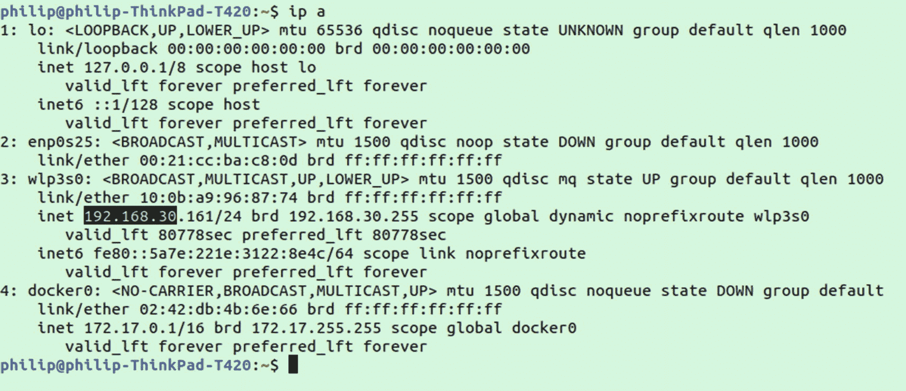

图 7-1

使用`ip a`查找本地使用的 IP 地址

所以在我的情况下，我实际上需要运行

```sh
sudo nmap -sn 192.168.30.0/24

```

该命令中的`0/24`指定了 CIDR 符号的范围。用`nmap`指定范围有三个选项:

*   cid 符号( *0/24*

*   范围( *1-5* )

*   通配符( *** )

因此，相同的命令可以表示为

```sh
nmap 192.168.1.0/24
nmap 192.168.1.0-255
nmap 192.168.1.*

```

Note

想观看网络直播吗？在运行`nmap`之前，打开第二个终端并运行`ip monitor`。这将使你能够实时观看网络上发生的一切。或者，如果您只想查看活动表单`nmap`，您可以在命令中添加`-d`标志。

## 查看开放端口

一旦你有了一个设备的 IP 地址，你经常想看看哪些端口是开放的。这也适用于服务器，毕竟服务器只是位于互联网上某个 IP 地址的设备，与本地计算机、智能手机或物联网设备没有什么不同。这可能会派上用场的情况包括

*   根据开放端口判断网络上的设备类型

*   寻找可能被黑客利用的开放端口

*   找到一个可以在浏览器中访问的开放端口，或者通过其他方式进行设备交互

因为我们之前安装了`nmap`，我假设你已经安装了它。

扫描设备开放端口的最常见方法是简单地使用 nmap，后跟要扫描的设备的 IP 地址。例如，使用前面的提示，我能够发现我的酒店的路由器的 ip 地址是 192 . 168 . 1 . 1；然后，我将使用以下命令来查找开放端口:

```sh
nmap 192.168.1.1

```

在我的例子中，输出如下:

```sh
Host is up (0.82s latency).
Not shown: 999 closed ports
PORT   STATE SERVICE
80/tcp open  http

```

Note

从`nmap`获得这种输出依赖于设备实际上位于您输入的 IP 上。可能`192.168.1.1`不是您网络上的任何设备。

它显示端口 80 是打开的；这是基本的 http 端口，基于 web 的界面在此为路由器的设置面板提供服务。

您可能希望检查您自己的计算机上打开了哪些端口；你可能会惊讶于你的发现:

```sh
nmap localhost

```

需要指出的是，默认情况下，nmap 仅扫描指定设备上 1000 个最常用的端口。当服务器或设备想要谨慎时，可以使用不太流行的端口。如果你真的想扫描所有可能的端口，你应该使用`-p-`标志，例如:

```sh
nmap -p- localhost

```

这将扫描所有 65535 个端口，也就是说，是默认端口的 65 倍以上，因此需要很长时间才能完成。

同样的方法也可以用在网址上，例如:

```sh
nmap -p- example.com

```

这将为 example.com 返回服务器上开放的端口。在撰写本文时，只有端口 80 和 443 是开放的——端口 80 用于 http 流量，端口 443 用于 https。稍后，我将列出一些最常见的端口及其最可能的用途。牢记“最有可能”这句话；没有什么可以阻止服务器使用一个通常用于一件事的端口来做另一件事。一些最常用的端口如表 [7-1](#Tab1) 所示。

有时，有人可能会在意外的端口上运行服务，例如，在端口 80 而不是端口 22 上运行 ssh，以破坏不允许 SSH 的限制性网络策略。防火墙阻止端口 22，试图阻止在网络上使用 ssh，但是如果服务器侦听端口 80(通常用于 web 流量)，这种阻止方法就会失效。

表 7-1

通常易受攻击的端口

<colgroup><col class="tcol1 align-left"> <col class="tcol2 align-left"></colgroup> 
| 

通道数

 | 

多畜共牧

 |
| --- | --- |
| Eighty | 超文本传送协议（Hyper Text Transport Protocol 的缩写） |
| Four hundred and forty-three | 安全超文本传输协议 |
| Twenty-one | 文件传送协议 |
| Twenty-two | 嘘 |
| Twenty-five | 简单邮件传输协议 |
| One hundred and thirty-five | Windows RCP |
| One hundred and thirty-seven | 网络基本输入输出系统(Network Basic Input / Output System) |
| Three thousand three hundred and six | 关系型数据库 |
| Three thousand three hundred and eighty-nine | 远端桌面协定 |

在非默认端口上运行服务的另一个常见用途是避免利用 bot，这些 bot 可能会使用这里使用的扫描技术。例如，假设有人正在大规模扫描 IP 地址，以查找运行在默认端口 3306 上的 MySQL 实例；在端口 7777 上运行服务的服务器将不会被检测到。尽管像 MySQL 这样的东西，最好的策略是对公众完全关闭端口，只对需要它的内部应用程序开放。对于 SSH 之类的东西，您可能没有完全关闭端口的选项。正是因为这个原因，SSH 密钥认证比密码认证更受推荐，因为它使得暴力攻击几乎不可能。

如果您想查看一个更完整的列表，您可以解析列出了`nmap`已知的所有服务的`/usr/share/nmap/`文件。列表太长，没有用，所以您可能会发现删除所有标记为未知的条目是有用的:

```sh
cat /usr/share/nmap/nmap-services | grep -v unknown

```

即使在删除所有未知条目后，我们仍然得到超过 12，000 个结果。我建议颠倒线路，从编号较低的端口开始。你可以通过将前面的命令输入`tac` ( `cat`命令，行颠倒)来实现:

```sh
cat /usr/share/nmap/nmap-services \
  | grep -v unknown \
  | tac

```

这样，您可以从端口 1 开始向上滚动。或者，你可以通过管道将结果输入到'`less`'，该功能在第 [1 章](01.html)中探讨，通过简单的滚动来查看结果。

## 设备和端口

如果您想扫描本地网络上的所有设备，并扫描这些设备上的开放端口，您可以将前面的两个提示合并到一个命令中。

这既可以用简单但缓慢的方法，也可以用快速的方法。

### 简单但缓慢

简单但缓慢的方法是，通过在 IP 范围而不是 IP 上运行`nmap`,在一个步骤中简单地对整个过程使用 nmap。这意味着将对指定范围内的所有 IP 尝试 nmap 如果您想扫描所有端口而不是 1000 个最常用的端口，只需添加`-p-`:

```sh
sudo nmap 192.168.1.0/24

```

Note

根据您的网络，这种方法可能会非常慢。

### 快速方法

更快的方法是使用 arp-scan 获取 IP，grep 提取 IP，最后使用`xargs`和`nmap`对每个 IP 执行扫描。看起来是这样的:

```sh
sudo arp-scan --localnet \
  | grep -o \
    '[0-9]\{1,3\}\.[0-9]\{1,3\}\.[0-9]\{1,3\}\.[0-9]\{1,3\}' \
  | xargs nmap

```

### 操作系统检测

如果您从结果中发现一些有趣的机器 IP 地址，您可以让`nmap`尝试猜测机器上运行的操作系统:

```sh
sudo nmap -O <ip-address>

```

如果您想检测使用上一节中的脚本扫描的每个设备的操作系统，您可能需要使用`--osscan-limit`来将操作系统检测扫描限制在有希望的目标上。或者如果你想让`nmap`更积极地猜测操作系统并显示最接近的匹配，使用`--osscan-guess`。

## 用 masscan 扫描互联网

> *Masscan* *是一款互联网规模的端口扫描器，适用于互联网或内部网络的大规模调查。虽然默认传输速率仅为 100 包/秒，但它可以选择高达 2500 万包/秒，这一速率足以在 3 分钟内扫描一个端口的互联网。*
> 
> —masscan 手册页

Note

与`nmap`一样，如果您想获得最新的特性(例如- *top-ports flag* )，您将希望从源代码构建`masscan`，尽管在大多数包管理器中都有一个旧版本。你可以在 [`www.github.com/robertdavidgraham/masscan`](http://www.github.com/robertdavidgraham/masscan) 找到出处。

Masscan 是一个与`nmap`非常相似的工具，但它是后来发布的，能够以更快的速度扫描端口。在这两者之间切换很容易，因为`masscan`使用了与`nmap`兼容的语法。您甚至可以通过运行以下命令获得`masscan`和`nmap`之间相似特性的列表

```sh
masscan --nmap

```

虽然`masscan`比`nmap`快得多，但它的功能较少，也不太准确。通常`masscan`将用于初始侦察以寻找目标，一旦目标被选定，`nmap`将用于更大的准确性和细节。

当使用`masscan`时，您可能会注意到它的运行速度比手册页中描述的最大速度慢得多。这是因为还有其他几个限制`masscan`运行速度的因素，包括你的路由器上传和下载流量的速率。

也就是说，我们可以运行一个相当于`nmap`的脚本来进行比较:

```sh
time sudo masscan --top-ports 192.168.1.0/24

```

完成后，尝试`nmap`中的相同操作:

```sh
time sudo nmap 192.168.1.0/24

```

您会发现`masscan`运行速度明显更快，因为它在发送下一个请求之前不等待响应，尽管一旦发现设备，它仍然必须扫描每个端口以找到哪些端口是打开的。

正如描述中提到的，默认速度是每秒 100 个包，尽管可以一直提高到每秒 2500 万个包。该速率将受到网络和设备处理能力的限制。如果你想改变速率，使用`--rate`标志，例如:

```sh
sudo masscan -p 22 --rate 1000 192.168.1.0/24

```

当扫描公共范围时，要小心，因为向非常大范围的 IP 发送大量的无限制信息可能会触发您的互联网服务提供商的危险信号。可能更好的方法是 SSH 到一个便宜的服务器上，然后从那里高速测试大型扫描。

## 使用 nmap 运行脚本

除了扫描端口和检测操作系统，`nmap`还通过脚本模块提供高级功能。默认情况下，程序附带了很多这样的脚本，还可以从头开始安装或编写其他脚本。要获得`nmap`附带的脚本的完整列表，请查看`usr/share/nmap/scripts`文件夹:

```sh
ls /usr/share/nmap/scripts

```

在撰写本文时，默认情况下，`nmap`附带了超过 600 个预先编写好的脚本。

Note

从`apt-get`或其他包管理系统获得的版本可能不是最新的，因为`nmap`仍然是一个非常活跃的项目。您可以在 [`www.github.com/nmap/nmap`](http://www.github.com/nmap/nmap) 找到最新版本。

要使用脚本，只需像下面这样传递带有`--script`标志的脚本:

```sh
nmap --script http-headers example.com

```

在这个例子中，我们使用了一个脚本来获取 example.com 的 http-headers；您的结果应该包括端口 80 和 443 的报头，如图 [7-2](#Fig2) 所示。

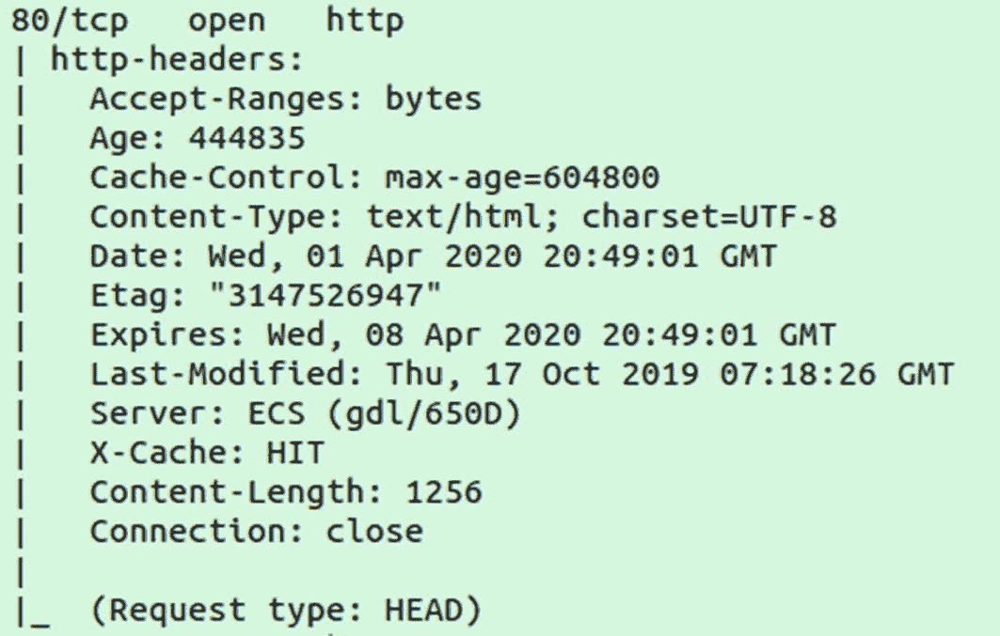

图 7-2

http-headers nmap 脚本中的标头信息

## traceroute 脚本

一些像前面提到的脚本可以直接运行。其他选项可能需要与其他选项结合使用。例如，`traceroute-geolocation`处理来自`--traceroute`标志的数据。所以使用这个脚本需要:

```sh
sudo nmap --traceroute \
  --script traceroute-geolocation example.com

```

`--traceroute`标志用于跟踪所有跳或中间路由器；结合`traceroute-geolocation`，我们可以得到沿途每个路由器的地理位置。图 [7-3](#Fig3) 显示了使用`--traceroute`标志的结果示例。

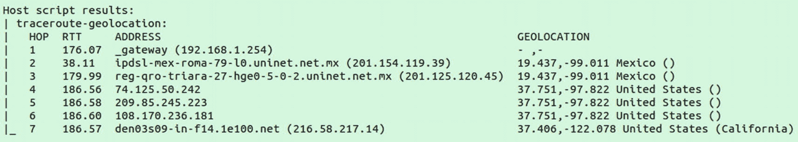

图 7-3

使用 nmap - traceroute 查看服务器的位置

## http-enum 脚本

编写`http-enum`脚本是为了测试网站的几个路径，以检测可能提示服务器上正在运行什么应用程序或内容管理系统的信息。

```sh
sudo nmap --script http-enum example.com

```

`http-enum`也是一个可以传递参数的脚本示例。如果您希望脚本使用一个基本路径运行，例如，`example.com/blog`而不是`website.com`，您可以这样做

```sh
sudo nmap --script http-enum --script-args \
  http-enum.basepath='blog/' example.com

```

## 为 nmap 编写自己的脚本

`nmap`附带了许多有用的脚本，这些脚本对于使用它进行端口扫描功能的大多数人来说是相对陌生的。更鲜为人知的是，您实际上可以通过编写 NSE 文件并将其放在 scripts 文件夹中来创建自己的脚本。

NSE 代表 Nmap 脚本引擎，是一种特定于领域的语言，构建在 Lua 编程语言之上。如前一节所述，脚本可以用于各种用途，包括

*   网络发现

*   版本/操作系统检测

*   漏洞检测

*   后门检测

*   漏洞利用

每个 NSE 在一个文件中包含三个部分:

*   页眉

*   规则

*   行动

头部分通常包含一个描述并导入任何需要的库。一个非常简单的例子是

```sh
-- Header --
local shortport = require "shortport"

```

前面的脚本导入了 shortport 库，该库可用于确定端口是否属于服务类型。标题之后是规则部分。我们的示例应用程序将使用 shortport 库来检查端口是否是 http:

```sh
-- Rule --
portrule = shortport.http

```

接下来是剧本的动作部分。我们将告诉脚本在端口是 http 常用端口的情况下应该做什么:

```sh
-- Action --
action = function(host, port)
      return "Hello World!"
end

```

写完这三节，保存你的脚本，另存为`/usr/share/nmap/scripts/testing.nse`。然后在网站上运行以下内容:

```sh
sudo nmap --script testing <website.com>

```

如果您已经正确地复制并运行了脚本，您应该会在任何找到的 http 端口下看到一个子部分，如图 [7-4](#Fig4) 所示。

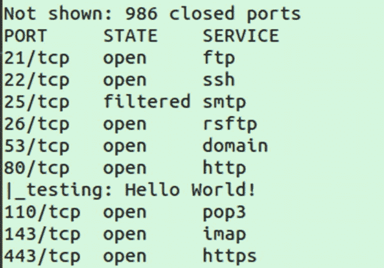

图 7-4

示例脚本的输出

我们的“hello world”NSE 脚本不是特别有用，但它为您提供了 NSE 脚本的三个主要部分的概要(标题、规则、动作)。如果你想尝试制作一个高级的 NSE 脚本，看看`/usr/share/nmap/scripts`中的其他预构建脚本；这些为构建您自己的脚本提供了很好的示例或起点。

## wireshark/tshar

另一个值得了解的工具是 Wireshark，我们不会在这里深入讨论。这是一个用于数据包分析的全功能 GUI 应用程序。它允许您捕获和分析网络上的流量。Wireshark 有一个面向终端的版本叫做`tshark`。大多数包管理器上都有这两个版本。如果您想要 Wireshark 的体验，但没有在机器上访问 GUI 的权限，您也可以查看社区项目`termshark`，它在终端中模拟 Wireshark 的 UI。

Wireshark 通常用于信息安全、网络质量测试和网络使用软件的质量保证。

虽然`arp-scan`和`nmap`是查找网络设备最简单的工具，但 Wireshark 在查找可能隐藏的设备方面实际上更强大。例如，如果一个设备不响应任何请求，`nmap`、`masscan`、`arp-scan`和`ping`将永远无法找到它，即使有 IP。但是，如果这些设备在某个时候想要使用网络，并且 Wireshark 正在进行记录，它们将会被发现，并且它们的存在会为人所知。

要查看使用`tshark`的所有流量，只需在没有任何选项的情况下运行它(*需要 root 权限*):

```sh
sudo tshark

```

根据您的网络，这将返回显示网络流量的快速滚动屏幕，类似于图 [7-5](#Fig5) 所示。

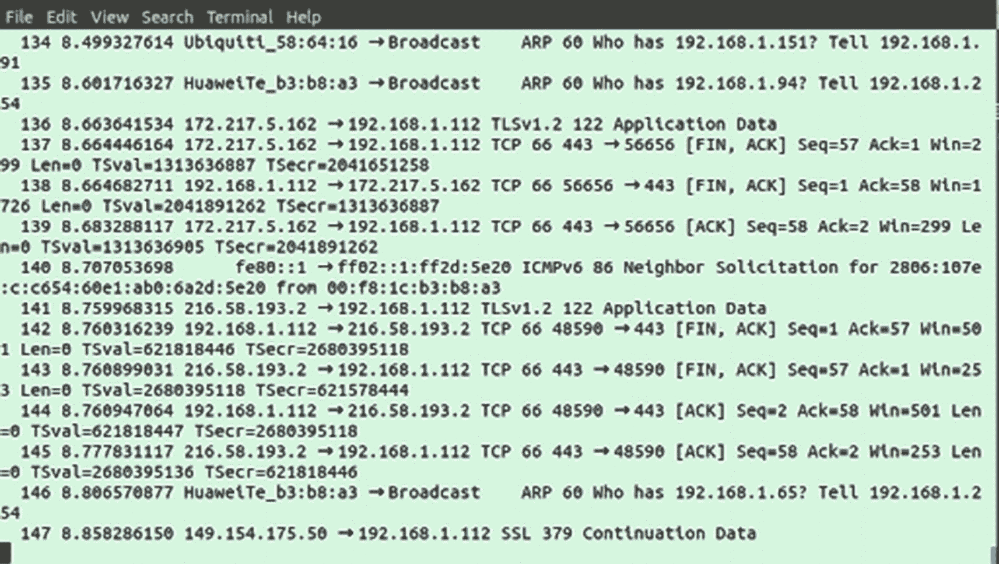

图 7-5

运行 tshark 时的输出示例

随着流量的快速移动，将输出保存到文件中通常更有用:

```sh
sudo tshark > /tmp/output.txt

```

该命令将一直运行，直到您按下“ctrl+c”取消。运行的时间越长，样本量就越大。稍后可以解析该文件以提取更具体的细节，并按照您自己的速度进行分析。

如果您想更具体地了解所记录的数据包，`tshark`有各种各样的过滤器，例如，如果我们想查看特定的设备:

```sh
sudo tshark host <ip-address>

```

如果您要解析结果来查找单个设备，这将节省您大量的时间和精力。您还可以按流量类型进行过滤，例如，仅显示 http 流量:

```sh
sudo tshark -Y http

```

您可以使用以下命令显示 http 请求的完整路径

```sh
sudo tshark -Y http.request.full_uri

```

对于`tshark`和 GUI 等价物`Wireshark`，有各种各样的过滤器。我们不会深入研究所有这些工具，但如果您想分析本地网络流量，这是一个值得研究的强大工具。另外，在 GUI 版本中，Wireshark 是主版本。这是一个非常有用的工具，有很多关于如何使用它的书。

## 更多网络工具

到目前为止概述的工具经常会派上用场，但是它们只是 Linux 上可用的网络工具的一小部分。表 [7-2](#Tab2) 是一个更长的 Linux 网络工具列表，你可以更深入地研究。

Note

我们在列表中包括了几个不推荐使用的实用程序。虽然不再对它们进行维护，但它们仍然在旧系统上广泛使用，或者由继续使用它们的系统管理员使用。出于这个原因，它们是值得注意的，尽管我们会确保列出最新的替代方案。

表 7-2

网络实用程序

<colgroup><col class="tcol1 align-left"> <col class="tcol2 align-left"></colgroup> 
| 

通道数

 | 

多畜共牧

 |
| --- | --- |
| 挖苦 | 获取域信息 |
| 显示网络连接 | 网络统计数据(已弃用) |
| 命令 | 列出系统网络接口(已弃用) |
| 阿尔普 | 使用 ARP 缓存(不推荐) |
| 途径 | 显示/操作 IP 路由表(已弃用) |
| 互联网协议（Internet Protocol 的缩写） | 显示/操作路由、网络设备、接口和隧道 |
| 悬浮物 | 套接字统计 |
| ngrep | 就像`grep`但是对于网络流量 |
| 显示路由信息 | 查找数据包到达服务器的路由 |
| 平均拆卸时间（Mean Time of Remove） | 网络诊断工具 |
| （美国）北卡罗来纳州 | “ncat”的缩写，类似于`cat`，但用于网络数据。也可用作其他程序的网络接口模块 |
| 神经原纤维紊乱 | 用于包过滤和分类的网络工具 |
| 防火墙 | 管理防火墙设置(已弃用) |
| sysctl | 在运行时配置内核参数(*一些与网络相关，如套接字缓冲区大小* |
| ethtool | 分析以太网连接 |
| 谁是 | 获取域名的 whois 信息 |
| lsof | 查找哪些程序正在使用哪些端口 |
| 平 | 与 ping 类似，但有更多的方法和选项 |
| 惊呆 | “窝猫”的简称，像`nc` ( *网猫*)但是有更多的特性 |

### 挖苦

Dig 是一个 DNS 查找工具。如果您的系统上没有安装它，您可以在基于 Debian 的软件包管理器上的`dnsutils`和 Fedora、CentOS 和 Arch 上的`bind-utils`中找到它。

Dig 的使用方法是将一个 web 域作为参数传递给它，它将返回网站上的 DNS 信息。如果没有选项，来自`dig`的信息会有些混乱并且缺少条目。我们建议使用选项`+noall`和`+answer`:

```sh
dig +noall +answer

```

Dig 应该返回该域的所有 DNS 条目。我们在图 [7-6](#Fig6) 中的例子包括一个对 example.com 的查询和另一个对 yahoo.com 的查询。我们包含了第二个查询来展示一个域有多个 A 记录时的输出示例。

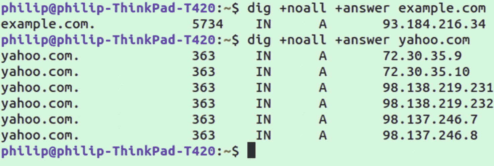

图 7-6

对 example.com 和 yahoo.com 的质疑

### Netstat(已弃用)

Netstat 是一个多用途实用程序，用于检查网络连接、路由表、网络接口统计和其他网络诊断。虽然您可能仍然会看到对`netstat`的引用，而且它确实有效，但是它已经被弃用了。

由于`netstat`已被弃用，建议您使用替代它的实用程序，包括`dig`、`ip`和`ss`。

### ifconfig(已弃用)

像`netstat`一样，实用程序`ifconfig`已经被弃用。尽管如此，您可能会发现它存在于许多机器上，并可能在脚本中使用。这是一个使用网络接口的工具。建议您使用`iproute2`包附带的`ip`命令。

如果您还记得本章前面的内容，我们使用了命令`ip a`来找出网络 IP 范围。在`ip`成为这方面的首选工具之前，运行`ifconfig`也是用来做同样的事情。`ifconfig`还能够与接口交互，例如，启用或禁用接口(假设您的以太网接口名为 eth0):

```sh
ifconfig eth0 up

```

现在同样的事情可以通过使用`ip`来完成

```sh
ip link set eth0 up

```

### arp(已弃用)

`arp`代表地址解析协议，用于将设备的 MAC 地址(全球唯一标识号)映射到 IP。计算机包含一个 ARP 表，映射映射和 IP 地址。要查看表中的所有条目，请运行以下命令:

```sh
arp -a

```

由于`arp`现在已被弃用，建议您使用`ip`来实现相同的功能。与前面的`ip`函数等价的是

```sh
ip n

```

其中`n`是邻居的简称。有关更多高级功能，请参见`arp`或`ip`的手册页。

### 路线(已弃用)

`route`命令用于显示/操作 IP 路由表。带有'【T1]'的最简单命令是不带任何选项或参数运行它，这将返回 IP 路由表。与`ip`等效的命令如下:

```sh
ip r

```

其中`r`代表路线。

### 互联网协议（Internet Protocol 的缩写）

如前所述，`ip`实用程序是包括`ifconfig`和`route`在内的几个实用程序的替代品，它包含在`iproute2`包中。运行`ip route`或简称`ip r`可以看到路线。还有另外的路由命令用于添加或删除，如`ip route del unreachable 10.1.0.0/24`，其中“不可到达”是路由名称，“10.1.0.0/24”是路由。

### 悬浮物

`ss`是一个监控套接字使用的实用程序。名字中的首字母代表套接字统计。如果没有安装`ss`，你可以在`iproute2`包含的大多数包管理器中找到它。当独立运行`ss`时，您将得到一个所有已连接插座的长列表，如图 [7-7](#Fig7) 所示。为了使读取输出更易于管理，您可以通过运行`ss | less`将结果传输到`less`。

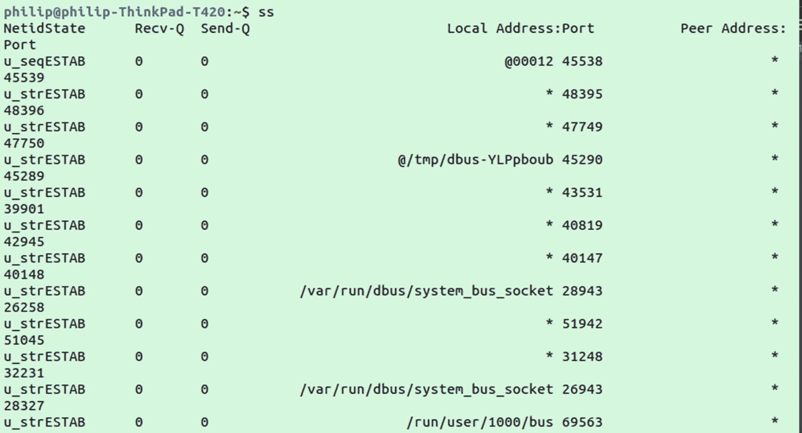

图 7-7

运行`ss`返回的套接字统计示例

理解默认情况下所有这些套接字是什么有点困难。为了使事情变得简单，您可以添加标志`-p`，它将告诉您每个套接字连接的进程名称和 ID。这允许您将套接字连接与机器上运行的进程相关联。

### ngrep

`ngrep`是一个网络实用程序，它提供了类似于`grep`的解析网络数据的能力。给定一些要监听的特定文本，`ngrep`将监控网络流量并报告任何匹配的连接数据。例如，我们将查看访问 example.com 产生的流量；首先，我们将告诉`ngrep`监听字符串“example ”,如下所示:

```sh
sudo ngrep example

```

`ngrep`现在正在解析网络流量中的字符串“example”。如果您在 web 浏览器中查看 example.com，应该会看到匹配结果。为了演示 https 的重要性，让我们使用`curl`向示例发送一些未加密的数据。在`ngrep`仍然运行的情况下打开第二个终端，并运行以下命令:

```sh
curl --data "user=name&password=secret" example.com

```

您应该在运行`ngrep`的窗口中看到该请求。如果您仔细阅读文本，您应该能够看到用户和密码字段，如图 [7-8](#Fig8) 所示。

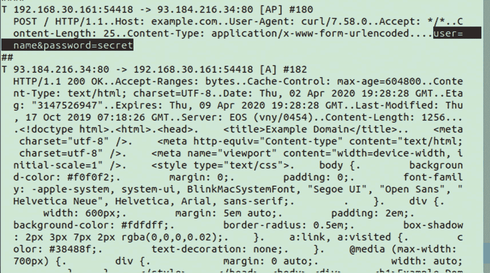

图 7-8

使用 ngrep 记录的未加密数据

如果运行相同的命令，但指定 https，如下所示

```sh
curl --data "user=name&password=secret" https://example.com

```

您仍然可以看到请求，但是看不到发送的数据，甚至看不到访问的具体网站。

### 显示路由信息

`traceroute`实用程序允许您向主机发送数据包，并获得到达主机的路由的详细信息。这听起来可能很熟悉，因为在第 [7](07.html) 章中，我们使用了一个“`traceroute`”NES 脚本来查看流量从我们的本地机器到一个网站的跳数。如果我们运行“`traceroute`”实用程序，它将作为一个独立的实用程序提供此功能

```sh
traceroute example.com

```

我们将看到我们的数据包在到达最终目的地之前所经过的所有机器的 IP 地址。这从本地路由器开始，到实际网站的 IP 地址结束，如图 [7-9](#Fig9) 所示。

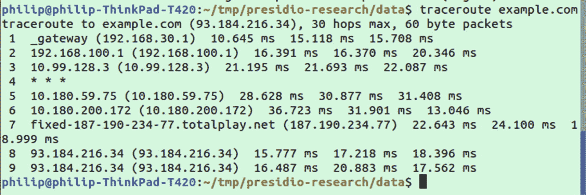

图 7-9

使用 traceroute 显示通往 example.com 的路线

### 平均拆卸时间（Mean Time of Remove）

`mtr`实用程序是一个结合了`ping`和`traceroute`的网络诊断工具。名称`mtr`实际上是“我的跟踪路线”的缩写`mtr`不是像`traceroute`那样发送一组数据包，而是在接收到前一个数据包后继续发送额外的数据包(类似于`ping`)。如图 [7-10](#Fig10) 所示，一个更新显示屏显示关于定时的详细信息。如果你的连接有问题，`mtr`可以帮助你了解问题出在哪里。

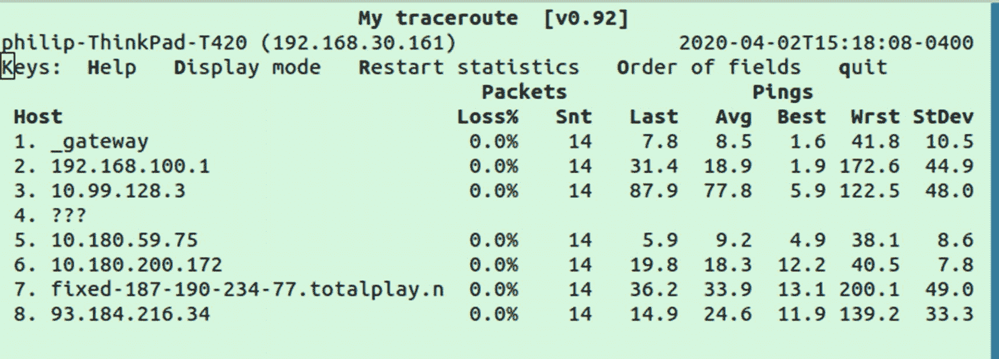

图 7-10

不断更新港铁显示的 example.com 路线数据

### （美国）北卡罗来纳州

`nc`是 network cat 的简称，名字灵感来自`cat`实用程序。`nc`是一个强大的工具，它提供了通过 TCP 或 UDP 连接和监听连接的能力。这意味着它甚至可以用于在两台机器之间打开一个聊天或文件传输的通道(尽管 SSH 等其他工具是首选)。

`nc`通常被称为“网络的瑞士军刀”,可用于多种网络任务，包括端口扫描、服务网站或欺骗报头。虽然许多用例有更好的选项，如用于端口扫描的`nmap`,但它对于一些简单的事情仍然有用，如抓取报头或伪造自己的报头。

要伪造您自己的标题，请运行

```sh
nc example.com 80

```

然后，您将能够添加额外的文本。您可以基于以下示例创建欺骗标头:

```sh
GET / HTTP/1.1
Host: example
Referrer: duckduckgo.com
User-Agent: fake-browser

```

输入标题后，按两次回车键，你将使用伪造的标题获取网站。您将得到一个包含站点标题信息的响应。

### NFL–不可战胜

`nftables`是用于包过滤和分类的 nftables 框架的管理工具。虽然你可以在包管理器上找到这个名字下的`nftables`，但是运行它的命令实际上是`nft`。`nftables`中的“nf”代表“网络过滤器”，它们用于过滤网络流量。可以是传出的也可以是传入的。例如，您可能不允许特定 IP 的传出流量，或者不允许特定端口的传入流量。`nftables`通过跟踪一系列系统范围的规则来工作，这些规则可以添加或删除，并在流量过滤过程中使用。

### iptables(已弃用)

`iptables`工具已经被弃用，取而代之的是`nftables`。`iptables`是基于规则的，但缺乏`nftables`所包含的功能，比如用一个规则同时针对 ipv4 和 ipv6 数据包。

### sysctl

`sysctl`用于在运行时配置内核参数。这不一定仅仅是网络问题，尽管有些问题是如套接字大小。对于经常发送和接收大文件的服务器，可以这样做，因为调整套接字缓冲区大小可以提高特定用例的网络性能。

### ethtool

`ethtool`实用程序是以太网工具的缩写，可用于获取有关以太网连接的详细信息。这包括数据传输本身和物理硬件。要查看以太网接口的信息，您首先需要获得它的名称。这可以通过运行

```sh
ip a

```

记录您的以太网接口的名称(可能包含一个“e”)，并将其作为参数传递给`ethtool`:

```sh
ethtool enp0s25

```

在我的例子中，以太网接口名称是“enp0s25 ”,但您的接口可能会不同。以太网接口最常见的名称之一是“eth0”。当你使用接口作为`ethtool`的参数时，你应该得到关于硬件的信息(即使你没有主动使用以太网)，如图 [7-11](#Fig11) 所示。

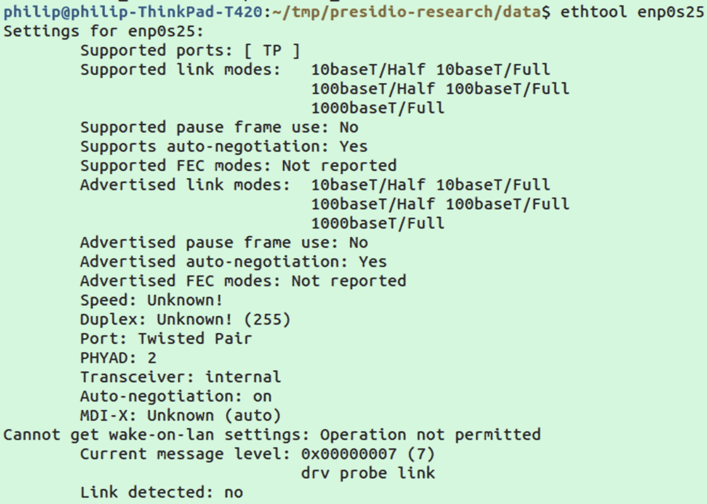

图 7-11

从`ethtool`输出的以太网接口信息

### 谁是

`whois`是一个用于检索注册服务商提供的网站所有权信息的实用程序。只需提供一个域作为参数就可以使用它。例如，运行以下命令应该会返回如图 [7-12](#Fig12) 所示的所有权和联系信息:

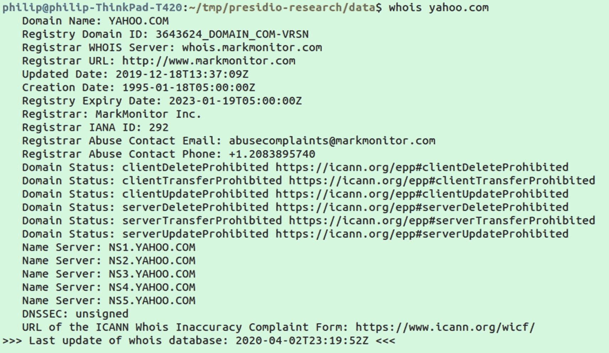

图 7-12

yahoo.com 的 whois 信息

```sh
whois yahoo.com

```

### lsof

`lsof`代表“打开文件列表”；默认情况下，它会返回一个很长的列表，其中包括系统中所有打开的文件。在网络方面，你想知道的关于`lsof`的主要选项是`-i`旗帜。`-i`标志告诉`lsof`寻找 IP 套接字。添加`-P`来连接端口也是有用的。要演示，请尝试跑步

```sh
lsof -i -P

```

这将返回一个本地端口列表，这些端口连接到远程服务器上的端口以及与所述连接相关的程序。预期输出的示例如图 [7-13](#Fig13) 所示。

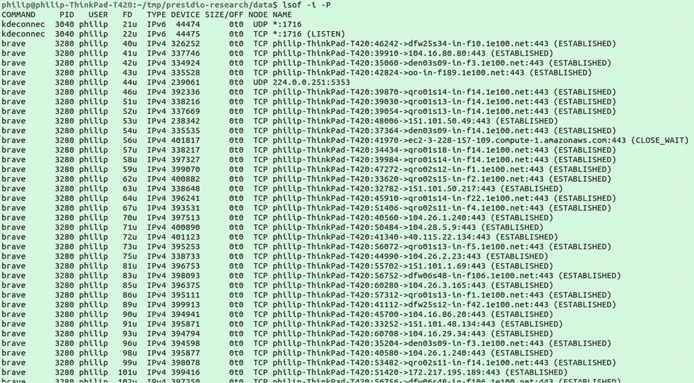

图 7-13

来自`lsof -i -P`的示例输出

### 平

`hping`是一个攻击性的安全网络工具，它的名字来源于`ping`。像`ping`一样，它通过网络向目的地发送数据包，但它有高级选项，允许定制数据包，为 TCP 和 UDP 指定目的地端口和假冒的源 IP。此外，它有一些内置的方法，如`--flood`选项，可用于类似 DDOS 的攻击，如 SYN flood 攻击。

当前版本是 3，集成在大多数包管理器的命令和名称中:

```sh
sudo apt-get install hping3

```

在 Kali Linux 这样的攻击性安全操作系统上，你会发现默认安装了`hping`。后面显示了 SYN flood 攻击的一个示例。SYN flood 攻击包括在没有完成握手的情况下打开几个连接。它可以用来测试您的网络是否免受这些攻击；以下是一个执行 SYN flood 攻击的示例，用于测试网络中目标设备使用的 IP 交换机:

```sh
hping3 --rand-source -S -d 500 -p 21 --flood 127.168.1.110

```

前面的命令结合了几个选项。第一个`--rand-source`告诉`hping`伪造一个随机的 IP 地址作为其来源。然后`-S`标志指定 SYN 包网络，`-d 500`是包的大小，`-p 21`是目的端口，最后`--flood`开启发送许多请求的洪泛模式。

### 惊呆

`socat`类似于`nc` (netcat)，但具有更高级的功能。也像 netcat 一样，它的名字取自`cat`，代表“socket cat”它可以在大多数包管理器上找到，名为`socat`。用 netcat 可以做的任何事情用`socat`都是可能的，但是它也有一些额外的特性，比如单个端口上的多个客户端和使用 UDP 的选项。

## 摘要

在本章中，我们学习了一些网络技术，尤其是与端口扫描相关的技术。我们还简要介绍了一些流行的网络工具，这些工具可用于通过分析、配置和打开通信通道来处理网络。