# 9.硬件详细信息和/开发

在这一章中，我们将会看到一些有用的命令来检查你正在使用或连接的机器的硬件细节。当通过 SSH 连接到一台机器时，您可能不知道您正在处理哪种硬件的所有细节。即使你使用的是你熟悉的机器或一些嵌入式设备，你也可能不知道所有的细节。此外，如果您完全熟悉设备的硬件，您可能能够通过检查细节来发现硬件问题，以查看它们是否与您预期的相匹配。

运行`lshw`时，`/dev/`目录中的文件夹丢失或设备丢失可能会提醒您某些硬件未能安装或已损坏。

## 用于硬件细节的命令

在这一节中，我们将看看命令和程序，它们可以让您更好地了解您正在使用的系统上的硬件类型。

每个人都知道`ls`，但是有一个完整的硬件查询命令列表，它们的名字来自这个命令。表 [9-1](#Tab1) 中列出了一些有助于找出机器底层硬件信息的工具。

表 9-1

获取硬件详细信息的有用命令

<colgroup><col class="tcol1 align-left"> <col class="tcol2 align-left"></colgroup> 
| 

命令/应用

 | 

描述

 |
| --- | --- |
| lspci | 列出所有 PCI 设备 |
| lsblk(消歧义) | 列出所有块设备 |
| sudo fdisk-l | 与`lsblk`相似，但具有更详细的信息，包括扇区 |
| lscpu(中央处理器) | 列出了有关 CPU 体系结构的信息 |
| 断续器 | 硬件详细信息的深入列表。也可以使用`-short`标志来显示压缩版本 |
| ls /dev | Linux 系统上的`/dev`文件夹 |
| ls -l /sys/block | 列出连接的硬盘和总线 ID。您可能还会看到几个名为`loop`的虚拟设备 |
| lsusb(USB) | 显示系统中 USB 总线以及连接到总线的设备的信息 |
| cat /proc/cpuinfo | 提供关于处理器的数据 |
| 自由 h | 显示空闲内存，`-h`为人类可读 |
| 东风-m | 列出挂载的文件系统 |
| ip a | 列出网络接口 |
| netstat -i | 用于列出接口的`ifconfig`的更简洁的替代方法 |
| hdparm | 获取/设置 SATA/IDE 设备参数 |
| 联名制-r | 显示内核版本 |

## /dev/文件夹

另一个可用于深入了解连接硬件的文件夹是`/dev`文件夹。`/dev`文件夹包含许多与已安装设备相关的文件和文件夹，以及一些其他具有特殊用例的非硬件文件。表 [9-2](#Tab2) 显示了可以在`/dev`文件夹中找到的文件的详细列表。您的系统可能不会拥有所有这些。

Note

所有以类似于`js0`的数字结尾的文件可以有多个实例；每个后续实例都用递增的数字命名，在本例中为`js1`、`js2`等等。

表 9-2

/dev/文件夹中的设备示例

<colgroup><col class="tcol1 align-left"> <col class="tcol2 align-left"></colgroup> 
| 

文件夹/文件

 | 

描述

 |
| --- | --- |
| /dev/dsp | 数字信号处理器 |
| /dev/fd0 | 软盘阅读器 |
| /dev/fb0 | 帧缓冲设备 |
| /dev/js0 | 模拟操纵杆 |
| /dev/lp0 | 并行打印机 |
| /dev/usb/lp0 | USB 打印机 |
| /dev/cdrom | cd-r om |
| /dev/dvd | 数字影碟 |
| /dev/rtc | 实时时钟 |
| /dev/sda | 硬盘驱动器 |
| /dev/ttyS0 | 串行端口 |

这个列表并不完整。本质上，任何可以连接到您的计算机的 I/O 设备都会出现在`/dev`文件夹中。

## /dev/文件夹中的特殊文件

除了物理设备，您还可以在`/dev/`文件夹中找到一些特殊的文件。这些表示具有一些特殊行为的伪设备。表 [9-3](#Tab3) 显示了一个流行的列表。

表 9-3

/dev/文件夹中的特殊文件

<colgroup><col class="tcol1 align-left"> <col class="tcol2 align-left"></colgroup> 
| 

文件夹/文件

 | 

描述

 |
| --- | --- |
| /dev/null | 一种特殊的文件，可以丢弃任何扔进去的东西 |
| /dev/random | 产生随机输出的特殊文件 |
| /dev/天王星 | 与`random`相同，但当系统耗尽熵时不会阻塞 |
| /dev/stdin | 流程的标准输入 |
| /dev/stdout | 流程的标准输出 |
| /dev/stderr | 流程错误的标准输出 |
| /dev/zero | 一个返回全零的特殊文件 |
| /dev/tty0 | 电传打字机(*见下面的注释*) |
| /dev/loop0 | 使文件可用作块设备的伪设备 |

接下来，我们将更深入地看看这些特殊的文件。

## 电传打字机

TTY ( *电传打字机*)是一种可以通过各种媒介发送和接收文本的设备。这个名字来源于历史上的电传打字机，它出现在基于屏幕的计算机之前。自 20 世纪初以来，贝尔公司普遍使用电传打字机；示例见图 [9-1](#Fig1) 。贝尔后来在 1971 年创建了 Unix，其中包括一个虚拟电传打字机作为核心概念。


图 9-1

贝尔电话杂志 1921 年电传打字机的历史范例

当在 Unix 终端中输入时，您实际上是将文本输入到一个虚拟或伪 TTY 中，它接受输入并可以返回输出。当然，在屏幕终端的情况下，它是模拟的硬件。在任何时候，您的系统都可能有几个 tty。要查看所有内容，只需运行

```sh
ls /dev/ | grep tty

```

可能太多了，无法手工计算；如果您想知道有多少行，您可以将结果输入到`wc -l`中并获得行数:

```sh
ls /dev/ | grep tty | wc -l

```

就我而言，我有 98 个。为什么这么多？其中一些 tty 代表正常的终端会话，而另一些则有特殊的用例。例如，`tty0`是一个特殊的别名 TTY，它总是指向当前终端。tty 也可以用于在后台包含进程或应用程序。试试跑步

```sh
ps ax

```

这将返回进程列表；注意`TTY`列，它显示了一些流程的父 TTY。一些进程可能被列为`?`，这意味着它们没有绑定到终端，在后台运行。

也可以通过按下`ctrl+alt+F1`将您的屏幕直接连接到这些 tty 中的一些，用相关的端子号( *F1、F2、F3 等)替换 F1。*)。在很多 OS 上，`tty1`会用于 X 服务器；因此，移动到另一个终端会导致你的电脑看起来完全离开了操作系统(*音乐关闭，看不到应用程序或系统菜单*)。

## stdin、stdout 和 stderr

特殊文件`stdin`、`stdout`和`stderr`是“标准输入”、“标准输出”和“标准误差”的简称它们更类似于 I/O 流，而不是文件本身，但是因为在 Linux 中(几乎)一切都被表示为文件，所以操作系统的这些方面都有相关的文件。

如果你打开它们，你会发现它们完全是空的，尽管你可以在操作系统的后台直接输入文本，例如:

```sh
echo hello > /dev/stderr

```

有必要知道什么是`stdin`、`stdout`和`stderr`。你可能会遇到它们，即使它们的文件名没有直接提到它们。通过流程将“标准输入”转换为“标准输出”和“标准误差”的系统如图 [9-2](#Fig2) 所示。

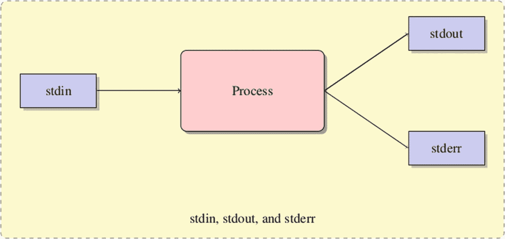

图 9-2

将标准输入转换为标准输出和标准误差的流程图

## /dev/null

一个常用的特殊设备文件是`/dev/null`。这个文件就像一个黑洞，你把信息输入进去，但是什么也没有出来。起初这听起来可能没什么用，但实际上它可以用来停止一个进程，否则这个进程会将输出打印到终端或日志文件中。

为了展示一个例子，我们将使用`ping`命令并将我们的输出重定向到`/dev/null`。我们可以重定向两种类型的输出，标准输出(由 1 *)* 和标准误差(由 2 表示)。

为了测试将标准输出和标准错误重定向到`/dev/null`，我们将创建一个文件，简单地将一条消息写入标准输出，将另一条消息写入标准错误。我在`/tmp/out.sh`创建我的:

```sh
#!/usr/bin/env bash
echo Working
>&2 echo Error

```

保存文件后，一定要添加执行权限:

```sh
chmod +x /tmp/out.sh

```

接下来让我们试着运行它:

```sh
/tmp/out.sh

```

接下来，尝试使用以下重定向来运行它:

```sh
/tmp/out.sh 1>/dev/null

```

你现在应该只得到错误，因为标准输出被导向黑盒。让我们做同样的事情，但是把 1 换成 2:

```sh
/tmp/out.sh 2>/dev/null

```

正如您可能预料的那样，现在我们只能看到输出，而看不到错误。也可以一次重定向两者。两者的语法略有不同:

```sh
/tmp/out.sh > /dev/null 2>&1

```

图 [9-3](#Fig3) 显示了每个命令的预期输出。

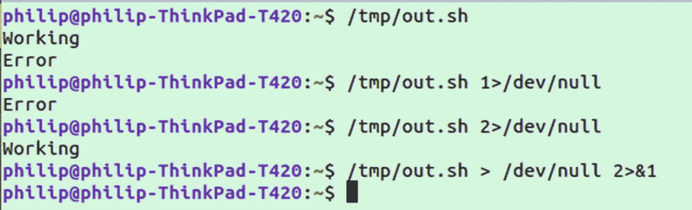

图 9-3

重定向到/dev/null

## /dev/random 和/dev/urandom

另一个有用的特殊设备是 random 和 urandom。这两者本质上是一回事，因为它们都充当输入完全随机数据的设备。因此，它充当伪随机数发生器。像大多数伪随机数发生器一样，它依靠一些输入来产生熵。

用于输入的熵是系统状态的随机方面的结果，例如鼠标移动、按键和其他设备输入(例如，驱动器的*速度*)。使用这个熵，在`/dev/random`和`/dev/urandom`中产生随机字符。

`random`和`urandom`的主要区别在于，如果`random`耗尽了熵，它会阻塞一个依赖它的程序，而`urandom`不会。一般来说，`urandom`应该是首选。

为了了解`/dev/urandom`中的数据类型，让我们使用`head`获取前 500 个字符:

```sh
head -c 500 /dev/urandom

```

这将返回一长串不可读的字符，如图 [9-4](#Fig4) 所示。

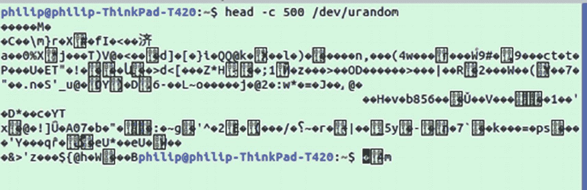

图 9-4

/dev/urandom 中的示例内容

当然这并不完全有用。但是，它可以用来为程序生成有用的随机数据。例如，假设我们想生成一个随机数用于一个程序。我们可以使用`od`(八进制转储的缩写)来生成一个人类可读的数字:

```sh
od -vAn -N1 -tu1 < /dev/urandom

```

前面的示例生成一个 1 字节大小的无符号数(0–255)。如果我们想做 2 个字节，我们可以运行

```sh
od -vAn -N2 -tu2 < /dev/urandom

```

## /dev/zero

您将在`/dev`文件夹中找到的另一个特殊文件是`zero`。读取该文件将返回一串零，这种情况将永远持续下去。为了演示`/dev/zero`，让我们用 512 字节的空 0 创建一个文件:

```sh
dd if=/dev/zero of=/tmp/zero count=1

```

如果你在这之后打开`/tmp/zero`，你应该看到类似图 [9-5](#Fig5) ( *取决于你的文本编辑器如何解释空字符*)。


图 9-5

/dev/zero 的输出示例

这主要用于创建虚拟文件。它也可以用来清空计算机上的内存。当文件在计算机上被删除时，底层内存仍然存在，但它已被标记为可用的空闲空间。

通过创建全为零的大型文件，可以删除这些底层数据，尽管这种方法受到了批评，但人们倾向于使用随机数据而不是零，因为先进的方法仍然可以恢复这些数据。

更彻底的方法是使用`shred`命令，例如:

```sh
shred /dev/sda

```

这不仅会删除驱动器中的内容，还会使它们难以恢复。

## 内核是什么？

您可能已经听说过 Linux 内核，但是它到底是什么呢？Linux 内核是所有 Linux 操作系统的核心组件，也是构建其他一切的基础。果仁一词最初指的是坚果或水果的中心。同样，Linux 内核是所有 Linux 系统的核心。

Linux 内核控制系统的物理硬件和内部软件之间的所有通信。许多开发人员和 Linux 用户永远也不会直接与内核交互，但是了解一下这意味着什么是值得的。

Linux 内核负责的事情包括

*   内存管理

*   进程管理

*   设备驱动程序

*   系统调用

*   安全

很多这样的事情发生时，用户甚至都没有意识到。硬件、内核和进程的层次结构如图 [9-6](#Fig6) 所示。

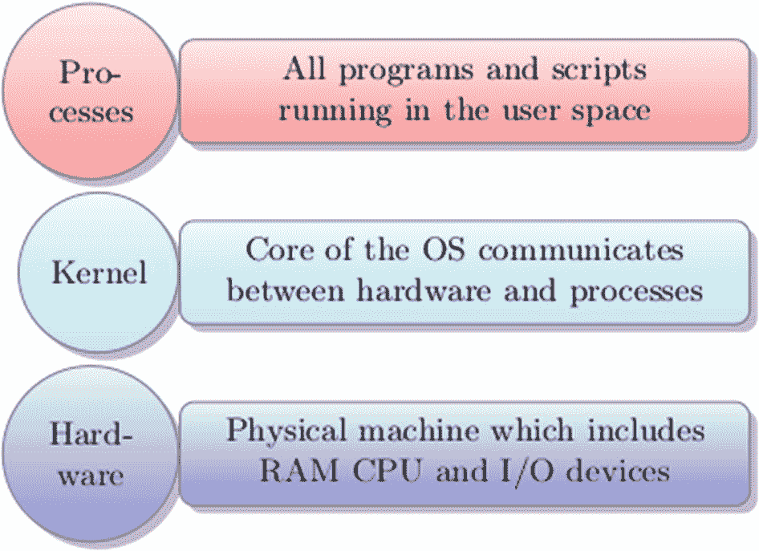

图 9-6

用户空间、内核和硬件堆栈

## 获取内核版本

您可以通过运行以下命令来找出您正在使用的 Linux 内核的版本

```sh
uname -r

```

有关该版本的更多完整信息，可以运行

```sh
cat /proc/version

```

这将返回更多关于你的内核的完整信息，如图 [9-7](#Fig7) 所示。除了版本之外，还列出了编译内核的人的身份、使用的编译器、编译的类型以及编译的日期/时间。

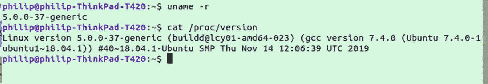

图 9-7

显示内核版本

## 配置和安装驱动器

通常在设置服务器时，无论是在个人还是在云中，默认的存储空间都不足以存储数据。在这一节中，我们将看看如何将一个驱动器附加到文件系统。

如`/dev/`一节所述，所有连接的驱动器将显示在`/dev/`文件夹中。但是，这些将显示为单个文件，而不是可以浏览的文件夹。为了将驱动器视为文件系统，需要挂载它。

安装驱动器的第一步是找出哪个文件在`/dev`文件夹中。您可以通过运行`mount`并抓取“/dev/sd”的实例来实现这一点:

```sh
mount | grep /dev/sd

```

这将列出所有连接的驱动器及其挂载点，如图 [9-8](#Fig8) 所示。

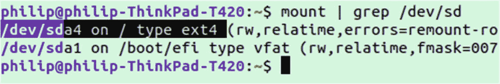

图 9-8

显示可装载的驱动器

注意突出显示的部分`/dev/sda4 on / type ext4`。这告诉我们一些关于 sda4 驱动器的事情。首先，它被挂载为我们的系统`/`的根，其次，它的格式是 ext4。

`mount`命令不会列出所有设备；为了更好地了解情况，尝试运行`lsblk`，它应该会返回如图 [9-9](#Fig9) 所示的列表。

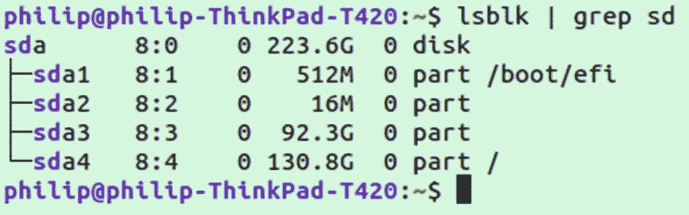

图 9-9

使用 lsblk 查看驱动器和分区

注意，在这种情况下，我们可以看到`sda` ( *物理驱动器*)和那个磁盘上的分区( *sda 1 到 4* )之间的关系。

在我的例子中，`sda3`是一个以前用于 Windows 安装的分区。由于不再需要它，我将格式化它并挂载它。无论何时格式化，都要仔细检查驱动器是否有你需要的数据，以及是否是正确的分区名。格式化分区后，所有数据都将丢失。

我们将采取的步骤:

1.  删除 windows 分区

2.  创建新分区

3.  格式化分区

4.  安装分区

5.  确保在启动时总是挂载分区

## 删除分区

要删除分区，首先您将进入相关驱动器的`fdisk`交互模式:

```sh
sudo fdisk /dev/sda

```

您将被要求输入一个命令；输入`d`进行删除。然后输入分区号，在我的例子中是 3。为了最终完成更改，输入`w`命令进行写入。删除过程将开始，如图 [9-10](#Fig10) 所示。

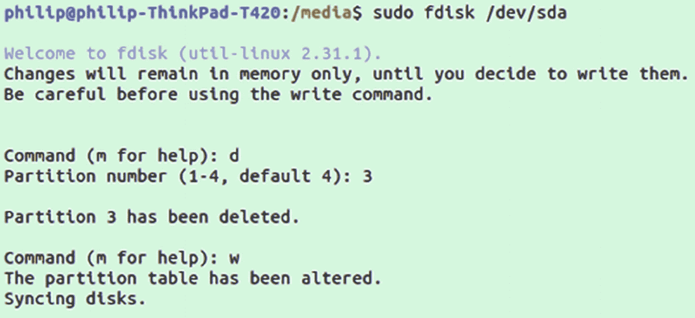

图 9-10

使用 fdisk 删除分区

现在，如果您再次运行`lsblk | grep sd`，我们将会看到少了一个分区。

## 创建分区

接下来，我们将使用释放的空间创建一个新的分区。再次打开`fdisk`:

```sh
sudo fdisk /dev/sda

```

这次输入命令`n`进行新建。首先你会被要求选择一个数字；我们将用 3 来替换被删除的那个。接下来，您将被要求选择硬盘上的扇区来启动新分区。在大多数情况下，默认将是最低的可用位置，是一个很好的选择。

选择起始扇区后，你会被问及结束扇区；您可以指定内存中的特定位置或指定分区的大小。我们将简单地选择默认选项，该选项将使用所有剩余空间来创建我们的分区。在我的情况下，我也被问及是否要删除 ntfs 签名，这是 Windows 特有的事情；可以安全移除。该过程的示例如图 [9-11](#Fig11) 所示。

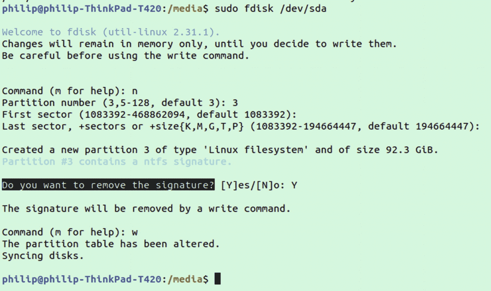

图 9-11

用 fdisk 创建分区

创建分区后，您需要运行以下命令来重新读取分区表:

```sh
partprobe

```

## 格式化分区

我们现在有了一个新的`/dev/sda3`文件，但是我们仍然需要格式化它。我们将使用`mkfs`命令来完成这项工作，它是“make filesystem”的缩写。

```sh
sudo mkfs.ext4 /dev/sda3

Or:

sudo mkfs -t ext4 /dev/sda3

```

## 安装分区

格式化分区后，我们现在可以将它挂载到我们的文件系统中。首先，您需要创建一个文件夹，它将被挂载到。推荐的安装位置是`/mnt`和`/media`，尽管这些文件夹有不同的推荐用途。`/mnt`文件夹用于手动安装的驱动器，而`/media`是自动安装的可移动驱动器(如 *USB 便携驱动器*)将出现的地方。

然而，从技术上来说，没有什么可以阻止你在任何你想安装的地方安装一个设备。在我的例子中，我将创建一个名为`/mnt/drive1`的文件夹:

```sh
sudo mkdir /mnt/drive1

```

创建完成后，让我们将驱动器安装到它上面:

```sh
sudo mount /dev/sda3 /mnt/drive1

```

## 从分区到~/的系统链接

把你的存储放在你的主目录之外可能会很尴尬，因为它不在你的主目录之内，而且默认情况下你没有权限。你能做的就是在你的主目录中创建到其他文件夹的系统链接。

例如，假设我们需要更多空间来存放位于`~/Movies`的电影收藏。首先进入`/mnt/drive1`并创建文件夹:

```sh
sudo mkdir Movies

```

接下来，让自己成为目录的所有者:

```sh
sudo chown $USER:$USER /mnt/drive1/Movies

```

现在我们有了使用`~/Movies`的权限，我们将在我们的主目录中创建一个符号链接作为快捷方式，这意味着我们永远不必到主目录之外去使用它(*确保第一个参数*使用完整路径):

```sh
ln -s /mnt/drive1/Movies/ ~/

```

现在，如果你去你的主目录，你应该看到一个电影文件夹。保存到`~/Movies`文件夹中的任何内容都将被保存到我们新安装的驱动器中。

## 使挂载的分区持久化

我们的分区运行良好；你可能认为我们结束了。不幸的是，如果我们现在重启我们的机器，它会在没有`sda3`挂载的情况下重新启动。为了让新分区在每次启动时挂载到`/mnt/drive1`,我们还需要做一件事。

启动时，系统查看文件`/etc/fstab`以确定需要安装哪些驱动器。在我们开始之前，让我们看看需要哪些值:

1.  块设备的 UUID(*用 lsblk -d -fs <文件>* 查找)

2.  要装载的文件夹

3.  文件系统类型

4.  安装选项(*使用默认选项或参见手册*

5.  是否应该转储文件系统(*通常为 0* )

6.  Fsck 顺序(*主分区使用 1，其他分区使用 2*

要获得分区的 UUID，请使用您自己的分区位置运行以下命令:

```sh
lsblk -d -fs /dev/sda3

```

一旦有了所需的六个值，打开/etc/fstab 进行编辑。我们将使用的值显示在图 [9-12](#Fig12) 的第二个未注释行中。

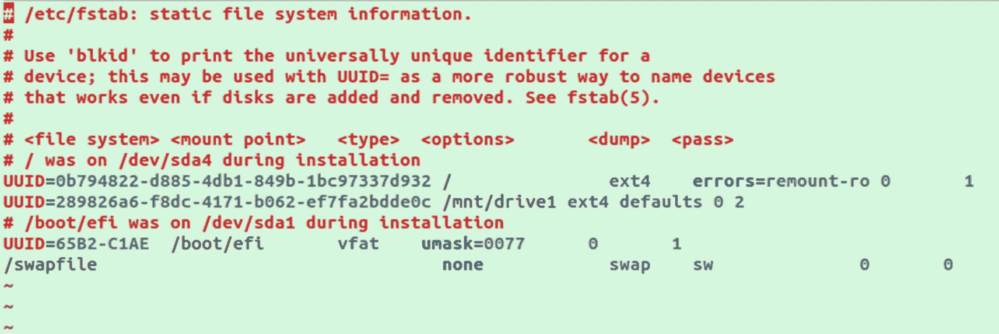

图 9-12

编辑/etc/fstab

编辑`/etc/fstab`时要小心，因为不正确的输入会导致系统重启时进入紧急模式。如果发生这种情况，不要惊慌，只需在紧急模式下使用命令行打开`/etc/fstab`并注释掉您添加的行。

您可以通过运行以下命令来减少出错的可能性

```sh
sudo findmnt --verify

```

这将发现诸如磁盘上的文件类型和声明的文件类型不匹配之类的问题，但在捕捉错误时并不是 100%安全的。

### lm 传感器

安装`lm-sensor`后，首先需要让应用程序检测你的系统上有哪些传感器。用...做这件事

```sh
sudo sensors-detect

```

它会问几个问题，您可以回答“是”来启用。在大多数情况下，默认的响应是好的，所以你只需按下回车键。完成设置过程后，您可以运行

```sh
sensors

```

这将返回传感器、风扇和其他可用数据，如图 [9-13](#Fig13) 所示。

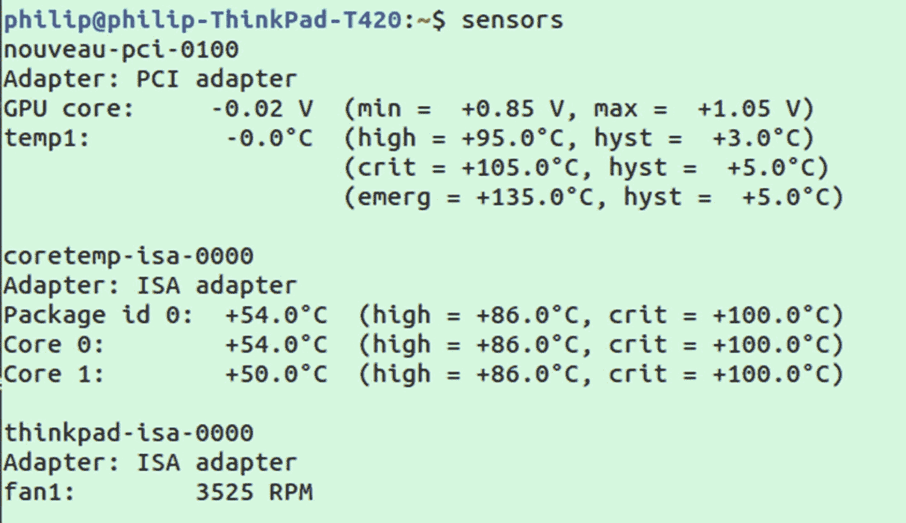

图 9-13

使用 lm 传感器查看传感器

### inxi

在获取硬件信息时，可以安装一个类似于`lshw`的程序来改善体验，这就是 i-nex。它可以与一起安装

```sh
sudo apt-get install inxi

```

默认情况下，它将在单行输出中返回非常基本的数据。要获得完整的详细信息，请使用`-F`标志运行:

```sh
inxi -Fxz

```

这将返回硬件信息的详细列表，如图 [9-14](#Fig14) 所示。

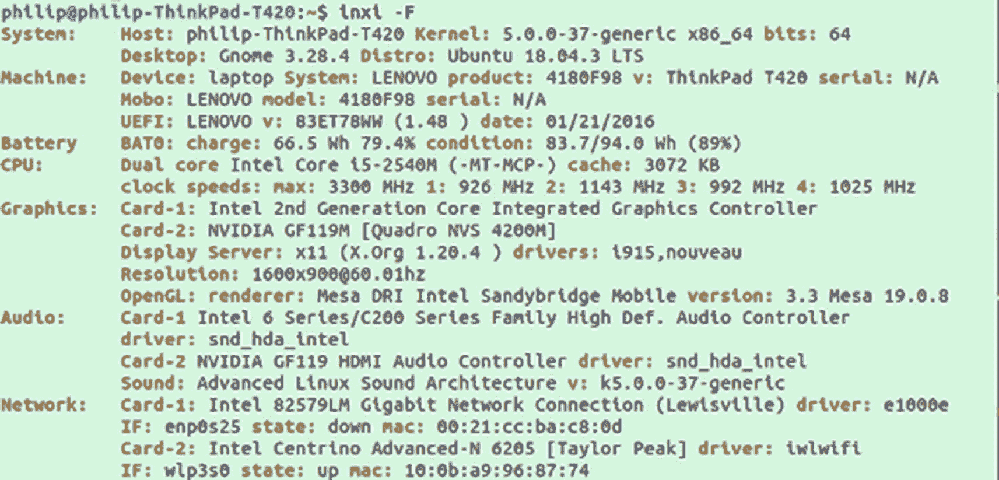

图 9-14

使用 inxi 查看硬件

### 迪米特里

虽然`lshw`和`inxi`对于大多数人来说应该足以看到一台机器的基本硬件细节，但是`dmidecode`可以用于更深入的了解。

例如，使用`dmidecode`，您可以使用以下命令查看 BIOS 信息

```sh
sudo dmidecode -t bios

```

以`sudo dmidecode`的身份独立运行该命令将返回所有详细的系统信息，包括序列号和制造商等信息，这些信息在不太详细的实用程序中是找不到的。当单独使用它时，您可能希望通过管道连接到`less`以便于阅读:

```sh
sudo dmidecode | less

```

对于主板，可以运行

```sh
sudo dmidecode -t baseboard

```

有各种选项可以通过`-t`指定，以指定具体的硬件信息；有关更完整的信息，请参见手册页。

## 摘要

在这一章中，我们看了几种你可以使用像`lshw`、`inxi`和`dmidecode`这样的工具探索系统底层硬件的方法。我们还查看了连接的硬件如何出现在`/dev/`文件夹中，该文件夹包含硬件设备和许多特殊文件，如对各种任务有用的`/dev/null`和`/dev/urandom`。我们通过使用`mount`命令将硬盘安装到`/mnt`目录中，与`/dev`文件夹中的硬盘进行交互。