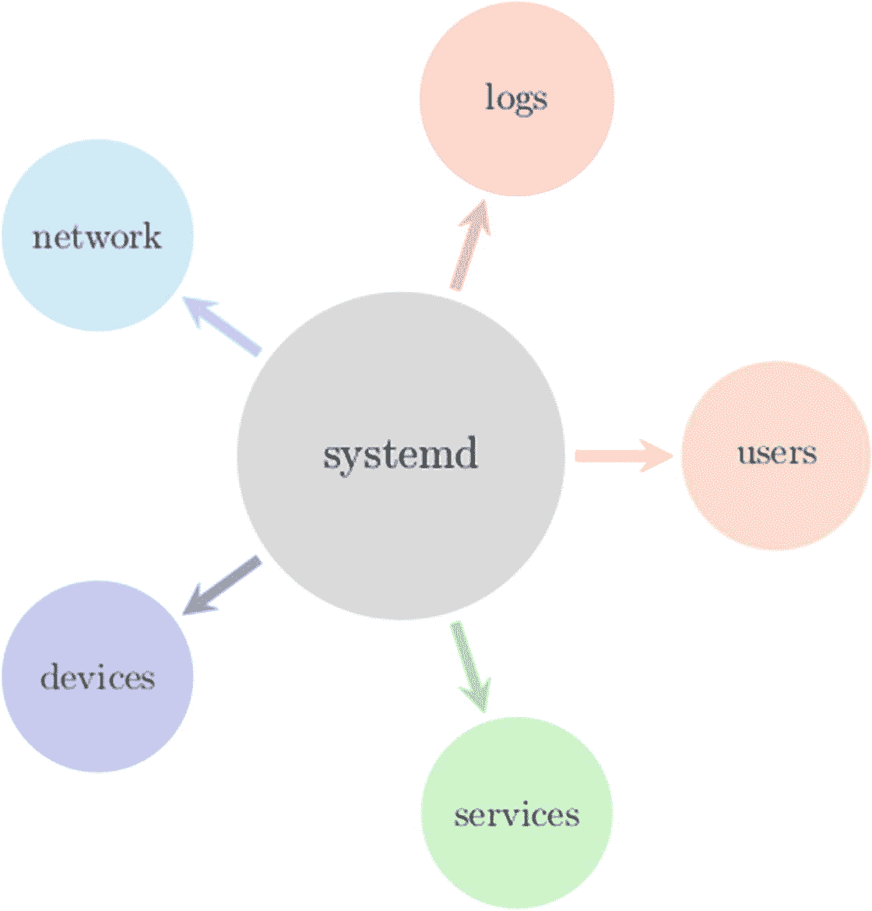
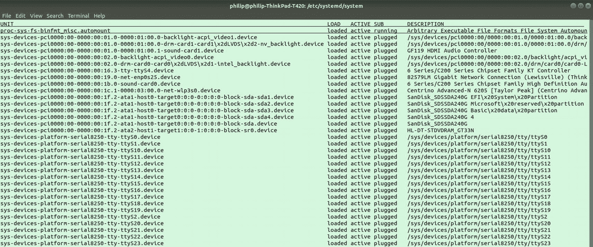
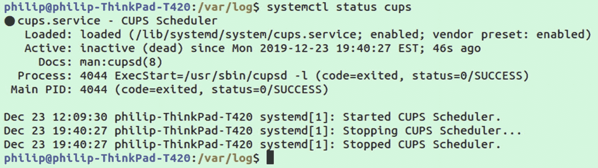
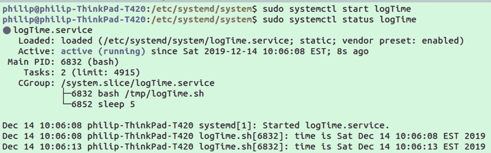
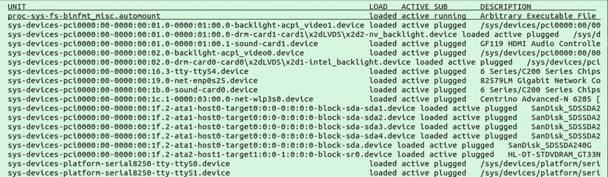
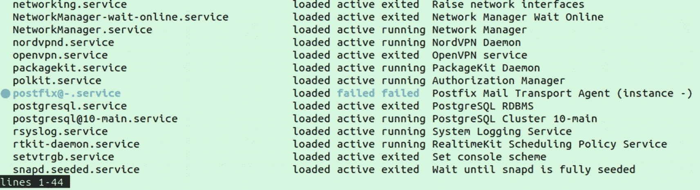
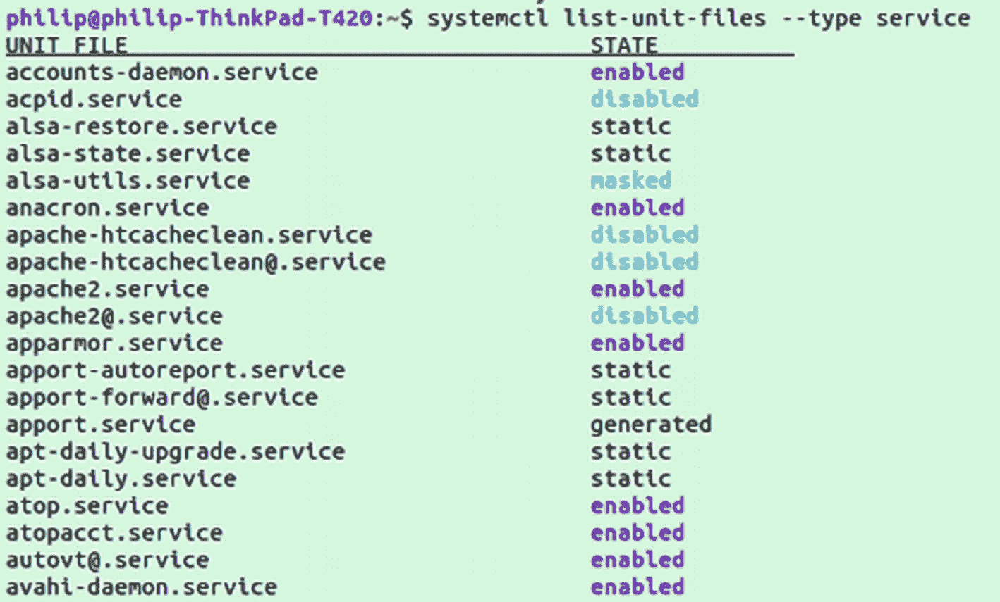

# 11.系统(systemd)

我们已经探索了使用像`ps`这样的工具直接查看流程；查看系统上运行的进程的另一种方式是从守护进程的角度。守护程序是在系统后台运行的长期运行的进程；通常它们会在系统启动时由类似`systemd`的 init 程序自动启动。`systemd`中的“d”来自守护进程的概念，因为它充当系统上运行的所有守护进程的控制器。

是一个调度系统，已经在 Linux 发行版中广泛使用。它经常是赞扬和批评的主题。它在包括日志记录、调度、服务监控和系统初始化在内的许多领域中控制系统功能的核心作用导致一些人说它太集中了，违背了每个程序做好一件事的 Unix 哲学。`systemd`的捍卫者会指出，它实际上是几个二进制文件的集合，如`systemctl`和`journald`，它们各自做一件事，共同创造一个更大的系统。

无论你对`systemd`有什么看法，它已经变得如此普遍，如果你使用任何流行的 Linux 发行版，这几乎是不可能避免的。它最初是在 2010 年由 Red Hat 开发的，作为替换旧的 init 系统，特别是 SysV 风格的 init 的一种方式。到 2015 年，`systemd`已经取代了 SysV init 和大多数流行发行版上的其他 init 系统，包括 CentOS、RHEL、Debian、Ubuntu 和 SUSE。

## systemctl

如果你的系统运行的是`systemd`，你应该有一个命令行程序叫做`systemctl`，是系统控制的缩写。`systemctl`可用于监控、查询和修改`systemd`控制的服务和流程。参见图 [11-1](#Fig1) 查看由`systemd`监控的子任务的可视化。



图 11-1

系统的许多用途

`systemctl`是系统控制，连接系统的各个方面，跟踪每个服务状态，根据设置打开/关闭服务，解析服务输出并将其移动到日志文件。

不带任何标志运行`systemctl`将返回活动`systemd`单元列表，如图 [11-2](#Fig2) 所示。



图 11-2

运行 systemctl 的输出示例

## 停止、启动、禁用和启用服务

我们已经使用了一些我们将在这里介绍的命令，但是值得重申一下，因为它们是一些您想要使用 systemd 管理服务的最常见的命令。

### 停止服务

如果一个服务正在运行，你想通过`systemd`停止它，只需用`sudo`运行以下命令；我们将使用打印服务`cups`作为例子(成功时没有输出显示):

```sh
sudo systemctl stop cups

```

### 获取服务的状态

接下来，为了确保服务关闭，我们将使用`status`命令。当您不确定服务的状态时，这在许多情况下会很有用。

```sh
sudo systemctl status cups

```

你不仅可以得到服务的状态，还可以得到最新的日志；示例见图 [11-3](#Fig3) 。添加最近日志是旧的 System V service 命令中没有的功能。



图 11-3

使用 systemctl 获取特定程序的状态

请注意底部的日志，其中显示了启动和停止的时间和消息。

### 启动服务

接下来让我们重新打开服务；正如您可能已经猜到的那样，这可以通过以下命令来完成:

```sh
sudo systemctl start cups

```

运行`start`后，重新运行`status`命令，确认`cups`再次运行。

### 禁用服务

停止和开始处理当前会话中服务的状态。禁用和启用在机器启动后的新会话启动期间处理服务的状态。简单地在一个服务上使用`stop`将导致它在每次计算机停止时重新启动。要彻底关闭服务，应该使用 disable 命令:

```sh
sudo systemctl disable cups

```

运行后，再次检查`status`并观察差异。

### 启用服务

正如您可能猜到的，disable 的反义词是 enable:

```sh
sudo systemctl enable cups

```

测试禁用命令后，如果希望该服务在引导时继续启动，请确保将其重新启用。

## 单位文件

程序通过单元文件将它们的配置传递给`systemd`，单元文件是位于`/etc/systemd/system/`文件夹中的 ini 文件。最简单的单元文件只是告诉`systemd`保持程序运行。让我们创建一个示例程序和单元文件来演示；称之为`logTime.sh`。我在`/tmp`文件夹中创建了我的文件夹，因为我不打算保留它。

```sh
#!/usr/bin/env bash

while true
  do
    echo time is $(date)
    sleep 5
  done

```

编写完脚本后，使用以下命令授予它可执行权限:

```sh
chmod +x logTime.sh

```

进入文件夹`/etc/systemd/system`；这是你可以放置配置程序使用`systemd`的单元文件的地方。我们将为简单记录时间的脚本创建尽可能简单的单元文件；将文件命名为`logTime.service`。您需要拥有 root 权限才能在`/etc/systemd/system`中编辑和创建文件。

```sh
[Service]
ExecStart=/tmp/logTime.sh

```

保存单元文件后，您现在可以打开服务了。

```sh
sudo systemctl start logTime

```

接下来，我们将获得守护进程的状态。

```sh
sudo systemctl status logTime

```

这应该会返回一些信息，告诉我们服务是活动的，并显示最近的日志，如图 [11-4](#Fig4) 所示。



图 11-4

启动自定义单位文件并检查状态

您可以使用`journalctl`主动查看生成的日志。

```sh
sudo journalctl -u logTime -f

```

当您想要调查正在您的机器上运行的一些特定服务时，这可能是有用的。如果它看起来不正常或者占用了太多的资源，查看日志可能会给你一些提示。

在单元文件中还可以设置其他几个选项。下面是一个更完整的单元文件，带有描述每行内容的注释:

```sh
[Unit]
# Description of what the program does
Description=Log time every 5 seconds
# List services needed for this service to work
After=time-sync.target

[Service]
# Path to executable
ExecStart=/tmp/logTime.sh
# Policy for restarting when stops
Restart=always
# Working directory for executable
WorkingDirectory=/tmp
# The user the process will run under
User=philip
# User group for the process
Group=philip
# Set environment variables
Environment=MYVAR=var

[Install]
# Which programs require the unit
# multi-user.target is when linux start
# Adding this line makes the program start when system is booting
WantedBy=multi-user.target

```

如果您手动修改服务文件，您需要使用以下命令对`systemd`进行软复位:

```sh
sudo systemctl daemon-reload

```

即使最后一行告诉程序在引导期间打开，也需要启用它来实际考虑单元文件。

```sh
sudo systemctl enable logTime

```

这将激活服务。如果您想禁用该服务，只需运行

```sh
sudo systemctl disable logTime

```

disable 命令非常有用。比方说，您检查正在运行的服务，看到一个您没有使用也不需要的程序。你终止了进程或者关闭了它，却发现下一次重启计算机时，它又回来了。如果你遇到那种情况，`systemctl disable`或许可以解决。

在您完成这一部分后，确保删除我们在`/etc/systemd/system`中创建的服务文件。如果您像我们在这里一样在`/tmp`目录中创建了可执行文件，那么如果您没有通过删除服务文件来删除它，那么在您第一次重启之后，服务将会失败。

## 查找正在运行的服务

当您登录到一台机器时，您可能想要弄清楚哪些服务已经在运行。我们之前看到的命令`systemctl`，用于启用和禁用我们的`logTime`服务，也可以用来获得机器上运行的服务的完整列表。

`systemctl`是 system control 的缩写，是 systemd 的命令，用于控制系统上的服务。鉴于此，几乎所有的服务都将通过 systemd 启动(*至少是重启后自动启动的*)。

你可以用`systemctl`做的最简单的命令是独立运行它:

```sh
systemctl

```

这将返回系统中当前活动的进程列表，如图 [11-5](#Fig5) 所示。



图 11-5

systemctl 的输出

这列出了所有的东西，很难通读。如果您想查看正在运行的特定单元文件服务，您可以使用

```sh
systemctl list-units --type service

```

关于这个的另一个有用的事情是，你可以看到设置为正在运行但由于某种原因失败的服务，如图 [11-6](#Fig6) 中的`postfix@-.service`的情况。



图 11-6

仅使用 systemctl 列出服务

如果我们只想查看失败的服务，我们可以在前面的命令中添加`--state failed`标志。

此外，请注意活动但已退出的服务，这意味着从技术上讲，它们正在工作，但没有运行。要仅查看当前正在运行的程序，您可以使用以下命令:

```sh
systemctl list-units --type service --state failed

```

另一个有用的命令将允许您查看所有单元文件及其当前状态:

```sh
systemctl list-unit-files --type service

```

这将输出所有的单元文件及其当前状态，示例如图 [11-7](#Fig7) 所示。



图 11-7

用 systemctl 列出单元文件

有几种可能的状态，在表 [11-1](#Tab1) 中列出。最常用的是启用、禁用和静态。

表 11-1

systemd 的可能服务状态

<colgroup><col class="tcol1 align-left"> <col class="tcol2 align-left"></colgroup> 
| 

状态

 | 

描述

 |
| --- | --- |
| 使能够 | 服务已打开 |
| 有缺陷的 | 服务已关闭 |
| 静电 | 无法打开/关闭服务、依赖关系或单一运行脚本 |
| 戴面具的 | 已锁定，因此即使手动也无法打开 |
| 连接的 | 通过系统链接变得可用 |
| 间接的 | 间接启用 |
| 生成的 | 通过生成器工具动态生成 |
| 短暂的 | 通过运行时 API 动态生成 |
| 严重的 | 无效的单位文件 |

有关这些状态的更多详细信息，您可以运行

```sh
man systemctl list-unit-files

```

## 期刊

systemd 不仅仅处理调度任务。它还在指导运行服务生成的日志方面发挥作用。这就是`journalctl`的用武之地，是日志控制的简称。与`systemctl`一样，您可以运行的最简单的命令是`journalctl`本身。

```sh
journalctl

```

这将返回通过 systemd 创建的所有日志的列表。我们可以通过使用`-f`标志来观看这个文件更新时的实时版本:

```sh
journalctl -f

```

这将显示发生的任何日志；要退出，可以按`ctrl+c`。

有许多选项，让你不必自己想出复杂的解析器；表 [11-2](#Tab2) 包含了几个有用选项的列表。

表 11-2

日志选项列表

<colgroup><col class="tcol1 align-left"> <col class="tcol2 align-left"></colgroup> 
| 

[计]选项

 | 

描述

 |
| --- | --- |
| -f | 获取实时日志流 |
| k | 显示内核日志 |
| -u | 显示特定服务的服务 |
| -b | 显示启动消息 |
| -r | 按相反顺序排序 |
| -p | 按进程优先级排序 |
| _PID= | 从特定进程 ID 获取日志 |
| _UID= | 从特定用户 ID 获取日志 |
| _GID= | 从特定组 ID 获取日志 |

## journal CTL–按时间解析

除了前面的标志，还可以使用`--since`和`--until`标志解析特定时间之间的日志，例如:

```sh
journalctl --since yesterday

```

直到使用基本小时表示法的时间

```sh
journalctl --until 13:00

```

或者使用两者的组合

```sh
journalctl --since "2 days ago" --until yesterday

```

还支持传统时间戳:

```sh
journalctl --since "2019-12-24 23:15:00" --until "2019-12-25"

```

## 其他初始化系统

虽然`systemd`已经被广泛使用，但仍有几个地方可以找到其他的 init 系统——仅举几个例子:

*   最小的 Linux 版本，如 Alpine Linux

*   旧版本的 Linux

*   较少使用的操作系统

*   高度定制的操作系统

## 系统 V 初始化

在`systemd`成为标准之前，经典的 Linux 系统使用 SysV init。单词“init”指的是引导期间启动的第一个进程。跑步还是能看到的

```sh
ps -up 1

```

然而，脚本本身很可能是`init`的`systemd`版本。`systemd`被有意设计成与 SysV init 兼容。使用 SysV init，内核启动 init 进程，该进程处理系统状态的更改，以便引导、重启和关机。对于 SysV，在表 [11-3](#Tab3) 中定义了八种不同的运行级别。

表 11-3

SysV 上的运行级别

<colgroup><col class="tcol1 align-left"> <col class="tcol2 align-left"> <col class="tcol3 align-left"></colgroup> 
| 

运行级别

 | 

目录

 | 

使用

 |
| --- | --- | --- |
| 普通 | - | 系统引导 |
| Zero | /etc/rc0.d/ | 暂停系统 |
| one | /etc/rc1.d/ | 单用户模式 |
| Two | /etc/rc2.d/ | 多用户模式 |
| three | /etc/rc3.d/ | 联网的多用户 |
| four | /etc/rc4.d/ | 为自定义运行级别保留 |
| five | /etc/rc5.d/ | 图形用户界面启动( *X11* ) |
| six | /etc/rc6.d/ | 重新启动 |

当系统启动时，它在运行级别之间移动，并不总是按顺序移动，例如，进入单用户模式(运行级别 1)是一种特殊的状态。当您的操作系统在启动过程中被破坏时，例如，`/etc`中的一个脚本(如`/etc/fstab`)被破坏，您将只能以 root 用户身份登录到单用户模式。其他级别更有顺序性，例如，在到达级别 5 之前，通常要通过运行级别 2 和 3。

与每个级别相关联的文件夹包含与需要在该级别启动的程序相关联的 bash 脚本。

Note

虽然运行级别对于 SysV 风格的 init 至关重要，但是它们仍然以相同的级别 N、0 和 1 - 6 存在于 systemd init 中。在大多数系统上，您可以通过运行`who -r`来查看您当前的运行级别。

## 暴发户

另一个以前流行的 init 系统是 Upstart ( *上一次发布是在 2014 年*)。Upstart 是在 Ubuntu 上使用的，直到他们从 Debian 8 开始改用`systemd`。尽管如此，你仍然会发现 Upstart 今天仍在使用。

Upstart 看起来像其他 init 系统，不包含名为“upstart”的命令。如果您不确定您的操作系统正在运行 Upstart，您可以使用

```sh
ps -eaf | grep '[u]pstart'

```

如果您看到一些进程而不是 grep 调用本身，那么您的系统已经安装了 Upstart。您可以使用它来检查哪些服务正在运行

```sh
service --status-all

```

这将返回服务及其状态的列表。您可以通过直接与服务的 init 脚本进行交互来与服务进行交互，例如:

```sh
sudo /etc/init.d/ssh status

```

或者要重新启动服务，请运行

```sh
sudo /etc/init.d/ssh restart

```

这种互动方式并不是 Upstart 特有的。甚至在`systemd`系统上，你会发现许多程序都有一个`/etc/init.d`文件，可以像前面显示的那样直接交互。

## 摘要

在这一章中，我们看了一下`systemd`系统，以及如何使用它来控制系统上运行的程序。我们看了如何通过停止、启动、启用和禁用来使用`systemctl`处理这些服务。为了查看正在运行的服务及其日志，我们探索了`journald`的使用。我们甚至创建了自己的单元文件来从头开始制作一个`systemd`服务。