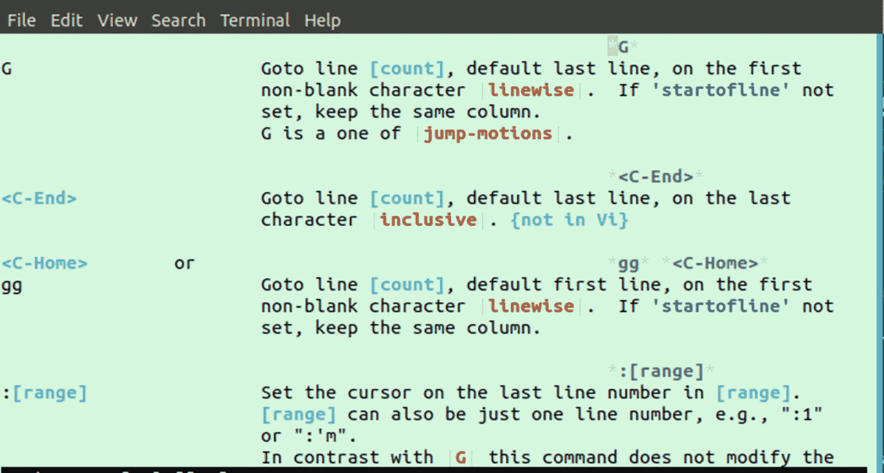
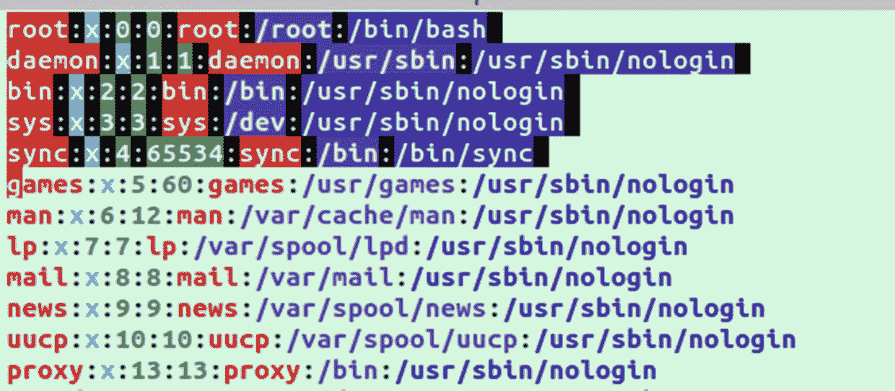
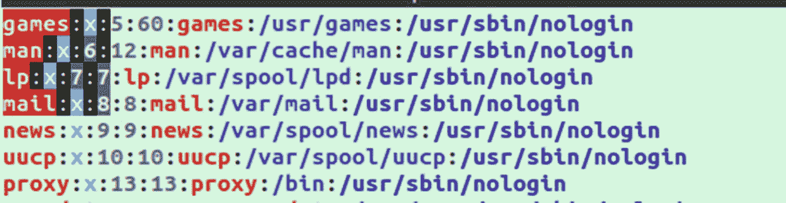
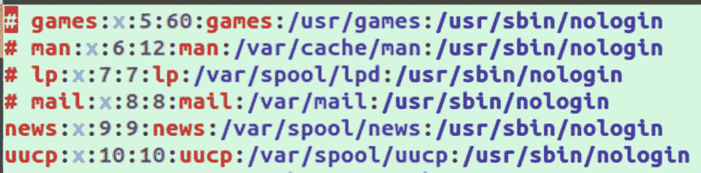
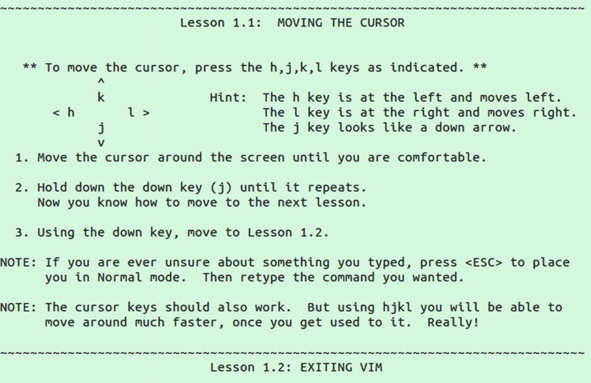
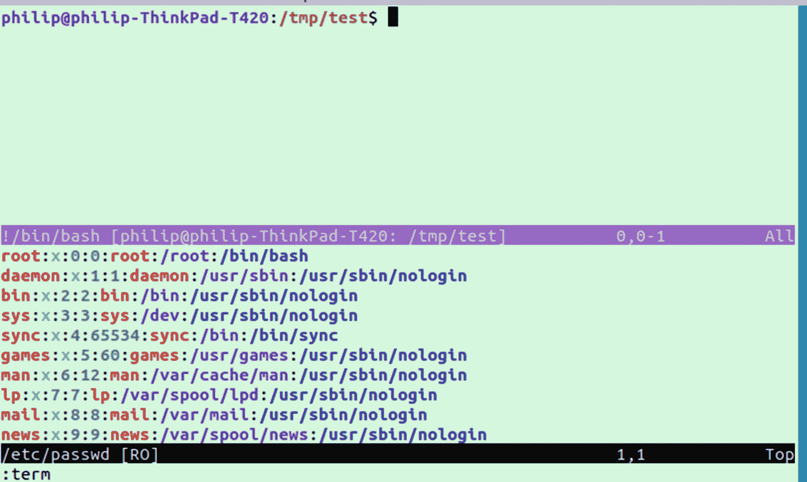
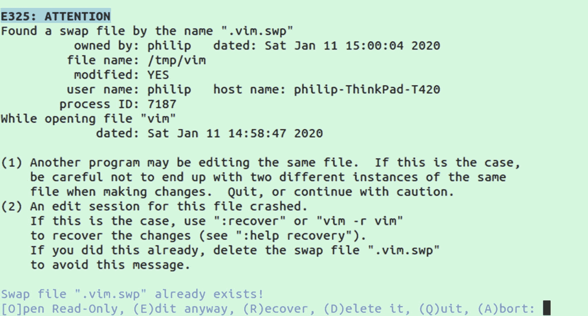

# 12.精力

迟早，您会想要开始使用基于终端的文本编辑器，如果不是全职的，那么至少当您远程登录到服务器或设备时。

许多系统管理员最终依赖于`nano`，一个预装在许多系统上的简单文本编辑器。`nano`的主要优点是它容易被新用户理解和使用。从长远来看，使用`nano`会大大降低你的速度。有了 nano，当你试图浏览一个文本文档时，你不得不长时间按住箭头键或删除。

Vim 通过创建一种基于键盘的语法来解决这个问题，这种语法可以在文档中导航，并且不需要鼠标就可以快速修改。在一次击键中，你可以从一个文档的顶部到底部`G`，然后用两个`gg`再返回。Vim 有各种类似的基于击键的命令，可以帮助你快速移动和编辑。

## 模式

如前一章所述，许多键被绑定到特殊的动作或命令，例如，`G`转到文档的底部。那么，当你真的想在文档中输入“G”的时候呢？这就是模式出现的地方。Vim 中有两种主要模式，第三种使用较少但仍然重要的模式:

*   正常模式–用于运行`G`等命令

*   插入模式–像在其他编辑器中一样书写文本

*   视觉模式–用于选择文本，类似于用鼠标突出显示文本

## 常见命令

当您在 Vim 中打开一个文档时，默认情况下您将处于正常模式。正常模式是运行 Vim 特定命令的模式。表 [12-1](#Tab1) 中列出了一些你可能想熟悉的最常见的。

表 12-1

Vim 命令

<colgroup><col class="tcol1 align-left"> <col class="tcol2 align-left"></colgroup> 
| 

命令

 | 

描述

 |
| --- | --- |
| :问 | 退出 Vim |
| :w | 保存文档 |
| :x | 保存并退出 |
| 我 | 进入插入模式 |
| :u | 取消 |
| Ctrl+r | 重做 |
|  | 从插入模式返回正常模式 |
| :e<filename></filename> | 在 Vim 已经打开的情况下打开文件 |
| :h | 帮助屏幕 |

注意如何退出 Vim 这是一个常见的问题，也是一个笑话，新加入这个项目的人很难退出这个项目。

Note

人们经常在退出 Vim 时遇到困难。在正常模式下，可以按`:q`。如果您更改了文件，您将在未保存的文件上方得到提示。你可以用`:w`保存一个文件，并将这两个动作合并为`:wq`。保存和退出也可以用一个稍微短一点的命令`:x`来完成。

## 使用帮助命令

如果您发现自己忘记了 Vim 基础知识，您可以通过运行`:h`打开帮助页面。这将把您带到一个常规帮助页面。如果您需要关于特定命令的信息，您可以在命令的`:h`后面跟随，例如:

```sh
:h G

```

这将调出`G`命令的具体帮助文本，如图 [12-1](#Fig1) 所示。



图 12-1

G 命令的帮助屏幕

## 复合命令

Vim 的一个伟大之处在于，它可以用一种非常简单的语言来组合命令。某些电源命令可以串在一起创建新的命令。做“删除内引号”这样的事情，三次击键就能完成；简单地按下

```sh
di" // delete in quotes

```

前面的命令表示三个较小的组件串在一起:

```sh
d = delete
i = in
" = quotes

```

现在你知道如何删除引号，你认为你如何删除括号内？

```sh
di) // delete in brackets

```

删除当前单词？删除段落中的？

```sh
diw // delete in word
dip // delete in paragraph

```

有几个类似的选择器可以用在同一个“在 X 中删除”序列中。你要做的就是把三个键序列中的最后一个键换出来。表 [12-2](#Tab2) 中显示了其中一些键和符号。

表 12-2

可与“删除于”复合命令一起使用的选择器

<colgroup><col class="tcol1 align-left"> <col class="tcol2 align-left"></colgroup> 
| 

钥匙

 | 

描述

 |
| --- | --- |
| " | 引用 |
| (, {, [, < | 各种支架类型 |
| t | HTML 标签 |
| p | 段落 |
| w | 单词 |

Note

对于前面列出的任何方括号，如(、{、和[，您也可以使用该方括号的结束版本来获得相同的效果。

我们也可以把所有这些语句的第一个字母换出来，改变意思。一些复合命令示例如表 [12-3](#Tab3) 所示。在极少数情况下，这个形容词可能根本不需要。例如'`diw`'可以进一步简化为'`dw`'。

表 12-3

复合命令的示例

<colgroup><col class="tcol1 align-left"> <col class="tcol2 align-left"> <col class="tcol3 align-left"> <col class="tcol4 align-left"> <col class="tcol5 align-left"></colgroup> 
| 

动词

 | 

(数字)

 | 

形容词

 | 

名词

 | 

描述

 |
| --- | --- | --- | --- | --- |
| c | - | 我 | t | 在 HTML 中创建标签 |
| d | four | - | l | 删除四个字母 |
| c | - | a | < | 删除-左右- |
| d | Two | - | w | 删除两个词 |

## 使用视觉模式选择

Vim 还有第三种模式，它提供的功能类似于在其他程序中用鼠标高亮显示一段文本。例如，用 Vim 打开`/etc/passwd`(确保不要使用 sudo 或 root，因为我们不想保存对此文件的任何更改，最好将`/etc/passwd`复制到您的`/tmp`文件夹中，并练习编辑副本)。

文件打开后，按`v`；这将使您进入视觉模式。现在你处于可视模式，按键盘上的向下箭头或`j`；当你向下移动文本时，你的高亮显示会改变。参见图 [12-2](#Fig2) 中您应该看到的示例。



图 12-2

在可视模式下选择文本

现在文本高亮显示，我们可以对它执行操作。如果我们按下`d`，所有高亮显示的文本都将被删除。

请注意，我们在前面的图像中为单词“games”选择了悬挂的字符。避免这种情况的一个好方法是进入视觉行选择模式，这与视觉选择模式相同，但只突出显示整行。要使用视觉行选择，使用`shift+v`而不仅仅是`v`。

虽然这可能看起来与您习惯在普通文本编辑器中使用鼠标的方式相似，但 Vim 视觉模式实际上要强大得多。我们可以选择垂直的代码块，而不是选择文本行。为此，首先确保您处于正常模式，按下`esc`。现在按下`ctrl+v`并使用`j`或向下箭头向下滚动。

向下滚动四行后，按几次`l`或右箭头键。请注意，我们正在做与上面视觉模式相同的事情，但是选择了一个垂直的代码块，它将被高亮显示，如图 [12-3](#Fig3) 所示。



图 12-3

在视觉模式下垂直选择

此时，我们可以对选中的代码执行一个操作，如`d`删除或按`esc`切换取消选择并返回正常模式。视觉模式的另一个常见用法是在所有的行前添加一些常见的文本。例如，假设我们想要注释掉前四行代码。回到左上角，按下`ctrl+v`。接下来向下滚动四行，按`ctrl+I`(必须是大写的 I)；这将进入插入模式，但我们实际上将同时输入所有四行。

现在如果我们输入`#`，变化将在每一行重复，如图 [12-4](#Fig4) 。当您对插入的文本感到满意时，按`esc`完成操作。如果我们想取消对这些行的注释，我们可以使用选择一个垂直的代码块并按下`d`来删除我们刚刚添加的内容的技术。



图 12-4

一次在几行的开头添加一个散列符号

确保不要保存任何这些更改。要退出 Vim 而不保存，您可以在正常模式下按`:q!`。

## 我是来当家教的

当你安装 Vim 时，它还附带了另一个名为`vimtutor`的可执行文件。当您运行它时，将会打开一个教程，引导您使用 Vim。Vim 导师的第一课如图 [12-5](#Fig5) 所示。



图 12-5

我是来当家教的

它包含了做简单事情的详细课程，比如移动光标、编辑、删除和创建文本。建议您通过 Vim tutor 学习，掌握在 Vim 中做普通事情的窍门。

## 查找文本

在导航文本时，另一件常见的事情是查找特定的文本字符串。这可以在正常模式下使用`/`键完成。首先按下`/`，然后键入您要搜索的字符串。您将在屏幕的左下角看到您的输入。输入搜索短语后，按 enter 键，光标将根据光标的起始位置转到下一个字符串实例。

将光标放在第一个实例上，可以按`n`转到下一个实例，或按`N`转到上一个实例。

搜索可能是导航文档的一种强大方式，通常后跟一个组合命令，如用于“创建单词”的`cw`

## 查找和替换

有时当你搜索时，你真正想做的是找到一个变量或单词的所有实例，并用另一个名称或单词替换它。一旦记住了命令，这在 Vim 中也相当容易。

```sh
:%s/old/new/g

```

这里的`%s`代表替身；然后是旧词，后面是我们要替换的词。在这种情况下,`g`代表 global，意味着我们希望用“new”替换所有“old”的实例。运行不带`g`的相同命令将只替换找到的第一个实例。

另一个可以与 substitute 一起使用的有用选项是`i`不区分大小写(*与 regex* 相同)，例如:

```sh
:%s/old/new/gi

```

这将替换该单词的任何匹配项，而不管该单词的任何字母是大写还是小写。

## 运行命令

也可以从 Vim 中运行 Unix 命令。例如，让我们在`/tmp`文件夹中创建一个名为“vim”的文件:

```sh
:!touch /tmp/vim

```

按 enter 键后，您将进入一个 shell 实例，其中显示了命令的结果。然后再次按回车键，您将返回到 Vim。这对于在不离开 Vim 或不改变窗口的情况下快速命令是很方便的。

除了运行一次性命令，还可以在 Vim 中运行全窗口终端。您可以通过运行`:terminal`或简称`:term`在 Vim 中打开一个迷你终端。它将在窗口的上半部分打开一个新的终端会话，如图 [12-6](#Fig6) 所示。



图 12-6

在 Vim 中打开终端会话

终端窗口显示在顶部，您可以在应用程序内终端和您正在编辑的文本之间快速来回移动。要在两个窗口之间切换，按下`ctrl+w`，然后按下`w`。

要关闭终端窗口，首先按下`ctrl+w`，然后按下`:q!`，再按下`enter`，与强制关闭正常窗口的方式相同。

## Vim 排序命令

另一个方便的内置命令是 Vim 的 sort，它类似于我们在前一章中看到的命令行实用程序`sort`。为了演示排序，进入`/tmp`文件夹，用 1 到 99 之间的 10 个随机数创建一个文件:

```sh
for i in `seq 10`;
  do echo ${RANDOM:0:2};
done > /tmp/numbers.txt

```

现在，如果我们打开`/tmp/numbers.txt`，你应该有十个未排序的数字，每个都在不同的行上。接下来在 Vim 中运行以下内容:

```sh
:1,5!sort

```

按回车键后，前五行应该被排序。第一个数字是排序的起点，第二个数字是终点。因此，如果您用 10 而不是 5 再次运行相同的命令，文件中的所有数字都应该是有序的。

## 显示和隐藏行号

在上一节中，我们在 sort 命令中使用了行号，这很容易，因为我们从第 1 行开始，但是如果您在一个长文件的中间呢？如果您需要查看行号，您可以运行

```sh
:set number

```

然后要再次删除数字，运行

```sh
:set nonumber

```

## 交换文件

在使用 Vim 时，您可能会注意到扩展名为`.swp`的文件的创建。当您正确关闭 Vim 时，会自动创建和删除这些备份文件。如果由于某种原因，您的 SSH 连接中断或 Vim 意外关闭，您将有机会恢复您的更改。只要重新打开关联有`.swp`文件的文件，你就会看到如图 [12-7](#Fig7) 所示的屏幕。



图 12-7

当打开一个有交换文件的文件时

请注意页面底部显示的选项。要恢复更改，请按`R`。如果不想恢复更改，就要按`D`；否则，每次打开该文件时都会看到这条消息，直到`.swp`文件被删除。

## 摘要

在本章中，我们看了如何使用 Vim 文本编辑器来提高生产率。它允许您快速操作文本，而无需使用鼠标，因为鼠标会导致您丢失上下文。我们研究了 Vim 的三种主要模式——正常模式、插入模式和可视模式。我们还看到了 Vim 如何拥有自己的语言来创建复合命令，比如代表“在 word 中创建”的`ciw`虽然这一章只展示了 Vim 的一小部分功能，但是希望它可以作为一个起点，让您能够使用编辑器并提高编辑文件的速度。