# 13.编辑器

在这一章中，我们将谈论一个在 Linux 世界中非常受欢迎的编辑器。Emacs 是历史最悠久、最受欢迎的编辑器之一。虽然 Vim 非常紧凑，只专注于编辑文件的任务，但 Emacs 更像是一个可以为其创建“模式”的平台。Emacs 中的不同模式以不同的方式解释命令和文本。

模式可以与正在编辑的文本文件的类型相关，例如，特定于编程 Python、JavaScript、C++等的模式。然而，模式也可以像程序一样，例如，org-agenda 提供了一个全功能的议程、待办事项列表，以及 calendar 或 EWW 提供了一个功能性的 web 浏览器，而无需离开 Emacs。甚至还有一些社区制作的模式与外部 API 绑定，例如，`telega`模式提供了一个嵌入 Emacs 的全功能电报聊天应用。

我们不会查看 Emacs 中的每个模式，甚至所有标准特性，因为这本身就需要一整本书。相反，我们将调查一些从终端有用的有趣内容，如果您希望更深入地研究 Emacs 世界，这些内容可以提供一个起点。

Note

当讨论 Emacs 时，我将使用它们的标准语法来描述命令。当你看到类似

`M-x run-command`

“M-x”代表按住修饰键的同时按“x ”,在大多数机器上是 ALT 键。

你会看到的第二个东西是 RET 这仅仅代表按下回车键。

## 安装 Emacs

在大多数包管理器上都可以找到 Emacs 的相对最新的版本。要在基于 Debian 的系统上安装 Emacs，运行

```sh
sudo apt-get install emacs

```

在撰写本文时，我们发现 ELPA (Emacs Lisp Package Archive)上验证包的程序附带的 GPG 密钥已经过期。您可以使用以下命令手动更新密钥:

```sh
gpg --homedir ~/.emacs.d/elpa/gnupg \
  --receive-keys 066DAFCB81E42C40

```

根据读取时间的不同，可能需要更改`066DAFCB81E42C40`上方的键。查看 GNU 网站链接， [`https://elpa.gnu.org/packages/gnu-elpa-keyring-update.html`](https://elpa.gnu.org/packages/gnu-elpa-keyring-update.html) ，在那里你可以找到最新的密钥，以便与“完整描述”正文中的命令一起使用

为了告诉 Emacs 使用 MELPA 包存档，您必须在您的主文件夹中创建一个名为`.emacs`的文件。它应该包含以下代码:

```sh
(require 'package)
(add-to-list 'package-archives '("melpa" . "https://melpa.org/packages/"))
(package-initialize)

```

## Vim 绑定又名 Emacs 邪恶模式

我喜欢 Vim，因为你几乎可以在任何地方找到它，如果不是完整的，那么至少是限量版的`vi`。让 Vim 对我来说很棒的是，按键绑定允许我非常快速地修改和输入数据。然而，当谈到有趣的模式、模块和扩展时，我更喜欢 Emacs。

我们要看的有趣模块的例子包括艺术家模式、组织模式、演示和 tramp。在我们查看这些模块之前，我们将启用 Vim 键绑定，这样我们就可以在运行 Emacs 时使用我们所看到的 Vim 的最佳特性。值得注意的是，其他几个程序和 ide 提供了可选的 Vim 键绑定(在实现中有不同的质量水平)，例如 VS Code 和 Qt Creator。一些终端程序如 Ranger 甚至默认使用它们，而另一些如`bash`允许你用一个选项来设置它们。

要在 Emacs 上启用 Vim 键绑定，我们首先需要安装模块“evil-mode”；这个名字一半是关于 Emacs 与 Vim 竞争的笑话，一半是基于 e (Emacs) + vi (Vim)的文字游戏。

在安装任何软件包之前，您应该更新本地软件包列表。这类似于在 Debian `apt-get update`上更新你的操作系统包管理器。要更新 Emacs 包管理器，请运行以下命令:

```sh
M-x package-refresh-contents

```

要安装 evil-mode，可以使用内置的包管理器 MELPA。运行以下命令:

```sh
M-x package-list-packages

```

这将显示 MELPA 上所有可用软件包的列表。接下来，我们将安装邪恶模式使用

```sh
M-x package-install RET evil

```

这将安装软件包，在屏幕的左下方，您应该看到“完成”安装了软件包后，您应该能够运行以下命令来为当前会话启用按键绑定:

```sh
M-x evil-mode

```

但是，在关闭 Emacs 并重新打开后，绑定将不再启用。为了确保在打开 Emacs 时默认启用绑定，我们将修改我们的`~/.emacs`文件。将以下两行添加到文件的底部:

```sh
(require 'evil)
(evil-mode 1)

```

Note

Emacs 中的一个主要概念是模式。改变模式可以改变输入键的反应方式。让 Emacs 使用 Vim 绑定的模式本身就是一种叫做`evil-mode`的模式。Emacs 中有两个子类别的调式:小调调式和大调调式。主要模式是排他的，而多个次要模式可以同时启用，并且每个模式都增加了一些功能。

在其他模式下使用 Vim 绑定的社区扩展已经存在，并且正在积极地维护/开发中。您可以在以下网址了解更多信息

[T2`www.github.com/emacs-evil/evil-collection`](http://www.github.com/emacs-evil/evil-collection)

## 内置教程

像 Vim 一样，Emacs 有一个内置的教程，可以通过按

```sh
C-h t

```

这将打开一页文本，如图 [13-1](#Fig1) 所示。

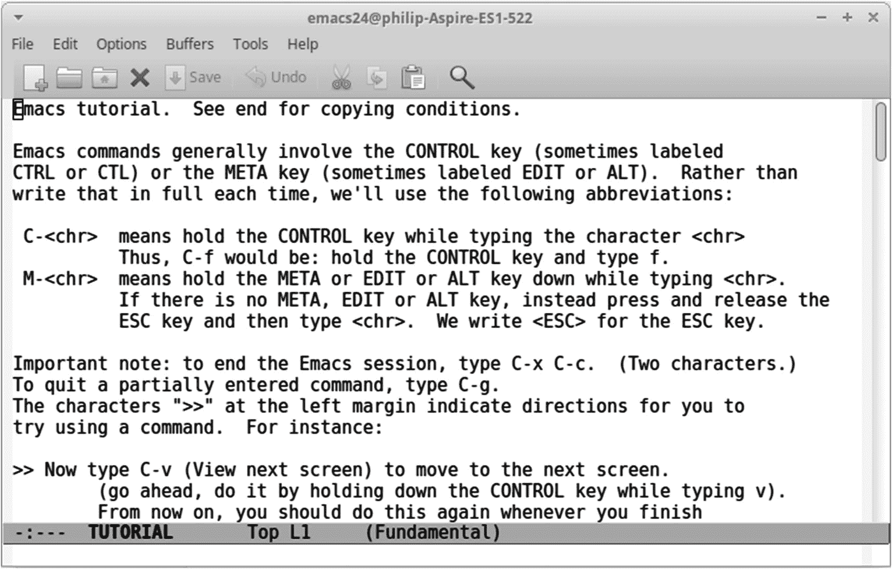

图 13-1

GUI 模式下的 Emacs 内置教程

在切换到终端模式之前(我们将在下一节中进行操作),有必要研究一下默认的起始页，了解一下“打开主目录”等选项和链接的文档。从许多方面来说，Emacs 是为从 GUI 而不是在终端中使用而构建的。如果您喜欢 GUI 版本，并且它适合您的设置，请随意使用它。

在很大程度上，从终端而不是 GUI 使用 Emacs 并没有什么好处。它确实使从终端进入文件变得更容易，对于那些来自 Vim 的用户来说可能会感觉很舒服，但是许多 Emacs power 用户相信 GUI 版本，并且在单个实例中打开多个文件并在后台运行它。

## 在终端中运行 Emacs

默认情况下，Emacs 是一个桌面 GUI 程序。当然，如果你正在读这本书，你是为了终端特定的程序和工作流程而来的。您会很高兴听到 Emacs 也可以像 Vim 一样在终端中运行。为此，您需要使用`--no-window-system`选项打开程序，如下所示:

```sh
emacs --no-window-system

```

同样的事情也可以用捷径`-nw`来完成:

```sh
emacs -nw

```

当然，您可能不希望每次从终端启动 Emacs 时都这样写。你可以做的是给你的`.bashrc`文件添加一个别名，这样`emacs`就可以调用`emacs --nw`。在我的例子中，我决定使用`e`，因为敲五个键看起来工作量很大。`.bashrc`别名如下:

```sh
alias e='emacs -nw'

```

## 使用哪个按键模式的提示

如果你是 Emacs 新手，甚至是老用户，一个很好的安装模式是`which-key-mode`。此模式会弹出一个小缓冲区，显示您当前状态下可以使用的键盘快捷键。图 [13-2](#Fig2) 显示了哪个键对话的示例。

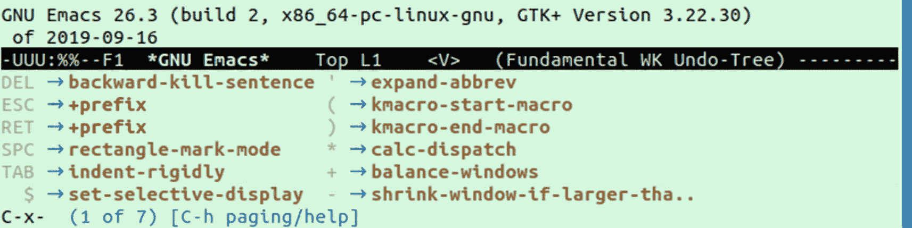

图 13-2

哪个键模式建议

从 MELPA 安装`which-key-mode`与安装`evil-mode`的过程相似。

```sh
M-x package-list-packages
M-x package-install RET which-key

```

一旦安装了`which-key-mode`,你需要修改你的`~/.emacs`文件，告诉`which-mode`在你输入命令时在迷你缓冲区显示建议。我们将使用`use-package`命令，所以我们首先需要导入它。在我们上一节写的以`(package-initialize)`结尾的代码块下，添加

```sh
  (package-install 'use-package))
(require 'use-package)

```

```sh
(unless (package-installed-p 'use-package)  (package-refresh-contents)

```

这将允许我们在命令中使用`use-package`。现在，在文件的底部，添加

```sh
(use-package which-key
  :ensure t
  :config
  (which-key-mode))

```

这确保了 Emacs 打开时`which-key-mode`开启。

完成后，关闭并重新打开 Emacs。现在如果你打字

```sh
C-x

```

你应该会看到一个小缓冲区，显示所有可以用来在`C-x`之后完成的键以及它们的作用，如图 [13-3](#Fig3) 所示的例子。

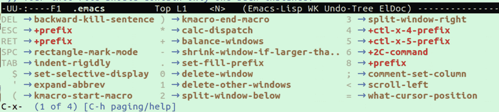

图 13-3

C-x 的哪个键模式建议

如果有太多的可能性需要列出，迷你缓冲区将被分成几个部分。要在它们之间切换，请按

```sh
C-h

```

这将允许使用`n`前进或`p`后退一节。

`which-key`有一些其他可以运行的内置命令。例如，如果您需要当前主要模式下可用命令的概述，请运行

```sh
M-x which-key-show-top-level

```

例如，如果你在`evil-mode`中，你会看到`evil-mode`的可用选项。

当您不熟悉 Emacs 时，能够看到所有可能的命令特别有用，因此强烈推荐这种模式。

## Emacs 艺术家模式

虽然我更喜欢使用 Vim 进行文本编辑，但我欣赏 Vim 的竞争对手文本编辑器 Emacs 的独特性和有趣的模式。其中一些模式是内置的，而另一些必须使用内置的软件包管理器 MELPA 来安装。

这些有趣的模式之一是 Emacs 艺术家模式。艺术家模式提供了一套用于创建基于文本的艺术或图表的工具。图 [13-4](#Fig4) 显示了我在演示文稿和自述文件中包含的服务器架构图。

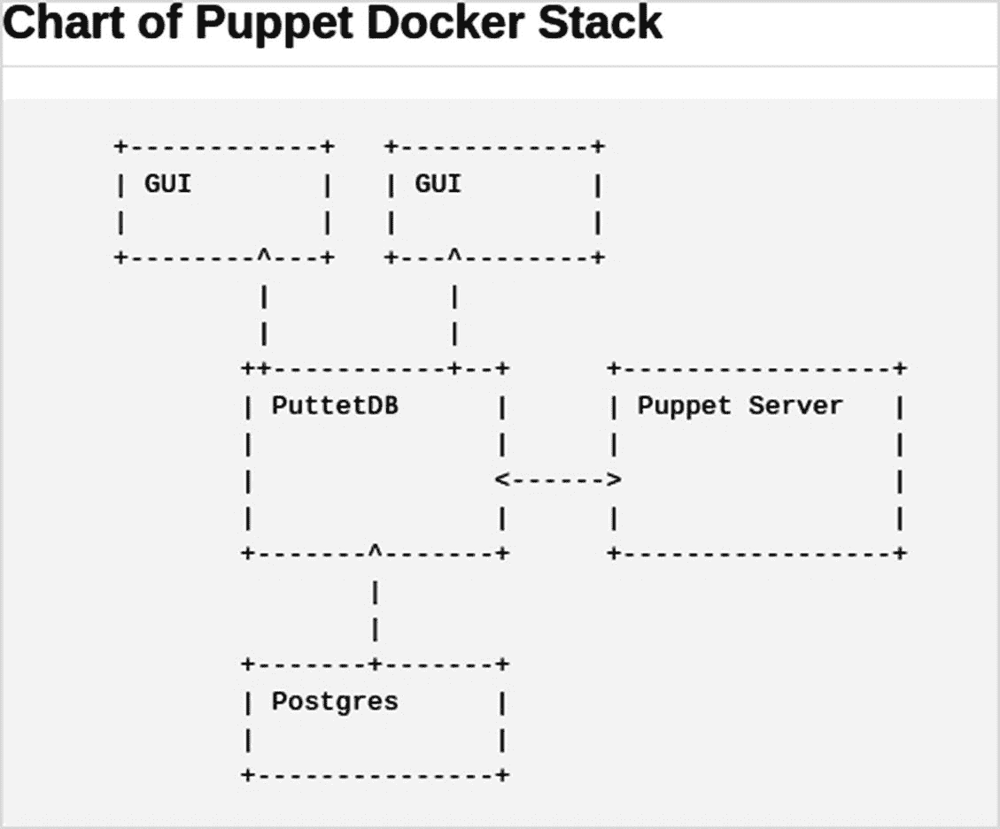

图 13-4

以艺术家模式制作的图表示例

这类图表的真正优势在于能够在终端上制作和查看它们。当通过 SSH 登录服务器并看到自述文件时，无法显示正常图像。然而，用 Emacs artist-mode 创建的图可以很容易地更改。

这类图像在非图形读物或手册中特别有用。例如，我在一个关于向物联网设备提供更新的系统的演示中使用了这种艺术，结合了 Emacs 演示模式，这是我们接下来要看的另一个模块。

Note

我们将在这里向您展示如何通过 Emacs 的终端版本使用艺术家模式，但这是一种在 GUI 版本中更容易使用的模式。这是因为在 GUI 中，你可以使用鼠标和拖放形状来绘制文本，而在终端中，你需要使用键盘来完成所有的事情。如果您的设置允许，您可能希望在 GUI 模式下启动 Emacs，并尝试用鼠标在艺术家模式下绘制文本。

用 Emacs 创建一个空白文件，然后切换到艺术家模式。在切换到艺术家模式之前，您需要创建一个空白空间(文字空格字符)的“画布”，在这里您将绘制您的图像。使用 Vim 绑定实现这一点的一个简单方法是按下`i`进入插入模式，并按住空格键，直到光标向右移动到您想要的画布宽度。然后按`esc`退出插入模式。按两次`y`复制空行；接下来按住`p`直到你的光标到达你想要的画布深度。你的光标应该停留在右下角，如图 [13-5](#Fig5) 所示。

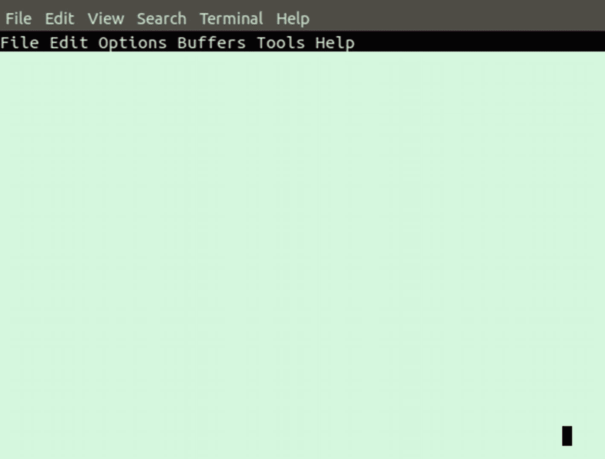

图 13-5

在 Emacs 中创建一个空白画布，用于艺术家模式

从光标到左上方的空间现在都是空白，我们将在使用艺术家模式时操作。

接下来使用以下命令切换到艺术家模式:

```sh
M-x artist-mode

```

如果您启用了 Vim 绑定，您还会想要关闭它们，因为它们与`artist-mode`不兼容。您可以通过运行相同的命令来打开它们:

```sh
M-x evil-mode

```

一旦进入艺术家模式，我们有大量的形状工具可供选择。在终端模式下使用 Emacs 时，首先按下`ctrl+c`，然后按下`ctrl+a`，可以在所有形状之间进行切换，之后你可以在对应于特定形状的字母(*不区分大小写，我复制了 Emacs GUI 中出现的快捷键*)。

```sh
C-c C-a L         ## Line
C-c C-a r         ## Rectangle
C-c C-a s         ## Square
C-c C-a P         ## Poly-line
C-c C-a C         ## Ellipse
C-c C-a T         ## Text
C-c C-a z         ## Spray-can
C-c C-a E         ## Erase
C-c C-a V         ## Vaporize

```

在我们的例子中，我们将选择矩形；一旦你用`C-c C-a r`选择了矩形，移动你的光标到你想要开始绘图的地方。然后按下`enter`并四处移动光标；你会看到当你移动它的时候，矩形会改变形状。当对大小和形状满意时，按 enter 键完成。

尝试制作如图 [13-6](#Fig6) 所示的两个矩形。

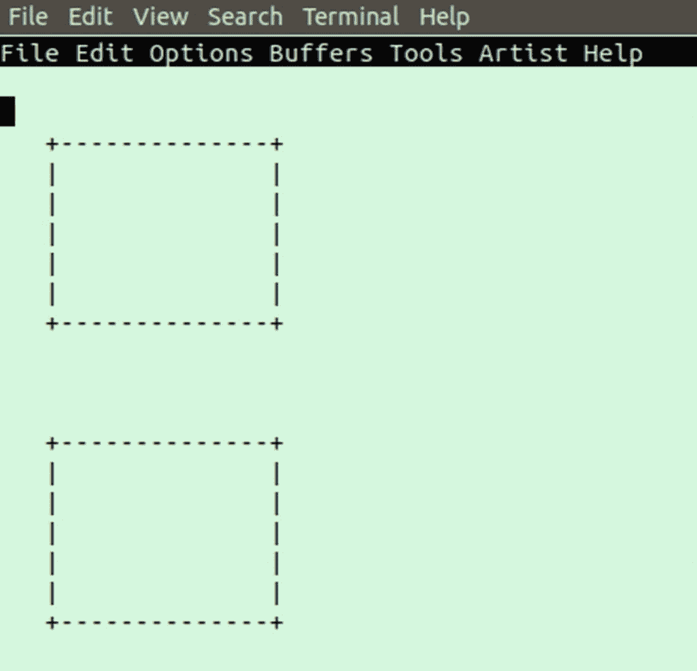

图 13-6

在艺术家模式下创建的两个矩形

接下来使用切换到线条工具

```sh
C-c C-a l

```

将光标移动到顶部矩形的底部中间，然后按 enter 键开始您的行。将其向下移动到第二个矩形的顶部，使它们如图 [13-7](#Fig7) 所示连接起来。

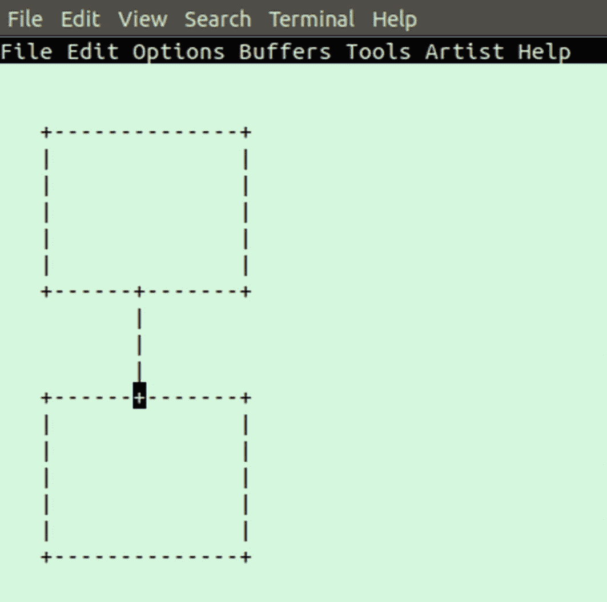

图 13-7

用线条连接两个矩形的艺术家模式

为了让它看起来更像一个从顶部矩形到底部矩形的箭头，我们将把`+`替换为`v`。要做到这一点，只需在光标位于上图所示位置时按下`v`。你应该得到类似图 [13-8](#Fig8) 的东西。

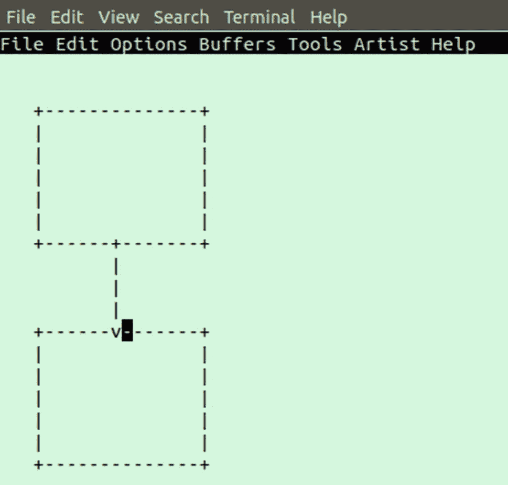

图 13-8

在艺术家模式下，用 v 替换+使线条变成箭头

当不在艺术家模式下使用特定形状时，按下一个键就可以用您所按下的内容替换光标当前所在位置的文本。我们可以用同样的效果给矩形添加一些标签。将光标移动到您想要添加标签的位置，然后简单地输入。您可以添加标签文本，如图 [13-9](#Fig9) 所示。

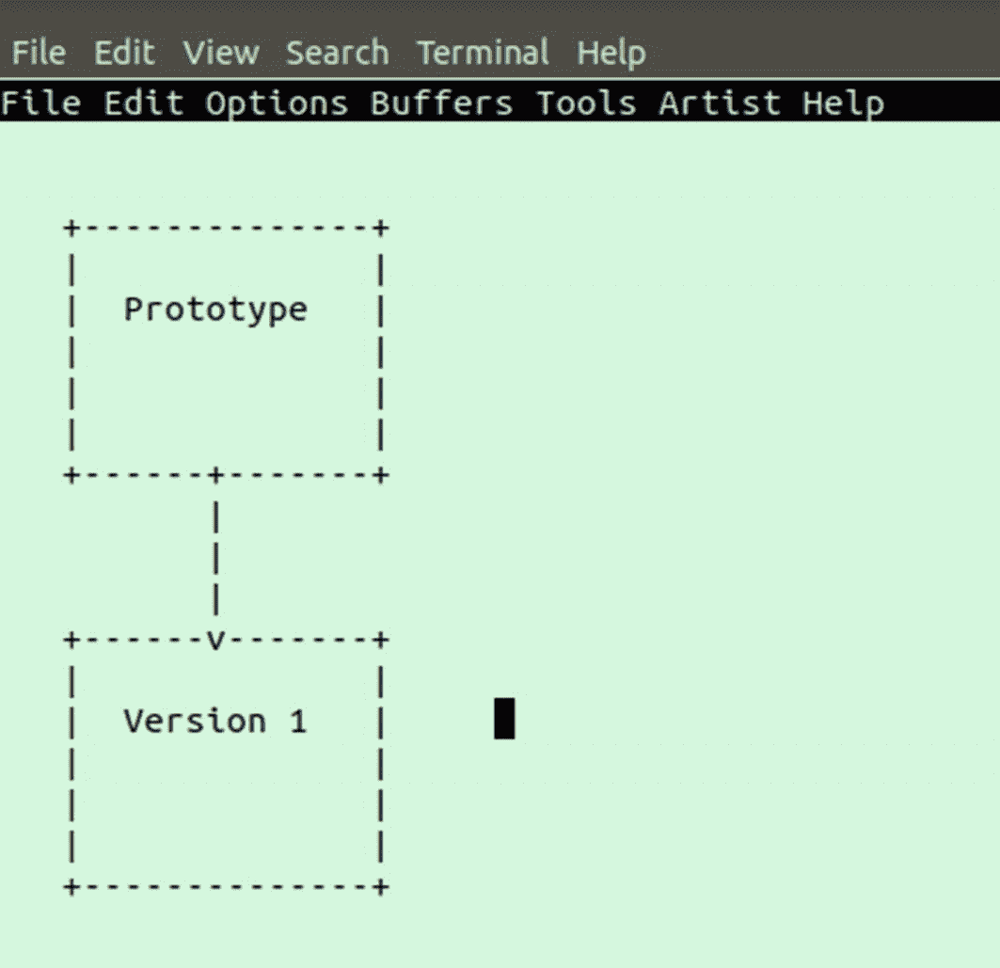

图 13-9

在艺术家模式下向图表添加标签

如果您不小心写错了，您可以简单地将光标放在单词的开头，然后按空格键用空格覆盖文本。同样的道理也适用于当你书写时不小心弄乱了你的形状；只需用这种方法手动添加形状的缺失文本。

有了这两个简单的形状和技术，你可以创建相对复杂的建筑图形，就像本节顶部显示的木偶流行机一样。然而，如果你探索其他工具并且有时间，你可以创造无限的文字艺术。我会给你一些灵感，一个我在同一个演示中发现并使用的 pop 机器文本艺术图形，如图 [13-10](#Fig10) 所示。你可以在像[`www.asciiworld.com`](http://www.asciiworld.com)[`www.asciiart.eu`](http://www.asciiart.eu)这样的网站上找到这样的文字艺术。

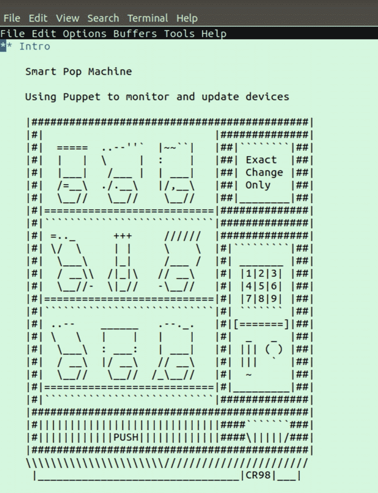

图 13-10

Pop 机器文字艺术

## 组织模式

另一种在原始文本中有效记录笔记甚至进行演示的有用模式是 Emacs org-mode。Emacs org-mode 是 organization mode 的缩写，提供了在分层标题下编写文本的能力，能够方便地扩展和压缩章节，例如，给定如图 [13-11](#Fig11) 所示的格式(标题由*指定)。

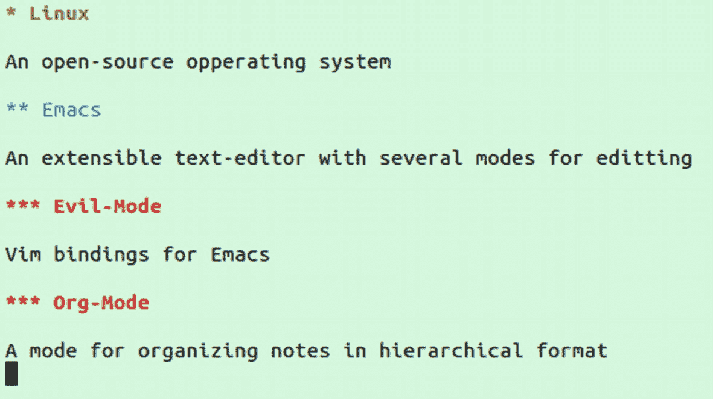

图 13-11

具有扩展部分的组织模式

要折叠一个部分，只需将光标放在要折叠的标题上，然后按下`tab`。级别由标题前面的星的数量来定义，如图 [13-12](#Fig12) 所示。

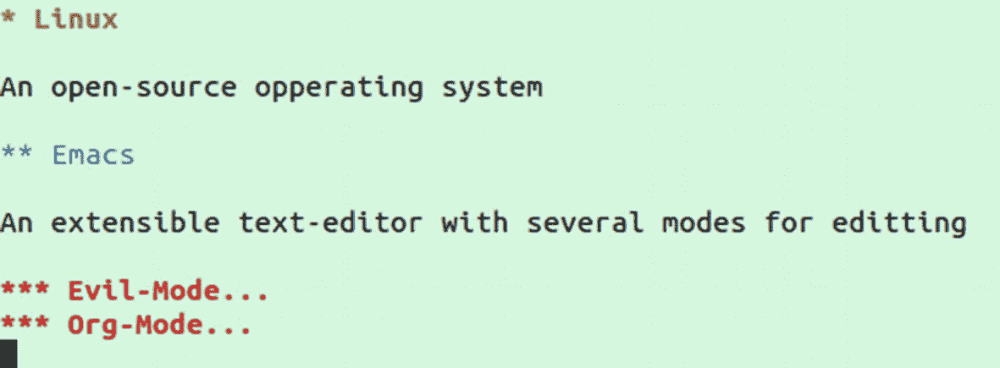

图 13-12

具有精简子部分的组织模式

折叠更高的标题将隐藏其所有子标题，如图 [13-13](#Fig13) 所示。

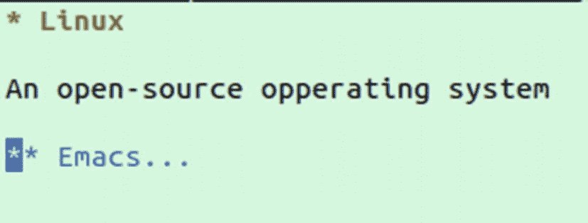

图 13-13

组织模式折叠部分

与`artist-mode`一样，它不能很好地处理 Vim 绑定。如果你想同时使用 Vim 绑定和`org-mode`，有一些软件包试图给`org-mode`添加补丁，使其与 Vim 绑定一起工作，但我发现这不值得努力。套餐包括`evil-org`、`org-evil`、`syndicate`。我的建议是不要同时使用这两种模式。如果您在启动时启用了`evil-mode`，您必须在运行`org-mode`之前通过运行`evil-mode`手动关闭它。

使用`org-mode`不需要安装任何额外的包，因为它是 Emacs 的标准配置。

## 组织模式下的表格

Org-mode 还有一个用于制作和使用表格的内置模式。组织模式下的表格由`|`字符指定。要生成表格，首先按

```sh
C-c |

```

这将在页脚打开一个对话框，询问您想要多大的表格，如图 [13-14](#Fig14) 所示。

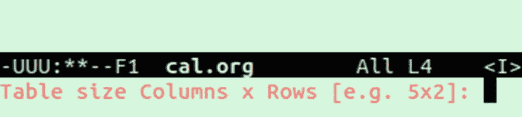

图 13-14

屏幕底部的对话框询问新表格的尺寸

对于我们的例子，我们将使用 2x3。输入尺寸后，将生成如图 [13-15](#Fig15) 所示的空表。

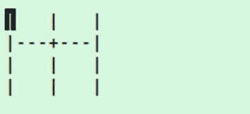

图 13-15

在组织模式下创建的空 2x3 表格

接下来用一些示例数据填写表单。这样做后，工作台很可能会像图 [13-16](#Fig16) 所示那样错位。

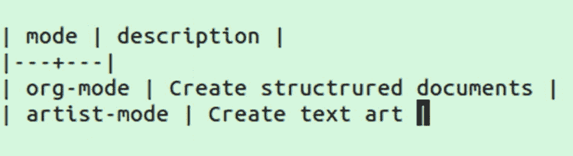

图 13-16

组织模式下的无格式表

要重新格式化表格，请确保将光标放在表格的某个位置，然后按 ctrl+c 两次。

```sh
C-c
C-c

```

第二次按下后，org-mode 将重新排列表格，产生如图 [13-17](#Fig17) 所示的布局良好的表格。

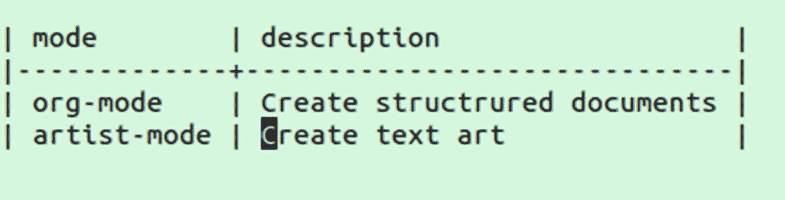

图 13-17

组织模式中的格式化表格

您现在应该有了一个格式良好的基于文本的表格。

您可以找到处理表格的其他功能，例如将 CSV 格式转换为表格，以及在表格的组织手册页中重新排列行: [`https://orgmode.org/worg/org-tutorials/tables.html`](https://orgmode.org/worg/org-tutorials/tables.html) 。

## 从组织模式导出

使用`org-mode`可以做的一件方便的事情是使用一个简单的命令导出到其他几种文件格式。可能的格式包括

*   便携文档格式

*   超文本标记语言

*   乳液

*   OpenDocument Text (ODT)文件

*   纯文本

*   伊卡伦达尔

要开始，请按

```sh
C-c C-e

```

这将打开一个显示可能导出选项的导出菜单，如图 [13-18](#Fig18) 所示。

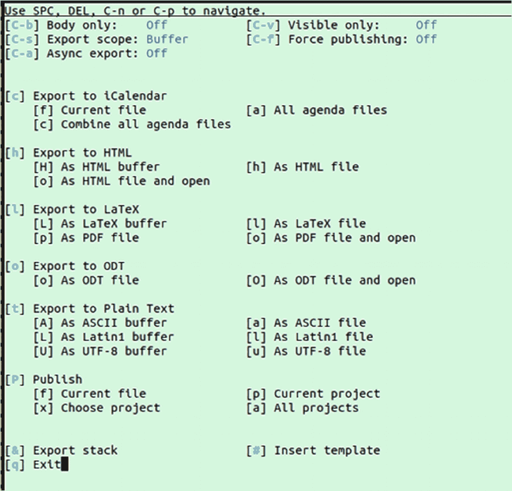

图 13-18

组织模式下的导出类型选择

例如，如果我们想导出为 PDF，按下`l`按钮，该部分将会高亮显示。参见图 [13-19](#Fig19) 的 PDF 小节示例。

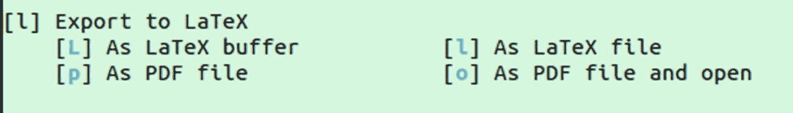

图 13-19

LaTeX 子部分在组织模式导出菜单中突出显示

我们现在可以按`p`导出为 PDF。完成后，将在与您的 org 文件相同的目录中创建一个 PDF。

## 组织-议程

处理 org 文件时，可以使用特殊的`TODO`指示器将文本标记为议程项目。你也可以告诉 org-agenda 跟踪某些文件，作为全球可访问的议程的一部分，包括像每日计划和日历这样的东西。

为了演示，创建一个名为`/cal.org`的文件。然后，为不同优先级的任务创建分区(高优先级、低优先级，如图 [13-20](#Fig20) )。创建文件后，按

```sh
C-c [

```

这将把文件添加到 Emacs 的文件列表中，以供 org-agenda 查询。您可以通过运行以下命令来删除文件

```sh
C-c ]

```

添加文件后，任何 TODO 实例都将包含在 org-agenda 中。TODO 前面必须有一个`*`，如图 [13-20](#Fig20) 所示。

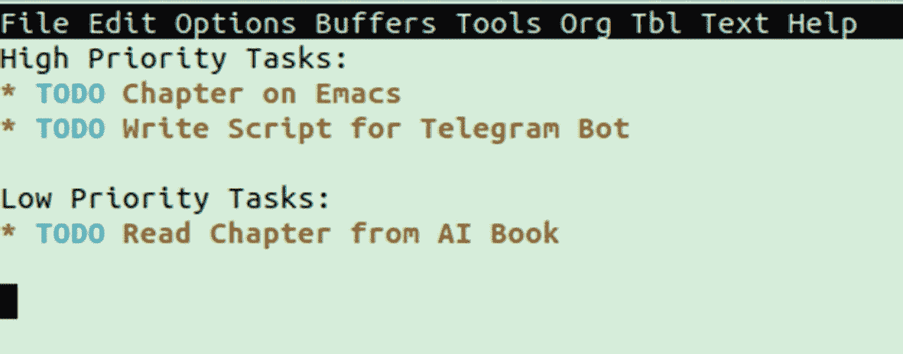

图 13-20

组织模式下的待办事项列表

现在，如果我们按 alt+x，输入 org-agenda，然后按 enter:

```sh
M-x org-agenda RET

```

我们将得到 org-agenda 的选项列表，如图 [13-21](#Fig21) 所示。

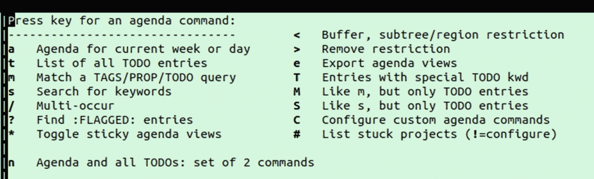

图 13-21

组织-议程菜单

按`t`可以看到所有待办事项列表，如图 [13-22](#Fig22) 所示。

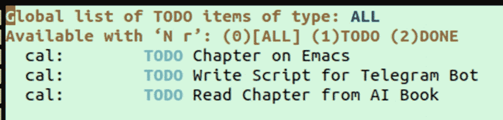

图 13-22

组织议程中列出的所有待办事项

在该议程选项卡中，我们现在可以按`n`进入下一行，按`p`进入上一行。下到您的列表项目之一，然后按下`t`。这将在您的议程和最初编写的文件中标记该任务为已完成。请记住，议程可以跟踪任意多的不同文件。因此，如果你想用不同的文件列出不同类型的任务，你可以这样做，然后把它们都拉进你的日程表(编译后的待办事项列表示例如图 [13-23](#Fig23) 所示)。

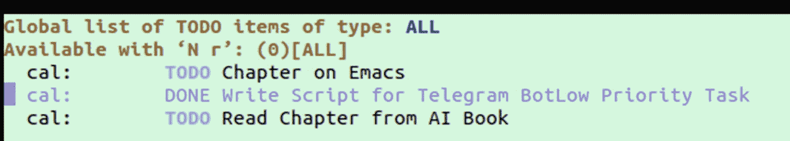

图 13-23

在组织议程中将待办事项标记为已完成

要退出议程，请按`q`。

Org-agenda 也支持任务期限。要为待办事项添加截止时间，请将光标放在待办事项上，然后按

```sh
C-c C-s

```

这将打开一个可以输入日期的提示，如图 [13-24](#Fig24) 所示。

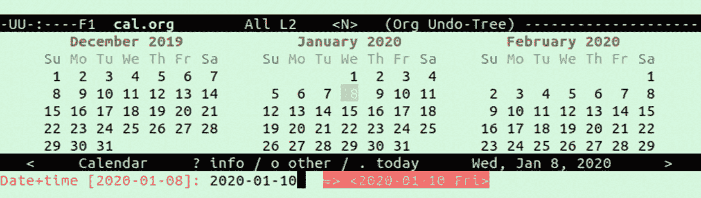

图 13-24

在组织模式下向待办事项添加日期

在输入日期/时间并按下回车键后，您将在任务下放置一个关联的日期，如图 [13-25](#Fig25) 所示。

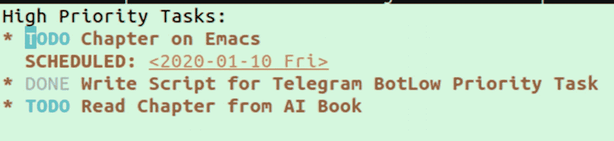

图 13-25

组织模式下计划日期的待办事项示例

现在，如果您通过输入以下内容返回到组织议程选项

```sh
M-x org-agenda RET

```

然后按`a`进入日程周视图，你会看到你一周的任务按天显示，如图 [13-26](#Fig26) 所示的例子。

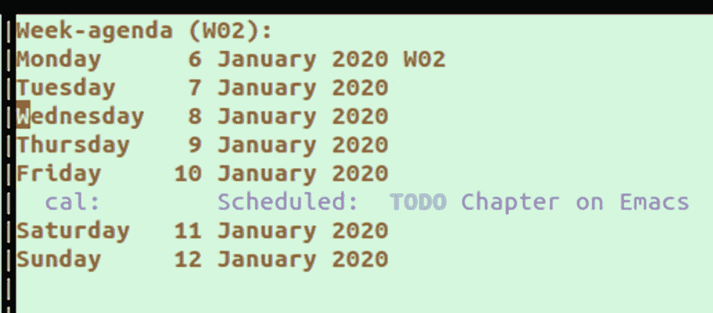

图 13-26

组织日程模式下的每周日程视图

一个预定的项目将保留在你的议程上，直到完成。Org-agenda 还提供了创建一个显示在日历上的条目的能力，但不管它是否被标记为完成，都将通过；要使用此替代时间戳，请在项目上按下`C-c .`而不是`C-c s`。还有一个高优先级的时间戳截止时间，可以在待办事项上按下`C-c d`来使用。

## 将组织日程与 Google 日历同步

Org-agenda 是一个很好的工具，但是它没有提供像手机甚至其他电脑这样的设备之间的无缝集成。MELPA 上有一个名为`org-calendar`的社区包，使 org-agenda 和 Google Calendar 之间的拉、推和双向同步变得容易。

从 MELPA 安装后，您必须在 Google 开发者控制台上设置一个项目，以使用他们的日历 API。你可以在他们的 GitHub 页面上找到关于设置`org-calendar`的最新说明。请记住，上次提交是在 2017 年 4 月，因此更新和支持可能有限。

```sh
www.github.com/myuhe/org-gcal.el

```

## 大纲演示模式

另一个可以与 Emacs 艺术家模式结合使用的好模式是 Emacs 演示模式。大纲演示模式允许您采用组织模式大纲，并将其转换为演示文稿，其中每个部分都充当幻灯片。不幸的是，这种模式没有在 MELPA 包管理器中发布。为了安装大纲演示模式，您需要手动下载脚本，然后将其添加到您的`~/.emacs`中。我发现很难在网上找到原始代码，所以我把脚本上传到了 GitHub。您应该使用 GitHub 下载它:

```sh
cd /tmp
git clone https://github.com/kirkins/outline-presentation-mode

```

然后进入下载的文件夹，将脚本移动到你的`~/.emacs.d/extra/`文件夹中(*如果文件夹不存在就创建文件夹*)。

```sh
cd /outline-presentation-mode
mv outline-presentation-mode.el ~/.emacs.d/extra/

```

现在，Emacs 脚本保存在您的`~/.emacs.d/extra/`文件夹中，您必须修改您的`~/.emacs`文件，以便在 Emacs 启动时加载脚本。在文件底部，添加以下内容:

```sh
(load-file (expand-file-name "~/.emacs.d/extra/outline-presentation-mode.el"))

```

现在，当您打开 Emacs 时，您将能够以大纲演示模式打开文件。您可能没有组织大纲文件演示文稿来测试；我在一个仓库里做了一个，你可以下载

```sh
git clone https://github.com/kirkins/puppet-pop-machine
cd puppet-pop-machine

```

接下来，在 Emacs 中打开名为`presentation.org`的文件。文件打开后，切换到`presentation-outline-mode`:

```sh
M-x presentation-outline-mode

```

这将打开演示文件并显示演示的轮廓，如图 [13-27](#Fig27) 所示。

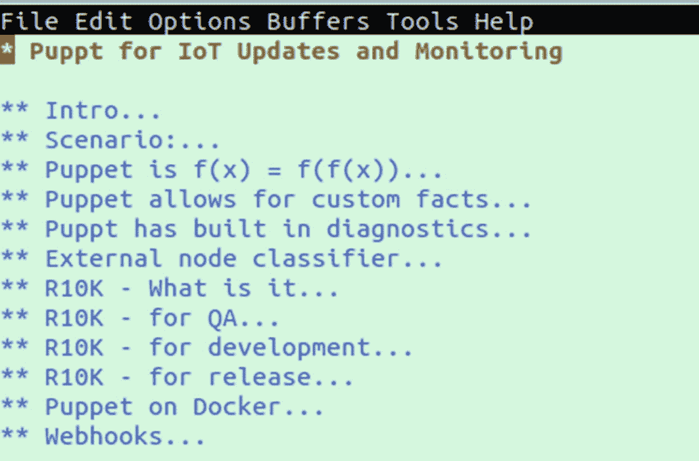

图 13-27

Emacs 中的演示大纲模式

现在，您可以按住`alt`键并点击`n`进入下一张幻灯片；要返回，点击`p`。可使用的命令列表如表 [13-1](#Tab1) 所示( *M 表示修改键，默认为 alt*)。

表 13-1

Emacs 大纲模式命令

<colgroup><col class="tcol1 align-left"> <col class="tcol2 align-left"></colgroup> 
| 

命令

 | 

描述

 |
| --- | --- |
| 男男 | 下一张幻灯片 |
| M-p | 上一张幻灯片 |
| 男-女 | 下一部分的第一张幻灯片 |
| 前一个单词 | 返回上一节幻灯片 |
| 并购 | 第一张幻灯片 |
| 环粘贴 | 扩展目录 |
| M-s | 在目录中显示幻灯片光标 |
| M-r | 返回到您进入目录的幻灯片 |
| M-q | 退出演示模式并返回到组织模式 |

图 [13-28](#Fig28) 显示了一个纯文本幻灯片的示例。


图 13-28

嵌入在大纲演示幻灯片中的艺术家模式制作的图表

## Emacs 蹦床

Emacs TRAMP 代表 Emacs 透明远程访问，多协议。它允许您通过在后台使用 rlogin、telnet 或 ssh 来访问远程文件系统，就像它们是本地系统的一部分一样。

Emacs TRAMP 默认包含在 Emacs 22.1 版本中，因此您不必做任何额外的工作来安装它。

要使用 ssh TRAMP，您首先要按

```sh
C-x C-f

```

这将在屏幕底部打开一个提示，让您导航您的系统以找到一个文件。它应该如图 [13-29](#Fig29) 所示。

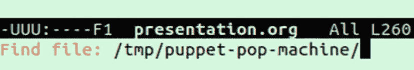

图 13-29

按下 C-x C-f 后，在屏幕底部找到一个文件对话框

按 backspace 键删除文件路径，代之以`/ssh:<your server>`，如图 [13-30](#Fig30) 所示。为了使事情变得简单，我将使用一个在我的 SSH 配置文件中定义的简称“aws ”,这个文件已经有了我的用户名和密钥文件设置。

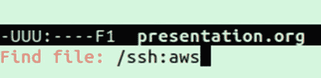

图 13-30

在查找文件对话框中输入/ssh:remotehostname 来激活 Emacs TRAMP

此时，按 tab 键，系统将开始在后台连接远程机器，出现如图 [13-31](#Fig31) 所示的信息。

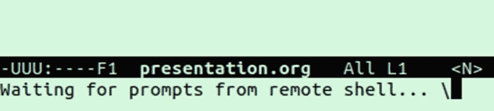

图 13-31

显示 Emacs TRAMP 连接到远程服务器的对话框

一旦连接上，你就可以按 tab 键并获得所有远程文件的列表，就好像它是你本地机器上的一个文件夹一样。图 [13-32](#Fig32) 显示了一个例子。

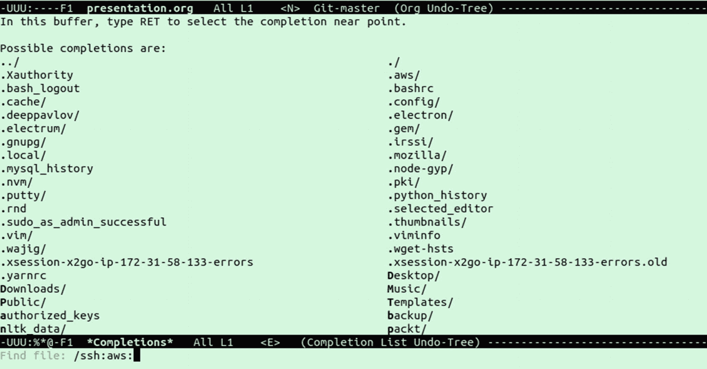

图 13-32

通过 Emacs TRAMP 自动完成显示远程服务器上的文件

方便的是，您可以编辑远程机器上的文件，然后切换到本地机器上的文件，然后返回到远程机器上的文件，连接将保持打开。

您甚至可以同时与几台远程机器连接，并在文件之间无缝切换，同时保持本地 Emacs 编辑器设置——而不是通过 SSH 连接到那些机器，并使用每台本地机器上的编辑器的配置文件。由于这个原因，Emacs TRAMP 对于那些必须定期在几台机器上切换编辑文件的人来说特别有用。

## 其他模式

这里我们只看了几种 Emacs 模式，但还有很多。如果你感兴趣，这里有一个小清单可以让你开始。请记住，我这里关注的是类似应用程序的模式，但是几乎每种编程语言和配置文件类型都有模式。其他流行模式列表见表 [13-2](#Tab2) 。

表 13-2

Emacs 模式

<colgroup><col class="tcol1 align-left"> <col class="tcol2 align-left"></colgroup> 
| 

名字

 | 

描述

 |
| --- | --- |
| 壳 | Emacs 中的命令行 shell |
| 干燥的 | 导航目录的模式 |
| 呀 | Emacs 中的网络浏览器 |
| 魔法吗 | 高级 git 接口，用于合并等操作 |
| 常春藤 | 用于自动完成的交互式界面 |
| 牛羚 | 阅读电子邮件、RSS、新闻组群组等等 |
| 彩虹模式 | 为十六进制颜色代码设置背景 |
| 公司 | 文本完成 |
| 埃迪夫 | 用于比较文件和补丁的工具 |
| 飞溅模式 | 拼写检查用红色突出显示错误的单词 |

如果你已经安装了模式，你可以简单地按 alt+x 并输入名称。如果您想获得已安装模式的完整列表，请按

```sh
C-h a

```

然后进入“模式”；这将列出所有安装的模式，并附有非常简短的描述。

## 摘要

在这一章中，我们介绍了 Emacs 文本编辑器及其通过模式和嵌入式应用程序提供的许多功能，从创建艺术风格的图表和文本表格到管理任务列表和个人日历。正如我们所看到的，Emacs 不仅仅是一个文本编辑器，更像是一个可以构建基于文本的应用程序的平台。