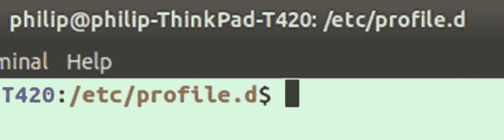
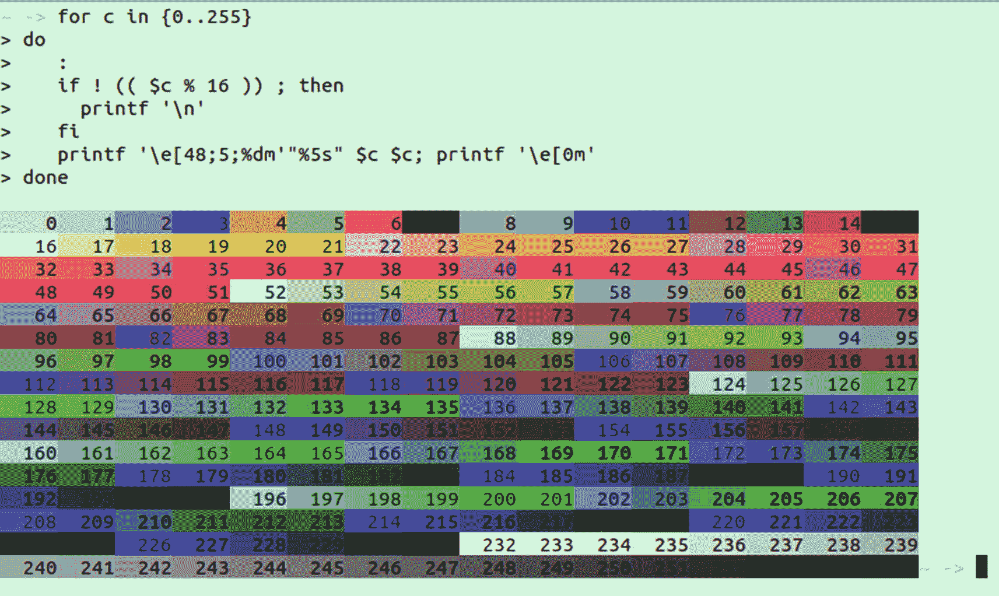
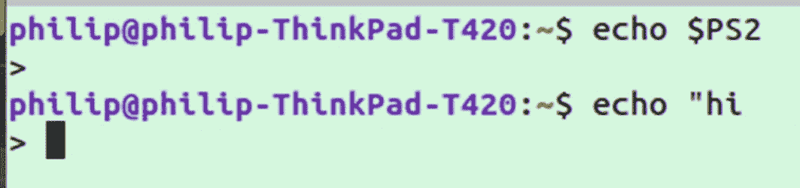
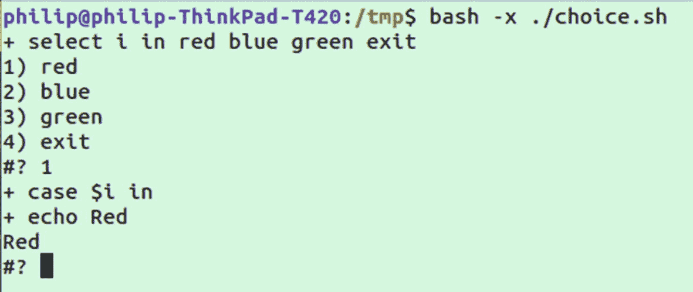
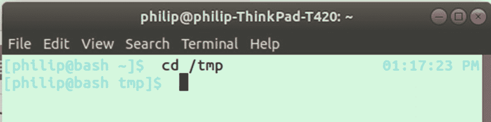
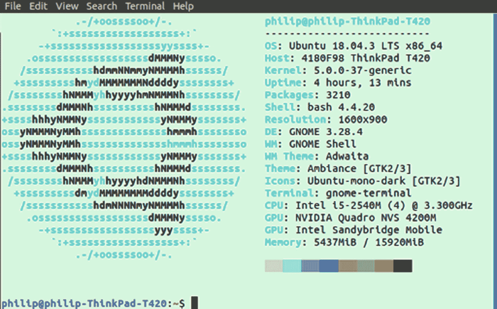

# 十四、配置 Bash

在这一章中，我们将会看到 bash 的各种配置。这通常是通过使用 bash 启动时运行的配置脚本以及其他配置文件来完成的，这些配置文件控制已安装的实用程序或底层库，如`.inputrc`。

## 配置脚本

我们将从用于直接定制`bash`的三个配置文件开始。这些包括`.bashrc_profile`、`.bashrc`和`.profile`。

## 。bashrc_profile 或者。轮廓

`.bashrc_profile`配置脚本类似于`.bashrc`，但是它只在用户第一次登录时运行一次。在某些系统上，这个文件可能被指定为`.profile`，尽管如果`.profile`和`.bash_profile`都存在，那么将使用`.bash_profile`。

`.bashrc_profile`是定义`.bashrc`位置的入口点。这里有一个例子:

```sh
if [ -n "$BASH_VERSION" ]; then
    # include .bashrc if it exists
    if [ -f "$HOME/.bashrc" ]; then
        . "$HOME/.bashrc"
    fi
fi

```

前面的代码检查执行脚本的语言。如果语言是 bash，那么它会检查主文件夹中是否存在一个`.bashrc`文件。如果存在一个`.bashrc`文件，则执行该文件。

一个更简单的实现可能只包括以下内容，即如果`.bashrc`存在，则加载它:

```sh
test -r ~/.bashrc && . ~/.bashrc

```

虽然通常情况下`.bashrc_profile`只是加载`.bashrc`，但是也有可能将在`.bashrc`中完成的任何事情直接包含在`.bashrc_profile`中。

Note

的“.”在前面的`. ~/.bashrc`中是内置 bash 命令`source`的简写，它允许您将外部脚本加载到正在运行的脚本中。

## .bashrc

`~/.bashrc`文件包含 bash 配置。它可用于定义在所有会话中都可用的变量或函数。每当您打开一个新的 bash 终端时，就会运行该脚本。

作为一个实验，试着打开你的`.bashrc`，它应该在`~/.bashrc`是可访问的。在文件的底部添加一行如下内容(尽管在文件的任何地方添加都可以):

```sh
export HELLO=world

```

接下来通过运行(*或关闭终端并重新打开*来重新加载`~/.bashrc`文件

```sh
source ~/.bashrc

```

现在，您应该能够在 bash 中使用变量`$HELLO`，并让它返回值“world”，例如，使用`echo`:

```sh
echo $HELLO

```

## 。bash_logout

虽然`.profile`脚本在登录时运行一次，但是`.bash_logout`正好相反。它只在您注销时运行一次。如果您想删除临时文件，这可能很有用。举个例子，我的 Ubuntu 系统上默认的`.bash_logout`包括以下内容:

```sh
# when leaving console clear the screen to increase privacy

if [ "$SHLVL" = 1 ]; then
    [ -x /usr/bin/clear_console ] && /usr/bin/clear_console -q
fi

```

前面的代码说明，如果退出的 shell 是基础层，并且文件`/usr/bin/clear_console`存在，那么运行带有`-q`标志的文件。

这里的$SHLVL 是一个自动存在的环境变量。要了解它是如何工作的，试试`echo $SHLVL`；这应该会返回值 1。那就试试

```sh
bash
echo $SHLVL

```

在 bash 中运行一个 bash 会话后，这个数字将是 2。如果您在那个会话中运行另一个 bash 会话，这个数字将变为 3。

Note

取决于您的发行版和用户，该文件可能存在，也可能不存在。比如我们发现使用 root 用户时，默认没有`.bash_logout`。当使用 Fedora 而不是 Ubuntu 时，我们发现该文件确实存在，但包含的代码不同。

## 全球版本

除了主目录中的`.bashrc`,如果你在基于 Debian 的系统上，你会在`/etc/bash.bashrc`有一个全局版本，在基于 Red Hat 的系统上，你会有`/etc/bashrc`。此外，你应该有一个充当全球版`.profile`的`/etc/profile`。这些文件用于为所有用户设置 bash 的初始状态，在本地概要文件之前运行，`.bashrc`文件为每个用户运行。

在启动过程中，当`/etc/profile`运行时，还有一个文件夹执行几个名为`/etc/profile.d/`的脚本。如果你把一个可执行脚本放在这个目录中，只要它的扩展名是`.sh`，它就会在启动时运行。与普通的可执行文件不同，执行这些文件需要扩展名。

## 有用的配置。没有则创建

你可以用一个`.bashrc`文件做几件有用的事情。一些最常见的包括为常用任务创建别名，或者添加简单的函数以便在系统范围内访问。

## 定义别名

别名是一个短命令，它可以转换成一个更长的命令。这使得编写命令更加方便。例如，许多 Ubuntu 系统默认使用别名`ll`作为`ls -alF`的简称，它显示了当前目录的更详细视图。当我打开我的`.bashrc`时，我看到`ll`和一些默认的别名一起被定义:

```sh
alias ll='ls -alF'
alias la='ls -A'
alias l='ls -CF'

```

我在自己的机器上添加的一个是将`vi`别名化为`vim`。这允许我运行相同的命令，不管我是运行在一个有完整 Vim 的机器上还是只有`vi`。如果你在 Fedora 上，你会发现这个别名是默认存在的。

```sh
alias vi="vim"

```

本着同样的精神，你可能想升级`diff`来代替使用`colordiff`(注意`colordiff`可能不是默认安装的):

```sh
alias diff="colordiff"

```

## 自定义功能

在某些情况下，如果你想创建一个快捷方式，你会发现你需要创建一个短函数，而不是使用一个例子。人们喜欢做的一件事是创建一个函数，用`mkdir`创建一个文件夹，然后用`cd`立即移动到那个目录。让我们通过向`.bashrc`添加以下函数来创建一个命令:

```sh
mkcd() { mkdir -p "$1" && cd "$1"; }

```

保存后，关闭终端并重新打开，因为新终端打开时会运行`.bashrc`文件。或者，您可以运行`source .bashrc`来重新加载配置，而无需重启您的终端。现在，如果你运行`mkcd hello`，你将创建一个名为 hello 的文件夹，并立即移入其中。

在某些情况下，您可能只是想包装一个有些难以记忆的现有命令。例如，许多系统将`amixer`用于声音。可以用`amixer`改变音量；我们可以包装现有的命令，使它变得简单一些:

```sh
volume() { amixer sset 'Master' $1%; }

```

这允许您从终端传入 0 到 100 之间的任何值来设置音量。

## 添加到路径

在`.bashrc`中的另一个常见变化是增加了`$PATH`变量。此变量跟踪系统中存储可执行文件的文件夹列表。当您在没有指定完整路径的情况下运行一个可执行文件时，例如`nmap`，系统会检查您路径中指定的所有文件夹。当找到匹配时，就使用它。

如果你在系统上安装了编程语言，它们通常会自动修改你的`.bashrc`文件，并将保存可执行文件的文件夹添加到你的路径中。通过这样做，他们使他们的所有模块对你可用，作为你的路径的一部分。下面是安装 Rust 编程语言时创建的一行代码的示例。

```sh
export PATH="$HOME/.cargo/bin:$PATH"

```

注意结尾的`:$PATH`。这指定我们使用旧的$PATH，并在前面加上出现在`:`之前的所有内容。在追加或前置现有的$PATH 变量时，请始终使用该变量。否则，您可能会删除添加到其他文件或位置的文件夹。

## 更改 PS1 提示

`.bashrc`中另一个常见的定制是改变提示文本的颜色或内容。光标左侧显示的提示由环境变量 PS1 控制。如果您运行`echo $PS1`，您将在您的系统上看到一个编码版本。

可以通过更新 PS1 变量来改变，比如让我们把文本变成红色(为了实验，直接在终端运行而不是修改。bashrc):

```sh
export PS1="\e[0;31m[\u@\h \W]\$ \e[m "

```

运行前面的命令应该会导致提示符变成红色。接下来，尝试再次运行相同的命令，但增加 31，并观察每个数字如何产生不同的颜色。预期结果的示例如图 [14-1](#Fig1) 所示。


图 14-1

更改 bash 提示文本的颜色

这段代码内容有点难以理解，因为它首先以一个根本看不到的转义字符`\e[o;`开始。转义字符的存在导致窗口的标题栏包含工作目录，如图 [14-2](#Fig2) 所示。



图 14-2

标题栏中的文件路径由于`\e[o;`在 PS1

之后我们需要`31m[`来设置颜色。这是一个 ANSI 转义序列，可追溯到 20 世纪 70 年代；它们被用作嵌入文本的一种方式，而文本应该被解释为命令而不是文本。在这条线的最末端，我们有`\e[m`来重置颜色；如果不包含，您在终端中键入的文本将与别名的颜色相同。不同 ANSI 颜色代码的列表如表 [14-1](#Tab1) 所示。

表 14-1

颜色的 ANSI 转义序列

<colgroup><col class="tcol1 align-left"> <col class="tcol2 align-left"></colgroup> 
| 

顺序

 | 

描述

 |
| --- | --- |
| 3000 万[ | 黑色 |
| 3100 万美元[ | 红色 |
| 3200 万美元[ | 格林（姓氏）；绿色的 |
| 33m[ | 黄色 |
| 34m[ | 蓝色 |
| 3500 万美元[ | 品红 |
| 3600 万美元[ | 蓝绿色 |
| 3700 万[ | 白色的 |

`\u`翻译成用户名，`\h`代表主机名，`\W`代表工作目录的基址。如果我们需要最少的提示文本，我们可以用

```sh
export PS1="-> "

```

或者如果我们只需要工作目录库:

```sh
export PS1="\W -> "

```

这导致了一个更小的外观，只显示工作目录的基础。如果您喜欢显示完整工作目录的默认方式，而不仅仅是基本目录，您只需要用小写版本的`\w`替换`\W`。PS1 符号列表如表 [14-2](#Tab2) 所示。

表 14-2

PS1 提示命令

<colgroup><col class="tcol1 align-left"> <col class="tcol2 align-left"></colgroup> 
| 

性格；角色；字母

 | 

描述

 |
| --- | --- |
| h | 主机名改为第一个。“ |
| H | 完整主机名 |
| s | Shell 名称，例如“bash” |
| t | 24 小时制的当前时间 |
| @ | 12 小时制的当前时间 |
| u | 用户名 |
| w | 工作目录的完整路径 |
| W | 当前文件夹名称 |

另一种修改提示颜色的方法是使用`tput`。这种方法实际上更加灵活，因为它允许您使用 256 种颜色。然而，你必须在你的终端上启用 256 色；要快速查看支持的数量，请运行

```sh
tput colors

```

如果你得到一个小于 256 的数字，你需要确保你已经启用了`xterm-256color`。您可以通过在您的`.bashrc`中添加下面一行来实现:

```sh
export TERM=xterm-256color

```

确保在更新后运行`source ~/.bashrc`。

启用 256 种颜色后，您现在可以将`tput setaf`与 256 种颜色代码中的一种一起使用。您可以通过搜索“256 种颜色代码”找到完整的列表然而，我们实际上可以通过在 bash 中运行以下命令来创建一个包含所有颜色的列表:

```sh
for c in {0..255}
do
   :
   if ! (( $c % 16 )) ; then
     printf '\n'
   fi
   printf '\e[48;5;%dm'"%5s" $c $c; printf '\e[0m'
done

```

该脚本将遍历从 0 到 255 的每个数字，并根据该代码用背景色打印该数字。运行它应该会产生如图 [14-3](#Fig3) 所示的结果。



图 14-3

创建一个包含所有 256 种颜色代码的表格

我们将使用之前的最小 PS1，然后用一个`tput`命令设置颜色，另一个命令重置颜色:

```sh
export PS1="$(tput setaf 166)\W -> $(tput sgr0)"

```

在您的终端中直接进行试验后，如果您发现您想要永久保存的东西，只需将它添加到您的`.bashrc`文件的底部。然后，如果你决定你不想要它了，你可以删除有问题的线。

## PS2、PS3 和 PS4

除了 PS1 环境变量，还有一个 PS2。要查看您的 PS2，请运行以下命令:

```sh
echo $PS2
echo "hi

```

在第二行，一定不要包括结束”。这将导致 PS2 提示符显示，表明您需要完成前一个命令。注意这两个符号是如何与图 [14-4](#Fig4) 中的相同。



图 14-4

将 PS2 与交互式 shell 文本提示进行比较

请注意，前面的两个命令显示相同的“>”。

除了 PS1 和 PS2，还有 PS3 和 PS4，但它们并不常用。当 bash 中使用 select 提示符时，会使用 PS3，例如:

```sh
PS3=">"
select i in red blue green exit
do
  case $i in
    red) echo "Red";;
    blue) echo "Blue";;
    green) echo "Green";;
    exit) exit;;
  esac
done

```

运行时，我们会看到一个使用 PS3 值的选择菜单，旁边会提示用户输入文本，如图 [14-5](#Fig5) 所示。


图 14-5

使用`select`的脚本中的 PS3 示例

如果 PS3 没有指定值，缺省值将是#？。

最后，PS4 专用于调试带有`-x`标志的 bash。此标志用于调试；如果我们让用户选择一种颜色并把它放在一个文件中，我们可以用`-x`标志运行它:

```sh
bash -x ./choice.sh

```

当我们这样做时，我们会看到运行时显示的行，左边是 PS4 的值，在本例中是一个“+”号。示例见图 [14-6](#Fig6) 。



图 14-6

将`-x`标志用于调试模式时的 PS4 示例

## 主题

您可以手动检查和更改视觉显示的所有方面，或者安装一个社区项目，使预先创建的终端颜色主题可用。

一些受欢迎的项目包括“Bash-it”和“哦，我的 Bash”；然而，这两个项目都捆绑了大量的功能和配置。其他项目，如高，更少，只提供主题。

*   bash-it-[`https://github.com/Bash-it/bash-it`](https://github.com/Bash-it/bash-it)

*   哦，我的狂欢——[`https://github.com/ohmybash/oh-my-bash`](https://github.com/ohmybash/oh-my-bash)

*   梵高—[`https://github.com/Mayccoll/Gogh`](https://github.com/Mayccoll/Gogh)

这些都需要运行外部 bash 脚本，所以请确保做自己的研究，以检查这些项目在阅读时仍然处于良好状态。也值得自己浏览一些脚本，并检查公共问题跟踪器，以确保项目在试验之前仍然处于良好状态。这可以通过查看项目的最后一次提交或发布来完成。你也可以在一个项目的 GitHub 页面的 issues 选项卡上查看用户最近的反馈。

## 终端中的实时时钟

另一个巧妙的技巧是添加一个实时时钟，它展示了增加终端趣味的多种可能性。这可以通过运行下面的代码片段来实现(或者将它放在您的`.bashrc`中使之永久化):

```sh
while sleep 1;
do
  tput sc;
  tput cup 0 $(($(tput cols)-11));
  echo -e "\e[31m`date +%r`\e[39m";
  tput rc;
done &

```

这会创建一个每秒运行一次的循环。它获取你的终端的宽度，并将光标移动到右上角的左边 11 个空格。然后用`date`输出当前时间，最后用`tput rc`将光标返回正常位置。图 [14-7](#Fig7) 显示了一个实时时钟效果的例子。



图 14-7

终端右上角的实时时钟

或者，如果我们不介意时间只在每个命令后更新，我们可以将时间放在提示文本中。为此，您可以使用我们之前使用的一个命令来更新提示颜色，并添加指定当前时间的`\t`,例如:

```sh
export PS1="\e[0;32m\t \W \$ \e[m "

```

运行前面的命令后，您将在提示文本中看到时间。如果您想使用 12 小时制，将`t`切换到`T`:

```sh
export PS1="\e[0;32m\T \W \$ \e[m "

```

或者，您可以使用`@`字符来表示带有 AM/PM 指示器的完整 12 小时格式:

```sh
export PS1="\e[0;32m\@ \W \$ \e[m "

```

三种提示时间格式的示例如图 [14-8](#Fig8) 所示。


图 14-8

bash 提示文本中的时间格式

## 在打开时运行程序

有时人们会在终端上运行程序，开始使用`.bashrc`来增加美感。这可以包括像`fortune`这样的事情，或者回显一个包含一些 TODO 项的文本文件。

另一个需要运行的常用命令是`neofetch`命令。这不是默认安装的，但是可以在大多数包管理器中找到。这是一个高度可定制的系统信息脚本。这是一种在截图中与世界分享他们选择的设置的方式，同时展示他们选择的终端主题。图 [14-9](#Fig9) 显示了我的机器上 Neofetch 的输出示例。



图 14-9

Neofetch 的输出

图 [14-9](#Fig9) 是在我的机器上运行`neofetch`的一个例子。

在 terminal open 上运行这个命令或任何命令就像在您的`.bashrc`底部添加一行命令一样简单。当打开一个新的 bash 终端时，您从`.bashrc`运行的任何程序都将运行。

Note

程序`screenfetch`提供了一个类似于`neofetch`的替代方案，只是对徽标的渲染略有不同。它也可能比`neofetch`略快。

## 导入文件

如果您的`.bashrc`文件变得很大，您可能希望将其分成多个文件。这允许你共享和重用部件，而不必处理一个长文件。例如，您可能希望将所有别名分离到一个名为`.bash_aliases`的文件中。只需将别名行移动到一个新文件中，并使用`source`导入新文件:

```sh
source ~/.bash_aliases

```

放置在`.bashrc`中的前一段代码将导致`.bash_aliases`在每次打开新终端时被加载和运行。

## 。inputrc(输入 rc)

我们在前面的章节中提到过`.inputrc`是一种将 bash ( *和其他几个程序*)键盘快捷键改为基于 Vim 的快捷键，而不是默认的类似 Emacs 的快捷键。

`.inputrc`文件影响所有使用 GNU readline 库的程序，该库包括几个流行的程序，包括 bash 以及 Ruby、Python 和 MySQL 等编程语言的 REPLs。

如前所述，`.inputrc`中的一个选项是通过添加行来切换到 Vim 键盘快捷键

```sh
set editing-mode vi
set keymap vi

```

通过打开全局文件`/etc/inputrc`，我们可以看到`.inputrc`的所有默认值，该文件为所有用户提供了初始值。这个文件可能包含一些配置以及解释这些配置的注释。

一个可能的修改是当你双击 tab 激活自动完成时关闭声音输出。您可能没有注意到，在许多系统中，当您按 tab 激活自动完成时，会发出声音。这可以通过添加以下内容来关闭

```sh
set bell-style none

```

另一个可能但很少使用的选项是使自动完成不区分大小写，这样，如果您用大写或不大写来写文件夹的名称，它将完成，而不管匹配的文件夹使用什么大小写。

```sh
set completion-ignore-case On

```

你可能已经注意到你经常需要点击 tab 键两次来显示所有的完成。如果您希望立即看到所有可能的完成，您可以添加以下行:

```sh
set show-all-if-unmodified On

```

有时按 tab 会导致文件部分完成，但这时你会碰到有两种或更多可能的方式来完成文件名的地方。通常情况下，它会补全到差值，然后您必须再次按 tab 来查看可能的补全。如果你想让它自动完成所有可能的事情，并在一个结局中显示所有结局，请启用`show-all-if-ambiguous`:

```sh
set show-all-if-ambiguous On

```

当您运行类似于`ls`的命令时，您可能会收到颜色编码的结果，这取决于您的系统。如果您也想为自动完成启用此功能，您可以添加以下行:

```sh
set colored-stats On

```

如果您想用一个可视符号来指示文件类型，类似于运行`ls -F`时显示的类型，您可以添加一行

```sh
set visible-stats On

```

虽然修改`.inputrc`并不常见，但它确实提供了一些不同的选项，这些选项在其他地方是做不到的。

除了改变通知声音和在 Vim 和 Emacs 风格的键盘快捷键之间切换，你可能永远不需要修改你的`.inputrc`,尽管也可以修改键盘快捷键的功能或者添加新的快捷键。要获得`.inputrc`所有可能选项的完整列表，运行

```sh
man 3 readline

```

## 其他点文件

术语点文件是指以点开头的隐藏文件，用于配置程序。虽然`.bashrc`是最受欢迎的网络文件之一，但它远不是唯一的。安装的默认程序和附加程序都有各种类型的点文件。可用于定制程序的一些其他示例包括

*   。wgetrc

*   . curlrc

*   .gitconfig

*   -vim 的

*   . tmux.conf 文件

## 摘要

在这一章中，我们看了`.bashrc`和`.inputrc`，这两个点文件可以用来定制 bash 终端。我们看到了一些常见的修改，比如添加路径、定义函数和创建别名。我们还查看了一些不常用的配置文件，如`.bash_logout`和配置选项，如终端提示符和颜色。