# 十五、Tmux 工作流

在这一章中，我们将学习 Tmux，终端多路复用器的缩写——一个主要用于管理后台进程的实用程序，但也有许多其他用途。除了保持进程运行之外，Tmux 还可以用于将终端划分成更小的屏幕，创建一个定制的布局，可以同时监视几个窗格。

## 后台脚本

Tmux 是我最常用的程序之一。它主要用于管理正在运行的 shell 脚本、ssh 会话和任何类型的 bash shell 进程。在过去的几年中，Tmux 变得如此流行，以至于它被预装在一些 Linux 发行版中，比如最新的 Ubuntu Desktop。

如果您的机器上没有安装 Tmux，应该可以通过您的软件包管理器获得:

```sh
sudo apt-get install tmux

```

一旦您开始使用基于终端的应用和进程，您会很快发现您可能想要运行一个进程并保持它运行，而不必在您的用户界面上保持一个专用的终端窗口打开。传统上，这可以通过内置命令的组合来完成。

为了演示，让我们创建一个持续的进程，每 3 秒钟用当前时间更新一个文件:

```sh
(while sleep 3; do date > /tmp/time; done)

```

当前面的命令在活动终端中运行时，按`ctrl+z`暂停该过程。那就跑

```sh
bg

```

运行`bg`将再次启动该进程，但是在后台。但是，该进程仍将与终端会话相关联。接下来，让我们获取当前终端会话中运行的作业列表。

```sh
jobs

```

您将获得当前终端中运行的作业列表，每个作业都有一个相关的编号。通过运行以下命令，您可以使用作业号取消它与终端会话的关联:

```sh
disown %1

```

您需要将 1 替换为与您想要脱离的进程相关联的数字。一旦运行了该命令，您就可以安全地关闭终端窗口，该过程将继续运行。您可以通过进入`/tmp`文件夹并确保`time`文件每 3 秒更新一次来确认这一点。

## 使用 Tmux 的后台脚本

手动方法的问题是没有简单的方法来重新附加一个被放弃的进程或程序。相反，建议您使用 Tmux 来管理和切换虚拟终端窗口。要创建新的终端会话，只需运行

```sh
tmux

```

您应该在页面底部看到一个绿色的小条，表示您的窗口是一个 Tmux 会话。现在，作为一个示例程序，运行以下内容:

```sh
top

```

您现在应该看到`top`正在运行并列出您机器上所有正在运行的进程。现在，我们将从 Tmux 会话中分离出来，并保持窗口在操作系统的后台运行，这样我们以后就可以轻松地重新挂接了。为此，请按 ctrl+b(同时)然后按 d。

Note

这里不要同时按下`d`按钮，这一点很重要。对于所有 Tmux 命令，首先按下`ctrl+b`，然后释放，再按下命令专用键。

现在，您将回到默认的终端窗口，该窗口可以关闭，而不会影响在后台运行的 Tmux 会话。

如果您想查看计算机上运行的所有 Tmux 会话，请运行

```sh
tmux ls

```

这将返回 Tmux 会话及其相关 id 的列表。要重新连接到其中一个会话，请运行以下命令(用要连接的会话 ID 替换 1):

```sh
tmux a -t 0

```

这在多种情况下非常有用，包括但不限于

*   您希望同时连接到多个服务器或物联网设备，以运行可能需要一些时间才能完成的命令。

*   您希望将命令放在后台，但保留返回调试的能力。

*   您正在使用基于终端的编辑器，比如 Vim，并且想要在多个文件之间切换而不关闭它们。

## 带 SSH 的 Tmux

您希望使用 Tmux 的最有用的情况之一是通过 SSH 使用远程服务器或设备。通常，当连接到服务器时，您需要执行长时间运行的任务。由于无法方便地后台处理和重新连接会话，一些人求助于让 SSH 会话在他们的桌面上运行，等待作业完成。

这不仅通过强制用户在命令期间保持计算机打开来限制用户，还引入了连接中断的风险。当一个正常的 SSH 会话中断时，通常运行的脚本会被终止；因此，重新连接后，您需要从头开始。

Tmux 让您可以自由地启动一个命令，断开与会话的连接，然后关闭 SSH。当您返回服务器并连接到会话时，就好像您从未离开过一样。如果您正处于 Tmux 会话中，并且您的 SSH 连接中断了，不必担心，因为它将继续运行，并且在您重新连接时可用。

这使得 Tmux 不仅是长时间运行的命令的理想选择，也是您想要永久运行的脚本(如 web 服务器或脚本)的理想选择。在出错的情况下，通过名称连接到有问题的会话、查看程序输出中的错误、进行必要的更改并重新启动脚本变得很容易。

## 命名会话

当我们创建第一个 Tmux 会话时，我们看到它被自动命名为`0`，我们使用`tmux a -t 0`重新连接。当创建一个新的会话时，也可以给这个会话起一个昵称来帮助你了解它正在运行什么。让我们创建一个名为“top”的会话:

```sh
tmux new -s top

```

现在，如果我们从会话中分离并使用`tmux ls`，我们将在之前看到“0”的地方“置顶”。如果您已经创建了一个会话，并且想要更改名称，您可以运行

```sh
tmux rename-session -t top new-name

```

只需切换出“top”作为目标会话的名称，切换出“new-name”作为您想要的新名称。

## 切换 Tmux 会话

高度可定制，有许多快捷的键盘快捷键。大部分键盘快捷键会使用 ctrl+b 后跟一个字母。我最常用的键盘快捷键之一是 ctrl+b 后跟 s。在这种情况下，`s`代表 switch，允许您在打开的 Tmux 会话之间快速切换，而无需分离。

例如，假设您打开了几个 ssh 会话，并希望在等待进程完成时从一个会话切换到另一个会话。只需运行`ctrl+b s`，并使用向下箭头选择您想要打开的会话。然后在另一个会话中运行您想要的任何命令，并再次快速按下`ctrl+b s`切换回来。

## 杀死会话

有几种方法可以终止现有会话。如果您已经主动连接到会话，只需按下`ctrl+d`按钮，会话就会像普通终端一样关闭。

或者，您可以用`kill-session`命令终止一个没有连接的会话。与附加和重命名一样，您将使用`-t`标志提供有问题的终端的名称:

```sh
​​tmux​​ ​​kill-session​​ ​​-t​​ new-name

```

前面的命令将终止名为“new-name”的会话。也可以通过关闭整个服务器来一次关闭所有会话。为此，运行

```sh
​​tmux​​ kill-server

```

使用该命令时要小心，因为它会在没有警告的情况下立即停止您在 Tmux 会话中运行的任何脚本。

## 会话中的窗口

可以在一个 Tmux 会话中创建多个窗口，每个窗口运行自己的 bash 会话。在我们讨论创建窗口和在窗口之间导航之前，我们应该澄清 Tmux 中存在的三个层次以及 Tmux 窗口的技术定义，因为它与我们通常认为的窗口略有不同。Tmux 上终端会话的层次结构如表 [15-1](#Tab1) 所述。

表 15-1

Tmux 层级

<colgroup><col class="tcol1 align-left"> <col class="tcol2 align-left"></colgroup> 
| 

学期

 | 

描述

 |
| --- | --- |
| 会议 | 一组窗口。是 Tmux 中层次结构的最高级别 |
| 窗户 | Tmux 会话中包含的 bash 会话。一个会话可以包含多个窗口 |
| 窗格 | 窗格包含在窗口中。一个窗口可以分成多个窗格，这样就可以同时查看多个窗格 |

当我们创建一个 Tmux 会话时，默认情况下它自动有一个单独的窗口。要创建第二个窗口，请确保您在 tmux 会话中，然后运行`ctrl+b`和`c`。这将使你进入一个新的窗口。

窗口通常被比作选项卡，因为它们是可以在会话中轻松切换的工作区。此外，在屏幕的左下角，显示了会话中的所有窗口，活动窗口的末尾有一个“*”。图 [15-1](#Fig1) 显示了指示运行 Tmux 窗口的文本示例。

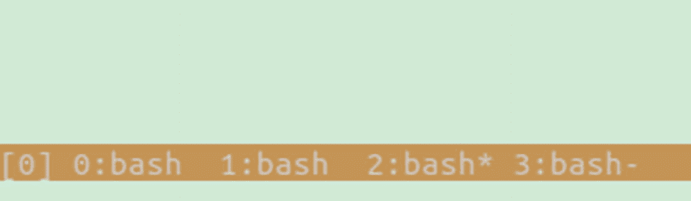

图 15-1

Tmux 状态栏中的窗口列表

要更好地查看窗口与我们的会话的关系，请按下`ctrl+b`，然后按下`w`。这将打开所有会话和窗口的列表；这是在两者之间转换的简单方法。Tmux 会话列表的示例如图 [15-2](#Fig2) 所示。

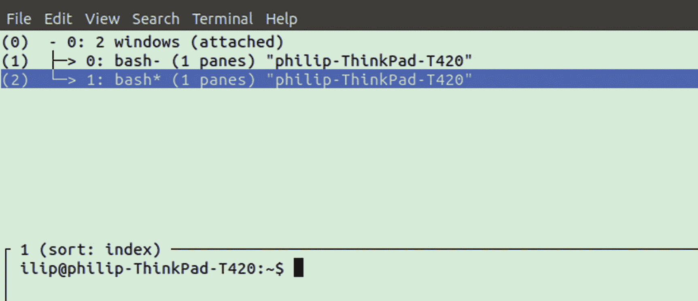

图 15-2

Tmux 中活动会话和窗口的列表

注意这两个窗口是如何作为标签为`0`的会话的子窗口列出的。您可以按上下箭头键在窗口之间移动，并按 enter 键聚焦于一个窗口。为了强调窗口是会话的孩子，让我们通过按下`ctrl+b`然后按下`d`来完全脱离 Tmux。

接下来通过运行`tmux`创建一个新的会话，当会话打开时，创建一个新的窗口，在`ctrl+b`后面跟着`c`。现在，如果我们再次按下`ctrl+b`，然后按下`w`，我们将看到类似图 [15-3](#Fig3) 所示的会话列表。

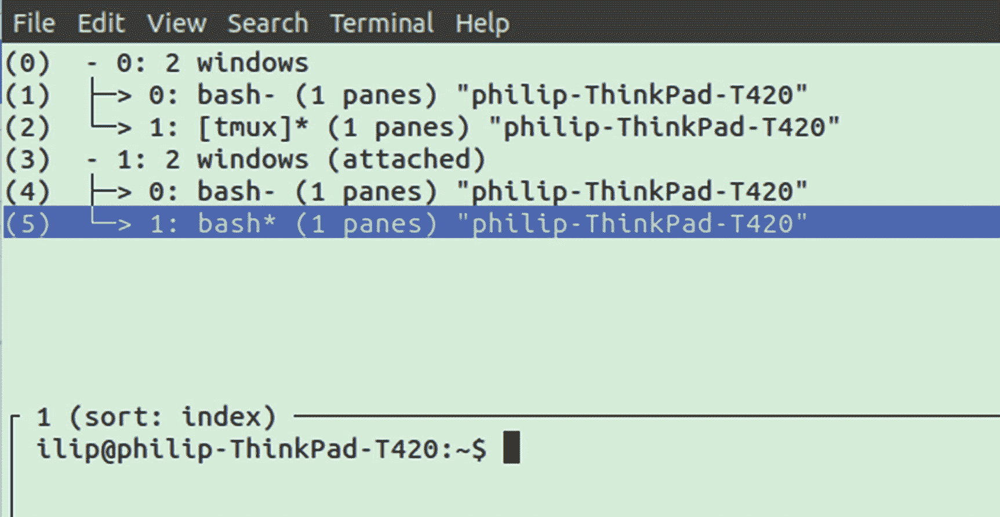

图 15-3

两个会话，每个会话有两个子窗口

我们有两个会话，每个会话都有两个子窗口。让我们进入标有“(4)”的第三个窗口。现在，如果我们想从这里回到“(5)”，我们可以重新打开窗口列表，但一个更短的方法实际上是前面的`ctrl+b`后面跟着`p`。要再次返回“(4)”，您可以按下`ctrl+b`，然后按下`n`进入下一步。或者，如果我们想指定具体的窗口，我们可以用窗口号代替`p`或`n`。

这对于根据窗口的用途对会话中的窗口进行排序非常有用，例如，将 SSH 会话的所有窗口都放在一个会话中。

## 窗格分割

Tmux 还提供了一个强大的辅助功能，允许您将一个窗口分割成单独的部分，称为窗格，每个窗格运行自己的 bash 实例。当需要同时运行多个终端应用或监视多个全屏终端应用时，这非常有用。

要开始，首先确保您打开了一个 Tmux 会话，然后按下`ctrl+b`，再按下`"`。这将水平分割你的窗口。图 [15-4](#Fig4) 显示了一个窗口水平分割的例子。

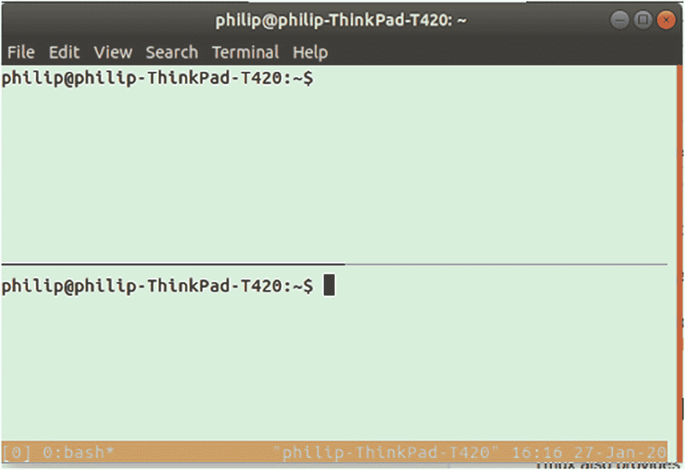

图 15-4

分成两个窗格的 Tmux 窗口

或者，如果您想水平分割会话，请按下`ctrl+b`，然后按下`%`。图 [15-5](#Fig5) 显示了一个垂直分割窗口的例子。

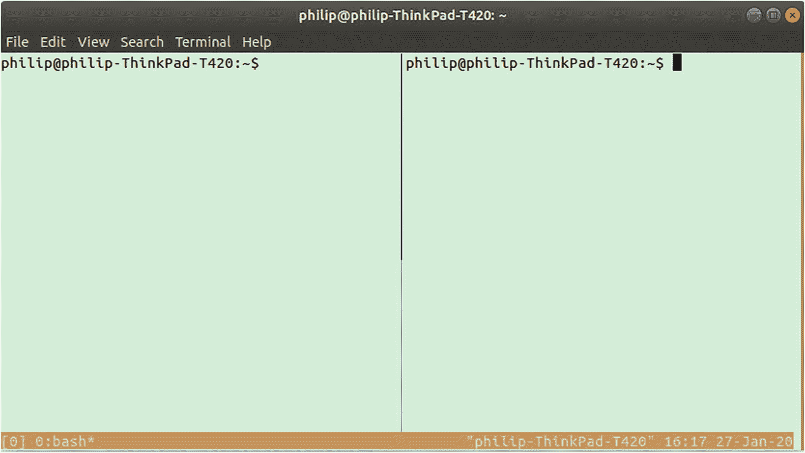

图 15-5

Tmux 中的垂直分割窗口

也可以拆分一个已经拆分的子部分，以便为每个会话创建尽可能多的窗口。为此，只需再次运行水平或垂直分割命令。参见图 [15-6](#Fig6) 中一个窗口分成三个 bash 终端的例子。

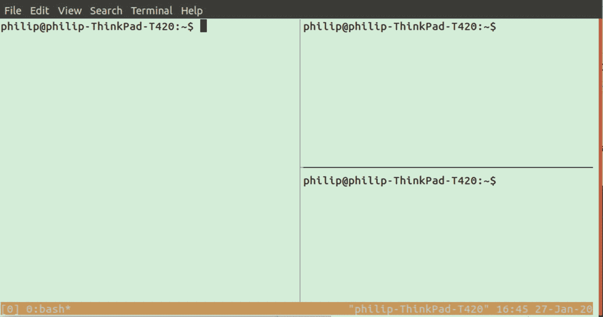

图 15-6

Tmux 中垂直和水平窗格的组合

如果您决定从 Tmux 分离或在窗口和会话之间切换，您的 pane 设置将被保存。

您可以通过按下`ctrl+b`然后按任意箭头键在窗格之间切换。或者，`ctrl+b`后跟`o`将切换到下一个窗格，一旦到达最后一个窗格，循环回到第一个窗格。

## 时钟模式

如果你使用窗口分割来分割你的工作空间，你可能最终想要在一个窗口中显示一个实时时钟。Tmux 提供了一个小的额外功能来简化这个过程。当 Tmux 会话在窗口中激活时，按下`ctrl+b`，然后按下`t`。时钟模式显示的示例如图 [15-7](#Fig7) 所示。

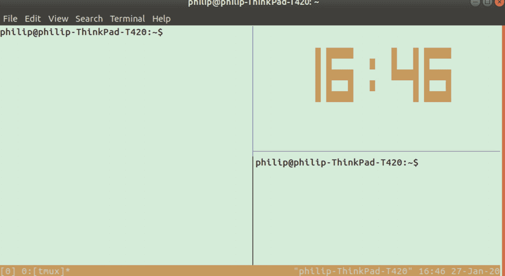

图 15-7

单一窗格中的 Tmux 时钟模式

这将使用您的系统时间打开一个实时时钟。要退出时钟模式，请按`q`或`esc`。

## 帮助页面

Tmux 还带有一个内置的帮助页面，其中包含一个包含每个键盘快捷键的列表；有几个，所以它是多页长。要激活它，请按

```sh
ctrl+b, ?

```

你应该得到一个如图 [15-8](#Fig8) 所示的可滚动页面；可以用`esc`或`q`退出。

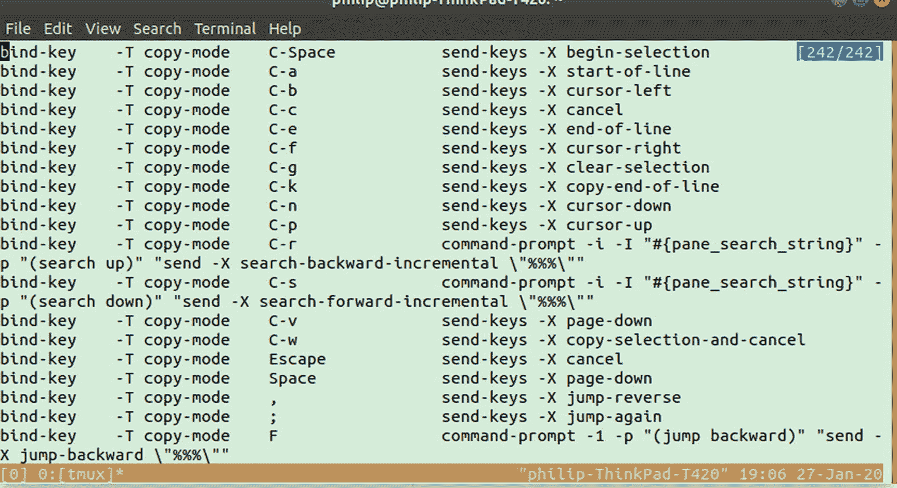

图 15-8

Tmux 帮助页

## 使用. tmux.conf 进行自定义

可以定制 Tmux 来改变用于触发动作的组合键，以及修改外观和布局。Tmux 的所有定制都是通过编辑`~/` `.tmux.conf`完成的；如果您的系统中不存在该文件，只需创建它，tmux 就会使用它。该配置文件可用于创建新的键盘快捷键，以及更改 tmux 的视觉外观。

Tmux 首先在`/etc/tmux.conf`中查找适用于所有用户的全局配置，然后在主目录中查找文件`.tmux.conf`。因此，如果你想在多个用户之间应用设置，你可以使用全局版本。如果你没有一个`~/.tmux.conf`文件，那么从创建一个开始。

```sh
touch ~/.tmux.conf

```

## 配置颜色和样式

类似于在`.bashrc`中改变颜色，我们只能使用尽可能多的颜色。要检查终端上启用了什么颜色，请运行

```sh
​​tput​​ ​​colors

```

如果您得到一个小于 256 的数字，您将希望通过在您的`.bashrc`文件中添加以下内容来启用 256:

```sh
export TERM=xterm-256color

```

可用的 256 种颜色与上一章相同。除了直接使用色标，我们还有常用颜色的关键字，包括*黑色*、*蓝色*、*青色*、*绿色*、*洋红色*、*红色*、*白色*和*黄色*。

例如，如果我们想让终端底部的 Tmux 条变成蓝色，我们可以在`.tmux.conf`中添加以下内容:

```sh
set-option -g status-bg blue

```

这将改变背景颜色为蓝色。如果我们想改变 Tmux 条的文本，我们可以添加

```sh
set-option -g status-fg white

```

这将产生一个类似图 [15-9](#Fig9) 的底部条。

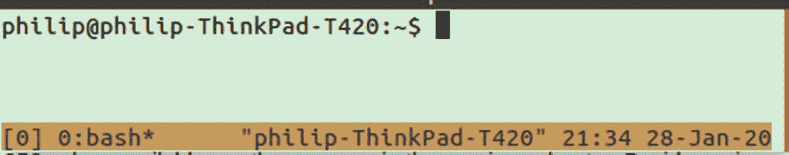

图 15-9

带有修改颜色的 Tmux 状态栏

Note

当更新 tmux 的颜色和样式时，你需要确保在新的样式生效之前所有的 tmux 窗口都已经被终止。如果在后台只打开了一个 tmux 窗口，改变样式，然后打开一个新窗口，旧的值仍然有效。

如果我们想直接使用 256 种颜色代码中的一种，我们可以使用`color`后跟颜色代码，如下所示:

```sh
set-option -g status-bg color14

```

我们还可以改变打开的窗口的颜色，让它显示不同于状态栏其他部分的颜色。

```sh
set-option -g window-status-bg blue
set-option -g window-status-fg black

```

当您将活动窗口名称设置为不同的颜色时，这将变得更加有用:

```sh
set-option -g window-status-current-bg white

```

这创造了窗口真的像标签的感觉，当你在窗口之间切换时，你得到一些视觉反馈。启用该样式的状态栏示例如图 [15-10](#Fig10) 所示。

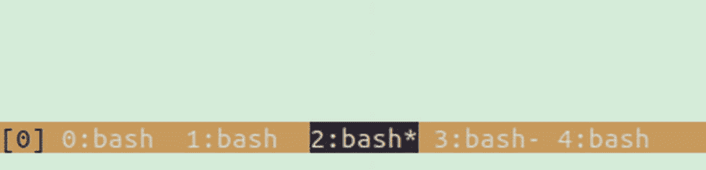

图 15-10

Tmux 状态栏中的当前窗口高亮显示

除了状态栏，您还可以更改窗格边框的颜色。

```sh
set-option -g pane-border-bg green
set-option -g pane-border-fg yellow

```

与 windows 一样，窗格有一个单独的选择器。

```sh
set-option -g pane-active-border-bg blue
set-option -g pane-active-border-fg yellow

```

图 [15-11](#Fig11) 显示了一个应用这些风格的例子。

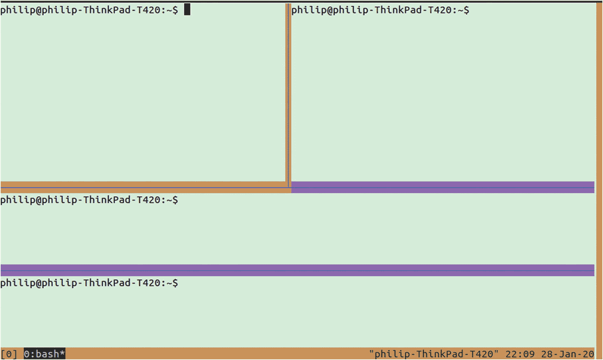

图 15-11

修改了 Tmux 中的窗格边框颜色

## 更改状态栏内容

类似于 bash 中的文本提示可以被改变，Tmux 状态栏中的文本也可以被改变。左侧和右侧由两个不同的变量控制。作为一个例子，让我们使用一些简单的静态文本来更新左右两边。与上一节一样，以下几行可以添加到`.tmux.conf`文件中:

```sh
set -g status-left "Hello"
set -g status-right "World"

```

这将替换默认的左右状态栏文本，如图 [15-12](#Fig12) 所示。

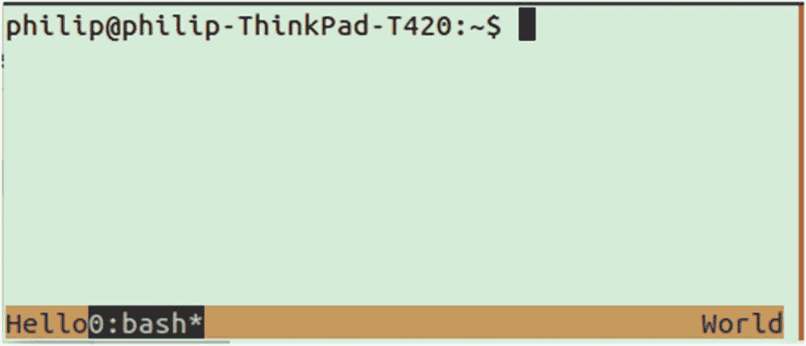

图 15-12

在 Tmux 中修改状态栏文本

当然，在大多数情况下，您需要一些交互方面的信息，比如时间、主机名和打开的窗口数量。像`.bashrc`一样，为这些元素保留特殊代码。状态栏中可使用的代码列表如表 [15-2](#Tab2) 所示。

表 15-2

状态栏代码

<colgroup><col class="tcol1 align-left"> <col class="tcol2 align-left"></colgroup> 
| 

密码

 | 

描述

 |
| --- | --- |
| #我 | 当前窗口的索引 |
| #P | 当前窗格的索引 |
| #S | 会话名称 |
| #T | 当前窗口的标题 |
| ## | 用于文字# |
| #H | 主机名直到第一个 |
| #h | 完整主机名 |
| #(命令) | 运行命令并显示输出的第一行 |
| #[属性] | 通过换行修改文本的颜色或属性 |

因此，如果我们希望主机名后面跟着当前窗口的索引，例如，运行

```sh
set -g status-left "#h #I"

```

如果文本由于空间限制而被截断，您可以使用

```sh
set -g status-left-length 200

```

属性标签可以与其他代码和文本结合使用，以更改文本的颜色，例如:

```sh
set -g status-left "#[bg=red, fg=white]#h #I"

```

## 重新映射命令

如果你发现你经常使用的组合键不舒服，你可以修改它。例如，在切换到 tmux 之前使用 GNU Screen 的人经常发现自己想要使用`ctrl+a`来代替 Tmux 键盘快捷键之前使用的前缀`ctrl+b`。要将前缀命令绑定到`ctrl+a`，应该在配置文件中添加下面一行:

```sh
set -g prefix C-a

```

这将导致`ctrl+a`被用作命令的前缀，如分离、创建新窗口等。默认情况下，您的`ctrl+b`也将仍然连接到前缀命令。如果您想从命令中分离一个组合，您必须手动执行另一个步骤。

```sh
unbind C-b

```

如果您在编辑`.tmux.conf`文件时运行 tmux，您必须手动获取配置才能使其生效。

```sh
tmux source-file ~/.tmux.conf

```

如果您正在使用 Vim，您可能希望添加按键绑定，以便能够使用 h、j、k 和 l 进行导航，每一个都映射到类似于 Vim 中使用的方向。

```sh
# Vim Movement
bind h select-pane -L # left
bind j select-pane -D # down
bind k select-pane -U # up
bind l select-pane -R # right

```

这将允许您使用`ctrl+b`后接`h`来切换到您左侧的窗格以及其他键的相关方向。

## 使用 Tmux 共享屏幕

Tmux 使之成为可能的另一个有趣的用例是屏幕共享终端窗口。如果有两个人使用同一个用户登录到一个服务器或设备，他们都可以完全访问该用户的所有 Tmux 会话。这包括使两个人同时连接到同一个 Tmux 会话的能力，并且当任何一个人与终端交互时，两个人都可以看到实时更新。

这是进行结对编程或与他人一起调试系统的好方法。与其他屏幕共享方法不同，SSH 上的 Tmux 几乎不占用任何带宽，并且它为两个用户提供了交互的能力，而不是简单地让一个人看另一个人。

## 主题公园

与样式化`.bashrc`一样，有些项目专门研究 Tmux 的定制和主题化。其中最受欢迎的是“哦，我的 Tmux ”,它除了提供一个令人愉快的主题外，还增加了一些额外的功能，如电池指示器。图 [15-13](#Fig13) 显示了“哦，我的 Tmux”的默认样式。

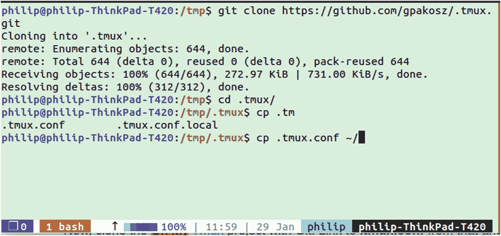

图 15-13

哦，我的主题

“哦，我的 Tmux”增加的另一项功能是键盘指示器，它指示前缀`ctrl+b`何时被按下，Tmux 何时等待命令键。该键盘符号如图 [15-14](#Fig14) 所示；显示时，表示前缀已被按下，Tmux 正在等待 command 键。

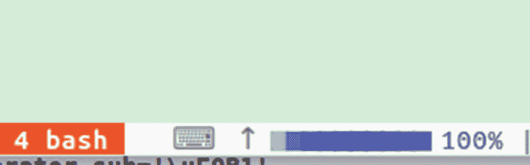

图 15-14

哦，我的 Tmux 前缀按下状态栏中的指标

要安装 Oh My Tmux，只需克隆项目并将`.tmux.conf`和`.tmux.conf.local`移动到您的主文件夹。如果你想保存任何东西，一定要备份你原来的`.tmux.conf`。

```sh
git clone https://github.com/gpakosz/.tmux
cd .tmux
cp .tmux.conf* ~

```

那么您所要做的就是打开和/或重启 Tmux。

除了样式的改变，你还会有一些额外的按键绑定，比如我们手动配置的 Vim 按键绑定——额外的绑定用于创建带有`ctrl+b`后跟`-`的水平窗格或者带有`_`的垂直窗格的窗口。

以及对`ctrl+b`的新绑定，后跟`+`以将窗口内的窗格移动到使用全屏仅显示该窗格的新窗口。有关特性和绑定的完整列表，请参见 Oh My Tmux GitHub 上附带的自述文件。

## Tmuxinator

当您开始使用 Tmux 并通过将窗口分割成窗格来创建自定义工作空间时，您可能会发现您有一些想要经常创建的设置。例如，假设我们想要运行一个被分成`systemctl`、`htop`和`nmon`的窗口，如图 [15-15](#Fig15) 所示。

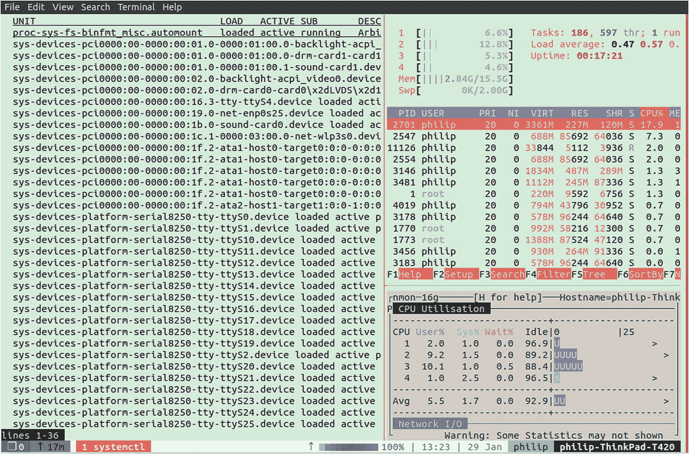

图 15-15

Tmux 中的系统监控工作区

Tmuxinator 是一个 Tmux 启动器，它允许你创建预定义的布局，这样你就可以轻松地打开特定的工作空间，而不需要在每次打开时手动操作。你需要安装 Ruby 编程语言来使用 Tmuxinator。

```sh
sudo apt-get install ruby
gem install tmuxinator

```

Tmuxinator 还需要设置环境变量`EDITOR`；如果你运行`echo $EDITOR`并且它是空的，你需要在你的`.bashrc`文件中设置它。将该值替换为您首选的编辑器:

```sh
export EDITOR="vim"

```

安装了 Tmuxinator 之后，您可以通过运行

```sh
tmuxinator new system-monitor

```

将在您选择的编辑器中打开一个 YAML 文件的模板，包括帮助您使用语法的注释。打开一个有三个窗格的窗口的布局示例如下(它使用了`htop`和`nmon`，因此您需要确保它们已安装或使用其他程序):

```sh
name: system-monitor
root: ~/

windows:
  - monitor:
      layout: main-vertical
      panes:
        - systemctl
        - htop
        - nmon
  - editor: vim

```

Note

当您在 Tmuxinator 中创建新的布局时，请确保删除所有默认情况下存在的样板代码。样板文件中许多注释的下面是一个示例布局，如果不删除或编辑，它将覆盖您的代码。

前面的示例创建了一个名为“monitor”的窗口，其中包含三个列出了程序的窗格，以及第二个运行 Vim 的窗口。Tmuxinator 还提供了其他的配置变量，比如`root`定义了窗口或窗格从哪个目录开始，或者 attach 指定了会话是否应该在创建时打开。

有关功能和选项的完整列表，请参见 Tmuxinator GitHub 页面上的自述文件。

## 摘要

在这一章中，我们研究了在本地和远程处理长时间运行的终端会话时，Tmux 如何改进您的工作流程。除了基础知识之外，我们还看到了 Tmux 如何允许在多个 bash 会话之间分割屏幕，从而为任何目的定制布局。我们使用 tmuxinator 进一步自动化了布局的创建，它允许将布局保存为 YAML 配置文件，并在一个命令中快速打开。

我们还看到 Tmux 有一个类似于 bash 配置文件的配置文件`~/.tmux.conf`,在这里我们可以覆盖任何键绑定并改变 Tmux 的颜色和样式。使用这里描述的技术中的一小部分，就可以显著地改进您的终端工作流程。