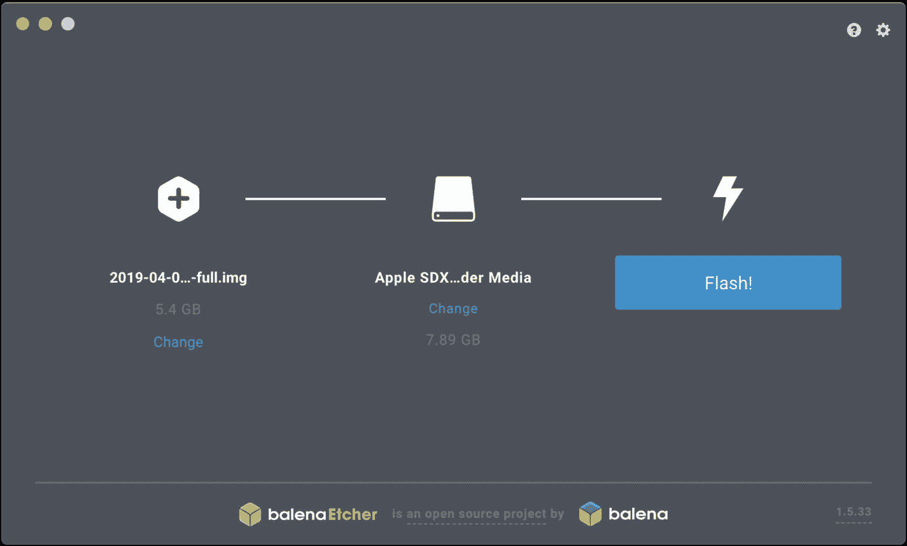
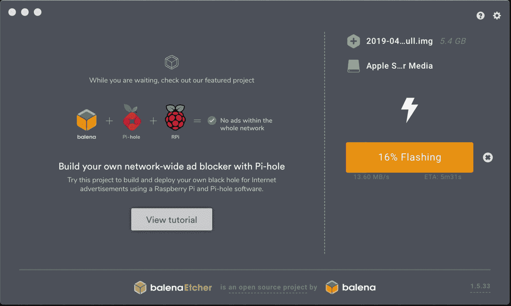
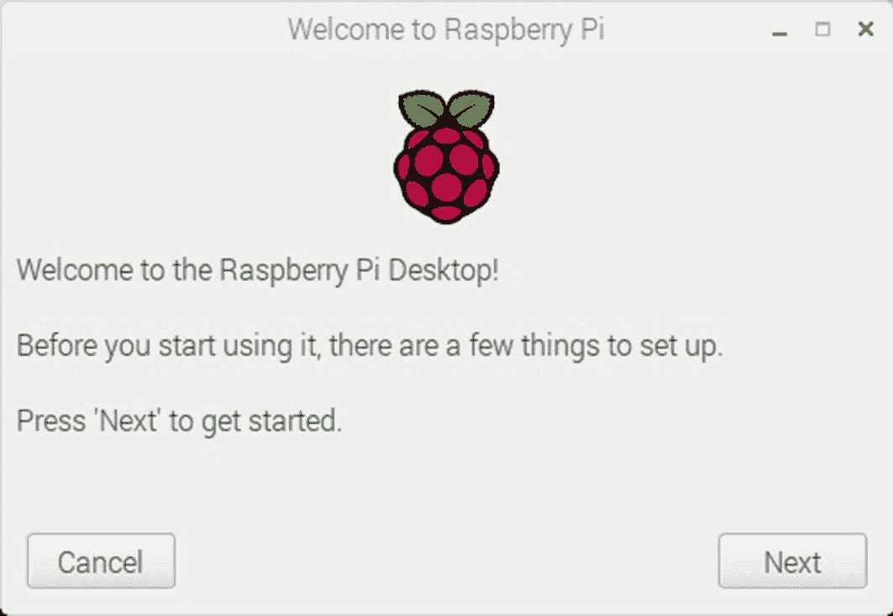
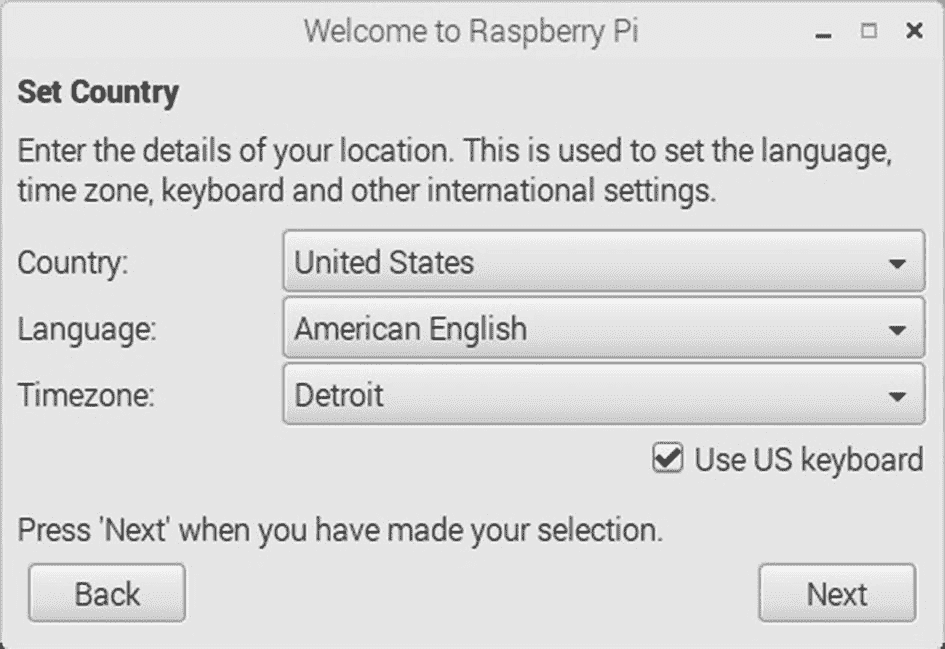
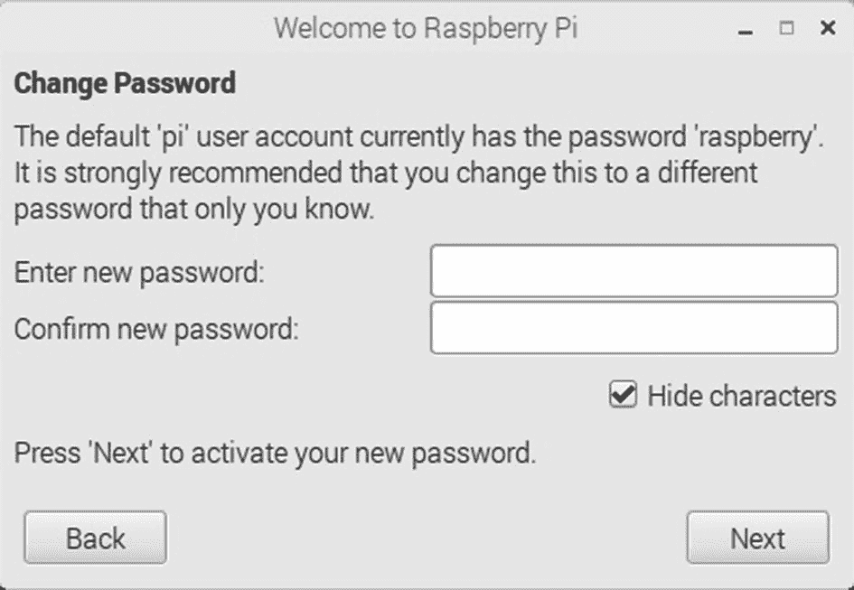
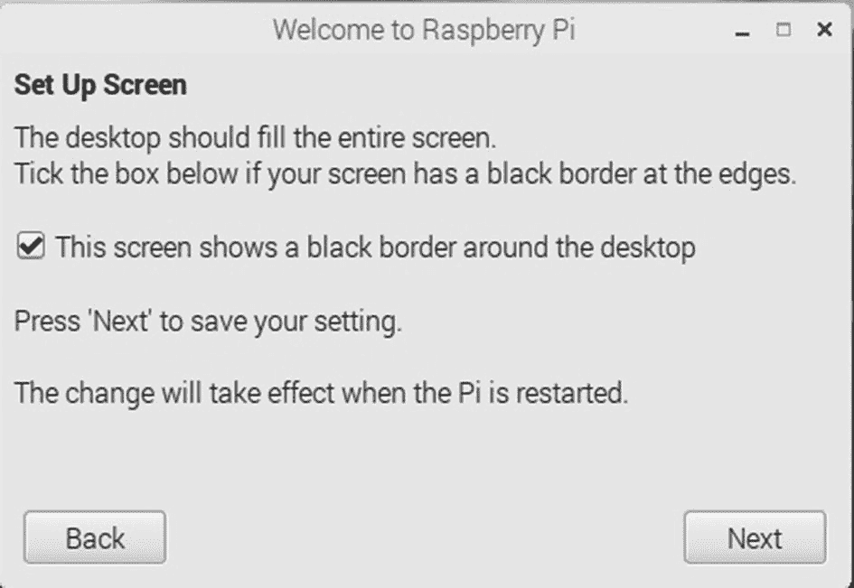
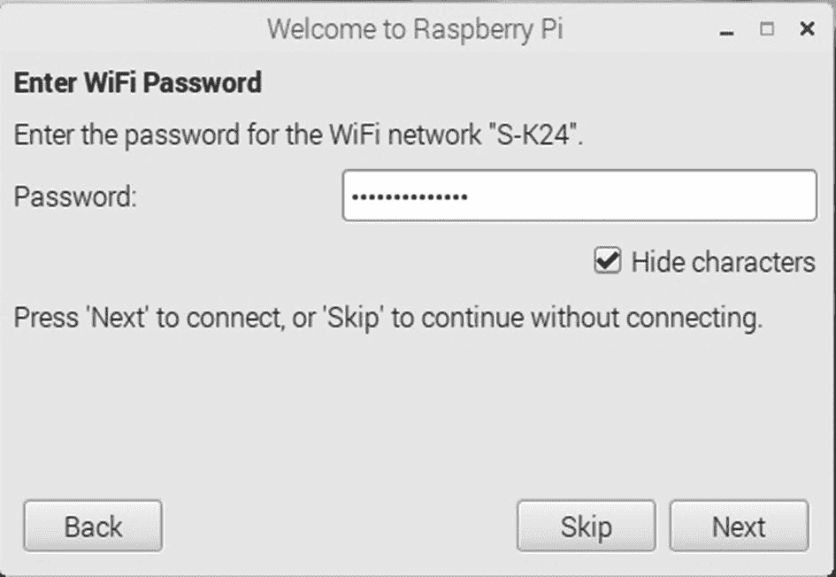
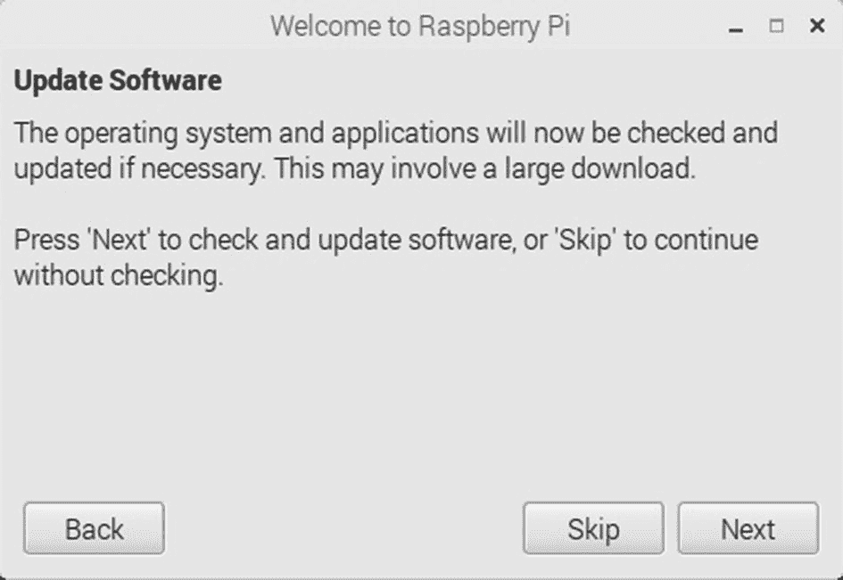
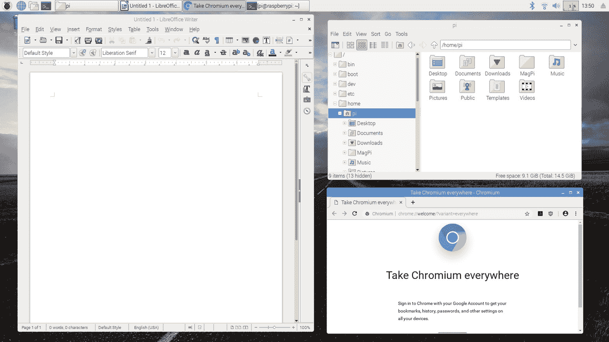

# 一、将 Raspberry Pi 设置为电脑

在这一章中，我们将看看我们项目的硬件方面。我们将讨论硬件和部件的所有选项；然后我们会把所有东西都组装好。该项目的最大部分是安装基本的操作系统，并通过 Raspbian 的初始设置阶段，即 Raspberry Pi 操作系统。

如果你曾经组装过台式电脑，这基本上是相同的过程，但在 Pi 上一切都有所不同。如果你以前从未“制造”过电脑，那么你将会看到有趣的一章；一旦你得到了所有的部分，剩下的就是按照说明去做了。

很明显为什么你需要硬件；没有物理部件就没有计算机。但是为什么我们需要安装操作系统呢？在 Mac 或 Windows 电脑上通常不需要这样做，那么为什么 Pi 需要这样做呢？最简单的理由是*自由*和*选择*。

如果你有一台 Mac 电脑，你将运行 MacOS(以前的 OSX)。如果你有一台消费者风格的个人电脑，它将配备 Windows 10。你不需要安装任何东西；只要把它们插上电源，它们就会工作，但是你没有选择的余地。你通常不会在 Mac 上运行 Windows，也不会在 PC 上运行 MacOS。别无选择。

另一方面，Raspberry Pi 运行的是 Linux 操作系统，而不是 MacOS 或 Windows。Linux 是一个免费的操作系统，由志愿者免费创建和维护。数以百万计的志愿者在不断改进、调试和不知疲倦地工作，这样就有了 MacOS 和 Windows 的替代品。

像任何大型团队一样，当你有那么多开发人员时，很难让每个人都同意什么是最好的，所以有许多不同类型的 Linux。这些不同的味道被称为*分布*。每一个本质上都是一样的，这就是为什么他们是 Linux 但操作系统的许多方面都是可选的，比如桌面是什么样子，设置屏幕如何工作，包括哪些应用，默认的网络浏览器是什么，等等。大约有十几个不同的 Linux 发行版可以在 Raspberry Pi 上运行，我们将只重点介绍其中的一个；但在任何时候，设置和使用不同的版本都很容易，而且令人惊讶的是，这非常有趣——你可能想尝试几个版本，看看哪一个最像你在计算机中想要的。

## 硬件要求和入门注意事项

我说过我们会尽量少来，我不是开玩笑。这里没有任何技巧或隐性成本。没有每月付费的订阅服务，不需要额外的硬件；但是大多数常见的 PC 硬件配件，像硬盘驱动器、闪存驱动器、花式鼠标、键盘和蓝牙设备，都可以随意使用，所以你不必局限于基本的。

这里有一个你可能还没有的东西的快速“购物清单”。所有价格均以美元为单位:

*   Raspberry Pi model 4 系统板(35-55 美元)。

*   5.1V/3.0A DC 输出电源，带微型 USB 插头(8 美元左右)。

*   8GB 以上容量的 Micro SD 卡(6 美元左右)。

*   为 model 4 系统制造的某种 Shell 或箱子。

*   在撰写本文时，CanaKit(和其他来源)提供了一个完整的入门套件，包括 Shell、电源、散热器、SD 卡和 Raspberry Pi 主板，价格为 79.95 美元。

    或者，

*   树莓 Pi 型号 3B+系统板(约 35 美元)

*   带微型 USB 插头的 3.5A 电源(约 7 美元)

*   8GB 或更大容量的微型 SD 卡(约 6 美元)

*   为 3B+系统制作的某种 Shell 或箱子(6 美元及以上)

以下是需要考虑的其他事项:

*   **主板:**对于系统板，你*可以*用比较老的树莓 Pi 型号，不要用 4 或者 3B+，但是我不会推荐。Pi model 2s 要慢得多，而且还需要一个用于 Wi-Fi 和蓝牙的加密狗。Wi-Fi 和蓝牙内置在型号 3 Pi 中。此外，3B+比原来的 3B 更快，网络速度更好。Raspberry Pi Zero 是当前的设备，但处理器能力明显较低，许多桌面应用都需要这种能力。为了获得最大功率，我们需要最新、最强大的 Pi，也就是 model 4，这是合乎逻辑的。如果你愿意，你可以使用 Pi Zero 或者更老的版本，但是同样的应用可能会有难以预料的困难。本书中提到的所有内容都经过了 3B+和 4 型的全面测试。

*   **型号 3B+电源:**取决于你的手机，你为它使用的充电器*可能*在这里工作正常。检查安培数和它使用微型 USB 插头。大部分安卓手机都有这个插头，iPhones 没有。Raspberry Pi 型号 3 的电源要求是 5V 和 2.5A。Pi 型号 2 和一些旧型号可以使用 2A 电源，但型号 3 和 3+对稳定的 2.5a 要求更严格。如果有疑问，请购买经批准的电源。网上有各种型号，价格从 7 美元到 10 美元不等。

*   **型号 4 电源:**较新的型号 4 RPi 板从 USB-C 连接器获取电源，而不是所有以前型号的 micro-USB。它们的功耗通常也比以前的任何系统都高。model 4 需要一个 15.3W 的 USB-C 电源。同样，手机充电器也可以，但为了安全起见，请使用经过认证的电源。

*   **Micro SD 卡:**如果你身边有一张 Micro SD 卡，你几乎可以使用任何一张，但标有“class 10”的是最快的。这基本上是我们的启动硬盘，所以我们可以在这一领域的任何减速带是好的。该卡的“官方”最大容量是 32GB。虽然有报道说一些更大尺寸的卡可以工作，但是没有保证，而且一些更大的卡肯定*不能工作*。我的建议是先买一张 8-16GB 的 10 级卡，这取决于你能得到什么样的交易。稍后，我们将研究如何设置 Pi 从实际的外部硬盘驱动器引导，对于存储大量数据来说，这将是一个更好、更安全的解决方案。在我写这篇文章的时候，一张新的 16GB 的卡售价不到 6 美元，所以如果你已经有了一张慢卡，我建议你花钱买张新的。

*   **案例:**我见过很多人在桌面上放着暴露的板子使用 Pi。很管用，但是我不会推荐。找一个你喜欢的案子。如果您打算长时间使用该系统，您会希望保持主板上没有灰尘和污垢，并且您需要操作计算机来插入电源和各种 USB 电缆。一个好的盒子可以保护所有的东西，让它们看起来更好。有价格低至 6 美元的廉价塑料盒，也有一些价格高达 50 美元的精美手工雕刻木制盒。它们本质上都是一样的，所以便宜就好。有一些高端案例包含了风扇，但是对于我们将要运行的软件来说，这几乎是不必要的。我建议买你能找到的最便宜的箱子，但是不要害怕以后挥霍。如果你对木头很在行，或者如果你有一台 3D 打印机，你甚至可以自己制作！此外，请记住，model 4 的端口布局与任何旧型号完全不同，因此为 model 3 制作的案例*不适用于 model 4*。

这里有一些你可能已经需要的东西:

*   键盘

*   老鼠

*   班长

*   用于将 Pi 连接到显示器的 HDMI 电缆

随着 2019 年 6 月树莓 Pi model 4 的推出，树莓 Pi 基金会也为 Pi 推出了官方键盘和鼠标。这些都是吸引人的颜色协调，以配合官方的 Pi 案件，键盘上有一个“树莓按钮”在通常的“系统键位置”，但除此之外，他们不是必需的。您可以使用任何 USB 鼠标或键盘，它们可以通过 USB 有线连接，也可以通过蓝牙连接。除此之外，您可以使用与旧电脑相同的键盘和鼠标。

任何标准的显示器都可以工作，但你需要一根带微型 HDMI 插头的电缆来连接你的 model 4 Pi，或者一个全尺寸 HDMI 端口来插入任何以前的型号。如果您使用的是 Raspberry Pi model 4，您还可以选择同时使用两个显示器。显然，你需要两个显示器和两根*微型 HDMI* 电缆来利用双显示器功能。

## 创建初始引导介质

最初，我们需要下载操作系统软件并将其安装在 SD 卡上。这将需要一台运行 Windows、Mac 或 Linux 的独立计算机。如果你真的做不到，有很多地方会卖给你一个已经安装了软件的 SD 卡；一个简单的谷歌搜索将在你的国家找到一个来源。

你将需要一个微型 SD 卡和适配器，以便将该卡插入电脑的任何插槽中。

有许多 Linux 发行版或“品牌”很容易获得。最受欢迎的两个是 Raspbian 和 Ubuntu MATE。这两者的侧重点不同:Raspbian 是 Raspberry Pi 的“官方”操作系统，而 Ubuntu MATE 是一个更重的面向桌面的操作系统。Raspbian 速度更快，效率更高，而 MATE 更容易使用，包含更多内置软件，但也更慢。

截至本文撰写时，Ubuntu MATE 的当前版本是 18.04，于 2018 年 4 月发布。这听起来很“老”，但是 Ubuntu 有一个更新系统，他们提供了一个叫做 LTS 的东西，或者说是他们操作系统的“长期支持”版本。他们保证支持 LTS 版本长达 4 年。这样做的缺点是他们每两年才发布一个新版本。所以直到 2020 年 4 月才会有新的 LTS 版本。Ubuntu 确实每 6 个月提供一次常规操作系统的升级，但他们不会为 Raspberry Pi 版本提供升级。所以我们都暂时卡在 2018 年了。

Ubuntu MATE 可以在 [`https://ubuntu-mate.org/download/`](https://ubuntu-mate.org/download/) 找到。

另一方面，Raspbian 在积累了足够多的变化时会不定期地发布。截至本文撰写时的最新版本名为“Buster”(2019 年 6 月)。如果你想要最先进的，最“官方”版本的树莓派操作系统，这是一个使用。

在本书中，我将主要关注 Raspbian，但我也会偶尔指出一些可以在 MATE 中以不同方式完成的事情。Raspberry Pi 的一个伟大之处在于，只需购买第二张 SD 卡，你就可以非常快速地来回切换。为什么不两个都试试？

拉斯边可以在 [`www.raspberrypi.org/downloads/raspbian/`](http://www.raspberrypi.org/downloads/raspbian/) 找到。

我们需要的下一个软件是一个特殊的实用程序，用于将操作系统复制到 SD 卡上并使其可引导。我发现最简单的应用是 balenaEtcher，通常简称为 Etcher。有一个版本适用于 Windows、Mac 和 Linux 所以不管你从哪里来，他们都会为你制作一个版本。

balenaEtcher 可以在 [`www.balena.io/etcher/`](https://www.balena.io/etcher/) 找到。

### 注意

也可以从 MacOS 或 Linux 的命令行创建 SD 卡映像，但这很复杂，从 Windows 根本不可能。为了最大限度的兼容性和简单性，我将坚持使用 Etcher。如果你需要从命令行来做，官方文档可以在这里找到: [`www.raspberrypi.org/documentation/installation/installing-img/README.md`](https://www.raspberrypi.org/documentation/installation/installing-img/README.md) 。

一旦具备上述要素，创建可引导 SD 卡的过程就很简单。下载一个操作系统文件，Ubuntu MATE 或者 Raspbian。无论你选择哪个，你最终都会下载一个大文件。

一旦完成，启动蚀刻机，它应该看起来像图 [1-1](#Fig1) 。

图 1-1

选择源文件和目标驱动器的 balenaEtcher

有三个按钮/图标。点按左边的按钮，它将允许您选取一个磁盘映像。这是你刚下载完的 Raspbian 或者 Ubuntu MATE 文件。

将 SD 卡插入计算机。您可能需要使用适配器、加密狗或集线器来使其适合。一旦电脑识别出该卡，单击中间的图标选择该卡。绝对确保不要选择错误的磁盘，因为如果你不小心，你可以删除您的计算机的硬盘驱动器！

选择完操作系统文件和目标驱动器后，单击第三个图标“闪存！”这将开始格式化 SD 卡并将操作系统复制到 SD 卡上的过程。根据各种因素，此过程可能需要 5-10 分钟，如图 [1-2](#Fig2) 所示。

图 1-2

蚀刻机林荫道通过泛水

一旦这个过程完成，Etcher 会告诉你它已经成功地刷新了卡，否则它会给你一个错误信息。如果有错误，遵循 Etcher 的建议并找出原因。假设它工作了，你可以弹出卡，并着手组装你的 Pi。

## 组装电脑

以下列表概述了必需和可选的组件零件:

*   **所需零件**
    *   Raspberry Pi 主板

    *   电源

    *   安装了操作系统的微型 SD 卡(见上一节)

    *   老鼠

    *   键盘

    *   班长

    *   监视器电缆

*   **可选零件**
    *   主板 Shell

    *   带有 3.5 毫米插孔或蓝牙功能的音频收听设备(耳机、耳塞或扬声器，或者直接插入显示器的输入端)

    *   如果您不使用 Wi-Fi，请将以太网电缆插入路由器

### 组装说明

假设你已经购买或搜罗了所有必要的部件，将 Raspberry Pi 组装成一台台式电脑是非常容易的，因为所有电缆的走向应该是显而易见的。

1.  将您的 Raspberry Pi 主板插入您选择的机箱，并使用机箱附带的任何说明进行组装。如果您的机箱带有某种形式的散热器，请注意不要在处理器顶部或散热器底部留下指纹。

2.  将微型 SD 卡滑入 Raspberry Pi 底部的插槽中。

3.  将 HDMI 电缆插入显示器和 RPi。

4.  将音频线插入扬声器、耳机或显示器。

5.  将鼠标和键盘插入四个 USB 端口中的任何一个。如果你有其他 USB 设备，我建议你现在只使用鼠标和键盘；工作正常后，添加其他外围设备。在这个阶段使用蓝牙鼠标或键盘*可能*没问题，因为这些*应该在启动时*被检测到。在极少数情况下，可能需要有线键盘或鼠标来配置设置。

6.  如果您不打算使用 Wi-Fi，请插入以太网电缆。如果你真的打算使用 Wi-Fi，那么这是没有必要的。

7.  将显示器插入墙上的电源插座。

8.  将 Raspberry Pi 电源适配器插入墙壁插座。

9.  完成所有工作后，最后一步是将电源插入 Pi。Raspberry Pi 本身没有电源开关，因此通电将启动引导过程。如果你的电源*带有开关或按钮，那么现在就打开它。*

此时，你的监视器将显示一个彩色的“测试模式；然后清空屏幕，在屏幕顶部显示一些树莓图标。在这之后，一堆状态信息和文本可能会在屏幕上滚动。

### 首次 Raspbian 设置

如前所述，从现在开始，我们将重点关注 Raspbian 分布。Ubuntu MATE 将非常相似，但不完全相同，如这里所示。

假设您已经通过了测试模式和“raspberries”，您将到达 Raspbian 欢迎屏幕，如图 [1-3](#Fig3) 所示。

图 1-3

拉斯边的欢迎屏幕

点击“下一步”，我们将得到一个本地化的屏幕，看起来很像图 [1-4](#Fig4) 。

图 1-4

本地化设置

使用下拉框尽可能准确地选择您的位置。这是用来设置时间和决定键盘上各种键的功能。我曾经有一个朋友抱怨说，Raspbian 不能使用他的任何键盘，因为标点符号键都是错的。原来，他把下面的对话设置为英国键盘，而他在美国。不全一样！

现在该修改默认用户的密码了，如图 [1-5](#Fig5) 所示。如果你不在这里修改它，默认的是用户“ **pi** ”，这个用户的密码是“ **raspberry** ”因为这是每个默认 Raspbian 安装的相同用户名和密码，所以修改密码是一个非常好的主意。这个用户拥有超级用户权限，可以删除和修改任何东西，所以密码要让人难以猜到。

图 1-5

设置 root 密码

稍后，我们将研究如何创建一个单独的、更加个性化的用户帐户。如果您有 Linux 经验，Pi 用户是一个根级别的帐户，所以在日常工作中使用这个帐户并不是一个好主意。

下一个屏幕如图 [1-6](#Fig6) 所示，与您的显示器和屏幕分辨率有关。到目前为止，屏幕都是低分辨率的，非常简单，因为所有东西都是尽可能低的分辨率。如果 Raspbian 桌面当前充满了你的整个屏幕，那么不要勾选这个框。如果边缘有黑色条或边框，那么单击该框，Raspbian 会相应地调整您的设置。请注意，在安装完成和系统重新启动之前，您不会看到任何事情发生。

图 1-6

你需要调整屏幕分辨率吗？

现在，在图 [1-7](#Fig7) 中，是时候设置你的 Wi-Fi 网络了。如果您打算将以太网用于您的网络，您可以点按“跳过”否则，在这里找到你的网络。请注意，Pi 型号 3B+具有 2.4GHz 和 5.0GHz 两种能力，而常规的非 plus 型号 3B 和所有旧型号只能访问 2.4GHz 网络。单击您要连接的网络，然后在以下屏幕上输入该网络的密码:

图 1-7

设置 Wi-Fi 密码

在这之后，我们基本上完成了安装。下一个也是最后一个屏幕，类似于图 [1-8](#Fig8) ，将让我们有机会下载 SD 卡上没有发布的软件的更新和补丁。如果你很急，你*可以*跳过这一步，但是拥有一个完全更新的系统总是最好的。

图 1-8

开始更新吧！

如果你选择让它来更新，你最终会得到一个对话框告诉你你的“系统是最新的。”此时，您需要重新启动系统，一切都应该准备好了。

在这个阶段探索菜单和试用几个应用是安全的。图 [1-9](#Fig9) 显示了 LibreOffice Writer、文件管理器应用和 Chromium 浏览器的截图，它们都已经安装好了。你能在菜单上找到它们吗？

### 暗示

左上角的树莓图标实际上是 Raspbian 版本的菜单系统“开始”按钮。

图 1-9

默认情况下会安装 LibreOffice、文件浏览器和 Chromium

## 结论

这一章为这本书的其余部分奠定了基础。我们购买并组装了所有部件，然后下载并创建了引导介质。然后我们浏览了设置菜单，最终得到了一台基本但仍能正常工作的小电脑。你可以随意在菜单里摸索，运行应用，看看它能做什么。如果你的需求很简单，比如只是浏览网页和收发电子邮件，你可能已经在电脑中拥有了你所需要的一切。更有可能的是，你需要安装一堆应用来做你想用 RPi 做的事情。如果你想把你的 Raspberry Pi 作为一台普通的台式电脑使用，那么你就可以开始了。尽管如此，除了坐在显示器前，还有其他方法可以使用电脑，我们将在下一章看到。