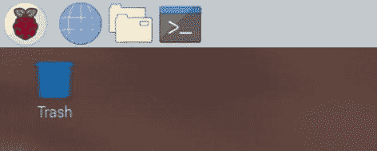
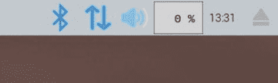
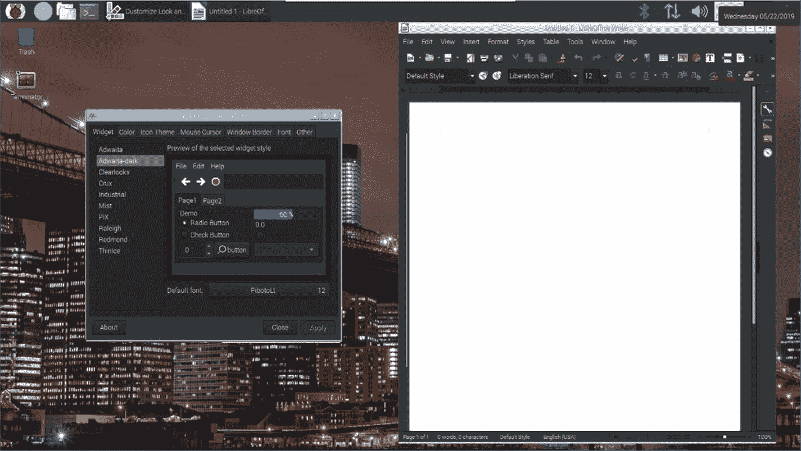
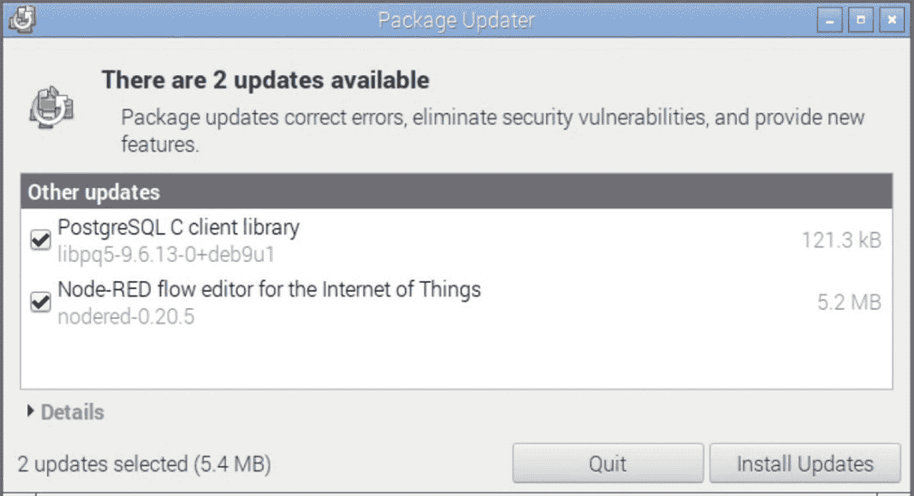
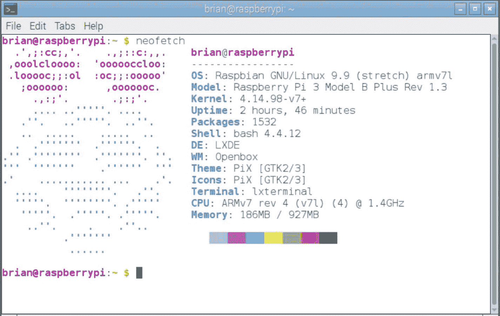
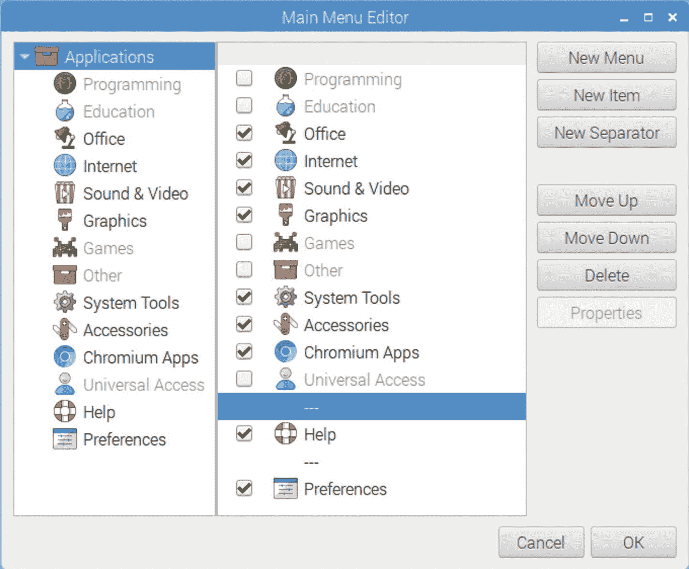
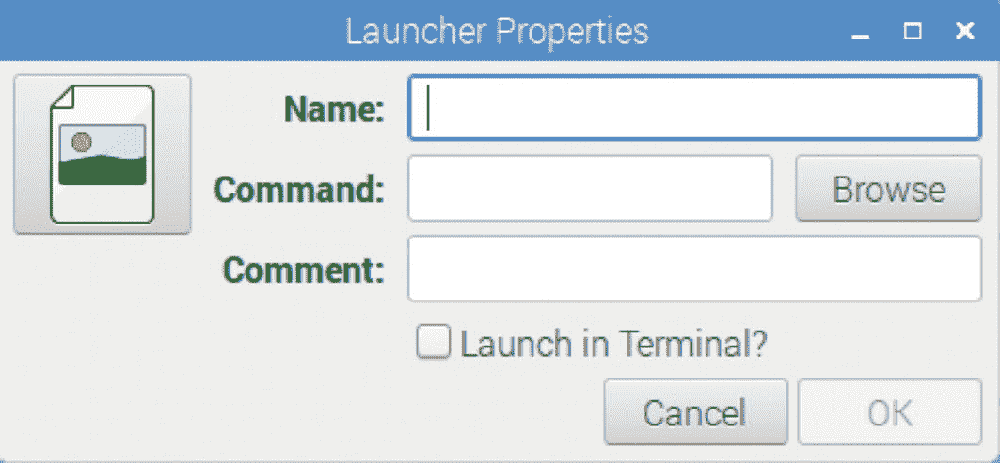
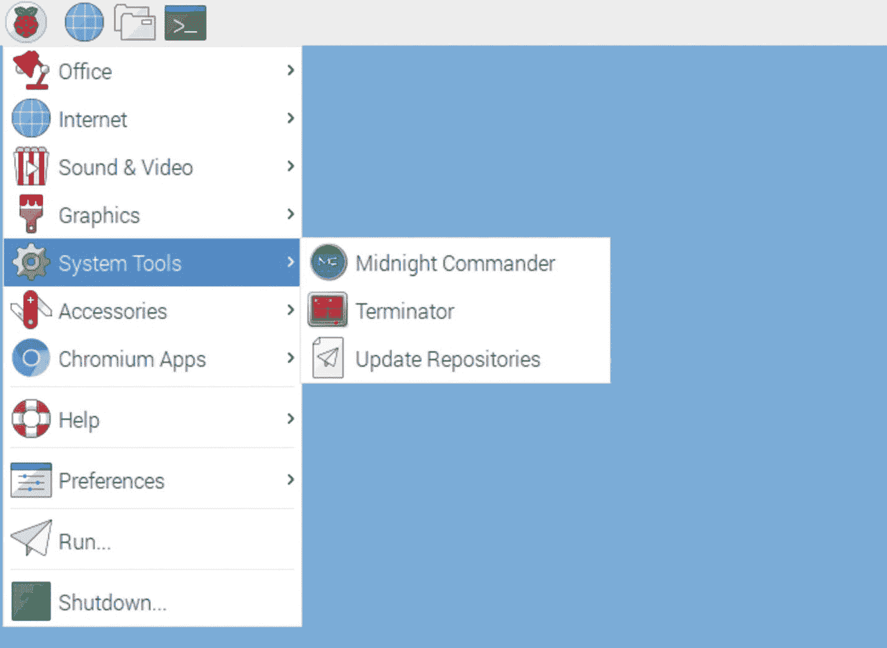

# 3.Raspberry Pi 桌面工具

你的基于 Raspberry Pi 的计算机现在已经组装好了，可以工作了。现在怎么办？是时候学习如何使用基本的用户界面了。如果你曾经使用过 Windows 或 Mac，你已经知道鼠标和键盘是如何工作的，但 Raspbian 中的菜单和控件略有不同。我们还将花一些时间解释安装软件和应用程序的几种不同方式，这与其他操作系统有很大不同，因此您绝对需要在这里做一些笔记。

## 使用界面

现在我们已经设置好了所有的硬件，是时候看看软件了。一旦你完成了所有的系统设置屏幕，你会看到一个空白的桌面环境，如图 [3-1](#Fig1) 所示。


图 3-1

拉斯边桌面

有几个重要部分需要注意。屏幕上方是菜单栏，左右各有一组图标。树莓旁边的三个图标(见图 [3-2](#Fig2) )分别是 Chromium 网络浏览器(地球仪图标)、文件管理器(文件夹图标)和终端(命令提示符图标)。如果你不记得这些是什么，你可以将鼠标悬停在它们上面，小的“工具提示”就会出现。



图 3-2

左上角的图标区域

树莓图标下方是垃圾桶图标，如果您插入了外部硬盘，这里应该会出现一个或多个硬盘图标。

在屏幕的右上角，如图 [3-3](#Fig3) 所示，是硬件控制器按钮。



图 3-3

右上角的图标区域

这些按钮允许您控制蓝牙(蓝牙标志)、Wi-Fi 和以太网(上/下箭头)以及音量(扬声器图标)。

旁边是一个简单的仪表，显示 CPU 容量的使用量(百分比)，后面是一个时钟/日历，最后您会发现一个“弹出按钮图标”，您可以使用它来弹出介质，如闪存驱动器和其他可移动介质。

点击左上方的树莓图标可以查看已安装应用的列表。旁边有箭头的菜单选项有子菜单，您可以浏览。例如，单击树莓图标，然后向下移动鼠标，并将鼠标悬停在“首选项”的选项上；你会得到一个涉及定制界面的应用列表，如图 [3-4](#Fig4) 所示。


图 3-4

首选项菜单选项

列表中的最后一项“主题和外观设置”值得仔细查看。该屏幕允许一些非常精细的界面选项。你可以改变桌面的字体，图标的样式，甚至所有对话框的外观。例如，如果你在“Widgets”选项卡下选择“Adwaita-dark”主题，你就有效地将桌面置于黑暗模式，如图 [3-5](#Fig5) 所示。



图 3-5

ad waita-窗口小部件的深色主题

在首选项➤桌面首选项下，您可以更改菜单栏的颜色；在“桌面”标签下，你可以改变背景图片，或者如果你不想要背景照片，你可以选择一个简单的单色背景。

总的来说，你会发现在 Raspbian 桌面上工作很像在 Windows 或 Mac 上工作。右键单击鼠标或双指触控板通常会弹出某种上下文菜单，可以在桌面上拖动项目，剪切和粘贴选项的工作方式与在其他系统上一样。

## 关闭系统

对于大多数现代操作系统，在关闭计算机之前，您必须经历一个“关机过程”，Pi 也不例外。当您准备关闭(或重启)您的 Raspberry Pi 时，您可以从桌面或命令行执行此操作。

在 GUI 中，单击树莓图标，下拉菜单上的最后一项是“关闭”您将看到一个对话框，其中有三个选项:关机、重启和取消。

从命令行，您可以简单地输入

```sh
sudo shutdown

```

或者

```sh
sudo reboot

```

## 文件管理器

一个需要讨论的系统应用是文件管理器。点击菜单栏上的文件夹图标即可启动该应用程序。这将打开一个看起来非常像 Windows 的文件浏览器或 Mac 的 Finder 的应用程序。见图 [3-6](#Fig6) 。


图 3-6

文件管理应用程序

系统文件结构显示在左窗格中，而各种文件夹和文件显示在右窗格中。顶部是菜单栏。在“文件结构”窗格中，您可以通过单击文件夹图标旁边的加号或减号或双击它们来展开或折叠文件夹。

请记住，如果您来自 Windows 背景，Linux 文件结构与您可能习惯的非常不同。你对自己的用户账号文件夹(图 [3-6](#Fig6) 截图中称之为“brian”)内的大部分文件拥有完全的删除、复制、操作权限(Linux 中称之为权限)；但是你不能改变目录之外的东西，除非你使用`sudo`命令。运行`sudo`命令的唯一方法是从命令行键入它。这可能看起来很烦人，但是这是一个在几十年的 Unix 使用中经过时间考验的安全特性。

## 安装应用程序

Raspbian 已经安装了很多很棒的应用程序；有一个办公应用程序、一个网络浏览器、一个媒体播放器和许多其他有用的东西。如果你还没有，现在将是一个伟大的时间来浏览菜单，看看都有什么。尽管如此，Raspbian 的人显然不能包含所有的东西，因为 Raspbian 本质上只是 Linux 的一个版本，而且有大量的应用程序可以用于此。偶尔，您会听到一些 Raspbian 中没有的好东西，您想尝试一下。

在 Raspbian 上安装软件有三种主要方式:从源代码编译，从 Ubuntu 库下载，或者从命令行安装。

### 从源代码构建应用程序

这是最难的方法，除非你知道自己在做什么，否则我不会走这条路，除非你想要的软件有非常明确的构建应用程序的说明。大多数 Raspbian 应用程序都是开源软件，这意味着你可以下载并阅读制作该软件的编程代码。

一些仍在开发中的应用程序只提供这种源代码，代码必须经过编译才能运行。可用的库、工具和语言涉及许多变量；所以，除非你真的必须构建应用程序，否则就寻找一种更简单的方法。

### 从添加/删除软件工具安装应用程序

知道从源代码构建软件有多难，组装 Raspbian 的人创建了一个应用程序，它可以索引和列出数百个随时可用的应用程序和工具，就像 Raspbian 版本的其他操作系统的应用程序商店一样。这个应用程序可以在拉斯扁➤偏好➤添加/删除软件下找到，可以在图 [3-7](#Fig7) 中看到。


图 3-7

添加/删除软件工具

您可以在左侧面板中浏览类别，然后在右侧面板中滚动浏览应用程序列表。如果您知道要安装的特定名称，请在搜索框中键入它。如果您找到想要尝试的应用程序，请选择它并单击*确定*。过了一会儿，应用程序应该已经下载并安装好了。安装应用程序后，它会出现在此列表中，旁边会有一个勾号。如果您取消选中该框并单击“*应用*，它将被卸载。放轻松！

更好的是，该工具允许您轻松查找并安装已安装应用程序的更新和补丁。单击添加/删除软件应用程序上的选项菜单。第一个选项是“检查更新”点击它，你会看到类似图 [3-8](#Fig8) 的东西。



图 3-8

可用更新窗口

很明显，我有两个应用程序需要更新。点按“安装更新”，他们将为您下载并安装更新。

这种方法有两个问题。首先，没有太多关于每样东西是什么的描述，所以除非你心里有一个特定的应用程序或工具，否则你可能永远也找不到它。第二，这个工具不能远程工作。您可以在 VNC 运行添加/删除软件工具，但是软件*不会*安装。这可能是一个安全特性，也可能是一个错误，但它*不会*工作。

### 从命令行安装应用程序

我们刚刚描述的添加/删除软件工具确实很容易使用，但你可能很快就会发现，应用程序的选择仍然有些有限。那里有很多好东西，我强烈建议浏览和探索这些应用程序，但是还有大量非常强大的应用程序没有包括在这个列表中。我发现命令行是安装我想要的任何东西的最简单的方法。这一点也不复杂，但是有一个要求是你必须事先知道你想要的包的名字。这需要一些阅读或互联网研究，但是一旦你知道你想要什么，就很容易得到。

首先，启动一个终端窗口。然后，键入以下几行:

```sh
sudo apt update
sudo apt install packagename

```

第一行更新所有的*存储库*。这些在线存储库索引了所有可用的应用程序和工具，以及保存它们的安装文件的互联网位置。它们随着新版本和新工具的加入而不断变化，所以我总是先运行这个更新命令，只是为了确保找到最新的版本。

在第二行中， *sudo* 再次是赋予您超级用户权限的命令，这是安装软件所必需的。 *Apt* 是*高级打包工具*的简称，是做安装的 app。 *Install* 是我们特别希望 apt 程序做的事情， *packagename* 应该替换为我们要安装的包的名称。

例如，如果你听说过一个叫做 *Neofetch* 的应用，你可以直接输入

```sh
sudo apt install neofetch

```

来安装它。如果您后来决定不再需要 Neofetch，可以用类似的方法删除它:

```sh
sudo apt remove neofetch

```

现在试试吧。 *Neofetch* 默认不安装在你的 Pi 上，我们来安装吧。键入前面的命令来更新存储库，然后安装应用程序。完成后，在命令行上键入命令`neofetch`。您应该会看到与图 [3-9](#Fig9) 非常相似的东西。



图 3-9

我们刚刚安装了 Neofetch 应用程序

Neofetch 是一个不错的小命令行应用程序，它打印出 Raspbian 徽标的文本图形表示，并报告关于我们这台小机器的一些技术资料。不是超级有用，但是我们安装之前就没有了！

你应该时常更新你所有的软件。在像 Windows 这样的系统上，如此频繁地出现如此多的更新，很快就变成了一个大麻烦，但是在 Linux 上就不同了。Linux 系统不会自动执行升级；你必须自己去做，但至少你可以在*你准备好的时候去做。这可以通过两个命令来完成:*

```sh
sudo apt update
sudo apt upgrade

```

同样，第一行载入一个新的存储库列表，然后第二行升级所有有可用更新的内容。

同样，这个过程的增强版本允许您将 ***整个操作系统*** 升级到最新版本的 Raspbian Linux:

```sh
sudo apt update
sudo apt dist-upgrade

```

但是请注意，您可能已经有了 Raspbian 的最新完整发行版——它可能一年只更新一次或两次，所以大多数时候这不会有任何作用。

请注意，还有其他从命令行安装软件的方法。我们之前看过`apt`(**A**advanced**P**package**T**ool)，但是也有偶尔使用的`pip`(**P**package**I**installer for**P**ython)和`curl`(**C**opy from**URL**)。使用哪一个取决于各种因素:`pip`用于安装 Python 脚本，`curl`用于直接通过互联网下载安装。绝大多数应用程序都是使用`apt`安装的，但也要留意偶尔需要其他应用程序的应用程序。当然，我会给出我们在这里看到的每个应用程序的安装命令。

好了，现在我们可以使用`apt`以任何方式搜索、安装、删除和更新软件了。现在是时候完成一些工作了！

### 清理拉斯边菜单

Raspbian 安装了许多最常见的应用程序和工具，Raspberry Pi 基金会认为人们最有可能使用它们。绝大多数购买 Pi 的人都是为了做电子项目和实验。这意味着 Pi 上有许多科学、电子、编程和接口应用程序；我们根本不希望这些东西出现在我们的“完成工作”桌面上。我们可以检查并卸载所有我们不想要的东西，但在某些情况下，这些应用程序包括可能被其他应用程序使用的文件和库，我们不想因为删除错误的内容而导致问题。因此，与其卸载它们，我们可以简单地从菜单中删除它们。菜单编辑器可以在树莓➤首选项➤主菜单编辑器下找到。

使用这个工具并不复杂；只需在左侧窗格中选择一个菜单，然后在右侧“取消选中”您想要删除的应用程序。如果你发现你删除了一些重要的东西，只需返回并再次检查这个框——没有什么是真正删除的，尽管你可以选择删除它们。你也可以删除整个菜单，比如“编程”和“教育”，就像我在图 [3-10](#Fig10) 中的截图一样。您也可以将单个应用程序在列表中上移或下移，添加分隔线，或者将它们移到不同的菜单，如果您愿意的话。如图 [3-10](#Fig10) 所示，这是一个非常简单、灵活的系统，可以根据您的规格进行配置。



图 3-10

主菜单编辑器—移除未使用的项目

顺便说一句，浏览所有的菜单并看看有什么是个好主意。您的系统上已经安装了许多应用程序，但是它们的菜单项在默认情况下已经是灰色的。如果你想尝试这些应用程序，只需打开它们并进行探索。

正如我们所见，`sudo apt install appname`不仅会安装一个新的应用程序，而且通常还会为该应用程序创建一个菜单项。这不是你可以一直假设的事情，有时，你可能会安装一个应用程序，但在菜单中找不到它。为了创建一个菜单项，打开主菜单编辑器并点击“新建项目”，你会看到一个类似图 [3-11](#Fig11) 的小对话框。



图 3-11

添加新菜单项

这允许我们为字面上的*任何东西*创建菜单项。在*名称*字段和可选的*评论*字段中输入一些文本。这两个都可以说任何你喜欢的话。在*命令*字段中，您有两种选择:您可以在*中输入与在命令行上启动应用程序时完全相同的文本，或者您可以单击按钮并浏览到应用程序在文件系统中的位置。还有一个复选框，可让您在终端窗口中运行命令。如果您正在运行某种 GUI 应用程序，那么您不需要终端，但是如果您想要运行命令行应用程序，那么在终端中启动它允许它是交互式的。此外，如果您有想要分配给此菜单项的图标图像，您可以单击通用图标图片并选择一个新图标。*

让我们用一个普通的命令行操作来制作一个菜单项。对于我们的例子，我们知道`sudo apt update`是更新软件库的命令。在安装任何东西之前这样做是很常见的，这样你就可以确保你得到的是软件的最新版本。尽管如此，你不需要每次都这样输入；你可以把它做成一个菜单项。

为此，您需要键入

*中的`Update Repositories`名称*字段

`sudo apt update`在*命令的*字段中

在*注释*字段中的`Update things before downloading a new app`。

最后，您可能希望看到这个命令工作，并在出现错误时得到提醒，因此您将在终端中检查 *Launch。点击 OK，现在去看看菜单。你应该在菜单中看到“更新存储库”，类似于图 [3-12](#Fig12) 。*



图 3-12

更新存储库现在是一个菜单项！

### 云服务

多年来，我发现非常有用的一件事是大量使用某种云同步服务。Dropbox、Google Drive、OneDrive、iCloud 和十几个其他选项可用于 Windows 和 Mac，但我们的小 Pi 有什么呢？

嗯，有坏消息也有好消息。没有一个主要的云存储提供商有一个可以在 Raspberry Pi 上运行的本地应用。曾经，有一种变通方法可以让 Dropbox 工作，但 Dropbox 做出的改变打破了这一点。Insynchq.com 做了一个他们的客户端的测试版本，他们声称可以工作，但我从来没有成功地让它正确安装。留意这一点；他们也许有一天会让它完全运转起来。

与此同时，所有主要服务*将*通过各自的网络接口工作。这与拥有一个集成的本机应用程序在后台无缝同步文件夹不一样，但至少你可以利用你最喜欢的服务手动上传和下载文件。随着 RPi 设备变得越来越强大，这些提供商将会看到创建本机接口的好处，因此可以期待这里的变化。

## 结论

现在你已经进入了桌面界面，浏览了菜单，也许还定制了一些菜单；更重要的是，我们学习了几种安装新应用程序的不同方法，我们将需要所有这些方法。Linux 的一个经常被争论的弱点是安装软件和应用程序的复杂性，简单的事实是，我们只是看了多种方法来做到这一点，证明了这一点。

尽管如此，我们现在知道它是如何做到的，所以在下一章，我们将看看树莓派桌面的最佳应用程序。