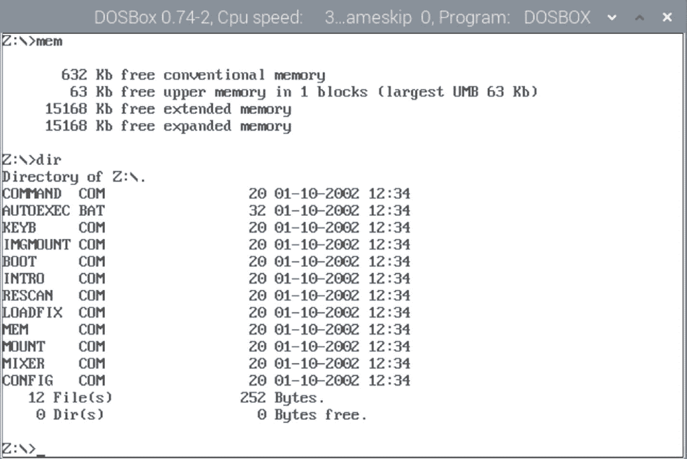
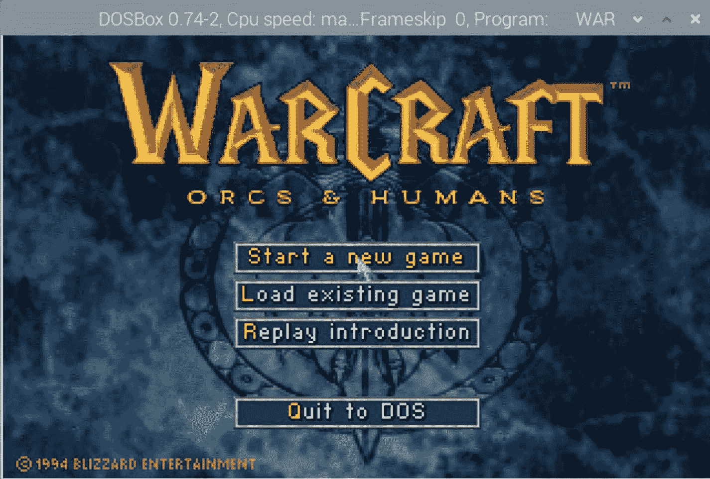

# 7.高级主题

本章涵盖的主题是从命令行或 GUI 工作时要考虑的有价值的选项——或者在许多情况下两者都要考虑。

首先，我们讨论 Markdown 和 LaTeX，这两种描述文本的“语言”允许更容易地转换成其他格式。Markdown 可以在半小时内学会，而 LaTeX 要复杂得多，但也灵活得多。一般来说，如果你是为 EPUB 或者 HTML 写基于网络的发布，我会推荐学习 Markdown。如果你是为 PDF 或印刷出版写作，我会考虑 LaTeX，但是两者之间有很多交叉。

第二，我们看看通常所说的“点文件”我已经多次提到文本应用程序是非常可定制的，但我们并没有真正深入研究它。点文件是存储每个应用程序的配置信息的地方；像键映射、配色方案、插件和大多数其他定制都是通过编辑这些文件来完成的。

第三，我将带您浏览我的 Vim 编辑器的 dotfile。我绝不是 Vim 的大师，但是我做了一些基本的定制，可能会吸引一个非程序员。作为一个例子，我将一步一步地向你展示可以做什么样的事情。

然后我们看看如何使用您的 Raspberry Pi 作为其他系统的仿真器。Pi 运行 Linux，但在里面我们可以运行 MS-DOS 应用程序、任天堂游戏，甚至老式的投币式街机游戏。

最后，我提供了一个链接列表，作为进一步研究的“额外资源”,以及一些随着兴趣的增长，如何处理“额外”的 Raspberry Pi 计算机的想法。

## 降价和乳胶

在 GUI 世界中，文字处理器是文档创建之王。微软的 Word，苹果的 Pages，甚至谷歌的 Docs 都使得文档的创建变得可视化和简单。另一方面，如果您曾经在 Word 中迷失在一堆缩进和遗漏的项目符号中，那么您就会知道这些视觉格式有多么令人沮丧。许多作家选择使用文本编辑器而不是文字处理器。使用文本是一件喜忧参半的事情。你可以完全控制你的文字和数据的每一个方面，但这是以更高的学习曲线为代价的。这听起来很熟悉，不是吗？

我在“写作工具”部分提到过 **WordGrinder** 。据我所知，对于纯文本系统来说，这是最接近“文字处理器”的东西。它允许你使用粗体、下划线和一些其他格式的东西；但它远不如任何 GUI 文字处理器健壮或强大。可靠，易学；对你来说可能就够了。

另一方面，如果你写了很多东西，或者需要更精确的格式，有两个非常流行的描述文本格式的系统*:**Markdown**和 **LaTeX** 。你决定学习哪一种取决于你写作的类型以及你想要的输出类型。*

我在下面包含了两个例子，一个是 Markdown，另一个是 LaTeX，它们都没有包含任何解释。从这两个例子中可以看出，Markdown 相对容易阅读，即使对于实际上并不知道他们正在查看的材料是 Markdown 的人来说也是如此。简单易学；通常只是在纯文本中添加某些标点符号，比如#表示各种标题，**表示粗体，*表示斜体，[]()表示链接和图形。它比 HTML 更容易学习，但允许非常相似的输出。事实上，Markdown 最初是为了方便地将文本文档转换成 HTML 以发布到博客上而创建的，但它对大多数形式的在线写作都很有用。

另一方面，LaTeX 散布着大量的标记和括号，通常有更多的“开销”也就是说，开销和复杂性允许打印布局具有基本上无限的灵活性——自从计算机首次用于打印以来，使用 LaTeX 排版的书籍比任何其他方法都多。

当然，Markdown 和 LaTeX 都只是描述文本的“标记语言”，与 HTML 非常相似。这两种文本语言都是简单的文本文件，可以使用您选择的文本编辑器进行编辑——Vim 或 Emacs 或者甚至可以使用纳米。当然，因为它们只是简单的文本文件，所以根据定义，它们是完全跨平台的。如果有一天你决定回到 Windows、Mac 或 Linux，你可以带着所有这些文件，因为同样的工具也适用于这些平台。iOS，Android，几十年的大型机，每一台还没发明出来的电脑也是如此。

文本文件永远不会“消失”,也不会发生太大的变化，以至于无法被其他东西读取。文字处理格式就不一样了——想想保存在 Apple Works、Microsoft Works 甚至 Apple Pages 早期版本中的文件，它们都无法在现代文字处理软件中阅读。那些文件基本上已经变得不可读了。

使用文本语言的过程非常简单。您只需使用您最喜欢的文本编辑器输入如下所示的“代码”。记住*。md* 或*。您编写的 tex* 文件不是最终文档；它将使用类似 *Pandoc* 或 *LaTeX* 的应用程序进行编译，以创建您需要的格式的输出文件:*。docx* ，*。pdf* 、*。odt* ，或者随便你。有几十种输出格式可供您使用。

### 减价

如果你正在为网络或电子书写作，你可能应该看看 Markdown。它很容易转换成 HTML 和 EPUB 格式，而且非常容易学习。看一段 10 分钟的 YouTube 视频，你大概就能掌握基本知识了！

```sh
# Heading
=======

## Sub-heading

Paragraphs are separated by a blank line.

Two spaces at the end of
a line leave a line break.

Text attributes *italic*, **bold**, `monospace`.

Horizontal rule:

---

Bullet list:

* apples
* oranges
* pears

Numbered list:

1\. wash
2\. rinse
3\. repeat

A [link](http://example.com).


```

#### 潘多克

要将前面的 Markdown 文本转换成更有用的最终格式，我必须推荐 **Pandoc** 。它可以将几乎任何格式转换成任何其他格式。类型

```sh
sudo apt install pandoc

```

来安装它。要使用它，您可以键入如下内容:

```sh
pandoc -f markdown -t docx example.md -o example.docx

```

这将采用文件 *example.md* (。md 表示是 markdown 文件)并将其转换为 *example.docx* (微软 Word 文件)。请注意该命令的各种标志和参数:

<colgroup><col class="tcol1 align-left"> <col class="tcol2 align-left"></colgroup> 
| 

`pandoc`

 | 

主命令

 |
| --- | --- |
| `-f markdown` | **从**降价形式 |
| `-t docx` | **到**docx 格式 |
| `example.md` | 源文件(以 md 结尾用于降价) |
| `-o` | **输出** |
| `example.docx` | 输出文件(Word 文档以 docx 结尾) |

Pandoc 是一个非常强大的转换工具，它支持几十种不同的输入和输出格式。

您可以通过键入`man pandoc`来阅读手册页，或者尝试访问位于 [`https://pandoc.org/MANUAL.html`](https://pandoc.org/MANUAL.html) 的网站来获得更好的阅读体验。

### 乳液

如果你想用纸来写作，打印输出或书籍或报告(或 pdf)，你可能想看看乳胶。LaTeX 是一个高质量的排版系统；它包括为制作科技文献而设计的功能。LaTeX 是科学和数学文档交流和出版的事实标准。它被设计为在 20 世纪 70 年代的小型计算机上运行，因此 Pi 足够强大，可以处理您能想到的任何 LaTeX 项目。

```sh
\documentclass{article}
\usepackage{amsmath}
\title{\LaTeX}
\begin{document}
\maketitle
\LaTeX{} is a document preparation system for the \TeX{} typesetting program. It offers programmable desktop publishing features and extensive facilities for automating most aspects of typesetting and desktop publishing, including numbering and  cross-referencing, tables and figures, page layout, bibliographies, and much more. \LaTeX{} was originally written in 1984 by Leslie Lamport and has become the  dominant method for using \TeX; few people write in plain \TeX{} anymore.
The current version is \LaTeXe.
% This is a comment, not shown in final output.
% The following shows typesetting  power of LaTeX:
\begin{align}
E_0 &= mc^2 \\
E &= \frac{mc^2}{\sqrt{1-\frac{v^2}{c^2}}}
\end{align}
\end{document}

```

要安装 LaTeX 编译器，请键入以下内容。请记住，Tex Live 的下载和安装量非常大，所以在安装之前，请确保您的 SD 卡或硬盘上至少有 2GB 的磁盘空间:

```sh
sudo apt update
sudo apt install texlive-full
sudo apt install texworks

```

如果您认为您不需要 texlive-full 软件包中提供的非常高级的工具，您可以用下面的内容代替上面的第三行:

```sh
sudo apt install texlive

```

此外，如果您没有特别喜欢的文本编辑器，可以安装 Texmaker，这是一个专门为使用 LaTeX 而设计的编辑器:

```sh
sudo apt install texmaker

```

在第 4 章中有对 Texmaker 的简短描述。如果你喜欢更图形化的选项，有完全在线的、基于云的 LaTeX 编辑器。看看 Overleaf.com，这无疑是最好的例子。它在 Pi 的 Chromium 浏览器上也能很好地工作，你不需要安装任何东西就能让它工作。它甚至会把你写的东西储存在云端，所以你不用担心会丢失任何东西。

## 使用点文件进行自定义

在整本书中，我一遍又一遍地提到了如何*定制*一切，但我并没有触及如何进行定制。一些基于文本的应用程序有下拉菜单和设置，可以像基于图形的应用程序一样进行调整。如果是这样的话，那么你可能已经知道如何去做了。

更有效的方法是编辑“点文件”这些文件包含设置、变量和字段，可以使用 Vim、Emacs 甚至 Nano 之类的文本编辑器进行更改。这些文件通常以应用程序本身命名，只是它们以句点开头(因此称为“点文件”)，有时它们会在末尾添加“rc”。一些例子可能是

-vim 的

。编辑器

。muttrc 公司

. tmux.config 文件

。配置

### 注意

以下内容适用于任何种类的 Linux。查看特定应用程序的文档，了解配置文件的存储位置以及如何访问它们。

要了解我所说的内容，请在终端中转至您的主目录，并创建一个完整的目录列表:

```sh
cd ~
ls -la

```

您可能需要上下滚动才能看到所有内容，但是会有许多文件以句点开头。这些文件可以编辑、更改，然后保存，以改变应用程序的永久设置。注意，点文件对于基本的`ls`命令是“不可见的”,所以你必须使用`-la`开关来查看它们。如果您使用 Ranger 或 Midnight Commander 查看目录列表，它们也可能被隐藏。

每个应用程序都有不同的规则和设置，我不可能全部解释清楚(即使我全部理解)。最好的方法是在默认状态下使用应用程序，然后一旦你发现自己在想“我想知道是否有更好的方法……”或“我希望这能以不同的方式工作”，那么就上网(或查看手册文件)并搜索应用程序的配置选项。很有可能有一个设置或插件可以满足您的需求。大多数应用程序都非常灵活，但是你会发现大多数命令行/文本模式的应用程序都没有丰富的内置菜单。

举个例子，我经常使用 Vim 文本编辑器，并且对它的配置文件做了很多修改。在下一节中，我将回顾一下 Vim 的 dotfile。大多数其他应用程序都以类似的方式工作。

## 我的。vimrc 文件

Vim 应用程序主要通过一个名为*的文件进行配置。vimrc* 。**。vimrc** 文件位于您的主目录中。要编辑它，请键入

```sh
nano ~/.vimrc

```

如果您还没有. vimrc 文件，这将为您创建一个。

当 Vim 应用程序启动时，它扫描主目录并查找这个文件。如果它不存在，Vim 在自己的通用缺省值下运行，但是如果它存在，它会读取文件并根据配置文件中的内容改变 Vim 的行为。下面是我的(行号供你参考；真实文件没有那些):

```sh
01 filetype off
02 set encoding=utf-8
03
04 execute pathogen#infect()
05 execute pathogen#helptags()
06 let g:airline_theme='jellybeans'
07
08 filetype plugin indent on
09 :let mapleader = ","
10
11 nnoremap j gj
12 nnoremap k gk
13 vnoremap j gj
14 vnoremap k gk
15 nnoremap <Down> gj
16 nnoremap <Up> gk
17 vnoremap <Down> gj
18 vnoremap <Up> gk
19 inoremap <Down> <C-o>gj
20 inoremap <Up> <C-o>gk
21
22 " Nerdtree start and toggle ,-n and ,-m
23 :map <Leader>n  <Esc>:NERDTree<CR>
24 :map <Leader>m  <Esc>:NERDTreeToggle<CR>
25
26 "Latex compile and preview key bindings
27 :map <Leader>u  <Esc>:! pdflatex "%"
28 :map <Leader>i  <Esc>:! evince "%:t:r.pdf" &
29
30 " Spell check toggle
31 :map <F6> :setlocal spell! spelllang=en_us<CR>
32
33 colorscheme slate
34 set nocompatible
35 set nonumber
36 set guioptions-=L
37 set guioptions-=T
38 set ruler
39 set undolevels=1000
40 :set wrap linebreak nolist
41
42 :set display+=lastline
43 :abbreviate img 

```

这看起来像是很多真正的技术内容，但按照许多 Vim 爱好者的标准，这实际上是非常短的。现在，我将一行一行地解释这是怎么回事。

*   **第 1 行:** *Filetype* 告诉 Vim 检测正在加载的文件类型，并对该类型的文件使用语法高亮显示。我不是程序员，所以我不需要语法高亮，所以我把它关掉了。

*   **第 2 行:** *UTF-8* 是一种标准的字符编码类型，用于大多数印刷和电子书。这也是我一直使用的。像这样的设置，如果您想设置一次就再也不要弄乱它，是在配置文件中进行更改的主要候选。

*   **第 4、5 行:** *病原体*是“外挂管理器”Vim 允许扩展和插件做基础 Vim 系统中没有的事情。病原体负责为我加载和运行插件脚本。

*   **第 6 行:** *航空公司*取代了 Vim 屏幕底部的普通状态行。我的是漂亮的蓝色，与 Vim 默认提供的信息不同。这其实不是必需品，但我喜欢它的样子。我的主题是“软糖”，背景设在这里。

*   **第 8 行:**打开插件和缩进。

*   Vim 有一个叫做“leader key”的东西，它允许你定义键盘组合来做任何你能想到的事情。我已经将我的 leader 键设置为逗号键。这意味着我可以点击*逗号 n，*就会有事情发生。如果我点击*逗号-m* ，会发生其他事情，等等。这很像同时按下 Ctrl 或 Alt 键和其他键，但是 Vim 进行了太多操作，以至于大多数 Ctrl 和 Alt 组合都已经被使用了。领导组合键是“所有我的。”我们将在文件的后面定义这些特定的键。

*   **第 11–20 行:** Vim 是程序员的编辑器，但我大多写文本文件。我不喜欢当我按向上或向下箭头键时，Vim 上下移动整个段落的方式。我习惯了常规文字处理器使用箭头键的方式，所以在这里我“重新映射”了这些键，以移动我想要的方式。在第 11 行，我重新映射了“j”键，以使用通常与“gj”键相关联的操作。第 15 行对向下箭头键做了同样的事情。vnoremap、nnoremap 和 inoremap 做同样的事情，但是将更改应用于不同的模式。这很复杂，但是你可以重新映射键盘上的任何键来做任何你想做的事情。(Vim 纯粹主义者现在对这个讨厌的东西摇头，想知道为什么我不直接使用默认的移动键)。Vim 是一个非常老的应用程序；在许多键盘上有箭头键之前，它是按字面意义设计的；所以默认的移动是 H，J，K 和 L 键。

*   **第 22 行:**这是一个注释。它什么也不做。

*   **第 23 行:**这里是事情开始发生的地方。这一行用“n”键映射了我前面提到的 leader 键。当我点击逗号-n 时，插件 NERDTree 运行。NERDTree 是一个文件浏览插件，用于从菜单中选择和加载文件。

*   **第 24 行:**映射逗号-m 组合，使 NERDTree 窗口消失。我可以使用逗号-n 来选择和加载一个文件，然后点击逗号-m 使文件选择器消失。

*   **第 26 行:**又一条评论。

*   **第 27 行:**使用 PDFLATEX 映射 COMMA-U 将屏幕上的文本文件编译成 PDF。如果我正在编写一个 LaTeX 文件，这将为我完成所有的编译工作，所以我不必记住或键入编译文件通常需要的命令行。

*   **第 28 行:**映射 COMMA-I 来加载 Evince PDF viewer 并预览当我点击 COMMA-U 时创建的文件。

*   第 31 行:映射 F6 功能键来打开或关闭拼写检查。

*   第 33 行:你可以使用多种内置配色方案，也可以自己安装。我使用名为“石板”的内置主题

*   第 34 行:与更老的 VI 程序的兼容性有关。我不需要这种兼容性，所以我把它关了。

*   **第 35 行:**关闭行号。再说一遍，我写的是散文文本，而不是代码，所以我不是特别在意行号。请注意，您当前所在的线路仍会显示在屏幕底部的状态栏中。

*   **第 36 行:**在 GUI 模式下，这将移除左侧滚动条。

*   **第 37 行:**在 GUI 模式下，这将移除屏幕顶部的工具栏。

*   **第 38 行:** `Set ruler`允许 Vim 知道并在状态行上显示光标所在的列。

*   **第 39 行:**设置撤销级数。

*   **Line 40:** 这使得 Vim 可以在空格或标点符号处换行，但不会在单词中间换行。否则，Vim 允许一行在很长时间内不换行到屏幕上。

*   **第 42 行:**出于某种原因，Vim 对屏幕最下面一行做了奇怪的事情。这一行解决了这个问题。

*   **第 43 行:**如果你用过类似 **TextExpander** 的工具，你会喜欢这个。这一行修复了它，这样每当我输入字符`img,`时，它会自动将该文本扩展为字符串`.`，这是在 Markdown 中写入时图像文件的空占位符。我从来不记得具体涉及到哪些人物，也因为这一行，我不必。当我想插入一张图片时，我输入`img,`，这些字符就会弹出来。然后，我返回并填写描述和文件名。您可以设置任何独特的字符串，以这种方式扩展成您想要的任何内容。由于篇幅原因，我在这里只包括了这一个缩写，但是有几十个缩写并不罕见。

*   同样，一个认真的 Vim 用户会定制他们的。vimrc 文件，他们只需要几千行定制。

我是怎么学会做这些的？我试着使用“香草”Vim 程序，当我碰到我不喜欢的东西时，我会搜索直到找到配置命令。当你找到一个解释你喜欢的一些修改的页面时，它通常会链接到你可以做的相关定制，然后你就陷入了疯狂修改的兔子洞。给一个如此“普通”的应用程序添加一些强大的新功能确实很有趣。

对于一些人来说，掌握并充分利用这些工具的每一点能力和性能是一项严肃的爱好，他们喜欢在网上写下他们的成就。至少，您应该尝试改变配色方案并打开拼写检查——这些都是易于开始的命令。然后一步一步来。我的建议也是*不要*复制任何人的配置文件——即使是我的。随着需求的增长，自己动手制作。

## My .tmux.conf 文件

对于第二个不太复杂的例子，让我们看看终端多路复用器应用程序 Tmux 的配置文件。该应用通过一个名为 *.tmux.conf* 的文件进行配置。要对此进行编辑，请键入

```sh
nano ~/.tmux.conf

```

如果您还没有这个文件，Nano 将为您创建一个空白文件。以下是我所知道的:

```sh
source-file "${HOME}/.tmux-themepack/powerline/double.blue.tmuxtheme"
# split pane using | and –
Bind | split-window -h
Bind – split-window -v

```

显然，这比 Vim 配置文件短得多；不是所有事情都超级复杂。

第一行为显示在 Tmux 屏幕底部的状态行加载颜色主题。通常，Tmux 显示一条普通的绿色状态线，但是这条有漂亮的蓝色和一些图形分隔线。它并没有真正做什么有用的事情，但是我喜欢它的样子。

第二行是注释，解释接下来的两行。

第 3 行将|键“绑定”到水平分割窗口的命令。在我看来,|键就像是将窗口一分为二的垂直切片，所以我认为它比这个动作的默认键更容易记住。

第 4 行做了同样的事情，将–键映射到垂直分割线。连字符从右到左，这在我看来就像是垂直分割中穿过屏幕的线。我是一个视觉思考者，所以这两个键比默认的键“和%更容易记住。

这就是我的. tmux.conf 文件。您能找到的几乎每个应用程序都有类似的东西，尽管通常没有 Vim 示例那么精细或复杂。

如果您在根目录中没有看到 dotfile，请在 **~/中查找。config** 子目录；有时候他们把它们藏在那里。如果两者都不存在的话~/。config 或您的/home 目录中，查看该软件的文档——它几乎肯定有*一些方法*来进行永久定制；只是找到文件位置的问题。保留所有自定义点文件的备份也是一个非常好的主意。这样，如果你设置了另一台机器，这些文件很容易获得，而且如果你搞砸了什么，你可以回到以前的工作版本。我知道许多 Linux 用户将他们所有的点文件保存在 Github.org 库中，这个项目超出了本书的范围。

乍一看，这似乎是不必要的复杂。当然，从菜单中选择选项会更容易。嗯，如果选择仅限于程序的创建者认为要包括的内容，那是真的。像 Vim 和 Tmux 这样的应用程序允许有*无限的*各种插件和近乎荒谬的特性。Vim 程序员不可能想到包括所有的东西，他们也不想这样做。许多插件都是*非常*专用的。通过使用完全开放的文本文件进行配置设置，几乎可以创建任何东西。是的，它更复杂，但它的*无限*可扩展。

## Linux 的其他发行版

我们从一开始就看到有不止一个适用于 Raspberry Pi 的 Linux 发行版，我们开始讨论 Raspbian 和 Ubuntu MATE。还有其他可用的，您可以按照我们在开始时所做的相同过程来尝试它们:下载一个镜像文件，使用 Etcher 将其写入 SD 卡(或硬盘)，然后配置操作系统。

与 Raspberry Pi 兼容的一些最流行的发行版包括:

*   Raspbian 是默认的 Raspberry Pi 操作系统，由 Raspberry Pi 基金会创建和维护

    ( [`www.raspberrypi.org/downloads/raspbian/`](http://www.raspberrypi.org/downloads/raspbian/) )。

*   Ubuntu MATE 是 Ubuntu 的一个版本，拥有完整的桌面和主要应用程序。在大多数情况下，MATE 运行速度比 Raspbian 慢，但它的功能更全，使用起来也更友好

    ( [`https://ubuntu-mate.org/raspberry-pi/`](https://ubuntu-mate.org/raspberry-pi/) )。

*   Kali Linux 在白帽黑客和安全测试人员中很受欢迎。它没有附带常见的游戏和商业应用，但它非常注重安全测试

    ( [`www.kali.org/`](http://www.kali.org/) )。

*   **CentOS** 是红帽企业 Linux 发行版的社区版，每个新版本保证支持 10 年

    ( [`www.centos.org/`](http://www.centos.org/) )。

*   RISC 操作系统与其他操作系统非常不同，它是**而不是**基于 Linux。它非常快，非常小，但是与 Linux 系统相比，它以不同寻常的方式做事情

    ( [`www.riscosopen.org`](http://www.riscosopen.org) )。

*   RASPBSD 是 FreeBSD 的一个版本。FreeBSD 也不是 Linux，而是一个完整版本的 Unix，Linux 所基于的操作系统

    ( [`www.raspbsd.org/`](http://www.raspbsd.org/) )。

*   **Windows IoT Core 和 Ubuntu Core** 是各自操作系统的两个专门版本，它们不是完整的桌面环境，而是“核心”系统，缩小规模以利用 Pi 的廉价硬件来创建连接互联网的“物联网”设备

    ( [`https://docs.microsoft.com/en-us/windows/iot-core/downloads`](https://docs.microsoft.com/en-us/windows/iot-core/downloads)

    [`https://ubuntu.com/download/iot/raspberry-pi-2-3-core`](https://ubuntu.com/download/iot/raspberry-pi-2-3-core) )。

*   **Pi MusicBox** 将您的 Pi 变成点唱机，从本地和网络存储驱动器以及许多流媒体源(如 Spotify 和 Google Play Music)加载您的音乐

    ( [`www.pimusicbox.com/`](http://www.pimusicbox.com/) )。

*   LibreELEC 设计用于运行 Kodi 媒体中心。你把它连接到你的电视/显示器和一个装满视频和音乐的硬盘上，它就会把你的电视变成一台非常 T2 的智能电视

    ( [`https://libreelec.tv/downloads/`](https://libreelec.tv/downloads/) )。

*   **OpenMediaVault** 将您的 Raspberry Pi 变成网络连接存储(NAS)的大脑。只需添加一个或多个大硬盘，并将 Pi 插入您的网络，您就有了一个智能 NAS

    ( [`www.openmediavault.org`](http://www.openmediavault.org) )。

*   **RetroPie** 是一个“复古”的视频游戏仿真系统。我们将在下一节讨论更多关于模拟器的内容，但是这个发行版包括了模拟几十台旧电脑的应用程序

    ( [`https://retropie.org.uk/`](https://retropie.org.uk/) )。

## DOSBox 和仿真软件

尽管如此，还有其他的可能性。对于“全功率”计算机，虚拟计算和模拟器是业余爱好者感兴趣的主要领域。你能在 Raspberry Pi 上运行模拟器吗？你当然可以！模仿旧的视频游戏系统是 Pi 最常见的爱好之一。

最流行和调试最彻底的模拟器之一叫做 DOSBox。它允许你运行 20 世纪 80 年代和 90 年代为 MS-DOS 开发的软件，并在你的 Raspberry Pi 上运行。这可能是曾经流行的软件，如 WordPerfect 5.1、Lotus 1-2-3、Wildcat！BBS，或者其他功能强大的软件。另一方面，它也可能是 Windows 95 占领 PC 世界之前编写的数千款优秀游戏中的一部分:中校、M.U.L.E .、Zork、俄罗斯方块等等。这些游戏不一定要输给时间；你现在就可以在你的树莓派上运行它们。

要开始，请下载 DOSBox:

```sh
sudo apt install dosbox

```

用`dosbox.`运行它

图 [7-1](#Fig1) 显示了 MS-DOS `dir`命令的输出。



图 7-1

提示方块

如果你熟悉 MS-DOS，几乎所有的命令都可以工作。复制文件、删除文件、目录列表—都在这里。运行游戏或应用程序的第一步是将您的个人文件夹中的一个目录“映射”到“DOS”中的 C:驱动器。这使得它看起来像是你在你的主硬盘上安装了这些应用程序。

例如，如果您最近下载了一组存储在~/Downloads/DOS 中的游戏，您可以将该文件夹挂载为 DOS 中的 C:驱动器:

```sh
mount c ~/Downloads/DOS

```

现在如果你打字

```sh
dir c

```

现在，您应该可以看到 Linux 驱动器上 DOS 文件夹的内容。接下来，您将使用 cd 命令将活动目录更改为包含特定游戏的目录。

```sh
cd warcra~1

```

带我进入“魔兽”目录。然后你可以输入`dir`来查看文件夹中的所有文件，找到`.exe`文件，也就是*通常是*在 DOS 下的一个可执行文件。对于我正在运行的游戏，可执行文件叫做`war.exe`。类型

```sh
war

```

而且游戏不仅会开始，而且会出奇的好。图 [7-2](#Fig2) 为截图。

DOSBox 也可以使用点文件进行定制。可以通过键入以下命令来访问它的配置

```sh
nano ~/.dosbox/dosbox-0.74-2.conf

```

请注意，如果您有较新版本的应用程序，这可能会有所不同。该文件中需要更改的两个有用的内容如下:

1.  You can set it to automatically mount the C: drive as we did earlier. Just type in the “mount” command in the configuration file

    ```sh
    mount c ~/Downloads/DOS

    ```

    或者任何你用来存放 DOS 应用程序的地方。

2.  文件顶部附近有一行`fullscreen=false`。如果你把这个改为`fullscreen=true`，然后保存文件，DOSBox 将开始以全屏模式打开，这看起来比你在其他情况下得到的小窗口要好得多。

这一节并不意味着是一个 DOS 模拟器教程，而是一个你可以使用的模拟器的例子。任天堂、Game Boy、Genesis 和大多数其他老式街机和游戏机游戏都有类似的模拟器。

所有细节、注释和帮助文件都可以在 DOSBox 网站 [`http://dosbox.com`](http://dosbox.com) 找到，如图 [7-2](#Fig2) 所示。



图 7-2

1994 年的 DOS 游戏魔兽争霸

**向后**

如果运行旧的 PC 游戏还不足以娱乐你，你可能想尝试一个专门的仿真发行版，如 RetroPie。安装后，RetroPie 会将你的 Pi 引导到一个包含旧电脑、游戏机和视频游戏机的菜单中，然后允许你从这些系统中加载游戏。许多系统都包含仿真器，如下所示:

<colgroup><col class="tcol1 align-left"> <col class="tcol2 align-left"></colgroup> 
| 3doAmiga阿姆斯特丹足球俱乐部苹果二代雅达利 2600Atari 5200 和 8 位系列雅达利 7800绑捷豹Atari Lynx(美国电影明星)阿塔里圣斯特/TT/Falcon椰子树Colecovision准将 64达芙尼龙 32梦幻女郎最后一击游戏立方体游戏和观看游戏装备游戏男孩游戏男孩颜色游戏男孩前进智能视觉麦金托什雨衣MAME主系统巨型驱动/创世纪混乱MSX任天堂 64 | 街机游戏近地天体地理口袋新地理口袋颜色oric-1/大气个人电脑PC 发动机/TurboGrafx-16电脑-外汇掌上游戏机(SONY 推出的掌上娱乐平台)任天堂 DS任天堂公司游戏机 1PlayStation 2剩余虚拟机山姆双门轿跑车土星斯库玛32X 锯把 CD 锯掉SG-1000 突击步枪超级任天堂TI-99/4ATRS-80每周三次video PAC/奥德赛 2虚拟男孩任天堂在 2006 年推出的新一代电视游戏机旺德万旺德万 Color机器ZX 光谱 |

## 额外资源

*   使用 Linux 命令行(pdf 书籍)

    [T2`http://linuxcommand.org/tlcl.php`](http://linuxcommand.org/tlcl.php)

*   明文生产率

    [T2`http://plaintext-productivity.net/`](http://plaintext-productivity.net/)

*   伤心欲绝:Linux 轻量级和极简软件的冒险

    [T2`https://inconsolation.wordpress.com/`](https://inconsolation.wordpress.com/)

*   牛逼 Shell:牛逼命令行应用的精选列表

    [T2`https://github.com/alebcay/awesome-shell`](https://github.com/alebcay/awesome-shell)

*   斯科特·沙孔和本·施特劳布的书，由出版社免费出版

    [T2`https://git-scm.com/book/en/v2`](https://git-scm.com/book/en/v2)

*   最有用的命令行工具:50 个很酷的工具来改善你的工作流程，提高生产力，等等

    [T2`https://stackify.com/top-command-line-tools/`](https://stackify.com/top-command-line-tools/)

## 专用 Pi 项目

许多用户将他们的 Raspberry Pi 用作家庭网络和“原始”互联网之间的一种专用中间设备。您可能感兴趣的一些项目如下:

*   **黑洞:**[`https://pi-hole.net`](https://pi-hole.net)互联网广告的“黑洞”。

*   **Pi-VPN:**Pi 在 [`www.pivpn.io`](http://www.pivpn.io) 的虚拟专用网服务器。

*   **防火墙和入侵检测:**

    [`www.instructables.com/id/Raspberry-Pi-Firewall-and-Intrusion-Detection-Syst/`](http://www.instructables.com/id/Raspberry-Pi-Firewall-and-Intrusion-Detection-Syst/) 。

*   **Volumio 高保真音乐播放器:**让您将 Pi 设置为专用点唱机和音乐播放器

    [`https://volumio.org/`](https://volumio.org/) 。

*   **OwnCloud:** 创建您自己的云服务器，可从电脑、手机或任何地方访问。就像拥有自己的 Dropbox 一样

    [`https://owncloud.org/`](https://owncloud.org/) 。

*   **LAMP Server:** LAMP 是 Linux，Apache，Mysql，PHP server 的简称。它本质上是一个随时可用的完整的 web 服务器。没有一个庞大的 LAMP 安装程序，因为它由四个非常复杂的部分组成，但是一个简单的在线搜索应该会提供几个很好的安装系统的教程网站。

*   RetroPie Arcade: 我们在仿真部分讨论了 RetroPie，但设计和建造与该软件配套的物理硬件是创意人员的共同爱好。从掌上游戏机到大型木制拱廊式橱柜，应有尽有。我不打算在这里推荐任何供应商，但在谷歌上快速搜索“RetroPie 控制台”会显示出相当多的选择。

所有这些项目都需要一个专门负责这项任务的 Pi，所以你不会想用你的“计算机 Pi”来做这些，但是如果你有兴趣为一个*第二个*或*第三个*树莓 Pi 找一份工作，它们可能会让你感兴趣，这比你想象的要常见得多——新的 Pi 模型似乎出现得非常快，留下了许多备用的“旧”Pi 系统来寻找用途。

## 结论

这就是了。

我们已经购买、构建并组装了我们的小 Raspberry Pi 计算机，我们已经将操作系统安装到 SD 卡或硬盘上，并且我们已经建立了一个用户帐户。

然后我们学习了 Raspbian 桌面界面，安装了一堆好玩又强大的 app。

然后我们切换到命令行，安装了一系列功能更强大、可定制的工具。

最后，我们看了文本标记语言和. config 文件，它们允许无限的定制选项。

我们在这一切中发现了什么？Raspberry Pi 本质上是一台普通的计算机，只是更小、更便宜，并且可能不像其他一些计算机那样可扩展。尽管如此，它运行 Linux 并拥有所有必要的输入和输出选项，因此几乎没有什么是它不能完成的。诚然，许多相同的应用程序比新 MacBook 上的要慢，但价格只有五十分之一，也许这是一个公平的交易。只有你能肯定地说。

现在该去工作了！