# 九、Mageia

Mageia 是我在本书中选择分析的较新的 Linux 发行版之一，它是欧洲第三大流行的 Linux 发行版。Mageia 是旧发行版 Mandriva(以前的 Mandrake)的一个分支，Mandriva 现已停止发行，但它是有史以来第二著名的欧洲 Linux 发行版。Mandrake 本来是红帽的叉。它也受到了苏塞的启发，今天你仍然可以在《马吉亚》中找到它的回声。

## 历史

Mageia 是“魔法”的希腊语术语，它是对最初的 Mandrake 发行版的一种表示，该发行版以意大利裔美国魔术师 Leon Mandrake 的名字命名。Mageia 是一个由非营利组织 Mageia.org 支持的社区发行版。

玛吉娅出生在曼德拉的痛苦中。Mageia 是始于 1998 年 Mandrake 的伟大血统的继承人之一(与 PCLinuxOS 和其他人一起)。它在 2005 年与另一个老牌红帽分叉 Conectiva (1997)合并，最终更名为 Mandriva (Mandrake + Conectiva)。Mandriva/Mandrake 一直是一个公司支持的发行版，但是公司在财政上有困难。预见到它即将灭亡，Mandriva 背后的公司的一些开发者和一些其他社区成员决定分叉发行版；因此，Mageia 项目于 2010 年 9 月宣布。第一个版本于 2011 年 6 月发布。Mandriva 是在同一年发布的最后一个版本。

Mandriva/Mandrake 是一个法国发行版，它被商业化了，和其他伟大的欧洲发行版，OpenSUSE/SUSE，有着相似的发展。这绝非偶然。你可以在两个发行版中看到相似之处和影响。其实我看到了这些发行版是怎么进化的，但是连我都记不清每个方面是谁启发了谁。

## 哲学

嗯，事实是 Mageia 的主要目的是延续 Mandriva 的遗产，并在它停止的地方继续分发。Mageia/Mandriva 的主要目标之一是为所有用户创建一个愉快且易于使用的发行版。很长一段时间，这个发行版(和 SUSE 一起)是为那些想要友好发行版的新用户准备的。Mageia 将它的使命定义为为人们建造伟大的工具。

## 发行版选择标准

现在你已经了解了一些历史，让我们看看 Mageia 在第 2 章的选择标准中是如何排名的。

### 目的和环境

Mageia 是一个通用发行版，和 Mint 一样，只是它专注于桌面。Mageia 为此环境提供了一个独特的版本。

### 支持

老曼德拉草有一个很大的支撑；它甚至出版了一本手册(与 Mandriva Powerpack 一起提供)，就像 SUSE 过去做的那样。但现在 Mageia 是一个基于社区的发行版，支持来自成员。它不像一个公司所能提供的支持那样全面。但是有很多好方法可以获得社区的支持:

*   文档: [`www.mageia.org/en/doc`](http://www.mageia.org/en/doc)
*   Wiki: [`https://wiki.mageia.org/en/`](https://wiki.mageia.org/en/)
*   论坛:[`https://forum.mageia.org/en/`T2】](https://forum.mageia.org/en/)
*   邮件列表: [`https://ml.mageia.org/`](https://ml.mageia.org/)
*   在 freenode 上

### 用户友好性

Mageia(更确切地说，以前的 Mandriva)有着非常用户友好的名声。这种声望来自无处不在的控制中心(相当于 OpenSUSE 的 YaST ),在这里您可以配置几乎所有最重要的用户分布参数(从用户的角度来看)。但重要的是要知道，这种轻松并不是一个你可以客观衡量的绝对值，因为即使你可以从一个地方控制几乎任何事情，你仍然必须知道你在做什么。因此，对于一个习惯于 Linux 的用户来说，Mageia 或 OpenSUSE 可能看起来非常容易使用和友好，但是对于一个新手来说，这似乎很难。新手可能会更喜欢其他发行版，比如 Ubuntu、Mint 或 elementary OS。事实是，这种荣耀来自多年前，当时安装 Linux 不是一件容易的事情，对于那些害怕安装 Debian 或 Slackware 等更苛刻的软件的人来说，Mageia 是一个受欢迎的选择。但是 Ubuntu 的到来，改变了这一切；从那以后，Mageia/OpenSUSE 和类似的产品在新用户眼中的友好程度上又下降了一步(坦率地说，忽视 Mac OS X 在这方面的影响是愚蠢的)。

### 稳定性

Mageia 是一个合理的稳定分布。它遵循标准的发布模式，并试图每九个月发布一个新版本，然后是 18 个月的支持。

当这个发布周期计划在 2011 年宣布时，曾考虑过 LTS 版本，但从未实现。社区缺乏力量(维护人员和 QA 团队)来完成这项巨大的工作。这是一个完美的例子，一个发行版习惯于有一个公司在背后支持，但后来被各种社区“稀释”了，这些社区想保持速度和质量，但仍在努力恢复它过去的荣耀。这并不意味着 Mageia 不是一个质量合理的稳定发行版；这只是意味着维护一个 LTS 版本，或者几个不同的版本，是一个昂贵的任务，不是太多发行版可以负担得起的(特别是社区版)。

有一个开发版本叫做大锅，总是最新的。当然，它是固有的不稳定，它是针对 Mageia 包装。

### 硬件支持

在硬件支持方面，Mandriva 传统上被认为是一个好的发行版，它的继任者似乎会沿着这条路线继续下去。Mageia 提供了专有的驱动程序，它可以很好地检测硬件，所以我可以说它有很好的硬件支持。

### 美学

在这个发行版中，除了背景、颜色和标志之外，没有太多的美学关注。其余的都是默认的审美。

### 桌面环境

Mageia 支持各种桌面环境，其中八个正式来自发行版的 DVD ISO 镜像:KDE、Gnome、XCFE、Mate、Cinnamon、LXDE、LxQT 和 Enlightenment。Mageia/Mandriva 的传统名称是 KDE。

### 初始化系统

Mageia 使用 systemd 作为它的初始化系统。事实上，它是 2011 年的早期采用者之一。

### 包装管理系统

作为很久以前从 Red Hat 继承的遗产的一部分，Mageia 中使用的包管理系统是 RPM。有一个图形工具来管理软件包(`rpmdrake`)和几个命令行工具(`urpmi`、`urpme`、`urpmq`、`urmpf`)，而不是一个独特的终端工具来完成所有的操作。

### 体系结构

它只支持两种主要架构，AMD/Intel 32 位和 64 位架构。

### 安全性/匿名性

Mageia 的安全性与其他通用发行版非常相似。默认情况下，防火墙处于启用状态，并且在安全工具(称为 MSEC)中默认选择“标准”级别。当然，就像几乎所有的 Linux 一样，你总是可以强化你的安装，但是 MSEC 非常有助于以一种简单的方式管理这个主题(或者用 grain)。MSEC 是由 Mandriva 开发的，默认支持 Apparmor 或 SELinux 等常用工具。

### 原则和道德

Mageia 的核心软件库只提供自由软件，但是你可以从“非自由”和“污染”的软件库中安装专有软件或混合软件(例如，使用专利和版权代码的软件)。因此，关于自由软件的妥协是以一种非常务实的方式解决的，就像在大多数发行版中一样。另一方面，Mageia 是第一个从 MySQL 转换到 MariaDB 以避开 Oracle 版权保护的发行版。

### 现场 CD

Mageia 有实时 ISO 图像，可以下载成 DVD 和 CD。唯一不方便的是 CD 图像只有英文版，你必须选择是要 KDE 还是 Gnome 桌面环境。

### 专业认证

没有专门针对 Mageia 的专业认证。

## 装置

到目前为止，本书中显示的所有发行版安装都是在具有传统 BIOS 的系统上进行的，但在过去几年中，新的计算机(主要是笔记本电脑)已经配备了传统的基本固件 UEFI 的现代“替代品”。一些 UEFI 固件有一个传统的 BIOS 兼容模式，你可以选择你想引导系统的模式。传统 BIOS 模式对那些仍然对 UEFI 感到不舒服的人很有用，因为尽管它比 BIOS 好，但也更复杂。但是对于安装不支持 UEFI 的发行版是很有用的。本书之前展示的所有发行版都支持在 UEFI 模式下安装，但是由于安装过程也更加复杂，在一些发行版中这可能更加困难或麻烦(对于所有之前的发行版来说，这并不难做到)，并且一些用户更喜欢在 BIOS 模式下引导。在 Mageia 中，遵循其简化事情的传统，在 UEFI 模式下安装发行版并不比在 BIOS 模式下难多少。

首先，去 Mageia 网站( [`www.mageia.org/en/downloads`](http://www.mageia.org/en/downloads) )下载 ISO 镜像(见图 [9-1](#Fig1) )。

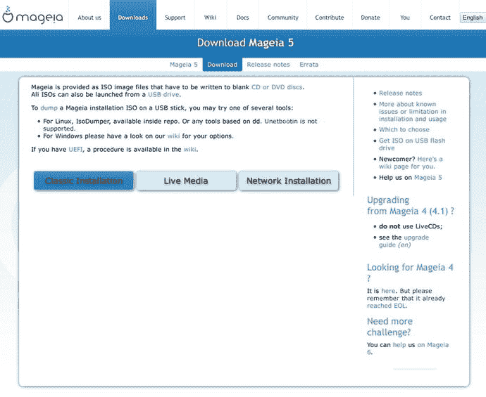

图 9-1。

The Mageia downloads page

与许多其他发行版一样，您必须选择您需要的映像类型。在这种情况下，您可以选择标准映像、实时映像或网络映像。选择标准的(Mageia 称之为“经典”)，你会有三个新的选项可供选择，如图 [9-2](#Fig2) 所示。

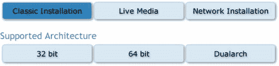

图 9-2。

The architecture options for the ISO image

这些选项是可以安装映像的不同体系结构。它们中的每一个都有一个 ISO 映像，其他的可以安装在两种体系结构中。在这种情况下，请选择 64 位架构。这将导致一个新的双重选项，以选择下载图像的方式，通过 BitTorrent 或标准 HTTP 链接(见图 [9-3](#Fig3) )。

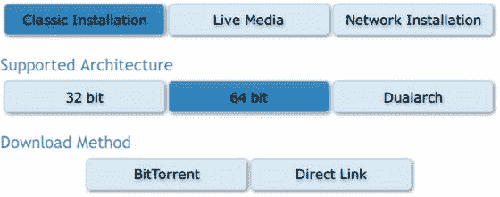

图 9-3。

The available protocols to download the ISO image

一旦选择了其中一种方式并下载了映像，就可以开始安装了。当你第一次启动时，你会看到在 BIOS 系统和 UEFI 系统中安装发行版的第一个区别。图 [9-4](#Fig4) 在左侧显示了 BIOS 系统的启动屏幕，在右侧显示了 UEFI 系统的类似屏幕。

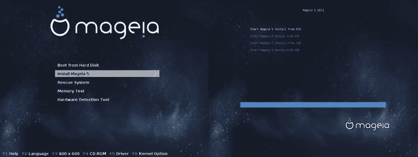

图 9-4。

The boot screen for both firmware types

正如你所看到的，菜单是不同的，但它们基本上有相同的安装 Mageia 的选项。其他选项对于此任务并不重要。BIOS 模式中可用的选项之一是硬件检测工具；这在你之前看到的任何发行版的引导菜单中都没有，但在过去的许多发行版中却很常见。这是一个对解决硬件问题非常有用的工具，您可以在图 [9-5](#Fig5) 中查看它。

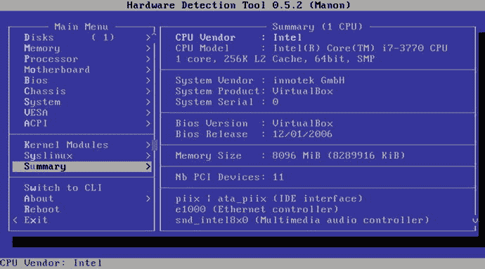

图 9-5。

The Hardware Detection Tool

在 UEFI 模式的菜单中，选择“Start Mageia install from …”选项(或等待几秒钟让它自动启动)进入下一步。从这里开始，两种情况下的安装都是相似的，所以我只展示一个屏幕。Mageia 安装程序中出现的第一个屏幕如图 [9-6](#Fig6) 所示，这是选择安装过程和/或发行版中使用的语言的常用选项。一个特点是，你可以在这个屏幕上选择使用多种语言(通过点击“多种语言”按钮)，然后当你使用 Mageia 时，你可以在它们之间切换。

图 9-6。

The language selection screen in the Mageia installer

下一步(图 [9-7](#Fig7) )是您必须接受许可协议以便继续安装过程的一步(人们通常不会阅读此内容，但我建议您这样做；了解一下这个许可证是如何工作的总是好的，然后你可以把它与其他操作系统的 EULA 进行比较。

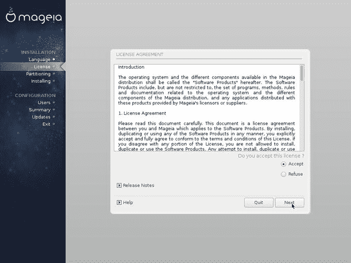

图 9-7。

The License Agreement screen

如果您接受许可，您可以继续进入下一个屏幕(图 [9-8](#Fig8) ，在这里您可以选择您的键盘布局。

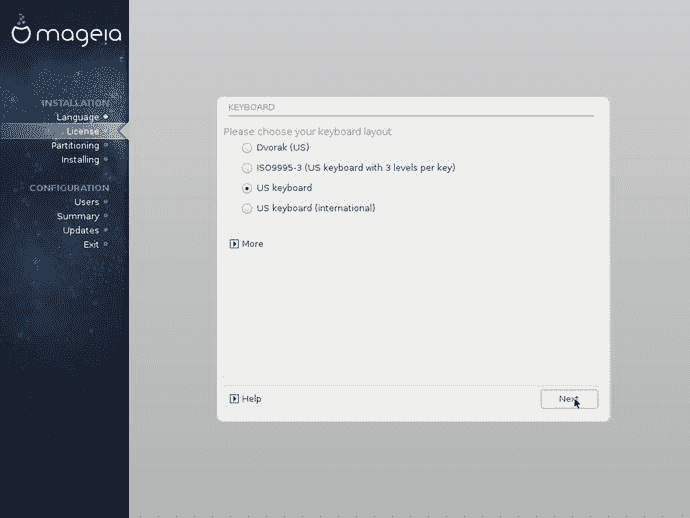

图 9-8。

Keyboard layout selection

和以前的发行版一样，默认情况下应该选择正确的键盘布局；如果没有，请选择正确的选项，然后按“下一步”按钮。下一步总是最关键的一步；您可以在这里选择如何对磁盘驱动器进行分区。如图 [9-9](#Fig9) 所示，该屏幕显示了所选磁盘驱动器的当前状态，并为您提供了两个分区选项:使用磁盘上可用空间的自动分区或通过自定义分区。

图 9-9。

The partitioning tool

让我们选择自定义分区选项。这也将显示 BIOS 和 UEFI 安装之间微妙但重要的差异。因此，选择“自定义磁盘分区”并按下一步按钮。

图 [9-10](#Fig10) 显示了该自定义选项的工作原理。有两个选项可供选择，一个是称为“自动分配”的自动化选项(与之前相同，但现在在工具的这一部分)，另一个是通过界面手动对磁盘进行分区(通过单击分区或空闲空间)。此外，您可以在普通模式和专家模式之间进行选择，在这两种模式下会显示更多信息，并且有更多选项可供配置。为了显示 BIOS/UEFI 安装之间的差异，最好的方法是选择 automated partition 选项，查看在每种情况下如何创建分区方案。首先，让我们切换到专家模式来显示更多信息。接下来，通过点击“自动分配按钮”创建预定义的分区方案如图 [9-11](#Fig11) 所示，一个新的对话框出现，询问您想要哪种类型的分区(该对话框仅在专家模式下出现)。

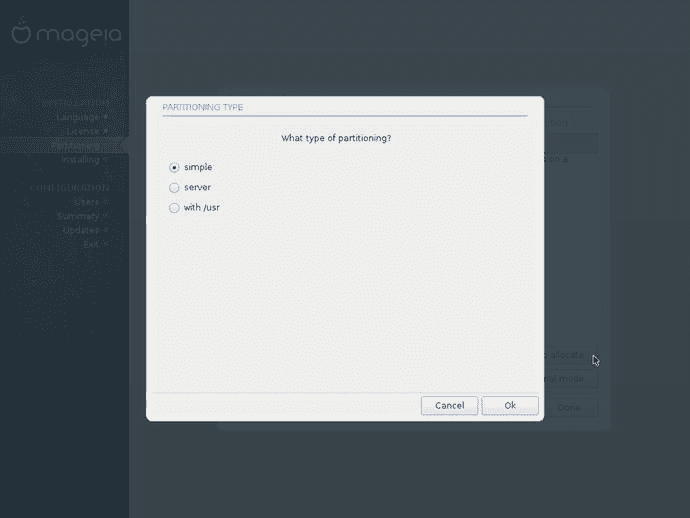

图 9-11。

Type of partition to choose

图 9-10。

The custom partitioning option

选择“简单”选项，然后单击“确定”按钮。创建了一个新的分区方案，其中在书中第一次出现了一个新的分区，它被分配在磁盘的开头，被“着色”为 Windows 分区(蓝色),并被安装在`/boot/EFI '下。该分区存储引导系统所需的系统文件，并且是 DOS 分区类型，这就是它显示为 Windows 分区的原因。剩下的分区都是常用的(`/`、`/home`和`swap`)。您可以在图 [9-12](#Fig12) 中看到结果，并将其与图 [9-13](#Fig13) 进行比较，图中显示了在 BIOS 系统中执行相同的操作。

图 9-13。

The default partitions in a BIOS system

图 9-12。

The default partitions in a UEFI system

现在您已经创建了分区，您可以按下 Done 按钮。在对磁盘进行更改的常见警告之后，分区过程完成，您进入下一步。这一步是你在 OpenSUSE 等其他发行版中看到的，会询问你是否有另一个介质可以在安装中使用(如图 [9-14](#Fig14) 所示)。

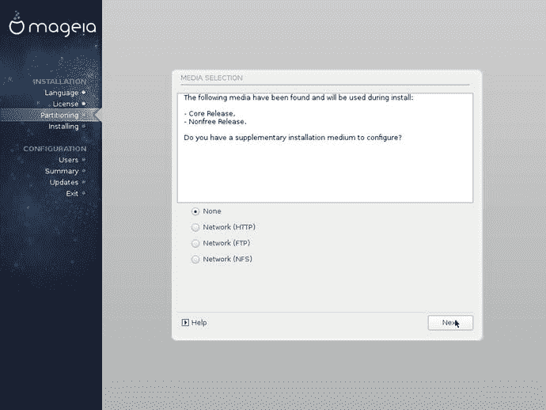

图 9-14。

Is there another installation medium available?

在以下屏幕中，您可以选择想要安装的软件包(图 [9-15](#Fig15) )。您可以坚持使用核心软件包，也可以在安装中添加非自由软件包(例如私有固件)。这个屏幕对我来说似乎有点混乱，因为有些人可能会把本地存储库和在线存储库混淆起来，从而产生错误的想法。

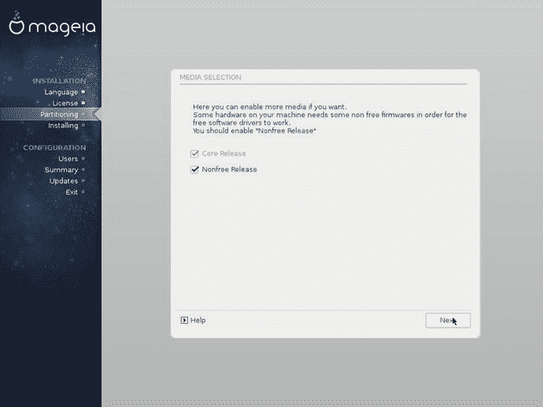

图 9-15。

Select local repositories

接下来，您可以选择您想要在 Linux 安装中使用的桌面环境(图 [9-16](#Fig16) )。你可以选择其中一个主要的，KDE 或 Gnome 或另一个替代品(肉桂，LXDE，LxQT，启示，伴侣，和 XFCE)。默认的 DE 是 KDE，因为它是 Mandriva 的传统 DE。所以让我们选择它并继续安装过程。将系统文件复制到磁盘，如图 [9-17](#Fig17) 所示。

图 9-17。

Copy the files to the disk

图 9-16。

Select the desktop environment

当 Mageia 安装程序完成任务时，您必须引入根目录和用户信息。这里没有你没见过的东西。正如它应该的那样，Mageia 将向您显示警告，该密码无法抵御基本攻击，这意味着它不是一个强密码(图 [9-18](#Fig18) )。

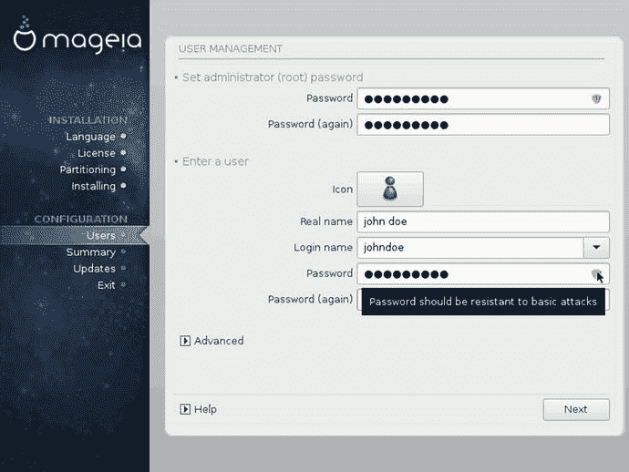

图 9-18。

The user information

接下来是一个奇怪的请求:安装工具要求您从一组选项中选择一个显示器(图 [9-19](#Fig19) )。大多数发行版会自动检测这个设置，所以现在很少看到这个请求。我怀疑这与虚拟机上的安装有关；在真实系统上安装这个发行版可能会跳过这一步。无论哪种方式，如果你看到这个屏幕，选择一个即插即用一个(或一个通用的)，如果你不知道你有确切的显示器。

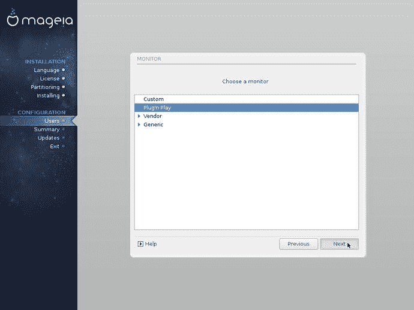

图 9-19。

Monitor selection

之后，安装程序会向您显示安装概要，包括系统和设置的详细信息；您可以在这里进行修改(图 [9-20](#Fig20) )。摘要分为四个部分:系统、硬件、网络&互联网和安全。有一些高级选项只能在这里更改(当然，您可以在安装后随时更改系统配置)。如果你不知道或不理解每个选项，就让它保持原样。

图 9-20。

The installation summary

接下来的步骤是决定你是否想要使用在线存储库来获得任何可能存在的软件包更新(图 [9-21](#Fig21) )。

图 9-21。

Use the online repositories to install the last security updates

如果您选择使用在线资料库，它将开始下载所有安全更新。下载所有安全更新后，屏幕会要求您确认是否要下载所有更新的软件包(图 [9-22](#Fig22) )。

图 9-22。

Confirmation screen to install all of the packages that have an update

会出现一些弹出对话框，要求您允许安装这些软件包。如果您允许，安装将在所有软件包安装到磁盘驱动器后结束。当您看到图 [9-23](#Fig23) 所示的屏幕时，您就知道安装完成了。

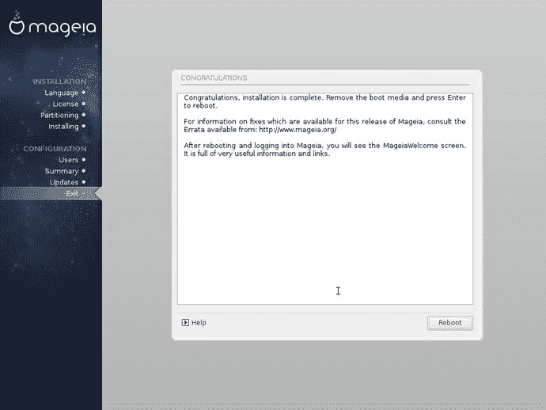

图 9-23。

It’s done. You have installed Mageia

现在是时候重启你的系统，第一次享受你的 Mageia Linux 了。启动系统时看到的第一个屏幕是传统 BIOS 和现代 UEFI 之间的最后一个区别。它们非常相似(都有引导加载程序 Grub ),但是在呈现方式上有细微的区别。图 [9-24](#Fig24) 显示了 BIOS Grub，图 [9-25](#Fig25) 显示了 UEFI Grub。

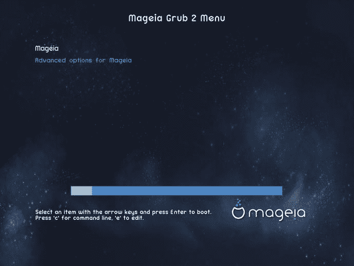

图 9-25。

The Grub screen in an UEFI system

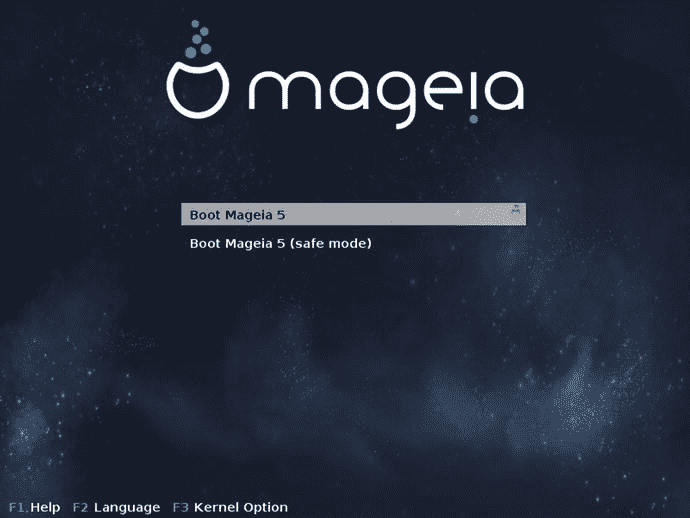

图 9-24。

The Grub screen in a BIOS system

登录界面是对你的新 Mageia 发行版的欢迎。输入您的密码并进入桌面。这个登录屏幕有一个更老的设计(图 [9-26](#Fig26) )，因为它仍然使用 KDE 4。

图 9-26。

The login screen for KDE

桌面是典型的 KDE 4，带有 Mageia 自定义背景(图 [9-27](#Fig27) )。几秒钟后，屏幕中央出现一个窗口，欢迎您加入分发(图[9-28](#Fig28))；你在其他发行版中看到过类似的东西。

图 9-28。

The welcome window

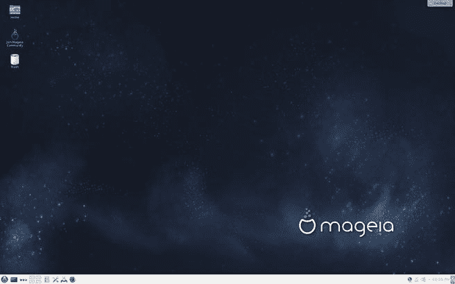

图 9-27。

The KDE Mageia desktop

像 OpenSUSE 一样，一个与 Mageia 非常相似的发行版，它检测到正在 VirtualBox 机器中安装，并向您显示一个警告，要求您将来宾附件更新到最新版本(图 [9-29](#Fig29) )。这是一个很好的接触。

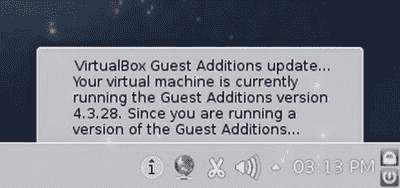

图 9-29。

Mageia detects VirtualBox

正如你所看到的，在 BIOS 系统中安装发行版和在 UEFI 系统中没有太大的区别，这也是为什么我选择传统的 BIOS 系统来安装所有以前的发行版。在一些发行版中，这些差异更大，但这些通常是高级的。

## 保持

Mageia 中的维护任务以类似于 OpenSUSE 的方式完成，您可以从 GUI 界面完成几乎所有的任务，而不需要使用命令行。发行版升级是个例外。

### 更新和管理应用程序

在 Mageia 中，最明显的途径是到控制中心执行基本的管理任务。这也是处理升级和管理应用的理想方式(图 [9-30](#Fig30) )。

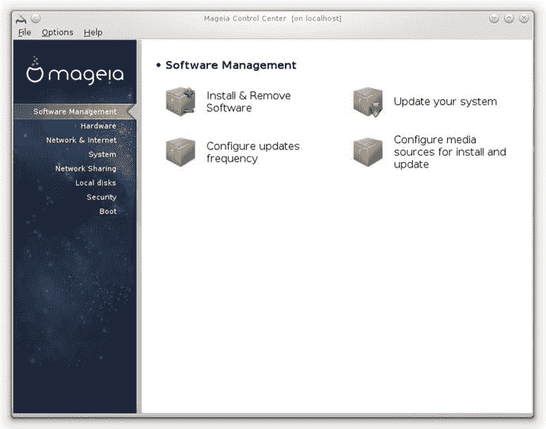

图 9-30。

The Software Management section of the Mageia Control Center

在那里，您可以管理或更新您的应用程序。这两个选项将分别打开一个 GUI 程序(如果你愿意，你可以直接调用它)，rpmdrake 和 drakrpm-update(图 [9-31](#Fig31) )。这些工具只是 urpmi 工具的前端，您可以选择从控制台使用它，这是许多用户更喜欢的。

图 9-31。

The Software Management tool (rmpdrake)

与其他发行版一样，当有新的更新可用时，您会收到警告，并且您可以从这里使用相同的对话框来执行任务。

### 升级

升级总是发行版中最敏感的任务之一；有些发行版没有一个合适的方法，而其他发行版有一个复杂的方法。Mageia 有两种选择:

*   当有新版本时，请按照出现的说明进行操作。这些包将从互联网仓库中获取。
*   Use the ISO image of the new release and select the upgrade option from the installation program. You can use the online repositories to update all the packages not included by default in the ISO image (and this is recommended). You can take a look at the upgrade option in the installation menu in Figure [9-32](#Fig32).

    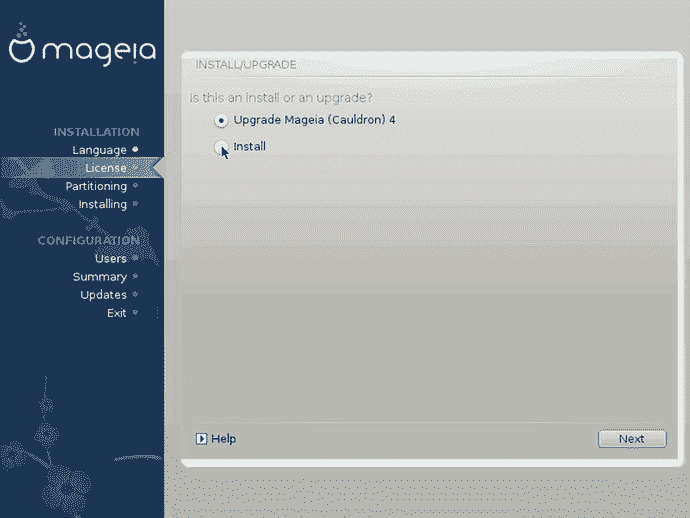

    图 9-32。

    An upgrade option is available on the installation program

不明显的方法是使用命令行和 urpmi 工具来升级发行版。这种方式最适合高级用户，但也是升级发行版最可靠的方式。

## 利弊

以下是我个人认为 Mageia 发行版的利与弊。这件事总有讨论的余地，但我已经尽可能客观了。

### 赞成的意见

*   Mageia 控制中心使得调整和管理发行版变得更加容易。
*   Mageia 使用 rpm 包格式。
*   它有一个定期发布计划。
*   这是一个社区驱动的发行版。
*   这是一个稳定的发行版，但有点过时。
*   它有着伟大的遗产，而且似乎延续了这一传统。
*   它是一个原始发行版，而不是一个衍生品(虽然 Mandrake 是红帽的一个分支)。
*   它提供了合理的安全性，并且很容易再加强一点。

### 骗局

*   它只有一个官方桌面版本。
*   与其他发行版相比，官方软件库中的可用软件包较少。
*   这不是一个纯粹的免费软件发行版。
*   对审美照顾不够。
*   它没有商业支持。
*   仅支持两种架构。
*   虽然它是一个非常受欢迎的发行版(大部分在欧洲)，但与其他优秀的发行版相比，它的社区并不是很大。

## 摘要

在这一章中，你看到了自由软件是 Linux 发行版生存的基础的完美例子。Mageia 是一个被社区拯救的废弃项目。它开始是曼德拉草，然后是曼德拉草，最后以 Mageia 的身份重新出现。社区也在不断改进发行版，着眼于过去来维护它的伟大遗产，另一方面着眼于未来来改进自己和 Linux 的未来。

在下一章，我将分析一个侧重于易用性和美观性的发行版，初级操作系统。