# 一、你的第一个树莓派

这一章是我们最终动手的地方。如果您急于开始运行，决定跳过介绍，这很好；你不会错过这一章的任何关键内容。但是，请注意在不久的将来去参观一下这个介绍，因为它会给你很多关于 Pi 的背景知识，以及它的特别之处。

现在，回到脏手！我们将从打开 Pi 的包装开始，并浏览您实际启动和运行它所需的一系列东西。一旦我们把所有的东西都连接起来，我们就需要为它的运行挑选一些东西——在这个例子中，是 Raspbian Linux(稍后会详细介绍)。一旦我们运行了 Raspbian，我们仍然需要对它进行配置，有些选项是技术性的，并且是特定于 Linux 的；但是不要担心，我们也有你。为了圆满完成这一章，我们将沐浴在 Raspbian 桌面的光辉中，然后前往第 2 章看看我们可以用它做些什么。

## 你新烤的圆饼来了

好了，邮递员刚刚送来了你期待已久的包裹，在急切地撕开带衬垫的信封后，你只剩下一个小盒子，(小是关键词)。你只是情不自禁地往信封深处看，看看是否有什么东西在底部徘徊。如果目测没有发现任何东西，毫无疑问，你会继续使用古老的忠实方法，把信封倒过来，摇一摇。虽然你可能会抖掉包装单(不知何故，它们似乎总是超级粘在里面)，但你不会找到其他任何东西。

亲爱的读者，当你点一杯树莓派时，这就是你将要得到的全部(见图 [1-1](#Fig1) )。

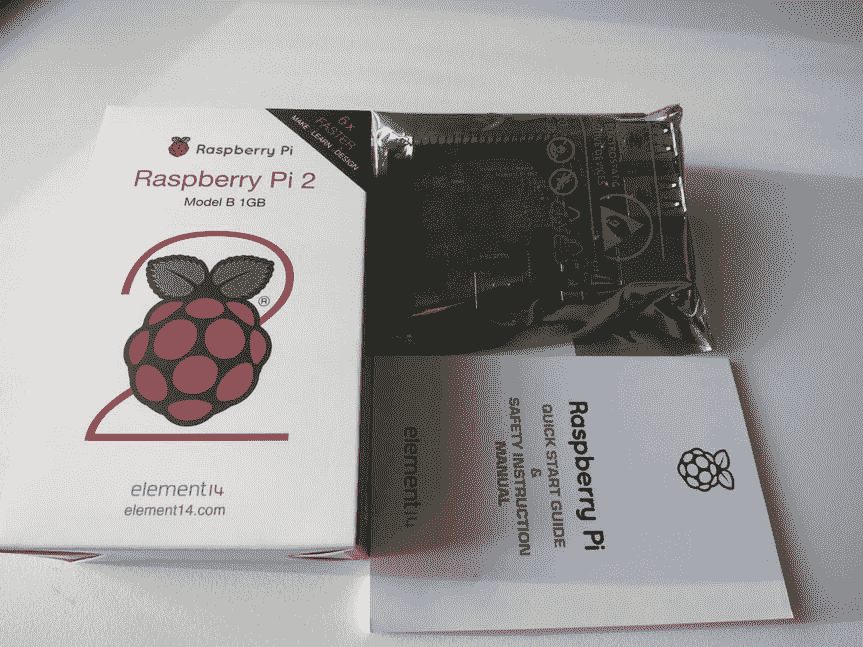

图 1-1。

What falls out of the envelope WHY A PICTURE OF JUST A BOX AND SOME BITS?

诚实的原因是，当这一切出现时，我们的第一个想法是，一定有什么东西不见了。是的，当你订购时，网站会告诉你这是你将得到的全部，这真的很有意义。

我们要强调的是，这是你得到的全部，还不足以让你的 Pi 挂上号，投入业务。你还需要一些其他的东西(你可能已经有了一些或者全部)，在开始的时候强调这一点是很重要的。在下一节中，我们将介绍您实际需要的入门工具包。

如果你还没有订购 Pi(或者正在等待它出现在邮件中)，图 [1-2](#Fig2) 显示一个坐在空白 DVD 旁边。

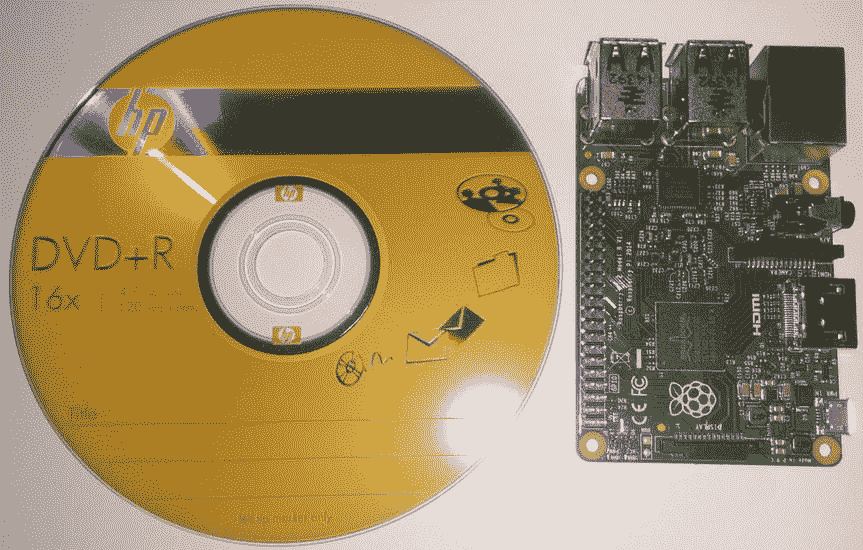

图 1-2。

A Raspberry Pi next to a blank DVD

尽管圆周率的大小是众所周知的，而且它装在一个如此小的盒子里，但直到你真正把它拿在手里，你才会意识到它有多小！在“啊”了一声之后(以及其他碰巧听到他们声音的人)，我们觉得是时候开始表演了。

这就是事情突然停止的地方。我们有了圆周率，但我们才刚刚意识到，我们根本不知道我们实际上需要什么来让它运行。尽管我们对这一切并不陌生，但我们已经让自己陷入了这一时刻，无论出于什么原因，都没有考虑到 Pi 需要任何特殊的东西(或者至少是你的普通极客类型的人不会在家里挂着的东西)。

如果你没有直接从德克斯特的实验室里拿出一柜子的杂物，你可能需要收拾一些东西。幸运的是，它们都很容易找到，你应该可以在当地的电脑商店买到你需要的任何东西。如果你不想去寻宝，许多公司会提供你需要的一切入门套件。因为这些套件变化很快，所以找到可用套件的最佳方式是上网搜索“raspberry pi starter kit”。

## 配料清单

为了把你的圆饼烤得完美，你需要以下原料:

*   树莓派
*   微型 USB 引线(用于电源)
*   USB 电源适配器(也用于电源)
*   HDMI 引线:Type A to Type A(连接显示器或电视)
*   HDMI 显示器
*   微型 SD 卡:8 GB 至 64 GB(用于存储 Windows 物联网需要 10 级)
*   微型 SD 卡读卡器
*   USB 键盘和鼠标

### 微型 USB 引线

如果你碰巧有一部安卓手机或 Kindle，很有可能你已经得到了一条线索，你可以重新使用它来驱动 Pi。这条导线实际上并不是用来传输数据的，尽管你可以从 USB 端口获取电力(你可以将其插入你的主 PC 或笔记本电脑)，但你不能将 USB 连接用于其他任何事情。不同类型的 USB 连接器很难描述，如果你还没有见过一个。请看图 [1-3](#Fig3) 中的一些例子。

图 1-3。

Different types of USB connectors Warning

尽管运气好的话，您可以从 USB 端口运行原始 Pi，但 Raspberry Pi 2 消耗的功率几乎是原始 Pi 的四倍，而且由于非协商 USB 仅提供少量电流，您无法从 USB 端口运行新 Pi。相反，你需要一个大功率的电源，比如那些用来给平板电脑充电的电源。请注意，即使他们声称提供足够的电力，他们也可能不会好好对待你的 Pi。如果您的 Pi 崩溃，连接网络有问题或通常有奇怪的行为，请首先检查您的电源。

你感兴趣的连接器是左边的第一个，称为微型 USB。请小心，因为在快速检查时，微型 USB 插头很容易被误认为迷你 USB 插头(左侧第二个)。你最不想做的事情就是专程去商店，然后回来却发现你拿错了！

### USB 电源适配器

如上所述，一个普通的 USB 端口可以为 A 型 Pi(没有内置以太网的那种)供电，但对于现代 Pi，你需要一个更强大的东西。

幸运的是，大量的设备已经采用 USB 作为充电方式，这意味着你可以非常便宜和容易地获得电源适配器。至于选择哪种适配器，这实际上取决于个人选择。然而，由于 B 型需要 800 毫安而没有插入任何其他东西，并且您总是希望有一点扩展空间，您可能应该争取获得一个至少可以提供 1000 毫安(或 1 安培)并且最好是 2000 毫安(2 安培)的适配器。从我们高度科学的测试(逛遍无数店铺，眯着眼看包装标签)来看，似乎 1000 ma 其实是最常见的额定值。我们确实遇到了一些额定为 500 毫安的，虽然这对于大多数 USB 设备来说已经足够了，但对于您的需求来说还不够。

### HDMI 引线

在过去的几年里，HDMI 已经成为将无数设备连接到显示器和电视的事实上的标准。这真的很方便，因为这意味着如果一个设备支持 HDMI，它可以很容易地连接到任何支持它的显示器。这听起来可能不那么令人印象深刻，但就在不久前，电视和显示器还是非常独立的东西，通常没有直接的方式连接，比如说，将计算机连接到电视或 VCR 连接到显示器(尽管有趣的是，如果你回到 20 年前，所有的家用计算机都直接连接到电视(例如，Commodore 64 或 Spectrum))。当然，你可以得到特殊的硬件，一些高端设备确实提供了一系列不同的连接器，但作为一个规则，这两个世界并没有真正混合。

幸运的是，Pi 使用 HDMI，所以我们可以忽略过去的烦恼。要将您的 Pi 连接到显示器，您需要一根“A 型到 A 型”导线。A 型是您在电视机或显示器背面可以找到的尺寸；你所要做的就是找到一根导线，通过 HDMI 将某个设备连接到电视上，并且两端尺寸相同。大多数消费电子产品使用 A 型，所以如果你有一台 Xbox 360 或你的笔记本电脑有 HDMI，你很可能已经有了正确类型的线索。

### 支持 HDMI 的显示器

你可能已经看到了这一点，但你需要某种支持 HDMI 的显示器。由于近年来被广泛采用，几乎每台新电视都配有一个或多个 HDMI 端口，大多数新显示器也是如此。如今，在电视上看到三个或四个端口是相当常见的，因为你需要这么多来连接你所有的新数字设备。

确定您的电视或显示器是否支持 HDMI 非常容易。你所要做的就是寻找一个物理 HDMI 端口。你更有可能在你的电视上找到它，而不是在你的显示器上，但是现在许多甚至更基本的显示器似乎都支持它。

在我们的例子中，结果是我们老化的显示器不支持 HDMI，尽管客厅的电视支持。当然，作为主电视意味着人们想在上面看电视，不可否认，我们不希望盘腿坐在大电视前的地板上，试图说服一个私家侦探开机。最后，我们决定买一个支持它的新显示器。虽然我们可以买一个 DVI 转换器，但我们决定不能错过获得一个新的闪亮玩具的机会。

如果你不能重复使用你的电视或电脑显示器，你应该能够很容易地得到一台支持 HDMI 的基本电视或显示器。

### 微型 SD 卡

大多数计算机使用某种硬盘作为它们的主要存储形式。即使笔记本电脑大小的磁盘也比 Pi 大，尽管较新的固态硬盘(SSD)型号消耗的功率很少，但它们肯定会大大增加 Pi 所需的功率。幸运的是，我们有一个替代方案。我们可以借用相机已经使用多年的技术:闪存，而不是使用硬盘这样的重型设备。尽管这些卡在空间和性能上无法与硬盘相提并论，但它们在电力使用方面非常出色，尽管它们比以前的同类产品更小；64 GB(您的 Pi 的最大值)仍然是一个相当可观的数量，可能比您的 Pi 需要的还要多。

微型 SD 卡是标准化的，所以没有太多要说的。如果可以的话，你确实想得到一张高性能卡(通常被称为 10 级卡)，但它们最终都做同样的工作。也就是说，我们听说过一些微型 SD 卡没有与 Pi 一起工作，但如果你坚持使用一个知名品牌，你会得到一个 10 级卡，你应该没事。Linux 在卡的性能上还是挺宽容的，但是 Windows 10 IoT 好像很挑剔。我们只能让它在 10 级 SD 上工作，这似乎得到了微软最新文档的支持。如果你想试用 Windows，你肯定需要一个 10 级的 SD 卡。

由于目前有许多不同类型的存储卡，图 [1-4](#Fig4) 显示了微型 SD 卡的实际外观。

图 1-4。

SD card with micro SD and adapter

最左边的卡是你典型的 SD 卡；最右边是一个微型 SD 卡。它们在智能手机(特别是基于 Android 的手机)中的使用已经变得非常流行，因为大多数手机都配有小卡(就存储空间而言)，所以购买更大的卡或在手机包装中加入一张卡并不罕见。如果你碰巧有一个这样的东西，你可以把它和你的 Pi 一起使用。

### 微型 SD 卡读卡器

现在你有了你的微型 SD 卡，你需要一些方法来实际使用它。Pi 为您提供保护，并内置了一个微型 SD 卡插槽。然而，它在设备上实际上没有任何其他存储，所以它实际上是一个空白，直到你插入一个安装了有用的东西(如 Linux)的 SD 卡。问题是，要把 Linux 放在卡上，你需要一个已经启动并运行的设备，它还能读写卡。这是一个典型的两难处境。即使你可以借用别人已经安装了 Linux 的卡，你也不能简单地把卡换掉，因为一旦你这么做了，你就再也没有 Linux 了！

再次感谢数码相机的普及，许多电脑都内置了读卡器。许多(通常被称为媒体个人电脑)带有一系列插槽，适用于各种不同的卡类型。所以很可能你已经有了一种阅读卡片的方法。如果你还没有读卡器，你可以从当地的电脑商店买到便宜的多卡读卡器。它们通常不贵，并且支持许多不同类型的卡。在你交出你的血汗钱之前，确保它有一个微型 SD 卡插槽(由于某些原因，通常隐藏在不同的一侧)!作为参考，我们使用的适配器类似于图 [1-5](#Fig5) 中的适配器。

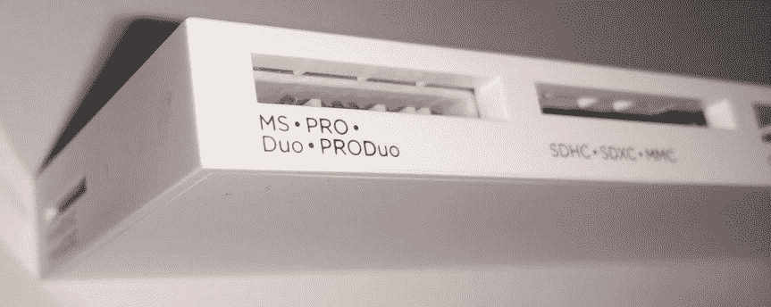

图 1-5。

Multicard reader (micro SD reader is on the left edge near the bottom)

### USB 键盘和鼠标

最后但并非最不重要的是良好的旧键盘和鼠标。尽管 Pi 很高级，但它还没有心灵感应，所以你需要一些方法来控制它。这是常识，但是随着现代计算机通常配备无线键盘和鼠标，以及相当多的使用蓝牙而没有 USB 适配器的计算机(甚至一些有适配器的计算机也已知会导致问题)，您可能会发现您当前的键盘和鼠标无法与您的新玩具一起工作(恐怕 Pi 上没有蓝牙)。这里真的没有必要像任何标准的键盘和鼠标一样详细介绍，这主要是提醒你在出去购买 Pi 制作材料之前检查一下你实际上有什么，以避免当你回到家发现你完全被卡住时的无尽沮丧。

### 呼，我们完了！

我们终于拥有了我们需要的一切！将所有这些东西挂在您的 Pi 上非常容易，特别是因为每个项目都有独特的形状，所以它只能放入一个插槽中(见图 [1-6](#Fig6) 中的成品 Pi)。

图 1-6。

A fully loaded Pi

如果你把所有东西都放在一起，插上电源，打开你的电视，你应该会看到…一个全黑的屏幕。

### 不要慌！

当你的个人电脑或笔记本电脑启动时，有一个叫 BIOS 的软件为你启动一切。它测试内存，设置基本显示，并允许您的所有设备初始化。在一些机器上(特别是苹果的)，机器会有一个 EFI 而不是 BIOS。对于所有的意图和目的(至少从我们的角度来看)，它们基本上是等价的。不管使用什么技术，最终是这个系统将控制权交给你的引导装载程序，这个软件负责启动你的操作系统。BIOS 本质上是非常嘈杂的，如果你出错了，它要么会发出很多哔哔声(带有一些你只能在 3 年前扔进垃圾箱的 BIOS 手册中找到的神奇数字代码)，要么在屏幕上显示一些有用但神秘的消息。简而言之，它可能做不到你想要的，但至少你知道你的电脑还活着。虽然它有一个红色的小 LED“亮着”，但除非它的 SD 卡上有一个可启动的操作系统，否则 Pi 不会做任何事情。如果你期待某种闪屏或其他生命迹象(举起手；我们知道我们是)，你运气不好(可能认为你有一个死了的 Pi)。

现在你知道了你需要什么来恢复 Pi 的生命(一个可引导的操作系统),是时候进入我们的主计划的第二阶段，给我们一些 Linux 了！

## Linux 操作系统

由于这是一本针对初学者的书，我们将花点时间来谈谈 Linux，它来自哪里，它有什么特别之处，以及一些时常让人犯错的小陷阱。如果你已经知道这些东西(或者根本不关心)，请随意跳到下一节“下载 NOOBS”对于那些想快速复习的人来说，继续读下去吧。

### 什么是 Linux？

啊，这个简单的问题打开了一个很多人都想方设法避免的大麻烦。原因是，在技术术语中，Linux 意味着一件事，但在一般的讲话中，它往往意味着另一件事。当谈到一般的操作系统时，我们认为微软视窗和苹果 OSX 是独立的整体。如果你说“我运行 Windows”，每个人都知道你在说什么。有了 Linux，就有点不一样了。

Linux 只是一个操作系统内核，这意味着它处理所有低级的零碎东西，如处理设备驱动程序，并提供对网络和硬盘的轻松访问。真正让 Linux 变得可用的是围绕它的所有软件。这没什么大问题，但是当你意识到人们对应该用什么软件包装它有不同的看法时，事情就变得复杂了。谈到计算，没有简单或次要的观点！

由于这个软件是开源的，任何人都可以用他们喜欢的任何方式把它组装起来，人们已经能够构建他们自己的 Linux 发行版。这是一个以 Linux 为核心的操作系统，但其周围的生态系统是为满足构建它的人的目标而建立的。例如，Red Hat Enterprise Linux (RHEL)被构建为健壮、可支持和长期稳定的。另一方面，Fedora 大约每 6 个月发布一次，每个版本都有最新最好的东西。Gentoo 要求您从源代码构建您的软件(因此它可以完全针对您的机器进行优化)，Debian 竭尽全力以引入新功能为代价来保持稳定和安全。

OPEN SOURCE

在过去，当计算机价格高达数百万美元时，销售的是机器本身，而不是其上运行的应用程序。为了让你买他们的机器，一家公司为你编写软件是很常见的做法。直到计算机成为商品，价值才突然体现在软件中，公司开始保护他们编写的软件。做到这一点的一个方法是提供没有源代码的现成软件(这实际上是如何制作软件的蓝图)。这意味着你不能改变软件或做出改进来适应你不断变化的需求。

许多人认为软件应该总是附带源代码，这样人们就可以进行修改。开源围绕着人们能够自由交换、修改和集体改进软件的想法。只有当源代码被免费提供并且被允许(通过开放源码许可)进行这些修改时，才能做到这一点。

整本书都可以并且已经写了这个主题，但是你可以找到彼得几年前在他的大学里关于这个主题的演讲: [`http://www.youtube.com/watch?v=c-1LQIGh6cI`](http://www.youtube.com/watch?v=c-1LQIGh6cI)

那么哪个最好呢？嗯，那要看你的需求了！没有完美的分布。最适合特定工作的人。对于 Pi，官方支持的平台是 Raspbian，它基于 Debian 发行版。因为它是受支持的，也因为它是最容易使用的(而且很可能是出现问题时更新和修复最快的)，所以在本书中我们将坚持使用 Raspbian。如果你确实喜欢稍微不同的东西，Brendan Horan 的书(也来自 Apress)，《实用树莓 Pi》将向你深入展示如何安装 Fedora，以及(如果你感觉特别勇敢)如何定制 Gentoo！

当 Linux 内核在 20 世纪 90 年代初首次亮相时，没有人真正意识到它将对计算世界产生的巨大影响。在此之前，开源软件已经存在了很长时间，并且已经发布了无数用于 UNIX 平台的工具(比如令人敬畏的 GCC 编译器)。然而，它们只是工具和软件包。他们仍然需要一个专有的操作系统来运行(当时唯一可用的操作系统)。为了与开源精神完全兼容，我们需要一个开源内核来驱动这些系统，而这正是 Linux 所提供的。虽然许多人会谈论这是如何给计算世界带来自由和希望的，但是我们将把你从这个特定的演讲中拯救出来(尽管不可否认它有相当多的真实性)，并且简单地说是 Linux 内核真正把开源带到了普通大众的眼前。

现在全世界都有了 Linux，我们到底能用它做什么？几乎任何我们喜欢的东西——比如在我们的 Pi 上免费安装。

### noob 简介

在这本书的第一版中，我们下载了一个 Raspbian 图像文件。当时，所有不同的 Pi 发行版都是作为图像文件分发的。你所要做的就是下载感兴趣的图像，并把它写到你的 SD 卡上。

在过去的几年里，不仅仅是 Pi 的硬件有所改进。现在，您可以下载一个 Pi 安装程序，它甚至更容易设置，并提供了一个完整的操作系统列表供您选择(尽管我们仍将使用 Raspian，请查看“为什么使用 Raspian”侧栏)。

NOOBS 的开发是为了让 Pi 用户能够以最少的麻烦和头疼来选择和安装操作系统。对于经验丰富的用户来说，写一张 SD 卡并不麻烦，但对于大多数用户来说，这是一件非常陌生的事情。这也意味着理解成像是如何工作的，以及复制一个文件和把它写成图像之间的区别。

对 NOOBS 来说，这已经成为过去。首先，不是下载一个图像文件，而是下载一个 zip 文件，这是现在几乎每个人都熟悉的东西。然后将该 zip 文件的内容直接提取到 SD 卡上。好吧，就这样，你完了！只需弹出 SD 卡，启动您的 Pi 就可以了。

那么这是如何工作的呢？嗯，在你的普通电脑上，你需要设置好一切，这样 BIOS 就能找到操作系统并启动它。Pi 的不同之处在于，它不附带传统意义上的固件，而是从 SD 卡加载所有内容。这使得启动有点慢，但是使得 Pi 基金会很容易更新一些东西，否则需要特殊的工具来更新。因此，Pi 在 SD 卡上寻找一个特定的文件，并简单地执行它。在 NOOBS 的例子中，你正在运行一个安装程序，从那里，你可以选择你想要安装的操作系统——所有这些都通过一个漂亮的图形界面！

### 两个角落

你可以下载两个版本的 NOOBS。第一个是完整的安装程序，简称为 NOOBS，第二个是 NOOBS 建兴。他们之间唯一的实质性区别是，NOOBS 与拉斯比安和 NOOBS 建兴不附带任何东西。请记住，NOOBS 是一个安装程序，而不是操作系统本身，所以它需要有一种方法来检索你感兴趣的操作系统。在所有情况下，如果你不想拉斯扁，NOOBS 将上网，并从互联网上下载发布。如果你真的想要拉斯扁(老实说，你可能真的想要)，那么你还不如得到完整版的 NOOBS。另一方面，如果你只对其他操作系统感兴趣，下载完整版绝对没有好处，你应该坚持使用 NOOBS 精简版。

### 下载 noob

无论你喜欢哪个版本的 NOOBS，你都可以通过图 [1-7](#Fig7) 所示的 Raspberry Pi 下载网站获得。

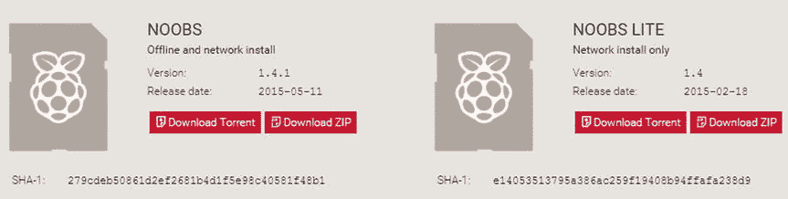

图 1-7。

Pick your NOOBS

[T2`https://www.raspberrypi.org/downloads/`](https://www.raspberrypi.org/downloads/)

正如我们之前提到的，有两个版本可供下载。如果你正在阅读这本书，那么我们强烈建议你选择完整版的 NOOBS，因为你会想要安装 Raspbian。不可否认的是，你仍然可以用 NOOBS lite 来做这件事，但是如果你想安装一些 Pi，你就必须在每次安装时有效地下载 Raspbian。

WHY RASPBIAN?

正如您在下载页面上看到的，有许多发行版可供选择，尤其是如果您在其他地方使用过 Linux，您可能会倾向于选择 Raspbian 以外的发行版。然而，在下载这个奇特的发行版之前，您应该知道大多数使用 Pi 的人都运行 Raspbian——因此大多数支持、博客文章和教程(更不用说这本书)都是基于它的。这意味着如果你选择了其他的事情，如果事情没有按计划进行，你会发现很难得到帮助。

另一个更微妙的问题是，Raspberry Pi 是基于 ARM 的设备。它的工作方式和你的电脑不太一样。例如，Pi 没有 PCI 总线，所以任何希望有 PCI 总线的工具(而且不止一个)都不能工作。这些其他发行版也有不少缺陷，它们可能不如 Raspbian 维护得好。简而言之，如果你不选择拉斯边开始，你将承担更多的工作。

## 把 NOOBS 放到你的 SD 卡上

"把 Raspbian 放到你的 SD 卡上并不像简单地拷贝文件那么简单."–在第一版中，我们就是这样开始这一部分的。然而今天，它就像将文件复制到 SD 卡一样简单。首先，我们需要确保您的 SD 卡已准备好使用。在本例中，我们将使用 Windows，因为这是大多数人都会使用的。然而，如果你使用的是 Mac，这个过程基本上是一样的，你可能不会有麻烦。

首先让我们插入 SD 卡。在“This PC”下，我们可以看到卡已被检测到(图 [1-8](#Fig8) ):

图 1-8。

Freshly inserted SD card

这是一张从包装上直接拿下来的卡片(说真的，我还在流血，因为我试图把它从“易开”包装上撕下来)。正如你所看到的，它上面没有文件，这是安装 NOOBS 的一个重要前提(图 [1-9](#Fig9) ):

图 1-9。

The card is empty

到目前为止一切顺利，现在我们需要做的就是打开 NOOBS 的 zip 文件，并将内容直接提取到这个磁盘中。如果你没有做任何特别的事情，你的浏览器会将 NOOBS 下载到你的“下载”文件夹中。你正在寻找一个看起来像这样的图标(图 [1-10](#Fig10) ):

图 1-10。

What you’ll see in Explorer

当你双击打开它时，(假设你没有安装一个不同的应用程序来处理 zip 文件，如 WinZip)你会看到看起来像一个普通的文件夹，里面有文件(图 [1-11](#Fig11) ):

图 1-11。

The contents of the NOOBS zip file

现在我们只需要提取它。如果你点击“提取”，你会看到一个弹出菜单。你可以忽略左边的东西，你想要右边的“全部提取”图标 [1-12](#Fig12) ):

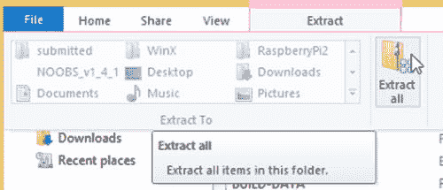

图 1-12。

Extract all

如果你已经遵循了这些步骤，你将在这个阶段领先，因为你已经有一个干净的 SD 卡插入你的电脑了。在前面的例子中，我们向您展示了我们的 SD 卡被拾取为“E:”。我们点击浏览并选择我们的 SD 卡，你应该做同样的事情。当它返回主屏幕时，它将只显示设备名称，在我们的例子中当然是“E”:(图 [1-13](#Fig13) ):

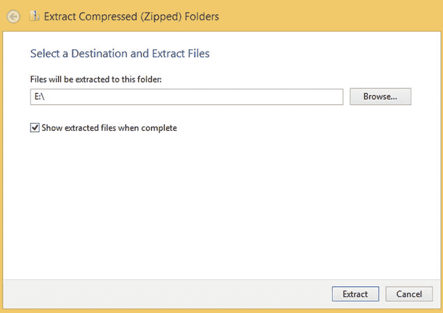

图 1-13。

Extract everything to the SD card

一旦你选择了你的 SD 卡，你可以按下提取按钮。Windows 会给你一个漂亮的进度条。如果你的电脑和我们的一样，这将需要一点时间，所以现在可能是一个很好的时间去拿咖啡。Windows 总共花了大约五分钟的时间将所有文件解压到 SD 卡上。我们使用的是 10 级卡，所以如果你使用的是稍旧的卡(比如 4 级卡)，那么你可能会发现它会花更长的时间(图 [1-14](#Fig14) ):

图 1-14。

This can take a while to copy, but at least it’s pretty!

完成后，它会打开您的 SD 卡，并显示您的文件。如果一切正常，它应该与我们之前在 zip 文件中看到的完全相同。如果你看到类似下面的屏幕截图，那么你就成功了。现在剩下的就是实际尝试用它启动你的 Pi(图 [1-15](#Fig15) ):

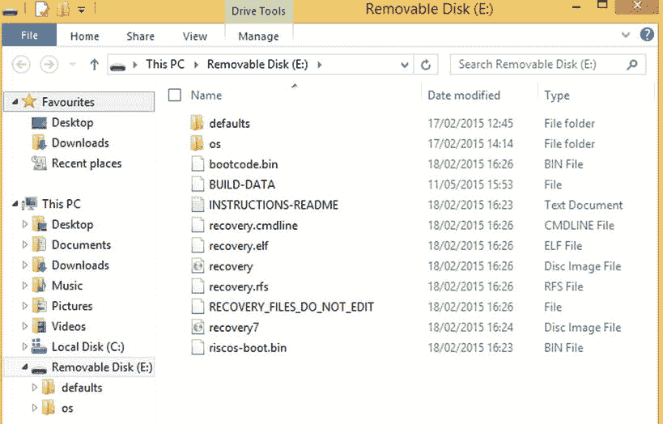

图 1-15。

What your SD card should look like after you’re done

好吧，这有点乏味，但是相信我们，这比我们必须使用的旧方法要简单得多。所以事不宜迟，让我们看看我们是否可以预订您的 Pi(图 [1-13](#Fig13) )！

## 第一次开机

终于是时候启动你的 Pi 了！有了新镜像的 SD 卡，我们终于可以开始了。插入键盘、鼠标和显示器，并将 SD 卡插入 Pi。你现在所要做的就是接上电源线，你就可以开始了！一切正常，您最初应该会看到如图 [1-16](#Fig16) 所示的屏幕。

图 1-16。

The Pi’s first boot—it lives! If you can see something similar, congratulations, your Pi is up and running! You can skip to the next section. If not, there are a few common things that might have gone wrong

首先要检查的是您的 Pi 是否有一个漂亮的红色发光电源 LED。现在我们知道这听起来是显而易见的，我们知道这可能是你检查的第一件事，但是不检查它也是最容易犯的错误。如果你的桌子看起来像我们的一样，你会有一大堆电缆。不难看出您可能插错了电缆，或者您使用的电缆实际上没有插上电源(例如，一些笔记本电脑在睡眠时会关闭 USB 电源)。不管怎样，这是你应该首先检查的，因为如果你犯了一个错误，只有你会知道。这比在论坛上进行长时间的讨论，试图获得帮助，然后才意识到哎呀！你忘了插上电源。

第二件要检查的事情是你是否在电视或显示器上选择了正确的输入。如今，大多数电视都有多个输入，显示器通常不会默认 HDMI(我们的没有)，即使这是它们接收的唯一输入信号。显然，我们不能告诉你如何准确地修复或检查这个，因为这完全取决于你使用的设备。然而，浏览不同的输入来查看 Pi 是否出现应该是相当容易的。在一个有趣的例子中，尽管电视上的端口清楚地显示 HDMI2，但 Pi 实际上在 HDMI3 上是可见的。我们不知道这是为什么，但是如果我们在摆弄圆周率之前能想到浏览一下输入，我们就能避免一些痛苦。

第三件要检查的事情是 SD 卡是否完全插入其插槽。Pi 实际上什么都不会做，除非它能找到卡并从中启动，所以如果你得到的只是一个黑屏，这很可能就是原因。如果你确定卡插入正确，但你仍然没有任何运气，它可能是出了什么问题，当你复制文件到卡。在那种情况下，翻到最后一节，再来一遍。如果您仍然没有任何进展，并且您已经检查了所有的东西都插好了，您的显示器上有正确的输入，并且您有一个愉快地发光的电源 LED，那么它可能是更麻烦的事情。不幸的是，没有和你一起看着你可怜的 Pi，我们真的不能给出任何更具体的建议。幸运的是，你并不孤单；在 Raspberry Pi 论坛上有很多人愿意帮忙。要访问论坛，请前往 [`www.raspberrypi.org`](http://www.raspberrypi.org/) 并点击论坛链接(就在树莓派标志的左下方)。这将带你到主论坛页面；您正在寻找的特定板是使用 Raspberry Pi 的基本用法和设置。

### 用 NOOBS 安装拉斯扁

过一会儿，您应该会看到 NOOBS 启动并开始初始化自己(图 [1-17](#Fig17) ):

图 1-17。

NOOBS setting itself up

在这张截图中，你可以看到 NOOBS 已经知道了 Raspbian，右边的图标(一个 SD 卡)告诉你操作系统已经在卡上了，可以使用了。现在，理论上接下来应该发生的是，你应该看到这样的屏幕(图 [1-18](#Fig18) ):

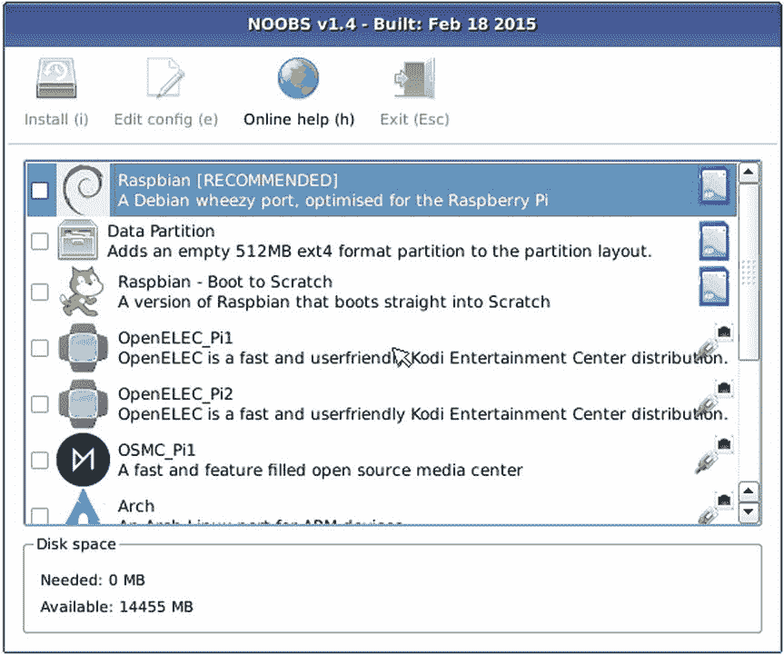

图 1-18。

NOOBBS detected lots more operating systems to install

NOOBS 在网上找到了一些可供选择的操作系统，你可以安装它们。它们没有 SD 卡图标，而是有一个以太网连接器，显示它们“在网络上”可用——换句话说，你需要下载它们。现在我们说“理论上”的原因是因为我们不能让它开箱即用。事实上，我们不得不摆弄 IP 地址和各种各样的东西，以便让安装程序真正检测在线操作系统。事实上我们得到的是这个(图 [1-19](#Fig19) ):

图 1-19。

NOOBS network init failed

幸运的是，我们使用的是 NOOBS 的完整版本，所以我们不能上网下载其余的操作系统也没关系。我们预计这是我们的 Pi 或我们的设置的问题，这可能是你自己不会看到的。也就是说，我们希望提到它，以防它突然出现，并向您保证，即使有这个问题，您仍然可以安装 Raspbian。

好了，让我们实际开始安装过程！您所要做的就是勾选 Rasbian 左侧的方框，然后按下“安装”按钮(图 [1-20](#Fig20) ):

图 1-20。

Time to install Raspbian

你会得到一个最后的警告，这将删除 SD 卡，但这是一个有争议的点，因为你必须删除卡，让 NOOBS 在那里摆在首位。尽管你完全确定一切都会好起来，但再次检查总是一个好主意(图 [1-21](#Fig21) ):

图 1-21。

Last chance to back out

一旦你点击了是，NOOBS 将开始安装拉斯扁，你所要做的就是等待。您将看到一些有用的信息屏幕(出于明显的原因，我们不会在此重复这些信息)，而且，可能是时候装满那个咖啡杯了，因为从同一个 SD 卡复制大量数据是一个缓慢的过程，不管是不是 class 10 SD 卡(图 [1-22](#Fig22) )。

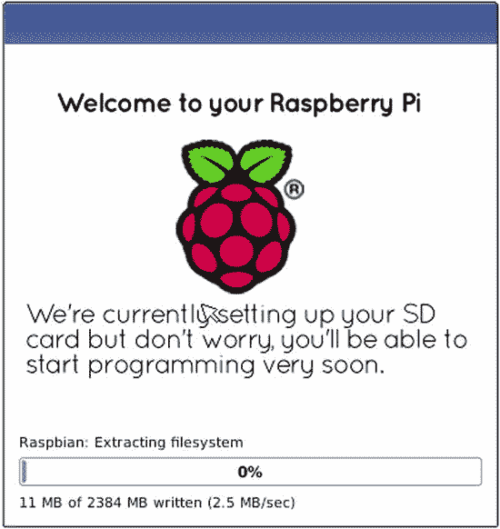

图 1-22。

Raspbian is installing

最后，安装好所有东西(图 [1-23](#Fig23) ):

图 1-23。

Finally everything is installed

现在是时候重启你的 Pi 了。这一次，当它重新启动时，NOOBS 将离开，取而代之的将是拉斯边。达到这个阶段花费了相当多的时间，但是我们保证这是值得的！

当它启动时(这次是真的)，您应该会看到类似这样的内容(图 [1-24](#Fig24) ):

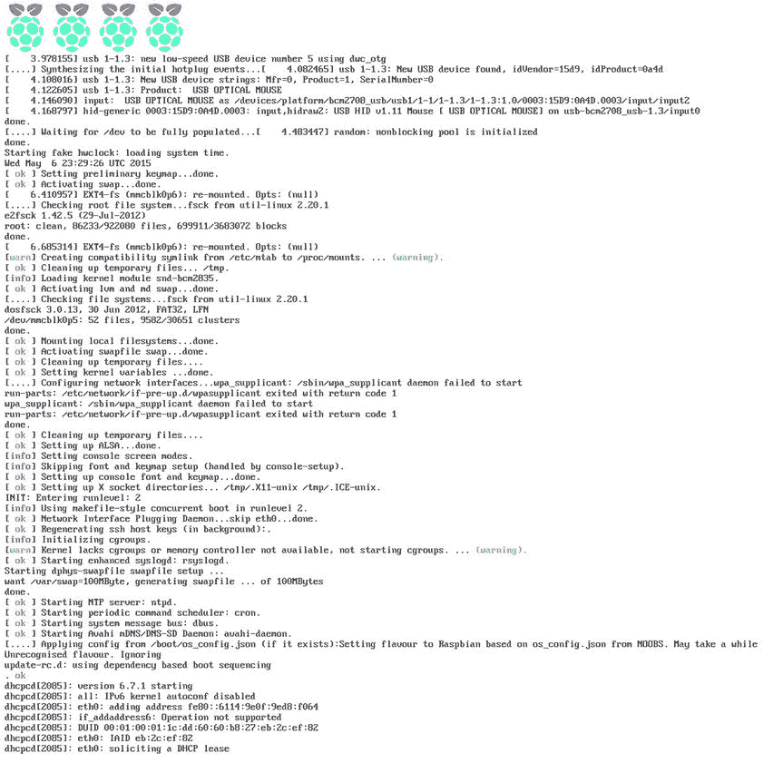

图 1-24。

Finally Raspbian is booting!

## 配置您的 Pi

在一连串难以理解的文本之后(尽管我们确信它对某人来说意味着什么),你应该会看到如图 [1-25](#Fig25) 所示的配置。在这里，我们将配置您的 Pi 用于一般用途，以便下次您打开它时，迎接您的将是一个漂亮的桌面，而不是一些粗短的文本。

图 1-25。

First boot: time to configure your Pi!

我们在这里只讨论基本的配置选项(一旦您的 Pi 启动并运行，您随时可以返回并更改它们)，因为我们希望您尽快地使用一台工作的计算机。

### 扩展文件系统

第一个感兴趣的选项是“扩展文件系统”。当您直接从磁盘映像安装 Raspbian 时，它只占用少量空间。开发者不知道你的 SD 卡有多大，没有人想下载 16GB 或更大的图像，这样他们就可以充分利用卡上的空间。为了解决这个问题，Raspbian 支持在安装后扩展磁盘，以充分利用磁盘空间。然而，这是 NOOBS 已经为你做的事情，所以如果你尝试这个选项，你可能会看到这个消息(图 [1-26](#Fig26) ):

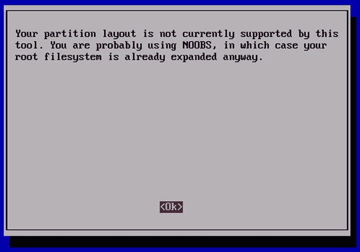

图 1-26。

The filesystem is already expanded if you used NOOBS

我们在这里提到它的原因是，在某些时候你可能会决定直接从一个镜像安装，如果你这样做，你肯定想使用这个选项！

### 引导至桌面

下一个选项允许我们配置 Pi 将以何种模式引导。在下一章，我们将带你对桌面进行一次简短的游览，对于书中的大多数主题，我们假设你真的坐在 Pi 前面。考虑到这一点，我们想引导到桌面。因此，选择此选项，然后从下一页的列表中选择“以用户‘pi’身份登录桌面”(图 [1-27](#Fig27) ):

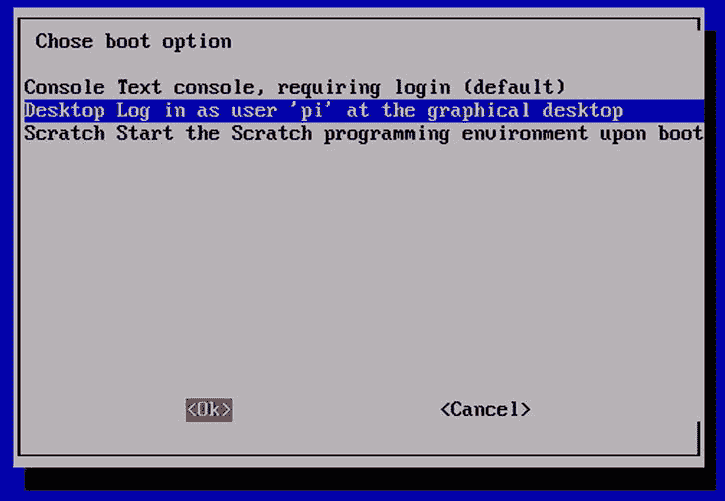

图 1-27。

Boot to the desktop

### 更改用户密码

接下来，我们将更改`pi`用户帐户的密码。这是您将在整本书中使用的帐户，对于大多数人来说，这将是您在 Pi 上需要的唯一帐户。目前，虽然密码被设置为`raspberry`并且是默认的，这意味着任何人都可以登录到您的 Pi。虽然保护您的 Pi 免受未授权入侵者的攻击可能不是您优先考虑的事情，但是为了以防万一，改变这一点仍然是一个很好的做法。稍后，您可能会通过互联网提供您的 Pi，在兴奋之余，您可能会忘记您实际上并没有去更改密码。坏事会发生。所以，让我们抓住机会，现在就做出改变。高亮显示`“Change User Password”`并按回车键，你会看到类似图 [1-28](#Fig28) 的东西。

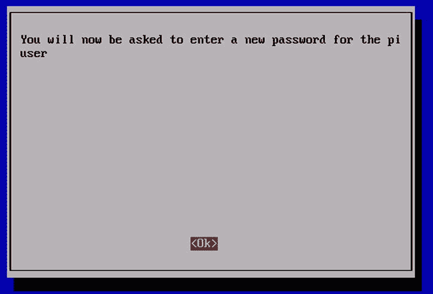

图 1-28。

Changing your password

当你按回车键时，配置工具将执行标准的`passwd`命令，这就是为什么你看到的是文本提示而不是漂亮的菜单。只需输入您的新密码(记住它是区分大小写的:`HeLLo`与`hello`或`Hello`不同)并按回车键。出于安全原因，密码不会显示在显示屏上，也不会显示任何星号来让您知道您确实输入了一些东西。然后会提示您再次输入密码(图[1-29](#Fig29))；按回车键后，将得到如图 [1-30](#Fig30) 所示的确认。再次按回车键，你将回到主菜单。

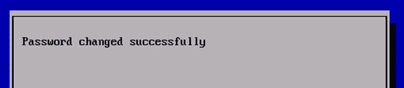

图 1-30。

Password changed successfully

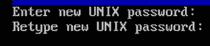

图 1-29。

Enter your password

### 设置一些国际选项

Linux 的一个优点是它对国际化有很好的支持，并且可以(相对)容易地定制您的安装来满足您的需求。我们可以配置许多项目，如图 [1-31](#Fig31) 所示。当您设置每个选项时，您将被带回到主菜单，因此要更改下一个设置，只需再次选择国际化菜单:

图 1-31。

International Settings menu

首先是配置您的语言环境。通过告诉 Linux 你在世界的哪个地方，它可以决定有用的事情，比如数字之间的分隔符和使用哪个货币符号。例如，在美国，我们可能会写 1，000.00，但在欧洲的许多地方，它会被写成 1.000，00。无论哪种方式，为了最大限度的舒适和确保一切看起来正确，我们需要设置区域。突出显示“更改区域设置”选项，然后按回车键。

现在，您将看到一个可供选择的不同地区的详细列表(参见图 [1-32](#Fig32) )。名称中的前两个字母指定语言，而第二对字母指定地区差异。例如，en_US 将是为美国用户定制的英语，但是 en_GB 将具有特定于在英国说英语的人的设置。您应该选择最符合您需要的语言和国家对，并通过按空格键来选择它们。你可能想要 ISO-8859 和 UTF-8 两个版本。如果您决定两面下注并选择所有语言环境，请注意您将会等待很长时间，因为 Pi 会为您生成所有的语言环境设置。事实上，我们尝试了这个选项，在等待了很长时间才生成两个语言环境后，我们厌倦了并拔掉了插头。选择所需的语言环境后，按一次 Tab 键突出显示 OK 按钮，然后按 Enter 键进入下一屏幕(语言环境生成后，参见图 [1-33](#Fig33) )。在这里你需要选择你想要默认使用的区域设置(见图 [1-30](#Fig30) )。做出选择后，高亮显示并按 Enter 键。然后，您将看到区域设置生成过程(见图 [1-34](#Fig34) )，完成后(这确实需要一段时间)，我们将再次回到主配置页面。

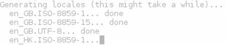

图 1-34。

Generating locales

图 1-33。

Select the default language

图 1-32。

Picking your locale

### 更改时区

“更改时区”选项和它说的差不多。选择此选项后，您将看到一个区域列表(如图 [1-35](#Fig35) 所示)。在本例中，我们正在配置 Pete 的 Pi，因此我们选择了亚洲。下一个屏幕将给你一个微调选择的机会，并选择你的国家或城市(见图 [1-36](#Fig36) )。一旦你找到了最接近的匹配，选择该选项并按下回车键。

图 1-36。

Pick your closest city

图 1-35。

Pick your region

### 配置键盘

下一个感兴趣的选项是`“Configure Keyboard”`。默认情况下，Raspbian 假定一个 UK 键映射，但是您可能想要其他的东西。不过，要注意的是，拉斯边知道大量的键盘，而且数量之多可能会让人困惑。例如，你知道你有一个通用的 104 键键盘还是实际上是一个 105 键的版本吗？我们也不确定，所以我们坚持使用默认的:如图 [1-37](#Fig37) 所示的通用 104 键 PC。

图 1-37。

Choosing your keyboard type

如果你能找到你确切的模型，尽一切可能自由选择它。如果你不确定，你最好跟随我们的领导，坚持默认设置。一旦你选定了键盘，按下回车键进入下一个屏幕。现在我们要选择我们想要使用的键映射。默认情况下，它列出了各种英国键盘映射(如图 [1-38](#Fig38) 所示)，但是如果你没有足够幸运拥有一个英国键盘，将该栏向下移动到其他，按 Enter，然后滚动列表以找到更适合你需要的东西。一旦你找到了正确的键盘，再次按下回车键进入下一个屏幕。

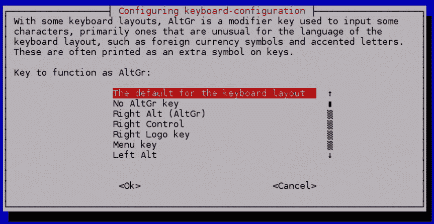

图 1-39。

Customize your keyboard configuration

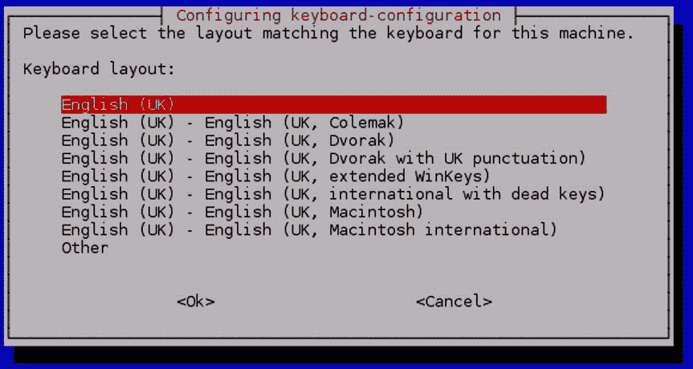

图 1-38。

Choose your layoutIf you’re not sure what to select from the menu (shown in Figure [1-39](#Fig39)), you’re not alone

对于大多数人来说，键盘默认值就可以了，因为它们将包括您的特定键映射已经提供的任何特殊组合键。这是一个如果你需要做出改变的时候，你可能已经知道为什么和选择什么。如果你有任何疑问，只要保持默认选择，并按下回车键。现在你会看到另一个看起来可疑地像它的前任的菜单(如图 [1-40](#Fig40) 所示)，至少在知道挑选什么方面。同样，你可能已经知道你是否需要在这里改变什么；如果你不确定，你应该通过按回车键来选择默认值。

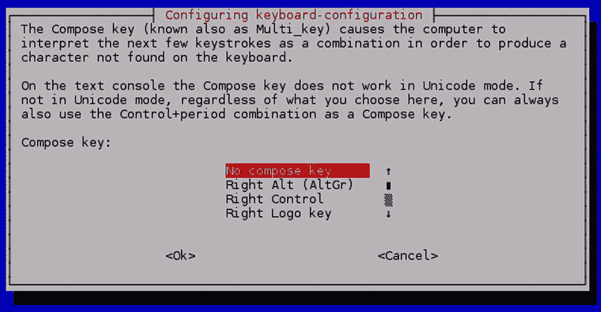

图 1-40。

Customize your keyboard some more

下一个菜单(如图 [1-41](#Fig41) 所示)对老派的 Linux 用户来说毫无意义。过去，如果您的 GUI 决定放弃您，您可以通过按住 Ctrl + Alt + backspace 有效地“重启”会话。随着 GUI 变得越来越稳定，Linux 变得越来越主流，这个特性经常被禁用。我们已经很多年没用过它了，尽管我们碰巧认为它很有用。默认情况下是否定的，这可能就是您想要的。如果您发现自己渴望这个特殊的特性，您可以随时返回并更改它。要选择默认值(并最终返回主菜单)，只需按 Enter 键。

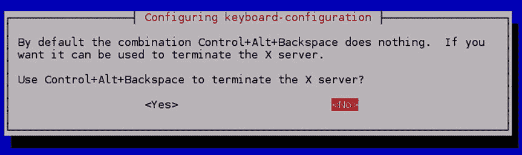

图 1-41。

Do you want to enable the X server kill switch?

### 启用摄像头

此菜单允许您启用摄像机。这里特指 Pi 基金会提供的摄像头，不影响 USB 网络摄像头等其他摄像头。这是默认设置为禁用，但你可以在这里启用它，如果你碰巧有一个。我们没有在这里包括截图，因为真的没有什么可看的。

### 添加到栅格

Rastrack 是一个非官方项目，要求自愿注册，以帮助了解 Pi 在世界各地的使用情况。如图 [1-42](#Fig42) 中的广告词所示，这只是为了好玩，但许多人并不特别希望他们的 Pi 被跟踪。幸运的是，Rastrack 是自愿加入的，所以你可以完全忽略它，除非你想参加。

图 1-42。

Register on Rastrack

如果你想参加，只需按照简单的屏幕要求一些细节。一旦你输入了所有东西，它们将被提交给 Rastrack，你将返回到主菜单。

### 使…超频

爱好者长期以来一直喜欢超频他们的 CPU，也就是说，让它们运行得比设计的更快更热。Pi 也支持这一点，许多人认为它非常安全。然而，我们建议不要这样做，如果 Pi 不够快，不能满足您的开箱即用需求，那么您可能不应该使用 Pi 来做您正在做的任何事情。

另一方面，如果你真的想让你的 Pi 跑得更快，你可以从这个菜单中选择一个速度(图 [1-43](#Fig43) ):

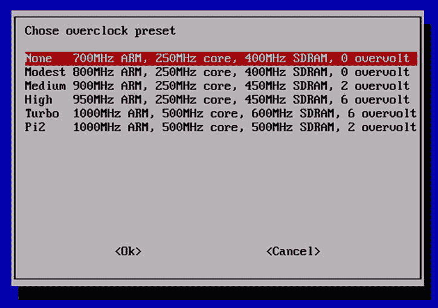

图 1-43。

How fast would you like to go?

### 高级功能

我们不会逐一介绍这些菜单项，对于许多人(如果不是大多数人的话)来说，这些菜单项中的大部分都不会用到。我们唯一感兴趣的是内存分割。作为参考，菜单如下所示(图 [1-44](#Fig44) ):

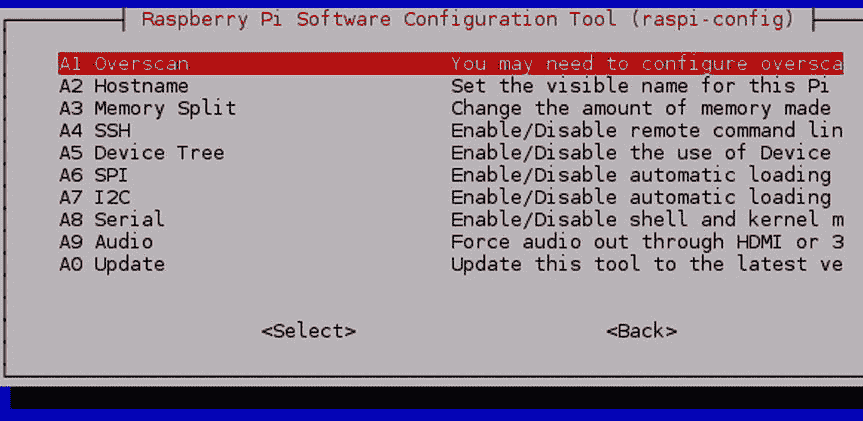

图 1-44。

Advanced options

### 分配内存

“内存分割”选项需要解释一下。您的 Pi 有两个主要处理器:CPU(或中央处理器)和 GPU(或图形处理器)。CPU 负责机器的一般运行，GPU 负责处理显示器，并提供 2D 和 3D 加速等功能，以及对解码高质量视频流的硬件支持。GPU 专用于处理图形(大部分情况下)，不能执行 CPU 的角色。然而，这确实意味着如果 CPU 可以将所有复杂的图形工作卸载到 GPU，CPU 就不必如此强大。通过这两者，Pi 保持了良好的低成本和低功耗要求，但没有牺牲太多的性能。

到目前为止还不错；但是这和分裂记忆有什么关系呢？Pi 2 总共配有 1GB 的 RAM，它需要同时提供 CPU 和 GPU。由于 GPU 实际上是一个独立的单元，它需要自己的内存分配。可以在两个处理器之间分配 1GB 的内存，而不是两个处理器都有专用内存。默认情况下，Pi 只为 GPU 分配少量资源。如果您想将 Pi 用作服务器，或者从未打算将显示器连接到您的 Pi，这是理想的选择。如果你不使用图形，分配额外的内存给 GPU 是没有意义的。

另一方面，如果您计划将您的 Pi 用作迷你桌面计算机或显示高质量的电影，您将希望尽可能多的内存分配给 GPU(在 Pi 2 的情况下，这意味着为 GPU 分配 256MB)。很难预测每个人将如何使用他们的 Pi，除了给 Pi 本身增加更多的内存(并提高成本)之外，没有简单的解决方案。幸运的是，我们有能力自己选择如何分配内存。

对于一般用途和“入门”类型的任务，我们建议您为 GPU 分配 64MB。要进行设置，从菜单中选择`memory_split`选项，按下回车键，你将得到类似于图 [1-45](#Fig45) 的东西。键入所需的内存拆分，然后按 Tab 键选中 OK 按钮，然后按 Enter 键。

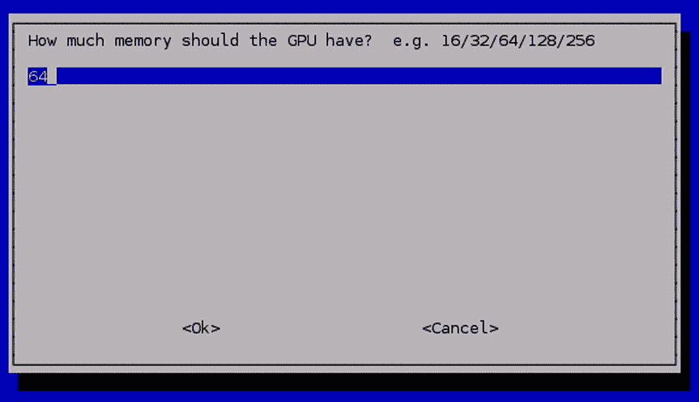

图 1-45。

Choose your memory split

### 终于来了！配置好了！

哇，我们终于坚持到最后了！在所有这些努力之后，您现在可以重启 Pi 并(最终)开始使用它了！按 Tab 键两次以选中“Finish”按钮，然后按 Enter 键。您的 Pi 应该关闭，然后重新启动。在所有这些努力之后(在 Pi 启动时还要等待一段时间)，您最终应该看到一个漂亮的图形显示，看起来应该如图 [1-46](#Fig46) 所示。

图 1-46。

At long last, we have a desktop!Congratulations!

你现在有一个功能齐全的树莓派！如果你没有一个漂亮的桌面，你可能需要调整一下你的配置。在登录提示符下，您可以使用安装过程中设置的用户名`pi`和密码登录。如果您随后运行以下程序，您将能够更改设置(`“Boot behaviour”`是您想要更改的选项):

`$ sudo raspi-config`

您也可以尝试使用以下命令手动启动图形界面:

`$ startx`

## 摘要

本章将带您从接触到 Pi 一直到启动和运行它。我们故意慢慢来，涵盖了所有的基础知识，因为总是那些所谓的简单的东西会绊倒人(包括我们！).我们看了盒子里有什么(更重要的是没有什么)，并提供了一个购物清单，列出了烘焙 Pi 所需的所有物品。

然后，我们简单介绍了 Linux——什么是发行版，以及为什么我们决定在本书中坚持使用 Raspbian。然后我们讲述了如何下载 NOOBS，并把它存在你的 SD 卡上。

配备了一个完全加载的卡，我们启动了 Pi，并完成了初始设置和配置过程，最终我们在一个同样令人印象深刻的桌面中间看到了非常漂亮的 Raspberry Pi 徽标。

在下一章，我们将开始探索你的新桌面。我们将带您快速浏览 Raspbian 开箱即用的特性，最后我们将向您展示如何调整和定制它以满足您的需求。