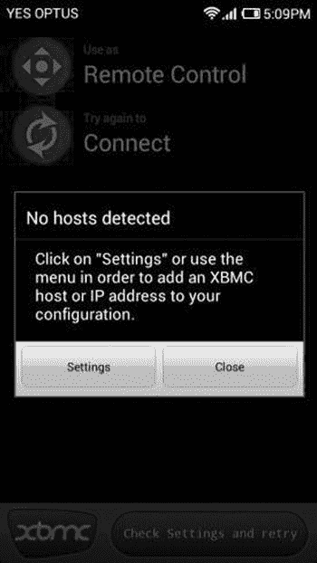
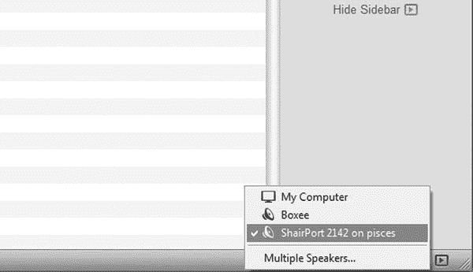

# 十一、Pi 媒体中心

树莓派的美妙之处在于它是一个非常灵活的设备，它的潜在用途几乎是无限的。您可以使用 Pi 做任何事情，它有一系列外围输入端口，可以很好地使用。

您还应该知道，虽然您的 Pi 可以通过标准 HDMI 显示，但设备的功能并不止于此。它可以以 1920 x 1080 的分辨率显示，通常称为 1080P，这是高清的基准水平。你小小的 Raspberry Pi 能够以全高清分辨率显示视频，由于 HDMI 的声音交错，它还可以在视频的同一频道播放音频。这是本章的目标；我们将利用 Pi 的媒体播放功能来创建两种不同的 Pi 媒体中心。一个是视频播放中心，你可以用它在网络上播放视频。它可以连接到你的电视上，并允许你接入互联网观看视频。第二个是无线播放设备，使您能够远程流式播放您的音乐收藏，并通过网络播放。

## 与 XBMC 的视频

如前所述，树莓派的一大优势是它可以全高清播放，但我们需要一种方式来利用这一点，这就是 XBMC 的用武之地。

XBMC(XBox Media Center 的缩写)最初是作为最初(胖)XBox 的媒体中心而设计的。人们非常喜欢这个项目，后来它被移植到了世界上几乎所有的操作系统上，包括但不限于 Windows、Android、OS X 和 iOS。甚至有一个名为 XMBCbuntu 的成熟的独立版本，它是 Ubuntu 的一个端口，已经安装、预配置了 XBMC，可以开箱即用。鉴于其广泛的用途、开放源代码的特性和易于使用的特性，它已经被移植和派生了很多次，包括 MediaPortal、Plex、Voddlern 和 Boxee。这显示了媒体中心系统有多受欢迎；再举一个例子，Boxee 制造了一款名为 Boxee Box 的小型设备，售价高达 200 美元。我们正在创造的是一个同样强大的工具，而且只需要 35 美元——圆周率的价格。既然你们都对媒体中心光明灿烂的未来感到兴奋，是时候好好利用它了。

您已经读到了这本书的结尾，所以是时候从应用程序源代码开始进行一次正确的 Linux 安装了。虽然大多数应用程序都是通过`apt-get`预打包的，但也有一些不是这样，它们需要编译。从源代码安装 XBMC 是一个有点复杂的过程，非常耗时。我们选择从源代码编译它，因为它不仅可以帮助您完成在 Linux 中运行应用程序的一种更复杂的方法，而且还意味着我们的 XBMC 安装针对我们的系统进行了优化，因为我们已经在自己的系统上构建了它。历史上，从源代码进行编译被认为是一个艰巨的过程，但是随着使用 Linux 的人数的增长，对简单易用的安装工具的需求也在增长，预编译二进制安装系统如`apt-get`也在兴起。但是和所有事情一样，有时使用预编译并不如从头开始，随着时间的推移，编译工具已经发展起来，变得更加容易使用。当有人指导你完成这个过程时，也更容易做到——这就是本书的全部内容。

所以让我们开始吧。首先，我已经离开了 Raspbian 的主要版本，转而使用 Raspbian 的一个稍微精简的版本，名为 Pisces，可以从 Raspbian 的 [`www.raspbian.org/PiscesImages`](http://www.raspbian.org/PiscesImages) 获得。我用双鱼座，因为它已经被削减，不包括太多的开销，这意味着更多的权力做我们想做的事情:播放电影！下载并安装这个映像到 SD 卡上(你需要一个 4 GB 的空间),然后启动并把操作系统连接到互联网上，这样你就可以使用它了。默认用户是`raspbian`，密码也是`raspbian`，也是 root 密码。

OSMC

让 XBMC 在您的 Pi 上工作有一个简单得多的方法:使用一个名为 OSMC 的 Raspbian 预构建版本(以前的 RaspMC)。你可以下载一个 OSMC 的安装程序，然后把它放到 SD 卡上，就像你在 Raspbian 上做的那样。你可以从 [`https://osmc.tv/`](https://osmc.tv/) 下载这张图片。此安装非常简单，需要 15-25 分钟。您只需将您的 Pi 连接到您的网络，打开它，然后安装程序就会运行。它会从网上下载所有需要的东西，然后自己安装。这是目前为止让 XBMC 在你的 Pi 上运行的最简单的方法。对于那些选择使用 OSMC 的人，你可以跳到本章的“开始和使用 XBMC”一节。

Note

如果`ifconfig`缺失，使用`apt-get`安装`net-tools`包。更多关于`apt-get`的信息，请参见[第 3 章](03.html)。

一旦你进入了操作系统，是时候发出一些命令并开始安装 XBMC 了。这是一个非常漫长的过程:编译器比使用`apt-get`要慢得多，因为`apt-get`安装的所有软件都是预编译的，因此省去了一些步骤。在这种情况下，编译需要大约 12 个小时——是的，几个小时，半天。我发现最好让最终编译通宵运行，这样我就不会忍不住一坐就是几个小时。

由于 ARM 处理器的性质和工作速度，这个过程需要很长时间。这意味着编译需要更长的时间，但我们可以在更低的功率水平上做同样多的工作。

### 要构建的设置

让我们从构建开始。第一步是确保我们可以将尽可能多的能力和内存转移到编译器上。在核心 Raspbian 中，我们使用了`rapsi-config`命令，但是 Pisces 没有这个控制脚本，所以您必须手动更改它，用不同的文件替换`start.elf`文件，这将改变系统资源的分配方式。运行以下命令:

`$ sudo cp /boot/arm224_start.elf /boot/start.elf`

这将把分配给系统 224 MB 和分配给显卡 32 MB 的版本复制到系统中使用。现在，我们需要在系统中注册这一配置更改，然后通过发出以下两个命令重新启动，使更改生效:

`$ sudo rpi-update`

`$ sudo reboot`

一旦您的系统重新启动，并且备份并运行，最好升级操作系统，以确保它运行的是最新版本的软件。为此，我们将利用`apt-get`,告诉它用来自互联网的最新版本的配置更新自己，然后升级您系统上所有可用的软件包。为此，发出以下命令:

`$ sudo apt-get update`

`$ sudo apt-get upgrade`

这个执行需要一点时间，因为它需要下载、解包和替换大量的系统组件。所以让它运行起来，然后去喝杯咖啡；回来的时候应该就完成了，可以继续下一步了。

Note

其中一些软件包可能已经安装在您的系统上。我们包括它们，因为它们可能不是为每个人安装的。

下一步是安装软件包，给我们编译的能力；它们包括基本的构建工具、自动配置工具、压缩和解压缩工具等等。要安装这些工具，请运行以下命令:

`$ sudo apt-get install build-essential autoconf ccache gawk gperf mesa-utils zip unzip`

`Reading package lists... Done`

`Building dependency tree`

`Reading state information... Done`

`build-essential is already the newest version.`

`The following packages were automatically installed and are no longer required:`

`libcdio-cdda0 libcdio-paranoia0 libcdio10 libcelt0-0 libdb4.8 librpmio2`

`Use ’apt-get autoremove’ to remove them.`

`The following extra packages will be installed:`

`automake autotools-dev libglew1.7 libsigsegv2`

`Suggested packages:`

`autoconf2.13 autoconf-archive gnu-standards autoconf-doc libtool gettext distcc gawk-doc glew-utils`

`The following NEW packages will be installed:`

`autoconf automake autotools-dev ccache gawk gperf libglew1.7 libsigsegv2 mesa-utils`

`The following packages will be upgraded:`

`unzip zip`

`2 upgraded, 9 newly installed, 0 to remove and 187 not upgraded.`

`Need to get 2,647 kB/3,174 kB of archives.`

`After this operation, 7,143 kB of additional disk space will be used.`

`Do you want to continue [Y/n]?`

一旦您安装了这些基本的软件包，就可以继续进行更大的安装工作了。我们现在需要安装一些软件包，这些软件包将安装视频和解码器库以及专门的图形库。除了所有这些之外，您还需要安装一些其他的软件包，以便能够远程连接到 XBMC。这个命令非常长，所以我建议您从 Apress 网站下载源代码。该包中有一个脚本将为您执行这些命令。安装如此庞大数量的软件包的命令如下:

`$ sudo apt-get install autotools-dev comerr-dev dpkg-dev libalsaplayer-dev \`

`libapt-pkg-dev libasound2-dev libass-dev libatk1.0-dev \`

`libavahi-client-dev libavahi-common-dev libavcodec-dev libavformat-dev \`

`libavutil-dev libbison-dev libbluray-dev libboost1.49-dev \`

`libbz2-dev libc-dev-bin libc6-dev libcaca-dev libcairo2-dev \`

`libcdio-dev libclalsadrv-dev libcrypto++-dev libcups2-dev libcurl3-gnutls-dev \`

`libdbus-1-dev libdbus-glib-1-dev libdirectfb-dev libdrm-dev libegl1-mesa-dev \`

`libelf-dev libenca-dev libept-dev libevent-dev libexpat1-dev libflac-dev \`

`libfontconfig1-dev libfreetype6-dev libfribidi-dev libgconf2-dev \`

`libgcrypt11-dev libgdk-pixbuf2.0-dev libgl1-mesa-dev libgles2-mesa-dev \`

`libglew-dev libglewmx-dev libglib2.0-dev libglu1-mesa-dev \`

`libgnome-keyring-dev libgnutls-dev libgpg-error-dev libgtk2.0-dev libhal-dev \`

`libhunspell-dev libice-dev libicu-dev libidn11-dev libiso9660-dev \`

`libjasper-dev libjbig-dev libjconv-dev libjpeg8-dev libkrb5-dev \`

`libldap2-dev libltdl-dev liblzo2-dev libmad0-dev libmicrohttpd-dev \`

`libmodplug-dev libmp3lame-dev libmpeg2-4-dev libmysqlclient-dev \`

`libncurses5-dev libnspr4-dev libnss3-dev libogg-dev libopenal-dev \`

`libp11-kit-dev libpam0g-dev libpango1.0-dev libpcre++-dev libpcre3-dev \`

`libpixman-1-dev libpng12-dev libprotobuf-dev libpthread-stubs0-dev \`

`libpulse-dev librtmp-dev libsamplerate0-dev \`

`libsdl-image1.2-dev libsdl1.2-dev libslang2-dev \`

`libsm-dev libsmbclient-dev libspeex-dev \`

`libsqlite3-dev libssh-dev libssh2-1-dev libssl-dev libstdc++6-4.6-dev \`

`libtagcoll2-dev libtasn1-3-dev libtiff4-dev libtinfo-dev libtinyxml-dev \`

`libts-dev libudev-dev libv8-dev libva-dev libvdpau-dev \`

`libvorbis-dev libvpx-dev libwebp-dev libwibble-dev \`

`libx11-dev libx11-xcb-dev libxapian-dev libxau-dev \`

`libxcb-glx0-dev libxcb-render0-dev libxcb-shm0-dev \`

`libxcb1-dev libxcomposite-dev libxcursor-dev libxdamage-dev \`

`libxdmcp-dev libxext-dev libxfixes-dev libxft-dev libxi-dev \`

`libxinerama-dev libxml2-dev libxmu-dev libxrandr-dev \`

`libxrender-dev libxslt1-dev libxss-dev libxt-dev \`

`libxtst-dev libxxf86vm-dev libyajl-dev libzip-dev linux-libc-dev \`

`lzma-dev mesa-common-dev python-dev python2.7-dev x11proto-composite-dev \`

`x11proto-core-dev x11proto-damage-dev x11proto-dri2-dev x11proto-fixes-dev \`

`x11proto-gl-dev x11proto-input-dev x11proto-kb-dev x11proto-randr-dev \`

`x11proto-record-dev x11proto-render-dev x11proto-scrnsaver-dev \`

`x11proto-xext-dev x11proto-xf86vidmode-dev x11proto-xinerama-dev xtrans-dev \`

`zlib1g-dev`

这份包裹清单末尾有许多斜线；它们是换行符，表示应该执行当前的命令，然后会有另一行命令跟在后面。当你需要把长命令分成很多行时，换行符非常有用，就像我在这里做的那样。这个命令需要一段时间来运行，因为有大量的软件包需要下载和安装。所以执行这个命令，去做晚饭，然后回来。

一旦你安装了所有这些软件包，你需要复制一些特殊的文件到适当的位置，并创建其他链接到正确位置的文件，这样它们就可以被使用了。同样，它们将包含在我们创建的脚本中，以帮助简化这些命令的执行。

第一个是将 VideCoreIV include 文件从 Raspberry Pi 固件复制到`/usr/include`中。该目录是一个特殊的目录，编译器将从该目录中搜索要包含在构建中的库和文件。要将所有这些文件复制到正确的位置，请执行以下命令:

`$ sudo cp -R /opt/vc/include/* /usr/include`

`$ sudo cp /opt/vc/include/interface/vcos/pthreads/* /usr/include/interface/vcos`

现在，除了将这些文件复制到适当的位置之外，我们还需要将一些文件正确地链接到正确的位置，以便它们可以被读取。在上一个步骤中，我们复制了主要是源代码的包含文件，这次我们需要将固件的预编译部分链接到正确的位置，以便编译器在编译时读取。我们不是复制，而是链接，因为我们很乐意使用文件的当前位置并节省一些空间。运行以下命令:

`$ sudo ln -fs /opt/vc/lib/libEGL.so /usr/lib/libEGL.so`

`$ sudo ln -fs /opt/vc/lib/libEGL.so /usr/lib/arm-linux-gnueabihf/libEGL.so`

`$ sudo ln -fs /opt/vc/lib/libEGL.so /usr/lib/arm-linux-gnueabihf/libEGL.so.1`

`$ sudo ln -fs /opt/vc/lib/libEGL_static.a /usr/lib/libEGL_static.a`

`$ sudo ln -fs /opt/vc/lib/libEGL_static.a /usr/lib/arm-linux-gnueabihf/libEGL_static.a`

`$ sudo ln -fs /opt/vc/lib/libGLESv2.so /usr/lib/libGLESv2.so`

`$ sudo ln -fs /opt/vc/lib/libGLESv2.so /usr/lib/arm-linux-gnueabihf/libGLESv2.so`

`$ sudo ln -fs /opt/vc/lib/libGLESv2.so /usr/lib/arm-linux-gnueabihf/libGLESv2.so.2`

`$ sudo ln -fs /opt/vc/lib/libGLESv2_static.a /usr/lib/libGLESv2_static.a`

`$ sudo ln -fs /opt/vc/lib/libGLESv2_static.a /usr/lib/arm-linux-gnueabihf/libGLESv2_static.a`

`$ sudo ln -fs /opt/vc/lib/libbcm_host.so /usr/lib/libbcm_host.so`

`$ sudo ln -fs /opt/vc/lib/libbcm_host.so /usr/lib/arm-linux-gnueabihf/libbcm_host.so`

`$ sudo ln -fs /opt/vc/lib/libvchiq_arm.a /usr/lib/libvchiq_arm.a`

`$ sudo ln -fs /opt/vc/lib/libvchiq_arm.a /usr/lib/arm-linux-gnueabihf/libvchiq_arm.a`

`$ sudo ln -fs /opt/vc/lib/libvchiq_arm.so /usr/lib/libvchiq_arm.so`

`$ sudo ln -fs /opt/vc/lib/libvchiq_arm.so /usr/lib/arm-linux-gnueabihf/libvchiq_arm.so`

`$ sudo ln -fs /opt/vc/lib/libvcos.a /usr/lib/libvcos.a`

`$ sudo ln -fs /opt/vc/lib/libvcos.a /usr/lib/arm-linux-gnueabihf/libvcos.a`

`$ sudo ln -fs /opt/vc/lib/libvcos.so /usr/lib/libvcos.so`

`$ sudo ln -fs /opt/vc/lib/libvcos.so /usr/lib/arm-linux-gnueabihf/libvcos.so`

Note

我们发现，这些链接可以被其他进程删除，有时通过重新启动；如果有，您需要重新创建它们。

现在，您已经将所有文件链接到正确的位置，接下来获取源代码。使用以下命令将目录更改为您的主目录:

`$ cd ∼`

如果您不能键入波浪号(`∼`)，您可以尝试使用`dpkg-reconfigure keyboard-configuration`重新配置 Pi 键盘布局，然后重新启动 Pi。你也可以只使用`cd`而不使用参数，因为它也会带你到你的主目录。波浪号只是一个引用当前用户主目录的符号。

现在您已经进入了您的主目录，是时候下载源代码了，这样您就可以使用它并正确地编译一切。令人欣慰的是，一个现代工具的出现使得下载源代码变得更加容易:Git，它是以 Linux 内核的 Linus Torvalds 命名的。Git 用于源代码管理和版本控制；所有用户都可以下载一组源代码的当前源代码版本，并将修改提交回中央存储库。

Note

这意味着我们总是下载最新的版本，但是如果 Git 中的当前版本有问题，我们可能会得到一个不太稳定的版本。大多数开发人员努力让他们的 Git 仓库保持良好的工作状态，但是这是需要注意的。

此时，我们要做的就是将源代码下载到我们的主目录中来使用它。为此，使用`git`命令，告诉它将源代码库克隆到系统上。我们还在命令中添加了`–-depth 1`,表示我们只想克隆源代码的最近 1 次修订(代码的绝对最新版本),避免获得大量额外的和不需要的历史代码。

通过运行以下命令启动克隆:

`$ git clone ˗˗depth 1 git://github.com/xbmc/xbmc-rbp.git`

`Cloning into ’xbmc-rbp’...`

`remote: Counting objects: 35172, done.`

`remote: Compressing objects: 100% (22895/22895), done.`

`remote: Total 35172 (delta 15265), reused 27885 (delta 10698)`

`Receiving objects: 100% (35172/35172), 158.26 MiB | 385 KiB/s, done.`

`Resolving deltas: 100% (15265/15265), done.`

既然我们已经克隆了 XBMC 的源代码，我们需要开始构建应用程序。这是迄今为止耗时最长的部分。将目录更改为新创建的`xbmc-rbp`目录，因为我们还需要完成最后几个步骤。

### 使用 Sed 和正则表达式更改文件

在我们开始构建我们的 XBMC 应用程序之前，我们需要对源代码做一些小的调整，以便它按照我们想要的方式编译。我们将使用名为 Sed(流编辑器的缩写)的工具，而不是手动进行这些更改。顾名思义，它接受一个文本流，然后对该文本进行编辑。Sed 的棘手之处在于它使用了一种高度专业化的语言，称为正则表达式，用于执行相当于查找和替换的功能。

正则表达式是从验证一组给定的数据以查看它是否符合给定的标准并在找到给定的例子时进行编辑的需要中发展而来的。虽然在编辑文本时，简单的查找和替换对于大多数人来说已经足够了，但是当您只想编辑给定句子中以 T 开头的第三个字母的单词时，如何执行查找和替换呢？电子邮件可能是正则表达式最简单的例子之一。您希望确认一个给定的字符串是一封有效的电子邮件:一封电子邮件将包含一个用户名(它来自谁)、一个域(它来自哪里，例如 Hotmail 或 Gmail)，并且在它们之间将有一个 at ( `@`)符号。好的，我们可以只用一个通配符来实现，比如`*`。所以看起来像`*@*`的东西会是一封电子邮件，对吗？我们用来表示任何东西的`*`会拾取任何东西。甚至空格、数字、奇怪的符号等等。因此，我们需要一种方法来挑选由一串有效的电子邮件字符(字母、数字、句点、下划线)组成的内容，然后是`@,`，最后是有效的域。这将是一个字母集合，后跟一个句点，然后可能是另一组(或几组)字母。描述这些是令人疲惫的，这就是为什么我们有专门的语言来执行它们。

现在您已经理解了我们想要实现的目标，运行下面两个命令来修改文件`tools/rbp/setup-sdk.sh`。这些`sed`命令利用了`–i`选项，它表示编辑给定的文件:

`$ sed -i ’s/USE_BUILDROOT=1/USE_BUILDROOT=0/’ tools/rbp/setup-sdk.sh`

$ sed-I ' s/tool chain = \/usr \/local \/BCM-gcc/tool chain = \/usr/' tools/RBP/setup-SDK . sh。这些命令将变量`USE_BUILDROOT`从值`1`更改为值`0`，并使用`TOOLCHAIN=/usr`替换短语`TOOLCHAIN=/usr/local/bcm-gcc`的任何实例。编辑完`tools/rbp/setup-sdk.sh`文件后，您应该使用以下命令执行它:

`$ sudo sh tools/rbp/setup-sdk.sh`

该命令将生成一个 makefile，但不会在屏幕上显示任何内容。一旦完成，就该编辑新创建的`tools/rbp/depends/xbmc/Makefile`。然后，您需要做的就是在文件上运行最后一个`sed`，将一个`#`添加到任何`cd $(SOURCE); $(CONFIGURE)`实例的开头:

`$ sed -i ’s/cd $(SOURCE); $(CONFIGURE)/#cd $(SOURCE); $(CONFIGURE)/’ tools/rbp/depends/xbmc/Makefile`

`$ sudo sed -i ’s/#include "vchost_config.h"/#include "linux\/vchost_config.h"/’ \ /usr/include/interface/vmcs_host/vcgencmd.h`

`$ sed -i ’s/-DSQUISH_USE_SSE=2 -msse2//’ lib/libsquish/Makefile.in`

`$ sed -i ’s/-DSQUISH_USE_SSE=2 -msse2//’ lib/libsquish/Makefile`

我们所做的是改变我们的系统编译 XBMC 软件的方式，让它使用我们的一些系统库，而不是使用那些可以在 XBMC 源代码中找到的系统库。

既然 Makefile 已经创建好了，现在是编译的时候了！

### 编译源代码

大多数编译使用一个非常简单的逻辑:运行命令`./configure`来生成一个配置文件，它知道系统的组成。这会生成一个名为 makefile 的文件。这个文件使用稍微专业一点的语言，描述了对集合进行编译的方式。它本身不是一个执行代码的脚本；它是 make 应用程序将使用的方向的集合。

不幸是，这个编译器稍微高级一些。在运行配置和编译之前，我们需要使我们的配置工具与我们试图进行的设置相匹配。这需要一点时间来执行，所以开始吧，再喝一杯。

要执行的命令如下:

`$ make -C tools/rbp/depends/xbmc/`

该命令将在目录`tools/rbp/depends/xbmc/`中运行 make，这将生成配置文件。这个输出很长，但是当它成功完成时，您应该在控制台窗口上看到类似这样的内容:

`examples/Makefile.am: installing ’./depcomp’`

`Makefile.am: installing ’./INSTALL’`

`autoreconf: Leaving directory ’lib/libdvd/libdvdnav’`

`Please (re)run configure...`

`#cd ../../../../; ./configure ˗˗prefix=/opt/xbmc-bcm/xbmc-bin ˗˗build=i686-linux ˗˗host=arm-bcm2708-linux-gnueabi ˗˗enable-gles ˗˗disable-sdl ˗˗disable-x11 ˗˗disable-xrandr ˗˗disable-openmax ˗˗disable-optical-drive ˗˗disable-dvdcss ˗˗disable-joystick ˗˗disable-debug ˗˗disable-crystalhd ˗˗disable-vtbdecoder ˗˗disable-vaapi ˗˗disable-vdpau ˗˗disable-pulse ˗˗disable-projectm ˗˗with-platform=raspberry-pi ˗˗disable-optimizations ˗˗enable-rpi-cec-api`

`#cd ../../../../; make -j 1`

`#cd ../../../../; make install`

`make: Leaving directory ’/home/raspbian/xbmc-rbp/tools/rbp/depends/xbmc’`

既然配置实用程序的编译已经完成了执行配置的时间。这个`configure`命令非常长，同样，您可以在 Apress 源代码库中找到执行该命令的代码，这个`configure`命令是:

`$ ./configure ˗˗prefix=/usr ˗˗build=arm-linux-gnueabihf ˗˗host=arm-linux-gnueabihf \`

`˗˗localstatedir=/var/lib ˗˗with-platform=raspberry-pi ˗˗disable-gl ˗˗enable-gles \`

`˗˗disable-x11 ˗˗disable-sdl ˗˗enable-ccache ˗˗enable-optimizations \`

`˗˗enable-external-libraries ˗˗disable-goom ˗˗disable-hal ˗˗disable-pulse \`

`˗˗disable-vaapi ˗˗disable-vdpau ˗˗disable-xrandr ˗˗disable-airplay \`

`˗˗disable-alsa ˗˗enable-avahi ˗˗disable-libbluray ˗˗disable-dvdcss \`

`˗˗disable-debug ˗˗disable-joystick ˗˗enable-mid ˗˗disable-nfs ˗˗disable-profiling \`

`˗˗disable-projectm ˗˗enable-rsxs ˗˗enable-rtmp ˗˗disable-vaapi \`

`˗˗disable-vdadecoder ˗˗disable-external-ffmpeg  ˗˗disable-optical-drive`

为`configure`命令指定多个参数，这些参数指定了安装的位置(`˗˗prefix=/usr`)、要构建的架构(`˗˗build=arm-linux-gnueabihf`)、保存其运行文件的位置(`˗˗localstatedir=/var/lib`)和平台(`˗˗with-platform=raspberry-pi`)，以及一系列禁用和电子邮件选项，以删除 CD 驱动器和操纵杆等功能，并启用优化和 Avahi 外围设备自动检测等功能。最终，当命令执行完毕时，屏幕上的输出应该如下所示:

`XBMC Configuration:`

`Debugging:    No`

`Profiling:    No`

`Optimization: Yes`

`Crosscomp.:   No`

`target ARCH:  arm`

`target CPU:   arm1176jzf-s`

`OpenGLES:     Yes`

`ALSA:         No`

`DBUS:         Yes`

`VDPAU:        No`

`VAAPI:        No`

`CrystalHD:    No`

`VDADecoder:   No`

`VTBDecoder:   No`

`OpenMax:      No`

`Joystick:     No`

`XRandR:       No`

`GOOM:         No`

`RSXS:         Yes`

`ProjectM:     No`

`Skin Touched: No`

`X11:          No`

`Bluray:       No`

`TexturePacker:Yes`

`MID Support:  Yes`

`ccache:       Yes`

`ALSA Support: No`

`PulseAudio:   No`

`HAL Support:  No`

`DVDCSS:       No`

`Avahi:        Yes`

`Non-free:     Yes`

`ASAP Codec:   No`

`MySQL:        Yes`

`Webserver:    Yes`

`libRTMP support:      Yes`

`libsmbclient support: Yes`

`libnfs client support:No`

`libafpclient support: No`

`AirPLay support:      No`

`AirTunes support:     No`

`Optical drive:        No`

`libudev support:      Yes`

`libusb support:       No`

`libcec support:       No`

`libmp3lame support:   Yes`

`libvorbisenc support: Yes`

`libcap support:       No`

`External FFmpeg:      No`

`prefix:       /usr`

该配置指定了我们在安装中要求的所有标志，旨在充分利用 Raspberry Pi。现在，我们已经完成了实际编译的配置。这个命令本身对于它要做的事情来说非常虎头蛇尾:告诉系统花接下来的 12 个小时为我们的系统生成代码。与这个编译要运行多长时间相比，所有这些花费一点时间的工作根本不算什么。所以准备好，执行这个简单的四个字母的命令`m a k e`:

`$ make`

如果您看到类似下面这样的行，请不要惊慌:

`/tmp/ccGvUe1g.s:507: Warning: swp{b} use is deprecated for this architecture`

唯一会停止编译的是一个严重错误或成功。这些警告与 XBMC 编译中使用的一些函数有关，这些函数对我们的 Pi 来说有点老了。编译成功后，您应该会看到以下内容:

`XBMC built successfully`

这表明我们已经成功地构建了 XBMC，可以进行这个过程中的最后一步了，那就是安装我们新编译的软件。make 系统实际上也会负责安装。要安装，您只需运行`make install`，它会将所有新编译的二进制文件复制到您操作系统中的正确位置。您需要给它加上前缀`sudo`，因为我们要复制的位置(`/usr`)也是一个系统位置，只有 root 用户被授予写权限。您的输出应该如下所示:

`$ sudo make install`

`Copying XBMC binary to /usr/lib/xbmc/xbmc.bin`

`You can run XBMC with the command ’xbmc’`

`Copying support and legal files...`

`Done!`

`Copying system files to /usr/share/xbmc`

我们完了。虽然它很长，需要一点点工作来开始，但实际的编译过程相对来说是没有痛苦的，你知道，除了等待的痛苦。现在 XBMC 已经安装好了，我们该如何使用它呢？

### 解决纷争

在我们开始运行 XBMC 之前，我们应该先看看您可能会遇到的一些问题。这些步骤中的大部分应该会自行完成，因为这种设置是通用的，可以在任何 Pi 上工作，因为它们都共享相同的硬件。如果你有疑问，删除 xbmc-rbp 目录并重新开始。确保您完整地执行了副本和链接。我发现在进行 git 克隆时，有些东西有时会卡住而不能移动。

在这种情况下，最好使用 Ctrl + C 停止当前作业，删除目录，重新启动，然后重新开始。在编译和安装阶段最好从系统中移除外围设备，因为太多的外围设备会导致我的系统出现负载问题。此外，您应该确保您的命令输出(如`configure`)与给定的相匹配，因为这些标志在编译时可以发挥更大的作用，并为您省去一个令人头疼的问题和另一个 12 小时的编译工作。最后，确保所有的`apt-get`都成功运行并完成，因为这些包需要提供您的 Pi 在构建 XBMC 时将使用的库。

## 启动和使用 XBMC

既然我们已经完成了大型编译过程，是时候启动 XBMC 了！不过，首先，我们需要重置之前设置的选项，将更多的内存放入系统 RAM。我们将需要去图形设备，因为我们想做一些严重的显示工作与 XBMC。执行以下命令来切换 Pi 引导系统:

`$ sudo cp /boot/arm128_start.elf /boot/start.elf`

返回并检查前面提到的链接文件是否正确。现在我们还可以对`/boot/config.txt`文件进行一些修改，因为它控制了 Pi 的底层硬件如何运行。要做的最简单的改变是添加行`disable_overscan=1`，因为它将消除进行过扫描处理的需要，因为过扫描处理将使我们回放的视频量更大，从而消耗更多资源。完成这些更改后，发出以下命令，最后一次重新配置并重新启动 Pi:

`$ sudo rpi-update`

`$ sudo reboot`

现在，您已经将设置更改回 50/50 资源分配，通过以 root 用户身份登录并发出以下命令来启动 XBMC:

`$ /usr/lib/xbmc/xbmc.bin`

你的屏幕会定格片刻，图 [11-1](#Fig1) 会问候你。

图 11-1。

XBMC boot screen

你应该会看到 XBMC 菜单，看起来如图 [11-2](#Fig2) 。

图 11-2。

XBMC main menu

在主菜单中，有选择不同播放类型的选项，XBMC 是一个完全图形化的系统，当你在其中时，它会为你提供获取文件的选项和位置。只要您的媒体可以在网络上访问，XBMC 应该能够访问它并播放它！现在关于回放的话题，你可能会坐在那里想，“我会一直用这个键盘来回放吗？”答案是响亮的不！有两种解决方案:

*   购买一个 USB 遥控器，并将其连接到您的 Pi。
*   第二种更偷偷摸摸:用你的智能手机！

大多数智能手机都有下载 XBMC 遥控应用程序的功能，只需与 XBMC 系统配对即可运行。为此，我们需要在 XBMC 内启用两个选项，以允许它接收远程控制。进入“设置”菜单，然后进入“服务”，将遥控器设置更改为“允许其他系统上的程序控制 XBMC”一旦你允许远程控制，你需要进入网络服务器并设置“允许通过 HTTP 控制 XBMC”；您还应该继续设置用户名和密码，这样只有拥有密码的人才能控制您的 XMBC 实例，而不是网络上任何使用 XBMC 应用程序的人！

一旦您启用了这些远程控制选项，只需从您喜爱的应用程序商店下载应用程序，然后在应用程序中设置选项即可。你应该只需要给应用程序你的 Pi 的本地地址，你可以通过系统➤系统信息菜单看到，设置端口为 8080，并提供 XBMC 的实例名和用户名/密码，如图 [11-3](#Fig3) 所示。

图 11-3。

XBMC remote application

一旦你给出了所有的细节，你的手机应该变成你的 XBMC 实例的遥控器！配有一整套方向按钮和回放控制，如图 [11-4](#Fig4) 所示。

图 11-4。

XBMC remote in action!

### 靴子上的 XBMC

虽然到目前为止我们已经手动启动了 XBMC，但大多数人会希望它自动发生，因为你每次想要启动它时都需要将键盘插入媒体中心，这有什么意义呢？

下面是一个简单的`start`脚本，它将允许您使用`start`脚本执行 XBMC。在文件`/etc/init.d/xbmc`中创建这个文件(像所有其他长文件一样，它可以在本书的 press 库中找到):

`#! /bin/sh`

`### BEGIN INIT INFO`

`# Provides:          xbmc`

`# Required-Start:    $all`

`# Required-Stop:     $all`

`# Default-Start:     2 3 4 5`

`# Default-Stop:      0 1 6`

`# Short-Description: Start XBMC`

`# Description:       Start XBMC`

`### END INIT INFO`

`DAEMON=/usr/bin/xinit`

`DAEMON_OPTS="/usr/lib/xbmc/xbmc.bin"`

`NAME=xbmc`

`DESC=XBMC`

`RUN_AS=root`

`PID_FILE=/var/run/xbmc.pid`

`test -x $DAEMON || exit 0`

`set -e`

`case "$1" in`

`start)`

`echo "Starting $DESC"`

`start-stop-daemon ˗˗start -c $RUN_AS ˗˗background ˗˗pidfile $PID_FILE  ˗˗make-pidfile ˗˗exec $DAEMON ˗˗ $DAEMON_OPTS`

`;;`

`stop)`

`echo "Stopping $DESC"`

`start-stop-daemon ˗˗stop ˗˗pidfile $PID_FILE`

`;;`

`restart|force-reload)`

`echo "Restarting $DESC"`

`start-stop-daemon ˗˗stop ˗˗pidfile $PID_FILE`

`sleep 5`

`start-stop-daemon ˗˗start -c $RUN_AS ˗˗background ˗˗pidfile $PID_FILE  ˗˗make-pidfile ˗˗exec $DAEMON ˗˗ $DAEMON_OPTS`

`;;`

`*)`

`echo "Usage: /etc/init.d/$NAME{start|stop|restart|force-reload}" >&2`

`exit 1`

`;;`

`esac`

`exit 0`

创建该文件后，运行以下命令使其可执行，并将其加载到 Pi 的引导进程中:

`$ sudo chmod +x /etc/init.d/xbmc`

`$ sudo update-rc.d xbmc defaults`

现在继续并重新启动您的系统；它会自动把你带到 XBMC！恭喜你；至此，您应该已经拥有了一个功能齐全的 XBMC 实例，并且可以使用 smartphone remote！

### 解决纷争

因为您成功地从源代码编译，所以启动和运行您的 XBMC 实例应该没有任何问题。首先要检查的是编译确实完全完成了，安装也是如此。他们是两个最有可能的罪犯。如果启动 XBMC 实例，您可能会看到如下警告:

`libEGL warning: DRI2: xcb_connect failed`

如果这样做，您必须重新运行以前的复制和链接命令。此问题与无法加载这些库文件有关。

## 使用 Airplay 播放流媒体音乐

人们通常希望将 Raspberry Pi 用作流媒体音乐系统，这意味着它连接到一组扬声器，可以远程控制，并从中央控制系统向其传输音乐。已经有大量的系统可以进行这种播放，但对我们来说，计划是利用苹果 AirPlay 协议。你可以继续在双鱼座工作，或者你可以回复到最初的拉斯扁。这种安装方式在两种设备上都是一样的。

这种设置比视频更新容易得多；我们仍然需要做一些编译工作，但是我们不需要运行`./configure`,因为活动的部分要少得多。此外，我们希望能够播放音频到给定的设备，所以你需要确保你有扬声器连接。

首先要做的是安装以下前驱包:

`$ sudo apt-get install build-essential libssl-dev libcrypt-openssl-rsa-perl libao-dev libio-socket-inet6-perl libwww-perl avahi-utils pkg-config alsa-utils libwww-perl avahi-utils`

`Reading package lists... Done`

`Building dependency tree`

`Reading state information... Done`

`build-essential is already the newest version.`

`libio-socket-inet6-perl is already the newest version.`

`libio-socket-inet6-perl set to manually installed.`

`libssl-dev is already the newest version.`

`libwww-perl is already the newest version.`

`libwww-perl set to manually installed.`

`pkg-config is already the newest version.`

`pkg-config set to manually installed.`

`The following packages were automatically installed and are no longer required:`

`libcdio-cdda0 libcdio-paranoia0 libcdio10 libcelt0-0 libdb4.8 librpmio2`

`Use ’apt-get autoremove’ to remove them.`

`The following extra packages will be installed:`

`alsa-base avahi-daemon libao-common libao4 libavahi-core7 libcrypt-openssl-bignum-perl libdaemon0 libnss-mdns`

`Suggested packages:`

`alsa-oss oss-compat avahi-autoipd libaudio2 libesd0 libesd-alsa0`

`The following NEW packages will be installed:`

`alsa-base alsa-utils avahi-daemon avahi-utils libao-common libao-dev libao4 libavahi-core7 libcrypt-openssl-bignum-perl libcrypt-openssl-rsa-perl libdaemon0`

`libnss-mdns`

`0 upgraded, 12 newly installed, 0 to remove and 139 not upgraded.`

`Need to get 1,699 kB of archives.`

`After this operation, 3,702 kB of additional disk space will be used.`

`Do you want to continue [Y/n]?`

一旦你安装了所有这些软件包，加载声音模块到系统中来利用它。要加载一个模块，使用`modprobe`命令。在这个实例中，加载`snd_bcm2835`模块，它是 Pi 中的 Broadcom 声音适配器。发出以下命令:

`$ sudo modprobe snd_bcm2835`

该命令将会运行，但是它不会生成任何输出来告诉我们执行的状态或其他任何信息。我们需要检查模块是否已经加载。就像`ls`命令用于目录和`lsusb`用于列出 USB 设备一样，还有一个`lsmod`命令用于列出当前安装在系统中的模块。发出`lsmod`命令，检查您是否可以看到`snd_bcm2835`模块加载到您的系统中(像我的一样):

`$ lsmod`

`Module                  Size  Used by`

`snd_bcm2835            21485  0`

`snd_pcm                82208  1 snd_bcm2835`

`snd_page_alloc          5383  1 snd_pcm`

`snd_seq                59808  0`

`snd_seq_device          6920  1 snd_seq`

`snd_timer              21905  2 snd_seq,snd_pcm`

`snd                    57668  5 snd_timer,snd_seq_device,snd_seq,snd_pcm,snd_bcm2835`

`ipv6                  290227  34`

`r8712u                182646  0`

`spi_bcm2708             4815  0`

`i2c_bcm2708             3818  0`

因为您是第一次加载声音模块，所以您还需要选择正在使用的音频设备(因为以前没有使用过)。要改变器件，使用如下的`amixer`命令:

`$ sudo amixer cset numid=3 1`

`numid=3,iface=MIXER,name=’PCM Playback Route’`

`; type=INTEGER,access=rw˗˗˗˗˗˗,values=1,min=0,max=3,step=0`

`: values=1`

我们将 PCM 播放路径的`numid=3`值更改为等于 3.5 插孔的值`1`。你可以把末端的`1`改成`2`，这表示你应该使用 HDMI 的内置音频通道来发送声音。

既然硬件已经整理好了，是时候通过从互联网上的存储库下载 shairport 软件来处理软件了。到目前为止，最简单的方法是使用`wget`(Web GET 的缩写)命令下载给定 URL 上的所有可用内容。通过这种方式，我们可以用一个简单的 URL 从互联网上下载整个软件包。执行以下操作:

`$ wget`[`https://github.com/albertz/shairport/zipball/master`T3】](https://github.com/albertz/shairport/zipball/master)

`˗˗2012-09-30 18:13:36˗˗`[`https://github.com/albertz/shairport/zipball/master`T3】](https://github.com/albertz/shairport/zipball/master)

`Resolving github.com (github.com)... 207.97.227.239`

`Connecting to github.com (github.com)|207.97.227.239|:443... connected.`

`HTTP request sent, awaiting response... 302 Found`

`Location:`[`https://nodeload.github.com/albertz/shairport/zipball/master`](https://nodeload.github.com/albertz/shairport/zipball/master)T2】

`˗˗2012-09-30 18:13:42˗˗`[`https://nodeload.github.com/albertz/shairport/zipball/master`T3】](https://nodeload.github.com/albertz/shairport/zipball/master)

`Resolving nodeload.github.com (nodeload.github.com)... 207.97.227.252`

`Connecting to nodeload.github.com (nodeload.github.com)|207.97.227.252|:443... connected.`

`HTTP request sent, awaiting response... 200 OK`

`Length: 46413 (45K) [application/zip]`

`Saving to: ’master’`

`100%[==================================================>] 46,413      60.1K/s   in 0.8s`

`2012-09-30 18:13:50 (60.1 KB/s) - ’master’ saved [46413/46413]`

现在我们已经下载了 shairport 软件，我们需要使用它。文件名为`master`，我们整理一下，正确命名。只需使用`move`命令来更改文件名。一旦你移动了文件，用`unzip`命令和`cd`解压到新创建的`albertz-shairport-b58f156`目录中:

`$ mv master albertz-shairport-b58f156.zip`

`$ unzip albertz-shairport-b58f156.zip`

`$ cd albertz-shairport-3892180`

现在您需要构建应用程序，所以运行`make`命令。幸运的是，这个应用程序比 XBMC 的简单得多，因此不需要预先配置。

`$ make`

`cc -O2 -Wall   -c alac.c -o alac.o`

`cc -O2 -Wall   -DHAIRTUNES_STANDALONE hairtunes.c alac.o -o hairtunes -lm -lpthread -lssl -lcrypto -lao`

`cc -O2 -Wall   -c socketlib.c -o socketlib.o`

`cc -O2 -Wall   -c shairport.c -o shairport.o`

`cc -O2 -Wall   -c hairtunes.c -o hairtunes.o`

`cc -O2 -Wall   socketlib.o shairport.o alac.o hairtunes.o -o shairport -lm -lpthread -lssl -lcrypto -lao`

一旦编译完成，就是测试的时候了；shairport 是通过执行`shairport.pl`文件来运行的。请按如下方式执行:

`$ ./shairport.pl`

`Can’t locate Net/SDP.pm in @INC (@INC contains: /usr/lib/perl5/site_perl /usr/share/perl5/site_perl /usr/lib/perl5/vendor_perl /usr/share/perl5/vendor_perl /usr/lib/perl5/core_perl /usr/share/perl5/core_perl .) at ./shairport.pl line 45.`

呜呜！有一个错误与 Perl 系统执行安装所需的特定代码模块不可用有关。在这种情况下，我们需要安装的是 Net/SDP 模块。

不幸的是，`apt-get`不能修复这个问题，所以你必须从 Perl CPAN 库(它很像一个巨大的 Perl 软件库，开发者可以借用和使用)下载模块，然后安装它。你将再次使用`wget`从网上下载文件。发出以下命令:

`$ wget`[`http://search.cpan.org/CPAN/authors/id/N/NJ/NJH/Net-SDP-0.07.tar.gz`T3】](http://search.cpan.org/CPAN/authors/id/N/NJ/NJH/Net-SDP-0.07.tar.gz)

`˗˗2012-09-30 19:01:11˗˗`[`http://search.cpan.org/CPAN/authors/id/N/NJ/NJH/Net-SDP-0.07.tar.gz`T3】](http://search.cpan.org/CPAN/authors/id/N/NJ/NJH/Net-SDP-0.07.tar.gz)

`Resolving search.cpan.org (search.cpan.org)... 199.15.176.161`

`Connecting to search.cpan.org (search.cpan.org)|199.15.176.161|:80... connected.`

`HTTP request sent, awaiting response... 302 Found`

`Location:`[`http://mirror.westfield.com.au/cpan/authors/id/N/NJ/NJH/Net-SDP-0.07.tar.gz`](http://mirror.westfield.com.au/cpan/authors/id/N/NJ/NJH/Net-SDP-0.07.tar.gz)T2】

`˗˗2012-09-30 19:01:11˗˗`[`http://mirror.westfield.com.au/cpan/authors/id/N/NJ/NJH/Net-SDP-0.07.tar.gz`T3】](http://mirror.westfield.com.au/cpan/authors/id/N/NJ/NJH/Net-SDP-0.07.tar.gz)

`Resolving mirror.westfield.com.au (mirror.westfield.com.au)... 203.42.62.21`

`Connecting to mirror.westfield.com.au (mirror.westfield.com.au)|203.42.62.21|:80... connected.`

`HTTP request sent, awaiting response... 200 OK`

`Length: 20679 (20K) [application/x-gzip]`

`Saving to: ’Net-SDP-0.07.tar.gz’`

`100%[===========================================================================>] 20,679      ˗˗.-K/s   in 0.05s`

`2012-09-30 19:01:12 (382 KB/s) - ’Net-SDP-0.07.tar.gz’ saved [20679/20679]`

一旦文件被下载，您需要用`tar`命令提取它。发出一个带有参数`–zxvf`的`tar`命令来解压文件，解压缩这个 tarball。然后切换到新创建的`Net-SDP-0.07`目录:

`$ tar –zxvf Net-SDP-0.07.tar.gz`

`$ cd Net-SDP-0.07`

现在包已经在这里了，您只需要在这里向 Perl 构建系统发出命令。第一个是执行`Build.PL`脚本来生成构建文件:

`$ perl Build.PL`

`Created MYMETA.yml and MYMETA.json`

`Creating new ’Build’ script for ’Net-SDP’ version ’0.07’`

一旦创建了构建文件，您需要用下面的代码运行它:

`$ ./Build`

`Building Net-SDP`

构建完成后，通过向`build`脚本发出`test`命令来运行内置测试以确保没有问题:

`$ ./Build test`

`t/00use.t ....... ok`

`t/10generate.t .. ok`

`t/10parse.t ..... ok`

`t/20repeat.t .... ok`

`t/30asstring.t .. ok`

`All tests successful.`

`Files=5, Tests=69,  5 wallclock secs ( 0.97 usr  0.05 sys +  3.40 cusr  0.29 csys =  4.71 CPU)`

`Result: PASS`

最后，您需要安装模块，因此向`build`脚本发出`install`命令(您可能需要在命令后按 Enter 来完成安装并显示):

`$ sudo ./Build install`

`[sudo] password for raspbian:`

`Building Net-SDP`

`Installing /usr/local/man/man1/sdp2rat.1p`

`Installing /usr/local/share/perl/5.14.2/Net/SDP.pm`

`Installing /usr/local/share/perl/5.14.2/Net/SDP/Time.pm`

`Installing /usr/local/share/perl/5.14.2/Net/SDP/Media.pm`

`Installing /usr/local/man/man3/Net::SDP::Media.3pm`

`Installing /usr/local/man/man3/Net::SDP::Time.3pm`

`Installing /usr/local/man/man3/Net::SDP.3pm`

`Installing /usr/local/bin/sdp2rat`

一旦构建完成，再次运行`shairport.pl`脚本是一件简单的事情，这一次它应该可以工作了！输出应该如下所示:

`$ cd..`

`$ ./shairport.pl`

`Established under name ’891BEA3BF8A1@ShairPort 2113 on pisces’`

现在，您需要与应用程序建立连接，并测试您是否可以向它发送音乐。打开 iTunes，然后在 iTunes 的右下角更改输出目的地(参见图 [11-5](#Fig5) )。您应该会在那里看到一个 shairport 名称。选择它，然后按下播放您最喜爱的歌曲和 presto:流媒体音乐！

图 11-5。

ShairPort enabled

### 解决纷争

和 XBMC 一样，这个过程相当容易，因为 Raspberry Pi 有一个固定的硬件平台，如果没有所有这些变量，就没有那么多需要担心的事情——事情应该会正常工作。

如果您发现扬声器连接后没有声音，请检查您是否正确发出了`modprobe`和`amixer`命令，因为这两个命令都是实现音频功能所必需的。

除了这个问题之外，大多数命令都应该可以工作。如果没有，您应该删除任何下载的内容并重新开始。

### 机场开机

与使用 XBMC 实例一样，如果不需要手动登录到您的 Pi 并启动应用程序，大多数人不会希望在他们的系统中启动 shairport。这对于我们来说很容易，因为 shairport 安装程序已经捆绑了所有需要的文件！为此，首先安装 shairport 系统:运行`sudo make install`，您的输出应该如下所示:

`$ sudo make install`

`install -D -m 0755 hairtunes /usr/local/bin/hairtunes`

`install -D -m 0755 shairport.pl /usr/local/bin/shairport.pl`

`install -D -m 0755 shairport /usr/local/bin/shairport`

安装完成后，您可以将提供的`init`脚本复制到正确的位置:

`$ sudo cp shairport.init.sample /etc/init.d/shairport`

既然文件已经被复制，您需要做一个小的修改:在启动 shairport 应用程序之前，将前面的`modprobe`命令—【T1—】添加到`/etc/init.d/shairport`文件中。`start`部分应该是这样的:

`start() {`

`echo -n "Starting shairport: "`

`modprobe snd_bcm2835`

`start-stop-daemon ˗˗start ˗˗quiet ˗˗pidfile "$PIDFILE" \`

`˗˗exec "$DAEMON" -b ˗˗oknodo ˗˗ $DAEMON_ARGS`

`log_end_msg $?`

`}`

我们需要运行的最后一个命令是:

`$ sudo chmod +x /etc/init.d/shairport`

`$ sudo update-rc.d shairport defaults`

这些命令使新的`start`脚本可写，并更新引导序列以包含新的 shairport 脚本！重新启动您的 Pi，shairport 应该会在启动时为您启动并运行！恭喜你。

## 摘要

在这一全面的章节中，您安装了整个 precursor 应用程序课程，并学习了如何下载源代码、配置源代码和编译源代码。这是相当多的工作，XBMC 编译花费了超过 12 个小时！

您还创建并安装了`start`脚本来让这些新的媒体回放系统在引导时在 Pi 上运行，避免了手动干预的需要。

最后，您将`XBMC`实例连接到智能手机的远程控制应用程序。这一章的工作量令人难以置信，干得好！