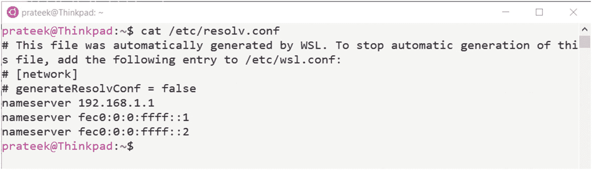
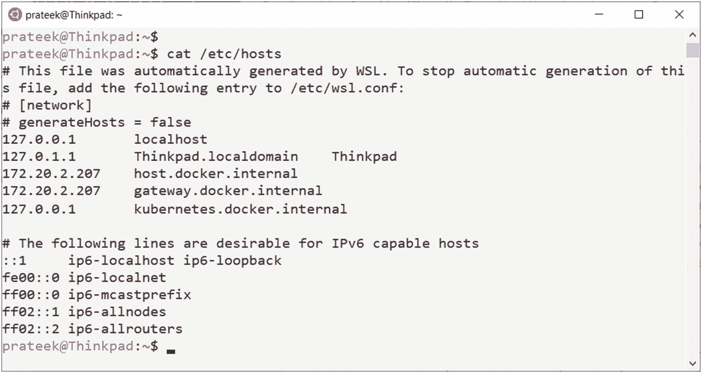
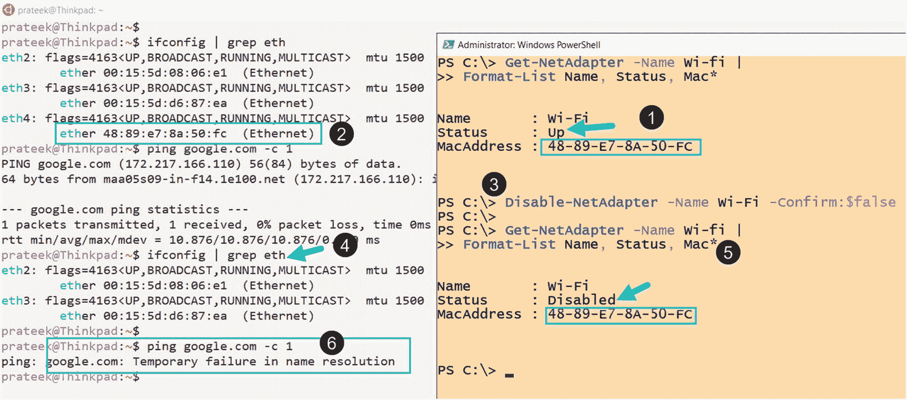
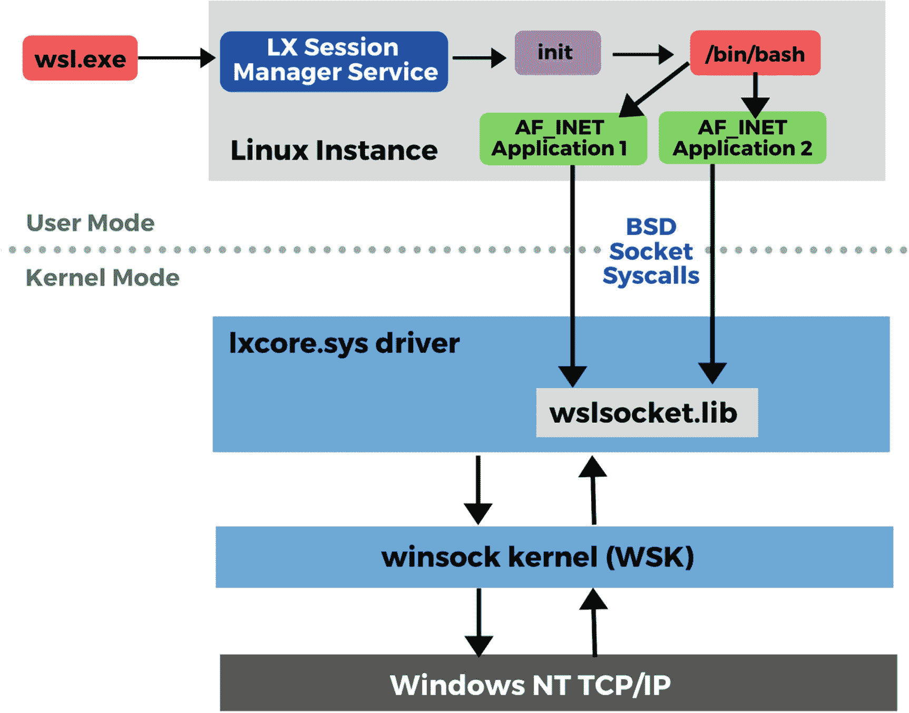
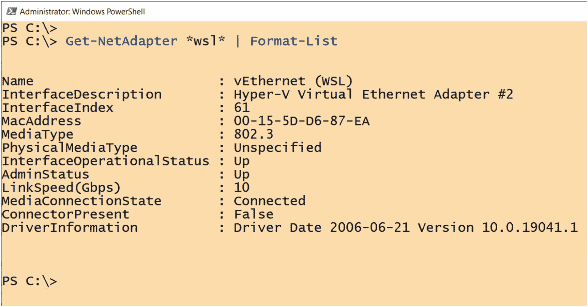

# 7.建立关系网

在本章中，我们将学习 Linux 的 Windows 子系统如何在子系统中配置网络，以及网络中的变化或更新如何从 Windows 端传播到 WSL。此外，我们将研究什么是 Linux 套接字，以及 WSL 如何实现它们，以便在 Windows 操作系统之上提供良好的 Linux 体验，同时保持互操作性。

今天，我们的计算机总是连接到网络和设备，我们需要通过网络堆栈持续访问互联网和其他系统，以交换数据、移动文件等，这进一步增加了网络作为任何软件应用成功背后的关键组件之一的重要性。

## WSL 网络概述

让我们先简单概述一下如何在 Linux 上建立网络以及如何在 WSL 上实现网络，并让我们讨论一下为构建无缝兼容层以弥合 Windows 和 Linux 网络之间的差距而做出的设计选择。

### 网络接口和 DNS

Linux 使用通用系统调用来控制(读取和写入)任何设备，如网络接口，这种调用也称为输入/输出控制(IOCTL)。IOCTLs 使得查看连接到 Linux 的所有网络接口的列表成为可能，方法是通过这些系统调用来读取网络接口，并将这些信息保存在内核中。但是 WSL1 没有这种能力，因为没有可用的内核，我们实际上是在兼容层上使用 syscall 翻译在 Windows 上模拟 Linux。

为了弥补这一缺陷，一旦在 Windows 上启动了 WSL 实例，LXSS 管理器服务就会查询 Windows 操作系统上的网络接口列表，并将该列表传递给 WSL 驱动程序(lxcore.sys ),每当从 Linux 发行版发出系统调用(IOCTL)时，前面提到的缓存信息就会提供 WSL 中的网络接口列表。

在/etc/resolv.conf 文件中也会自动填充相同的列表，该文件是 Linux 上的解析器配置文件，包含 Windows 上配置的域名系统服务器列表。该文件中有许多配置选项可以使用，但默认情况下，它会创建一个通用配置:

```sh
nameserver <namer server IP address>

```

IP 地址可以是点符号表示的 IPv4 地址，也可以是点/冒号符号表示的 IPv6 地址，如图 [7-1](#Fig1) 所示。



图 7-1

WSL 上自动填充的解析程序文件

一些网络查询信息也会填充/etc/hosts 文件，也称为主机文件，其中包含一个主机名及其各自 IP 地址的静态查找表，如图 [7-2](#Fig2) 所示。`/etc/resolv.conf`和`/etc/hosts`的组合使得 DNS 支持在 Linux 的 Windows 子系统上成为可能。



图 7-2

WSL 上自动填充的主机文件

但是网络是一个非常动态的事物，事物变化非常快，例如，用户可以非常容易地从有线以太网切换到无线网络。WSL 中必须有一种机制来支持将这些更改从 Windows 更新到 WSL 中，因此 LXSS 管理器服务通过注册自身来接收与 Windows 端网络接口中的更新相关的任何通知，从而再次发挥作用。这意味着 LxssManager 服务正在监听任何更新通知，如果网络有变化，它将再次使用前述方法自动填充到 WSL 中，如图 [7-3](#Fig3) 所示。这使`/etc/resolv.conf`和`/etc/hosts`文件保持最新，并与 Windows 配置同步。



图 7-3

由于 Windows 环境的变化而重新配置的 WSL

图 [7-3](#Fig3) 演示了在步骤 3 中，当 Windows 端的网络接口被禁用时，以太网立即从 Linux 的 Windows 子系统中消失(通过步骤 4 中丢失的 MAC 地址验证)，ICMP 请求在步骤 6 开始失败。

### 套接字

套接字是网络通信路径端点的抽象表示。套接字还可以作为本地非网络进程间通信的端点。在接下来的小节中，我们将简要介绍 Linux Berkeley sockets 和 Windows 操作系统中的类似实现 Winsock Kernel (WSK ),它使 WSL 能够将 Berkeley socket API 调用转换为 Winsock Kernel API 调用，反之亦然，从而使 Windows 和 Linux 之间的联网成为可能。

#### 伯克利插座

在 Linux 中，Berkeley sockets(也称为 BSD sockets)是一个允许进程间通信(IPC)的 API 接口。为了建立通信，任何两个端点都要在它们的每一端打开一个套接字，然后该套接字被绑定到一个给定的地址，以便在它们之间发送或接收数据。

下面是一些常见的 BSD 套接字 API 函数。

##### 插座( )

它用于创建特定类型的新套接字，打开套接字有三个要求，它们可以进一步用于对套接字进行分类:

1.  **地址族(AF)或域**–套接字可以是这些域或地址族之一。
    1.  AF_INET 是互联网协议版本 4 (IPv4)的 Linux 实现。

    2.  AF_UNIX 也称为 AF_LOCAL，用于系统内的进程间通信。

    3.  AF_NETLINK 套接字用于用户模式和内核之间的通信，因为它们由用户空间进程的基于套接字的标准接口和内核模块的内部内核 API 组成。

2.  **套接字类型**–套接字类型定义协议是面向连接的还是无连接的。
    1.  UDP 的 SOCK_DGRAM

    2.  TCP 的 SOCK_STREAM

    3.  ICMP 的 SOCK_RAW

3.  **套接字协议**–协议参数可以设置为零“0”以请求协议的套接字类型的默认实现。

语法:

```sh
socket(AddressFamily, Type, Protocol);

```

示例:

```sh
socket(AF_INET, SOCK_STREAM, 0);

```

##### 绑定( )

这个函数将一个套接字与一个套接字地址绑定在一起，即一个 IP 地址和一个端口号的组合。

##### 听( )

此函数将指定的套接字标记为被动套接字，该套接字只接受传入的连接。

##### 连接( )

该函数用于在引用的套接字和传递的 IP 地址之间建立连接。

##### send()、recv()、sendto()和 recvfrom()

顾名思义，这些函数用于通过套接字发送和接收数据。

##### 关闭( )

该函数用于通过终止通过套接字建立的连接来释放系统资源。

#### Winsock 和 WSK (Winsock 内核)

Windows 操作系统具有前述 BSD 套接字的用户模式实现，称为“Winsock”，该实现非常相似但不完全相同，并且它不能在 Windows 子系统中用于 Linux，因为 WSL 的套接字实现是在内核模式中，即在 Linux 子系统的驱动程序库(WslSocket.lib)中。

为了解决这个挑战，WSL 中使用了另一个低级 Windows NT API，也称为 Winsock 内核(WSK)。WSK 是一个内核模式的网络编程接口，使用它，任何内核模式的软件都可以像用户模式的“Winsock”一样执行网络 I/O 操作基本上，Windows Subsystem for Linux 驱动程序将调用从 BSD 套接字 API 转换为 WSK API，并实现任何其他缺少的东西，以支持与本地 Linux 发行版几乎相同的网络体验。

如图 [7-4](#Fig4) 所示，当一个应用创建一个运行在 WSL 之上的 Linux 发行版中的 BSD 套接字时，BSD 套接字系统调用 WSL 的内核模式驱动程序 lxcore.sys，该驱动程序处理翻译。lxcore.sys 将这些 BSD 套接字系统调用转换为 WSK (Winsock 内核)可以理解的调用，它是 NT 内核中的一个低级 API，用于处理 Windows 操作系统上任何与套接字相关的请求，并将套接字连接到底层 TCP/IP 堆栈。



图 7-4

WSL 网络布局

## WSL 与 WSL2 网络

Linux 版本 1 和 2 在 Windows 子系统中如何实现联网是完全不同的，了解其中的区别真的很重要；否则，你将陷入网络问题和意外行为。

其中一个主要区别是，在 WSL1 中，子系统使用与底层 Windows 操作系统相同的物理网络接口，因为其他一切都只是一个仿真，或者换句话说，是一个为支持 Windows 上的 Linux 发行版而构建的兼容层。这意味着您使用相同的网络接口卡(NIC)、IP 地址和 DNS 服务器。

但这在 WSL2 中发生了变化，因为在版本 2 中，Linux 的 Windows 子系统现在运行在使用 Hyper-V 构建的轻量级实用程序虚拟机上，就像任何虚拟机一样，WSL2 有自己专用的虚拟化网络接口，如图 [7-5](#Fig5) 所示，它有不同的 IP 地址和 DNS 服务器。



图 7-5

支持 WSL2 轻量级虚拟机的虚拟网络

除此之外，WSL1 和 WSL2 仍然填充`/etc/resolv.conf`和`/etc/hosts`文件以使 DNS 解析工作，除非这些文件被显式覆盖。

## 摘要

在本章中，我们学习了 Linux 的 Windows 子系统背后的网络概念，它使得 Windows 操作系统和 Linux 子系统之间的无缝体验和互操作性成为可能。我们讲述了网络接口以及如何在 WSL 上设置和配置名称解析，然后我们研究了 Berkeley sockets 和 Windows 中类似但不相同的实现 Winsock Kernel，它通过翻译 API 调用使 Linux 的 Windows 子系统中的联网成为可能。最后，我们讨论了 WSL1 和 WSL2 在联网方面的主要区别，wsl 1 模拟 Windows 上的 Linux 环境，wsl 2 是一个轻量级实用虚拟机，运行在 Windows 操作系统上，具有专用的网络接口。