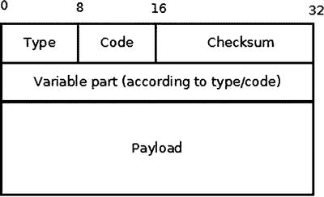
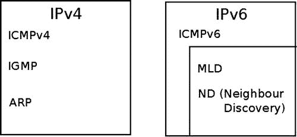
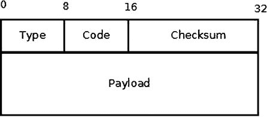
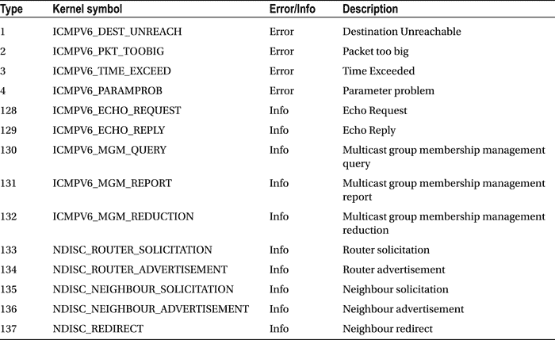
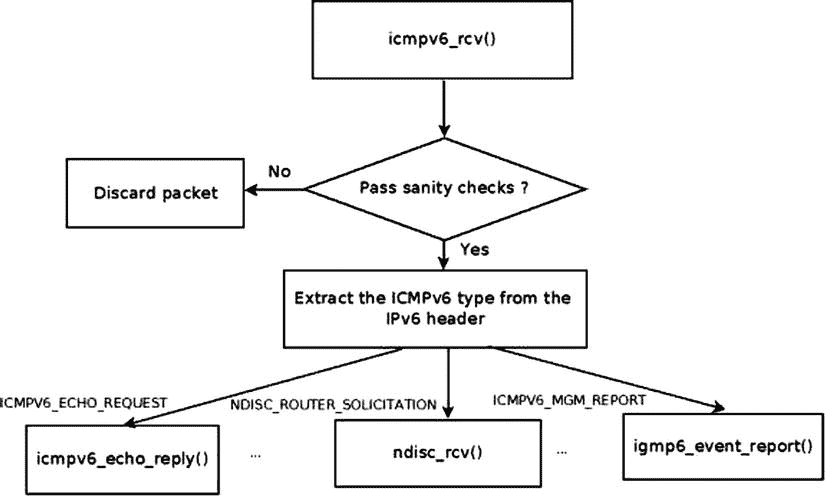

第三章


互联网控制信息协议

第 2 章讨论了 netlink 套接字的实现，以及 netlink 套接字如何被用作内核和用户空间之间的通信通道。本章介绍 ICMP 协议，这是一种第 4 层协议。用户空间应用可以通过使用套接字 API(最著名的例子可能是`ping`实用程序)来使用 ICMP 协议(发送和接收 ICMP 数据包)。本章讨论了内核如何处理这些 ICMP 数据包，并给出了一些例子。

ICMP 协议主要用作发送有关网络层(L3)的错误和控制消息的强制机制。该协议能够通过发送 ICMP 消息来获得关于通信环境中问题的反馈。这些消息提供错误处理和诊断。ICMP 协议相对简单，但对于确保正确的系统行为非常重要。ICMPv4 的基本定义在 RFC 792“互联网控制消息协议”中。这个 RFC 定义了 ICMPv4 协议的目标和各种 ICMPv4 消息的格式。我在本章中还提到了 RFC 1122(“对互联网主机—通信层的要求”)，它定义了一些关于 ICMP 消息的要求；RFC 4443，它定义了 ICMPv6 协议；RFC 1812 定义了对路由器的要求。我还描述了存在哪些类型的 ICMPv4 和 ICMPv6 消息，它们是如何发送的，以及它们是如何被处理的。我将介绍 ICMP 套接字，包括为什么添加它们以及如何使用它们。请记住，ICMP 协议也用于各种安全攻击；例如，Smurf 攻击是一种拒绝服务攻击，在这种攻击中，大量带有目标受害者假冒源 IP 的 ICMP 数据包通过广播发送到使用 IP 广播地址的计算机网络。

icmpv 4〔t0〕

ICMPv4 消息可以分为两类:错误消息和信息消息(它们在 RFC 1812 中被称为“查询消息”)。ICMPv4 协议用于诊断工具，如`ping`和`traceroute`。著名的`ping`实用程序实际上是一个用户空间应用(来自`iputils`包),它打开一个原始套接字并发送一个 ICMP_ECHO 消息，应该得到一个 ICMP_REPLY 消息作为响应。`Traceroute`是一个实用程序，用于查找主机和给定目的 IP 地址之间的路径。`traceroute`实用程序基于为生存时间(TTL)设置不同的值，TTL 是 IP 报头中表示跳数的字段。`traceroute`实用程序利用了这样一个事实:当数据包的 TTL 达到 0 时，转发机器将发回 ICMP_TIME_EXCEED 消息。`traceroute`实用程序通过发送 TTL 为 1 的消息开始，并且随着每个接收到的代码为 ICMP_TIME_EXCEED 的 ICMP_DEST_UNREACH 作为回复，它将 TTL 增加 1 并再次发送到相同的目的地。它使用返回的 ICMP“超时”消息建立数据包经过的路由器列表，直到到达目的地，并返回 ICMP“回应回复”消息。默认情况下，Traceroute 使用 UDP 协议。ICMPv4 模块是`net/ipv4/icmp.c`。请注意，ICMPv4 不能构建为内核模块。

ICMPv4 初始化

ICMPv4 初始化是在启动阶段调用的`inet_init()`方法中完成的。`inet_init()`方法调用`icmp_init()`方法，后者又调用`icmp_sk_init()`方法来创建内核 ICMP 套接字以发送 ICMP 消息，并将一些 ICMP `procfs`变量初始化为默认值。(在本章的后面，你会遇到这些`procfs`变量。)

ICMPv4 协议的注册与其他 IPv4 协议的注册一样，在`inet_init()`中完成:

```sh
static const struct net_protocol icmp_protocol = {
    .handler        =  icmp_rcv,
    .err_handler    =  icmp_err,
    .no_policy      =  1,
    .netns_ok       =  1,
};
```

(`net/ipv4/af_inet.c`)

*   `icmp_rcv`:回调`handler`。这意味着，对于 IP 报头中的协议字段等于 IPPROTO_ICMP (0x1)的传入数据包，将调用`icmp_rcv()`。
*   该标志被设置为 1，这意味着不需要执行 IPsec 策略检查；例如，在`ip_local_deliver_finish()`中没有调用`xfrm4_policy_check()`方法，因为设置了`no_policy`标志。
*   `netns_ok:`该标志设置为 1，表示协议知道网络名称空间。在`net_device`部分的[附录 A](16.html) 中描述了网络名称空间。对于`netns_ok`字段为 0 的协议，`inet_add_protocol()`方法将失败，错误为`-EINVAL`。

    ```sh
    static int __init inet_init(void) {
    . . .
        if (inet_add_protocol(&icmp_protocol, IPPROTO_ICMP) < 0)
            pr_crit("%s: Cannot add ICMP protocol\n", __func__);
    . . .

    int __net_init icmp_sk_init(struct net *net)
    {
        . . .
        for_each_possible_cpu(i) {
            struct sock *sk;

            err = inet_ctl_sock_create(&sk, PF_INET,
                           SOCK_RAW, IPPROTO_ICMP, net);
            if (err < 0)
                goto fail;

                    net->ipv4.icmp_sk[i] = sk;
                 . . .
                    sock_set_flag(sk, SOCK_USE_WRITE_QUEUE);
            inet_sk(sk)->pmtudisc = IP_PMTUDISC_DONT;
        }
        . . .

    }
    ```

在`icmp_sk_init()`方法中，为每个 CPU 创建一个原始 ICMPv4 套接字，并保存在一个数组中。电流`sk`可以通过`icmp_sk(struct net *net)`方法访问。这些插座用于`icmp_push_reply()`方法。ICMPv4 `procfs`条目在`icmp_sk_init()`方法中初始化；我在本章中提到了它们，并在本章末尾的“快速参考”部分对它们进行了总结。每个 ICMP 数据包都以 ICMPv4 报头开始。在讨论如何接收和传输 ICMPv4 消息之前，以下部分描述了 ICMPv4 头，以便您更好地理解 ICMPv4 消息是如何构建的。

ICMPv4 报头

ICMPv4 报头由类型(8 位)、代码(8 位)、校验和(16 位)和 32 位可变部分成员(其内容根据 ICMPv4 类型和代码而变化)组成，如[图 3-1](#Fig1) 所示。在 ICMPv4 报头之后是有效载荷，它应该包括原始数据包的 IPv4 报头及其有效载荷的一部分。根据 RFC 1812，它应该包含尽可能多的原始数据报，而 ICMPv4 数据报的长度不超过 576 字节。这个大小符合 RFC 791，RFC 791 规定“所有主机必须准备好接受最多 576 个八位字节的数据报。”



[图 3-1](#_Fig1) 。ICMPv4 标头

ICMPv4 报头由`struct icmphdr` : 表示

```sh
struct icmphdr {
  __u8        type;
  __u8        code;
  __sum16    checksum;
  union {
    struct {
        __be16    id;
        __be16    sequence;
    } echo;
    __be32    gateway;
    struct {
        __be16    __unused;
        __be16    mtu;
    } frag;
  } un;
};
```

(`include/uapi/linux/icmp.h`)

您将在`www.iana.org/assignments/icmp-parameters/icmp-parameters.xml`找到当前分配的 ICMPv4 消息类型编号和代码的完整列表。

ICMPv4 模块定义了一个名为`icmp_pointers`的`icmp_control`对象数组，该数组由 ICMPv4 消息类型索引。让我们看看`icmp_control`的结构定义和`icmp_pointers`数组:

```sh
struct icmp_control {
    void (*handler)(struct sk_buff *skb);
    short error;        /* This ICMP is classed as an error message */
};

static const struct icmp_control icmp_pointers[NR_ICMP_TYPES+1];
```

NR_ICMP_TYPES 是最高的 ICMPv4 类型，为 18。

```sh
(include/uapi/linux/icmp.h)
```

此数组的`icmp_control`对象的错误字段仅对于错误消息类型为 1，如“目的地不可达”消息(ICMP_DEST_UNREACH)，对于信息消息(如 echo (ICMP_ECHO))为 0(隐式)。有些处理程序被分配给多种类型。接下来，我将讨论处理程序和它们管理的 ICMPv4 消息类型。

`ping_rcv()`处理接收 ping 应答(ICMP_ECHOREPLY)。在 ICMP 套接字代码`net/ipv4/ping.c`中实现了`ping_rcv()`方法。在 3.0 之前的内核中，为了发送 ping，您必须在用户空间中创建一个原始套接字。当收到对 ping 的回复(ICMP_ECHOREPLY 消息)时，发送 ping 的原始套接字会对其进行处理。为了理解这是如何实现的，让我们看一看`ip_local_deliver_finish()`，这是一种处理传入的 IPv4 包并将它们传递给应该处理它们的套接字的方法:

```sh
static int ip_local_deliver_finish(struct sk_buff *skb)
{
    . . .
        int protocol = ip_hdr(skb)->protocol;
        const struct net_protocol *ipprot;
        int raw;

    resubmit:
        raw = raw_local_deliver(skb, protocol);
        ipprot = rcu_dereference(inet_protos[protocol]);
            if (ipprot != NULL) {
                    int ret;
                    . . .
                    ret = ipprot->handler(skb);
                    . . .
```

(`net/ipv4/ip_input.c`)

当`ip_local_deliver_finish()`方法接收到一个 ICMP_ECHOREPLY 包时，它首先尝试将它传递给一个侦听原始套接字，该套接字将处理它。因为在用户空间中打开的原始套接字处理 ICMP_ECHOREPLY 消息，所以不需要对它做任何进一步的处理。所以当`ip_local_deliver_finish()`方法收到 ICMP_ECHOREPLY 时，首先调用`raw_local_deliver()`方法通过一个原始套接字对其进行处理，然后调用`ipprot->handler(skb)`(这是 ICMPv4 数据包情况下的`icmp_rcv()`回调)。因为数据包已经被一个原始套接字处理过了，所以没有什么要做的了。因此，通过调用 ICMP_ECHOREPLY 消息的处理程序`icmp_discard()`方法，数据包被无声地丢弃。

当 ICMP 套接字(“ping 套接字”)被集成到内核 3.0 中的 Linux 内核中时，这种情况被改变了。Ping 套接字将在本章后面的“ICMP 套接字(“Ping 套接字”)一节中讨论。在这个上下文中，我应该注意到，对于 ICMP 套接字，`ping`的发送者也可以是*而不是原始套接字*。例如，您可以创建这样一个套接字:`socket (PF_INET, SOCK_DGRAM, PROT_ICMP)`并用它来发送`ping`数据包。此套接字不是原始套接字。因此，echo 回复不会传递给任何原始套接字，因为没有相应的原始套接字进行侦听。为了避免这个问题，ICMPv4 模块使用`ping_rcv()`回调来处理接收 ICMP_ECHOREPLY 消息。`ping`模块位于 IPv4 层(`net/ipv4/ping.c`)。然而，`net/ipv4/ping.c`中的大部分代码是双栈代码(适用于 IPv4 和 IPv6)。因此，`ping_rcv()`方法也处理 IPv6 的 ICMPV6_ECHO_REPLY 消息(参见`net/ipv6/icmp.c)`中的`icmpv6_rcv()`)。我将在本章的后面更多地讨论 ICMP 套接字。

`icmp_discard()` 是一个空的处理程序，用于不存在的消息类型(头文件中编号没有对应声明的消息类型)和一些不需要处理的消息，例如 ICMP _ TIMESTAMPREPLY。ICMP_TIMESTAMP 和 ICMP _ TIMESTAMPREPLY 消息用于时间同步；发送者在 ICMP_TIMESTAMP 请求中发送`originate timestamp`;接收方发送带有三个时间戳的 ICMP _ timestamp preply:时间戳请求发送方发送的起始时间戳，以及接收时间戳和发送时间戳。有比 ICMPv4 时间戳消息更常用的时间同步协议，如网络时间协议(NTP)。我还应该提到地址掩码请求(ICMP_ADDRESS ),它通常由主机发送给路由器，以便获得适当的子网掩码。收件人应该用地址掩码回复邮件来回复此邮件。过去由`icmp_address()`方法和`icmp_address_reply()`方法处理的 ICMP_ADDRESS 和 ICMP_ADDRESSREPLY 消息现在也由`icmp_discard()`处理。原因是有其他方法可以获得子网掩码，比如 DHCP。

`icmp_unreach()`处理 ICMP_DEST_UNREACH、ICMP_TIME_EXCEED、ICMP_PARAMETERPROB 和 ICMP_QUENCH 消息类型。

可以在各种条件下发送一条`ICMP_DEST_UNREACH`消息。本章的“发送 ICMPv4 消息:无法到达目的地”一节描述了其中的一些情况。

在两种情况下发送`ICMP_TIME_EXCEEDED`消息:

在`ip_forward()`中，每个数据包的 TTL 递减。根据 RFC 1700，IPv4 协议的建议 TTL 为 64。如果 TTL 达到 0，这表示应该丢弃数据包，因为可能存在某种循环。因此，如果 TTL 在`ip_forward()`中达到 0，就会调用`icmp_send()`方法:

```sh
icmp_send(skb, ICMP_TIME_EXCEEDED, ICMP_EXC_TTL, 0);
```

```sh
(net/ipv4/ip_forward.c)
```

在这种情况下，发送一个 ICMP_TIME_EXCEEDED 消息，代码为 ICMP_EXC_TTL，释放 SKB，`InHdrErrors` SNMP 计数器(IPSTATS _ MIB _ INHDRERRORS)递增，该方法返回 NET_RX_DROP。

在`ip_expire()`中，当一个片段超时时，会发生以下情况:

```sh
icmp_send(head, ICMP_TIME_EXCEEDED, ICMP_EXC_FRAGTIME, 0);
```

```sh
(net/ipv4/ip_fragment.c)
```

在`ip_options_compile()`方法或`ip_options_rcv_srr()`方法(`net/ipv4/ip_options.c`)中解析 IPv4 报头选项失败时，发送 ICMP_PARAMETERPROB 消息。这些选项是 IPv4 报头的可选可变长度字段(最多 40 个字节)。IP 选项在第 4 章的[中讨论。](04.html)

ICMP_QUENCH 消息类型实际上已被否决。根据 RFC 1812，4.3.3.3 部分(源抑制):“路由器不应该发起 ICMP 源抑制消息”，此外，“路由器可以忽略它收到的任何 ICMP 源抑制消息。”ICMP_QUENCH 消息旨在减少拥塞，但事实证明这是一个无效的解决方案。

`icmp_redirect()` 处理 ICMP_REDIRECT 消息；根据 RFC 1122 3.2.2.2 部分，主机不应发送 ICMP 重定向消息；重定向只能由网关发送。`icmp_redirect()`处理 ICMP_REDIRECT 消息。过去，`icmp_redirect()`调用`ip_rt_redirect()`，但是现在不再需要`ip_rt_redirect()`调用，因为协议处理程序现在可以正确地将重定向传播回路由代码。事实上，在内核 3.6 中，`ip_rt_redirect()`方法被移除了。因此，`icmp_redirect()`方法首先执行健全性检查，然后调用`icmp_socket_deliver()`，它将数据包传递给原始套接字并调用协议错误处理程序(如果它存在的话)。第 6 章更深入地讨论了 ICMP_REDIRECT 消息。

`icmp_echo()` 通过用`icmp_reply()`发送回应回复(ICMP_ECHOREPLY)来处理回应(“ping”)请求(ICMP_ECHO)。如果设置了案例`net->ipv4.sysctl_icmp_echo_ignore_all`，则不会发送回复。关于配置 ICMPv4 `procfs`条目，请参见本章末尾的“快速参考”部分，以及`Documentation/networking/ip-sysctl.txt`。

`icmp_timestamp()`通过用`icmp_reply()`发送 ICMP _ TIMESTAMPREPLY 来处理 ICMP 时间戳请求(ICMP_TIMESTAMP)。

在讨论通过`icmp_reply()`方法和`icmp_send()`方法发送 ICMP 消息之前，我应该描述一下在这两种方法中使用的`icmp_bxm`(“ICMP 构建 xmit 消息”)结构:

```sh
struct icmp_bxm {
    struct sk_buff *skb;
    int offset;
    int data_len;

    struct {
        struct icmphdr icmph;
        __be32           times[3];
    } data;
    int head_len;
    struct ip_options_data replyopts;
};

```

*   `skb`:对于`icmp_reply()`方法，这个`skb`是请求包；`icmp_param`对象(`icmp_bxm`的实例)就是从它构建的(在`icmp_echo()`方法和`icmp_timestamp()`方法中)。对于`icmp_send()`方法，这个`skb`是由于某些条件触发发送 ICMPv4 消息的方法；在本节中，您将看到几个此类消息的示例。
*   `offset`:在`skb_network_header(skb)`和`skb->data`之间的差异(偏移)。
*   `data_len` : ICMPv4 数据包有效负载大小。
*   `icmph`:ICMP v4 报头。
*   `times[3]`:三个时间戳的数组，填入`icmp_timestamp()`。
*   `head_len:`icmp v4 报头的大小(在`icmp_timestamp()`的情况下，时间戳有额外的 12 个字节)。
*   `replyopts:`一个`ip_options`数据对象。IP 选项是 IP 报头后的可选字段，最多 40 个字节。它们支持高级功能，如严格路由/松散路由、记录路由、时间戳等。它们是用`ip_options_echo()`方法初始化的。[第 4 章](04.html)讨论知识产权期权。

接收 ICMPv4 消息

`ip_local_deliver_finish()`方法处理本地机器的数据包。当获取 ICMP 数据包时，该方法将该数据包传递给已执行 ICMPv4 协议注册的原始套接字。在`icmp_rcv()`方法中，首先增加`InMsgs` SNMP 计数器(ICMP_MIB_INMSGS)。随后，检验校验和的正确性。如果校验和不正确，两个 SNMP 计数器增加，`InCsumErrors`和`InErrors`(分别为 ICMP_MIB_CSUMERRORS 和 ICMP_MIB_INERRORS)，SKB 被释放，该方法返回 0。在这种情况下，`icmp_rcv()`方法不会返回错误。事实上，`icmp_rcv()`方法总是返回 0；在校验和错误的情况下返回 0 的原因是，当接收到错误的 ICMP 消息时，除了丢弃它之外，不应该做任何特殊的事情；当协议处理程序返回否定错误时，会再次尝试处理数据包，这种情况下不需要这样做。更多细节，请参考`ip_local_deliver_finish()`方法的实现。然后检查 ICMP 报头，以便找到它的类型；相应的`procfs`消息类型计数器递增(每个 ICMP 消息类型都有一个`procfs`计数器)，并且执行健全性检查以验证它不高于最高允许值(NR_ICMP_TYPES)。根据 RFC 1122 的第 3.2.2 节，如果收到未知类型的 ICMP 消息，它必须被无声地丢弃。因此，如果消息类型超出范围，`InErrors` SNMP 计数器(ICMP_MIB_INERRORS)将递增，SKB 将被释放。

如果数据包是广播或组播，并且是 ICMP_ECHO 消息或 ICMP_TIMESTAMP 消息，则通过读取变量`net->ipv4.sysctl_icmp_echo_ignore_broadcasts`检查是否允许广播/组播 ECHO 请求。该变量可通过写入`/proc/sys/net/ipv4/icmp_echo_ignore_broadcasts`经由`procfs`进行配置，默认情况下其值为 1。如果设置了该变量，数据包将被无声地丢弃。这是根据 RFC 1122 的 3.2.2.6 部分完成的:“发往 IP 广播或 IP 多播地址的 ICMP 回应请求可能会被无声地丢弃。”根据 RFC 的 3.2.2.8 部分，“发往 IP 广播或 IP 多播地址的 ICMP 时间戳请求消息可能会被无声地丢弃。”然后，执行检查以检测该类型是否允许广播/多播(`ICMP_ECHO, `ICMP_TIMESTAMP, `ICMP_ADDRESS, and `ICMP_ADDRESSREPLY). If it is not one of these message types, the packet is dropped and 0 is returned. Then according to its type, the corresponding entry in the `icmp_pointers`数组被取出，并且适当的处理程序被调用。让我们看看`icmp_control`调度表中的 ICMP_ECHO 条目:```sh`

 `````
static const struct icmp_control icmp_pointers[NR_ICMP_TYPES + 1] = {
...
  [ICMP_ECHO] = {
        .handler = icmp_echo,
    },
...
}
```sh

所以当接收到 ping(消息的类型是“Echo Request”，ICMP_ECHO)时，它由`icmp_echo()`方法处理。`icmp_echo()`方法将 ICMP 头中的类型改为 ICMP_ECHOREPLY，并通过调用`icmp_reply()`方法发送回复。除了`ping`，唯一需要响应的其他 ICMP 消息是时间戳消息(ICMP _ TIMESTAMP)；它由`icmp_timestamp()`方法处理，与 ICMP_ECHO 的情况非常相似，该方法将类型更改为 ICMP _ TIMESTAMPREPLY，并通过调用`icmp_reply()`方法发送回复。发送由`ip_append_data()`和`ip_push_pending_frames()`完成。接收 ping 应答(ICMP_ECHOREPLY)由`ping_rcv()`方法`.` 处理

您可以使用以下命令禁用对 pings 的回复:

```
echo 1 >  /proc/sys/net/ipv4/icmp_echo_ignore_all
```sh

有一些回调处理不止一种 ICMP 类型。例如，`icmp_discard()`回调处理类型不由 Linux ICMPv4 实现处理的 ICMPv4 数据包，以及 ICMP _ TIMESTAMPREPLY、ICMP_INFO_REQUEST、ICMP_ADDRESSREPLY 等消息。

发送 ICMPv4 消息:“目的地不可达”

发送 ICMPv4 消息有两种方法:第一种是`icmp_reply()`方法，它作为对 ICMP_ECHO 和 ICMP_TIMESTAMP 这两种类型的 ICMP 请求的响应发送。第二种是`icmp_send()`方法，本地机器在特定条件下发起发送 ICMPv4 消息(在本节中描述)。这两种方法最终都会调用`icmp_push_reply()`来实际发送数据包。作为对来自`icmp_echo()`方法的 ICMP_ECHO 消息的响应，调用`icmp_reply()`方法，并作为对来自`icmp_timestamp()`方法的 ICMP_TIMESTAMP 消息的响应。从 IPv4 网络堆栈中的许多地方调用`icmp_send()`方法——例如，从 netfilter、从转发代码(`ip_forward.c` ) *、*从类似`ipip`和`ip_gre`的隧道等等。

本节研究发送“目的地不可达”消息的一些情况(类型为 ICMP_DEST_UNREACH)。

代码 2: ICMP_PROT_UNREACH(协议不可达)

当 IP 报头的协议(它是一个 8 位字段)是一个不存在的协议时，ICMP _ DEST _ un reach/ICMP _ PROT _ un reach 被发送回发送方，因为这样的协议没有协议处理程序(协议处理程序数组由协议号索引，因此对于不存在的协议，将没有处理程序)。所谓*不存在的*协议，我的意思是，由于某些错误，IPv4 报头的协议号确实没有出现在协议号列表中(您可以在`include/uapi/linux/in.h` *、*中找到 IPv4 的协议号列表)，或者内核是在不支持该协议的情况下构建的，因此，该协议没有被注册，并且在协议处理程序数组中没有它的条目。因为无法处理这样的数据包，所以应该向发送方回复一个“目的地不可达”的 ICMPv4 消息；ICMPv4 回复中的 ICMP_PROT_UNREACH 代码表示错误原因，“协议不可达”见下文:

```
static int ip_local_deliver_finish(struct sk_buff *skb)
  {
    ...
    int protocol = ip_hdr(skb)->protocol;
    const struct net_protocol *ipprot;
    int raw;

resubmit:
    raw = raw_local_deliver(skb, protocol);

    ipprot = rcu_dereference(inet_protos[protocol]);
    if (ipprot != NULL) {
        ...
    } else {
    if (!raw) {
    if (xfrm4_policy_check(NULL, XFRM_POLICY_IN, skb)) {
            IP_INC_STATS_BH(net, IPSTATS_MIB_INUNKNOWNPROTOS);
            icmp_send(skb, ICMP_DEST_UNREACH,ICMP_PROT_UNREACH, 0);
              }
        ...
  }
```sh

```
(net/ipv4/ip_input.c)
```sh

在这个例子中，通过协议在`inet_protos`阵列中执行查找；因为没有找到条目，这意味着该协议没有在内核中注册。

代码 3: ICMP_PORT_UNREACH(“端口不可达”)

接收 UDPv4 数据包时，会搜索匹配的 UDP 套接字。如果没有找到匹配的套接字，则检验校验和的正确性。如果它是错误的，数据包将被无声地丢弃。如果正确，则更新统计数据，并发回“目的地不可达”/“端口不可达”ICMP 消息:

```
int __udp4_lib_rcv(struct sk_buff *skb, struct udp_table *udptable, int proto)
{
        struct sock *sk;
        ...
        sk = __udp4_lib_lookup_skb(skb, uh->source, uh->dest, udptable)
        ...
        if (sk != NULL) {
        ...
        }

        /* No socket. Drop packet silently, if checksum is wrong */
    if (udp_lib_checksum_complete(skb))
        goto csum_error;

        UDP_INC_STATS_BH(net, UDP_MIB_NOPORTS, proto == IPPROTO_UDPLITE);
        icmp_send(skb, ICMP_DEST_UNREACH, ICMP_PORT_UNREACH, 0);
        ...
        }
...

}
```sh

```
(net/ipv4/udp.c)
```sh

通过`__udp4_lib_lookup_skb()`方法执行查找，如果没有套接字，则更新统计数据，并发回一个 ICMP_PORT_UNREACH 代码为的 ICMP_DEST_UNREACH 消息。

代码 4:需要 ICMP _ FRAG _ NEEDED

当转发长度大于传出链路 MTU 的数据包时，如果 IPv4 报头(IP_DF)中的不分段(DF)位被置位，则该数据包被丢弃，并且带有 ICMP_FRAG_NEEDED 代码的 ICMP_DEST_UNREACH 消息被发送回发送方:

```
int ip_forward(struct sk_buff *skb)
{
        ...
        struct rtable *rt;      /* Route we use */
        ...
        if (unlikely(skb->len > dst_mtu(&rt->dst) && !skb_is_gso(skb) &&
                     (ip_hdr(skb)->frag_off & htons(IP_DF))) && !skb->local_df) {
                IP_INC_STATS(dev_net(rt->dst.dev), IPSTATS_MIB_FRAGFAILS);
                icmp_send(skb, ICMP_DEST_UNREACH, ICMP_FRAG_NEEDED,
                          htonl(dst_mtu(&rt->dst)));
                goto drop;
        }
        ...
}
```sh

```
(net/ipv4/ip_forward.c)
```sh

代码 5: ICMP_SR_FAILED

当转发带有严格路由选项和网关设置的数据包时，会发回一条带有 ICMP_SR_FAILED 代码的“目的地不可达”消息，数据包会被丢弃:

```
int ip_forward(struct sk_buff *skb)
 {
         struct ip_options *opt  = &(IPCB(skb)->opt);
         ...
         if (opt->is_strictroute && rt->rt_uses_gateway)
                 goto sr_failed;
         ...
sr_failed:
          icmp_send(skb, ICMP_DEST_UNREACH, ICMP_SR_FAILED, 0);
          goto drop;
}
```sh

```
(net/ipv4/ip_forward.c)
```sh

有关所有 IPv4“目的地不可达”代码的完整列表，请参见本章末尾“快速参考”部分的[表 3-1](#Tab1) 。注意，用户可以使用`iptables`拒绝目标和`--reject-with`限定符配置一些规则，这些规则可以根据选择发送“目的地不可达”消息；本章末尾的“快速参考”部分有更多信息。

`icmp_reply()`和`icmp_send()`方法都支持速率限制；他们调用`icmpv4_xrlim_allow()`，如果速率限制检查允许发送数据包(`icmpv4_xrlim_allow()`返回`true`)，他们就发送数据包。这里应该提到的是，速率限制不是自动对所有类型的流量执行的。以下是不执行速率限制检查的条件:

*   消息类型未知。
*   该数据包属于 PMTU 发现。
*   该设备是一个环回设备。
*   速率掩码中没有启用 ICMP 类型。

如果所有这些条件都不匹配，则通过调用`inet_peer_xrlim_allow()`方法来执行速率限制。您可以在本章末尾的“快速参考”部分找到更多关于速率屏蔽的信息。

让我们看看`icmp_send()`方法的内部。首先，这是它的原型:

```
void icmp_send(struct sk_buff *skb_in, int type, int code, __be32 info)
```sh

skb `_in`是导致调用`icmp_send()`方法的 skb，`type`和`code`分别是 ICMPv4 消息`type`和`code`。最后一个参数`info`用于以下情况:

*   对于 ICMP_PARAMETERPROB 消息类型，它是发生解析问题的 IPv4 标头中的偏移量。
*   对于带有 ICMP_FRAG_NEEDED 代码的 ICMP_DEST_UNREACH 消息类型，它是 MTU。
*   对于带有 ICMP_REDIR_HOST 代码的 ICMP_REDIRECT 消息类型，它是发起 SKB 的 IPv4 报头中的目的地址的 IP 地址。

当进一步研究`icmp_send()`方法时，首先有一些健全性检查。那么多播/广播分组被拒绝。通过检查 IPv4 报头的`frag_off`字段来检查分组是否是片段。如果数据包被分段，则会发送一条 ICMPv4 消息，但只针对第一个分段。根据 RFC 1812 的 4.3.2.7 部分，不得因收到 ICMP 错误消息而发送 ICMP 错误消息。因此，首先执行检查以发现要发送的 ICMPv4 消息是否是错误消息，如果是，则执行另一检查以发现发起 SKB 是否包含错误 ICMPv4 消息，如果是，则该方法返回而不发送 ICMPv4 消息。此外，如果类型是未知的 ICMPv4 类型(高于 NR_ICMP_TYPES ),该方法返回时不发送 ICMPv4 消息，尽管 RFC 没有明确指定这一点。然后根据`net->ipv4.sysctl_icmp_errors_use_inbound_ifaddr`值的值确定源地址(更多细节在本章末尾的“快速参考”一节)。然后调用`ip_options_echo()`方法来复制调用 SKB 的 IPv4 报头的 IP 选项。一个`icmp_bxm`对象`(icmp_param)`正在被分配和初始化，并且在路由子系统中使用`icmp_route_lookup()`方法执行查找。然后调用`icmp_push_reply()`方法。

让我们看一下`icmp_push_reply()`方法，它实际上发送了数据包。`icmp_push_reply()`首先通过调用以下命令找到应该发送数据包的套接字:

```
sk = icmp_sk(dev_net((*rt)->dst.dev));
```sh

`dev_net()`方法返回传出网络设备的网络名称空间。(第 14 章和[附录 A](16.html) 中讨论了`dev_net()`方法和网络名称空间。)然后，`icmp_sk()`方法获取套接字(因为在 SMP 中每个 CPU 有一个套接字)。然后调用`ip_append_data()`方法将数据包移动到 IP 层。如果`ip_append_data()`方法失败，通过增加 ICMP_MIB_OUTERRORS 计数器来更新统计数据，并且调用`ip_flush_pending_frames()`方法来释放 SKB。我在第 4 章的[中讨论了`ip_append_data()`方法和`ip_flush_pending_frames()`方法。](04.html)

既然您已经对 ICMPv4 了如指掌，那么是时候继续学习 ICMPv6 了。

ICMPv6

在网络层(L3)报告错误方面，ICMPv6 与 ICMPv4 有许多相似之处。ICMPv6 还有一些在 ICMPv4 中不执行的任务。本节讨论 ICMPv6 协议、它的新功能(在 ICMPv4 中没有实现)以及类似的功能。RFC 4443 中定义了 ICMPv6。如果您深入研究 ICMPv6 代码，您可能迟早会遇到提到 RFC 1885 的注释。事实上，RFC 1885“用于互联网协议版本 6 (IPv6)的互联网控制消息协议(ICMPv6)”是 ICMPv6 RFC 的基础。它被 RFC 2463 淘汰，而 RFC 2463 又被 RFC 4443 淘汰。ICMPv6 实现基于 IPv4，但它更复杂；本节将讨论新增的更改和内容。

根据 RFC 4443 第 1 节的规定，ICMPv6 协议的下一个报头值为 58([第 8 章](08.html)讨论了 IPv6 下一个报头)。ICMPv6 是 IPv6 不可或缺的一部分，必须由每个 IPv6 节点完全实现。除了错误处理和诊断之外，ICMPv6 还用于 IPv6 中的邻居发现(nd)协议，该协议取代并增强了 IPv4 中 ARP 的功能，还用于多播监听发现(MLD)协议，该协议是 IPv4 中 IGMP 协议的对等物，如图 3-2 中[所示。](#Fig2)



[图 3-2](#_Fig2) 。IPv4 和 IPv6 中的 ICMP。IPv6 中 IGMP 协议的对应部分是 MLD 协议，IPv6 中 ARP 协议的对应部分是 nd 协议

本节介绍 ICMPv6 的实现。正如您将看到的，在处理和发送消息的方式上，它与 ICMPv4 实现有许多共同之处。甚至有在 ICMPv4 和 ICMPv6 中调用相同方法的情况(例如，`ping_rcv()`和`inet_peer_xrlim_allow()`)。有些不同，有些主题是 ICMPv6 特有的。`ping6`和`traceroute6`实用程序基于 ICMPv6，是 IPv4 的`ping`和`traceroute`实用程序的对应物(在本章开头的 ICMPv4 部分提到过)。ICMPv6 在`net/ipv6/icmp.c`和`net/ipv6/ip6_icmp.c`中实现。与 ICMPv4 一样，ICMPv6 不能作为内核模块构建。

ICMPv6 初始化

ICMPv6 初始化由`icmpv6_init()`方法和`icmpv6_sk_init()`方法完成。ICMPv6 协议的注册由`icmpv6_init()` ( `net/ipv6/icmp.c`)完成:

```
static const struct inet6_protocol icmpv6_protocol = {
         .handler        =       icmpv6_rcv,
         .err_handler    =       icmpv6_err,
         .flags          =       INET6_PROTO_NOPOLICY|INET6_PROTO_FINAL,
 };
```sh

`handler`回调为`icmpv6_rcv()`；这意味着对于协议字段等于 IPPROTO_ICMPV6 (58)的传入数据包，将调用`icmpv6_rcv()`。

当 INET6_PROTO_NOPOLICY 标志被设置时，这意味着不应该执行 IPsec 策略检查；例如，在`ip6_input_finish()`中没有调用`xfrm6_policy_check()`方法，因为 INET6_PROTO_NOPOLICY 标志被设置:

```
int __init icmpv6_init(void)
 {
         int err;
         ...
         if (inet6_add_protocol(&icmpv6_protocol, IPPROTO_ICMPV6) < 0)
                 goto fail;
         return 0;
 }

static int __net_init icmpv6_sk_init(struct net *net)
{
    struct sock *sk;
        ...
    for_each_possible_cpu(i) {
        err = inet_ctl_sock_create(&sk, PF_INET6,
                       SOCK_RAW, IPPROTO_ICMPV6, net);
        ...
        net->ipv6.icmp_sk[i] = sk;
        ...

}
```sh

与在 ICMPv4 中一样，为每个 CPU 创建一个原始的 ICMPv6 套接字，并保存在一个数组中。当前的`sk`可以通过`icmpv6_sk()`方法访问。

ICMPv6 标题

ICMPv6 报头由`type` (8 位)`code` (8 位)`checksum` (16 位)组成，如图[图 3-3](#Fig3) 所示。



[图 3-3](#_Fig3) 。ICMPv6 标头

ICMPv6 报头由`struct icmp6hdr`表示:

```
struct icmp6hdr {
    __u8        icmp6_type;
    __u8        icmp6_code;
    __sum16    icmp6_cksum;
    ...
}
```sh

没有足够的空间显示`struct icmp6hdr`的所有字段，因为它太大了(它是在`include/uapi/linux/icmpv6.h`中定义的)。当类型字段的高位为 0(取值范围为 0-127)时，表示出错信息；当高位为 1(取值范围为 128 到 255)时，表示信息消息。[表 3-1](#Tab1) 根据消息的编号和内核符号显示了 ICMPv6 消息类型。

[表 3-1](#_Tab1) 。ICMPv6 消息



分配的 ICMPv6 类型和代码的当前完整列表可在`www.iana.org/assignments/icmpv6-parameters/icmpv6-parameters.xml`找到。

ICMPv6 执行一些 ICMPv4 没有执行的任务。例如，邻居发现是由 ICMPv6 完成的，而在 IPv4 中是由 ARP/RARP 协议完成的。多播组成员资格由 ICMPv6 结合 MLD(多播侦听程序发现)协议处理，而在 IPv4 中，这由 IGMP (Internet 组管理协议)执行。一些 ICMPv6 消息在含义上类似于 ICMPv4 消息；例如，ICMPv6 有这些消息:“无法到达目的地，”(icmp V6 _ DEST _ 未到达)、“超时”(icmp V6 _ 时间 _ 超出)、“参数问题”(ICMPV6_PARAMPROB)、“回显请求”(icmp V6 _ 回显请求)，等等。另一方面，一些 ICMPv6 消息是 IPv6 独有的，例如 NDISC _ NEIGHBOUR _ SOLICITATION 消息。

接收 ICMPv6 消息

当获得一个 ICMPv6 包时，它被传递给`icmpv6_rcv()`方法，该方法只获得一个 SKB 作为参数。[图 3-4](#Fig4) 显示了接收到的 ICMPv6 消息的`Rx`路径。



[图 3-4](#_Fig4) 。ICMPv6 消息的接收路径

在`icmpv6_rcv()`方法中，在一些健全性检查之后，`InMsgs` SNMP 计数器(ICMP6_MIB_INMSGS)递增。随后，检验校验和的正确性。如果校验和不正确，则`InErrors` SNMP 计数器(ICMP6_MIB_INERRORS)递增，SKB 被释放。在这种情况下，`icmpv6_rcv()`方法不会返回错误(事实上，它总是返回 0，很像它的 IPv4 对应方法`icmp_rcv()`)。然后，读取 ICMPv6 标头以找到其类型；相应的`procfs`消息类型计数器由 ICMP6MSGIN_INC_STATS_BH 宏递增(每个 ICMPv6 消息类型都有一个`procfs`计数器)。例如，当接收到 ICMPv6 回应请求(“pings”)时，`/proc/net/snmp6/Icmp6InEchos`计数器递增，当接收到 ICMPv6 邻居请求请求时，`/proc/net/snmp6/Icmp6InNeighborSolicits`计数器递增。

在 ICMPv6 中，没有像 ICMPv4 中的`icmp_pointers`表那样的调度表。根据 ICMPv6 消息类型，在一个长的`switch(type)`命令中调用处理程序:

*   “回应请求”(ICMPV6_ECHO_REQUEST)由`icmpv6_echo_reply()`方法处理。
*   “回显回复”(ICMPV6_ECHO_REPLY)由`ping_rcv()`方法处理。`ping_rcv()`方法在 IPv4 `ping`模块中(`net/ipv4/ping.c`)；此方法是一种双栈方法(它处理 IPv4 和 IPv6—在本章开始时讨论过)。
*   数据包太大(ICMPV6_PKT_TOOBIG)。

*   首先检查数据块区(由`skb->data`指向)是否包含一个数据块，其大小至少与 ICMP 报头一样大。这是通过`pskb_may_pull()`方法完成的。如果不满足这个条件，数据包就会被丢弃。
*   然后调用`icmpv6_notify()`方法。这个方法最终调用`raw6_icmp_error()`方法，以便注册的原始套接字将处理 ICMP 消息。

*   “目的地不可达”、“超时”、“参数问题”(分别为 ICMPV6_DEST_UNREACH、ICMPV6_TIME_EXCEED、ICMPV6_PARAMPROB)也由`icmpv6_notify()`处理。
*   邻居发现(ND)消息 :

*   NDISC_ROUTER_SOLICITATION:通常发送到 FF02::2 的`all-routers`组播地址的消息，由路由器广告应答。(特殊 IPv6 组播地址在第 8 章的[中讨论)。](08.html)
*   NDISC_ROUTER_ADVERTISEMENT:路由器定期发送的消息，或者作为对路由器请求的即时响应。路由器通告包含用于链路确定和/或地址配置的前缀、建议的跳数限制值等等。
*   NDISC _ neighbor _ SOLICITATION:IP v4 中 ARP 请求的对应方。
*   NDISC _ neighbor _ ADVERTISEMENT:IP v4 中 ARP 回复的对应方。

*   NDISC_REDIRECT:由路由器用来通知主机到目的地的更好的第一跳。
*   所有邻居发现(ND)消息都由邻居发现方法`ndisc_rcv()` ( `net/ipv6/ndisc.c`)处理。在第 7 章的[中讨论了`ndisc_rcv()`方法。](07.html)

*   ICMPV6_MGM_QUERY(组播监听报告)由`igmp6_event_query()`处理。
*   ICMPV6_MGM_REPORT(组播监听报告)由`igmp6_event_report()`处理。注意:ICMPV6_MGM_QUERY 和 ICMPV6_MGM_REPORT 在[第 8 章](08.html)中有更详细的讨论。
*   未知类型的消息以及下面的消息都由`icmpv6_notify()`方法处理:

*   ICMPV6_MGM_REDUCTION:主机离开组播组时，发送 MLDv2 ICMPV6_MGM_REDUCTION 消息；参见`net/ipv6/mcast.c`中的`igmp6_leave_group()`方法。
*   ICMPV6_MLD2_REPORT: MLDv2 多播侦听器报告数据包；通常与所有支持 MLDv2 的路由器多播组地址(FF02::16)的目的地址一起发送。
*   ICMPV6_NI_QUERY- ICMP:节点信息查询。
*   ICMPV6_NI_REPLY: ICMP 节点信息响应。
*   ICMPV6_DHAAD_REQUEST: ICMP 家乡代理地址发现请求消息；请参见 RFC 6275 第 6.5 节“IPv6 中的移动性支持”
*   ICMPV6_DHAAD_REPLY: ICMP 家乡代理地址发现回复消息；参见 RFC 6275 第 6.6 节。
*   ICMPV6_MOBILE_PREFIX_SOL: ICMP 移动前缀请求消息格式；参见 RFC 6275 第 6.7 节。
*   ICMPV6_MOBILE_PREFIX_ADV: ICMP 移动前缀广告消息格式；参见 RFC 6275 第 6.8 节。

请注意，`switch(type)`命令是这样结束的:

```
    default:
        LIMIT_NETDEBUG(KERN_DEBUG "icmpv6: msg of unknown type\n");

        /* informational */
        if (type & ICMPV6_INFOMSG_MASK)
            break;

        /*
         * error of unknown type.
         * must pass to upper level
         */

        icmpv6_notify(skb, type, hdr->icmp6_code, hdr->icmp6_mtu);
    }
```sh

信息消息满足条件`(type & ICMPV6_INFOMSG_MASK)`，因此它们被丢弃，而不满足该条件的其他消息(因此应该是错误消息)被传递到上层。这是根据 RFC 4443 的第 2.4 节(“消息处理规则”)完成的。

发送 ICMPv6 消息

发送 ICMPv6 消息的主要方法是`icmpv6_send()`方法。当本地计算机在本节描述的条件下开始发送 ICMPv6 消息时，将调用方法。还有一个`icmpv6_echo_reply()`方法，它仅作为对 ICMPV6_ECHO_REQUEST ("ping ")消息的响应而被调用。从 IPv6 网络栈中的许多地方调用`icmp6_send()`方法。本节看几个例子。

示例:发送“超过跃点限制时间”ICMPv6 消息

转发数据包时，每台机器都将跳数限制计数器减 1。跃点限制计数器是 IPv6 标头的一个成员，它是 IPv6 中与 IPv4 中的生存时间相对应的部分。当跳数限制计数器头的值达到 0 时，通过调用`icmpv6_send()`方法发送带有 icmp V6 _ EXC _ 跳数限制代码的 ICMPV6_TIME_EXCEED 消息，然后更新统计数据并丢弃数据包:

```
int ip6_forward(struct sk_buff *skb)
{
    ...
        if (hdr->hop_limit <= 1) {
                 /* Force OUTPUT device used as source address */
                 skb->dev = dst->dev;
                 icmpv6_send(skb, ICMPV6_TIME_EXCEED, ICMPV6_EXC_HOPLIMIT, 0);
                 IP6_INC_STATS_BH(net,
                                  ip6_dst_idev(dst), IPSTATS_MIB_INHDRERRORS);

                 kfree_skb(skb);
                 return -ETIMEDOUT;
         }
    ...
}
```sh

```
(net/ipv6/ip6_output.c)
```sh

示例:发送“碎片重组时间超过”ICMPv6 消息

当一个片段超时时，通过调用`icmpv6_send()`方法:，发送回一个 ICMPV6_TIME_EXCEED 消息，消息中包含 icmp V6 _ EXC _ 片段时间代码

```
void ip6_expire_frag_queue(struct net *net, struct frag_queue *fq,
                            struct inet_frags *frags)
 {
        . . .
        icmpv6_send(fq->q.fragments, ICMPV6_TIME_EXCEED, ICMPV6_EXC_FRAGTIME, 0);
        . . .
 }
```sh

```
(net/ipv6/reassembly.c)
```sh

示例:发送“目的地不可达”/“端口不可达”ICMPv6 消息

接收 UDPv6 数据包时，会搜索匹配的 UDPv6 套接字。如果没有找到匹配的套接字，则检验校验和的正确性。如果它是错误的，数据包将被无声地丢弃。如果正确，统计信息(UDP_MIB_NOPORTS MIB 计数器，由`/proc/net/snmp6/Udp6NoPorts`输出到`procfs`)被更新，并且一个“目的地不可到达”/“端口不可到达”的 ICMPv6 消息与`icmpv6_send()`一起被发回:

```
int __udp6_lib_rcv(struct sk_buff *skb, struct udp_table *udptable, int proto)
{
        ...
       sk = __udp6_lib_lookup_skb(skb, uh->source, uh->dest, udptable);
        if (sk != NULL) {
        ...
        }
        ...
        if (udp_lib_checksum_complete(skb))
                goto discard;

        UDP6_INC_STATS_BH(net, UDP_MIB_NOPORTS, proto == IPPROTO_UDPLITE);
        icmpv6_send(skb, ICMPV6_DEST_UNREACH, ICMPV6_PORT_UNREACH, 0);
        ...

}
```sh

这种情况与本章前面给出的 UDPv4 示例非常相似。

示例:发送“需要碎片”ICMPv6 消息

转发数据包时，如果其大小大于传出链路的 MTU，并且 SKB 中的`local_df`位未置位，则该数据包将被丢弃，ICMPV6_PKT_TOOBIG 消息将被发送回发送方。此消息中的信息用作路径 MTU (PMTU)发现过程的一部分。

请注意，与 IPv4 中发送带有 ICMP_FRAG_NEEDED 代码的 ICMP_DEST_UNREACH 消息的并行情况相反，在这种情况下，发送回的是 ICMPV6_PKT_TOOBIG 消息，而不是“目的地不可达”(ICMPV6_DEST_UNREACH)消息。ICMPV6_PKT_TOOBIG 消息在 ICMPv6: 中有自己的消息类型号

```
int ip6_forward(struct sk_buff *skb)
{
...
         if ((!skb->local_df && skb->len > mtu && !skb_is_gso(skb)) ||
             (IP6CB(skb)->frag_max_size && IP6CB(skb)->frag_max_size > mtu)) {
                 /* Again, force OUTPUT device used as source address */
                 skb->dev = dst->dev;
                 icmpv6_send(skb, ICMPV6_PKT_TOOBIG, 0, mtu);
                 IP6_INC_STATS_BH(net,
                                  ip6_dst_idev(dst), IPSTATS_MIB_INTOOBIGERRORS);
                 IP6_INC_STATS_BH(net,
                                  ip6_dst_idev(dst), IPSTATS_MIB_FRAGFAILS);
                 kfree_skb(skb);
                 return -EMSGSIZE;
         }
...
}
```sh

```
(net/ipv6/ip6_output.c)
```sh

示例:发送“参数问题”ICMPv6 消息

当在解析扩展标头时遇到问题时，会发回一条 ICMPV6_PARAMPROB 消息，其中包含 icmp V6 _ UNK _ 选项代码:

```
static bool ip6_tlvopt_unknown(struct sk_buff *skb, int optoff) {
        switch ((skb_network_header(skb)[optoff] & 0xC0) >> 6) {
        ...
        case 2: /* send ICMP PARM PROB regardless and drop packet */
                 icmpv6_param_prob(skb, ICMPV6_UNK_OPTION, optoff);
                 return false;
         }
```sh

```
(net/ipv6/exthdrs.c)
```sh

`icmpv6_send()`方法通过调用`icmpv6_xrlim_allow()`支持速率限制。这里我应该提到，与 ICMPv4 一样，ICMPv6 不会自动对所有类型的流量执行速率限制。以下是不执行速率限制检查的条件:

*   信息性消息
*   PMTU 发现
*   环回设备

如果所有这些条件都不匹配，则通过调用 ICMPv4 和 ICMPv6 共享的`inet_peer_xrlim_allow()`方法来执行速率限制。请注意，与 IPv4 不同，您不能在 IPv6 中设置速率掩码。ICMPv6 规范 RFC 4443 并没有禁止它，但它从未被实现。

让我们看看`icmp6_send()`方法的内部。首先，这是它的原型:

```
static void icmp6_send(struct sk_buff *skb, u8 type, u8 code, __u32 info)
```sh

参数和 IPv4 的`icmp_send()`方法类似，这里不再赘述。当进一步研究`icmp6_send()`代码时，您会发现一些健全性检查。通过调用`is_ineligible()`方法来检查触发消息是否为 ICMPv6 错误消息；如果是，则`icmp6_send()`方法终止。消息的长度不能超过 1280，这是 IPv6 的最小 MTU (IPV6_MIN_MTU，在`include/linux/ipv6.h`中定义)。这是根据 RFC 4443 第 2.4 (c)节完成的，该节规定每个 ICMPv6 错误消息必须包括尽可能多的 IPv6 违规(调用)数据包(导致错误的数据包)，而不使错误消息数据包超过最小 IPv6 MTU。然后，通过`ip6_append_data()`方法和`icmpv6_push_pending_frame()`方法将消息传递到 IPv6 层，以释放 SKB。

现在我将转向`icmpv6_echo_reply()`方法；提醒一下，此方法是作为对 ICMPV6_ECHO 消息的响应而调用的。`icmpv6_echo_reply()`方法只获得一个参数，即 SKB。它构建了一个`icmpv6_msg`对象并将其类型设置为 ICMPV6_ECHO_REPLY。然后，它通过`ip6_append_data()`方法和`icmpv6_push_pending_frame()`方法将消息传递到 IPv6 层。如果`ip6_append_data()`方法失败，SNMP 计数器(ICMP6_MIB_OUTERRORS)递增，并且调用`ip6_flush_pending_frames()`来释放 SKB。

第 7 章和第 8 章[也讨论了 ICMPv6。下一节将介绍 ICMP 套接字及其用途。](08.html)

ICMP 套接字(" Ping 套接字")

Openwall GNU/*/Linux 发行版(Owl)的一个补丁添加了一种新的套接字类型(IPPROTO_ICMP ),它提供了优于其他发行版的安全性增强。ICMP 套接字启用一个`setuid-less`“ping”对于 Openwall GNU/*/Linux 来说，这是通往`setuid-less`发行版的最后一步。使用此修补程序，将使用以下内容创建一个新的 ICMPv4 ping 套接字(不是原始套接字):

```
socket(PF_INET, SOCK_DGRAM, IPPROTO_ICMP);
```sh

而不是用:

```
socket(PF_INET, SOCK_RAW, IPPROTO_ICMP);
```sh

还支持 IPPROTO_ICMPV6 套接字，这是后来在`net/ipv6/icmp.c`中添加的。使用以下内容创建新的 ICMPv6 ping 套接字:

```
socket(PF_INET6, SOCK_DGRAM, IPPROTO_ICMPV6);
```sh

而不是用:

```
socket(PF_INET6, SOCK_RAW, IPPROTO_ICMP6);
```sh

在 Mac OS X 中实现了类似的功能(非特权 ICMP );参见:`www.manpagez.com/man/4/icmp/`。

ICMP 套接字的大部分代码在`net/ipv4/ping.c`中；事实上，`net/ipv4/ping.c`中的大部分代码都是双栈的(IPv4 和 IPv6)。在 T2，只有很少的 IPv6 专用位。默认情况下，使用 ICMP 套接字是禁用的。您可以通过设置下面的`procfs`条目来启用 ICMP 套接字:`/proc/sys/net/ipv4/ping_group_range`。默认情况下，它是“1 0 ”,这意味着没有人(甚至是根用户)可以创建 ping 套接字。因此，如果您想允许一个拥有 1000 的`uid`和`gid`的用户使用 ICMP 套接字，您应该从命令行运行这个命令(具有 root 权限):`echo 1000 1000 > /proc/sys/net/ipv4/ping_group_range`，然后您可以从这个用户帐户使用 ICMP 套接字`ping`。如果您想为系统中的用户设置权限，您应该从命令行`echo 0  2147483647 > /proc/sys/net/ipv4/ping_group_range`运行。(2147483647 是 GID_T_MAX 的值；参见`include/net/ping.h`。)IPv4 和 IPv6 没有单独的安全设置；一切由`/proc/sys/net/ipv4/ping_group_range`控制。ICMP 套接字仅支持 IPv4 的 ICMP_ECHO 或 IPv6 的 ICMPV6_ECHO_REQUEST，在这两种情况下，ICMP 消息的代码都必须为 0。

`ping_supported()` helper 方法检查用于构建 ICMP 消息的参数(对于 IPv4 和 IPv6)是否有效。从`ping_sendmsg()`调用:

```
static inline int ping_supported(int family, int type, int code)
{
    return (family == AF_INET && type == ICMP_ECHO && code == 0) ||
           (family == AF_INET6 && type == ICMPV6_ECHO_REQUEST && code == 0);
}
```sh

```
(net/ipv4/ping.c)
```sh

ICMP 套接字将以下条目导出到 procfs:IP v4 的`/proc/net/icmp`和 IPv6 的`/proc/net/icmp6`。

有关 ICMP 套接字的更多信息，请参见`http://openwall.info/wiki/people/segoon/ping`和`http://lwn.net/Articles/420799/`。

摘要

本章讲述了 ICMPv4 和 ICMPv6 的实现。您了解了这两种协议的 ICMP 报头格式，以及使用这两种协议接收和发送消息。还讨论了 ICMPv6 的新特性，您将在接下来的章节中遇到这些新特性。使用 ICMPv6 消息的邻居发现协议在[第 7 章](07.html)中讨论，同样使用 ICMPv6 消息的 MLD 协议在[第 8 章](08.html)中讨论。下一章，[第 4 章](04.html)，讲述 IPv4 网络层的实现。

在接下来的“快速参考”一节中，我将介绍与本章中讨论的主题相关的主要方法，按照它们的上下文进行排序。本章中提到的两个表格、一些重要的相关`procfs`条目和一小段关于 ICMP 消息在`iptables reject`规则中的使用都被涵盖。

快速参考

我用一个 ICMPv4 和 ICMPv6 的重要方法的简短列表、6 个表格、一个关于`procfs`条目的部分，以及一个关于在`iptables`和`ip6tables`中使用拒绝目标来创建 ICMP“目的地不可达”消息的简短部分来结束本章。

方法

本章介绍了以下方法。

int icmp _ rcv(struct sk _ buf * skb)：

此方法是处理传入 ICMPv4 数据包的主要处理程序。

extern void icmp _ send(struct sk _ buff * skb _ in，int type，int code，_ _ be32 info)；

此方法发送 ICMPv4 消息。这些参数是启动 SKB、ICMPv4 消息类型、ICMPv4 消息代码和`info`(取决于类型)。

icmp6hdr *icmp6_hdr 结构(const struct sk _ buf * skb)；

该方法返回指定的`skb`包含的 ICMPv6 头。

void icmp V6 _ send(struct sk _ buff * skb，u8 类型，u8 代码，_ _ u32 info)；

此方法发送 ICMPv6 消息。这些参数是触发 SKB、ICMPv6 消息类型、ICMPv6 消息代码和`info`(取决于类型)。

参见 icmpv 6 _ param _ prob(struct sk _ buf * skb，u8 代码，int pos)；

这个方法是`icmp6_send()`方法的一个方便版本，它所做的就是调用`icmp6_send()`，使用 ICMPV6_PARAMPROB 作为类型，使用其他指定的参数`skb`、`code`和`pos`，然后释放 SKB。

桌子

本章涵盖了以下表格。

表 3-2。ICMPv4“无法到达目的地”(ICMP _ DEST _ 无法到达)代码

| 

密码

 | 

内核符号

 | 

描述

 |
| --- | --- | --- |
| Zero | ICMP_NET_UNREACH | 网络不可达 |
| one | ICMP_HOST_UNREACH | 主机无法访问 |
| Two | icmp _ prot _ unregish | 协议不可达 |
| three | ICMP_PORT_UNREACH | 端口不可达 |
| four | 需要 ICMP _ FRAG _ NEEDED | 需要分段，但设置了 DF 标志。 |
| five | ICMP _ SR _ 失败 | 源路由失败 |
| six | ICMP _ NET _ 未知 | 目标网络未知 |
| seven | ICMP _ 主机 _ 未知 | 目标主机未知 |
| eight | ICMP _ 主机 _ 隔离 | 源主机被隔离 |
| nine | icmp _ net _ 是 | 目标网络被管理性禁止。 |
| Ten | icmp _ host _ 是 | 目的主机被管理性禁止。 |
| Eleven | ICMP_NET_UNR_TOS | 对于服务类型，网络不可达。 |
| Twelve | ICMP_HOST_UNR_TOS | 对于服务类型，主机不可访问。 |
| Thirteen | ICMP _ PKT _ 已过滤 | 分组过滤 |
| Fourteen | ICMP _ PREC _ 违规 | 优先违规 |
| Fifteen | ICMP _ PREC _ 截止 | 优先截止 |
| Sixteen | 编号:ICMP_UNREACH | 不可达代码的数量 |

表 3-3。ICMPv4 重定向(ICMP_REDIRECT)代码

| 

密码

 | 

内核符号

 | 

描述

 |
| --- | --- | --- |
| Zero | ICMP_REDIR_NET | 重定向网络 |
| one | ICMP _ REDIR _ 主机 | 重定向主机 |
| Two | icmp _ redir _ net | TOS 的重定向网络 |
| three | icmp _ redir _ hosttos | TOS 的重定向主机 |

表 3-4。ICMPv4 超时(ICMP_TIME_EXCEEDED)代码

| 

密码

 | 

内核符号

 | 

描述

 |
| --- | --- | --- |
| Zero | ICMP_EXC_TTL | 超过 TTL 计数 |
| one | ICMP_EXC_FRAGTIME | 碎片重组时间超过限制 |

表 3-5。ICMPv6“无法到达目的地”(icmp V6 _ DEST _ 无法到达)代码

| 

密码

 | 

内核符号

 | 

描述

 |
| --- | --- | --- |
| Zero | icmp V6 _ 北路由 | 没有到目的地的路线 |
| one | ICMPV6 _ ADM _ 禁止 | 与目的地的通信被行政禁止 |
| Two | ICMPV6 _ 非 _ 邻居 | 超出源地址的范围 |
| three | ICMPV6_ADDR_UNREACH | 地址无法到达 |
| four | ICMPV6_PORT_UNREACH | 端口不可达 |

注意，与 IP v4 ICMP _ DEST _ un reach/ICMP _ FRAG _ needs 对应的 ICMPV6_PKT_TOOBIG，并不是 ICMPV6_DEST_UNREACH 的代码，它本身就是一个 ICMPV6 类型。

表 3-6。ICMPv6 超时(ICMPV6_TIME_EXCEED)代码

| 

密码

 | 

内核符号

 | 

描述

 |
| --- | --- | --- |
| Zero | ICMPV6_EXC_HOPLIMIT | 传输中超出跳数限制 |
| one | ICMPV6_EXC_FRAGTIME | 碎片重组时间超过限制 |

表 3-7。ICMPv6 参数问题(ICMPV6_PARAMPROB)代码

| 

密码

 | 

内核符号

 | 

描述

 |
| --- | --- | --- |
| Zero | icmp V6 _ HDR _ 字段 | 遇到错误的标题字段 |
| one | ICMPV6_UNK_NEXTHDR | 遇到未知的下一个标头类型 |
| Two | icmp V6 _ UNK _ 选项 | 遇到未知的 IPv6 选项 |

procfs 条目

内核通过将值写入`/proc`下的条目，提供了一种从用户空间为各种子系统配置各种设置的方法。这些条目被称为`procfs`条目。所有的 ICMPv4 `procfs`条目都由`netns_ipv4`结构(`include/net/netns/ipv4.h`)中的变量表示，它是网络名称空间(`struct net`)中的一个对象。网络名称空间及其实现将在第 14 章中讨论。以下是与 ICMPv4 `netns_ipv4`元素相对应的`sysctl`变量的名称、关于它们的用法的解释以及它们被初始化的默认值，还指定了在哪个方法中进行初始化。

sysctl_icmp_echo_ignore_all

当`icmp_echo_ignore_all`被设置时，回应请求(ICMP_ECHO)将不被回复。

`procfs`条目:`/proc/sys/net/ipv4/icmp_echo_ignore_all`

在`icmp_sk_init()`中初始化为 0

sysctl _ icmp _ echo _ ignore _ 广播

当接收到广播或多播回应(ICMP_ECHO)消息或时间戳(ICMP_TIMESTAMP)消息时，通过读取`sysctl_icmp_echo_ignore_broadcasts`检查广播/多播请求是否被允许。如果设置了该变量，则丢弃数据包并返回 0。

`procfs`条目:`/proc/sys/net/ipv4/icmp_echo_ignore_broadcasts`

在`icmp_sk_init()`中初始化为 1

sysctl _ icmp _ ignore _ bogus _ error _ responses

一些路由器违反 RFC1122，向广播帧发送虚假响应。在`icmp_unreach()`方法中，你检查这个标志。如果此标志设置为 TRUE，内核将不会记录这些警告("<ipv4addr>)发送了无效的 ICMP 类型。。.").</ipv4addr>

`procfs`条目:`/proc/sys/net/ipv4/icmp_ignore_bogus_error_responses`

在`icmp_sk_init()`中初始化为 1

sysctl_icmp_ratelimit

限制向特定目标发送其类型与 icmp 速率掩码(`icmp_ratemask`，见本章下文)匹配的 ICMP 数据包的最大速率。

值 0 表示禁用任何限制；否则，它是响应之间的最小间隔，以毫秒为单位。

`procfs`条目:`/proc/sys/net/ipv4/icmp_ratelimit`

在`icmp_sk_init()`中初始化为 1 * HZ

sysctl _ icmp _ 成批分配掩码

由速率受限的 ICMP 类型构成的掩码。每个位都是 ICMPv4 类型。

`procfs`条目:`/proc/sys/net/ipv4/icmp_ratemask`

在`icmp_sk_init()`中初始化为 0x1818

sysctl _ icmp _ errors _ use _ inbound _ if addr

在`icmp_send()`中检查该变量的值。如果未设置，ICMP 错误消息将与数据包将发送到的接口的主地址一起发送。设置后，icmp 消息将与接收导致 ICMP 错误的数据包的接口的主地址一起发送。

`procfs`条目:`/proc/sys/net/ipv4/icmp_errors_use_inbound_ifaddr`

在`icmp_sk_init()`中初始化为 0

 **注**更多关于 ICMP `sysctl`变量、它们的类型及其默认值，请参见

`Documentation/networking/ip-sysctl.txt`。

使用 iptables 创建“目的地不可达”信息

用户空间工具使我们能够设置规则，根据这些规则设置的过滤器来决定内核应该如何处理流量。处理`iptables`规则在 netfilter 子系统中完成，在[第 9 章](09.html)中讨论。`iptables`规则之一是`reject`规则，它丢弃数据包而不做进一步处理。当设置一个`iptables reject`目标时，用户可以使用`-j REJECT`和`--reject-with`限定符设置一个规则来发送带有各种代码的“目的地不可达”ICMPv4 消息。例如，下面的`iptables`规则将丢弃来自任何源的任何数据包，并发回“ICMP 主机被禁止”的 ICMP 消息:

```
iptables -A INPUT -j REJECT --reject-with icmp-host-prohibited
```sh

以下是用于设置 ICMPV4 消息的`--reject-with`限定符的可能值，该消息将被发送以回复发送主机:

```
icmp-net-unreachable   - ICMP_NET_UNREACH
icmp-host-unreachable  - ICMP_HOST_UNREACH
icmp-port-unreachable  - ICMP_PORT_UNREACH
icmp-proto-unreachable - ICMP_PROT_UNREACH
icmp-net-prohibited    - ICMP_NET_ANO
icmp-host-prohibited   - ICMP_HOST_ANO
icmp-admin-prohibited  - ICMP_PKT_FILTERED
```sh

您也可以使用`--reject-with tcp-reset`,它将发送一个 TCP RST 数据包来回复发送主机。

```
(net/ipv4/netfilter/ipt_REJECT.c)
```sh

与 IPv6 中的`ip6tables`一样，也有一个拒绝目标。例如:

```
ip6tables -A INPUT -s 2001::/64 -p ICMPv6  -j REJECT --reject-with icmp6-adm-prohibited
```sh

以下是用于设置 ICMPv6 消息的`--reject-with`限定符的可能值，该消息将被发送以回复发送主机:

```
no-route, icmp6-no-route              - ICMPV6_NOROUTE.
adm-prohibited, icmp6-adm-prohibited  - ICMPV6_ADM_PROHIBITED.
port-unreach, icmp6-port-unreachable  - ICMPV6_NOT_NEIGHBOUR.
addr-unreach, icmp6-addr-unreachable  - ICMPV6_ADDR_UNREACH.
```sh

```
(net/ipv6/netfilter/ip6t_REJECT.c)
`````