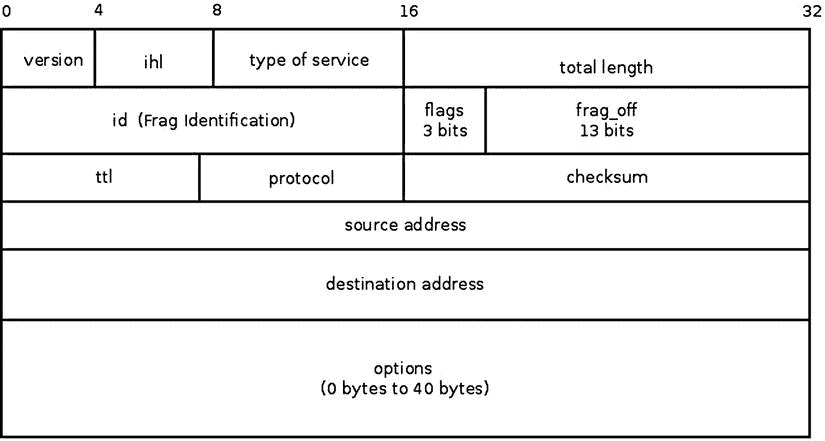
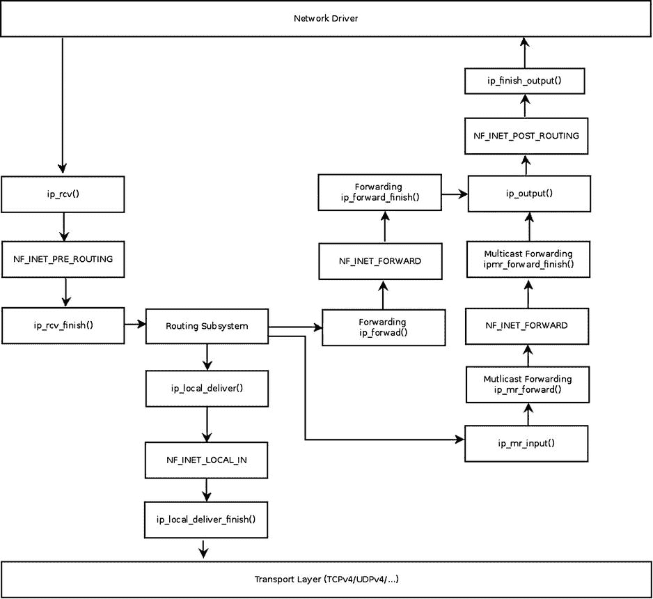
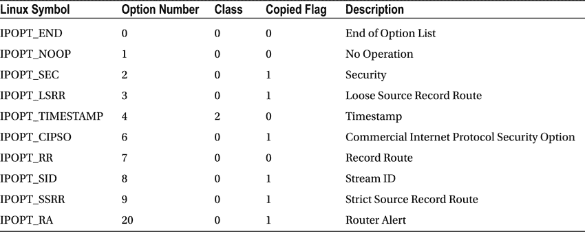
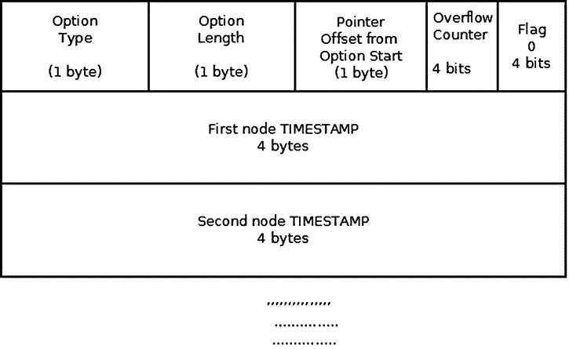
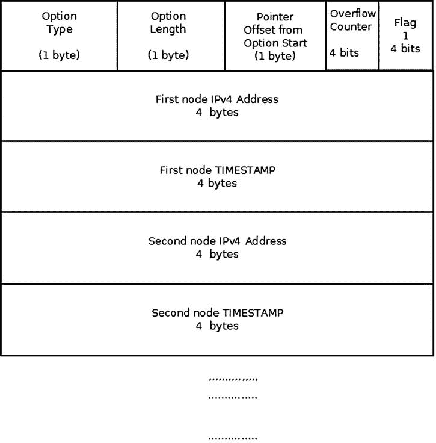
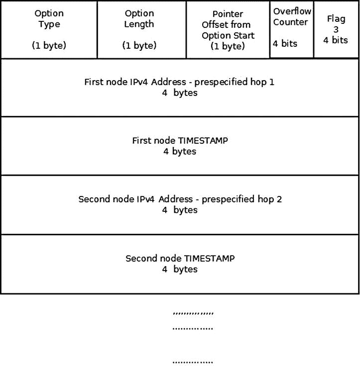
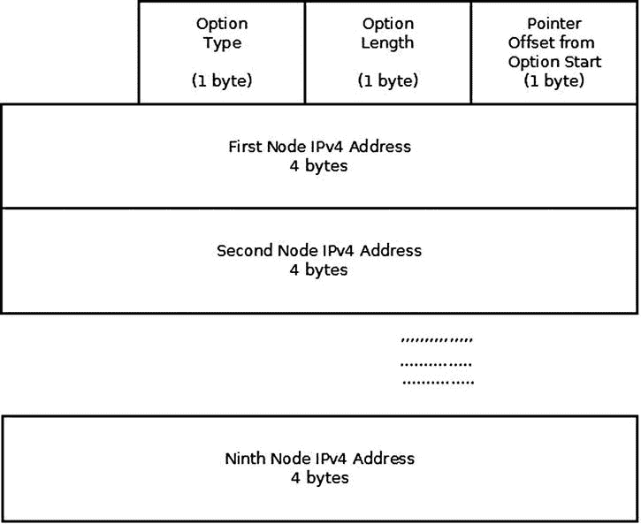
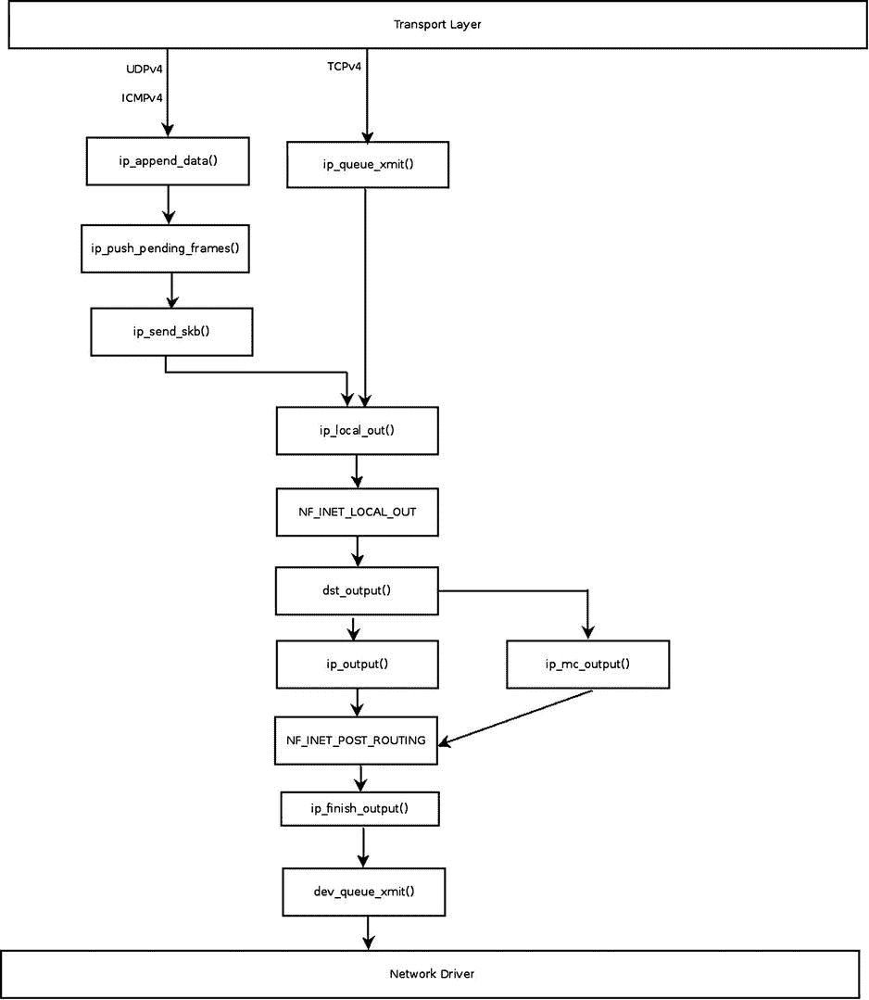

第四章


IP v4〔t0〕

第 3 章讲述了 ICMP 协议在 IPv4 和 IPv6 中的实现。本章涉及 IPv4 协议，展示了在某些情况下如何使用 ICMP 消息来报告互联网协议错误。IPv4 协议(互联网协议版本 4)是当今基于标准的互联网的核心协议之一，并且路由互联网上的大部分流量。基本定义在 1981 年的 RFC 791“互联网协议”中。IPv4 协议提供任意两台主机之间的端到端连接。IP 层的另一个重要功能是转发数据包(也称为路由)和管理存储路由信息的表。[第 5 章](05.html)和[第 6 章](06.html)讨论 IPv4 路由。本章描述了 IPv4 Linux 实现:接收和发送 IPv4 数据包，包括多播数据包、IPv4 转发和处理 IPv4 选项。有些情况下，要发送的数据包大于传出接口的 MTU 在这种情况下，应该将数据包分割成更小的片段。当收到分段的数据包时，应该将它们组合成一个大的数据包，该数据包应该与分段前发送的数据包相同。这些也是本章讨论的 IPv4 协议的重要任务。

每个 IPv4 数据包都以至少 20 字节长的 IP 报头开始。如果使用 IP 选项，IPv4 报头最多可以有 60 个字节。在 IP 报头之后是传输报头(例如，TCP 报头或 UDP 报头)，在它之后是有效载荷数据。要理解 IPv4 协议，您必须首先了解 IPv4 报头是如何构建的。在[图 4-1](#Fig1) 中，您可以看到 IPv4 报头，它由两部分组成:第一部分 20 个字节(直到 IPv4 报头中 options 字段的开头)是基本的 IPv4 报头，其后是 IP options 部分，其长度可以是 0 到 40 个字节。



[图 4-1](#_Fig1) 。IPv4 标头

IPv4 报头

IPv4 报头包含定义内核网络堆栈应该如何处理数据包的信息:正在使用的协议、源地址和目的地址、校验和、分段所需的数据包标识(`id`)、`ttl`有助于避免数据包因某些错误而被无休止地转发，等等。该信息存储在 IPv4 报头的 13 个成员中(第 14 个成员 IP Options 是 IPv4 报头的扩展，是可选的)。接下来描述 IPv4 的各种成员和各种 IP 选项。IPv4 报头由`iphdr`结构表示。其成员出现在[图 4-1](#Fig1) 中，将在下一节描述。本章后面的“IP 选项”一节将介绍 IP 选项及其用法。

[图 4-1](#Fig1) 显示了 IPv4 报头。所有成员始终存在，除了最后一个成员，即可选的 IP 选项。IPv4 成员的内容决定了它在 IPv4 网络堆栈中的处理方式:当出现问题时(例如，如果第一个成员的版本不是 4，或者校验和不正确)，数据包将被丢弃。每个 IPv4 数据包都以 IPv4 报头开始，其后是有效载荷:

```sh
struct iphdr {
#if defined(__LITTLE_ENDIAN_BITFIELD)
    __u8    ihl:4,
            version:4;
#elif defined (__BIG_ENDIAN_BITFIELD)
    __u8    version:4,
            ihl:4;
#else
#error    "Please fix <asm/byteorder.h>"
#endif
    __u8          tos;
    __be16        tot_len;
    __be16        id;
    __be16        frag_off;
    __u8          ttl;
    __u8          protocol;
    __sum16       check;
    __be32        saddr;
    __be32        daddr;
    /*The options start here. */
};
```

```sh
(include/uapi/linux/ip.h)
```

以下是对 IPv4 标头成员的描述:

*   `ihl`:表示互联网头长度。IP v4 报头的长度，以 4 字节的倍数度量。IPv4 报头的长度是不固定的，而 IPv6 报头的长度是固定的(40 字节)。原因是 IPv4 报头可以包括可选的可变长度选项。当没有选项时，IPv4 报头的最小大小为 20 字节，最大大小为 60 字节。对应的`ihl`值对于最小 IPv4 报头大小是 5，对于最大大小是 15。IPv4 标头必须与 4 字节边界对齐。
*   `version`:应该是 4。
*   `tos`:IP v4 报头的`tos`字段最初用于服务质量(QoS)服务；`tos`代表服务类型。多年来，该字段具有不同的含义，如下所示:RFC 2474 定义了 IPv4 和 IPv6 报头中的区分服务字段(DS 字段)，即`tos`的 0–5 位。它也被称为区分服务码点(DSCP)。2001 年的 RFC 3168 定义了 IP 报头的显式拥塞通知(ECN );它是`tos`字段的第 6 位和第 7 位。
*   `tot_len`:总长度，包括表头，以字节计量。因为`tot_len`是 16 位字段，最大可达 64KB。根据 RFC 791，最小大小为 576 字节。
*   `id`:IP v4 报头的标识。`id`字段对于分段很重要:当分段一个 SKB 时，该 SKB 的所有片段的`id`值应该是相同的。根据碎片的`id`重组碎片数据包。
*   `frag_off`:片段偏移量，16 位字段。低 13 位是片段的偏移量。在第一个片段中，偏移量为 0。偏移量以 8 字节为单位进行测量。高 3 位是标志:

*   001 是 MF(碎片多)。它是为所有片段设置的，除了最后一个片段。
*   010 是 DF(不要碎片化)。
*   100 is CE (Congestion).

    参见`include/net/ip.h`中的 IP_MF、IP_DF 和 IP_CE 标志声明。

*   生存时间:这是一个跳数计数器。每个转发节点将`ttl`减 1。当它达到 0 时，该数据包被丢弃，并且发送回超时 ICMPv4 消息；这样可以避免数据包因为这样或那样的原因被无休止地转发。
*   `protocol`:数据包的 L4 协议，例如， IPPROTO_TCP 用于 TCP 流量，IPPROTO_UDP 用于 UDP 流量(有关所有可用协议的列表，请参见`include/linux/in.h`)。
*   `check`:校验和(16 位字段)。校验和仅在 IPv4 报头字节上计算。
*   `saddr`:源 IPv4 地址，32 位。
*   `daddr`:目的 IPv4 地址，32 位。

在本节中，您已经了解了各种 IPv4 头成员及其用途。下一节将讨论 IPv4 协议的初始化，它设置在接收 IPv4 报头时调用的回调。

IPv4 初始化

IPv4 数据包是以太网类型为 0x0800 的数据包(以太网类型存储在 14 字节以太网报头的前两个字节中)。每个协议都应该定义一个协议处理程序，并且每个协议都应该初始化，以便网络堆栈可以处理属于该协议的数据包。为了让您了解是什么原因导致接收到的 IPv4 数据包被 IPv4 方法处理，本节描述了 IPv4 协议处理程序的注册:

```sh
static struct packet    _type ip_packet_type __read_mostly = {
    .type = cpu_to_be16(ETH_P_IP),
    .func = ip_rcv,
};

static int __init inet_init(void)
{
  ...
  dev_add_pack(&ip_packet_type);
  ...
}
```

```sh
(net/ipv4/af_inet.c)
```

`dev_add_pack()`方法添加了`ip_rcv()`方法作为 IPv4 数据包的协议处理程序。这些数据包的以太网类型为 0x0800 (ETH_P_IP，在`include/uapi/linux/if_ether.h`中定义)。`inet_init()`方法执行各种 IPv4 初始化，并在引导阶段被调用。

IPv4 协议的主要功能分为 Rx(接收)路径和 Tx(发送)路径。现在您已经了解了 IPv4 协议处理程序的注册，您知道哪个协议处理程序管理 IPv4 数据包(`ip_rcv`回调)以及这个协议处理程序是如何注册的。现在，您可以开始了解 IPv4 Rx 路径以及如何处理接收到的 IPv4 数据包。Tx 路径将在后面的章节“发送 IPv4 数据包”中介绍

接收 IPv4 数据包

主要的 IPv4 接收方法是`ip_rcv()`方法，，它是所有 IPv4 数据包(包括多播和广播)的处理程序。事实上，这种方法主要由健全性检查组成。真正的工作是在它调用的`ip_rcv_finish()`方法中完成的。在`ip_rcv()`方法和`ip_rcv_finish()`方法之间是 NF_INET_PRE_ROUTING netfilter 钩子，通过调用 NF_HOOK 宏来调用(参见本节后面的代码片段)。在这一章中，你会遇到很多 NF_HOOK 宏的调用——这些是 netfilter 钩子。netfilter 子系统允许您在数据包在网络堆栈中的行程中的五个点注册回调。这些点将很快被提到他们的名字。添加 netfilter 挂钩的原因是为了能够在运行时加载 netfilter 内核模块。NF_HOOK 宏调用指定点的回调，如果这样的回调被注册的话。你也可能遇到 NF_HOOK 宏，叫做 NF_HOOK_COND，它是 NF_HOOK 宏的一个变种。在网络堆栈的某些地方，NF_HOOK_COND 宏包含一个布尔参数(最后一个参数)，这个参数必须是`true`，钩子才能被执行([第 9 章](09.html)讨论 netfilter 钩子)。请注意，netfilter 挂钩可以丢弃数据包，在这种情况下，它将不会继续沿其普通路径前进。[图 4-2](#Fig2) 显示了网络驱动程序接收到的数据包的接收路径(Rx) 。此数据包可以被传送到本地机器，也可以被转发到另一台主机。正是在路由表中的查找决定了这两个选项中的哪一个会发生。



[图 4-2](#_Fig2) 。接收 IPv4 数据包。为简单起见，该图不包括碎片/碎片整理/选项/IPsec 方法

[图 4-2](#Fig2) 显示了接收到的 IPv4 数据包的路径。IPv4 协议处理器`ip_rcv()`方法接收数据包(见图的左上侧)。首先，在调用`ip_rcv_finish()`方法之后，应该立即在路由子系统中执行查找。路由查找的结果决定了数据包是本地传送到本地主机还是被转发(路由查找在第 5 章的[中解释)。如果数据包的目的地是本地主机，它将首先到达`ip_local_deliver()`方法，然后到达`ip_local_deliver_finish()`方法。](05.html)当数据包要被转发时，将通过`ip_forward()`方法进行处理。图中出现了一些 netfilter 钩子，比如 NF_INET_PRE_ROUTING 和 NF_INET_LOCAL_IN。请注意，多播流量由`ip_mr_input()`方法处理，这将在本章后面的“接收 IPv4 多播数据包”一节中讨论。NF_INET_PRE_ROUTING、NF_INET_LOCAL_IN、NF_INET_FORWARD 和 NF_INET_POST_ROUTING 是 netfilter 挂钩的五个入口点中的四个。第五个是 NF_INET_LOCAL_OUT，在本章后面的“发送 IPv4 数据包”一节中会提到。这五个入口点在`include/uapi/linux/netfilter.h`中定义。注意，这五个钩子的相同的`enum`也在 IPv6 中使用；例如，在`ipv6_rcv()`方法中，一个钩子正在 NF_INET_PRE_ROUTING ( `net/ipv6/ip6_input.c`)上注册。我们来看看`ip_rcv()`方法:

```sh
int ip_rcv(struct sk_buff *skb, struct net_device *dev, struct packet_type *pt, struct net_device *orig_dev)
{
```

首先执行一些健全性检查，我在本节中提到了其中的一些。IPv4 报头(`ihl`)的长度以 4 字节的倍数来度量。IP v4 报头的大小必须至少为 20 个字节，这意味着`ihl`的大小必须至少为 5。`version`应该是 4(对于 IPv4)。如果其中一个条件不满足，数据包将被丢弃，统计信息(IPSTATS _ MIB _ INHDRERRORS)将被更新。

```sh
        if (iph->ihl < 5 || iph->version != 4)
                goto inhdr_error;
```

根据 RFC 1122 的 3.2.1.2 部分，主机必须验证每个收到的数据报的 IPv4 报头校验和，并自动丢弃每个校验和不正确的数据报。这是通过调用`ip_fast_csum()`方法完成的，如果成功，该方法将返回 0。IPv4 报头校验和仅在 IPv4 报头字节上计算:

```sh
        if (unlikely(ip_fast_csum((u8 *)iph, iph->ihl)))
                goto inhdr_error;
```

然后调用 NF_HOOK 宏:

```sh
         return NF_HOOK(NFPROTO_IPV4, NF_INET_PRE_ROUTING, skb, dev, NULL,
                        ip_rcv_finish);
```

当注册的 netfilter hook 方法返回 NF_DROP 时，表示应该丢弃数据包，数据包遍历不继续。当注册的 netfilter 挂钩返回 NF _ stopped 时，意味着该数据包被 netfilter 子系统接管，数据包遍历不再继续。当注册的 netfilter 钩子返回 NF_ACCEPT 时，数据包继续遍历。netfilter 钩子还有其他返回值(也称为*判断*)，比如 NF_QUEUE、NF_REPEAT 和 NF_STOP，这在本章中没有讨论。(如前所述，netfilter 钩子在[第 9 章](09.html)中讨论过。)让我们暂时假设在 NF_INET_PRE_ROUTING 入口点中没有注册 netfilter 回调，因此 NF_HOOK 宏不会调用任何 netfilter 回调，而会调用`ip_rcv_finish()`方法。我们来看看`ip_rcv_finish()`的方法:

```sh
static int ip_rcv_finish(struct sk_buff *skb)
{
       const struct iphdr *iph = ip_hdr(skb);
       struct rtable *rt;
```

`skb_dst()`方法检查是否有`dst`对象附着在 SKB 上；`dst`是`dst_entry` ( `include/net/dst.h`)的实例，代表路由子系统中的查找结果。查找是根据路由表和数据包报头完成的。路由子系统中的查找还设置了`dst`的`input`和/或`output`回调。例如，如果要转发数据包，路由子系统中的查找会将`input`回调设置为`ip_forward()`。当数据包的目的地是本地机器时，路由子系统中的查找会将`input`回调设置为`ip_local_deliver()`。对于多播包，在某些情况下可以是`ip_mr_input()`(我将在下一节讨论多播包)。`dst`对象的内容决定了数据包将如何继续它的旅程；例如，在转发数据包时，根据`dst`决定在调用`dst_input()`时应该调用哪个`input`回调，或者应该在哪个接口上传输。(我将在下一章深入讨论路由子系统)。

如果没有`dst`连接到 SKB，则通过`ip_route_input_noref()`方法在路由子系统中执行查找。如果查找失败，数据包将被丢弃。请注意，处理多播数据包不同于处理单播数据包(将在本章后面的“接收 IPv4 多播数据包”一节中讨论)。

```sh
       ...
       if (!skb_dst(skb)) {
```

在路由子系统中执行查找:

```sh
            int err = ip_route_input_noref(skb, iph->daddr, iph->saddr,
                                           iph->tos, skb->dev);
            if (unlikely(err)) {
                if (err == -EXDEV)
                    NET_INC_STATS_BH(dev_net(skb->dev),
                                     LINUX_MIB_IPRPFILTER);
                goto drop;
            }
       }
```

 **注意**当设置了反向路径滤波器(RPF) 时，在某些情况下`__fib_validate_source()`方法会返回`-EXDEV`(“跨设备链接”)错误。可以通过`procfs`中的一个条目设置 RPF。在这种情况下，数据包被丢弃，统计信息(LINUX_MIB_IPRPFILTER)被更新，该方法返回 NET_RX_DROP。注意，您可以通过查看`cat /proc/net/netstat`输出中的`IPReversePathFilter`列来显示 LINUX_MIB_IPRPFILTER 计数器。

现在执行检查以查看 IPv4 报头是否包括选项。因为 IPv4 报头的长度(`ihl`)是以 4 字节的倍数来度量的，如果它大于 5，这意味着它包括选项，所以应该调用`ip_rcv_options()`方法来处理这些选项。处理 IP 选项将在本章后面的“IP 选项”部分进行深入讨论。请注意，`ip_rcv_options()`方法可能会失败，您很快就会看到。如果是多播条目或广播条目，则分别更新 IPSTATS_MIB_INMCAST 统计信息或 IP stats _ MIB _ INM cast 统计信息。然后调用`dst_input()`方法。这个方法反过来简单地通过调用`skb_dst(skb)->input(skb)`来调用`input`回调方法:

```sh
    if (iph->ihl > 5 && ip_rcv_options(skb))
            goto drop;

    rt = skb_rtable(skb);
    if (rt->rt_type == RTN_MULTICAST) {
        IP_UPD_PO_STATS_BH(dev_net(rt->dst.dev), IPSTATS_MIB_INMCAST,
                skb->len);
    } else if (rt->rt_type == RTN_BROADCAST)
        IP_UPD_PO_STATS_BH(dev_net(rt->dst.dev), IPSTATS_MIB_INBCAST,
                skb->len);

    return dst_input(skb);
```

在本节中，您了解了接收 IPv4 数据包的各个阶段:执行的完整性检查、路由子系统中的查找、执行实际工作的`ip_rcv_finish()`方法。您还了解了当应该转发数据包时调用哪个方法，以及当数据包用于本地传递时调用哪个方法。IPv4 多播是一个特例。处理 IPv4 多播数据包的接收将在下一节讨论。

接收 IPv4 组播数据包

`ip_rcv()`方法也是多播数据包的处理程序。如前所述，在一些完整性检查之后，它调用`ip_rcv_finish()`方法，该方法通过调用`ip_route_input_noref()`在路由子系统中执行查找。在`ip_route_input_noref()`方法中，首先通过调用`ip_check_mc_rcu()`方法，检查本地机器是否属于目的多播地址的多播组。如果是，或者如果本地机器是多播路由器(`CONFIG_IP_MROUTE`被设置`)`，则调用`ip_route_input_mc()`方法；让我们看一下代码:

```sh
int ip_route_input_noref(struct sk_buff *skb, __be32 daddr, __be32 saddr,
                         u8 tos, struct net_device *dev)
{
        int res;
        rcu_read_lock();
        . . .
        if (ipv4_is_multicast(daddr)) {
                struct in_device *in_dev = __in_dev_get_rcu(dev);
                if (in_dev) {
                        int our = ip_check_mc_rcu(in_dev, daddr, saddr,
                                                  ip_hdr(skb)->protocol);
                        if (our
#ifdef CONFIG_IP_MROUTE
                                ||
                            (!ipv4_is_local_multicast(daddr) &&
                             IN_DEV_MFORWARD(in_dev))
#endif
                           ) {
                                int res = ip_route_input_mc(skb, daddr, saddr,
                                                            tos, dev, our);
                                rcu_read_unlock();
                                return res;
                        }
                }
           . . .

        }
        . . .
```

让我们进一步研究一下`ip_route_input_mc()`方法。如果本机属于目的组播地址的组播组(变量`our`的值为 1)，那么`dst`的`input`回调被设置为`ip_local_deliver`。如果本地主机是组播路由器并且`IN_DEV_MFORWARD(in_dev)`被设置，那么`dst`的`input`回调被设置为`ip_mr_input`。调用`dst_input(skb)`的`ip_rcv_finish()`方法因此根据`dst`的`input`回调调用`ip_local_deliver()`方法或`ip_mr_input()`方法。IN_DEV_MFORWARD 宏检查`procfs`组播转发条目。请注意，`procfs`多播转发条目`/proc/sys/net/ipv4/conf/all/mc_forwarding`是一个只读条目(与 IPv4 单播`procfs`转发条目相反)，因此您不能简单地通过从命令行运行来设置它:`echo 1 > /proc/sys/net/ipv4/conf/all/mc_forwarding`。例如，启动`pimd`守护进程会将其设置为 1，停止守护进程会将其设置为 0。`pimd`是一个轻量级的独立 PIM-SM v2 多播路由守护程序。如果您对学习多播路由守护进程的实现感兴趣，您可能想看看`https://github.com/troglobit/pimd/`中的`pimd`源代码:

```sh
static int ip_route_input_mc(struct sk_buff *skb, __be32 daddr, __be32 saddr,
                                 u8 tos, struct net_device *dev, int our)
 {
         struct rtable *rth;
         struct in_device *in_dev = __in_dev_get_rcu(dev);

        . . .

         if (our) {
                 rth->dst.input= ip_local_deliver;
                 rth->rt_flags |= RTCF_LOCAL;
         }

 #ifdef CONFIG_IP_MROUTE
         if (!ipv4_is_local_multicast(daddr) && IN_DEV_MFORWARD(in_dev))
                 rth->dst.input = ip_mr_input;
 #endif
        . . .
```

多播层保存一种称为多播转发缓存(MFC)的数据结构。我在这里不讨论 MFC 或`ip_mr_input()`方法的细节(我在[第 6 章](06.html)中讨论它们)。在这种情况下重要的是，如果在 MFC 中找到一个有效的条目，就调用`ip_mr_forward()`方法。`ip_mr_forward()`方法执行一些检查并最终调用`ipmr_queue_xmit()`方法。在`ipmr_queue_xmit()`方法中，`ttl`减少，通过调用`ip_decrease_ttl()`方法更新校验和(在`ip_forward()`方法中也是如此，您将在本章后面看到)。然后通过调用 NF_INET_FORWARD NF_HOOK 宏来调用`ipmr_forward_finish()`方法(假设 NF_INET_FORWARD 上没有注册的 IPv4 netfilter 钩子):

```sh
static void ipmr_queue_xmit(struct net *net, struct mr_table *mrt,
                             struct sk_buff *skb, struct mfc_cache *c, int vifi)
{
       . . .

       ip_decrease_ttl(ip_hdr(skb));
       ...
       NF_HOOK(NFPROTO_IPV4, NF_INET_FORWARD, skb, skb->dev, dev,
                       ipmr_forward_finish);
       return;

}
```

`ipmr_forward_finish()`方法非常简短，在此完整展示。它所做的只是更新统计数据，如果 IPv4 报头中有选项，就调用`ip_forward_options()`方法(IP 选项将在下一节描述)，并调用`dst_output()`方法:

```sh
static inline int ipmr_forward_finish(struct sk_buff *skb)
{
        struct ip_options *opt = &(IPCB(skb)->opt);

        IP_INC_STATS_BH(dev_net(skb_dst(skb)->dev), IPSTATS_MIB_OUTFORWDATAGRAMS);

```

`IP_ADD_STATS_BH(dev_net(skb_dst(skb)->dev), IPSTATS_MIB_OUTOCTETS, skb->len);`

```sh

        if (unlikely(opt->optlen))
                ip_forward_options(skb);

        return dst_output(skb);
}
```

本节讨论了如何处理接收 IPv4 多播数据包。`pimd`是作为多播路由守护进程的一个例子提到的，它在多播数据包转发中与内核交互。下一节将描述各种 IP 选项，这些选项支持使用网络堆栈的特殊功能，例如跟踪数据包的路由、跟踪数据包的时间戳、指定数据包应该经过的网络节点。我还讨论了如何在网络堆栈中处理这些 IP 选项。

IP 选项

IPv4 报头的 IP 选项字段是可选的，并且由于安全原因和处理开销，不经常使用。哪些选项可能有帮助？例如，假设您的数据包被某个防火墙丢弃。您可以使用严格或宽松的源路由选项来指定不同的路由。或者如果你想找出数据包到一些目的地址的路径，你可以使用记录路由选项。

IPv4 标头可以包含零个、一个或多个选项。没有选项时，IPv4 报头大小为 20 字节。IP 选项字段的长度最多为 40 个字节。IPv4 最大长度为 60 字节的原因是因为 IPv4 报头长度是一个 4 位字段，它以 4 字节的倍数来表示长度。因此，该字段的最大值是 15，这给出了 60 字节的 IPv4 最大报头长度。当使用多个选项时，选项只是一个接一个地连接起来。IPv4 报头必须与 4 字节边界对齐，因此有时需要填充。以下 RFC 讨论了 IP 选项:781(时间戳选项)、791、1063、1108、1393(使用 IP 选项的 Traceroute)和 2113 (IP 路由器警报选项)。有两种形式的 IP 选项:

*   *单字节选项(选项类型)* : T “选项列表结束”和“无操作”是仅有的单字节选项。
*   *多字节选项*:当在选项类型 byte 后使用多字节选项时，有以下三个字段:

*   *长度(1 字节)*:选项的长度，以字节为单位。
*   *指针(1 字节)*:从选项开始的偏移量。
*   *选项数据*:这是一个中间主机可以存储数据的空间，例如时间戳或 IP 地址。

在[图 4-3](#Fig3) 中显示了选项类型。


[图 4-3](#_Fig3) 。选项类型

置位时，`copied`标志表示该选项应在所有片段中复制。如果未设置该选项，则只应在第一个片段中复制该选项。IPOPT_COPIED 宏检查是否设置了指定 IP 选项的`copied`标志。它在`ip_options_fragment()`方法中用于检测不可复制的选项，并插入 IPOPT_NOOP。本节稍后将讨论`ip_options_fragment()`方法。

选项类可以是以下 4 个值之一:

*   00:控制类(IPOPT_CONTROL)
*   01:预留 1 (IPOPT_RESERVED1)
*   10:调试和测量(IPOPT_MEASUREMENT)
*   11: reserved2 (IPOPT_RESERVED2)

在 Linux 网络栈中，只有 IPOPT_TIMESTAMP 选项属于调试和测量类。所有其他选项都是控件类。

选项编号通过唯一编号指定一个选项；可能的值是 0–31，但不是所有的值都被 Linux 内核使用。

[表 4-1](#Tab1) 根据 Linux 符号、选项号、选项类别和`copied`标志显示了所有选项。

[表 4-1](#_Tab1) 。选项表



选项名(IPOPT_*)声明在`include/uapi/linux/ip.h`中。

Linux 网络堆栈不包括所有的 IP 选项。完整列表见`www.iana.org/assignments/ip-parameters/ip-parameters.xml`。

我将简要描述这五个选项，然后深入描述时间戳选项和记录路径选项:

*   *选项列表结束(IPOPT_END)* : 1 字节选项，用于表示选项字段的结束。这是一个单一的零字节选项(它的所有位都是“0”)。其后不能有 IP 选项。
*   *无操作(IPOPT_NOOP)* : 1 字节选项用于内部填充，用于对齐。
*   *Security (IPOPT_SEC)* : 该选项为主机提供了一种发送安全性、处理限制和 TCC(封闭用户组)参数的方式。参见 RFC 791 和 RFC 1108。最初打算用于军事应用。
*   *松散源记录路由(IPOPT_LSRR)* : 此选项指定数据包应该经过的路由器列表。在列表中的每两个相邻节点之间，可以有没有出现在列表中的中间路由器，但是应该保持顺序。
*   *商业互联网协议安全选项(IPOPT_CIPSO)* : CIPSO 是 IETF 的草案，已经被多家厂商采用。它涉及网络标签标准。套接字的 CIPSO 标记意味着将 CIPSO IP 选项添加到通过该套接字离开系统的所有数据包中。该选项在收到数据包时生效。有关 CIPSO 选项的更多信息，请参见`Documentation/netlabel/draft-ietf-cipso-ipsecurity-01.txt`和`Documentation/netlabel/cipso_ipv4.txt`。

时间戳选项

Timestamp (IPOPT_TIMESTAMP):时间戳选项在 RFC 781“互联网协议(IP)时间戳选项的规范”中指定此选项存储数据包路由上主机的时间戳。存储的时间戳是一个 32 位的时间戳，从 UTC 当天午夜开始，以毫秒为单位。此外，它还可以存储数据包路由中所有主机的地址，或者只存储沿路由选择的主机的时间戳。时间戳选项的最大长度是 40。不为片段复制时间戳选项；它只出现在第一个片段中。时间戳选项以三个字节的选项类型、长度和指针(偏移量)开始。第四个字节的高 4 位是溢出计数器，它在没有可用空间存储所需数据的每一跳中递增。当溢出计数器超过 15 时，返回一个参数问题的 ICMP 消息。低 4 位是标志。标志的值可以是下列值之一:

*   *0* :仅时间戳(IPOPT _ TS _ TSONLY)
*   *1* :时间戳和地址(IPOPT_TS_TSANDADDR)
*   *3* :仅指定跳数的时间戳(IPOPT_TS_PRESPEC)

 **注意**您可以使用带有时间戳选项和前面提到的三个子类型的命令行`ping`实用程序:

`ping -T tsonly     (IPOPT_TS_TSONLY)`

`ping -T tsandaddr  (IPOPT_TS_TSANDADDR)`

`ping -T tsprespec  (IPOPT_TS_PRESPEC)`

[图 4-4](#Fig4) 显示了仅带有时间戳的时间戳选项(设置了 IPOPT_TS_TSONLY 标志)。路径上的每台路由器都会添加其 IPv4 地址。当没有更多空间时，溢出计数器递增。



[图 4-4](#_Fig4) 。时间戳选项(只有时间戳，标志= 0)

[图 4-5](#Fig5) 显示了带有时间戳和地址的时间戳选项(设置了 IPOPT_TS_TSANDADDR 标志)。路径上的每台路由器都会添加其 IPv4 地址和时间戳。同样，当没有更多空间时，溢出计数器递增。



[图 4-5](#_Fig5) 。时间戳选项(带时间戳和地址，标志= 1)

[图 4-6](#Fig6) 显示了带有时间戳的时间戳选项(设置了 IPOPT_TS_PRESPEC 标志)。路径上的每个路由器只有在预先指定的列表中才会添加其时间戳。同样，当没有更多空间时，溢出计数器递增。



[图 4-6](#_Fig6) 。时间戳选项(仅带有指定跳数的时间戳，标志= 3)

记录路线选项

记录路由(IPOPT_RR):记录一个数据包的路由。途中的每个路由器都会添加它的地址(见[图 4-7](#Fig7) )。长度由发送设备设置。命令行实用程序`ping –R`使用记录路由 IP 选项。请注意，IPv4 报头仅够九个这样的路由使用(如果使用更多选项，甚至更少)。当报头已满并且没有空间插入额外的地址时，数据报被转发，而不将地址插入 IP 选项。参见 RFC 791 第 3.1 节。



[图 4-7](#_Fig7) 。记录路线选项

虽然`ping –R`使用记录路由 IP 选项，但在许多情况下，如果您尝试它，您将不会得到沿途所有网络节点的预期结果，因为出于安全原因，许多网络节点会忽略此 IP 选项。`ping`的`manpage`明确提到了这一点。从`man ping`开始:

```sh
. . .
-R
Includes the RECORD_ROUTE option in the ECHO_REQUEST packet and displays the route buffer on returned packets.
. . .
Many hosts ignore or discard this option.
. . .

```

*   *流 ID (IPOPT_SID)* : 该选项提供了一种通过不支持流概念的网络携带 16 位 SATNET 流标识符的方式。
*   *严格源记录路由* *【伊波特 _ SSRR】*:该选项指定数据包应该经过的路由器列表。应该保持顺序，并且不允许在遍历中进行任何更改。出于安全原因，许多路由器会阻止宽松源记录路由(LSRR)和严格源记录路由(SSRR)选项。
*   *路由器警报(IPOPT _ RA)*:IP 路由器警报选项可用于通知中转路由器更仔细地检查 IP 数据包的内容。例如，这对于新协议是有用的，但是需要在路径上的路由器中进行相对复杂的处理。在 RFC 2113“IP 路由器警报选项”中指定

IP 选项在 Linux 中由`ip_options`结构表示:

```sh
struct ip_options {
        __be32          faddr;
        __be32          nexthop;
        unsigned char   optlen;
        unsigned char   srr;
        unsigned char   rr;
        unsigned char   ts;
        unsigned char   is_strictroute:1,
        srr_is_hit:1,
        is_changed:1,
        rr_needaddr:1,
        ts_needtime:1,
        ts_needaddr:1;
        unsigned char   router_alert;
        unsigned char   cipso;
        unsigned char   __pad2;
        unsigned char   __data[0];
};
```

```sh
(include/net/inet_sock.h)
```

以下是 IP 期权结构成员的简短描述:

*   `faddr:`保存的第一跳地址。当处理松散和严格路由时，在`ip_options_compile()`中设置，此时方法不是从 Rx 路径调用的(SKB 为空)。
*   `nexthop:`保存了 LSRR 和 SSRR 的 nexthop 地址。
*   `optlen:`选项长度，以字节为单位。不能超过 40 个字节。
*   `is_strictroute:`指定使用严格源路由的标志。解析严格路由选项类型(IPOPT_SSRR)时在`ip_options_compile()`方法中设置标志；请注意，它不是为松散路由(IPOPT_LSRR)设置的。
*   `srr_is_hit:`指定数据包目的地`addr`是本地主机的标志`srr_is_hit`标志在`ip_options_rcv_srr()`中设置。
*   `is_changed:` IP 校验和不再有效(当其中一个 IP 选项改变时，该标志被置位)。
*   `rr_needaddr:`需要记录传出设备的 IPv4 地址。为记录路由选项(IPOPT_RR)设置标志。
*   `ts_needtime:`需要记录时间戳。该标志是为时间戳 IP 选项的这些标志设置的:IPOPT_TS_TSONLY、IPOPT_TS_TSANDADDR 和 IPOPT_TS_PRESPEC(参见本节后面关于这些标志之间的差异的详细解释)。
*   `ts_needaddr:`需要记录传出设备的 IPv4 地址。仅当 IPOPT_TS_TSANDADDR 标志被置位时，该标志才被置位，并且它指示应该添加沿着分组路由的每个节点的 IPv4 地址。
*   `router_alert:`在`ip_options_compile()`方法中设置解析路由器时的报警选项`(IPOPT_RR)`。
*   `__data[0]:`一个缓冲区，用于存储由`setsockopt()`从用户空间接收的选项。

参见`ip_options_get_from_user()`和`ip_options_get_finish()` ( `net/ipv4/ip_options.c`)。

我们来看看`ip_rcv_options()`方法:

```sh
static inline bool ip_rcv_options(struct sk_buff *skb)
{
         struct ip_options *opt;
         const struct iphdr *iph;
         struct net_device *dev = skb->dev;
       . . .
```

从 SKB 获取 IPv4 报头:

```sh
         iph = ip_hdr(skb);
```

从与 SKB 关联的`inet_skb_parm`对象中获取`ip_options`对象:

```sh
         opt = &(IPCB(skb)->opt);
```

计算预期期权长度:

```sh
         opt->optlen = iph->ihl*4 - sizeof(struct iphdr);
```

调用`ip_options_compile()`方法从 SKB 中构建一个`ip_options`对象:

```sh
         if (ip_options_compile(dev_net(dev), opt, skb)) {
                 IP_INC_STATS_BH(dev_net(dev), IPSTATS_MIB_INHDRERRORS);
                 goto drop;
         }
```

当在 Rx 路径中调用`ip_options_compile()`方法(从`ip_rcv_options()`方法)时，它解析指定 SKB 的 IPv4 报头，并在验证选项的有效性后，根据 IPv4 报头内容，用它构建一个`ip_options`对象。当通过带有 IPPROTO_IP 和 IP_OPTIONS 的`setsockopt()`系统调用从用户空间获取选项时，也可以从`ip_options_get_finish()`方法调用`ip_options_compile()`方法。在这种情况下，数据从用户空间复制到`opt->data`，并且`ip_options_compile()`的第三个参数，即 SKB，为空；在这种情况下，`ip_options_compile()`方法从`opt->__data`构建`ip_options`对象。如果在解析选项时发现一些错误，并且是在 Rx 路径中(从`ip_rcv_options()`调用了`ip_options_compile()`方法)，则发送回“参数问题”ICMPv4 消息(ICMP_PARAMETERPROB)。无论该方法是如何被调用的，如果出现错误，将返回代码为`–EINVAL`的错误。自然，使用`ip_options`对象比使用原始 IPv4 头更方便，因为这样访问 IP 选项字段要简单得多。在 Rx 路径中，`ip_options_compile()`方法构建的`ip_options`对象存储在 SKB 的控制缓冲区(`cb`)中；这通过将`opt`对象设置为`&(IPCB(skb)->opt)`来完成。`IPCB(skb)`宏是这样定义的:

```sh
#define IPCB(skb) ((struct inet_skb_parm*)((skb)->cb))
```

并且`inet_skb_parm`结构(包括一个`ip_options`对象)是这样定义的:

```sh
struct inet_skb_parm {
        struct ip_options       opt;            /* Compiled IP options          */
        unsigned char           flags;
        u16                     frag_max_size;
};
```

```sh
(include/net/ip.h)
```

所以`&(IPCB(skb)->opt`指向`inet_skb_parm`对象内部的`ip_options`对象。在本书中，我不会深入研究在`ip_options_compile()`方法中解析 IPv4 报头的所有小而繁琐的技术细节，因为有大量这样的细节，而且它们是不言自明的。我将简要讨论`ip_options_compile()`如何解析 Rx 路径中的一些单字节选项，如 IPOPT_END 和 IPOPT_NOOP，以及一些更复杂的选项，如 IPOPT_RR 和 IPOPT_TIMESTAMP，并展示一些在此方法中完成检查的示例，以及如何在下面的代码片段中实现它:

```sh
int ip_options_compile(struct net *net, struct ip_options *opt, struct sk_buff *skb)
{

         ...
         unsigned char *pp_ptr = NULL;
         struct rtable *rt = NULL;
         unsigned char *optptr;
         unsigned char *iph;
         int optlen, l;
```

为了开始解析过程，`optptr`指针应该指向 IP options 对象的开始，并在一个循环中迭代所有选项。对于 Rx 路径(当从`ip_rcv_options()`方法调用`ip_options_compile()`方法时)，在`ip_rcv()`方法中接收到的 SKB 作为参数传递给`ip_options_compile()`，不用说，不能为空。在这种情况下，IP 选项在 IPv4 报头的初始固定大小(20 字节)之后立即开始。当从`ip_options_get_finish()`调用`ip_options_compile()`时，`optptr`指针被设置为`opt->__data`，因为`ip_options_get_from_user()`方法复制了从用户空间发送到`opt->__data`的选项。为了准确起见，我应该提到，如果需要对齐，`ip_options_get_finish()`方法也会写入`opt->__data`(它会在适当的位置写入 IPOPT_END)。

```sh
         if (skb != NULL) {
             rt = skb_rtable(skb);
             optptr = (unsigned char *)&(ip_hdr(skb)[1]);
         } else
             optptr = opt->__data;
```

在这种情况下，不能改为使用`iph = ip_hdr(skb)`，因为要考虑 SKB 为空的情况。以下分配对于非 Rx 路径也是正确的:

```sh
        iph = optptr - sizeof(struct iphdr);
```

变量`l`初始化为选项长度(最多 40 字节)。在接下来的`for`循环的每次迭代中，它会减少当前选项的长度:

```sh
        for (l = opt->optlen; l > 0; ) {
            switch (*optptr) {
```

如果遇到一个 IPOPT_END 选项，则表明这是选项列表的结尾，后面不能有其他选项。在这种情况下，您为每个不同于 IPOPT_END 的字节写入 IPOPT_END，直到选项列表结束。还应设置`is_changed`布尔标志，因为它指示 IPv4 报头已更改(因此，校验和的重新计算待定—现在或在`for`循环内没有理由计算校验和，因为在循环期间 IPv4 报头可能有其他更改):

```sh
                case IPOPT_END:
                  for (optptr++, l--; l>0; optptr++, l--) {
                     if (*optptr != IPOPT_END) {
                         *optptr = IPOPT_END;
                         opt->is_changed = 1;
                     }
                  }
         goto eol;
```

如果遇到单字节选项的无操作(IPOPT_NOOP)选项类型，只需将`l`减 1，将`optptr`增 1，然后前进到下一个选项类型:

```sh
                case IPOPT_NOOP:
                  l--;
                  optptr++;
                  continue;
            }
```

`Optlen`被设置为被读取的选项的长度(因为`optptr[1]`保存选项长度):

```sh
            optlen = optptr[1];
```

无操作(IPOPT_NOOP)选项和选项列表结束(IPOPT_END)选项是仅有的单字节选项。所有其他选项都是多字节选项，必须至少有两个字节(选项类型和选项长度)。现在检查至少有两个选项字节，并且没有超过选项列表长度。如果有一些错误，`pp_ptr`指针被设置为指向问题的根源并退出循环。如果是在 Rx 路径，则回送一个“参数问题”的 ICMPv4 消息，将出现问题的偏移量作为参数传递，以便对方分析问题:

```sh
            if (optlen<2 || optlen>l) {
                pp_ptr = optptr;
                goto error;
            }
            switch (*optptr) {
                case IPOPT_SSRR:
                case IPOPT_LSRR:
                ...
                case IPOPT_RR:
```

记录路由选项的选项长度必须至少为 3 个字节:选项类型、选项长度和指针(偏移量):

```sh
                  if (optlen < 3) {
                      pp_ptr = optptr + 1;
                      goto error;
                  }
```

记录路由选项的选项指针偏移量必须至少为 4 个字节，因为为地址列表保留的空间必须在三个初始字节(选项类型、选项长度和指针)之后开始:

```sh
                  if (optptr[2] < 4) {
                             pp_ptr = optptr + 2;
                             goto error;
                  }
                  if (optptr[2] <= optlen) {
```

如果偏移量(`optptr[2]`)加上三个初始字节超过了选项长度，则出现错误:

```sh
                      if (optptr[2]+3 > optlen) {
                           pp_ptr = optptr + 2;
                           goto error;
                      }
                      if (rt) {
                          spec_dst_fill(&spec_dst, skb);
```

将 IPv4 地址复制到记录路由缓冲区:

```sh
                          memcpy(&optptr[optptr[2]-1], &spec_dst, 4);
```

设置`is_changed`布尔标志，表示 IPv4 报头已更改(校验和的重新计算待定):

```sh
                          opt->is_changed = 1;
                      }
```

对于记录路由缓冲区中的下一个地址，将指针(偏移量)增加 4(每个 IPv4 地址为 4 个字节):

```sh
                      optptr[2] += 4;
```

设置`rr_needaddr`标志(该标志在`ip_forward_options()`方法中检查):

```sh
                      opt->rr_needaddr = 1;
                  }
                  opt->rr = optptr - iph;
                  break;

                       case IPOPT_TIMESTAMP:
                         ...
```

时间戳选项的选项长度必须至少为 4 个字节:选项类型、选项长度、指针(偏移量)，第四个字节分为两个字段:较高的 4 位是溢出计数器，它在没有可用空间来存储所需数据的每一跳中递增，较低的 4 位是标志:仅时间戳、时间戳和地址以及指定跳的时间戳:

```sh
                         if (optlen < 4) {
                               pp_ptr = optptr + 1;
                               goto error;
                         }
```

`optptr[2]`是指针(偏移量)。因为，如前所述，每个时间戳选项以 4 个字节开始，这意味着指针(偏移量)必须至少为 5:

```sh
                         if (optptr[2] < 5) {
                                 pp_ptr = optptr + 2;
                                 goto error;
                         }
                         if (optptr[2] <= optlen) {
                                 unsigned char *timeptr = NULL;
                                 if (optptr[2]+3 > optptr[1]) {
                                         pp_ptr = optptr + 2;
                                         goto error;
                                 }
```

在切换命令中，检查`optptr[3]&0xF`的值。它是时间戳选项的标志(第四个字节的 4 个低位):

```sh
                                 switch (optptr[3]&0xF) {
                                       case IPOPT_TS_TSONLY:
                                         if (skb)
                                                 timeptr = &optptr[optptr[2]-1];
                                         opt->ts_needtime = 1;
```

对于带有仅时间戳标志(IPOPT_TS_TSONLY)的时间戳选项，需要 4 个字节；因此指针(偏移量)增加 4:

```sh
                                         optptr[2] += 4;
                                         break;

                                       case IPOPT_TS_TSANDADDR:
                                         if (optptr[2]+7 > optptr[1]) {
                                                 pp_ptr = optptr + 2;
                                                 goto error;
                                         }
                                         if (rt)  {
                                                  spec_dst_fill(&spec_dst, skb);
                                                  memcpy(&optptr[optptr[2]-1],
                                                         &spec_dst, 4);
                                                  timeptr = &optptr[optptr[2]+3];
                                         }
                                         opt->ts_needaddr = 1;
                                         opt->ts_needtime = 1;
```

对于带有时间戳和地址标志的时间戳选项(IPOPT_TS_TSANDADDR)，需要 8 个字节；因此指针(偏移量)增加了 8:

```sh
                                         optptr[2] += 8;
                                         break;

                                       case IPOPT_TS_PRESPEC:
                                         if (optptr[2]+7 > optptr[1]) {
                                                 pp_ptr = optptr + 2;
                                                 goto error;
                                         }
                                         {
                                          __be32 addr;
                                          memcpy(&addr, &optptr[optptr[2]-1], 4);
                                             if (inet_addr_type(net,addr) == RTN_UNICAST)
                                                break;
                                          if (skb)
                                               timeptr = &optptr[optptr[2]+3];
                                         }
                                         opt->ts_needtime = 1;
```

对于带有时间戳和预先指定的跳数标志(IPOPT_TS_PRESPEC)的时间戳选项，需要 8 个字节，因此指针(偏移量)增加 8:

```sh
                                         optptr[2] += 8;
                                         break;
                                       default:
                                         ...
                                }
                          ...
```

在`ip_options_compile()`方法构建了`ip_options`对象之后，严格的路由被处理。首先，检查设备是否支持源路由。这意味着`/proc/sys/net/ipv4/conf/all/accept_source_route`被设置，并且`/proc/sys/net/ipv4/conf/<deviceName>/accept_source_route`被设置。如果不满足这些条件，数据包将被丢弃:

```sh
             . . .
         if (unlikely(opt->srr)) {
             struct in_device *in_dev = __in_dev_get_rcu(dev);

             if (in_dev) {
                     if (!IN_DEV_SOURCE_ROUTE(in_dev)) {
                     . . .
                                 goto drop;
                     }
             }

             if (ip_options_rcv_srr(skb))
                     goto drop;
         }
```

我们来看看`ip_options_rcv_srr()`方法(还是那句话，我会把重点放在重要的点上，而不是小细节)。源路由地址列表被迭代。在解析过程中，会在循环中进行一些完整性检查，以查看是否有错误。当遇到第一个非本地地址时，循环退出，并执行以下操作:

*   设置 IP 选项对象的`srr_is_hit`标志(`opt->srr_is_hit = 1`)。
*   将`opt->nexthop`设置为找到的下一跳地址。
*   将`opt->is_changed`标志设置为 1。

应该转发该数据包。当到达方法`ip_forward_finish()`时，调用`ip_forward_options()`方法。在此方法中，如果设置了 IP 选项对象的`srr_is_hit`标志，则 ipv4 报头的`daddr`被更改为`opt->nexthop`，偏移量增加 4(指向源路由地址列表中的下一个地址)，并且—因为 IPv4 报头被更改—通过调用`ip_send_check()`方法重新计算校验和。

IP 选项和碎片化

在本节开始描述选项类型时，我提到了选项类型字节中的一个`copied`标志，它指示在转发分段数据包时是否复制选项。碎片中 IP 选项的处理由`ip_options_fragment()`方法完成，该方法从准备碎片的方法`ip_fragment()`中调用。只为第一个片段调用它。我们来看看`ip_options_fragment()`的方法，很简单:

```sh
void ip_options_fragment(struct sk_buff *skb)
{
        unsigned char *optptr = skb_network_header(skb) + sizeof(struct iphdr);
        struct ip_options *opt = &(IPCB(skb)->opt);
        int  l = opt->optlen;
        int  optlen;
```

e 循环简单地遍历选项，读取每个选项类型。`optptr`是指向选项列表的指针(从 IPv4 报头的前 20 个字节的末尾开始)。`l`是选项列表的大小，在每次循环迭代中递减 1:

```sh
        while (l > 0) {
                switch (*optptr) {
```

当选项类型为 IPOPT_END 时，它终止选项字符串，这意味着读取选项已完成:

```sh
                case IPOPT_END:
                        return;

                case IPOPT_NOOP:
```

当`option type`为 IPOPT_NOOP，用于选项之间的填充时，`optptr`指针加 1，`l`递减，处理下一个选项:

```sh
                        l--;
                        optptr++;
                        continue;
                }
```

对选项长度执行健全性检查:

```sh
                optlen = optptr[1];
                if (optlen<2 || optlen>l)
                  return;
```

检查是否应复制该选项；如果没有，只需用`memset()`函数放一个或几个 IPOPT_NOOP 选项来代替它。`memset()`写入的 IPOPT_NOOP 字节数是被读取的选项的大小，即`optlen`:

```sh
                if (!IPOPT_COPIED(*optptr))
                        memset(optptr, IPOPT_NOOP, optlen);
```

现在进入下一个选项:

```sh
                l -= optlen;
                optptr += optlen;        }
```

IPOPT_TIMESTAMP 和 IPOPT_RR 是`copied`标志为 0 的选项(见[表 4-1](#Tab1) )。在您之前看到的循环中，它们被替换为 IPOPT_NOOP，并且它们在 IP option 对象中的相关字段被重置为 0:

```sh
        opt->ts = 0;
        opt->rr = 0;
        opt->rr_needaddr = 0;
        opt->ts_needaddr = 0;
        opt->ts_needtime = 0;
}
```

```sh
(net/ipv4/ip_options.c)
```

在本节中，您已经了解了`ip_rcv_options()`如何处理带有 IP 选项的数据包的接收，以及`ip_options_compile()`方法如何解析 IP 选项。还讨论了知识产权方案的不成体系问题。下一节将介绍构建 IPv4 选项的过程，包括根据指定的`ip_options`对象设置 IPv4 报头的 IP 选项。

构建 IP 选项

`ip_options_build()`方法可以被认为是你在本章前面看到的`ip_options_compile()`方法的反向。它将一个`ip_options`对象作为参数，并将其内容写入 IPv4 报头。让我们来看看:

```sh
void ip_options_build(struct sk_buff *skb, struct ip_options *opt,
                      __be32 daddr, struct rtable *rt, int is_frag)
{
        unsigned char *iph = skb_network_header(skb);

        memcpy(&(IPCB(skb)->opt), opt, sizeof(struct ip_options));
        memcpy(iph+sizeof(struct iphdr), opt->__data, opt->optlen);
        opt = &(IPCB(skb)->opt);

        if (opt->srr)
                memcpy(iph+opt->srr+iph[opt->srr+1]-4, &daddr, 4);

        if (!is_frag) {
                if (opt->rr_needaddr)
                        ip_rt_get_source(iph+opt->rr+iph[opt->rr+2]-5, skb, rt);
                if (opt->ts_needaddr)
                        ip_rt_get_source(iph+opt->ts+iph[opt->ts+2]-9, skb, rt);
                if (opt->ts_needtime) {
                        struct timespec tv;
                        __be32 midtime;
                        getnstimeofday(&tv);
                        midtime = htonl((tv.tv_sec % 86400) *
                                         MSEC_PER_SEC + tv.tv_nsec / NSEC_PER_MSEC);
                        memcpy(iph+opt->ts+iph[opt->ts+2]-5, &midtime, 4);
                }
                return;
        }
        if (opt->rr) {
                memset(iph+opt->rr, IPOPT_NOP, iph[opt->rr+1]);
                opt->rr = 0;
                opt->rr_needaddr = 0;
        }
        if (opt->ts) {
                memset(iph+opt->ts, IPOPT_NOP, iph[opt->ts+1]);
                opt->ts = 0;
                opt->ts_needaddr = opt->ts_needtime = 0;
        }
}
```

`ip_forward_options()`方法处理转发分片包(`net/ipv4/ip_options.c`)。在该方法中，记录路由和严格记录路由选项被处理，并且`ip_send_check()`方法被调用以计算其 IPv4 报头被改变的分组的校验和(`opt->is_changed`标志被设置)并将`opt->is_changed`标志重置为 0。下一节将讨论 IPv4 Tx 路径，即数据包的发送方式。

我关于 Rx 路径的讨论到此结束。下一节将讨论 Tx 路径——发送 IPv4 数据包时会发生什么。

发送 IPv4 数据包

IPv4 层为其上一层(传输层(L4 ))提供了通过将数据包传递给链路层(L2)来发送数据包的方法。我将在本节中讨论这是如何实现的，您将看到在 IPv4 中处理 TCPv4 数据包传输和在 IPv4 中处理 UDPv4 数据包传输之间的一些差异。从第 4 层(传输层)发送 IPv4 数据包有两种主要方法:第一种是`ip_queue_xmit()`方法，由传输协议使用，它们自己处理碎片，如 TCPv4。`ip_queue_xmit()`方法并不是 TCPv4 使用的唯一传输方法，例如，它还使用`ip_build_and_send_pkt()`方法来发送 SYN ACK 消息(参见`net/ipv4/tcp_ipv4.c)`中的`tcp_v4_send_synack()`方法实现)。第二种方法是`ip_append_data()`方法，由不处理碎片的传输协议使用，如 UDPv4 协议或 ICMPv4 协议。`ip_append_data()`方法不发送任何包——它只准备包。`ip_push_pending_frames()`方法用于实际发送数据包，例如，它由 ICMPv4 或原始套接字使用。调用`ip_push_pending_frames()`实际上是通过调用`ip_send_skb()`方法启动传输过程，最终调用`ip_local_out()`方法。在内核 2.6.39 之前的 UDPv4 中使用了`ip_push_pending_frames()`方法进行传输；对于 2.6.39 中新的`ip_finish_skb` API，使用的是`ip_send_skb()`方法。两种方法都在`net/ipv4/ip_output.c`中实现。

有直接调用`dst_output()`方法的情况，没有使用`ip_queue_xmit()`方法或者`ip_append_data()`方法；例如，当使用使用 IP_HDRINCL 套接字选项的原始套接字发送时，不需要准备 IPv4 报头。自行构建 IPv4 的用户空间应用程序使用 IPv4 IP_HDRINCL 套接字选项。例如，众所周知的`iputils`的`ping`和`nmap`的`nping`都允许用户这样设置 IPv4 报头的`ttl`:T8

```sh
ping –ttl ipDestAddress
```

或者:

```sh
nping –ttl ipDestAddress
```

通过设置了 IP_HDRINCL socket 选项的原始套接字发送数据包的过程如下:

```sh
static int raw_send_hdrinc(struct sock *sk, struct flowi4 *fl4,
               void *from, size_t length,
               struct rtable **rtp,
               unsigned int flags)
{
        ...
        err = NF_HOOK(NFPROTO_IPV4, NF_INET_LOCAL_OUT, skb, NULL,
              rt->dst.dev, dst_output);
        ...
}
```

[图 4-8](#Fig8) 显示了从传输层发送 IPv4 数据包的路径。



[图 4-8](#_Fig8) 。发送 IPv4 数据包

在[图 4-8](#Fig8) 中，你可以看到来自传输层(L4)的传输数据包的不同路径；这些数据包由`ip_queue_xmit()`方法或`ip_append_data()`方法处理。

让我们从`ip_queue_xmit()`方法开始，这是两种方法中比较简单的一种:

```sh
int ip_queue_xmit(struct sk_buff *skb, struct flowi *fl)
    . . .
    /* Make sure we can route this packet. */
    rt = (struct rtable *)__sk_dst_check(sk, 0);
```

`rtable`对象是在路由子系统中查找的结果。首先，我讨论了`rtable`实例为空的情况，您需要在路由子系统中执行查找。如果设置了严格路由选项标志，则目的地址被设置为 IP 选项的第一个地址:

```sh
    if (rt == NULL) {
        __be32 daddr;

        /* Use correct destination address if we have options. */
        daddr = inet->inet_daddr;
        if (inet_opt && inet_opt->opt.srr)
            daddr = inet_opt->opt.faddr;
```

现在，在路由子系统中使用`ip_route_output_ports()`方法执行查找:如果查找失败，数据包将被丢弃，并返回错误–EHOSTUNREACH:

```sh
        /* If this fails, retransmit mechanism of transport layer will
         * keep trying until route appears or the connection times
         * itself out.
         */
        rt = ip_route_output_ports(sock_net(sk), fl4, sk,
                       daddr, inet->inet_saddr,
                       inet->inet_dport,
                       inet->inet_sport,
                       sk->sk_protocol,
                       RT_CONN_FLAGS(sk),
                       sk->sk_bound_dev_if);
        if (IS_ERR(rt))
            goto no_route;
        sk_setup_caps(sk, &rt->dst);
    }
    skb_dst_set_noref(skb, &rt->dst);
    . . .
```

如果查找成功，但设置了选项中的`is_strictroute`标志和路由条目中的`rt_uses_gateway`标志，则数据包被丢弃，并返回错误–EHOSTUNREACH:

```sh
    if (inet_opt && inet_opt->opt.is_strictroute && rt->rt_uses_gateway)
        goto no_route;
```

现在正在构建 IPv4 报头。您应该记得数据包来自第 4 层，这里的`skb->data`指向传输头。通过`skb_push()`方法将`skb->data`指针向后移动；将其移回所需的偏移量是 IPv4 报头的大小加上 IP 选项列表的大小(`optlen`)，如果使用了 IP 选项:

```sh
    /* OK, we know where to send it, allocate and build IP header. */
    skb_push(skb, sizeof(struct iphdr) + (inet_opt ? inet_opt->opt.optlen : 0));
```

将 L3 标题(`skb->network_header`)设置为指向`skb->data:`

```sh
    skb_reset_network_header(skb);
    iph = ip_hdr(skb);
    *((__be16 *)iph) = htons((4 << 12) | (5 << 8) | (inet->tos & 0xff));
    if (ip_dont_fragment(sk, &rt->dst) && !skb->local_df)
        iph->frag_off = htons(IP_DF);
    else
        iph->frag_off = 0;
    iph->ttl      = ip_select_ttl(inet, &rt->dst);
    iph->protocol = sk->sk_protocol;
    ip_copy_addrs(iph, fl4);
```

选项长度(`optlen`)除以 4，并且结果被添加到 IPv4 报头长度(`iph->ihl`)，因为 IPv4 报头是以 4 字节的倍数来测量的。然后调用`ip_options_build()`方法，根据指定 IP 选项的内容构建 IPv4 报头中的选项。`ip_options_build()`方法的最后一个参数`is_frag`指定没有碎片。本章前面的“IP 选项”部分讨论了`ip_options_build()`方法。

```sh
         if (inet_opt && inet_opt->opt.optlen) {
         iph->ihl += inet_opt->opt.optlen >> 2;
         ip_options_build(skb, &inet_opt->opt, inet->inet_daddr, rt, 0);
         }
```

设置 IPv4 报头中的`id`:

```sh
         ip_select_ident_more(iph, &rt->dst, sk,
                  (skb_shinfo(skb)->gso_segs ?: 1) - 1);

         skb->priority = sk->sk_priority;
         skb->mark = sk->sk_mark;
```

发送数据包:

```sh
         res = ip_local_out(skb);
```

在讨论`ip_append_data()`方法之前，我想提到一个回调，它是`ip_append_data()`方法的参数:`getfrag()`回调。`getfrag()`方法是将实际数据从用户空间复制到 SKB 的回调。在 UDPv4 中，`getfrag()`回调被设置为通用方法`ip_generic_getfrag()`。在 ICMPv4 中，`getfrag()`回调被设置为特定于协议的方法`icmp_glue_bits()`。这里我应该提到的另一个问题是 UDPv4 的软木塞特性。在内核 2.5.44 中增加了 UDP_CORK socket 选项；当启用此选项时，此套接字上的所有数据输出都累积到一个数据报中，该数据报在禁用此选项时传输。您可以通过`setsockopt()`系统调用来启用和禁用该套接字选项；参见`man 7 udp`。在内核 2.6.39 中，无锁传输快速路径被添加到 UDPv4 实现中。通过这种添加，当不使用软木塞功能时，不使用插座锁。所以当 UDP_CORK socket 选项被设置时(通过`setsockopt()`系统调用)，或者 MSG_MORE 标志被设置时，就会调用`ip_append_data()`方法。当 UDP_CORK socket 选项未设置时，使用`udp_sendmsg()`方法中的另一个路径，该路径不持有套接字锁，因此速度更快，并调用`ip_make_skb()`方法。调用`ip_make_skb()`方法类似于将`ip_append_data()`和`ip_push_pending_frames()`方法合二为一，除了它不发送产生的 SKB。通过`ip_send_skb()`方法发送 SKB。

现在让我们来看看`ip_append_data()`方法:

```sh
int ip_append_data(struct sock *sk, struct flowi4 *fl4,
                   int getfrag(void *from, char *to, int offset, int len,
                               int odd, struct sk_buff *skb),
                   void *from, int length, int transhdrlen,
                   struct ipcm_cookie *ipc, struct rtable **rtp,
                   unsigned int flags)
{
        struct inet_sock *inet = inet_sk(sk);
        int err;
```

如果 MSG_PROBE 标志 us used，则表示调用者只对某些信息感兴趣(通常是 MTU，用于 PMTU 发现)，所以不需要实际发送数据包，方法返回 0:

```sh
        if (flags&MSG_PROBE)
                return 0;
```

`transhdrlen`的值用于指示它是否是第一片段。`ip_setup_cork()`方法创建一个不存在的 cork IP options 对象，并将指定的`ipc` ( `ipcm_cookie`对象)的 IP 选项复制到 cork IP options:

```sh
        if (skb_queue_empty(&sk->sk_write_queue)) {
                err = ip_setup_cork(sk, &inet->cork.base, ipc, rtp);
                if (err)
                        return err;
        } else {
                transhdrlen = 0;
        }
```

真正的工作是由 __ `ip_append_data()`方法完成的；这是一个漫长而复杂的方法，我无法深入研究它的所有细节。我会提到，在这个方法中，根据网络设备是否支持分散/聚集(NETIF_F_SG)，有两种不同的处理碎片的方式。当 NETIF_F_SG 标志置位时，使用`skb_shinfo(skb)->frags`，而当 NETIF_F_SG 标志未置位时，使用`skb_shinfo(skb)->frag_list`。当 MSG_MORE 标志被置位时，也有不同的内存分配。MSG_MORE 标志表示很快将发送另一个数据包。从 Linux 2.6 开始，UDP 套接字也支持这个标志。

```sh
        return __ip_append_data(sk, fl4, &sk->sk_write_queue, &inet->cork.base,
                                sk_page_frag(sk), getfrag,
                                from, length, transhdrlen, flags);
}
```

在本节中，您已经了解了 Tx 路径，即如何发送 IPv4 数据包。当数据包长度高于网络设备 MTU 时，数据包无法按原样发送。下一节将介绍 Tx 路径中的碎片以及如何处理碎片。

碎片化

网络接口对数据包的大小有限制。通常在 10/100/1000 Mb/s 以太网中，它是 1500 字节，尽管有网络接口允许使用高达 9K 的 MTU(称为*巨型帧*)。当发送的数据包大于传出网卡的 MTU 时，应该将其分成更小的片段。这在`ip_fragment()`方法 ( `net/ipv4/ip_output.c`)中完成。收到的分段数据包应重新组装成一个数据包。这是通过`ip_defrag()`方法(`net/ipv4/ip_fragment.c`)完成的，在下一节“碎片整理”中讨论

我们先来看看`ip_fragment()`方法。这是它的原型:

```sh
int ip_fragment(struct sk_buff *skb, int (*output)(struct sk_buff *))
```

`output`回调是要使用的传输方法。当从`ip_finish_output()`调用`ip_fragment()`方法时，`output`回调就是`ip_finish_output2()`方法。`ip_fragment()`方法中有两条路径:快速路径和慢速路径。快速路径用于 SKB 的`frag_list`不为空的数据包，慢速路径用于不满足该条件的数据包。

首先执行检查以查看是否允许分段，如果不允许，则将带有所需分段代码的“Destination Unreachable”icmp v4 消息发送回发送方，更新统计信息(IPSTATS_MIB_FRAGFAILS ),丢弃数据包，并返回错误代码–EMSGSIZE:

```sh
int ip_fragment(struct sk_buff *skb, int (*output)(struct sk_buff *))
        {
        unsigned int mtu, hlen, left, len, ll_rs;
        . . .
        struct rtable *rt = skb_rtable(skb);
        int err = 0;

        dev = rt->dst.dev;

        . . .

        iph = ip_hdr(skb);

        if (unlikely(((iph->frag_off & htons(IP_DF)) && !skb->local_df) ||
              (IPCB(skb)->frag_max_size &&
               IPCB(skb)->frag_max_size > dst_mtu(&rt->dst)))) {
           IP_INC_STATS(dev_net(dev), IPSTATS_MIB_FRAGFAILS);
           icmp_send(skb, ICMP_DEST_UNREACH, ICMP_FRAG_NEEDED,
                     htonl(ip_skb_dst_mtu(skb)));
           kfree_skb(skb);
           return -EMSGSIZE;
        }
        . . .
        . . .
```

下一节将讨论分段中的快速路径及其实现。

快速路径

现在让我们来看看捷径。首先，通过调用`skb_has_frag_list()`方法，检查是否应该在快速路径中处理数据包，该方法简单地检查`skb_shinfo(skb)->frag_list`不为空；如果为空，则进行一些健全性检查，如果无效，则激活慢路径机制的回退(只需调用`goto slow_path`)。然后为第一个片段构建 IPv4 报头。该 IPv4 报头的`frag_off`被设置为`htons(IP_MF)`，表示前面还有更多碎片。IPv4 报头的`frag_off`字段是 16 位字段；低 13 位是片段偏移量，高 3 位是标志。对于第一个片段，偏移量应该为 0，标志应该为 IP_MF(更多片段)。对于除最后一个片段之外的所有其他片段，应设置 IP_MF 标志，低 13 位应为片段偏移量(以 8 字节为单位测量)。对于最后一个片段，不应设置 IP_MF 标志，但低 13 位仍将保存片段偏移量。

以下是如何将`hlen`设置为以字节为单位的 IPv4 报头大小:

```sh
   hlen = iph->ihl * 4;
   . . .
   if (skb_has_frag_list(skb)) {
        struct sk_buff *frag, *frag2;
        int first_len = skb_pagelen(skb);
        . . .
        err     = 0;
        offset = 0;
        frag = skb_shinfo(skb)->frag_list;
```

通过`skb_frag_list_init(skb)`将`skb_shinfo(skb)->frag_list`设置为空:

```sh
        skb_frag_list_init(skb);
        skb->data_len = first_len - skb_headlen(skb);
        skb->len = first_len;
        iph->tot_len = htons(first_len);
```

为第一个片段设置 IP_MF(更多片段)标志:

```sh
        iph->frag_off = htons(IP_MF);
```

因为某些 IPv4 报头字段的值已更改，所以需要重新计算校验和:

```sh
        ip_send_check(iph);
```

现在看看遍历`frag_list`并构建片段的循环:

```sh
        for (;;) {
           /* Prepare header of the next frame,
            * before previous one went down. */
           if (frag) {
             frag->ip_summed = CHECKSUM_NONE;
             skb_reset_transport_header(frag);
```

`ip_fragment()`是从传输层(L4)调用的，所以`skb->data`指向传输头。`skb->data`指针应该向后移动`hlen`字节，这样它将指向 IPv4 报头(`hlen`是 IPv4 报头的大小，以字节为单位):

```sh
             __skb_push(frag, hlen);
```

将 L3 标头(`skb->network` _header)设置为指向`skb->data`:

```sh
             skb_reset_network_header(frag);
```

将创建的 IPv4 报头复制到 L3 网络报头中；在这个`for`循环的第一次迭代中，它是在循环之外为第一个片段创建的头:

```sh
             memcpy(skb_network_header(frag), iph, hlen);
```

现在，下一个片段的 IPv4 报头及其`tot_len`被初始化:

```sh
             iph = ip_hdr(frag);
             iph->tot_len = htons(frag->len);
```

将 SKB 的各种 SKB 字段(如`pkt_type`、`priority`、`protocol`)复制到`frag`:

```sh
             ip_copy_metadata(frag, skb);
```

只有对于第一个片段(偏移量为 0 ),才应该调用`ip_options_fragment()`方法:

```sh
             if (offset == 0)
                 ip_options_fragment(frag);
             offset += skb->len - hlen;
```

IPv4 报头的`frag_off`字段是以 8 字节的倍数来测量的，因此将偏移量除以 8:

```sh
             iph->frag_off = htons(offset>>3);
```

除了最后一个片段，每个片段都应该设置 IP_MF 标志:

```sh
             if (frag->next != NULL)
                 iph->frag_off |= htons(IP_MF);
```

某些 IPv4 标头字段的值已更改，因此应重新计算校验和:

```sh
             /* Ready, complete checksum */
             ip_send_check(iph);
           }
```

现在发送带有`output`回调的片段。如果发送成功，递增 IPSTATS_MIB_FRAGCREATES。如果有错误，退出循环:

```sh
           err = output(skb);

           if (!err)
              IP_INC_STATS(dev_net(dev), IPSTATS_MIB_FRAGCREATES);
           if (err || !frag)
              break;
```

获取下一个 SKB:

```sh
           skb = frag;
           frag = skb->next;
           skb->next = NULL;
```

下面的右括号是`for`循环的结尾:

```sh
        }
```

`for`循环终止，应该检查最后一次调用`output(skb)`的返回值。如果成功，则更新统计信息(IPSTATS_MIB_FRAGOKS ),该方法返回 0:

```sh
    if (err == 0) {
         IP_INC_STATS(dev_net(dev), IPSTATS_MIB_FRAGOKS);
         return 0;
     }
```

如果对`output(skb)`的最后一次调用在一次循环迭代中失败，包括最后一次，skb 被释放，统计数据(IPSTATS_MIB_FRAGFAILS)被更新，并且返回错误代码(`err`):

```sh
    while (frag) {
         skb = frag->next;
         kfree_skb(frag);
         frag = skb;
     }
     IP_INC_STATS(dev_net(dev), IPSTATS_MIB_FRAGFAILS);
     return err;
```

您现在应该对碎片化中的快速路径以及它是如何实现的有了很好的理解。

慢速路径

现在让我们来看看如何在碎片化中实现慢速路径:

```sh
        . . .

        iph = ip_hdr(skb);

        left = skb->len - hlen;         /* Space per frame */
        . . .

        while (left > 0) {
                len = left;
                /* IF: it doesn't fit, use 'mtu' - the data space left */
                if (len > mtu)
                        len = mtu;
```

每个片段(除了最后一个)应该在一个 8 字节的边界上对齐:

```sh
                if (len < left) {
                        len &= ∼7;
                }
```

分配一个 SKB:

```sh
                if ((skb2 = alloc_skb(len+hlen+ll_rs, GFP_ATOMIC)) == NULL) {
                        NETDEBUG(KERN_INFO "IP: frag: no memory for new fragment!\n");
                        err = -ENOMEM;
                        goto fail;
                }

                /*
                 *      Set up data on packet
                 */
```

将各种 SKB 字段(如`pkt_type`、`priority`、`protocol`)从`skb`复制到`skb2`:

```sh
                ip_copy_metadata(skb2, skb);
                skb_reserve(skb2, ll_rs);
                skb_put(skb2, len + hlen);
                skb_reset_network_header(skb2);
                skb2->transport_header = skb2->network_header + hlen;

                /*
                 *      Charge the memory for the fragment to any owner
                 *      it might possess
                 */

                if (skb->sk)
                        skb_set_owner_w(skb2, skb->sk);

                /*
                 *      Copy the packet header into the new buffer.
                 */

                skb_copy_from_linear_data(skb, skb_network_header(skb2), hlen);

                /*
                 *      Copy a block of the IP datagram.
                 */
                if (skb_copy_bits(skb, ptr, skb_transport_header(skb2), len))
                        BUG();
                left -= len;

                /*
                 *      Fill in the new header fields.
                 */
                iph = ip_hdr(skb2);
```

`frag_off`是 8 字节的倍数，因此将偏移量除以 8:

```sh
                iph->frag_off = htons((offset >> 3));
                . . .
```

对于第一个片段，仅处理选项一次:

```sh
                if (offset == 0)
                        ip_options_fragment(skb);
```

MF 标志(更多片段)应设置在除最后一个片段之外的任何片段上:

```sh
                if (left > 0 || not_last_frag)
                        iph->frag_off |= htons(IP_MF);
                ptr += len;
                offset += len;

                /*
                 *      Put this fragment into the sending queue.
                 */
                iph->tot_len = htons(len + hlen);
```

因为某些 IPv4 报头字段的值已更改，所以应该重新计算校验和:

```sh
                ip_send_check(iph);
```

现在发送带有`output`回调的片段。如果发送成功，递增 IPSTATS_MIB_FRAGCREATES。如果有错误，则释放数据包，更新统计信息(IPSTATS_MIB_FRAGFAILS)，并返回错误代码:

```sh
                err = output(skb2);
                if (err)
                        goto fail;

                IP_INC_STATS(dev_net(dev), IPSTATS_MIB_FRAGCREATES);
        }
```

现在`while (left > 0)`循环已经终止，调用`consume_skb()`方法释放 SKB，统计信息(IPSTATS_MIB_FRAGOKS)被更新，返回`err`的值:

```sh
        consume_skb(skb);
        IP_INC_STATS(dev_net(dev), IPSTATS_MIB_FRAGOKS);
        return err;
```

本节讨论了分段中慢速路径的实现，Tx 路径中分段的讨论到此结束。请记住，在主机上收到的分段数据包应该重新构建，以便应用程序可以处理原始数据包。下一节讨论碎片整理——碎片整理的反义词。

碎片整理

碎片整理是将数据包的所有碎片重新组合到一个缓冲区中的过程，这些碎片在 IPv4 报头中都具有相同的`id`。Rx 路径中处理碎片整理的主要方法是`ip_defrag()` ( `net/ipv4/ip_fragment.c`，从`ip_local_deliver()`调用。还有一些地方可能需要碎片整理，比如在防火墙中，为了能够检查数据包，应该知道数据包的内容。在`ip_local_deliver()`方法中，调用`ip_is_fragment()`方法检查数据包是否有碎片；如果是，则调用`ip_defrag()`方法。`ip_defrag()`方法有两个参数:第一个是 SKB，第二个是一个 32 位字段，表示方法被调用的点。它的值可以是以下值:

*   调用`from ip_local_deliver()`时的 IP_DEFRAG_LOCAL_DELIVER。
*   从`ip_call_ra_chain()`调用时的 IP_DEFRAG_CALL_RA_CHAIN。
*   从 IPVS 调用时的 IP_DEFRAG_VS_IN 或 IP_DEFRAG_VS_FWD 或 IP_DEFRAG_VS_OUT。

关于第二个参数`ip_defrag()`的可能值的完整列表，请查看`include/net/ip.h`中的`ip_defrag_users enum`定义。

让我们看看`ip_local_deliver()`中的`ip_defrag()`调用:

```sh
int ip_local_deliver(struct sk_buff *skb)
{
    /*
     *    Reassemble IP fragments.
     */

    if (ip_is_fragment(ip_hdr(skb))) {
        if (ip_defrag(skb, IP_DEFRAG_LOCAL_DELIVER))
            return 0;
    }

    return NF_HOOK(NFPROTO_IPV4, NF_INET_LOCAL_IN, skb, skb->dev, NULL,
               ip_local_deliver_finish);
}
```

```sh
(net/ipv4/ip_input.c)
```

`ip_is_fragment()`是一个简单的 helper 方法，它将 IPv4 报头作为唯一的参数，并在它是一个片段时返回`true`,如下所示:

```sh
static inline bool ip_is_fragment(const struct iphdr *iph)
{
         return (iph->frag_off & htons(IP_MF | IP_OFFSET)) != 0;
}
```

```sh
(include/net/ip.h)
```

在以下两种情况下，`ip_is_fragment()`方法返回`true`:

*   IP_MF 标志被设置。
*   片段偏移量不为 0。

因此，它将在所有片段上返回`true`:

*   在第一个片段上，其中`frag_off`为 0，但设置了 IP_MF 标志。
*   在最后一个片段上，其中`frag_off`不是 0，但是 IP_MF 标志没有被设置。
*   在所有其他片段上，其中`frag_off`不为 0 并且设置了 IP_MF 标志。

碎片整理的实现基于`ipq`对象的哈希表。哈希函数 ( `ipqhashfn`)有四个参数:片段 id、源地址、目的地址和协议:

```sh
struct ipq {
        struct inet_frag_queue q;

        u32                 user;
        __be32              saddr;
        __be32              daddr;
        __be16              id;
        u8                  protocol;
        u8                  ecn; /* RFC3168 support */
        int                 iif;
        unsigned int        rid;
        struct inet_peer    *peer;
};
```

请注意，IPv4 碎片整理的逻辑是与其 IPv6 副本共享的。因此，举例来说，`inet_frag_queue`结构和像`inet_frag_find()`方法和`inet_frag_evictor()`方法这样的方法并不特定于 IPv4 它们也用于 IPv6(参见`net/ipv6/reassembly.c`和`net/ipv6/nf_conntrack_reasm.c`)。

`ip_defrag()`方法很短。首先，它通过调用`ip_evictor()`方法来确保有足够的内存。然后它试图通过调用`ip_find()`方法为 SKB 找到一个`ipq`；如果没有找到，它就创建一个`ipq`对象。`ip_find()`方法返回的`ipq`对象被分配给一个名为`qp`的变量(一个指向`ipq`对象的指针)。然后它调用`ip_frag_queue()`方法将片段添加到片段链表中(`qp->q.fragments`)。对列表的添加是根据片段偏移量完成的，因为列表是按片段偏移量排序的。在添加了 SKB 的所有片段后，`ip_frag_queue()` 方法调用`ip_frag_reasm()`方法从其所有片段构建一个新的包。`ip_frag_reasm()`方法还通过调用`ipq_kill()`方法来停止`ip_expire()`的定时器。如果有错误，并且新数据包的大小超过了最大允许大小(65535)，`ip_frag_reasm()`方法更新统计信息(IPSTATS_MIB_REASMFAILS)并返回-E2BIG。如果调用`ip_frag_reasm()`中的`skb_clone()`方法失败，则返回–ENOMEM。在这种情况下，IPSTATS_MIB_REASMFAILS 统计信息也会更新。应该在指定的时间间隔内从其所有片段构造分组。如果未在该时间间隔内完成，方法`ip_expire()`将发送一条“超时”的 ICMPv4 消息，并带有“片段重组时间超时”代码。碎片整理时间间隔可以通过以下`procfs`条目设置:`/proc/sys/net/ipv4/ipfrag_time`。默认情况下是 30 秒。

我们来看看`ip_defrag()`方法:

```sh
int ip_defrag(struct sk_buff *skb, u32 user)
{
        struct ipq *qp;
        struct net *net;

        net = skb->dev ? dev_net(skb->dev) : dev_net(skb_dst(skb)->dev);
        IP_INC_STATS_BH(net, IPSTATS_MIB_REASMREQDS);

        /* Start by cleaning up the memory. */
        ip_evictor(net);

        /* Lookup (or create) queue header */
        if ((qp = ip_find(net, ip_hdr(skb), user)) != NULL) {
                int ret;

                spin_lock(&qp->q.lock);
                ret = ip_frag_queue(qp, skb);
                spin_unlock(&qp->q.lock);
                ipq_put(qp);
                return ret;
        }

        IP_INC_STATS_BH(net, IPSTATS_MIB_REASMFAILS);
        kfree_skb(skb);
        return -ENOMEM;
}
```

在查看`ip_frag_queue()`方法之前，考虑下面的宏，它只是返回与指定的 SKB 相关联的`ipfrag_skb_cb`对象:

```sh
#define FRAG_CB(skb)    ((struct ipfrag_skb_cb *)((skb)->cb))
```

现在我们来看一下`ip_frag_queue()`方法。我不会描述所有的细节，因为该方法非常复杂，并且考虑了可能由重叠引起的问题(由于重传可能出现重叠片段)。在下面的代码片段中，`qp->q.len`被设置为包的总长度，包括它的所有片段；当未设置 IP_MF 标志时，这意味着这是最后一个片段:

```sh
static int ip_frag_queue(struct ipq *qp, struct sk_buff *skb)
{
        struct sk_buff *prev, *next;
        . . .
        /* Determine the position of this fragment. */
        end = offset + skb->len - ihl;
        err = -EINVAL;

        /* Is this the final fragment? */
        if ((flags & IP_MF) == 0) {
                /* If we already have some bits beyond end
                 * or have different end, the segment is corrupted.
                 */
                if (end < qp->q.len ||
                    ((qp->q.last_in & INET_FRAG_LAST_IN) && end != qp->q.len))
                        goto err;
                qp->q.last_in |= INET_FRAG_LAST_IN;
                qp->q.len = end;
        } else {
           . . .
        }
```

现在，通过查找片段偏移量之后的第一个位置，找到了添加片段的位置(片段的链表是按偏移量排序的):

```sh
        . . .
        prev = NULL;
        for (next = qp->q.fragments; next != NULL; next = next->next) {
               if (FRAG_CB(next)->offset >= offset)
                       break;  /* bingo! */
               prev = next;
        }
```

现在，`prev`指向新片段的添加位置，如果它不为空。跳过处理重叠和其他一些检查，让我们继续将片段插入到列表中:

```sh
        FRAG_CB(skb)->offset = offset;
        /* Insert this fragment in the chain of fragments. */
        skb->next = next;
        if (!next)
            qp->q.fragments_tail = skb;
        if (prev)
            prev->next = skb;
        else
            qp->q.fragments = skb;
        . . .
        qp->q.meat += skb->len;
```

注意，对于每个片段,`qp->q.meat`增加了`skb->len`。如前所述，`qp->q.len`是所有片段的总长度，当它等于`qp->q.meat`时，意味着所有的片段都被添加，应该用`ip_frag_reasm()`的方法重新组装成一个包。

现在您可以看到重组是如何发生的以及在哪里发生的:(重组是通过调用`ip_frag_reasm()`方法来完成的):

```sh
    if (qp->q.last_in == (INET_FRAG_FIRST_IN | INET_FRAG_LAST_IN) &&
        qp->q.meat == qp->q.len) {
        unsigned long orefdst = skb->_skb_refdst;

        skb->_skb_refdst = 0UL;
        err = ip_frag_reasm(qp, prev, dev);
        skb->_skb_refdst = orefdst;
        return err;
    }
```

我们来看看`ip_frag_reasm()`方法:

```sh
static int ip_frag_reasm(struct ipq *qp, struct sk_buff *prev,
                         struct net_device *dev)
{
        struct net *net = container_of(qp->q.net, struct net, ipv4.frags);
        struct iphdr *iph;
        struct sk_buff *fp, *head = qp->q.fragments;
        int len;
      ...

         /* Allocate a new buffer for the datagram. */
         ihlen = ip_hdrlen(head);
         len = ihlen + qp->q.len;

         err = -E2BIG;
         if (len > 65535)
                goto out_oversize;
         ...
         skb_push(head, head->data - skb_network_header(head));

```

促进

转发数据包的主要处理程序是`ip_forward()`方法:

```sh
int ip_forward(struct sk_buff *skb)
{
    struct iphdr          *iph;    /* Our header */
    struct rtable         *rt;     /* Route we use */
    struct ip_options     *opt    = &(IPCB(skb)->opt);
```

我应该描述一下为什么大的接收卸载(LRO)数据包在转发中被丢弃。LRO 是一种性能优化技术，它将数据包合并在一起，创建一个大型 SKB，然后将它们传递到更高的网络层。这减少了 CPU 开销，从而提高了性能。转发由 LRO 建造的大型 SKB 是不可接受的，因为它将比传出的 MTU 更大。因此，当启用 LRO 时，SKB 被释放，并且该方法返回 NET_RX_DROP。通用接收卸载(GRO) 设计包括转发能力，但 LRO 没有:

```sh
    if (skb_warn_if_lro(skb))
        goto drop;
```

如果设置了`router_alert`选项，应该调用`ip_call_ra_chain()`方法来处理数据包。当在原始套接字上用 IP_ROUTER_ALERT 调用`setsockopt()`时，该套接字被添加到名为`ip_ra_chain`的全局列表中(参见`include/net/ip.h`)。`ip_call_ra_chain()`方法将数据包传递给所有的原始套接字。您可能想知道为什么数据包被发送到所有的原始套接字，而不是单个原始套接字？与 TCP 或 UDP 相反，在原始套接字中没有套接字侦听的端口。

如果`pkt_type`——由`eth_type_trans()`方法确定，应该从网络驱动程序调用，并在附录 A 中讨论——不是 PACKET_HOST，则数据包被丢弃:

```sh
    if (IPCB(skb)->opt.router_alert && ip_call_ra_chain(skb))
        return NET_RX_SUCCESS;

    if (skb->pkt_type != PACKET_HOST)
        goto drop;
```

IPv4 报头的`ttl`(生存时间)字段是在每个转发设备中减 1 的计数器。如果`ttl`达到 0，则表明应该丢弃该数据包，并且应该发送带有“超过 TTL 计数”代码的相应超时 ICMPv4 消息:

```sh
    if (ip_hdr(skb)->ttl <= 1)
        goto too_many_hops;. . .
        . . .

too_many_hops:
    /* Tell the sender its packet died... */
    IP_INC_STATS_BH(dev_net(skb_dst(skb)->dev), IPSTATS_MIB_INHDRERRORS);
    icmp_send(skb, ICMP_TIME_EXCEEDED, ICMP_EXC_TTL, 0);
    . . .
```

现在，检查严格路线标志(`is_strictroute`)和`rt_uses_gateway`标志是否都被设置；在这种情况下，严格路由不能被应用，并且带有“严格路由失败”代码的“目的地不可达”ICMPv4 消息被发回:

```sh
    rt = skb_rtable(skb);

    if (opt->is_strictroute && rt->rt_uses_gateway)
        goto sr_failed;
    . . .
sr_failed:
    icmp_send(skb, ICMP_DEST_UNREACH, ICMP_SR_FAILED, 0);
    goto drop;
    . . .
```

现在，执行检查以查看分组的长度是否大于输出设备 MTU。如果是，这意味着不允许按原样发送该数据包。执行另一个检查以查看 IPv4 报头中的 DF(不分段)字段是否被设置，以及 SKB 中的`local_df`标志是否未被设置。如果满足这些条件，这意味着当数据包到达`ip_output()`方法时，它不会被`ip_fragment()`方法分段。这意味着数据包不能按原样发送，也不能被分段；因此，带有“需要分段”代码的目的地不可达 ICMPv4 消息被发回，数据包被丢弃，统计信息(IPSTATS_MIB_FRAGFAILS)被更新:

```sh
      if (unlikely(skb->len > dst_mtu(&rt->dst) &&
          !skb_is_gso(skb) && (ip_hdr(skb)->frag_off & htons(IP_DF)))
            && !skb->local_df) {
      IP_INC_STATS(dev_net(rt->dst.dev), IPSTATS_MIB_FRAGFAILS);
      icmp_send(skb, ICMP_DEST_UNREACH, ICMP_FRAG_NEEDED,
              htonl(dst_mtu(&rt->dst)));
      goto drop;    }
```

因为 IPv4 报头的`ttl`和校验和将要被改变，所以应该保留 SKB 的副本:

```sh
        /* We are about to mangle packet. Copy it! */
         if (skb_cow(skb, LL_RESERVED_SPACE(rt->dst.dev)+rt->dst.header_len))
                 goto drop;
         iph = ip_hdr(skb);
```

如前所述，转发数据包的每个节点都应该减少`ttl`。由于`ttl`的改变，校验和也在`ip_decrease_ttl()`方法中相应更新:

```sh
         /* Decrease ttl after skb cow done */
         ip_decrease_ttl(iph);
```

现在，重定向 ICMPv4 消息被发回。如果路由条目的 RTCF _ 多尔直接标志被设置，那么“重定向到主机”代码被用于该消息(我在第 5 章的[中讨论 ICMPv4 重定向消息)。](05.html)

```sh
         /*
          *      We now generate an ICMP HOST REDIRECT giving the route
          *      we calculated.
          */
         if (rt->rt_flags&RTCF_DOREDIRECT && !opt->srr && !skb_sec_path(skb))
                 ip_rt_send_redirect(skb);
```

Tx 路径中的`skb->priority`被设置为套接字优先级(`sk->sk_priority`)—例如，参见`ip_queue_xmit()`方法。接下来，可以通过调用带有 SOL_SOCKET 和 SO_PRIORITY 的`setsockopt()`系统调用来设置套接字优先级。但是，在转发数据包时，没有套接字连接到 SKB。因此，在`ip_forward()`方法中，`skb->priority`是根据一个名为`ip_tos2prio`的特殊表格设置的。该表有 16 个条目(见`include/net/route.h`)。

```sh
         skb->priority = rt_tos2priority(iph->tos);
```

现在，假设没有 netfilter NF_INET_FORWARD 钩子，调用`ip_forward_finish()`方法:

```sh
         return NF_HOOK(NFPROTO_IPV4, NF_INET_FORWARD, skb, skb->dev,
                        rt->dst.dev, ip_forward_finish);
```

在`ip_forward_finish()`中，统计数据被更新，我们检查 IPv4 包是否包含 IP 选项。如果是，就调用`ip_forward_options()`方法来处理选项。如果它没有选项，就调用`dst_output()`方法。这个方法唯一做的事情就是调用`skb_dst(skb)->output(skb)`:

```sh
static int ip_forward_finish(struct sk_buff *skb)
     {
     struct ip_options *opt  = &(IPCB(skb)->opt);

     IP_INC_STATS_BH(dev_net(skb_dst(skb)->dev), IPSTATS_MIB_OUTFORWDATAGRAMS);

     IP_ADD_STATS_BH(dev_net(skb_dst(skb)->dev), IPSTATS_MIB_OUTOCTETS, skb->len);

     if (unlikely(opt->optlen))
             ip_forward_options(skb);

     return dst_output(skb);
     }
```

在本节中，您了解了转发数据包的方法(`ip_forward()`和`ip_forward_finish())`)、数据包在转发过程中被丢弃的情况、发送 ICMP 重定向的情况等等。

摘要

本章讨论了 IPv4 协议——如何构建 IPv4 数据包、IPv4 报头结构和 IP 选项，以及如何处理它们。您了解了 IPv4 协议处理程序是如何注册的。您还了解了 IPv4 中的 Rx 路径(如何处理 IPv4 数据包的接收)和 Tx 路径(如何处理 IPv4 数据包的传输)。有些情况下，数据包大于网络接口 MTU，因此如果不在发送方进行分段，然后在接收方进行碎片整理，就无法发送数据包。您了解了 IPv4 中碎片的实现(包括慢速路径和快速路径如何实现以及何时使用)以及 IPv4 中碎片整理的实现。本章还讲述了 IPv4 转发——在不同的网络接口上发送传入的数据包，而不将其传递到上层。您还看到了一些在转发过程中丢弃数据包和发送 ICMP 重定向的例子。下一章将讨论 IPv4 路由子系统。接下来的“快速参考”部分涵盖了与本章中讨论的主题相关的主要方法，按其上下文排序。

快速参考

我以本章中提到的 IPv4 子系统的重要方法和宏的简短列表来结束本章。

方法

以下是本章中提到的 IPv4 层的重要方法的简短列表。

int IP _ queue _ xmit(struct sk _ buf * skb，struct flow * fl)；

这种方法将数据包从 L4(传输层)移动到 L3(网络层)，例如从 TCPv4 调用。

int IP _ append _ data(struct sock * sk，struct flowi4 *fl4，int getfrag(void *from，char *to，int offset，int len，int odd，struct sk_buff *skb)，void *from，int length，int transhdrlen，struct ipcm_cookie *ipc，struct rtable **rtp，unsigned int flags)；

这种方法将数据包从 L4(传输层)移动到 L3(网络层)；例如，在使用 corked UDP 套接字时从 UDPv4 调用，以及从 ICMPv4 调用。

struct sk _ buff * IP _ make _ skb(struct sock * sk，struct flowi4 *fl4，int getfrag(void *from，char *to，int offset，int len，int odd，struct sk_buff *skb)，void *from，int length，int transhdrlen，struct ipcm_cookie *ipc，struct rtable **rtp，unsigned int flags)；

这个方法是在内核 2.6.39 中添加的，用于启用 UDPv4 实现的无锁传输快速路径；不使用 UDP_CORK 套接字选项时调用。

int IP _ generic _ get frag(void * from，char *to，int offset，int len，int odd，struct sk _ buff * skb)；

这个方法是将数据从用户空间复制到指定的`skb`的通用方法。

static int icmp _ glue _ bits(void * from，char *to，int offset，int len，int odd，struct sk _ buff * skb)；

这个方法就是 ICMPv4 `getfrag`回调。ICMPv4 模块用`icmp_glue_bits()`作为`getfrag`回调来调用`ip_append_data()`方法。

int IP _ options _ compile(struct net * net，struct ip_options *opt，struct sk _ buff * skb)；

该方法通过解析 IP 选项构建一个`ip_options`对象。

void IP _ options _ fragment(struct sk _ buff * skb)；

此方法使用 NOOPs 填充其复制标志未设置的选项，并重置这些 IP 选项的相应字段。仅针对第一个片段调用。

void IP _ options _ build(struct sk _ buff * skb，struct ip_options *opt，__be32 daddr，struct rtable *rt，int is _ frag)；

该方法获取指定的`ip_options`对象，并将其内容写入 IPv4 头。最后一个参数`is_frag`，在所有对`ip_options_build()`方法的调用中实际上都是 0。

void IP _ forward _ options(struct sk _ buff * skb)；

此方法处理 IP 选项转发。

int ip_rcv(struct sk_buff *skb，struct net_device *dev，struct packet_type *pt，struct net _ device * orig _ dev)；

此方法是 IPv4 数据包的主要接收处理程序。

IP _ rcv _ options(struct sk _ buf * skb)：

此方法是处理接收带有选项的数据包的主要方法。

int IP _ options _ rcv _ SRR(struct sk _ buf * skb)：

此方法使用严格路由选项处理数据包的接收。

int IP _ forward(struct sk _ buff * skb)；

此方法是转发 IPv4 数据包的主要处理程序。

静态 void ipmr _ queue _ xmit(struct net * net，struct mr_table *mrt，struct sk_buff *skb，struct mfc_cache *c，int vifi)；

这种方法是多播传输方法。

static int raw _ send _ HDR Inc(struct sock * sk，struct flowi4 *fl4，void *from，size_t length，struct rtable **rtp，unsigned int flags)；

当设置了 IPHDRINC 套接字选项时，原始套接字使用此方法进行传输。它直接调用`dst_output()`方法。

int IP _ fragment(struct sk _ buff * skb，int(* output)(struct sk _ buff *))；

这种方法是主要的分段方法。

int ip_defrag(struct sk_buff *skb，u32 user)；

这种方法是主要的碎片整理方法。它处理传入的 IP 片段。第二个参数`user`表示从哪里调用这个方法。关于第二个参数可能值的完整列表，请查看`include/net/ip.h`中的`ip_defrag_users enum`定义。

bool skb _ has _ frag _ list(const struct sk _ buff * skb)；

如果`skb_shinfo(skb)->frag_list`不为空，该方法返回`true`。方法`skb_has_frag_list()`过去被命名为`skb_has_frags()`，在内核 2.6.37 中被重命名为`skb_has_frag_list()`。(原因是这个名字令人困惑。)skb 可以以两种方式分段:通过页面数组(称为`skb_shinfo(skb)->frags[]`)和通过 skb 列表(称为`skb_shinfo(skb)->frag_list`)。因为`skb_has_frags()`测试的是后者，所以它的名字很混乱，因为听起来更像是在测试前者。

int IP _ local _ deliver(struct sk _ buff * skb)；

此方法处理向第 4 层传送数据包。

int IP _ options _ get _ from _ user(struct net * net，struct ip_options_rcu **optp，unsigned char __user *data，int optlen)；

该方法通过使用 IP_OPTIONS 的`setsockopt()`系统调用处理来自用户空间的设置选项。

bool IP _ is _ fragment(const struct ipdr * IPF)：

如果包是一个片段，这个方法返回`true`。

int IP _ decrease _ TTL(struct iphdr * iph)；

此方法将指定 IPv4 标头的`ttl`减 1，并且由于其中一个 IPv4 标头字段(`ttl`)已更改，因此会重新计算 IPv4 标头校验和。

int IP _ build _ and _ send _ PKT(struct sk _ buff * skb，struct sock *sk，__be32 saddr，__be32 daddr，struct IP _ options _ rcu * opt)；

TCPv4 使用此方法发送 SYN ACK。参见`net/ipv4/tcp_ipv4.c`中的`tcp_v4_send_synack()`方法。

int IP _ Mr _ input(struct sk _ buff * skb)；

此方法处理传入的多播数据包。

int ip_mr_forward(struct net *net，struct mr_table *mrt，struct sk_buff *skb，struct mfc_cache *cache，int local)；

此方法转发多播数据包。

bool IP _ call _ ra _ chain(struct sk _ buff * skb)；

此方法处理路由器警报 IP 选项。

宏指令

本节提到了本章中的一些宏，它们处理 IPv4 堆栈中遇到的机制，如分段、netfilter 挂钩和 IP 选项。

断续器

这个宏返回`skb->cb`指向的`inet_skb_parm`对象。它用于访问存储在`inet_skb_parm`对象(`include/net/ip.h`)中的`ip_options`对象。

问 _CB(skb)

这个宏返回`skb->cb`指向的`ipfrag_skb_cb`对象(`net/ipv4/ip_fragment.c`)。

int NF_HOOK(uint8_t pf，unsigned int hook，struct sk_buff *skb，struct net_device *in，struct net_device *out，int (*okfn)(struct sk_buff *))

这个宏是 netilter 钩子；第一个参数`pf`是协议族；对于 IPv4，它是 NFPROTO_IPV4，对于 IPv6，它是 NFPROTO_IPV6。第二个参数是网络堆栈中五个 netfilter 挂钩点之一；这五点在`include/uapi/linux/netfilter.h`中定义，IPv4 和 IPv6 都可以使用。如果没有注册钩子或者如果注册的 netfilter 钩子没有丢弃或拒绝数据包，将调用`okfn`回调。

int NF_HOOK_COND(uint8_t pf，unsigned int hook，struct sk_buff *skb，struct net_device *in，struct net_device *out，int (*okfn)(struct sk_buff *)，bool cond)

这个宏与`NF_HOOK()`宏相同，但是增加了一个布尔参数`cond`，它必须是`true`，以便调用 netfilter 钩子。

IPOPT_COPIED()

该宏返回选项类型的复制标志。