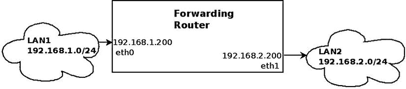
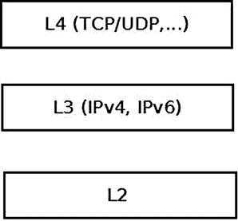
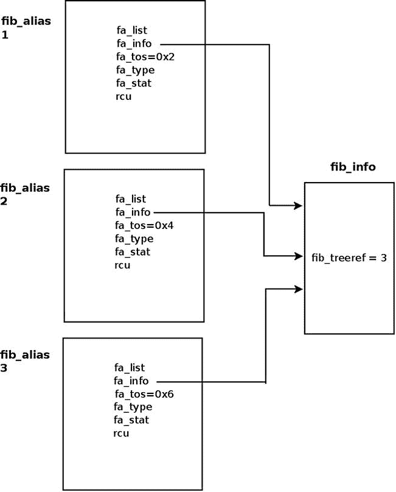
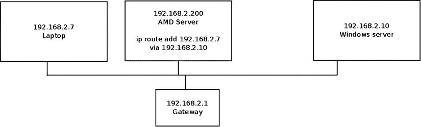
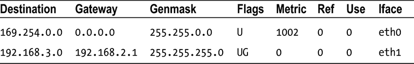

第五章


IPv4 路由子系统

[第 4 章](04.html)讨论了 IPv4 子系统。在本章和下一章，我将讨论最重要的 Linux 子系统之一，路由子系统，以及它在 Linux 中的实现。Linux 路由子系统被广泛用于路由器——从家庭和小型办公室路由器，到企业路由器(连接组织或 ISP)和互联网主干网上的核心高速路由器。无法想象没有这些设备的现代世界。这两章中的讨论仅限于 IPv4 路由子系统，它与 IPv6 的实现非常相似。本章主要介绍 IPv4 路由子系统使用的主要数据结构，如路由表、转发信息库(FIB)信息和 FIB 别名、FIB TRIE 等。(顺便说一下，TRIE 不是首字母缩略词，但它来源于单词 *retrieval* )。TRIE 是一种数据结构，一种取代 FIB 哈希表的特殊树。您将了解如何在路由子系统中执行查找，如何以及何时生成 ICMP 重定向消息，以及如何删除路由缓存代码。请注意，本章中的讨论和代码示例都与内核 3.9 相关，只有两个部分明确提到了不同的内核版本。

转发和 FIB

Linux 网络栈的一个重要目标是转发流量。这一点在讨论在互联网主干网上运行的核心路由器时尤为重要。负责转发数据包和维护转发数据库的 Linux IP 堆栈层称为路由子系统。对于小型网络，FIB 的管理可以由系统管理员完成，因为大多数网络拓扑是静态的。当讨论核心路由器时，情况有点不同，因为拓扑是动态的，并且有大量不断变化的信息。在这种情况下，FIB 的管理通常由用户空间路由守护进程来完成，有时与特殊的硬件增强功能一起完成。这些用户空间守护进程通常维护自己的路由表，有时会与内核路由表交互。

让我们从基础开始:什么是路由？看一个非常简单的转发例子:你有两个以太局域网，LAN1 和 LAN2。在 LAN1 上有一个子网 192.168.1.0/24，在 LAN2 上有一个子网 192.168.2.0/24。这两个局域网之间有一台机器，将被称为“转发路由器”转发路由器中有两个以太网网卡(NIC)。连接到 LAN1 的网络接口是`eth0`，IP 地址为 192.168.1.200，连接到 LAN2 的网络接口是`eth1`，IP 地址为 192.168.2.200，如图[图 5-1](#Fig1) 所示。为了简单起见，我们假设转发路由器上没有运行防火墙守护程序。您开始从 LAN1 发送流量，目的地是 LAN2。根据称为路由表的数据结构，转发从 LAN1 发送到 LAN2(反之亦然)的输入数据包的过程称为*路由*。我将在本章和下一章讨论这个过程和路由表数据结构。



[图 5-1](#_Fig1) 。在两个局域网之间转发数据包

在[图 5-1](#Fig1) 中，从 LAN1 在`eth0`到达目的地为 LAN2 的数据包通过`eth1`作为输出设备转发。在此过程中，传入的数据包从内核网络堆栈的第 2 层(链路层)移动到转发路由器的第 3 层(网络层)。然而，与流量被指定到转发路由器机器(“流量到我”)的情况相反，不需要将分组移动到第 4 层(传输层)，因为该流量不打算由任何第 4 层传输套接字处理。应该转发该流量。移动到第 4 层有性能成本，最好尽可能避免。该流量在第 3 层处理，根据转发路由器上配置的路由表，数据包在作为输出接口的`eth1`上转发(或被拒绝)。

[图 5-2](#Fig2) 显示了前面提到的内核处理的三个网络层。



[图 5-2](#_Fig2) 。由网络内核堆栈处理的三层

我在这里应该提到的另外两个术语是路由中常用的*默认网关*和*默认路由*。当您在路由表中定义默认网关条目时，其它路由条目(如果有)未处理的每个数据包都必须转发给它，而不管该数据包 IP 报头中的目的地址。在无类域间路由(CIDR)表示法中，默认路由被指定为 0.0.0.0/0。举个简单的例子，您可以添加一台 IPv4 地址为 192.168.2.1 的机器作为默认网关，如下所示:

```sh
ip route add default via 192.168.2.1
```

或者，当使用`route`命令时，像这样:

```sh
route add default gateway 192.168.2.1

```

在本节中，您学习了什么是转发，并看到了一个简单的示例，说明了数据包如何在两个局域网之间转发。您还学习了什么是默认网关，什么是默认路由，以及如何添加它们。现在您已经知道了基本术语和转发是什么，让我们继续看一看路由子系统中的查找是如何执行的。

在路由子系统中执行查找

对于 Rx 路径和 Tx 路径中的每个分组，在路由子系统中进行查找。在 3.6 之前的内核中，Rx 路径和 Tx 路径中的每次查找都包括两个阶段:在路由缓存中查找，以及在缓存未命中的情况下，在路由表中查找(我将在本章末尾的“IPv4 路由缓存”一节中讨论路由缓存)。通过`fib_lookup()`方法进行查找。当`fib_lookup()`方法在路由子系统中找到合适的条目时，它构建一个由各种路由参数组成的`fib_result`对象，并返回 0。我将在本节和本章的其他部分讨论`fib_result`对象。这里是`fib_lookup()`的原型:

```sh
int fib_lookup(struct net *net, const struct flowi4 *flp, struct fib_result *res)
```

`flowi4`对象由对 IPv4 路由查找过程很重要的字段组成，包括目的地址、源地址、服务类型(TOS)等等。事实上，`flowi4`对象定义了路由表中查找的关键字，应该在用`fib_lookup()`方法执行查找之前初始化。对于 IPv6，有一个名为`flowi6`的并行对象；两者都在`include/net/flow.h`中定义。`fib_result`对象构建在 IPv4 查找过程中。`fib_lookup()`方法首先搜索本地 FIB 表。如果查找失败，它将在主 FIB 表中执行查找(我将在下一节“FIB 表”中描述这两个表)。成功完成查找后，在 Rx 路径或 Tx 路径中，构建一个`dst`对象(在`include/net/dst.h`中定义的`dst_entry`结构的一个实例，目的缓存)。`dst`对象嵌入在一个名为`rtable`的结构中，您很快就会看到。实际上，`rtable`对象代表一个可以与 SKB 相关联的路由条目。`dst_entry`对象最重要的成员是两个名为`input`和`output`的回调。在路由查找过程中，根据路由查找结果，这些回调被分配为适当的处理程序。这两个回调只得到一个 SKB 作为参数:

```sh
struct dst_entry {
    ...
    int  (*input)(struct sk_buff *);
    int  (*output)(struct sk_buff *);
    ...
}
```

下面是`rtable`结构；如您所见，`dst`对象是这个结构中的第一个对象:

```sh
struct rtable {
    struct dst_entry  dst;

    int               rt_genid;
    unsigned int      rt_flags;
    __u16             rt_type;
    __u8              rt_is_input;
    __u8              rt_uses_gateway;

    int               rt_iif;

    /* Info on neighbour */
    __be32            rt_gateway;

    /* Miscellaneous cached information */
    u32               rt_pmtu;

    struct list_head  rt_uncached;
};
```

```sh
(include/net/route.h)
```

以下是对`rtable`结构成员的描述:

*   `rt_flags`:`rtable`对象标志；这里提到了一些重要的标志:

*   RTCF _ 广播:该位置位时，目的地址是一个广播地址。该标志在`__mkroute_output()`方法和`ip_route_input_slow()`方法中设置。
*   RTCF 多播:当该位置位时，目的地址是一个多播地址。该标志在`ip_route_input_mc()`方法和`__mkroute_output()`方法中设置。
*   RTCF _ 多尔直接:当设置时，应该发送一个 ICMPv4 重定向消息作为对传入数据包的响应。设置该标志需要满足几个条件，包括输入设备和输出设备相同，并且设置了相应的`procfs send_redirects`条目。还有更多条件，你将在本章后面看到。该标志在`__mkroute_input()`方法中设置。
*   RTCF _ 本地:该位置位时，目的地址是本地的。该标志有以下几种设置方法:`ip_route_input_slow()`、`__mkroute_output()`、`ip_route_input_mc()`和`__ip_route_output_key()`。一些 RTCF_XXX 标志可以同时设置。例如，当设置了 RTCF 广播或 RTCF 多播时，可以设置 RTCF 本地。关于 RTCF_ XXX 旗帜的完整列表，请查阅`include/uapi/linux/in_route.h`。注意，其中有一些是未使用的。

*   `rt_is_input`:当这是输入路径时被设置为 1 的标志。
*   `rt_uses_gateway`:根据下式得到一个值:

*   当下一跳是网关时，`rt_uses_gateway`为 1。
*   当下一跳是直接路由时，`rt_uses_gateway`为 0。

*   `rt_iif`:呼入接口的`ifindex`。(注意在内核 3.6 中，`rt_oif`成员被从`rtable`结构中移除；它被设置为指定流键的`oif`，但实际上只在一个方法中使用过)。
*   `rt_pmtu`: The Path MTU (the smallest MTU along the route).

    请注意，在内核 3.6 中，添加了`fib_compute_spec_dst()`方法，它获取 SKB 作为参数。这个方法使得`rtable`结构中的`rt_spec_dst`成员变得不需要，结果`rt_spec_dst`从`rtable`结构中被移除。在特殊情况下需要使用`fib_compute_spec_dst()`方法，例如在`icmp_reply()`方法中，当使用发送方的源地址作为回复目的地来回复发送方时。

对于目的地为本地主机的输入单播包，`dst`对象的`input`回调被设置为`ip_local_deliver()`，对于应该被转发的输入单播包，这个`input`回调被设置为`ip_forward()`。对于在本地机器上生成并发送出去的数据包，`output`回调被设置为`ip_output()`。对于一个组播包，`input`回调可以设置为`ip_mr_input()`(在本章没有详细描述的一些条件下)。有些情况下`input`回调被设置为`ip_error()`，你将在本章后面的禁止规则示例中看到。让我们看看`fib_result`对象:

```sh
struct fib_result {
         unsigned char    prefixlen;
         unsigned char    nh_sel;
         unsigned char    type;
         unsigned char    scope;
         u32              tclassid;
         struct fib_info  *fi;
         struct fib_table *table;
         struct list_head *fa_head;
};
```

```sh
(include/net/ip_fib.h)
```

*   `prefixlen`:前缀长度，代表网络掩码。其值在 0 到 32 的范围内。使用默认路由时为 0。例如，当通过`ip route add 192.168.2.0/24 dev eth0`添加路由条目时，根据添加条目时指定的网络掩码，`prefixlen`是 24。在`check_leaf()`方法(`net/ipv4/fib_trie.c`)中设置`prefixlen`。
*   `nh_sel`:下一跳号。当只使用一个下一跳时，它是 0。使用多路径路由时，可以有多个下一跳。nexthop 对象存储在路由条目的数组中(在`fib_info`对象中)，这将在下一节中讨论。
*   `type`:`fib_result`对象的`type`是最重要的字段，因为它实际上决定了如何处理数据包:是否将它转发到不同的机器，本地传送，无声地丢弃它，用 ICMPv4 消息回复丢弃它，等等。`fib_result`对象的类型是根据数据包内容(尤其是目的地址)和管理员设置的路由规则、路由守护程序或重定向消息来确定的。在本章后面和下一章中，你将看到`fib_result`对象的`type`是如何在查找过程中确定的。两种最常见的类型的`fib_result`对象是 RTN_UNICAST 类型和 RTN_LOCAL 类型，前者在数据包通过网关或直接路由转发时设置，后者在数据包发往本地主机时设置。您将在本书中遇到的其他类型是 RTN_BROADCAST 类型，用于应该作为广播在本地接受的数据包 RTN _ MULTICAST 类型，用于多播路由 RTN _ UNREACHABLE 类型，用于触发发送回 icmp v4“Destination UNREACHABLE”消息的数据包，等等。总共有 12 种路线类型。有关所有可用路线类型的完整列表，请参见`include/uapi/linux/rtnetlink.h`。
*   `fi`:指向`fib_info`对象的指针，表示一个路由条目。`fib_info`对象保存了对下一跳(`fib_nh`)的引用。我将在本章后面的“FIB 信息”一节中讨论 FIB 信息结构。
*   `table`:指向在其上进行查找的 FIB 表的指针。在`check_leaf()`方法(`net/ipv4/fib_trie.c`)中设置。
*   `fa_head`:指向`fib_alias`列表的指针(与该路线相关联的`fib_alias`对象的列表)；路由条目的优化是在使用`fib_alias`对象时完成的，这避免了为每个路由条目创建一个单独的`fib_info`对象，尽管事实上还有其他`fib_info`对象非常相似。所有 FIB 别名按`fa_tos`降序和`fib_priority`(公制)升序排序。`fa_tos`为 0 的别名是最后一个，可以匹配任何 TOS。我将在本章后面的“FIB 别名”一节中讨论`fib_alias`结构。

在本节中，您学习了如何在路由子系统中执行查找。您还了解了与路由查找过程相关的重要数据结构，如`fib_result`和`rtable`。下一节讨论 FIB 表是如何组织的。

纤维表

路由子系统的主要数据结构是路由表，用`fib_table`结构表示。路由表可以以某种简化的方式描述为条目表，其中每个条目确定应该为去往子网(或特定 IPv4 目的地地址)的流量选择哪个下一跳。当然，这个条目还有其他参数，将在本章后面讨论。每个路由条目包含一个`fib_info`对象(`include/net/ip_fib.h`，它存储最重要的路由条目参数(但不是全部，您将在本章后面看到)。`fib_info`对象由`fib_create_info()`方法(`net/ipv4/fib_semantics.c`)创建，并存储在一个名为`fib_info_hash`的散列表中。当路由使用`prefsrc`时，`fib_info`对象也被添加到一个名为`fib_info_laddrhash`的散列表中。

有一个名为`fib_info_cnt`的`fib_info`对象的全局计数器，它在通过`fib_create_info()`方法创建一个`fib_info`对象时递增，在通过`free_fib_info()`方法释放一个`fib_info`对象时递减。当哈希表增长超过某个阈值时，它会动态调整大小。在`fib_info_hash`散列表中的查找由`fib_find_info()`方法完成(当没有找到条目时返回 NULL)。序列化对`fib_info`成员的访问是由名为`fib_info_lock`的自旋锁完成的。下面是`fib_table`的结构:

```sh
struct fib_table {
        struct hlist_node       tb_hlist;
        u32                     tb_id;
        int                     tb_default;
        int                     tb_num_default;
        unsigned long           tb_data[0];
};
```

```sh
(include/net/ip_fib.h)
```

*   `tb_id`:表格标识符。对于主表，`tb_id`是 254 (RT_TABLE_MAIN)，对于本地表，`tb_id`是 255 (RT_TABLE_LOCAL)。我很快就会谈到主表和本地表——现在，只需注意在没有策略路由的情况下工作时，只有这两个 FIB 表，即主表和本地表，是在 boot 中创建的。
*   `tb_num_default:`表中默认路线的数量。创建表格的`fib_trie_table()`方法将`tb_num_default`初始化为 0。通过`fib_table_insert()`方法，添加默认路由会使`tb_num_default`增加 1。通过`fib_table_delete()`方法，删除默认路由会使`tb_num_default`递减 1。
*   `tb_data[0]`:路由条目(`trie`)对象的占位符。

本节讲述了 FIB 表是如何实现的。接下来，您将了解 FIB 信息，它表示单个路由条目。

纤维信息

路由条目由一个`fib_info`结构表示。它由重要的路由条目参数组成，例如传出网络设备(`fib_dev`)、优先级(`fib_priority`)、该路由的路由协议标识符(`fib_protocol`)等等。我们来看看`fib_info`的结构:

```sh
struct fib_info {
    struct hlist_node    fib_hash;
    struct hlist_node    fib_lhash;
    struct net        *fib_net;
    int               fib_treeref;
    atomic_t          fib_clntref;
    unsigned int      fib_flags;
    unsigned char     fib_dead;
    unsigned char     fib_protocol;
    unsigned char     fib_scope;
    unsigned char     fib_type;
    __be32            fib_prefsrc;
    u32               fib_priority;
    u32               *fib_metrics;
#define fib_mtu fib_metrics[RTAX_MTU-1]
#define fib_window fib_metrics[RTAX_WINDOW-1]
#define fib_rtt fib_metrics[RTAX_RTT-1]
#define fib_advmss fib_metrics[RTAX_ADVMSS-1]
    int               fib_nhs;
#ifdef CONFIG_IP_ROUTE_MULTIPATH
    int               fib_power;
#endif
    struct rcu_head   rcu;
    struct fib_nh     fib_nh[0];
#define fib_dev       fib_nh[0].nh_dev
};
```

```sh
(include/net/ip_fib.h)
```

*   `fib_net`:`fib_info`对象所属的网络名称空间。
*   `fib_treeref`:一个引用计数器，表示保存对这个`fib_info`对象的引用的`fib_alias`对象的数量。该参考计数器在`fib_create_info()`方法中递增，在`fib_release_info()`方法中递减。两种方法都在`net/ipv4/fib_semantics.c`。
*   `fib_clntref`:参考计数器，通过`fib_create_info()`方法(`net/ipv4/fib_semantics.c`)递增，通过`fib_info_put()`方法(`include/net/ip_fib.h`)递减。如果在`fib_info_put()`方法中将它减 1 后，它达到零，那么相关联的`fib_info`对象被`free_fib_info()`方法释放。
*   `fib_dead`:表示是否允许用`free_fib_info()`方法释放`fib_info`对象的标志；在调用`free_fib_info()`方法之前，必须将`fib_dead`设置为 1。如果没有设置`fib_dead`标志(其值为 0)，那么它被认为是活动的，并且试图用`free_fib_info()`方法释放它将会失败。
*   `fib_protocol`:该路由的路由协议标识。当在没有指定路由协议 ID 的情况下从用户空间添加路由规则时，`fib_protocol`被指定为 RTPROT_BOOT。管理员可以添加带有“proto static”修饰符的路由，这表示该路由是由管理员添加的；这可以这样做，例如，像这样:`ip route add proto static 192.168.5.3 via 192.168.2.1`。可以给`fib_protocol`分配这些标志中的一个:

*   RTPROT_UNSPEC:一个错误值。
*   RTPROT_REDIRECT:设置时，路由条目是由于接收到 ICMP 重定向消息而创建的。RTPROT_REDIRECT 协议标识符仅在 IPv6 中使用。
*   RTPROT_KERNEL:该位置位时，路由条目由内核创建(例如，在创建本地 IPv4 路由表时，简要说明)。
*   RTPROT_BOOT:设置时，管理员添加了一个路由，但没有指定“proto static”修饰符。
*   RTPROT_STATIC:系统管理员安装的路由。
*   RTPROT_RA:不要误读这个——这个协议标识符不是用于路由器告警的；它用于 RDISC/ND 路由器广告，并且仅由 IPv6 子系统在内核中使用；参见:`net/ipv6/route.c`。我在第八章中讨论了它。

路由条目也可以由用户空间路由守护进程添加，比如 ZEBRA、XORP、MROUTED 等等。然后，将从协议标识符列表中为其分配相应的值(参见`include/uapi/linux/rtnetlink.h`中的 RTPROT_XXX 定义)。例如，对于 XORP 守护进程，它将是 RTPROT_XORP。注意，这些标志(如 RTPROT_KERNEL 或 RTPROT_STATIC)也被 IPv6 用于并行字段(`rt6_info`结构中的`rt6i_protocol`字段);`rt6_info`对象是与`rtable`对象平行的 IPv6。

*   `fib_scope`:目的地址的范围。简而言之，作用域被分配给地址和路由。Scope 表示主机与其他节点之间的距离。`ip address show`命令显示主机上所有已配置 IP 地址的范围。`ip route show`命令显示主表所有路由表项的范围。范围可以是下列之一:

*   主机(RT_SCOPE_HOST):该节点无法与其他网络节点通信。环回地址的作用域是主机。
*   global (RT_SCOPE_UNIVERSE):地址可以在任何地方使用。这是最常见的情况。
*   link (RT_SCOPE_LINK):该地址只能从直接连接的主机访问。
*   site (RT_SCOPE_SITE):这个只在 IPv6 中使用(我在[第八章](08.html)中讨论)。
*   nowhere (RT_SCOPE_NOWHERE):目的地不存在。

当管理员在未指定范围的情况下添加路由时，会根据以下规则为`fib_scope`字段分配一个值:

*   全局范围(RT_SCOPE_UNIVERSE):用于所有网关单播路由。
*   scope link (RT_SCOPE_LINK):用于直接单播和广播路由。
*   scope host (RT_SCOPE_HOST):用于本地路由。

*   `fib_type`:路线的类型。`fib_type`字段被添加到了`fib_info`结构中，作为一个键来确保`fib_info`对象的类型是不同的。在内核 3.7 中，`fib_type`字段被添加到了`fib_info struct`中。最初，这个类型只存储在 FIB alias 对象(`fib_alias`)的`fa_type`字段中。您可以根据指定的类别添加规则来阻止流量，例如通过:`ip route add prohibit 192.168.1.17 from 192.168.2.103.`

*   生成的`fib_info`对象的`fib_type`为 RTN_PROHIBIT。
*   从 192.168.2.103 向 192.168.1.17 发送流量会导致 ICMPv4 消息“数据包过滤”(ICMP_PKT_FILTERED)。

*   `fib_prefsrc`:有时候你想给查找键提供一个特定的源地址。这是通过设置`fib_prefsrc.`来完成的
*   `fib_priority`:该路径的优先级默认为 0，优先级最高。优先级值越高，优先级越低。例如，优先级 3 低于优先级 0，优先级 0 是最高优先级。例如，您可以通过以下方式之一使用`ip`命令对其进行配置:

*   `ip route add 192.168.1.10 via 192.168.2.1 metric 5`
*   `ip route add 192.168.1.10 via 192.168.2.1 priority 5`
*   `ip route add 192.168.1.10 via 192.168.2.1 preference 5`

这三个命令中的每一个都将`fib_priority`设置为 5；他们之间没有任何区别。此外，`ip route`命令的`metric`参数与`fib_info`结构的`fib_metrics`字段没有任何关系。

*   `fib_mtu`, `fib_window`, `fib_rtt`, and `fib_advmss` simply give more convenient names to commonly used elements of the `fib_metrics` array.

    `fib_metrics`是由各种度量组成的 15 (RTAX_MAX)个元素的数组。它在`net/core/dst.c`中被初始化为`dst_default_metrics`。很多指标都与 TCP 协议有关，比如初始拥塞窗口`(initcwnd)`指标。[本章末尾的表 5-1](#Tab1) 显示了所有可用的度量，并显示每个度量是否是 TCP 相关的度量。

    从用户空间，可以这样设置 TCPv4 `initcwnd`指标，例如:

    ```sh
    ip route add 192.168.1.0/24 initcwnd 35
    ```

    有些指标不是特定于 TCP 的——例如,`mtu`指标，可以从用户空间像这样设置:

    ```sh
    ip route add 192.168.1.0/24 mtu 800
    ```

    或者像这样:

    ```sh
    ip route add 192.168.1.0/24 mtu lock 800
    ```

    这两个命令的区别在于，当指定修饰符`lock`时，不会尝试任何路径 MTU 发现。当没有指定修饰符`lock`时，由于路径 MTU 发现，MTU 可能被内核更新。有关如何实现的更多信息，请参见`net/ipv4/route.c`中的`__ip_rt_update_pmtu()`方法:

    ```sh
    static void __ip_rt_update_pmtu(struct rtable *rt, struct flowi4 *fl4, u32 mtu)
    {
    ```

    指定`mtu lock`修饰符时避免路径 MTU 更新是通过调用`dst_metric_locked()`方法实现的:

    ```sh
    . . .
    if (dst_metric_locked(dst, RTAX_MTU))
          return;
    . . .
    }

    ```

*   `fib_nhs`:下一跳的次数。当未设置多路径路由(CONFIG_IP_ROUTE_MULTIPATH)时，它不能大于 1。多路径路由功能为一条路由设置多条备选路径，可能会为这些路径分配不同的权重。这个特性提供了一些好处，比如容错、增加带宽或提高安全性(我将在第 6 章中讨论)。
*   `fib_dev`:将数据包传输到下一跳的网络设备。
*   `fib_nh[0]`:`fib_nh[0]`成员代表下一跳。使用多路径路由时，您可以在一个路由中定义多个下一跳，在这种情况下，有一个下一跳数组。定义两个 nexthop 节点可以这样做，例如:`ip route add default scope global nexthop dev eth0 nexthop dev eth1`。

如前所述，当`fib_type`为 RTN_PROHIBIT 时，发送一条“包过滤”(ICMP_PKT_FILTERED)的 ICMPv4 消息。是如何实现的？名为`fib_props`的数组由 12 (RTN_MAX)个元素组成(在`net/ipv4/fib_semantics.c`中定义)。这个数组的索引是路由类型。可用的路由类型，如 RTN_PROHIBIT 或 RTN_UNICAST，可在`include/uapi/linux/rtnetlink.h`中找到。数组中的每个元素都是`struct fib_prop`的一个实例；`fib_prop`结构是一个非常简单的结构:

```sh
struct fib_prop {
          int     error;
          u8      scope;
  };
```

```sh
(net/ipv4/fib_lookup.h)
```

对于每个路线类型，对应的`fib_prop`对象包含该路线的`error`和`scope`。例如，对于 RTN_UNICAST 路由类型(网关或直接路由)，这是一种非常常见的路由，错误值为 0，表示没有错误，范围为 RT_SCOPE_UNIVERSE。对于 RTN_PROHIBIT 路由类型(系统管理员为阻止流量而配置的规则)，错误为–EACCES，范围为 RT_SCOPE_UNIVERSE:

```sh
const struct fib_prop fib_props[RTN_MAX + 1] = {
 . . .
         [RTN_PROHIBIT] = {
                 .error  = -EACCES,
                 .scope  = RT_SCOPE_UNIVERSE,
         },

. . .
```

本章末尾的表 5-2 显示了所有可用的路由类型、错误代码和范围。

当您通过`ip route add prohibit 192.168.1.17 from 192.168.2.103`配置前面提到的规则时，当数据包从 192.168.2.103 发送到 192.168.1.17 时，会发生以下情况:在 Rx 路径中执行路由表查找。当找到相应的条目时，实际上是 FIB TRIE 中的一个叶子，调用`check_leaf()`方法。该方法以数据包的路由类型作为索引来访问`fib_props`数组(`fa->fa_type`):

```sh
static int check_leaf(struct fib_table *tb, struct trie *t, struct leaf *l,
                      t_key key,  const struct flowi4 *flp,
                      struct fib_result *res, int fib_flags)
{
    . . .
       fib_alias_accessed(fa);
       err = fib_props[fa->fa_type].error;
       if (err) {
                . . .
                return err;
                 }
    . . .
```

最后，在 IPv4 路由子系统中启动查找的`fib_lookup()`方法返回一个错误–EACCES(在我们的例子中)。它从`check_leaf()`通过`fib_table_lookup()`一路传播回来，直到它返回到触发这个链的方法，即`fib_lookup()`方法。当`fib_lookup()`方法在接收路径中返回一个错误时，它由`ip_error()`方法处理。根据错误，采取行动。在–EACCES 的情况下，会发回一个代码为 Packet Filtered(ICMP _ PKT _ Filtered)的目的地不可达的 ICMPv4，并丢弃该数据包。

本节介绍了 FIB 信息，它代表一个路由条目。下一节讨论 IPv4 路由子系统中的缓存(不要与 IPv4 路由缓存混淆，后者已从网络堆栈中删除，将在本章末尾的“IPv4 路由缓存”一节中讨论)。

贮藏

缓存路由查找的结果是一种优化技术，可以提高路由子系统的性能。路由查找的结果通常缓存在 nexthop ( `fib_nh`)对象中；当数据包不是单播数据包或使用了`realms`(数据包`itag`不为 0)时，结果不会缓存在下一跳中。原因是，如果所有类型的数据包都被缓存，那么不同类型的路由可以使用相同的下一跳，这是应该避免的。有一些小的例外，我不在本章讨论。Rx 和 Tx 路径中的缓存执行如下:

*   在 Rx 路径中，缓存 nexthop ( `fib_nh`)对象中的`fib_result`对象是通过设置 nexthop ( `fib_nh`)对象的`nh_rth_input`字段来完成的。
*   在 Tx 路径中，缓存 nexthop ( `fib_nh`)对象中的`fib_result`对象是通过设置 nexthop ( `fib_nh`)对象的`nh_pcpu_rth_output`字段来完成的。
*   `nh_rth_input`和`nh_pcpu_rth_output`都是`rtable`结构的实例。
*   缓存`fib_result`是通过 Rx 和 Tx 路径中的`rt_cache_route()`方法完成的(`net/ipv4/route.c`)。
*   路径 MTU 和 ICMPv4 重定向的缓存是通过 FIB 异常完成的。

为了提高性能，`nh_pcpu_rth_output`是每个 CPU 的变量，这意味着每个 CPU 都有一个输出`dst`条目的副本。几乎总是使用缓存。少数例外情况是当发送了 ICMPv4 重定向消息，或者设置了`itag` ( `tclassid`，或者没有足够的内存。

在本节中，您已经学习了如何使用 nexthop 对象进行缓存。下一节讨论代表下一跳的`fib_nh`结构，以及 FIB 下一跳异常。

下一跳(fib_nh)

`fib_nh`结构表示下一跳。它包括诸如传出下一跳网络设备(`nh_dev`)、传出下一跳接口索引(`nh_oif`)、范围(`nh_scope`等信息。我们来看看:

```sh
struct fib_nh {
    struct net_device       *nh_dev;
    struct hlist_node       nh_hash;
    struct fib_info         *nh_parent;
    unsigned int            nh_flags;
    unsigned char           nh_scope;
#ifdef CONFIG_IP_ROUTE_MULTIPATH
    int                     nh_weight;
    int                     nh_power;
#endif
#ifdef CONFIG_IP_ROUTE_CLASSID
    __u32                   nh_tclassid;
#endif
    int                     nh_oif;
    __be32                  nh_gw;
    __be32                  nh_saddr;
    int                     nh_saddr_genid;
    struct rtable __rcu * __percpu *nh_pcpu_rth_output;
    struct rtable __rcu     *nh_rth_input;
    struct fnhe_hash_bucket *nh_exceptions;
};
```

```sh
(include/net/ip_fib.h)
```

`nh_dev`字段表示网络设备(`net_device`对象)，去往下一跳的流量将在该网络设备上传输。当与一个或多个路由相关联的网络设备被禁用时，会发送 NETDEV_DOWN 通知。处理这个事件的 FIB 回调是`fib_netdev_event()`方法；它是`fib_netdev_notifier`通知对象的回调，通过调用`register_netdevice_notifier()`方法在`ip_fib_init()`方法中注册(通知链在[第 14 章](14.html)中讨论)。`fib_netdev_event()`方法在收到 NETDEV_DOWN 通知时调用`fib_disable_ip()`方法。在`fib_disable_ip()`方法中，执行以下步骤:

*   首先调用`fib_sync_down_dev()`方法(`net/ipv4/fib_semantics.c`)。在`fib_sync_down_dev()`方法中，设置下一跳标志(`nh_flags`)的 RTNH_F_DEAD 标志，并且设置 FIB 信息标志(`fib_flags`)。
*   通过`fib_flush()`方法刷新路径。
*   调用`rt_cache_flush()`方法和`arp_ifdown()`方法。`arp_ifdown()`方法不在任何通知链上。

FIB 下一跳异常

在内核 3.6 中添加了 FIB nexthop 异常，以处理不是由于用户空间操作而是由于 ICMPv4 重定向消息或路径 MTU 发现而导致路由条目更改的情况。哈希键是目的地址。FIB 下一跳异常基于 2048 条目哈希表；回收(释放散列条目)从链深度 5 开始。每个 nexthop 对象(`fib_nh`)都有一个 FIB nexthop 异常哈希表，`nh_exceptions`(`fnhe_hash_bucket`结构的一个实例)。我们来看看`fib_nh_exception`的结构:

```sh
struct fib_nh_exception {
    struct fib_nh_exception __rcu    *fnhe_next;
    __be32                           fnhe_daddr;
    u32                              fnhe_pmtu;
    __be32                           fnhe_gw;
    unsigned long                    fnhe_expires;
    struct rtable __rcu              *fnhe_rth;
    unsigned long                    fnhe_stamp;
};
```

```sh
(include/net/ip_fib.h)
```

通过`update_or_create_fnhe()`方法(`net/ipv4/route.c`)创建`fib_nh_exception`对象。FIB 下一跳异常在哪里生成？第一种情况是在`__ip_do_redirect()`方法中接收到 ICMPv4 重定向消息(“重定向到主机”)时。“重定向到主机”消息包括一个新网关。`fib_nh_exception`的`fnhe_gw`字段在创建 FIB nexthop 异常对象时被设置为新网关(在`update_or_create_fnhe()`方法中):

```sh
static void __ip_do_redirect(struct rtable *rt, struct sk_buff *skb, struct flowi4 *fl4,
                 bool kill_route)
{
  ...
  __be32 new_gw = icmp_hdr(skb)->un.gateway;
  ...
  update_or_create_fnhe(nh, fl4->daddr, new_gw, 0, 0);
  ...

}
```

生成 FIB nexthop 异常的第二种情况是在路径 MTU 已经改变时，在`__ip_rt_update_pmtu()`方法中。在这种情况下，当创建 FIB nexthop 异常对象(在`update_or_create_fnhe()`方法中)时，`fib_nh_exception`对象的`fnhe_pmtu`字段被设置为新的 MTU。如果 PMTU 值在过去 10 分钟内没有更新，则该值过期(`ip_rt_mtu_expires`)。通过`ipv4_mtu()`方法(一个`dst->ops->mtu`处理程序)在每次`dst_mtu()`调用时检查这个时间段。默认为 600 秒的`ip_rt_mtu_expires`可通过`procfs`条目`/proc/sys/net/ipv4/route/mtu_expires`进行配置:

```sh
static void __ip_rt_update_pmtu(struct rtable *rt, struct flowi4 *fl4, u32 mtu)
{
    . . .
    if (fib_lookup(dev_net(dst->dev), fl4, &res) == 0) {
        struct fib_nh *nh = &FIB_RES_NH(res);

        update_or_create_fnhe(nh, fl4->daddr, 0, mtu,
                      jiffies + ip_rt_mtu_expires);
    }
    . . .
}

```

 **注意** FIB nexthop 异常用于 Tx 路径。从 Linux 3.11 开始，它们也用于 Rx 路径。结果，没有了`fnhe_rth`，有了`fnhe_rth_input`和`fnhe_rth_output`。

从内核 2.4 开始，支持策略路由。使用策略路由，数据包的路由不仅取决于目的地址，还取决于其他几个因素，如源地址或 TOS。系统管理员最多可以添加 255 个路由表。

策略路由

在没有策略路由的情况下工作时(未设置 CONFIG_IP_MULTIPLE_TABLES)，会创建两个路由表:本地表和主表。主表 id 是 254 (RT_TABLE_MAIN)，本地表 id 是 255 (RT_TABLE_LOCAL)。本地表包含本地地址的路由条目。这些路由条目只能由内核添加到本地表中。向主表(RT_TABLE_MAIN)添加路由条目由系统管理员完成(例如，通过`ip route add`)。这些表格是由`net/ipv4/fib_frontend.c`的`fib4_rules_init()`方法创建的。在 2.6.25 之前的内核中，这些表被称为`ip_fib_local_table`和`ip_fib_main_table`，但是它们被删除了，以便使用带有适当参数的`fib_get_table()`方法来统一访问路由表。通过*统一访问*，我的意思是，当策略路由支持启用和禁用时，对路由表的访问都是以相同的方式完成的，使用`fib_get_table()`方法。`fib_get_table()`方法只获得两个参数:网络名称空间和表 id。请注意，`net/ipv4/fib_rules.c`中的策略路由案例有一个不同的同名方法`fib4_rules_init()`，该方法在使用策略路由支持时被调用。当使用策略路由支持(设置了 CONFIG_IP_MULTIPLE_TABLES)时，有三个初始表(本地、主和默认)，最多可以有 255 个路由表。我将在第 6 章的[中详细讨论策略路由](06.html)。访问主路由表的方法如下:

*   通过系统管理员命令(使用`ip route`或`route`):

*   通过`ip route add`添加路由是通过从用户空间发送 RTM_NEWROUTE 消息实现的，该消息由`inet_rtm_newroute()`方法处理。请注意，路由不一定总是允许流量的规则。您还可以添加一个阻止流量的路由，例如通过`ip route add prohibit 192.168.1.17 from 192.168.2.103.`应用此规则的结果是，从 192.168.2.103 发送到 192.168.1.17 的所有数据包都将被阻止。
*   `ip route del`删除路由是通过从用户空间发送 RTM_DELROUTE 消息实现的，该消息由`inet_rtm_delroute()`方法处理。
*   `ip route show`转储路由表是通过从用户空间发送 RTM_GETROUTE 消息实现的，该消息由`inet_dump_fib()`方法处理。

注意`ip route show`显示主表。为了显示本地表，您应该运行`ip route show table local`。

*   通过`route add`添加路由是通过发送 SIOCADDRT IOCTL 实现的，它由`ip_rt_ioctl()`方法(`net/ipv4/fib_frontend.c`)处理。
*   由`route del`删除路由是通过发送 SIOCDELRT IOCTL 实现的，它由`ip_rt_ioctl()`方法(`net/ipv4/fib_frontend.c`)处理。
*   由用户空间路由守护进程执行路由协议，如 BGP(边界网关协议)、EGP(外部网关协议)、OSPF(开放最短路径优先)等。这些路由守护程序运行在核心路由器上，核心路由器在互联网主干上运行，可以处理成千上万的路由。

这里我应该提到，由于 ICMPv4 重定向消息或路径 MTU 发现而改变的路由缓存在下一跳异常表中，稍后将讨论。下一节描述 FIB 别名，它有助于路由优化。

光纤别名(fib_alias)

有时会创建几个指向同一目的地址或同一子网的路由条目。这些路由条目的不同之处仅在于它们的 TOS 值。不是为每个这样的路线创建一个`fib_info`，而是创建一个`fib_alias`对象。一个`fib_alias`更小，减少了内存消耗。下面是一个创建 3 个`fib_alias`对象的简单例子:

```sh
ip route add 192.168.1.10 via 192.168.2.1 tos 0x2
ip route add 192.168.1.10 via 192.168.2.1 tos 0x4
ip route add 192.168.1.10 via 192.168.2.1 tos 0x6
```

让我们来看看`fib_alias`的结构定义:

```sh
struct fib_alias {
        struct list_head        fa_list;
        struct fib_info         *fa_info;
        u8                      fa_tos;
        u8                      fa_type;
        u8                      fa_state;
        struct rcu_head         rcu;
};
```

```sh
(net/ipv4/fib_lookup.h)
```

注意在`fib_alias`结构(`fa_scope`)中也有一个作用域，但是在内核 2.6.39 中它被移到了`fib_info`结构中。

`fib_alias`对象存储到相同子网的路由，但参数不同。你可以拥有一个被许多`fib_alias`对象共享的`fib_info`对象。在这种情况下，所有这些`fib_alias`对象中的`fa_info`指针将指向同一个共享的`fib_info`对象。在[图 5-3](#Fig3) 中，你可以看到一个`fib_info`对象被三个`fib_alias`对象共享，每个对象有不同的`fa_tos`。注意，`fib_info`对象的参考计数器值是 3 ( `fib_treeref`)。



[图 5-3](#_Fig3) 。由三个 fib_alias 对象共享的 fib_info。每个 fib_alias 对象都有不同的 fa_tos 值

让我们来看看当您试图添加一个之前已经添加了一个`fib_node`的键时会发生什么(就像前面的例子中的三个 TOS 值 0x2、0x4 和 0x 6)；假设您已经创建了 TOS 为 0x2 的第一个规则，现在您创建了 TOS 为 0x4 的第二个规则。

`fib_alias`对象由`fib_table_insert()`方法创建，该方法处理添加路由条目:

```sh
int fib_table_insert(struct fib_table *tb, struct fib_config *cfg)
 {
         struct trie *t = (struct trie *) tb->tb_data;
         struct fib_alias *fa, *new_fa;
         struct list_head *fa_head = NULL;
         struct fib_info *fi;
      . . .
```

首先，创建一个`fib_info`对象。注意，在`fib_create_info()`方法中，在分配和创建了一个`fib_info`对象之后，通过调用`fib_find_info()`方法执行查找来检查是否已经存在一个类似的对象。如果这样的对象存在，它将被释放，并且被发现的对象的引用计数器(您很快就会看到代码片段中的`ofi`)将增加 1:

```sh
fi = fib_create_info(cfg);
```

我们来看看前面提到的`fib_create_info()`方法中的代码片段；为了创建第二个 TOS 规则，第一个规则的`fib_info`对象和第二个规则的`fib_info`对象是相同的。你应该记得 TOS 字段存在于`fib_alias`对象中，而不存在于`fib_info`对象中:

```sh
struct fib_info *fib_create_info(struct fib_config *cfg)
{
    struct fib_info *fi = NULL;
    struct fib_info *ofi;
    . . .
    fi = kzalloc(sizeof(*fi)+nhs*sizeof(struct fib_nh), GFP_KERNEL);
    if (fi == NULL)
            goto failure;
    . . .
link_it:
        ofi = fib_find_info(fi);
```

如果发现类似的对象，释放`fib_info`对象并增加`fib_treeref`引用计数:

```sh
        if (ofi) {
                fi->fib_dead = 1;
                free_fib_info(fi);
                ofi->fib_treeref++;
                return ofi;
        }
    . . .
}
```

现在执行一个检查来找出是否有一个`fib_info`对象的别名；在这种情况下，将没有别名，因为第二个规则的 TOS 不同于第一个规则的 TOS:

```sh
     l = fib_find_node(t, key);
     fa = NULL;

     if (l) {
             fa_head = get_fa_head(l, plen);
             fa = fib_find_alias(fa_head, tos, fi->fib_priority);
     }

if (fa && fa->fa_tos == tos &&
    fa->fa_info->fib_priority == fi->fib_priority) {
    . . .
       }
```

现在一个`fib_alias`被创建，它的`fa_info`指针被指定指向被创建的第一个规则的`fib_info`:

```sh
new_fa = kmem_cache_alloc(fn_alias_kmem, GFP_KERNEL);
if (new_fa == NULL)
    goto out;

new_fa->fa_info = fi;
    . . .
```

现在我已经介绍了 FIB 别名，您已经准备好查看 ICMPv4 重定向消息，该消息是在存在次优路由时发送的。

ICMPv4 重定向消息

有时路由条目不是最佳的。在这种情况下，会发送一条 ICMPv4 重定向消息。次优条目的主要标准是输入设备和输出设备相同。但是，正如您将在本节中看到的，还需要满足更多的条件才能发送一个 ICMPv4 重定向消息。ICMPv4 重定向消息有四个代码:

*   ICMP_REDIR_NET:重定向网络
*   ICMP_REDIR_HOST:重定向主机
*   ICMP_REDIR_NETTOS:为 TOS 重定向网络
*   ICMP_REDIR_HOSTTOS:为 TOS 重定向主机

[图 5-4](#Fig4) 显示了一个次优路线的设置。此设置中有三台机器，都位于同一子网(192.168.2.0/24)中，并且都通过网关(192.168.2.1)连接。AMD 服务器(192.168.2.200)增加了 Windows 服务器(192.168.2.10)作为`ip route add 192.168.2.7 via 192.168.2.10`访问 192.168.2.7(笔记本电脑)的网关。例如，AMD 服务器通过`ping 192.168.2.7`向笔记本电脑发送流量。因为默认网关是`192.168.2.10`，流量被发送到`192.168.2.10`。Windows 服务器检测到这是一个次优路由，因为 AMD 服务器可以直接发送到 192.168.2.7，并向 AMD 服务器发回一个带有 ICMP_REDIR_HOST 代码的 ICMPv4 重定向消息。



[图 5-4](#_Fig4) 。重定向到主机(ICMP_REDIR_HOST)，一个简单的设置

现在您对重定向有了更好的理解，让我们看看 ICMPv4 消息是如何生成的。

生成 ICMPv4 重定向消息

当存在一些次优路由时，发送 ICMPv4 重定向消息。次优路由最显著的条件是输入设备和输出设备相同，但还需要满足更多条件。生成 ICMPv4 重定向消息分两个阶段完成:

*   在`__mkroute_input()`方法 : 中，如果需要，这里会设置 RTCF _ 多尔直接标志。
*   In the `ip_forward()` method: Here the ICMPv4 Redirect message is actually sent by calling the `ip_rt_send_redirect()` method.

    ```sh
    static int __mkroute_input(struct sk_buff *skb,
                       const struct fib_result *res,
                       struct in_device *in_dev,
                       __be32 daddr, __be32 saddr, u32 tos)
    {
        struct rtable *rth;
        int err;
        struct in_device *out_dev;
        unsigned int flags = 0;
        bool do_cache;
    ```

    应满足以下所有条件，以便设置 RTCF _ 多尔直接标志:

*   输入设备和输出设备是相同的。
*   设置`procfs`条目`/proc/sys/net/ipv4/conf/<deviceName>/send_redirects`。
*   该传出设备是共享媒体，或者源地址(`saddr`)和下一跳网关地址(`nh_gw`)在同一个子网:

    ```sh
    if (out_dev == in_dev && err && IN_DEV_TX_REDIRECTS(out_dev) &&
      (IN_DEV_SHARED_MEDIA(out_dev) ||
       inet_addr_onlink(out_dev, saddr, FIB_RES_GW(*res)))) {

      flags |= RTCF_DOREDIRECT;
      do_cache = false;
    }
      . . .
    ```

通过以下方式设置`rtable`对象标志:

```sh
    rth->rt_flags = flags;
    . . .

}
```

发送 ICMPv4 重定向消息是在第二阶段通过`ip_forward()`方法完成的:

```sh
int ip_forward(struct sk_buff *skb)
{
    struct iphdr          *iph;    /* Our header */
    struct rtable         *rt;     /* Route we use */
    struct ip_options     *opt     = &(IPCB(skb)->opt);
```

接下来，执行检查以查看 RTCF _ 多尔直接标志是否被设置，严格路由的 IP 选项是否不存在(参见[第 4 章](04.html))，以及它是否不是 IPsec 分组。(对于 IPsec 隧道，隧道化分组的输入设备可以与解封装的分组输出设备相同；参见`http://lists.openwall.net/netdev/2007/08/24/29`):

```sh
if (rt->rt_flags&RTCF_DOREDIRECT && !opt->srr && !skb_sec_path(skb))
    ip_rt_send_redirect(skb);
```

在`ip_rt_send_redirect()`方法中，实际发送 ICMPv4 重定向消息。第三个参数是建议的新网关的 IP 地址，在本例中为 192.168.2.7(笔记本电脑的地址):

```sh
void ip_rt_send_redirect(struct sk_buff *skb)
  {
      . . .
      icmp_send(skb, ICMP_REDIRECT, ICMP_REDIR_HOST,
            rt_nexthop(rt, ip_hdr(skb)->daddr))
      . . .
  }
```

```sh
(net/ipv4/route.c)
```

接收 ICMPv4 重定向消息

对于要处理的 ICMPv4 重定向消息，它应该通过一些健全性检查。通过`__ip_do_redirect()`方法 : 处理 ICMPv4 重定向消息

```sh
static void __ip_do_redirect(struct rtable *rt, struct sk_buff *skb, struct flowi4
    *fl4,bool kill_route)
{
    __be32 new_gw = icmp_hdr(skb)->un.gateway;
    __be32 old_gw = ip_hdr(skb)->saddr;
    struct net_device *dev = skb->dev;
    struct in_device *in_dev;
    struct fib_result res;
    struct neighbour *n;
    struct net *net;
      . . .
```

执行各种检查，例如网络设备被设置为接受重定向。如有必要，重定向会被拒绝:

```sh
if (rt->rt_gateway != old_gw)
    return;

in_dev = __in_dev_get_rcu(dev);
if (!in_dev)
    return;

net = dev_net(dev);
if (new_gw == old_gw || !IN_DEV_RX_REDIRECTS(in_dev) ||
    ipv4_is_multicast(new_gw) || ipv4_is_lbcast(new_gw) ||
    ipv4_is_zeronet(new_gw))
    goto reject_redirect;

if (!IN_DEV_SHARED_MEDIA(in_dev)) {
    if (!inet_addr_onlink(in_dev, new_gw, old_gw))
        goto reject_redirect;
    if (IN_DEV_SEC_REDIRECTS(in_dev) && ip_fib_check_default(new_gw, dev))
        goto reject_redirect;
} else {
    if (inet_addr_type(net, new_gw) != RTN_UNICAST)
        goto reject_redirect;
}
```

在相邻子系统中执行查找；查找的关键是建议网关的地址`new_gw`，它是在本方法开始时从 ICMPv4 消息中提取的:

```sh
n = ipv4_neigh_lookup(&rt->dst, NULL, &new_gw);
if (n) {
    if (!(n->nud_state & NUD_VALID)) {
        neigh_event_send(n, NULL);
    } else {
           if (fib_lookup(net, fl4, &res) == 0) {
              struct fib_nh *nh = &FIB_RES_NH(res);
```

创建/更新 FIB 下一跳异常，指定建议网关的 IP 地址(`new_gw`):

```sh
                update_or_create_fnhe(nh, fl4->daddr, new_gw,
                              0, 0);
            }
            if (kill_route)
                rt->dst.obsolete = DST_OBSOLETE_KILL;
            call_netevent_notifiers(NETEVENT_NEIGH_UPDATE, n);
        }
        neigh_release(n);
    }
    return;

reject_redirect:
      . . .
```

```sh
(net/ipv4/route.c)
```

既然我们已经介绍了如何处理接收到的 ICMPv4 消息，我们接下来可以处理 IPv4 路由缓存以及删除它的原因。

IPv4 路由缓存

在 3.6 之前的内核中，有一个带有垃圾收集器的 IPv4 路由缓存。内核 3.6 中移除了 IPv4 路由缓存(大约在 2012 年 7 月)。FIB TRIE / FIB hash 是内核多年来的选择，但不是默认的。使用 FIB TRIE 可以删除 IPv4 路由缓存，因为它存在拒绝服务(DoS)问题。FIB TRIE(也称为 LC-trie)是最长的匹配前缀查找算法，对于大型路由表，其性能优于 FIB hash。它消耗更多的内存，也更复杂，但是由于它的性能更好，所以它使得删除路由缓存变得可行。FIB TRIE 代码在被合并之前在内核中存在了很长时间，但它不是默认的。移除 IPv4 路由缓存的主要原因是对其发起 DoS 攻击很容易，因为 IPv4 路由缓存为每个唯一的流创建了一个缓存条目。基本上，这意味着通过向随机目的地发送数据包，您可以生成无限数量的路由缓存条目。

合并 FIB TRIE 需要移除路由缓存、一些麻烦的 FIB 哈希表以及路由缓存垃圾收集器方法。本章简要讨论了路由缓存。因为新手读者可能不知道它有什么用，请注意，在基于 Linux 的软件行业中，在像 RedHat Enterprise 这样的商业发行版中，内核在很长一段时间内都是完全维护和完全支持的(例如，RedHat 对其发行版的支持长达 7 年)。因此，很有可能一些读者会参与基于 3.6 之前内核的项目，在那里你会找到路由缓存和基于 FIB 散列的路由表。深入研究 FIB TRIE 数据结构的理论和实现细节超出了本书的范围。要了解更多信息，我推荐 Robert Olsson 和 Stefan Nilsson 的文章“TRASH-A dynamic LC-trie and hash data structure”，

请注意，对于 IPv4 路由缓存实施，无论使用多少个路由表，都只有一个缓存(使用策略路由时，最多可以有 255 个路由表)。请注意，它也支持 IPv4 多路径路由缓存，但在 2007 年的内核 2.6.23 中被删除了。事实上，它从未很好地工作过，也从未脱离过实验状态。

对于 3.6 内核之前的内核，FIB TRIE 尚未合并，在 IPv4 路由子系统中的查找是不同的:对路由表的访问先于对路由缓存的访问，这些表以不同的方式组织，并且有一个路由缓存垃圾收集器，它既是异步的(周期性定时器)又是同步的(在特定条件下激活，例如当缓存条目的数量超过某个阈值时)。缓存基本上是一个很大的散列，以 IP 流源地址、目的地址和 TOS 作为关键字，与所有特定于流的信息相关联，如邻居条目、PMTU、重定向、TCPMSS 信息等等。这样做的好处是，缓存的条目查找起来很快，并且包含了更高层所需的所有信息。

 **注**以下两段(“Rx 路径”和“Tx 路径”)指的是 2.6.38 内核。

Rx 路径

在 Rx 路径中，首先调用`ip_route_input_common()`方法。此方法在 IPv4 路由缓存中执行查找，这比在 IPv4 路由表中查找要快得多。在这些路由表中的查找基于最长前缀匹配(LPM)搜索算法。使用 LPM 搜索，最具体的表条目(具有最高子网掩码的条目)称为最长前缀匹配。如果在路由缓存中查找失败(“缓存未命中”)，则通过调用`ip_route_input_slow()`方法在路由表中进行查找。这个方法调用`fib_lookup()`方法来执行实际的查找。成功后，它调用`ip_mkroute_input()`方法，该方法通过调用`rt_intern_hash()`方法将路由条目插入到路由缓存中。

Tx 路径

在 Tx 路径中，首先调用`ip_route_output_key()`方法。该方法在 IPv4 路由缓存中执行查找。在缓存未命中的情况下，它调用`ip_route_output_slow()`方法，后者调用`fib_lookup()`方法在路由子系统中执行查找。随后，一旦成功，它就调用`ip_mkroute_output()`方法，该方法(以及其他动作)通过调用`rt_intern_hash()`方法将路由条目插入路由缓存。

摘要

本章讲述了 IPv4 路由子系统的各种主题。路由子系统对于处理传入和传出的数据包至关重要。您了解了各种主题，如转发、路由子系统中的查找、FIB 表的组织、策略路由和路由子系统以及 ICMPv4 重定向消息。您还了解了 FIB 别名带来的优化，以及路由缓存被移除的事实，以及原因。下一章将介绍 IPv4 路由子系统的高级主题。

快速参考

我用 IPv4 路由子系统的重要方法、宏和表格的简短列表，以及关于路由标志的简短解释来结束本章。

 **注**IP v4 路由子系统在`net/ipv4` : `fib_frontend.c`、`fib_trie.c`、`fib_semantics.c`、`route.c`下的这些模块中实现。

`fib_rules.c`模块实现策略路由，仅在 CONFIG_IP_MULTIPLE_TABLES 设置时编译。其中最重要的头文件是`fib_lookup.h`、`include/net/ip_fib.h`和`include/net/route.h`。

目标缓存(`dst`)的实现在`net/core/dst.c`和`include/net/dst.h`中。

应该为多路径路由支持设置 CONFIG_IP_ROUTE_MULTIPATH。

方法

本节列出了本章中提到的方法。

int fib _ table _ insert(struct fib _ table * TB，struct fib _ config * CFG)；

该方法基于指定的`fib_config`对象将 IPv4 路由条目插入到指定的 FIB 表(`fib_table`对象)中。

int fib _ table _ delete(struct fib _ table * TB，struct fib _ config * CFG)；

该方法基于指定的`fib_config`对象，从指定的 FIB 表(`fib_table`对象)中删除 IPv4 路由条目。

struct fib _ info * fib _ create _ info(struct fib _ config * CFG)；

该方法创建一个从指定的`fib_config`对象派生的`fib_info`对象。

请参阅 free _ fib _ info(struct fib _ info * fi)：

该方法释放一个处于非活动状态的`fib_info`对象(`fib_dead`标志不为 0)，并递减全局`fib_info`对象计数器(`fib_info_cnt`)。

void fib _ alias _ accessed(struct fib _ alias * fa)；

该方法将指定的`fib_alias`的`fa_state`标志设置为 FA _ S _ ACCESSED。注意，唯一的`fa_state`标志是 FA _ S _ ACCESSED。

void IP _ rt _ send _ redirect(struct sk _ buff * skb)；

此方法发送 ICMPV4 重定向消息，作为对次优路径的响应。

void _ _ IP _ do _ redirect(struct rtable * rt，struct sk_buff *skb，struct flowi4*fl4，bool kill _ route)；

此方法处理接收 ICMPv4 重定向消息。

void update _ or _ create _ fnhe(struct fib _ NH * NH，__be32 daddr，__be32 gw，u32 pmtu，unsigned long expires)；

该方法在指定的下一跳对象(`fib_nh`)中创建 FIB 下一跳异常表(`fib_nh_exception`)，如果它还不存在，并初始化它。当由于 ICMPv4 重定向或由于 PMTU 发现而应该有路由更新时，将调用该命令。

u32 dst _ metric(const struct dst _ entry * dst，int metric)；

该方法返回指定的`dst`对象的度量。

struct fib _ table * fib _ trie _ table(u32 id)；

该方法分配并初始化 FIB TRIE 表。

struct leaf * fib _ find _ node(struct trie * t，u32 key)；

此方法使用指定的键执行 TRIE 查找。成功时返回一个`leaf`对象，失败时返回 NULL。

宏指令

本节列出了 IPv4 路由子系统的宏，其中一些宏在本章中提到过。

FIB_RES_GW（）

这个宏返回与指定的`fib_result`对象相关联的`nh_gw`字段(下一跳网关地址)。

FIB_RES_DEV（）

该宏返回与指定的`fib_result`对象相关的`nh_dev`字段(下一跳`net_device`对象)。

OIF 纤维网()

这个宏返回与指定的`fib_result`对象相关联的`nh_oif`字段(下一跳输出接口索引)。

FIB_RES_NH（）

该宏返回指定的`fib_result`对象的`fib_info`的下一跳(`fib_nh`对象)。设置多路径路由时，可以有多个 nexthops 在这种情况下，考虑指定的`fib_result`对象的`nh_sel`字段的值，作为嵌入在`fib_info`对象中的下一跳数组的索引。

```sh
(include/net/ip_fib.h)
```

IN_DEV_FORWARD()

此宏检查指定的网络设备(`in_device`对象)是否支持 IPv4 转发。

IN _ DEV _ RX _ 重定向()

此宏检查指定的网络设备(`in_device`对象)是否支持接受 ICMPv4 重定向。

IN_DEV_TX_REDIRECTS()

此宏检查指定的网络设备(`in_device`对象)是否支持发送 ICMPv4 重定向。

IS_LEAF()

该宏检查指定的树节点是否是叶节点。

IS_TNODE（）

该宏检查指定的树节点是否是内部节点(`trie`节点或`tnode`)。

change_nexthops()

该宏迭代指定的`fib_info`对象(`net/ipv4/fib_semantics.c`)的下一跳。

桌子

路由有 15 个(RTAX_MAX)度量。有些是 TCP 相关的，有些是通用的。表 5-1 显示了这些指标中哪些与 TCP 相关。

[表 5-1。](#_Tab1)路线指标

<colgroup><col width="30%"> <col width="70%"></colgroup> 
| 

Linux 符号

 | 

TCP 度量(是/否)

 |
| --- | --- |
| RTAX_UNSPEC | 普通 |
| RTAX_LOCK | 普通 |
| S7-1200 可编程控制器 | 普通 |
| RTAX _ 窗口 | Y |
| S7-1200 可编程控制器 | Y |
| rtax _ rttvar(消歧义) | Y |
| rtax _ ssthresh(消歧义) | Y |
| RTAX_CWND | Y |
| RTAX_ADVMSS | Y |
| RTAX _ 重新排序 | Y |
| RTX _ hope 限制 | 普通 |
| rtax _ initcwnd(虚拟专用网络) | Y |
| RTAX _ 功能 | 普通 |
| RTAX_RTO_MIN | Y |
| RTAX_INITRWND | Y |

```sh
(include/uapi/linux/rtnetlink.h)
```

[表 5-2](#Tab2) 显示了所有路线类型的误差值和范围。

[表 5-2。](#_Tab2)路线类型

<colgroup><col width="30%"> <col width="30%"> <col width="40%"></colgroup> 
| 

Linux 符号

 | 

错误

 | 

范围

 |
| --- | --- | --- |
| RTN_UNSPEC | Zero | RT_SCOPE_NOWHERE |
| RTN _ 单播 | Zero | RT _ SCOPE _ 宇宙 |
| RTN _ 本地 | Zero | RT _ SCOPE _ 主机 |
| RTN _ 广播 | Zero | RT_SCOPE_LINK |
| RTN _ 任播 | Zero | RT_SCOPE_LINK |
| RTN _ 多播 | Zero | RT _ SCOPE _ 宇宙 |
| rtn _ 黑洞 | -埃因瓦尔 | RT _ SCOPE _ 宇宙 |
| RTN _ 不可达 | -EHOSTUNREACH | RT _ SCOPE _ 宇宙 |
| RTN _ 禁止 | -电子会议 | RT _ SCOPE _ 宇宙 |
| RTN_THROW | -伊根 | RT _ SCOPE _ 宇宙 |
| RTN_NAT | -埃因瓦尔 | RT_SCOPE_NOWHERE |
| RTN_XRESOLVE | -埃因瓦尔 | RT_SCOPE_NOWHERE |

路线标志

当运行`route –n`命令时，您会得到一个显示路由标志的输出。下面是标志值和一个简短的`route –n`输出示例:

u(航路打开)

h(目标是主机)

g(使用网关)

r(为动态路由恢复路由)

d(由守护程序或重定向动态安装)

m(从路由守护程序或重定向修改)

答(由 addrconf 安装)

！(拒绝路线)

[表 5-3](#Tab3) 显示了运行`route –n`的输出示例(结果组织成表格形式):

[表 5-3。](#_Tab3)内核 IP 路由表

