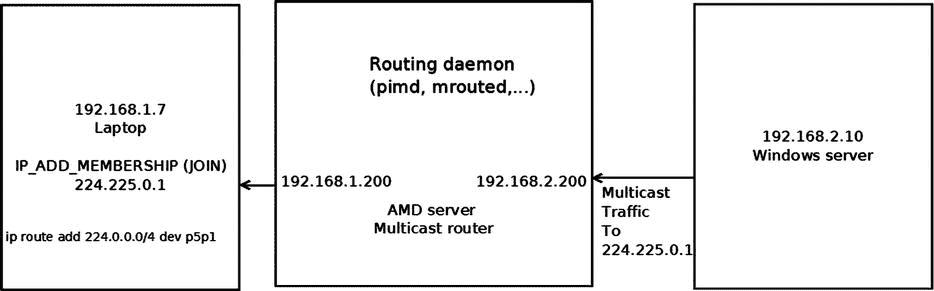
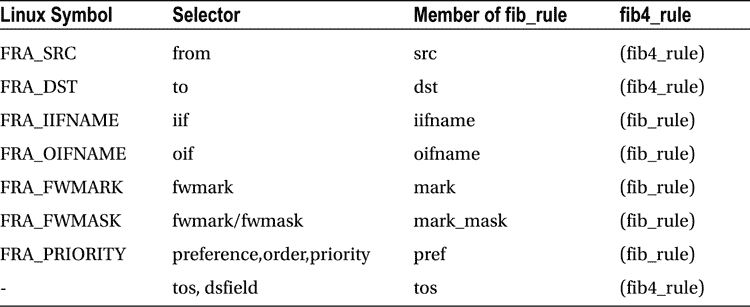

第六章


高级路由

第 5 章讲述了 IPv4 路由子系统。本章继续讲述路由子系统，并讨论高级 IPv4 路由主题，如多播路由、多路径路由、策略路由等。这本书讨论的是 Linux 内核网络实现——它没有深入研究用户空间多播路由守护进程实现的内部，这些实现非常复杂，超出了本书的范围。然而，我确实在某种程度上讨论了用户空间多播路由守护进程和内核中多播层之间的交互。我还简要讨论了互联网组管理协议(IGMP)协议，这是组播组成员管理的基础；添加和删除多播组成员是由 IGMP 协议完成的。要理解多播主机和多播路由器之间的交互，需要一些 IGMP 的基本知识。

多路径路由能够在一条路由中添加多个下一跳。策略路由支持配置不仅仅基于目的地址的路由策略。我从描述多播路由开始。

多播路由

[第 4 章](04.html)在“接收 IPv4 组播数据包”一节中简要提到了组播路由。我现在将更深入地讨论它。发送多播流量意味着向多个接收者发送相同的数据包。此功能在流媒体、音频/视频会议等方面非常有用。在节省网络带宽方面，它比单播流量有明显的优势。多播地址被定义为 D 类地址。该组的无类域间路由(CIDR)前缀是 224.0.0.0/4。IPv4 多播地址的范围是从 224.0.0.0 到 239.255.255.255。处理多播路由必须结合与内核交互的用户空间路由守护进程来完成。根据 Linux 实现，与单播路由相反，如果没有这个用户空间路由守护进程，多播路由不能仅由内核代码处理。有各种各样的多播守护进程:例如:`mrouted`，它基于距离矢量多播路由协议(DVMRP)的实现，或者`pimd`，它基于与协议无关的多播协议(PIM)。RFC 1075 中定义了 DVMRP 协议，它是第一个多播路由协议。它基于路由信息协议(RIP)协议。

PIM 协议有两个版本，，内核都支持(配置 _IP_PIMSM_V1 和配置 _IP_PIMSM_V2)。PIM 有四种不同的模式:PIM-SM (PIM 稀疏模式)、PIM-DM (PIM 密集模式)、PIM 源特定多播(PIM-SSM)和双向 PIM。该协议被称为*协议独立*，因为它不依赖于任何特定的路由协议进行拓扑发现。本节讨论用户空间守护进程和内核多播路由层之间的交互。深入研究 PIM 协议或 DVMRP 协议(或任何其他多播路由协议)的内部已经超出了本书的范围。通常，多播路由查找基于源地址和目的地址。有一个“多播策略路由”内核特性，它与第 5 章中提到的单播策略路由内核特性类似，也将在本章中讨论。多播策略路由协议是使用策略路由 API 实现的(例如，它调用`fib_rules_lookup()`方法来执行查找，创建`fib_rules_ops`对象，并用`fib_rules_register()`方法注册它，等等)。使用多播策略路由，路由可以基于附加标准，如入口网络接口。此外，您可以使用多个多播路由表。为了使用多播策略路由，必须设置 IP_MROUTE_MULTIPLE_TABLES。

[图 6-1](#Fig1) 显示了一个简单的 IPv4 组播路由设置。拓扑结构非常简单:左边的笔记本电脑通过发送一个 IGMP 数据包(IP_ADD_MEMBERSHIP)加入一个组播组(224.225.0.1)。IGMP 协议将在下一节“IGMP 协议”中讨论中间的 AMD 服务器被配置为组播路由器，用户空间组播路由守护进程(如`pimd`或`mrouted`)在上面运行。右边的 Windows 服务器的 IP 地址为 192.168.2.10，它向 224.225.0.1 发送组播流量；该流量通过多播路由器转发到笔记本电脑。请注意，Windows 服务器本身没有加入 224.225.0.1 多播组。运行`ip route add 224.0.0.0/4 dev <networkDeviceName>`告诉内核通过指定的网络设备发送所有多播流量。



[图 6-1](#_Fig1) 。简单多播路由设置

下一节讨论 IGMP 协议，它用于管理多播组成员。

《IGMP 议定书》

IGMP 协议是 IPv4 多播不可分割的一部分。它必须在支持 IPv4 多播的每个节点上实现。在 IPv6 中，组播管理由 MLD(组播监听发现)协议处理，该协议使用 ICMPv6 消息，在第 8 章的[中讨论。使用 IGMP 协议，可以建立和管理多播组成员。IGMP 有三个版本:](08.html)

1.  *igmp v1(RFC 1112)**:*有两种类型的消息—主机成员报告和主机成员查询。当主机想要加入多播组时，它发送成员报告消息。多播路由器发送成员资格查询，以发现哪些主机多播组在其连接的本地网络上有成员。查询被发送到所有主机组地址(224.0.0.1，IGMP 所有主机)并携带 TTL 1，以便成员资格查询不会传播到 LAN 之外。
2.  *IGMPv2 (RFC 2236)**:* This is an extension of IGMPv1\. The IGMPv2 protocol adds three new messages:
    1.  成员资格查询(0x11):有两个子类型的成员资格查询消息:一般查询，用于了解哪些组在所连接的网络上具有成员，以及特定于组的查询，用于了解特定组在所连接的网络上是否具有任何成员。
    2.  版本 2 成员报告(0x16)。
    3.  离开组(0x17)。

     **注意** IGMPv2 也支持版本 1 成员报告消息，以向后兼容 IGMPv1。参见 RFC 2236 第 2.1 节。

3.  *IGMPv3 (RFC 3376，由 RFC 4604 更新)* *:* 此次协议重大修订增加了一项名为源过滤的功能。这意味着当主机加入多播组时，它可以指定一组源地址，从这些地址接收多播流量。源过滤器也可以排除源地址。为了支持源过滤特性，socket API 被扩展；请参见 RFC 3678，“多播源过滤器的套接字接口扩展”我还应该提到，多播路由器定期(大约每两分钟)向所有主机多播组地址 224.0.0.1 发送成员查询。接收成员资格查询的主机用成员资格报告来响应。这是在内核中由`igmp_rcv()`方法实现的:获取 IGMP _ 主机 _ 成员资格 _ 查询消息由`igmp_heard_query()`方法处理。

 **注**IP v4 IGMP 的内核实现在`net/core/igmp.c`、`include/linux/igmp.h`、`include/uapi/linux/igmp.h`。

下一节研究 IPv4 多播路由的基本数据结构、多播路由表及其 Linux 实现。

多播路由表

多播路由表由名为`mr_table`的结构表示。我们来看看:

```sh
struct mr_table {
    struct list_head     list;
#ifdef CONFIG_NET_NS
    struct net           *net;
#endif
    u32                  id;
    struct sock __rcu    *mroute_sk;
    struct timer_list    ipmr_expire_timer;
    struct list_head     mfc_unres_queue;
    struct list_head     mfc_cache_array[MFC_LINES];
    struct vif_device    vif_table[MAXVIFS];
    . . .
};
```

```sh
(net/ipv4/ipmr.c)
```

以下是对`mr_table`结构中一些成员的描述:

*   `net`:组播路由表关联的网络名称空间；默认情况下，它是初始网络名称空间`init_net`。网络名称空间在[第 14 章](14.html)中讨论。
*   `id`:组播路由表 id；当使用单个表时，它是 RT_TABLE_DEFAULT (253)。
*   `mroute_sk` :这个指针代表内核保存的用户空间套接字的引用。通过使用`MRT_INIT`套接字选项从用户空间调用`setsockopt()`来初始化`mroute_sk`指针，并通过使用 MRT_DONE 套接字选项调用`setsockopt()`来使其无效。用户空间和内核之间的交互是基于调用`setsockopt()`方法、从用户空间发送 IOCTLs、构建 IGMP 包并通过从内核调用`sock_queue_rcv_skb()`方法将它们传递给多播路由守护进程。
*   `ipmr_expire_timer`:清理未解析组播路由条目的定时器。这个定时器在用`ipmr_new_table()`方法创建组播路由表时被初始化，在用`ipmr_free_table()`方法删除组播路由表时被删除。
*   `mfc_unres_queue`:未解析的路由条目队列。
*   `mfc_cache_array`:一个路由条目的缓存，有 64 个(MFC_LINES)条目，将在下一节中简要讨论。
*   `vif_table[MAXVIFS]`:32 个(MAXVIFS) `vif_device`对象的数组。通过`vif_add()`方法添加条目，通过`vif_delete()`方法删除条目。`vif_device`结构代表一个虚拟组播路由网络接口；它可以基于物理设备或 IPIP (IP over IP)隧道。`vif_device`结构将在后面的“Vif 装置”章节中讨论。

我已经介绍了组播路由表，提到了它的重要成员，比如组播转发缓存(MFC) 和未解析路由条目的队列。接下来我将看看 MFC，它嵌入在多播路由表对象中，在多播路由中起着重要的作用。

组播转发缓存(MFC)

多播路由表中最重要的数据结构是 MFC，它实际上是缓存条目(`mfc_cache`对象)的数组。这个名为`mfc_cache_array`的数组嵌入在组播路由表(`mr_table`)对象中。它有 64 个(MFC_LINES)元素。这个数组的索引是散列值(散列函数接受两个参数—多播组地址和源 IP 地址；请参见本章末尾“快速参考”一节中对 MFC_HASH 宏的描述)。

通常只有一个多播路由表，它是`mr_table`结构的一个实例，对它的引用保存在 IPv4 网络名称空间(`net->ipv4.mrt`)中。该表是由`ipmr_rules_init()`方法创建的，该方法还指定`net->ipv4.mrt`指向创建的组播路由表。当使用前面提到的多播策略路由功能时，可以有多个多播策略路由表。在这两种情况下，你用同样的方法得到路由表，`ipmr_fib_lookup()`。`ipmr_fib_lookup()`方法获得三个参数作为输入:网络名称空间、流和指向它应该填充的`mr_table`对象的指针。正常情况下，它只是将指定的`mr_table`指针设置为`net->ipv4.mrt`；当处理多个表时(设置了 IP_MROUTE_MULTIPLE_TABLES)，实现更加复杂。让我们来看看`mfc_cache`的结构:

```sh
struct mfc_cache {
    struct list_head list;
    __be32 mfc_mcastgrp;
    __be32 mfc_origin;
    vifi_t mfc_parent;
    int mfc_flags;
    union {
            struct {
                    unsigned long expires;
                    struct sk_buff_head unresolved; /* Unresolved buffers */
            } unres;
            struct {
                    unsigned long last_assert;
                    int minvif;
                    int maxvif;
                    unsigned long bytes;
                    unsigned long pkt;
                    unsigned long wrong_if;
                    unsigned char ttls[MAXVIFS];    /* TTL thresholds */
            } res;
    } mfc_un;
    struct rcu_head rcu;
 };
```

```sh
(include/linux/mroute.h)
```

以下是对`mfc_cache`结构中一些成员的描述:

*   `mfc_mcastgrp`:该条目所属组播组的地址。
*   `mfc_origin`:路由的源地址。
*   `mfc_parent`:源接口。
*   `mfc_flags`:条目的标志。可以有下列值之一:

*   MFC_STATIC:当路由是静态添加的，而不是由多播路由守护进程添加的。
*   MFC_NOTIFY:路由条目的 RTM_F_NOTIFY 标志设置的时间。更多细节见`rt_fill_info()`方法和`ipmr_get_route()`方法。

*   `mfc_un`联合由两部分组成:

*   `unres`:未解析的缓存条目。
*   `res`:解析的缓存条目。

某个流的 SKB 第一次到达内核时，它被添加到未解析条目的队列中(`mfc_un.unres.unresolved`)，其中最多可以保存三个 skb。如果队列中有三个 skb，那么数据包不会被添加到队列中，而是被释放，`ipmr_cache_unresolved()`方法返回-ENOBUFS("没有可用的缓冲区空间"):

```sh
static int ipmr_cache_unresolved(struct mr_table *mrt, vifi_t vifi, struct sk_buff *skb)
{
         . . .
         if (c->mfc_un.unres.unresolved.qlen > 3) {
                 kfree_skb(skb);
                 err = -ENOBUFS;
        } else {
            . . .

}
```

```sh
(net/ipv4/ipmr.c)
```

本节描述了 MFC 及其重要成员，包括已解析条目队列和未解析条目队列。下一节将简要描述什么是多播路由器，以及它在 Linux 中是如何配置的。

多播路由器

为了将机器配置为多播路由器，您应该设置 CONFIG_IP_MROUTE 内核配置选项。您还应该运行一些路由守护进程，如前面提到的`pimd`或`mrouted`。这些路由守护进程创建一个套接字来与内核通信。例如，在`pimd`中，您通过调用`socket(AF_INET, SOCK_RAW, IPPROTO_IGMP)`创建一个原始的 IGMP 套接字。在这个套接字上调用`setsockopt()`会触发向内核发送命令，这些命令由`ip_mroute_setsockopt()`方法处理。当使用 MRT_INIT 从路由守护进程调用这个套接字上的`setsockopt()`时，内核被设置为在所使用的`mr_table`对象的`mroute_sk`字段中保存对用户空间套接字的引用，并且通过调用 IPV4_DEVCONF_ALL(net，MC_FORWARDING)++来设置`mc_forwarding procfs`条目(`/proc/sys/net/ipv4/conf/all/mc_forwarding`)。注意，`mc_forwarding procfs`条目是一个只读条目，不能从用户空间设置。您不能创建多播路由守护进程的另一个实例:当处理 MRT_INIT 选项时，`ip_mroute_setsockopt()`方法检查`mr_table`对象的`mroute_sk`字段是否已初始化，如果是，则返回-EADDRINUSE。添加网络接口是通过在这个套接字上用 MRT_ADD_VIF 调用`setsockopt()`完成的，删除网络接口是通过在这个套接字上用 MRT_DEL_VIF 调用`setsockopt()`完成的。您可以通过传递一个`vifctl`对象作为`setsockopt()`系统调用的`optval`参数，将网络接口的参数传递给这些`setsockopt()`调用。让我们来看看`vifctl`的结构:

```sh
struct vifctl {
    vifi_t    vifc_vifi;                /* Index of VIF */
    unsigned char vifc_flags;            /* VIFF_ flags */
    unsigned char vifc_threshold;        /* ttl limit */
    unsigned int vifc_rate_limit;        /* Rate limiter values (NI) */
    union {
        struct in_addr vifc_lcl_addr;     /* Local interface address */
        int            vifc_lcl_ifindex;  /* Local interface index   */
    };
    struct in_addr vifc_rmt_addr;    /* IPIP tunnel addr */
};
```

```sh
(include/uapi/linux/mroute.h)
```

以下是对`vifctl`结构中一些成员的描述:

*   `vifc_flags`可以是:

*   当你想使用 IPIP 隧道时。
*   VIFF_REGISTER:当你想注册接口的时候。
*   VIFF_USE_IFINDEX:当你想使用本地接口索引而不是本地接口 IP 地址时；在这种情况下，您将把`vifc_lcl_ifindex`设置为本地接口索引。VIFF_USE_IFINDEX 标志适用于 2.6.33 及更高版本的内核。

*   `vifc_lcl_addr:`本地接口 IP 地址。(这是默认设置，不应该为使用它设置任何标志)。
*   `vifc_lcl_ifindex:`本地接口索引。当`vifc_flags`中的 VIFF_USE_IFINDEX 标志置位时，应置位该位。
*   `vifc_rmt_addr:`隧道的远程节点的地址。

当多播路由守护进程关闭时，使用 MRT_DONE 选项调用`setsockopt()`方法 。这将触发调用`mrtsock_destruct()`方法来使所使用的`mr_table`对象的`mroute_sk`字段无效，并执行各种清理。

本节讲述了什么是多播路由器，以及在 Linux 中如何配置它。我还检查了`vifctl`结构。接下来，我看一下 Vif 设备，它代表一个多播网络接口。

Vif 设备

多播路由支持两种模式:直接多播和封装在隧道上的单播包中的多播。在这两种情况下，使用相同的对象(`vif_device`结构的一个实例)来表示网络接口。在隧道上工作时，将设置 VIFF_TUNNEL 标志。添加和删除多播接口分别由`vif_add()`方法和`vif_delete()`方法完成。`vif_add()`方法还通过调用`dev_set_allmulti(dev, 1)`方法将设备设置为支持组播，该方法递增指定网络设备(`net_device`对象)的`allmulti`计数器。`vif_delete()`方法调用`dev_set_allmulti(dev, -1)`来递减指定网络设备的`allmulti`计数器(`net_device`对象)。关于`dev_set_allmulti()`方法的更多细节，参见[附录 A](16.html) 。我们来看看`vif_device`的结构；它的成员是不言自明的:

```sh
struct vif_device {
        struct net_device       *dev;       /* Device we are using */
        unsigned long   bytes_in,bytes_out;
        unsigned long   pkt_in,pkt_out;     /* Statistics                   */
        unsigned long   rate_limit;         /* Traffic shaping (NI)         */
        unsigned char   threshold;          /* TTL threshold                */
        unsigned short  flags;              /* Control flags                */
        __be32          local,remote;       /* Addresses(remote for tunnels)*/
        int             link;               /* Physical interface index     */
};
```

```sh
(include/linux/mroute.h)
```

为了接收多播流量，主机必须加入多播组。这是通过在用户空间中创建一个套接字，并使用 IPPROTO_IP 和 IP_ADD_MEMBERSHIP 套接字选项调用`setsockopt()`来完成的。用户空间应用程序还创建了一个`ip_mreq`对象，在这里它初始化请求参数，比如所需的组多播地址和主机的源 IP 地址(参见`netinet/in.h`用户空间头)。在`net/ipv4/igmp.c`中，`setsockopt()`调用由`ip_mc_join_group()`方法在内核中处理。最终，`ip_mc_join_group()`方法将组播地址添加到组播地址列表(`mc_list`)中，该列表是`in_device`对象的成员。主机可以通过使用 IPPROTO_IP 和 IP_DROP_MEMBERSHIP 套接字选项调用`setsockopt()`来离开多播组。这是在内核中由`net/ipv4/igmp.c`中的`ip_mc_leave_group()`方法处理的。单个套接字可以加入多达 20 个多播组(`sysctl_igmp_max_memberships`)。试图通过同一个套接字加入 20 个以上的多播组将会失败，并出现-ENOBUFS 错误(“没有可用的缓冲区空间”))参见`net/ipv4/igmp.c`中的`ip_mc_join_group()`方法实现。

IPv4 组播接收路径

[第 4 章](04.html)的“接收 IPv4 多播数据包”一节简要讨论了如何处理多播数据包。我现在将更深入地描述这一点。我的讨论假设我们的机器被配置为多播路由器；正如前面提到的，这意味着 CONFIG_IP_MROUTE 被设置，并且像`pimd`或`mrouted`这样的路由守护进程在这个主机上运行。多播数据包由`ip_route_input_mc()`方法处理，其中分配并初始化路由表条目(一个`rtable`对象)，并且在设置 CONFIG_IP_MROUTE 的情况下，将`dst`对象的`input`回调设置为`ip_mr_input()`。我们来看看`ip_mr_input()`的方法:

```sh
int ip_mr_input(struct sk_buff *skb)
{
        struct mfc_cache *cache;
        struct net *net = dev_net(skb->dev);
```

首先，如果数据包打算用于本地传送，则将`local`标志设置为`true`，因为`ip_mr_input()`方法也处理本地多播数据包。

```sh
int local = skb_rtable(skb)->rt_flags & RTCF_LOCAL;
struct mr_table *mrt;

/* Packet is looped back after forward, it should not be
* forwarded second time, but still can be delivered locally.
*/
if (IPCB(skb)->flags & IPSKB_FORWARDED)
goto dont_forward;
```

通常，当使用单个多播路由表时，`ipmr_rt_fib_lookup()`方法简单地返回`net->ipv4.mrt`对象:

```sh
mrt = ipmr_rt_fib_lookup(net, skb);
if (IS_ERR(mrt)) {
        kfree_skb(skb);
        return PTR_ERR(mrt);
}
if (!local) {
```

当发送加入或离开数据包时，IGMPv3 和一些 IGMPv2 实现在 IPv4 报头中设置路由器警报选项(IPOPT_RA)。参见`net/ipv4/igmp.c`中的`igmpv3_newpack()`方法:

```sh
if (IPCB(skb)->opt.router_alert) {
```

`ip_call_ra_chain()`方法 ( `net/ipv4/ip_input.c`)调用`raw_rcv()`方法将包传递给用户空间原始套接字，该套接字进行监听。`ip_ra_chain`对象包含对多播路由套接字的引用，该引用作为参数传递给`raw_rcv()`方法。更多细节，请看`net/ipv4/ip_input.c`中的`ip_call_ra_chain()`方法实现:

```sh
if (ip_call_ra_chain(skb))
        return 0;
```

存在未设置路由器警报选项的实现，如以下注释中所解释的；这些情况也必须通过直接调用`raw_rcv()`方法来处理:

```sh
} else if (ip_hdr(skb)->protocol == IPPROTO_IGMP) {
        /* IGMPv1 (and broken IGMPv2 implementations sort of
        * Cisco IOS <= 11.2(8)) do not put router alert
        * option to IGMP packets destined to routable
        * groups. It is very bad, because it means
        * that we can forward NO IGMP messages.
        */
        struct sock *mroute_sk;
```

`mrt->mroute_sk`套接字是组播路由用户空间应用程序创建的套接字内核中的一个副本:

```sh
mroute_sk = rcu_dereference(mrt->mroute_sk);
        if (mroute_sk) {
        nf_reset(skb);
        raw_rcv(mroute_sk, skb);
        return 0;
        }
     }
}
```

首先，通过调用`ipmr_cache_find()`方法在多播路由缓存`mfc_cache_array`中执行查找。哈希键是数据包的目的多播组地址和源 IP 地址，取自 IPv4 报头:

```sh
cache = ipmr_cache_find(mrt, ip_hdr(skb)->saddr, ip_hdr(skb)->daddr);
if (cache == NULL) {
```

在虚拟设备阵列中执行查找(`vif_table`)以查看是否存在与输入网络设备匹配的对应条目(`skb->dev`):

```sh
int vif = ipmr_find_vif(mrt, skb->dev);
```

`ipmr_cache_find_any()`方法处理多播代理支持的高级特性(本书不讨论):

```sh
        if (vif >= 0)
                cache = ipmr_cache_find_any(mrt, ip_hdr(skb)->daddr,
                                            vif);
}

/*
*      No usable cache entry
*/
if (cache == NULL) {
        int vif;
```

如果数据包的目的地是本地主机，则传送它:

```sh
if (local) {
        struct sk_buff *skb2 = skb_clone(skb, GFP_ATOMIC);
        ip_local_deliver(skb);
        if (skb2 == NULL)
                return -ENOBUFS;
        skb = skb2;
}

read_lock(&mrt_lock);
vif = ipmr_find_vif(mrt, skb->dev);
if (vif >= 0) {
```

`ipmr_cache_unresolved()`方法通过调用`ipmr_cache_alloc_unres()`方法创建一个多播路由条目(`mfc_cache`对象)。该方法创建一个缓存条目(`mfc_cache`对象)，并初始化其到期时间间隔(通过设置`mfc_un.unres.expires`)。让我们来看看这个非常短的方法，`ipmr_cache_alloc_unres()` :

```sh
static struct mfc_cache *ipmr_cache_alloc_unres(void)
{
    struct mfc_cache *c = kmem_cache_zalloc(mrt_cachep, GFP_ATOMIC);

    if (c) {
        skb_queue_head_init(&c->mfc_un.unres.unresolved);
```

设置到期时间间隔:

```sh
        c->mfc_un.unres.expires = jiffies + 10*HZ;
    }
    return c;
}
```

如果路由守护程序未在其到期时间间隔内解析路由条目，则该条目将从未解析条目的队列中删除。当创建多播路由表时(通过`ipmr_new_table()`方法)，其定时器(`ipmr_expire_timer`)被设置。这个定时器周期性地调用`ipmr_expire_process()`方法。`ipmr_expire_process()`方法遍历未解析条目队列中的所有未解析缓存条目(`mrtable`对象的`mfc_unres_queue`，并移除过期的未解析缓存条目。

在创建了未解析的高速缓存条目之后，`ipmr_cache_unresolved()`方法将其添加到未解析条目的队列中(多播表的`mfc_unres_queue`，`mrtable`，并且将未解析队列长度加 1(多播表的`cache_resolve_queue_len`，`mrtable`)。它还调用`ipmr_cache_report()`方法，该方法构建 IGMP 消息(IGMPMSG_NOCACHE ),并通过最终调用`sock_queue_rcv_skb()`方法将其交付给用户空间多播路由守护进程。

我提到过用户空间路由守护进程应该在某个时间间隔内解析路由。我不会深究这是如何在用户空间中实现的。但是，请注意，一旦路由守护程序决定它应该解析一个未解析的条目，它就构建缓存条目参数(在一个`mfcctl`对象中)并使用 MRT_ADD_MFC 套接字选项调用`setsockopt()`，然后它传递嵌入在`setsockopt()`系统调用的`optval`参数中的`mfcctl`对象；这在内核中由`ipmr_mfc_add()`方法处理:

```sh
                int err2 = ipmr_cache_unresolved(mrt, vif, skb);
                read_unlock(&mrt_lock);

                return err2;
        }
        read_unlock(&mrt_lock);
        kfree_skb(skb);
        return -ENODEV;
}

read_lock(&mrt_lock);
```

如果在 MFC 中找到缓存条目，调用`ip_mr_forward()`方法继续包遍历:

```sh
        ip_mr_forward(net, mrt, skb, cache, local);
        read_unlock(&mrt_lock);

        if (local)
                return ip_local_deliver(skb);

        return 0;

dont_forward:
        if (local)
                return ip_local_deliver(skb);
        kfree_skb(skb);
        return 0;
}
```

本节详细介绍了 IPv4 多播接收路径以及与该路径中的路由守护程序的交互。下一节描述多播路由转发方法，`ip_mr_forward()`。

ip_mr_forward()方法

我们来看看`ip_mr_forward()`的方法:

```sh
static int ip_mr_forward(struct net *net, struct mr_table *mrt,
             struct sk_buff *skb, struct mfc_cache *cache,
             int local)
{
    int psend = -1;
    int vif, ct;
    int true_vifi = ipmr_find_vif(mrt, skb->dev);

    vif = cache->mfc_parent;
```

在这里，您可以看到已解析的缓存对象(`mfc_un.res`)的更新统计信息:

```sh
cache->mfc_un.res.pkt++;
cache->mfc_un.res.bytes += skb->len;

if (cache->mfc_origin == htonl(INADDR_ANY) && true_vifi >= 0) {
    struct mfc_cache *cache_proxy;
```

表达式`(*, G)`表示从任何源发送到组 G 的业务:

```sh
    /* For an (*,G) entry, we only check that the incomming
    * interface is part of the static tree.
    */
    cache_proxy = ipmr_cache_find_any_parent(mrt, vif);
    if (cache_proxy &&
        cache_proxy->mfc_un.res.ttls[true_vifi] < 255)
        goto forward;
}
/*
* Wrong interface: drop packet and (maybe) send PIM assert.
*/
if (mrt->vif_table[vif].dev != skb->dev) {
    if (rt_is_output_route(skb_rtable(skb))) {
        /* It is our own packet, looped back.
         * Very complicated situation...
         *
         * The best workaround until routing daemons will be
         * fixed is not to redistribute packet, if it was
         * send through wrong interface. It means, that
         * multicast applications WILL NOT work for
         * (S,G), which have default multicast route pointing
         * to wrong oif. In any case, it is not a good
         * idea to use multicasting applications on router.
         */
        goto dont_forward;
    }

    cache->mfc_un.res.wrong_if++;

    if (true_vifi >= 0 && mrt->mroute_do_assert &&
        /* pimsm uses asserts, when switching from RPT to SPT,
         * so that we cannot check that packet arrived on an oif.
         * It is bad, but otherwise we would need to move pretty
         * large chunk of pimd to kernel. Ough... --ANK
         */
        (mrt->mroute_do_pim ||
        cache->mfc_un.res.ttls[true_vifi] < 255) &&
        time_after(jiffies,
               cache->mfc_un.res.last_assert + MFC_ASSERT_THRESH)) {
        cache->mfc_un.res.last_assert = jiffies;
```

调用`ipmr_cache_report()`方法构建 IGMP 消息(IGMPMSG_WRONGVIF ),并通过调用`sock_queue_rcv_skb()`方法将其交付给用户空间多播路由守护进程:

```sh
        ipmr_cache_report(mrt, skb, true_vifi, IGMPMSG_WRONGVIF);
    }
    goto dont_forward;
}
```

该帧现在可以转发了:

```sh
forward:
    mrt->vif_table[vif].pkt_in++;
    mrt->vif_table[vif].bytes_in += skb->len;

    /*
     *    Forward the frame
     */
    if (cache->mfc_origin == htonl(INADDR_ANY) &&
        cache->mfc_mcastgrp == htonl(INADDR_ANY)) {
        if (true_vifi >= 0 &&
            true_vifi != cache->mfc_parent &&
            ip_hdr(skb)->ttl >
                cache->mfc_un.res.ttls[cache->mfc_parent]) {
            /* It's an (*,*) entry and the packet is not coming from
             * the upstream: forward the packet to the upstream
             * only.
             */
            psend = cache->mfc_parent;
            goto last_forward;
        }
        goto dont_forward;
    }
    for (ct = cache->mfc_un.res.maxvif - 1;
         ct >= cache->mfc_un.res.minvif; ct--) {
        /* For (*,G) entry, don't forward to the incoming interface */
        if ((cache->mfc_origin != htonl(INADDR_ANY) ||
             ct != true_vifi) &&
            ip_hdr(skb)->ttl > cache->mfc_un.res.ttls[ct]) {
            if (psend != -1) {
                struct sk_buff *skb2 = skb_clone(skb, GFP_ATOMIC);
```

调用`ipmr_queue_xmit()`方法继续转发数据包:

```sh
                if (skb2)
                    ipmr_queue_xmit(net, mrt, skb2, cache,
                            psend);
            }
            psend = ct;
        }
    }
last_forward:
    if (psend != -1) {
        if (local) {
            struct sk_buff *skb2 = skb_clone(skb, GFP_ATOMIC);

            if (skb2)
                ipmr_queue_xmit(net, mrt, skb2, cache, psend);
        } else {
            ipmr_queue_xmit(net, mrt, skb, cache, psend);
            return 0;
        }
    }

dont_forward:
    if (!local)
        kfree_skb(skb);
    return 0;
}
```

既然我已经介绍了多播路由转发方法`ip_mr_forward()`，那么是时候检查一下`ipmr_queue_xmit()`方法了。

ipmr_queue_xmit()方法

我们来看看`ipmr_queue_xmit()`的方法:

```sh
static void ipmr_queue_xmit(struct net *net, struct mr_table *mrt,
                            struct sk_buff *skb, struct mfc_cache *c, int vifi)
{
        const struct iphdr *iph = ip_hdr(skb);
        struct vif_device *vif = &mrt->vif_table[vifi];
        struct net_device *dev;
        struct rtable *rt;
        struct flowi4 fl4;
```

使用隧道时使用`encap`字段:

```sh
        int encap = 0;

        if (vif->dev == NULL)
                goto out_free;

#ifdef CONFIG_IP_PIMSM
        if (vif->flags & VIFF_REGISTER) {
                vif->pkt_out++;
                vif->bytes_out += skb->len;
                vif->dev->stats.tx_bytes += skb->len;
                vif->dev->stats.tx_packets++;
                ipmr_cache_report(mrt, skb, vifi, IGMPMSG_WHOLEPKT);
                goto out_free;
        }
#endif
```

使用隧道时，使用分别代表目的地址和本地地址的`vif->remote`和`vif->local`进行路由查找。这些地址是隧道的端点。当使用代表物理设备的`vif_device`对象时，使用 IPv4 报头的目的地和作为源地址的 0 来执行路由查找:

```sh
if (vif->flags & VIFF_TUNNEL) {
        rt = ip_route_output_ports(net, &fl4, NULL,
                                   vif->remote, vif->local,
                                   0, 0,
                                   IPPROTO_IPIP,
                                   RT_TOS(iph->tos), vif->link);
        if (IS_ERR(rt))
                goto out_free;
        encap = sizeof(struct iphdr);
} else {
       rt = ip_route_output_ports(net, &fl4, NULL, iph->daddr, 0,
                                  0, 0,
                                  IPPROTO_IPIP,
                                  RT_TOS(iph->tos), vif->link);
       if (IS_ERR(rt))
               goto out_free;
}

dev = rt->dst.dev;
```

注意，如果分组大小高于 MTU，则不发送 ICMPv4 消息(如在单播转发的这种情况下所做的)；只有统计数据被更新，数据包被丢弃:

```sh
if (skb->len+encap > dst_mtu(&rt->dst) && (ntohs(iph->frag_off) & IP_DF)) {
        /* Do not fragment multicasts. Alas, IPv4 does not
         * allow to send ICMP, so that packets will disappear
         * to blackhole.
         */

        IP_INC_STATS_BH(dev_net(dev), IPSTATS_MIB_FRAGFAILS);
        ip_rt_put(rt);
        goto out_free;
}

encap += LL_RESERVED_SPACE(dev) + rt->dst.header_len;

if (skb_cow(skb, encap)) {
        ip_rt_put(rt);
        goto out_free;
}

vif->pkt_out++;
vif->bytes_out += skb->len;

skb_dst_drop(skb);
skb_dst_set(skb, &rt->dst);
```

TTL 减小，转发数据包时重新计算 IPv4 报头校验和(因为 TTL 是 IPv4 字段之一)；单播数据包的`ip_forward()`方法也是如此:

```sh
ip_decrease_ttl(ip_hdr(skb));

/* FIXME: forward and output firewalls used to be called here.
 * What do we do with netfilter? -- RR
 */
if (vif->flags & VIFF_TUNNEL) {
        ip_encap(skb, vif->local, vif->remote);
        /* FIXME: extra output firewall step used to be here. --RR */
        vif->dev->stats.tx_packets++;
        vif->dev->stats.tx_bytes += skb->len;
}

IPCB(skb)->flags |= IPSKB_FORWARDED;

/*
* RFC1584 teaches, that DVMRP/PIM router must deliver packets locally
* not only before forwarding, but after forwarding on all output
* interfaces. It is clear, if mrouter runs a multicasting
* program, it should receive packets not depending to what interface
* program is joined.
* If we will not make it, the program will have to join on all
* interfaces. On the other hand, multihoming host (or router, but
* not mrouter) cannot join to more than one interface - it will
* result in receiving multiple packets.
 */
```

调用 NF_INET_FORWARD 钩子:

```sh
        NF_HOOK(NFPROTO_IPV4, NF_INET_FORWARD, skb, skb->dev, dev,
                ipmr_forward_finish);
        return;

out_free:
        kfree_skb(skb);
}

```

ipmr_forward_finish()方法

让我们来看看`ipmr_forward_finish()`方法，，这是一个非常简短的方法——它实际上与`ip_forward()`方法相同:

```sh
static inline int ipmr_forward_finish(struct sk_buff *skb)
{
        struct ip_options *opt = &(IPCB(skb)->opt);

        IP_INC_STATS_BH(dev_net(skb_dst(skb)->dev), IPSTATS_MIB_OUTFORWDATAGRAMS);
        IP_ADD_STATS_BH(dev_net(skb_dst(skb)->dev), IPSTATS_MIB_OUTOCTETS, skb->len);
```

处理 IPv4 选项，如果设置的话(见[第 4 章](04.html)):

```sh
        if (unlikely(opt->optlen))
                ip_forward_options(skb);

        return dst_output(skb);
}
```

最终，`dst_output()`通过调用`ip_finish_output()`方法的`ip_mc_output()`方法发送数据包(两个方法都在`net/ipv4/route.c`中)。

现在我已经介绍了这些多播方法，让我们更好地理解 TTL 字段的值是如何在多播流量中使用的。

多播流量中的 TTL

在讨论多播流量时，IPv4 报头的 TTL 字段具有双重含义。第一个与单播 IPV4 流量中的相同:TTL 表示一个跳计数器，在转发数据包的每个设备上该计数器减 1。当它达到 0 时，数据包被丢弃。这样做是为了避免由于某些错误而导致数据包的无休止传输。TTL 的第二个含义是阈值，这是多播流量所特有的。TTL 值分为几个范围。路由器的每个接口都有一个 TTL 阈值，只有 TTL 大于接口阈值的数据包才会被转发。以下是这些阈值的值:

*   *0:* 限于同一主机(不能通过任何接口发出)
*   *1:* 限制在同一个子网(不会被路由器转发)
*   *32:* 限制在同一个地点
*   64: 局限于同一地区
*   *128:* 限于同一个大陆
*   范围不受限制(全局)

参见史蒂夫·迪林的“4.3BSD UNIX 和相关系统的 IP 多播扩展”，可在`www.kohala.com/start/mcast.api.txt`获得。

 **注** IPv4 组播路由在`net/ipv4/ipmr.c`、`include/linux/mroute.h`、`include/uapi/linux/mroute.h`实现。

我对多播路由的讨论到此结束。本章现在转到策略路由，使您能够配置不仅仅基于目的地址的路由策略。

策略路由

使用策略路由， 一个系统管理员最多可以定义 255 个路由表。本节讨论 IPv4 策略路由；IPv6 策略路由在[第 8 章](08.html)中讨论。在本节中，我使用术语*策略*或*规则*来表示由策略路由创建的条目，以避免将普通路由条目(在[第 5 章](05.html)中讨论)与策略规则混淆。

策略路由管理

策略路由管理是通过`iproute2`包的`ip rule`命令完成的(策略路由管理不能与`route`命令并行)。让我们看看如何添加、删除和转储所有策略路由规则:

*   你用`ip rule add`命令添加一条规则；比如:`ip rule add tos 0x04 table 252`。插入此规则后，将根据表 252 的路由规则处理 IPv4 TOS 字段匹配 0x04 的每个数据包。在添加路由时，您可以通过指定表的编号将路由条目添加到这个表中；例如:`ip route add default via 192.168.2.10 table 252`。这个命令在内核中由`net/core/fib_rules.c`中的`fib_nl_newrule()`方法处理。先前`ip rule`命令中的`tos`修饰符是`ip rule`命令可用的选择器修饰符之一；参见`man 8 ip rule`，以及本章末尾“快速参考”部分的[表 6-1](#Tab1) 。
*   使用`ip rule del`命令删除一个规则；比如:`ip rule del tos 0x04 table 252`。这个命令在内核中由`net/core/fib_rules.c`中的`fib_nl_delrule()`方法处理。
*   使用`ip rule list`命令或`ip rule show`命令转储所有规则。这两个命令都在内核中由`net/core/fib_rules.c`中的`fib_nl_dumprule()`方法处理。

现在，您已经对策略路由管理的基础有了很好的了解，所以让我们研究一下策略路由的 Linux 实现。

策略路由实现

策略路由的核心基础设施是`fib_rules`模块、 `net/core/fib_rules.c`。它由内核网络堆栈的三个协议使用:IPv4(包括多播模块，它具有多播策略路由功能，如本章前面的“多播路由”一节所述)、IPv6 和 DECnet。IPv4 策略路由也在名为`fib_rules.c`的文件中实现。不要被相同的名字(`net/ipv4/fib_rules.c`)迷惑。在 IPv6 中，策略路由在`net/ipv6/fib6_rules.c`中实现。头文件`include/net/fib_rules.h`包含策略路由核心的数据结构和方法。下面是`fib4_rule`结构的定义，它是 IPv4 策略路由的基础:

```sh
struct fib4_rule {
    struct fib_rule    common;
    u8            dst_len;
    u8            src_len;
    u8            tos;
    __be32            src;
    __be32            srcmask;
    __be32            dst;
    __be32            dstmask;
#ifdef CONFIG_IP_ROUTE_CLASSID
    u32            tclassid;
#endif
};
```

```sh
(net/ipv4/fib_rules.c)
```

缺省情况下，在引导时通过调用`fib_default_rules_init()`方法创建三个策略: 本地(RT_TABLE_LOCAL)表、主(RT_TABLE_MAIN)表和缺省(RT_TABLE_DEFAULT)表。查找是通过`fib_lookup()`方法完成的。注意在`include/net/ip_fib.h`中有两种不同的`fib_lookup()`方法的实现。第一个封装在`#ifndef` CONFIG_IP_MULTIPLE_TABLES 块中，用于非策略路由，第二个用于策略路由。使用策略路由时，查找是这样执行的:如果初始策略路由规则没有变化(`net->ipv4.fib_has_custom_rules`未设置)，这意味着规则必须在三个初始路由表之一中。因此，首先在本地表中进行查找，然后在主表中查找，最后在默认表中查找。如果没有相应的条目，则返回网络不可达(-ENETUNREACH)错误。如果在初始策略路由规则中有一些变化(`net->ipv4.fib_has_custom_rules`被设置)，那么 _ `fib_lookup()`方法 被调用，这是一个更重的方法，因为它遍历规则列表并为每个规则调用`fib_rule_match()`以决定它是否匹配。参见`net/core/fib_rules.c`中`fib_rules_lookup()`方法的实现。(从`__fib_lookup()`方法调用`fib_rules_lookup()`方法)。这里我应该提到的是，`net->ipv4.fib_has_custom_rules`变量在初始化阶段由`fib4_rules_init()`方法设置为`false`，在`fib4_rule_configure()`方法和`fib4_rule_delete()`方法中设置为`true`。请注意，应该设置 CONFIG_IP_MULTIPLE_TABLES 来使用策略路由。

我的多播路由讨论到此结束。下一节将讨论多路径路由，即在一条路由中添加多个下一跳的能力。

多路径路由

多路径路由 提供了向路由添加多个下一跳的能力。定义两个 nexthop 节点可以这样做，比如:`ip route add default scope global nexthop dev eth0 nexthop dev eth1`。系统管理员还可以为每个下一跳分配权重，例如:`ip route add 192.168.1.10 nexthop via 192.168.2.1 weight 3 nexthop via 192.168.2.10 weight 5`。`fib_info`结构表示一个 IPv4 路由条目，它可以有多个 FIB 下一跳。`fib_info`对象的`fib_nhs`成员代表 FIB nexthop 对象的数量；`fib_info`对象包含一个名为`fib_nh`的 FIB nexthop 对象数组。所以在这种情况下，创建了一个单独的`fib_info`对象，带有两个 FIB nexthop 对象的数组。内核将每个下一跳的权重保存在 FIB nexthop 对象的`nh_weight`字段中(`fib_nh`)。如果在添加多路径路径时未指定权重，则在`fib_create_info()`方法中，权重默认设置为 1。使用多路径路由时，调用`fib_select_multipath()`方法来确定下一跳。该方法从两个地方调用:Tx 路径中的`__ip_route_output_key()`方法和 Rx 路径中的`ip_mkroute_input()`方法。注意，当在流程中设置输出设备时，不会调用`fib_select_multipath()`方法，因为输出设备是已知的:

```sh
struct rtable *__ip_route_output_key(struct net *net, struct flowi4 *fl4) {
. . .
#ifdef CONFIG_IP_ROUTE_MULTIPATH
    if (res.fi->fib_nhs > 1 && fl4->flowi4_oif == 0)
        fib_select_multipath(&res);
    else
#endif
. . .

}
```

在 Rx 路径中，不需要检查`fl4->flowi4_oif`是否为 0，因为它在该方法的开始被设置为 0。`fib_select_multipath()`方法的细节我就不深究了。我只想提一下，这种使用`jiffies`的方法有一定的随机性，有助于创建公平的加权路由分布，并且每个下一跳的权重都被考虑在内。通过设置指定`fib_result`对象的 FIB nexthop 选择器(`nh_sel`)来分配要使用的 FIB nexthop。与由专用模块(`net/ipv4/ipmr.c`)处理的多播路由相反，多路径路由的代码分散在现有的路由代码中，包含在`#ifdef` CONFIG_IP_ROUTE_MULTIPATH 条件中，并且没有在源代码中添加单独的模块来支持它。在[第五章](05.html)中提到，曾经有对 IPv4 多路径路由缓存的支持，但是在 2007 年的内核 2.6.23 中被移除了；事实上，它从未很好地工作过，也从未脱离过实验状态。不要将多路径路由缓存的删除与路由缓存的删除相混淆；这是两个不同的缓存。路由缓存的移除发生在五年后的内核 3.6 (2012)中。

 **注意**多路径路由支持需要设置 CONFIG_IP_ROUTE_MULTIPATH。

摘要

本章讲述了高级 IPv4 路由主题，如组播路由、IGMP 协议、策略路由和多路径路由。您了解了多播路由的基本结构，比如多播表(`mr_table)`)、多播转发缓存(MFC)、Vif 设备等等。您还了解了如何将主机设置为多播路由器，以及如何在多播路由中使用`ttl`字段。[第 7 章](07.html)处理 Linux 邻居子系统。接下来的“快速参考”部分涵盖了与本章讨论的主题相关的主要方法，按其上下文排序。

快速参考

我用一个重要路由子系统方法的简短列表(其中一些在本章中提到过)、一个宏列表和`procfs`多播条目和表来结束本章。

方法

让我们从方法开始:

int IP _ mrroute _ setsockopt(struct sock * sk，int optname，char __user *optval，signed int opt len)；

这个方法处理来自多播路由守护进程的`setsockopt()`调用。支持的套接字选项有:MRT_INIT、MRT_DONE、MRT_ADD_VIF、MRT_DEL_VIF、MRT_ADD_MFC、MRT_DEL_MFC、MRT_ADD_MFC_PROXY、MRT_DEL_MFC_PROXY、MRT_ASSERT、MRT_PIM(设置 PIM 支持时)和 MRT_TABLE(设置多播策略路由时)。

int IP _ mrroute _ getsockopt(struct sock * sk、int optname、char __user *optval、int _ _ user * opt len)；

这个方法处理来自多播路由守护进程的`getsockopt()`调用。支持的套接字选项有 MRT_VERSION、MRT_ASSERT 和 MRT_PIM。

struct Mr _ table * ipmr _ new _ table(struct net * net，u32 id)；

此方法创建一个新的多播路由表。表格的`id`将是指定的`id.`

void ipmr _ free _ table(struct Mr _ table * mrt)；

这个方法释放指定的多播路由表和附属于它的资源。

int IP _ MC _ join _ group(struct sock * sk，struct IP _ Mr eqn * IMR)；

此方法用于加入多播组。要加入的多播组的地址在给定的`ip_mreqn`对象中指定。如果成功，该方法返回 0。

静态 struct MFC _ cache * ipmr _ cache _ find(struct Mr _ table * mrt，__be32 origin，_ _ be32 mcastgrp)；

此方法在 IPv4 多播路由缓存中执行查找。当没有找到条目时，它返回 NULL。

bool IP v4 _ is _ multicast(_ _ be32 addr)；

如果地址是组播地址，这个方法返回`true`。

int IP _ Mr _ input(struct sk _ buff * skb)；

该方法是主要的 IPv4 组播 Rx 方法(`net/ipv4/ipmr.c`)。

struct MFC _ cache * IPM _ cache _ alloc(请参阅)；

该方法分配多播转发高速缓存(`mfc_cache`)条目。

静态结构 MFC _ cache * ipmr _ cache _ alloc _ unres(void)；

该方法为未解析的高速缓存分配多播路由高速缓存(`mfc_cache`)条目，并设置未解析条目队列的`expires`字段。

void fib _ select _ multipath(struct fib _ result * RES)；

使用多路径路由时，调用此方法来确定下一跳。

int dev_set_allmulti(结构网络设备*dev，int Inc)；

该方法根据指定的增量(增量可以是正数，也可以是负数)递增/递减指定网络设备的`allmulti`计数器。

int igmp _ rcv(struct sk _ buf * skb)；

此方法是 IGMP 数据包的接收处理程序。

static int ipmr _ MFC _ add(struct net * net，struct mr_table *mrt，struct mfcctl *mfc，int mrtsock，int parent)；

此方法添加一个多播缓存条目；通过用 MRT_ADD_MFC 从用户空间调用`setsockopt()`来调用它。

static int ipmr _ MFC _ delete(struct Mr _ table * mrt，struct mfcctl *mfc，int parent)；

此方法删除多播缓存条目；通过用 MRT_DEL_MFC 从用户空间调用`setsockopt()`来调用它。

static int vif_add(struct net *net，struct mr_table *mrt，struct vifctl *vifc，int mrt sock)；

此方法添加一个多播虚拟接口；通过使用 MRT_ADD_VIF 从用户空间调用`setsockopt()`来调用它。

静态 int Vif _ delete(struct Mr _ table * mrt，int vifi，int notify，struct list _ head * head)；

此方法删除多播虚拟接口；通过使用 MRT_DEL_VIF 从用户空间调用`setsockopt()`来调用它。

静态 void ipmr_expire_process(无符号长整型 arg)；

此方法从未解析条目队列中移除过期条目。

static int ipmr _ cache _ report(struct Mr _ table * mrt，struct sk_buff *pkt，vifi_t vifi，int assert)；

该方法构建一个 IGMP 包，将 IGMP 报头中的类型设置为指定的`assert`值，并将代码设置为 0。通过调用`sock_queue_rcv_skb()`方法，这个 IGMP 包被传递给用户空间多播路由守护进程。当一个未解析的缓存条目被添加到未解析条目的队列中，并且想要通知用户空间路由守护进程它应该解析它时，可以给`assert`参数分配以下值之一:IGMPMSG_NOCACHE、IGMPMSG_WRONGVIF 和 IGMPMSG_WHOLEPKT。

static int ipmr _ device _ event(struct notifier _ block * this，unsigned long event，void * ptr)；

此方法是由`register_netdevice_notifier()`方法注册的通知程序回调；当某个网络设备未注册时，会生成一个 NETDEV_UNREGISTER 事件；这个回调接收这个事件并删除`vif_table`中的`vif_device`对象，其设备是未注册的设备。

静态 void mrt sock _ destruct(struct sock * sk)；

当用户空间路由守护进程用 MRT_DONE 调用`setsockopt()`时，这个方法被调用。这个方法使多播路由套接字(多播路由表的`mroute_sk`)无效，递减`mc_forwarding procfs`条目，并调用`mroute_clean_tables()`方法来释放资源。

宏指令

本节描述我们的宏。

MFC_HASH(a，b)

这个宏计算用于向 MFC 缓存添加条目的哈希值。它将组多播地址和源 IPv4 地址作为参数。

VIF_EXISTS(_mrt，_idx)

该宏检查`vif_table`中条目的存在；如果指定组播路由表(`mrt`)的组播虚拟设备(`vif_table`)的数组中有指定索引(`_idx`)的条目，则返回`true`。

Procfs 多播条目

以下是对两个重要的`procfs`多播条目的描述:

S7-1200 可编程控制器

列出所有多播虚拟接口；它显示多播虚拟设备表(`vif_table`)中的所有`vif_device`对象。显示`/proc/net/ip_mr_vif entry`由`ipmr_vif_seq_show()`方法处理。

/proc/net/ip_mr_cache

多播转发缓存(MFC)的状态。该条目显示了所有缓存条目的以下字段:组组播地址(`mfc_mcastgrp`)、源 IP 地址(`mfc_origin`)、输入接口索引(`mfc_parent`)、转发数据包(`mfc_un.res.pkt`)、转发字节(`mfc_un.res.bytes`)、错误接口索引(`mfc_un.res.wrong_if`)、转发接口索引(`vif_table`中的一个索引)以及该索引对应的`mfc_un.res.ttls`数组中的条目。显示`/proc/net/ip_mr_cache`条目由`ipmr_mfc_seq_show()`方法处理。

桌子

最后，在[表格 6-1](#Tab1) 中，是规则选择器的表格。

[表 6-1](#_Tab1) 。IP 规则选择器

