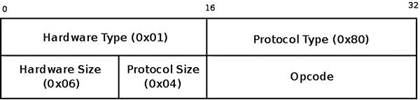

# 七、Linux 相邻子系统

本章讨论了 Linux 相邻子系统及其在 Linux 中的实现。相邻子系统负责发现同一链路上节点的存在，并负责将 L3(网络层)地址转换为 L2(链路层)地址。正如下一节所述，需要 L2 地址来构建外发数据包的 L2 报头。实现这种转换的协议在 IPv4 中称为地址解析协议(ARP ),在 IPv6 中称为邻居发现协议(ndISC 或 ND)。相邻子系统提供了用于执行 L3 到 L2 映射的独立于协议的基础设施。然而，本章的讨论仅限于最常见的情况，即 IPv4 和 IPv6 中相邻子系统的使用。请记住，ARP 协议就像在第 3 章中讨论的 ICMP 协议一样，容易受到安全威胁——例如 ARP 中毒攻击和 ARP 欺骗攻击(ARP 协议的安全方面超出了本书的范围)。

在这一章中，我首先讨论了常见的相邻数据结构和一些重要的 API 方法，它们在 IPv4 和 IPv6 中都有使用。然后讨论了 ARP 协议和 NDISC 协议的具体实现。您将看到邻居是如何创建和释放的，并且您将了解用户空间和相邻子系统之间的交互。您还将了解 ARP 请求和 ARP 回复、NDISC 邻居请求和 NDISC 邻居通告，以及 NDISC 协议用来避免重复 IPv6 地址的重复地址检测(DAD)机制。

相邻子系统核心

相邻子系统的用途是什么？当数据包通过 L2 层发送时，需要 L2 目的地址来构建 L2 报头。使用相邻子系统请求和请求回复，给定主机的 L3 地址(或者这种 L3 地址不存在的事实)，可以找出主机的 L2 地址。在最常用的链路层(L2)以太网中，主机的 L2 地址就是其 MAC 地址。在 IPv4 中，ARP 是相邻协议，请求请求和请求回复分别称为 ARP 请求和 ARP 回复。在 IPv6 中，邻居协议是 NDISC，请求请求和请求回复分别称为邻居请求和邻居通告，。

有些情况下，不需要相邻子系统的任何帮助就可以找到目的地址，例如发送广播时。在这种情况下，目的 L2 地址是固定的(例如，在以太网中是 FF:FF:FF:FF:FF:FF)。或者当目的地址是多播地址时，L3 多播地址与其 L2 地址之间存在固定的映射。我将在本章中讨论这种情况。

Linux 相邻子系统的基本数据结构是邻居。*邻居*代表连接到同一链路(L2)的网络节点。它由`neighbour`结构表示。这种表示对于特定的协议不是唯一的。然而，如上所述，`neighbour`结构的讨论将限于其在 IPv4 和 IPv6 协议中的使用。让我们看看`neighbour`的结构:

```sh
struct neighbour {
        struct neighbour __rcu  *next;
        struct neigh_table      *tbl;
        struct neigh_parms      *parms;
        unsigned long           confirmed;
        unsigned long           updated;
        rwlock_t                lock;
        atomic_t                refcnt;
        struct sk_buff_head     arp_queue;
        unsigned int            arp_queue_len_bytes;
        struct timer_list       timer;
        unsigned long           used;
        atomic_t                probes;
        __u8                    flags;
        __u8                    nud_state;
        __u8                    type;
        __u8                    dead;
        seqlock_t               ha_lock;
        unsigned char           ha[ALIGN(MAX_ADDR_LEN, sizeof(unsigned long))];
        struct hh_cache         hh;
        int                     (*output)(struct neighbour *, struct sk_buff *);
        const struct neigh_ops  *ops;
        struct rcu_head         rcu;
        struct net_device       *dev;
        u8                      primary_key[0];
};
```

```sh
(include/net/neighbour.h)
```

以下是对`neighbour`结构中一些重要成员的描述:

*   `next`:指向哈希表中同一桶上的下一个邻居的指针。
*   `tbl`:与该邻居关联的邻居表。
*   `parms`:与此`neighbour`关联的`neigh_parms`对象 。它由相关邻表的`constructor`方法初始化。例如，在 IPv4 中，`arp_constructor()`方法将`parms`初始化为相关网络设备的`arp_parms`。不要将其与邻桌的`neigh_parms`对象混淆。
*   `confirmed`:确认时间戳(本章稍后讨论)。
*   `refcnt`:参考计数器。 通过`neigh_hold()`宏递增，通过`neigh_release()`方法递减。只有在引用计数器递减后，其值为 0 时，`neigh_release()`方法才通过调用`neigh_destroy()`方法来释放邻居对象。
*   `arp_queue`:未解析 skb 的队列。尽管有这个名字，这个成员并不是 ARP 所独有的，而是被其他协议所使用，例如 NDISC 协议。
*   `timer`:每个`neighbour`对象都有一个定时器；计时器回调是`neigh_timer_handler()`方法。`neigh_timer_handler()`方法可以改变邻居的网络不可达检测(NUD)状态。发送邀约请求时，邻居状态为 NUD _ 未完成或 NUD _ 探测，且邀约请求探测数大于等于`neigh_max_probes()`，则邻居状态设置为 NUD _ 失败，调用`neigh_invalidate()`方法。
*   `ha_lock`:提供对邻居硬件地址的访问保护(`ha`)。
*   `ha`:邻居对象的硬件地址；在以太网的情况下，它是邻居的 MAC 地址。
*   `hh`:L2 头的硬件头缓存(一个`hh_cache`对象)。
*   `output`: A pointer to a transmit method, like the `neigh_resolve_output()` method or the `neigh_direct_output()` method. It is dependent on the NUD state and as a result can be assigned to different methods during a neighbour lifetime. When initializing the neighbour object in the `neigh_alloc()` method, it is set to be the `neigh_blackhole()` method, which discards the packet and returns -ENETDOWN.

    下面是助手方法(设置`output`回调的方法):

*   `void neigh_connect(struct neighbour *neigh)`

    将指定邻居的`output()`方法设置为`neigh->ops->connected_output`。

*   `void neigh_suspect(struct neighbour *neigh)`

    将指定邻居的`output()`方法设置为`neigh->ops->output`。

*   `nud_state:`NUD 州的邻居。`nud_state`值可以在邻居对象的生命周期内动态改变。[本章末尾“快速参考”部分的表 7-1](#Tab1) 描述了基本的 NUD 状态及其 Linux 符号。NUD 国家机器非常复杂；在本书中，我没有深入探究它的所有细微差别。
*   `dead:`当`neighbour`对象活着时，设置标志 t hat。当创建一个`neighbour`对象时，在`__neigh_create()`方法结束时，它被初始化为 0。对于没有设置`dead`标志的邻居对象，`neigh_destroy()`方法将失败。`neigh_flush_dev()`方法将`dead`标志设置为 1，但是还没有删除邻居条目。被标记为死亡的邻居(它们的`dead`标志被置位)的移除稍后由垃圾收集器完成。
*   邻居的 IP 地址(L3)。使用`primary_key`在相邻表中进行查找。`primary_key`长度 基于所使用的协议。例如，对于 IPv4，它应该是 4 个字节。对于 IPv6，它应该是`sizeof(struct in6_addr)`，因为`in6_addr`结构代表一个 IPv6 地址。因此，`primary_key`被定义为 0 字节的数组，在分配邻居时，应考虑使用哪种协议。参见本章后面关于`entry_size`和`key_len`的解释，在`neigh_table`结构成员的描述中。

为了避免为每个传输的新数据包发送请求，内核将 L3 地址和 L2 地址之间的映射保存在一个称为邻表的数据结构中；在 IPv4 的情况下，它是 ARP 表(有时也称为 ARP 缓存，尽管它们是相同的)——与您在[第 5 章](05.html)中看到的 IPv4 路由子系统相反:路由缓存在被删除之前，和路由表是两个不同的实体，由两种不同的数据结构表示。在 IPv6 的情况下，相邻表是 NDISC 表(也称为 NDISC 缓存)。ARP 表(`arp_tbl`)和 NDISC 表(`nd_tbl`)都是`neigh_table`结构的实例。我们来看看`neigh_table`的结构:

```sh
struct neigh_table {
        struct neigh_table      *next;
        int                     family;
        int                     entry_size;
        int                     key_len;
        __u32                   (*hash)(const void *pkey,
                                        const struct net_device *dev,
                                        __u32 *hash_rnd);
        int                     (*constructor)(struct neighbour *);
        int                     (*pconstructor)(struct pneigh_entry *);
        void                    (*pdestructor)(struct pneigh_entry *);
        void                    (*proxy_redo)(struct sk_buff *skb);
        char                    *id;
        struct neigh_parms      parms;
        /* HACK. gc_* should follow parms without a gap! */
        int                     gc_interval;
        int                     gc_thresh1;
        int                     gc_thresh2;
        int                     gc_thresh3;
        unsigned long           last_flush;
        struct delayed_work     gc_work;
        struct timer_list       proxy_timer;
        struct sk_buff_head     proxy_queue;
        atomic_t                entries;
        rwlock_t                lock;
        unsigned long           last_rand;
        struct neigh_statistics __percpu *stats;
        struct neigh_hash_table __rcu *nht;
        struct pneigh_entry     **phash_buckets;
};
```

```sh
(include/net/neighbour.h)
```

以下是`neigh_table`结构中的一些重要成员:

*   `next`:每个协议创建自己的`neigh_table`实例。系统中有一个所有相邻表的链表。`neigh_tables`全局变量是一个指向列表开头的指针。`next`变量指向列表中的下一项。
*   `family`:协议族:IPv4 邻居表的 AF _ INET(`arp_tbl`)，IPv6 邻居表的 AF _ INET 6(`nd_tbl`)。
*   `entry_size`:通过`neigh_alloc()`方法分配邻居条目时，分配的大小为`tbl->entry_size + dev->neigh_priv_len`。通常`neigh_priv_len`值为 0。在内核 3.3 之前，`entry_size`被显式初始化为 ARP 的`sizeof(struct neighbour) + 4`，NDISC 的`sizeof(struct neighbour) + sizeof(struct in6_addr)`。这种初始化的原因是，在分配邻居时，您还想为`primary_key[0]`成员分配空间。从内核 3.3 开始，`enrty_size`被从`arp_tbl`和`ndisc_tbl`的静态初始化中移除，`entry_size`初始化是基于核心相邻层中的`key_len`通过`neigh_table_init_no_netlink()`方法完成的。
*   `key_len`:查找键的大小；对于 IPv4 是 4 字节，因为 IPv4 地址的长度是 4 字节，对于 IPv6 是`sizeof` `(struct in6_addr)`。`in6_addr`结构代表一个 IPv6 地址。
*   `hash`:用于将关键字(L3 地址)映射到特定散列值的散列函数；对于 ARP，它是`arp_hash()`方法。对于 NDISC，这是一种`ndisc_hash()`方法。
*   `constructor`:该方法在创建`neighbour`对象时执行 协议特定的初始化。比如 IPv4 中 ARP 的`arp_constructor()`，IPv6 中 NDISC 的`ndisc_constructor()`。`constructor`回调由`__neigh_create()`方法调用。如果成功，它返回 0。
*   `pconstructor`:用于创建邻居代理条目的方法；ARP 不用，NDISC 用的是`pndisc_constructor`。此方法应该在成功时返回 0。如果查找失败，则从`pneigh_lookup()`方法中调用`pconstructor`方法，条件是用`creat = 1`调用了`pneigh_lookup()`。
*   `pdestructor`:销毁邻居代理条目的方法。和`pconstructor`回调一样，`pdestructor`不是 ARP 用的，是 NDISC 用的`pndisc_destructor`。`pdestructor`方法是从`pneigh_delete()`方法和`pneigh_ifdown()`方法中调用的。
*   `id`:表格的名称；IPv4 是`arp_cache`，IPv6 是`ndisc_cache`。
*   `parms`:一个`neigh_parms`对象:每个相邻的表都有一个关联的`neigh_parms`对象，它由各种配置设置组成，比如可达性信息、各种超时等等。ARP 表和 NDISC 表中的`neigh_parms`初始化不同。
*   `gc_interval`:不被相邻核心直接使用。
*   `gc_thresh1`、`gc_thresh2`、`gc_thresh3`:邻表条目数的阈值。用作激活同步垃圾收集器(`neigh_forced_gc`)的标准，并在`neigh_periodic_work()`异步垃圾收集器处理器中使用。请参阅本章后面的“创建和释放邻居”一节中关于分配邻居对象的解释。在 ARP 表中，默认值为:`gc_thresh1`是 128，`gc_thresh2`是 512，`gc_thresh3`是 1024。这些值可以通过`procfs`设置。IPv6 中的 NDISC 表也使用相同的默认值。IPv4 `procfs`条目是:

*   `/proc/sys/net/ipv4/neigh/default/gc_thresh1`
*   `/proc/sys/net/ipv4/neigh/default/gc_thresh2`
*   `/proc/sys/net/ipv4/neigh/default/gc_thresh3`

对于 IPv6，这些是`procfs`条目:

*   `/proc/sys/net/ipv6/neigh/default/gc_thresh1`
*   `/proc/sys/net/ipv6/neigh/default/gc_thresh2`
*   `/proc/sys/net/ipv6/neigh/default/gc_thresh3`
*   `last_flush`:最近一次运行`neigh_forced_gc()`方法的时间。在`neigh_table_init_no_netlink ()`方法中被初始化为当前时间(`jiffies`)。
*   `gc_work`:异步垃圾收集器处理程序。通过`neigh_table_init_no_netlink()`方法设置为`neigh_periodic_work()`定时器。`delayed_work struct`是一种工作队列。在内核 2.6.32 之前，`neigh_periodic_timer()`方法是异步垃圾收集器处理程序；它只处理一个桶，而不是整个相邻哈希表。`neigh_periodic_work()`方法首先检查表中的条目数是否小于`gc_thresh1`，如果是，则不做任何事情就退出；然后它重新计算可到达时间(`parms`的`reachable_time`字段，它是与邻表关联的`neigh_parms`对象)。然后，它扫描相邻哈希表，并删除其状态不是 NUD _ 永久或 NUD _ 计时器，并且其引用计数为 1 的条目，如果满足这些条件之一:它们处于 NUD _ 失败状态，或者当前时间在它们的`used`时间戳`+ gc_staletime`之后(`gc_staletime`是`neighbour parms`对象的成员)。通过将`dead`标志设置为 1 并调用`neigh_cleanup_and_release()`方法来移除邻居条目。
*   `proxy_timer`:当一台主机被配置为 ARP 代理时，可以避免立即处理请求，而是延迟处理。这是因为对于 ARP 代理主机，可能会有大量的请求(与主机不是 ARP 代理的情况相反，在这种情况下，您通常会有少量的 ARP 请求)。有时，您可能希望延迟对此类广播的回复，以便让拥有此类 IP 地址的主机优先获得请求。该延迟是达到`proxy_delay`参数的随机值。ARP 代理定时器处理程序是`neigh_proxy_process()`方法。`proxy_timer`是由`neigh_table_init_no_netlink()`方法初始化的。
*   `proxy_queue`:SKBs 的代理 ARP 队列。skb 是用`pneigh_enqueue()`的方法添加的。
*   `stats`:邻居统计(`neigh_statistics`)对象；由每 CPU 计数器组成，如`allocs`，它是由`neigh_alloc()`方法分配的邻居对象的数量，或`destroys`，它是由`neigh_destroy()`方法释放的邻居对象的数量，等等。邻居统计计数器由 NEIGH_CACHE_STAT_INC 宏递增。请注意，因为统计是针对每个 CPU 计数器的，所以这个宏使用了宏`this_cpu_inc()`。您可以分别用`cat /proc/net/stat/arp_cache`和`cat/proc/net/stat/ndisc_cache`显示 ARP 统计和 NDISC 统计。在本章末尾的“快速参考”部分，有一个对`neigh_statistics`结构的描述，说明了每个计数器递增的方法。
*   `nht`:邻居哈希表(`neigh_hash_table`对象)。
*   `phash_buckets` : 邻居代理哈希表；在`neigh_table_init_no_netlink()`方法中分配。

邻表的初始化通过`neigh_table_init()`方法完成:

*   在 IPv4 中，ARP 模块定义 ARP 表(名为`arp_tbl`的`neigh_table`结构的一个实例)并将其作为参数传递给`neigh_table_init()`方法(参见`net/ipv4/arp.c`中的`arp_init()`方法)。
*   在 IPv6 中，NDISC 模块定义了 NDSIC 表(也是名为`nd_tbl`的`neigh_table`结构的一个实例)，并将其作为参数传递给`neigh_table_init()`方法(参见`net/ipv6/ndisc.c`中的`ndisc_init()`方法)。

`neigh_table_init()`方法还通过调用`neigh_table_init_no_netlink()`、方法中的`neigh_hash_alloc()`方法为八个散列条目分配空间来创建相邻的散列表(`nht`对象):

```sh
static void neigh_table_init_no_netlink(struct neigh_table *tbl)
{
    . . .
    RCU_INIT_POINTER(tbl->nht, neigh_hash_alloc(3));
    . . .
}

static struct neigh_hash_table *neigh_hash_alloc(unsigned int shift)
{
```

哈希表的大小是`1<< shift (when size <= PAGE_SIZE`):

```sh
    size_t size = (1 << shift) * sizeof(struct neighbour *);
    struct neigh_hash_table *ret;
    struct neighbour __rcu **buckets;
    int i;

    ret = kmalloc(sizeof(*ret), GFP_ATOMIC);
    if (!ret)
        return NULL;
    if (size <= PAGE_SIZE)
        buckets = kzalloc(size, GFP_ATOMIC);
    else
        buckets = (struct neighbour __rcu **)
              __get_free_pages(GFP_ATOMIC | __GFP_ZERO,
                       get_order(size));
    . . .

}
```

您可能想知道为什么需要`neigh_table_init_no_netlink()`方法——为什么不在`neigh_table_init()`方法中执行所有的初始化？`neigh_table_init_no_netlink()`方法执行相邻表的所有初始化，除了将它链接到相邻表的全局链表`neigh_tables`。本来这样的初始化，没有链接到`neigh_tables`链表，是 ATM 需要的，结果`neigh_table_init()`方法被拆分，ATM clip 模块调用了`neigh_table_init_no_netlink()`方法，而不是调用`neigh_table_init()`方法；然而，随着时间的推移，在 ATM 中发现了不同的解决方案。虽然 ATM clip 模块不再调用`neigh_table_init_no_netlink()`方法，但是这些方法的分离仍然存在，也许将来会需要。

我应该提到，使用相邻子系统的每个 L3 协议也注册了一个协议处理程序:对于 IPv4，ARP 包(其以太网报头中的类型是 0x0806 的包)的处理程序是`arp_rcv()`方法:

```sh
static struct packet_type arp_packet_type __read_mostly = {
         .type = cpu_to_be16(ETH_P_ARP),
         .func = arp_rcv,
 };

 void __init arp_init(void)
 {
     . . .
         dev_add_pack(&arp_packet_type);
     . . .
}
```

```sh
(net/ipv4/arp.c)
```

对于 IPv6，相邻消息是 ICMPv6 消息，因此它们由 ICMPv6 处理程序`icmpv6_rcv()`方法处理。有五个 ICMPv6 相邻消息；当(通过`icmpv6_rcv()`方法)收到它们中的每一个时，调用`ndisc_rcv()`方法来处理它们(见`net/ipv6/icmp.c`)。`ndisc_rcv()`方法将在本章后面的章节中讨论。每个邻居对象通过`neigh_ops`结构定义了一组方法。这是通过它的`constructor`方法完成的。`neigh_ops`结构包含一个协议族成员和四个函数指针:

```sh
struct neigh_ops {
        int      family;
        void     (*solicit)(struct neighbour *, struct sk_buff *);
        void     (*error_report)(struct neighbour *, struct sk_buff *);
        int      (*output)(struct neighbour *, struct sk_buff *);
        int      (*connected_output)(struct neighbour *, struct sk_buff *);
};
```

```sh
(include/net/neighbour.h)
```

*   `family`:IP v4 的 AF_INET，IPv6 的 AF_INET6。
*   `solicit`:这个方法负责发送邻居请求:在 ARP 中是`arp_solicit()`方法，在 NDISC 中是`ndisc_solicit()`方法。
*   `error_report`:当邻居状态为 NUD _ 失败时，从`neigh_invalidate()`方法调用该方法。例如，当请求请求未被回复时，在某个超时之后会发生这种情况。
*   `output`:下一跳 L3 地址已知，但 L2 地址未解析时，`output`回调应为`neigh_resolve_output()`。
*   `connected_output`:邻居状态为 NUD _ 可达或 NUD _ 已连接时，邻居的输出方式设置为`connected_output()`。参见`neigh_update()`方法和`neigh_timer_handler()`方法中的`neigh_connect()`调用。

创建和释放邻居

通过`__neigh_create()`方法创建邻居:

```sh
struct neighbour *__neigh_create(struct neigh_table *tbl, const void *pkey, struct                    net_device *dev, bool want_ref)
```

首先，`__neigh_create()`方法通过调用`neigh_alloc()`方法分配一个邻居对象，该方法也执行各种初始化。有些情况下，`neigh_alloc()`方法调用同步垃圾收集器(也就是`neigh_forced_gc()`方法):

```sh
static struct neighbour *neigh_alloc(struct neigh_table *tbl, struct net_device *dev)
{
        struct neighbour *n = NULL;
        unsigned long now = jiffies;
        int entries;

        entries = atomic_inc_return(&tbl->entries) - 1;
```

如果表条目的数量大于`gc_thresh3`(默认为 1024)或者如果表条目的数量大于`gc_thresh2`(默认为 512)，并且自上次刷新以来经过的时间大于 5 Hz，则调用同步垃圾收集器方法(`neigh_forced_gc()`方法)。如果在运行了`neigh_forced_gc()`方法之后，表条目的数量大于`gc_thresh3` (1024)，你不分配一个邻居对象并返回 NULL:

```sh
        if (entries >= tbl->gc_thresh3 ||
            (entries >= tbl->gc_thresh2 &&
            time_after(now, tbl->last_flush + 5 * HZ))) {
               if (!neigh_forced_gc(tbl) &&
                   entries >= tbl->gc_thresh3)
                       goto out_entries;
}
```

然后，`__neigh_create()`方法通过调用指定邻居表的`constructor`方法来执行特定于协议的设置(ARP 使用`arp_constructor()`，NDISC 使用`ndisc_constructor()`)。在构造器方法中，处理特殊情况，如多播或回送地址。在`arp_constructor()`方法中，比如你调用`arp_mc_map()`方法根据邻居 IPv4 `primary_key`地址设置邻居的硬件地址(`ha`)，你设置`nud_state`为 NUD _ 诺阿普，因为组播地址不需要 ARP。例如，在`ndisc_constructor()`方法中，当处理多播地址时，您做了一些非常类似的事情:您调用`ndisc_mc_map()`来根据邻居 IPv6 `primary_key`地址设置邻居的硬件地址`ha`，并且您再次将`nud_state`设置为 NUD _ 诺阿普。对于广播地址也有特殊的处理:在`arp_constructor()`方法中，例如，当邻居类型是 RTN_BROADCAST 时，你设置邻居硬件地址(`ha`)为网络设备广播地址(`net_device`对象的`broadcast`字段)，你设置`nud_state`为 NUD_NOARP。注意，IPv6 协议不实现传统的 IP 广播，因此广播地址的概念是不相关的(尽管在地址`ff02::1`有一个链路本地所有节点多播组)。有两种特殊情况需要进行额外的设置:

*   当`netdev_ops`的`ndo_neigh_construct()`回调被定义时，它被调用。事实上，这仅在经典的 IP over ATM 代码中完成(`clip`)；参见`net/atm/clip.c`。
*   当`neigh_parms`对象的`neigh_setup()`回调被定义时，它被调用。例如，这用于绑定驱动程序中；参见`drivers/net/bonding/bond_main.c`。

当试图通过`__neigh_create()`方法创建一个`neighbour`对象时，如果邻居条目的数量超过了哈希表的大小，则必须将其扩大。这是通过调用`neigh_hash_grow()`方法来完成的，就像这样:

```sh
struct neighbour *__neigh_create(struct neigh_table *tbl, const void *pkey,
                 struct net_device *dev, bool want_ref)
{
     . . .
```

哈希表大小为`1 << nht->hash_shift`；如果超过，哈希表必须扩大:

```sh
     if (atomic_read(&tbl->entries) > (1 << nht->hash_shift))
        nht = neigh_hash_grow(tbl, nht->hash_shift + 1);
     . . .
}
```

当`want_ref`参数为真时，您将在该方法中增加邻居引用计数。您还初始化了`neighbour`对象的`confirmed`字段:

```sh
n->confirmed = jiffies - (n->parms->base_reachable_time << 1);
```

它被初始化为略小于当前时间`jiffies`(原因很简单，您希望更快地要求可达性确认)。在`__neigh_create()`方法结束时，`dead`标志被初始化为 0，并且`neighbour`对象被添加到邻居散列表中。

`neigh_release()`方法通过调用`neigh_destroy()`方法，递减邻居的引用计数器，并在到达零时释放它。`neigh_destroy()`方法将验证邻居被标记为`dead`:其`dead`标志为 0 的邻居不会被移除。

在本节中，您了解了创建和释放邻居的内核方法。接下来，您将学习如何从用户空间触发添加和删除邻居条目，以及如何显示邻居表，对于 IPv4 使用`arp`命令，对于 IPv4/IPv6 使用`ip`命令。

用户空间和相邻子系统之间的交互

ARP 表的管理是通过`iproute2`包的`ip neigh`命令或者`net-tools`包的`arp`命令来完成的。因此，您可以通过从命令行运行以下命令之一来显示 ARP 表:

*   `arp`:通过`net/ipv4/arp.c`中的`arp_seq_show()`方式处理。
*   `ip neigh show`(或`ip neighbour show`):通过`net/core/neighbour.c`中的`neigh_dump_info()`方式处理。

注意，`ip neigh show`命令显示了相邻表条目的 NUD 状态(如 NUD 可达或 NUD 失效)。还要注意，`arp`命令只能显示 IPv4 邻居表(ARP 表)，而使用`ip`命令可以显示 IPv4 ARP 表和 IPv6 邻居表。如果您想只显示 IPv6 邻居表，您应该运行`ip -6 neigh show`。

ARP 和 NDISC 模块也通过`procfs`导出数据。这意味着您可以通过运行`cat /proc/net/arp`来显示 ARP 表(这个`procfs`条目由`arp_seq_show()`方法处理，正如前面提到的，该方法与处理`arp`命令的方法相同)。或者可以通过`cat /proc/net/stat/arp_cache`显示 ARP 统计，通过`cat /proc/net/stat/ndisc_cache`显示 NDISC 统计(两者都是通过`neigh_stat_seq_show()`方法处理的)。

可以用`ip neigh add`添加一个条目，由`neigh_add()`方法处理。运行`ip neigh add`时，您可以指定正在添加的条目的状态(比如 NUD _ 永久、NUD _ 陈旧、NUD _ 可达等等)。例如:

```sh
ip neigh add 192.168.0.121 dev eth0 lladdr 00:30:48:5b:cc:45 nud permanent
```

删除一个条目可以通过`ip neigh del`完成，并由`neigh_delete()`方法处理。例如:

```sh
ip neigh del 192.168.0.121 dev eth0
```

可以使用`ip neigh add proxy`向代理 ARP 表添加条目。例如:

```sh
ip neigh add proxy 192.168.2.11 dev eth0
```

加法由`neigh_add()`方法再次处理。在这种情况下，在从用户空间传递的数据中设置 NTF _ 代理标志(参见`ndm`对象的`ndm_flags`字段)，因此调用`pneigh_lookup()`方法在代理邻居哈希表(`phash_buckets`)中执行查找。在查找失败的情况下，`pneigh_lookup()`方法向代理邻居哈希表添加一个条目。

可以用`ip neigh del proxy`从代理 ARP 表中删除一个条目。例如:

```sh
ip neigh del proxy 192.168.2.11 dev eth0
```

删除由`neigh_delete()`方法处理。同样，在这种情况下，在从用户空间传递的数据中设置 NTF _ 代理标志(参见`ndm`对象的`ndm_flags`字段)，因此调用`pneigh_delete()`方法从代理邻居表中删除条目。

使用`ip ntable`命令，您可以控制相邻表的参数。例如:

*   `ip ntable show`:显示所有相邻表的参数。
*   `ip ntable change`:改变邻表的参数值。由`neightbl_set()`方法处理。例如:`ip ntable change name arp_cache queue 20 dev eth0`。

您也可以通过`arp add`向 ARP 表添加条目。并且可以手动向 ARP 表添加静态条目，就像这样:`arp –s <IPAddress> <MacAddress>`。相邻子系统垃圾收集器不会删除静态 ARP 条目，但是它们不会在重新启动后保持不变。

下一节将简要描述相邻子系统如何处理网络事件。

处理网络事件

相邻内核不会用`register_netdevice_notifier()`方法注册任何事件。另一方面，ARP 模块和 NDISC 模块会注册网络事件。在 ARP 中，`arp_netdev_event()`方法被注册为`netdev`事件的回调。它通过调用通用的`neigh_changeaddr()`方法和调用`rt_cache_flush()`方法来处理 MAC 地址事件的变化。从内核 3.11 开始，当 IFF_NOARP 标志发生变化时，可以通过调用`neigh_changeaddr()`方法来处理 NETDEV_CHANGE 事件。当设备通过`__dev_notify_flags()`方法改变其标志，或者当设备通过`netdev_state_change()`方法改变其状态时，NETDEV_CHANGE 事件被触发。在 NDISC 中，`ndisc_netdev_event()`方法被注册为 netdev 事件的回调；它处理 NETDEV_CHANGEADDR、NETDEV_DOWN 和 NETDEV_NOTIFY_PEERS 事件。

在描述了 IPv4 和 IPv6 共有的基本数据结构，如邻居表(`neigh_table`)和`neighbour`结构，并讨论了如何创建和释放`neighbour`对象之后，是时候描述第一个邻居协议 ARP 协议的实现了。

ARP 协议(IPv4)

RFC 826 中定义了 ARP 协议。使用以太网时，这些地址被称为 MAC 地址T3，是 48 位值。MAC 地址应该是唯一的，但是您必须考虑到您可能会遇到不唯一的 MAC 地址。一个常见的原因是，在大多数网络接口上，系统管理员可以使用像`ifconfig`或`ip`这样的用户空间工具来配置 MAC 地址。

发送 IPv4 数据包时，您知道目的 IPv4 地址。您应该构建一个以太网报头，其中应该包含目的 MAC 地址。根据给定的 IPv4 地址查找 MAC 地址是由 ARP 协议完成的，您很快就会看到这一点。如果 MAC 地址未知，您可以通过广播发送 ARP 请求。这个 ARP 请求包含您正在寻找的 IPv4 地址。如果存在具有此类 IPv4 地址的主机，该主机将发送单播 ARP 响应作为回复。ARP 表(`arp_tbl`)是`neigh_table`结构的一个实例。ARP 报头由`arphdr`结构表示:

```sh
struct arphdr {
    __be16          ar_hrd;         /* format of hardware address   */
    __be16          ar_pro;         /* format of protocol address   */
    unsigned char   ar_hln;         /* length of hardware address   */
    unsigned char   ar_pln;         /* length of protocol address   */
    __be16          ar_op;          /* ARP opcode (command)         */
#if 0
    *
    *      Ethernet looks like this : This bit is variable sized however...
    */
    unsigned char           ar_sha[ETH_ALEN];       /* sender hardware address      */
    unsigned char           ar_sip[4];              /* sender IP address            */
    unsigned char           ar_tha[ETH_ALEN];       /* target hardware address      */
    unsigned char           ar_tip[4];              /* target IP address            */
#endif
};
```

```sh
(include/uapi/linux/if_arp.h)
```

以下是对`arphdr`结构中一些重要成员的描述:

*   `ar_hrd`是硬件类型；对于以太网，它是 0x01。有关可用 ARP 报头硬件标识符的完整列表，请参见`include/uapi/linux/if_arp.h`中的 ARPHRD_XXX 定义。
*   `ar_pro`是协议 ID；对于 IPv4，它是 0x80。有关可用协议 id 的完整列表，请参见`include/uapi/linux/if_ether.h`中的 ETH_P_XXX。
*   `ar_hln`是以字节为单位的硬件地址长度，以太网地址为 6 字节。
*   `ar_pln`是协议地址的长度，以字节为单位，IPv4 地址为 4 字节。
*   `ar_op`是操作码，ARP 请求的 ARPOP_REQUEST，ARP 回复的 ARPOP_REPLY。有关可用 ARP 报头操作码的完整列表，请查看`include/uapi/linux/if_arp.h`。

紧跟在`ar_op`之后的是发送方硬件(MAC)地址和 IPv4 地址，以及目标硬件(MAC)地址和 IPv4 地址。这些地址不是 ARP 报头(`arphdr`)结构的一部分。在`arp_process()`方法、中，它们是通过读取 ARP 报头的相应偏移量来提取的，您可以在本章后面的“ARP:接收请求和回复”一节中看到关于`arp_process()`方法的解释。[图 7-1](#Fig1) 显示了一个 ARP 以太网数据包的 ARP 报头。



[图 7-1](#_Fig1) 。ARP 报头(用于以太网)

在 ARP 中，定义了四个`neigh_ops`对象:`arp_direct_ops`、`arp_generic_ops`、`arp_hh_ops`和`arp_broken_ops`。ARP 表`neigh_ops`对象的初始化由`arp_constructor()`方法完成，基于网络设备特性:

*   如果`net_device`对象的`header_ops`为空，则`neigh_ops`对象将被设置为`arp_direct_ops`。在这种情况下，将使用`neigh_direct_output()`方法发送数据包，这实际上是对`dev_queue_xmit()`的包装。然而，在大多数以太网设备中，`net_device`对象的`header_ops`被通用的`ether_setup()`方法初始化为`eth_header_ops`；参见`net/ethernet/eth.c`。
*   如果`net_device`对象的`header_ops`包含一个空的`cache()`回调，那么`neigh_ops`对象将被设置为`arp_generic_ops`。
*   如果`net_device`对象的`header_ops`包含一个非空的`cache()`回调，那么`neigh_ops`对象将被设置为`arp_hh_ops`。在使用通用`eth_header_ops`对象的情况下，`cache()`回调就是`eth_header_cache()`回调。
*   对于三种类型的设备，`neigh_ops`对象将被设置为`arp_broken_ops`(当`net_device`对象的类型为 ARPHRD_ROSE、ARPHRD_AX25 或 ARPHRD_NETROM 时)。

现在我已经介绍了 ARP 协议和 ARP 头(`arphdr`)对象，让我们看看 ARP 请求是如何发送的。

ARP:发送征求请求

征集请求发送到哪里？最常见的情况是在 Tx 路径中，在实际离开网络层(L3)并移动到链路层(L2)之前。在`ip_finish_output2()`方法中，首先通过调用`__ipv4_neigh_lookup_noref()`方法在 ARP 表中查找下一跳 IPv4 地址，如果没有找到任何匹配的邻居条目，则通过调用`__neigh_create()`方法创建一个条目:

```sh
static inline int ip_finish_output2(struct sk_buff *skb)
{
        struct dst_entry *dst = skb_dst(skb);
        struct rtable *rt = (struct rtable *)dst;
        struct net_device *dev = dst->dev;
        unsigned int hh_len = LL_RESERVED_SPACE(dev);
        struct neighbour *neigh;
        u32 nexthop;
        . . .
        . . .
        nexthop = (__force u32) rt_nexthop(rt, ip_hdr(skb)->daddr);
        neigh = __ipv4_neigh_lookup_noref(dev, nexthop);
        if (unlikely(!neigh))
                neigh = __neigh_create(&arp_tbl, &nexthop, dev, false);
        if (!IS_ERR(neigh)) {
                int res = dst_neigh_output(dst, neigh, skb);
     . . .
}
```

让我们来看看`dst_neigh_output()`法 :

```sh
static inline int dst_neigh_output(struct dst_entry *dst, struct neighbour *n,
                                   struct sk_buff *skb)
{
        const struct hh_cache *hh;

        if (dst->pending_confirm) {
                unsigned long now = jiffies;

                dst->pending_confirm = 0;
                /* avoid dirtying neighbour */
                if (n->confirmed != now)
                        n->confirmed = now;
        }
```

当你用这个流程第一次到达这个方法的时候，`nud_state`不是 NUD _ 连接的，输出回调是`neigh_resolve_output()`方法 :

```sh
        hh = &n->hh;
        if ((n->nud_state & NUD_CONNECTED) && hh->hh_len)
                return neigh_hh_output(hh, skb);
        else
                return n->output(n, skb);
}
```

```sh
(include/net/dst.h)
```

在`neigh_resolve_output()`方法中，你调用`neigh_event_send()`方法，最终通过`__skb_queue_tail(&neigh->arp_queue, skb)`将 SKB 放入邻居的`arp_queue`；稍后，从邻居定时器处理程序`neigh_timer_handler()`调用的`neigh_probe()`方法将通过调用`solicit()`方法 ( `neigh->ops->solicit`在我们的例子中是`arp_solicit()`方法):来发送数据包

```sh
static void neigh_probe(struct neighbour *neigh)
        __releases(neigh->lock)
{
        struct sk_buff *skb = skb_peek(&neigh->arp_queue);
        . . .
        neigh->ops->solicit(neigh, skb);
        atomic_inc(&neigh->probes);
        kfree_skb(skb);
}
```

让我们来看看`arp_solicit()`方法，它实际上发送了 ARP 请求:

```sh
static void arp_solicit(struct neighbour *neigh, struct sk_buff *skb)
{
        __be32 saddr = 0;
        u8 dst_ha[MAX_ADDR_LEN], *dst_hw = NULL;
        struct net_device *dev = neigh->dev;
        __be32 target = *(__be32 *)neigh->primary_key;
        int probes = atomic_read(&neigh->probes);
        struct in_device *in_dev;

        rcu_read_lock();
        in_dev = __in_dev_get_rcu(dev);
        if (!in_dev) {
                rcu_read_unlock();
                return;
        }
```

使用`arp_announce procfs`条目，您可以为要发送的 ARP 数据包设置使用本地源 IP 地址的限制:

*   *0:* 使用在任何接口上配置的任何本地地址。这是默认值。
*   首先尝试使用目标子网上的地址。如果没有这样的地址，请使用第 2 级。
*   *2:* 使用主 IP 地址。

请注意，使用了这两个条目的最大值:

```sh
/proc/sys/net/ipv4/conf/all/arp_announce
/proc/sys/net/ipv4/conf/<netdeviceName>/arp_announce
```

另请参见本章末尾“快速参考”一节中对 IN_DEV_ARP_ANNOUNCE 宏的描述。

```sh
switch (IN_DEV_ARP_ANNOUNCE(in_dev)) {
default:
case 0:         /* By default announce any local IP */
                 if (skb && inet_addr_type(dev_net(dev),
                                           ip_hdr(skb)->saddr) == RTN_LOCAL)
                         saddr = ip_hdr(skb)->saddr;
                 break;
case 1:         /* Restrict announcements of saddr in same subnet */
                 if (!skb)
                 break;
                 saddr = ip_hdr(skb)->saddr;
                 if (inet_addr_type(dev_net(dev), saddr) == RTN_LOCAL) {
```

`inet_addr_onlink()`方法 检查指定的目标地址和指定的源地址是否在同一个子网内:

```sh
                 /* saddr should be known to target */
                 if (inet_addr_onlink(in_dev, target, saddr))
                         break;
         }
         saddr = 0;
         break;
case 2:         /* Avoid secondary IPs, get a primary/preferred one */
         break;
}
rcu_read_unlock();

if (!saddr)
```

`inet_select_addr()`方法返回指定设备的第一个主接口的地址，该设备的作用域小于指定的作用域(在本例中为 RT_SCOPE_LINK)，并且与目标位于同一个子网:

```sh
        saddr = inet_select_addr(dev, target, RT_SCOPE_LINK);

probes -= neigh->parms->ucast_probes;
if (probes < 0) {
                if (!(neigh->nud_state & NUD_VALID))
                        pr_debug("trying to ucast probe in NUD_INVALID\n");
                neigh_ha_snapshot(dst_ha, neigh, dev);
                dst_hw = dst_ha;
} else {
                probes -= neigh->parms->app_probes;
                if (probes < 0) {
```

在使用用户空间 ARP 守护进程时设置配置 ARP 有像 OpenNHRP 这样的项目，它们是基于 ARPD 的。下一跳解析协议(NHRP) 用于提高通过非广播多路访问(NBMA) 网络路由计算机网络流量的效率(我在本书中不讨论 ARPD 用户空间守护进程):

```sh
#ifdef CONFIG_ARPD
                        neigh_app_ns(neigh);
#endif
                        return;
                }
        }
```

现在您调用`arp_send()`方法来发送一个 ARP 请求。注意，最后一个参数`target_hw`为空。您还不知道目标硬件(MAC)地址。当`target_hw`为空呼叫`arp_send()`时，发送广播 ARP 请求:

```sh
        arp_send(ARPOP_REQUEST, ETH_P_ARP, target, dev, saddr,
                 dst_hw, dev->dev_addr, NULL);
}
```

我们来看看`arp_send()`法，挺短的:

```sh
void arp_send(int type, int ptype, __be32 dest_ip,
              struct net_device *dev, __be32 src_ip,
              const unsigned char *dest_hw, const unsigned char *src_hw,
              const unsigned char *target_hw)
{
        struct sk_buff *skb;

        /*
         *      No arp on this interface.
         */
```

您必须检查该网络设备是否支持 IFF_NOARP。存在 ARP 被禁用的情况:例如，管理员可以通过`ifconfig eth1 –arp`或`ip link set eth1 arp off`禁用 ARP。一些网络设备在创建时设置 IFF_NOARP 标志，例如，IPv4 隧道设备或 PPP 设备，它们不需要 ARP。参见`net/ipv4/ipip.c`中的`ipip_tunnel_setup()`方法或`drivers/net/ppp_generic.c`中的`ppp_setup()`方法。

```sh
        if (dev->flags&IFF_NOARP)
                return;
```

`arp_create()`方法 创建一个带有 ARP 头的 SKB，并根据指定的参数对其进行初始化:

```sh
skb = arp_create(type, ptype, dest_ip, dev, src_ip,
                         dest_hw, src_hw, target_hw);
if (skb == NULL)
                return;
```

`arp_xmit()`方法唯一做的事情是通过 NF_HOOK()宏 : 调用`dev_queue_xmit()`

```sh
        arp_xmit(skb);
}
```

现在是时候了解如何处理这些 ARP 请求以及如何处理 ARP 回复了。

ARP:接收请求和回复

在 IPv4 中，`arp_rcv()`方法负责处理 ARP 数据包，如前所述。我们来看看`arp_rcv()`的方法:

```sh
static int arp_rcv(struct sk_buff *skb, struct net_device *dev,
                   struct packet_type *pt, struct net_device *orig_dev)
{
        const struct arphdr *arp;
```

如果接收 ARP 数据包的网络设备设置了 IFF_NOARP 标志，或者如果数据包的目的地不是本地机器，或者是环回设备，那么应该丢弃数据包。您继续进行一些更全面的检查，如果一切正常，您将继续执行`arp_process()`方法，该方法执行处理 ARP 数据包的实际工作:

```sh
if (dev->flags & IFF_NOARP ||
            skb->pkt_type == PACKET_OTHERHOST ||
            skb->pkt_type == PACKET_LOOPBACK)
                goto freeskb;
```

如果 SKB 是共享的，您必须克隆它，因为它可能在被`arp_rcv()`方法处理时被其他人更改。如果共享的话，`skb_share_check()`方法创建 SKB 的克隆(参见[附录 A](16.html) )。

```sh
skb = skb_share_check(skb, GFP_ATOMIC);
if (!skb)
                goto out_of_mem;
```

```sh
        /* ARP header, plus 2 device addresses, plus 2 IP addresses.  */
```

```sh
        if (!pskb_may_pull(skb, arp_hdr_len(dev)))
                goto freeskb;
```

```sh
        arp = arp_hdr(skb);
```

ARP 头的`ar_hln`代表硬件地址的长度，以太网头应该是 6 个字节，应该等于`net_device`对象的`addr_len`。ARP 头的`ar_pln`代表协议地址的长度，应该等于 IPv4 地址的长度，为 4 个字节:

```sh
        if (arp->ar_hln != dev->addr_len || arp->ar_pln != 4)
                goto freeskb;

        memset(NEIGH_CB(skb), 0, sizeof(struct neighbour_cb));
        return NF_HOOK(NFPROTO_ARP, NF_ARP_IN, skb, dev, NULL, arp_process);

freeskb:
        kfree_skb(skb);
out_of_mem:
        return 0;
}
```

处理 ARP 请求不限于以本地主机为目的地的数据包。当本地主机被配置为代理 ARP 或专用 VLAN 代理 ARP(参见 RFC 3069)时，您还可以处理目的地不是本地主机的数据包。内核 2.6.34 增加了对私有 VLAN 代理 ARP 的支持。

在`arp_process()`方法中，您只处理 ARP 请求或 ARP 响应。对于 ARP 请求，您通过`ip_route_input_noref()`方法在路由子系统中执行查找。如果 ARP 数据包是发送给本地主机的(路由条目的`rt_type`是 RTN_LOCAL)，那么您就要检查一些条件(稍后会介绍)。如果所有这些检查都通过了，一个 ARP 回复就会用`arp_send()`方法发送回来。如果 ARP 包不是给本地主机的，而是应该被转发的(路由条目的`rt_type`是 RTN_UNICAST)，那么您检查一些条件(也将简要描述)，如果它们被满足，您通过调用`pneigh_lookup()`方法在代理 ARP 表中执行查找。

现在您将看到处理 ARP 请求的主要 ARP 方法的实现细节，即`arp_process()`方法。

arp_process()方法

让我们来看看`arp_process()`方法，真正的工作是在这里完成的:

```sh
static int arp_process(struct sk_buff *skb)
{
        struct net_device *dev = skb->dev;
        struct in_device *in_dev = __in_dev_get_rcu(dev);
        struct arphdr *arp;
        unsigned char *arp_ptr;
        struct rtable *rt;
        unsigned char *sha;
        __be32 sip, tip;
        u16 dev_type = dev->type;
        int addr_type;
        struct neighbour *n;
        struct net *net = dev_net(dev);

        /* arp_rcv below verifies the ARP header and verifies the device
         * is ARP'able.
         */

        if (in_dev == NULL)
                goto out;
```

从 SKB 获取 ARP 头(是网络头，见`arp_hdr()`方法):

```sh
arp = arp_hdr(skb);

switch (dev_type) {
default:
                if (arp->ar_pro != htons(ETH_P_IP) ||
                        htons(dev_type) != arp->ar_hrd)
                            goto out;
                break;
case ARPHRD_ETHER:
                . . .
                if ((arp->ar_hrd != htons(ARPHRD_ETHER) &&
                     arp->ar_hrd != htons(ARPHRD_IEEE802)) ||
            arp->ar_pro != htons(ETH_P_IP))
                        goto out;
                break;
                . . .
```

您希望在`arp_process()`方法中只处理 ARP 请求或 ARP 响应，并丢弃所有其他数据包:

```sh
        /* Understand only these message types */

        if (arp->ar_op != htons(ARPOP_REPLY) &&
            arp->ar_op != htons(ARPOP_REQUEST))
                goto out;

/*
 *      Extract fields
 */
        arp_ptr = (unsigned char *)(arp + 1);
```

arp_process()方法—提取报头:

紧接在 ARP 报头之后，有以下字段(参见上面的 ARP 报头定义):

*   `sha:`源硬件地址(MAC 地址，6 字节)。
*   `sip`:源 IPv4 地址(4 字节)。
*   `tha`:目标硬件地址(MAC 地址，6 字节)。
*   `tip:`目标 IPv4 地址(4 字节)。

提取`sip`和`tip`地址:

```sh
sha     = arp_ptr;
arp_ptr += dev->addr_len;
```

将`arp_ptr`前移相应的偏移量后，将`sip`设置为源 IPv4 地址:

```sh
memcpy(&sip, arp_ptr, 4);
arp_ptr += 4;
switch (dev_type) {
. . .
default:
                arp_ptr += dev->addr_len;
        }
```

将`arp_ptr`前移相应的偏移量后，将`tip`设置为目标 IPv4 地址；

```sh
memcpy(&tip, arp_ptr, 4);
```

丢弃这两种类型的数据包:

*   多播数据包
*   如果禁用了带有环回地址的本地路由，则为环回设备发送数据包；另请参见本章末尾“快速参考”一节中对 IN_DEV_ROUTE_LOCALNET 宏的描述。

```sh
/*
 *      Check for bad requests for 127.x.x.x and requests for multicast
 *      addresses.  If this is one such, delete it.
 */
        if (ipv4_is_multicast(tip) ||
            (!IN_DEV_ROUTE_LOCALNET(in_dev) && ipv4_is_loopback(tip)))
                goto out;

        . . .
```

使用重复地址检测(DAD)时，源 IP ( `sip`)为 0。DAD 允许您检测 LAN 上不同主机上是否存在双 L3 地址。DAD 在 IPv6 中作为地址配置过程中不可或缺的一部分实施，但在 IPv4 中则不是。但是，在 IPv4 中支持正确处理 DAD 请求，您很快就会看到这一点。`iputils`包的`arping`实用程序是在 IPv4 中使用 DAD 的一个例子。当使用`arping –D`发送 ARP 请求时，您发送了一个 ARP 请求，其中 ARP 报头的`sip`为 0。(–`D`修饰符告诉`arping`处于 DAD 模式)；`tip`通常是发送方 IPv4 地址(因为你要检查同一个局域网上是否有另一台主机和你的 IPv4 地址相同)；如果存在与 DAD ARP 请求的`tip`具有相同 IP 地址的主机，它将发回一个 ARP 回复(不将发送方添加到其邻居表中):

```sh
/* Special case: IPv4 duplicate address detection packet (RFC2131) */
if (sip == 0) {
                if (arp->ar_op == htons(ARPOP_REQUEST) &&

```

arp_process()方法—arp_ignore()和 arp_filter()方法

`arp_ignore procfs`条目支持发送 ARP 回复作为对 ARP 请求的响应的不同模式。使用的值是`/proc/sys/net/ipv4/conf/all/arp_ignore`和`/proc/sys/net/ipv4/conf/<netDeviceName>/arp_ignore`的最大值。默认情况下，`arp_ignore procfs`条目的值是 0，在这种情况下，`arp_ignore()` 方法返回 0。您用`arp_send()`回复 ARP 请求，在下一段代码中可以看到(假设`inet_addr_type(net, tip)`返回 RTN_LOCAL)。`arp_ignore()`方法检查 IN_DEV_ARP_IGNORE(in_dev)的值；有关更多详细信息，请参见`net/ipv4/arp.c`中的`arp_ignore()` 实现以及本章末尾“快速参考”一节中对 IN_DEV_ARP_IGNORE 宏的描述:

```sh
                 inet_addr_type(net, tip) == RTN_LOCAL &&
                !arp_ignore(in_dev, sip, tip))
                arp_send(ARPOP_REPLY, ETH_P_ARP, sip, dev, tip, sha,
                         dev->dev_addr, sha);
        goto out;
}

if (arp->ar_op == htons(ARPOP_REQUEST) &&
    ip_route_input_noref(skb, tip, sip, 0, dev) == 0) {

        rt = skb_rtable(skb);
        addr_type = rt->rt_type;
```

当`addr_type`等于 RTN_LOCAL 时，数据包用于本地传送:

```sh
        if (addr_type == RTN_LOCAL) {
                int dont_send;

                dont_send = arp_ignore(in_dev, sip, tip);
```

`arp_filter()`方法在两种情况下失败(返回 1):

*   当使用`ip_route_output()`方法在路由表中查找失败时。
*   当路由条目的输出网络设备不同于接收 ARP 请求的网络设备时。

如果成功，`arp_filter()`方法返回 0(另请参见本章末尾“快速参考”一节中对 IN_DEV_ARPFILTER 宏的描述):

```sh
                     if (!dont_send && IN_DEV_ARPFILTER(in_dev))
                        dont_send = arp_filter(sip, tip, dev);
                if (!dont_send) {
```

在发送 ARP 回复之前，您希望将发送方添加到您的邻表中或更新它；这是通过`neigh_event_ns()`方法完成的。`neigh_event_ns()`方法创建一个新的邻居表条目，并将其状态设置为 NUD 陈旧。如果已经有这样一个条目，它用`neigh_update()`方法将其状态更新为 NUD 陈旧。以这种方式添加条目被称为*被动学习:*

```sh
                        n = neigh_event_ns(&arp_tbl, sha, &sip, dev);
                        if (n) {
                                arp_send(ARPOP_REPLY, ETH_P_ARP, sip,
                                         dev, tip, sha, dev->dev_addr,
                                         sha);
                                neigh_release(n);
                        }
                }
                goto out;
        } else if (IN_DEV_FORWARD(in_dev)) {
```

当设备可以用作 ARP 代理时，`arp_fwd_proxy()`方法返回 1；当设备可以用作 ARP VLAN 代理时，`arp_fwd_pvlan()`方法返回 1:

```sh
               if (addr_type == RTN_UNICAST  &&
                    (arp_fwd_proxy(in_dev, dev, rt) ||
                     arp_fwd_pvlan(in_dev, dev, rt, sip, tip) ||
                     (rt->dst.dev != dev &&
                      pneigh_lookup(&arp_tbl, net, &tip, dev, 0)))) {
```

再次调用`neigh_event_ns()`方法，用 NUD _ 陈旧创建发送方的邻居条目，或者如果这样的条目存在，将该条目状态更新为 NUD _ 陈旧:

```sh
                        n = neigh_event_ns(&arp_tbl, sha, &sip, dev);
                        if (n)
                                neigh_release(n);

                       if (NEIGH_CB(skb)->flags & LOCALLY_ENQUEUED ||
                            skb->pkt_type == PACKET_HOST ||
                            in_dev->arp_parms->proxy_delay == 0) {
                                arp_send(ARPOP_REPLY, ETH_P_ARP, sip,
                                         dev, tip, sha, dev->dev_addr,
                                         sha);
                        } else {
```

通过将 SKB 放在`proxy_queue`的尾部，调用`pneigh_enqueue()`方法，延迟发送 ARP 回复。注意，延迟是随机的，是一个介于 0 和`in_dev->arp_parms->proxy_delay`之间的数字:

```sh
                                pneigh_enqueue(&arp_tbl,
                                               in_dev->arp_parms, skb);
                                return 0;
                        }
                        goto out;
                }
        }
}

        /* Update our ARP tables */
```

注意，调用`__neigh_lookup()` 方法的最后一个参数是 0，这意味着您只在邻居表中执行查找(如果查找失败，不创建新的邻居):

```sh
n = __neigh_lookup(&arp_tbl, &sip, dev, 0);
```

IN_DEV_ARP_ACCEPT 宏告诉您网络设备是否设置为接受 ARP 请求(另请参见本章末尾的“快速参考”部分中对 IN_DEV_ARP_ACCEPT 宏的描述):

```sh
if (IN_DEV_ARP_ACCEPT(in_dev)) {
                /* Unsolicited ARP is not accepted by default.
                   It is possible, that this option should be enabled for some
                   devices (strip is candidate)
                */
```

未经请求的 ARP 请求仅用于更新邻居表。在这样的请求中，`tip`等于`sip`(`arping`实用程序支持通过`arping –U`发送未经请求的 ARP 请求):

```sh
        if (n == NULL &&
            (arp->ar_op == htons(ARPOP_REPLY) ||
             (arp->ar_op == htons(ARPOP_REQUEST) && tip == sip)) &&
           inet_addr_type(net, sip) == RTN_UNICAST)
               n = __neigh_lookup(&arp_tbl, &sip, dev, 1);
}

if (n) {
        int state = NUD_REACHABLE;
        int override;

        /* If several different ARP replies follows back-to-back,
           use the FIRST one. It is possible, if several proxy
           agents are active. Taking the first reply prevents
           arp trashing and chooses the fastest router.
        */
        override = time_after(jiffies, n->updated + n->parms->locktime);

        /* Broadcast replies and request packets
           do not assert neighbour reachability.
         */
         if (arp->ar_op != htons(ARPOP_REPLY) ||
             skb->pkt_type != PACKET_HOST)
                 state = NUD_STALE;
```

调用`neigh_update()`更新邻表:

```sh
                neigh_update(n, sha, state,
                             override ? NEIGH_UPDATE_F_OVERRIDE : 0);
                neigh_release(n);
        }

out:
        consume_skb(skb);
        return 0;
}
```

既然您已经了解了 IPv4 ARP 协议的实现，那么是时候转向 IPv6 NDISC 协议的实现了。您将很快注意到 IPv4 和 IPv6 中相邻子系统实现之间的一些差异。

NDISC 协议(IPv6)

邻居发现(NDISC)协议基于 RFC 2461，“IP 版本 6 (IPv6)的邻居发现”，该协议后来在 2007 年被 RFC 4861 废弃。同一链路上的 IPv6 节点(主机或路由器)使用邻居发现协议来发现彼此的存在、发现路由器、确定彼此的 L2 地址以及维护邻居可达性信息。添加了重复地址检测(DAD ),以避免在同一个 LAN 上出现两个 L3 地址。我将讨论 DAD 和处理 NDISC 邻居请求和邻居广告。

接下来，您将了解 IPv6 邻居发现协议如何避免创建重复的 IPv6 地址。

重复地址检测

您如何确定局域网上没有其他相同的 IPv6 地址？这种可能性很低，但如果这样的地址确实存在，它可能会引起麻烦。爸爸是一个解决办法。当主机尝试配置地址时，它首先创建一个链路本地地址(链路本地地址以 FE80 开头)。这个地址是暂定的(IFA _ F _ 暂定)，这意味着主机只能与 ND 消息通信。然后主机通过调用`addrconf_dad_start()`方法 ( `net/ipv6/addrconf.c`)启动 DAD 进程。主机发送邻居请求 DAD 消息。目标是它的暂定地址，源是全零(未指定的地址)。如果在指定的时间间隔内没有应答，状态将变为永久(IFA _ F _ 永久)。当设置乐观 DAD (CONFIG_IPV6_OPTIMISTIC_DAD)时，您不会等到 DAD 完成，而是允许主机在 DAD 成功完成之前与对等方通信。参见 RFC 4429，“IPv6 的乐观重复地址检测(DAD)”，2006 年。

IPv6 的邻居表称为`nd_tbl`:

```sh
struct neigh_table nd_tbl = {
        .family =       AF_INET6,
        .key_len =      sizeof(struct in6_addr),
        .hash =         ndisc_hash,
        .constructor =  ndisc_constructor,
        .pconstructor = pndisc_constructor,
        .pdestructor =  pndisc_destructor,
        .proxy_redo =   pndisc_redo,
        .id =           "ndisc_cache",
        .parms = {
                .tbl                    = &nd_tbl,
                .base_reachable_time    = ND_REACHABLE_TIME,
                .retrans_time           = ND_RETRANS_TIMER,
                .gc_staletime           = 60 * HZ,
                .reachable_time         = ND_REACHABLE_TIME,
                .delay_probe_time       = 5 * HZ,
                .queue_len_bytes        = 64*1024,
                .ucast_probes           = 3,
                .mcast_probes           = 3,
                .anycast_delay          = 1 * HZ,
                .proxy_delay            = (8 * HZ) / 10,
                .proxy_qlen             = 64,
        },
        .gc_interval =    30 * HZ,
        .gc_thresh1 =    128,
        .gc_thresh2 =    512,
        .gc_thresh3 =   1024,
};
(net/ipv6/ndisc.c)
```

注意，NDISC 表中的一些成员等于 ARP 表中的并行成员，例如，垃圾收集器阈值的值(`gc_thresh1`、`gc_thresh2`和`gc_thresh3`)。

Linux IPv6 邻居发现实现基于 ICMPv6 消息来管理相邻节点之间的交互。邻居发现协议定义了以下五种 ICMPv6 消息类型:

```sh
#define NDISC_ROUTER_SOLICITATION       133
#define NDISC_ROUTER_ADVERTISEMENT      134
#define NDISC_NEIGHBOUR_SOLICITATION    135
#define NDISC_NEIGHBOUR_ADVERTISEMENT   136
#define NDISC_REDIRECT                  137
```

```sh
(include/net/ndisc.h)
```

请注意，这五种 ICMPv6 消息类型是信息性消息。值在 0 到 127 范围内的 ICMPv6 消息类型是错误消息，值在 128 到 255 范围内的 ICMPv6 消息类型是信息性消息。关于这方面的更多信息，请参见第 3 章，其中讨论了 ICMP 协议。本章仅讨论邻居请求和邻居发现消息。

正如本章开头所提到的，因为邻居发现消息是 ICMPv6 消息，所以它们由`icmpv6_rcv()`方法处理，该方法又为消息类型是前面提到的五种类型之一的 ICMPv6 数据包调用`ndisc_rcv()`方法(参见`net/ipv6/icmp.c`)。

在 NDISC 中，有三个`neigh_ops`对象:`ndisc_generic_ops`、`ndisc_hh_ops`和`ndisc_direct_ops`:

*   如果`net_device`对象的`header_ops`为空，则`neigh_ops`对象将被设置为`ndisc_direct_ops`。就像在`arp_direct_ops`的情况下一样，发送数据包是用`neigh_direct_output()`方法完成的，这实际上是一个对`dev_queue_xmit()`的包装。注意，正如前面 ARP 部分提到的，在大多数以太网设备中，`net_device`对象的`header_ops`不为空。
*   如果`net_device`对象的`header_ops`包含一个空的`cache()`回调，那么`neigh_ops`对象被设置为`ndisc_generic_ops`。
*   如果`net_device`对象的`header_ops`包含一个非空的`cache()`回调，那么`neigh_ops`对象被设置为`ndisc_hh_ops`。

本节讨论了 DAD 机制以及它如何帮助避免重复地址。下一节描述如何发送征求请求。

NIDSC:发送招标请求

与您在 IPv6 中看到的类似，如果没有找到任何匹配项，您也会执行查找并创建一个条目:

```sh
static int ip6_finish_output2(struct sk_buff *skb)
{
        struct dst_entry *dst = skb_dst(skb);
        struct net_device *dev = dst->dev;
        struct neighbour *neigh;
        struct in6_addr *nexthop;
        int ret;
               . . .

               . . .

        nexthop = rt6_nexthop((struct rt6_info *)dst, &ipv6_hdr(skb)->daddr);
        neigh = __ipv6_neigh_lookup_noref(dst->dev, nexthop);
        if (unlikely(!neigh))
                neigh = __neigh_create(&nd_tbl, nexthop, dst->dev, false);
        if (!IS_ERR(neigh)) {
                ret = dst_neigh_output(dst, neigh, skb);
               . . .
```

最终，就像在 IPv4 Tx 路径中一样，您从`neigh_probe()`方法中调用 solicit 方法`neigh->ops->solicit(neigh, skb)`。这种情况下的`neigh->ops->solicit`就是`ndisc_solicit()`方法。`ndisc_solicit()` 是一种很短的方法；事实上，它是对`ndisc_send_ns()`方法的包装:

```sh
static void ndisc_solicit(struct neighbour *neigh, struct sk_buff *skb)
{
        struct in6_addr *saddr = NULL;
        struct in6_addr mcaddr;
        struct net_device *dev = neigh->dev;
        struct in6_addr *target = (struct in6_addr *)&neigh->primary_key;
        int probes = atomic_read(&neigh->probes);

        if (skb && ipv6_chk_addr(dev_net(dev), &ipv6_hdr(skb)->saddr, dev, 1))
                saddr = &ipv6_hdr(skb)->saddr;

        if ((probes -= neigh->parms->ucast_probes) < 0) {
                if (!(neigh->nud_state & NUD_VALID)) {
                        ND_PRINTK(1, dbg,
                                  "%s: trying to ucast probe in NUD_INVALID: %pI6\n",
                                  __func__, target);
                }
                ndisc_send_ns(dev, neigh, target, target, saddr);
        } else if ((probes -= neigh->parms->app_probes) < 0) {
#ifdef CONFIG_ARPD
                neigh_app_ns(neigh);
#endif
        } else {
                addrconf_addr_solict_mult(target, &mcaddr);
                ndisc_send_ns(dev, NULL, target, &mcaddr, saddr);
        }
}
```

为了发送征集请求，我们需要构建一个`nd_msg`对象:

```sh
struct nd_msg {
        struct icmp6hdr icmph;
        struct in6_addr target;
        __u8            opt[0];
};
```

```sh
(include/net/ndisc.h)
```

对于请求请求，ICMPv6 标头类型应设置为 NDISC _ NEIGHBOUR _ SOLICITATION，对于请求回复，ICMPv6 标头类型应设置为 NDISC _ NEIGHBOUR _ ADVERTISEMENT。请注意，对于邻居广告消息，有时需要在 ICMPv6 标头中设置标志。ICMPv6 报头包括一个名为`icmpv6_nd_advt`的结构，该结构包括覆盖、请求和路由器标志:

```sh
struct icmp6hdr {
        __u8            icmp6_type;
        __u8            icmp6_code;
        __sum16         icmp6_cksum;
        union {
                . . .
                . . .
                struct icmpv6_nd_advt {
#if defined(__LITTLE_ENDIAN_BITFIELD)
                        __u32           reserved:5,
                                        override:1,
                                        solicited:1,
                                        router:1,
                                        reserved2:24;
. . .
#endif
                } u_nd_advt;
        } icmp6_dataun;
. . .
#define icmp6_router            icmp6_dataun.u_nd_advt.router
#define icmp6_solicited         icmp6_dataun.u_nd_advt.solicited
#define icmp6_override          icmp6_dataun.u_nd_advt.override
. . .
```

```sh
(include/uapi/linux/icmpv6.h)
```

*   当响应邻居请求发送消息时，设置`solicited`标志(`icmp6_solicited`)。
*   当你想要覆盖一个相邻的高速缓存条目(更新 L2 地址)时，你设置`override`标志(`icmp6_override`)。
*   当发送邻居通告消息的主机是路由器时，您设置`router`标志(`icmp6_router`)。

您可以在下面的`ndisc_send_na()`方法中看到这三个标志的用法。我们来看看`ndisc_send_ns()`法:

```sh
void ndisc_send_ns(struct net_device *dev, struct neighbour *neigh,
                   const struct in6_addr *solicit,
                   const struct in6_addr *daddr, const struct in6_addr *saddr)
{
        struct sk_buff *skb;
        struct in6_addr addr_buf;
        int inc_opt = dev->addr_len;
        int optlen = 0;
        struct nd_msg *msg;

        if (saddr == NULL) {
                if (ipv6_get_lladdr(dev, &addr_buf,
                                   (IFA_F_TENTATIVE|IFA_F_OPTIMISTIC)))
                        return;
                saddr = &addr_buf;
        }

        if (ipv6_addr_any(saddr))
                inc_opt = 0;
        if (inc_opt)
                optlen += ndisc_opt_addr_space(dev);

        skb = ndisc_alloc_skb(dev, sizeof(*msg) + optlen);
        if (!skb)
                return;
```

构建嵌入在`nd_msg`对象中的 ICMPv6 头:

```sh
        msg = (struct nd_msg *)skb_put(skb, sizeof(*msg));
        *msg = (struct nd_msg) {
                .icmph = {
                        .icmp6_type = NDISC_NEIGHBOUR_SOLICITATION,
                },
                .target = *solicit,
        };

        if (inc_opt)
                ndisc_fill_addr_option(skb, ND_OPT_SOURCE_LL_ADDR,
                                       dev->dev_addr);

        ndisc_send_skb(skb, daddr, saddr);
}
```

我们来看看`ndisc_send_na()`的方法:

```sh
static void ndisc_send_na(struct net_device *dev, struct neighbour *neigh,
                          const struct in6_addr *daddr,
                          const struct in6_addr *solicited_addr,
                          bool router, bool solicited, bool override, bool inc_opt)
{
        struct sk_buff *skb;
        struct in6_addr tmpaddr;
        struct inet6_ifaddr *ifp;
        const struct in6_addr *src_addr;
        struct nd_msg *msg;
        int optlen = 0;

        . . .

        skb = ndisc_alloc_skb(dev, sizeof(*msg) + optlen);
        if (!skb)
                return;
```

构建嵌入在`nd_msg`对象中的 ICMPv6 头:

```sh
        msg = (struct nd_msg *)skb_put(skb, sizeof(*msg));
        *msg = (struct nd_msg) {
                .icmph = {
                        .icmp6_type = NDISC_NEIGHBOUR_ADVERTISEMENT,
                        .icmp6_router = router,
                        .icmp6_solicited = solicited,
                        .icmp6_override = override,
                },
                .target = *solicited_addr,
        };

        if (inc_opt)
                ndisc_fill_addr_option(skb, ND_OPT_TARGET_LL_ADDR,
                                       dev->dev_addr);

        ndisc_send_skb(skb, daddr, src_addr);
}
```

本节描述了如何发送招标请求。下一节将讨论如何处理邻居招揽和广告。

NDISC:接收邻居请求和广告

如上所述，`ndisc_rcv()`方法处理所有五种邻居发现消息类型；让我们来看看这个方法:

```sh
int ndisc_rcv(struct sk_buff *skb)
{
        struct nd_msg *msg;

        if (skb_linearize(skb))
                return 0;

        msg = (struct nd_msg *)skb_transport_header(skb);

        __skb_push(skb, skb->data - skb_transport_header(skb));
```

根据 RFC 4861，邻居消息的跳数限制应该是 255；跳数限制长度为 8 位，因此最大跳数限制为 255。值 255 确保数据包没有被转发，这保证您不会受到某种安全攻击。不满足此要求的数据包将被丢弃:

```sh
if (ipv6_hdr(skb)->hop_limit != 255) {
                ND_PRINTK(2, warn, "NDISC: invalid hop-limit: %d\n",
                          ipv6_hdr(skb)->hop_limit);
                return 0;
}
```

根据 RFC 4861，邻居消息的 ICMPv6 代码应该为 0，因此丢弃不满足此要求的数据包:

```sh
if (msg->icmph.icmp6_code != 0) {
                ND_PRINTK(2, warn, "NDISC: invalid ICMPv6 code: %d\n",
                          msg->icmph.icmp6_code);
return 0;
```

```sh
        }

memset(NEIGH_CB(skb), 0, sizeof(struct neighbour_cb));

switch (msg->icmph.icmp6_type) {
case NDISC_NEIGHBOUR_SOLICITATION:
                ndisc_recv_ns(skb);
                break;

        case NDISC_NEIGHBOUR_ADVERTISEMENT:
                ndisc_recv_na(skb);
                break;

        case NDISC_ROUTER_SOLICITATION:
                ndisc_recv_rs(skb);
                break;

        case NDISC_ROUTER_ADVERTISEMENT:
                ndisc_router_discovery(skb);
                break;

        case NDISC_REDIRECT:
                ndisc_redirect_rcv(skb);
                break;
        }

        return 0;
}
```

我不在本章讨论路由器请求和路由器广告，因为它们在第 8 章中讨论过。我们来看看`ndisc_recv_ns()`法:

```sh
static void ndisc_recv_ns(struct sk_buff *skb)
{
        struct nd_msg *msg = (struct nd_msg *)skb_transport_header(skb);
        const struct in6_addr *saddr = &ipv6_hdr(skb)->saddr;
        const struct in6_addr *daddr = &ipv6_hdr(skb)->daddr;
        u8 *lladdr = NULL;
        u32 ndoptlen = skb->tail - (skb->transport_header +
                                    offsetof(struct nd_msg, opt));
        struct ndisc_options ndopts;
        struct net_device *dev = skb->dev;
        struct inet6_ifaddr *ifp;
        struct inet6_dev *idev = NULL;
        struct neighbour *neigh;
```

当`saddr`是全零的未指定地址(IPV6_ADDR_ANY)时，`ipv6_addr_any()`方法返回 1。当源地址是未指定的地址(全零)时，这意味着请求是 DAD:

```sh
        int dad = ipv6_addr_any(saddr);
bool inc;
int is_router = -1;
```

执行一些有效性检查:

```sh
if (skb->len < sizeof(struct nd_msg)) {
                ND_PRINTK(2, warn, "NS: packet too short\n");
                return;
}

if (ipv6_addr_is_multicast(&msg->target)) {
        ND_PRINTK(2, warn, "NS: multicast target address\n");
        return;
}

/*
 * RFC2461 7.1.1:
 * DAD has to be destined for solicited node multicast address.
 */
if (dad && !ipv6_addr_is_solict_mult(daddr)) {
        ND_PRINTK(2, warn, "NS: bad DAD packet (wrong destination)\n");
        return;
}

if (!ndisc_parse_options(msg->opt, ndoptlen, &ndopts)) {
        ND_PRINTK(2, warn, "NS: invalid ND options\n");
        return;
}

if (ndopts.nd_opts_src_lladdr) {
        lladdr = ndisc_opt_addr_data(ndopts.nd_opts_src_lladdr, dev);
        if (!lladdr) {
                ND_PRINTK(2, warn,
                          "NS: invalid link-layer address length\n");
                return;
        }

        /* RFC2461 7.1.1:
         *      If the IP source address is the unspecified address,
         *      there MUST NOT be source link-layer address option
         *      in the message.
         */
        if (dad) {
                ND_PRINTK(2, warn,
                          "NS: bad DAD packet (link-layer address option)\n");
                return;
        }
}

inc = ipv6_addr_is_multicast(daddr);

ifp = ipv6_get_ifaddr(dev_net(dev), &msg->target, dev, 1);
if (ifp) {

        if (ifp->flags & (IFA_F_TENTATIVE|IFA_F_OPTIMISTIC)) {
                if (dad) {
                        /*
                         * We are colliding with another node
                         * who is doing DAD
                         * so fail our DAD process
                        */
                        addrconf_dad_failure(ifp);
                        return;
                } else {
                        /*
                         * This is not a dad solicitation.
                         * If we are an optimistic node,
                         * we should respond.
                         * Otherwise, we should ignore it.
                        */
                        if (!(ifp->flags & IFA_F_OPTIMISTIC))
                                goto out;
                }
        }

        idev = ifp->idev;
} else {
        struct net *net = dev_net(dev);

        idev = in6_dev_get(dev);
        if (!idev) {
                /* XXX: count this drop? */
                return;
        }

        if (ipv6_chk_acast_addr(net, dev, &msg->target) ||
            (idev->cnf.forwarding &&
             (net->ipv6.devconf_all->proxy_ndp || idev->cnf.proxy_ndp) &&
             (is_router = pndisc_is_router(&msg->target, dev)) >= 0)) {
                if (!(NEIGH_CB(skb)->flags & LOCALLY_ENQUEUED) &&
                    skb->pkt_type != PACKET_HOST &&
                    inc != 0 &&
                    idev->nd_parms->proxy_delay != 0) {
                        /*
                         * for anycast or proxy,
                         * sender should delay its response
                         * by a random time between 0 and
                         * MAX_ANYCAST_DELAY_TIME seconds.
                         * (RFC2461) -- yoshfuji
                        */
                        struct sk_buff *n = skb_clone(skb, GFP_ATOMIC);
                        if (n)
                                pneigh_enqueue(&nd_tbl, idev->nd_parms, n);
                        goto out;
                }
        } else
                goto out;
}

if (is_router < 0)
        is_router = idev->cnf.forwarding;

if (dad) {
```

发送邻居广告消息:

```sh
        ndisc_send_na(dev, NULL, &in6addr_linklocal_allnodes, &msg->target,
                      !!is_router, false, (ifp != NULL), true);
        goto out;
}

if (inc)
        NEIGH_CACHE_STAT_INC(&nd_tbl, rcv_probes_mcast);
else
        NEIGH_CACHE_STAT_INC(&nd_tbl, rcv_probes_ucast);

/*
 *      update / create cache entry
 *      for the source address
*/
neigh = __neigh_lookup(&nd_tbl, saddr, dev,
                       !inc || lladdr || !dev->addr_len);
if (neigh)
```

用发件人的 L2 地址更新你的邻表；`nud_state`将被设置为 NUD 陈旧:

```sh
        neigh_update(neigh, lladdr, NUD_STALE,
                     NEIGH_UPDATE_F_WEAK_OVERRIDE|
                     NEIGH_UPDATE_F_OVERRIDE);
if (neigh || !dev->header_ops) {
```

发送邻居广告消息:

```sh
                ndisc_send_na(dev, neigh, saddr, &msg->target,
                              !!is_router,
                              true, (ifp != NULL && inc), inc);
                if (neigh)
                        neigh_release(neigh);
        }

out:
        if (ifp)
                in6_ifa_put(ifp);
        else
                in6_dev_put(idev);
}
```

让我们来看看处理邻居广告的方法，`ndisc_recv_na()` :

```sh
static void ndisc_recv_na(struct sk_buff *skb)
{
        struct nd_msg *msg = (struct nd_msg *)skb_transport_header(skb);
        const struct in6_addr *saddr = &ipv6_hdr(skb)->saddr;
        const struct in6_addr *daddr = &ipv6_hdr(skb)->daddr;
        u8 *lladdr = NULL;
        u32 ndoptlen = skb->tail - (skb->transport_header +
                                    offsetof(struct nd_msg, opt));
        struct ndisc_options ndopts;
        struct net_device *dev = skb->dev;
        struct inet6_ifaddr *ifp;
        struct neighbour *neigh;

        if (skb->len < sizeof(struct nd_msg)) {
                ND_PRINTK(2, warn, "NA: packet too short\n");
                return;
        }

        if (ipv6_addr_is_multicast(&msg->target)) {
                ND_PRINTK(2, warn, "NA: target address is multicast\n");
                return;
        }

        if (ipv6_addr_is_multicast(daddr) &&
            msg->icmph.icmp6_solicited) {
                ND_PRINTK(2, warn, "NA: solicited NA is multicasted\n");
                return;
        }

        if (!ndisc_parse_options(msg->opt, ndoptlen, &ndopts)) {
                ND_PRINTK(2, warn, "NS: invalid ND option\n");
                return;
        }
        if (ndopts.nd_opts_tgt_lladdr) {
                lladdr = ndisc_opt_addr_data(ndopts.nd_opts_tgt_lladdr, dev);
                if (!lladdr) {
                        ND_PRINTK(2, warn,
                                  "NA: invalid link-layer address length\n");
                        return;
                }
        }
        ifp = ipv6_get_ifaddr(dev_net(dev), &msg->target, dev, 1);
        if (ifp) {
                if (skb->pkt_type != PACKET_LOOPBACK
                    && (ifp->flags & IFA_F_TENTATIVE)) {
                                addrconf_dad_failure(ifp);
                                return;
                }
                /* What should we make now? The advertisement
                   is invalid, but ndisc specs say nothing
                   about it. It could be misconfiguration, or
                   an smart proxy agent tries to help us :-)

                   We should not print the error if NA has been
                   received from loopback - it is just our own
                   unsolicited advertisement.
                 */
                if (skb->pkt_type != PACKET_LOOPBACK)
                        ND_PRINTK(1, warn,
                                  "NA: someone advertises our address %pI6 on %s!\n",
                                  &ifp->addr, ifp->idev->dev->name);
                in6_ifa_put(ifp);
                return;
        }
        neigh = neigh_lookup(&nd_tbl, &msg->target, dev);

        if (neigh) {
                u8 old_flags = neigh->flags;
                struct net *net = dev_net(dev);

                if (neigh->nud_state & NUD_FAILED)
                        goto out;

                /*
                 * Don't update the neighbour cache entry on a proxy NA from
                 * ourselves because either the proxied node is off link or it
                 * has already sent a NA to us.
                 */
                if (lladdr && !memcmp(lladdr, dev->dev_addr, dev->addr_len) &&
                    net->ipv6.devconf_all->forwarding &&
                    net->ipv6.devconf_all->proxy_ndp &&
                    pneigh_lookup(&nd_tbl, net, &msg->target, dev, 0)) {
                        /* XXX: idev->cnf.proxy_ndp */
                        goto out;
                }
```

更新邻表。当接收到的消息是邻居请求时，`icmp6_solicited`被设置，因此您想要将状态设置为 NUD _ 可达。当设置了`icmp6_override`标志时，您希望设置`override`标志(这意味着用指定的`lladdr`更新 L2 地址，如果不同的话):

```sh
                neigh_update(neigh, lladdr,
                             msg->icmph.icmp6_solicited ? NUD_REACHABLE : NUD_STALE,
                             NEIGH_UPDATE_F_WEAK_OVERRIDE|
                             (msg->icmph.icmp6_override ? NEIGH_UPDATE_F_OVERRIDE : 0)|
                             NEIGH_UPDATE_F_OVERRIDE_ISROUTER|
                             (msg->icmph.icmp6_router ? NEIGH_UPDATE_F_ISROUTER : 0));

                if ((old_flags & ∼neigh->flags) & NTF_ROUTER) {
                        /*
                         * Change: router to host
                         */
                        struct rt6_info *rt;
                        rt = rt6_get_dflt_router(saddr, dev);
                        if (rt)
                                ip6_del_rt(rt);
                }

out:
                neigh_release(neigh);
        }
}
```

摘要

本章描述了 IPv4 和 IPv6 中的相邻子系统。首先，您了解了相邻子系统的目标。然后，您了解了 IPv4 中的 ARP 请求和 ARP 回复，以及 IPv6 中的 NDISC 邻居请求和 NDISC 邻居通告。您还了解了 DAD 实现如何避免重复的 IPv6 地址，并且看到了处理相邻子系统请求和回复的各种方法。[第八章](08.html)讨论了 IPv6 子系统的实现。接下来的“快速参考”部分涵盖了与本章中讨论的主题相关的主要方法和宏，按其上下文排序。我还展示了`neigh_statistics`结构，它表示相邻子系统收集的统计数据。

快速参考

以下是相邻子系统的一些重要方法和宏，以及对`neigh_statistics`结构的描述。

 **注**核心邻码在`net/core/neighbour.c`、`include/net/neighbour.h`和`include/uapi/linux/neighbour.h`。

ARP 代码(IPv4)在`net/ipv4/arp.c`、`include/net/arp.h`和`include/uapi/linux/if_arp.h`中。

NDISC 代码(IPv6)在`net/ipv6/ndisc.c`和`include/net/ndisc.h`中。

方法

让我们从介绍方法开始。

void neigh_table_init(结构 neigh_table *tbl)

该方法调用`neigh_table_init_no_netlink()`方法来执行邻表的初始化，并将该表链接到全局邻表链表(`neigh_tables`)。

void neigh _ table _ init _ no _ netlink(struct neigh _ table * TBL)

这个方法执行所有的邻居初始化，除了链接到全局邻居表链表，这是由`neigh_table_init()`完成的，如前所述。

int neigh_table_clear(结构 neigh_table *tbl)

该方法释放指定邻表的资源。

struct neighbor * neigh _ alloc(struct neigh _ table * TBL，struct net_device *dev)

这个方法分配一个邻居对象。

struct neigh _ hash _ table * neigh _ hash _ alloc(无符号整数移位)

这个方法分配一个相邻的哈希表。

struct neighbor * _ _ neigh _ create(struct neigh _ table * TBL，const void *pkey，struct net_device *dev，bool want_ref)

这个方法创建一个邻居对象。

int neigh_add(struct sk_buff *skb，struct nlmsghdr *nlh，void *arg)

此方法添加一个邻居条目；它是 netlink RTM_NEWNEIGH 消息的处理程序。

int neigh _ delete(struct sk _ buff * skb，struct nlmsghdr *nlh，void *arg)

此方法删除邻居条目；它是 netlink RTM_DELNEIGH 消息的处理程序。

void neigh _ probe(struct neighbor * neigh)

这个方法从邻居`arp_queue`获取一个 SKB，并调用相应的`solicit()`方法来发送它。在 ARP 的情况下，它将是`arp_solicit()`。它递增邻居`probes`计数器并释放数据包。

int neigh _ forced _ GC(struct neigh _ table * TBL)

此方法是同步垃圾收集方法。它移除不处于永久状态(NUD _ 永久)并且其引用计数等于 1 的邻居条目。邻居的移除和清理是通过首先将邻居的失效标志设置为 1，然后调用`neigh_cleanup_and_release()`方法来完成的，该方法获取一个邻居对象作为参数。在某些情况下，从`neigh_alloc()`方法调用`neigh_forced_gc()`方法，如本章前面的“创建和释放邻居”一节所述。如果至少移除了一个邻居对象，则`neigh_forced_gc()`方法返回 1，否则返回 0。

void neigh _ periodic _ work(struct work _ struct * work)

这个方法是异步垃圾收集器处理程序。

静态 void neigh_timer_handler(无符号长整型参数)

此方法是每邻居定期计时器垃圾收集器处理程序。

struct neighbor * _ _ neigh _ lookup(struct neigh _ table * TBL，const void *pkey，struct net_device *dev，int creat)

此方法通过给定的键在指定的相邻表中执行查找。如果`creat`参数为 1，并且查找失败，调用`neigh_create()`方法在指定的邻居表中创建一个邻居条目并返回它。

neigh_hh_init(结构邻居*n，结构 dst_entry *dst)

此方法根据指定的路由缓存条目初始化指定邻居的 L2 缓存(`hh_cache`对象)。

void __init arp_init(void)

该方法执行 ARP 协议的设置:初始化 ARP 表，将`arp_rcv()`注册为接收 ARP 数据包的处理程序，初始化`procfs`条目，注册`sysctl`条目，注册 ARP `netdev`通知回调，`arp_netdev_event()`。

int arp_rcv(结构 sk_buff *skb，结构 net_device *dev，结构 packet_type *pt，结构 net_device *orig_dev)

此方法是 ARP 数据包(类型为 0x0806 的以太网数据包)的 Rx 处理程序。

int ARP _ constructor(struct neighbor * neigh)

此方法执行 ARP 邻居初始化。

int ARP _ process(struct sk _ buff * skb)

这个方法由`arp_rcv()`方法调用，处理 ARP 请求和 ARP 响应的主要处理。

void ARP _ solicit(struct neighbor * neigh，struct sk_buff *skb)

这个方法通过调用`arp_send()`方法，在一些检查和初始化之后发送请求(ARPOP_REQUEST)。

请参见 arp_send(int type，int ptype，_ _ _ _ _ 32 dest _ IP，struct net_device *dev，_ _ _ _ _ 32 src _ IP，const unsigned char * dest _ hw，const unsigned char * src _ hw，const unsigned char * target _ hw)

这个方法创建一个 ARP 包，通过调用`arp_create()`方法用指定的参数初始化它，并通过调用`arp_xmit()`方法发送它。

请参阅 ARP _ xmit(struct sk _ buf * skb)

这个方法实际上是通过用`dev_queue_xmit()`调用 NF_HOOK 宏来发送包的。

arphdr *arp_hdr 结构(const struct sk _ buff * skb)

这个方法获取指定 SKB 的 ARP 头。

int arp_mc_map(__be32 addr，u8 *haddr，struct net_device *dev，int dir)

该方法根据网络设备类型将 IPv4 地址转换为 L2(链路层)地址。例如，当设备是以太网设备时，这是通过`ip_eth_mc_map()`方法完成的；当设备是 Infiniband 设备时，这是通过`ip_ib_mc_map()`方法完成的。

静态内联 int ARP _ FWD _ proxy(struct in _ device * in _ dev，struct net_device *dev，struct rtable *rt)

如果指定的设备可以对指定的路由条目使用代理 ARP，则此方法返回 1。

静态内联 int ARP _ FWD _ pvlan(struct in _ device * in _ dev，struct net_device *dev，struct rtable *rt，__be32 sip，__be32 tip)

如果指定的设备可以对指定的路由条目和指定的 IPv4 源地址和目的地址使用代理 ARP VLAN，则此方法返回 1。

int ARP _ net dev _ event(struct notifier _ block * this，unsigned long event，void *ptr)

这个方法是用于`netdev`通知事件的 ARP 处理程序。

int ndisc _ net dev _ event(struct notifier _ block * this，unsigned long event，void *ptr)

这个方法是用于`netdev`通知事件的 NDISC 处理程序。

int ndis _ rcv(struct sk _ buf * skb)

该方法是接收五种类型请求包之一的主要 NDISC 处理程序。

静态 int neigh _ black hole(struct neighbor * neigh，struct sk_buff *skb)

此方法会丢弃数据包并返回–enet down 错误(网络中断)。

静态 void ndisc _ recv _ ns(struct sk _ buff * skb)和静态 void ndisc _ recv _ na(struct sk _ buff * skb)

这些方法分别处理接收邻居请求和邻居广告。

静态空 ndisc _ recv _ RS(struct sk _ buff * skb)和静态空 ndisc _ router _ discovery(struct sk _ buff * skb)

这些方法分别处理接收路由器请求和路由器广告。

int ndisc _ MC _ map(const struct in 6 _ addr * addr，char *buf，struct net_device *dev，int dir)

该方法根据网络设备类型将 IPv4 地址转换为 L2(链路层)地址。在 IPv6 下的以太网中，这是通过`ipv6_eth_mc_map()`方法完成的。

int ndisc _ constructor(struct neighbor * neigh)

此方法执行 NDISC 邻居初始化。

void ndisc _ solicit(struct neighbor * neigh，struct sk_buff *skb)

这个方法通过调用`ndisc_send_ns()`方法，在一些检查和初始化之后发送请求。

int icmpv 6 _ rcv(struct sk _ buf * skb)

此方法是接收 ICMPv6 消息的处理程序。

bool IPv6 _ addr _ any(const struct in 6 _ addr * a)

当给定的 IPv6 地址是全零的未指定地址(IPv6 _ ADDR _ 任意)时，此方法返回 1。

int inet _ addr _ onlink(struct in _ device * in _ dev，__be32 a，__be32 b)

此方法检查两个指定的地址是否在同一子网上。

宏指令

现在，让我们看看宏。

开发者代理地址解析器

如果`/proc/sys/net/ipv4/conf/<netDevice>/proxy_arp`被置位或`/proc/sys/net/ipv4/conf/all/proxy_arp is set`，该宏返回`true`，其中`netDevice`是与指定的`in_dev`相关联的网络设备。

开发者代理地址解析协议 PVLAN

如果`/proc/sys/net/ipv4/conf/<netDevice>/proxy_arp_pvlan`被设置，该宏返回`true`，其中`netDevice`是与指定的`in_dev`相关联的网络设备。

开发者地址过滤器(开发者地址)

如果`/proc/sys/net/ipv4/conf/<netDevice>/arp_filter`被置位或者`/proc/sys/net/ipv4/conf/all/arp_filter`被置位，该宏返回`true`，其中`netDevice`是与指定的`in_dev`相关联的网络设备。

输入设备地址解析接受(输入设备)

如果`/proc/sys/net/ipv4/conf/<netDevice>/arp_accept`被置位或者`/proc/sys/net/ipv4/conf/all/arp_accept`被置位，该宏返回`true`，其中`netDevice`是与指定的`in_dev`相关联的网络设备。

开发者地址解析通告

该宏返回`/proc/sys/net/ipv4/conf/<netDevice>/arp_announce`和`/proc/sys/net/ipv4/conf/all/arp_announce`的最大值，其中`netDevice`是与指定的`in_dev`关联的网络设备。

内部开发地址解析忽略(内部开发)

该宏返回`/proc/sys/net/ipv4/conf/<netDevice>/arp_ignore`和`/proc/sys/net/ipv4/conf/all/arp_ignore`的最大值，其中`netDevice`是与指定的`in_dev`关联的网络设备。

设备地址解析通知(设备地址)

该宏返回`/proc/sys/net/ipv4/conf/<netDevice>/arp_notify`和`/proc/sys/net/ipv4/conf/all/arp_notify`的最大值，其中`netDevice`是与指定的`in_dev`关联的网络设备。

开发共享媒体(开发中)

如果`/proc/sys/net/ipv4/conf/<netDevice>/shared_media`被置位或者`/proc/sys/net/ipv4/conf/all/shared_media`被置位，该宏返回`true`，其中`netDevice`是与指定的`in_dev`相关联的网络设备。

开发中路由本地网

如果`/proc/sys/net/ipv4/conf/<netDevice>/route_localnet`被置位或者`/proc/sys/net/ipv4/conf/all/route_localnet`被置位，该宏返回`true`，其中`netDevice`是与指定的`in_dev`相关联的网络设备。

neigh_hold()

此宏递增指定邻居的引用计数。

邻居统计结构

`neigh_statistics`结构对于监控相邻子系统很重要；正如本章开头提到的，ARP 和 NDISC 都通过`procfs`(分别是`/proc/net/stat/arp_cache`和`/proc/net/stat/ndisc_cache,`)导出这个结构成员。以下是对其成员的描述，并指出它们的增量:

```sh
struct neigh_statistics {
        unsigned long allocs;           /* number of allocated neighs     */
        unsigned long destroys;         /* number of destroyed neighs     */
        unsigned long hash_grows;       /* number of hash resizes         */
        unsigned long res_failed;       /* number of failed resolutions   */
        unsigned long lookups;          /* number of lookups              */
        unsigned long hits;             /* number of hits (among lookups) */
        unsigned long rcv_probes_mcast; /* number of received mcast ipv6  */
        unsigned long rcv_probes_ucast; /* number of received ucast ipv6  */
        unsigned long periodic_gc_runs; /* number of periodic GC runs     */
        unsigned long forced_gc_runs;   /* number of forced GC runs       */
        unsigned long unres_discards;   /* number of unresolved drops     */
};
```

下面是对`neigh_statistics`结构成员的描述:

*   `allocs`:分配的邻居数量；通过`neigh_alloc()`方法递增。
*   `destroys`:被摧毁的邻居的数量；通过`neigh_destroy()`方法递增。
*   `hash_grows`:哈希调整大小的次数；通过`neigh_hash_grow()`方法递增。
*   `res_failed`:解析失败的次数；通过`neigh_invalidate()`方法递增。
*   `lookups`:已完成的邻居查找的数量；通过`neigh_lookup()`方法和`neigh_lookup_nodev()`方法递增。
*   `hits`:执行邻居查找时的命中次数；当你命中时，通过`neigh_lookup()`方法和`neigh_lookup_nodev()`方法递增。
*   `rcv_probes_mcast`:接收到的组播探测数(仅限 IPv6 通过`ndisc_recv_ns()`方法递增。
*   `rcv_probes_ucast`:接收到的单播探测数(仅限 IPv6 通过`ndisc_recv_ns()`方法递增。
*   `periodic_gc_runs`:周期性 GC 调用的次数；通过`neigh_periodic_work()`方法递增。
*   `forced_gc_runs`:强制 GC 调用的次数；通过`neigh_forced_gc()`方法递增。
*   `unres_discards`:未解决滴数；当丢弃未解析的数据包时，通过`__neigh_event_send()`方法递增。

桌子

这是被盖住的桌子。

[表 7-1。](#_Tab1)网络不可达检测状态

| 

Linux 操作系统

 | 

标志

 |
| --- | --- |
| `NUD_INCOMPLETE` | 地址解析正在进行中，邻居的链路层地址尚未确定。这意味着已发送请求，您正在等待请求回复或超时。 |
| NUD 可到达 | 已知最近可以联系到该邻居。 |
| NUD 过时了 | 自从收到前向路径运行正常的最后一个肯定确认后，已过去了超过 ReachableTime 毫秒。 |
| NUD 延迟 | 不再知道该邻居是可到达的。暂时延迟发送探测，以便上层协议有机会提供可达性确认。 |
| NUD 探针 | 不再知道邻居是可到达的，并且正在发送单播邻居请求探测以验证可达性。 |
| NUD _ 失败 | 将邻居设置为不可达。删除邻居时，会将其设置为 NUD 失败状态。 |