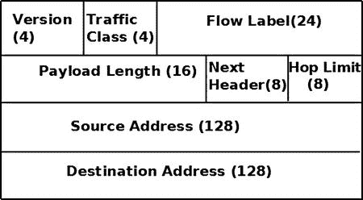
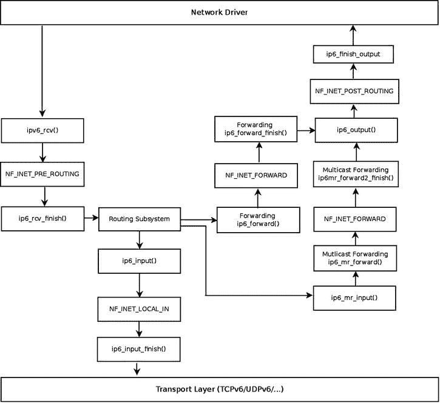

# 八、IPv6

在第 7 章中，我讨论了 Linux 相邻子系统及其实现。在这一章中，我将讨论 IPv6 协议及其在 Linux 中的实现。IPv6 是 TCP/IP 协议栈的下一代网络层协议。它是由互联网工程任务组(IETF)开发的，旨在取代 IPv4，后者仍然承载着绝大多数的互联网流量。

在 90 年代早期，由于预期的互联网增长，IETF 开始努力开发下一代 IP 协议。第一个 IPv6 RFC 来自 1995 年:RFC 1883，“互联网协议，第 6 版(IPv6)规范。”后来在 1998 年，RFC 2460 取代了它。IPv6 解决的主要问题是地址短缺:IPv6 地址的长度是 128 位。IPv6 设置了更大的地址空间。我们在 IPv6 中使用 2^128 地址，而不是 IPv4 中的 2^32 地址。这确实大大增加了地址空间，可能远远超过未来几十年的需要。但是扩展地址空间并不是 IPv6 的唯一优势，有些人可能会这么想。基于从 IPv4 中获得的经验，IPv6 做了许多改变来改进 IP 协议。我们将在本章中讨论这些变化。

作为一种改进的网络层协议，IPv6 协议正获得越来越多的支持。互联网在全球的日益普及，以及智能移动设备和平板电脑市场的不断增长，无疑使 IPv4 地址的枯竭成为一个更明显的问题。这就需要过渡到 IPv4 的继任者 IPv6 协议。

IPv6–简短介绍

IPv6 子系统无疑是一个非常广泛的主题，它正在稳步发展。在过去的十年中，令人兴奋的功能被添加进来。这些新功能中有一些是基于 IPv4 的，比如 ICMPv6 套接字、IPv6 组播路由和 IPv6 NAT。IPsec 在 IPv6 中是强制的，在 IPv4 中是可选的，尽管大多数操作系统也在 IPv4 中实现了 IPsec。当我们深入研究 IPv6 内核内部时，我们发现了许多相似之处。有时方法的名字甚至一些变量的名字都是相似的，除了增加了“v6”或“6”然而，在一些地方的实施中有一些变化。

我们选择在本章中讨论 IPv6 的重要新功能，展示它与 IPv4 的一些不同之处，并解释为什么要做出改变。扩展头、多播监听器发现(MLD)协议和自动配置过程是我们讨论的一些新特性，并通过一些用户空间示例进行演示。我们还将讨论接收 IPv6 数据包的工作原理、IPv6 转发的工作原理，以及与 IPv4 的一些不同之处。总的来说，IPv6 的开发者似乎在过去使用 IPv4 的经验的基础上做了很多改进，IPv6 的实现带来了很多 IPv4 没有的好处和很多优于 IPv4 的优点。我们将在下一节讨论 IPv6 地址，包括多播地址和特殊地址。

IPv6 地址

学习 IPv6 的第一步是熟悉 RFC 4291 中定义的 IPv6 寻址体系结构。IPv6 地址有三种类型:

*   **单播:** 该地址唯一标识一个接口。发送到单播地址的数据包会被传送到该地址标识的接口。
*   **任播:** 这个地址可以分配给一组接口(通常在不同的节点上)。IPv4 中不存在这种类型的地址。事实上，它是单播地址和组播地址的混合。发送到任播地址的数据包被传送到该地址所标识的接口之一(根据路由协议，是“最近”的接口)。
*   **组播:** 这个地址可以分配给一组接口(通常在不同的节点上)。发送到多播地址的数据包会被传送到该地址标识的所有接口。一个接口可以属于任意数量的多播组。

IPv6 中没有广播地址。在 IPv6 中，为了获得与广播相同的结果，可以向所有节点的组组播地址发送数据包(`ff02::1)`)。在 IPv4 中，地址解析协议(ARP)协议的很大一部分功能是基于广播的。IPv6 子系统使用邻居发现而不是 ARP 来将 L3 地址映射到 L2 地址。IPv6 邻居发现协议基于 ICMPv6，它使用组播地址而不是广播地址，正如您在上一章中看到的。在本章的后面，你会看到更多使用多播流量的例子。

IPv6 地址由 8 个 16 位的块组成，总共 128 位。IPv6 地址看起来像这样:`xxxx:xxxx:xxxx:xxxx:xxxx:xxxx:xxxx:xxxx`(其中 x 是十六进制数字。)有时候你会在一个 IPv6 地址里面遇到“`::`”；这是前导零的快捷方式。

在 IPv6 中，使用地址前缀。事实上，前缀相当于 IPv4 子网掩码。RFC 4291“IP 版本 6 寻址架构”中描述了 IPv6 前缀 IPv6 地址前缀由以下符号表示:`ipv6-address/prefix-length`。

前缀长度是一个十进制值，指定地址中有多少个最左边的连续位构成前缀。我们使用“`/n`”来表示前缀 *n* 位长。例如，对于所有以 32 位`2001:0da7`开头的 IPv6 地址，使用以下前缀:`2001:da7::/32`。

现在您已经了解了 IPv6 地址的类型，接下来您将了解一些特殊的 IPv6 地址及其用法。

特殊地址

在本节中，我将描述一些特殊的 IPv6 地址及其用法。建议您熟悉这些特殊地址，因为您将在本章后面的内容中以及浏览代码时遇到其中的一些地址(如 DAD 中使用的全零的未指定地址，或重复地址检测)。以下列表包含特殊的 IPv6 地址及其用法说明:

*   每个接口上应该至少有一个**链路本地**单播地址。链路本地地址允许与同一物理网络中的其他节点进行通信；邻居发现、自动地址配置等等都需要它。路由器不得转发任何带有本地链路源地址或目的地址的数据包。本地链路地址分配有前缀`fe80::/64`。
*   全球单播地址一般格式如下:前 *n* 位为`global routing prefix`，后 *m* 位为`subnet ID`，其余 128- *n* - *m* 位为`interface ID`。
*   `global routing prefix`:分配给站点的值。它代表网络 ID 或地址前缀。
*   `subnet ID`:站点内子网的标识符。
*   `interface ID`:一个`id`；其值在子网内必须是唯一的。RFC 3513 第 2.5.1 节对此进行了定义。

RFC 3587“IPv6 全球单播地址格式”中描述了全球单播地址 RFC 4291 中定义了可分配的全局单播地址空间。

*   IPv6 环回地址是`0:0:0:0:0:0:0:1`，简称为`::1`。
*   全零(`0:0:0:0:0:0:0:0`)的地址称为**未指定地址**。它用于 DAD(重复地址检测),就像你在前一章看到的那样。它不应用作目的地址。您不能通过使用用户空间工具(如`ip`命令或`ifconfig`命令)将未指定的地址分配给接口。
*   **IPv4 映射的 IPv6 地址**是以 80 位零开始的地址。接下来的 16 位是 1，剩下的 32 位是 IPv4 地址。例如，`::ffff:192.0.2.128`代表 192.0.2.128 的 IPv4 地址。有关这些地址的用法，请参见 RFC 4038，“IPv6 过渡的应用方面”
*   **不推荐使用与 IPv4 兼容的**格式；在这种格式中，IPv4 地址位于 IPv6 地址的低 32 位，所有剩余的位都是 0；前面提到的地址应该是这个格式的`::192.0.2.128`。参见 RFC 4291，2.5.5.1 部分。
*   **站点本地地址** **最初设计用于站点内部寻址，无需全局前缀，但在 2004 年的 RFC 3879“不认可的站点本地地址”中被弃用。**

IPv6 地址在 Linux 中由`in6_addr`结构表示；在`in6_addr`结构中使用三个数组(8、16 和 32 位元素)的并集有助于位操作操作:

```sh
struct in6_addr {
        union {
                __u8            u6_addr8[16];
                __be16          u6_addr16[8];
                __be32          u6_addr32[4];
        } in6_u;
#define s6_addr                 in6_u.u6_addr8
#define s6_addr16               in6_u.u6_addr16
#define s6_addr32               in6_u.u6_addr32
};
```

```sh
(include/uapi/linux/in6.h)
```

多播在 IPv6 中扮演着重要的角色，尤其是对于基于 ICMPv6 的协议，如 NDISC(我在第 7 章中讨论过，它涉及 Linux 的相邻子系统)和 MLD(将在本章后面讨论)。我将在下一节讨论 IPv6 中的组播地址。

多播地址

多播地址提供了一种定义多播组的方法；一个节点可以属于一个或多个多播组。目的地是多播地址的分组应该被传送到属于该多播组的每个节点。在 IPv6 中，所有组播地址都以 FF 开头(前 8 位)。接下来的 4 位用于标志，4 位用于作用域。最后，最后 112 位是组 ID。标志字段的 4 位含义如下:

*   **位 0:** 保留供将来使用。
*   **位 1:** 值 1 表示集合点嵌入在地址中。集合点的讨论更多地与用户空间守护进程相关，不在本书的范围之内。有关更多详细信息，请参见 RFC 3956，“在 IPv6 多播地址中嵌入集合点(RP)地址”这个位有时被称为 R 标志(R 代表集合点。)
*   **位 2:** 值 1 表示基于网络前缀分配的多播地址。(参见 RFC 3306。)这个位有时被称为 P 标志(P 表示前缀信息。)
*   **位 3:** 值 0 表示永久分配的(“众所周知的”)多播地址，由互联网号码分配机构(IANA)分配。值 1 表示非永久分配的(“瞬时”)多播地址。该位有时被称为 T 标志(T 代表临时。)

作用域可以是[表 8-1](#Tab1) 中的一个条目，该表通过 Linux 符号和值显示了各种 IPv6 作用域。

[表 8-1](#_Tab1) 。IPv6 作用域

<colgroup><col width="20%"> <col width="30%"> <col width="50%"></colgroup> 
| 

十六进制值

 | 

描述

 | 

Linux 符号

 |
| --- | --- | --- |
| 0x01 | 本地节点 | IPV6 _ ADDR _ 范围 _ 节点本地 |
| 0x02 | 链接本地 | IPV6 _ ADDR _ 范围 _ 链接本地 |
| 0x05 | 本地站点 | IPV6 _ ADDR _ 范围 _ 站点本地 |
| 0x08 | 组织 | IPV6 _ ADDR _ 范围 _ 组织本地 |
| 0x0e | 全球的 | IPV6 _ ADDR _ 范围 _ 全球 |

既然您已经了解了 IPv6 组播地址，您将在下一节了解一些特殊的组播地址。

特殊多播地址

我将在本章中提到一些特殊的多播地址。RFC 4291 的第 2.7.1 节定义了这些特殊的多播地址:

*   所有节点组播地址组:`ff01::1`，`ff02::1`
*   所有路由器组播地址组:`ff01::2`、`ff02::2`、`ff05::2`

根据 RFC 3810，有这个特殊的地址:所有支持 MLDv2 的路由器组播组，也就是`ff02::16`。版本 2 多播侦听器报告将被发送到此特殊地址；我将在本章后面的“多播侦听程序发现(MLD)”一节中讨论它。

要求节点计算并加入(在适当的接口上)已经为该节点的接口(手动或自动)配置的所有单播和任播地址的相关请求节点多播地址。请求节点多播地址是基于节点的单播和任播地址计算的。被请求节点多播地址是通过获取地址的低 24 位(单播或任播)并将这些位附加到前缀`ff02:0:0:0:0:1:ff00::/104`形成的，从而得到范围`ff02:0:0:0:0:1:ff00:0000`到`ff02:0:0:0:0:1:ffff:ffff`内的多播地址。参见 RFC 4291。

方法`addrconf_addr_solict_mult()`计算链路本地的请求节点多播地址(`include/net/addrconf.h`)。方法`addrconf_join_solict()`加入请求地址多播组(`net/ipv6/addrconf.c`)。

在前一章中，您看到了邻居通告消息通过`ndisc_send_na()`方法发送到本地链路的所有节点地址(`ff02::1`)。在本章后面的小节中，您将看到更多使用特殊地址的例子，如所有节点多播组地址或所有路由器多播组地址。在本节中，您已经看到了一些组播地址，您将在本章后面以及浏览 IPv6 源代码时遇到这些地址。现在，我将在下一节讨论 IPv6 报头。

IPv6 报头

每个 IPv6 数据包都以 IPv6 报头开始，了解其结构对于全面理解 IPv6 Linux 实现非常重要。IPv6 报头具有 40 字节的固定长度；因此，没有指定 IPv6 报头长度的字段(与 IPv4 相反，IPv4 报头的`ihl`成员表示报头长度)。请注意，IPv6 报头中也没有校验和字段，这将在本章稍后解释。在 IPv6 中，没有像在 IPv4 中那样的 IP 选项机制。IPv4 中的 IP 选项处理机制具有性能成本。相反，IPV6 具有更有效的扩展头机制，这将在下一节“扩展头”中讨论[图 8-1](#Fig1) 显示了 IPv6 报头及其字段。



[图 8-1](#_Fig1) 。IPv6 报头

请注意，在最初的 IPv6 标准 RFC 2460 中，优先级(流量类别)是 8 位，流标签是 20 位。在`ipv6hdr`结构的定义中，`priority`(业务类别)字段大小是 4 比特。事实上，在 Linux IPv6 实现中，`flow_lbl`的前 4 位被粘在`priority`(流量类)字段上，以便形成一个“类”[图 8-1](#Fig1) 反映了 Linux 对`ipv6hdr`结构的定义，如下所示:

```sh
struct ipv6hdr {
#if defined(__LITTLE_ENDIAN_BITFIELD)
        __u8                    priority:4,
                                version:4;
#elif defined(__BIG_ENDIAN_BITFIELD)
        __u8                    version:4,
                                priority:4;
#else
#error  "Please fix <asm/byteorder.h>"
#endif
        __u8                    flow_lbl[3];

        __be16                  payload_len;
        __u8                    nexthdr;
        __u8                    hop_limit;

        struct  in6_addr        saddr;
        struct  in6_addr        daddr;
};
```

```sh
(include/uapi/linux/ipv6.h)
```

以下是对`ipv6hdr`结构成员的描述:

*   `version`:4 位字段。应该设置为 6。
*   `priority` : 表示 IPv6 数据包的流量类别或优先级。RFC 2460 是 IPv6 的基础，它没有定义特定的流量类别或优先级值。
*   `flow_lbl` : 在编写基础 IPv6 标准(RFC 2460)时，流标签字段被认为是实验性的。它提供了一种标记特定流的数据包序列的方法；上层可以出于各种目的使用这种标记。2011 年的 RFC 6437“IPv6 流标签规范”建议使用流标签来检测地址欺骗。
*   `payload_len`:16 位字段。不含 IPv6 报头的数据包最大可达 65，535 字节。我将在下一节介绍逐跳选项报头时讨论更大的数据包(“巨型帧”)。
*   `nexthdr` : 当没有扩展头时，这将是上层协议号，如 UDP 的 IPPROTO_UDP (17)或 TCP 的 IPPROTO_TCP (6)。可用协议列表在`include/uapi/linux/in.h`中。使用扩展标头时，这将是紧跟在 IPv6 标头之后的下一个标头的类型。我将在下一节讨论扩展头。
*   `hop_limit` : 一个字节字段。每个转发设备将`hop_limit`计数器减 1。当它达到零时，一条 ICMPv6 消息被发回，数据包被丢弃。这类似于 IPv4 报头中的 TTL 成员。参见`net/ipv6/ip6_output.c`中的`ip6_forward()`方法。
*   `saddr` : IPv6 源地址(128 位)。
*   `daddr` : IPv6 目的地址(128 位)。如果使用了路由报头，这可能不是最终的数据包目的地。

请注意，与 IPv4 报头不同，IPv6 报头中没有校验和。假设校验和由第 2 层和第 4 层保证。IPv4 中的 UDP 允许校验和为 0，表示没有校验和；IPV6 中的 UDP 通常需要有自己的校验和。在 IPv6 中有一些特殊情况，IPv6 UDP 隧道允许零 UDP 校验和；请参见 RFC 6935，“隧道数据包的 IPv6 和 UDP 校验和”在处理 IPv4 子系统的[第 4 章](04.html)中，您会看到在转发数据包时会调用`ip_decrease_ttl()`方法。此方法重新计算 IPv4 报头的校验和，因为`ttl`的值已更改。在 IPv6 中，转发数据包时不需要重新计算校验和，因为 IPv6 报头中根本没有校验和。这导致基于软件的路由器的性能提高。

在本节中，您已经看到了 IPv6 报头是如何构建的。您看到了 IPv4 报头和 IPv6 报头之间的一些差异，例如，在 IPv6 报头中没有校验和，也没有报头长度。下一节讨论 IPv6 扩展头，它是 IPv4 选项的对应部分。

扩展标题

IPv4 报头可以包括 IP 选项，其可以将 IPv4 报头的最小大小从 20 字节扩展到 60 字节。在 IPv6 中，我们有可选的扩展头。除了一个例外(逐跳选项报头)，在分组到达其最终目的地之前，扩展报头不被分组的传递路径上的任何节点处理；这大大提高了转发过程的性能。基础 IPv6 标准定义了扩展报头。IPv6 数据包可以包括 0 个、1 个或多个扩展标头。这些报头可以放在 IPv6 报头和数据包的上层报头之间。IPv6 报头的`nexthdr`字段是紧跟在 IPv6 报头之后的下一个报头的编号。这些扩展标头是链接的；每个扩展标头都有一个 Next 标头字段。在最后一个扩展头中，Next 头表示上层协议(如 TCP、UDP 或 ICMPv6)。扩展标头的另一个优点是，将来添加新的扩展标头很容易，并且不需要对 IPv6 标头进行任何更改。

扩展头必须严格按照它们在包中出现的顺序进行处理。每个扩展标头最多应出现一次，但目标选项标头除外，它最多应出现两次。(详见本节下文目的地选项标题的说明。)逐跳选项标头必须紧接在 IPv6 标头之后出现；所有其他选项可以以任何顺序出现。RFC 2460 的第 4.1 节(“扩展报头顺序”)陈述了扩展报头应该出现的推荐顺序，但是这不是强制性的。当处理数据包时遇到未知的下一个报头号时，将通过调用`icmpv6_param_prob()`方法向发送方发回一条 ICMPv6“参数问题”消息，代码为“未知的下一个报头”(ICMPV6_UNK_NEXTHDR)。本章末尾“快速参考”部分的[表 8-4](#Tab4) 中描述了可用的 ICMPv6“参数问题代码”。

每个扩展头必须在 8 字节边界上对齐。对于可变大小的扩展头，有一个头扩展长度字段，如果需要，它们使用填充来确保它们在 8 字节边界上对齐。所有 Linux IPv6 扩展头的编号及其 Linux 内核符号表示显示在本章末尾“快速参考”部分的[表 8-2](#Tab2)“IPv6 扩展头”中。

用`inet6_add_protocol()`方法为每个扩展报头(除了逐跳选项报头)注册一个协议处理程序。不为逐跳选项报头注册协议处理程序的原因是有一种特殊的方法来解析逐跳选项报头，即`ipv6_parse_hopopts()`方法。在调用协议处理程序之前调用此方法。(参见`ipv6_rcv()`方法，`net/ipv6/ip6_input.c`)。如前所述，逐跳选项报头必须是第一个报头，紧跟在 IPv6 报头之后。以这种方式，例如，用于片段扩展报头的协议处理程序被注册:

```sh
static const struct inet6_protocol frag_protocol =
{
    .handler    =    ipv6_frag_rcv,
    .flags      =    INET6_PROTO_NOPOLICY,
};

int __init ipv6_frag_init(void)
{
    int ret;

    ret = inet6_add_protocol(&frag_protocol, IPPROTO_FRAGMENT);

(net/ipv6/reassembly.c)

```

以下是对所有 IPv6 扩展标头的描述:

*   **逐跳选项头:**必须在每个节点上处理逐跳选项头。它由`ipv6_parse_hopopts()`方法(`net/ipv6/exthdrs.c`)解析。
*   逐跳选项报头必须紧跟在 IPv6 报头之后。例如，它被多播侦听程序发现协议使用，您将在本章后面的“多播侦听程序发现(MLD)”一节中看到。逐跳选项报头包括可变长度选项字段。它的第一个字节是它的类型，可以是下列之一:

*   路由器警报(Linux 内核符号:IPV6 _ TLV _ 路由器警报，值:5)。请参阅 RFC 6398，“IP 路由器警报注意事项和用法”
*   Jumbo (Linux 内核符号:IPV6_TLV_JUMBO，值:194)。IPv6 数据包有效负载通常最长可达 65，535 字节。使用 jumbo 选项，最高可达 2^32 字节。请参见 RFC 2675，“IPv6 图片”
*   Pad1 (Linux 内核符号:IPV6_TLV_PAD1，值:0)。Pad1 选项用于插入一个字节的填充。当需要多个填充字节时，应使用 PadN 选项(见下一步)(而不是多个 Pad1 选项)。参见 RFC 2460 的第 4.2 节。
*   PadN (Linux 内核符号:IPV6_TLV_PADN，值:1)。PadN 选项用于在报头的选项区域插入两个或多个八位字节的填充。

*   **路由选项头:** 这与 IPv4 松散源记录路由(IPOPT_LSRR)平行，在[第 4 章](04.html)的“IP 选项”一节中讨论。它提供了指定一个或多个路由器的能力，这些路由器应该沿着数据包到其最终目的地的遍历路由被访问。
*   **分片选项头:** 与 IPv4 相反，IPv6 中的分片只能发生在发送数据包的主机上，而不能发生在任何中间节点上。碎片由从`ip6_finish_output()`方法调用的`ip6_fragment()`方法实现。在`ip6_fragment()`方法中，有一条慢速路径和一条快速路径，这与 IPv4 分段非常相似。IPv6 分片的实现在`net/ipv6/ip6_output.c`，IPv6 碎片整理的实现在`net/ipv6/reassembly.c`。
*   **认证头:** 认证头(AH)提供数据认证、数据完整性和防重放保护。它在 RFC 4302“IP 认证头”中有描述，这使得 RFC 2402 过时了。
*   **封装安全有效载荷选项头:**RFC 4303“IP 封装安全有效载荷(ESP)”中有描述，使得 RFC 2406 过时。注意:封装安全有效载荷(ESP)协议在第 10 章的[中讨论，其中讨论了 IPsec 子系统。](10.html)
*   **目的地选项头:** 目的地选项头在一个数据包中可以出现两次；在路由选项报头之前和之后。当它在路由选项报头之前时，它包括应该由路由器选项报头指定的路由器处理的信息。当它在路由器选项报头之后时，它包括应该由最终目的地处理的信息。

在下一节中，您将看到 IPv6 协议处理程序，即`ipv6_rcv()`方法，是如何与 IPv6 数据包相关联的。

IPv6 初始化

`inet6_init()`方法执行各种 IPv6 初始化(如`procfs`初始化、TCPv6、UDPv6 和其他协议的协议处理程序注册)、IPv6 子系统初始化(如 IPv6 邻居发现、IPv6 多播路由和 IPv6 路由子系统)等。更多细节，请看`net/ipv6/af_inet6.c`。通过为 IPv6 定义一个`packet_type`对象并用`dev_add_pack()`方法注册它，将`ipv6_rcv()`方法注册为 IPv6 数据包的协议处理程序，这与 IPv4 中的做法非常相似:

```sh
static struct packet_type ipv6_packet_type __read_mostly = {
        .type = cpu_to_be16(ETH_P_IPV6),
        .func = ipv6_rcv,
};

static int __init ipv6_packet_init(void)
{
        dev_add_pack(&ipv6_packet_type);
        return 0;
}
```

```sh
(net/ipv6/af_inet6.c)
```

作为刚才显示的注册的结果，以太网类型为 ETH_P_IPV6 (0x86DD)的每个以太网数据包将由`ipv6_rcv()`方法处理。接下来，我将讨论用于设置 IPv6 地址的 IPv6 自动配置机制。

自动配置〔t0〕

自动配置是一种允许主机为其每个接口获取或创建唯一地址的机制。IPv6 自动配置过程在系统启动时启动；节点(主机和路由器)为其接口生成一个链路本地地址。该地址被视为“暂定”(设置接口标志 IFA _ F _ 暂定)；这意味着它只能与邻居发现消息通信。应该验证该地址没有被链路上的另一个节点使用。这是通过 DAD(重复地址检测)机制来完成的，在前一章讨论 Linux 相邻子系统时已经描述过了。如果节点不是唯一的，自动配置过程将停止，需要手动配置。如果地址是唯一的，自动配置过程将继续。主机自动配置的下一阶段包括向所有路由器多播组地址发送一个或多个路由器请求(`ff02::2`)。这是通过从`addrconf_dad_completed()`方法中调用`ndisc_send_rs()`方法来完成的。路由器回复路由器通告消息，该消息被发送到所有主机地址`ff02::1`。路由器请求和路由器广告都通过 ICMPv6 消息使用邻居发现协议。路由器请求 ICMPv6 类型是 NDISC_ROUTER_SOLICITATION (133)，路由器通告 ICMPv6 类型是 NDISC_ROUTER_ADVERTISEMENT (134)。

`radvd`守护进程是一个开源路由器广告守护进程的例子，用于无状态自动配置(`http://www.litech.org/radvd/`)。您可以在`radvd`配置文件中设置一个前缀，它将在路由器广告消息中发送。`radvd`守护进程定期发送路由器广告。除此之外，它还监听路由器请求(RS)请求，并用路由器广告(RA) 回复消息进行应答。这些路由器广告(RA)消息包括一个前缀字段，它在自动配置过程中起着重要的作用，您马上就会看到这一点。前缀长度必须为 64 位。当主机收到路由器广告(RA)消息时，它会根据该前缀和自己的 MAC 地址来配置其 IP 地址。如果设置了隐私扩展功能(CONFIG_IPV6_PRIVACY ),那么在 IPV6 地址创建中还会增加一些随机性。隐私扩展机制通过添加前面提到的随机性，避免了从 IPv6 地址获取关于机器身份的细节，IPv6 地址通常是使用其 MAC 地址和前缀生成的。有关隐私扩展的更多详细信息，请参见 RFC 4941，“IPv6 中无状态地址自动配置的隐私扩展”

当主机收到路由器通告消息时，它可以自动配置自己的地址和其它一些参数。它还可以根据这些广告选择默认路由器。也可以为主机上自动配置的地址设置**优选寿命**和**有效寿命**。preferred lifetime 值指定通过无状态地址自动配置从前缀生成的地址保持在首选状态的时间长度(秒)。当优选时间结束时，该地址将停止通信(不会应答`ping6`等)。).valid lifetime 值以秒为单位指定地址有效的时间长度(即，已经使用它的应用可以继续使用它)；当这个时间结束时，地址被删除。首选生存期和有效生存期在内核中分别由`inet6_ifaddr`对象的`prefered_lft`和`valid_lft`字段表示(`include/net/if_inet6.h`)。

重新编号是用新前缀替换旧前缀，并根据新前缀更改主机 IPv6 地址的过程。使用`radvd`也可以很容易地完成重新编号，方法是在它的配置设置中添加一个新的前缀，设置一个首选生存期和一个有效生存期，然后重新启动`radvd`守护进程。另请参见 RFC 4192，“无标志日的 IPv6 网络重新编号程序”，以及 RFCs 5887、6866 和 6879。

动态主机配置协议版本 6 (DHCPv6) 是有状态地址配置的一个例子；在有状态自动配置模型中，主机从服务器获取接口地址和/或配置信息和参数。服务器维护一个数据库，该数据库记录哪些地址分配给了哪些主机。在这本书里我不会深究 DHCPv6 协议的细节。DHCPv6 协议由 RFC 3315“IPv6 的动态主机配置协议(DHCPv6)”指定 RFC 4862“IPv6 无状态地址自动配置”中描述了 IPv6 无状态自动配置标准

在本节中，您已经了解了自动配置过程，并且看到了通过配置和重启`radvd`用新前缀替换旧前缀是多么容易。下一节将讨论作为 IPv6 协议处理程序的`ipv6_rcv()`方法如何处理 IPv6 数据包的接收，其方式与您在 IPv4 中看到的方式有些相似。

接收 IPv6 数据包

主要的 IPv6 接收方法是`ipv6_rcv()`方法，它是所有 IPv6 数据包(包括多播；如前所述，IPv6 中没有广播)。IPv4 和 IPv6 中的 Rx 路径有许多相似之处。与在 IPv4 中一样，我们首先进行一些完整性检查，比如检查 IPv6 报头的版本是否为 6，以及源地址是否为多播地址。(根据 RFC 4291 的第 2.7 节，这是禁止的。)如果有逐跳选项头，一定是第一个。如果 IPV6 报头的`nexthdr`的值为 0，这表示逐跳选项报头，并且通过调用`ipv6_parse_hopopts()`方法对其进行解析。真正的工作由`ip6_rcv_finish()`方法完成，该方法通过调用 NF_HOOK()宏来调用。如果此时注册了一个 netfilter 回调函数(NF_INET_PRE_ROUTING)，它将被调用。我将在下一章讨论 netfilter 钩子。让我们来看看`ipv6_rcv()`的方法:

```sh
int ipv6_rcv(struct sk_buff *skb, struct net_device *dev, struct packet_type *pt,
             struct net_device *orig_dev)
{
        const struct ipv6hdr *hdr;
        u32             pkt_len;
        struct inet6_dev *idev;
```

从与套接字缓冲区(SKB)相关联的网络设备获取网络名称空间 :

```sh
struct net *net = dev_net(skb->dev);

        . . .
```

从 SKB 获取 IPv6 报头:

```sh
hdr = ipv6_hdr(skb);
```

执行一些健全性检查，并在必要时丢弃 SKB:

```sh
        if (hdr->version != 6)
                goto err;

        /*
         * RFC4291 2.5.3
         * A packet received on an interface with a destination address
         * of loopback must be dropped.
         */
        if (!(dev->flags & IFF_LOOPBACK) &&
            ipv6_addr_loopback(&hdr->daddr))
                goto err;

        . . .

        /*
         * RFC4291 2.7
         * Multicast addresses must not be used as source addresses in IPv6
         * packets or appear in any Routing header.
         */
        if (ipv6_addr_is_multicast(&hdr->saddr))
                goto err;

        . . .
        if (hdr->nexthdr == NEXTHDR_HOP) {
                if (ipv6_parse_hopopts(skb) < 0) {
                        IP6_INC_STATS_BH(net, idev, IPSTATS_MIB_INHDRERRORS);
                        rcu_read_unlock();
                        return NET_RX_DROP;
                }
        }
        . . .

        return NF_HOOK(NFPROTO_IPV6, NF_INET_PRE_ROUTING, skb, dev, NULL,
                       ip6_rcv_finish);
err:
        IP6_INC_STATS_BH(net, idev, IPSTATS_MIB_INHDRERRORS);
drop:
        rcu_read_unlock();
        kfree_skb(skb);
        return NET_RX_DROP;
}
```

```sh
(net/ipv6/ip6_input.c)
```

`ip6_rcv_finish()`方法首先通过调用`ip6_route_input()`方法在路由子系统中执行查找，以防没有`dst`连接到 SKB。`ip6_route_input()`方法最终会调用`fib6_rule_lookup()`。

```sh
int ip6_rcv_finish(struct sk_buff *skb)
 {
      . . .
      if (!skb_dst(skb))
                 ip6_route_input(skb);
```

调用附属于 SKB 的`dst`的`input`回调；

```sh
         return dst_input(skb);
 }
```

(`net/ipv6/ip6_input.c`)

 **注意**`fib6_rule_lookup()`方法有两种不同的实现:一种是在`net/ipv6/fib6_rules.c`中设置策略路由(CONFIG_IPV6_MULTIPLE_TABLES)时，一种是在`net/ipv6/ip6_fib.c`中未设置策略路由时。

正如您在第 5 章中看到的，该章讨论了 IPv4 路由子系统的高级主题，路由子系统中的查找构建了一个`dst`对象，并设置了它的`input`和`output`回调；在 IPv6 中，执行类似的任务。在`ip6_rcv_finish()`方法在路由子系统中执行查找之后，它调用`dst_input()`方法，该方法实际上调用了与数据包相关联的`dst`对象的`input`回调。

[图 8-2](#Fig2) 显示了网络驱动程序接收到的数据包的接收路径(Rx) 。此数据包可以被传送到本地机器，也可以被转发到另一台主机。路由表中的查找结果决定了这两个选项中的哪一个会发生。



[图 8-2](#_Fig2) 。接收 IPv6 数据包

 **注**为简单起见，该图不包括扩展头/IPsec 方法的分段/碎片整理/解析。

IPv6 路由子系统中的查找将目的缓存(`dst`)的`input`回调设置为:

*   `ip6_input()`当数据包的目的地是本地机器时。
*   `ip6_forward()`何时转发数据包。
*   `ip6_mc_input()`当数据包的目的地是组播地址时。
*   `ip6_pkt_discard()`数据包将被丢弃的时间。`ip6_pkt_discard()`方法丢弃数据包，并用目的地不可达(icmp V6 _ DEST _ 未到达)消息回复发送方。

传入的 IPv6 数据包可以在本地传递或转发；在下一节中，您将了解 IPv6 数据包的本地传送。

本地交付

让我们首先看看本地交付案例:`ip6_input()`方法是一个非常短的方法:

```sh
int ip6_input(struct sk_buff *skb)
{
        return NF_HOOK(NFPROTO_IPV6, NF_INET_LOCAL_IN, skb, skb->dev, NULL,
                       ip6_input_finish);
}
```

```sh
(net/ipv6/ip6_input.c)
```

如果在这个点(NF_INET_LOCAL_IN)注册了一个 netfilter 钩子，它将被调用。否则，我们将继续使用`ip6_input_finish()`方法:

```sh
static int ip6_input_finish(struct sk_buff *skb)
{
        struct net *net = dev_net(skb_dst(skb)->dev);
        const struct inet6_protocol *ipprot;
```

`inet6_dev`结构(`include/net/if_inet6.h`)是 IPv4 `in_device`结构的 IPv6 并行。它包含与 IPv6 相关的配置，例如网络接口单播地址列表(`addr_list`)和网络接口组播地址列表(`mc_list`)。该 IPv6 相关配置可由用户使用`ip`命令或`ifconfig`命令进行设置。

```sh
        struct inet6_dev *idev;
        unsigned int nhoff;
        int nexthdr;
        bool raw;

        /*
         *      Parse extension headers
         */

        rcu_read_lock();
resubmit:
        idev = ip6_dst_idev(skb_dst(skb));
        if (!pskb_pull(skb, skb_transport_offset(skb)))
                goto discard;
        nhoff = IP6CB(skb)->nhoff;
```

从 SKB 获取下一个标题号:

```sh
nexthdr = skb_network_header(skb)[nhoff];
```

首先，在原始套接字包的情况下，我们尝试将其传递到原始套接字:

```sh
raw = raw6_local_deliver(skb, nexthdr);
```

每个扩展头(除了逐跳扩展头)都有一个协议处理程序，该程序由`inet6_add_protocol()`方法注册；这个方法实际上在全局`inet6_protos`数组中添加了一个条目(参见`net/ipv6/protocol.c`)。

```sh
if ((ipprot = rcu_dereference(inet6_protos[nexthdr])) != NULL) {
        int ret;

        if (ipprot->flags & INET6_PROTO_FINAL) {
                const struct ipv6hdr *hdr;

                /* Free reference early: we don't need it any more,
                   and it may hold ip_conntrack module loaded
                   indefinitely. */
                nf_reset(skb);

                skb_postpull_rcsum(skb, skb_network_header(skb),
                                   skb_network_header_len(skb));
                hdr = ipv6_hdr(skb);
```

RFC 3810 是 MLDv2 规范，它说:“请注意，MLDv2 消息不受源过滤的限制，必须始终由主机和路由器进行处理。”我们不希望由于源过滤而丢弃 MLD 多播分组，因为这些 MLD 分组应该总是根据 RFC 来处理。因此，在丢弃该分组之前，我们确保如果该分组的目的地地址是多播地址，则该分组不是 MLD 分组。这是通过在丢弃之前调用`ipv6_is_mld()`方法来完成的。如果该方法指示该分组是 MLD 分组，则它不会被丢弃。您还可以在本章后面的“多播侦听器发现(MLD)”一节中了解更多信息。

```sh
        if (ipv6_addr_is_multicast(&hdr->daddr) &&
```

```sh
            !ipv6_chk_mcast_addr(skb->dev, &hdr->daddr,
            &hdr->saddr) &&
            !ipv6_is_mld(skb, nexthdr, skb_network_header_len(skb)))
        goto discard;
}
```

当 INET6_PROTO_NOPOLICY 标志被设置时，这表示不需要对该协议执行 IPsec 策略检查:

```sh
        if (!(ipprot->flags & INET6_PROTO_NOPOLICY) &&
            !xfrm6_policy_check(NULL, XFRM_POLICY_IN, skb))
                goto discard;
        ret = ipprot->handler(skb);
        if (ret > 0)
                goto resubmit;
        else if (ret == 0)
                IP6_INC_STATS_BH(net, idev, IPSTATS_MIB_INDELIVERS);
} else {
        if (!raw) {
                if (xfrm6_policy_check(NULL, XFRM_POLICY_IN, skb)) {
                        IP6_INC_STATS_BH(net, idev,
                                         IPSTATS_MIB_INUNKNOWNPROTOS);
                        icmpv6_send(skb, ICMPV6_PARAMPROB,
                                    ICMPV6_UNK_NEXTHDR, nhoff);
                }
                kfree_skb(skb);
        } else {
```

一切都很顺利，所以增加 INDELIVERS SNMP MIB 计数器(`/proc/net/snmp6/Ip6InDelivers`)并使用`consume_skb()`方法释放数据包:

```sh
                        IP6_INC_STATS_BH(net, idev, IPSTATS_MIB_INDELIVERS);
                        consume_skb(skb);
                }
        }
        rcu_read_unlock();
        return 0;

discard:
        IP6_INC_STATS_BH(net, idev, IPSTATS_MIB_INDISCARDS);
        rcu_read_unlock();
        kfree_skb(skb);
        return 0;
}
```

```sh
(net/ipv6/ip6_input.c)
```

您已经看到了本地交付的实现细节，这是由`ip6_input()`和`ip6_input_finish()`方法执行的。现在是时候转向 IPv6 中转发的实现细节了。同样在这里，IPv4 中的转发和 IPv6 中的转发有许多相似之处。

促进

IPv6 中的转发与 IPv4 中的转发非常相似。不过，还是有一些细微的变化。例如，在 IPv6 中，转发数据包时不计算校验和。(如前所述，IPv6 报头中根本没有校验和字段。)我们来看看`ip6_forward()`法:

```sh
int ip6_forward(struct sk_buff *skb)
{
        struct dst_entry *dst = skb_dst(skb);
        struct ipv6hdr *hdr = ipv6_hdr(skb);
        struct inet6_skb_parm *opt = IP6CB(skb);
        struct net *net = dev_net(dst->dev);
        u32 mtu;
```

应该设置 IPv6 `procfs`转发条目(`/proc/sys/net/ipv6/conf/all/forwarding`):

```sh
if (net->ipv6.devconf_all->forwarding == 0)
        goto error;
```

使用大型接收卸载(LRO)时，数据包长度将超过最大传输单位(MTU)。与在 IPv4 中一样，当启用 LRO 时，SKB 被释放，并返回错误–EINVAL:

```sh
if (skb_warn_if_lro(skb))
        goto drop;

if (!xfrm6_policy_check(NULL, XFRM_POLICY_FWD, skb)) {
        IP6_INC_STATS(net, ip6_dst_idev(dst), IPSTATS_MIB_INDISCARDS);
        goto drop;
}
```

丢弃不是发往本地主机的数据包。与 SKB 相关联的`pkt_type`是根据传入分组的以太网报头中的目的地 MAC 地址来确定的。这是通过`eth_type_trans()`方法完成的，该方法通常在网络设备驱动程序中处理传入的数据包时调用。见`eth_type_trans()`法，`net/ethernet/eth.c`。

```sh
if (skb->pkt_type != PACKET_HOST)
        goto drop;

skb_forward_csum(skb);

/*
 *      We DO NOT make any processing on
 *      RA packets, pushing them to user level AS IS
 *      without any WARRANTY that application will be able
 *      to interpret them. The reason is that we
 *      cannot make anything clever here.
 *
 *      We are not end-node, so that if packet contains
 *      AH/ESP, we cannot make anything.
 *      Defragmentation also would be mistake, RA packets
 *      cannot be fragmented, because there is no warranty
 *      that different fragments will go along one path. --ANK
 */
if (opt->ra) {
        u8 *ptr = skb_network_header(skb) + opt->ra;
```

我们应该尝试将数据包传送到由`setsockopt()`设置了 IPV6_ROUTER_ALERT 套接字选项的套接字。这是通过调用`ip6_call_ra_chain()`方法来完成的；如果`ip6_call_ra_chain()`中的传递成功，`ip6_forward()`方法返回 0，数据包不被转发。参见`net/ipv6/ip6_output.c`中`ip6_call_ra_chain()`方法的实现。

```sh
        if (ip6_call_ra_chain(skb, (ptr[2]<<8) + ptr[3]))
                return 0;
}

/*
 *      check and decrement ttl
 */
if (hdr->hop_limit <= 1) {
        /* Force OUTPUT device used as source address */
        skb->dev = dst->dev;
```

当跳数限制为 1(或更少)时，发送回 ICMP 错误消息，这与我们在 IPv4 中转发数据包且 TTL 达到 0 时的情况非常相似。在这种情况下，数据包将被丢弃:

```sh
        icmpv6_send(skb, ICMPV6_TIME_EXCEED, ICMPV6_EXC_HOPLIMIT, 0);
        IP6_INC_STATS_BH(net,
                         ip6_dst_idev(dst), IPSTATS_MIB_INHDRERRORS);

        kfree_skb(skb);
        return -ETIMEDOUT;
}
/* XXX: idev->cnf.proxy_ndp? */
if (net->ipv6.devconf_all->proxy_ndp &&
    pneigh_lookup(&nd_tbl, net, &hdr->daddr, skb->dev, 0)) {
        int proxied = ip6_forward_proxy_check(skb);
        if (proxied > 0)
                return ip6_input(skb);
        else if (proxied < 0) {
                IP6_INC_STATS(net, ip6_dst_idev(dst),
                              IPSTATS_MIB_INDISCARDS);
                goto drop;
        }
}

if (!xfrm6_route_forward(skb)) {
        IP6_INC_STATS(net, ip6_dst_idev(dst), IPSTATS_MIB_INDISCARDS);
        goto drop;
}
dst = skb_dst(skb);

/* IPv6 specs say nothing about it, but it is clear that we cannot
   send redirects to source routed frames.
   We don't send redirects to frames decapsulated from IPsec.
 */
if (skb->dev == dst->dev && opt->srcrt == 0 && !skb_sec_path(skb)) {
        struct in6_addr *target = NULL;
        struct inet_peer *peer;
        struct rt6_info *rt;

        /*
         *      incoming and outgoing devices are the same
         *      send a redirect.
         */

        rt = (struct rt6_info *) dst;
        if (rt->rt6i_flags & RTF_GATEWAY)
                target = &rt->rt6i_gateway;
        else
                target = &hdr->daddr;

        peer = inet_getpeer_v6(net->ipv6.peers, &rt->rt6i_dst.addr, 1);

        /* Limit redirects both by destination (here)
           and by source (inside ndisc_send_redirect)
         */
        if (inet_peer_xrlim_allow(peer, 1*HZ))
        ndisc_send_redirect(skb, target);
        if (peer)
        inet_putpeer(peer);
} else {
        int addrtype = ipv6_addr_type(&hdr->saddr);

        /* This check is security critical. */
        if (addrtype == IPV6_ADDR_ANY ||
            addrtype & (IPV6_ADDR_MULTICAST | IPV6_ADDR_LOOPBACK))
        goto error;
        if (addrtype & IPV6_ADDR_LINKLOCAL) {
                icmpv6_send(skb, ICMPV6_DEST_UNREACH,
                            ICMPV6_NOT_NEIGHBOUR, 0);
                goto error;
        }
}
```

请注意，根据基础 IPV6 标准 RFC 2460 的第 5 节“数据包大小问题”，IPv6 的 IPV6_MIN_MTU 为 1280 字节。

```sh
mtu = dst_mtu(dst);
if (mtu < IPV6_MIN_MTU)
        mtu = IPV6_MIN_MTU;

if ((!skb->local_df && skb->len > mtu && !skb_is_gso(skb)) ||
    (IP6CB(skb)->frag_max_size && IP6CB(skb)->frag_max_size > mtu)) {
        /* Again, force OUTPUT device used as source address */
        skb->dev = dst->dev;
```

用“数据包太大”的 ICMPv6 消息回复发送者，并释放 SKB；在这种情况下，`ip6_forward()`方法返回–EMSGSIZ:

```sh
        icmpv6_send(skb, ICMPV6_PKT_TOOBIG, 0, mtu);
        IP6_INC_STATS_BH(net,
                         ip6_dst_idev(dst), IPSTATS_MIB_INTOOBIGERRORS);
        IP6_INC_STATS_BH(net,
                         ip6_dst_idev(dst), IPSTATS_MIB_FRAGFAILS);
        kfree_skb(skb);
        return -EMSGSIZE;
}
if (skb_cow(skb, dst->dev->hard_header_len)) {
        IP6_INC_STATS(net, ip6_dst_idev(dst), IPSTATS_MIB_OUTDISCARDS);
        goto drop;
}

hdr = ipv6_hdr(skb);
```

数据包将被转发，因此减少 IPv6 报头的`hop_limit`。

```sh
/* Mangling hops number delayed to point after skb COW */
hdr->hop_limit--;

IP6_INC_STATS_BH(net, ip6_dst_idev(dst), IPSTATS_MIB_OUTFORWDATAGRAMS);
IP6_ADD_STATS_BH(net, ip6_dst_idev(dst), IPSTATS_MIB_OUTOCTETS, skb->len);
return NF_HOOK(NFPROTO_IPV6, NF_INET_FORWARD, skb, skb->dev, dst->dev,
               ip6_forward_finish);

error:
IP6_INC_STATS_BH(net, ip6_dst_idev(dst), IPSTATS_MIB_INADDRERRORS);
drop:
kfree_skb(skb);
return -EINVAL;
}
```

```sh
(net/ipv6/ip6_output.c)
```

`ip6_forward_finish()`方法是一个单行方法，它简单地调用目的缓存(`dst` ) `output`回调:

```sh
static inline int ip6_forward_finish(struct sk_buff *skb)
{
return dst_output(skb);
}
```

```sh
(net/ipv6/ip6_output.c)
```

在本节中，您已经看到了 IPv6 数据包的接收是如何处理的，是通过本地传送还是通过转发。您还看到了接收 IPv6 数据包和接收 IPv4 数据包之间的一些差异。在下一节中，我将讨论多播流量的 Rx 路径。

接收 IPv6 组播数据包

`ipv6_rcv()`方法是单播包和组播包的 IPv6 处理程序。如上所述，在一些完整性检查之后，它调用`ip6_rcv_finish()`方法，该方法通过调用`ip6_route_input()`方法在路由子系统中执行查找。在`ip6_route_input()`方法中，在接收多播包的情况下，`input`回调被设置为`ip6_mc_input`方法。我们来看看`ip6_mc_input()`的方法:

```sh
int ip6_mc_input(struct sk_buff *skb)
{
        const struct ipv6hdr *hdr;
        bool deliver;

        IP6_UPD_PO_STATS_BH(dev_net(skb_dst(skb)->dev),
                         ip6_dst_idev(skb_dst(skb)), IPSTATS_MIB_INMCAST,
                         skb->len);

        hdr = ipv6_hdr(skb);
```

`ipv6_chk_mcast_addr()`方法 ( `net/ipv6/mcast.c`)检查指定网络设备的组播地址列表(`mc_list`)中是否包含指定的组播地址(本例中为 IPv6 头中的目的地址，`hdr->daddr`)。注意，因为第三个参数为空，所以我们在这个调用中不检查是否有任何源地址的源过滤器；本章稍后将讨论如何处理源过滤。

```sh
deliver = ipv6_chk_mcast_addr(skb->dev, &hdr->daddr, NULL);
```

如果本地机器是一个多播路由器(也就是说，CONFIG_IPV6_MROUTE 被设置)，我们在对`ip6_mr_input()`方法进行一些检查之后继续。IPv6 组播路由实现与 IPv4 组播路由实现非常相似，在[第 6 章](06.html)中已经讨论过，所以在本书中不再讨论。IPv6 组播路由实现在`net/ipv6/ip6mr.c`中。基于 Mickael Hoerdt 的补丁，在内核 2.6.26 (2008)中增加了对 IPv6 多播路由的支持。

```sh
#ifdef CONFIG_IPV6_MROUTE
. . .
         if (dev_net(skb->dev)->ipv6.devconf_all->mc_forwarding &&
             !(ipv6_addr_type(&hdr->daddr) &
               (IPV6_ADDR_LOOPBACK|IPV6_ADDR_LINKLOCAL)) &&
             likely(!(IP6CB(skb)->flags & IP6SKB_FORWARDED))) {
                 /*
                  * Okay, we try to forward - split and duplicate
                  * packets.
                  */
                 struct sk_buff *skb2;

                 if (deliver)
                         skb2 = skb_clone(skb, GFP_ATOMIC);
                 else {
                         skb2 = skb;
                         skb = NULL;
                 }

                 if (skb2) {
```

通过`ip6_mr_input()`方法(`net/ipv6/ip6mr.c`)继续 IPv6 组播路由代码:

```sh
                         ip6_mr_input(skb2);
                 }

            }
#endif
        if (likely(deliver))
                ip6_input(skb);
        else {
                /* discard */
                kfree_skb(skb);
        }

        return 0;
}

(net/ipv6/ip6_input.c)
```

当多播数据包不打算通过多播路由转发时(例如，当 CONFIG_IPV6_MROUTE 未设置时)，我们将继续使用`ip6_input()`方法，正如您已经看到的，它实际上是`ip6_input_finish()`方法的包装器。在`ip6_input_finish()`方法中，我们再次调用`ipv6_chk_mcast_addr()`方法，但是这次第三个参数不为空，它是来自 IPv6 报头的源地址。这一次，我们在`ipv6_chk_mcast_addr()`方法中检查是否设置了源过滤，并相应地处理数据包。源筛选将在本章后面的“多播源筛选(MSF)”一节中讨论。接下来，我将描述多播监听器发现协议，它与 IPv4 IGMPv3 协议并行。

多播监听器发现(MLD)

MLD 协议用于在多播主机和路由器之间交换组信息。MLD 协议是非对称协议；它为多播路由器和多播侦听器指定了不同的行为。在 IPv4 中，组播组管理由互联网组管理协议(IGMP)处理，正如你在第 6 章中看到的。在 IPv6 中，多播组管理由 MLDv2 协议处理，该协议在 2004 年的 RFC 3810 中指定。MLDv2 协议源自 IPv4 使用的 IGMPv3 协议。然而，与 IGMPv3 协议相反，MLDv2 是 ICMPv6 协议的一部分，而 IGMPv3 是不使用任何 ICMPv4 服务的独立协议；这是 IPv6 中不使用 IGMPv3 协议的主要原因。请注意，您可能会遇到术语 GMP (群组管理协议)，它用于指代 IGMP 和 MLD。

多播监听器发现协议的先前版本是 MLDv1，并且它在 RFC 2710 中被指定；它源自 IGMPv2。MLDv1 基于任意源多播(ASM)模型；这意味着您不需要指定从单个源地址或一组地址接收多播流量。MLDv2 通过添加对源特定多播(SSM)的支持来扩展 MLDv1 这意味着节点能够指定是否有兴趣监听来自特定单播源地址的数据包。这个特性被称为**源过滤**。在本节的后面，我将展示一个简短、详细的用户空间示例，说明如何使用源代码过滤。请参阅 RFC 4604“使用 Internet 组管理协议版本 3 (IGMPv3)和多播侦听程序发现协议版本 2 (MLDv2)进行特定于源的多播”

MLDv2 协议基于多播监听器报告和多播监听器查询。MLDv2 路由器(有时也称为“查询者”)周期性地发送多播监听器查询，以便了解节点的多播组的状态。如果在同一链路上有几个 MLDv2 路由器，则只选择其中一个作为查询者，所有其他路由器都设置为非查询者状态。如 RFC 3810 的 7.6.2 节所述，这是通过查询者选举机制来完成的。节点用多播监听器报告来响应这些查询，在报告中，它们提供关于它们所属的多播组的信息。当侦听器想要停止侦听某个多播组时，它会通知查询者，查询者必须查询该多播组地址的其他侦听器，然后才能将其从其多播地址侦听器状态中删除。MLDv2 路由器可以向多播路由协议提供关于监听器的状态信息。

现在您已经大致了解了什么是 MLD 协议，在下一节中，我将把您的注意力转向如何处理加入和离开多播组。

加入和离开多播组

在 IPv6 中有两种加入或离开多播组的方法。第一个是在内核中，通过调用`ipv6_dev_mc_inc()`方法，该方法获得一个网络设备对象和一个组播组地址作为参数。比如注册网络设备时，调用`ipv6_add_dev()`方法；每个设备应该加入接口本地所有节点多播组(`ff01::1`)和链路本地所有节点多播组(`ff02::1`)。

```sh
static struct inet6_dev *ipv6_add_dev(struct net_device *dev) {

. . .
         /* Join interface-local all-node multicast group */
         ipv6_dev_mc_inc(dev,&in6addr_interfacelocal_allnodes);

         /* Join all-node multicast group */
         ipv6_dev_mc_inc(dev,&in6addr_linklocal_allnodes);

. . .
}
```

```sh
(net/ipv6/addrconf.c)
```

路由器是设置了其`procfs`转发条目`/proc/sys/net/ipv6/conf/all/forwarding`的设备。除了前面提到的每台主机加入的两个多播组之外，路由器还加入了三个多播地址组。它们是链路本地所有路由器多播组(`ff02::2`)、接口本地所有路由器多播组(`ff01::2`)和站点本地所有路由器多播组(`ff05::2`)。

注意，设置 IPv6 `procfs`转发条目值是由`addrconf_fixup_forwarding()`方法处理的，该方法最终调用`dev_forward_change()`方法，该方法根据`procfs`条目的值(由`idev->cnf.forwarding`表示，如下面的代码片段所示)使指定的网络接口加入或离开这三个组播地址组:

```sh
static void dev_forward_change(struct inet6_dev *idev)
{
        struct net_device *dev;
        struct inet6_ifaddr *ifa;
     . . .
        dev = idev->dev;
     . . .
        if (dev->flags & IFF_MULTICAST) {
                if (idev->cnf.forwarding) {
                        ipv6_dev_mc_inc(dev, &in6addr_linklocal_allrouters);
                        ipv6_dev_mc_inc(dev, &in6addr_interfacelocal_allrouters);
                        ipv6_dev_mc_inc(dev, &in6addr_sitelocal_allrouters);
                } else {
                        ipv6_dev_mc_dec(dev, &in6addr_linklocal_allrouters);
                        ipv6_dev_mc_dec(dev, &in6addr_interfacelocal_allrouters);
                        ipv6_dev_mc_dec(dev, &in6addr_sitelocal_allrouters);
                }
        }
. . .
}
```

```sh
(net/ipv6/addrconf.c)
```

要从内核中离开一个多播组，应该调用`ipv6_dev_mc_dec()`方法。加入多播组的第二种方式是通过在用户空间中打开 IPv6 套接字，创建多播请求(`ipv6_mreq`对象)并将请求的`ipv6mr_multiaddr`设置为该主机想要加入的多播组地址，并将`ipv6mr_interface`设置为它想要设置的网络接口的`ifindex`。然后，它应该使用 IPV6_JOIN_GROUP 套接字选项:调用`setsockopt()`

```sh
int                sockd;
struct ipv6_mreq   mcgroup;
struct addrinfo    *results;
. . .

/* read an IPv6 multicast group address to which we want to join */
/* into the address info object (results) */
. . .
```

设置我们想要使用的网络接口(通过其`ifindex`值):

```sh
mcgroup.ipv6mr_interface=3;
```

在请求中为我们想要加入的组设置多播组地址(`ipv6mr_multiaddr`):

```sh
memcpy( &(mcgroup.ipv6mr_multiaddr),
     &(((struct sockaddr_in6 *) results->ai_addr)->sin6_addr),
     sizeof(struct in6_addr));

sockd  = socket(AF_INET6, SOCK_DGRAM,0);
```

用 IPV6_JOIN_GROUP 调用`setsockopt()`加入组播组；这个调用在内核中由`ipv6_sock_mc_join()`方法(`net/ipv6/mcast.c`)处理。

```sh
status = setsockopt(sockd, IPPROTO_IPV6, IPV6_JOIN_GROUP,
                    &mcgroup, sizeof(mcgroup));
. . .
```

可以使用 IPV6_ADD_MEMBERSHIP socket 选项来代替 IPV6_JOIN_GROUP。(它们是等价的。)注意，通过将网络接口的不同值设置为`mcgroup.ipv6mr_interface`，我们可以在多个网络设备上设置相同的多播组地址。`mcgroup.ipv6mr_interface`的值作为`ifindex`参数传递给`ipv6_sock_mc_join()`方法。在这种情况下，内核构建并发送一个 MLDv2 多播监听器报告包(ICMPV6_MLD2_REPORT)，其中目的地址是`ff02::16`(所有支持 MLDv2 的路由器多播组地址)。根据 RFC 3810 中的第 5.2.14 节，所有支持 MLDv2 的多播路由器都应该侦听该多播地址。MLDv2 报头中的组播地址记录数(如图 8-3 中的[所示)将为 1，因为只使用了一个组播地址记录，其中包含了我们想要加入的组播组的地址。主机想要加入的多播组地址是 ICMPv6 报头的一部分。带有路由器警报的逐跳选项报头在此数据包中设置。MLD 数据包包含一个逐跳选项报头，该报头又包含一个路由器警告选项报头；逐跳扩展报头的下一个报头是 IPPROTO_ICMPV6 (58)，因为在逐跳报头](#Fig3)之后是 ICMPV6 分组，它包含 MLDv2 消息。


[图 8-3](#_Fig3) 。MLDv2 多播侦听器报告

主机可以通过使用 IPV6_DROP_MEMBERSHIP 套接字选项调用`setsockopt()` 来离开多播组，这在内核中通过调用`ipv6_sock_mc_drop()`方法或关闭套接字来处理。请注意，IPV6_LEAVE_GROUP 等同于 IPV6_DROP_MEMBERSHIP。

在讨论了如何处理加入和离开多播组之后，是时候看看什么是 MLDv2 多播侦听器报告了。

MLDv2 多播侦听器报告

MLDv2 多播监听器报告在内核中由`mld2_report`结构表示:

```sh
struct mld2_report {
        struct icmp6hdr         mld2r_hdr;
        struct mld2_grec        mld2r_grec[0];
};
```

```sh
(include/net/mld.h)
```

`mld2_report`结构的第一个成员是`mld2r_hdr`，它是一个 ICMPv6 头；它的`icmp6_type`应该设置为 ICMPV6_MLD2_REPORT (143)。`mld2_report`结构的第二个成员是`mld2r_grec[0]`，它是`mld2_grec`结构的一个实例，代表 MLDv2 组记录。(这是[图 8-3](#Fig3) 中的组播地址记录。)下面是`mld2_grec`结构的定义:

```sh
struct mld2_grec {
        __u8            grec_type;
        __u8            grec_auxwords;
        __be16          grec_nsrcs;
        struct in6_addr grec_mca;
        struct in6_addr grec_src[0];
};
```

```sh
(include/net/mld.h)
```

以下是对`mld2_grec`结构成员的描述:

*   `grec_type`:指定组播地址记录的类型。参见本章末尾“快速参考”部分的[表 8-3](#Tab3) “组播地址记录(记录类型)”。
*   `grec_auxwords`:辅助数据的长度([图 8-3](#Fig3) 中的*辅助数据长度*)。辅助数据字段(如果存在的话)包含与该多播地址记录相关的附加信息。通常是 0。另请参见 RFC 3810 中的第 5.2.10 节。
*   `grec_nsrcs`:源地址的数量。
*   `grec_mca`:该组播地址记录所属的组播地址。
*   `grec_src[0]`:单播源地址(或单播源地址的数组)。这些是我们想要过滤(阻止或允许)的地址。

在下一节中，我将讨论多播源过滤(MSF) 特性。您将在其中找到如何在源过滤中使用多播地址记录的详细示例。

组播源过滤(MSF)

通过多播源过滤，内核将丢弃来自非预期源的多播流量。该功能也称为特定源多播(SSM ),不是 MLDv1 的一部分。它是在 MLDv2 中引入的；参见 RFC 3810。它与任意源多播(ASM)相反，在 ASM 中，接收者对目的地多播地址表示兴趣。为了更好地理解多播源过滤是什么，我将在这里展示一个用户空间应用的例子，演示如何使用源过滤加入和离开多播组。

使用源过滤加入和离开多播组

主机可以通过在用户空间中打开 IPv6 套接字，创建多播组源请求(`group_source_req`对象)，并在请求中设置三个参数: 来加入具有源过滤的多播组

*   `gsr_group`:该主机想要加入的组播组地址
*   `gsr_source`:希望允许的组播组源地址
*   `ipv6mr_interface`:要设置的网络接口的 *ifindex*

然后它应该使用 MCAST_JOIN_SOURCE_GROUP 套接字选项调用`setsockopt()`。下面是演示这一点的用户空间应用的代码片段(为了简洁起见，删除了检查系统调用是否成功):

```sh
int                       sockd;
struct group_source_req   mreq;
struct addrinfo           *results1;
struct addrinfo           *results2;

/* read an IPv6 multicast group address that we want to join into results1 */
/* read an IPv6 multicast group address which we want to allow into results2 */
memcpy(&(mreq.gsr_group),  results1->ai_addr,  sizeof(struct sockaddr_in6));
memcpy(&(mreq.gsr_source), results2->ai_addr,  sizeof(struct sockaddr_in6));

mreq.gsr_interface = 3;

sockd = socket(AF_INET6, SOCK_DGRAM, 0);
setsockopt(sockd, IPPROTO_IPV6, MCAST_JOIN_SOURCE_GROUP, &mreq, sizeof(mreq));
```

这个请求首先在内核中由`ipv6_sock_mc_join()`方法处理，然后由`ip6_mc_source()`方法处理。要离开群组，您应该使用 MCAST_LEAVE_SOURCE_GROUP 套接字选项调用`setsockopt()`,或者关闭您打开的套接字。

您可以设置您想要允许的另一个地址，并使用此套接字通过 MCAST_UNBLOCK_SOURCE 套接字选项再次调用`setsockopt()` 。这将向源过滤器列表添加额外的地址。对`setsockopt()`的每个这样的调用将触发发送具有一个多播地址记录的 MLDv2 多播监听器报告消息；记录类型将是 5(“允许新源”)，源的数量将是 1(您想要解除阻止的单播地址)。我现在将展示一个使用 MCAST_MSFILTER 套接字选项进行源过滤的示例。

示例:使用 MCAST_MSFILTER 进行源过滤

您还可以使用 MCAST_MSFILTER 和一个`group_filter`对象在一个`setsockopt()`调用中阻止或允许来自多个多播地址的多播流量。首先，我们来看看用户空间中`group_filter`结构定义的定义，这个定义相当自明:

```sh
struct group_filter
  {
    /* Interface index.  */
    uint32_t gf_interface;

    /* Group address.  */
    struct sockaddr_storage gf_group;

    /* Filter mode.  */
    uint32_t gf_fmode;

    /* Number of source addresses.  */
    uint32_t gf_numsrc;
    /* Source addresses.  */
    struct sockaddr_storage gf_slist[1];
};
```

```sh
(include/netinet/in.h)
```

过滤模式(`gf_fmode`)可以是 MCAST_INCLUDE(当您希望允许来自某些单播地址的多播流量时)或 MCAST_EXCLUDE(当您希望禁止来自某些单播地址的多播流量时)。以下是这方面的两个例子:第一个将允许来自三个资源的多播流量，第二个将不允许来自两个资源的多播流量:

```sh
struct ipv6_mreq        mcgroup;
struct group_filter     filter;
struct sockaddr_in6     *psin6;

int                     sockd[2];
```

设置我们想要加入的组播组地址，`ffff::9`。

```sh
inet_pton(AF_INET6,"ffff::9", &mcgroup.ipv6mr_multiaddr);
```

通过它的`ifindex`设置我们想要使用的网络接口(这里我们使用`eth0`，它的`ifindex`值为 2):

```sh
mcgroup.ipv6mr_interface=2;
```

设置过滤器参数:使用相同的`ifindex` (2)，使用 MCAST_INCLUDE 来设置过滤器，以允许来自过滤器指定的源的流量，并将`gf_numsrc`设置为 3，因为我们想要准备 3 个单播地址的过滤器:

```sh
filter.gf_interface = 2;
```

我们要准备两个过滤器: 第一个过滤器允许来自一组三个多播地址的流量，第二个过滤器允许来自一组两个多播地址的流量。首先将过滤器模式设置为 MCAST_INCLUDE，这意味着允许来自此过滤器的流量:

```sh
filter.gf_fmode = MCAST_INCLUDE;
```

将过滤器的源地址数量(`gf_numsrc`)设置为 3:

```sh
filter.gf_numsrc = 3;
```

将过滤器(`gf_group`)的组地址设置为我们之前用于`mcgrouop`、`ffff::9`的地址:

```sh
psin6 = (struct sockaddr_in6 *)&filter.gf_group;
psin6->sin6_family = AF_INET6;
inet_pton(PF_INET6, "ffff::9", &psin6->sin6_addr);
```

我们想要允许的三个单播地址是`2000::1`、`2000::2`和`2000::3`。

相应地设置`filter.gf_slist[0]`、`filter.gf_slist[1]`和`filter.gf_slist[2]`:

```sh
psin6 = (struct sockaddr_in6 *)&filter.gf_slist[0];
psin6->sin6_family = AF_INET6;
inet_pton(PF_INET6, "2000::1", &psin6->sin6_addr);

psin6 = (struct sockaddr_in6 *)&filter.gf_slist[1];
psin6->sin6_family = AF_INET6;
inet_pton(PF_INET6, "2000::2", &psin6->sin6_addr);

psin6 = (struct sockaddr_in6 *)&filter.gf_slist[2];
psin6->sin6_family = AF_INET6;
inet_pton(PF_INET6, "2000::3",&psin6->sin6_addr);
```

创建一个套接字，并加入一个多播组:

```sh
sockd[0] = socket(AF_INET6, SOCK_DGRAM,0);
status = setsockopt(sockd[0], IPPROTO_IPV6, IPV6_JOIN_GROUP,
        &mcgroup, sizeof(mcgroup));
```

激活我们创建的过滤器:

```sh
status=setsockopt(sockd[0], IPPROTO_IPV6, MCAST_MSFILTER, &filter,
   GROUP_FILTER_SIZE(filter.gf_numsrc));
```

这将触发向所有嵌入了多播地址记录对象(`mld2_grec`)的 MLDv2 路由器(`ff02::16`)发送 MLDv2 多播监听器报告(ICMPV6_MLD2_REPORT)。(参见前面对`mld2_report`结构和[图 8-3](#Fig3) 的描述。)字段`mld2_grec`的值如下:

*   `grec_type`将是 MLD2_CHANGE_TO_INCLUDE (3)。
*   `grec_auxwords`将为 0。(我们不使用辅助数据。)
*   `grec_nsrcs`是 3(因为我们想要使用具有 3 个源地址的过滤器，我们将`gf_numsrc`设置为 3)。
*   `grec_mca`将是`ffff::9`；这是多播地址记录所属的多播组地址。

以下三个单播源地址:

*   `grec_src[0]`是`2000::1`
*   `grec_src[1]`是`2000::2`
*   `grec_src[2]`是`2000::3`

现在，我们想要创建一个过滤器，过滤掉我们想要排除的 2 个单播源地址。所以首先创建一个新的用户空间套接字:

```sh
sockd[1] = socket(AF_INET6, SOCK_DGRAM,0);
```

将过滤器模式设置为排除，并将过滤器的来源数量设置为 2:

```sh
filter.gf_fmode = MCAST_EXCLUDE;
filter.gf_numsrc = 2;
```

设置我们想要排除的两个地址，2001::1 和 2001::2:

```sh
psin6 = (struct sockaddr_in6 *)&filter.gf_slist[0];
psin6->sin6_family = AF_INET6;
inet_pton(PF_INET6, "2001::1", &psin6->sin6_addr);

psin6 = (struct sockaddr_in6 *)&filter.gf_slist[1];
psin6->sin6_family = AF_INET6;
inet_pton(PF_INET6, "2001::2", &psin6->sin6_addr);
```

创建一个套接字，并加入一个多播组:

```sh
status = setsockopt(sockd[1], IPPROTO_IPV6, IPV6_JOIN_GROUP,
        &mcgroup, sizeof(mcgroup));
```

激活过滤器:

```sh
status=setsockopt(sockd[1], IPPROTO_IPV6, MCAST_MSFILTER, &filter,
       GROUP_FILTER_SIZE(filter.gf_numsrc));
```

这将再次触发向所有 MLDv2 路由器发送 MLDv2 多播监听报告(icmp V6 _ ml D2 _ Report)(`ff02::16`)。这一次多播地址记录对象(`mld2_grec`)的内容将有所不同:

*   `grec_type`将 MLD2_CHANGE_TO_EXCLUDE (4)。
*   `grec_auxwords`将为 0。(我们不使用辅助数据。)
*   `grec_nsrcs`是 2(因为我们想要使用 2 个源地址，我们将`gf_numsrc`设置为 2)。
*   `grec_mca`会是`ffff::9`，和以前一样；这是多播地址记录所属的多播组地址。
*   以下两个单播源地址:

*   `grec_src[0]`是`2001::1`
*   `grec_src[1]`是`2002::2`

 **注意**我们可以显示我们通过`cat/proc/net/mcfilter6`创建的源过滤映射；这在内核中由`igmp6_mcf_seq_show()`方法处理。

例如，该映射中的前三个条目将显示对于`ffff::9`多播地址，我们允许(包括)来自`2000::1`、`2000::2`和`2000::3`的多播流量。请注意，对于前三个条目，INC (Include)列中的值是 1。对于第四和第五个条目，我们不允许来自`2001::1`和`2001::2`的流量。请注意，对于第四个和第五个条目，EX (Exclude)列中的值为 1。

```sh
cat  /proc/net/mcfilter6
Idx Device Multicast Address               Source Address                   INC    EXC
  2   eth0 ffff0000000000000000000000000009 20000000000000000000000000000001 1      0
  2   eth0 ffff0000000000000000000000000009 20000000000000000000000000000002 1      0
  2   eth0 ffff0000000000000000000000000009 20000000000000000000000000000003 1      0
  2   eth0 ffff0000000000000000000000000009 20010000000000000000000000000001 0      1
  2   eth0 ffff0000000000000000000000000009 20010000000000000000000000000002 0      1
```

 **注意**通过用 MCAST_MSFILTER 调用`setsockopt()`方法创建过滤器是由`ip6_mc_msfilter()`方法在内核中处理的，在`net/ipv6/mcast.c`中。

MLD 路由器(有时也称为“查询者”)在启动时加入所有支持 MLDv2 的路由器多播组(`ff02::16`)。它周期性地发送多播监听器查询分组，以便知道哪些主机属于多播组，以及它们属于哪个多播组。这些是类型为 ICMPV6_MGM_QUERY 的 ICMPv6 数据包。这些查询包的目的地址是所有主机多播组(`ff02::1`)。当主机接收到 ICMPv6 多播监听器查询数据包时，ICMPv6 Rx 处理程序(`icmpv6_rcv()`方法)调用`igmp6_event_query()`方法来处理该查询。注意，`igmp6_event_query()`方法 处理 MLDv2 查询和 MLDv1 查询(因为两者都使用 ICMPV6_MGM_QUERY 作为 ICMPV6 类型)。`igmp6_event_query()`方法通过检查消息的长度来确定消息是 MLDv1 还是 MLDv2 在 MLDv1 中，长度为 24 字节，在 MLDv2 中，长度至少为 28 字节。处理 MLDv1 和 MLDv2 消息是不同的；对于 MLDv2，我们应该支持源滤波，如本节之前所述，而 MLDv1 不支持此功能。主机通过调用`igmp6_send()`方法发回一个多播监听器报告。多播侦听器报告数据包是一个 ICMPv6 数据包。

IPv6 MLD 路由器的一个例子是开源 XORP 项目的`mld6igmp`守护进程:`http://www.xorp.org`。MLD 路由器保存关于网络节点(MLD 监听器)的多播地址组的信息，并动态更新该信息。该信息可以提供给多播路由守护程序。深入研究 MLDv2 路由守护进程(如`mld6igmp`守护进程)的实现，或者其他多播路由守护进程的实现，超出了本书的范围，因为它是在用户空间中实现的。

根据 RFC 3810，MLDv2 应该与实现 MLDv1 的节点互操作；MLDv2 的实现必须支持以下两种 MLDv1 消息类型:

*   MLDv1 多播侦听器报告(ICMPV6_MGM_REPORT，十进制 131)
*   MLDv1 多播侦听器完成(ICMPV6_MGM_REDUCTION，十进制 132)

我们可以使用 MLDv1 协议代替 MLDv2 协议来处理多播监听消息；这可以通过使用以下方法来实现:

```sh
echo 1 > /proc/sys/net/ipv6/conf/all/force_mld_version
```

在这种情况下，当主机加入多播组时，将通过`igmp6_send()`方法发送多播监听器报告消息。此消息将使用 MLDv1 的 ICMPV6_MGM_REPORT (131)作为 ICMPV6 类型，而不是 MLDv2 中的 ICMPV6_MLD2_REPORT(143)。请注意，在这种情况下，您不能对此邮件使用源过滤请求，因为 MLDv1 不支持它。我们将通过调用`igmp6_join_group()`方法加入多播组。当您离开多播组时，将会发送一条多播监听器完成消息。在此消息中，ICMPv6 类型为 ICMPV6_MGM_REDUCTION (132)。

在下一节中，我将非常简要地谈谈 IPv6 Tx 路径，它与 IPv4 Tx 路径非常相似，在本章中我不会深入讨论。

发送 IPv6 数据包

IPv6 Tx 路径非常类似于 IPv4 Tx 路径；甚至方法的名字也非常相似。同样在 IPv6 中，从第 4 层(传输层)发送 IPv6 数据包有两种主要方法:第一种是由 TCP、流控制传输协议(SCTP)和数据报拥塞控制协议(DCCP)使用的`ip6_xmit()`方法和方法。第二种方法是`ip6_append_data()`方法，，它被 UDP 和原始套接字使用。在本地主机上创建的数据包通过`ip6_local_out()`方法发送出去。`ip6_output()`方法被设置为与协议无关的`dst_entry`的输出回调；它首先调用 NF_INET_POST_ROUTING 钩子的 NF_HOOK()宏，然后调用`ip6_finish_output()`方法。如果需要分片，`ip6_finish_output()`方法调用`ip6_fragment()`方法处理；否则，它调用`ip6_finish_output2()`方法，最终发送数据包。有关实现细节，请查看 IPv6 Tx 路径代码；多半是在`net/ipv6/ip6_output.c`里。

在下一节中，我将简单介绍一下 IPv6 路由，它与 IPv4 路由非常相似，我在本章中不会深入讨论。

IPv6 路由

IPv6 路由的实现与第 5 章中讨论的 IPv4 路由实现非常相似，第 5 章[讨论了 IPv4 路由子系统。与 IPv4 路由子系统一样，IPv6 也支持策略路由(当设置了 CONFIG_IPV6_MULTIPLE_TABLES 时)。在 IPv6 中，路由条目由`rt6_info`结构(`include/net/ip6_fib.h`)表示。`rt6_info`对象平行于 IPv4 `rtable`结构，`flowi6`结构(`include/net/flow.h`)平行于 IPv4 `flowi4`结构。(事实上，它们都有相同的`flowi_common`对象作为第一个成员。)有关实现细节，请查看 IPv6 路由模块:`net/ipv6/route.c`、`net/ipv6/ip6_fib.c`和策略路由模块`net/ipv6/fib6_rules.c`。](05.html)

摘要

在本章中，我讨论了 IPv6 子系统及其实现。我讨论了各种 IPv6 主题，如 IPv6 地址(包括特殊地址和组播地址)、IPv6 报头是如何构建的、IPv6 扩展报头是什么、自动配置过程、IPv6 中的 Rx 路径以及 MLD 协议。在下一章，我们将继续我们的内核网络内部的旅程，并讨论 netfilter 子系统及其实现。在接下来的“快速参考”一节中，我们将按照上下文的顺序，介绍与我们在本章中讨论的主题相关的顶级方法。

快速参考

我用 IPv6 子系统的重要方法的简短列表来结束这一章。本章提到了其中一些。随后，有三个表格和两个小节介绍了 IPv6 特殊地址和 IPv6 中路由表的管理。

方法

先说方法。

bool IPv6 _ addr _ any(const struct in 6 _ addr * a)；

如果指定的地址是全零地址(“未指定的地址”)，该方法返回`true`。

bool IPv6 _ addr _ equal(const struct in 6 _ addr * a1，const struct in 6 _ addr * a2)；

如果两个指定的 IPv6 地址相等，此方法返回`true`。

静态内联 void IPv6 _ addr _ set(struct in 6 _ addr * addr，__be32 w1，__be32 w2，__be32 w3，_ _ be32 w4)；

此方法根据四个 32 位输入参数设置 IPv6 地址。

bool IPv6 _ addr _ is _ multicast(const struct in 6 _ addr * addr)；

如果指定的地址是组播地址，这个方法返回`true`。

bool IPv6 _ ext _ HDR(u8 nexthdr)；

如果指定的`nexthdr`是一个众所周知的扩展头，这个方法返回`true`。

ipv6hdr *ipv6_hdr 结构(const struct sk _ buf * skb)；

该方法返回指定`skb`的 IPv6 头(`ipv6hdr`)。

struct inet 6 _ dev * in 6 _ dev _ get(const struct net _ device * dev)；

该方法返回与指定设备相关联的`inet6_dev`对象。

bool IPv6 _ is _ mld(struct sk _ buff * skb，int nexthdr，int offset)；

如果指定的`nexthdr`是 ICMPv6 (IPPROTO_ICMPV6 ),并且位于指定偏移量处的 ICMPv6 头的类型是 MLD 类型，则该方法返回`true`。它应该是下列之一:

*   ICMPV6_MGM_QUERY
*   ICMPV6_MGM_REPORT
*   ICMPV6_MGM_REDUCTION
*   ICMPV6_MLD2_REPORT

bool raw 6 _ local _ deliver(struct sk _ buff *，int)；

该方法尝试将数据包传递给原始套接字。如果成功，它将返回`true`。

int ipv6_rcv(struct sk_buff *skb，struct net_device *dev，struct packet_type *pt，struct net _ device * orig _ dev)；

该方法是 IPv6 数据包的主要接收处理程序。

bool IPv6 _ accept _ ra(struct inet 6 _ dev * idev)；

如果主机被配置为接受路由器广告，此方法返回`true`，在以下情况下:

*   如果启用转发，则应设置特殊混合模式，这意味着`/proc/sys/net/ipv6/conf/<deviceName>/accept_ra`为 2。
*   如果没有启用转发，`/proc/sys/net/ipv6/conf/<deviceName>/accept_ra`应该为 1。

void ip6 _ route _ input(struct sk _ buff * skb)；

该方法是 Rx 路径中主要的 IPv6 路由子系统查找方法。它根据路由子系统中的查找结果设置指定的`skb`的`dst entry`。

int ip6 _ forward(struct sk _ buff * skb)；

这种方式是主要的转发方式。

struct dst _ entry * ip6 _ route _ output(struct net * net，const struct sock *sk，struct flow i6 * fl6)；

该方法是 Tx 路径中主要的 IPv6 路由子系统查找方法。返回值是目的缓存条目(`dst`)。

 **注意**`ip6_route_input()`方法和`ip6_route_output()`方法最终都通过调用`fib6_lookup()`方法来执行查找。

void in 6 _ dev _ hold(struct inet 6 _ dev * idev)；和 void _ _ in6 _ dev _ put(struct inet 6 _ dev * idev)；

该方法分别递增和递减指定`idev`对象的引用计数器。

int ip6 _ MC _ ms filter(struct sock * sk，struct group _ filter * gsf)；

这个方法用 MCAST_MSFILTER 处理一个`setsockopt()`调用。

int ip6 _ MC _ input(struct sk _ buff * skb)；

这个方法是多播数据包的主要接收处理程序。

int ip6 _ Mr _ input(struct sk _ buff * skb)；

此方法是要转发的多播数据包的主要 Rx 处理程序。

int IPv6 _ dev _ MC _ Inc(struct net _ device * dev，const struct in 6 _ addr * addr)；

该方法将指定的设备添加到由`addr`指定的多播组，或者如果没有找到，则创建这样的组。

int _ _ IPv6 _ dev _ MC _ dec(struct inet 6 _ dev * idev，const struct in 6 _ addr * addr)；

此方法从指定的地址组中删除指定的设备。

bool IPv6 _ chk _ mcast _ addr(struct net _ device * dev，const struct in6_addr *group，const struct in 6 _ addr * src _ addr)；

此方法检查指定的网络设备是否属于指定的多播地址组。如果第三个参数不为空，它还将检查源过滤是否允许从指定地址(`src_addr`)接收去往指定多播地址组的多播流量。

inline void addr conf _ addr _ solict _ mult(const struct in 6 _ addr * addr，struct in6_addr *solicited)

此方法计算链路本地请求节点多播地址。

void addr conf _ join _ solict(struct net _ device * dev，const struct in 6 _ addr * addr)；

这个方法加入一个请求的地址多播组。

int IPv6 _ sock _ MC _ join(struct sock * sk，int ifindex，const struct in 6 _ addr * addr)；

此方法处理多播组上的套接字连接。

int IPv6 _ sock _ MC _ drop(struct sock * sk，int ifindex，const struct in 6 _ addr * addr)；

此方法处理多播组上的套接字离开。

int inet 6 _ add _ protocol(const struct inet 6 _ protocol * prot，无符号 char 协议)；

此方法注册 IPv6 协议处理程序。它与 L4 协议注册(UDPv6、TCPv6 等)一起使用，也与扩展头(如片段扩展头)一起使用。

int IPv6 _ parse _ hopopts(struct sk _ buff * skb)；

此方法解析逐跳选项标头，该标头必须是紧跟在 IPv6 标头之后的第一个扩展标头。

int ip6 _ local _ out(struct sk _ buff * skb)；

此方法发送本地主机上生成的数据包。

int ip6 _ fragment(struct sk _ buff * skb，int(* output)(struct sk _ buff *))；

此方法处理 IPv6 碎片。它是从`ip6_finish_output()`方法调用的。

参见 icmpv 6 _ param _ prob(struct sk _ buf * skb，u8 代码，int pos)；

此方法发送 ICMPv6 参数问题(ICMPV6_PARAMPROB)错误。当解析扩展头或碎片整理过程中出现问题时，会调用该函数。

int do _ IPv6 _ setsockopt(struct sock * sk，int level，int optname，char __user *optval，signed int opt len)；static int do _ IPv6 _ getsockopt(struct sock * sk、int level、int optname、char __user *optval、int __user *optlen、unsigned int flags)；

这些方法是通用的 IPv6 处理程序，分别用于在 IPv6 套接字上调用`setsockopt()`和`getsockopt()`方法(`net/ipv6/ipv6_sockglue.c`)。

int igmp 6 _ event _ query(struct sk _ buff * skb)；

此方法处理 MLDv2 和 MLDv1 查询。

void ip6 _ route _ input(struct sk _ buff * skb)；

该方法通过基于指定的`skb`构建一个`flow6`对象并调用`ip6_route_input_lookup()`方法来执行路由查找。

宏指令

这是宏指令。

IPV6_ADDR_MC_SCOPE()

此宏返回指定 IPv6 多播地址的范围，该地址位于多播地址的第 11-14 位。

IPV6_ADDR_MC_FLAG_TRANSIENT()

如果设置了指定多播地址标志的 T 位，则该宏返回 1。

IPV6 _ ADDR _ MC _ FLAG _ 前缀( )

如果设置了指定多播地址标志的 P 位，此宏返回 1。

IPV6_ADDR_MC_FLAG_RENDEZVOUS()

如果设置了指定多播地址标志的 R 位，此宏返回 1。

桌子

这些是桌子。

[表 8-2](#Tab2) 显示了 IPv6 扩展报头的 Linux 符号、值和描述。您可以在本章的“扩展标题”一节中找到更多详细信息。

[表 8-2](#_Tab2) 。IPv6 扩展标头

<colgroup><col width="20%"> <col width="30%"> <col width="50%"></colgroup> 
| 

Linux 符号

 | 

价值

 | 

描述

 |
| --- | --- | --- |
| nexthdr _ 跃点 | Zero | 逐跳选项头。 |
| NEXTHDR_TCP | six | TCP 段。 |
| NEXTHDR_UDP 文件 | Seventeen | UDP 消息。 |
| NEXTHDR_IPV6 | Forty-one | IPv6 中的 IPv6。 |
| NEXTHDR_ROUTING | Forty-three | 路由标题。 |
| NEXTHDR_FRAGMENT | forty-four | 分段/重组标题。 |
| NEXTHDR_GRE 版 | Forty-seven | GRE 标题。 |
| NEXTHDR_ESP | Fifty | 封装安全负载。 |
| NEXTHDR_AUTH 节 | Fifty-one | 认证头。 |
| NEXTHDR_ICMP | Fifty-eight | IPv6 的 ICMP。 |
| NEXTHDR_NONE(无) | Fifty-nine | 没有下一个标题。 |
| NEXTHDR_DEST | Sixty | 目标选项标题。 |
| NEXTHDR_MOBILITY | One hundred and thirty-five | 移动标题。 |

[表 8-3](#Tab3) 通过其 Linux 符号和值T3 显示了组播地址记录类型。有关更多详细信息，请参见本章中的“MLDv2 多播监听器报告”一节。

[表 8-3](#_Tab3) 。多播地址记录(记录类型)

<colgroup><col width="40%"> <col width="60%"></colgroup> 
| 

Linux 符号

 | 

价值

 |
| --- | --- |
| MLD2 _ 模式 _ 包含 | one |
| MLD2_MODE_IS_EXCLUDE | Two |
| MLD2 _ 更改为 _ 包含 | three |
| MLD2 _ 更改为 _ 排除 | four |
| MLD2_ALLOW_NEW_SOURCES | five |
| MLD2_BLOCK_OLD_SOURCES | six |

*(include/uapi/linux/icmpv6.h)*

[表 8-4](#Tab4) 按 Linux 符号和值显示了 ICMPv6“参数问题”消息的代码。这些代码提供了有关所发生问题类型的更多信息。

[表 8-4](#_Tab4) 。ICMPv6 参数问题代码

<colgroup><col width="40%"> <col width="60%"></colgroup> 
| 

Linux 符号

 | 

价值

 |
| --- | --- |
| icmp V6 _ HDR _ 字段 | 遇到 0 个错误的标头字段 |
| ICMPV6_UNK_NEXTHDR | 遇到 1 个未知的标题字段 |
| icmp V6 _ UNK _ 选项 | 2 遇到未知的 IPv6 选项 |

特殊地址

以下所有变量都是`in6_addr`结构的实例:

*   `in6addr_any`:表示未指定的全零器件(`::`)。
*   `in6addr_loopback`:表示环回设备(`::1`)。
*   `in6addr_linklocal_allnodes`:表示链路本地所有节点组播地址(`ff02::1`)。
*   `in6addr_linklocal_allrouters`:表示链路本地所有路由器组播地址(`ff02::2`)。
*   `in6addr_interfacelocal_allnodes`:表示接口本地所有节点(`ff01::1`)。
*   `in6addr_interfacelocal_allrouters`:表示接口本地所有路由器(`ff01::2`)。
*   `in6addr_sitelocal_allrouters`:表示本地所有路由器的地址(`ff05::2`)。

```sh
(include/linux/in6.h)

```

IPv6 中的路由表管理

像在 IPv4 中一样，我们可以使用`iproute2`的`ip route`命令和`net-tools`的`route`命令来管理添加和删除路由表:

*   通过`ip -6 route add`添加路由是由`inet6_rtm_newroute()`方法通过调用`ip6_route_add()`方法来处理的。
*   通过调用`ip6_route_del()`方法，由`inet6_rtm_delroute()`方法处理`ip -6 route del`删除路由。
*   通过`ip -6 route show`显示路由表是由`inet6_dump_fib()`方法处理的。
*   通过调用`ip6_route_add()`方法，发送由`ipv6_route_ioctl()`方法处理的 SIOCADDRT IOCTL 来实现由`route -A inet6 add`添加路由。
*   通过发送 SIOCDELRT IOCTL 来实现由`route -A inet6 del`删除路由，这由`ipv6_route_ioctl()`方法通过调用`ip6_route_del()`方法来处理。