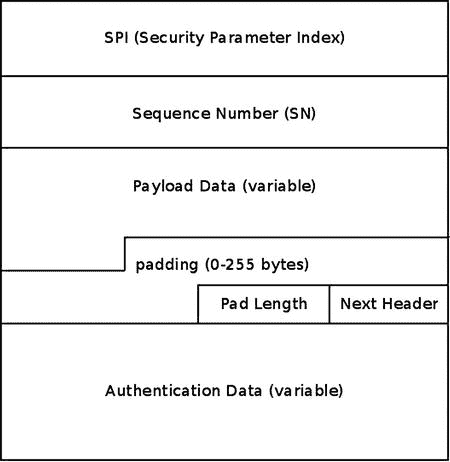
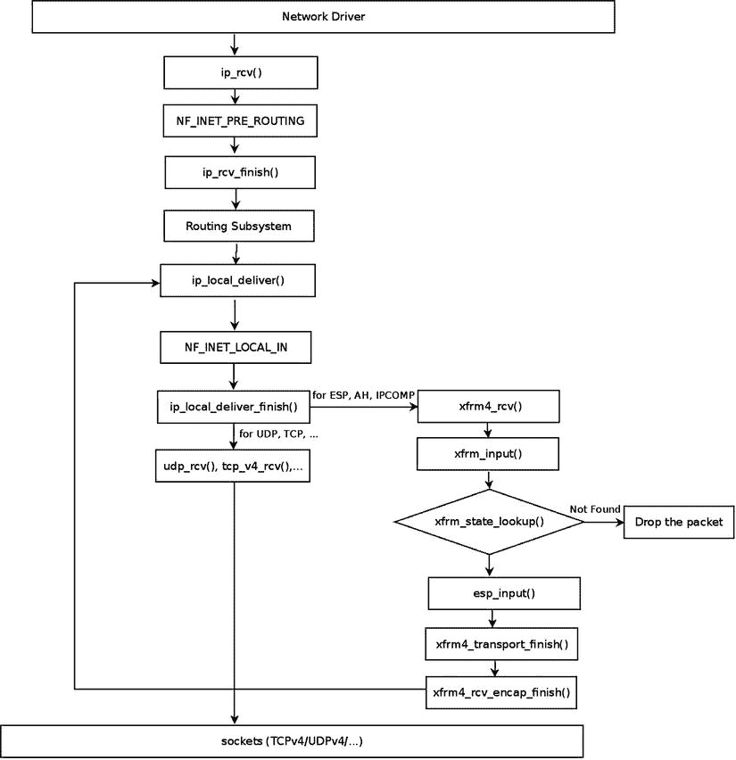
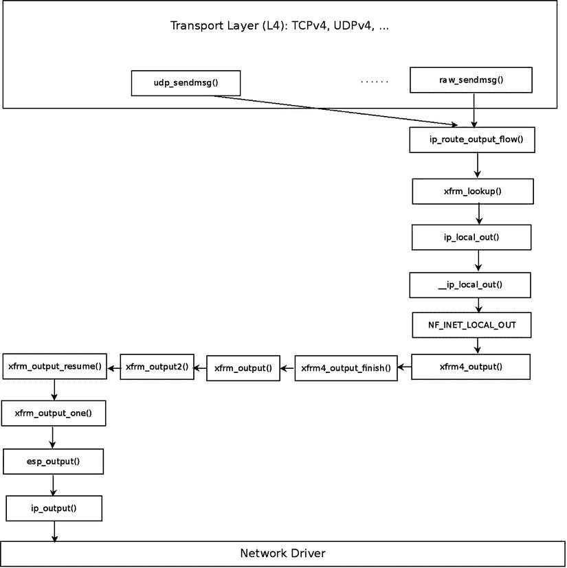
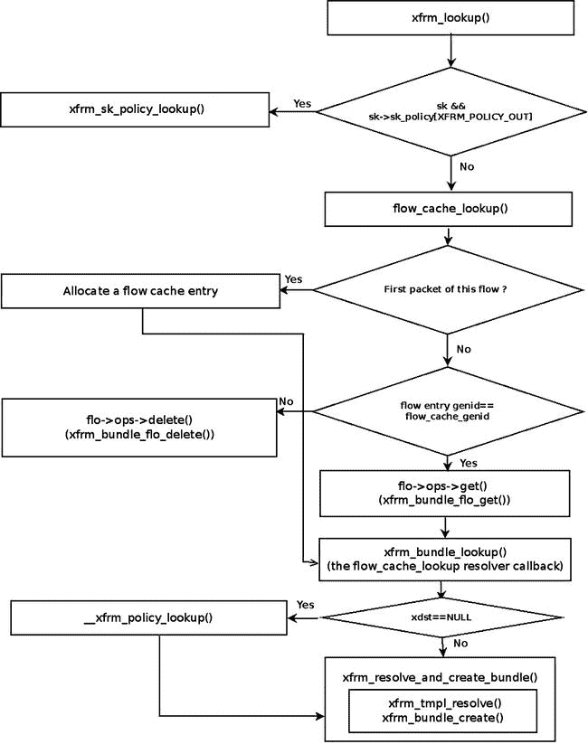

# 十、IPsec

第 9 章讲述了 netfilter 子系统及其内核实现。本章讨论互联网协议安全(IPsec)子系统。IPsec 是一组协议，通过对通信会话中的每个 IP 数据包进行身份验证和加密来保护 IP 流量。大多数安全服务是由两个主要的 IPsec 协议提供的:身份验证报头(AH)协议和封装安全负载(ESP)协议。此外，IPsec 还提供了防止尝试窃听和再次发送数据包(重放攻击)的保护。根据 IPv6 规范，IPsec 是强制性的，而在 IPv4 中是可选的。然而，包括 Linux 在内的大多数现代操作系统都支持 IPv4 和 IPv6 中的 IPsec。第一个 IPsec 协议定义于 1995 年(RFC 1825–1829)。1998 年，这些 RFC 被 RFC 2401–2412 否决。然后在 2005 年，这些 RFC 被 RFC 4301–4309 更新。

IPsec 子系统非常复杂，可能是 Linux 内核网络堆栈中最复杂的部分。考虑到组织和公民个人日益增长的安全需求，它的重要性是至关重要的。本章为你深入研究这个复杂的子系统提供了一个基础。

一般

IPsec 已经成为国际上大多数 IP 虚拟专用网技术 的标准。也就是说，也有基于不同技术的 VPN，如安全套接字层(SSL)和`pptp`(通过 GRE 协议隧道化 PPP 连接)。在 IPsec 的几种操作模式中，最重要的是传输模式和隧道模式。在传输模式下，只有 IP 数据包的有效载荷被加密，而在隧道模式下，整个 IP 数据包被加密并插入到具有新 IP 报头的新 IP 数据包中。当使用带有 IPsec 的 VPN 时，您通常在隧道模式下工作，尽管有时您在传输模式下工作(例如，L2TP/IPsec)。

我首先简单讨论一下 IPsec 中的互联网密钥交换(IKE) 用户空间守护进程和加密技术。这些主题大多不是内核网络堆栈的一部分，但是与 IPsec 操作相关，并且需要更好地理解内核 IPsec 子系统。接下来我将讨论 XFRM 框架，它是 IPsec 用户空间部分和 IPsec 内核组件之间的配置和监控接口，并解释 IPsec 数据包在 Tx 和 Rx 路径中的遍历。我用一小段关于 IPsec 中 NAT 穿越的内容来结束这一章，这是一个重要而有趣的特性，也是一个“快速参考”部分。下一节从 IKE 协议开始讨论。

互联网密钥交换

最流行的开源用户空间 Linux IPsec 解决方案是 Openswan(和从 Openswan 派生出来的`libreswan`)、strongSwan 和 racoon(属于`ipsec-tools`)。Racoon 是 Kame 项目的一部分，该项目旨在为 BSD 的变体提供免费的 IPv6 和 IPsec 协议栈实现。

要建立 IPsec 连接，您需要设置安全关联(SA)。 你可以在已经提到的用户空间项目的帮助下完成。SA 由两个参数定义:源地址和 32 位安全参数索引(SPI)。双方 T5(IPsec 术语中称为*发起方*和*响应方*)要就一个密钥(或多个密钥)、认证、加密、数据完整性和密钥交换算法等参数，以及密钥生存期(仅 IKEv1)等其他参数达成一致。这可以通过两种不同的密钥分发方式来实现:手动密钥交换(由于安全性较低，很少使用)或 IKE 协议。Openswan 和 strongSwan 实现提供了一个 IKE 守护进程(Openswan 中的`pluto`和 strongSwan 中的`charon`),它使用 UDP 端口 500(源和目的地)来发送和接收 IKE 消息。两者都使用 XFRM Netlink 接口与 Linux 内核的本地 IPsec 栈通信。strongSwan 项目是 RFC 5996“互联网密钥交换协议第 2 版(IKEv2)”唯一完整的开源实现，而 Openswan 项目仅实现了一小部分强制子集。T12】

可以在 Openswan 和 strongSwan 5.x 中使用 IKEv1 Aggressive 模式(对于 strongSwan，应该显式配置，在这种情况下`charon`守护进程的名称改为`weakSwan`)；但是这种选择被认为是不安全的。由于内置了`racoon`的遗留客户端，IKEv1 仍被苹果操作系统(iOS 和 Mac OS X)使用。虽然许多实现使用 IKEv1，但是使用 IKEv2 有许多改进和优点。我将非常简要地提到其中的一些:在 IKEv1 中，建立一个 SA 比在 IKEv2 中需要更多的消息。IKEv1 非常复杂，而 IKEv2 要简单得多，也更健壮，主要是因为每个 IKEv2 请求消息都必须得到 IKEv2 响应消息的确认。在 IKEv1 中，没有确认，但有一个退避算法，在数据包丢失的情况下，它会一直尝试下去。然而，在 IKEv1 中，当双方执行重新传输时，可能会出现竞争，而在 IKEv2 中，这种情况不会发生，因为重新传输的责任只在发起方。IKEv2 的其他重要功能包括:IKEv2 集成了 NAT 穿越支持、流量选择器的自动缩小(`left|rightsubnet`两端不必完全匹配，但一个建议可以是另一个建议的子集)、允许分配虚拟 IPv4/IPv6 地址和内部 DNS 信息的 IKEv2 配置有效负载(替换 IKEv1 模式配置)，以及 IKEv2 EAP 认证(替换危险的 IKEv1 扩展验证协议)， 它通过在客户端使用潜在的弱 EAP 验证算法(例如 EAP-MSCHAPv2)之前首先请求 VPN 服务器证书和数字签名来解决潜在的弱 PSK 问题。

IKE 分为两个阶段:第一阶段称为主模式。 在这个阶段，每一方验证另一方的身份，使用 Diffie-Hellman 密钥交换算法建立一个共同的会话密钥。这种相互认证是基于 RSA 或 ECDSA 证书或预共享秘密(预共享密钥，PSKs)，它们是基于密码的，被认为是较弱的。其他参数，如加密算法和要使用的身份验证方法也需要协商。如果这个阶段成功完成，这两个对等体就建立了 ISAKMP SA(互联网安全协会密钥管理协议安全协会)。第二阶段称为快速模式。在这个阶段， 双方就使用的密码算法达成一致。IKEv2 协议不区分阶段 1 和阶段 2，而是建立第一个 CHILD_SA 作为 IKE_AUTH 消息交换的一部分。CHILD_SA_CREATE 消息交换仅用于建立附加的 CHILD_SA，或者用于 IKE 和 IPsec SAs 的定期密钥更新。这就是为什么 IKEv1 需要九条消息来建立单个 IPsec SA，而 IKEv2 只需要四条消息就可以做到这一点。

下一节将简要讨论 IPsec 环境中的加密技术(对该主题更全面的讨论超出了本书的范围)。

IPsec 和密码学

Linux 有两个广泛使用的 IPsec 栈:在 2.6 内核中引入的本地 Netkey 栈(由 Alexey Kuznetsov 和 David S. Miller 开发)，以及最初为 2.0 内核编写的 KLIPS 栈(它早于 netfilter！).Netkey 使用 Linux 内核加密 API，而 KLIPS 可能通过开放加密框架(OCF) 支持更多的加密硬件。OCF 的优势在于它支持使用异步调用来加密/解密数据。在 Linux 内核中，大多数加密 API 执行同步调用。我应该提一下`acrypto`内核代码，它是 Linux 内核的异步加密层。所有算法类型都有异步实现。许多硬件加密加速器使用异步加密接口来卸载加密请求。这仅仅是因为在加密工作完成之前，他们不能阻塞。他们必须使用异步 API。

异步 API 也可以使用软件实现的算法。例如，`cryptd` crypto 模板可以在异步模式下运行任意算法。并且在多核环境下工作时可以使用`pcrypt` crypto 模板。该模板通过向一组可配置的 CPU 发送传入的加密请求来并行化加密层。它还负责加密请求的顺序，因此在与 IPsec 一起使用时不会引入数据包重新排序。在某些情况下，`pcrypt`的使用可以大幅提高 IPsec 的速度。加密层有一个用户管理 API，被`crconf` ( `http://sourceforge.net/projects/crconf/`)工具用来配置加密层，因此异步加密算法可以在任何需要的时候配置。随着 2008 年发布的 Linux 2.6.25 内核，XFRM 框架开始为非常高效的 AEAD(关联数据认证加密)算法(例如 AES-GCM)提供支持，尤其是在英特尔 AES-NI 指令集可用且数据完整性几乎免费的情况下。深入研究 IPsec 中的加密技术超出了本书的范围。要了解更多信息，我建议阅读威廉·斯塔林斯(Prentice Hall，2013)的*网络安全基础知识*第五版中的相关章节。

下一节讨论 XFRM 框架，它是 IPsec 的基础设施。

XFRM 框架

IPsec 是由 XFRM(发音为“transform”)框架实现的，该框架起源于 USAGI 项目，旨在提供生产质量的 IPv6 和 IPsec 协议栈。术语*转换*指的是根据某种 IPsec 规则在内核堆栈中转换的传入数据包或传出数据包。XFRM 框架是在内核 2.5 中引入的。XFRM 基础设施是独立于协议族的，这意味着 IPv4 和 IPv6 有一个通用部分，位于`net/xfrm`下。IPv4 和 IPv6 都有自己的 ESP、AH 和 IPCOMP 实现。比如 IPv4 ESP 模块是`net/ipv4/esp4.c`，IPv6 ESP 模块是`net/ipv6/esp6.c`。除此之外，IPv4 和 IPv6 实现了一些特定于协议的模块来支持 XFRM 基础设施，比如`net/ipv4/xfrm4_policy.c`或`net/ipv6/xfrm6_policy.c`。

XFRM 框架支持网络名称空间，这是一种轻量级进程虚拟化的形式，使单个进程或一组进程拥有自己的网络堆栈(我在《T4》第 14 章中讨论了网络名称空间)。每个网络名称空间(`struct net`的实例)包括一个名为`xfrm`的成员，它是`netns_xfrm`结构的一个实例。这个对象包含了很多你在本章会遇到的数据结构和变量，比如 XFRM 策略的哈希表和 XFRM 状态的哈希表、`sysctl`参数、XFRM 状态垃圾收集器、计数器等等:

```sh
struct netns_xfrm {
        struct hlist_head       *state_bydst;
        struct hlist_head       *state_bysrc;
        struct hlist_head       *state_byspi;
        . . .
        unsigned int            state_num;
        . . .

        struct work_struct      state_gc_work;

     . . .

        u32                     sysctl_aevent_etime;
        u32                     sysctl_aevent_rseqth;
        int                     sysctl_larval_drop;
        u32                     sysctl_acq_expires;
};
```

```sh
(include/net/netns/xfrm.h)
```

XFRM 初始化

在 IPv4 中，XFRM 初始化是通过从`net/ipv4/route.c`中的`ip_rt_init()`方法调用`xfrm_init()`方法和`xfrm4_init()`方法来完成的。在 IPv6 中，从`ip6_route_init()`方法调用`xfrm6_init()`方法来执行 XFRM 初始化。用户空间和内核之间的通信是通过创建 NETLINK_XFRM netlink 套接字以及发送和接收 NETLINK 消息来完成的。netlink NETLINK_XFRM 内核套接字的创建方法如下:

```sh
static int __net_init xfrm_user_net_init(struct net *net)
{
        struct sock *nlsk;
        struct netlink_kernel_cfg cfg = {
                .groups = XFRMNLGRP_MAX,
                .input  = xfrm_netlink_rcv,
        };

        nlsk = netlink_kernel_create(net, NETLINK_XFRM, &cfg);
        . . .
        return 0;
}
```

从用户空间发送的消息(像 XFRM_MSG_NEWPOLICY 用于创建新的安全策略或 XFRM_MSG_NEWSA 用于创建新的安全关联)由`xfrm_netlink_rcv()`方法(`net/xfrm/xfrm_user.c`)处理，该方法又调用`xfrm_user_rcv_msg()`方法(我在[第 2 章](02.html)中讨论 netlink 套接字)。

XFRM 策略和 XFRM 状态是 XFRM 框架的基本数据结构。我首先描述什么是 XFRM 策略，然后描述什么是 XFRM 状态。

XFRM 策略

安全策略是告诉 IPsec 某个流是否应该被处理或者是否可以绕过 IPsec 处理的规则。`xfrm_policy`结构代表一个 IPsec 策略。一个策略包括一个选择器(一个`xfrm_selector`对象)。当策略的选择器与流匹配时，将应用策略。XFRM 选择器由源地址和目的地址、源端口和目的端口、协议等字段组成，这些字段可以标识流:

```sh
struct xfrm_selector {
        xfrm_address_t  daddr;
        xfrm_address_t  saddr;
        __be16  dport;
        __be16  dport_mask;
        __be16  sport;
        __be16  sport_mask;
        __u16   family;
        __u8    prefixlen_d;
        __u8    prefixlen_s;
        __u8    proto;
        int     ifindex;
        __kernel_uid32_t        user;
};
```

```sh
(include/uapi/linux/xfrm.h)
```

`xfrm_selector_match()`方法获取 XFRM 选择器、流和族(IPv4 的 AF_INET 或 IPv6 的 AF_INET6)作为参数，当指定的流与指定的 XFRM 选择器匹配时，返回`true`。请注意，`xfrm_selector`结构也用于 XFRM 状态，您将在本节的后面看到。安全策略由`xfrm_policy`结构表示:

```sh
struct xfrm_policy {
        . . .
        struct hlist_node             bydst;
        struct hlist_node             byidx;

        /* This lock only affects elements except for entry. */
        rwlock_t                      lock;
        atomic_t                      refcnt;
        struct timer_list             timer;

        struct flow_cache_object      flo;
        atomic_t                      genid;
        u32                           priority;
        u32                           index;
        struct xfrm_mark              mark;
        struct xfrm_selector          selector;
        struct xfrm_lifetime_cfg      lft;
        struct xfrm_lifetime_cur      curlft;
        struct xfrm_policy_walk_entry walk;
        struct xfrm_policy_queue      polq;
        u8                            type;
        u8                            action;
        u8                            flags;
        u8                            xfrm_nr;
        u16                           family;
        struct xfrm_sec_ctx           *security;
        struct xfrm_tmpl              xfrm_vec[XFRM_MAX_DEPTH];
};
```

```sh
(include/net/xfrm.h)
```

以下描述涵盖了`xfrm_policy`结构的重要成员:

*   `refcnt`:XFRM 策略引用计数器；在`xfrm_policy_alloc( )`方法中初始化为 1，由`xfrm_pol_hold()`方法递增，由`xfrm_pol_put()`方法递减。
*   `timer`:每策略定时器；在`xfrm_policy_alloc()`方法中，定时器回调被设置为`xfrm_policy_timer()` 。`xfrm_policy_timer()`方法处理策略过期:它负责通过调用`xfrm_policy_delete()`方法删除过期的策略，并通过调用`km_policy_expired()`方法向所有注册的密钥管理器发送事件(XFRM_MSG_POLEXPIRE)。
*   `lft`:XFRM 策略生存期(`xfrm_lifetime_cfg`对象)。每个 XFRM 策略都有一个生存期，它是一个时间间隔(用时间或字节数表示)。

您可以使用`ip`命令和`limit`参数设置 XFRM 策略生存期值，例如:

```sh
ip xfrm policy add src 172.16.2.0/24 dst 172.16.1.0/24 limit byte-soft 6000 ...
```

*   将 XFRM 策略生存期(`lft`)的`soft_byte_limit`设置为 6000；参见`man 8 ip xfrm`。

通过在运行`ip -stat xfrm policy show`时检查生命周期配置条目，可以显示 XFRM 策略的生命周期(`lft`)。

*   `curlft`:XFRM 策略当前生命周期，，反映了生命周期上下文中策略的当前状态。`curlft`是一个`xfrm_lifetime_cur`对象。它由四个成员组成(它们都是 64 位的字段，无符号):

*   `bytes`:由 IPsec 子系统处理的字节数，在 Tx 路径中通过`xfrm_output_one()`方法递增，在 Rx 路径中通过`xfrm_input`()方法递增。
*   `packets`:IPsec 子系统处理的数据包数量，在 Tx 路径中通过`xfrm_output_one()`方法递增，在 Rx 路径中通过`xfrm_input()`方法递增。
*   `add_time`:添加策略的时间戳，在添加策略时初始化，在`xfrm_policy_insert()`方法和`xfrm_sk_policy_insert()`方法中。
*   `use_time:` The timestamp of last access to the policy. The use_time timestamp is updated, for example, in the `xfrm_lookup()` method or in the `__xfrm_policy_check()` method. Initialized to 0 when adding the XFRM policy, in the `xfrm_policy_insert()` method and in the `xfrm_sk_policy_insert()` method.

     **注意**您可以在运行`ip -stat xfrm policy show`时通过检查 lifetime current 条目来显示 XFRM 策略的当前 lifetime ( `curlft`)对象。

*   `polq:`一个队列，用于保存在没有 XFRM 状态与策略相关联时发送的数据包。默认情况下，这样的包通过调用`make_blackhole()`方法被丢弃。当`xfrm_larval_drop sysctl`条目设置为 0 ( `/proc/sys/net/core/xfrm_larval_drop`时，这些数据包被保存在 SKBs 的一个队列(`polq.hold_queue`)中；这个队列中最多可以保存 100 个数据包(XFRM_MAX_QUEUE_LEN)。这是通过用`xfrm_create_dummy_bundle`()方法创建一个虚拟 XFRM 包来实现的(详见本章后面的“XFRM 查找”一节)。默认情况下，`xfrm_larval_drop sysctl`条目被设置为 1(参见`net/xfrm/xfrm_sysctl.c`中的`__xfrm_sysctl_init()`方法)。
*   `type`:通常类型为 XFRM_POLICY_TYPE_MAIN (0)。当内核支持子策略(CONFIG_XFRM_SUB_POLICY 已设置)时，两个策略可以应用于同一个数据包，您可以使用 XFRM_POLICY_TYPE_SUB (1)类型。在内核中存在时间较短的策略应该是子策略。通常只有开发人员/调试和移动 IPv6 才需要此功能，因为您可能对 IPsec 应用一个策略，对移动 IPv6 应用一个策略。IPsec 策略通常是主策略，其生命周期比移动 IPv6(子)策略长。
*   `action` : 可以有以下两个值之一:

*   XFRM_POLICY_ALLOW (0):允许流量。
*   XFRM_POLICY_BLOCK(1):禁止流量(例如，在`/etc/ipsec.conf`中使用`type=reject`或`type=drop`时)。
*   `xfrm_nr:`与策略相关联的模板数量—最多可以有六个模板(XFRM_MAX_DEPTH)。`xfrm_tmpl`结构是 XFRM 状态和 XFRM 策略之间的中间结构。它在`copy_templates()`方法`net/xfrm/xfrm_user.c`中被初始化。
*   `family` : IPv4 或 IPv6。
*   `security:`安全上下文(`xfrm_sec_ctx`对象)，允许 XFRM 子系统限制可以通过安全关联(XFRM 状态)发送或接收数据包的套接字。更多细节请见`http://lwn.net/Articles/156604/`。
*   `xfrm_vec`:XFRM 模板的数组(`xfrm_tmpl`对象)。

内核将 IPsec 安全策略存储在安全策略数据库(SPD) 中。SPD 的管理是通过从用户空间套接字发送消息来完成的。比如:

*   添加 XFRM 策略(XFRM_MSG_NEWPOLICY)由`xfrm_add_policy()`方法处理。
*   删除 XFRM 策略(XFRM_MSG_DELPOLICY)由`xfrm_get_policy()`方法处理。
*   显示 SPD (XFRM_MSG_GETPOLICY)由`xfrm_dump_policy()`方法处理。
*   刷新 SPD (XFRM_MSG_FLUSHPOLICY)是由`xfrm_flush_policy()`方法处理的。

下一节描述什么是 XFRM 状态。

XFRM 状态(安全关联)

`xfrm_state`结构表示一个 IPsec 安全关联(SA) ( `include/net/xfrm.h`)。它代表单向流量，包括加密密钥、标志、请求 id、统计信息、重放参数等信息。通过从用户空间套接字发送请求(XFRM_MSG_NEWSA)来添加 XFRM 状态；它在内核中由`xfrm_state_add()`方法(`net/xfrm/xfrm_user.c`)处理。同样，通过发送 XFRM_MSG_DELSA 消息来删除状态，它在内核中由`xfrm_del_sa()`方法处理:

```sh
struct xfrm_state {
        . . .
        union {
                struct hlist_node       gclist;
                struct hlist_node       bydst;
        };
        struct hlist_node       bysrc;
        struct hlist_node       byspi;

        atomic_t                refcnt;
        spinlock_t              lock;

        struct xfrm_id          id;
        struct xfrm_selector    sel;
        struct xfrm_mark        mark;
        u32                     tfcpad;

        u32                     genid;

        /* Key manager bits */
        struct xfrm_state_walk  km;

        /* Parameters of this state. */
        struct {
                u32             reqid;
                u8              mode;
                u8              replay_window;
                u8              aalgo, ealgo, calgo;
                u8              flags;
                u16             family;
                xfrm_address_t  saddr;
                int             header_len;
                int             trailer_len;
        } props;

        struct xfrm_lifetime_cfg lft;

        /* Data for transformer */
        struct xfrm_algo_auth   *aalg;
        struct xfrm_algo        *ealg;
        struct xfrm_algo        *calg;
        struct xfrm_algo_aead   *aead;

        /* Data for encapsulator */
        struct xfrm_encap_tmpl  *encap;

        /* Data for care-of address */
        xfrm_address_t  *coaddr;

        /* IPComp needs an IPIP tunnel for handling uncompressed packets */
        struct xfrm_state       *tunnel;

        /* If a tunnel, number of users + 1 */
        atomic_t                tunnel_users;

        /* State for replay detection */
        struct xfrm_replay_state replay;
        struct xfrm_replay_state_esn *replay_esn;

        /* Replay detection state at the time we sent the last notification */
        struct xfrm_replay_state preplay;
        struct xfrm_replay_state_esn *preplay_esn;

        /* The functions for replay detection. */
        struct xfrm_replay      *reply;

        /* internal flag that only holds state for delayed aevent at the
         * moment
        */
        u32                     xflags;

        /* Replay detection notification settings */
        u32                     replay_maxage;
        u32                     replay_maxdiff;

        /* Replay detection notification timer */
        struct timer_list       rtimer;

        /* Statistics */
        struct xfrm_stats       stats;

        struct xfrm_lifetime_cur curlft;
        struct tasklet_hrtimer  mtimer;

        /* used to fix curlft->add_time when changing date */
        long            saved_tmo;

        /* Last used time */
        unsigned long           lastused;

        /* Reference to data common to all the instances of this
         * transformer. */
        const struct xfrm_type  *type;
        struct xfrm_mode        *inner_mode;
        struct xfrm_mode        *inner_mode_iaf;
        struct xfrm_mode        *outer_mode;

        /* Security context */
        struct xfrm_sec_ctx     *security;

        /* Private data of this transformer, format is opaque,
         * interpreted by xfrm_type methods. */
        void                    *data;
};
```

```sh
(include/net/xfrm.h)
```

以下描述详细介绍了`xfrm_state`结构的一些重要成员:

*   `refcnt`:参考计数器，由`xfrm_state_hold()`方法递增，由`__xfrm_state_put()`方法或`xfrm_state_put()`方法递减(当参考计数器达到 0 时，后者也通过调用`__xfrm_state_destroy()`方法释放 XFRM 状态)。
*   `id`:`id`(`xfrm_id`对象)由三个唯一定义它的字段组成:目的地址、spi 和安全协议(AH、ESP 或 IPCOMP)。

*   `props`:XFRM 状态的属性。例如:
*   `mode`:可以是五种模式之一(例如，传输模式为 XFRM_MODE_TRANSPORT，隧道模式为 XFRM _ MODE _ TUNNEL 参见`include/uapi/linux/xfrm.h`。
*   `flag`:比如 XFRM_STATE_ICMP。这些标志在`include/uapi/linux/xfrm.h`中可用。这些标志可以从用户空间设置，例如，使用`ip`命令和`flag`选项:`ip xfrm add state flag icmp`...
*   `family`:IPv6 的 IPv4。
*   `saddr`:XFRM 状态的源地址。
*   `lft:`XFRM 状态生存期(`xfrm_lifetime_cfg`对象)。
*   `stats`:一个`xfrm_stats`对象，代表 XFRM 状态统计。您可以通过`ip –stat xfrm show`显示 XFRM 状态统计。

内核将 IPsec 安全关联存储在安全关联数据库(SAD)中。`xfrm_state`对象存储在`netns_xfrm`(前面讨论过的 XFRM 名称空间)的三个散列表中:`state_bydst`、`state_bysrc`、`state_byspi`。这些表的关键字分别由`xfrm_dst_hash()`、`xfrm_src_hash()`和`xfrm_spi_hash()`方法计算。当添加一个`xfrm_state`对象时，它被插入到这三个散列表中。如果 spi 的值为 0(值 0 通常不用于 SPI——当它为 0 时，我将很快提到),则`xfrm_state`对象不会添加到`state_byspi`哈希表中(参见`net/xfrm/xfrm_state.c`中的`__xfrm_state_insert()`方法)。

 **注意**值为 0 的 spi 仅用于采集状态。内核向密钥管理器发送获取消息，如果流量与策略匹配，则添加一个带有 spi 0 的临时获取状态，但该状态尚未解决。只要获取状态存在，内核就不会费心发送进一步的获取；可以在`net->xfrm.sysctl_acq_expires`处配置寿命。如果状态得到解决，这个获取状态将被实际状态替换。

可以通过以下方式在 SAD 中进行查找:

*   `xfrm_state_lookup()`方法:在`state_byspi`哈希表中。
*   `xfrm_state_lookup_byaddr()`方法:在`state_bysrc`哈希表中。
*   `xfrm_state_find()`方法:在`state_bydst`哈希表中。

ESP 协议是最常用的 IPsec 协议；它支持加密和认证。下一节讨论 IPv4 ESP 实现。

ESP 实施(IPv4)

RFC 4303 中规定了电潜泵协议；它支持加密和认证。虽然它也支持仅加密和仅身份验证模式，但它通常与加密和身份验证一起使用，因为这样更安全。这里我还应该提到 AES-GCM 等新的认证加密(AEAD)方法，它可以在一个通道中完成加密和数据完整性计算，并且可以在多个内核上高度并行化，因此借助英特尔 AES-NI 指令集，可以实现几个 Gbit/s 的 IPsec 吞吐量。ESP 协议支持隧道模式和传输模式；协议标识符是 50 (IPPROTO_ESP)。ESP 为每个数据包添加新的报头和报尾。根据[图 10-1](#Fig1) 所示的 ESP 格式，有以下字段:

*   *SPI:* 一个 32 位的安全参数索引。 和源地址一起标识一个 SA。
*   *序列号:* 32 位，每发送一个包递增 1，以防止重放攻击。
*   *净荷数据:* 一个可变大小的加密数据块。
*   *填充:*为加密数据块填充 以满足对齐要求(0-255 字节)。
*   *填充长度:*以字节为单位的填充大小(1 字节)。
*   *下一个报头:*下一个报头的类型(1 字节)。
*   *认证数据:* 【完整性校验值】(ICV)。



图 10-1 。ESP 格式

下一节讨论 IPv4 ESP 初始化。

IPv4 ESP 初始化

我们首先定义一个`esp_type` ( `xfrm_type`对象)和`esp4_protocol` ( `net_protocol`对象)，然后注册它们:

```sh
static const struct xfrm_type esp_type =
{
        .description    = "ESP4",
        .owner          = THIS_MODULE,
        .proto          = IPPROTO_ESP,
        .flags          = XFRM_TYPE_REPLAY_PROT,
        .init_state     = esp_init_state,
        .destructor     = esp_destroy,
        .get_mtu        = esp4_get_mtu,
        .input          = esp_input,
        .output         = esp_output
};

static const struct net_protocol esp4_protocol = {
        .handler        =       xfrm4_rcv,
        .err_handler    =       esp4_err,
        .no_policy      =       1,
        .netns_ok       =       1,
};

static int __init esp4_init(void)
{
```

每个协议族都有一个`xfrm_state_afinfo`对象的实例，它包括协议族特定的状态方法；因此，IPv4 有`xfrm4_state_afinfo`(`net/ipv4/xfrm4_state.c`)，IPv6 有`xfrm6_state_afinfo`。这个对象包括一个名为`type_map`的`xfrm_type`对象数组。通过调用`xfrm_register_type()`方法注册 XFRM 类型会将指定的`xfrm_type`设置为该数组中的一个元素:

```sh
        if (xfrm_register_type(&esp_type, AF_INET) < 0) {
                pr_info("%s: can't add xfrm type\n", __func__);
                return -EAGAIN;
        }
```

注册 IPv4 ESP 协议就像注册任何其他 IPv4 协议一样，通过调用`inet_add_protocol()`方法来完成。注意，IPv4 ESP 使用的协议处理程序，即`xfrm4_rcv()`方法，也被 IPv4 AH 协议(`net/ipv4/ah4.c`)和 IPv4 IPCOMP (IP 有效载荷压缩协议)协议(`net/ipv4/ipcomp.c`)使用。

```sh
        if (inet_add_protocol(&esp4_protocol, IPPROTO_ESP) < 0) {
                pr_info("%s: can't add protocol\n", __func__);
                xfrm_unregister_type(&esp_type, AF_INET);
                return -EAGAIN;
        }
        return 0;
}
```

```sh
(net/ipv4/esp4.c)
```

接收 IPsec 数据包(传输模式)

假设您在 IPv4 的传输模式下工作，您收到了一个目的地为本地主机的 ESP 数据包。传输模式下的 ESP 不加密 IP 报头，只加密 IP 有效负载。[图 10-2](#Fig2) 显示了一个传入的 IPv4 ESP 数据包的遍历，本节描述了其各个阶段。我们将通过本地交付的所有通常阶段，从`ip_rcv()`方法开始，我们将到达`ip_local_deliver_finish()`方法。因为 IPv4 报头中的 protocol 字段的值是 ESP (50)，所以我们调用它的处理程序，这就是`xfrm4_rcv()`方法，正如您前面看到的。`xfrm4_rcv()`方法进一步调用通用的`xfrm_input()`方法，后者通过调用`xfrm_state_lookup()`方法在 SAD 中执行查找。如果查找失败，数据包将被丢弃。在查找命中的情况下，调用相应 IPsec 协议的`input`回调方法:

```sh
int xfrm_input(struct sk_buff *skb, int nexthdr, __be32 spi, int encap_type)
{
         struct xfrm_state *x;
         do {
                 . . .
```



[图 10-2](#_Fig2) 。正在接收 IPv4 ESP 数据包，本地传递，传输模式。注意:图中描述了一个 IPv4 ESP 数据包。对于 IPv4 AH 包，调用 ah_input()方法，而不是 esp_input()方法；同样，对于 IPv4 IPCOMP 数据包，将调用 ipcomp_input()方法，而不是 esp_input()方法

在`state_byspi`散列表中执行查找:

```sh
x = xfrm_state_lookup(net, skb->mark, daddr, spi, nexthdr, family);
```

如果查找失败，则静默丢弃数据包:

```sh
if (x == NULL) {
                         XFRM_INC_STATS(net, LINUX_MIB_XFRMINNOSTATES);
                         xfrm_audit_state_notfound(skb, family, spi, seq);
                         goto drop;
}
```

在这种情况下，对于 IPv4 ESP 传入流量，与状态(`x->type`)相关联的 XFRM 类型是 ESP XFRM 类型(`esp_type`)；它的`input`回调被设置为`esp_input()`，如前面的“IPv4 ESP 初始化”一节所述。

通过调用`x->type->input()`，在下面一行中`esp_input()`方法被调用；此方法返回原始数据包在被 ESP 加密之前的协议号:

```sh
nexthdr = x->type->input(x, skb);
. . .
```

使用 XFRM_MODE_SKB_CB 宏将原始协议号保存在 SKB 的控制缓冲区(`cb`)中；稍后将使用它来修改数据包的 IPv4 报头，您将会看到:

```sh
XFRM_MODE_SKB_CB(skb)->protocol = nexthdr;
```

在`esp_input()`方法终止后，调用`xfrm4_transport_finish()`方法。该方法修改 IPv4 报头的各个字段。看一看`xfrm4_transport_finish()`的方法:

```sh
int xfrm4_transport_finish(struct sk_buff *skb, int async)
{
        struct iphdr *iph = ip_hdr(skb);
```

IPv4 头(`iph->protocol`)的协议此时为 50(ESP)；您应该将它设置为原始数据包的协议号(在它被 ESP 加密之前)，以便它将被 L4 套接字处理。原始数据包的协议号保存在`XFRM_MODE_SKB_CB(skb)->protocol`中，正如您在本节前面看到的:

```sh
iph->protocol = XFRM_MODE_SKB_CB(skb)->protocol;

. . .
__skb_push(skb, skb->data - skb_network_header(skb));
iph->tot_len = htons(skb->len);
```

自 IPv4 标头被修改后，重新计算校验和:

```sh
ip_send_check(iph);
```

调用任何 netfilter NF_INET_PRE_ROUTING 钩子回调，然后调用`xfrm4_rcv_encap_finish()`方法:

```sh
        NF_HOOK(NFPROTO_IPV4, NF_INET_PRE_ROUTING, skb, skb->dev, NULL,
                xfrm4_rcv_encap_finish);
        return 0;
}
```

`xfrm4_rcv_encap_finish()`方法调用`ip_local_deliver()`方法。现在，IPv4 报头中的`protocol`成员的值是原始的传输协议(UDPv4、TCPv4 等等)，所以从现在开始，您继续进行通常的数据包遍历，数据包被传递到传输层(L4)。

发送 IPsec 数据包(传输模式)

[图 10-3](#Fig3) 显示了在传输模式下通过 IPv4 ESP 发送的输出数据包的 Tx 路径。在路由子系统中执行查找(通过调用`ip_route_output_flow()`方法)后的第一步是执行 XFRM 策略的查找，该策略可以应用于这个流。您可以通过调用`xfrm_lookup()`方法来实现这一点(我将在本节稍后讨论该方法的内部机制)。如果有查找命中，继续到`ip_local_out()`方法，然后，在调用如图[图 10-3](#Fig3) 所示的几个方法后，最终到达`esp_output()`方法，该方法加密数据包，然后通过调用`ip_output()`方法发送出去。



[图 10-3](#_Fig3) 。传输 IPv4 ESP 数据包，传输模式。为了简单起见，省略了创建虚拟束的情况(当没有 XFRM 状态时)和一些其他细节

下一节讨论如何在 XFRM 中执行查找。

XFRM 查找

系统发出的每个数据包都会调用`xfrm_lookup()`方法 。您希望这种查找尽可能高效。为了实现这个目标，使用了包。Bundles 允许您缓存重要的信息，比如路由、策略、策略数量等等；这些包是`xfrm_dst`结构的实例，通过使用流缓存来存储。当某个流的第一个包到达时，您在通用流缓存中创建一个条目，然后创建一个包(`xfrm_dst`对象)。在对该包的查找失败之后，完成包的创建，因为它是该流的第一个包。当此流的后续数据包到达时，您将会在执行流缓存查找时得到一个命中结果:

```sh
struct xfrm_dst {
        union {
                struct dst_entry        dst;
                struct rtable           rt;
                struct rt6_info         rt6;
        } u;
        struct dst_entry *route;
        struct flow_cache_object flo;
        struct xfrm_policy *pols[XFRM_POLICY_TYPE_MAX];
        int num_pols, num_xfrms;
#ifdef CONFIG_XFRM_SUB_POLICY
        struct flowi *origin;
        struct xfrm_selector *partner;
#endif
        u32 xfrm_genid;
        u32 policy_genid;
        u32 route_mtu_cached;
        u32 child_mtu_cached;
        u32 route_cookie;
        u32 path_cookie;
};
```

```sh
(include/net/xfrm.h)
```

`xfrm_lookup()`方法是一个非常复杂的方法。我讨论了它的重要部分，但我没有深入研究它的所有细微差别。[图 10-4](#Fig4) 显示了`xfrm_lookup()`方法的内部框图。



[图 10-4](#_Fig4) 。xfrm_lookup()内部

我们来看看`xfrm_lookup()`方法:

```sh
struct dst_entry *xfrm_lookup(struct net *net, struct dst_entry *dst_orig,
                              const struct flowi *fl, struct sock *sk, int flags)
{
```

`xfrm_lookup()`方法只处理 Tx 路径；因此，您通过以下方式将流向(`dir`)设置为 FLOW_DIR_OUT:

```sh
         u8 dir = policy_to_flow_dir(XFRM_POLICY_OUT);
```

如果一个策略与这个套接字相关联，您可以通过`xfrm_sk_policy_lookup()`方法执行查找，检查数据包流是否与策略选择器匹配。请注意，如果要转发数据包，则从`__xfrm_route_forward()`方法、 中调用了`xfrm_lookup()`方法，并且没有与数据包相关联的套接字，因为它不是在本地主机上生成的；在这种情况下，指定的`sk`参数为空:

```sh
        if (sk && sk->sk_policy[XFRM_POLICY_OUT]) {
                num_pols = 1;
                pols[0] = xfrm_sk_policy_lookup(sk, XFRM_POLICY_OUT, fl);

        . . .
}
```

如果没有与这个套接字相关联的策略，那么通过调用`flow_cache_lookup()`方法，将指向`xfrm_bundle_lookup`方法的函数指针作为参数传递(`resolver`回调),在通用流缓存中执行查找。查找的关键是流对象(指定的`fl`参数)。如果在流缓存中没有找到条目，请分配一个新的流缓存条目。如果找到一个具有相同`genid`的条目，通过调用`flo->ops->get(flo)`来调用`xfrm_bundle_flo_get()`方法。最后，您通过调用`resolver`回调来调用`xfrm_bundle_lookup()`方法，该回调获取流对象作为参数(`oldflo`)。参见`net/core/flow.c`中`flow_cache_lookup()`方法 的实现:

```sh
flo = flow_cache_lookup(net, fl, family, dir, xfrm_bundle_lookup, dst_orig);
```

获取包含流缓存对象作为成员的包(`xfrm_dst`对象):

```sh
xdst = container_of(flo, struct xfrm_dst, flo);
```

获取缓存数据，如策略数量、模板数量、策略和路线:

```sh
       num_pols = xdst->num_pols;
       num_xfrms = xdst->num_xfrms;
       memcpy(pols, xdst->pols, sizeof(struct xfrm_policy*) * num_pols);
       route = xdst->route;
}

dst = &xdst->u.dst;
```

接下来是处理虚拟包。一个*虚拟束*是 一个其中路由成员为空的束。当没有找到 XFRM 状态时，通过调用`xfrm_create_dummy_bundle()`方法在 XFRM 包查找过程中创建它(通过`xfrm_bundle_lookup()`方法)。在这种情况下，根据`sysctl_larval_drop` ( `/proc/sys/net/core/xfrm_larval_drop`)的值，可以选择两个选项中的一个:

*   如果`sysctl_larval_drop`被置位(这意味着它的值是 1——默认情况下是这样，如本章前面提到的),该数据包应该被丢弃。
*   如果未设置`sysctl_larval_drop`(其值为 0)，则数据包保存在每个策略的队列(`polq.hold_queue`)中，该队列最多可包含 100 个(XFRM _ MAX _ QUEUE _ LEN)skb；这是通过`xdst_queue_output()`方法实现的。这些数据包会一直保留，直到 XFRM 状态被解析或超时。一旦状态被解析，包就被送出队列。如果在一段时间间隔后 XFRM 状态没有得到解决(`xfrm_policy_queue`对象的超时)，那么通过`xfrm_queue_purge()`方法:

    ```sh
    if (route == NULL && num_xfrms > 0) {
            /* The only case when xfrm_bundle_lookup() returns a
             * bundle with null route, is when the template could
             * not be resolved. It means policies are there, but
             * bundle could not be created, since we don't yet
             * have the xfrm_state's. We need to wait for KM to
             * negotiate new SA's or bail out with error.*/
             if (net->xfrm.sysctl_larval_drop) {
    ```

    刷新队列

对于 IPv4，`make_blackhole()`方法调用`ipv4_blackhole_route()`方法。对于 IPv6，它调用`ip6_blackhole_route()`方法:

```sh
        return make_blackhole(net, family, dst_orig);
}
```

下一节将介绍 IPsec 最重要的特性之一—NAT 穿越，并解释它是什么以及为什么需要它。

IPsec 中的 NAT 穿越

为什么 NAT 设备不允许 IPsec 流量通过？NAT 会改变 IP 地址，有时还会改变数据包的端口号。因此，它会重新计算 TCP 或 UDP 报头的校验和。传输层校验和计算考虑了 IP 地址的来源和目的地。因此，即使只更改了 IP 地址，也应该重新计算 TCP 或 UDP 校验和。但是，在传输模式下使用 ESP 加密，NAT 设备无法更新校验和，因为 TCP 或 UDP 报头是使用 ESP 加密的。有些协议的校验和不包含 IP 报头(如 SCTP)，所以这个问题不会发生。为了解决这些问题，开发了 IPsec 的 NAT 穿越标准(或者，按照 RFC 3948 中的官方术语，“IPsec ESP 数据包的 UDP 封装”)。UDP 封装可以应用于 IPv4 数据包，也可以应用于 IPv6 数据包。NAT 穿越解决方案不限于 IPsec 流量；这些技术通常是客户端到客户端的网络应用所需要的，尤其是点对点和基于互联网协议的语音(VoIP)应用。

VoIP NAT 穿越有一些部分解决方案，比如 STUN，TURN，ICE 等等。我应该在这里提到，strongSwan 实现了 IKEv2 中介扩展服务(`http://tools.ietf.org/html/draft-brunner-ikev2-mediation-00`)，它允许位于 NAT 路由器后面的两个 VPN 端点使用类似于 TURN 和 ice 的机制建立直接的对等 IPsec 隧道。例如，STUN 用于 VoIP 开源 Ekiga 客户端(以前称为 gnomemeeting)。这些解决方案的问题是它们不能处理 NAT 设备。称为 SBCs (会话边界控制器)的设备为 VoIP 中的 NAT 穿越提供了完整的解决方案。SBC 可以在硬件中实现(例如，Juniper Networks 提供了集成路由器的 SBC 解决方案),也可以在软件中实现。这些 SBC 解决方案对实时协议(RTP)发送的媒体流量执行 NAT 穿越，有时也对会话发起协议(SIP)发送的信令流量执行 NAT 穿越。NAT 穿越在 IKEv2 是可选的。Openswan、strongSwan 和 racoon 支持 NAT 穿越，但 Openswan 和 racoon 仅支持 IKEv1 的 NAT-T，而 strongSwan 支持 IKEv1 和 IKEv2 的 NAT 穿越。

NAT-T 操作模式

NAT 穿越是如何工作的？首先，请记住 NAT-T 仅适用于 ESP 流量，而不适用于 AH。另一个限制是 NAT-T 不能用于手动键控，只能用于 IKEv1 和 IKEv2。这是因为 NAT-T 与交换 IKEv1/IKEv2 消息联系在一起。首先，您必须告诉用户空间守护进程(`pluto`)您想要使用 NAT 遍历特性，因为它在默认情况下是不激活的。在 Openswan 中，您可以通过将`nat_traversal=yes`添加到`/etc/ipsec.conf`中的连接参数来实现这一点。不在 NAT 后面的客户端不受添加此项的影响。在 strongSwan 中，IKEv2 `charon`守护进程始终支持 NAT 穿越，并且该功能不能被停用。在 IKE 的第一阶段(主模式)，你检查两个对等体是否都支持 NAT-T，在 IKEv1 中，当一个对等体支持 NAT-T 时，其中一个 ISAKAMP 头成员(厂商 ID)会告知它是否支持 NAT-T，在 IKEv2，NAT-T 是标准的一部分，不必公布。如果满足这一条件，您可以通过发送 NAT-D 有效载荷消息来检查两个 IPsec 对等方之间的路径中是否有一个或多个 NAT 设备。如果也满足这个条件，NAT-T 通过在 IP 报头和 ESP 报头之间插入 UDP 报头来保护原始 IPsec 编码的分组。UDP 报头中的源端口和目的端口都是 4500。此外，NAT-T 每 20 秒发送一次保活消息，以便 NAT 保留其映射。保持活动消息也在 UDP 端口 4500 上发送，并通过其内容和值(一个字节，0xFF)来识别。当此数据包到达 IPsec 对等方时，在通过 NAT 后，内核会剥离 UDP 报头并解密 ESP 有效负载。参见`net/ipv4/xfrm4_input.c`中的`xfrm4_udp_encap_rcv()`方法。

摘要

本章介绍了 IPsec 和 XFRM 框架(IPsec 的基础设施),以及 XFRM 策略和状态(XFRM 框架的基本数据结构)。我还讨论了 IKE、ESP4 实现、传输模式下 ESP4 的 Rx/Tx 路径以及 IPsec 中的 NAT 穿越。第 11 章处理以下传输层(L4)协议:UDP、TCP、SCTP 和 DCCP 。接下来的“快速参考”部分涵盖了与本章讨论的主题相关的主要方法，按其上下文排序。

快速参考

我用 IPsec 的重要方法的简短列表来结束这一章。本章提到了其中一些。之后，我包含了一个 XFRM SNMP MIB 计数器表。

方法

先说方法。

bool xfrm _ selector _ match(const struct xfrm _ selector * sel，const struct flowi *fl，无符号短族)；

当指定的流与指定的 XFRM 选择器匹配时，该方法返回`true`。调用 IPv4 的`__xfrm4_selector_match()`方法或 IPv6 的`__xfrm6_selector_match()`方法。

int xfrm _ policy _ match(const struct xfrm _ policy * pol，const struct flowi *fl，u8 type，u16 family，int dir)；

如果指定的策略可以应用于指定的流，则该方法返回 0，否则返回–`errno`。

struct xfrm _ policy * xfrm _ policy _ alloc(struct net * net，GFP _ t GFP)；

这个方法分配并初始化一个 XFRM 策略。它将其引用计数器设置为 1，初始化读写锁，将策略名称空间(`xp_net`)指定为指定的网络名称空间，将其定时器回调设置为`xfrm_policy_timer()`，将其状态解析分组队列定时器(`policy->polq.hold_timer`)回调设置为`xfrm_policy_queue_process()`。

void xfrm _ policy _ destroy(struct xfrm _ policy * policy)；

此方法删除指定 XFRM 策略对象的计时器，并释放指定 XFRM 策略内存。

void xfrm _ pol _ hold(struct xfrm _ policy * policy)；

此方法将指定 XFRM 策略的引用计数增加 1。

静态内联 void xfrm _ pol _ put(struct xfrm _ policy * policy)；

此方法将指定 XFRM 策略的引用计数减 1。如果引用计数达到 0，调用`xfrm_policy_destroy()`方法。

struct xfrm _ state _ af info * xfrm _ state _ get _ af info(unsigned int family)；

该方法返回与指定协议族相关的`xfrm_state_afinfo`对象。

struct dst _ entry * xfrm _ bundle _ create(struct xfrm _ policy * policy，struct xfrm_state **xfrm，int nx，const struct flowi *fl，struct dst _ entry * dst)；

这个方法创建一个 XFRM 包。从`xfrm_resolve_and_create_bundle()`方法调用。

int policy _ to _ flow _ dir(int dir)；

此方法根据指定的策略方向返回流向。例如，当指定方向为 XFRM_POLICY_IN 时，返回 FLOW_DIR_IN，依此类推。

静态 struct xfrm _ dst * xfrm _ create _ dummy _ bundle(struct net * net，struct dst_entry *dst，const struct flowi *fl，int num_xfrms，u16 系列)；

这个方法创建了一个虚拟包。当找到策略但没有匹配的状态时，从`xfrm_bundle_lookup()`方法调用。

struct xfrm _ dst * xfrm _ alloc _ dst(struct net * net，int family)；

这个方法分配 XFRM bundle 对象。从`xfrm_bundle_create()`方法和`xfrm_create_dummy_bundle()`方法调用。

int xfrm_policy_insert(int dir，struct xfrm_policy *policy，int excl)；

该方法将 XFRM 策略添加到 SPD 中。从`xfrm_add_policy()`方法(`net/xfrm/xfrm_user.c`)或从`pfkey_spdadd()`方法(`net/key/af_key.c`)调用。

int xfrm _ policy _ delete(struct xfrm _ policy * pol，int dir)；

此方法释放指定 XFRM 策略对象的资源。需要方向参数(`dir`)来将每个名称空间`netns_xfrm`对象中的`policy_count`中的相应 XFRM 策略计数器减 1。

int xfrm _ state _ add(struct xfrm _ state * x)；

此方法将指定的 XFRM 状态添加到 SAD。

int xfrm _ state _ delete(struct xfrm _ state * x)；

此方法从 SAD 中删除指定的 XFRM 状态。

void _ _ xfrm _ state _ destroy(struct xfrm _ state * x)；

该方法通过将 XFRM 状态添加到 XFRM 状态垃圾列表并激活 XFRM 状态垃圾收集器来释放 XFRM 状态的资源。

int xfrm _ state _ walk(struct net * net，struct xfrm_state_walk *walk，int (*func)(struct xfrm_state *，int，void*)，void * data)；

这个方法遍历所有 XFRM 状态(`net->xfrm.state_all`)并调用指定的`func`回调。

struct xfrm _ state * xfrm _ state _ alloc(struct net * net)；

该方法分配并初始化 XFRM 状态。

void xfrm _ queue _ purge(struct sk _ buff _ head * list)；

该方法刷新每个策略的状态解析队列(`polq.hold_queue`)。

int xfrm _ input(struct sk _ buff * skb，int nexthdr，__be32 spi，int encap _ type)；

这个方法是主要的 Rx IPsec 处理程序。

静态 struct dst _ entry * make _ black hole(struct net * net，u16 家族，struct dst _ entry * dst _ orig)；

当没有已解析的状态并且设置了`sysctl_larval_drop`时，从`xfrm_lookup()`方法调用该方法。对于 IPv4，`make_blackhole()`方法调用`ipv4_blackhole_route()`方法；对于 IPv6，它调用`ip6_blackhole_route()`方法。

int xdst _ queue _ output(struct sk _ buff * skb)；

该方法处理将数据包添加到每策略状态解析数据包队列(`pq->hold_queue`)。这个队列最多可以包含 100 个(XFRM_MAX_QUEUE_LEN)数据包。

struct net * xs _ net(struct xfrm _ state * x)；

该方法返回与指定的`xfrm_state`对象相关联的名称空间对象(`xs_net`)。

struct net * XP _ net(const struct xfrm _ policy * XP)；

该方法返回与指定的`xfrm_policy`对象相关联的名称空间对象(xp_net)。

int xfrm _ policy _ id 2 dir(u32 index)；

此方法根据指定的索引返回策略的方向。

int esp _ input(struct xfrm _ state * x，struct sk _ buff * skb)；

此方法是主要的 IPv4 ESP 协议处理程序。

struct IP _ esp _ HDR * IP _ esp _ HDR(const struct sk _ buf * skb)；

此方法返回与指定 SKB 关联的 ESP 头。

int verify _ new policy _ info(struct xfrm _ user policy _ info * p)；

该方法验证指定的`xfrm_userpolicy_info`对象包含有效值。(`xfrm_userpolicy_info`是从用户空间传递过来的对象)。如果是有效对象，则返回 0，否则返回-EINVAL 或-EAFNOSUPPORT。

桌子

表 10-1 列出了 XFRM SNMP MIB 计数器。

[表 10-1。](#_Tab1) XFRM SNMP MIB 计数器

<colgroup><col width="35%"> <col width="30%"> <col width="35%"></colgroup> 
| 

Linux 符号

 | 

SNMP (procfs)符号

 | 

计数器可能递增的方法

 |
| --- | --- | --- |
| Linux _ MIB _ xfterminerror | `XfrmInError` | `xfrm_input()` |
| Linux _ MIB _ xfterminbuffer error | `XfrmInBufferError` | `xfrm_input(),__xfrm_policy_check()` |
| Linux _ MIB _ xfterminhderror | `XfrmInHdrError` | `xfrm_input(),__xfrm_policy_check()` |
| Linux _ MIB _ xfrmannotations | `XfrmInNoStates` | `xfrm_input()` |
| Linux _ MIB _ xfterminstate protoerror | `XfrmInStateProtoError` | `xfrm_input()` |
| Linux _ MIB _ xfterminstate mode error | `XfrmInStateModeError` | `xfrm_input()` |
| Linux _ MIB _ xfterminstate sequence error | `XfrmInStateSeqError` | `xfrm_input()` |
| Linux _ MIB _ xfterminstate expired | `XfrmInStateExpired` | `xfrm_input()` |
| LINUX_MIB_XFRMINSTATEMISMATCH | `XfrmInStateMismatch` | `xfrm_input()`，`__xfrm_policy_check()` |
| Linux _ MIB _ xfterminstate invalid | `XfrmInStateInvalid` | `xfrm_input()` |
| linux _ mib _ xfrmintmplmismatch | `XfrmInTmplMismatch` | `__xfrm_policy_check()` |
| linux _ mib _ xfrminnopols | `XfrmInNoPols` | `__xfrm_policy_check()` |
| Linux _ MIB _ xfterminpolblock | `XfrmInPolBlock` | `__xfrm_policy_check()` |
| Linux _ MIB _ xfterminpolerror | `XfrmInPolError` | `__xfrm_policy_check()` |
| Linux _ MIB _ xfrmouteerror | `XfrmOutError` | `xfrm_output_one(),xfrm_output()` |
| linux _ mib _ xfrmoutbundlegenerror | `XfrmOutBundleGenError` | `xfrm_resolve_and_create_bundle()` |
| Linux _ MIB _ xfrmoutbundleeckerror | `XfrmOutBundleCheckError` | `xfrm_resolve_and_create_bundle()` |
| linux _ mib _ xfrmoutnostates | `XfrmOutNoStates` | `xfrm_lookup()` |
| linux _ mib _ xfrmoutstateprotoerror | `XfrmOutStateProtoError` | `xfrm_output_one()` |
| linux _ mib _ xfrmoutstatemodeerror | `XfrmOutStateModeError` | `xfrm_output_one()` |
| linux _ mib _ xfrmoutstateseqerror | `XfrmOutStateSeqError` | `xfrm_output_one()` |
| LINUX_MIB_XFRMOUTSTATEEXPIRED | `XfrmOutStateExpired` | `xfrm_output_one()` |
| LINUX_MIB_XFRMOUTPOLBLOCK | `XfrmOutPolBlock` | `xfrm_lookup()` |
| LINUX_MIB_XFRMOUTPOLDEAD | `XfrmOutPolDead` | `n/a` |
| LINUX_MIB_XFRMOUTPOLERROR | `XfrmOutPolError` | `xfrm_bundle_lookup()`，`xfrm_resolve_and_create_bundle()` |
| Linux _ MIB _ xfrmfwdhdreerror | `XfrmFwdHdrError` | `__xfrm_route_forward()` |
| linux _ mib _ xfrmoutstateinvalid | `XfrmOutStateInvalid` | `xfrm_output_one()` |

 **注**IPsec git 树:git://git . kernel . org/pub/SCM/Linux/kernel/git/klassert/IPsec . git

ipsec git 树用于修复 ipsec 网络子系统；这个树中的开发是针对 David Miller 的 net git 树完成的。

ipsec-next git 树:git://git . kernel . org/pub/SCM/Linux/kernel/git/klass et/IPSec-next . git

ipsec-next 树用于以 linux-next 为目标的 ipsec 更改；这个树的开发是针对 David Miller 的 net-next git 树进行的。

IPsec 子系统维护人员是 Steffen Klassert、Herbert Xu 和 David S. Miller。