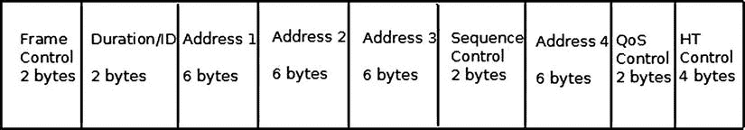
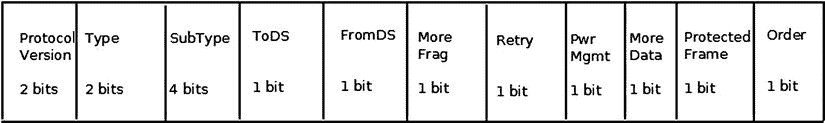
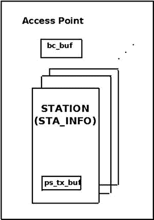
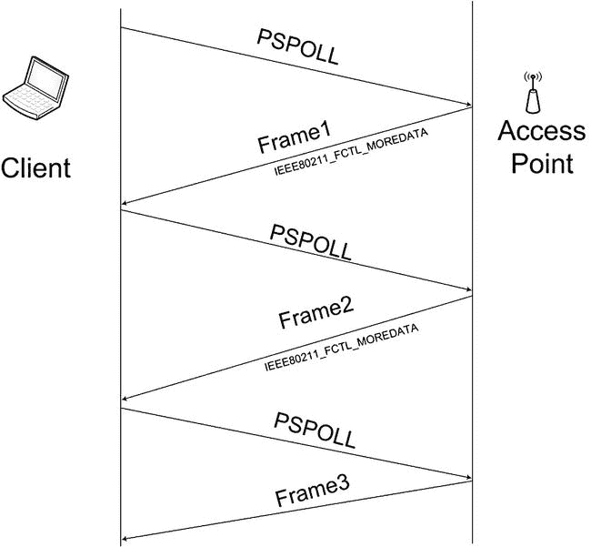
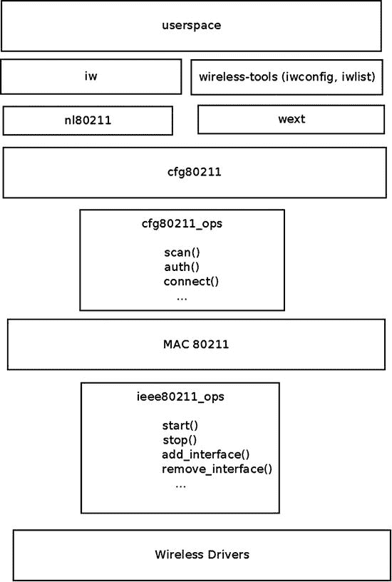
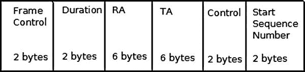
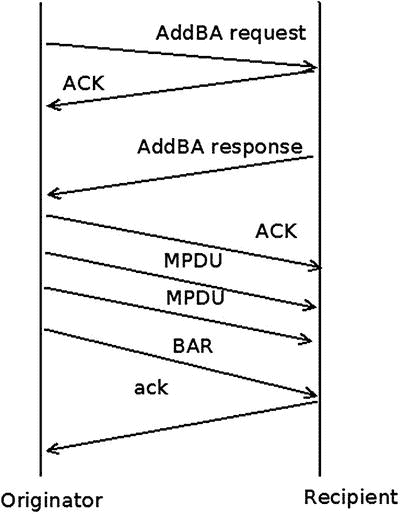
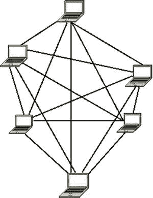
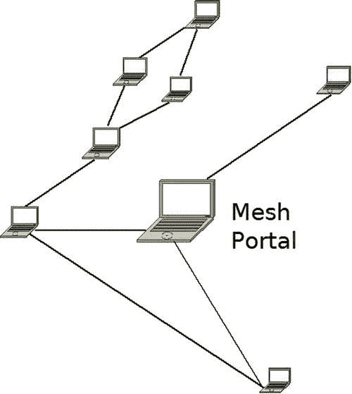

第十二章


Linux 中的无线技术

第 11 章处理第 4 层协议，它使我们能够与用户空间通信。本章讨论了 Linux 内核中的无线栈。我描述了 Linux 无线协议栈(mac80211 子系统)并讨论了其中一些重要机制的实现细节，如 IEEE 802.11n 中使用的包聚合和块确认，以及省电模式。为了理解无线子系统的实现，熟悉 802.11 MAC 报头是必不可少的。本章深入介绍了 802.11 MAC 报头、其成员及其用法。我还讨论了一些常见的无线拓扑，如基础设施基站、独立基站和网状网络。

**Mac80211 子系统**

在 20 世纪 90 年代末，在 IEEE 中有关于无线局域网(WLANS)协议的讨论。无线局域网 IEEE 802.11 规范的原始版本于 1997 年发布，并于 1999 年修订。在接下来的几年中，增加了一些扩展，正式称为 802.11 修正案。这些扩展可以分为 PHY(物理)层扩展、MAC(媒体访问控制)层扩展、管理扩展等等。例如，PHY 层扩展是 1999 年的 802.11b、802.11a(也是 1999 年的)和 2003 年的 802.11g。MAC 层扩展例如是用于 QoS 的 802.11e 和用于网状网络的 802.11s。本章的“网状网络”部分涉及 IEEE802.11s 修正案的 Linux 内核实现。IEEE802.11 规范经过修订，2007 年发布了 1232 页的第二版。2012 年，发布了一份 2793 页的规范，从`http://standards.ieee.org/findstds/standard/802.11-2012.html`开始提供。在本章中，我将该规范称为 IEEE 802.11-2012。以下是 802.11 重要修订的部分列表:

*   IEEE 802.11d: 国际(国与国)漫游扩展(2001)。
*   IEEE 802.11e: 增强:QoS，包括数据包突发(2005)。
*   IEEE 802.11h: 针对欧洲兼容性的频谱管理 802.11 a(2004)。
*   IEEE 802.11i: 增强的安全性(2004 年)。
*   IEEE 802.11j: 日本的扩展(2004)。
*   IEEE 802.11k: 无线电资源测量增强(2008 年)。
*   IEEE 802.11n: 使用 MIMO(多输入多输出天线)提高吞吐量(2009)。
*   *IEEE 802.11p:* WAVE:车载环境(如救护车、客车)的无线接入。它有一些特性，如不使用 BSS 概念和较窄的(5/10 MHz)信道。注意，在撰写本文时，Linux 还不支持 IEEE 802.11p。
*   *IEEE 802.11v:* 无线网络管理。
*   *IEEE 802.11w:* 受保护的管理帧。
*   *美国 IEEE 802.11y:*3650–3700 MHz 操作(2008 年)
*   IEEE 802.11z: 直接链路建立的扩展(DLS)(2007 年 8 月至 2011 年 12 月)。

直到大约 2001 年，大约在 IEEE 802.11 第一个规范被批准四年后，笔记本电脑才变得非常流行；这些笔记本电脑中有许多是带无线网络接口出售的。如今，每台笔记本电脑都将 WiFi 作为标准设备。对于当时的 Linux 社区来说，为这些无线网络接口提供 Linux 驱动程序并提供 Linux 网络无线堆栈是非常重要的，这样才能保持与其他操作系统(如 Windows、Mac OS 等)的竞争力。在架构和设计方面做得较少。正如当时的 Linux 内核无线维护者 Jeff Garzik 所说，“他们只是希望他们的硬件能够工作”。当开发第一个 Linux 无线驱动程序时，还没有通用的无线 API。因此，当开发人员从零开始实现他们的驱动程序时，在驱动程序之间有许多代码重复的情况。一些驱动程序是基于 FullMAC 的，这意味着大多数管理层(MLME) 是在硬件中管理的。在此后的几年中，开发了一种新的 802.11 无线堆栈，称为 mac80211。它在 2007 年 7 月被集成到 Linux 内核中，用于 2.6.22 Linux 内核。mac80211 堆栈基于 d80211 堆栈，d 80211 堆栈是一家名为 Devicescape 的公司开发的开源、GPL 许可的堆栈。

我不能深入研究 PHY 层的细节，因为这个主题非常广泛，值得单独写一本书。但是，我必须指出，802.11 和 802.3 有线以太网有许多不同之处。这里有两个主要区别:

*   以太网适用于 CSMA/CD，而 802.11 适用于 CSMA/CA。CSMA/CA 代表载波侦听多路访问/冲突避免，CSMA/CD 代表载波侦听多路访问/冲突检测。正如您可能猜到的那样，不同之处在于碰撞检测。使用以太网，当介质空闲时，站点开始传输；如果在传输过程中检测到冲突，传输将停止，并开始一个随机退避周期。无线站在传输时无法检测冲突，而有线站可以。使用 CSMA/CA 时，无线站会等待空闲介质，然后才传输帧。在发生冲突的情况下，工作站不会注意到它，但是因为不应该为该数据包发送确认帧，所以如果超时后没有收到确认，它将重新传输。
*   无线流量对干扰很敏感。因此，802.11 规范要求除广播和组播以外的每个帧在收到时都必须得到确认。没有及时得到确认的数据包应该重新传输。请注意，自 IEEE 802.11e 以来，有一种模式不需要确认，即 QoSNoAck 模式，但在实践中很少使用。

802.11 MAC 报头

每个 MAC 帧由 MAC 报头、可变长度的帧体和 32 位 CRC 的 FCS(帧校验序列)组成。[图 12-1](#Fig1) 显示了 802.11 标题。



[图 12-1](#_Fig1) 。IEEE 802.11 报头。请注意，并不总是使用所有成员，这一节将很快解释

802.11 报头在 mac80211 中由`ieee80211_hdr`结构表示:

```sh
struct ieee80211_hdr {
        __le16 frame_control;
        __le16 duration_id;
        u8 addr1[6];
        u8 addr2[6];
        u8 addr3[6];
        __le16 seq_ctrl;
        u8 addr4[6];
} __packed;
```

```sh
(include/linux/ieee80211.h)
```

与仅包含三个字段(源 MAC 地址、目的 MAC 地址和以太网类型)的以太网报头(`struct ethhdr`)相比，802.11 报头包含多达六个地址和一些其他字段。但是，对于典型的数据帧，只使用三个地址(例如，接入点或 AP/客户端通信)。对于 ACK 帧，只使用接收方地址。注意[图 12-1](#Fig1) 只显示了四个地址，但是当使用网状网络时，使用了带有两个额外地址的网状扩展报头。

我现在转向 802.11 报头字段的描述，从 802.11 报头中的第一个字段开始，称为*帧控制*。这是一个重要的字段，在很多情况下，它的内容决定了 802.11 MAC 报头中其他字段的含义(尤其是地址)。

框架控件

帧控制长度为 16 位。[图 12-2](#Fig2) 显示了它的字段和每个字段的大小。



[图 12-2](#_Fig2) 。帧控制字段

以下是对框架控制成员的描述:

*   `Protocol version`:我们用的 MAC 802.11 的版本。目前只有一个 MAC 版本，因此该字段始终为 0。
*   802.11 中有三种类型的数据包——管理、控制和数据:

*   管理数据包 (IEEE80211_FTYPE_MGMT)用于管理操作，如关联、认证、扫描等。
*   控制包 (IEEE80211_FTYPE_CTL)通常与数据包有一定的关联性；例如，PS-Poll 分组用于从 AP 缓冲器中检索分组。再比如:一个要传输的站先发送一个名为 RTS(请求发送)的控制包；如果介质空闲，目的站将发回一个名为 CTS(允许发送)的控制包。
*   数据包 (IEEE80211_FTYPE_DATA)是原始数据包。空包是原始包的特例，不携带数据，主要用于电源管理控制目的。我将在本章后面的“节能模式”一节中讨论空数据包。

*   `Subtype`:对于所有上述三种类型的数据包(管理、控制和数据)，都有一个子类型字段，用于标识所用数据包的特征。例如:

*   管理帧中子类型字段的值 0100 表示该分组是探测请求(IEEE80211_STYPE_PROBE_REQ)管理分组，其在扫描操作中使用。
*   控制分组中子类型字段的值 1011 表示这是请求发送(IEEE80211_STYPE_RTS)控制分组。数据包的子类型字段的值 0100 表示这是一个空数据(IEEE80211_STYPE_NULLFUNC)包，用于电源管理控制。
*   数据分组的子类型的值 1000(IEEE 80211 _ STYPE _ QOS _ 数据)意味着这是 QOS 数据分组；这个子类型是由 IEEE802.11e 修正案添加的，它处理 QoS 增强。

*   `ToDS`:该位被置位时，表示该包是给分布式系统的。
*   `FromDS`:该位被置位时，表示数据包来自分发系统。
*   `More Frag`:使用分段时，该位设为 1。
*   `Retry`:当一个包被重发时，该位被设置为 1。重传的一个典型例子是发送的数据包没有及时收到确认。确认通常由无线驱动程序的固件发送。
*   `Pwr Mgmt`:当电源管理位被置位时，意味着站点将进入省电模式。我将在本章后面的“节能模式”一节中讨论节能模式。
*   `More Data`:当 AP 发送它为休眠站缓冲的数据包时，当缓冲区不为空时，它将`More Data`位设置为 1。因此，该站知道它应该检索更多的分组。当缓冲器清空后，该位被置 0。
*   `Protected Frame`:该位在帧体加密时置 1；只能加密数据帧和认证帧。
*   对于被称为严格排序的 MAC 服务，帧的顺序很重要。当使用该服务时，顺序位被设置为 1。很少使用。

 **注**802.11h 修正案引入了行动框架(IEEE80211_STYPE_ACTION)，处理频谱和发射功率管理。然而，由于缺乏用于管理分组子类型的空间，动作帧也被用于各种较新的标准修订中，例如，802.11n 中的 HT 动作帧

其他 802.11 MAC 报头成员

下面描述帧控制之后的 mac802.11 报头的其他成员:

*   `Duration/ID` : 持续时间以微秒为单位保存网络分配向量(NAV) 的值，它由`Duration/ID`字段的 15 位组成。第十六个字段是 0。当在省电模式下工作时，它是 PS-Poll 帧的站的 AID(关联 ID)(参见 IEEE 802.11-2012 中的 8.2.4.2(a))。网络分配矢量(NAV)是一种虚拟载波侦听机制。我不深入 NAV 内部，因为那超出了本章的范围。
*   `Sequence Control` : 这是一个 2 字节的字段，用于指定顺序控制。在 802.11 中，数据包可能会被多次接收，最常见的情况是由于某种原因没有收到确认。序列控制字段由一个片段号(4 位)和一个序列号(12 位)组成。序列号由发射站以`ieee80211_tx_h_sequence()`方式生成。在重传中的重复帧的情况下，它被丢弃，并且被丢弃的重复帧的计数器(`dot11FrameDuplicateCount`)增加 1；这在`ieee80211_rx_h_check()`方法中完成。控制数据包中不存在`Sequence Control`字段。
*   `Address1 – Address4` : 有四个地址，但你并不总是用全。地址 1 是接收地址(RA)，用于所有数据包。地址 2 是发送地址(TA)，它存在于除 ACK 和 CTS 包以外的所有包中。地址 3 仅用于管理和数据包。当设置帧控制的 ToDS 和 FromDS 位时，使用地址 4；在无线分布系统中工作时会发生这种情况。
*   `QoS Control`:QoS 控制字段是由 802.11e 修正案添加的，并且只存在于 QoS 数据包中。因为它不是原始 802.11 规范的一部分，也不是原始 mac80211 实现的一部分，所以它不是 IEEE802.11 头(`ieee80211_hdr struct`)的成员。事实上，它被添加在 IEEE802.11 报头的末尾，可以通过`ieee80211_get_qos_ctl()`方法访问。QoS 控制字段包括`tid`(流量标识)、ACK 策略和称为 A-MSDU 存在的字段，该字段告知 A-MSDU 是否存在。我将在本章后面的“高吞吐量(ieee802.11n)”一节中讨论 A-MSDU。
*   HT 控制字段:HT (高吞吐量)控制字段由 802.11n 修订版添加(参见 802.11n-2009 规范的 7.1.3.5(a))。

本节介绍了 802.11 MAC 报头及其成员和用途。熟悉 802.11 MAC 报头对于理解 mac802.11 堆栈至关重要。

网络拓扑

802.11 无线网络中有两种流行的网络拓扑。我讨论的第一种拓扑是*基础架构 BSS* 模式，这是最流行的。您会在家庭无线网络和办公室中遇到基础设施 BSS 无线网络。稍后我将讨论 IBSS(特设)模式。注意，IBSS 是*而不是*基础设施 BSSIBSS 是*独立的 BSS* ，这是一个自组织网络，将在本节稍后讨论。

基础设施 BSS

在基础设施 BSS 模式下工作时，有一个中心设备，称为接入点(AP)，还有一些客户端站。它们一起形成了一个 BSS(基本服务集)。这些客户站必须首先对 AP 执行关联和认证，以便能够通过 AP 发送分组。在许多情况下，客户站在认证和关联之前执行扫描，以便获得关于 AP 的细节。关联是排他的:在给定时刻，一个客户端只能与一个 AP 关联。当客户端与 AP 成功关联时，它会获得一个 AID(关联 ID)，这是一个唯一的编号(对于此 BSS ),范围为 1–2007。AP 实际上是一种无线网络设备，带有一些附加硬件(如以太网端口、led、重置为制造商默认值的按钮等)。管理守护程序在 AP 设备上运行。这种软件的一个例子是`hostapd`守护进程。该软件处理 MLME 层的一些管理任务，例如认证和关联请求。它通过注册自己经由`nl80211`接收相关的管理帧来实现这一点。`hostapd`项目是一个开源项目，它使几个无线网络设备能够作为 AP 运行。

客户端可以通过向 AP 发送分组来与其他客户端(或者与桥接到 AP 的不同网络中的站)通信，这些分组由 AP 中继到它们的最终目的地。为了覆盖一个大的区域，你可以部署多个接入点，并通过有线连接它们。这种类型的部署称为扩展服务集(ESS) 。在 ESS 部署中，有两个或更多 BSS。在一个 BSS 中发送的可能到达附近 BSS 的多播和广播在附近的 BSS 站中被拒绝(802.11 报头中的`bssid`不匹配)。在这样的部署中，每个 AP 通常使用不同的信道来最小化干扰。

IBSS，或特设模式

IBSS 网络通常是在没有预先规划的情况下形成的，只在需要 WLAN 的时候形成。IBSS 网络也称为自组织网络。创建 IBSS 是一个简单的过程。您可以通过从命令行运行此`iw`命令来设置 IBSS(注意，2412 参数用于使用通道 1):

```sh
iw wlan0 ibss join AdHocNetworkName 2412
```

或者在使用`iwconfig`工具时，使用这两个命令:

```sh
iwconfig wlan0 mode ad-hoc
iwconfig wlan0 essid AdHocNetworkrName
```

这通过调用`ieee80211_sta_create_ibss()`方法(`net/mac80211/ibss.c`)来触发 IBSS 创建。然后`ssid`(在本例中为`AdHocNetworkName`)必须手动(或以其他方式)分发给每个想要连接到自组织网络的人。和 IBSS 一起工作时，你没有 AP。IBSS 的 bssid 是一个随机的 48 位地址(基于调用`get_random_bytes()`方法)。自组织模式中的电源管理比基础设施 BSS 中的电源管理稍微复杂一些；它使用公告交通指示地图(ATIM)消息。mac802.11 不支持 ATIM，本章不讨论它。

下一节描述省电模式，这是 mac80211 网络堆栈最重要的机制之一。

省电模式

除了转发数据包，AP 还有另一个重要的功能:为进入省电模式的客户站缓冲数据包。客户端通常是电池供电的设备。无线网络接口有时会进入省电模式。

进入省电模式

当客户站进入省电模式时，它通常通过发送空数据包来通知 AP。其实从技术上讲，不一定是空数据包；它是 PM=1 (PM 是帧控制中的电源管理标志)的分组就足够了。获得这种空分组的 AP 开始将去往该站的单播分组保存在称为`ps_tx_buf`的特殊缓冲器中；每个车站都有这样的缓冲区。该缓冲区实际上是一个数据包链表，每个站最多可容纳 128 个数据包(STA_MAX_TX_BUFFER)。如果缓冲区已满，它将开始丢弃最先收到的数据包(FIFO)。除此之外，还有一个称为`bc_buf`的缓冲区，用于多播和广播数据包(在 802.11 堆栈中，多播数据包应该由同一 BSS 中的所有站点接收和处理)。`bc_buf`缓冲区也可以容纳多达 128 个数据包(AP_MAX_BC_BUFFER)。当无线网络接口处于节能模式时，它无法接收或发送数据包。

退出省电模式

不时地，相关的站被它自己唤醒(通过一些定时器)；然后它检查 AP 周期性发送的特殊管理包，称为*信标* 。通常，一个 AP 每秒发送 10 个信标；在大多数 AP 上，这是一个可配置的参数。这些信标包含*信息元素*中的数据，这些信息元素构成了管理包中的数据。被唤醒的站点通过调用`ieee80211_check_tim()`方法(`include/linux/ieee80211.h`)检查一个名为 TIM(交通指示图)的特定信息元素。TIM 是 2008 年条目的数组。因为 TIM 的大小是 251 字节(2008 位)，所以允许您发送一个部分虚拟位图，它的大小要小一些。如果该站的 TIM 中的条目被设置，这意味着 AP 保存了该站的单播包，因此该站应该清空 AP 为其保存的包的缓冲区。该站开始发送空分组(或者，更罕见地，称为 PS-Poll 分组的特殊控制分组),以从 AP 检索这些缓冲的分组。通常在缓冲区清空后，站点进入睡眠状态(然而，根据规范，这不是强制性的)。

处理多播/广播缓冲区

每当至少一个站处于睡眠模式时，AP 缓冲多播和广播分组。多播/广播站的 AID 是 0；所以，在这种情况下，你设置 TIM[0]为真。传递组(DTIM)是一种特殊类型的 TIM，它不是在每个信标中发送，而是在预定数量的信标间隔(DTIM 周期)内发送一次。发送 DTIM 后，AP 发送其缓冲的广播和组播数据包。您通过调用`ieee80211_get_buffered_bc()`方法从多播/广播缓冲区(`bc_buf`)中检索包。在[图 12-3](#Fig3) 中，你可以看到一个 AP，它包含一个站(`sta_info`对象)的链表，每个站都有自己的单播缓存(`ps_tx_buf`)和一个单独的`bc_buf`缓存，用于存储组播和广播数据包。



[图 12-3](#_Fig3) 。在 AP 中缓冲数据包

AP 在 mac80211 中被实现为一个`ieee80211_if_ap`对象。每个这样的`ieee80211_if_ap`对象都有一个名为`ps`(`ps_data`的一个实例)的成员，节电数据存储在其中。`ps_data`结构的成员之一是广播/组播缓冲器`bc_buf`。

在[图 12-4](#Fig4) 中，你可以看到一个客户端发送的 PS-Poll 数据包的流程，目的是从 AP 单播缓冲区`ps_tx_buf`中检索数据包。请注意，除了最后一个数据包，AP 发送所有带有 IEEE 80211 _ FCTL _ 更多数据标志的数据包。因此，客户端知道它应该继续发送 PS-Poll 分组，直到缓冲区被清空。为了简单起见，此图中不包括 ACK 流量，但这里应该提到的是，数据包应该得到确认。



[图 12-4](#_Fig4) 。从客户端发送 PSPOLL 数据包，以从 AP 内的 ps_tx_buf 缓冲区中检索数据包

 **注意** *电源管理*和*省电模式*是两个不同的话题。电源管理处理执行挂起(无论是挂起到 RAM 还是挂起到磁盘，也称为休眠，或者在某些情况下，挂起到 RAM 和挂起到磁盘，也称为混合挂起)的机器，并在`net/mac80211/pm.c`中处理。在驱动程序中，电源管理由恢复/挂起方法处理。另一方面，省电模式处理进入睡眠模式和唤醒的处理站；它与挂起和休眠无关。

本节描述了省电模式和缓冲机制。下一节讨论管理层及其处理的不同任务。

管理层(MLME)

802.11 管理架构中有三个组件:

*   物理层管理实体(PLME)。
*   系统管理实体(SME)。
*   MAC 层管理实体(MLME)。

扫描

扫描有两种:被动扫描和主动扫描。被动扫描意味着被动地监听信标，而不发送任何用于扫描的数据包。当执行被动扫描(扫描通道的标志包含 IEEE80211_CHAN_PASSIVE_SCAN)时，站点从一个通道移动到另一个通道，尝试接收信标。在一些更高的 802.11a 频带中需要被动扫描，因为在听到 AP 信标之前，你根本不允许传输任何东西。对于主动扫描，每个站发送一个探测请求包；这是一个管理数据包，带有子类型探测请求(IEEE80211_STYPE_PROBE_REQ)。同样通过主动扫描，站点从一个通道移动到另一个通道，在每个通道上发送一个探测请求管理包(通过调用`ieee80211_send_probe_req()`方法)。这是通过调用`ieee80211_request_scan()`方法来完成的。通过调用`ieee80211_hw_config()`方法，将 IEEE 80211 _ CONF _ 改变 _ 频道作为参数传递，可以改变频道。注意，在站点操作的信道和它操作的频率之间存在一一对应关系；在给定频道的情况下，`ieee80211_channel_to_frequency()`方法(`net/wireless/util.c`)返回电台运行的频率。

证明

通过调用`ieee80211_send_auth()`方法(`net/mac80211/util.c`)来完成认证。它发送带有认证子类型(IEEE80211_STYPE_AUTH)的管理帧。有许多认证类型；最初的 IEEE802.11 规范只谈到了两种形式:开放系统认证和共享密钥认证。IEEE802.11 规范要求的唯一强制身份验证方法是开放系统身份验证(WLAN_AUTH_OPEN)。这是一个非常简单的认证算法—事实上，它是一个空认证算法。任何请求使用该算法进行身份验证的客户端都将通过身份验证。认证算法的另一个选项的例子是共享密钥认证(WLAN_AUTH_SHARED_KEY)。在共享密钥身份验证中，工作站应该使用有线等效保密(WEP)密钥进行身份验证。

联合

为了关联，站发送带有关联子类型的管理帧(IEEE80211_STYPE_ASSOC_REQ)。关联是通过调用`ieee80211_send_assoc()`方法(`net/mac80211/mlme.c`)完成的。

重新组合

当一个站点在 ESS 内的接入点之间移动时，它被称为*漫游*。漫游站通过发送具有重新关联子类型的管理帧(IEEE80211 _ STYPE _ REASSOC _ REQ)向新的 AP 发送重新关联请求。重新关联是通过调用`ieee80211_send_assoc()`方法完成的；关联和重新关联之间有许多相似之处，因此该方法同时处理两者。此外，通过重新关联，如果成功，AP 会向客户端返回一个 AID(关联 ID)。

本节讨论了管理层(MLME)及其支持的一些操作，如扫描、认证、关联等等。在下一节中，我将描述一些 mac80211 实现细节，这些细节对于理解无线协议栈非常重要。

Mac80211 实现

Mac80211 有一个 API，用于与底层设备驱动程序接口。mac80211 的实现很复杂，充满了许多小细节。我无法给出 mac80211 API 和实现的详尽描述；我确实讨论了一些要点，可以为那些想要深入研究代码的人提供一个良好的起点。mac80211 API 的一个基本结构是`ieee80211_hw`结构(`include/net/mac80211.h`)；它代表硬件信息。`ieee80211_hw`的`priv`(指向私有区域的指针)指针属于不透明类型(`void *`)。大多数无线设备驱动都为这个私有区域定义了一个私有结构，比如`lbtf_private` (Marvell 无线驱动)或者`iwl_priv`(英特尔的`iwlwifi`)。`ieee80211_hw struct`的内存分配和初始化由`ieee80211_alloc_hw()`方法完成。下面是一些与`ieee80211_hw`结构相关的方法:

*   `int ieee80211_register_hw(struct ieee80211_hw *hw)`:由无线驱动调用，用于注册指定的`ieee80211_hw`对象。
*   `void ieee80211_unregister_hw(struct ieee80211_hw *hw)`:注销指定的 802.11 硬件设备。
*   `struct ieee80211_hw *ieee80211_alloc_hw(size_t priv_data_len, const struct ieee80211_ops *ops)`:分配一个`ieee80211_hw`对象并初始化。
*   `ieee80211_rx_irqsafe()`:此方法用于接收数据包。它在`net/mac80211/rx.c`中实现，并从底层无线驱动程序中调用。

如您之前所见，传递给`ieee80211_alloc_hw()`方法的`ieee80211_ops`对象由指向驱动程序回调的指针组成。并非所有这些回调都必须由驱动程序实现。以下是对这些方法的简短描述:

*   `tx()` : 发送处理器调用每个发送的数据包。它通常返回 NETDEV_TX_OK(除了在某些有限的条件下)。
*   `start()` : 激活硬件设备，在第一个硬件设备启用前被调用。它打开帧接收。
*   `stop()` : 关闭帧接收，通常关闭硬件。
*   `add_interface()` : 当连接到硬件的网络设备启用时调用。
*   `remove_interface()` : 通知驱动程序接口正在关闭。
*   `config()`:处理配置请求，如硬件通道配置。
*   `configure_filter()` : 配置设备的 Rx 滤波器。

图 12-5 显示了 Linux 无线子系统架构的框图。你可以看到无线设备驱动层和 mac80211 层之间的接口是`ieee80211_ops`对象及其回调。



[图 12-5](#_Fig5) 。Linux 无线架构

另一个重要的结构是`sta_info struct` ( `net/mac80211/sta_info.h`)，代表一个车站。这个结构的成员包括各种统计计数器、各种标志、`debugfs`条目、用于缓冲单播包的`ps_tx_buf`数组等等。电台被组织在散列表(`sta_hash`)和列表(`sta_list`)中。与`sta_info`相关的重要方法如下:

*   `int sta_info_insert(struct sta_info *sta)`:增加一个电台。
*   `int sta_info_destroy_addr(struct ieee80211_sub_if_data *sdata, const u8 *addr)`:删除一个电台(通过调用`__sta_info_destroy()`方法)。
*   `struct sta_info *sta_info_get(struct ieee80211_sub_if_data *sdata, const u8 *addr)`:取站；车站的地址(它是`bssid`)作为参数传递。

Rx 路径

`ieee80211_rx()`函数 ( `net/mac80211/rx.c`)是主接收处理程序。接收到的数据包的状态(`ieee80211_rx_status`)由无线驱动程序传递给嵌入在 SKB 控制缓冲器(`cb`)中的 mac80211。IEEE80211_SKB_RXCB()宏用于获取该状态。例如，Rx 状态的`flag`字段指定数据包的 FCS 检查是否失败(RX_FLAG_FAILED_FCS_CRC)。本章“快速参考”部分的[表 12-1](#Tab1) 中给出了`flag`字段的各种可能值。在`ieee80211_rx()`方法中，调用`ieee80211_rx_monitor()`删除 FCS(校验和)并删除无线接口处于监控模式时可能添加的无线报头(`struct ieee80211_radiotap_header`)。(例如，在嗅探的情况下，您可以在监控模式下使用网络接口。并非所有无线网络接口都支持监控模式，请参阅本章后面的“无线模式”一节。)

如果您使用 HT (802.11n)，如果需要，您可以通过调用`ieee80211_rx_reorder_ampdu()`方法来执行 AMPDU 重新排序。然后调用`__ieee80211_rx_handle_packet()`方法，最终调用`ieee80211_invoke_rx_handlers()`方法。然后一个接一个地调用不同的接收处理程序(使用一个名为 CALL_RXH 的宏)。调用这些处理程序的顺序很重要。每个处理器检查它是否应该处理分组。如果它决定不处理这个包，那么你返回 RX_CONTINUE 并继续下一个处理程序。如果它决定它应该处理这个包，那么你返回 RX_QUEUED。

在某些情况下，处理程序会决定丢弃数据包；在这些情况下，它返回 RX_DROP_MONITOR 或 RX_DROP_UNUSABLE。例如，如果您收到一个 PS-Poll 数据包，而接收方的类型显示它不是 AP，则返回 RX_DROP_UNUSABLE。另一个例子:对于一个管理帧，如果 SKB 的长度小于最小值(24)，则丢弃该数据包并返回 RX_DROP_MONITOR。或者如果该分组不是管理分组，则该分组也被丢弃并且 RX_DROP_MONITOR 被返回。下面是实现这一点的`ieee80211_rx_h_mgmt_check()`方法的代码片段:

```sh
ieee80211_rx_h_mgmt_check(struct ieee80211_rx_data *rx)
{
        struct ieee80211_mgmt *mgmt = (struct ieee80211_mgmt *) rx->skb->data;
        struct ieee80211_rx_status *status = IEEE80211_SKB_RXCB(rx->skb);

        . . .
        if (rx->skb->len < 24)
                return RX_DROP_MONITOR;

        if (!ieee80211_is_mgmt(mgmt->frame_control))
                return RX_DROP_MONITOR;
               .  .  .
}
```

```sh
(net/mac80211/rx.c)
```

Tx 路径

`ieee80211_tx()`方法是传输(`net/mac80211/tx.c`)的主要处理程序。首先，它调用`__ieee80211_tx_prepare()`方法，该方法执行一些检查并设置某些标志。然后它调用`invoke_tx_handlers()`方法，该方法一个接一个地调用各种传输处理程序(使用一个名为 CALL_TXH 的宏)。如果一个发送处理程序发现它不应该对数据包做任何事情，它返回 TX_CONTINUE，你继续下一个处理程序。如果它决定应该处理某个数据包，它返回 TX_QUEUED，如果它决定应该丢弃该数据包，它返回 TX_DROP。`invoke_tx_handlers()`方法在成功时返回 0。让我们简短地看一下`ieee80211_tx()`方法的实现:

```sh
static bool ieee80211_tx(struct ieee80211_sub_if_data *sdata,
                         struct sk_buff *skb, bool txpending,
                         enum ieee80211_band band)
{
        struct ieee80211_local *local = sdata->local;
        struct ieee80211_tx_data tx;
        ieee80211_tx_result res_prepare;
        struct ieee80211_tx_info *info = IEEE80211_SKB_CB(skb);
        bool result = true;
        int led_len;
```

执行健全性检查，如果 SKB 长度小于 10:

```sh
if (unlikely(skb->len < 10)) {
        dev_kfree_skb(skb);
        return true;
}

/* initialises tx */
led_len = skb->len;

res_prepare = ieee80211_tx_prepare(sdata, &tx, skb);

if (unlikely(res_prepare == TX_DROP)) {
        ieee80211_free_txskb(&local->hw, skb);
        return true;
} else if (unlikely(res_prepare == TX_QUEUED)) {
        return true;
}
```

调用 Tx 处理程序；如果一切正常，继续调用`__ieee80211_tx()`方法:

```sh
        . . .
        if (!invoke_tx_handlers(&tx))
                result = __ieee80211_tx(local, &tx.skbs, led_len,
                                        tx.sta, txpending);

        return result;
}
```

```sh
(net/mac80211/tx.c)
```

分裂

802.11 中的分片只针对单播包。每个站被分配一个碎片阈值大小(以字节为单位)。大于此阈值的数据包应该被分段。您可以通过减小碎片阈值大小，使数据包更小来减少冲突的数量。您可以通过运行`iwconfig`或检查相应的`debugfs`条目来检查站点的碎片阈值(参见本章后面的“Mac80211 `debugfs`一节)。您可以使用`iwconfig`命令设置碎片阈值；因此，例如，您可以通过以下方式将碎片阈值设置为 512 字节:

```sh
iwconfig wlan0 frag 512
```

每个片段都被确认。如果存在更多片段，片段头中的更多片段字段被设置为 1。每个片段都有一个片段号(帧控制的序列控制字段中的一个子字段)。接收器上的片段重组是根据片段编号完成的。发射器端的分段通过`ieee80211_tx_h_fragment()`方法(`net/mac80211/tx.c`)完成。接收器端的重组通过`ieee80211_rx_h_defragment()`方法(`net/mac80211/rx.c`)完成。分段与聚合(用于更高的吞吐量)是不兼容的，并且考虑到高速率和短(时间)分组，现在很少使用它。

Mac80211 调试程序

`debugfs` 是一种能够将调试信息导出到用户空间的技术。它在`sysfs`文件系统下创建条目。`debugfs`是一个专门用于调试信息的虚拟文件系统。对于 mac80211，处理 mac80211 `debugfs`大多在`net/mac80211/debugfs.c`。安装`debugfs`后，可以查看各种 mac802.11 统计和信息条目。安装`debugfs`是这样进行的:

```sh
mount -t debugfs none_debugs /sys/kernel/debug
```

 **注意**在构建内核时必须设置 CONFIG_DEBUG_FS，以便能够挂载和使用`debugfs`。

比如说你的`phy`是`phy0`；以下是对`/sys/kernel/debug/ieee80211/phy0`下部分词条的讨论:

*   `total_ps_buffered`:这是 AP 为电台缓冲的数据包总数(单播和多播/广播)。对于单播，`total_ps_buffered`计数器增加`ieee80211_tx_h_unicast_ps_buf()`,对于多播或广播，`ieee80211_tx_h_multicast_ps_buf()`计数器增加。
*   在`/sys/kernel/debug/ieee80211/phy0/statistics`下，有各种统计信息，例如:

*   `frame_duplicate_count`表示重复帧的数量。这个`debugfs`条目表示重复帧计数器`dot11FrameDuplicateCount`，其由`ieee80211_rx_h_check()`方法递增。
*   `transmitted_frame_count`表示发送的数据包数量。这个`debugfs`条目代表`dot11TransmittedFrameCount`；它通过`ieee80211_tx_status()`方法递增。
*   `retry_count`表示重发次数。这个`debugfs`条目代表`dot11RetryCount`；它也通过`ieee80211_tx_status()`方法递增。
*   `fragmentation_threshold:`碎片阈值的大小，以字节为单位。参见前面的“碎片化”部分。
*   在`/sys/kernel/debug/ieee80211/phy0/netdev:wlan0`下，你有一些给出接口信息的条目；例如，如果接口处于站模式，则`aid`表示站的关联 id，`assoc_tries`表示站尝试执行关联的次数，`bssid`表示站的 bssid，依此类推。
*   每个站都使用速率控制算法。它的名字由下面的`debugfs`条目导出:`/sys/kernel/debug/ieee80211/phy1/rc/name`。

无线模式

您可以将无线网络接口设置为在多种模式下运行，具体取决于其预期用途和部署它的网络拓扑。在某些情况下，你可以用`iwconfig`命令设置模式，而在某些情况下，你必须使用像`hostapd`这样的工具。请注意，并非所有设备都支持所有模式。参见`www.linuxwireless.org/en/users/Drivers`获得支持不同模式的 Linux 驱动列表。或者，您也可以检查驱动程序代码中的`wiphy`成员的`interface_modes`字段(在`ieee80211_hw`对象中)被初始化为哪些值。`interface_modes`被初始化为`nl80211_iftype enum`的一个或多个模式，如 NL80211_IFTYPE_STATION 或 NL80211_IFTYPE_ADHOC(参见:`include/uapi/linux/nl80211.h`)。以下是这些无线模式的详细描述:

*   *AP 模式:* 在此模式下，设备充当 AP (NL80211_IFTYPE_AP)。AP 维护和管理相关站的列表。网络(BSS)名称是 AP 的 MAC 地址(`bssid`)。BSS 还有一个人可读的名称，称为 SSID。
*   *站基础架构模式:* 基础架构模式下的管理站(NL80211_IFTYPE_STATION)。
*   *监控模式:* 在监控模式(NL80211_IFTYPE_MONITOR)下，所有传入的数据包都是未经过滤的。这对嗅探很有用。通常可以在监控模式下传输数据包。这被称为*包注入*；这些数据包标有特殊标志(IEEE80211_TX_CTL_INJECTED)。
*   *Ad Hoc (IBSS)模式:*Ad Hoc(IBSS)网络中的一个站点(NL80211_IFTYPE_ADHOC)。在 Ad Hoc 模式下，网络中没有 AP 设备。
*   *无线分布系统(WDS)模式:*WDS 网络中的一个站(NL80211_IFTYPE_WDS)。
*   *网状模式:* 网状网络(NL80211_IFTYPE_MESH_POINT)中的一个站点，将在本章后面的“网状网络(802.11s)”一节中讨论。

下一节将讨论提供更高性能的 ieee802.11n 技术，以及它如何在 Linux 无线协议栈中实现。您还将了解 802.11n 中的块确认和数据包聚合，以及如何使用这些技术来提高性能。

高吞吐量(ieee802.11n)

802.11g 被批准后不久，在 IEEE 中创建了一个新的任务组，称为高吞吐量任务组(TGn) 。IEEE 802.11n 在 2009 年底成为最终规范。IEEE 802.11n 协议允许与传统设备共存。有一些厂商在官方批准之前已经销售了基于 802.11n 草案的 802.11n 预标准设备。Broadcom 开创了基于草案发布无线接口的先例。2003 年，它发布了基于 802.11g 草案的无线设备芯片组。遵循这一先例，早在 2005 年，一些供应商就发布了基于 802.11n 草案的产品。例如，英特尔 Santa Rose 处理器具有英特尔下一代 Wireless-N(英特尔 WiFI Link 5000 系列)，支持 802.11n。其他英特尔无线网络接口，如 4965AGN，也支持 802.11n。其他供应商，包括 Atheros 和 Ralink，也发布了基于 802.11n 草案的无线设备。WiFi 联盟于 2007 年 6 月开始认证 802.11n 草案设备。一长串供应商发布了符合 Wi-Fi 认证的 802.11n 草案 2.0 的产品。

802.11n 可以在 2.4 GHz 和/或 5 GHz 频带上工作，而 802.11g 和 802.11b 仅在 2.4 GHz 射频频带上工作，802.11a 仅在 5 GHz 射频频带上工作。802.11n MIMO(多输入多输出)技术增加了无线覆盖区域内流量的范围和可靠性。MIMO 技术在接入点和客户端使用多个发射机和接收机天线，以支持同步数据流。结果是增加了范围和吞吐量。使用 802.11n，您可以实现高达 600 Mbps 的理论 PHY 速率(由于介质访问规则等原因，实际吞吐量会低得多)。

802.11n 为 802.11 MAC 层增加了许多改进。最广为人知的是分组聚合，它将多个应用数据分组连接成单个传输帧。添加了块确认(BA)机制(将在下一节讨论)。BA 允许单个数据包确认多个数据包，而不是为每个收到的数据包发送 ACK。两个连续分组之间的等待时间被缩短。这使得能够以单个分组的固定开销成本发送多个数据分组。BA 协议是在 2005 年的 802.11e 修正案中引入的。

分组聚合

有两种类型的数据包聚合:

*   *AMSDU:* 聚合 Mac 业务数据单元
*   *AMPDU:* 聚合 Mac 协议数据单元

注意，AMSDU 仅在 Rx 上受支持，在 Tx 上不受支持，并且完全独立于本节描述的块 Ack 机制；因此，本节中的讨论仅适用于 AMPDU。

块确认会话有两方:*发起方*和*接收方*。每个块会话都有一个不同的流量标识符(TID)。发起者通过调用`ieee80211_start_tx_ba_session()`方法启动块确认会话。这通常是通过驱动器中的速率控制算法来完成的。例如，对于 ath9k 无线驱动程序，速率控制回调函数`ath_tx_status()`调用`ieee80211_start_tx_ba_session()`方法。`ieee80211_start_tx_ba_session()`方法将状态设置为 HT_ADDBA_REQUESTED_MSK，并通过调用`ieee80211_send_addba_request()`方法发送 ADDBA 请求包。对`ieee80211_send_addba_request()`的调用传递会话的参数，比如想要的重排序缓冲区大小和会话的 TID。

重排序缓冲区大小限制在 64K(参见`include/linux/ieee80211.h`中`ieee80211_max_ampdu_length_exp`的定义)。这些参数是结构`addba_req`中功能成员`capab`的一部分。对 ADDBA 请求的响应应该在 1 Hz 内被接收，这在 x86_64 机器中是一秒(ADDBA _ RESP _ 间隔)。如果您没有及时得到响应，`sta_addba_resp_timer_expired()`方法将通过调用`___ieee80211_stop_tx_ba_session()`方法来停止 BA 会话。当另一端(接收方)收到 ADDBA 请求时，它首先发送一个 ACK(IEEE 802.11 中的每个数据包都应该得到确认，如前所述)。然后它通过调用`ieee80211_process_addba_request()`方法处理 ADDBA 请求；如果一切正常，它将这台机器的聚合状态设置为 OPERATIONAL(HT _ AGG _ STATE _ OPERATIONAL)并通过调用`ieee80211_send_addba_resp()`方法发送 ADDBA 响应。它还通过调用该定时器上的`del_timer_sync()` 来停止响应定时器(将`sta_addba_resp_timer_expired()`方法作为其回调的定时器)。会话开始后，发送包含多个 MPDU 数据包的数据块。因此，发起者通过调用`ieee80211_send_bar()`方法发送一个块确认请求(BAR)包。

阻塞确认请求(BAR)

BAR 是具有块确认请求子类型(IEEE80211_STYPE_BACK_REQ)的控制包。BAR 包包括 SSN(起始序列号)，它是块中应该被确认的最早的 MSDU 的序列号。如果需要，接收方接收 BAR 并相应地重新排序`ampdu`缓冲区。[图 12-6](#Fig6) 显示了一个条形请求。



[图 12-6](#_Fig6) 。酒吧请求

发送 BAR 时，帧控制中的`type`子字段是 control (IEEE80211_FTYPE_CTL)，而`subtype`子字段是 Block Ack 请求(IEEE80211_STYPE_BACK_REQ)。该栏由`ieee80211_bar`结构表示:

```sh
struct ieee80211_bar {
        __le16 frame_control;
        __le16 duration;
        __u8 ra[6];
        __u8 ta[6];
        __le16 control;
        __le16 start_seq_num;
} __packed;
```

```sh
(include/linux/ieee80211.h)
```

RA 是接收方地址，TA 是发送方(发起方)地址。BAR 请求的控制字段包括 TID。

块确认

有两种类型的块确认:立即块确认和延迟块确认。[图 12-7](#Fig7) 显示了立即块确认。



[图 12-7](#_Fig7) 。立即块确认

立即块确认和延迟块确认之间的区别在于，对于延迟块确认，BAR 请求本身首先用确认来应答，然后经过一段延迟后，用 BA(块确认)来应答。当使用延迟块确认时，有更多的时间来处理 BAR，当使用基于软件的处理时，这有时是需要的。使用立即块确认在性能方面更好。广管局本身也承认。当发起者没有更多的数据要发送时，它可以通过调用`ieee80211_send_delba()`方法来终止 Block Ack 会话；此函数向另一端发送 DELBA 请求包。DELBA 请求由`ieee80211_process_delba()`方法处理。导致块确认会话拆除的 DELBA 消息可以从块确认会话的发起者或接收者发送。AMPDU 的最大长度是 65535 个八位字节。请注意，数据包聚合仅适用于接入点和受管站点；规范不支持 IBSS 的数据包聚合。

网状网络(802.11s)

IEEE 802.11s 协议于 2003 年 9 月作为 IEEE 的一个研究组开始，并于 2004 年成为一个名为 TGs 的任务组。2006 年，15 个提案中的 2 个提案(“SEEMesh”和“Wi-Mesh”提案)合并为一个提案，形成了 D0.01\. 802.11s 草案，于 2011 年 7 月获得批准，现已成为 IEEE 802.11-2012 的一部分。网状网络允许在完全和部分连接的网状拓扑上创建 802.11 基本服务集。这可以看作是对 802.11 特设网络的改进，后者需要全连接的网状拓扑。[图 12-8](#Fig8) 和 [12-9](#Fig9) 说明了这两种网状拓扑之间的区别。



[图 12-8](#_Fig8) 。全目

在部分连接的网格中，节点只连接到其他一些节点，而不是所有节点。这种拓扑在无线网状网络中更为常见。图 12-9 显示了一个局部网格的例子。



[图 12-9](#_Fig9) 。偏目

无线网状网络在多个无线跳上转发数据分组。每个网格节点充当其他网格节点的中继点/路由器。在内核 2.6.26 (2008)中，由于 open80211s 项目，对无线网状网络(802.11s)草案的支持被添加到网络无线堆栈中。open80211s 项目的目标是创建 802.11s 的第一个开放实现。该项目得到了 OLPC 项目和一些商业公司的赞助。Luis Carlos Cobo 和 Javier Cardona 以及来自 Cozybit 的其他开发人员开发了 Linux mac80211 Mesh 代码。

现在，您已经了解了一些关于网状网络和网状网络拓扑的知识，可以开始下一节了，这一节将介绍网状网络的 HWMP 路由协议。

HWMP 议定书

802.11s 协议定义了名为 HWMP(混合无线网状协议)的默认路由协议。HWMP 协议在第 2 层工作，处理 MAC 地址，而 IPV4 路由协议在第 3 层工作，处理 IP 地址。HWMP 路由基于两种类型的路由(因此被称为*混合*)。第一种是*按需*路由，第二种是*主动路由*。这两种机制的主要区别在于启动路径建立的时间(*路径*是用于第 2 层路由的名称)。在按需路由中，只有在协议栈接收到目的地的帧后，协议才会建立到目的地的路径。这最小化了维护网状网络所需的管理流量，代价是在数据流量中引入了额外的等待时间。如果已知网格节点是大量网格流量的接收者，则可以使用主动路由。在这种情况下，节点将周期性地在网状网络上宣布它自己，并触发从网络中的所有网状节点到它自己的路径建立。按需路由和主动路由都在 Linux 内核中实现。有四种类型的路由消息:

*   *PREQ(路径请求):*这种类型的消息是在您寻找某个您仍然没有路线到达的目的地时作为广播发送的。该 PREQ 消息在网状网络中传播，直到它到达其目的地。在每个站点上执行查找，直到到达最终目的地(通过调用`mesh_path_lookup()`方法)。如果查找失败，PREQ 将被转发(作为广播)到其它站。PREQ 消息在管理分组中发送；它的子类型是 action (IEEE80211_STYPE_ACTION)。它由`hwmp_preq_frame_process()`方法处理。
*   *PREP(路径回复):*这种类型是作为对 PREQ 消息的回复而发送的单播数据包。此数据包在反向路径上发送。准备消息也在管理包中发送，其`subtype`也是动作子类型(IEEE80211_STYPE_ACTION)。它由`hwmp_prep_frame_process()`方法处理。PREQ 和准备消息都是通过`mesh_path_sel_frame_tx()`方法发送的。
*   *PERR(路径错误):*如果途中出现故障，将发送 PERR。PERR 消息由`mesh_path_error_tx()`方法处理。
*   *RANN(根通告) :* 根网格点周期性地广播该帧。接收它的网状点经由它从其接收 RANN 的 MP 向根发送单播 RREQ。作为响应，根网状网将向每个 PREQ 发送 PREP 响应。

 **注意**该路由考虑了无线电感知度量(广播时间度量)。广播时间度量通过`airtime_link_metric_get()`方法计算(基于速率和其他硬件参数)。网状点持续监控其链路，并与邻居更新度量值。

发送 PREQ 的站点可能会尝试将数据包发送到最终目的地，但仍然不知道到达该目的地的路由；这些数据包保存在 skb 的一个名为`frame_queue`的缓冲区中，它是`mesh_path`对象(`net/mac80211/mesh.h`)的一个成员。在这种情况下，当 PREP 最终到达时，该缓冲区的未决数据包被发送到最终目的地(通过调用`mesh_path_tx_pending()`方法)。对于未解析的目的地，每个目的地缓冲的最大帧数为 10 (MESH_FRAME_QUEUE_LEN)。网状组网的优势如下:

*   快速部署
*   最低配置，价格低廉
*   易于在难以布线的环境中部署
*   节点移动时的连接
*   更高的可靠性:无单点故障和自我修复能力

缺点如下:

*   许多广播会限制网络性能。
*   目前并非所有的无线驱动程序都支持网格模式。

设置网状网络

在 Linux 中有两套用于管理无线设备和网络的用户空间工具:一套是较老的用于 Linux 的无线工具，这是一个基于 IOCTLs 的开源项目。无线工具的命令行实用程序的例子有`iwconfig`、`iwlist`、`ifrename`等等。较新的工具是基于通用 netlink 套接字的`iw`(在第 2 章的[中描述)。但是，有些任务只有更新的工具`iw`才能执行。您可以仅使用`iw`命令将无线设备设置为在网状模式下工作。](02.html)

示例:设置无线网络接口(`wlan0`)在网状模式下工作的方法如下:

```sh
iw wlan0 set type mesh
```

 **注意**设置无线网络接口(wlan0)在网状模式下工作也可以这样做:`iw wlan0 set type mp`

`mp`代表网格点。参见`http://wireless.kernel.org/en/users/Documentation/iw`中的“添加带 iw 的接口”

通过`iw wlan0 mesh join "my-mesh-ID"`连接网格

您可以通过以下方式显示电台的统计信息:

*   `iw wlan0 station dump`
*   `iw wlan0 mpath dump`

这里我还应该提到`authsae`和`wpa_supplicant`工具，它们可以用来创建安全的网状网络，并且不依赖于`iw`。

Linux 无线开发过程

大多数开发都是使用`git`分布式版本控制系统完成的，就像许多其他 Linux 子系统一样。`git`树主要有三种；最危险的是无线测试树。还有常规无线树和无线下一个树。以下是开发树的`git`库的链接:

*   无线测试开发树:

    ```sh
    git://git.kernel.org/pub/scm/linux/kernel/git/linville/wireless-testing.git
    ```

*   无线开发树:

    ```sh
    git://git.kernel.org/pub/scm/linux/kernel/git/linville/wireless-2.6.git
    ```

*   无线-下一个发展树:

    ```sh
    git://git.kernel.org/pub/scm/linux/kernel/git/linville/wireless-next-2.6.git

    ```

补丁在无线邮件列表中发送和讨论:`linux-wireless@vger.kernel.org`。不时地，一个拉请求被发送到内核网络邮件列表`netdev`，在[第一章](01.html)中提到。

正如在涉及 Mac80211 子系统的“mac80211 子系统”一节中提到的，一些无线网络接口供应商在他们自己的站点上为他们的 Linux 驱动程序维护他们自己的开发树。在某些情况下，他们使用的代码不使用 mac80211 API 比如一些雷凌和 Realtek 的无线设备驱动。自 2006 年 1 月以来，Linux 无线子系统的维护者是 John W. Linville，他取代了 Jeff Garzik。mac80211 的维护者是 Johannes Berg，2007 年 10 月。有一些年度 Linux 无线峰会；第一次发生在 2006 年的比弗顿。这里有一个非常详细的 wiki 页面:`http://wireless.kernel.org/`。这个网站包括许多重要的文档。例如，一个表格指定了每个无线网络接口支持的模式。这个 wiki 页面中有许多关于许多无线设备驱动程序、硬件和各种工具的信息(例如 CRDA、中央管理域代理、`hostapd`、`iw`等等)。

摘要

近年来，在 Linux 无线堆栈方面已经做了很多开发。最显著的变化是 mac80211 堆栈的集成和移植无线驱动程序以使用 mac80211 API，使代码更有组织性。情况比以前好多了；Linux 支持更多的无线设备。由于 open802.11s 项目，网状网络最近得到了推动。它被集成在 Linux 2.6.26 内核中。未来可能会看到更多支持新标准 IEEE802.11ac 的驱动程序，IEEE 802.11 AC 是一种只有 5 GHz 的技术，最大吞吐量可以达到每秒 1 千兆比特以上，以及更多支持 P2P 的驱动程序。

[第 13 章](13.html)讨论了 Linux 内核中的 InfiniBand 和 RDMA。“快速参考”部分涵盖了与本章中讨论的主题相关的主要方法，按其上下文排序。

快速参考

我用一个 Linux 无线子系统的重要方法的简短列表来结束这一章，其中一些在这一章中被提到。[表 12-1](#Tab1) 显示了`ieee80211_rx_status`对象的`flag`成员的各种可能值。

方法

本节讨论这些方法。

见 ieee80211_send_bar(结构 ieee80211_vif *vif，u8 *ra，u16 tid，u16 SSN)；

此方法发送块确认请求。

int IEEE 80211 _ start _ tx _ ba _ session(struct IEEE 80211 _ sta * pubsta，u16 tid，u16 time out)；

该方法通过调用无线驱动程序`ampdu_action()`回调，传递 IEEE80211_AMPDU_TX_START 来启动块确认会话。因此，驱动程序稍后将调用`ieee80211_start_tx_ba_cb()`回调或`ieee80211_start_tx_ba_cb_irqsafe()`回调，这将启动聚合会话。

int IEEE 80211 _ stop _ tx _ ba _ session(struct IEEE 80211 _ sta * publica，u16 tid)；

该方法通过调用无线驱动程序`ampdu_action()`函数，传递 IEEE80211_AMPDU_TX_STOP 来停止块确认会话。驱动程序稍后必须调用`ieee80211_stop_tx_ba_cb()`回调或`ieee80211_stop_tx_ba_cb_irqsafe()`回调。

静态 void IEEE 80211 _ send _ addba _ request(struct IEEE 80211 _ sub _ if _ data * sdata，const u8 *da，u16 tid，u8 dialog_token，u16 start_seq_num，u16 agg_size，u16 time out)；

此方法发送 ADDBA 消息。ADDBA 消息是管理动作消息。

void IEEE 80211 _ process _ addba _ request(struct IEEE 80211 _ local * local，struct sta_info *sta，struct ieee80211_mgmt *mgmt，size _ t len)；

该方法处理 ADDBA 消息。

静态 void IEEE 80211 _ send _ addba _ resp(struct IEEE 80211 _ sub _ if _ data * sdata，u8 *da，u16 tid，u8 dialog_token，u16 status，u16 policy，u16 buf_size，u16 time out)；

此方法发送 ADDBA 响应。ADDBA 响应是一个管理包，带有动作的`subtype`(IEEE 80211 _ STYPE _ ACTION)。

静态 IEEE 80211 _ rx _ result debug _ no inline IEEE 80211 _ rx _ h _ amsdu(struct IEEE 80211 _ rx _ data * rx)；

该方法处理 AMSDU 聚合(Rx 路径)。

void IEEE 80211 _ process _ delba(struct IEEE 80211 _ sub _ if _ data * sdata，struct sta_info *sta，struct ieee80211_mgmt *mgmt，size _ t len)；

这个方法处理 DELBA 消息。

void IEEE 80211 _ send _ delba(struct IEEE 80211 _ sub _ if _ data * sdata，const u8 *da，u16 tid，u16 initiator，u16 reason _ code)；

该方法发送 DELBA 消息。

void IEEE 80211 _ rx _ IRQ safe(struct IEEE 80211 _ HW * HW，struct sk _ buff * skb)；

此方法接收数据包。可以在硬件中断上下文中调用`ieee80211_rx_irqsafe()`方法。

静态 void IEEE 80211 _ rx _ reorder _ ampdu(struct IEEE 80211 _ rx _ data * rx，struct sk _ buff _ head * frames)；

这个方法处理 MPDU 重排序缓冲区。

静态 bool IEEE 80211 _ sta _ manage _ reorder _ buf(struct IEEE 80211 _ sub _ if _ data * sdata，struct tid_ampdu_rx *tid_agg_rx，struct sk _ buff _ head * frames)；

这个方法处理 MPDU 重排序缓冲区。

静态 IEEE 80211 _ rx _ result debug _ no inline IEEE 80211 _ rx _ h _ check(struct IEEE 80211 _ rx _ data * rx)；

该方法丢弃重传的重复帧，并增加`dot11FrameDuplicateCount`和站`num_duplicates`计数器。

void IEEE 80211 _ send _ null func(struct IEEE 80211 _ local * local，struct IEEE 80211 _ sub _ if _ data * sdata，int power save)；

这个方法发送一个特殊的空数据帧。

void IEEE 80211 _ send _ pspoll(struct IEEE 80211 _ local * local，struct IEEE 80211 _ sub _ if _ data * sdata)；

该方法向 AP 发送 PS-Poll 控制分组。

静态 void IEEE 80211 _ send _ assoc(struct IEEE 80211 _ sub _ if _ data * sdata)；

此方法通过发送关联子类型分别为 IEEE80211_STYPE_ASSOC_REQ 或 IEEE80211 _ STYPE _ REASSOC _ REQ 的管理数据包来执行关联或重新关联。从`ieee80211_do_assoc()`方法调用`ieee80211_send_assoc()`方法。

void IEEE 80211 _ send _ auth(struct IEEE 80211 _ sub _ if _ data * sdata，u16 transaction，u16 auth_alg，u16 status，const u8 *extra，size_t extra_len，const u8 *bssid，const u8 *key，u8 key_len，u8 key_idx，u32 tx _ flags)；

该方法通过发送具有认证子类型(IEEE80211_STYPE_AUTH)的管理包来执行认证。

静态内联 bool IEEE 80211 _ check _ Tim(const struct IEEE 80211 _ Tim _ ie * Tim，u8 tim_len，u16 aid)；

该方法检查是否设置了`tim[aid]`；aid 作为一个参数传递，它表示站点的关联 id。

int IEEE 80211 _ request _ scan(struct IEEE 80211 _ sub _ if _ data * sdata，struct CFG 80211 _ scan _ request * req)；

此方法启动主动扫描。

void mesh _ path _ tx _ pending(struct mesh _ path * mpath)；

这个方法从`frame_queue`发送数据包。

struct mesh _ path * mesh _ path _ lookup(struct IEEE 80211 _ sub _ if _ data * sdata，const u8 * dst)；

该方法在网格点的网格路径表(路由表)中执行查找。`mesh_path_lookup()`方法的第二个参数是目标的硬件地址。如果表中没有条目，则返回 NULL，否则返回一个指向找到的网格路径结构的指针。

静态 void IEEE 80211 _ sta _ create _ ibss(struct IEEE 80211 _ sub _ if _ data * sdata)；

此方法创建一个 IBSS。

int IEEE 80211 _ HW _ config(struct IEEE 80211 _ local * local，u32 已更改)；

驱动程序为各种配置调用此方法；在大多数情况下，它将调用委托给`driver config()`方法，如果实现的话。第二个参数指定要采取的操作(例如，IEEE 80211 _ CONF _ 改变 _ 频道以改变频道，或 IEEE 80211 _ CONF _ 改变 _PS 以改变驱动程序的节能模式)。

struct IEEE 80211 _ HW * IEEE 80211 _ alloc _ HW(size _ t priv _ data _ len，const struct IEEE 80211 _ ops * ops)；

此方法分配新的 802.11 硬件设备。

int ieee80211 _ 寄存器 _ 硬件(struct ieee80211 _ 硬件*硬件)；

此方法注册 802.11 硬件设备。

void IEEE 80211 _ unregister _ HW(struct IEEE 80211 _ HW * HW)；

此方法注销 802.11 硬件设备并释放其分配的资源。

int sta _ info _ insert(struct sta _ info * sta)：

此方法将电台添加到电台哈希表和电台列表中。

int sta _ info _ destroy _ addr(struct IEEE 80211 _ sub _ if _ data * sdata，const u8 * addr)；

此方法删除一个工作站并释放其资源。

struct sta _ info * sta _ info _ get(struct IEEE 80211 _ sub _ if _ data * sdata，const u8 * addr)；

此方法通过在站点的哈希表中执行查找来返回指向站点的指针。

void IEEE 80211 _ send _ probe _ req(struct IEEE 80211 _ sub _ if _ data * sdata，u8 *dst，const u8 *ssid，size_t ssid_len，const u8 *ie，size_t ie_len，u32 ratemask，bool directed，u32 tx_flags，struct IEEE 80211 _ channel * channel，bool scan)；

该方法发送探测请求管理包。

静态内联 void IEEE 80211 _ tx _ skb(struct IEEE 80211 _ sub _ if _ data * sdata，struct sk _ buff * skb)；

此方法传输一个 SKB。

int IEEE 80211 _ channel _ to _ frequency(int chan，enum ieee80211_band 频带)；

这个方法返回一个站点工作的频率，给定它的信道。信道和频率之间是一一对应的。

static int mesh _ path _ sel _ frame _ tx(enum mpath _ frame _ type action，u8 flags，const u8 *orig_addr，__le32 orig_sn，u8 *target，const u8 *da，_ _ le32 hop _ count，u8 ttl，__le32 lifetime，__le32 metric，__le32 preq_id，struct ieee80211 _ sub _ if _ data *

此方法发送 PREQ 或 PREP 管理数据包。

静态 void hwmp _ preq _ frame _ process(struct IEEE 80211 _ sub _ if _ data * sdata，struct ieee80211_mgmt *mgmt，const u8 *preq_elem，u32 metric)；

此方法处理 PREQ 消息。

struct IEEE 80211 _ rx _ status * IEEE 80211 _ SKB _ RXCB(struct sk _ buff * skb)；

该方法返回与控制缓冲区(`cb`)关联的`ieee80211_rx_status`对象，该控制缓冲区与指定的 SKB 关联。

静态 bool IEEE 80211 _ tx(struct IEEE 80211 _ sub _ if _ data * sdata，struct sk_buff *skb，bool txpending，enum IEEE 80211 _ band band)；

这个方法是传输的主要处理程序。

桌子

[表 12-1](#Tab1) 显示了`ieee80211_rx_status`结构的标志成员(一个 32 位字段)的位和相应的 Linux 符号。

[表 12-1。](#_Tab1)Rx Flags:IEEE 80211 _ Rx _ status 对象的标志字段的各种可能值

| 

Linux 符号

 | 

少量

 | 

描述

 |
| --- | --- | --- |
| 接收标志 MMIC 错误 | Zero | 在此帧中报告了 Michael MIC 错误。 |
| RX _ FLAG _ 解密 | one | 这个帧是用硬件解密的。 |
| RX _ FLAG _ MMIC _ 剥离 | three | 迈克尔麦克风从这个框架中剥离，硬件已经完成验证。 |
| RX_FLAG_IV_STRIPPED | four | IV/ICV 从该帧中被剥离。 |
| RX_FLAG_FAILED_FCS_CRC | five | 帧上的 FCS 检查失败。 |
| RX_FLAG_FAILED_PLCP_CRC | six | 对框架的 PCLP 检查失败。 |
| rx _ flag _MACTIME_START-rx _ 旗标 _ MAC time _ start | seven | 在 RX 状态中传递的时间戳是有效的，并且包含接收到 MPDU 的第一个符号的时间。 |
| RX_FLAG_SHORTPRE 函数 | eight | 该帧使用了短前导码。 |
| RX_FLAG_HT | nine | 使用 HT MCS，`rate_idx`是 MCS 索引 |
| RX_FLAG_40MHZ | Ten | 使用 HT40 (40 MHz)。 |
| RX_FLAG_SHORT_GI | Eleven | 使用了短保护间隔。 |
| rx _ flag _ no _ signal _ val-rx _ flag _ no _ signal _ val-rx _ flag _ no _ signal _ val-rx _ flag _ no _ signal _ val | Twelve | 信号强度值不存在。 |
| RX_FLAG_HT_GF | Thirteen | 该帧是在 HT-greenfield 传输中接收的 |
| rx _ flag _ ampdu _ 详细信息 | Fourteen | A-MPDU 的详细资料是已知的，特别是参考编号必须填写，并且是每个 A-MPDU 的唯一编号。 |
| RX_FLAG_AMPDU_REPORT_ZEROLEN | Fifteen | 驱动程序报告长度为 0 的子帧。 |
| RX_FLAG_AMPDU_IS_ZEROLEN | Sixteen | 这是一个零长度子帧，仅用于监控目的。 |
| RX_FLAG_AMPDU_LAST_KNOWN | Seventeen | 最后一个子帧是已知的，应该在单个 A-MPDU 的所有子帧上设置。 |
| RX_FLAG_AMPDU_IS_LAST | Eighteen | 这个子帧是 A-MPDU 的最后一个子帧。 |
| RX_FLAG_AMPDU_DELIM_CRC_ERROR | Nineteen | 在此子帧上检测到分隔符 CRC 错误。 |
| RX_FLAG_AMPDU_DELIM_CRC_KNOWN | Twenty | 定界符 CRC 字段是已知的(CRC 存储在`ieee80211_rx_status`的`ampdu_delimiter_crc`字段中) |
| rx _ flag _MACTIME_END-rx _ 旗标 _ MAC time _ end | Twenty-one | 在接收状态中传递的时间戳是有效的，并且包含接收到 MPDU(包括 FCS)的最后一个符号的时间。 |
| S7-1200 可编程控制器 | Twenty-two | 使用 VHT MCS，`rate_index`是 MCS 指标 |
| RX_FLAG_80MHZ | Twenty-three | 使用了 80 MHz |
| RX_FLAG_80P80MHZ | Twenty-four | 使用了 80+80 MHz |
| RX_FLAG_160MHZ | Twenty-five | 使用了 160 MHz |