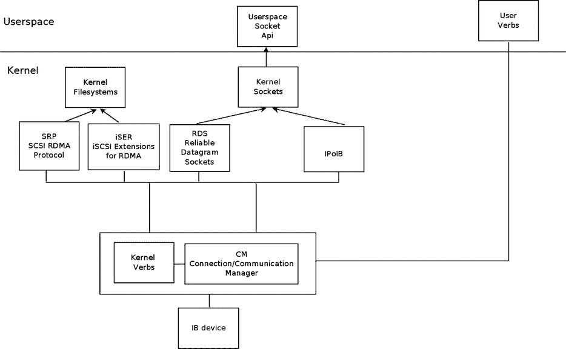
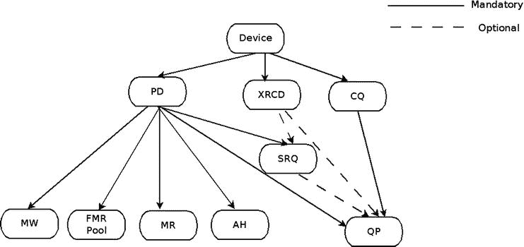
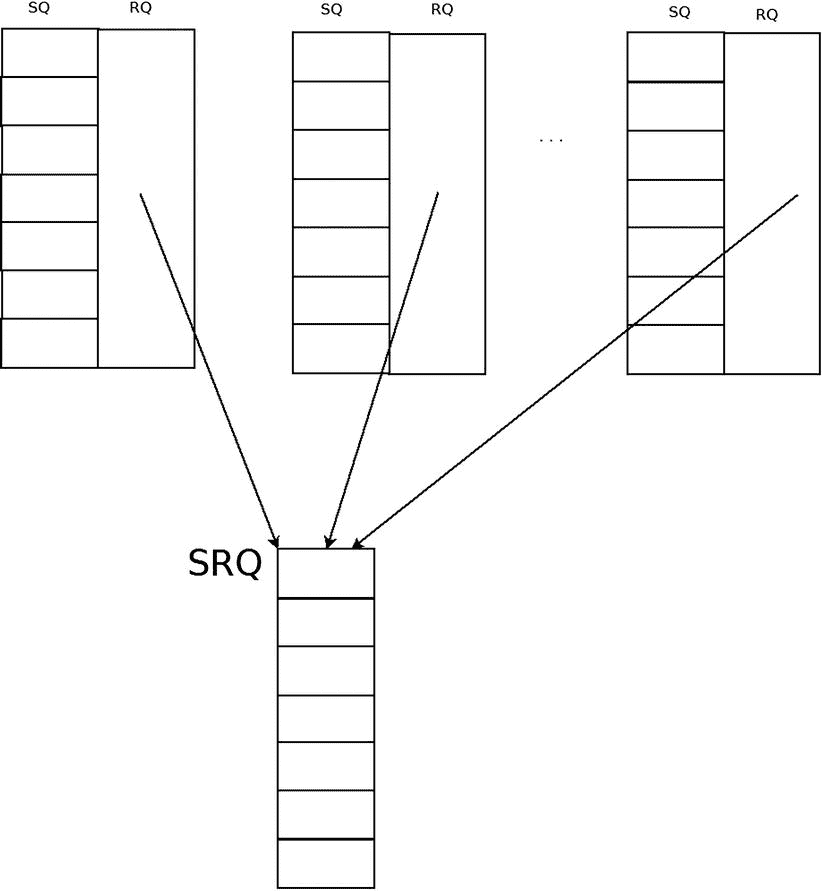
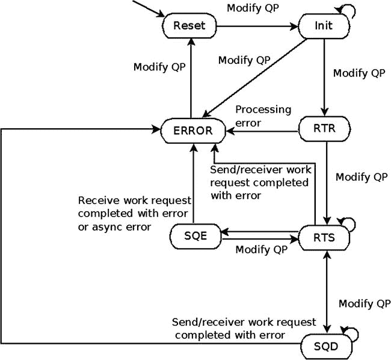
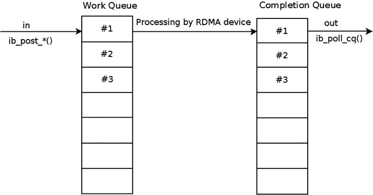
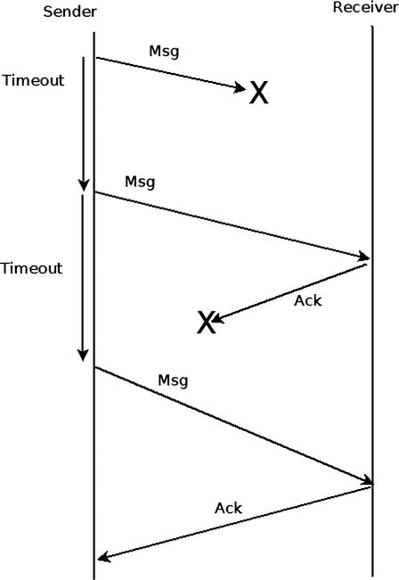
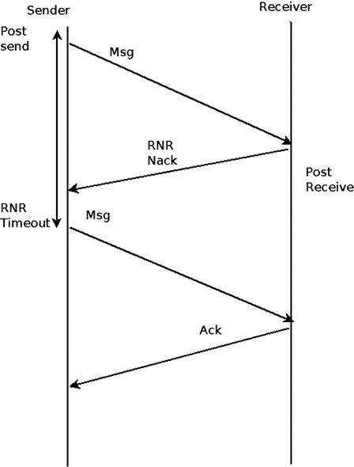

# 十三、InfiniBand

*本章由 InfiniBand 专家 Dotan Barak 撰写。Dotan 是 Mellanox Technologies 的高级软件经理，在 RDMA 技术公司工作。Dotan 已经在 Mellanox 工作了 10 多年，担任过各种角色，包括开发人员和经理。此外，Dotan 还维护着一个关于 RDMA 技术的博客:* `http://www.rdmamojo.com`。

第 12 章讲述了无线子系统及其在 Linux 中的实现。在这一章中，我将讨论 InfiniBand 子系统及其在 Linux 中的实现。尽管对于不熟悉 InfiniBand 技术的人来说，InfiniBand 技术可能被认为是一种非常复杂的技术，但是它背后的概念却非常简单，这一点您将在本章中看到。我将从远程直接内存访问(RDMA)开始我们的讨论，并讨论它的主要数据结构和它的 API。我将给出一些例子来说明如何使用 RDMA，并以一个关于从内核级和用户空间使用 RDMA API 的简短讨论来结束本章。

RDMA 和 InfiniBand—概述

远程直接内存访问(RDMA) 是一台机器访问——即读取或写入——远程机器上内存的能力。有几个主要的网络协议支持 RDMA: InfiniBand、融合以太网 RDMA(RoCE)和互联网广域 RDMA 协议(iWARP)，它们都共享相同的 API。InfiniBand 是一种全新的网络协议，其规范可以在“InfiniBand 架构规范”文档中找到，该文档由 InfiniBand 贸易协会(IBTA)维护。 RoCE 允许您通过以太网实现 RDMA，其规范可以在 InfiniBand 规范的附件中找到。iWARP 是一种允许在 TCP/IP 上使用 RDMA 的协议，其规范可以在由 RDMA 联盟维护的文档“RDMA 协议规范”中找到。**动词**是从客户端代码使用 RDMA 的 API 的描述。在版本 2.6.11 中，RDMA API 实现被引入到 Linux 内核中。最初，它只支持 InfiniBand，在几个内核版本之后，它也加入了 iWARP 和 RoCE 支持。在描述 API 时，我只提到其中的一种，但下面的文字是指所有的。这个 API 的所有定义都可以在`include/rdma/ib_verbs.h`中找到。以下是关于 API 和 RDMA 堆栈实现的一些说明:

*   有些函数是内联函数，有些不是。未来的实现可能会改变这种行为。
*   大多数 API 都有前缀“IB”；但是，这个 API 支持 InfiniBand、iWARP 和 RoCE。
*   标题`ib_verbs.h`包含以下人员使用的功能和结构:

*   RDMA 堆栈本身
*   RDMA 设备的低级驱动程序
*   使用堆栈作为消费者的内核模块

我将集中讨论只与使用堆栈作为消费者的内核模块相关的函数和结构(第三种情况)。下一节讨论内核树中的 RDMA 堆栈组织。

RDMA 堆栈组织

几乎所有的内核 RDMA 堆栈代码都在内核树的`drivers/infiniband`下。以下是它的一些重要模块(这不是一个详尽的列表，因为我在本章中没有涵盖整个 RDMA 堆栈):

*   **CM:** 沟通经理(`drivers/infiniband/core/cm.c`)
*   **IPoIB:**IP over InfiniBand(`drivers/infiniband/ulp/ipoib/`)
*   **伊瑟:** iSCSI 扩展为 RDMA ( `drivers/infiniband/ulp/iser/`)
*   **RDS:** 可靠数据报套接字(`net/rds/`)
*   **SRP:** SCSI RDMA 协议(`drivers/infiniband/ulp/srp/`)
*   不同厂商的硬件底层驱动(`drivers/infiniband/hw`)
*   **动词:**核心动词(`drivers/infiniband/core/verbs.c`)
*   **uverbs:** 用户动词(`drivers/infiniband/core/uverbs_*.c`)
*   **MAD:** 管理数据报(`drivers/infiniband/core/mad.c`)

[图 13-1](#Fig1) 显示了 Linux InfiniBand 栈架构。



[图 13-1](#_Fig1) 。Linux Infiniband 堆栈架构

在这一节中，我介绍了 RDMA 堆栈结构以及 Linux 内核中的内核模块。

RDMA 的技术优势

在这里，我将介绍 RDMA 技术的优势，并解释使其在许多市场广受欢迎的特性:

*   **零拷贝:** 直接向远程存储器写入数据和从远程存储器读取数据的能力允许您直接访问远程缓冲区，而无需在不同的软件层之间进行拷贝。
*   **内核旁路:** 从代码的同一个上下文(即用户空间或内核级)发送和接收数据节省了上下文切换时间。
*   **CPU 卸载:** 使用专用硬件发送或接收数据而无需任何 CPU 干预的能力允许减少远程端 CPU 的使用，因为它不执行任何活动操作。
*   **低延迟:** RDMA 技术让你的短消息达到非常低的延迟。(在当前的硬件和服务器上，发送几十个字节的延迟可能会达到几百纳秒。)
*   **高带宽:** 在一个以太网设备中，最大带宽受技术限制(即 10 或 40 Gbits/sec)。在 InfiniBand 中，相同的协议和设备可以在 2.5 千兆位/秒到 120 千兆位/秒的范围内使用。(在当前的硬件和服务器上，带宽最高可达 56 千兆位/秒。)

InfiniBand 硬件组件

与任何其他互连技术一样，在 InfiniBand 中，规范中描述了几个硬件组件，其中一些是数据包的端点(生成数据包和数据包的目标)，一些在同一子网或不同子网之间转发数据包。这里我将介绍最常见的几种:

*   **主机通道适配器(HCA** **):** 可以放置在主机或任何其他系统(如存储设备)上的网络适配器。该组件发起数据包或者是数据包的目标。
*   **交换机** **:** 知道如何从一个端口接收数据包并将其发送到另一个端口的组件。如果需要，它可以复制多播消息。(InfiniBand 不支持广播。)与其他技术不同，每个交换机都是一个非常简单的设备，带有由子网管理器(SM)配置的转发表，SM 是一个配置和管理子网的实体(在本节的后面，我将更详细地讨论它的作用)。交换机不会自己学习任何东西，也不会解析和分析数据包；它只在同一子网内转发数据包。
*   **路由器** **:** 连接多个不同 InfiniBand 子网的组件。

子网是一组连接在一起的 HCA、交换机和路由器端口。在本节中，我描述了 InfiniBand 中的各种硬件组件，现在我将讨论 InfiniBand 中的设备、系统和端口的寻址。

在 InfiniBand 中寻址

以下是关于 InfiniBand 寻址的一些规则和一个示例:

*   在 InfiniBand 中，组件的唯一标识符是全球唯一标识符(GUID)，它是一个 64 位的值，在世界上是唯一的。
*   子网中的每个节点都有一个节点 GUID。这是节点的标识符，也是节点的常量属性。
*   子网中的每个端口，包括 HCA 和交换机中的端口，都有一个端口 GUID。这是端口的标识符，也是端口的常量属性。
*   在由几个组件组成的系统中，可以有一个系统 GUID。该系统中的所有组件都具有相同的系统 GUID。

这里有一个例子演示了前面提到的所有 GUIDs:一个由几个交换芯片组合而成的大型交换系统。每个交换芯片都有一个唯一的节点 GUID。每个交换机中的每个端口都有一个唯一的端口 GUID。该系统中的所有芯片都具有相同的系统 GUID。

*   全球标识符(GID) 用于标识结束端口或多播组。在索引 0 的 GID 表中，每个端口至少有一个有效的 GID。它基于端口 GUID 加上该端口所属的子网标识符。
*   本地标识符(LID) 是由子网管理器分配给每个子网端口的 16 位值。交换机是一个例外，交换机管理端口具有 LID 分配，而不是其所有端口。每个端口只能分配一个 LID 或一系列连续的 LID，以便有多条路径到达该端口。在同一子网中的特定时间点，每个 LID 都是唯一的，交换机在转发数据包时使用 LID 来确定使用哪个出口端口。单播 LID 的范围是 0x001 至 0xbfff。多播 LIDs 范围是 0xc000 到 0xfffe。

InfiniBand 功能

这里我们将介绍 InfiniBand 协议的一些特性:

*   InfiniBand 允许您配置 HCA、交换机和路由器的端口分区，并允许您在同一物理子网内提供虚拟隔离。每个分区键(P_Key)都是一个 16 位的值，由以下各项组合而成:15 个 LSB 是键值，msb 是成员级别；0 是受限成员；1 是正式会员。每个端口都有一个由 SM 配置的 P_Key 表，每个队列对(QP，InfiniBand 中发送和接收数据的实际对象)都与该表中的一个 P_Key 索引相关联。一个 QP 只有在与其相关联的 P_Keys 中满足以下条件时，才能发送或接收来自远程 QP 的数据包:

*   键值相等。
*   其中至少有一个是正式会员。

*   **队列密钥(Q_Key):** 一个不可靠的数据报(UD) QP 只有当报文的 Q_Key 等于这个 UD QP 的 Q_Key 值时，才会从一个远程 UD QP 得到单播或组播报文。
*   **虚拟通道(VL):** 这是一种在单个物理链路上创建多个虚拟链路的机制。每个虚拟通道代表一组用于在每个端口发送和接收数据包的自主缓冲器。支持的 VLs 数量是端口的一个属性。
*   **服务级别(SL):** InfiniBand 最多支持 16 个服务级别。该协议没有指定每个级别的策略。在 InfiniBand 中，使用 SL 到 VL 的映射和每个 VL 的资源来实现 QoS。
*   **故障转移:** 连接的 QP 是只能向一个远程 QP 发送数据包或从其接收数据包的 qp。InfiniBand 允许为连接的 qp 定义主路径和备用路径。如果主路径出现问题，将自动使用备用路径，而不是报告错误。

在下一节中，我们将看看 InfiniBand 中的数据包是什么样子的。这在您调试 InfiniBand 中的问题时非常有用。

InfiniBand 数据包

InfiniBand 中的每个数据包都是几个报头的组合，在许多情况下，还有一个有效载荷，即客户端想要发送的消息数据。仅包含 ACK 或零字节消息的消息(例如，如果仅发送即时数据)将不包含有效载荷。这些报头描述了数据包发送的位置、数据包的目标、使用的操作、将数据包分成消息所需的信息以及检测数据包丢失错误所需的足够信息。

[图 13-2](#Fig2) 展示了 InfiniBand 数据包报头。


[图 13-2](#_Fig2) 。InfiniBand 数据包报头

以下是 InfiniBand 中的标头:

*   **本地路由头(LRH):** 8 字节。永远存在。它标识数据包的本地源端口和目的端口。它还指定消息的请求 QoS 属性(SL 和 VL)。
*   **全局路由头(GRH):** 40 字节。可选。存在于多播数据包或在多个子网中传输的数据包。它使用 GID 描述源端口和目的端口。其格式与 IPv6 报头相同。
*   **基础传输头(BTH):** 12 字节。永远存在。它指定了源和目的 QPs、操作、包序列号和分区。
*   **扩展传输头(ETH):** 从 4 到 28 个字节。可选。可能存在的额外标头系列，具体取决于服务的类别和所使用的操作。
*   **有效载荷:** 可选。客户端想要发送的数据。
*   **即时数据:** 4 字节。可选。可添加到发送和 RDMA 写操作的带外 32 位值。
*   **不变 CRC (ICRC):** 4 字节。永远存在。它涵盖了数据包在子网中传输时不应更改的所有字段。
*   **变体 CRC (VCRC):** 2 字节。永远存在。它覆盖了数据包的所有字段。

管理实体

SM 是子网中负责分析和配置子网的实体。以下是它的一些使命:

*   发现子网的物理拓扑。
*   为子网中的每个端口分配 lid 和其他属性，如活动 MTU、活动速度等。
*   在子网交换机中配置转发表。
*   检测拓扑中的任何变化(例如，是否在子网中添加或删除了新节点)。
*   处理子网中的各种错误。

子网管理器通常是一个软件实体，可以运行在交换机(称为*管理交换机*)或子网中的任何节点上。

几个 SMs 可以在一个子网中运行，但其中只有一个是活动的，其余的将处于待机模式。有一个内部协议来执行主机选择并决定哪个 SM 将是活动的。如果活动 SM 关闭，备用 SM 之一将成为活动 SM。子网中的每个端口都有一个子网管理代理(SMA)，，它是一个知道如何接收 SM 发送的管理消息、处理它们并返回响应的代理。子网管理员(SA)是 SM 的一部分。以下是它的一些使命:

*   提供有关子网的信息，例如，有关如何从一个端口到达另一个端口的信息(即路径查询)。
*   允许您注册以获得事件通知。
*   提供子网管理服务，如加入或离开多播。这些服务可能导致 SM(重新)配置子网。

通信管理器(CM) 是一个能够在每个端口上运行的实体，如果该端口支持的话，以建立、维护和拆除 QP 连接。

RDMA 资源公司

在 RDMA API 中，在发送或接收任何数据之前，需要创建和处理大量资源。所有资源都在特定 RDMA 设备的范围内，这些资源不能在多个本地设备之间共享或使用，即使同一台机器上有多个设备也是如此。[图 13-3](#Fig3) 展示了 RDMA 资源创建层次结构。



[图 13-3](#_Fig3) 。RDMA 资源创造层级

RDMA 装置

客户端需要向 RDMA 堆栈注册，以便在系统中添加或删除任何 RDMA 设备时得到通知。初始注册后，所有现有的 RDMA 设备都会通知客户端。每个 RDMA 设备都将被调用一个回调，客户端可以通过以下方式开始使用这些设备:

*   查询设备的各种属性
*   修改设备属性
*   创建、使用和销毁资源

`ib_register_client()`方法注册一个想要使用 RDMA 堆栈的内核客户端。将为当前存在于系统中的每个新的 InfiniBand 设备调用指定的回调，这些新的 InfiniBand 设备将被添加到系统中或从系统中移除(使用热插拔功能)。`ib_unregister_client()`方法注销想要停止使用 RDMA 堆栈的内核客户端。通常，在卸载驱动程序时调用它。下面是一个示例代码，展示了如何在内核客户端中注册 RDMA 堆栈:

```sh
static void my_add_one(struct ib_device *device)
{
...
}

static void my_remove_one(struct ib_device *device)
{
...
}

static struct ib_client my_client = {
    .name   = "my RDMA module",
    .add    = my_add_one,
    .remove = my_remove_one
};

static int __init my_init_module(void)
{
    int ret;

    ret = ib_register_client(&my_client);
    if (ret) {
        printk(KERN_ERR "Failed to register IB client\n");
        return ret;
    }

    return 0;
}

static void __exit my_cleanup_module(void)
{
    ib_unregister_client(&my_client);
}

module_init(my_init_module);
module_exit(my_cleanup_module);
```

以下是对处理 InfiniBand 设备的其他几种方法的描述。

*   `ib_set_client_data()`方法将客户端上下文设置为与 InfiniBand 设备相关联。
*   `ib_get_client_data()`方法使用`ib_set_client_data()`方法返回与 InfiniBand 设备相关联的客户端上下文。
*   `ib_register_event_handler()`方法为 InfiniBand 设备将要发生的每个异步事件注册一个要调用的回调。回调结构必须用 INIT_IB_EVENT_HANDLER 宏初始化。
*   `ib_unregister_event_handler()`方法注销事件处理程序。
*   `ib_query_device()`方法查询 InfiniBand 设备的属性。这些属性是不变的，不会在这个方法的后续调用中改变。
*   `ib_query_port()`方法查询 InfiniBand 设备端口的属性。其中一些属性是不变的，一些属性可能会在随后调用该方法时发生变化，例如，端口 LID、state 和其他一些属性。
*   `rdma_port_get_link_layer()`方法返回设备端口的链路层。
*   `ib_query_gid()`方法在特定索引中查询 InfiniBand 设备端口的 GID 表。`ib_find_gid()`方法返回端口的 GID 表中特定 GID 值的索引。
*   `ib_query_pkey()`方法在特定索引中查询 InfiniBand 设备端口的 P_Key 表。`ib_find_pkey()`方法返回端口的 P_Key 表中特定 P_Key 值的索引。

保护域(PD)

一个 PD 允许与其他几个 RDMA 资源相关联，例如 SRQ、QP、AH 或 MR，以便在它们之间提供一种保护手段。与 PDx 相关联的 RDMA 资源不能使用与 PDy 相关联的 RDMA 资源。试图混合这些资源将导致错误。通常，每个模块都有一个 PD。然而，如果一个特定的模块想要增加它的安全性，它将为它使用的每个远程 QP 或服务使用一个 PD。PD 的分配和取消分配是这样完成的:

*   方法分配一个 PD。它将注册后调用驱动程序回调时返回的设备对象的指针作为参数。
*   `ib_dealloc_pd()`方法释放一个 PD。它通常在卸载驱动程序或销毁与 PD 相关的资源时调用。

**地址句柄(AH)**

在 UD QP 的发送请求中使用 AH 来描述消息从本地端口到远程端口的路径。如果所有 qp 使用相同的属性向相同的远程端口发送消息，则相同的 AH 可以用于多个 qp。以下是对与 AH 相关的四种方法的描述:

*   方法创建了一个 AH。它将 PD 和 AH 的属性作为参数。AH 的 AH 属性可以直接填充，也可以通过调用`ib_init_ah_from_wc()`方法来填充，该方法将接收到的工作完成(`ib_wc`对象)作为一个参数，该参数包括成功完成的传入消息的属性，以及接收该消息的端口。我们可以调用`ib_create_ah_from_wc()`方法，而不是先调用`ib_init_ah_from_wc()`方法，然后再调用`ib_create_ah()`方法。
*   `ib_modify_ah()`方法修改现有 AH 的属性。
*   `ib_query_ah()`方法查询现有 AH 的属性。
*   方法销毁一个 AH。当不需要向 AH 描述路径的节点发送任何进一步的消息时，就调用它。

存储区

RDMA 设备访问的每个内存缓冲区都需要注册。在注册过程中，在存储缓冲器上执行以下任务:

*   将连续的内存缓冲区分隔成内存页面。
*   将完成虚拟到物理转换的映射。
*   检查存储器页面权限以确保它们支持 MR 的请求权限。
*   内存页面被固定，以防止它们被换出。这保持了虚拟到物理的映射不变。

成功完成内存注册后，它有两个密钥:

*   **本地键(lkey):** 本地工作请求访问该内存的键。
*   **远程键(rkey):** 远程机器使用 RDMA 操作访问该存储器的键。

当引用这些内存缓冲区时，这些键将在工作请求中使用。即使使用不同的权限，相同的内存缓冲区也可以注册多次。以下是与 MR 相关的一些方法的描述:

*   `ib_get_dma_mr()`方法返回一个可用于 DMA 的系统内存区域。它将 PD 和 MR 请求的访问权限作为参数。
*   `ib_dma_map_single()`方法将由`kmalloc()`方法族分配的内核虚拟地址映射到 DMA 地址。这个 DMA 地址将用于访问本地和远程存储器。应该使用`ib_dma_mapping_error()`方法来检查映射是否成功。
*   `ib_dma_unmap_single()`方法取消了使用`ib_dma_map_single()`完成的 DMA 映射。当不再需要这个内存时，应该调用它。

 **注意**有更多种类的`ib_dma_map_single()`允许页面映射，根据 DMA 属性映射，使用分散/聚集列表映射，或使用具有 DMA 属性的分散/聚集列表映射:`ib_dma_map_page()`、`ib_dma_map_single_attrs()`、`ib_dma_map_sg()`和`ib_dma_map_sg_attrs()`。都有对应的 unmap 函数。

在访问 DMA 映射存储器之前，应调用以下方法:

*   `ib_dma_sync_single_for_cpu()`如果 DMA 区域将被 CPU 访问，或者`ib_dma_sync_single_for_device()`如果 DMA 区域将被 InfiniBand 设备访问。
*   `ib_dma_alloc_coherent()`方法分配一个可以被 CPU 访问的内存块，并将其映射到 DMA。
*   `ib_dma_free_coherent()`方法释放使用`ib_dma_alloc_coherent()`分配的内存块。
*   `ib_reg_phys_mr()`方法获取一组物理页面，注册它们，并准备一个可以被 RDMA 设备访问的虚拟地址。如果你想在创建后改变它，你应该调用`ib_rereg_phys_mr()`方法。
*   `ib_query_mr()`方法检索特定 MR 的属性，注意大多数低级驱动程序不实现这个方法。
*   `ib_dereg_mr()`方法注销 MR。

快速内存区域(FMR)池

内存区域的注册是一个“繁重的”过程，可能需要一些时间来完成，如果调用它时所需的资源不可用，执行它的上下文甚至可能会休眠。这种行为在某些情况下可能会有问题，例如在中断处理程序中。使用 FMR 池，您可以使用注册为“轻量级”的 fmr，并且可以在任何上下文中注册。FMR 泳池的 API 可以在`include/rdma/ib_fmr_pool.h`中找到。

存储窗口(MW)

可以通过两种方式实现对存储器的远程访问:

*   注册启用了远程权限的内存缓冲区。
*   注册一个内存区域，然后将一个内存窗口绑定到它。

这两种方式都将创建一个远程密钥(`rkey`)，该密钥可用于以指定的权限访问该存储器。然而，如果您希望使`rkey`无效以防止对该内存的远程访问，执行内存区域注销可能是一个繁重的过程。在此内存区域上使用内存窗口，并在需要时绑定或解除绑定，可以为启用和禁用对内存的远程访问提供一个“轻量级”过程。以下是与医疗废物相关的三种方法的说明:

*   `ib_alloc_mw()`方法分配一个内存窗口。它接受 PD 和 MW 类型作为参数。
*   `ib_bind_mw()`方法通过向 QP 发送特殊的工作请求，将内存窗口绑定到具有特定地址、大小和远程权限的指定内存区域。当您希望允许临时远程访问它的内存时，就会调用它。将在 QP 的发送队列中生成一个工作完成来描述该操作的状态。如果`ib_bind_mw()`被一个已经绑定的内存窗口调用到同一个内存区域或者不同的区域，那么之前的绑定将会失效。
*   方法释放指定的 MW 对象。

完成队列(CQ)

发送或接收队列的每个已发布的工作请求都被视为未完成，直到它或在它之后发布的任何工作请求都有相应的工作完成。当工作请求未完成时，它所指向的内存缓冲区的内容是不确定的:

*   如果 RDMA 设备读取这个内存并通过网络发送它的内容，客户端就不知道这个缓冲区是否可以被重用或释放。如果这是一个可靠的 QP，成功的工作完成意味着消息被远程端接收到。如果这是一个不可靠的 QP，一个成功的工作完成意味着消息被发送。
*   如果 RDMA 设备将消息写入该内存，客户端无法知道该缓冲区是否包含传入的消息。

工作完成指定相应的工作请求已经完成，并提供一些相关信息:状态、使用的操作码、大小等等。CQ 是包含工作完成的对象。客户端需要轮询 CQ，以读取它所拥有的工作完成。CQ 基于先进先出(FIFO) 原则工作:客户端将从其中出队的工作完成顺序将根据 RDMA 设备将它们排入 CQ 的顺序。客户端可以在轮询模式下读取工作完成，或者请求在新的工作完成被添加到 CQ 时获得通知。CQ 不能容纳比其大小更多的工作完成。如果添加的工作完成多于其容量，将添加一个出错的工作完成，将生成一个 CQ 错误异步事件，并且所有与之关联的工作队列都将出错。以下是一些与 CQ 相关的方法:

*   `ib_create_cq()`方法 创造了一个 CQ。它将以下内容作为其参数:注册后调用驱动程序回调时返回的设备对象的指针，以及 CQ 的属性，包括其大小和当此 CQ 上有异步事件或向其添加工作完成时将调用的回调。
*   `ib_resize_cq()` 方法改变 CQ 的大小。新的条目数不能少于当前填写 CQ 的工作完成数。
*   `ib_modify_cq()`方法改变 CQ 的调节参数。如果至少有特定数量的工作完成进入 CQ，或者超时将过期，将生成完成事件。使用它可能有助于减少 RDMA 设备中发生的中断数量。
*   `ib_peek_cq()`方法返回 CQ 中可用工作完成的数量。
*   `ib_req_notify_cq()`方法 请求在下一个工作完成或包括请求事件指示的工作完成被添加到 CQ 时生成完成事件通知。如果在调用了`ib_req_notify_cq()`方法之后，没有工作完成被添加到 CQ，则不会发生完成事件通知。
*   `ib_req_ncomp_notif()` 方法要求当 CQ 中存在特定数量的工作完成时，创建完成事件通知。与`ib_req_notify_cq()`方法不同，当调用`ib_req_ncomp_notif()`方法时，即使 CQ 当前持有这个数量的工作完成，也会生成一个完成事件通知。
*   `ib_poll_cq()`方法从 CQ 轮询工作完成。它按照工作完成被添加到 CQ 的顺序从其中读取工作完成，并从其中删除它们。

下面是一个清空 CQ 的代码示例，即从 CQ 中读取所有工作完成，并检查它们的状态:

```sh
struct ib_wc wc;
int num_comp = 0;

while (ib_poll_cq(cq, 1, &wc) > 0) {
    if (wc.status != IB_WC_SUCCESS) {
        printk(KERN_ERR "The Work Completion[%d] has a bad status %d\n",
                         num_comp, wc.status);
        return -EINVAL;
    }
    num_comp ++;
}

```

扩展可靠连接(XRC)域

XRC 域是用于限制传入消息可以作为目标的 XRC srq 的对象。该 XRC 域可以与和 XRC 一起工作的其他几个 RDMA 资源相关联，例如 SRQ 和 QP 。

共享接收队列(SRQ)

SRQ 是 RDMA 架构在接收端更具可伸缩性的一种方式。不是每个队列对都有一个单独的接收队列，而是有一个所有 qp 都连接到的共享接收队列。当他们需要使用接收请求时，他们从 SRQ 获取请求。[图 13-4](#Fig4) 展示了与 SRQ 相关的 qp。



[图 13-4](#_Fig4) 。与 SRQ 相关联的 qp

如果你有 *N* 个 qp，每个 qp 都可能在随机时间收到一串 *M* 的消息，你可以这么做:

*   如果不使用 SRQ，您会发送 N*M 个接收请求。
*   使用 SRQs，您发布 K*M(其中 K << N)个接收请求。

与 QP 不同，它没有任何机制来确定其中未完成的工作请求的数量，而使用 SRQ，您可以设置一个水印限制。当接收请求的数量低于此限制时，将为此 SRQ 创建一个 SRQ 限制异步事件。使用 SRQ 的缺点是，您无法预测哪个 QP 将使用来自 SRQ 的每个已发布的接收请求，因此每个已发布的接收请求能够容纳的消息大小必须是任何 qp 可能获得的最大传入消息大小。这个限制可以通过创建几个 srq 来处理，每个 srq 对应一个不同的最大消息大小，并根据它们的预期消息大小将它们与相关 qp 相关联。

以下是与 SRQ 相关的一些方法的描述和一个示例:

*   `ib_create_srq()`方法创建一个 SRQ。SRQ 需要一个 PD 和属性。
*   `ib_modify_srq()`方法修改 SRQ 的属性。它用于为 SRQ 极限事件设置新的水印值，或者为支持它的设备调整 SRQ 的大小。

下面是一个设置水印值的示例，当 SRQ 中的 RRs 数量降至 5 以下时，该值将获得一个异步事件:

```sh
struct ib_srq_attr srq_attr;
int ret;

memset(&srq_attr, 0, sizeof(srq_attr));
srq_attr.srq_limit = 5;

ret = ib_modify_srq(srq, &srq_attr, IB_SRQ_LIMIT);
if (ret) {
    printk(KERN_ERR "Failed to set the SRQ's limit value\n");
    return ret;
}
```

以下是对处理 SRQ 的几种其他方法的描述。

*   `ib_query_srq()`方法查询当前的 SRQ 属性。这种方法通常用于检查 SRQ 的内容极限值。在`ib_srq_attr`对象的`srq_limit`成员中的值 0 意味着没有任何 SRQ 限制水印集。
*   方法销毁一个 SRQ。
*   `ib_post_srq_recv()`方法将接收请求的链表作为参数，并将它们添加到指定的共享接收队列中，以供将来处理。

下面是一个向 SRQ 提交单个接收请求的示例。它使用其在单个集合条目中注册的 DMA 地址，将传入消息保存在内存缓冲区中:

```sh
struct ib_recv_wr wr, *bad_wr;
struct ib_sge sg;
int ret;

memset(&sg, 0, sizeof(sg));
sg.addr   = dma_addr;
sg.length = len;
sg.lkey   = mr->lkey;

memset(&wr, 0, sizeof(wr));
wr.next     = NULL;
wr.wr_id    = (uintptr_t)dma_addr;
wr.sg_list  = &sg;
wr.num_sge  = 1;

ret = ib_post_srq_recv(srq, &wr, &bad_wr);
if (ret) {
    printk(KERN_ERR "Failed to post Receive Request to an SRQ\n");
    return ret;
}

```

队列对(QP)

队列对是用于在 InfiniBand 中发送和接收数据的实际对象。它有两个独立的工作队列:发送和接收队列。每个工作队列都有一个特定数量的工作请求(WR ),每个 WR 都支持多个分散/聚集元素，以及一个 CQ，其处理已经结束的工作请求将向其添加工作完成。这些工作队列可以使用相似或不同的属性来创建，例如，可以发送到每个工作队列的 wr 的数量。每个工作队列中的顺序是有保证的，也就是说，发送队列中工作请求的处理将根据发送请求提交的顺序开始。同样的行为也适用于接收队列。但是，它们之间没有任何关系—也就是说，未完成的发送请求可以被处理，即使它是在向接收队列提交接收请求之后提交的。[图 13-5](#Fig5) 显示了一个 QP。


[图 13-5](#_Fig5) 。QP(队列对)

创建后，每个 QP 在特定时间点在 RDMA 设备上都有一个唯一的编号。

QP 运输类型

InfiniBand 支持多种 QP 传输类型:

*   **可靠连接(RC):** 一个 RC QP 连接到单个远程 RC QP，并且可靠性是有保证的——也就是说，具有与发送它们相同的内容的所有分组根据它们的顺序到达是有保证的。在发送方，每个消息都被分割成大小为路径 MTU 的数据包，并在接收方进行碎片整理。这个 QP 支持发送、RDMA 写、RDMA 读和原子操作。
*   **不可靠连接(UC):** 一个 UC QP 连接到一个远程 UC QP，可靠性没有保证。此外，如果消息中的一个数据包丢失，则整个消息都会丢失。在发送方，每个消息都被分割成大小为路径 MTU 的数据包，并在接收方进行碎片整理。该 QP 支持发送和 RDMA 写操作。
*   **不可靠数据报(UD):** 一个 UD QP 可以向子网中的任何 UD QP 发送单播消息。支持多播消息。可靠性不能保证。每个消息限于一个分组消息，其大小限于路径 MTU 大小。此 QP 仅支持发送操作。
*   **扩展可靠连接(XRC):** 来自同一个节点的几个 qp 可以向特定节点中的远程 SRQ 发送消息。这有助于将两个节点之间的 QP 数量从 CPU 内核数量的数量级(即每个内核一个进程的 QP)减少到一个 QP。该 QP 支持 QP 钢筋混凝土公司支持的所有操作。这种类型只与用户空间应用相关。
*   **原始数据包:**允许客户端构建一个完整的数据包，包括 L2 报头，并按原样发送。在接收端，RDMA 设备不会剥离任何报头。
*   **原始 IPv6/原始以太网类型:**允许发送未经 IB 设备解释的原始数据包的 qp。目前，任何 RDMA 设备都不支持这两种类型。

有一些特殊的 QP 传输类型用于子网管理和特殊服务:

*   **SMI/QP0:** 用于子网管理数据包的 QP。
*   **GSI/QP1:** QP 用于一般服务数据包。

`ib_create_qp()`方法创建一个 QP。它采用一个 PD 和请求的属性作为参数来创建这个 QP。下面是一个使用已创建的 PD 创建 RC QP 的示例，它有两个不同的 CQ:一个用于发送队列，一个用于接收队列。

```sh
struct ib_qp_init_attr init_attr;
struct ib_qp *qp;

memset(&init_attr, 0, sizeof(init_attr));
init_attr.event_handler       = my_qp_event;
init_attr.cap.max_send_wr     = 2;
init_attr.cap.max_recv_wr     = 2;
init_attr.cap.max_recv_sge    = 1;
init_attr.cap.max_send_sge    = 1;
init_attr.sq_sig_type         = IB_SIGNAL_ALL_WR;
init_attr.qp_type             = IB_QPT_RC;
init_attr.send_cq             = send_cq;
init_attr.recv_cq             = recv_cq;

    qp = ib_create_qp(pd, &init_attr);
    if (IS_ERR(qp)) {
        printk(KERN_ERR "Failed to create a QP\n");
        return PTR_ERR(qp);
    }

```

QP 国家机器

QP 有一个状态机，它定义了 QP 在每个状态下能够做什么:

*   **复位状态:** 每个 QP 都是在这个状态下产生的。在这种状态下，不能向它发送任何发送请求或接收请求。所有传入的消息都会被无声地丢弃。
*   **初始化状态:** 在此状态下，不能向其发送任何请求。然而，接收请求可以被发布，但不会被处理。所有传入的消息都会被无声地丢弃。在将接收请求转移到 RTR(准备接收)之前，在这种状态下向 QP 发布接收请求是一个很好的做法。这样做可以防止远程 QP 发送需要使用接收请求的消息，但是这些消息还没有发布。
*   **准备接收(RTR)状态:** 在此状态下，不能向其发送任何发送请求，但可以发送和处理接收请求。所有传入的消息都将被处理。在这种状态下收到的第一个传入消息将生成通信建立异步事件。只接收消息的 QP 可以保持这种状态。
*   **准备发送(RTS)状态** : 在这种状态下，发送请求和接收请求都可以被发送和处理。所有传入的消息都将被处理。这是 QPs 的常见状态。
*   **发送队列排空(SQD)状态:** 在这种状态下，QP 完成其处理已经开始的所有发送请求的处理。只有当没有任何消息可以发送时，您才可以更改一些 QP 属性。这种状态分为两种内部状态:

*   **排出:**消息仍在发送中。
*   **耗尽:**消息发送完毕。

*   **发送队列错误(SQE)状态:** 当不可靠传输类型的发送队列中出现错误时，RDMA 设备会自动将 QP 移至此状态。导致错误的发送请求将会以错误原因完成，并且所有连续的发送请求都将被刷新。接收队列仍将工作，也就是说，可以发送接收请求，并处理传入的消息。客户端可以从此状态中恢复，并将 QP 状态修改回 RTS。
*   **错误状态:** 在此状态下，所有未完成的工作请求将被刷新。如果这是一种可靠的传输类型，并且发送请求有错误，或者无论使用哪种传输类型，接收队列中都有错误，则 RDMA 设备可以将 QP 移到此状态。所有传入的消息都会被无声地丢弃。

QP 可以通过`ib_modify_qp()`从任何状态转换到复位状态和错误状态。将 QP 移至错误状态将刷新所有未完成的工作请求。将 QP 移至重置状态将清除所有以前配置的属性，并删除 QP 正在处理的完成队列中在此 QP 上结束的所有未完成的工作请求和工作完成。[图 13-6](#Fig6) 展示了一个 QP 状态机图。



[图 13-6](#_Fig6) 。QP 国家机器

`ib_modify_qp()`方法修改 QP 的属性。它将需要修改的 QP 和将要修改的 QP 的属性作为参数。QP 的状态机可以根据[图 13-6](#Fig6) 所示的示意图进行改变。每种 QP 传输类型都需要在每个 QP 状态转换中设置不同的属性。

下面是一个将新创建的 RC QP 修改为 RTS 状态的示例，在该状态下，它可以发送和接收数据包。本地属性是发送队列的输出端口、使用的 SL 和起始数据包序列号。所需的远程属性是接收 PSN、QP 号码和它使用的端口的 LID。

```sh
    struct ib_qp_attr attr = {
        .qp_state        = IB_QPS_INIT,
        .pkey_index      = 0,
        .port_num        = port,
        .qp_access_flags = 0
    };

    ret = ib_modify_qp(qp, &attr,
              IB_QP_STATE         |
              IB_QP_PKEY_INDEX    |
              IB_QP_PORT          |
              IB_QP_ACCESS_FLAGS);
if (ret) {
          printk(KERN_ERR "Failed to modify QP to INIT state\n");
          return ret;
}

attr.qp_state              = IB_QPS_RTR;
attr.path_mtu              = mtu;
attr.dest_qp_num           = remote->qpn;
attr.rq_psn                = remote->psn;
attr.max_dest_rd_atomic    = 1;
attr.min_rnr_timer         = 12;
attr.ah_attr.is_global     = 0;
attr.ah_attr.dlid          = remote->lid;
attr.ah_attr.sl            = sl;
attr.ah_attr.src_path_bits = 0,
attr.ah_attr.port_num      = port

ret = ib_modify_qp(ctx->qp, &attr,
          IB_QP_STATE                 |
          IB_QP_AV                    |
          IB_QP_PATH_MTU              |
          IB_QP_DEST_QPN              |
          IB_QP_RQ_PSN                |
          IB_QP_MAX_DEST_RD_ATOMIC    |
          IB_QP_MIN_RNR_TIMER);
if (ret) {
  printk(KERN_ERR "Failed to modify QP to RTR state\n");
  return ret;
}

attr.qp_state       = IB_QPS_RTS;
attr.timeout        = 14;
attr.retry_cnt      = 7;
attr.rnr_retry      = 6;
attr.sq_psn         = my_psn;
attr.max_rd_atomic  = 1;
ret = ib_modify_qp(ctx->qp, &attr,
          IB_QP_STATE             |
          IB_QP_TIMEOUT           |
          IB_QP_RETRY_CNT         |
          IB_QP_RNR_RETRY         |
          IB_QP_SQ_PSN            |
          IB_QP_MAX_QP_RD_ATOMIC);
if (ret) {
  printk(KERN_ERR "Failed to modify QP to RTS state\n");
  return ret;
}

```

以下是对处理 QP 的几种其他方法的描述:

*   `ib_query_qp()`方法查询当前的 QP 属性。有些属性是不变的(客户端指定的值)，有些属性是可以改变的(例如，状态)。
*   方法销毁了一个 QP。当不再需要 QP 时，就叫它。

工作请求处理

每个发送到发送或接收队列的工作请求都被认为是未完成的，直到有一个工作完成，该工作完成是从与该工作请求的该工作队列或在该工作请求之后发送的同一工作队列中的工作请求相关联的 CQ 轮询的。接收队列中每个未完成的工作请求都会以工作完成结束。工作队列中的工作请求处理流程如图[图 13-7](#Fig7) 所示。



[图 13-7](#_Fig7) 。工作请求处理流程

在发送队列中，您可以选择(在创建 QP 时)是希望每个发送请求都以工作完成结束，还是希望选择以工作完成结束的发送请求—即选择性信号。对于无信号发送请求，您可能会遇到错误；但是，将为其生成状态为“不良”的工作完成。

当工作请求未完成时，用户不能(重新)使用或释放在发布此工作请求时在其中指定的资源。例如:

*   当发布 UD QP 的发送请求时，AH 不能被释放。
*   当提交接收请求时，无法读取分散/收集(s/g)列表中引用的内存缓冲区，因为不知道 RDMA 设备是否已经在其中写入了数据。

“防护”是指在之前的 RDMA 读取和原子操作处理结束之前，阻止处理特定发送请求的能力。例如，当使用从远程地址读取的 RDMA 并在同一个发送队列中发送数据或数据的一部分时，将栅栏指示添加到发送请求可能是有用的。如果没有防护，发送操作可能会在数据被检索并在本地内存中可用之前开始。当向 UC 或 RC QP 发送发送请求时，到目标的路径是已知的，因为它是在将 QP 转移到 RTR 状态时提供的。但是，当向 UD·QP 提交发送请求时，您需要添加一个 AH 来描述该消息的目标路径。如果存在与发送队列相关的错误，并且这是一种不可靠的传输类型，则发送队列将进入错误状态(即 SQE 状态)，但接收队列仍将完全正常工作。客户端可以从此状态中恢复，并将 QP 状态改回 RTS。如果存在与接收队列相关的错误，QP 将被移至错误状态，因为这是一个不可恢复的错误。当工作队列被移至错误状态时，导致错误的工作请求以指示错误性质的状态结束，并且该队列中的其余工作请求因错误而被刷新。

RDMA 架构中支持的操作

InfiniBand 支持多种操作类型:

*   **发送:**通过网络发送信息。远程端需要有一个可用的接收请求，消息将被写入其缓冲区。
*   **立即发送:**使用额外的 32 位带外数据通过网络发送消息。远程端需要有一个可用的接收请求，消息将被写入其缓冲区。该即时数据将在接收器的工作完成时可用。
*   RDMA 写道:通过电线向远程地址发送信息。
*   **RDMA 立即写信:**通过电线发送消息，并将其写到远程地址。远程端需要有一个可用的接收请求。该即时数据将在接收器的工作完成时可用。这个操作可以看作是带有零字节消息的 RDMA 写+立即发送。
*   **RDMA 读取:**读取一个远程地址，并用其内容填充本地缓冲区。
*   **比较和交换:**将一个远程地址的内容与 valueX 进行比较；如果它们相等，用 valueY 替换它的内容。所有这些都是以原子的方式执行的。原始远程存储器内容被发送并保存在本地。
*   **取加:**以原子的方式给远程地址的内容加一个值。原始远程存储器内容被发送并保存在本地。
*   **屏蔽比较和交换:**使用远程地址的 maskX 与 valueX 比较内容部分；如果相等，用 valueY 替换 maskY 中的部分内容。所有这些都是以原子的方式执行的。原始远程存储器内容被发送并保存在本地。
*   **屏蔽取加:**以原子的方式给远程地址的内容加一个值，只改变屏蔽中指定的位。原始远程存储器内容被发送并保存在本地。
*   **绑定内存窗口:**将一个内存窗口绑定到一个特定的内存区域。
*   **快速注册:**使用工作请求注册快速存储区。
*   **局部无效:**使用工作请求使快速内存区域无效。如果有人用它的旧`lkey` / `rkey`，会被认为是错误。它可以与发送/RDMA 读取相结合；在这种情况下，首先将执行发送/读取，然后该快速存储区域将被无效。

接收请求指定为使用接收请求的操作保存传入消息的位置。分散列表中指定的内存缓冲区的总大小必须等于或大于传入消息的大小。

对于 UD QP，由于事先不知道消息的来源(同一个子网或另一个子网，单播或组播消息)，因此必须在接收请求缓冲区中添加额外的 40 字节，这是 GRH 报头的大小。前 40 个字节将用消息的 GRH 填充(如果有的话)。该 GRH 信息描述了如何将消息发送回发送者。消息本身将从分散列表中描述的内存缓冲区中的偏移量 40 开始。

`ib_post_recv()`方法获取接收请求的链表，并将它们添加到特定 QP 的接收队列中，以供将来处理。下面是一个为 QP 提交单个接收请求的示例。它使用其在单个收集条目中注册的 DMA 地址将传入消息保存在内存缓冲区中。`qp`是使用`ib_create_qp()`创建的 QP 的指针。内存缓冲区是一个使用`kmalloc()`分配并使用`ib_dma_map_single()`映射到 DMA 的块。使用的`lkey`来自使用`ib_get_dma_mr()`注册的 MR。

```sh
struct ib_recv_wr wr, *bad_wr;
struct ib_sge sg;
int ret;

memset(&sg, 0, sizeof(sg));
sg.addr   = dma_addr;
sg.length = len;
sg.lkey   = mr->lkey;

memset(&wr, 0, sizeof(wr));
wr.next     = NULL;
wr.wr_id    = (uintptr_t)dma_addr;
wr.sg_list  = &sg;
wr.num_sge  = 1;

ret = ib_post_recv(qp, &wr, &bad_wr);

if (ret) {
    printk(KERN_ERR "Failed to post Receive Request to a QP\n");
    return ret;
}
```

`ib_post_send()`方法将发送请求的链表作为参数，并将它们添加到特定 QP 的发送队列中，以供将来处理。下面是一个提交 QP 发送操作的单个发送请求的示例。它在单个集合条目中使用其注册的 DMA 地址发送内存缓冲区的内容。

```sh
struct ib_sge sg;
struct ib_send_wr wr, *bad_wr;
int ret;

memset(&sg, 0, sizeof(sg));
sg.addr   = dma_addr;
sg.length = len;
sg.lkey   = mr->lkey;

memset(&wr, 0, sizeof(wr));
wr.next       = NULL;
wr.wr_id      = (uintptr_t)dma_addr;
wr.sg_list    = &sg;
wr.num_sge    = 1;
wr.opcode     = IB_WR_SEND;
wr.send_flags = IB_SEND_SIGNALED;

ret = ib_post_send(qp, &wr, &bad_wr);

if (ret) {
    printk(KERN_ERR "Failed to post Send Request to a QP\n");
    return ret;
}

```

工作完成状态

每个工作完成可以成功结束，也可以出错结束。如果成功结束，则操作完成，并且根据传输类型可靠性级别发送数据。如果这个工作完成包含一个错误，内存缓冲区的内容是未知的。工作请求状态指示存在错误的原因有很多:违反保护、地址错误等等。违规错误不会执行任何重新传输。但是，有两个特殊的重试流程值得一提。这两种情况都是由 RDMA 设备自动完成的，它会重新传输数据包，直到问题得到解决或超过重新传输的次数。如果问题解决了，除了暂时的性能问题之外，客户端代码甚至不会意识到发生了这种情况。这仅与可靠的传输类型相关。

重试流程

如果接收方在预期的超时时间内没有向发送方返回任何 ACK 或 NACK，发送方可能会根据 QP 属性中配置的超时和重试计数属性再次发送消息。出现这样的问题可能有几种原因:

*   远程 QP 的属性或路径不正确。
*   远程 QP 状态(至少)没有到达 RTR 状态。
*   远程 QP 状态移至错误状态。
*   消息本身在从发送方到接收方的途中被丢弃(例如，CRC 错误)。
*   消息的 ACK 或 NACK 在从接收方到发送方的途中被丢弃(例如，CRC 错误)。

[图 13-8](#Fig8) 显示了由于数据包丢失克服了数据包丢失的重试流程。



[图 13-8](#_Fig8) 。重试流(在可靠传输类型上)

如果发送方 QP 最终成功接收到 ACK/NACK，它将继续发送其余的消息。如果将来有任何邮件也有这个问题，也会对该邮件再次执行重试流程，而不会记录以前执行的任何操作。如果在重试几次之后，接收方仍然没有响应，那么在发送方将会有一个带有重试错误的工作完成。

接收器未就绪(RNR)流程

如果接收方从接收方队列中得到一个需要使用接收请求的消息，但是没有任何未完成的接收请求，接收方将向发送方发回一个 RNR NACK。过一会儿，根据 RNR NACK 中指定的时间，发送者将再次尝试发送消息。

如果最终接收方及时发送了一个接收方请求，并且传入的消息使用了它，那么将向发送方发送一个 ACK 来表明消息被成功保存。如果将来的任何邮件也有此问题，RNR 重试流程也会针对此邮件再次执行，而不会记录以前执行此操作的历史。如果即使在重试几次之后，接收方仍然没有发布接收方请求，并且为每个发送的消息向发送方发送了 RNR NACK，则在发送方将生成带有 RNR 重试错误的工作完成。[图 13-9](#Fig9) 显示了 RNR 重试流程，该流程在接收器端克服了一个丢失的接收请求。



[图 13-9](#_Fig9) 。RNR 重试流(在可靠传输类型上)

在这一节中，我介绍了工作请求状态和一些可能发生在消息上的错误流程。在下一节中，我将讨论多播组。

多播组

多播组是一种从一个 UD QP 向许多 UD qp 发送消息的方式。想要得到这个消息的每个 UD QP 需要被附加到多播组。当一个设备得到一个多播数据包时，它会将它复制到附属于该组的所有 qp。以下是与多播组相关的两种方法的描述:

*   `ib_attach_mcast()`方法将 UD QP 连接到 InfiniBand 设备内的多播组。它接受要附加的 QP 和多播组属性。
*   `ib_detach_mcast()`方法将 UD QP 从多播组中分离。

用户空间和内核级 RDMA API 的区别

RDMA 堆栈 API 的用户空间和内核级非常相似，因为它们覆盖相同的技术，并且需要能够提供相同的功能。当用户空间从 RDMA API 调用控制路径的方法时，它执行到内核级的上下文切换，以保护特权资源并同步需要同步的对象(例如，同一个 QP 号码不能同时分配给多个 QP)。

然而，用户空间和内核级 RDMA API 和功能之间存在一些差异:

*   内核级中所有 API 的前缀都是“ib_”，而在用户空间中前缀是“ibv_”。
*   有一些枚举和宏只存在于内核级的 RDMA API 中。
*   有些 QP 类型只在内核中可用(例如，SMI 和 GSI qp)。
*   有些特权操作只能在内核级执行，例如，注册物理内存、使用 WR 注册 MR 和 FMRs。
*   有些功能在用户空间的 RDMA API 中是不可用的——例如，N 通知请求。
*   内核 API 是异步的。存在异步事件或完成事件时调用的回调。在用户空间中，一切都是同步的，用户需要明确检查其运行上下文(即线程)中是否有异步事件或完成事件。
*   XRC 与内核级客户端无关。
*   内核级引入了一些新特性，但是它们在用户空间还不可用。

用户空间 API 由用户空间库“libibverbs”提供尽管用户级的一些 RDMA 功能比内核级的少，但它足以享受 InfiniBand 技术的好处。

摘要

在本章中，您已经了解了 InfiniBand 技术的优势。我回顾了 RDMA 堆栈组织。我讨论了资源创建层次结构和所有重要的对象及其 API，这是编写使用 InfiniBand 的客户端代码所需要的。您还看到了一些使用这个 API 的例子。下一章将讨论像网络名称空间和蓝牙子系统这样的高级主题。

快速参考

我将用 RDMA API 的重要方法的简短列表来结束这一章。本章提到了其中一些。

方法

下面是方法。

int IB _ register _ client(struct IB _ client * client)；

注册一个想要使用 RDMA 堆栈的内核客户端。

void IB _ unregister _ client(struct IB _ client * client)；

注销想要停止使用 RDMA 堆栈的内核客户端。

void IB _ set _ client _ data(struct IB _ device * device，struct ib_client *client，void * data)；

将客户端上下文设置为与 InfiniBand 设备相关联。

void *ib_get_client_data(结构 ib_device *device，结构 IB _ client * client)；

读取与 InfiniBand 设备关联的客户端上下文。

int ib_register_event_handler(结构 ib _ event _ handler *事件处理程序)；

为 InfiniBand 设备发生的每个异步事件注册一个要调用的回调。

int ib_unregister_event_handler(结构 ib _ event _ handler *事件处理程序)；

取消注册 InfiniBand 设备发生的每个异步事件要调用的回调。

int ib_query_device(结构 ib _ device *设备，结构 ib _ device _ attr *设备属性)；

查询 InfiniBand 设备的属性。

int ib_query_port(结构 ib_device *device，u8 port_num，结构 IB _ port _ attr * port _ attr)；

查询 InfiniBand 设备端口的属性。

枚举 rdma _ link _ layer rdma _ port _ get _ link _ layer(struct IB _ device * device，u8 port _ num)；

查询 InfiniBand 设备端口的链路层。

int IB _ query _ GID(struct IB _ device * device，u8 port_num，int index，union IB _ GID * GID)；

在 InfiniBand 设备的端口 GID 表的特定索引中查询 GID。

int IB _ query _ pkey(struct IB _ device * device，u8 port_num，u16 index，u16 * pkey)；

在 InfiniBand 设备的端口 P_Key 表中查询特定于 P_Key 的索引。

int IB _ find _ GID(struct IB _ device * device，union ib_gid *gid，u8 *port_num，u16 * index)；

在 InfiniBand 设备的端口 GID 表中找到特定 GID 值的索引。

int ib_find_pkey(结构 IB _ 设备*设备，u8 端口号，u16 pkey，u16 *索引)；

在 InfiniBand 设备的端口 P_Key 表中查找特定 P_Key 值的索引。

结构 ib_pd *ib_alloc_pd(结构 IB _ device * device)；

分配一个 PD 供以后创建其他 InfiniBand 资源时使用。

int IB _ deal loc _ PD(struct IB _ PD * PD)；

取消分配 PD。

struct IB _ ah * IB _ create _ ah(struct IB _ PD * PD，struct IB _ ah _ attr * ah _ attr)；

创建将在 UD QP 中发布发送请求时使用的 AH。

int ib_init_ah_from_wc(结构 ib_device *device，u8 port_num，结构 ib_wc *wc，结构 ib_grh *grh，结构 IB _ ah _ attr * ah _ attr)；

从接收消息的工作完成和 GRH 缓冲区初始化 AH 属性。那些 AH 属性可以在调用`ib_create_ah()`方法时使用。

struct IB _ ah * IB _ create _ ah _ from _ WC(struct IB _ PD * PD，struct ib_wc *wc，struct ib_grh *grh，u8 port _ num)；

从接收消息的工作完成和 GRH 缓冲区创建 AH。

int ib_modify_ah(struct ib_ah *ah，struct IB _ ah _ attr * ah _ attr)；

修改现有 AH 的属性。

int ib_query_ah(struct ib_ah *ah，struct IB _ ah _ attr * ah _ attr)；

查询现有 AH 的属性。

int IB _ destroy _ ah(struct IB _ ah * ah)；

消灭一个啊。

struct IB _ Mr * IB _ get _ DMA _ Mr(struct IB _ PD * PD，int Mr _ access _ flags)；

返回可用于 DMA 的 MR 系统内存。

静态内联 int IB _ DMA _ mapping _ error(struct IB _ device * dev，u64 DMA _ addr)；

检查 DMA 内存是否指向无效地址，即检查 DMA 映射操作是否失败。

静态内联 u64 IB _ DMA _ map _ single(struct IB _ device * dev，void *cpu_addr，size_t size，enum DMA _ data _ direction direction)；

将内核虚拟地址映射到 DMA 地址。

静态内联 void IB _ DMA _ unmap _ single(struct IB _ device * dev，u64 addr，size_t size，enum DMA _ data _ direction direction)；

取消虚拟地址的 DMA 映射。

静态内联 u64 IB _ DMA _ map _ single _ attrs(struct IB _ device * dev，void *cpu_addr，size_t size，enum DMA _ data _ direction direction，struct dma_attrs *attrs)

根据 DMA 属性将内核虚拟内存映射到 DMA 地址。

静态内联 void IB _ DMA _ unmap _ single _ attrs(struct IB _ device * dev，u64 addr，size_t size，enum DMA _ data _ direction direction，struct DMA _ attrs * attrs)；

取消根据 DMA 属性映射的虚拟地址的 DMA 映射。

静态内联 u64 IB _ DMA _ map _ page(struct IB _ device * dev，struct page *page，无符号长偏移量，size_t size，enum dma_data_direction 方向)；

将物理页面映射到 DMA 地址。

静态内联 void IB _ DMA _ unmap _ page(struct IB _ device * dev，u64 addr，size_t size，enum DMA _ data _ direction direction)；

取消物理页面的 DMA 映射。

static inline int IB _ DMA _ map _ SG(struct IB _ device * dev，struct scatterlist *sg，int nents，enum DMA _ data _ direction direction)；

将分散/收集列表映射到 DMA 地址。

静态内联 void IB _ DMA _ unmap _ SG(struct IB _ device * dev，struct scatterlist *sg，int nents，enum DMA _ data _ direction direction)；

取消分散/收集列表的 DMA 映射。

静态内联 int IB _ DMA _ map _ SG _ attrs(struct IB _ device * dev，struct scatterlist *sg，int nents，enum DMA _ data _ direction direction，struct DMA _ attrs * attrs)；

根据 DMA 属性将分散/收集列表映射到 DMA 地址。

静态内联 void IB _ DMA _ unmap _ SG _ attrs(struct IB _ device * dev，struct scatterlist *sg，int nents，enum DMA _ data _ direction direction，struct DMA _ attrs * attrs)；

根据 DMA 属性取消分散/收集列表的 DMA 映射。

静态内联 u64 IB _ SG _ DMA _ address(struct IB _ device * dev，struct scatter list * SG)；

返回分散/聚集条目的地址属性。

静态内联无符号 int IB _ SG _ DMA _ len(struct IB _ device * dev，struct scatter list * SG)；

返回分散/聚集条目的长度属性。

静态内联 void IB _ DMA _ sync _ single _ for _ CPU(struct IB _ device * dev，u64 addr，size_t size，enum DMA _ data _ direction dir)；

将 DMA 区域所有权转移给 CPU。它应该在 CPU 访问 DMA 映射区之前调用，该映射区的所有权先前已转移给设备。

静态内联 void IB _ DMA _ sync _ single _ for _ device(struct IB _ device * dev，u64 addr，size_t size，enum DMA _ data _ direction dir)；

将 DMA 区域所有权转移给设备。应该在设备访问 DMA 映射区域之前调用该函数，该区域的所有权之前已经转移给了 CPU。

静态内联 void * IB _ DMA _ alloc _ coherent(struct IB _ device * dev，size_t size，u64 *dma_handle，GFP _ t flag)；

分配一个 CPU 可以访问的内存块，映射到 DMA。

静态内联 void IB _ DMA _ free _ coherent(struct IB _ device * dev，size_t size，void *cpu_addr，u64 DMA _ handle)；

释放使用`ib_dma_alloc_coherent()`分配的内存块。

struct IB _ Mr * IB _ reg _ phys _ Mr(struct IB _ PD * PD，struct IB _ phys _ buf * phys _ buf _ array，int num_phys_buf，int mr_access_flags，u64 * iova _ start)；

获取一个物理页列表，并准备好供 InfiniBand 设备访问。

int IB _ rereg _ phys _ Mr(struct IB _ Mr * Mr，int mr_rereg_mask，struct ib_pd *pd，struct IB _ phys _ buf * phys _ buf _ array，int num_phys_buf，int mr_access_flags，u64 * iova _ start)；

更改 MR 的属性。

int ib_query_mr(struct ib_mr *mr，struct IB _ Mr _ attr * Mr _ attr)；

查询 MR 的属性。

int IB _ dereg _ Mr(struct IB _ Mr * Mr)；

取消 MR 的注册

struct IB _ MW * IB _ alloc _ MW(struct IB _ PD * PD，enum ib_mw_type 类型)；

分配一个 MW。此 MW 将用于允许远程访问 MR。

静态内联 int ib_bind_mw(struct ib_qp *qp，struct ib_mw *mw，struct IB _ MW _ bind * MW _ bind)；

将一个 MW 绑定到一个 MR，以允许使用特定权限远程访问本地内存。

int IB _ dealloc _ MW(struct IB _ MW * MW)；

解除分配一个 MW。

struct IB _ CQ * IB _ create _ CQ(struct IB _ device * device，ib_comp_handler comp_handler，void(* event _ handler)(struct IB _ event *，void *)，void *cq_context，int cqe，int comp _ vector)；

创建 CQ。此 CQ 将用于指示发送或接收队列的已结束工作请求的状态。

int ib_resize_cq(struct ib_cq *cq，int cqe)；

更改 CQ 中的条目数。

int ib_modify_cq(structib_cq *cq，u16 cq_count，u16 CQ _ period)；

修改 CQ 的审核属性。这种方法用于减少 InfiniBand 设备的中断次数。

int ib_peek_cq(structib_cq *cq，intwc _ CNT)；

返回 CQ 中可用的工作完成数。

静态内联 int IB _ req _ notify _ CQ(struct IB _ CQ * CQ，enum ib_cq_notify_flags 标志)；

请求在将下一个工作完成添加至 CQ 时生成完成通知事件。

静态内嵌 int IB _ req _ ncmp _ notf(struct IB _ CQ * CQ，int WC _ CNT)；

当 CQ 中有特定数量的工作完成时，请求生成完成通知事件。

静态内联 int ib_poll_cq(struct ib_cq *cq，int num_entries，struct IB _ WC * WC)；

从 CQ 中读取并删除一个或多个工作完成。它们是按照加入 CQ 的顺序来读的。

struct IB _ srq * IB _ create _ srq(struct IB _ PD * PD，struct IB _ srq _ init _ attr * srq _ init _ attr)；

创建一个 SRQ，用作几个 qp 的共享接收队列。

int IB _ modify _ srq(struct IB _ srq * srq，struct ib_srq_attr *srq_attr，enum IB _ srq _ attr _ mask srq _ attr _ mask)；

修改 SRQ 的属性。

int IB _ query _ srq(struct IB _ srq * srq，struct IB _ srq _ attr * srq _ attr)；

查询 SRQ 的属性。在随后对此方法的调用中，SRQ 限制值可能会更改。

int ib_destroy_srq(结构 IB _ srq * srq)；

摧毁一个 SRQ。

struct IB _ qp * IB _ create _ qp(struct IB _ PD * PD，struct IB _ qp _ init _ attr * qp _ init _ attr)；

创建 QP。每个新的 QP 都分配有一个 QP 号码，其他 qp 不会同时使用这个号码。

int ib_modify_qp(struct ib_qp *qp，struct ib_qp_attr *qp_attr，int qp _ attr _ mask)；

修改 QP 的属性，包括发送和接收队列属性以及 QP 状态。

int ib_query_qp(struct ib_qp *qp，struct ib_qp_attr *qp_attr，int qp_attr_mask，struct IB _ qp _ init _ attr * qp _ init _ attr)；

查询 QP 的属性。在后续调用此方法时，可能会更改某些属性。

int IB _ destroy _ qp(struct IB _ qp * qp)；

摧毁一个 QP。

静态内联 ib_post_srq_recv(结构 ib_srq *srq，结构 ib_recv_wr *recv_wr，结构 IB _ recv _ wr * * bad _ recv _ wr)；

向 SRQ 添加接收请求的链接列表。

静态内联 ib_post_recv(结构 ib_qp *qp，结构 ib_recv_wr *recv_wr，结构 IB _ recv _ wr * * bad _ recv _ wr)；

向 QP 的接收队列添加接收请求的链接列表。

静态内联 int ib_post_send(struct ib_qp *qp，struct ib_send_wr *send_wr，struct IB _ send _ wr * * bad _ send _ wr)；

向 QP 的发送队列添加发送请求的链接列表。

int IB _ attach _ mcast(struct IB _ qp * qp，union ib_gid *gid，u16 lid)；

将 UD QP 附加到多播组。

int IB _ detach _ mcast(struct IB _ qp * qp，union ib_gid *gid，u16 lid)；

从多播组中分离一个 UD QP。