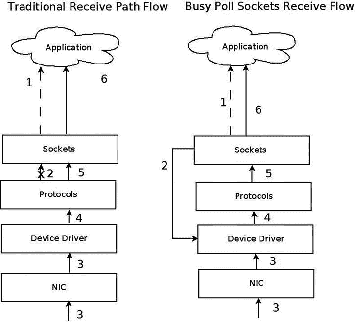
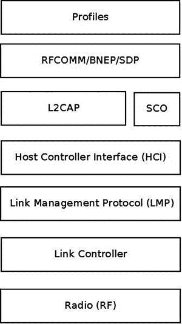
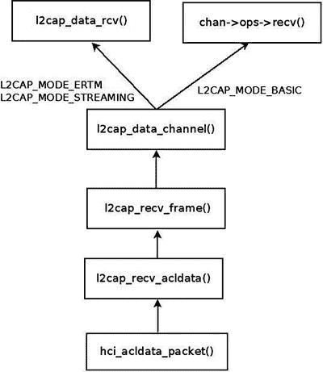
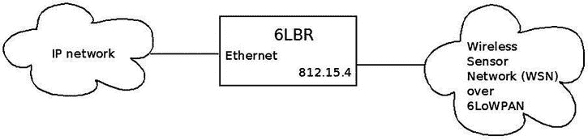
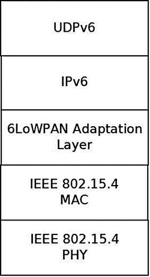
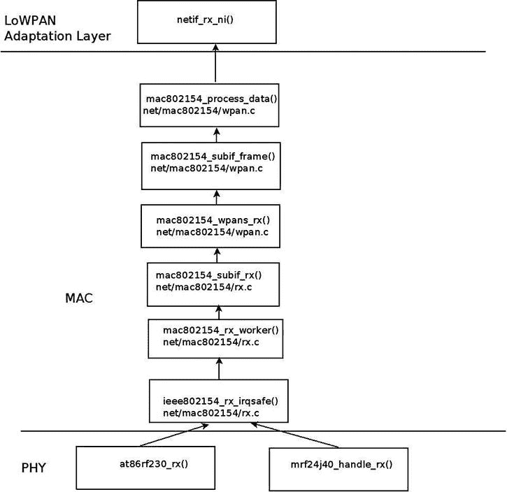
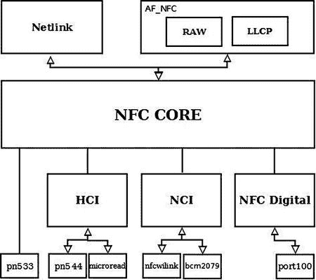
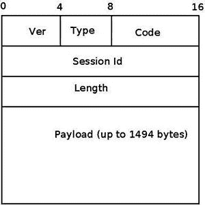

# 十四、高级主题

[第 13 章](13.html)讲述了 InfiniBand 子系统及其在 Linux 中的实现。本章讨论了几个高级主题和一些逻辑上不适合其他章节的主题。本章首先讨论网络名称空间，这是一种轻量级的进程虚拟化机制，近年来被添加到 Linux 中。我将讨论一般的名称空间实现，特别是网络名称空间。您将了解到，为了实现名称空间，只需要两个新的系统调用。您还将看到几个例子，说明使用`iproute2`的`ip`命令创建和管理网络名称空间是多么简单，以及将一个网络设备从一个网络名称空间移动到另一个网络名称空间以及将指定的进程附加到指定的网络名称空间是多么简单。cgroups 子系统还提供资源管理解决方案，这与名称空间不同。我将描述 cgroups 子系统及其两个网络模块`net_prio`和`cls_cgroup`，并给出两个使用这些 cgroup 网络模块的例子。

在本章的后面，您将了解繁忙的轮询套接字以及如何调优它们。繁忙轮询套接字特性为需要低延迟并愿意为更高的 CPU 利用率付出代价的套接字提供了一种有趣的性能优化技术。内核 3.11 提供了繁忙轮询套接字特性。我还将介绍蓝牙子系统、IEEE 802.15.4 子系统和近场通信(NFC)子系统；这三个子系统通常在短程网络中工作，并且针对这些子系统的新特征的开发正在快速进行。我还将讨论通知链，这是您在开发或调试内核网络代码和 PCI 子系统时可能会遇到的一种重要机制，因为许多网络设备都是 PCI 设备。我不会深入研究 PCI 子系统的细节，因为这本书不是关于设备驱动程序的。我将用三个简短的部分来结束这一章，一个是关于组队网络驱动程序(这是新的内核链路聚合解决方案)，一个是关于以太网点对点(PPPoE)协议，最后一个是关于 Android。

网络名称空间

本节介绍 Linux 名称空间、它们的用途以及它们是如何实现的。它包括对网络名称空间的深入讨论，并给出一些示例来演示它们的用法。Linux 名称空间本质上是一个虚拟化解决方案。在 Xen 或 KVM 等解决方案进入市场之前，操作系统虚拟化已经在大型机中实现了很多年。对于 Linux 名称空间，这是一种进程虚拟化的形式，这个想法一点也不新鲜。在 Plan 9 操作系统中尝试过(参见 1992 年的这篇文章:《Plan 9 中名称空间的使用》，`www.cs.bell-labs.com/sys/doc/names.html`)。

名称空间是轻量级进程虚拟化的一种形式，它提供了资源隔离。与 KVM 或 Xen 等虚拟化解决方案不同，使用名称空间，您不需要在同一台主机上创建额外的操作系统实例，而是只使用一个操作系统实例。在这种情况下，我应该提到 Solaris 操作系统有一个名为 Solaris Zones 的虚拟化解决方案，它也使用单个操作系统实例，但是资源分区的方案与 Linux 名称空间的方案有些不同(例如，在 Solaris Zones 中有一个全局区域，它是主区域，具有更多功能)。在 FreeBSD 操作系统中，有一种称为`jails,`的机制，它也提供资源分区，而无需运行多于一个内核实例。

Linux 名称空间的主要思想是在进程组之间划分资源，以使一个进程(或几个进程)拥有与其他进程组中的进程不同的系统视图。例如，这个特性用于在 Linux 容器项目(`http://lxc.sourceforge.net/`)中提供资源隔离。Linux 容器项目还使用了 cgroups 子系统提供的另一种资源管理机制，这将在本章后面介绍。有了容器，您可以使用操作系统的一个实例在同一台主机上运行不同的 Linux 发行版。高性能计算(HPC)中使用的检查点/恢复功能也需要名称空间。比如用在 CRIU ( `http://criu.org/Main_Page` `)`)，OpenVZ ( `http://openvz.org/Main_Page`)的一个软件工具，主要在用户空间为 Linux 进程实现检查点/恢复功能，虽然 CRIU 内核补丁合并的地方很少。我应该提到有一些项目在内核中实现检查点/恢复，但是这些项目在主线中没有被接受，因为它们太复杂了。以 CKPT 项目为例:`https://ckpt.wiki.kernel.org/index.php/Main_Page`。检查点/恢复功能(有时也称为检查点/重启)支持在文件系统上停止和保存多个进程，并在以后从文件系统中恢复这些进程(可能在不同的主机上),并从停止的地方继续执行。如果没有名称空间，检查点/恢复的使用案例非常有限，特别是只有使用它们才能进行实时迁移。网络名称空间的另一个用例是当您需要建立一个环境，该环境需要模拟不同的网络堆栈来进行测试、调试等。对于想了解更多关于检查点/重启的读者，我建议阅读 Sukadev Bhattiprolu、Eric W. Biederman、Serge Hallyn 和 Daniel Lezcano 撰写的文章“主流 Linux 中的虚拟服务器和检查点/重启”。

对于内核 2.4.19，挂载名称空间是 2002 年合并的第一种 Linux 名称空间。在内核 3.8 中，对于几乎所有的文件系统类型，用户名称空间是最后实现的。正如本节后面所讨论的，可能会开发额外的名称空间。要创建一个名称空间，除了用户名称空间之外，您应该对所有名称空间都具有 CAP_SYS_ADMIN 功能。尝试为除用户名称空间之外的所有名称空间创建没有 CAP_SYS_ADMIN 功能的名称空间，将导致–EPRM 错误(“不允许操作”)。许多开发人员参与了名称空间的开发，其中包括 Eric W. Biederman、Pavel Emelyanov、Al Viro、Cyrill Gorcunov、Andrew Vagin 等等。

在了解了关于进程虚拟化和 Linux 名称空间的一些背景知识，以及它们是如何使用的之后，现在就可以开始深入研究血淋淋的实现细节了。

名称空间实现

在撰写本文时，Linux 内核中已经实现了六个名称空间。下面是为了在 Linux 内核中实现名称空间并支持用户空间包中的名称空间而需要的主要添加和更改的描述:

*   添加了一个名为`nsproxy`(名称空间代理)的结构。该结构包含指向实现的六个名称空间中的五个名称空间的指针。在`nsproxy`结构中没有指向用户命名空间的指针；然而，所有其他五个名称空间对象都包含一个指向拥有它们的用户名称空间对象的指针，并且在这五个名称空间的每一个中，用户名称空间指针都被称为`user_ns`。用户名称空间是一个特例；它是凭证结构(`cred)`的成员，称为`user_ns`。`cred`结构表示进程的安全上下文。每个流程描述符(`task_struct)`包含两个`cred`对象，用于有效和客观的流程描述符凭证。我不会深入研究用户名称空间实现的所有细节和细微差别，因为这不在本书的范围之内。一个`nsproxy`对象由`create_nsproxy()`方法创建，并由`free_nsproxy()`方法释放。一个指向`nsproxy`对象的指针，也称为`nsproxy`，被添加到流程描述符中(流程描述符由`task_struct`结构、`include/linux/sched.h`表示)。)让我们来看看`nsproxy`结构，因为它很短，应该是不言自明的:

    ```sh
    struct nsproxy {
          atomic_t count;
           struct uts_namespace *uts_ns;
           struct ipc_namespace *ipc_ns;
           struct mnt_namespace *mnt_ns;
           struct pid_namespace *pid_ns;
           struct net           *net_ns;
    };
    (include/linux/nsproxy.h)
    ```

*   你可以在`nsproxy`结构中看到五个名称空间指针(没有用户名称空间指针)。在流程描述符(`task_struct`对象)中使用`nsproxy`对象代替五个名称空间对象是一种优化。当执行`fork()`时，一个新的子元素很可能和它的父元素存在于同一个名称空间集合中。因此，不是五次引用计数器递增(每个名称空间一次)，而是一次引用计数器递增(对于`nsproxy`对象)。`nsproxy count`成员是一个引用计数器，当`nsproxy`对象由`create_nsproxy()`方法创建时，它被初始化为 1，由`put_nsproxy()`方法递减，由`get_nsproxy()`方法递增。请注意，`nsproxy`对象的`pid_ns`成员在内核 3.11 中被重命名为`pid_ns_for_children`。
*   添加了一个新的系统调用`unshare()`。该系统调用获得一个参数，该参数是 CLONE*标志的位掩码。当 flags 参数由一个或多个名称空间 CLONE_NEW*标志组成时，`unshare()`系统调用执行以下步骤:

*   首先，它根据指定的标志创建一个新的名称空间(或几个名称空间)。这是通过调用`unshare_nsproxy_namespaces()`方法完成的，该方法又通过调用`create_new_namespaces()`方法创建了一个新的`nsproxy`对象和一个或多个名称空间。根据指定的 CLONE_NEW*标志确定新名称空间的类型。`create_new_namespaces()`方法返回一个新的`nsproxy`对象，它包含新创建的名称空间。
*   然后，它通过调用`switch_task_namespaces()`方法将调用流程附加到新创建的`nsproxy`对象。

当 CLONE_NEWPID 是系统调用`unshare`()的标志时，的工作方式与其他标志不同；这是对`fork()`的隐含论证；只有子任务会发生在新的 PID 名称空间中，而不是调用`unshare()`系统调用的那个。其他 CLONE_NEW*标志会立即将调用进程放入一个新的名称空间。

为支持名称空间的创建而添加的六个 CLONE_NEW*标志将在本节稍后描述。`unshare()`系统调用的实现在`kernel/fork.c`中。

*   添加了一个新的系统调用`setns()`。它将调用线程附加到现有的命名空间。它的原型是`int setns(int fd, int nstype)`；这些参数是:

*   `fd`:表示名称空间的文件描述符。这些是通过打开`/proc/<pid>/ns/`目录的链接获得的。
*   `nstype`:可选参数。当它是新的 CLONE_NEW*名称空间标志之一时，指定的文件描述符必须引用与指定的 CLONE_NEW*标志的类型相匹配的名称空间。当没有设置`nstype`(其值为 0)时，`fd`参数可以引用任何类型的名称空间。如果`nstype`不对应于与指定的`fd`相关联的名称空间类型，则返回值–EINVAL。

你可以在`kernel/nsproxy.c`中找到`setns()`系统调用的实现。

*   为了支持命名空间，添加了以下六个新的克隆标志:

*   CLONE_NEWNS(用于挂载名称空间)
*   CLONE_NEWUTS(用于 UTS 名称空间)
*   CLONE_NEWIPC(用于 IPC 名称空间)
*   CLONE_NEWPID(用于 PID 名称空间)
*   CLONE_NEWNET(用于网络名称空间)
*   CLONE_NEWUSER(用于用户名称空间)

传统上使用系统调用来创建一个新的进程。对它进行了调整，以支持这些新标志，这样它将创建一个附加到新名称空间(或多个名称空间)的新进程。请注意，在本章后面的一些示例中，您将会遇到使用 CLONE_NEWNET 标志来创建新的网络名称空间。

*   有名称空间支持的六个子系统中的每个子系统都实现了自己独特的名称空间。例如，mount 名称空间由一个名为`mnt_namespace`的结构表示，network 名称空间由一个名为`net`的结构表示，这将在本节的后面讨论。我将在本章后面提到其他名称空间。
*   对于名称空间的创建，添加了一个名为`create_new_namespaces()`的方法(`kernel/nsproxy.c`)。此方法获取一个 CLONE_NEW*标志或 CLONE_NEW*标志的位图作为第一个参数。它首先通过调用`create_nsproxy()`方法创建一个`nsproxy`对象，然后根据指定的标志关联一个名称空间；由于标志可以是标志的位掩码，`create_new_namespaces()`方法可以关联多个名称空间。我们来看看`create_new_namespaces()`的方法:

    ```sh
    static struct nsproxy *create_new_namespaces(unsigned long flags,
            struct task_struct *tsk, struct user_namespace *user_ns,
            struct fs_struct *new_fs)
    {
            struct nsproxy *new_nsp;
            int err;
    ```

分配一个`nsproxy`对象，并将其引用计数器初始化为 1:

```sh
        new_nsp = create_nsproxy();
        if (!new_nsp)
                return ERR_PTR(-ENOMEM);
        . . .
```

在成功创建了一个`nsproxy`对象之后，我们应该根据指定的标志创建名称空间，或者将一个现有的名称空间关联到我们创建的新的`nsproxy`对象。我们首先为挂载名称空间调用`copy_mnt_ns()`，然后为 UTS 名称空间调用`copy_utsname()`、。我将在这里简单描述一下`copy_utsname()`方法，因为 UTS 名称空间将在本章后面的“UTS 名称空间实现”一节中讨论。如果在`copy_utsname()`方法的指定标志中没有设置 CLONE_NEWUTS，则`copy_utsname()`方法不会创建新的 UTS 名称空间；它返回由`tsk->nsproxy->uts_ns`作为最后一个参数传递给`copy_utsname()`方法的 UTS 名称空间。如果设置了 CLONE_NEWUTS，`copy_utsname()`方法通过调用`clone_uts_ns()`方法克隆指定的 UTS 名称空间。`clone_uts_ns()`方法依次分配一个新的 UTS 命名空间对象，将指定的 UTS 命名空间(`tsk->nsproxy->uts_ns)`的`new_utsname`对象复制到新创建的 UTS 命名空间对象的`new_utsname`对象中，并返回新创建的 UTS 命名空间。在本章后面的“UTS 名称空间实现”一节中，您将了解到更多关于`new_utsname`结构的内容:

```sh
         new_nsp->uts_ns = copy_utsname(flags, user_ns, tsk->nsproxy->uts_ns);
         if (IS_ERR(new_nsp->uts_ns)) {
                 err = PTR_ERR(new_nsp->uts_ns);
                 goto out_uts;
         }
        . . .
```

在处理了 UTS 名称空间之后，我们继续调用`copy_ipcs()`方法来处理 IPC 名称空间，`copy_pid_ns()`来处理 PID 名称空间， `copy_net_ns()`来处理网络名称空间。注意，没有调用`copy_user_ns()`方法，因为`nsproxy`不包含指向用户名称空间的指针，如前所述。我将在这里简单描述一下`copy_net_ns()`方法。如果 CLONE_NEWNET 没有在`create_new_namespaces()`方法的指定标志中设置，那么`copy_net_ns()`方法将返回作为第三个参数传递给`copy_net_ns()`方法`tsk->nsproxy->net_ns`的网络名称空间，就像`copy_utsname()`所做的那样，正如您在本节前面所看到的。如果设置了 CLONE_NEWNET，`copy_net_ns()`方法通过调用`net_alloc()`方法分配一个新的网络名称空间，`i`通过调用`setup_net()`方法将其初始化，并将其添加到所有网络名称空间的全局列表中，`net_namespace_list`:

```sh
        new_nsp->net_ns = copy_net_ns(flags, user_ns, tsk->nsproxy->net_ns);
        if (IS_ERR(new_nsp->net_ns)) {
                err = PTR_ERR(new_nsp->net_ns);
                goto out_net;
        }
        return new_nsp;
}

```

注意，`setns()`系统调用，不创建新的名称空间，只是将调用线程附加到指定的名称空间，也调用`create_new_namespaces()`，但它将 0 作为第一个参数传递；这意味着通过调用`create_nsproxy()`方法只创建了一个`nsproxy`，但没有创建新的名称空间，而是调用线程与一个现有的网络名称空间相关联，该名称空间由`setns()`系统调用的指定`fd`参数标识。稍后在`setns()`系统调用实现中，`switch_task_namespaces()`方法被调用，它将刚刚创建的新`nsproxy`分配给调用线程(参见`kernel/nsproxy.c`)。

*   在`kernel/nsproxy.c`中增加了一个名为`exit_task_namespaces()` 的方法。当进程终止时，通过`do_exit()`方法(`kernel/exit.c`)调用它。`exit_task_namespaces()`方法获取流程描述符(`task_struct`对象)作为单个参数。事实上，它唯一做的事情就是调用`switch_task_namespaces()`方法，传递指定的流程描述符和一个空的`nsproxy`对象作为参数。`switch_task_namespaces()`方法反过来使正在被终止的进程的进程描述符的`nsproxy`对象无效。如果没有其他进程使用这个`nsproxy`，它就会被释放。
*   添加了一个名为`get_net_ns_by_fd()`的方法。这个方法获取一个文件描述符作为它的单个参数，并返回与指定文件描述符对应的 inode 相关联的网络名称空间。对于不熟悉文件系统和 inode 语义的读者来说，我建议阅读由 Daniel P. Bovet 和 Marco Cesati (O'Reilly，2005)在*理解 Linux 内核*中的[第 12 章](12.html)“虚拟文件系统”的“Inode 对象”一节。
*   增加了一个名为`get_net_ns_by_pid()` 的方法。该方法获取一个 PID 号作为单个参数，并返回该进程附加到的网络命名空间对象。
*   在`/proc/<pid>/ns`下添加了六个条目，每个名称空间一个。这些文件在打开时应该被输入到`setns()`系统调用中。您可以使用`ls –al`或`readlink`来显示与名称空间相关联的惟一 proc inode 号。这个惟一的 proc inode 在创建名称空间时由`proc_alloc_inum`()方法创建，在释放名称空间时由`proc_free_inum()`方法释放。例如，参见`kernel/pid_namespace.c`中的`create_pid_namespace()`方法。在下面的例子中，右边方括号中的数字是每个名称空间的惟一 proc inode 号:

    ```sh
    ls -al /proc/1/ns/
    total 0
    dr-x--x--x 2 root root 0 Nov  3 13:32 .
    dr-xr-xr-x 8 root root 0 Nov  3 12:17 ..
    lrwxrwxrwx 1 root root 0 Nov  3 13:32 ipc -> ipc:[4026531839]
    lrwxrwxrwx 1 root root 0 Nov  3 13:32 mnt -> mnt:[4026531840]
    lrwxrwxrwx 1 root root 0 Nov  3 13:32 net -> net:[4026531956]
    lrwxrwxrwx 1 root root 0 Nov  3 13:32 pid -> pid:[4026531836]
    lrwxrwxrwx 1 root root 0 Nov  3 13:32 user -> user:[4026531837]
    lrwxrwxrwx 1 root root 0 Nov  3 13:32 uts -> uts:[4026531838]

    ```

*   如果满足以下任一条件，命名空间可以保持活动状态:

*   `/proc/<pid>/ns/`描述符下的命名空间文件被保存。
*   将命名空间 proc 文件绑定挂载到其他地方，例如，对于 PID 命名空间，通过:`mount --bind /proc/self/ns/pid /some/filesystem/path`

*   对于六个名称空间中的每一个，定义了一个 proc 名称空间操作对象(`proc_ns_operations`结构的一个实例)。这个对象由回调组成，例如`inum`，以返回与名称空间或`install`相关联的唯一 proc inode 号，用于名称空间安装(在`install`回调中，执行名称空间特定的动作，例如将特定名称空间对象附加到`nsproxy`对象，等等；`install`回调由`setns`系统调用调用)。`proc_ns_operations`结构在`include/linux/proc_fs.h`中定义。以下是六个`proc_ns_operations`对象的列表:

*   `utsns_operations`为 UTS 命名空间(`kernel/utsname.c`)
*   `ipcns_operations`对于 IPC 名称空间(`ipc/namespace.c`)
*   `mntns_operations`对于挂载命名空间(`fs/namespace.c`)
*   `pidns_operations`对于 PID 名称空间(`kernel/pid_namespace.c`)
*   `userns_operations`用于用户命名空间(`kernel/user_namespace.c`)
*   `netns_operations`用于网络命名空间(`net/core/net_namespace.c`)

*   对于每个名称空间，除了挂载名称空间之外，都有一个**初始名称空间**:

*   `init_uts_ns`:用于 UTS 命名空间(`init/version.c`)。
*   `init_ipc_ns`:对于 IPC 命名空间(`ipc/msgutil.c`)。
*   `init_pid_ns`:用于 PID 命名空间(`kernel/pid.c`)。
*   `init_net`:用于网络命名空间(`net/core/net_namespace.c`)。
*   `init_user_ns`:用于用户命名空间(`kernel/user.c`)。

*   定义了一个初始的、默认的`nsproxy`对象:它被称为`init_nsproxy`，包含指向五个初始名称空间的指针；除了 mount 命名空间被初始化为空之外，都被初始化为对应的特定初始命名空间:

    ```sh
    struct nsproxy init_nsproxy = {
            .count  = ATOMIC_INIT(1),
            .uts_ns = &init_uts_ns,
    #if defined(CONFIG_POSIX_MQUEUE) || defined(CONFIG_SYSVIPC)
            .ipc_ns = &init_ipc_ns,
    #endif
            .mnt_ns = NULL,
            .pid_ns = &init_pid_ns,
    #ifdef CONFIG_NET
            .net_ns = &init_net,
    #endif
    };
    (kernel/nsproxy.c)

    ```

*   添加了一个名为`task_nsproxy`()的方法；它以单个参数的形式获取一个流程描述符(`task_struct`对象)，并返回与指定的`task_struct`对象相关联的`nsproxy`。参见`include/linux/nsproxy.h`。

在撰写本文时，Linux 内核中有六个可用的名称空间:

*   **挂载名称空间:**挂载名称空间允许进程查看自己的文件系统视图及其挂载点。在一个挂载命名空间中挂载文件系统不会传播到其他挂载命名空间。挂载名称空间是通过在调用`clone()`或`unshare()`系统调用时设置 CLONE_NEWNS 标志来创建的。为了实现挂载名称空间，添加了一个名为`mnt_namespace`的结构(`fs/mount.h`),`nsproxy`持有一个指向名为`mnt_ns`的`mnt_namespace`对象的指针。内核 2.4.19 提供了挂载名称空间。挂载名称空间主要在`fs/namespace.c`中实现。创建新的装载命名空间时，以下规则适用:

*   所有以前的装载将在新的装载命名空间中可见。
*   新挂载名称空间中的挂载/卸载对于系统的其余部分是不可见的。
*   全局装载命名空间中的装载/卸载在新的装载命名空间中可见。

挂载名称空间使用一种 VFS 增强，称为*共享子树*，它是在 Linux 2.6.15 内核中引入的；特性引入了新的标志:MS_PRIVATE、MS_SHARED、MS_SLAVE 和 MS_UNBINDABLE。(参见`http://lwn.net/Articles/159077/`和`Documentation/filesystems/sharedsubtree.txt`。)我不会讨论挂载名称空间实现的内部。对于想了解更多关于挂载名称空间用法的读者，我建议阅读以下文章:“应用挂载名称空间”，作者 Serge E. Hallyn 和 Ram Pai ( `http://www.ibm.com/developerworks/linux/library/l-mount-namespaces/index.html` `)。`

 `*   **PID 名称空间:**PID 名称空间为不同 PID 名称空间中的不同进程提供了拥有相同 PID 的能力。这个特性是 Linux 容器的构建块。这对于进程的检查点/恢复非常重要，因为在一台主机上设置了检查点的进程可以在另一台主机上恢复，即使该主机上存在具有相同 PID 的进程。当在新的 PID 名称空间中创建第一个进程时，它的 PID 是 1。这个流程的行为有点像`init`流程的行为。这意味着当一个进程死亡时，它的所有孤立子进程现在将拥有 PID 1 作为其父进程的进程(child reaping)。向 PID 为 1 的进程发送 SIGKILL 信号不会终止该进程，无论 SIGKILL 信号是在哪个命名空间发送的，是在初始 PID 命名空间还是在任何其他 PID 命名空间。但是从另一个 PID 名称空间(父名称空间)中删除一个 PID 名称空间的`init`将会起作用。在这种情况下，所有存在于以前命名空间中的任务都将被终止，PID 命名空间将被停止。PID 名称空间是通过在调用`clone()`或`unshare()`系统调用时设置 CLONE_NEWPID 标志来创建的。为了实现 PID 名称空间，添加了一个名为`pid_namespace`的结构(`include/linux/pid_namespace.h`),`nsproxy`保存了一个指向名为`pid_ns`的`pid_namespace`对象的指针。为了支持 PID 名称空间，应该设置 CONFIG_PID_NS。PID 名称空间在内核 2.6.24 中可用。PID 名称空间主要在`kernel/pid_namespace.c`中实现。
*   **网络名称空间:**网络名称空间允许创建看似内核网络堆栈的多个实例。当调用`clone()`或`unshare()`系统调用时，通过设置 CLONE_NEWNET 标志来创建网络名称空间。为了实现网络名称空间，添加了一个名为`net`的结构(`include/net/net_namespace.h`),`nsproxy`持有一个指向名为`net_ns`的`net`对象的指针。为了支持网络命名空间，应该设置 CONFIG_NET_NS。我将在本节的后面讨论网络名称空间。内核 2.6.29 提供了网络名称空间。网络名称空间主要在`net/core/net_namespace.c`中实现。
*   **IPC 名称空间:**IPC 名称空间允许进程拥有自己的 System V IPC 资源和 POSIX 消息队列资源。IPC 名称空间是通过在调用`clone()`或`unshare()`系统调用时设置 CLONE_NEWIPC 标志来创建的。为了实现 IPC 名称空间，添加了一个名为`ipc_namespace`的结构(`include/linux/ipc_namespace.h`),`nsproxy`持有一个指向名为`ipc_ns`的`ipc_namespace`对象的指针。为了支持 IPC 名称空间，应该设置 CONFIG_IPC_NS。内核 2.6.19 中的 IPC 名称空间提供了对 System V IPC 资源的支持。对 IPC 名称空间中 POSIX 消息队列资源的支持是后来在内核 2.6.30 中添加的。IPC 名称空间主要在`ipc/namespace.c`中实现。
*   **UTS 名称空间:**UTS 名称空间为不同的 UTS 名称空间提供了拥有不同的主机名或域名(或者由`uname()`系统调用返回的其他信息)的能力。UTS 名称空间是通过在调用`clone()`或`unshare()`系统调用时设置 CLONE_NEWUTS 标志来创建的。在实现的六个名称空间中，UTS 名称空间实现是最简单的。为了实现 UTS 名称空间，添加了一个名为`uts_namespace`的结构(`include/linux/utsname.h`),`nsproxy`保存了一个指向名为`uts_ns`的`uts_namespace`对象的指针。为了支持 UTS 命名空间，应该设置 CONFIG_UTS_NS。内核 2.6.19 提供了 UTS 名称空间。UTS 名称空间主要在`kernel/utsname.c`中实现。
*   **用户名称空间:**用户名称空间允许映射用户和组 id。这种映射是通过写入两个为支持用户名称空间而添加的`procfs`条目来完成的:`/proc/sys/kernel/overflowuid`和`/proc/sys/kernel/overflowgid`。附加到用户名称空间的进程可以具有与宿主不同的一组功能。当调用`clone()`或`unshare()`系统调用时，通过设置 CLONE_NEWUSER 标志来创建用户名称空间。为了实现用户名称空间，添加了一个名为`user_namespace`的结构(`include/linux/user_namespace.h`)。`user_namespace`对象包含一个指向创建它的用户名称空间对象的指针(`parent`)。与其他五个名称空间不同，`nsproxy`不持有指向`user_namespace`对象的指针。我不会深入研究用户名称空间的更多实现细节，因为它可能是最复杂的名称空间，并且超出了本书的范围。为了支持用户名称空间，应该设置 CONFIG_USER_NS。从内核 3.8 开始，几乎所有文件系统类型都可以使用用户名称空间。用户名称空间主要在`kernel/user_namespace.c`中实现。

在四个用户空间包中增加了对名称空间的支持:

*   在`util-linux`中:

*   从版本 2.17 开始，`unshare`实用程序可以创建六个名称空间中的任何一个。
*   从版本 2.23 开始提供的`nsenter`实用程序(实际上是围绕`setns`系统调用的一个轻量级包装器)。

*   在`iproute2`中，网络名称空间的管理是通过`ip netns`命令完成的，在本章的后面你会看到几个这样的例子。此外，您可以使用`ip link`命令将网络接口移动到不同的网络名称空间，您将在本章后面的“将网络接口移动到不同的网络名称空间”一节中看到。
*   在`ethtool`中，增加了对 enable 的支持，可以发现是否为指定的网络接口设置了 NETIF_F_NETNS_LOCAL 特性。如果设置了 NETIF_F_NETNS_LOCAL 功能，这表示网络接口位于该网络命名空间的本地，您不能将其移动到不同的网络命名空间。NETIF_F_NETNS_LOCAL 特性将在本节稍后讨论。
*   在 wireless `iw`包中，添加了一个选项，允许将无线接口移动到不同的名称空间。

 **注**在 2006 年渥太华 Linux 研讨会(OLS)的一次演讲《全球 Linux 名称空间的多个实例》中，Eric w . Biederman(Linux 名称空间的主要开发者之一)提到了十个名称空间；他在本演示中提到的其他四个尚未实现的名称空间是:设备名称空间、安全名称空间、安全密钥名称空间和时间名称空间。(见`https://www.kernel.org/doc/ols/2006/ols2006v1-pages-101-112.pdf` `.) For more information about namespaces, I suggest reading a series of six articles about it by Michael Kerrisk (`https://lwn.net/Articles/531114/` `)`)。移动操作系统虚拟化项目引发了支持设备名称空间的开发工作；关于设备名称空间的更多信息，它还不是内核的一部分，参见 Jake Edge 的“设备名称空间”(`http://lwn.net/Articles/564854/` `) and also (`http://lwn.net/Articles/564977/` `). There was also some work for implementing a new syslog namespace (see the article “Stepping Closer to Practical Containers: “syslog” namespaces”, `http://lwn.net/Articles/527342/` `)。```sh`

 ```以下三个系统调用可用于命名空间:

*   `clone():`创建一个附加到新名称空间的新进程。名称空间的类型由作为参数传递的 CLONE_NEW*标志指定。请注意，您也可以使用这些 CLONE_NEW*标志的位掩码。`clone()`系统调用的实现在`kernel/fork.c`中。
*   `unshare()`:本节前面讨论过。
*   `setns()`:本节前面讨论过。

 **注意**名称空间在内核中没有用户空间进程可以用来与之对话的名称。如果名称空间有名字，这就需要在另一个特殊的名称空间中全局保存它们。这将使实施变得复杂，并可能在检查点/恢复等方面引发问题。相反，用户空间进程应该打开`/proc/<pid>/ns/`下的名称空间文件，它们的文件描述符可以用来与特定的名称空间对话，以保持该名称空间的活力。名称空间由创建时生成的唯一 proc inode 号标识，释放时释放。六个名称空间结构中的每一个都包含一个名为`proc_inum`的整数成员，它是名称空间惟一的 proc inode 号，通过调用`proc_alloc_inum()`方法来分配。六个名称空间中的每一个都有一个`proc_ns_operations`对象，它包括特定于名称空间的回调；其中一个回调函数叫做`inum`，返回相关名称空间的`proc_inum`(关于`proc_ns_operations`结构的定义，请参考`include/linux/proc_fs.h`)。

在讨论网络名称空间之前，让我们描述一下最简单的名称空间，即 UTS 名称空间是如何实现的。这是理解其他更复杂的名称空间的良好起点。

UTS 命名空间实现

为了实现 UTS 命名空间，添加了一个名为`uts_namespace`的结构:

```sh
struct uts_namespace {
        struct kref kref;
        struct new_utsname name;
        struct user_namespace *user_ns;
        unsigned int proc_inum;
};
(include/linux/utsname.h)
```

下面是对`uts_namespace`结构成员的简短描述:

*   `kref`:参考计数器。它是一个通用的内核引用计数器，由`kref_get()`方法递增，由`kref_put()`方法递减。除了 UTS 命名空间，PID 命名空间也有一个`kref`对象作为引用计数器；所有其他四个名称空间都使用原子计数器进行引用计数。关于`kref` API 的更多信息请看`Documentation/kref.txt`。
*   `name`:一个`new_utsname`对象，包含类似`domainname`和`nodename`的字段(稍后将讨论)。
*   `user_ns`:与 UTS 命名空间相关联的用户命名空间。
*   `proc_inum`:UTS 名称空间的唯一进程索引节点号。

`nsproxy`结构包含一个指向`uts_namespace`的指针:

```sh
struct nsproxy {
        . . .
        struct uts_namespace *uts_ns;
        . . .
};
(include/linux/nsproxy.h)
```

正如您之前看到的，`uts_namespace`对象包含了一个`new_utsname`结构的实例。让我们看一下`new_utsname`结构，这是 UTS 名称空间的本质:

```sh
struct new_utsname {
        char sysname[__NEW_UTS_LEN + 1];
        char nodename[__NEW_UTS_LEN + 1];
        char release[__NEW_UTS_LEN + 1];
        char version[__NEW_UTS_LEN + 1];
        char machine[__NEW_UTS_LEN + 1];
        char domainname[__NEW_UTS_LEN + 1];
};
(include/uapi/linux/utsname.h)
```

`new_utsname`的`nodename`成员是主机名，`domainname`是域名。添加了一个名为`utsname()`的方法；这个方法只是返回与当前运行的进程相关联的`new_utsname`对象(`current`):

```sh
static inline struct new_utsname *utsname(void)
{
         return &current->nsproxy->uts_ns->name;
}
(include/linux/utsname.h)
```

现在，新的`gethostname()`系统调用实现如下:

```sh
SYSCALL_DEFINE2(gethostname, char __user *, name, int, len)
{
        int i, errno;
        struct new_utsname *u;

        if (len < 0)
                return -EINVAL;
        down_read(&uts_sem);
```

调用`utsname()`方法，该方法访问与当前进程关联的 UTS 命名空间的`new_utsname`对象:

```sh
        u = utsname();
        i = 1 + strlen(u->nodename);
        if (i > len)
                i = len;
        errno = 0;
```

将`utsname()`方法返回的`new_utsname`对象的`nodename`复制到用户空间:

```sh
        if (copy_to_user(name, u->nodename, i))
                errno = -EFAULT;
        up_read(&uts_sem);
        return errno;
}
(kernel/sys.c)
```

你可以在`uname()`系统调用的`sethostbyname()`和中找到类似的方法，它们也在`kernel/sys.c`中定义。我应该注意，UTS 名称空间实现也处理 UTS `procfs`条目。只有两个 UTS `procfs`条目，`/proc/sys/kernel/domainname`和`/proc/sys/kernel/hostname`，它们是可写的(这意味着您可以从用户空间更改它们)。还有其他不可写的 UTS `procfs`条目，如`/proc/sys/kernel/ostype`和`/proc/sys/kernel/osrelease`。如果您查看 UTS `procfs`条目`uts_kern_table (kernel/utsname_sysctl.c)`的表格，您会看到一些条目，如`ostype`和`osrelease`，具有“0444”模式，这意味着它们不可写，只有其中的两个条目`hostname`和`domainname`具有“0644”模式，这意味着它们是可写的。UTS `procfs`条目的读写由`proc_do_uts_string()`方法处理。想要了解更多关于如何处理 UTS `procfs`条目的读者应该查看`proc_do_uts_string()`方法和`get_uts()`方法；两人都在`kernel/utsname_sysctl.c`。

既然您已经了解了最简单的名称空间——UTS 名称空间是如何实现的，那么是时候了解网络名称空间及其实现了。

网络名称空间实现

网络名称空间在逻辑上是网络堆栈的另一个副本，具有自己的网络设备、路由表、邻居表、网络过滤表、网络套接字、网络`procfs`条目、网络`sysfs`条目和其他网络资源。网络名称空间的一个实用特性是，在给定名称空间(比如说`ns1`)中运行的网络应用将首先在`/etc/netns/ns1`下寻找配置文件，然后才在`/etc`下寻找。因此，举例来说，如果您创建了一个名为`ns1`的名称空间，并且您已经创建了`/etc/netns/ns1/hosts`，那么每个试图访问`hosts`文件的用户空间应用将首先访问`/etc/netns/ns1/hosts`，并且只有到那时(如果所寻找的条目不存在)它才会读取`/etc/hosts`。这个特性是使用绑定挂载实现的，并且只适用于使用`ip netns add`命令创建的网络名称空间。

网络命名空间对象(struct net)

现在让我们来看一下`net`结构的定义，它是代表网络名称空间的基本数据结构:

```sh
struct net {
        . . .
        struct user_namespace   *user_ns;       /* Owning user namespace */
        unsigned int            proc_inum;
        struct proc_dir_entry   *proc_net;
        struct proc_dir_entry   *proc_net_stat;
        . . .
        struct list_head        dev_base_head;
        struct hlist_head       *dev_name_head;
        struct hlist_head       *dev_index_head;
        . . .
        int                     ifindex;
        . . .
        struct net_device       *loopback_dev;  /* The loopback */
        . . .
        atomic_t                count;          /* To decided when the network
                                                *  namespace should be shut down.
                                                */

        struct netns_ipv4       ipv4;
#if IS_ENABLED(CONFIG_IPV6)
        struct netns_ipv6       ipv6;
#endif
#if defined(CONFIG_IP_SCTP) || defined(CONFIG_IP_SCTP_MODULE)
        struct netns_sctp       sctp;
#endif
       . . .

#if defined(CONFIG_NF_CONNTRACK) || defined(CONFIG_NF_CONNTRACK_MODULE)
        struct netns_ct         ct;
#endif
#if IS_ENABLED(CONFIG_NF_DEFRAG_IPV6)
        struct netns_nf_frag    nf_frag;
#endif
        . . .
        struct net_generic __rcu  *gen;
#ifdef CONFIG_XFRM
        struct netns_xfrm       xfrm;
#endif
        . . .
};
(include/net/net_namespace.h)
```

下面是对`net`结构中几个成员的简短描述:

*   `user_ns`表示创建网络命名空间的用户命名空间；它拥有网络名称空间及其所有资源。它在`setup_net()`方法中被赋值。对于初始网络名称空间对象(`init_net`)，创建它的用户名称空间是初始用户名称空间，`init_user_ns`。
*   `proc_inum`是与网络名称空间相关联的唯一 proc inode 号。这个惟一的进程索引节点是由`proc_alloc_inum()`方法创建的，该方法还将`proc_inum`指定为进程索引节点号。`proc_alloc_inum()`方法由网络名称空间初始化方法`net_ns_net_init()`调用，通过调用网络名称空间清理方法`net_ns_net_exit()`中的`proc_free_inum()`方法释放。
*   `proc_net`代表网络名称空间`procfs`条目`(/proc/net)`，因为每个网络名称空间维护其自己的`procfs`条目。
*   `proc_net_stat`代表网络名称空间`procfs`统计条目`(/proc/net/stat)`，因为每个网络名称空间维护其自己的`procfs`统计条目。
*   `dev_base_head`指向所有网络设备的链表。
*   `dev_name_head`指向一个网络设备的哈希表，其中的键是网络设备名。
*   `dev_index_head`指向一个网络设备的哈希表，其中的键是网络设备索引。
*   `ifindex`是网络名称空间内分配的最后一个设备索引。索引在网络命名空间中被虚拟化；这意味着回送设备在所有网络名称空间中的索引总是为 1，而其他网络设备在不同的网络名称空间中可能具有相同的索引。
*   `loopback_dev`是环回设备。每个新的网络命名空间都是用一个网络设备创建的，即环回设备。在`loopback_net_init()`方法`drivers/net/loopback.c`中分配网络名称空间的`loopback_dev`对象。您不能将环回设备从一个网络名称空间移动到另一个网络名称空间。
*   `count`是网络名称空间引用计数器。当通过`setup_net()`方法创建网络名称空间时，它被初始化为 1。它通过`get_net()`方法递增，通过`put_net()`方法递减。如果在`put_net()`方法中`count`参考计数器达到 0，则调用`__put_net()`方法。然后，`__put_net()`方法将网络名称空间添加到要删除的网络名称空间的全局列表中，`cleanup_list`，然后删除它。
*   IPv4 子系统的`ipv4`(`netns_ipv4`结构的一个实例)。`netns_ipv4`结构包含 IPv4 特定字段，这些字段对于不同的名称空间是不同的。例如，在第 6 章的[中，您看到了名为`net`的指定网络名称空间的组播路由表存储在`net->ipv4.mrt`中。我将在本节稍后讨论`netns_ipv4`。](06.html)
*   IPv6 子系统的`ipv6`(`netns_ipv6`结构的一个实例)。
*   用于 SCTP 套接字的`sctp`(`netns_sctp`结构的一个实例)。
*   `ct`(`netns_ct`结构的一个实例，在[第 9 章](09.html) `)`中讨论了 netfilter 连接跟踪子系统。
*   `gen`(`net_generic`结构的一个实例，在`include/net/netns/generic.h`中定义)是描述可选子系统的网络名称空间上下文的结构上的一组通用指针。例如，`sit`模块(简单互联网过渡，IPv6 隧道，在`net/ipv6/sit.c`实现)使用这个引擎将其私有数据放在`struct net`上。引入这一点是为了不使`struct net`淹没每个网络子系统的指针，每个网络子系统都愿意拥有每个网络名称空间上下文。
*   `xfrm`(`netns_xfrm`结构的一个实例，在 IPsec 子系统的[第 10 章](10.html) `)`中多次提到。

让我们来看看 IPv4 特定的名称空间,`netns_ipv4`结构:

```sh
struct netns_ipv4 {
    . . .
#ifdef CONFIG_IP_MULTIPLE_TABLES
        struct fib_rules_ops    *rules_ops;
        bool                    fib_has_custom_rules;
        struct fib_table        *fib_local;
        struct fib_table        *fib_main;
        struct fib_table        *fib_default;
#endif
   . . .
        struct hlist_head       *fib_table_hash;
        struct sock             *fibnl;

        struct sock             **icmp_sk;
   . . .
#ifdef CONFIG_NETFILTER
        struct xt_table         *iptable_filter;
        struct xt_table         *iptable_mangle;
        struct xt_table         *iptable_raw;
        struct xt_table         *arptable_filter;
#ifdef CONFIG_SECURITY
        struct xt_table         *iptable_security;
#endif
        struct xt_table         *nat_table;
#endif

        int sysctl_icmp_echo_ignore_all;
        int sysctl_icmp_echo_ignore_broadcasts;
        int sysctl_icmp_ignore_bogus_error_responses;
        int sysctl_icmp_ratelimit;
        int sysctl_icmp_ratemask;
        int sysctl_icmp_errors_use_inbound_ifaddr;

        int sysctl_tcp_ecn;

        kgid_t sysctl_ping_group_range[2];
        long sysctl_tcp_mem[3];

        atomic_t dev_addr_genid;

#ifdef CONFIG_IP_MROUTE
#ifndef CONFIG_IP_MROUTE_MULTIPLE_TABLES
        struct mr_table         *mrt;
#else
        struct list_head        mr_tables;
        struct fib_rules_ops    *mr_rules_ops;
#endif
#endif
};
(net/netns/ipv4.h)
```

您可以在`netns_ipv4`结构中看到许多特定于 IPv4 的表和变量，比如路由表、netfilter 表、多播路由表等等。

网络名称空间实现:其他数据结构

为了支持网络名称空间，在网络设备对象(`struct net_device`)中添加了一个名为`nd_net`的成员，它是一个指向网络名称空间的指针。通过调用`dev_net_set()`方法来设置网络设备的网络名称空间，通过调用`dev_net()`方法来获取与网络设备相关联的网络名称空间。请注意，在给定时刻，一个网络设备只能属于一个网络命名空间。`nd_net`通常在网络设备注册或网络设备移动到不同的网络名称空间时设置。例如，在注册 VLAN 设备时，会使用上述两种方法:

```sh
static int register_vlan_device(struct net_device *real_dev, u16 vlan_id)
{
    struct net_device *new_dev;
```

要分配给新 VLAN 设备的网络名称空间是与真实设备相关联的网络名称空间，它作为参数传递给`register_vlan_device()`方法；我们通过调用`dev_net(real_dev)`获得这个名称空间:

```sh
    struct net *net = dev_net(real_dev);
    . . .
    new_dev = alloc_netdev(sizeof(struct vlan_dev_priv), name, vlan_setup);

    if (new_dev == NULL)
        return -ENOBUFS;
```

通过调用`dev_net_set()`方法切换网络名称空间:

```sh
    dev_net_set(new_dev, net);

    . . .
}
```

一个名为`sk_net`的成员，一个指向网络名称空间的指针，被添加到代表套接字的`struct sock`中。为一个`sock`对象设置网络名称空间是通过调用`sock_net_set()`方法来完成的，获取与一个`sock`对象相关联的网络名称空间是通过调用`sock_net()`方法来完成的。像在`nd_net`对象的情况下一样，`sock`对象在给定时刻也只能属于一个网络名称空间。

当系统引导时，会创建一个默认的网络名称空间`init_net,`。引导后，所有物理网络设备和所有套接字都属于该初始命名空间，网络环回设备也是如此。

一些网络设备和一些网络子系统应该具有网络命名空间特定的数据。为了实现这一点，添加了一个名为`pernet_operations`的结构；这个结构包括一个`init`和`exit`回调:

```sh
struct pernet_operations {
        . . .
        int (*init)(struct net *net);
        void (*exit)(struct net *net);
        . . .
        int *id;
        size_t size;
};
(include/net/net_namespace.h)
```

需要网络名称空间特定数据的网络设备应该定义一个`pernet_operations`对象，并分别为设备特定的初始化和清理定义其`init()`和`exit()`回调，并在模块初始化时调用`register_pernet_device()`方法，在模块被移除时调用`unregister_pernet_device()`方法，在这两种情况下将`pernet_operations`对象作为单个参数传递。例如，PPPoE 模块通过`procfs`条目`/proc/net/pppoe`导出关于 PPPoE 会话的信息。此`procfs`条目导出的信息取决于此 PPPoE 设备所属的网络名称空间(因为不同的 PPPoE 设备可能属于不同的网络名称空间)。所以 PPPoE 模块定义了一个名为`pppoe_net_ops`的`pernet_operations`对象:

```sh
static struct pernet_operations pppoe_net_ops = {
        .init = pppoe_init_net,
        .exit = pppoe_exit_net,
        .id   = &pppoe_net_id,
        .size = sizeof(struct pppoe_net),
}
(net/ppp/pppoe.c)
```

在`init`回调`pppoe_init_net()`中，它只通过调用`proc_create()`方法创建 PPPoE `procfs`条目`/proc/net/pppoe`:

```sh
static __net_init int pppoe_init_net(struct net *net)
{
        struct pppoe_net *pn = pppoe_pernet(net);
        struct proc_dir_entry *pde;

        rwlock_init(&pn->hash_lock);

        pde = proc_create("pppoe", S_IRUGO, net->proc_net, &pppoe_seq_fops);
#ifdef CONFIG_PROC_FS
        if (!pde)
                return -ENOMEM;
#endif

        return 0;
}
(net/ppp/pppoe.c)
```

在`exit`回调`pppoe_exit_net()`中，它只通过调用`remove_proc_entry()`方法移除 PPPoE `procfs`条目`/proc/net/pppoe`:

```sh
static __net_exit void pppoe_exit_net(struct net *net)
{
        remove_proc_entry("pppoe", net->proc_net);
}
(net/ppp/pppoe.c)
```

需要网络命名空间特定数据的网络子系统应该在初始化子系统时调用`register_pernet_subsys()`，在移除子系统时调用`unregister_pernet_subsys()`。你可以在`net/ipv4/route.c`里找例子，还有很多其他复习这些方法的例子。网络名称空间模块本身也定义了一个`net_ns_ops`对象，并在引导阶段注册它:

```sh
static struct pernet_operations __net_initdata net_ns_ops = {
        .init = net_ns_net_init,
        .exit = net_ns_net_exit,
};

static int __init net_ns_init(void)
{
    . . .
    register_pernet_subsys(&net_ns_ops);
    . . .
}
(net/core/net_namespace.c)
```

每次创建新的网络名称空间时，调用`init`回调(`net_ns_net_init`)，每次删除网络名称空间时，调用`exit`回调(`net_ns_net_exit`)。`net_ns_net_init()`唯一做的事情是通过调用`proc_alloc_inum()`方法为新创建的名称空间分配一个惟一的 proc inode 新创建的唯一 proc inode 编号被分配给`net->proc_inum`:

```sh
static __net_init int net_ns_net_init(struct net *net)
{
        return proc_alloc_inum(&net->proc_inum);
}
```

`net_ns_net_exit()`方法做的唯一一件事就是通过调用`proc_free_inum()`方法删除这个惟一的 proc inode:

```sh
static __net_exit void net_ns_net_exit(struct net *net)
{
        proc_free_inum(net->proc_inum);
}
```

当您创建新的网络命名空间时，它只有网络环回设备。创建网络命名空间最常见的方法是:

*   由一个用户空间应用创建一个网络名称空间，该应用使用`clone()`系统调用或`unshare()`系统调用，在两种情况下都设置 CLONE_NEWNET 标志。
*   使用`iproute2`的`ip netns`命令(您将很快看到一个例子)。
*   使用`util-linux`的`unshare`实用程序，带有`--net`标志。

网络名称空间管理

接下来，您将看到一些使用`iproute2`包的`ip netns`命令来执行诸如创建网络名称空间、删除网络名称空间、显示所有网络名称空间等操作的例子。

*   Creating a network namespace named `ns1` is done by:

    `ip netns add ns1`

    运行这个命令首先触发一个名为`/var/run/netns/ns1`的文件的创建，然后通过系统调用`unshare()`创建网络名称空间，并向其传递一个 CLONE_NEWNET 标志。然后通过一个`bind`挂载将`/var/run/netns/ns1`附加到网络名称空间`(/proc/self/ns/net)`(用 MS_BIND 调用`mount()`系统调用)。请注意，网络名称空间可以嵌套，这意味着从`ns1`中您还可以创建一个新的网络名称空间，等等。

*   Deleting a network namespace named `ns1`  is done by:

    `ip netns del ns1`

    请注意，如果有一个或多个进程附加到网络命名空间，这将不会删除该命名空间。如果没有这样的过程，则删除`/var/run/netns/ns1`文件。还要注意，当删除一个命名空间时，它的所有网络设备都被移动到初始的默认网络命名空间`init_net`，但网络命名空间本地设备除外，它们是设置了 NETIF_F_NETNS_LOCAL 特性的网络设备。此类网络设备将被删除。详见本章后面的“将网络接口移动到网络名称空间”部分和[附录 A](16.html) 。

*   Showing all the network namespaces in the system that were added by `ip netns add` is done by:

    `ip netns list`

    实际上，运行`ip netns list`只是显示`/var/run/netns`下的文件名。注意，`ip netns add`没有添加的网络名称空间`ip netns list`不会显示，因为创建这样的网络名称空间不会触发`/var/run/netns`下任何文件的创建。所以，比如运行`ip netns list`时，由`unshare --net bash`创建的网络名称空间不会出现。

*   Monitoring creation and removal of a network namespace is done by:

    `ip netns monitor`

    运行`ip netns monitor`后，当您通过`ip netns add ns2`添加新的命名空间时，您将在屏幕上看到以下消息:“添加 ns2”，通过`ip netns delete ns2`删除该命名空间后，您将在屏幕上看到以下消息:“删除 ns2”。注意，添加和删除网络名称空间不是通过分别运行`ip netns add`和`ip netns delete``, does not trigger displaying any messages on screen by `ip netns monitor`。通过在`/var/run/netns`上设置一个`inotify`手表来执行`ip netns monitor`命令。请注意，如果您在使用`ip netns add`添加至少一个网络名称空间之前运行`ip netns monitor`，您将得到以下错误:`inotify_add_watch failed: No such file or directory`。原因是试图在`/var/run/netns`上设置一个尚不存在的手表失败。参见`man inotify_init() and man inotify_add_watch()`。`

`*   Start a shell in a specified namespace (`ns1` in this example) is done by:

    `ip netns exec ns1 bash`

    注意，使用`ip netns exec`可以在指定的网络名称空间中运行**任何**命令。例如，以下命令将显示名为`ns1`的网络名称空间中的所有网络接口:

    `ip netns exec ns1 ifconfig -a`` 

 `在最近版本的`iproute2`(从版本 3.8 开始)中，您有了这两个额外的有用命令:

*   Show the network namespace associated with the specified `pid`:

    `ip netns identify #pid`

    这是通过读取`/proc/<pid>/ns/net`并迭代`/var/run/netns`下的文件来找到匹配(使用`stat()`系统调用)来实现的。

*   Show the PID of a process (or list of processes) attached to a network namespace called `ns1` by:

    `ip netns pids ns1`

    这是通过读取`/var/run/netns/ns1`，然后迭代`/proc/<pid>`条目来找到匹配的`/proc/pid/ns/net`条目(使用`stat()`系统调用)来实现的。

 **注**关于各种 ip netns 命令选项的更多信息，参见`man ip netns`。

将网络接口移动到不同的网络名称空间

使用`ip`命令可以将网络接口移动到名为`ns1`的网络名称空间。例如，出自:`ip link set eth0 netns ns1`。作为实现网络名称空间的一部分，一个名为 NETIF_F_NETNS_LOCAL 的新特性被添加到了`net_device`对象的特性中(`net_device`结构代表一个网络接口)。有关`net_device`结构及其特性的更多信息，参见[附录 A](16.html) 。您可以通过查看`ethtool -k eth0`输出或`ethtool --show-features eth0`输出中的`netns-local`标志来确定是否为指定的网络设备设置了 NETIF_F_NETNS_LOCAL 功能(这两个命令是等效的。)注意不能用`ethtool`设置 NETIF_F_NETNS_LOCAL 特性。该特征在被设置时表示网络设备是网络命名空间本地设备。例如，回环、网桥、VXLAN 和 PPP 设备都是网络命名空间本地设备。尝试移动 NETIF_F_NETNS_LOCAL 功能设置为不同名称空间的网络设备将会失败，并出现–EINVAL 错误，您将很快在下面的代码片段中看到这一点。当试图将网络接口移动到不同的网络名称空间时，调用`dev_change_net_namespace()`方法，例如通过:`ip link set eth0 netns ns1`。让我们来看看`dev_change_net_namespace()`的方法:

```sh
int dev_change_net_namespace(struct net_device *dev, struct net *net, const char *pat)
{
        int err;

        ASSERT_RTNL();

        /* Don't allow namespace local devices to be moved. */
        err = -EINVAL;
```

如果设备是本地设备，则返回–EINVAL(设置了`net_device`对象特性中的 NETIF_F_NETNS_LOCAL 标志)

```sh
        if (dev->features & NETIF_F_NETNS_LOCAL)
                goto out;
        . . .
```

通过将`net_device`对象的`nd_net`设置为新的指定名称空间来实际切换网络名称空间:

```sh
        dev_net_set(dev, net)
        . . .

out:
        return err;
}
(net/core/dev.c)
```

 **注意**您可以将网络接口移动到名为`ns1`的网络名称空间，方法是指定附加到该名称空间的进程的 PID，而无需显式指定名称空间名称。例如，如果你知道一个 PID 为<pidnumber>的进程附加到了</pidnumber> `ns1`，运行`ip link set eth1 netns <pidNumber>`会将`eth1`移动到`ns1`名称空间。实现细节:在指定其附属进程的 PID 之一时获取网络名称空间对象由`get_net_ns_by_pid()`方法实现，而在指定网络名称空间名称时获取网络名称空间对象由`get_net_ns_by_fd()`方法实现；两种方法都在`net/core/net_namespace.c`。为了将无线网络接口移动到不同的网络名称空间，您应该使用`iw`命令。例如，如果您想要将`wlan0`移动到一个网络名称空间，并且您知道一个 PID 为<pidnumber>的进程被附加到那个名称空间，那么您可以运行</pidnumber> `iw phy phy0 set netns <pidNumber>`来将其移动到那个网络名称空间。实现细节参见`net/wireless/nl80211.c`中的`nl80211_wiphy_netns()`方法。

两个网络名称空间之间的通信

我将用一个两个网络名称空间如何相互通信的简短例子来结束网络名称空间一节。可以通过使用 Unix 套接字或者使用虚拟以太网(VETH)网络驱动程序创建一对虚拟网络设备并将其中一个移动到另一个网络命名空间来实现。例如，下面是前两个名称空间，`ns1`和`ns2`:

```sh
ip netns add ns1
ip netns add ns2
```

在`ns1`中启动外壳:

```sh
ip netns exec ns1 bash
```

创建一个虚拟以太网设备(类型为`veth`):

```sh
ip link add name if_one type veth peer name if_one_peer
```

将`if_one_peer`移动到`ns2`:

```sh
ip link set dev if_one_peer netns ns2
```

现在，您可以像往常一样使用`ifconfig`命令或`ip`命令在`if_one`和`if_one_peer`上设置地址，并从一个网络名称空间向另一个发送数据包。

 **注意**网络名称空间对于内核映像不是强制性的。默认情况下，在大多数发行版中，网络名称空间是启用的(CONFIG_NET_NS 已设置)。但是，您可以在禁用网络名称空间的情况下构建和引导内核。

我在本节中讨论了什么是名称空间，特别是什么是网络名称空间。我提到了实现名称空间所需的一些主要变化，比如添加了 6 个新的 CLONE_NEW*标志，添加了两个新的系统调用，向流程描述符添加了一个`nsproxy`对象，等等。我还描述了所有名称空间中最简单的 UTS 名称空间的实现，以及网络名称空间的实现。给出了几个例子，展示了用`iproute2`包的`ip netns`命令操纵网络名称空间是多么简单。接下来我将描述 cgroups 子系统，它提供了另一种资源管理解决方案，以及属于它的两个网络模块。

群组

cgroups 子系统是由 Paul Menage、Rohit Seth 和其他 Google 开发人员在 2006 年启动的项目。它最初被称为“过程容器”，但后来被重命名为“控制组”它为进程组提供资源管理和资源核算。从内核 2.6.24 开始，它就已经是主线内核的一部分，并在几个项目中使用:例如由`systemd`(一个取代 SysV init 脚本的服务管理器；例如，Fedora 和 openSUSE)、本章前面提到的 Linux Containers 项目、Google containers ( `https://github.com/google/lmctfy/`)、`libvirt` ( `http://libvirt.org/cgroups.html`)等等。就性能而言，Cgroups 内核实现大多是非关键路径。cgroups 子系统实现了一个名为“cgroups”的新的虚拟文件系统(VFS)类型。所有的 cgroups 动作都是由文件系统动作完成的，比如在 cgroup 文件系统中创建 cgroups 目录，在这些目录中写入或读取条目，挂载 cgroup 文件系统等等。有一个名为`libcgroup`(又名`libcg)`)的库，它提供了一组用于 cgroups 管理的用户空间实用程序:例如，`cgcreate`用于创建一个新的 cgroup，`cgdelete`用于删除一个 cgroup，`, cgexec`用于在指定的控制组中运行一个任务，等等。事实上，这是通过从`libcg`库中调用 cgroup 文件系统操作来完成的。`libcg`库在未来很可能会减少使用，因为它不在试图使用 cgroup 控制器的多方之间提供任何协调。将来可能所有的 cgroup 文件操作都将由一个库或一个守护进程来执行，而不是直接执行。目前实现的 cgroups 子系统需要某种形式的协调，因为每种资源类型只有一个控制器。当多个参与者修改它时，这必然会导致冲突。cgroups 控制器可以被许多项目同时使用，如`libvirt`、`systemd`、`lxc`等等。当只通过 cgroups 文件系统操作工作时，当所有的项目都试图在太低的级别上通过 cgroups 强加它们自己的策略时，在彼此不了解的情况下，它们可能会意外地相互忽略。例如，当每一个都将与一个守护进程对话时，这样的冲突将被避免。有关`libcg`的更多信息，请参见`http://libcg.sourceforge.net/`。

与名称空间相反，没有添加新的系统调用来实现 cgroup 子系统。与名称空间一样，可以嵌套几个 cgroups。在引导阶段添加了代码，主要是为了初始化 cgroups 子系统，以及各种子系统，比如内存子系统或安全子系统。以下是您可以使用 cgroups 执行的部分简短任务列表:

*   用 cpusets cgroup 控制器将一组 CPU 分配给一组进程。您还可以使用 cpusets cgroup 控制器来控制 NUMA 节点内存的分配。
*   操作内存不足(`oom`)杀手操作，或使用内存组控制器(`memcg`)创建内存量有限的进程。在本章的后面你会看到一个例子。
*   使用设备组将权限分配给`/dev`下的设备。稍后，您将在“设备组-简单示例”一节中看到使用设备组的示例。
*   为流量分配优先级(请参阅本章后面的“net_prio 模块”一节)。
*   用冷冻器组冷冻过程。
*   使用 cpuacct cgroup 报告 cgroup 任务的 CPU 资源使用情况。请注意，还有 cpu 控制器，它可以按优先级或绝对带宽提供 CPU 周期，并提供相同的统计信息或统计信息的超集。
*   用类别标识符(`classid`)标记网络流量；请参阅本章后面的“cls_cgroup 分类器”一节。

接下来，我将非常简要地描述为支持 cgroups 所做的一些更改。

Cgroups 实现

cgroup 子系统非常复杂。这里有几个关于 cgroup 子系统的实现细节，应该可以为您提供一个深入研究其内部的良好起点:

*   增加了一个名为`cgroup_subsys`的新结构 ( `include/linux/cgroup.h`)。它代表一个 cgroup 子系统(也称为 cgroup 控制器)。实现了以下 cgroup 子系统:

*   `mem_cgroup_subsys` : `mm/memcontrol.c`
*   `blkio_subsys` : `block/blk-cgroup.c`
*   `cpuset_subsys` : `kernel/cpuset.c`
*   `devices_subsys` : `security/device_cgroup.c`
*   `freezer_subsys` : `kernel/cgroup_freezer.c`
*   `net_cls_subsys` : `net/sched/cls_cgroup.c`
*   `net_prio_subsys` : `net/core/netprio_cgroup.c`
*   `perf_subsys` : `kernel/events/core.c`
*   `cpu_cgroup_subsys` : `kernel/sched/core.c`
*   `cpuacct_subsys` : `kernel/sched/core.c`
*   `hugetlb_subsys` : `mm/hugetlb_cgroup.c`

*   添加了一个名为`cgroup`的新结构；它代表一个对照组(`linux/cgroup.h`)
*   A new virtual file system was added; this was done by defining the `cgroup_fs_type` object and a `cgroup_ops` object (instance of `super_operations`):

    ```sh
    static struct file_system_type cgroup_fs_type = {
            .name = "cgroup",
            .mount = cgroup_mount,
            .kill_sb = cgroup_kill_sb,
    };
    static const struct super_operations cgroup_ops = {
            .statfs = simple_statfs,
            .drop_inode = generic_delete_inode,
            .show_options = cgroup_show_options,
            .remount_fs = cgroup_remount,
    };
    (kernel/cgroup.c)
    ```

    像其他文件系统一样，用`cgroup_init()`方法中的`register_filesystem()`方法注册它；参见`kernel/cgroup.c`。

*   当初始化 cgroup 子系统时，默认创建下面的`sysfs`条目`/sys/fs/cgroup`；这是通过在`cgroup_init()`方法中调用`kobject_create_and_add("cgroup", fs_kobj)`来完成的。请注意，cgroup 控制器也可以安装在其他目录中。
*   有一个名为`subsys`的`cgroup_subsys`对象的全局数组，在`kernel/cgroup.c`中定义(注意从内核 3.11 开始，数组名从`subsys`改为`cgroup_subsys`)。此数组中有 CGROUP_SUBSYS_COUNT 个元素。名为`/proc/cgroups`的`procfs`条目由 cgroup 子系统导出。可以用两种方式显示全局`subsys`数组的元素:

*   通过运行`cat /proc/cgroups`。
*   通过`libcgroup-tools`的`lssubsys`效用。

*   创建新的 cgroup 需要始终在该 cgroup VFS 下生成以下四个控制文件:

*   它的初始值是从它的父代继承的。它代表一个布尔变量，它的用法与`release_agent` 相关，只在最顶层的控制文件，稍后解释。
*   `cgroup.event_control`:这个文件允许使用`eventfd()`系统调用从 cgroup 获取通知。参见`man 2 eventfd`，和`fs/eventfd.c`。
*   `tasks`:附属于该组的 PID 列表。将一个进程附加到一个 cgroup 是通过将其 PID 的值写入到`tasks`控制文件中来完成的，并且由`cgroup_attach_task()`方法`kernel/cgroup.c`来处理。显示一个进程附加到的 cgroups 是由`cat /proc/<processPid>/cgroup`完成的。这在内核中由`kernel/cgroup.c`中的`proc_cgroup_show()`方法处理。

*   `cgroup.procs`:附属于该 cgroup 的线程组 id 的列表。`tasks`条目允许将同一个进程的线程连接到不同的 cgroup 控制器，而`cgroup.procs`有一个进程级的粒度(单个进程的所有线程被一起移动并属于同一个 cgroup)。
*   除了这四个控制文件之外，还为最顶层的 cgroup 根对象创建了一个名为`release_agent`的控制文件。这个文件的值是一个可执行文件的路径，当一个 cgroup 的最后一个进程终止时，这个可执行文件将被执行；应设置前面提到的`notify_on_release`，以便启用`release_agent`功能。`release_agent`可以被指定为一个 cgroup 挂载选项；例如，《T4》中的 Fedora 就是这种情况。`release_agent`机制基于用户模式助手:每次激活`release_agent`时，都会调用`call_usermodehelper()`方法并创建一个新的用户空间进程，这在性能方面代价很高。参见:《对照组的过去、现在、未来》，`lwn.net/Articles/574317/`。关于`release_agent`的实现细节，请参见`kernel/cgroup.c`中的`cgroup_release_agent()`方法。
*   除了这四个默认控制文件和`release_agent`最顶层的控制文件，每个子系统都可以创建自己的特定控制文件。这是通过定义一个`cftype`(控制文件类型)对象的数组并将该数组分配给`cgroup_subsys`对象的`base_cftypes`成员来实现的。例如，对于内存组控制器，我们对`usage_in_bytes`控制文件有这样的定义:

    ```sh
    static struct cftype mem_cgroup_files[] = {
            {
                    .name = "usage_in_bytes",
                    .private = MEMFILE_PRIVATE(_MEM, RES_USAGE),
                    .read = mem_cgroup_read,
                    .register_event = mem_cgroup_usage_register_event,
                    .unregister_event = mem_cgroup_usage_unregister_event,
            },
            . . .

    struct cgroup_subsys mem_cgroup_subsys = {
            .name = "memory",
            . . .
            .base_cftypes = mem_cgroup_files,
    };
    (mm/memcontrol.c)

    ```

*   一个名为`cgroups`的成员被添加到流程描述符`task_struct`中，它是一个指向`css_set`对象的指针。`css_set`对象包含一个指向`cgroup_subsys_state`对象的指针数组(每个 cgroup 子系统一个这样的指针)。流程描述符本身(`task_struct`)不包含指向与其相关联的 cgroup 子系统的直接指针，但是这可以从这个`cgroup_subsys_state`指针`.`的数组中确定

添加了两个 cgroups 网络模块。我们将在本节稍后讨论它们:

*   `net_prio` ( `net/core/netprio_cgroup.c`)。
*   `cls_cgroup` ( `net/sched/cls_cgroup.c`)。

 **注意**cgroup 子系统仍处于早期阶段，其功能和界面可能会有相当大的发展。

接下来，您将看到一个简短的示例，说明如何使用设备组控制器来更改设备文件的写权限。

群组设备控制器:一个简单的例子

让我们看一个使用设备组的简单示例。运行以下命令将创建一个设备组:

```sh
mkdir   /sys/fs/cgroup/devices/0
```

将在`/sys/fs/cgroup/devices/0`下创建三个控制文件:

*   `devices.deny`:访问被拒绝的设备。
*   `devices.allow`:允许访问的设备。
*   `devices.list`:可用设备。

每个这样的控制文件包含四个字段:

*   `type`:可能的值为:“a”表示全部，“c”表示字符设备，“b”表示块设备。
*   设备主号码。
*   设备次要编号。
*   访问权限:' r '是读取权限，' w '是写入权限，' m '是执行`mknod`的权限。

默认情况下，创建新的设备组时，它拥有所有权限:

```sh
cat /sys/fs/cgroup/devices/0/devices.list
a *:* rwm
```

以下命令将当前 shell 添加到您之前创建的设备组中:

```sh
echo $$ > /sys/fs/cgroup/devices/0/tasks
```

以下命令将拒绝所有设备的访问:

```sh
echo a > /sys/fs/cgroup/devices/0/devices.deny
echo "test" > /dev/null
-bash: /dev/null: Operation not permitted
```

以下命令将返回所有设备的访问权限:

```sh
echo a >  /sys/fs/cgroup/devices/0/devices.allow
```

运行之前失败的以下命令现在将成功:

```sh
echo "test" > /dev/null

```

群组内存控制器:一个简单的例子

例如，您可以禁用内存不足(OOM)杀手:

```sh
mkdir /sys/fs/cgroup/memory/0
echo $$ > /sys/fs/cgroup/memory/0/tasks
echo 1 > /sys/fs/cgroup/memory/0/memory.oom_control
```

现在，如果你运行一些占用内存的用户空间程序，OOM 杀手将不会被调用。可以通过以下方式启用 OOM 杀手:

```sh
echo 0 > /sys/fs/cgroup/memory/0/memory.oom_control
```

您可以使用`eventfd()`系统调用，在用户空间应用中获取关于 cgroup 状态变化的通知。参见`man 2 eventfd`。

 **注意**您可以限制一个 cgroup 中的一个进程最多可拥有 20M 的内存，例如:

echo 20M >/sys/fs/cgroup/memory/0/memory . limit _ in _ bytes

net_prio 模块

网络优先级控制组(`net_prio`)提供了一个接口，用于设置各种用户空间应用生成的网络流量的优先级。通常这可以通过设置 SO_PRIORITY 套接字选项来完成，该选项设置 SKB 的优先级，但是并不总是希望使用该套接字选项。为了支持`net_prio`模块，一个名为`priomap`的对象，一个`netprio_map`结构的实例，被添加到了`net_device`对象中。让我们来看看`netprio_map`的结构:

```sh
struct netprio_map {
        struct rcu_head rcu;
        u32 priomap_len;
        u32 priomap[];
};
(include/net/netprio_cgroup.h)
```

`priomap`数组正在使用`net_prio sysfs`条目，您很快就会看到这一点。`net_prio`模块向 cgroup `sysfs`导出两个条目:`net_prio.ifpriomap`和`net_prio.prioidx`。`net_prio.ifpriomap`用于设置指定网络设备的`priomap`对象，您将在接下来的例子中看到。在 Tx 路径中，`dev_queue_xmit()`方法调用`skb_update_prio()`方法，根据`priomap`设置`skb->priority`，该`priomap`与出局网络设备(`skb->dev`)相关联。`net_prio.prioidx`是一个只读条目，显示 cgroup 的 id。`net_prio`模块是一个很好的例子，说明用不到 400 行代码开发一个 cgroup 内核模块是多么简单。`net_prio`模块由 Neil Horman 开发，可从内核 3.3 获得。更多信息见`Documentation/cgroups/net_prio.txt`。以下是如何使用网络优先级 cgroup 模块的示例(注意，如果 CONFIG_NETPRIO_CGROUP 设置为模块而非内置模块，则必须加载`netprio_cgroup.ko`内核模块):

```sh
mkdir /sys/fs/cgroup/net_prio
mount -t cgroup -onet_prio none /sys/fs/cgroup/net_prio
mkdir /sys/fs/cgroup/net_prio/0
echo "eth1 4" > /sys/fs/cgroup/net_prio/0/net_prio.ifpriomap
```

这个命令序列会将源自属于 net prio“0”组的进程并在接口`eth1`上传出的任何流量设置为优先级 4。最后一个命令触发向名为`priomap`的`net_device`对象中的字段写入一个条目。

 **注意**为了使用 net_prio，需要设置 CONFIG_NETPRIO_CGROUP。

cls_cgroup 分类器

`cls_cgroup`分类器提供了用类标识符(`classid`)标记网络数据包的接口。您可以将它与`tc`工具结合使用，为来自不同 cgroups 的数据包分配不同的优先级，您很快就会看到这个例子。`cls_cgroup`模块将一个条目导出到 cgroup `sysfs`，`net_cls.classid`。对照组分类器(`cls_cgroup)`被合并到 kernel 2.6.29 中，由 Thomas Graf 开发。与上一节讨论的`net_prio`模块一样，这个 cgroup 内核模块也不到 400 行代码，这再次证明了通过内核模块添加 cgroup 控制器并不是一项繁重的任务。下面是一个使用控制组分类器的例子(注意，如果 CONFIG_NETPRIO_CGROUP 被设置为模块而不是内置的，您必须加载`cls_cgroup.ko`内核模块):

```sh
mkdir /sys/fs/cgroup/net_cls
mount -t cgroup -onet_cls none /sys/fs/cgroup/net_cls
mkdir /sys/fs/cgroup/net_cls/0
echo 0x100001 > /sys/fs/cgroup/net_cls/0/net_cls.classid
```

最后一个命令将 classid 10:1 分配给组 0。`iproute2`包包含一个名为`tc`的实用程序，用于管理流量控制设置。你可以使用这个类 id 的`tc`工具，例如:

```sh
tc qdisc add dev eth0 root handle 10: htb
tc class add dev eth0 parent 10: classid 10:1 htb rate 40mbit
tc filter add dev eth0 parent 10: protocol ip prio 10 handle 1: cgroup
```

更多信息见`Documentation/cgroups/net_cls.txt`(仅来自内核 3.10。)

 **注**为了配合`cls_cgroup`工作，需要设置 CONFIG_NET_CLS_CGROUP。

我将用一小段关于挂载 cgroup 的内容来结束关于 cgroup 子系统的讨论。

安装 c 组子系统

除了默认创建的`/sys/fs/cgroup`之外，还可以在其他挂载点挂载 cgroup 子系统。例如，您可以按以下顺序将内存控制器安装在`/mycgroup/mymemtest`上:

```sh
mkdir –p /mycgroup/mymemtest
mount -t cgroup -o memory mymemtest /mycgroup/mymemtest
```

以下是装载 cgroup 子系统时的一些装载选项:

*   `all`:挂载所有 cgroup 控制器。
*   `none`:不要安装任何控制器。
*   `release_agent`:一个可执行文件的路径，当一个 cgroup 的最后一个进程终止时，该可执行文件将被执行。`Systemd`使用`release_agent`组装载选项。
*   `noprefix`:避免在控制文件中使用前缀。每个 cgroup 控制器都有自己的控制文件前缀；例如，cpuset 控制器条目`mem_exclusive`显示为`cpuset.mem_exclusive`。noprefix 挂载选项避免了添加控制器前缀。例如，

    ```sh
    mkdir /cgroup
    mount -t tmpfs xxx /cgroup/
    mount -t cgroup -o noprefix,cpuset xxx /cgroup/
    ls /cgroup/
    cgroup.clone_children  mem_hardwall             mems
    cgroup.event_control   memory_migrate           notify_on_release
    cgroup.procs           memory_pressure          release_agent
    cpu_exclusive          memory_pressure_enabled  sched_load_balance
    cpus                   memory_spread_page       sched_relax_domain_level
    mem_exclusive          memory_spread_slab       tasks
    ```

 **注意**想要深入研究如何解析 cgroups 挂载选项的读者应该研究一下`parse_cgroupfs_options()`方法，`kernel/cgroup.c.`

有关 cgroups 的更多信息，请参见以下资源:

*   `Documentation/cgroups`
*   cgroups 邮件列表:`cgroups@vger.kernel.org`
*   cgroups 邮件列表存档:`http://news.gmane.org/gmane.linux.kernel.cgroups`
*   `git`仓库:`git://git.kernel.org/pub/scm/linux/kernel/git/tj/cgroup.git`

 **注意** Linux 名称空间和 cgroups 是正交的，技术上不相关。您可以构建支持名称空间和不支持 cgroups 的内核，反之亦然。过去有一个名为“ns”的 cgroups 命名空间子系统的实验，但是代码最终被删除了。

您已经看到了什么是 cgroups，并且了解了它的两个网络模块，`net_prio`和`cls_cgroup`。您还看到了演示如何使用设备、内存和网络组控制器的简短示例。内核 3.11 及更高版本中添加的繁忙轮询套接字特性为套接字提供了更低的延迟。让我们看看它是如何实现的，以及它是如何配置和使用的。

忙轮询套接字

当套接字队列耗尽时，网络堆栈的传统操作方式是休眠，等待驱动程序将更多数据放入套接字队列，或者如果是非阻塞操作，则返回。由于中断和上下文切换，这会导致额外的延迟。对于需要尽可能低的延迟并愿意为更高的 CPU 利用率付出代价的套接字应用，Linux 增加了对内核 3.11 及更高版本的套接字进行忙轮询的功能(最初，这种技术被称为低延迟套接字轮询，但根据 Linus 的建议，它被更改为忙轮询套接字)。繁忙轮询采用更积极的方法将数据转移到应用。当应用请求更多数据而套接字队列中没有数据时，网络堆栈会主动调用设备驱动程序。驱动程序检查新到达的数据，并通过网络层(L3)将其推送到套接字。驱动程序可能会找到其他套接字的数据，并且也会推送这些数据。当轮询调用返回到网络堆栈时，套接字代码检查套接字接收队列上是否有新数据挂起。

为了让网络驱动程序支持忙轮询，它应该提供自己的忙轮询方法，并将其添加为`net_device_ops`对象的`ndo_busy_poll`回调。这个驱动程序`ndo_busy_poll`回调应该将数据包移动到网络堆栈中；例如，参见`ixgbe_low_latency_recv()`方法、`drivers/net/ethernet/intel/ixgbe/ixgbe_main.c`。这个`ndo_busy_poll`回调应该返回移动到堆栈中的包的数量，如果没有这样的包，则返回 0，如果有问题，则返回 LL_FLUSH_FAILED 或 LL_FLUSH_BUSY。未填充 `ndo_busy_poll`回调的未修改驱动程序将继续照常工作，并且不会忙于轮询。

提供低延迟的一个重要因素是忙轮询。有时，当驱动程序轮询例程返回时没有数据，更多的数据正在到达，只是错过了返回到网络堆栈。这就是繁忙轮询发挥作用的地方。网络堆栈在一段可配置的时间内轮询驱动程序，以便新数据包一到达就可以被拾取。

设备驱动程序的主动和繁忙轮询可以提供与硬件非常接近的减少的延迟。繁忙轮询可以同时用于大量套接字，但不会产生最佳结果，因为当使用相同的 CPU 内核时，一些套接字上的繁忙轮询会降低其他套接字的速度。图 14-1 对比了传统的接收流程和已启用忙轮询的套接字流程。



[图 14-1](#_Fig1) 。传统接收流与繁忙轮询套接字接收流

```sh
1\. Application checks for receive.              1\. Application checks for receive
2\. No immediate receive – thus block.           2\. Check device driver for pending packet (poll starts).
3\. Packet Received.                             3\. Meanwhile, packet received to NIC.
4\. Driver passes packet to the protocol layer.  4\. Driver processes pending packet
5\. Protocol/socket wakes application.           5\. Driver passes to the protocol layer
   - Bypass context switch and interrupt.
6\. Application receives data through sockets.   6\. Application receives data through sockets.
   Repeat.                                      Repeat.

```

全球启用

可以通过`procfs`参数为所有套接字全局打开套接字上的忙轮询，也可以通过设置 SO_BUSY_POLL 套接字选项为单个套接字打开忙轮询。全局使能有两个参数:`net.core.busy_poll`和`net.core.busy_read`，分别由`/proc/sys/net/core/busy_poll`和`/proc/sys/net/core/busy_read`输出到`procfs`。默认情况下，这两个值都为零，这意味着繁忙轮询处于关闭状态。设置这些值将启用全局忙轮询。值为 50 通常会产生良好的结果，但是一些实验可能有助于为某些应用找到更好的值。

*   `busy_read`控制忙轮询时阻塞读操作的时间限制。对于非阻塞读取，如果套接字启用了繁忙轮询，则堆栈代码在将控制权返回给用户之前只轮询一次。
*   `busy_poll`控制 select 和 poll 将在多长时间内忙轮询，等待任何已启用忙轮询的套接字上的新事件。只有启用了忙读套接字操作的套接字才会被忙轮询。

更多信息，请参见:`Documentation/sysctl/net.txt`。

每套接字启用

启用忙轮询的一个更好的方法是修改应用以使用 SO_BUSY_POLL 套接字选项，该选项设置套接字对象的`sk_ll_usec`(`sock`结构的一个实例)。通过使用这个套接字选项，应用可以指定哪些套接字在忙着轮询，以便只增加这些套接字的 CPU 利用率。来自其他应用和服务的套接字将继续使用传统的接收路径。SO_BUSY_POLL 的建议起始值是 50。`sysctl.net.busy_read`值必须设置为 0，并且`sysctl.net.busy_poll`值应按照`Documentation/sysctl/net.txt`中所述进行设置。

调谐和配置

这里有几种方法可以调整和配置忙轮询套接字:

*   网络设备上`rx-usecs`的中断合并(`ethtool -C`设置应该在 100 左右，以降低中断率。这限制了由中断引起的上下文切换的数量。
*   通过在网络设备上使用`ethtool -K`禁用 GRO 和 LRO 可以避免接收队列上的无序数据包。只有当混合的批量和低延迟流量到达同一队列时，这才应该是一个问题。一般来说，启用 GRO 和 LRO 通常能获得最佳效果。
*   应用线程和网络设备 IRQ 应该绑定到不同的 CPU 内核。两组内核应该与网络设备位于同一个 CPU NUMA 节点上。当应用和 IRQ 在同一个内核上运行时，会有一点点损失。如果中断合并设置为较低的值，这种损失可能会非常大。
*   为了获得最低延迟，关闭 I/O 内存管理单元(IOMMU)支持可能会有所帮助。在某些系统上，这可能已经被默认禁用。

性能

许多使用繁忙轮询套接字的应用应该显示出减少的延迟和抖动以及改进的每秒事务数。然而，随着 CPU 争用的增加，用太多忙于轮询的套接字使系统过载会损害性能。参数`net.core.busy_poll`、`net.core.busy_read`和 SO_BUSY_POLL 套接字选项都是可调的。试验这些值可能会为各种应用提供更好的结果。

我现在将开始讨论三个无线子系统，它们通常服务于短距离和低功耗设备:蓝牙子系统、IEEE 802.15.4 和 NFC。随着新的激动人心的功能稳步增加，人们对这三个子系统的兴趣越来越大。我将从蓝牙子系统开始讨论。

Linux 蓝牙子系统

蓝牙协议是主要用于小型和嵌入式设备的主要传输协议之一。如今，几乎每一台新的笔记本电脑或平板电脑、每一部手机以及许多电子产品中都包含了蓝牙网络接口。蓝牙协议是由移动供应商爱立信在 1994 年创建的。起初，它是用来替代点对点连接的电缆。后来，它发展到支持无线个人区域网络(pan)。蓝牙工作在 2.4 GHz 工业、科学和医疗(ISM)无线电频段，低功率传输无需许可证。蓝牙规范由成立于 1998 年的蓝牙特别兴趣小组(SIG)正式制定；参见`https://www.bluetooth.org`。SIG 负责蓝牙规范的开发和认证过程，这有助于确保不同厂商的蓝牙设备之间的互操作性。蓝牙核心规范是免费的。多年来，蓝牙有多种规范，我将提到最近的一种:

*   蓝牙 2.0 +增强数据速率(EDR) 从 2004 年开始。
*   蓝牙 v 2.1+EDR 2007；包括通过安全简单配对(SSP)来改进配对过程。
*   2009 年起的蓝牙 v3.0 + HS(高速)；主要的新功能是 AMP(备用 MAC/PHY)，增加了 802.11 作为高速传输。
*   蓝牙 4.0 + BLE(蓝牙低能耗，以前称为 WiBree)从 2010 年开始。

蓝牙协议有多种用途，如文件传输、音频流、医疗保健设备、网络等等。蓝牙是为短距离数据交换而设计的，通常在 10 米的范围内。蓝牙设备分为三类，范围如下:

*   1 级–大约 100 米
*   2 级–大约 10 米
*   3 级–大约 1 米

Linux 蓝牙协议栈被称为 BlueZ。最初它是由高通发起的一个项目。它被正式集成到内核 2.4.6 (2001)中。[图 14-2](#Fig2) 显示了蓝牙堆栈。



[图 14-2](#_Fig2) 。蓝牙栈。注意:在 L2CAP 以上的层中，可能有本章未讨论的其他蓝牙协议，如 AVDTP(音频/视频分发传输协议)、HFP(免提模式)、音频/视频控制传输协议(AVCTP)等等

*   较低的三层(无线电层、链路控制器和链路管理协议)在硬件或固件中实现。
*   主机控制器接口(HCI) 指定主机如何与本地蓝牙设备(控制器)交互和通信。我将在本章后面的“HCI 层”部分讨论它。
*   L2CAP(逻辑链路控制和适配协议)提供从其他蓝牙设备发送和接收数据包的能力。应用可以使用 L2CAP 协议作为基于消息的、不可靠的数据传输协议，类似于 UDP 协议。从用户空间访问 L2CAP 协议是通过 BSD sockets API 完成的，这在[第 11 章](11.html)中讨论过。请注意，在 L2CAP 中，数据包总是按照发送的顺序传送，这与 UDP 相反。在[图 14-2](#Fig2) 中，我展示了位于 L2CAP 之上的三个协议(如前所述，在 L2CAP 之上还有其他协议没有在本章中讨论)。

*   BNEP:蓝牙网络封装协议。在本章的后面，我将给出一个使用 BNEP 协议的例子。
*   RFCOMM:射频通信(RFCOMM)协议是一个可靠的基于流的协议。RFCOMM 只允许在 30 个端口上运行。RFCOMM 用于模拟串行端口上的通信和发送无帧数据。
*   SDP:服务发现协议。支持应用在其运行的 SDP 服务器中注册描述和端口号。客户端可以在提供描述的 SDP 服务器中执行查找。

*   SCO(面向同步连接)层:用于发送音频；我在这一章不深入研究它的细节，因为它超出了本书的范围。
*   蓝牙规范定义了可能的应用，并规定了支持蓝牙的设备用来与其他蓝牙设备通信的一般行为。蓝牙 profiles 有很多，我就提几个最常用的:

*   文件传输配置文件(FTP):操作和传输另一个系统的对象存储(文件系统)中的对象(文件和文件夹)。
*   医疗设备配置文件(HDP):处理医疗数据。
*   人机界面设备配置文件(HID):USB HID(人机界面设备)的包装，为鼠标和键盘等设备提供支持。
*   对象推送配置文件(OPP)-推送对象配置文件。
*   个人区域网络配置文件(PAN):通过蓝牙链接提供网络；在本章后面的 BNEP 部分你会看到一个例子。
*   耳机模式(HSP):支持与手机配合使用的蓝牙耳机。

此图中的七层大致与操作系统模型的七层平行。无线电(RF)层平行于物理层，链路控制器平行于数据链路层，链路管理协议平行于网络协议，等等。Linux 蓝牙子系统由几个部分组成:

*   蓝牙核心

*   HCI 设备和连接管理器、调度器；文件:`net/bluetooth/hci*.c`，`net/bluetooth/mgmt.c`。
*   蓝牙地址家族套接字；文件:`net/bluetooth/af_bluetooth.c`。
*   SCO 音频链接；文件:`net/bluetooth/sco.c`。
*   L2CAP(逻辑链路控制和适配协议)；文件:`net/bluetooth/l2cap*.c`。
*   LE(低能量)链路上的 SMP(安全管理协议);文件:`net/bluetooth/smp.c`
*   AMP 经理-替代 MAC/PHY 管理；文件:`net/bluetooth/a2mp.c`。

*   HCI 设备驱动程序(硬件接口)；文件:`drivers/bluetooth/*`。包括供应商特定的驱动程序和通用驱动程序，如蓝牙 USB 通用驱动程序`btusb`。
*   RFCOMM 模块(RFCOMM 协议)；文件:`net/bluetooth/rfcomm/*`。
*   BNEP 模块(蓝牙网络封装协议)；文件:`net/bluetooth/bnep/*`。
*   ISDN 协议使用的 CMTP 模块(CAPI 报文传输协议)。CMTP 实际上已经过时了；文件:`net/bluetooth/cmtp/*`。
*   HIDP 模块(人机接口设备协议)；文件:`net/bluetooth/hidp/*`。

我简要地讨论了蓝牙协议、蓝牙协议栈的架构、Linux 蓝牙子系统树以及蓝牙规范。在下一节中，我将描述 HCI 层，它是 LMP 上面的第一层(见本节前面的[图 14-2](#Fig2) )。

HCI 层

我将从描述 HCI 设备开始 HCI 层的讨论，它代表一个蓝牙控制器。在这一部分的后面，我将描述 HCI 层和它下面的层，链路控制器层之间的接口，以及 HCI 和它上面的层，L2CAP 和 SCO 之间的接口。

人机界面设备

蓝牙设备由`struct hci_dev`表示。这个结构相当大(超过 100 个成员)，这里将部分显示:

```sh
struct hci_dev {
         char            name[8];
         unsigned long   flags;
         __u8            bus;
         bdaddr_t        bdaddr;
         __u8            dev_type;
         . . .
         struct work_struct      rx_work;
         struct work_struct      cmd_work;
         . . .
         struct sk_buff_head     rx_q;
         struct sk_buff_head     raw_q;
         struct sk_buff_head     cmd_q;
         . . .
         int (*open)(struct hci_dev *hdev);
         int (*close)(struct hci_dev *hdev);
         int (*flush)(struct hci_dev *hdev);
         int (*send)(struct sk_buff *skb);
         void (*notify)(struct hci_dev *hdev, unsigned int evt);
         int (*ioctl)(struct hci_dev *hdev, unsigned int cmd, unsigned long arg);
}
(include/net/bluetooth/hci_core.h)
```

以下是对`hci_dev`结构中一些重要成员的描述:

*   `flags:`表示设备的状态，如 HCI_UP 或 HCI_INIT。
*   `bus:`与设备相关的总线，如 USB (HCI_USB)、UART (HCI_UART)、PCI (HCI_PCI)等。(参见`include/net/bluetooth/hci.h`)。
*   每个 HCI 设备都有一个唯一的 48 位地址。由`/sys/class/bluetooth/<hciDeviceName>/address`出口到`sysfs`
*   `dev_type`:蓝牙设备有两种类型:

*   基本速率器件(HCI_BREDR)。
*   备用 MAC 和 PHY 设备(HCI_AMP)。

*   `rx_work:`通过`hci_rx_work()`回调处理接收保存在 HCI 设备的`rx_q`队列中的数据包。
*   `cmd_work:`通过`hci_cmd_work()`回调处理发送保存在 HCI 设备的`cmd_q`队列中的命令包。
*   `rx_q`:skb 的接收队列。在`hci_recv_frame()`方法中，当接收到 SKB 时，通过调用`skb_queue_tail()`方法将 skb 添加到`rx_q`中。
*   `raw_q:`通过调用`hci_sock_sendmsg()`方法中的`skb_queue_tail()`方法将 skb 添加到`raw_q`中。
*   `cmd_q`:命令队列。通过调用`hci_sock_sendmsg()`方法中的`skb_queue_tail()`方法，skb 被添加到`cmd_q`中。

`hci_dev`回调(如`open()`、`close()`、`send()`等)通常在蓝牙设备驱动程序的`probe()`方法中分配(例如参考通用 USB 蓝牙驱动程序`drivers/bluetooth/btusb.c`)。

HCI 层导出注册/注销 HCI 设备的方法(分别通过`hci_register_dev()`和`hci_unregister_dev()`方法)。这两种方法都将一个`hci_dev`对象作为单个参数。如果没有定义指定的`hci_dev`对象的`open()`或`close()`回调，注册将会失败。

有五种类型的 HCI 数据包:

*   HCI_COMMAND_PKT:从主机发送到蓝牙设备的命令。
*   HCI_ACLDATA_PKT:从蓝牙设备发送或接收的异步数据。ACL 代表异步面向连接的链路(ACL)协议。
*   HCI_SCODATA_PKT:从蓝牙设备发送或接收的同步数据(通常是音频)。SCO 代表面向同步连接(SCO)。
*   HCI_EVENT_PKT:事件(如连接建立)发生时发送。
*   HCI_VENDOR_PKT:用于某些蓝牙设备驱动程序中，以满足供应商的特定需求。

HCI 及其下层(链路控制器)

HCI 通过以下方式与其下一层(链路控制器)通信:

*   通过调用`hci_send_frame()`方法发送数据包(HCI_ACLDATA_PKT 或 HCI_SCODATA_PKT ),该方法将调用委托给`hci_dev`对象的`send()`回调。`hci_send_frame()`方法获取一个 SKB 作为单个参数。
*   通过调用`hci_send_cmd()`方法发送命令包(HCI_COMMAND_PKT)。例如，发送扫描命令。
*   通过调用`hci_acldata_packet()`方法或调用`hci_scodata_packet()`方法接收数据包。
*   通过调用`hci_event_packet()`方法接收事件包。处理 HCI 命令是异步的；因此，在发送命令包(HCI_COMMAND_PKT)一段时间后，HCI`rx_work work_queue`(`hci_rx_work()`方法)会收到一个或几个事件作为响应。有超过 45 个不同的事件(参见`include/net/bluetooth/hci.h`中的 HCI_EV_*)。例如，当使用命令行`hcitool`扫描附近的蓝牙设备时，到`hcitool scan`，会发送一个命令包(HCI_OP_INQUIRY)。因此，异步返回三个事件包，由`hci_event_packet()`方法处理:HCI_EV_CMD_STATUS、HCI_EV_EXTENDED_INQUIRY_RESULT 和 HCI_EV_INQUIRY_COMPLETE。

HCI 及其上面的层(L2CAP/SCO)

让我们来看看 HCI 层与其上层(L2CAP 层和 SCO 层)通信的方法:

*   HCI 在接收数据包时通过调用`hci_acldata_packet()`方法与其上面的 L2CAP 层通信，该方法调用 L2CAP 协议的`l2cap_recv_acldata()`方法。
*   HCI 通过调用 SCO 协议的`sco_recv_scodata()`方法调用`hci_scodata_packet()`方法，在接收 SCO 包时与其上面的 SCO 层进行通信。

人机界面连接

HCI 连接由`hci_conn`结构表示:

```sh
struct hci_conn {
        struct list_head list;
        atomic_t         refcnt;
        bdaddr_t         dst;
        . . .
        __u8              type;

}
(include/net/bluetooth/hci_core.h)
```

下面是对`hci_conn`结构的一些成员的描述:

*   `refcnt:`参考计数器。
*   `dst`:蓝牙目的地址。
*   `type`:表示连接的类型:

*   SCO_LINK 用于 SCO 连接。
*   ACL 连接的 ACL_LINK。
*   用于扩展同步连接的 ESCO_LINK。
*   LE _ LINK–代表 LE(低能量)连接；是在内核 v2.6.39 中添加的，支持蓝牙 V4.0，增加了 LE 特性。
*   AMP _ LINK–在 3.6 版中添加，支持蓝牙放大器控制器。

HCI 连接是通过调用`hci_connect()`方法创建的。有三种类型的连接:SCO、ACL 和 LE 连接。

L2CAP

为了提供几个数据流，L2CAP 使用通道，这些通道由`l2cap_chan`结构(`include/net/bluetooth/l2cap.h`)表示。有一个全球频道链表，名为`chan_list`。对这个列表的访问由一个全局读写锁`chan_list_lock`序列化。

我在本章前面的“HCI 和它上面的层(L2CAP/SCO)”一节中描述的`l2cap_recv_acldata()`方法在 HCI 将数据包传递到 L2CAP 层时被调用。`l2cap_recv_acldata()`方法首先执行一些完整性检查，如果有问题就丢弃数据包，然后在收到完整数据包的情况下调用`l2cap_recv_frame()`方法。每个收到的数据包都以 L2CAP 报头开始:

```sh
struct l2cap_hdr {
        __le16     len;
        __le16     cid;
} __attribute__ ((packed));
(include/net/bluetooth/l2cap.h)
```

`l2cap_recv_frame()`方法通过检查`l2cap_hdr`对象的`cid`来检查接收包的通道 id。如果是 L2CAP 命令(T3 为 0x0001)，则调用`l2cap_sig_channel()`方法来处理它。例如，当另一个蓝牙设备想要连接到我们的设备时，在 L2CAP 信号通道上接收到一个 L2CAP _ 连接 _ 请求，这个请求将由`l2cap_connect_req()`方法`net/bluetooth/l2cap_core.c`处理。在`l2cap_connect_req()`方法中，通过`pchan->ops->new_connection()`调用`l2cap_chan_create()`方法来创建 L2CAP 通道。L2CAP 通道状态设置为 BT_OPEN，配置状态设置为 CONF _ 非 _ 完整。这意味着应该配置通道以便使用它。

BNP〔t0〕

BNEP 协议支持蓝牙上的 IP，这实际上意味着在 L2CAP 蓝牙信道上运行 TCP/IP 应用。您也可以通过蓝牙 RFCOMM 上的 PPP 运行 TCP/IP 应用，但是通过串行 PPP 链接联网效率较低。BNEP 协议使用 PAN 协议。我将展示一个使用 BNEP 协议建立基于 IP 的蓝牙的简短例子，随后我将描述实现这种通信的内核方法。探究 BNEP 的细节超出了本书的范围。如果你想了解更多，请参阅 BNEP 规范，它可以在:`http://grouper.ieee.org/groups/802/15/Bluetooth/BNEP.pdf`中找到。创建 PAN 的一个非常简单的方法是运行:

*   在服务器端:

*   `pand --listen --role=NAP`
*   注:NAP 代表:网络接入点(NAP)

*   在客户端

*   `pand --connect btAddressOfTheServer`

在两个端点上，创建一个虚拟接口(`bnep0`)。之后，您可以使用`ifconfig`命令(或使用`ip`命令)在`bnep0`上为两个端点分配 IP 地址，就像以太网设备一样，您将在这些端点之间通过蓝牙建立网络连接。详见`http://bluez.sourceforge.net/contrib/HOWTO-PAN`。

`pand --listen`命令创建一个 L2CAP 服务器套接字，并调用`accept()`系统调用，而`pand --connect btAddressOfTheServer`创建一个 L2CAP 客户端套接字并调用`connect()`系统调用。当服务器端收到连接请求时，它发送一个 BNEPCONNADD 的 IOCTL，这个 IOCTL 在内核中由`bnep_add_connection()`方法(`net/bluetooth/bnep/core.c`)处理，它执行以下任务:

*   创建一个 BNEP 会话(`bnep_session`对象)。
*   通过调用`__bnep_link_session()`方法将 BNEP 会话对象添加到 BNEP 会话列表(`bnep_session_list`)。
*   创建一个名为`bnepX`的网络设备(对于第一个 BNEP 设备，X 为 0，对于第二个设备，X 为 1，依此类推)。
*   通过调用`register_netdev()`方法注册网络设备。
*   创建一个名为“`kbnepd btDeviceName`”的内核线程。这个内核线程运行包含无限循环的`bnep_session()`方法来接收或发送数据包。只有当用户空间应用发送一个 BNEPCONNDEL 的 IOCTL，调用方法`bnep_del_connection()`来设置 BNEP 会话的终止标志时，或者当套接字的状态改变并且不再连接时，这个无限循环才会终止。
*   `bnep_session()`方法调用`bnep_rx_frame()`方法接收传入的数据包并将其传递给网络堆栈，它调用`bnep_tx_frame()`方法发送传出的数据包。

接收蓝牙数据包:示意图

[图 14-3](#Fig3) 显示了接收到的蓝牙 ACL 数据包的路径(与 SCO 相反，SCO 用于处理音频，处理方式不同)。通过`hci_acldata_packet()`方法，处理数据包的第一层是 HCI 层。然后它通过调用`l2cap_recv_acldata()`方法前进到更高的 L2CAP 层。



[图 14-3](#_Fig3) 。接收 ACL 数据包

`l2cap_recv_acldata()`方法调用`l2cap_recv_frame()`方法，后者从 SKB 获取 L2CAP 头(`l2cap_hdr`对象在前面已经描述过了)。

根据 L2CAP 报头的信道 ID 采取行动。

L2CAP 扩展功能

内核 2.6.36 中增加了对 L2CAP 扩展特性(也称为 eL2CAP)的支持。这些扩展功能包括:

*   增强型重传模式(ERTM)，一种具有错误和流量控制的可靠协议。
*   流模式(SM)，一种不可靠的流协议。
*   帧校验序列(FCS)，即每个接收到的数据包的校验和。
*   L2CAP 数据包的分段和重组(SAR)使重新传输更加容易。

其中一些扩展是新配置文件所必需的，如蓝牙健康设备配置文件(HDP)。请注意，这些功能以前也是可用的，但它们被认为是实验性的，默认情况下是禁用的，您应该设置 CONFIG_BT_L2CAP_EXT_FEATURES 来启用它们。

蓝牙工具

从用户空间访问内核是用套接字完成的，只做了很小的改动:我们使用 AF_BLUTOOTH 套接字，而不是 AF_INET 套接字。以下是一些重要且有用的蓝牙工具的简短描述:

*   `hciconfig:`配置蓝牙设备的工具。显示诸如接口类型(BR/EDR 或 AMP)、蓝牙地址、标志等信息。`hciconfig`工具的工作原理是打开一个原始 HCI 套接字(BTPROTO_HCI)并发送 IOCTLs 例如，为了启动或关闭 HCI 设备，分别发送 HCIDEVUP 或 HCIDEVDOWN。这些 IOCTLs 在内核中由`hci_sock_ioctl()`方法`net/bluetooth/hci_sock.c`处理。
*   用于配置蓝牙连接和向蓝牙设备发送一些特殊命令的工具。例如`hcitool scan`会扫描附近的蓝牙设备。
*   `hcidump`:转储来自和去往蓝牙设备的原始 HCI 数据。
*   发送一个 L2CAP 回应请求并接收回答。
*   更友好的版本。
*   更友好的版本。

您可以在以下网址找到有关 Linux 蓝牙子系统的更多信息:

*   Linux BlueZ，官方 Linux 蓝牙网站`:` `http://www.bluez.org`。
*   Linux 蓝牙邮件列表:`linux-bluetooth@vger.kernel.org`。
*   Linux 蓝牙邮件列表档案:`http://www.spinics.net/lists/linux-bluetooth/`。

*   注意，这个邮件列表是针对蓝牙内核补丁和蓝牙用户空间补丁的。

*   `freenode.net`上的 IRC 频道:

*   # `bluez`(发展相关话题)
*   # `bluez-users`(与发展无关的话题)

在这一节中，我描述了 Linux 蓝牙子系统，重点是这个子系统的网络方面。您了解了蓝牙协议栈的各个层，以及它们是如何在 Linux 内核中实现的。您还了解了重要的蓝牙内核结构，如 HCI 设备和 HCI 连接。接下来，我将描述第二个无线子系统，IEEE 802 . 15 . 4 子系统及其实现。

IEEE 802.15.4 和 6LoWPAN

IEEE 802.15.4 标准(IEEE Std 802.15.4-2011)为低速率无线个人区域网(LR-WPAN)指定了媒体接入控制(MAC) 层和物理层(PHY)。适用于短程网络中的低成本和低功耗设备。支持多种频段，其中最常见的是 2.4 GHz ISM 频段、915 MHz 和 868 MHz。IEEE 802.15.4 设备可用于无线传感器网络(WSNs) 、安全系统、工业自动化系统等。它被设计用来组织传感器、开关、自动化设备等的网络。最大允许比特率为 250 kb/s。该标准还支持 2.4 GHz 频段的 1000 kb/s 比特率，但不太常见。典型的个人操作空间约为 10 米。IEEE 802.15.4 标准由 IEEE 802.15 工作组(`http://www.ieee802.org/15/`)维护。IEEE 802.15.4 之上有几个协议；最著名的是 ZigBee 和 6LoWPAN。

ZigBee 联盟(ZA)已经发布了 IEEE802.15.4 的非 GPL 规范，以及 ZigBee IP (Z-IP)开放标准(`http://www.zigbee.org/Specifications/ZigBeeIP/Overview.aspx`)。它基于 IPv6、TCP、UDP、6LoWPAN 等互联网协议。对 IEEE 802.15.4 使用 IPv6 协议是一个很好的选择，因为 IPv6 地址有巨大的地址空间，这使得为每个 IPv6 节点分配唯一的可路由地址成为可能。IPv6 标头比 IPv4 标头简单，处理其扩展标头比处理 IPv4 标头选项简单。使用 IPv6 和 LR-WPAN 被称为低功率无线个人区域网(6LoWPAN)上的 IPv6。IPv6 不适合在 LR-WPAN 上使用，因此需要适配层，这将在本节稍后解释。有五个 RFC 与 6LoWPAN 相关:

*   RFC 4944:“通过 IEEE 802.15.4 网络传输 IPv6 数据包。”
*   RFC 4919:“IPv6 在低功耗无线个人区域网(6LoWPANs)上的应用:概述、假设、问题陈述和目标。”
*   RFC 6282:“基于 IEEE 802.15.4 的网络上 IPv6 数据报的压缩格式。”该 RFC 引入了一种新的编码格式，即 LOWPAN_IPHC 编码格式，而不是 LOWPAN_HC1 和 LOWPAN_HC2。
*   RFC 6775:“低功耗无线个人区域网(6LoWPANs)上 IPv6 的邻居发现优化。”
*   RFC 6550:“RPL:用于低功耗和有损耗网络的 IPv6 路由协议。”

实施 6LoWPAN 的主要挑战是:

*   不同的数据包大小:IPv6 的 MTU 为 1280，而 IEEE802.15.4 的 MTU 为 127 (IEEE802154_MTU)。为了支持大于 127 字节的分组，应该定义 IPv6 和 IEEE 802.15.4 之间的适配层。该适配层负责 IPv6 分组的透明分段/碎片整理。
*   不同地址:IPv6 地址是 128 位的，而 IEEE802.15.4 是 IEEE 64 位扩展的(IEEE 802154 _ ADDR _ 长),或者在关联之后和分配 PAN id 之后，是在 PAN 中唯一的 16 位短地址(IEEE 802154 _ ADDR _ 短)。主要的挑战是，我们需要压缩机制来减小 6LoWPAN 数据包的大小，该数据包主要由 IPv6 地址组成。6 例如，LoWPAN 可以利用 IEEE802.15.4 支持 16 位短地址的事实来避免对 64 位 IID 的需求。
*   IEEE 802.15.4 本身不支持多播，而 IPv6 对 ICMPv6 和依赖 ICMPv6 的协议(如邻居发现协议)使用多播。

IEEE 802.15.4 定义了四种类型的帧:

*   信标帧(IEEE802154_FC_TYPE_BEACON)
*   MAC 命令帧(IEEE802154_FC_TYPE_MAC_CMD)
*   确认帧(IEEE802154_FC_TYPE_ACK)
*   数据帧(IEEE802154_FC_TYPE_DATA)

IPv6 数据包必须在第四种类型的数据帧上传输。虽然建议对数据包进行确认，但这不是强制性的。与 802.11 一样，有些设备驱动程序自己实现协议的大部分(HardMAC 设备驱动程序)，有些设备驱动程序在软件中处理大部分协议(SoftMAC 设备驱动程序)。6LoWPAN 中有三种类型的节点:

*   6LoWPAN 节点(6LN):主机或路由器。
*   6LoWPAN 路由器(6LR):可以发送和接收路由器广告(RA)和路由器请求(RS)消息，以及转发和路由 IPv6 数据包。这些节点比简单的 6LoWPAN 节点更复杂，可能需要更多的内存和处理能力。
*   6LoWPAN 边界路由器(6LBR):位于独立的 6LoWPAN 网络连接处或 6LoWPAN 网络和另一个 IP 网络之间的边界路由器。6LBR 负责 IP 网络和 6LoWPAN 网络之间的转发，以及 6LoWPAN 节点的 IPv6 配置。6LBR 比 6LN 需要更多的内存和处理能力。它们共享 LoWPAN 中节点的上下文，使用 6LoWPAN-ND 和 RPL 跟踪注册的节点。一般来说，6LBR 总是开着的，而 6LN 大部分时间都在睡觉。[图 14-4](#Fig4) 显示了一个使用 6LBR 的简单设置，它连接 IP 网络和基于 6LoWPAN 的无线传感器网络。



[图 14-4](#_Fig4) 。6LBR 将 IP 网络连接到 WSN，该网络在 6LoWPAN 上运行

邻居发现优化

我们应该对 IPv6 邻居协议进行优化和扩展有两个原因:

*   IEEE 802.15.4 链路层不支持多播，尽管它支持广播(它使用 0xFFFF 短地址进行消息广播)。
*   邻居发现协议是为供电充足的设备设计的，IEEE 802.15.4 设备可以休眠以保存能量；此外，正如 RFC 所说，它们在有损耗的网络环境中运行。

处理邻居发现优化的 RFC 6775 增加了新的优化，例如:

*   主机发起的路由器通告信息刷新。在 IPv6 中，路由器通常会定期发送路由器广告。此功能消除了从路由器向主机发送定期或主动路由器广告的需要。
*   基于 EUI-64 的 IPv6 地址被认为是全球唯一的。当使用这样的地址时，不需要 DAD(重复地址检测)。
*   增加了三个选项:

*   地址注册选项(ARO):ARO 选项(33)可以是单播 NS 消息的一部分，主机将该消息作为 NUD(邻居不可到达性检测)的一部分发送，以确定它仍然可以到达默认路由器。当主机拥有非本地链路地址时，它会定期向默认路由器发送带有 ARO 选项的 NS 消息，以注册其地址。注销是通过发送一个包含生存期为 0 的 ARO 的 NS 来完成的。
*   6 低 PAN 上下文选项(6CO):6CO 选项(34)携带用于低 PAN 报头压缩的前缀信息，并且类似于 RFC 4861 中规定的前缀信息选项(PIO)。
*   权威边界路由器选项(ABRO):ABRO 选项(35)允许在路由拓扑上传播前缀和上下文信息。

*   新增两条爸爸消息:

*   重复地址请求(DAR)。157 的新型 ICMPv6。
*   重复地址确认(DAC)。158 的新型 ICMPv6。

Linux 内核 6LoWPAN

6LoWPAN 基本实现被集成到 3.2 版 Linux 中。它是由西门子公司技术部门的嵌入式系统开放平台小组提供的。它有三层:

*   网络层- `net/ieee802154`(包括 6lowpan 模块、原始 IEEE 802.15.4 套接字、netlink 接口等)。
*   MAC 层- `net/mac802154`。为 SoftMAC 设备驱动程序实现部分 MAC 层。
*   PHY 层-`drivers/net/ieee802154`–IEEE 802154 设备驱动程序。
*   目前支持两种 802.15.4 设备:

*   AT86RF230/231 收发器驱动器
*   微芯片 MRF24J40

*   有 Fakelb 驱动(IEEE 802.15.4 环回接口)。
*   这两款器件以及许多其它 802.15.4 收发器通过 SPI 连接。还有一个串行驱动程序，虽然它没有包含在主线内核中，仍然是实验性的。还有像`atusb`这样的设备，它们基于 AT86RF231 BN，但在撰写本文时还不在主流中。

6LoWPAN 初始化

在`lowpan_init_module()`方法中，通过调用`lowpan_netlink_init()`方法完成 6LoWPAN netlink sockets 的初始化，通过调用`dev_add_pack()`方法为 6LoWPAN 数据包注册一个协议处理程序:

```sh
. . .
static struct packet_type lowpan_packet_type = {
        .type = __constant_htons(ETH_P_IEEE802154),
        .func = lowpan_rcv,
};
. . .
static int __init lowpan_init_module(void)
{
        . . .
        dev_add_pack(&lowpan_packet_type);
        . . .
}
(net/ieee802154/6lowpan.c)
```

`lowpan_rcv()`方法是 6LoWPAN 数据包的主要接收处理程序，其以太类型为 0x00F6 (ETH_P_IEEE802154)。它处理两种情况:

*   接收未压缩的数据包(调度类型为 IPv6。)
*   接收压缩包。

您使用虚拟链路来确保 6LoWPAN 和 IPv6 数据包之间的转换。此虚拟链路的一个端点使用 IPv6，MTU 为 1280，这是 6LoWPAN 接口。另一个说 6LoWPAN，MTU 为 127，这是 WPAN 接口。压缩的 6LoWPAN 数据包由`lowpan_process_data()`方法处理，该方法调用`lowpan_uncompress_addr()`解压缩地址，并调用`lowpan_uncompress_udp_header()`根据 IPHC 报头解压缩 UDP 报头。然后未压缩的 IPv6 数据包通过`lowpan_skb_deliver()`方式(`net/ieee802154/6lowpan.c`)传递到 6LoWPAN 接口。

[图 14-5](#Fig5) 显示了 6LoWPAN 适配层。



[图 14-5](#_Fig5) 。6LoWPAN 适配层

[图 14-6](#Fig6) 显示了一个数据包从 PHY 层 (驱动程序)经过 MAC 层到 6LoWPAN 适配层的路径。



[图 14-6](#_Fig6) 。接收数据包

我将不深究设备驱动程序实现的细节，因为这超出了我们的范围。我将提到每个设备驱动程序应该通过调用`ieee802154_alloc_device()`方法创建一个`ieee802154_dev`对象，作为参数传递一个`ieee802154_ops`对象。每个驱动都应该定义一些`ieee802154_ops`对象回调，像`xmit`、`start`、`stop`等等。这仅适用于 SoftMAC 驱动程序。

我将在这里提到一个互联网草案，该草案旨在将 6LoWPAN 技术应用于蓝牙低能耗设备(这些设备是蓝牙 4.0 规范的一部分，如前一章所述)。参见“通过蓝牙低能耗传输 IPv6 数据包”。

 **注** `Contiki`是实现物联网(IoT)概念的开源操作系统；Linux IEEE802.15.4 6LoWPAN 的一些补丁就是从它派生出来的，比如 UDP 头压缩和解压缩。它实现了 6LoWPAN 和 RPL。它是由亚当·邓克尔斯开发的。参见`http://www.contiki-os.org/`

有关 6LoWPAN 和 802.15.4 的其他资源:

*   书籍:

*   “6LoWPAN:无线嵌入式互联网”，作者 Zach Shelby 和 Carsten Bormann，Wiley，2009 年。
*   让-菲利普·瓦瑟尔和亚当·邓克尔斯(Contiki 开发者)，摩根·考夫曼于 2010 年出版的《智能物体与 IP 互联:下一个互联网》。

*   一篇关于 IPv6 邻居发现优化的文章:`http://www.internetsociety.org/articles/ipv6-neighbor-discovery-optimization`。

`lowpan-tools`是一组管理 Linux LoWPAN 堆栈的实用程序。参见:`http://sourceforge.net/projects/linux-zigbee/files/linux-zigbee-sources/0.3/`

 **注意**IEEE 802 . 15 . 4 并没有维护自己的`git`库(尽管过去有一个)。补丁被发送到`netdev`邮件列表；一些开发者首先将补丁发送到 linux zigbee 开发者邮件列表，以获得一些反馈:`https://lists.sourceforge.net/lists/listinfo/linux-zigbee-devel`

在这一节中，我描述了 IEEE 802.15.4 和 6LoWPAN 协议，以及它给 Linux 内核集成带来的挑战，比如添加邻居发现消息。在下一节中，我将介绍第三个无线子系统，这是本章介绍的三个无线子系统中距离最短的一个:近场通信(NFC)子系统。

近场通信

近场通信是一种非常短距离的无线技术(小于两英寸)，旨在通过非常低的延迟链路以高达 424 kb/s 的速度传输少量数据。NFC 有效载荷的范围从非常简单的 URL 或原始文本到更复杂的带外数据，以触发连接切换。通过其非常短的范围和延迟，NFC 通过将接近度与 NFC 数据有效载荷触发的即时动作联系起来，实现了“点击和共享”的概念。用支持 NFC 的手机触摸 NFC 标签，例如，这将立即启动网络浏览器。

NFC 工作在 13.65MHz 频段，基于射频识别(RFID) ISO14443 和 FeliCa 标准。NFC 论坛(`http://www.nfc-forum.org/`)是一个负责通过一系列规范实现技术标准化的联盟，范围从 NFC 数字层到高级服务定义，如 NFC 连接切换或个人健康设备通信(PHDC)定义。所有采用的 NFC 论坛规范都是免费提供的。参见`http://www.nfc-forum.org/specs/`。

NFC 论坛规范的核心是 NFC 数据交换格式(NDEF)定义。它定义了用于从 NFC 标签或在 NFC 对等体之间交换 NFC 有效载荷的 NFC 数据结构。所有 NDEF 都包含一个或多个嵌入实际有效载荷的 NDEF 记录。NDEF 记录头包含元数据，允许应用在 NFC 有效载荷和阅读器端触发的动作之间建立语义链接。

NFC 标签

NFC 标签很便宜，大多是静态和无电池的数据容器。它们通常由连接到非常少量闪存的感应天线组成，以许多不同的形式封装(标签、钥匙圈、贴纸等)。).根据 NFC 论坛的定义，NFC 标签是无源设备，即它们不能产生任何无线电场。相反，它们由 NFC 有源设备启动的射频场供电。NFC 论坛定义了四种不同的标签类型，每一种都带有强大的 RFID 和智能卡传统:

*   类型 1 规格源自 Innovision/Broadcom Topaz 和 Jewel card 规格。它们可以以 106 kb/s 的速度暴露 96kb 到 2kb 的数据。
*   类型 2 标签基于恩智浦 Mifare 超轻规格。它们非常类似于类型 1 标签。
*   类型 3 标签建立在 Sony FeliCa 标签的非安全部分之上。它们比类型 1 和类型 2 标签更贵，但可以以 212 或 424 kb/s 的速度携带高达 1 兆字节的数据。
*   Type 4 规格基于恩智浦 DESFire 卡，支持高达 424 kb 和三种传输速度:106、212 或 424 kb/s。

NFC 设备

与 NFC 标签相反，NFC 设备可以产生自己的磁场来启动 NFC 通信。支持 NFC 的手机和 NFC 阅读器是最常见的 NFC 设备。它们支持比 NFC 标签更大的功能集。它们可以读取或写入 NFC 标签，但它们也可以伪装成一张卡，并被任何读取器视为简单的 NFC 标签。但是，NFC 技术相对于 RFID 的一个关键优势是，两个 NFC 设备可以以特定于 NFC 的对等模式相互通信。只要两个 NFC 设备在磁性范围内，这两个设备之间的链路就保持活动。在实践中，这意味着两个 NFC 设备可以在彼此物理接触的同时保持对等链路。这引入了一系列全新的移动使用案例，用户可以通过触摸他人的 NFC 设备来交换数据、上下文或凭证。

通信和操作模式

NFC 论坛定义了两种通信和三种操作模式。当两个 NFC 设备可以通过交替产生磁场来相互通话时，就建立了主动 NFC 通信。这意味着两个设备都有自己的电源，因为它们不依赖于任何感应产生的电力。主动通信只能在 NFC 点对点模式下建立。另一方面，在被动 NFC 通信中，只有一个 NFC 设备生成无线电场，另一个设备使用该场进行回复。

有三种 NFC 操作模式:

*   读取器/写入器:NFC 设备(例如，支持 NFC 的移动电话)读取或写入 NFC 标签。
*   对等:两个 NFC 设备建立逻辑链路控制协议(LLCP ),在该协议上可以复用若干 NFC 服务:用于交换 NDEF 格式数据的简单 NDEF 交换协议(SNEP ),用于发起运营商(蓝牙或 WiFi)切换的连接切换，或任何专有协议。
*   卡仿真:NFC 设备通过伪装成 NFC 标签来回复阅读器轮询。支付和交易发行商依靠这种模式在 NFC 基础上实现非接触式支付。在卡仿真模式下，在可信执行环境(也称为“安全元件”)上运行的支付小程序控制 NFC 无线电，并将自己暴露为可从支持 NFC 的销售点终端读取的传统支付卡。

主机控制器接口

硬件控制器和主机堆栈之间的通信必须遵循精确定义的接口:主机控制器接口(HCI)。在这方面，NFC 硬件生态系统相当分散，因为大多数初始 NFC 控制器都实现了 ETSI 指定的 HCI，该 HCI 最初是为 SIM 卡和非接触式前端之间的通信而设计的。(参见`http://www.etsi.org/deliver/etsi_ts/102600_102699/102622/07.00.00_60/ts_102622v070000p.pdf`)。这种 HCI 不是为 NFC 特定用例定制的，因此每个制造商都定义了大量专有扩展来支持他们的功能。NFC 论坛试图通过定义自己的接口来解决这种情况，该接口更加面向 NFC，即 NFC 控制器接口(NCI)。行业趋势清楚地表明，制造商放弃 ETSI HCI，转而支持 NCI，建立一个更加标准化的硬件生态系统。

Linux NFC 支持

与 Android 操作系统 NFC 堆栈不同，标准的 Linux 操作系统 NFC 堆栈部分是由内核本身实现的。自 3.1 Linux 内核发布以来，基于 Linux 的应用将找到一个 NFC 专用套接字域，以及一个通用的 netlink 系列。(参见`http://git.kernel.org/?p=linux/kernel/git/sameo/nfc-next.git;a=shortlog;h=refs/heads/master`。)NFC 通用 netlink 系列旨在成为用于控制和监控 NFC 适配器的 NFC 带外通道。NFC 套接字域支持两个系列:

*   用于发送 NFC 帧的原始套接字，这些帧未经修改就到达驱动程序
*   用于实现 NFC 点对点服务的 LLCP 套接字

硬件抽象在 NFC 内核驱动程序中实现，这些驱动程序针对堆栈的各个部分进行注册，主要取决于它们支持的控制器所使用的主机-控制器接口。因此，Linux 应用可以在与硬件无关且完全兼容 POSIX 的 NFC 内核 API 上工作。Linux NFC 堆栈被分为内核和用户空间。内核 NFC 套接字允许用户空间应用通过原始协议发送特定于标签类型的命令来实现 NFC 标签支持。NFC 点对点协议(SNEP、连接切换、PHDC 等。)也可以通过 NFC 套接字传输它们的特定有效载荷来实现。最后，卡仿真模式建立在内核 NFC netlink API 的安全元素部分之上。Linux NFC 守护进程`neard,`位于内核之上，实现所有三种 NFC 模式，而不管 NFC 控制器物理连接到主机平台。(参见`https://01.org/linux-nfc/`。)

[图 14-7](#Fig7) 显示了 NFC 系统的概况。



[图 14-7](#_Fig7) 。NFC 概述

NFC 套接字

NFC 套接字有两种:原始和 LLCP。原始 NFC 套接字在设计时考虑了阅读器模式支持，因为它们提供了一种传输标签特定命令和接收标签回复的方式。在读取器和写入器模式下，`neard`守护进程使用 NFC 原始套接字来实现所有四种标签类型支持。LLCP 套接字实现 NFC 对等逻辑链路控制协议，在该协议之上`neard`实现所有 NFC 论坛指定的对等服务(SNEP、连接切换和 PHDC)。

根据所选的协议，NFC 套接字语义会有所不同。

原始套接字

*   `connect:`选择并启用检测到的 NFC 标签
*   `bind:`不支持
*   `send/recv:`发送和接收原始 NFC 有效载荷。NFC 核心实现不会修改这些有效载荷。

LLCP 套接字

*   `connect:`连接到检测到的对等设备上的特定 LLCP 服务，如 SNEP 或连接切换服务。
*   `bind:`将设备链接到特定的 LLCP 服务。该服务将通过 LLCP 服务名称查找(SNL)协议导出，以便任何 NFC 对等设备尝试与之连接。
*   `send/recv:`将 LLCP 服务有效载荷传输到 NFC 对等设备或从 NFC 对等设备传输。内核将处理 LLCP 特定的链路层封装和分段。
*   LLCP 传输可以是连接的，也可以是无连接的，这是通过 UNIX 标准 SOCK_STREAM 和 SOCK_DGRAM 套接字类型来处理的。NFC LLCP 套接字也支持 SOCK_RAW 类型，用于监视和嗅探目的。

NFC net link API〔t0〕

NFC 通用 netlink API 旨在实现带外 NFC 特定操作。它还处理来自 NFC 控制器的任何可发现的安全元件。通过 NFC netlink 命令，您可以:

*   列出所有可用的 NFC 控制器。
*   开启和关闭 NFC 控制器。
*   启动(和停止)NFC 轮询以发现 NFC 标签和设备。
*   在本地控制器和远程 NFC 对等设备之间启用 NFC 点对点(也称为 LLCP)链接。
*   发送 LLCP 服务名称查找请求，以便发现远程对等端上可用的 LLCP 服务。
*   启用和禁用 NFC 可发现安全元件(通常是基于 SIM 卡或嵌入式安全元件)。
*   向启用的安全元素发送 ISO7816 帧。
*   触发 NFC 控制器固件下载。

netlink API 不仅可以从 NFC 应用发送同步命令，还可以接收异步 NFC 相关事件。在 NFC netlink 套接字上侦听广播 NFC 事件的应用将收到以下通知:

*   检测到 NFC 标签和设备
*   发现的安全元素
*   安全元素交易状态
*   LLCP 服务名称查找回复

整个 netlink API(包括命令和事件)以及 socket API 通过内核头文件导出，并在标准 Linux 发行版上的`/usr/include/linux/nfc.h`处安装。

NFC 初始化

NFC 初始化通过`nfc_init()`方法完成:

```sh
static int __init nfc_init(void)
{
        int rc;
        . . .
```

注册通用 netlink NFC 系列和 NFC 通知程序回调，`nfc_genl_rcv_nl_event()`方法:

```sh
        rc = nfc_genl_init();
        if (rc)
                goto err_genl;

        /* the first generation must not be 0 */
        nfc_devlist_generation = 1;
```

初始化 NFC 原始套接字:

```sh
        rc = rawsock_init();
        if (rc)
                goto err_rawsock;
```

初始化 NFC LLCP 套接字:

```sh
        rc = nfc_llcp_init();
        if (rc)
                goto err_llcp_sock;
```

初始化 AF_NFC 协议:

```sh
        rc = af_nfc_init();
        if (rc)
                goto err_af_nfc;

        return 0;
        . . .
}
(net/nfc/core.c)

```

驱动程序 API

如前所述，如今大多数 NFC 控制器使用 HCI 或 NCI 作为其主机控制器接口。其他人通过 USB 定义他们的专有接口，例如，像大多数 PC 兼容的 NFC 阅读器。还有一些“软”NFC 控制器期望主机平台实现 NFC 论坛数字层，并与仅支持模拟的固件对话。为了支持各种硬件控制器，NFC 内核实现了 NFC NCI、HCI 和数字层。根据他们打算支持的 NFC 硬件，设备驱动程序开发人员将需要在模块探测时针对这些堆栈之一进行注册，或者直接针对纯专有协议的 NFC 核心实现进行注册。注册时，它们通常提供堆栈操作数实现，这是 NFC 内核驱动程序和 NFC 堆栈核心部分之间的实际硬件抽象层。NFC 驱动程序注册 API 和操作数原型在内核`include/net/nfc/`目录中定义。

[图 14-8](#Fig8) 显示了 NFC Linux 架构的框图。


[图 14-8](#_Fig8) 。NFC Linux 内核架构。(注意 NFC 数字层不在内核 3.9 中。它将被集成到内核 3.13 中。)

通过查看将 NFC 设备驱动程序直接注册到 NFC 核心并针对 HCI 和 NCI 层的实现细节，可以更好地理解该图中所示的层级:

*   直接针对 NFC 核心的注册通常在驱动程序`probe()`回调中完成。注册通过以下步骤完成:

*   通过调用`nfc_allocate_device()`方法创建一个`nfc_dev`对象。
*   调用`nfc_register_device()`方法，将在上一步中创建的`nfc_dev`对象作为单个参数传递。
*   参见:`drivers/nfc/pn533.c`。

*   针对 HCI 层的注册通常也在驱动程序的`probe()`回调中完成；在内核 3.9 中仅有的 HCI 驱动程序`pn544`和`microread` NFC 设备驱动程序的情况下，这个`probe()`方法由 I2C 子系统调用。注册通过以下步骤完成:

*   通过调用`nfc_hci_allocate_device()`方法创建一个`nfc_hci_dev`对象。
*   `nfc_hci_dev`结构在`include/net/nfc/hci.h`中定义。
*   调用`nfc_hci_register_device()`方法，将在上一步中创建的`nfc_hci_dev`对象作为单个参数传递。通过调用`nfc_register_device()`方法，`nfc_hci_register_device()`方法反过来执行对 NFC 核心的注册。
*   参见`drivers/nfc/pn544/pn544.c`和`drivers/nfc/microread/microread.c`。

*   针对 NCI 层的注册通常也在驱动程序的`probe()`回调中完成，例如在`nfcwilink`驱动程序中。注册通过以下步骤完成:

*   通过调用`nci_allocate_device()`方法创建一个`nci_dev`对象。

*   `nci_dev`结构在`include/net/nfc/nci_core.h.`中定义

*   调用`nci_register_device()`方法，将在上一步中创建的`nci_dev`对象作为单个参数传递。通过调用`nfc_register_device()`方法，`nci_register_device()`方法反过来执行针对 NFC 核心的注册，类似于您在本节前面看到的针对 HCI 层的注册。
*   参见`drivers/nfc/nfcwilink.c`。

当直接针对 NFC 内核工作时，驱动程序必须在`nfs_ops`对象中定义五个回调(该对象作为`nfc_allocate_device()`方法`):`T3】的第一个参数传递)

*   `start_poll:`设置驱动程序在轮询模式下工作。
*   `stop_poll:`停止轮询。
*   激活选定的目标。
*   取消激活一个选定的目标。
*   `im_transceive:`收发操作。

当使用 HCI 时，`hci_nfc_ops`对象(它是`nfs_ops,`的一个实例)定义了这五个回调，当用`nfc_hci_allocate_device()`方法分配一个 HCI 对象时，`nfc_allocate_device()`方法被调用，这个`hci_nfc_ops`对象作为第一个参数。

与 NCI，有一些非常相似的东西，与`nci_nfc_ops`对象；参见:`net/nfc/nci/core.c`。

用户空间架构

`neard` ( `http://git.kernel.org/?p=network/nfc/neard.git;a=summary`)是运行在内核 NFC APIs 之上的 Linux NFC 守护进程。它是一个单线程、基于 GLib 的进程，实现了 NFC 点对点堆栈的更高层，以及用于读取和写入 NFC 标签的四种标签类型特定命令。NDEF 推协议(NPP)、SNEP、PHDC 和连接切换规范都是通过`neard`插件实现的。neard 的主要设计目标之一是为愿意提供高级 NFC 服务的基于 Linux 的应用提供一个小型、简单和统一的 NFC API。这是通过一个小型的 D-Bus API 实现的，它抽象了标签和设备接口和方法，对应用开发人员隐藏了 NFC 的复杂性。此 API 与 freedesktop D-Bus ObjectManager 兼容，并提供以下接口:

*   `org.neard.Adapter:`用于检测新的 NFC 控制器、开启和关闭控制器以及启动 NFC 轮询。
*   `org.neard.Device, org.neard.Tag:`用于表示检测到的 NFC 标签和设备。呼叫设备。Push 方法将在标记时向对等设备发送 NDEFs。Write 会将它们写入选定的标签。
*   `org.neard.Record:`表示人类可读和可理解的 NDEF 记录有效载荷和属性。根据`org.neard.NDEF`代理接口注册代理将使应用能够访问 NDEF 原始负载。

您可以在这里找到关于`neard`用户空间守护进程的更多信息:`http://git.kernel.org/cgit/network/nfc/neard.git/tree/doc`。

Android 上的 NFC

最初的 NFC 支持是在 2010 年 12 月随着 2.3(姜饼)正式发布而添加到 Android 操作系统中的。Android 2.3 仅支持阅读器/写入器模式，但自那以后情况有了显著改善，最新的 Android 版本(Jelly Bean 4.3)提供了全功能的 NFC 支持。更多信息请参见 Android NFC 页面:`http://developer.android.com/guide/topics/connectivity/nfc/index.html`。遵循经典的 Android 架构，Java 特定的 NFC API 可用于应用来提供 NFC 服务和操作。通过本地硬件抽象层(HAL)实现这些 API 的任务留给了集成商。谷歌推出了 Broadcom NFC HAL，目前仅支持 Broadcom NFC 硬件。同样，Android OEMs 和集成商要么让 Broadcom NFC HAL 适应他们选择的 NFC 芯片组，要么实现他们自己的 HAL。值得注意的是，由于 Broadcom 堆栈实现了 NFC 控制器接口(NCI)规范，因此对其进行调整以支持任何 NCI 兼容的 NFC 控制器相对容易。Android NFC 架构可以称为用户空间 NFC 堆栈。事实上，整个 NFC 实现是通过 HAL 在用户空间中完成的。然后，NFC 帧通过内核驱动程序存根被下推到 NFC 控制器。驱动程序只是将这些帧封装到缓冲区中，准备发送到主机平台和 NFC 控制器之间的物理链路(例如，I2C、SPI、UART)。

 **注`nfc-next git`树的** Pull 请求发送到`wireless-next`树(除了 NFC 子系统，还有蓝牙子系统和 mac802.11 子系统 pull 请求由无线维护人员处理)。从`wireless-next`树，拉请求被发送到`net-next`树，并从那里发送到 Linus `linux-next`树。`nfc-next`树可用于:`git://git.kernel.org/pub/scm/linux/kernel/git/sameo/nfc-next.git`

还有一个`nfc-fixes git`存储库，其中包含当前版本的紧急和关键修复(-rc*)。`nfc-fixes`的`git`树出现在:`git://git.kernel.org/pub/scm/linux/kernel/git/sameo/nfc-fixes.git/`

NFC 邮件列表:`linux-nfc@lists.01.org` `。`

 `NFC 邮件列表档案:`https://lists.01.org/pipermail/linux-nfc/`。

在本节中，您了解了什么是 NFC，以及 Linux NFC 子系统实现和 Android NFC 子系统实现。在下一节中，我将讨论通知链机制，这是一种向网络设备通知各种事件的重要机制。

通知链

网络设备状态可以动态改变；有时，用户/管理员可以注册/取消注册网络设备、更改其 MAC 地址、更改其 MTU 等。网络堆栈和其他子系统和模块应该能够被通知这些事件并正确处理它们。网络通知链提供了一种处理这类事件的机制，我将在这一节描述它的 API 和它处理的可能的网络事件。关于事件的完整列表，见本章后面的[表 14-1](#Tab1) 。每个子系统和每个模块都可以向通知链注册自己。这通过定义一个`notifier_block`并注册它来完成。通知链注册和注销的核心方法分别是`notifier_chain_register()`和`notifier_chain_unregister()`方法。通知事件的生成是通过调用`notifier_call_chain()`方法完成的。这三个方法不是直接用的(不导出；见`kernel/notifier.c`)，而且他们没有使用任何锁定机制。以下方法是围绕`notifier_chain_register()`、的包装器，它们都在`kernel/notifier.c`中实现:

*   `atomic_notifier_chain_register()`
*   `blocking_notifier_chain_register()`
*   `raw_notifier_chain_register()`
*   `srcu_notifier_chain_register()`
*   `register_die_notifier()`

[表 14-1。](#_Tab1)网络设备事件:

| 

事件

 | 

意义

 |
| --- | --- |
| NETDEV_UP | 设备启动事件 |
| 网络开发 _ 关闭 | 设备停机事件 |
| 网络开发 _ 重启 | 检测到硬件崩溃并重新启动设备 |
| 网络开发 _ 变更 | 设备状态变化 |
| NETDEV _ 寄存器 | 设备注册事件 |
| NETDEV_UNREGISTER | 设备注销事件 |
| NETDEV_CHANGEMTU(网络配置文件) | 设备 MTU 已更改 |
| NETDEV_CHANGEADDR | 设备 MAC 地址已更改 |
| NETDEV_GOING_DOWN | 设备正在关闭 |
| NETDEV_CHANGENAME | 设备已更改其名称 |
| 网络发展 _ 专长 _ 改变 | 设备功能已更改 |
| NETDEV_BONDING_FAILOVER | 绑定故障转移事件 |
| NETDEV_PRE_UP | 此事件允许否决将设备状态更改为启动；例如，在 cfg80211 中，如果已知设备已被射频识别，则拒绝设置接口。参见`cfg80211_netdev_notifier_call()` |
| 网络开发 _ 前期 _ 类型 _ 变更 | 该设备即将改变其类型。这是 NETDEV_BONDING_OLDTYPE 标志的推广，它被 NETDEV_PRE_TYPE_CHANGE 所取代 |
| 网络开发 _ 发布 _ 类型 _ 更改 | 设备改变了类型。这是 NETDEV_BONDING_NEWTYPE 标志的推广，它被 NETDEV_POST_TYPE_CHANGE 所取代 |
| 网络开发 _ 发布 _ 初始化 | 该事件在设备注册(`register_netdevice()`)中生成，在`netdev_register_kobject()`创建网络设备对象之前；用于 cfg80211 `(net/wireless/core.c)` |
| NETDEV_UNREGISTER_FINAL | 为完成设备注销而生成的事件。 |
| 网络开发 _ 发布 | 释放绑定的最后一个从机(当通过绑定使用 netconsole 时)(在`br_if.c`中，该标志也曾用于网桥)。 |
| 网络开发 _ 通知 _ 对等方 | 通知网络对等体事件(即，设备想要通知网络的其余部分某种重新配置，例如故障转移事件或虚拟机迁移) |
| 网络开发 _ 加入 | 设备添加了一个从属设备。例如在绑定驱动程序中使用，在`bond_enslave()`方法中，我们添加了一个从机；参见`drivers/net/bonding/bond_main.c` |

还有相应的包装器方法，用于注销通知链和为每个包装器生成通知事件。例如，对于用`atomic_notifier_chain_register()`方法注册的通知链，`atomic_notifier_chain_unregister()`用于取消注册通知链，`__atomic_notifier_call_chain()`方法用于生成通知事件。这些包装器中的每一个都有相应的宏来定义通知链；对于`atomic_notifier_chain_register()`包装器，它是`ATOMIC_NOTIFIER_HEAD`宏`(include/linux/notifier.h)`。

注册一个`notifier_block`对象后，当[表 14-1](#Tab1) 中显示的每一个事件发生时，调用一个`notifier_block`中指定的回调。通知链的基本数据结构是`notifier_block`结构；让我们来看看:

```sh
struct notifier_block {
        int (*notifier_call)(struct notifier_block *, unsigned long, void *);
        struct notifier_block __rcu *next;
        int priority;
};
(include/linux/notifier.h)

```

*   `notifier_call:`要调用的回调。
*   首先执行具有较高优先级的`notifier_block`对象的`priority:`回调。

在网络子系统和其他子系统中有许多链。我们来提几个重要的:

*   `netdev_chain`:通过`register_netdevice_notifier()`方式注册，通过`unregister_netdevice_notifier()`方式取消注册(`net/core/dev.c`)。
*   `inet6addr_chain`:通过`register_inet6addr_notifier()`方式注册，通过`unregister_inet6addr_notifier ()`方式取消注册。通知由`inet6addr_notifier_call_chain ()`方法生成(`net/ipv6/addrconf_core.c`)。
*   `netevent_notif_chain`:通过`register_netevent_notifier()`方式注册，通过`unregister_netevent_notifier()`方式取消注册。通知由`call_netevent_notifiers()`方法生成(`net/core/netevent.c`)。
*   `inetaddr_chain`:通过`register_inetaddr_notifier()`方式注册，通过`unregister_inetaddr_notifier()`方式取消注册。通知是通过调用`blocking_notifier_call_chain()`方法生成的。

让我们来看一个使用`netdev_chain`的例子；您之前已经看到，使用`netdev_chain`，注册是通过`register_netdevice_notifier()`方法完成的，它是`raw_notifier_chain_register()`方法的包装器。下面是一个注册名为`br_device_event`的回调的例子；首先定义一个`notifier_block`对象，然后通过调用`register_netdevice_notifier()`方法注册它:

```sh
struct notifier_block br_device_notifier = {
        .notifier_call = br_device_event
};
(net/bridge/br_notify.c)
static int __init br_init(void)
{
        ...
        register_netdevice_notifier(&br_device_notifier);
        ...
}
(net/bridge/br.c)
```

通过调用`call_netdevice_notifiers()`方法来生成`netdev_chain`的通知。此方法的第一个参数是事件。`call_netdevice_notifiers()`方法:实际上是`raw_notifier_call_chain()`的包装器。

因此，当生成网络通知时，所有已注册的回调都被调用；在这个例子中，无论发生了哪个网络事件，都将调用`br_device_event()`回调；回调将决定如何处理通知，或者可能忽略它。我们来看看回调方法，`br_device_event()`:

```sh
static int br_device_event(struct notifier_block *unused, unsigned long event, void *ptr)
{
        struct net_device *dev = ptr;
        struct net_bridge_port *p;
        struct net_bridge *br;
        bool changed_addr;
        int err;
        . . .
```

`br_device_event()`方法的第二个参数是事件(所有事件都在`include/linux/netdevice.h`中定义):

```sh
        switch (event) {
        case NETDEV_CHANGEMTU:
                dev_set_mtu(br->dev, br_min_mtu(br));
                break;
        . . .
}
```

 **注意**通知链的注册不仅限于网络子系统。因此，例如，`clockevents`子系统定义了一个名为`clockevents_chain`的链并通过调用`raw_notifier_chain_register()`方法注册它，`hung_task`模块定义了一个名为`panic_notifier_list`的链并通过调用`atomic_notifier_chain_register()`方法注册它。

除了本节讨论的通知之外，还有另一种类型的通知，称为 RTNetlink 通知；这些通知通过`rtmsg_ifinfo()`方法发送。:这种类型的通知在[第 2 章](02.html)中讨论过，它处理 Netlink 套接字。

以下是联网支持的事件类型(注意:下表中提到的事件类型在`include/linux/netdevice.h`中定义):

我们现在已经介绍了通知事件，这是一种机制，它使网络设备能够获得关于 MTU 更改、MAC 地址更改等事件的通知。下一节将简要讨论 PCI 子系统，描述它的一些主要数据结构。

PCI 子系统

许多网络接口卡是外围组件互连(PCI)设备，应该与 Linux PCI 子系统协同工作。不是所有的网络接口都是 PCI 设备；有许多嵌入式设备的网络接口不在 PCI 总线上；这些设备的初始化和处理是以不同的方式完成的，下面的讨论与这些非 PCI 设备无关。新的 PCI 设备是 PCI Express (PCIe 或 PCIe)设备；该标准创建于 2004 年。它们有一个串行接口而不是并行接口，因此它们有更高的最大系统总线吞吐量。每个 PCI 设备都有一个只读配置空间；它至少有 256 个字节。PCI-X 2.0 和 PCI Express 总线中提供的扩展配置空间为 4096 字节。您可以通过`lspci`读取 PCI 配置空间和扩展 PCI 配置空间(该`lspci`工具属于`pciutils`包):

*   `lspci  -xxx`:显示 PCI 配置空间的十六进制转储。
*   `lspci –xxxx`:显示扩展 PCI 配置空间的十六进制转储。

Linux PCI API 提供了三种读取配置空间的方法，用于处理 8 位、16 位和 32 位粒度:

*   `static inline int pci_read_config_byte(const struct pci_dev *dev, int where, u8 *val)`
*   `static inline int pci_read_config_word(const struct pci_dev *dev, int where, u16 *val)`
*   `static inline int pci_read_config_dword(const struct pci_dev *dev, int where, u32 *val)`

写配置空间也有三种方法；同样，也可以处理 8 位、16 位和 32 位粒度:

*   `static inline int pci_write_config_byte(const struct pci_dev *dev, int where, u8 val)`
*   `static inline int pci_write_config_word(const struct pci_dev *dev, int where, u16 val)`
*   `static inline int pci_write_config_dword(const struct pci_dev *dev, int where, u32 val)`

每个 PCI 制造商至少给 PCI 设备的配置空间中的供应商、设备和类别字段赋值。Linux PCI 子系统通过一个`pci_device_id`对象来识别 PCI 设备。`pci_device_id struct`在`include/linux/mod_devicetable.h`中定义:

```sh
struct pci_device_id {
        __u32 vendor, device;           /* Vendor and device ID or PCI_ANY_ID*/
        __u32 subvendor, subdevice;     /* Subsystem ID's or PCI_ANY_ID */
        __u32 class, class_mask;        /* (class,subclass,prog-if) triplet */
        kernel_ulong_t driver_data;     /* Data private to the driver */
};
(include/linux/mod_devicetable.h)
```

`pci_device_id`中的厂商、设备和类别字段标识一个 PCI 设备；大多数驱动程序不需要指定类别，因为供应商/设备通常就足够了。

每个 PCI 设备驱动程序声明一个`pci_driver`对象。我们来看看`pci_driver`的结构:

```sh
struct pci_driver {
    . . .
    const char *name;
    const struct pci_device_id *id_table;   /* must be non-NULL for probe to be called */
    int  (*probe)  (struct pci_dev *dev, const struct pci_device_id *id);   /* New device inserted */
    void (*remove) (struct pci_dev *dev);   /* Device removed (NULL if not a hot-plug capable driver) */
    int  (*suspend) (struct pci_dev *dev, pm_message_t state);      /* Device suspended */
    . . .
    int  (*resume) (struct pci_dev *dev);                   /* Device woken up */
    . . .
};
(include/linux/pci.h)
```

下面是对`pci_driver`结构成员的简短描述:

*   `name:`PCI 设备的名称。
*   `id_table`:它支持的`pci_device_id`对象的数组。初始化`id_table`通常用 DEFINE_PCI_DEVICE_TABLE 宏来完成。
*   `probe`:设备初始化的一种方法。
*   `remove:`释放设备的方法。`remove()`方法通常会释放在`probe()`方法中分配的所有资源。
*   对于支持电源管理的设备，将设备置于低功耗状态的电源管理回调。
*   对于支持电源管理的设备，从低功耗状态唤醒设备的电源管理回调。

PCI 设备由`struct pci_dev`表示。它是一个大的结构；让我们来看看它的一些成员(他们不言自明):

```sh
struct pci_dev {
        . . .
        unsigned short  vendor;
        unsigned short  device;
        unsigned short  subsystem_vendor;
        unsigned short  subsystem_device;
        . . .
        struct pci_driver *driver;      /* which driver has allocated this device */
        . . .
        pci_power_t     current_state;  /* Current operating state. In ACPI-speak,
                                           this is D0-D3, D0 being fully functional,
                                           and D3 being off. */
        struct  device  dev;            /* Generic device interface */

        int             cfg_size;       /* Size of configuration space */

        unsigned int    irq;
};
(include/linux/pci.h)
```

向 PCI 子系统注册 PCI 网络设备是通过定义一个`pci_driver`对象并调用`pci_register_driver()`宏来完成的，这个宏得到一个`pci_driver`对象作为它的单个参数。为了在使用前初始化 PCI 设备，驱动程序应该调用`pci_enable_device()`方法。如果设备挂起，此方法会唤醒设备，并分配所需的 I/O 资源和内存资源。注销 PCI 驱动程序是通过`pci_unregister_driver()`方法`.`完成的。通常在驱动程序`module_init()`方法中调用`pci_register_driver()`宏，在驱动程序`module_exit()`方法中调用`pci_unregister_driver()`方法。每个驱动程序应该在设备启动时调用指定 IRQ 处理程序的`request_irq()`方法，在设备关闭时调用`free_irq()`。

当使用未缓存的内存缓冲区时，DMA(直接内存访问)内存的分配和释放通常通过`dma_alloc_coherent()/dma_free_coherent()`完成。使用`dma_alloc_coherent()`,我们不需要担心缓存一致性，因为这个方法的映射是缓存一致的。参见`e1000_alloc_ring_dma(), drivers/net/ethernet/intel/e1000e/netdev.c`中的例子。Linux DMA API 在*文档/DMA-API.txt* 中有描述。

 **注意**单根 I/O 虚拟化(SR-IOV)是一种 PCI 特性，它使一个物理设备表现为几个虚拟设备。SR-IOV 规范是由 PCI SIG 创建的。参见`http://www.pcisig.com/specifications/iov/single_root/`。更多信息见`Documentation/PCI/pci-iov-howto.txt`。

关于 PCI 的更多信息可以在 Jonathan Corbet、Alessandro Rubini 和 Greg Kroah-Hartman 所著的第三版“Linux 设备驱动程序”中找到，可以通过以下网址获得(在知识共享许可下): *`http://lwn.net/Kernel/LDD3/`* 。

局域网唤醒(WOL)

LAN 唤醒是一种标准，它允许已被软断电的设备被网络数据包通电或唤醒。默认情况下，局域网唤醒是禁用的。有一些网络设备驱动程序允许系统管理员启用局域网唤醒功能，通常是通过从用户空间运行`ethtool`命令。为了支持这一点，网络设备驱动程序应该在`ethtool_ops`对象中定义一个`set_wol()`回调。例如，RealTek ( `net/ethernet/realtek/8139cp.c`)的`8139cp`驱动程序。运行`ethtool <networkDeviceName>`显示网络设备是否支持局域网唤醒。`ethtool`还让系统管理员定义哪些包应该唤醒设备；例如，`ethtool -s eth1 wol g`将启用 MagicPacket 帧的 LAN 唤醒(MagicPacket 是 AMD 的一个标准)。您可以使用`net-tools`包的`ether-wake`实用程序来发送 LAN 唤醒 MagicPacket 帧。

分组网络设备

虚拟分组网络设备驱动程序旨在替代绑定网络设备(`drivers/net/bonding`)。绑定网络设备提供链路聚合解决方案(也称为:“链路捆绑”或“中继”)。参见`Documentation/networking/bonding.txt`。绑定驱动程序完全在内核中实现，众所周知，它非常大，容易出问题。与绑定网络驱动程序相反，成组网络驱动程序由用户空间控制。用户空间守护进程被称为`teamd`，它通过库名`libteam`与内核团队驱动程序通信。libteam 库基于通用的 netlink 套接字(参见[第二章](02.html))。

分组驱动程序有四种模式:

*   **loadbalance:** Used in Link Aggregation Control Protocol (LACP), which is part of the 802.3ad standard.

    `net/team/team_mode_loadbalance.c`

*   **activebackup:** Only one port is active at a given time. This port can transmit and receive SKBs. The other ports are backup ports. A userspace application can specify which port to use as the active port.

    `net/team/team_mode_activebackup.c`

*   **broadcast:** All packets are sent by all ports.

    `net/team/team_mode_broadcast.c`

*   **roundrobin:** Selection of ports is done by a round robin algorithm. No need for interaction with userspace for this mode.

    `net/team/team_mode_roundrobin.c`

 **注意**组队网络驱动程序位于`drivers/net/team`下，由 Jiri Pirko 开发。

更多信息见`http://libteam.org/` `。`

 ``libteam`地点:`https://github.com/jpirko/libteam` `。`

 `我们对团队驱动因素的简要概述到此结束。许多读者在网上冲浪时使用 PPPoE 服务。以下简短部分介绍了 PPPoE 协议。

PPPoE 协议

PPPoE 是一种将多个客户端连接到远程站点的规范。DSL 提供商通常使用 PPPoE 来处理 IP 地址和鉴定用户。PPPoE 协议提供了对以太网数据包使用 PPP 封装的能力。PPPoE 协议在 1999 年的 RFC 2516 中指定，PPP 协议在 1994 年的 RFC 1661 中指定。PPPoE 分为两个阶段:

*   PPPoE 发现阶段。发现是在客户端-服务器会话中完成的。该服务器被称为接入集中器，并且可以有多个。这些接入集中器通常由互联网服务提供商(ISP) 部署。这是发现阶段的四个步骤:

*   PPPoE 主动发现发起(PADI) 。从主机发送广播数据包。PPPoE 报头中的`code`为 0x 09(PADI _ 码)，PPPoE 报头中的会话 id ( `sid`)必须为 0。
*   PPPoE 主动发现要约(PADO) 。接入集线器用 PADO 回复来回复 PADI 请求。目的地址是发送 PADI 的主机的地址。PPPoE 报头中的`code`是 0x07 (PADO 代码)。PPPoE 报头中的会话 id ( `sid`)必须再次为 0。
*   PPPoE 主动发现请求(PADR) 。主机收到 PADO 回复后，会向接入集线器发送 PADR 数据包。PPPoE 报头中的`code`是 0x19 (PADR 代码)。PPPoE 报头中的会话 id ( `sid`)必须再次为 0。
*   PPPoE 主动发现会话-确认(PADS)。当接入集中器收到 PADR 请求时，它会生成一个唯一的会话 id，并发送一个 PADS 数据包作为回复。PPPoE 报头中的`code`是 0x65 (PADS_CODE)。PPPoE 报头中的会话 id ( `sid`)是它生成的会话 id。数据包的目的地是发送 PADR 请求的主机的 IP 地址。
*   通过发送 PPPoE 主动发现终止(PADT) 数据包来终止会话。PPPoE 报头中的`code`是 0xa7 (PADT 代码)。PADT 可以由接入集线器或主机发送，并且可以在会话建立后的任何时间发送。目的地址是单播地址。所有五个发现数据包(PADI、PADO、PADR、PADS 和 PADT)的以太网报头的以太网类型是 0x8863 (ETH_P_PPP_DISC)。

*   PPPoE 会话阶段。一旦 PPPoE 发现阶段成功完成，就使用 PPP 封装发送数据包，这意味着添加两个字节的 PPP 报头。使用 PPP 可以使用 PPP 子协议进行注册和认证，如密码认证协议 (PAP)或挑战握手认证协议(CHAP)，以及称为链路控制协议(LCP) 的 PPP 子协议，它负责建立和测试数据链路连接。以太网报头的以太类型是 0x8864 (ETH_P_PPP_SES)。

每个 PPPoE 数据包都以 6 字节的 PPPoE 报头开始，为了更好地理解 PPPoE 协议，您必须了解 PPPoE 报头。

PPPoE 报头

我将首先展示 Linux 内核中的 PPPoE 头定义:

```sh
struct pppoe_hdr {
#if defined(__LITTLE_ENDIAN_BITFIELD)
        __u8 ver : 4;
        __u8 type : 4;
#elif defined(__BIG_ENDIAN_BITFIELD)
        __u8 type : 4;
        __u8 ver : 4;
#else
#error  "Please fix <asm/byteorder.h>"
#endif
        __u8 code;
        __be16 sid;
        __be16 length;
        struct pppoe_tag tag[0];
} __packed;
(include/uapi/linux/if_pppox.h)
```

以下是对`pppoe_hdr`结构成员的描述:

*   `ver`:`ver`字段是一个 4 位字段，根据 RFC 2516 的第 4 节，它必须设置为 0x1。
*   `type`:`type`字段是一个 4 位字段，根据 RFC 2516 的第 4 节，它也必须设置为 0x1。
*   `code`:代码字段为 8 位字段，可以是前面提到的常量之一:PADI 代码、PADO 代码、PADR 代码、PADS 代码、PADT 代码。
*   `sid`:会话 ID (16 位)。
*   `length`:`length`为 16 位字段，表示 PPPoE 净荷的长度，不含 PPPoE 头的长度，也不含以太网头的长度。
*   `tag[0]`:PPPoE 有效载荷可以包含零个或多个标签，采用类型-长度-值(TLV)格式。标签由 3 个字段组成:

*   TAG_TYPE: 16 位(例如 AC-Name、Service-Name、Generic-Error 等)。
*   TAG_LENGTH: 16 位。
*   TAG_VALUE:长度可变。

*   RFC 2516 的附录 A 列出了各种标签类型和标签值。

[图 14-9](#Fig9) 显示了一个 PPPoE 头:



[图 14-9](#_Fig9) 。PPPoE 报头

PPPoE 初始化

PPPoE 初始化由`pppoe_init()`方法`drivers/net/ppp/pppoe.c`完成。注册了两个 PPPoE 协议处理程序，一个用于 PPPoE 发现数据包，一个用于 PPPoE 会话数据包。让我们来看看 PPPoE 协议处理程序的注册:

```sh
static struct packet_type pppoes_ptype __read_mostly = {
        .type   = cpu_to_be16(ETH_P_PPP_SES),
        .func   = pppoe_rcv,
};

static struct packet_type pppoed_ptype __read_mostly = {
        .type   = cpu_to_be16(ETH_P_PPP_DISC),
        .func   = pppoe_disc_rcv,
};

static int __init pppoe_init(void)
{
        int err;

        dev_add_pack(&pppoes_ptype);
        dev_add_pack(&pppoed_ptype);
        . . .

        return 0;

}
```

`dev_add_pack()`方法是注册协议处理程序的通用方法，您在前面的章节中会遇到。通过`pppoe_init()`方法注册的协议处理程序有:

*   `pppoe_disc_rcv()`方法是 PPPoE 发现包的处理程序。
*   `pppoe_rcv()`方法是 PPPoE 会话数据包的处理程序。

PPPoE 模块将条目导出到`procfs`、`/proc/net/pppoe`。该条目由会话 id、MAC 地址和当前 PPPoE 会话的设备组成。运行`cat /proc/net/pppoe`由`pppoe_seq_show()`方法处理。通过调用`register_netdevice_notifier(&pppoe_notifier)`，由`pppoe_init()`方法注册一个通知链。

PPPoX 套接字

PPPoX 套接字由`pppox_sock`结构(`include/linux/if_pppox.h)`表示，并在`net/ppp/pppox.c`中实现。这些套接字实现了一个通用的 PPP 封装套接字系列。除了 PPPoE，PPP 上的第 2 层隧道协议(L2TP)也使用它们。通过调用`pppoe_init()`方法中的`register_pppox_proto(PX_PROTO_OE, &pppoe_proto)`来注册 PPPoX 套接字。让我们来看看`pppox_sock`结构的定义:

```sh
struct pppox_sock {
        /* struct sock must be the first member of pppox_sock */
        struct sock sk;
        struct ppp_channel chan;
        struct pppox_sock       *next;    /* for hash table */
        union {
                struct pppoe_opt pppoe;
                struct pptp_opt  pptp;
        } proto;
        __be16                  num;
};
(include/linux/if_pppox.h)
```

当 PPPoE 使用 PPPoX 套接字时，使用`pppox_sock`对象的`proto`联合的`pppoe_opt`。`pppoe_opt`结构包含一个名为`pa`的成员，它是`pppoe_addr`结构的一个实例。`pppoe_addr`结构表示 PPPoE 会话的参数:会话 id、对等体的远程 MAC 地址以及所使用的网络设备的名称:

```sh
struct pppoe_addr {
        sid_t         sid;                    /* Session identifier */
        unsigned char remote[ETH_ALEN];       /* Remote address */
        char          dev[IFNAMSIZ];          /* Local device to use */
};
(include/uapi/linux/if_pppox.h)
```

 **注意**对嵌入在`proto`联合中的`pppoe_opt`结构的`pa`成员的访问在大多数情况下是在 PPPoE 模块中使用`pppoe_pa`宏完成的:

`#define pppoe_pa        proto.pppoe.pa`

`(include/linux/if_pppox.h)`

使用 PPPoE 发送和接收数据包

如前所述，一旦发现阶段完成，就必须使用 PPP 协议来支持两个对等体之间的流量。当通过运行`pppd eth0`启动 PPP 连接时(参见本节后面的例子)，用户空间`pppd`守护进程通过调用`socket(AF_PPPOX, SOCK_STREAM, PX_PROTO_OE)`创建一个 PPPoE 套接字；这是在`pppd`守护进程的`rp-pppoe`插件中，在`pppd/plugins/rp-pppoe/plugin.c`的`PPPOEConnectDevice()`方法中完成的。这个`socket()`系统调用通过 PPPoE 内核模块的`pppoe_create()`方法创建一个 PPPoE 套接字。PPPoE 会话完成后释放套接字是由 PPPoE 内核模块的`pppoe_release()`方法完成的。我们来看看`pppoe_create()`方法:

```sh
static const struct proto_ops pppoe_ops = {
        .family         = AF_PPPOX,
        .owner          = THIS_MODULE,
        .release        = pppoe_release,
        .bind           = sock_no_bind,
        .connect        = pppoe_connect,
        . . .
        .sendmsg        = pppoe_sendmsg,
        .recvmsg        = pppoe_recvmsg,
        . . .
        .ioctl          = pppox_ioctl,
};

static int pppoe_create(struct net *net, struct socket *sock)
{
        struct sock *sk;

        sk = sk_alloc(net, PF_PPPOX, GFP_KERNEL, &pppoe_sk_proto);
        if (!sk)
                return -ENOMEM;

        sock_init_data(sock, sk);

        sock->state     = SS_UNCONNECTED;
        sock->ops       = &pppoe_ops;

        sk->sk_backlog_rcv      = pppoe_rcv_core;
        sk->sk_state            = PPPOX_NONE;
        sk->sk_type             = SOCK_STREAM;
        sk->sk_family           = PF_PPPOX;
        sk->sk_protocol         = PX_PROTO_OE;

        return 0;
}
(drivers/net/ppp/pppoe.c)
```

通过定义`pppoe_ops`，我们为这个套接字设置了回调。所以从用户空间调用 AF_PPPOX 套接字上的`connect()`系统调用将由内核中 PPPoE 模块的`pppoe_connect()`方法处理。创建 PPPoE 套接字后，`PPPOEConnectDevice()`方法调用`connect()`。让我们来看看`pppoe_connect()`方法:

```sh
static int pppoe_connect(struct socket *sock, struct sockaddr *uservaddr,
                  int sockaddr_len, int flags)
{
        struct sock *sk = sock->sk;
        struct sockaddr_pppox *sp = (struct sockaddr_pppox *)uservaddr;
        struct pppox_sock *po = pppox_sk(sk);
        struct net_device *dev = NULL;
        struct pppoe_net *pn;
        struct net *net = NULL;
        int error;

        lock_sock(sk);

        error = -EINVAL;
        if (sp->sa_protocol != PX_PROTO_OE)
                goto end;

        /* Check for already bound sockets */
        error = -EBUSY;
```

当会话 id 不为 0 时，`stage_session()`方法返回`true`(如前所述，会话 id 仅在发现阶段为 0)。如果套接字已连接并且处于会话阶段，则套接字已经被绑定，因此我们退出:

```sh
        if ((sk->sk_state & PPPOX_CONNECTED) &&
             stage_session(sp->sa_addr.pppoe.sid))
                goto end;
```

到达这里意味着套接字没有连接(它的`sk_state`不是 PPPOX_CONNECTED)我们需要注册一个 PPP 通道:

```sh
        . . .
        /* Re-bind in session stage only */
        if (stage_session(sp->sa_addr.pppoe.sid)) {
                error = -ENODEV;
                net = sock_net(sk);
                dev = dev_get_by_name(net, sp->sa_addr.pppoe.dev);
                if (!dev)
                        goto err_put;

                po->pppoe_dev = dev;
                po->pppoe_ifindex = dev->ifindex;
                pn = pppoe_pernet(net);
```

网络设备必须启动:

```sh
                if (!(dev->flags & IFF_UP)) {
                        goto err_put;
                }

                memcpy(&po->pppoe_pa,
                       &sp->sa_addr.pppoe,
                       sizeof(struct pppoe_addr));

                write_lock_bh(&pn->hash_lock);
```

`__set_item()`方法将`pppox_sock`对象`po`插入到 PPPoE 套接字哈希表中；哈希密钥是根据会话 id 和远程对等 MAC 地址通过`hash_item()`方法生成的。远程对等 MAC 地址是`po->pppoe_pa.remote`。如果哈希表中有一个条目具有相同的会话 id、相同的远程 MAC 地址和相同的网络设备的`ifindex`，`__set_item()`方法将返回错误–eal ready:

```sh
                error = __set_item(pn, po);
                write_unlock_bh(&pn->hash_lock);

                if (error < 0)
                        goto err_put;
```

`po->chan`是一个`ppp_channel`对象，参见前面的`pppox_sock`结构定义。在用`ppp_register_net_channel()`方法注册它之前，它的一些成员应该被初始化:

```sh
                po->chan.hdrlen = (sizeof(struct pppoe_hdr) +
                                   dev->hard_header_len);

                po->chan.mtu = dev->mtu - sizeof(struct pppoe_hdr);
                po->chan.private = sk;
                po->chan.ops = &pppoe_chan_ops;

                error = ppp_register_net_channel(dev_net(dev), &po->chan);
                if (error) {
```

`delete_item()`方法从 PPPoE 套接字哈希表中删除一个`pppox_sock`对象。

```sh
                        delete_item(pn, po->pppoe_pa.sid,
                                    po->pppoe_pa.remote, po->pppoe_ifindex);
                        goto err_put;
                }
```

设置要连接的套接字状态:

```sh
                sk->sk_state = PPPOX_CONNECTED;
        }

        po->num = sp->sa_addr.pppoe.sid;

end:
        release_sock(sk);
        return error;
err_put:
        if (po->pppoe_dev) {
                dev_put(po->pppoe_dev);
                po->pppoe_dev = NULL;
        }
        goto end;
}
```

通过注册 PPP 频道，我们可以使用 PPP 服务。我们能够通过从`pppoe_rcv_core()`方法调用通用 PPP 方法`ppp_input()`来处理 PPPoE 会话数据包。PPPoE 会话数据包的传输采用通用的`ppp_start_xmit()`方法。

RP-PPPoE 是一个开源项目，它为 Linux: `http://www.roaringpenguin.com/products/pppoe`提供了 PPPoE 客户端和 PPPoE 服务器。运行 PPPoE 服务器的一个简单示例是:

```sh
pppoe-server -I  p3p1 -R 192.168.3.101  -L 192.168.3.210 -N 200
```

本例中使用的选项有:

*   -I:接口名称(`p3p1`)
*   -L:设置本地 IP 地址(192.168.3.210)
*   -R:设置起始远程 IP 地址(192.168.3.101)
*   -N:并发 PPPoE 会话的最大数量(本例中为 200)

有关其他选项，请参见`man 8 pppoe-server`。

同一个局域网上的客户端可以使用`rp-pppoe`插件，通过`pppd`守护进程创建到该服务器的 PPPoE 连接。

作为智能手机和平板电脑的移动操作系统，Android 的受欢迎程度正在稳步增长。我将用一小段关于 Android 的内容来结束这本书，简要讨论 Android 开发模型，并展示四个关于 Android 网络的例子。

安卓〔t0〕

近年来，Android 操作系统被证明是一个非常可靠和成功的移动操作系统。Android 操作系统基于 Linux 内核，谷歌开发人员对其进行了修改。Android 运行在数百种移动设备上，这些设备大多基于 ARM 处理器。(我要提一下，有一个把 Android 移植到 Intel x86 处理器的项目，`http://www.android-x86.org/` `). The first generation of Google TV devices is based on x86 processors by Intel, but the second generation of Google TV devices are based on ARM. Originally Android was developed by “Android Inc.”, a company that was founded in California in 2003 by Andy Rubin and others. Google bought this company in 2005\. The Open Handset Alliance (OHA), a consortium of over 80 companies, announced Android in 2007\. Android is an open source operating system, and its source code is released under the Apache License. Unlike Linux, most of the development is done by Google employees behind closed doors. As opposed to Linux, there is no public mailing list where developers are sending and discussing patches. One can, however, send patches to public Gerrit (see `http://source.android.com/source/submit-patches.html` `)。但是他们是否会被包含在 Android 系统中只能由谷歌来决定。``

 ``谷歌开发者对 Linux 内核贡献良多。在本章的前面，您已经了解到 cgroup 子系统是由 Google 开发人员启动的。我还将提到两个 Linux 内核网络补丁，Google 的 Tom Herbert 开发的接收包控制(RPS)补丁和接收流控制(RFS)补丁(参见`http://lwn.net/Articles/362339/`和`http://lwn.net/Articles/382428/`，它们被集成到内核 2.6.35 中。当使用多核平台时，RPS 和 RFS 允许您根据有效负载的散列将数据包导向特定的 CPU。还有很多其他 Google 对 Linux 内核做出贡献的例子，看起来将来你也会遇到 Google 对 Linux 内核做出的许多重要贡献。在 Linux 内核的 staging tree 中可以找到很多来自 Android 内核的代码。不过，Android 内核是否会完全合并到 Linux 内核中还不好说；很可能它的很大一部分会进入 Linux 内核。更多关于 Android 主流化的信息，请看这个维基:`http://elinux.org/Android_Mainlining_Project`。过去有许多障碍，因为谷歌实施了独特的机制，如唤醒锁、替代电源管理、自己的 IPC(称为 Binder)，它基于轻量级远程过程调用(RPC)、Android 共享内存驱动程序(Ashmem)、低内存黑仔等等。事实上，内核社区在 2010 年就拒绝了谷歌电源管理 wakelocks 补丁。但从那时起，这些功能中的一些被合并，情况发生了变化。(参见“Autosleep and Wake Locks”，`https://lwn.net/Articles/479841/`，以及“LPC Android microconference”，`https://lwn.net/Articles/570406/` `). Linaro (`www.linaro.org/`)是一家非营利性组织，由 ARM、飞思卡尔、IBM、三星、意法爱立信和德州仪器(TI)等领先的大公司于 2010 年成立。它的工程团队开发 Linux ARM 内核，并为 GCC 工具链进行优化。Linaro 团队在协调和推动/调整上游变化方面做得非常出色。深入研究 Android 内核实现和主线的细节超出了本书的范围。`

 `安卓联网

然而，Android 的主要网络问题不是由于 Linux 内核，而是由于 Android 用户空间。Android 严重依赖 HAL，即使是联网，以及系统框架。最初(例如，直到 4.2)，在框架级别根本没有以太网支持。如果驱动程序在内核中编译，TCP/IP 堆栈仍然允许基本的以太网连接用于 Android 调试桥(ADB)调试，但仅此而已。从 4.0 开始，Android-x86 project fork 在框架层增加了一个以太网的早期实现(设计很差，但还能工作)。从 4.2 开始，官方上游源支持以太网，但没有办法实际配置它(它检测以太网插入/拔出，如果有 DHCP 服务器，它向接口提供 IP 地址)。应用实际上可以通过框架使用这个接口，但大多数情况下没有人这样做。如果您需要真正的以太网支持(例如，能够配置您的接口，静态/DHCP 配置它，设置代理，确保所有应用都使用该接口)，那么仍然需要大量的黑客攻击(参见`www.slideshare.net/gxben/abs-2013-dive-into-android-networking-adding-ethernet-connectivity` `)`)。在所有情况下，一次只支持一个接口(仅支持`eth0`，即使您有`eth0`和`eth1`，所以不要期望充当任何类型的路由器)。我将在这里展示四个简短的例子来说明 Android 网络与 Linux 内核网络的不同之处:

*   安全特权和联网:Android 在 Linux 内核中增加了一个安全特性(名为“偏执网络”)，根据调用进程的组来限制对一些联网特性的访问。在标准的 Linux 内核中，任何应用都可以打开一个套接字并使用它进行传输/接收，而在 Android 中，对网络资源的访问是由 Gid(组 ID)过滤的。网络安全的部分可能很难合并到主线内核中，因为它包括许多 Android 独有的功能。有关 Android 网络安全的更多信息，请参见`http://elinux.org/Android_Security#Paranoid_network-ing`。
*   蓝牙:Bluedroid 是由 Broadcom 开发的基于代码的蓝牙协议栈。它取代了 Android 4.2 中基于 BlueZ 的堆栈。2013 年 7 月，Android 4.3 (API 级别 18)引入了对蓝牙低能耗(BLE 或蓝牙 LE)设备(也称为蓝牙智能和智能就绪设备)的支持。在此之前，Android 开源项目(AOSP)不支持 BLE 设备，但有一些供应商向 BLE 提供了 API。
*   Netfilter:谷歌有一个有趣的项目，在 Android 上提供了更好的网络统计。这是由一个 netfilter 模块`xt_qtaguid`实现的，它使用户空间应用能够标记它们的套接字。这个项目需要对 Linux 内核 netfilter 子系统进行一些修改。这些变化的补丁也被发送到 Linux 内核邮件列表(LKML)；参见`http://lwn.net/Articles/517358/`。详情请见`http://www.linuxplumbersconf.org/2013/ocw/sessions/1491` `.`的“Android netfilter 变化”
*   NFC:正如本章前面的近场通信(NFC)部分所述，Android NFC 架构是一个用户空间 NFC 堆栈:通过 Broadcom 或 Android OEMs 提供的 HAL 在用户空间中实现。

Android 内部:资源

虽然有很多关于为 Android 开发应用的资源(无论是书籍、邮件列表、论坛、课程等。)，关于 Android 内部的资源很少。对于那些有兴趣了解更多信息的读者，我推荐这些资源:

*   卡里姆·亚格穆尔的《嵌入式 Android:移植、扩展和定制》一书
*   幻灯片:Maxime Ripard，Alexandre Belloni 的 Android 系统开发(超过 400 张幻灯片)；`http://free-electrons.com/doc/training/android/`。
*   幻灯片:Benjamin Zores 的 Android 平台剖析(59 张幻灯片)；`http://www.slideshare.net/gxben/droidcon-2013-france-android-platform-anatomy`。
*   幻灯片:Benjamin Zores 的 Jelly Bean 设备移植(127 张幻灯片)；`http://www.slideshare.net/gxben/as-2013-jelly-bean-device-porting-walkthrough`。
*   网址:`http://developer.android.com/index.html`。
*   Android 平台内部论坛-档案:`http://news.gmane.org/gmane.comp.handhelds.android.platform`
*   一年一度的 Android 构建者峰会(ABS)正在举行。首届 ABS 于 2011 年在旧金山举行。建议看幻灯片，看视频，或者参加。
*   XDA 开发者大会:`http://xda-devcon.com/`；`http://xda-devcon.com/presentations/`中的幻灯片和视频
*   幻灯片:Android 内部，Marko Gargenta: `http://www.scandevconf.se/db/Marakana-Android-Internals.pdf`

 **注意** Android git 库在`https://android.googlesource.com/`中可用

注意，Android 使用一个基于`python`的特殊工具`repo`来管理数百个`git`库，这使得使用`git`更加容易。```sh````````