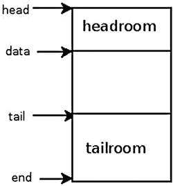

# 十六、附录 A：Linux API

在这个附录中，我将介绍 Linux 内核网络栈中两个最基本的数据结构:`sk_buff`和`net_device`。这是可以帮助你阅读本书其余部分的参考资料，因为你可能在几乎每一章都会遇到这两种结构。熟悉并了解这两种数据结构对于理解 Linux 内核网络栈是必不可少的。随后，有一节是关于远程 DMA (RDMA)的，这是[第 13 章](13.html)的进一步参考资料。它详细描述了 RDMA 使用的主要方法和主要数据结构。这个附录是一个很好的地方，尤其是在寻找基本术语的定义时。

sk_buff 结构

`sk_buff`结构代表一个数据包。SKB 代表*套接字缓冲器*。包可以由本地机器中的本地套接字生成，该本地套接字由用户空间应用创建；数据包可以被发送到外部或同一台机器上的另一个套接字。内核套接字也可以创建数据包；您可以从网络设备(第 2 层)接收物理帧，将其附加到`sk_buff`并将其传递到第 3 层。当数据包的目的地是您的本地机器时，它将继续到第 4 层。如果数据包不是给你的机器的，它将根据你的路由表规则被转发，如果你的机器支持转发。如果数据包由于任何原因被损坏，它将被丢弃。`sk_buff`是一个非常大的建筑；我在这一节提到了它的大多数成员。`sk_buff`结构在`include/linux/skbuff.h`中定义。以下是对其大多数成员的描述:

*   `ktime_t tstamp`

    数据包到达的时间戳。时间戳作为对基本时间戳的偏移量存储在 SKB 中。注意:不要把 SKB 的`tstamp`和硬件时间戳混淆，硬件时间戳是用`skb_shared_info`的`hwtstamps`实现的。我将在后面的 appenidx 中描述`skb_shared_info`对象。

    助手方法:

*   `skb_get_ktime(const struct sk_buff *skb)`:返回指定`skb`的`tstamp`。
*   `skb_get_timestamp(const struct sk_buff *skb, struct timeval *stamp):`将偏移量转换回`struct timeval`。
*   `net_timestamp_set(struct sk_buff *skb):`为指定的`skb`设置时间戳。时间戳的计算是用`ktime_get_real()`方法完成的，该方法以`ktime_t`格式返回时间。
*   `net_enable_timestamp()`:应该调用这个方法来启用 SKB 时间戳。
*   应该调用此方法来禁用 SKB 时间戳。

*   `struct sock *sk`

    拥有 SKB 的套接字，用于本地生成的流量和发往本地主机的流量。对于正在转发的数据包，`sk`为空。通常，当谈到套接字时，您处理的是通过从用户空间调用`socket()`系统调用而创建的套接字。应该提到的是，还有内核套接字，它们是通过调用`sock_create_kern()`方法创建的。参见 VXLAN 驱动程序`drivers/net/vxlan.c`中的`vxlan_init_net()`示例。

    助手方法:

*   `skb_orphan(struct sk_buff *skb)`:如果指定的`skb`有析构函数，调用这个析构函数；将指定`skb`的 sock 对象(`sk`)设置为 NULL，将指定`skb`的析构函数设置为 NULL。

*   `struct net_device *dev`

    `dev`成员是一个`net_device`对象，代表与 SKB 关联的网络接口设备；你有时会遇到 NIC(网络接口卡)这个术语来描述这样的网络设备。它可以是数据包到达的网络设备，也可以是数据包将要发送到的网络设备。`net_device`结构将在下一节深入讨论。

*   `char cb[48]`

    这是控制缓冲区。任何层都可以免费使用。这是一个用来存储私人信息的不透明区域。例如，TCP 协议将其用于 TCP 控制缓冲区:

    ```sh
    #define TCP_SKB_CB(__skb) ((struct tcp_skb_cb *)&((__skb)->cb[0]))
    (include/net/tcp.h)
    ```

    蓝牙协议也使用控制块:

    ```sh
    #define bt_cb(skb) ((struct bt_skb_cb *)((skb)->cb))
        (include/net/bluetooth/bluetooth.h)
    ```

*   `unsigned long _skb_refdst`

    目的地条目(`dst_entry`)地址。`dst_entry struct` 表示给定目的地的路由条目。对于每个数据包，无论是传入的还是传出的，都要在路由表中进行查找。有时这种查找被称为 FIB 查找。这个查找的结果决定您应该如何处理这个数据包；比如是否应该转发，如果应该，应该在哪个接口上传输；或者是否应该抛出，是否应该发送 ICMP 错误消息，等等。`dst_entry`对象有一个引用计数器(`__refcnt`字段)。有些情况下您会使用此引用计数，有些情况下您不会使用它。在第 4 章的[中更详细地讨论了`dst_entry`对象和 FIB 中的查找。](04.html)

    助手方法:

*   `skb_dst_set(struct sk_buff *skb, struct dst_entry *dst)`:设置`skb dst`，假设对`dst`进行了引用，并且应该由`dst_release()`方法释放(由`skb_dst_drop()`方法调用)。
*   `skb_dst_set_noref(struct sk_buff *skb, struct dst_entry *dst)`:设置`skb dst`，假设没有对`dst`进行参考。在这种情况下，`skb_dst_drop()`方法不会为`dst`调用`dst_release()`方法。

 **注**SKB 可能有一个`dst_entry`指针附在上面；它可以被引用计数，也可以不被引用计数。如果没有取参考计数器，则设置`_skb_refdst`的低位。

*   `struct sec_path *sp`

    安全路径指针。它包括一组 IPsec XFRM 转换状态(`xfrm_state`对象)。IPsec (IP 安全)是第 3 层协议，主要用于 VPN。它在 IPv6 中是强制的，在 IPv4 中是可选的。像许多其他操作系统一样，Linux 为 IPv4 和 IPv6 实现了 IPsec。`sec_path`结构在`include/net/xfrm.h`中定义。详见[第 10 章](10.html)，其中讨论了 IPsec 子系统。

    助手方法:

*   `struct sec_path *skb_sec_path(struct sk_buff *skb)`:返回与指定的`skb`关联的`sec_path`对象(`sp`)。

*   `unsigned int len`

    数据包字节总数。

*   `unsigned int data_len`

    数据长度。该字段仅在数据包包含非线性数据(分页数据)时使用。

    助手方法:

*   当指定的`skb`的`data_len`大于 0 时，`skb_is_nonlinear(const struct sk_buff *skb):`返回`true`。

*   `__u16 mac_len`

    MAC(第 2 层)报头的长度。

*   `__wsum csum`

    校验和。

*   `__u32 priority`

    数据包的排队优先级。在 Tx 路径中，根据套接字优先级(套接字的`sk_priority`字段)设置 SKB 的优先级。套接字优先级可以通过调用带有 SO_PRIORITY 套接字选项的`setsockopt()`系统 c 来设置。使用`net_prio cgroup`内核模块，您可以定义一个规则来设置 SKB 的优先级；参见本章后面对`sk_buff netprio_map`字段的描述，以及`Documentation/cgroup/netprio.txt`。对于转发的数据包，优先级是根据 IP 报头中的 TOS(服务类型)字段设置的。有一个名为`ip_tos2prio`的表格，由 16 个元素组成。根据 IP 报头的 TOS 字段，通过`rt_tos2priority()`方法完成从 TOS 到优先级的映射；参见`net/ipv4/ip_forward.c`中的`ip_forward()`方法和`include/net/route.h`中的`ip_tos2prio`定义。

*   `__u8 local_df:1`

    允许本地碎片标志。如果发送分组的套接字的`pmtudisc`字段的值是 IP_PMTUDISC_DONT 或 IP_PMTUDISC_WANT，`local_df`被设置为 1；如果套接字的`pmtudisc`字段的值是 IP_PMTUDISC_DO 或 IP_PMTUDISC_PROBE，`local_df`被设置为 0。参见`net/ipv4/ip_output.c`中`__ip_make_skb()`方法的实现。只有当数据包`local_df`为 0 时，才设置 IP 头不分片标志 IP _ DF 参见`net/ipv4/ip_output.c`中的`ip_queue_xmit()`方法:

    ```sh
    . . .
            if (ip_dont_fragment(sk, &rt->dst) && !skb->local_df)
                   iph->frag_off = htons(IP_DF);
               else
                 iph->frag_off = 0;
    . . .
    ```

    IP 报头中的`frag_off`字段是一个 16 位的字段，它表示片段的偏移量和标志。最左边的 13 位(MSB)是偏移量(偏移量单位为 8 字节)，最右边的 3 位(LSB)是标志。这些标志可以是 IP_MF(有更多分段)、IP_DF(不分段)、IP_CE(用于拥塞)或 IP_OFFSET(偏移部分)。

    这背后的原因是，有时您不希望允许 IP 碎片。例如，在路径 MTU 发现(PMTUD)中，您设置了 IP 报头的 DF(不分段)标志。因此，您不会对传出的数据包进行分段。路径上任何 MTU 小于数据包的网络设备都会丢弃该数据包，并发回一个 ICMP 数据包(“需要分段”)。为了确定路径 MTU，需要获取这些 ICMP“需要分段”数据包。详见[第三章](03.html)。从用户空间，设置 IP_PMTUDISC_DO 是这样完成的，例如，这样(下面的代码片段摘自`iputils`包中`tracepath`实用程序的源代码；`tracepath`实用程序找到路径 MTU):

    ```sh
    . . .
          int on = IP_PMTUDISC_DO;
          setsockopt(fd, SOL_IP, IP_MTU_DISCOVER, &on, sizeof(on));
    . . .

    ```

*   `__u8 cloned:1`

    当使用`__skb_clone()`方法克隆数据包时，该字段在克隆数据包和主数据包中都被设置为 1。克隆 SKB 意味着创造一个`sk_buff struct`的私人副本；该数据块在克隆和主 SKB 之间共享。

*   `__u8 ip_summed:2`

    IP(第三层)校验和的指示器；可以是下列值之一:

*   CHECKSUM_NONE:当设备驱动程序不支持硬件校验和时，它将`ip_summed`字段设置为 CHECKSUM_NONE。这表明校验和应该在软件中完成。
*   校验和 _ 不必要:不需要任何校验和。
*   CHECKSUM_COMPLETE:硬件完成了对传入数据包的校验和计算。
*   CHECKSUM_PARTIAL:为传出数据包计算了部分校验和；硬件应该完成校验和计算。CHECKSUM_COMPLETE 和 CHECKSUM_PARTIAL 取代了 CHECKSUM_HW 标志，该标志现已弃用。

*   `__u8 nohdr:1`

    仅有效负载引用，不得修改标头。有些情况下，SKB 的所有者不再需要访问报头。在这种情况下，可以调用`skb_header_release()`方法，该方法设置 SKB 的`nohdr`字段；这表明该 SKB 的报头不应被修改。

*   `__u8 nfctinfo:3`

    连接跟踪信息。连接跟踪允许内核跟踪所有逻辑网络连接或会话。NAT 依靠连接跟踪信息进行转换。`nfctinfo`字段的值对应于`ip_conntrack_info enum`的值。因此，例如，当一个新的连接开始被跟踪时，`nfctinfo`的值是 IP_CT_NEW。当连接建立后，`nfctinfo`的值为 IP_CT_ESTABLISHED。当数据包与现有连接相关时，例如，当流量是某个 FTP 会话或 SIP 会话的一部分时，则`nfctinfo`的值可以更改为 IP_CT_RELATED。关于`ip_conntrack_info enum`值的完整列表，请参见`include/uapi/linux/netfilter/nf_conntrack_common.h`。SKB 的`nfctinfo`字段在`resolve_normal_ct()`方法`net/netfilter/nf_conntrack_core.c`中设置。此方法执行连接跟踪查找，如果有遗漏，它将创建一个新的连接跟踪条目。连接跟踪将在第 9 章中深入讨论，该章涉及 netfilter 子系统。

*   `__u8 pkt_type:3`

    对于以太网，数据包类型取决于以太网报头中的目的 MAC 地址，并由`eth_type_trans()`方法确定:

*   用于广播的数据包 _ 广播
*   用于多播的数据包多播
*   如果目的 MAC 地址是作为参数传递的设备的 MAC 地址，则为 PACKET_HOST
*   PACKET_OTHERHOST 如果不满足这些条件

参见`include/uapi/linux/if_packet.h`中数据包类型的定义。

*   `__u8 ipvs_property:1`

此标志指示 SKB 是否归`ipvs` (IP 虚拟服务器)所有，这是一种基于内核的传输层负载平衡解决方案。在`ipvs` ( `net/netfilter/ipvs/ip_vs_xmit.c`)的发送方法中，该字段被设置为 1。

*   `__u8 peeked:1`

这个包已经被看过了，所以已经对它做了统计—所以不要再做了。

*   `__u8 nf_trace:1`

netfilter 数据包跟踪标志。该标志由跟踪 netfilter 模块 xt_TRACE 模块的包流设置，用于标记要跟踪的包(`net/netfilter/xt_TRACE.c`)。

助手方法:

*   `nf_reset_trace(struct sk_buff *skb)`:将指定`skb`的`nf_trace`设置为 0。

*   `__be16 protocol`

使用以太网和 IP 时，`eth_type_trans()`方法将 Rx 路径中的协议字段初始化为 ETH_P_IP。

*   `void (*destructor)(struct sk_buff *skb)`

通过调用`kfree_skb()`方法释放 SKB 时调用的回调。

*   `struct nf_conntrack *nfct`

关联的连接跟踪对象(如果存在)。与`nfctinfo`字段一样，`nfct`字段也是在`resolve_normal_ct()`方法中设置的。在第 9 章的[中深入讨论了连接跟踪层，它处理 netfilter 子系统。](09.html)

*   `int skb_iif`

数据包到达的网络设备的`ifindex`。

*   `__u32 rxhash`

根据 IP 报头的源和目的地址以及传输报头的端口，在接收路径中计算 SKB 的`rxhash`。零值表示哈希无效。`rxhash`用于确保在使用对称多处理(SMP)时，具有相同流的数据包将由相同的 CPU 处理。这减少了缓存未命中的数量，并提高了网络性能。`rxhash`是接收数据包导向(RPS)特性的一部分，由 Google 开发者(Tom Herbert 和其他人)贡献。RPS 功能提高了 SMP 环境中的性能。详见`Documentation/networking/scaling.txt`。

*   `__be16 vlan_proto`

    使用的 VLAN 协议——通常是`802.1q`协议。最近增加了对`802.1ad`协议(也称为堆叠 VLAN)的支持。

    下面是一个使用`iproute2`包的`ip`命令在用户空间创建`802.1q`和`802.1ad` VLAN 设备的例子:

    ```sh
    ip link add link eth0 eth0.1000 type vlan proto 802.1ad id 1000
    ip link add link eth0.1000 eth0.1000.1000 type vlan proto 802.1q id 100
    ```

    注意:内核 3.10 及更高版本支持该特性。

*   `__u16 vlan_tci`

VLAN 标签控制信息(2 字节)，由 ID 和优先级组成。

助手方法:

*   `vlan_tx_tag_present(__skb)`:该宏检查在指定的`__skb`的`vlan_tci`域中是否设置了 VLAN _ 标签 _ 存在标志。

*   `__u16 queue_mapping`

多队列设备的队列映射。

助手方法:

*   `skb_set_queue_mapping (struct sk_buff *skb, u16 queue_mapping)`:为指定的`skb`设置指定的`queue_mapping`。
*   `skb_get_queue_mapping(const struct sk_buff *skb)`:返回指定`skb`的`queue_mapping`。

*   `__u8 pfmemalloc`

从 PFMEMALLOC 储备中分配 SKB。

助手方法:

*   `skb_pfmemalloc()` : 如果 SKB 是从 PFMEMALLOC 储备中分配的，则返回`true`。

*   `__u8 ooo_okay:1`

设置`ooo_okay`标志以避免`ooo`(无序)数据包。

*   `__u8 l4_rxhash:1`

使用传输端口上的规范 4 元组哈希时设置的标志。

参见`net/core/flow_dissector.c`中的`__skb_get_rxhash()`方法。

*   `__u8 no_fcs:1`

当您请求 NIC 将最后 4 个字节视为以太网帧校验序列(FCS)时设置的标志。

*   `__u8 encapsulation:1`

封装字段表示 SKB 用于封装。例如，它用于 VXLAN 驱动程序。VXLAN 是通过 UDP 内核套接字传输第 2 层以太网数据包的标准协议。当有防火墙阻止隧道，例如只允许 TCP 或 UDP 流量时，它可以用作一种解决方案。VXLAN 驱动程序使用 UDP 封装，并在`vxlan_init_net()`方法中将 SKB 封装设置为 1。此外，`ip_gre`模块和`ipip`隧道模块使用封装，并将 SKB 封装设置为 1。

*   `__u32 secmark`

    安全标志字段。`secmark`字段由`iptables` SECMARK 目标设置，该目标用任何有效的安全上下文标记数据包。例如:

    ```sh
    iptables -t mangle -A INPUT -p tcp --dport 80 -j SECMARK --selctx system_u:object_r:httpd_packet_t:s0
    iptables -t mangle -A OUTPUT -p tcp --sport 80 -j SECMARK --selctx system_u:object_r:httpd_packet_t:s0
    ```

    在前面的规则中，您将到达和离开端口 80 的数据包静态标记为`httpd_packet_t`。参见:`netfilter/xt_SECMARK.c`。

    助手方法:

*   `void skb_copy_secmark(struct sk_buff *to, const struct sk_buff *from)`:将第一个指定的 SKB ( `to`)的`secmark`字段的值设置为等于第二个指定的 SKB ( `from`)的`secmark`字段的值。
*   `void skb_init_secmark(struct sk_buff *skb)`:将指定`skb`的`secmark`初始化为 0。

接下来的三个字段:`mark`、`dropcount`和`reserved_tailroom`出现在一个联合中。

*   `__u32 mark`

此字段可通过标记来识别 SKB。

您可以设置 SKB 的`mark`字段，例如，使用 mangle 表的`iptables`预路由规则中的`iptables`标记目标。

*   `iptables -A PREROUTING -t mangle -i eth1 -j  MARK  --set-mark   0x1234`

该规则将在执行路由查找之前，为`eth1`上的传入流量的每个 SKB `mark`字段分配值 0x1234。您还可以运行一个`iptables`规则，该规则将检查每个 SKB 的`mark`字段，以匹配指定的值并对其采取行动。Netfilter 目标和`iptables`在第 9 章的[中讨论，它涉及 netfilter 子系统。](09.html)

*   `__u32 dropcount`

`dropcount` 计数器表示被分配的`sock`对象(`sk`)的`sk_receive_queue`的丢包数(`sk_drops`)。参见`net/core/sock.c`中的`sock_queue_rcv_skb()`方法。

*   `_u32 reserved_tailroom`:用于`sk_stream_alloc_skb()`方式。
*   `sk_buff_data_t transport_header`

传输层(L4)报头。

助手方法:

*   `skb_transport_header(const struct sk_buff *skb)`:返回指定`skb`的传输头。
*   `skb_transport_header_was_set(const struct sk_buff *skb)`:如果设置了指定的`skb`的`transport_header`，则返回 1。

*   `sk_buff_data_t network_header`

网络层(L3)报头。

助手方法:

*   `skb_network_header(const struct sk_buff *skb):`返回指定`skb`的网络头。

*   `sk_buff_data_t mac_header`

链路层(L2)报头。

助手方法:

*   `skb_mac_header(const struct sk_buff *skb)`:返回指定`skb`的 MAC 头。
*   `skb_mac_header_was_set(const struct sk_buff *skb)`:如果设置了指定`skb`的`mac_header`，则返回 1。

*   `sk_buff_data_t tail`

数据的尾部。

*   `sk_buff_data_t end`

缓冲区的结尾。`tail`不能超过`end`。

*   `unsigned char head`

缓冲区的头。

*   `unsigned char data`

    数据头。数据块的分配独立于`sk_buff`分配。

    参见，在`_alloc_skb()`、`net/core/skbuff.c`:

    ```sh
    data = kmalloc_reserve(size, gfp_mask, node, &pfmemalloc);
    ```

    助手方法:

*   `skb_headroom(const struct sk_buff *skb)`:该方法返回 headroom，即指定 skb 头部的空闲空间的字节数(`skb->data – skb->head`)。见[图 A-1](#Fig1) 。
*   `skb_tailroom(const struct sk_buff *skb)`:该方法返回 tailroom，即指定的`skb` ( `skb->end – skb->tail`)尾部的空闲空间的字节数。见[图 A-1](#Fig1) 。

[图 A-1](#Fig1) 显示了 SKB 的顶部空间和尾部空间。



[图 A-1](#_Fig1) 。SKB 的净空高度和净空高度

以下是处理缓冲液的一些方法:

*   `skb_put(struct sk_buff *skb, unsigned int len)`:将数据添加到缓冲区:该方法将`len`字节添加到指定`skb`的缓冲区中，并将指定`skb`的长度增加指定的`len`。
*   `skb_push(struct sk_buff *skb, unsigned int len)`:将数据添加到缓冲区的开头；该方法将指定的`skb`的数据指针递减指定的`len`，并将指定的`skb`的长度递增指定的`len`。
*   `skb_pull(struct sk_buff *skb, unsigned int len)`:从缓冲区的开始处删除数据；该方法将指定的`skb`的数据指针递增指定的`len`，并将指定的`skb`的长度递减指定的`len`。
*   `skb_reserve(struct sk_buff *skb, int len)`:通过减少尾部来增加空`skb`的净空高度。

在描述了一些处理缓冲区的方法之后，我继续列出`sk_buff`结构的成员:

*   `unsigned int truesize`

为 SKB 分配的总内存(包括 SKB 结构本身和分配的数据块的大小)。

*   `atomic_t users`

初始化为 1 的参考计数器；通过`skb_get()`方法递增，通过`kfree_skb()`方法或`consume_skb()`方法递减；`kfree_skb()`方法递减使用计数器；如果达到 0，该方法将释放 SKB，否则，该方法将返回而不释放它。

助手方法:

*   `skb_get(struct sk_buff *skb)`:将`users`参考计数器加 1。
*   `skb_shared(const struct sk_buff *skb)`:如果`users`的个数不为 1，则返回`true`。
*   `skb_share_check(struct sk_buff *skb, gfp_t pri)`:如果缓冲区不共享，则返回原来的缓冲区。如果该缓冲区是共享的，则该缓冲区将被克隆，旧副本将删除一个引用。返回具有单个引用的新克隆。当从中断上下文调用或持有自旋锁时，`pri`参数(优先级)必须是 GFP_ATOMIC。如果内存分配失败，则返回 NULL。
*   `consume_skb(struct sk_buff *skb)`:递减`users`参考计数器，如果`users`参考计数器为零，则释放 SKB。

结构 skb_shared_info

`skb_shared_info struct`位于数据块(`skb_end_pointer(SKB)`)的末尾。它只包含几个字段。让我们来看看:

```sh
struct skb_shared_info {
    unsigned char         nr_frags;
    __u8                  tx_flags;
    unsigned short        gso_size;
    unsigned short        gso_segs;
    unsigned short        gso_type;
    struct sk_buff        *frag_list;
    struct skb_shared_hwtstamps hwtstamps;
    __be32                ip6_frag_id;
    atomic_t              dataref;
    void *                destructor_arg;
    skb_frag_t            frags[MAX_SKB_FRAGS];
};
```

以下是对`skb_shared_info`结构中一些重要成员的描述:

*   `nr_frags`:表示`frags`数组中元素的个数。
*   `tx_flags`可以是:

*   SKBTX_HW_TSTAMP:生成硬件时间戳。
*   生成一个软件时间戳。
*   SKBTX_IN_PROGRESS:设备驱动程序将提供硬件时间戳。
*   SKBTX_DEV_ZEROCOPY:设备驱动程序支持 TX 零拷贝缓冲区。
*   SKBTX_WIFI_STATUS:生成 WIFI 状态信息。
*   SKBTX_SHARED_FRAG:表示至少有一个片段可能被覆盖。

*   在处理碎片时，有些情况下你会处理一个`sk_buffs` ( `frag_list`)列表，有些情况下你会处理`frags`数组。这主要取决于是否设置了分散/聚集模式。

助手方法:

*   `skb_is_gso(const struct sk_buff *skb)`:如果与指定的`skb`关联的`skb_shared_info`的`gso_size`不为 0，则返回`true`。
*   `skb_is_gso_v6(const struct sk_buff *skb)`:如果`skb`关联的`skb_shared_info`的`gso_type`为 SKB_GSO_TCPV6，则返回`true`。
*   `skb_shinfo(skb)`:返回与指定的`skb`关联的`skb_shinfo`的宏。
*   `skb_has_frag_list(const struct sk_buff *skb)`:如果指定的`skb`的`skb_shared_info`的`frag_list`不为空，则返回`true`。
*   `dataref`:一个`skb_shared_info struct`的参考计数器。它在方法中被设置为 1，分配`skb`并初始化`skb_shared_info`(`__alloc_skb()`方法)。

net_device 结构

`net_device struct`代表网络设备。它可以是物理设备，如以太网设备，也可以是软件设备，如网桥设备或 VLAN 设备。与`sk_buff`结构一样，我将列出它的重要成员。`net_device struct`在`include/linux/netdevice.h` : 中定义

*   `char name[IFNAMSIZ]`

网络设备的名称。这是您使用`ifconfig`或`ip`命令看到的名称(例如`eth0`、`eth1`等等)。接口名称的最大长度为 16 个字符。在支持`biosdevname`的新版本中，命名方案对应于网络设备的物理位置。因此，根据机箱标签，PCI 网络设备被命名为`p<slot>p<port>`，嵌入式端口(在主板接口上)被命名为`em<port>`——例如`em1`、`em2`等等。支持 SR-IOV 设备和网络分区(NPAR)的设备有一个特殊的后缀—。Biosdevname 由戴尔开发:`http://linux.dell.com/biosdevname`。另见本白皮书:`http://linux.dell.com/files/whitepapers/consistent_network_device_naming_in_linux.pdf`。

助手方法:

*   `dev_valid_name(const char *name)`:检查指定网络设备名称的有效性。网络设备名称必须遵守某些限制，以便能够创建相应的`sysfs`条目。例如，它不能是“.”还是“..”；其长度不应超过 16 个字符。改变界面名称可以这样做，例如:`ip link set <oldDeviceName> p2p1 <newDeviceName>`。例如，`ip link set p2p1 name a12345678901234567`将失败，并显示以下消息:`Error: argument "a12345678901234567" is wrong: "name" too long`。原因是您试图设置超过 16 个字符的设备名称。并且运行`ip link set p2p1 name.`将会失败，出现`RTNETLINK answers: Invalid argument`，因为您试图将设备名称设置为“.”，这是一个无效值。参见`net/core/dev.c`中的`dev_valid_name()`。

*   `struct hlist_node name_hlist`

这是网络设备的哈希表，由网络设备名称索引。由`dev_get_by_name()`在该哈希表中执行查找。通过`list_netdevice()`方法插入哈希表，通过`unlist_netdevice()`方法移除哈希表。

*   `char *ifalias`

    SNMP 别名接口名称。其长度可达 256 (IFALIASZ)。

    您可以使用以下命令行创建网络设备的别名:

    ```sh
    ip link set <devName> alias myalias
    ```

    `ifalias`名称由`/sys/class/net/<devName>/ifalias`通过`sysfs`导出。

    助手方法:

*   `dev_set_alias(struct net_device *dev, const char *alias, size_t len)`:为指定的网络设备设置指定的别名。指定的`len`参数是指定的`alias`要复制的字节数；如果指定的`len`大于 256 (IFALIASZ)，该方法将失败，并返回-EINVAL。

*   `unsigned int irq`

设备的中断请求(IRQ)号。网络驱动程序应该调用`request_irq()`用这个 IRQ 号注册它自己。通常这是在网络设备驱动程序的`probe()`回调中完成的。`request_irq()`方法的原型是:`int request_irq(unsigned int irq, irq_handler_t handler, unsigned long flags, const char *name, void *dev)`。第一个参数是 IRQ 号。指定的`handler`是中断服务程序(ISR)。当网络驱动不再使用这个`irq`时，它应该调用`free_irq()`方法。在许多情况下，这个`irq`是共享的(使用 IRQF_SHARED 标志调用`request_irq()`方法)。您可以通过运行`cat /proc/interrupts`来查看每个内核上发生的中断数量。您可以通过`echo irqMask > /proc/irq/<irqNumber>/smp_affinity`设置`irq`的 SMP 关联。

在 SMP 机器中，设置中断的 SMP 关联性意味着设置允许哪些内核处理中断。一些 PCI 网络接口使用消息信号中断(MSI)。 PCI MSI 中断从不共享，所以在这些网络驱动中调用`request_irq()`方法时，IRQF_SHARED 标志不设置。在`Documentation/PCI/MSI-HOWTO.txt`中查看更多信息。

*   `unsigned long state`

可以是下列值之一的标志:

*   __LINK_STATE_START:该标志在设备启动时由`dev_open()`方法设置，在设备关闭时清除。
*   __LINK_STATE_PRESENT:该标志通过`register_netdevice()`方法在设备注册中设置，并通过`netif_device_detach()`方法清除。
*   __LINK_STATE_NOCARRIER:此标志显示设备是否检测到载波丢失。它由`netif_carrier_off()`方法设置，由`netif_carrier_on()`方法清除。由`sysfs`通过`/sys/class/net/<devName>/carrier`出口。
*   __LINK_STATE_LINKWATCH_PENDING:该标志由`linkwatch_fire_event()`方法设置，并由`linkwatch_do_dev()`方法清除。
*   __LINK_STATE_DORMANT:休眠状态表示接口无法传递数据包(也就是说，它不是“up”)；然而，这是一个“未决”状态，等待一些外部事件。请参见 RFC 2863“接口组 MIB”中的第 3.1.12 节“IfOperStatus 的新状态”

可以用通用的`set_bit()`方法设置`state`标志。

助手方法:

*   `netif_running(const struct net_device *dev)`:如果设置了指定设备的 STATE 字段的 __LINK_STATE_START 标志，则返回`true`。
*   `netif_device_present(struct net_device *dev)`:如果设置了指定设备的 STATE 字段的 __LINK_STATE_PRESENT 标志，则返回`true`。
*   `netif_carrier_ok (const struct net_device *dev)`:如果指定设备的 STATE 字段的 __LINK_STATE_NOCARRIER 标志没有置位，则返回`true`。

这三种方法在`include/linux/netdevice.h`中有定义。

*   `netdev_features_t features`

当前活动的设备功能集。这些特征应该仅由网络核心或在`ndo_set_features()`回调的错误路径中改变。网络驱动程序开发人员负责设置设备功能的初始设置。有时他们会使用错误的功能组合。网络核心通过移除`netdev_fix_features()`方法中的违规特征来解决这个问题，该方法在注册网络接口时被调用(在`register_netdevice()`方法中)；内核日志中也会写入一条适当的消息。

我将在这里提到一些`net_device`特性并进行讨论。关于`net_device`特性的完整列表，请查看`include/linux/netdev_features.h`。

*   NETIF_F_IP_CSUM 意味着网络设备可以校验和 L4 IPv4 TCP/UDP 数据包。
*   NETIF_F_IPV6_CSUM 意味着网络设备可以校验和 L4 IPv6 TCP/UDP 数据包。
*   NETIF_F_HW_CSUM 意味着设备可以在硬件中对所有 L4 数据包进行校验和检查。您不能将 NETIF_F_HW_CSUM 与 NETIF_F_IP_CSUM 或 NETIF_F_IPV6_CSUM 一起激活，因为这将导致重复的校验和检查。

如果驱动程序功能集包括 NETIF_F_HW_CSUM 和 NETIF_F_IP_CSUM 功能，那么您将收到一条内核消息，提示“混合的硬件和 IP 校验和设置”在这种情况下，`netdev_fix_features()`方法删除了 NETIF_F_IP_CSUM 特性。如果驱动程序功能集包括 NETIF_F_HW_CSUM 和 NETIF_F_IPV6_CSUM 功能，您将再次得到与前一种情况相同的消息。这一次，NETIF_F_IPV6_CSUM 功能是被`netdev_fix_features()`方法删除的功能。为了使设备支持 TSO (TCP 分段卸载),它还需要支持分散/收集和 TCP 校验和；这意味着必须设置 NETIF_F_SG 和 NETIF_F_IP_CSUM 功能。如果驱动程序功能集不包括 NETIF_F_SG 功能，那么您将收到一条内核消息，说明“由于没有 SG 功能，正在删除 TSO 功能”，并且 NETIF_F_ALL_TSO 功能将被删除。如果驱动程序功能集不包括 NETIF_F_IP_CSUM 功能，也不包括 NETIF_F_HW_CSUM 功能，那么您将收到一条内核消息，提示“由于没有 CSUM 功能，正在删除 TSO 功能”，并且 NETIF_F_TSO 将被删除。

 **注意**在最近的内核中，如果设置了 CONFIG_DYNAMIC_DEBUG 内核配置项，可能需要通过`<debugfs>/dynamic_debug/control`接口显式启用一些消息的打印。参见`Documentation/dynamic-debug-howto.txt`。

*   NETIF_F_LLTX is the LockLess TX flag and is considered deprecated. When it is set, you don’t use the generic Tx lock (This is why it is called LockLess TX). See the following macro (HARD_TX_LOCK) from `net/core/dev.c`:

    ```sh
    #define HARD_TX_LOCK(dev, txq, cpu) { \ if ((dev->features & NETIF_F_LLTX) == 0) { \
       __netif_tx_lock(txq, cpu); \
      } \
        }
    ```

    NETIF_F_LLTX 用于 VXLAN、VETH 等隧道驱动程序，以及 IP over IP (IPIP)隧道驱动程序。例如，在 IPIP 隧道模块中，您在`ipip_tunnel_setup()`方法(`net/ipv4/ipip.c`)中设置 NETIF_F_LLTX 标志。

    NETIF_F_LLTX 标志也用于一些实现了自己的 TX 锁的驱动程序中，如 cxgb 网络驱动程序。

    在`drivers/net/ethernet/chelsio/cxgb/cxgb2.c`中，您有:

    ```sh
       static int __devinit init_one(struct pci_dev *pdev,
       const struct pci_device_id *ent)
       {
           . . .
           netdev->features |= NETIF_F_SG | NETIF_F_IP_CSUM |
                               NETIF_F_RXCSUM | NETIF_F_LLTX;
           . . .
       }

    ```

*   NETIF _ F _ GRO 用于表示设备支持 GRO(通用接收卸载)。使用 GRO，传入的数据包在接收时被合并。GRO 功能提高了网络性能。GRO 取代了仅限于 TCP/IPv4 的 LRO(大型接收卸载)。该标志在`dev_gro_receive()`方法开始时被检查；没有设置该标志的设备将不会执行该方法中的 GRO 处理部分。想要使用 GRO 的驱动程序应该在驱动程序的 Rx 路径中调用`napi_gro_receive()`方法。您可以分别通过`ethtool -K <deviceName> gro on` / `ethtool -K <deviceName> gro off`使用 ethtool 启用/禁用 GRO。您可以通过运行`ethtool –k <deviceName>`并查看`gro`字段来检查 GRO 是否已设置。
*   NETIF_F_GSO 置位表示器件支持通用分段卸载(GSO)。GSO 是以前一个名为 TSO (TCP 分段卸载)的解决方案的推广，它只处理 IPv4 中的 TCP。GSO 还可以处理 IPv6、UDP 和其他协议。GSO 是一种性能优化，它基于对大数据包遍历网络堆栈一次而不是多次。因此，我们的想法是避免在第 4 层分段，并尽可能推迟分段。系统管理员可以分别通过`ethtool -K <driverName> gso on` / `ethtool -K <driverName> gso off`用`ethtool`使能/禁用 GSO。您可以通过运行`ethtool –k <deviceName>`并查看`gso`字段来检查是否设置了 GSO。要使用 GSO，您应该在分散/聚集模式下工作。必须设置 NETIF_F_SG 标志。
*   NETIF_F_NETNS_LOCAL 是为网络命名空间本地设备设置的。这些是不允许在网络名称空间之间移动的网络设备。环回、VXLAN 和 PPP 网络设备是命名空间本地设备的示例。所有这些设备都设置了 NETIF_F_NETNS_LOCAL 标志。系统管理员可以通过`ethtool -k <deviceName>`检查接口是否设置了 NETIF_F_NETNS_LOCAL 标志。该特性是固定的，不能通过`ethtool`改变。尝试将这种类型的网络设备移动到不同的名称空间会导致错误(-EINVAL)。详细信息，请查看`dev_change_net_namespace()`方法(`net/core/dev.c`)。删除网络名称空间时，未设置 NETIF_F_NETNS_LOCAL 标志的设备将被移动到默认的初始网络名称空间(`init_net`)。网络命名空间设置了 NETIF_F_NETNS_LOCAL 标志的本地设备不会移动到默认的初始网络命名空间(`init_net`)，而是会被删除。
*   NETIF_F_HW_VLAN_CTAG_RX 为，供支持 VLAN Rx 硬件加速的设备使用。它以前被称为 NETIF_F_HW_VLAN_RX，并在内核 3.10 中被重命名，当时增加了对`802.1ad`的支持。添加了“CTAG”以表示此设备不同于“STAG”设备(服务提供商标记)。设置 NETIF_F_HW_VLAN_RX 特性的设备驱动程序还必须定义`ndo_vlan_rx_add_vid()`和`ndo_vlan_rx_kill_vid()`回调。不这样做将避免设备注册，并导致“驱动程序中的错误 VLAN 加速”内核错误消息。
*   NETIF_F_HW_VLAN_CTAG_TX 用于支持 VLAN Tx 硬件加速的设备。它以前被称为 NETIF_F_HW_VLAN_TX，在内核 3.10 中添加了对`802.1ad`的支持后被重命名。
*   NETIF_F_VLAN_CHALLENGED is set for devices that can’t handle VLAN packets. Setting this feature avoids registration of a VLAN device. Let’s take a look at the VLAN registration method:

    ```sh
    static int register_vlan_device(struct net_device *real_dev, u16 vlan_id) {
        int err;
        . . .
        err = vlan_check_real_dev(real_dev, vlan_id);
    ```

    `vlan_check_real_dev()`方法做的第一件事是检查网络设备特性，如果设置了 NETIF _ F _ VLAN _ 挑战特性，则返回一个错误:

    ```sh
    int vlan_check_real_dev(struct net_device *real_dev, u16 vlan_id)
    {
            const char *name = real_dev->name;

            if (real_dev->features & NETIF_F_VLAN_CHALLENGED) {
                    pr_info("VLANs not supported on %s\n", name);
                    return -EOPNOTSUPP;
            }
                    . . .
    }
    ```

例如，某些类型的英特尔 e100 网络设备驱动程序设置了 NETIF _ F _ VLAN _ 挑战功能(参见`drivers/net/ethernet/intel/e100.c`中的`e100_probe()`)。

您可以通过运行`ethtool –k <deviceName>`并查看`vlan-challenged`字段来检查 NETIF_F_VLAN_CHALLENGED 是否已设置。这是一个固定值，不能用`ethtool`命令改变。

*   当网络接口支持分散/聚集 IO 时，设置 NETIF_F_SG。您可以通过`ethtool -K <deviceName> sg on` / `ethtool -K <deviceName> sg off`分别使用`ethtool`启用和禁用分散/聚集。您可以通过运行`ethtool –k <deviceName>`并查看`sg`字段来检查是否设置了分散/聚集。
*   如果设备可以通过 DMA 对高位存储器进行访问，则 NETIF_F_HIGHDMA 设置为。设置这个特性的实际含义是，`net_device_ops`对象的`ndo_start_xmit()`回调可以管理 skb，skb 在高内存中有`frags`元素。您可以通过运行`ethtool –k <deviceName>`并查看`highdma`字段来检查 NETIF_F_HIGHDMA 是否已设置。这是一个固定值，不能用`ethtool`命令改变。
*   `netdev_features_t hw_features`

可变特征的特征集。这意味着它们的状态可能会因用户的请求而改变(启用或禁用)特定设备。这个设置应该在`ndo_init()`回调中初始化，以后不能更改。

*   `netdev_features_t wanted_features`

用户请求的功能集。用户可以请求更改各种卸载功能，例如通过运行`ethtool -K eth1 rx on`。这会生成一个特性变更事件通知(NETDEV_FEAT_CHANGE ),由`netdev_features_change()`方法发送。

*   `netdev_features_t vlan_features`

    子 VLAN 设备继承其状态的功能集。比如我们来看看`rtl_init_one()`方法，就是`r8169`网络设备驱动的`probe`回调(见[第十四章](14.html)):

    ```sh
    int rtl_init_one(struct pci_dev *pdev, const struct pci_device_id *ent)

    {
       . . .
       dev->vlan_features=NETIF_F_SG|NETIF_F_IP_CSUM|NETIF_F_TSO|   NETIF_F_HIGHDMA;
       . . .
    }
    ```

    (`drivers/net/ethernet/realtek/r8169.c`)

    这种初始化意味着所有子 VLAN 设备都将具有这些功能。例如，假设您的`eth0`设备是一个`r8169`设备，您因此添加了一个 VLAN 设备:`vconfig add eth0 100`。然后，在 VLAN 模块的初始化中，有这个与`vlan_features`相关的代码:

    ```sh
    static int vlan_dev_init(struct net_device *dev)
    {
        . . .
        dev->features |= real_dev->vlan_features | NETIF_F_LLTX;
        . . .
    }

    (net/8021q/vlan_dev.c)
    ```

    这意味着它将 VLAN 子设备的特性设置为真实设备的`vlan_features`(在本例中是`eth0`)，这些特性是根据您之前在`rtl_init_one()`方法中看到的内容设置的。

*   `netdev_features_t hw_enc_features`

封装设备继承的特征掩码。该字段指示硬件能够做什么封装卸载，驱动程序需要适当地设置它们。有关网络设备功能的更多信息，请参见`Documentation/networking/netdev-features.txt`。

*   `ifindex`

`ifindex`(接口索引)是唯一的设备标识符。通过`dev_new_index()`方法，每当您创建一个新的网络设备时，该索引就增加 1。您创建的第一个网络设备(几乎总是环回设备)的`ifindex`为 1。循环整数溢出由处理`ifindex`数赋值的方法处理。`ifindex`由`sysfs`通过`/sys/class/net/<devName>/ifindex`输出。

*   `struct net_device_stats stats`

作为遗产留下的统计数据`struct`，包括像`rx_packets`的数量或者`tx_packets`的数量这样的字段。新的设备驱动使用`rtnl_link_stats64 struct`(在`include/uapi/linux/if_link.h`中定义)代替`net_device_stats struct`。大多数网络驱动程序实现了`net_device_ops`的`ndo_get_stats64()`回调(或`net_device_ops`的`ndo_get_stats()`回调，当使用旧的 API 时)。

统计数据通过`/sys/class/net/<deviceName>/statistics`导出。

有些驱动实现了`get_ethtool_stats()`回调。这些驱动程序按`ethtool -S <deviceName>`显示统计数据

例如，参见`drivers/net/ethernet/realtek/r8169.c`中的`rtl8169_get_ethtool_stats()`方法。

*   `atomic_long_t rx_dropped`

核心网络堆栈在 RX 路径中丢弃的数据包数量的计数器。驱动程序不应使用此计数器。不要混淆`sk_buff`的`rx_dropped`字段和`softnet_data struct`的`dropped`字段。`softnet_data struct`代表一个每 CPU 的对象。它们是不等价的，因为`sk_buff`的`rx_dropped`可能以几种方法递增，而`softnet_data`的`dropped`计数器仅通过`enqueue_to_backlog()`方法(`net/core/dev.c`)递增。`softnet_data`丢弃的计数器由`/proc/net/softnet_stat`导出。在`/proc/net/softnet_stat`中，每个 CPU 有一行。第一列是总数据包计数器，第二列是丢弃的数据包计数器。

例如:

```sh
cat /proc/net/softnet_stat
00000076 00000001 00000000 00000000 00000000 00000000 00000000 00000000 00000000 00000000
00000005 00000000 00000000 00000000 00000000 00000000 00000000 00000000 00000000 00000000
```

你在这里看到每个 CPU 一行(你有两个 CPU)；对于第一个 CPU，您看到总共 118 个数据包(十六进制 0x76)，其中一个数据包被丢弃。对于第二个 CPU，您看到总共有 5 个数据包，0 个被丢弃。

*   `struct net_device_ops *netdev_ops`

`netdev_ops`结构包含了几个回调方法的指针，如果你想覆盖默认行为，就要定义这些回调方法。下面是`netdev_ops`的一些回调:

*   注册网络设备时调用`ndo_init()`回调。
*   当网络设备未注册或注册失败时，调用`ndo_uninit()`回调。
*   当网络设备状态从停机状态改变到运行状态时，`ndo_open()`回调处理设备状态的改变。
*   当网络设备的状态被更改为 down 时，调用`ndo_stop()`回调。
*   调用`ndo_validate_addr()`回调来检查 MAC 是否有效。许多网络驱动程序将通用的`eth_validate_addr()`方法设置为`ndo_validate_addr()`回调。如果 MAC 地址不是多播地址并且不全是零，则通用`eth_validate_addr()`方法返回`true`。
*   `ndo_set_mac_address()`回调设置 MAC 地址。许多网络驱动程序将通用的`eth_mac_addr()`方法设置为`struct net_device_ops`的`ndo_set_mac_address()`回调，用于设置它们的 MAC 地址。比如 VETH 驱动(`drivers/net/veth.c`)或者 VXLAN 驱动(`drivers/nets/vxlan.c`)。
*   `ndo_start_xmit()`回调处理数据包传输。它不能为空。
*   使用多队列时，`ndo_select_queue()`回调用于选择发送队列。如果没有设置`ndo_select_queue()`回调，那么调用`__netdev_pick_tx()`。参见`net/core/flow_dissector.c`中`netdev_pick_tx()`方法的实现。
*   `ndo_change_mtu()`回调处理修改 MTU。它应该检查指定的 MTU 不小于 68，这是最小的 MTU。在许多情况下，网络驱动程序将`ndo_change_mtu()`回调设置为通用的`eth_change_mtu()`方法。如果支持巨型帧，应该覆盖`eth_change_mtu()`方法。
*   当获得非通用接口代码处理的 IOCTL 请求时，调用`ndo_do_ioctl()`回调。
*   当发送器长时间空闲时，调用`ndo_tx_timeout()`回调(用于看门狗)。
*   调用`ndo_add_slave()`回调将指定的网络设备设置为指定网络设备的从设备。例如，它用在组网络驱动程序和绑定网络驱动程序中。
*   调用`ndo_del_slave()`回调来移除先前被奴役的网络设备。
*   调用`ndo_set_features()`回调来用新特性更新网络设备的配置。
*   如果网络设备支持 VLAN 过滤(NETIF _ F _ HW _ VLAN _ 过滤器标志在设备特性中设置)，则在注册 VLAN id 时调用`ndo_vlan_rx_add_vid()`回调。
*   如果网络设备支持 VLAN 过滤(在设备特性中设置了 NETIF _ F _ HW _ VLAN _ 过滤器标志),则在注销 VLAN id 时调用`ndo_vlan_rx_kill_vid()`回调。

 **注意**从内核 3.10 开始，NETIF _ F _ HW _ VLAN _ 过滤器标志被重命名为 NETIF _ F _ HW _ VLAN _ CTAG _ 过滤器。

*   还有几个处理 SR-IOV 设备的回调函数，例如，`ndo_set_vf_mac()`和`ndo_set_vf_vlan()`。

在内核 2.6.29 之前，有一个名为`set_multicast_list()`的用于添加组播地址的回调，它被`dev_set_rx_mode()`方法所取代。每当单播或多播地址列表或网络接口标志被更新时，就主要调用`dev_set_rx_mode()`回调。

*   `struct ethtool_ops *ethtool_ops`

`ethtool_ops`结构包括几个回调的指针，用于处理卸载、获取和设置各种设备设置、读取寄存器、获取统计数据、读取 RX 流哈希间接表、WakeOnLAN 参数等等。如果网络驱动程序没有初始化`ethtool_ops`对象，网络核心提供一个名为`default_ethtool_ops`的默认空`ethtool_ops`对象。`ethtool_ops`的管理在`net/core/ethtool.c`完成。

助手方法:

*   SET_ETHTOOL_OPS (netdev，OPS):为指定的`net_device`设置指定的`ethtool_ops`的宏。

您可以通过运行`ethtool –k <deviceName>`来查看网络接口设备的卸载参数。您可以通过运行`ethtool –K <deviceName> offloadParameter off/on`来设置网络接口设备的一些卸载参数。参见`man 8 ethtool`。

*   `const struct header_ops *header_ops`

`header_ops struct` 包括创建第 2 层报头、解析它、重建它等等的回调函数。对于以太网，它是在`net/ethernet/eth.c`中定义的`eth_header_ops`。

*   `unsigned int flags`

您可以从用户空间看到的网络设备的接口标志。以下是一些标志(完整列表见`include/uapi/linux/if.h`):

*   当接口状态从关闭变为打开时，IFF_UP 标志被置位。
*   当接口处于混杂模式(接收所有数据包)时，IFF_PROMISC 置位。当运行类似`wireshark`或`tcpdump`的嗅探器时，网络接口处于混杂模式。
*   为环回设备设置 IFF_LOOPBACK。
*   IFF_NOARP 是为不使用 ARP 协议的设备设置的。例如，在隧道设备中设置 IFF_NOARP(例如，参见`ipip_tunnel_setup()`方法中的`net/ipv4/ipip.c`)。
*   IFF_POINTOPOINT 是为 PPP 设备设置的。例如，参见`ppp_setup()`方法、`drivers/net/ppp/ppp_generic.c`。
*   IFF_MASTER 是为主设备设置的。例如，参见`drivers/net/bonding/bond_main.c`中的`bond_setup()`方法。
*   IFF_LIVE_ADDR_CHANGE 标志表示设备在运行时支持硬件地址修改。参见`net/ethernet/eth.c`中的`eth_mac_addr()`方法。
*   当网络驱动程序处理单播地址过滤时，IFF_UNICAST_FLT 标志被设置。
*   IFF_BONDING 是为绑定主设备或绑定从设备设置的。绑定驱动程序提供了一种将多个网络接口聚合成单个逻辑接口的方法。
*   IFF_TEAM_PORT 是为用作组端口的设备设置的。分组驱动程序是一个负载平衡网络软件驱动程序，旨在取代绑定驱动程序。
*   IFF_MACVLAN_PORT 是为用作 MACVLAN 端口的设备设置的。
*   IFF_EBRIDGE 是为以太网桥接设备设置的。

`sysfs`通过`/sys/class/net/<devName>/flags`导出`flags`字段。

其中一些标志可以由用户空间工具设置。例如，`ifconfig <deviceName> -arp`会设置 IFF_NOARP 网络接口标志，`ifconfig <deviceName> arp`会清除 IFF_NOARP 标志。注意，你可以用`iproute2 ip`命令:`ip link set dev <deviceName> arp on`和`ip link set dev <deviceName> arp off`做同样的事情。

*   `unsigned int priv_flags`

接口标志，从用户空间看不到。例如，桥接口的 IFF_EBRIDGE 或绑定接口的 IFF_BONDING 或支持发送自定义 FCS 的接口的 IFF_SUPP_NOFCS。

助手方法:

*   `netif_supports_nofcs()`:如果在指定设备的`priv_flags`中设置了 IFF_SUPP_NOFCS，则返回`true`。
*   `is_vlan_dev(struct net_device *dev)`:如果在指定网络设备的`priv_flags`中设置了 IFF_802_1Q_VLAN 标志，则返回 1。
*   `unsigned short gflags`

全局标志(作为遗产保存)。

*   `unsigned short padded`

通过`alloc_netdev()`方法添加了多少填充。

*   `unsigned char operstate`

RFC 2863 操作状态。

*   `unsigned char link_mode`

将策略映射到 operstate。

*   `unsigned int mtu`

网络接口 MTU(最大传输单位)值。设备可以处理的最大帧尺寸。RFC 791 将 68 设置为最小 MTU。每个协议都有自己的 MTU。以太网的默认 MTU 是 1，500 字节。在`ether_setup()`方法`net/ethernet/eth.c`中设置。大小超过 1，500 字节，最高可达 9，000 字节的以太网数据包称为巨型帧。网络接口 MTU 由`sysfs`通过`/sys/class/net/<devName>/mtu.`导出

助手方法:

*   `dev_set_mtu(struct net_device *dev, int new_mtu)`: Changes the MTU of the specified device to a new value, specified by the `mtu` parameter.

    例如，系统管理员可以通过以下方式之一将网络接口的 MTU 更改为 1，400:

    ```sh
    ifconfig <netDevice> mtu 1400
    ip link set <netDevice> mtu 1400
    echo 1400 > /sys/class/net/<netDevice>/mtu
    ```

    许多驱动程序实现了`ndo_change_mtu()`回调来改变 MTU，以执行驱动程序特定的所需动作(比如重置网卡)。

*   `unsigned short type`

网络接口硬件类型。例如，对于以太网，它是 ARPHRD_ETHER，并在`net/ethernet/eth.c`的`ether_setup()`中设置。对于 PPP 接口，为 ARPHRD_PPP，在`drivers/net/ppp/ppp_generic.c`的`ppp_setup()`方法中设置。该类型由`sysfs`通过`/sys/class/net/<devName>/type`输出。

*   `unsigned short hard_header_len`

硬件头长度。例如，以太网报头由 MAC 源地址、MAC 目的地址和类型组成。MAC 源地址和目的地址各为 6 个字节，类型为 2 个字节。因此以太网报头长度为 14 个字节。在`ether_setup()`方法`net/ethernet/eth.c`中，以太网报头长度被设置为 14 (ETH_HLEN)。`ether_setup()`方法负责初始化一些以太网设备的默认值，比如 hard header len、Tx queue len、MTU、type 等等。

*   `unsigned char perm_addr[MAX_ADDR_LEN]`

设备的永久硬件地址(MAC 地址)。

*   `unsigned char addr_assign_type`

硬件地址分配类型，可以是下列之一:

*   网 _ ADDR _ 彼尔姆
*   网 _ ADDR _ 随机
*   NET _ ADDR _ 被盗
*   NET_ADDR_SET

    默认情况下，MAC 地址是永久的(NET_ADDR_PERM)。如果 MAC 地址是用名为`eth_hw_addr_random()`的帮助器方法生成的，那么 MAC 地址的类型就是 NET_ADD_RANDOM。MAC 地址的类型存储在`net_device`的`addr_assign_type`成员中。同样在改变设备的 MAC 地址的时候，用`eth_mac_addr()`，用∾NET _ ADDR _ 随机(如果之前标记为 NET _ ADDR _ 随机)重置`addr_assign_type`。当注册网络设备时(通过`register_netdevice()`方法)，如果`addr_assign_type`等于 NET_ADDR_PERM，`dev->perm_addr`被设置为`dev->dev_addr`。当您设置 MAC 地址时，您将`addr_assign_type`设置为 NET_ADDR_SET。这表示设备的 MAC 地址已经由`dev_set_mac_address()`方法设置。`addr_assign_typ` e 由`sysfs`通过`/sys/class/net/<devName>/addr_assign_type`输出。

*   `unsigned char addr_len`

以八位字节表示的硬件地址长度。对于以太网地址，它是 6 (ETH_ALEN)字节，在`ether_setup()`方法中设置。`addr_len`由`sysfs`通过`/sys/class/net/<deviceName>/addr_len`出口。

*   `unsigned char neigh_priv_len`

`neigh_alloc()`法中使用了、`net/core/neighbour.c`；`neigh_priv_len`仅在 ATM 代码中初始化(`atm/clip.c`)。

*   `struct netdev_hw_addr_list uc`

单播 MAC 地址列表，由`dev_uc_init()`方法初始化。以太网中有三种类型的数据包:单播、组播和广播。单播的目的地是一台机器，多播的目的地是一组机器，广播的目的地是局域网中的所有机器。

助手方法:

*   `netdev_uc_empty(dev)`:如果指定设备的单播列表为空(其`count`字段为 0)，则返回 1。
*   `dev_uc_flush(struct net_device *dev)`:刷新指定网络设备的单播地址，并置零`count`。

*   `struct netdev_hw_addr_list mc`

多播 MAC 地址列表，由`dev_mc_init()`方法初始化。

助手方法:

*   `netdev_mc_empty(dev)`:如果指定设备的组播列表为空(其`count`字段为 0)，则返回 1。
*   `dev_mc_flush(struct net_device *dev)`:刷新指定网络设备的组播地址，并将计数字段置零。
*   `unsigned int promiscuity`

网络接口卡被告知以混杂模式工作的次数计数器。在混杂模式下，MAC 目的地址不同于接口 MAC 地址的数据包不会被拒绝。`promiscuity`计数器用于例如启用一个以上的嗅探客户端；所以当打开一些嗅探客户端(比如`wireshark`)的时候，你每打开一个客户端，这个计数器就加 1，关闭那个客户端就会递减滥交计数器。当嗅探客户端的最后一个实例关闭时，`promiscuity`将被设置为 0，设备将退出混杂模式。它也用于桥接子系统，因为桥接接口需要在混杂模式下工作。因此，当添加网桥接口时，网络接口卡被设置为以混杂模式工作。参见`br_add_if()`、`net/bridge/br_if.c`中对`dev_set_promiscuity()`方法的调用。

助手方法:

*   `dev_set_promiscuity(struct net_device *dev, int inc)`:按照指定的增量递增/递减指定网络设备的`promiscuity`计数器。`dev_set_promiscuity()`方法可以得到一个正增量或负增量参数。只要混杂计数器保持大于零，接口就保持混杂模式。一旦达到零，该装置就回复到正常的过滤操作。因为混杂是一个整数，`dev_set_promiscuity()`方法考虑了整数的循环溢出，这意味着它处理当`promiscuity`计数器达到无符号整数所能达到的最大正值时递增的情况。

*   `unsigned int allmulti`

    网络设备的`allmulti`计数器启用或禁用 allmulticast 模式。选中时，接口将接收网络上的所有多播数据包。您可以通过`ifconfig eth0 allmulti`设置网络设备在 allmulticast 模式下工作。你通过`ifconfig eth0 –allmulti`禁用`allmulti`标志。

    也可以使用`ip`命令启用/禁用 allmulticast 模式:

    ```sh
    ip link set p2p1 allmulticast on
    ip link set p2p1 allmulticast off
    ```

    您还可以通过检查由`ip`命令显示的标志来查看 allmulticast 状态:

    ```sh
    ip addr show
    flags=4610<BROADCAST,ALLMULTI,MULTICAST>  mtu 1500
    ```

    助手方法:

*   `dev_set_allmulti(struct net_device *dev, int inc)`:按照指定的增量(可以是正整数，也可以是负整数)递增/递减指定网络设备的`allmulti`计数器。`dev_set_allmulti()`方法还在设置 allmulticast 模式时设置网络设备的 IFF_ALLMULTI 标志，并在禁用 allmulticast 模式时删除该标志。

接下来的三个字段是特定于协议的指针:

*   `struct in_device __rcu *ip_ptr`

在`inetdev_init()`、`net/ipv4/devinet.c`中，该指针被分配给指向`struct in_device`的指针，其代表 IPv4 特定数据。

*   `struct inet6_dev __rcu *ip6_ptr`

在`ipv6_add_dev()`、`net/ipv6/addrconf.c`中，该指针被分配给指向代表 IPv6 特定数据的`struct inet6_dev`的指针。

*   `struct wireless_dev *ieee80211_ptr`

这是无线设备的指针，在`ieee80211_if_add()`方法`net/mac80211/iface.c`中分配。

*   `unsigned long last_rx`

上次接收的时间。除非确实需要，否则不应由网络设备驱动程序设置。例如，在绑定驱动程序代码中使用。

*   `struct list_head dev_list`

网络设备的全局列表。当注册网络设备时，使用`list_netdevice()`方法插入列表。当网络设备未注册时，使用`unlist_netdevice()`方法从列表中删除。

*   `struct list_head napi_list`

NAPI 代表新 API，这是一种网络驱动程序在高流量下工作在轮询模式而不是中断驱动模式的技术。事实证明，在高流量下使用 NAPI 可以提高性能。当使用 NAPI 时，网络堆栈会缓冲数据包，并不时触发驱动程序使用`netif_napi_add()`方法注册的轮询方法，而不是为每个收到的数据包中断。当使用轮询模式时，驱动程序开始以中断驱动模式工作。当收到的第一个包发生中断时，您将到达中断服务程序(ISR)，这是用`request_irq()`注册的方法。然后驱动程序禁用中断并通知 NAPI 取得控制权，通常是通过从 ISR 调用`__napi_schedule()`方法。例如，参见`drivers/net/ethernet/ti/cpsw`中的`cpsw_interrupt()`方法。

当流量较低时，网络驱动程序切换到中断驱动模式下工作。现在，大多数网络司机都和 NAPI 一起工作。`napi_list`对象是`napi_struct`对象的列表；`netif_napi_add()`方法将`napi_struct`对象添加到这个列表中，`netif_napi_del()`方法从这个列表中删除`napi_struct`对象。当调用`netif_napi_add()`方法时，驱动程序应该指定它的轮询方法和一个权重参数。权重是对每个轮询周期中驱动程序将传递到堆栈的数据包数量的限制。建议使用 64 的重量。如果一个驱动程序试图调用权重大于 64 的`netif_napi_add()`(NAPI _ 投票 _ 权重)，会有一个内核错误消息。NAPI _ 投票 _ 权重在`include/linux/netdevice.h`中定义。

网络驱动应该调用`napi_enable()`来启用 NAPI 调度。通常这是在`net_device_ops`对象的`ndo_open()`回调中完成的。网络驱动应该调用`napi_disable()`来禁用 NAPI 调度。通常这是在`net_device_ops`的`ndo_stop()`回调中完成的。NAPI 是使用`softirqs`实现的。这个`softirq`处理程序是`net_rx_action()`方法，通过`net/core/dev.c`中的`net_dev_init()`方法调用`open_softirq(NET_RX_SOFTIRQ, net_rx_action)`来注册。`net_rx_action()`方法调用向 NAPI 注册的网络驱动程序的轮询方法。默认情况下，一个轮询周期(NAPI 轮询)中的最大数据包数量(取自注册轮询的所有接口)为 300。它是在`net/core/dev.c`中定义的`netdev_budget`变量，可以通过`procfs`条目`/proc/sys/net/core/netdev_budget`进行修改。过去，您可以通过将值写入`procfs`条目来更改每台设备的重量，但目前，`/sys/class/net/<device>/weight sysfs`条目已被删除。参见`Documentation/sysctl/net.txt`。我还应该提到的是，`napi_complete()`方法从轮询列表中删除了一个设备。当一个网络驱动程序想要回到中断驱动模式下工作时，它应该调用`napi_complete()`方法将自己从轮询列表中删除。

*   `struct list_head unreg_list`

未注册的网络设备列表。设备在取消注册时会添加到此列表中。

*   `unsigned char *dev_addr`

网络接口的 MAC 地址。有时你想分配一个随机的 MAC 地址。你可以通过调用`eth_hw_addr_random()`方法来实现，该方法也将`addr_assign_type`设置为 NET _ ADDR _ 随机。

`sysfs`通过`/sys/class/net/<devName>/address`导出`dev_addr`字段。

你可以用用户空间工具改变`dev_addr`，比如`ifconfig`或者`iproute2`的`ip`。

助手方法:通常在以太网地址上，特别是在网络设备的`dev_addr`字段上，您会多次调用以下助手方法:

*   `is_zero_ether_addr(const u8 *addr)`:如果地址全为零，则返回`true`。
*   `is_multicast_ether_addr(const u8 *addr)`:如果地址是组播地址，则返回`true`。根据定义，广播地址也是组播地址。
*   `is_valid_ether_addr (const u8 *addr)`:如果指定的 MAC 地址不是 00:00:00:00:00:00:00，不是组播地址，也不是广播地址(FF:FF:FF:FF:FF:FF)。

*   `struct netdev_hw_addr_list dev_addrs`

设备硬件地址列表。

*   `unsigned char broadcast[MAX_ADDR_LEN]`

硬件广播地址。对于以太网设备，广播地址在`ether_setup()`方法`net/ethernet/eth.c`中初始化为 0XFFFFFF。广播地址由`sysfs`通过`/sys/class/net/<devName>/broadcast`输出。

*   `struct kset *queues_kset`

一个`kset`是一组特定类型的`kobjects`，属于一个特定的子系统。

`kobject`结构是设备模型的基本类型。Tx 队列由结构`netdev_queue`表示，Rx 队列由`struct netdev_rx_queue`表示。他们每个人都拿着一个`kobject`指针。`queues_kset`对象是 Tx 队列和 Rx 队列的所有`kobjects`的集合。每个 Rx 队列都有`sysfs`条目`/sys/class/net/<deviceName>/queues/<rx-queueNumber>`，每个 Tx 队列都有`sysfs`条目`/sys/class/net/<deviceName>/queues/<tx-queueNumber>`。在`net/core/net-sysfs.c`中，这些条目分别用`rx_queue_add_kobject()`方法和`netdev_queue_add_kobject()`方法添加。有关`kobject`和设备型号的更多信息，请参见`Documentation/kobject.txt`。

*   `struct netdev_rx_queue *_rx`

Rx 队列(`netdev_rx_queue`对象)的数组，由`netif_alloc_rx_queues()`方法初始化。在`get_rps_cpu()`方法中确定要使用的接收队列。在前面的`sk_buff`部分的`rxhash`字段的描述中可以看到更多关于 RPS 的信息。

*   `unsigned int num_rx_queues`

在`register_netdev()`方法中分配的接收队列的数量。

*   `unsigned int real_num_rx_queues`

设备中当前活动的接收队列数量。

助手方法:

*   `netif_set_real_num_rx_queues (struct net_device *dev, unsigned int rxq)`:根据指定的接收队列数量，设置指定设备使用的接收队列实际数量。更新相关的`sysfs`条目(`/sys/class/net/<devName>/queues/*`)(仅在设备状态为 NETREG_REGISTERED 或 NETREG_UNREGISTERING 的情况下)。注意`alloc_netdev_mq()`将`num_rx_queues`、`real_num_rx_queues`、`num_tx_queues`和`real_num_tx_queues`初始化为相同的值。添加设备时，可以使用`ip link`设置发送队列和接收队列的数量。例如，如果您想要创建一个具有 6 个 Tx 队列和 7 个 Rx 队列的 VLAN 设备，您可以运行以下命令:

    ```sh
    ip link add link p2p1 name p2p1.1 numtxqueues 6 numrxqueues 7 type vlan id 8

    ```

*   `rx_handler_func_t __rcu *rx_handler`

助手方法:

*   `netdev_rx_handler_register(struct net_device *dev, rx_handler_func_t *rx_handler  void *rx_handler_data)`

通过调用`netdev_rx_handler_register()`方法来设置`rx_handler`回调。例如，它用于绑定、群组、openvswitch、macvlan 和桥接设备。

*   `netdev_rx_handler_unregister(struct net_device *dev)`:注销指定网络设备的接收处理程序。

*   `void __rcu *rx_handler_data`

当一个非空值被传递给`netdev_rx_handler_register()`方法时，`rx_handler_data`字段也被`netdev_rx_handler_register()`方法设置。

*   `struct netdev_queue __rcu *ingress_queue`

助手方法:

*   `struct netdev_queue *dev_ingress_queue(struct net_device *dev)`:返回指定`net_device` ( `include/linux/rtnetlink.h`)的`ingress_queue`。

*   `struct netdev_queue *_tx`

Tx 队列(`netdev_queue`对象)的数组，由`netif_alloc_netdev_queues()`方法初始化。

助手方法:

*   `netdev_get_tx_queue(const struct net_device *dev,unsigned int index)`:返回 Tx 队列(`netdev_queue`对象)，在指定的`index`返回指定网络设备的`_tx`数组的一个元素。

*   `unsigned int num_tx_queues`

通过`alloc_netdev_mq()`方法分配的发送队列数量。

*   `unsigned int real_num_tx_queues`

设备中当前活动的发送队列数量。

助手方法:

*   `netif_set_real_num_tx_queues(struct net_device *dev, unsigned int txq)`:设置实际使用的发送队列数量。

*   `struct Qdisc *qdisc`

    每个设备维护一个名为`qdisc`的待传输数据包队列。Qdisc (排队规则)层实现了 Linux 内核流量管理。默认的`qdisc`是`pfifo_fast`。您可以使用`iproute2`包的流量控制工具`tc`设置不同的`qdisc`。您可以使用`ip`命令查看网络设备的`qdisc`:

    ```sh
    ip addr show <deviceName>
    ```

    比如跑步

    ```sh
    ip addr show eth1
    ```

    可以给:

    ```sh
    2: eth1: <BROADCAST,MULTICAST,UP,LOWER_UP> mtu 1500 qdisc pfifo_fast state UP qlen 1000
    link/ether 00:e0:4c:53:44:58 brd ff:ff:ff:ff:ff:ff
    inet 192.168.2.200/24 brd 192.168.2.255 scope global eth1
    inet6 fe80::2e0:4cff:fe53:4458/64 scope link
    valid_lft forever preferred_lft forever
    ```

    在本例中，您可以看到使用了`pfifo_fast`中的一个`qdisc`，这是默认设置。

*   `unsigned long tx_queue_len`

    每个队列允许的最大数据包数。每个硬件层都有自己的`tx_queue_len`默认值。对于以太网设备，`tx_queue_len`默认设置为 1000(参见`ether_setup()`方法)。对于 FDDI，`tx_queue_len`默认设置为 100(参见`net/802/fddi.c`中的`fddi_setup()`方法)。

    对于虚拟设备(如 VLAN 设备),`tx_queue_len`字段设置为 0，因为数据包的实际传输是由这些虚拟设备所基于的真实设备完成的。您可以使用命令`ifconfig`(该选项称为`txqueuelen`)或使用命令`ip link show`(称为`qlen`)来设置设备的发送队列长度，例如:

    ```sh
    ifconfig  p2p1 txqueuelen 900
    ip link set txqueuelen 950 dev p2p1
    ```

    Tx 队列长度通过以下`sysfs`条目导出:`/sys/class/net/<deviceName>/tx_queue_len`。

*   `unsigned long trans_start`

最后一次传输的时间(在`jiffies`)。

*   `int watchdog_timeo`

看门狗是一个定时器，当网络接口空闲并且在某个指定的超时间隔内没有执行传输时，它将调用回调。在这种情况下，驱动程序通常会定义一个看门狗回调函数来重置网络接口。`net_device_ops`的`ndo_tx_timeout()`回调作为看门狗回调。`watchdog_timeo`字段代表看门狗使用的超时。见`dev_watchdog()`法，`net/sched/sch_generic.c`。

*   `int __percpu *pcpu_refcnt`

每 CPU 网络设备引用计数器。

助手方法:

*   `dev_put(struct net_device *dev)`:递减参考计数。
*   `dev_hold(struct net_device *dev)`:增加参考计数。

*   `struct hlist_node index_hlist`

这是网络设备的哈希表，由网络设备索引(`ifindex`字段)索引。通过`dev_get_by_index()`方法在该表中进行查找。通过`list_netdevice()`方法插入该表，通过`unlist_netdevice()`方法从该表中删除。

*   `enum {...} reg_state`

代表网络设备的各种注册状态的`enum`。

可能的值:

*   NETREG _ UNINITIALIZED:分配设备内存时，在`alloc_netdev_mqs()`方法中。
*   NETREG_REGISTERED:当`net_device`被注册时，在`register_netdevice()`方法中。
*   NETREG_UNREGISTERING:当注销一个设备时，在`rollback_registered_many()`方法中。
*   NETREG_UNREGISTERED:网络设备被取消注册，但它还没有被释放。
*   NETREG_RELEASED:网络设备处于释放网络设备已分配内存的最后阶段，在`free_netdev()`方法中。

*   NETREG_DUMMY:在`init_dummy_netdev()`方法中的`dummy`设备中使用。参见`drivers/net/dummy.c`。
*   `bool dismantle`

布尔标志，表示设备处于拆除阶段，这意味着它将被释放。

*   `enum {...} rtnl_link_state`

这是一个可以有两个值的`enum`,代表创建新链接的两个阶段:

*   RTNL_LINK_INITIALIZE:正在进行的状态，创建链接时仍未完成。
*   RTNL_LINK_INITIALIZING:工作完成时的最终状态。

参见`net/core/rtnetlink.c`中的`rtnl_newlink()`方法。

*   `void (*destructor)(struct net_device *dev)`

在`netdev_run_todo()`方法中，当注销网络设备时调用这个析构函数回调。它使网络设备能够执行注销所需的额外任务。例如，回送设备析构函数回调`loopback_dev_free()`，调用`free_percpu()`来释放它的统计对象和`free_netdev()`。同样，组设备析构函数回调`team_destructor()`也调用`free_percpu()`来释放它的统计对象和`free_netdev()`。还有许多其他的网络设备驱动程序定义了一个`destructor`回调。

*   `struct net *nd_net`

    此网络设备所在的网络命名空间。网络名称空间支持是在 2.6.29 内核中添加的。这些特性提供了进程虚拟化，与 KVM 和 Xen 等其他虚拟化解决方案相比，这被认为是轻量级的。Linux 内核目前支持六种名称空间。为了支持网络名称空间，添加了一个名为`net`的结构。此结构表示网络命名空间。流程描述符(`task_struct`)通过一个名为`nsproxy`的新成员来处理网络名称空间和其他名称空间。这个`nsproxy`包括一个名为`net_ns`的网络名称空间对象，以及以下名称空间的四个其他名称空间对象:pid 名称空间、mount 名称空间、uts 名称空间和 ipc 名称空间；第六个名称空间，即用户名称空间，保存在 struct `cred`(凭证对象)中，它是流程描述符`task_struct`的成员。

    网络命名空间提供了一种分区和隔离机制，使一个进程或一组进程能够拥有自己的完整网络堆栈的私有视图。默认情况下，启动后所有网络接口都属于默认的网络名称空间`init_net`。您可以使用来自`iproute2`包的`ip`命令或`util-linux`的`unshare`命令，或者通过编写您自己的用户空间应用并调用带有 CLONE_NEWNET 标志的`unshare()`或`clone()`系统调用，用用户空间工具创建一个网络名称空间。此外，您还可以通过调用`setns()`系统调用来更改进程的网络名称空间。这个`setns()`系统调用和`unshare()`系统调用是专门为支持名称空间而添加的。`setns()`系统调用可以将任何类型的现有名称空间(网络名称空间、pid 名称空间、挂载名称空间等)附加到调用进程。您需要 CAP_SYS_ADMIN 特权来为所有名称空间调用`set_ns()`，除了用户名称空间。参见`man 2 setns`。

    在给定时刻，一个网络设备恰好属于一个网络命名空间。并且网络套接字在给定时刻恰好属于一个网络命名空间。名称空间没有名称，但是它们有一个惟一的索引节点来标识它们。这个惟一的索引节点是在创建名称空间时生成的，并且可以通过读取一个`procfs`条目来读取(命令`ls –al /proc/<pid>/ns/`显示了一个进程的所有惟一的索引节点号符号链接——您也可以使用`readlink`命令来读取这些符号链接)。

    例如，使用`ip`命令，创建一个名为`ns1`的新名称空间是这样完成的:

    ```sh
    ip netns add myns1
    ```

    每个新创建的网络命名空间只包括环回设备，不包括套接字。从运行在该名称空间中的进程(如 shell)创建的每个设备(如桥设备或 VLAN 设备)都属于该名称空间。

    使用以下命令可以删除命名空间:

    ```sh
    ip netns del myns1
    ```

     **注意**删除一个命名空间后，其所有的物理网络设备都被移动到默认的网络命名空间。本地设备(设置了 NETIF_F_NETNS_LOCAL 标志的命名空间本地设备，如 PPP 设备或 VXLAN 设备)不会移动到默认网络命名空间，但会被删除。

    使用以下命令可以显示系统上所有网络命名空间的列表:

    ```sh
    ip netns list
    ```

    将 p2p1 接口分配给`myns1`网络名称空间是通过以下命令完成的:

    ```sh
    ip link set p2p1 netns myns1
    ```

    在`myns1`中打开 Shell 是这样完成的:

    ```sh
    ip netns exec myns1 bash
    ```

    使用`unshare`实用程序，创建一个新的名称空间并在其中启动一个 bash shell 是这样完成的:

    ```sh
    unshare --net bash
    ```

    两个网络名称空间可以通过使用一个特殊的虚拟以太网驱动程序`veth.` ( `drivers/net/veth.c`)进行通信。

    助手方法:

*   `dev_change_net_namespace(struct net_device *dev, struct net *net, const char *pat)`:将网络设备移动到不同的网络名称空间，由`net`参数指定。不允许本地设备(设置了 NETIF_F_NETNS_LOCAL 功能的设备)更改其命名空间。对于这种类型的设备，此方法返回-EINVAL。当`pat`参数不为空时，它是一个名称模式，如果当前的设备名称已经在目标网络名称空间中被使用，就尝试使用这个模式。该方法还发送一个 KOBJ_REMOVE uevent，用于从`sysfs`中删除旧的名称空间条目，并发送一个 KOBJ_ADD uevent，用于将`sysfs`条目添加到新的名称空间中。这是通过调用指定相应 uevent 的`kobject_uevent()`方法来完成的。
*   `dev_net(const struct net_device *dev)`:返回指定网络设备的网络名称空间。
*   `dev_net_set(struct net_device *dev, struct net *net)`:递减指定设备的`nd_net`(名称空间对象)的引用计数，并为其分配指定的网络名称空间。

以下四个字段是联合中的成员:

*   `struct pcpu_lstats __percpu *lstats`

    环回网络设备统计。

*   `struct pcpu_tstats __percpu *tstats`

    隧道统计。

*   `struct pcpu_dstats __percpu *dstats`

    虚拟网络设备统计。

*   `struct pcpu_vstats __percpu *vstats`

    虚拟以太网统计。

*   `struct device dev`

与网络设备相关联的`device`对象。Linux 内核中的每个设备都与一个设备对象相关联，该设备对象是`device`结构的一个实例。关于`device`结构的更多信息，我建议你阅读 *Linux 设备驱动*第三版(O'Reilly，2005)的[第 14 章](14.html)中的“设备”部分和`Documentation/driver-model/overview.txt`。

助手方法:

*   `to_net_dev(d)`:返回包含指定设备作为其设备对象的`net_device`对象。
*   SET_NETDEV_DEV (net, pdev): Sets the parent of the `dev` member of the specified network device to be that specified device (the second argument, `pdev`).

    对于虚拟设备，不要调用 SET_NETDEV_DEV()宏。因此，这些虚拟设备的条目在`/sys/devices/virtual/net`下创建。

    应该在调用`register_netdev()`方法之前调用 SET_NETDEV_DEV()宏。

*   SET_NETDEV_DEVTYPE(net, devtype): Sets the type of the `dev` member of the specified network device to be the specified type. The type is a `device_type` object.

    例如，SET_NETDEV_DEVTYPE()用于`br_dev_setup()`方法中，用于`net/bridge/br_device.c`:

    ```sh
    static struct device_type br_type = {
    .name = "bridge",
    };

    void br_dev_setup(struct net_device *dev)
    {
        . . .
        SET_NETDEV_DEVTYPE(dev, &br_type);
        . . .

    }
    ```

    使用`udevadm`工具(`udev`管理工具)，您可以找到设备类型，例如，一个名为`mybr` : 的桥接设备

    ```sh
    udevadm info -q all -p /sys/devices/virtual/net/mybr

    P: /devices/virtual/net/mybr

    E: DEVPATH=/devices/virtual/net/mybr

    E: DEVTYPE=bridge

    E: ID_MM_CANDIDATE=1

    E: IFINDEX=7

    E: INTERFACE=mybr

    E: SUBSYSTEM=net

    ```

*   `const struct attribute_group *sysfs_groups[4]`

联网使用`sysfs`。

*   `struct rtnl_link_ops *rtnl_link_ops`

rtnetlink 链接操作对象。它由处理网络设备的各种回调组成，例如:

*   `newlink()`用于配置和注册新设备。
*   `changelink()`用于改变现有设备的参数。
*   `dellink()`用于移除设备。
*   `get_num_tx_queues()`用于获取发送队列的数量。
*   `get_num_rx_queues()`用于获取接收队列的数量。

分别使用`rtnl_link_register()`方法和`rtnl_link_unregister()`方法注册和注销`rtnl_link_ops`对象。

*   `unsigned int gso_max_size`

助手方法:

*   `netif_set_gso_max_size(struct net_device *dev, unsigned int size)`:为指定的网络设备设置指定的`gso_max_size`。

*   `u8 num_tc`

网络设备中流量类别的数量。

助手方法:

*   `netdev_set_num_tc(struct net_device *dev, u8 num_tc)`:设置指定网络设备的`num_tc`(`num_tc`的最大值可以是 TC_MAX_QUEUE，为 16)。
*   `int netdev_get_num_tc(struct net_device *dev)`:返回指定网络设备的`num_tc`值。

*   `struct netdev_tc_txq tc_to_txq[TC_MAX_QUEUE]`
*   `u8 prio_tc_map[TC_BITMASK + 1];`
*   `struct netprio_map __rcu *priomap`

网络优先级`cgroup`模块提供了设置网络流量优先级的接口。cgroups 层是一个 Linux 内核层，支持进程资源管理和进程隔离。它支持将一个或多个任务分配给系统资源，如网络资源、内存资源、CPU 资源等。cgroups 层实现了一个虚拟文件系统(VFS) ，并由文件系统操作管理，如安装/卸载、创建文件和目录、写入 cgroup VFS 控制文件等等。cgroup 项目由谷歌的开发人员(Paul Manage、Rohit Seth 和其他人)于 2005 年启动。一些项目是基于 cgroups 用法的，比如`systemd`和`lxc` (Linux 容器)。Google 有自己的容器实现，基于 cgroups。cgroup 实现和名称空间实现之间没有关系。过去，cgroups 中有一个名称空间控制器，但它被删除了。没有为 cgroup 实现添加新的系统调用，c group 代码的添加对于性能来说并不重要。有两个联网 cgroups 模块:`net_prio`和`net_cls`。这两个`cgroup`模块比较短，比较简单。

使用`netprio cgroup`模块设置网络流量的优先级是通过向`cgroup`控制文件 `/sys/fs/cgroup/net_prio/<group>/net_prio.ifpriomap`写入一个条目来完成的。该条目的格式为“设备名称优先级”确实，应用可以通过使用 SO_PRIORITY 的`setsockopt()`系统调用来设置其流量的优先级，但这并不总是可行的。有时你不能改变某些应用的代码。此外，您希望让系统管理员根据站点特定的设置来决定优先级。当使用带有 SO_PRIORITY 的`setsockopt()`系统调用不可行时，`netprio`内核模块是一个解决方案。`netprio`模块还导出另一个`/sys/fs/cgroup/netprio`条目`net_prio.prioidx`。`net_prio.prioidx`条目是一个只读文件，包含一个惟一的整数值，内核使用它作为这个 cgroup 的内部表示。

`netprio`在`net/core/netprio_cgroup.c`中实现。

`net_cls`在`net/sched/cls_cgroup.c`中实现。

网络分类器 cgroup 提供了一个用类标识符(`classid`)标记网络数据包的接口。创建一个`net_cls` cgroups 实例会创建一个`net_cls.classid`控制文件。该`net_cls.classid`值被初始化为 0。您可以使用`iproute2`的流量控制命令`tc`为该 classid 设置规则。

更多信息，参见`Documentation/cgroups/net_cls.txt`。

*   `struct phy_device *phydev`

相关的 PHY 设备。`phy_device`是第 1 层(物理层)设备。它在`include/linux/phy.h`中定义。对于许多设备，PHY 流量控制参数如自动协商、速度或双工可以通过 PHY 设备用`ethtool`命令配置。更多信息见`man 8 ethtool`。

*   `int group`

网络设备所属的组。默认情况下，它用 INIT_NETDEV_GROUP (0)初始化。组由`sysfs`通过`/sys/class/net/<devName>/netdev_group`导出。网络设备组过滤器用于例如`net/netfilter/xt_devgroup.c`的 netfilter。

助手方法:

*   `void dev_set_group(struct net_device *dev, int new_group)`:将指定设备的组更改为指定组。

*   `struct pm_qos_request pm_qos_req`

    电源管理服务质量请求对象，在`include/linux/pm_qos.h`中定义。

    有关 PM QoS 的更多详细信息，请参见`Documentation/power/pm_qos_interface.txt`。

    接下来我将描述 netdev_priv()方法和 alloc_netdev()宏，它们在网络驱动程序中被大量使用。

    `netdev_priv(struct net_device *netdev)`方法返回一个指向`net_device`末尾的指针。该区域由驱动程序使用，驱动程序定义了一个专用网络接口结构来存储专用数据。例如，在`drivers/net/ethernet/intel/e1000e/netdev.c`:

    ```sh
    static int e1000_open(struct net_device *netdev)
    {
        struct e1000_adapter *adapter = netdev_priv(netdev);
        . . .
    }
    ```

    `netdev_priv()`方法也用于软件设备，如 VLAN 设备。所以你有:

    ```sh
    static inline struct vlan_dev_priv *vlan_dev_priv(const struct net_device *dev)
    {
        return netdev_priv(dev);
    }

    (net/8021q/vlan.h)

    ```

*   `alloc_netdev(sizeof_priv, name, setup)`宏用于网络设备的分配和初始化。它实际上是围绕`alloc_netdev_mqs()`的包装器，有一个 Tx 队列和一个 Rx 队列。`sizeof_priv`是要分配空间的私有数据的大小。`setup`方法是一个回调来初始化网络设备。对于以太网设备，通常是`ether_setup()`。

对于以太网设备，可以使用`alloc_etherdev()`或`alloc_etherdev_mq()`宏，它们最终会调用`alloc_etherdev_mqs()`；`alloc_etherdev_mqs()`也是`alloc_netdev_mqs()`的包装器，用`ether_setup()`作为设置回调方法。

*   软件设备通常定义自己的设置方法。因此，在 PPP 中，您可以在`drivers/net/ppp/ppp_generic.c`中使用`ppp_setup()`方法，对于 VLAN，您可以在`net/8021q/vlan.h`中使用`vlan_setup(struct net_device *dev)`方法。

RDMA(远程 DMA)

以下部分描述了用于以下数据结构的 RDMA API:

*   RDMA 装置
*   保护域
*   扩展可靠连接(XRC)
*   共享接收队列(SRQ)
*   地址句柄(AH)
*   多播组
*   完成队列(CQ)
*   队列对(QP)
*   存储窗口(MW)
*   存储区

RDMA 装置

以下方法与 RDMA 装置相关。

ib_register_client()方法

`ib_register_client()`方法注册一个想要使用 RDMA 堆栈的内核客户端。将为系统中当前存在的每个 RDMA 设备以及系统将检测到或移除的每个新设备(使用热插拔)调用指定的回调。如果成功，它将返回 0，或者返回 errno 值以及失败的原因。

```sh
int ib_register_client(struct ib_client *client);

```

*   `client`:描述注册属性的结构。

ib_client 结构:

设备注册属性由`struct ib_client` : 表示

```sh
struct ib_client {
        char  *name;
        void (*add)   (struct ib_device *);
        void (*remove)(struct ib_device *);

        struct list_head list;
};

```

*   `name`:要注册的内核模块的名称。
*   `add`:为系统中存在的每个 RDMA 设备和内核将检测到的每个新 RDMA 设备调用回调。
*   `remove`:为内核移除的每个 RDMA 设备调用的回调。

ib_unregister_client()方法

方法注销一个想要停止使用 RDMA 堆栈的内核模块。

```sh
void ib_unregister_client(struct ib_client *client);

```

*   `device`:描述注销属性的结构。
*   `client`:应该是调用`ib_register_client()`时使用的同一个对象。

ib _ get _ 客户端 _ 数据()方法

`ib_get_client_data()`方法使用`ib_set_client_data()`方法返回与 RDMA 设备相关联的客户端上下文。

```sh
void *ib_get_client_data(struct ib_device *device, struct ib_client *client);

```

*   `device`:从中获取客户端上下文的 RDMA 设备。
*   `client`:描述注册/注销属性的对象。

ib _ set _ 客户端 _ 数据()方法

`ib_set_client_data()`方法设置与 RDMA 设备相关联的客户端上下文。

```sh
void  ib_set_client_data(struct ib_device *device, struct ib_client *client,
             void *data);

```

*   `device`:用来设置客户端上下文的 RDMA 设备。
*   `client`:描述注册/注销属性的对象。
*   `data`:要关联的客户端上下文。

INIT _ IB _ 事件处理程序宏

INIT_IB_EVENT_HANDLER 宏为 RDMA 设备可能发生的异步事件初始化一个事件处理程序。这个宏应该在调用`ib_register_event_handler()`方法之前使用:

```sh
#define INIT_IB_EVENT_HANDLER(_ptr, _device, _handler)        \
    do {                            \
        (_ptr)->device  = _device;            \
        (_ptr)->handler = _handler;            \
        INIT_LIST_HEAD(&(_ptr)->list);            \
    } while (0)

```

*   `_ptr`:指向将提供给`ib_register_event_handler()`方法的事件处理程序的指针。
*   `_device`:RDMA 设备上下文；在事件发生时，回调将被调用。
*   `_handler`:每个异步事件都会调用的回调。

ib 注册事件处理程序()方法

`ib_register_event_handler()`方法注册一个 RDMA 事件，该事件将被每个处理程序异步事件调用。如果成功，它将返回 0，或者返回 errno 值以及失败的原因。

```sh
int ib_register_event_handler  (struct ib_event_handler *event_handler);

```

*   `event_handler`:用宏 INIT_IB_EVENT_HANDLER 初始化的事件处理程序。这个回调可能发生在中断上下文中。

ib_event_handler 结构:

RDMA 事件处理程序由`struct ib_event_handler` : 表示

```sh
struct ib_event_handler {
    struct ib_device *device;
    void            (*handler)(struct ib_event_handler *, struct ib_event *);
    struct list_head  list;
};
```

ib_event 结构

事件回调是用发生在 RDMA 设备上的新事件调用的。这个事件用`struct ib_event`来表示。

```sh
struct ib_event {
    struct ib_device    *device;
    union {
        struct ib_cq    *cq;
        struct ib_qp    *qp;
        struct ib_srq    *srq;
        u8        port_num;
    } element;
    enum ib_event_type    event;
};

```

*   `device`:发生异步事件的 RDMA 设备。
*   `element.cq`:如果这是一个 CQ 事件，异步事件发生的 CQ。
*   `element.qp`:如果这是一个 QP 事件，异步事件发生的 QP。
*   `element.srq`:如果这是一个 SRQ 事件，异步事件发生的 SRQ。
*   `element.port_num`:如果是端口事件，则异步事件发生的端口号。
*   `event`:发生的异步事件的类型。它可以是:

*   CQ 事件:CQ 事件。CQ 出错，将不再为其生成工作完成。
*   IB _ 事件 _ QP _ 致命:QP 事件。QP 出错，无法通过工作完成来报告错误。
*   QP 事件。传入的 RDMA 请求在目标 QP 中导致传输错误违规。
*   QP 事件。传入的 RDMA 请求导致目标 QP 中的请求错误违规。
*   QP 事件。发生了通信建立事件。当 QP 处于 RTR 状态时，它收到了传入的消息。
*   IB_EVENT_SQ_DRAINED: QP 事件。发送队列清空事件。QP 的发送队列已耗尽。
*   QP 事件。路径迁移已成功完成，主路径已更改。
*   IB_EVENT_PATH_MIG_ERR: QP 事件尝试执行路径迁移时出错。
*   IB _ 事件 _ 设备 _ 致命:设备事件。RDMA 设备出错。
*   IB_EVENT_PORT_ACTIVE:端口事件端口状态已变为活动状态。
*   IB_EVENT_PORT_ERR:端口事件端口状态为活动，现在不再活动。
*   IB_EVENT_LID_CHANGE:端口事件。端口的盖子被换了。
*   IB_EVENT_PKEY_CHANGE:端口事件。端口的 P_Key 表中的 P_Key 条目已被更改。
*   IB_EVENT_SM_CHANGE:端口事件。管理此端口的子网管理器已更改。
*   SRQ 事件:SRQ 事件。SRQ 出现错误。
*   IB _ EVENT _ SRQ _ LIMIT _ reated:SRQ 事件/SRQ 极限事件。SRQ 中的接收请求数低于请求的水位线。
*   IB _ EVENT _ QP _ LAST _ WQE _ 到达:QP 事件。来自 SRQ 的最后一个接收请求，它不会再消耗来自它的任何接收请求。
*   IB_EVENT_CLIENT_REREGISTER:端口事件。客户端应该向子网管理员的所有服务重新注册。
*   IB_EVENT_GID_CHANGE:端口事件。端口的 GID 表中的 GID 条目已被更改。

ib_unregister_event_handler()方法

方法注销一个 RDMA 事件处理程序。如果成功，它将返回 0，或者返回 errno 值以及失败的原因。

```sh
int ib_unregister_event_handler(struct ib_event_handler *event_handler);

```

*   `event_handler`:要注销的事件处理程序。它应该是用`ib_register_event_handler()`注册的同一个对象。

ib 查询设备()方法

方法 q 查询 RDMA 设备的属性。如果成功，它将返回 0，或者返回 errno 值以及失败的原因。

```sh
int ib_query_device(struct ib_device *device,
        struct ib_device_attr *device_attr);

```

*   `device`:要查询的 RDMA 设备。
*   `device_attr`:指向将被填充的 RDMA 设备属性的结构的指针。

ib_device_attr 结构:

RDMA 设备属性由`struct ib_device_attr` : 表示

```sh
struct ib_device_attr {
    u64            fw_ver;
    __be64         sys_image_guid;
    u64            max_mr_size;
    u64            page_size_cap;
    u32            vendor_id;
    u32            vendor_part_id;
    u32            hw_ver;
    int            max_qp;
    int            max_qp_wr;
    int            device_cap_flags;
    int            max_sge;
    int            max_sge_rd;
    int            max_cq;
    int            max_cqe;
    int            max_mr;
    int            max_pd;
    int            max_qp_rd_atom;
    int            max_ee_rd_atom;
    int            max_res_rd_atom;
    int            max_qp_init_rd_atom;
    int            max_ee_init_rd_atom;
    enum ib_atomic_cap    atomic_cap;
    enum ib_atomic_cap    masked_atomic_cap;
    int            max_ee;
    int            max_rdd;
    int            max_mw;
    int            max_raw_ipv6_qp;
    int            max_raw_ethy_qp;
    int            max_mcast_grp;
    int            max_mcast_qp_attach;
    int            max_total_mcast_qp_attach;
    int            max_ah;
    int            max_fmr;
    int            max_map_per_fmr;
    int            max_srq;
    int            max_srq_wr;
    int            max_srq_sge;
    unsigned int   max_fast_reg_page_list_len;
    u16            max_pkeys;
    u8             local_ca_ack_delay;
};

```

*   `fw_ver`:代表 RDMA 设备固件版本的数字。可以评估为 ZZZZYYXX: Zs 是主版本号，Ys 是次版本号，Xs 是内部版本号。
*   `sys_image_guid`:系统映像 GUID:对于每个系统都有唯一的值。
*   `max_mr_size`:支持的最大 MR 尺寸。
*   `page_size_cap`:对所有支持的内存页面移位进行按位或运算。
*   `vendor_id`:IEEE 厂商 ID。
*   `vendor_part_id`:设备的零件 ID，由供应商提供。
*   `hw_ver`:设备的硬件版本，由供应商提供。
*   `max_qp`:qp 支持的最大数量。
*   `max_qp_wr`:每个非 RD QP 支持的最大工作请求数。
*   `device_cap_flags`:RDMA 设备支持的能力。它是掩码的按位“或”运算:

*   IB _ DEVICE _ RESIZE _ MAX _ WR:RDMA 设备支持 QP 中工作请求数量的调整。
*   IB _ DEVICE _ BAD _ PKEY _ CNTR:RDMA 设备支持计算坏 P_Keys 数量的能力。
*   IB _ DEVICE _ BAD _ QKEY _ CNTR:RDMA 设备支持计数坏的 Q _ Keys 的数量的能力。
*   IB _ DEVICE _ RAW _ MULTI:RDMA 设备支持原始数据包多播。
*   IB _ DEVICE _ AUTO _ PATH _ MIG:RDMA 设备支持自动路径迁移。
*   IB _ DEVICE _ CHANGE _ PHY _ PORT:RDMA 设备支持更改 QP 主端口号。
*   IB _ DEVICE _ UD _ AV _ PORT _ ENFORCE:RDMA 设备支持 UD QP 端口号和地址句柄的强制执行。
*   IB _ DEVICE _ CURR _ QP _ STATE _ MOD:RDMA 设备调用`ib_modify_qp()`时支持当前 QP 修改器。
*   IB 设备关闭端口:RDMA 设备支持端口关闭。
*   IB _ DEVICE _ INIT _ TYPE:RDMA 设备支持设置 InitType 和 InitTypeReply。
*   IB _ DEVICE _ PORT _ ACTIVE _ EVENT:RDMA 设备支持端口主动异步事件的生成。
*   IB _ DEVICE _ SYS _ IMAGE _ GUID:RDMA 设备支持系统映像 GUID。
*   IB _ DEVICE _ RC _ RNR _ NAK _ GEN:RDMA 设备支持 RC QPs 的 RNR-NAK 生成。
*   IB _ DEVICE _ SRQ _ RESIZE:RDMA 设备支持 SRQ 的大小调整。
*   IB_DEVICE_N_NOTIFY_CQ:当 CQ 中存在 N 个工作完成时，RDMA 设备支持通知。
*   IB _ DEVICE _ LOCAL _ DMA _ LKEY:RDMA 设备支持零 Stag(在 iWARP 中)和保留 LKEY(在 InfiniBand 中)。
*   IB_DEVICE_RESERVED:保留位。
*   IB _ DEVICE _ MEM _ WINDOW:RDMA 设备支持内存窗口。
*   IB _ DEVICE _ UD _ IP _ CSUM:RDMA 设备支持在输出的 UD IPoIB 消息上插入 UDP 和 TCP 校验和，并且可以验证输入消息的这些校验和的有效性。
*   IB _ DEVICE _ UD _ TSO:RDMA 设备支持 TCP 分段卸载。
*   IB _ DEVICE _ XRC:RDMA 设备支持扩展的可靠连接传输。
*   IB _ DEVICE _ MEM _ MGT _ 扩展:RDMA 设备支持内存管理扩展。
*   IB _ DEVICE _ BLOCK _ MULTICAST _ LOOPBACK:RDMA 设备支持阻塞式多播环回。
*   IB _ DEVICE _ MEM _ WINDOW _ TYPE _ 2A:RDMA 设备支持内存窗口类型 2A:与 QP 号码关联。
*   IB _ DEVICE _ MEM _ WINDOW _ TYPE _ 2B:RDMA 设备支持内存窗口类型 2B:与 QP 号码和 PD 关联。

*   `max_sge`:非 RD QP 中每个工作请求支持的最大分散/收集元素数。
*   `max_sge_rd`:RD QP 中每个工作请求支持的最大分散/收集元素数。
*   `max_cq`:支持的最大 CQ 数。
*   `max_cqe`:每个 CQ 支持的最大条目数。
*   `max_mr`:支持的最大 MRs 数量
*   `max_pd`:支持的最大 PD 数。
*   `max_qp_rd_atom`:可以发送到作为操作目标的 QP 的 RDMA 读取和原子操作的最大数量。
*   `max_ee_rd_atom`:可以发送到 EE 上下文作为操作目标的 RDMA 读取和原子操作的最大数量。
*   `max_res_rd_atom`:可发送到此 RDMA 设备作为操作目标的传入 RDMA 读取和原子操作的最大数量。
*   `max_qp_init_rd_atom`:可从作为操作发起者的 QP 发送的 RDMA 读取和原子操作的最大数量。
*   `max_ee_init_rd_atom`:作为操作的发起者，可以从 EE 上下文发送的 RDMA 读取和原子操作的最大数量。
*   `atomic_cap`:设备支持原子操作的能力。可以是:

*   IB _ ATOMIC _ NONE:RDMA 设备根本不能保证任何原子性。
*   IB _ ATOMIC _ HCA:RDMA 设备保证同一设备中 qp 之间的原子性。
*   IB _ ATOMIC _ GLOB:RDMA 设备保证该设备和任何其他组件之间的原子性。

*   `masked_atomic_cap`:设备支持屏蔽原子操作的能力。前面`atomic_cap`中描述的可能值。
*   `max_ee`:EE 上下文支持的最大数量。
*   `max_rdd`:rdd 支持的最大数量。
*   `max_mw`:支持的最大 MWs 数。
*   `max_raw_ipv6_qp`:原始 IPv6 数据报 qp 的最大支持数量。
*   `max_raw_ethy_qp`:支持的原始以太类型数据报 qp 的最大数量。
*   `max_mcast_grp`:支持的最大组播组数。
*   `max_mcast_qp_attach`:可以连接到每个多播组的 qp 的最大支持数量。
*   `max_total_mcast_qp_attach`:可以连接到任何多播组的 qp 总数的最大值。
*   `max_ah`:AHs 支持的最大数量。
*   `max_fmr`:fmr 支持的最大数量。
*   `max_map_per_fmr`:每个 FMR 允许的地图操作的最大支持数量。
*   `max_srq`:srq 支持的最大数量。
*   `max_srq_wr`:每个 SRQ 支持的最大工作请求数。
*   `max_srq_sge`:SRQ 中每个工作请求支持的最大分散/聚集元素数。
*   `max_fast_reg_page_list_len`:使用工作请求注册 FMR 时，可使用的最大页面列表数。
*   `max_pkeys`:P _ Keys 支持的最大数量。
*   `local_ca_ack_delay`:本地确认延迟。该值指定本地设备接收消息和发送相关 ACK 或 NAK 之间的最大预期时间间隔。

ib_query_port()方法

`ib_query_port()`方法查询 RDMA 设备端口的属性。如果成功，它将返回 0，或者返回 errno 值以及失败的原因。

```sh
int ib_query_port(struct ib_device *device,
         u8 port_num, struct ib_port_attr *port_attr);

```

*   `device`:要查询的 RDMA 设备。
*   `port_num`:要查询的端口号。
*   `port_attr`:指向将被填充的 RDMA 端口属性的结构的指针。

ib_port_attr 结构

RDMA 端口属性用`struct ib_port_attr` : 表示

```sh
struct ib_port_attr {
    enum ib_port_state    state;
    enum ib_mtu   max_mtu;
    enum ib_mtu   active_mtu;
    int           gid_tbl_len;
    u32           port_cap_flags;
    u32           max_msg_sz;
    u32           bad_pkey_cntr;
    u32           qkey_viol_cntr;
    u16           pkey_tbl_len;
    u16           lid;
    u16           sm_lid;
    u8            lmc;
    u8            max_vl_num;
    u8            sm_sl;
    u8            subnet_timeout;
    u8            init_type_reply;
    u8            active_width;
    u8            active_speed;
    u8            phys_state;
};

```

*   `state`:逻辑端口状态。可以是:

*   IB_PORT_NOP:保留值。
*   IB_PORT_DOWN:逻辑链路关闭。
*   IB_PORT_INIT:逻辑链路已初始化。物理链路已建立，但子网管理器尚未开始配置端口。
*   IB_PORT_ARMED:逻辑链路处于待命状态。物理链路已建立，但子网管理器已开始配置端口，但尚未完成。
*   IB_PORT_ACTIVE:逻辑链路处于活动状态。
*   IB_PORT_ACTIVE_DEFER:逻辑链路处于活动状态，但物理链路已关闭。链路试图从这种状态中恢复。

*   `max_mtu`:该端口支持的最大 MTU。可以是:

*   IB_MTU_256：256 字节。
*   IB_MTU_512：512 字节。
*   IB_MTU_1024：1，024 字节。
*   IB_MTU_2048：2，048 字节。
*   IB_MTU_4096：4，096 字节。

*   `active_mtu`:该端口配置的实际 MTU。可以作为前面提到的`max_mtu`。
*   `gid_tbl_len`:端口的 GID 表中的条目数。
*   `port_cap_flags`:端口支持的能力。它是掩码的按位“或”运算:

*   IB_PORT_SM:表示管理子网的 SM 正在从该端口发送数据包。
*   IB_PORT_NOTICE_SUP:表示该端口支持通知。
*   IB_PORT_TRAP_SUP:表示该端口支持陷阱。
*   IB_PORT_OPT_IPD_SUP:表示该端口支持数据包间延迟可选值。
*   IB_PORT_AUTO_MIGR_SUP:表示该端口支持自动路径迁移。
*   IB_PORT_SL_MAP_SUP:表示该端口支持 SL 2 VL 映射表。
*   IB_PORT_MKEY_NVRAM:表示该端口支持将 M_Key 属性保存在非易失性 RAM 中。
*   IB_PORT_PKEY_NVRAM:表示该端口支持将 P_Key 表保存在非易失性 RAM 中。
*   IB_PORT_LED_INFO_SUP:表示该端口支持使用管理包打开和关闭 LED。
*   IB_PORT_SM_DISABLED:表示该端口中有一个不活动的 SM。
*   IB_PORT_SYS_IMAGE_GUID_SUP:表示端口支持系统映像 GUID。
*   IB _ PORT _ PKEY _ SW _ EXT _ PORT _ TRAP _ SUP:表示交换机管理端口上的 SMA 将监控每个交换机外部端口上的 P_Key 不匹配。
*   IB_PORT_EXTENDED_SPEEDS_SUP:表示端口支持扩展速度(FDR 和 EDR)。
*   IB_PORT_CM_SUP:表示该端口支持 CM。
*   IB_PORT_SNMP_TUNNEL_SUP:表示 SNMP 隧道代理正在侦听此端口。
*   IB_PORT_REINIT_SUP:表示该端口支持节点的重新初始化。
*   IB_PORT_DEVICE_MGMT_SUP:表示该端口支持设备管理。
*   IB_PORT_VENDOR_CLASS_SUP:表示特定于供应商的代理正在侦听此端口。
*   IB_PORT_DR_NOTICE_SUP:表示该端口支持直接路由通知。
*   IB_PORT_CAP_MASK_NOTICE_SUP:表示如果端口的`port_cap_flags`发生变化，该端口支持发送通知。
*   IB_PORT_BOOT_MGMT_SUP:表示引导管理器代理正在监听此端口。
*   IB_PORT_LINK_LATENCY_SUP:表示该端口支持链路往返延迟测量。
*   IB_PORT_CLIENT_REG_SUP:表示该端口能够生成 IB_EVENT_CLIENT_REREGISTER 异步事件。

*   `max_msg_sz:`此端口支持的最大消息大小。
*   `bad_pkey_cntr:`此端口收到的错误 P_Key 消息数的计数器。
*   `qkey_viol_cntr:`此端口接收的消息中 Q_Key 违例数的计数器。
*   `pkey_tbl_len`:端口的 P_Key 表中的条目数。
*   `lid`:端口的本地标识符(LID)，由 SM 分配。
*   `sm_lid`:SM 的盖子。
*   `lmc`:该端口的盖罩。
*   `max_vl_num`:该端口支持的最大虚拟通道数。可以是:

*   支持 1:1 VL:VL0
*   支持 2:2 VL:VL0–VL1
*   支持 3:4 VL:VL0–VL3
*   支持 4: 8 个 VL:VL0–VL7
*   支持 5: 15 个 VL:VL0–VL14

*   `sm_sl`:向 SM 发送消息时使用的 SL。
*   `subnet_timeout`:最大预期子网传播延迟。这个持续时间的计算是 4.094*2^subnet_timeout.
*   `init_type_reply`:SM 在将端口状态改为 IB_PORT_ARMED 或 IB_PORT_ACTIVE 之前配置的值，以指定所执行的初始化类型。
*   `active_width`:端口的活动宽度。可以是:

*   IB _ WIDTH _ 1X:1 的倍数。
*   IB _ WIDTH _ 4X:4 的倍数。
*   IB _ WIDTH _ 8X:8 的倍数。
*   IB _ WIDTH _ 12X:12 的倍数。

*   `active_speed`:端口的活动速度。可以是:

*   IB_SPEED_SDR:单数据速率(SDR):2.5 Gb/秒，8/10 位编码。
*   IB_SPEED_DDR:双倍数据速率(DDR):5 Gb/秒，8/10 位编码。
*   IB_SPEED_QDR:四倍数据速率(DDR):10 Gb/秒，8/10 位编码。
*   IB _ SPEED _ FD r10:14 10 数据速率(FD r10):10.3125 Gb/秒，64/66 位编码。
*   IB_SPEED_FDR:十四数据速率(FDR):14.0625 Gb/秒，64/66 位编码。
*   IB_SPEED_EDR:增强型数据速率(EDR):25.78125 Gb/秒。

*   `phys_state`:物理端口状态。这个值没有任何枚举。

rdma_port_get_link_layer()方法

`rdma_port_get_link_layer()`方法返回 RDMA 设备端口的链路层。它将返回以下值:

*   IB_LINK_LAYER_UNSPECIFIED:未指定的值，通常是指示这是 InfiniBand 链路层的传统值。
*   IB_LINK_LAYER_INFINIBAND:链路层是 INFINIBAND。
*   IB_LINK_LAYER_ETHERNET:链路层是以太网。这表明该端口支持聚合以太网 RDMA(RoCE)。

    ```sh
    enum rdma_link_layer rdma_port_get_link_layer(struct ib_device *device, u8 port_num);

    ```

*   `device`:要查询的 RDMA 设备。
*   `port_num`:要查询的端口号。

ib_query_gid()方法

`ib_query_gid()`方法查询 RDMA 设备端口的 GID 表。如果成功，它将返回 0，或者返回 errno 值以及失败的原因。

```sh
int ib_query_gid(struct ib_device *device, u8 port_num, int index, union ib_gid *gid);

```

*   `device`:要查询的 RDMA 设备。
*   `port_num`:要查询的端口号。
*   `index`:要查询的 GID 表中的索引。
*   `gid`:指向要填充的 GID 联合的指针。

ib_query_pkey()方法

`ib_query_pkey()`方法查询 RDMA 设备端口的 P_Key 表。如果成功，它将返回 0，或者返回 errno 值以及失败的原因。

```sh
int ib_query_pkey(struct ib_device *device,
        u8 port_num, u16 index, u16 *pkey);

```

*   `device`:要查询的 RDMA 设备。
*   `port_num`:要查询的端口号。
*   `index`:要查询的 P_Key 表中的索引。
*   `pkey`:指向要填充的 P_Key 的指针。

ib 修改设备()方法

`ib_modify_device()`方法修改 RDMA 设备的属性。如果成功，它将返回 0，或者返回 errno 值以及失败的原因。

```sh
int ib_modify_device(struct ib_device *device,
            int device_modify_mask,
            struct ib_device_modify *device_modify);

```

*   `device`:要修改的 RDMA 装置。
*   `device_modify_mask`:要更改的设备属性。它是掩码的按位“或”运算:

*   IB _ DEVICE _ MODIFY _ SYS _ IMAGE _ GUID:修改系统映像 GUID。
*   IB _ 设备 _ 修改 _ 节点 _DESC:修改节点描述。

*   `device_modify`:要修改的 RDMA 属性，如前所述。

ib_device_modify 结构

RDMA 设备属性由`struct ib_device_modify`表示:

```sh
struct ib_device_modify {
    u64    sys_image_guid;
    char    node_desc[64];
};

```

*   `sys_image_guid`:系统镜像 GUID 的 64 位值。
*   `node_desc`:描述节点描述的空终止字符串。

ib_modify_port()方法

`ib_modify_port()`方法修改 RDMA 设备端口的属性。如果成功，它将返回 0，或者返回 errno 值以及失败的原因。

```sh
int ib_modify_port(struct ib_device *device,
           u8 port_num, int port_modify_mask,
           struct ib_port_modify *port_modify);

```

*   `device`:要修改的 RDMA 装置。
*   `port_num`:要修改的端口号。
*   `port_modify_mask`:要更改的端口属性。它是掩码的按位“或”运算:

*   IB_PORT_SHUTDOWN:将端口状态移至 IB_PORT_DOWN。
*   IB_PORT_INIT_TYPE:设置端口 InitType 值。
*   IB_PORT_RESET_QKEY_CNTR:重置端口的 Q_Key 违例计数器。

*   `port_modify`:要修改的端口属性，如下一节所述。

ib_port_modify 结构:

RDMA 设备属性由`struct ib_port_modify:`表示

```sh
struct ib_port_modify {
    u32    set_port_cap_mask;
    u32    clr_port_cap_mask;
    u8    init_type;
};

```

*   `set_port_cap_mask`:要设置的端口能力位。
*   `clr_port_cap_mask`:要清除的端口能力位。
*   `init_type`:要设置的 InitType 值。

IB find GID()方法

`ib_find_gid()`方法在 GID 表中找到特定 GID 值所在的端口号和索引。如果成功，它将返回 0 或 errno 值，并说明失败的原因。

```sh
int ib_find_gid(struct ib_device *device, union ib_gid *gid,
        u8 *port_num, u16 *index);

```

*   `device`:要查询的 RDMA 设备。
*   `gid`:要搜索的 GID 的指针。
*   `port_num`:将用该 GID 所在的端口号填充。
*   `index`:将用该 GID 所在的 GID 表中的索引填充。

ib_find_pkey()方法

`ib_find_pkey()`方法在特定端口号的 P_Key 表中找到特定 P_Key 值存在的索引。如果成功，它将返回 0，或者返回 errno 值以及失败的原因。

```sh
int ib_find_pkey(struct ib_device *device,
         u8 port_num, u16 pkey, u16 *index);

```

*   `device`:要查询的 RDMA 设备。
*   `port_num`:搜索 P_Key 的端口号。
*   `pkey`:要搜索的 P_Key 值。
*   `index`:该 P_Key 所在的 P_Key 表中的索引。

rdma 节点获取传输()方法

`rdma_node_get_transport()`方法返回特定节点类型的 RDMA 传输类型。可用的传输类型可以是:

*   RDMA _ 运输 _IB:运输是无限带宽。
*   RDMA _ 运输 _IWARP:运输就是 IWARP。

rdma 节点获取传输()方法

```sh
enum rdma_transport_type
rdma_node_get_transport(enum rdma_node_type node_type) __attribute_const__;

```

*   `node_type`:节点类型。可以:
*   RDMA _ 节点 _IB_CA:节点类型是 InfiniBand 通道适配器。
*   RDMA 节点 IB 交换机:节点类型是 InfiniBand 交换机。
*   RDMA 节点 IB 路由器:节点类型是 InfiniBand 路由器。
*   RDMA 节点网卡:节点类型是 RDMA 网卡。

ib_mtu_to_int()方法

`ib_mtu_to_int()`方法返回 MTU 枚举的整数字节数。如果成功，它将返回正值；如果失败，它将返回-1。

```sh
static inline int ib_mtu_enum_to_int(enum ib_mtu mtu);

```

*   `mtu`:可以是 MTU 枚举，如前所述。

方法的作用是

`ib_width_enum_to_int()`方法返回 IB 端口枚举的整数倍宽度。如果成功，它将返回正值；如果失败，它将返回-1。

```sh
static inline int ib_width_enum_to_int(enum ib_port_width width);

```

*   `width`:可以是端口宽度枚举，如前所述。

IB rate to mult()方法

对于 IB 速率枚举，`ib_rate_to_mult()`方法以整数形式返回 2.5 Gbit/sec 基本速率的倍数。如果成功，它将返回正值；如果失败，它将返回-1。

```sh
int ib_rate_to_mult(enum ib_rate rate) __attribute_const__;

```

*   rate:要转换的速率枚举。可以是:

*   IB_RATE_PORT_CURRENT:当前端口速率。
*   IB _ RATE _ 2 _ 5 _ GBPS:2.5 Gbit/秒的速率。
*   IB _ RATE _ 5 _ GBPS:5 Gbit/秒的速率。
*   IB _ RATE _ 10 _ GBPS:10 Gbit/秒的速率。
*   IB _ RATE _ 20 _ GBPS:20 Gbit/秒的速率。
*   IB _ RATE _ 30 _ GBPS:30 Gbit/秒的速率。
*   IB _ RATE _ 40 _ GBPS:40 Gbit/秒的速率。
*   IB _ RATE _ 60 _ GBPS:60 Gbit/秒的速率。
*   IB _ RATE _ 80 _ GBPS:80 Gbit/秒的速率。
*   IB _ RATE _ 120 _ GBPS:120 Gbit/秒的速率。
*   IB _ RATE _ 14 _ GBPS:14 Gbit/秒的速率。
*   IB_RATE_56_GBPS:速率为 56 Gbit/秒。
*   IB _ RATE _ 112 _ GBPS:112 Gbit/秒的速率。
*   IB _ RATE _ 168 _ GBPS:168 Gbit/秒的速率。
*   IB _ RATE _ 25 _ GBPS:25 Gbit/秒的速率。
*   IB _ RATE _ 100 _ GBPS:100 Gbit/秒的速率。
*   IB _ RATE _ 200 _ GBPS:200 Gbit/秒的速率。
*   IB _ RATE _ 300 _ GBPS:300 Gbit/秒的速率。

ib_rate_to_mbps()方法

对于 IB 速率枚举，`ib_rate_to_mbps()`方法以整数形式返回 Mbit/sec 的数量。如果成功，它将返回正值；如果失败，它将返回-1。

```sh
int ib_rate_to_mbps(enum ib_rate rate) __attribute_const__;

```

*   `rate`:要转换的速率枚举，如前所述。

ib_rate_to_mbps()方法

`ib_rate_to_mbps()`方法返回 2.5 Gbit/sec 基本速率倍数的 IB 速率枚举。如果成功，它将返回正值；如果失败，它将返回-1。

```sh
enum ib_rate mult_to_ib_rate(int mult) __attribute_const__;

```

*   `mult`:要转换的汇率倍数，如前所述。

保护域(PD)

PD 是一种 RDMA 资源，将 qp 和 srq 与 MRs 相关联，将 AHs 与 qp 相关联。人们可以将 PD 视为一种颜色，例如:红色 MR 可以与红色 QP 搭配，而红色 AH 可以与红色 QP 搭配。使用绿色 AH 和红色 QP 会导致错误。

ib_alloc_pd()方法

`ib_alloc_pd()`方法分配一个 PD。如果成功，它将返回一个指向新分配的 PD 的指针，或者返回一个 ERR_PTR()，指明失败的原因。

```sh
struct ib_pd *ib_alloc_pd(struct ib_device *device);

```

*   `device`:PD 将要关联的 RDMA 设备。

ib_dealloc_pd()方法

`ib_dealloc_pd()` 方法释放一个 PD。如果成功，它将返回 0，或者返回 errno 值以及失败的原因。

```sh
int ib_dealloc_pd(struct ib_pd *pd);

```

*   `pd`:要解除分配的 PD。

扩展可靠连接(XRC)

XRC 是 IB 传输扩展，它在发送端为可靠连接的 qp 提供了比原始可靠传输更好的可伸缩性。使用 XRC 将减少两个特定内核之间的 QP 数量:当使用 RC QPs 时，对于每台机器中的每个内核，都有一个 QP。使用 XRC 时，每个主机中会有一个 XRC·QP。发送消息时，发送者需要指定将接收消息的远程 SRQ 号码。

ib_alloc_xrcd()方法

`ib_alloc_xrcd()`方法分配一个 XRC 域。如果成功，它将返回一个指向新创建的 XRC 域的指针，或者返回一个 ERR_PTR()，指明失败的原因。

```sh
struct ib_xrcd *ib_alloc_xrcd(struct ib_device *device);

```

*   `device`:将分配此 XRC 域的 RDMA 设备。

ib_dealloc_xrcd_cq()方法

方法释放一个 XRC 域。如果成功，它将返回 0，或者返回 errno 值，并说明失败的原因:

```sh
int ib_dealloc_xrcd(struct ib_xrcd *xrcd);

```

*   `xrcd`:要解除分配的 XRC 域。

共享接收队列(SRQ)

SRQ 是一种资源，有助于 RDMA 变得更加可扩展。代替在许多 qp 的接收队列中管理接收请求，可以在所有 qp 共享的单个接收队列中管理它们。这将消除 RC QPs 中的饥饿或不可靠传输类型中的数据包丢失，并有助于减少总的发送接收请求，从而减少消耗的内存。此外，与 QP 不同，SRQ 可以具有水印，以允许在 SRQ 中的 RRs 数量下降到指定值以下时进行通知。

ib_srq_attr 结构

SRQ 属性由`struct ib_srq_attr` : 表示

```sh
struct ib_srq_attr {
    u32    max_wr;
    u32    max_sge;
    u32    srq_limit;
};

```

*   `max_wr`:此 SRQ 可以持有的未完成 RR 的最大数量。
*   `max_sge`:SRQ 中每个 RR 可以容纳的最大分散/聚集元素数。
*   `srq_limit`:当 SRQ 中的 RRs 数量低于此值时，创建异步事件的水位线限制。

ib_create_srq 方法

`ib_create_srq()`方法创建一个 SRQ。如果成功，它将返回一个指向新创建的 SRQ 的指针，或者返回一个 ERR_PTR()，指明失败的原因:

```sh
struct ib_srq *ib_create_srq(struct ib_pd *pd, struct ib_srq_init_attr *srq_init_attr);

```

*   `pd`:与此 SRQ 相关联的 PD。
*   `srq_init_attr`:这个 SRQ 将被创建的属性。

ib_srq_init_attr 结构

创建的 SRQ 属性由`struct ib_srq_init_attr`表示:

```sh
struct ib_srq_init_attr {
    void              (*event_handler)(struct ib_event *, void *);
    void               *srq_context;
    struct ib_srq_attr    attr;
    enum ib_srq_type    srq_type;

    union {
        struct {
            struct ib_xrcd *xrcd;
            struct ib_cq   *cq;
        } xrc;
    } ext;
};

```

*   `event_handler`:一个指针，指向一个回调函数，当一个附属的异步事件指向 SRQ 时，这个回调函数将被调用。
*   `srq_context`:可以与 SRQ 关联的自定义上下文。
*   `attr`:SRQ 属性，如前所述。
*   `srq_type`:SRQ 的型号。可以是:

*   IB_SRQT_BASIC:用于常规 SRQ。
*   IB _ SRQT:去 XRC SRQ。

*   `ext`:如果`srq_type`是 IB_SRQT_XRC，指定这个 SRQ 关联的 XRC 域或者 CQ。

ib_modify_srq()方法

`ib_modify_srq()`方法修改 SRQ 的属性。如果成功，它将返回 0，或者返回 errno 值以及失败的原因。

```sh
int ib_modify_srq(struct ib_srq *srq, struct ib_srq_attr *srq_attr, enum ib_srq_attr_mask srq_attr_mask);

```

*   `srq`:要修改的 SRQ。
*   `srq_attr`:SRQ 属性，如前所述。
*   `srq_attr_mask`:要更改的 SRQ 属性。它是掩码的按位“或”运算:

*   IB _ SRQ _ 马克斯 _WR:修改 SRQ 的 RR 数量(也就是调整 SRQ 的大小)。只有当设备支持 SRQ 调整大小时，才能做到这一点，即在设备标志中设置 IB_DEVICE_SRQ_RESIZE。
*   IB_SRQ_LIMIT:设置 SRQ 水印限制的值。

ib_query_srq()方法

`ib_query_srq()`方法查询当前的 SRQ 属性。如果成功，它将返回 0，或者返回 errno 值以及失败的原因。

```sh
int ib_query_srq(struct ib_srq *srq, struct ib_srq_attr *srq_attr);

```

*   `srq`:要查询的 SRQ。
*   `srq_attr`:SRQ 属性，如前所述。

ib_destroy_srq_)方法

方法销毁一个 SRQ。如果成功，它将返回 0，或者返回 errno 值以及失败的原因。

```sh
int ib_destroy_srq(struct ib_srq *srq);

```

*   被摧毁的 SRQ。

ib_post_srq_recv()方法

`ib_post_srq_recv()`方法获取一个接收请求的链表，并将它们添加到 SRQ 中以备将来处理。每个接收请求都被认为是未完成的，直到在其处理后生成工作完成。如果成功，它将返回 0，或者返回 errno 值以及失败的原因。

```sh
static inline int ib_post_srq_recv(struct ib_srq *srq, struct ib_recv_wr *recv_wr,
struct ib_recv_wr **bad_recv_wr);

```

*   `srq`:接收请求将被发送到的 SRQ。
*   `recv_wr`:待发布接收请求链表。
*   `bad_recv_wr`:如果接收请求的处理有错误，这个指针将被导致这个错误的接收请求的地址所填充。

ib_recv_wr 结构

接收请求由`struct ib_recv_wr` : 表示

```sh
struct ib_recv_wr {
    struct ib_recv_wr          *next;
    u64            wr_id;
    struct ib_sge        *sg_list;
    int            num_sge;
};

```

*   `next`:指向列表中下一个接收请求的指针，如果这是最后一个接收请求，则为空。
*   `wr_id`:一个 64 位值，与此接收请求相关联，将在相应的工作完成中可用。
*   `sg_list`:分散/聚集元素的数组，如下一节所述。
*   `num_sge`:在`sg_list`中的条目数。零值意味着可以保存的消息大小为零字节。

ib_sge 结构

分散/聚集元素由`struct ib_sge` : 表示

```sh
struct ib_sge {
    u64    addr;
    u32    length;
    u32    lkey;
};

```

*   `addr`:要访问的缓冲区的地址。
*   `length`:要访问的地址的长度。
*   `lkey`:该缓冲区注册的内存区域的本地键。

地址句柄(AH)

AH 是一种 RDMA 资源，描述从目的地的本地端口到远程端口的路径。它正被用于 UD QP 。

ib_ah_attr 结构

AH 属性由`struct ib_ah_attr` : 表示

```sh
struct ib_ah_attr {
    struct ib_global_route    grh;
    u16                dlid;
    u8                sl;
    u8                src_path_bits;
    u8                static_rate;
    u8                ah_flags;
    u8                port_num;
};

```

*   `grh`:全局路由头属性，用于向另一个子网或本地或远程子网中的组播组发送消息。
*   `dlid`:目的地 LID。
*   `sl`:该消息将使用的服务级别。
*   `src_path_bits`:使用的源路径位。如果 LMC 用于此端口，则相关。
*   `static_rate`:发送消息之间的延迟级别。当向支持比本地节点更慢的消息速率的远程节点发送消息时，使用它。
*   `ah_flags`:AH 标志。它是掩码的按位“或”运算:

*   IB_AH_GRH:这个 AH 用的是 GRH。

*   `port_num`:发送消息的本地端口号。

ib_create_ah 方法

方法创建了一个 AH。如果成功，它将返回一个指向新创建的 AH 的指针，或者返回一个 ERR_PTR()，指明失败的原因。

```sh
struct ib_ah *ib_create_ah(struct ib_pd *pd, struct ib_ah_attr *ah_attr);

```

*   `pd`:该 AH 关联的 PD。
*   `ah_attr`:将创建此 AH 的属性。

ib_init_ah_from_wc()方法

`ib_init_ah_from_wc()`方法从工作完成和 GRH 结构初始化 AH 属性结构。这样做是为了将消息返回给 UD·QP 的传入消息。如果成功，它将返回 0，或者返回 errno 值以及失败的原因。

```sh
int ib_init_ah_from_wc(struct ib_device *device, u8 port_num, struct ib_wc *wc,
        struct ib_grh *grh, struct ib_ah_attr *ah_attr);

```

*   `device`:工作完成来自的 RDMA 设备和要在其上创建的 AH。
*   `port_num`:工作完成来自的端口号，AH 将与之关联。
*   `wc`:传入消息的工作完成。
*   `grh`:传入消息的 GRH 缓冲区。
*   `ah_attr`:该 AH 需要填写的属性。

ib_create_ah_from_wc 方法

`ib_create_ah_from_wc()`方法从工作完成和 GRH 结构中创建 AH。这样做是为了将消息返回给 UD·QP 的传入消息。如果成功，它将返回一个指向新创建的 AH 的指针，或者返回一个 ERR_PTR()，指明失败的原因。

```sh
struct ib_ah *ib_create_ah_from_wc(struct ib_pd *pd, struct ib_wc *wc, struct ib_grh *grh, u8 port_num);

```

*   `pd`:该 AH 关联的 PD。
*   `wc`:传入消息的工作完成。
*   `grh`:传入消息的 GRH 缓冲区。
*   `port_num`:工作完成来自的端口号，AH 将与之关联。

ib_modify_ah()方法

`ib_modify_ah()`方法修改 AH 的属性。如果成功，它将返回 0，或者返回 errno 值以及失败的原因。

```sh
int ib_modify_ah(struct ib_ah *ah, struct ib_ah_attr *ah_attr);

```

*   `ah`:要修改的 AH。
*   `ah_attr`:AH 属性，如前所述。

ib_query_ah()方法

`ib_query_ah()`方法查询当前 AH 属性。如果成功，它将返回 0，或者返回 errno 值以及失败的原因。

```sh
int ib_query_ah(struct ib_ah *ah, struct ib_ah_attr *ah_attr);

```

*   `ah`:要查询的 AH
*   `ah_attr`:AH 属性，如前所述。

ib_destroy_ah_)方法

`ib_destory_ah()`方法销毁一个 AH。如果成功，它将返回 0，或者返回 errno 值以及失败的原因。

```sh
int ib_destroy_ah(struct ib_ah *ah);

```

*   `ah`:要销毁的 AH。

多播组

多播组是从一个 UD QP 向许多 UD qp 发送消息的手段。想要得到这个消息的每一个 UD QP 需要被附加到一个多播组。

ib_attach_mcast()方法

`ib_attach_mcast()`方法将 UD QP 附加到 RDMA 设备内的多播组。如果成功，它将返回 0，或者返回 errno 值以及失败的原因。

```sh
int ib_attach_mcast(struct ib_qp *qp, union ib_gid *gid, u16 lid);

```

*   `qp`:要加入多播组的 UD QP 的处理程序。
*   `gid`:QP 将要加入的组播组的 GID。
*   `lid`:QP 将要加入的组播组的 LID。

ib_detach_mcast()方法

`ib_detach_mcast()`方法将 UD QP 从 RDMA 设备内的多播组中分离。如果成功，它将返回 0，或者返回 errno 值以及失败的原因。

```sh
int ib_detach_mcast(struct ib_qp *qp, union ib_gid *gid, u16 lid);

```

*   `qp`:要从组播组中分离的 UD QP 的处理程序。
*   `gid`:QP 将被移除的组播组的 GID。
*   `lid`:QP 将被移除的多播组的 LID。

完成队列(CQ)

工作完成指定相应的工作请求已完成，并提供一些信息

.

关于它:它的状态、使用的操作码、大小等等。CQ 是由工作完成组成的对象。

IB create CQ()方法

方法创建一个 CQ。如果成功，它将返回一个指向新创建的 CQ 的指针，或者返回一个指明失败原因的 ERR_PTR()。

```sh
struct ib_cq *ib_create_cq(struct ib_device *device, ib_comp_handler comp_handler, void (*event_handler)(struct ib_event *, void *), void *cq_context, int cqe, int comp_vector);

```

*   `device`:与此 CQ 相关联的 RDMA 设备。
*   `comp_handler`:一个指针，指向当 CQ 发生完成事件时将被调用的回调。
*   `event_handler`:一个指针，指向一个回调函数，当一个附属的异步事件指向 CQ 时，这个回调函数将被调用。
*   `cq_context`:可以与 CQ 关联的自定义上下文。
*   `cqe`:该 CQ 所能容纳的工作完成的请求数量。
*   `comp_vector`:要处理的 RDMA 设备的完成向量的索引。如果这些中断的 IRQ 关联掩码分布在内核上，则该值可用于将完成工作负载分布在所有内核上。

方法的作用是

`ib_resize_cq()`方法通过增加或减少 CQ 的大小来改变 CQ 的大小，以至少保持新的大小。即使用户要求调整 CQ 的大小，其大小也可能不会被调整。

```sh
int ib_resize_cq(struct ib_cq *cq, int cqe);

```

*   `cq`:要调整大小的 CQ。此值不能低于 CQ 中存在的工作完成数。
*   `cqe`:该 CQ 所能容纳的工作完成的请求数量。

ib_modify_cq()方法

`ib_modify_cq()`方法改变 CQ 的调节参数。如果至少特定数量的工作完成将进入 CQ，或者超时将过期，将生成完成事件。使用它可能有助于减少 RDMA 设备发生中断的次数。如果成功，它将返回 0，或者返回-errno 值以及失败的原因。

```sh
int ib_modify_cq(structib_cq *cq, u16 cq_count, u16 cq_period);

```

*   `cq`:要修改的 CQ。
*   `cq_count`:自触发 CQ 事件的最后一个完成事件以来，将被添加到 CQ 的工作完成数。
*   `cq_period`:从触发 CQ 事件的最后一个完成事件开始，经过的微秒数。

ib_peek_cq()方法

`ib_peek_cq()`方法返回 CQ 中可用工作完成的数量。如果 CQ 中的工作完成数等于或大于`wc_cnt`，则返回`wc_cnt`。否则，它将返回 CQ 中工作完成的实际数量。如果出现错误，它将返回 errno 值以及失败的原因。

```sh
int ib_peek_cq(structib_cq *cq, intwc_cnt);

```

*   `cq`:偷窥的 CQ。
*   `cq_count`:自触发 CQ 事件的最后一个完成事件以来，将添加到 CQ 的工作完成数。

ib _ req _ 通知 _cq()方法

`ib_req_notify_cq()` 方法请求创建一个完成事件通知。它的返回值可以是:

*   0:这意味着通知请求成功。如果使用了 IB _ CQ _ 报告 _ 错过的事件，那么返回值 0 意味着没有任何错过的事件。
*   仅当使用 IB _ CQ _ 报告 _ 错过的事件并且存在错过的事件时，才返回正值。用户应该调用`ib_poll_cq()`方法来读取 CQ 中存在的工作完成。
*   发生错误时，返回负值。返回–errno 值，指定失败的原因。

```sh
static inline int ib_req_notify_cq(struct ib_cq *cq,
                      enum ib_cq_notify_flags flags);

```

*   `cq`:将为其生成此完成事件的 CQ。
*   `flags`:将导致创建完成事件通知的关于工作完成的信息。可以是下列之一:

*   IB_CQ_NEXT_COMP:调用此方法后，将添加到 CQ 的下一个工作完成将触发 CQ 事件。
*   IB _ CQ _ 被请求:在调用此方法后，将被添加到 CQ 的下一个被请求的工作完成将触发 CQ 事件。

这两个值都可以与 IB _ CQ _ 报告 _ 错过的事件进行位或运算，以请求关于错过的事件的提示(即，当调用此方法并且此 CQ 中已经有工作完成时)。

ib_req_ncomp_notif()方法

`ib_req_ncomp_notif()`方法要求当 CQ 中的工作完成数等于`wc_cnt`时，创建一个完成事件通知。如果成功，它将返回 0，或者返回包含失败原因的 errno 值。

```sh
static inline int ib_req_ncomp_notif(struct ib_cq *cq, int wc_cnt);

```

*   `cq`:将为其生成此完成事件的 CQ。
*   `wc_cnt`:在生成完成事件通知之前，CQ 将持有的工作完成数。

IB poll CQ()方法

`ib_poll_cq()`方法从 CQ 轮询工作完成。它从 CQ 中读取工作完成并删除它们。按照将工作完成添加到 CQ 的顺序读取工作完成。它将返回 0 或一个正数来指示已读取的工作完成数，或者返回-errno 值以及失败原因。

```sh
static inline int ib_poll_cq(struct ib_cq *cq, int num_entries,
               struct ib_wc *wc);

```

*   `cq`:要被轮询的 CQ。
*   `num_entries`:要轮询的工作完成的最大数量。
*   `wc`:轮询工作完成数将存储在其中的数组。

ib_wc 结构

每一项工作的完成都用`struct ib_wc` : 表示

```sh
struct ib_wc {
    u64            wr_id;
    enum ib_wc_status    status;
    enum ib_wc_opcode    opcode;
    u32            vendor_err;
    u32            byte_len;
    struct ib_qp           *qp;
    union {
        __be32        imm_data;
        u32        invalidate_rkey;
    } ex;
    u32            src_qp;
    int            wc_flags;
    u16            pkey_index;
    u16            slid;
    u8            sl;
    u8            dlid_path_bits;
    u8            port_num;
};

```

*   `wr_id`:与相应的工作请求相关联的 64 位值。
*   `status`:结束工作请求的状态。可以是:

*   IB_WC_SUCCESS:操作成功完成。
*   IB_WC_LOC_LEN_ERR:本地长度错误。发送的消息太大而无法处理，或者传入的消息大于可用的接收请求。
*   IB_WC_LOC_QP_OP_ERR:本地 QP 操作错误。处理工作请求时检测到内部 QP 一致性错误。
*   IB_WC_LOC_EEC_OP_ERR:本地 EE 上下文操作错误。已弃用，因为不支持 RD QPs。
*   IB_WC_LOC_PROT_ERR:本地保护错误。工作请求缓冲区的保护对请求的操作无效。
*   IB_WC_WR_FLUSH_ERR:工作请求刷新错误。当 QP 处于错误状态时，工作请求已完成。
*   IB_WC_MW_BIND_ERR:内存窗口绑定错误。内存窗口绑定操作失败。
*   IB_WC_BAD_RESP_ERR:错误响应错误。响应程序返回了意外的传输层操作码。
*   IB_WC_LOC_ACCESS_ERR:本地访问错误。在处理带有立即消息的 RDMA 写入过程中，本地缓冲区出现保护错误。
*   IB_WC_REM_INV_REQ_ERR:删除无效请求错误。传入消息无效。
*   IB_WC_REM_ACCESS_ERR:远程访问错误。传入的 RDMA 操作出现保护错误。
*   IB_WC_REM_OP_ERR:远程操作错误。传入操作无法成功完成。
*   IB_WC_RETRY_EXC_ERR:超过传输重试计数器。远程 QP 没有发送任何 Ack 或 Nack，并且消息重新传输后超时已过期。
*   IB _ WC _ RNR _ 重试 _ EXC _ 错误:超过 RNR 重试。超过了 RNR NACK 返回计数。
*   IB_WC_LOC_RDD_VIOL_ERR:本地 RDD 违例错误。已弃用，因为不支持 RD QPs。
*   IB_WC_REM_INV_RD_REQ_ERR:删除无效的 RD 请求。已弃用，因为不支持 RD QPs。
*   IB_WC_REM_ABORT_ERR:远程中止错误。响应程序中止了操作。
*   IB_WC_INV_EECN_ERR:无效的 EE 上下文编号。已弃用，因为不支持 RD QPs。
*   IB_WC_INV_EEC_STATE_ERR:无效的 EE 上下文状态错误。已弃用，因为不支持 RD QPs。
*   IB_WC_FATAL_ERR:致命错误。
*   IB _ WC _ RESP _ 超时 _ 错误:响应超时错误。
*   IB_WC_GENERAL_ERR:一般错误。早期错误中没有涵盖的其他错误。

*   `opcode`:对应工作请求的操作，该工作请求随着该工作的完成而结束。可以是:

*   IB_WC_SEND:发送操作已在发送方完成。
*   IB_WC_RDMA_WRITE: RDMA 写操作在发送端完成。
*   IB_WC_RDMA_READ: RDMA 读取操作在发送端完成。
*   IB_WC_COMP_SWAP:比较和交换操作在发送端完成。
*   IB_WC_FETCH_ADD:提取和添加操作已在发送方完成。
*   IB_WC_BIND_MW:内存绑定操作在发送端完成。
*   IB_WC_LSO:具有大量发送卸载(LSO)的发送操作已在发送方完成。
*   IB_WC_LOCAL_INV:本地无效操作在发送方完成。
*   IB_WC_FAST_REG_MR:快速注册操作已在发送方完成。
*   IB_WC_MASKED_COMP_SWAP:屏蔽比较和交换操作在发送端完成。
*   IB_WC_MASKED_FETCH_ADD:屏蔽的提取和添加操作在发送端完成。
*   IB_WC_RECV:接收方已完成传入发送操作的接收请求。
*   IB_WC_RECV_RDMA_WITH_IMM:在接收端完成了一个带有立即操作的 RDMA 写入的接收请求。

*   `vendor_err`:特定于供应商的值，提供关于错误原因的额外信息。
*   `byte_len`:如果这是一个从接收请求结束时创建的工作完成，`byte_len`值表示接收到的字节数。
*   `qp`:获得工作完成的 QP 的句柄。当 QP 与 SRQ 相关联时，这是很有用的—通过这种方式，您可以知道与 QP 相关联的句柄，它的传入消息消耗了来自 SRQ 的接收请求。
*   `ex.imm_data`:带外数据(32 位)，按网络顺序，随消息一起发送。如果在`wc_flags`中设置了 IB_WC_WITH_IMM，则可用。
*   `ex.invalidate_rkey`:被作废的`rkey`。在`wc_flags`中设置 IB_WC_WITH_INVALIDATE 时可用。
*   `src_qp`:来源 QP 号。发送这条信息的 QP 号码。仅与 UD QPs 相关。
*   `wc_flags`:提供工作完成信息的标志。它是掩码的按位“或”运算:

*   IB_WC_GRH:指示消息被接收的指示器有一个 GRH，接收请求缓冲区的前 40 个字节包含它。仅与 UD QPs 相关。
*   IB_WC_WITH_IMM:指示收到的消息有即时数据。
*   IB_WC_WITH_INVALIDATE:指示接收到了一个带 INVALIDATE 消息的 Send。
*   IB_WC_IP_CSUM_OK:指示收到的消息通过了 RDMA 设备进行的 IP 校验和测试。仅当 RDMA 设备支持 IP 校验和卸载时，此选项才可用。如果在设备标志中设置了 IB_DEVICE_UD_IP_CSUM，则该选项可用。

*   `pkey_index`:P _ Key 索引，仅与 GSI QPs 相关。
*   `slid`:消息的 source LID。仅与 UD QPs 相关。
*   `sl`:消息的服务级别。仅与 UD QPs 相关。
*   `dlid_path_bits`:目的 LID 路径位。仅与 UD QPs 相关。
*   `port_num`:报文进来的端口号。仅与交换机上的直接路由 SMP 相关。

ib_destroy_cq_)方法

`ib_destory_cq()`方法销毁一个 CQ。如果成功，它将返回 0，或者返回 errno 值以及失败的原因。

```sh
int ib_destroy_cq(struct ib_cq *cq);

```

*   被摧毁的 CQ。

队列对(QP)

QP 是一种将两个工作队列结合在一起的资源:发送队列和接收队列。每个队列充当一个 FIFO。发布到每个工作队列的工作记录将按照其到达的顺序进行处理。但是，队列之间的顺序没有任何保证。该资源是发送和接收数据包的资源。

ib_qp_cap 结构

QP 的工作队列大小由`struct ib_qp_cap` : 表示

```sh
struct ib_qp_cap {
    u32    max_send_wr;
    u32    max_recv_wr;
    u32    max_send_sge;
    u32    max_recv_sge;
    u32    max_inline_data;
};

```

*   `max_send_wr`:此 QP 在发送队列中可以容纳的未完成工作请求的最大数量。
*   `max_recv_wr`:此 QP 在接收队列中可以容纳的未完成工作请求的最大数量。如果 QP 与 SRQ 相关联，则忽略该值。
*   `max_send_sge`:发送队列中每个工作请求能够容纳的分散/收集元素的最大数量。
*   `max_recv_sge`:接收队列中每个工作请求能够容纳的分散/收集元素的最大数量。
*   `max_inline_data`:可以内联发送的最大消息大小。

ib_create_qp 方法

方法创建一个 QP。如果成功，它将返回一个指向新创建的 QP 的指针，或者返回一个指明失败原因的 ERR_PTR()。

```sh
struct ib_qp *ib_create_qp(struct ib_pd *pd,
        struct ib_qp_init_attr *qp_init_attr);

```

*   `pd`:与此 QP 相关联的 PD。
*   `qp_init_attr`:这个 QP 将被创建的属性。

ib_qp_init_attr 结构

创建的 QP 属性由`struct ib_qp_init_attr` : 表示

```sh
struct ib_qp_init_attr {
    void                      (*event_handler)(struct ib_event *, void *);
    void                *qp_context;
    struct ib_cq            *send_cq;
    struct ib_cq            *recv_cq;
    struct ib_srq            *srq;
    struct ib_xrcd           *xrcd;     /* XRC TGT QPs only */
    struct ib_qp_cap        cap;
    enum ib_sig_type        sq_sig_type;
    enum ib_qp_type        qp_type;
    enum ib_qp_create_flags    create_flags;
    u8                port_num; /* special QP types only */
};

```

*   `event_handler`:一个指针，指向一个回调函数，当一个附属的异步事件指向 QP 时，这个回调函数将被调用。
*   `qp_context`:可以与 QP 关联的自定义上下文。
*   `send_cq`:与此 QP 的发送队列相关联的 CQ。
*   `recv_cq`:与此 QP 的接收队列相关联的 CQ。
*   `srq`:与此 QP 的接收队列相关联的 SRQ，如果 QP 与 SRQ 不相关联，则为空。
*   `xrcd`:此 QP 将与之关联的 XRC 域。仅当 qp_type 为 IB_QPT_XRC_TGT 时相关。
*   `cap`:描述发送和接收队列大小的结构。这个结构在前面已经描述过了。
*   `sq_sig_type`:发送队列的信令类型。它可以是:

*   IB_SIGNAL_ALL_WR:每个发送到发送队列的发送请求都会以一个工作完成结束。
*   IB_SIGNAL_REQ_WR:只有通过显式请求(即设置 IB_SEND_SIGNALED 标志)发送到发送队列的发送请求才会以工作完成结束。这被称为*选择性信号*。

*   `qp_type`:QP 运输类型。可以是:

*   IB_QPT_SMI:一个子网管理接口 QP。
*   GSI QPT IB:QP 通用服务接口。
*   IB_QPT_RC:可靠的互联 QP。
*   IB_QPT_UC:一个不可靠的连接 QP。
*   UD QPT:一个不可靠的数据报 QP。
*   IB _ QPT _ 原始 _IPV6:一个 IPV6 原始数据报 QP。
*   IB _ QPT _ 原始 _ 以太类型:以太类型原始数据报 QP。
*   IB _ QPT _ 原始包:一个 QP 的原始包。
*   IB _ QPT _ XRC _ INI:XRC 发起者 QP。
*   TGT XRC QPT IB:一个 XRC 目标 QP。

*   `create_flags` : QP 属性旗帜。它是掩码的按位“或”运算:

*   IB _ QP _ CREATE _ IPOIB _ UD _ LSO:QP 将用于发送 IPoIB LSO 消息。
*   IB _ QP _ 创建 _ 阻塞 _ 多播 _ 回送:阻塞回送多播数据包。

*   `port_num`:该 QP 关联的 RDMA 设备端口号。仅当`qp_type`为 IB_QPT_SMI 或 IB_QPT_GS 时相关。

ib_modify_qp()方法

`ib_modify_qp()`方法修改 QP 的属性。如果成功，它将返回 0，或者返回 errno 值以及失败的原因。

```sh
int ib_modify_qp(struct ib_qp *qp,
    struct ib_qp_attr *qp_attr,
    int qp_attr_mask);

```

*   `qp`:要修改的 QP。
*   `qp_attr`:QP 属性，如前所述。
*   `qp_attr_mask` : 要更改的 QP 属性。每个掩码指定了将在这个 QP 转换中被修改的属性，例如指定将使用`qp_attr`中的哪些属性。它是掩码的按位“或”运算:

*   IB _ QP _ 州:修改在`qp_state`字段中指定的 QP 州。
*   IB _ QP _ 当前状态:修改在`cur_qp_state`字段中指定的假定的当前 QP 状态。
*   IB _ QP _ EN _ SQD _ 异步 _ 通知:当在`en_sqd_async_notify`字段中指定的 QP 状态为 SQD.drained 时，修改通知请求的状态。
*   IB _ QP _ 访问 _ 标志:修改在`qp_access_flags`字段中指定的允许的输入远程操作。
*   IB_QP_PKEY_INDEX:修改 P_Key 表中的索引，该索引在主路径中与该 QP 相关联，在`pkey_index`字段中指定。
*   IB _ QP _ 端口:修改在`port_num`字段中指定的与 QP 主路径相关联的 RDMA 设备的端口号。
*   IB_QP_QKEY:修改在`qkey`字段中指定的 QP 的 Q-Key。
*   IB_QP_AV:修改在`ah_attr`字段中指定的 QP 的地址向量属性。
*   IB _ QP _ 路径 _MTU:修改路径的 MTU，在`path_mtu`字段中指定。
*   IB _ QP _ 超时:修改超时字段中指定的重新传输前等待的超时时间。
*   IB _ QP _ 重试 _ 计数:修改在`retry_cnt`字段中指定的 QP 因缺少 Ack/Nack 而重试的次数。
*   IB _ QP _ RNR _ 重试:修改在`rq_psn`字段中指定的 QP 的 RNR 重试次数。
*   IB_QP_RQ_PSN:修改在`rnr_retry`字段中指定的接收包的起始 PSN。
*   IB _ QP _ 最大 _ QP _ RD _ 原子:修改此 QP 作为启动器可以并行处理的 RDMA 读取和原子操作的数量，在`max_rd_atomic`字段中指定。
*   IB_QP_ALT_PATH:修改在`alt_ah_attr`、`alt_pkey_index`、`alt_port_num`和`alt_timeout`字段中指定的 QP 的备用路径。
*   IB _ QP _ 最小 _ RNR _ 定时器:修改最小 RNR 定时器，QP 将在 RNR Nak 中报告给远端，在`min_rnr_timer`字段中指定。
*   IB_QP_SQ_PSN:修改发送包的起始 PSN，在`sq_psn`字段中指定。
*   IB _ QP _ 最大 _ DEST _ RD _ 原子:修改此 QP 作为启动器可以并行处理的 RDMA 读取和原子操作的数量，在`max_dest_rd_atomic`字段中指定。
*   IB _ QP _ 路径 _ MIG _ 状态:修改在`path_mig_state`字段中指定的路径迁移状态机的状态。
*   IB_QP_CAP:修改 QP 中工作队列(发送和接收队列)的大小，在`cap`字段中指定。
*   IB_QP_DEST_QPN:修改在`dest_qp_num`字段中指定的目的地 QP 号码。

ib_qp_attr 结构

QP 属性由`struct ib_qp_attr`表示:

```sh
struct ib_qp_attr {
    enum ib_qp_state    qp_state;
    enum ib_qp_state    cur_qp_state;
    enum ib_mtu        path_mtu;
    enum ib_mig_state    path_mig_state;
    u32            qkey;
    u32            rq_psn;
    u32            sq_psn;
    u32            dest_qp_num;
    int            qp_access_flags;
    struct ib_qp_cap    cap;
    struct ib_ah_attr    ah_attr;
    struct ib_ah_attr    alt_ah_attr;
    u16            pkey_index;
    u16            alt_pkey_index;
    u8            en_sqd_async_notify;
    u8            sq_draining;
    u8            max_rd_atomic;
    u8            max_dest_rd_atomic;
    u8            min_rnr_timer;
    u8            port_num;
    u8            timeout;
    u8            retry_cnt;
    u8            rnr_retry;
    u8            alt_port_num;
    u8            alt_timeout;
};

```

*   `qp_state`:QP 要移动到的状态。可以是:

*   IB _ QPS _ 复位:复位状态。
*   IB _ QPS _ 初始化:初始化状态。
*   IB_QPS_RTR:准备接收状态。
*   IB_QPS_RTS:准备发送状态。
*   IB_QPS_SQD:发送队列清空状态。
*   IB_QPS_SQE:发送队列错误状态。
*   IB_QPS_ERR:错误状态。

*   `cur_qp_state`:假定的 QP 当前状态。可以像`qp_state`一样。
*   `path_mtu`:路径中 MTU 的大小。可以是:

*   IB_MTU_256：256 字节。
*   IB_MTU_512：512 字节。
*   IB_MTU_1024：1，024 字节。
*   IB_MTU_2048：2，048 字节。
*   IB_MTU_4096：4，096 字节。

*   `path_mig_state`:路径迁移状态机，用于 APM(自动路径迁移)。可以是:

*   IB_MIG_MIGRATED:已迁移。路径迁移的状态机被迁移(迁移的初始状态已完成)。
*   IB_MIG_REARM:重新武装。路径迁移的状态机被重新装备(试图协调远程 RC QP 将本地和远程 QP 都移动到装备状态)。
*   IB_MIG_ARMED:武装。路径迁移的状态机被装备(本地和远程 qp 都准备好执行路径迁移)。

*   `qkey`:QP 的 Q _ 键。
*   `rq_psn`:接收队列中第一个数据包的预期 PSN。该值为 24 位。
*   `sq_psn`:发送队列中第一个包使用的 PSN。该值为 24 位。
*   `dest_qp_num`:远端(目的地)侧的 QP 号码。该值为 24 位。
*   `qp_access_flags`:允许的传入 RDMA 和原子操作。它是掩码的按位“或”运算:

*   IB_ACCESS_REMOTE_WRITE:允许传入 RDMA 写操作。
*   IB_ACCESS_REMOTE_READ:允许传入 RDMA 读取操作。
*   IB_ACCESS_REMOTE_ATOMIC:允许引入原子操作。

*   `cap`:QP 大小。接收和发送队列中的工作请求数。只有当设备支持 QP 调整大小时，才能做到这一点，即在设备标志中设置 IB_DEVICE_RESIZE_MAX_WR。这个结构在前面已经描述过了。
*   `ah_attr`:QP 主路径的地址向量。这个结构在前面已经描述过了。
*   `alt_ah_attr`:QP 备用路径的地址向量。这个结构在前面已经描述过了。
*   `pkey_index`:该 QP 关联的主路径的 P_Key 索引。
*   `alt_pkey_index`:该 QP 关联的备用路径的 P_Key 索引。
*   `en_sqd_async_notify`:如果值不为零，请求在 QP 进入 SQE.drained 状态时调用异步事件回调。
*   `sq_draining`:仅与`ib_query_qp()`相关。如果值不为零，则 QP 处于 SQD.drainning 状态(而不是 SQD.drainning)。
*   `max_rd_atomic`:该 QP 作为启动器可以并行处理的 RDMA 读取和原子操作的数量。
*   `max_dest_rd_atomic`:作为目的地，该 QP 可以并行处理的 RDMA 读取和原子操作的数量。
*   `min_rnr_timer`:如果远程端用 RNR Nack 响应，则在重新发送消息之前等待的超时时间。
*   `port_num`:该 QP 在主路径中关联的 RDMA 设备的端口号。
*   `timeout`:如果远程端在主路径中没有任何 Ack 或 Nack 响应，则在重新发送消息之前等待的超时时间。`timeout`是一个 5 位值，0 是无限时间，任何其他值意味着超时将是 4.096 * 2 ^ `timeout` usec。
*   `retry_cnt`:如果远端没有任何 Ack 或 Nack 响应，发送(重新)消息的次数。
*   `rnr_retry`:如果远端用 RNR Nack 应答，则发送(重新发送)消息的次数。3 位值，7 表示无限重试。该值可以是:

*   IB _ RNR _ 定时器 _655_36:延迟 655.36 毫秒。
*   IB _ RNR _ 定时器 _000_01:延迟 0.01 毫秒。
*   IB _ RNR _ 定时器 _000_02:延迟 0.02 毫秒。
*   IB _ RNR _ 定时器 _000_03:延迟 0.03 毫秒。
*   IB _ RNR _ 定时器 _000_04:延迟 0.04 毫秒。
*   IB _ RNR _ 定时器 _000_06:延迟 0.06 毫秒。
*   IB _ RNR _ 定时器 _000_08:延迟 0.08 毫秒。
*   IB _ RNR _ 定时器 _000_12:延迟 0.12 毫秒。
*   IB _ RNR _ 定时器 _000_16:延迟 0.16 毫秒。
*   IB _ RNR _ 定时器 _000_24:延迟 0.24 毫秒。
*   IB _ RNR _ 定时器 _000_32:延迟 0.32 毫秒。
*   IB _ RNR _ 定时器 _000_48:延迟 0.48 毫秒。
*   IB _ RNR _ 定时器 _000_64:延迟 0.64 毫秒。
*   IB _ RNR _ 定时器 _000_96:延迟 0.96 毫秒。
*   IB _ RNR _ 定时器 _001_28:延迟 1.28 毫秒。
*   IB _ RNR _ 定时器 _001_92:延迟 1.92 毫秒。
*   IB _ RNR _ 定时器 _002_56:延迟 2.56 毫秒。
*   IB _ RNR _ 定时器 _003_84:延时 3.84 毫秒。
*   IB _ RNR _ 定时器 _005_12:延迟 5.12 毫秒。
*   IB _ RNR _ 定时器 _007_68:延迟 7.68 毫秒。
*   IB _ RNR _ 定时器 _010_24:延迟 10.24 毫秒。
*   IB _ RNR _ 定时器 _015_36:延迟 15.36 毫秒。
*   IB _ RNR _ 定时器 _020_48:延时 20.48 毫秒。
*   IB _ RNR _ 定时器 _030_72:延时 30.72 毫秒。
*   IB _ RNR _ 定时器 _040_96:延迟 40.96 毫秒。
*   IB _ RNR _ 定时器 _061_44:延迟 61.44 毫秒。
*   IB _ RNR _ 定时器 _081_92:延迟 81.92 毫秒。
*   IB _ RNR _ 定时器 _122_88:延迟 122.88 毫秒。
*   IB _ RNR _ 定时器 _163_84:延迟 163.84 毫秒。
*   IB _ RNR _ 定时器 _245_76:延时 245.76 毫秒。
*   IB _ RNR _ 定时器 _327_68:延时 327.86 毫秒。
*   IB _ RNR _ 定时器 _491_52:延时 391.52 毫秒。

*   `alt_port_num`:备用路径中与该 QP 关联的 RDMA 设备的端口号。
*   `alt_timeout`:如果远程端在备用路径中没有任何 Ack 或 Nack 响应，则在重新发送消息之前等待的超时时间。5 位值，0 是无限时间，其他任何值都意味着超时将是 4.096 * 2 ^ `timeout` usec。

ib_query_qp()方法

`ib_query_qp()`方法查询当前的 QP 属性。在对状态字段`ib_query_qp()`的后续调用中，`qp_attr`中的一些属性可能会改变。如果成功，它将返回 0，或者返回 errno 值以及失败的原因。

```sh
int ib_query_qp(struct ib_qp *qp, struct ib_qp_attr *qp_attr, int qp_attr_mask, struct ib_qp_init_attr *qp_init_attr);

```

*   `qp`:要查询的 QP。
*   `qp_attr`:QP 属性，如前所述。
*   `qp_attr_mask`:需要查询的强制属性的掩码。低级驱动程序可以使用它作为要查询的字段的提示，但他们也可能忽略它并填充整个结构。
*   `qp_init_attr`:QP 初始化属性，如前所述。

方法销毁了一个 QP。如果成功，它将返回 0，或者返回 errno 值以及失败的原因。

```sh
int ib_destroy_qp(struct ib_qp *qp);

```

*   被摧毁的 QP。

ib_open_qp()方法

`ib_open_qp()`方法获取对多个进程间现有的可共享 QP 的引用。创建 QP 的进程可能会退出，从而允许将 QP 的所有权转移给另一个进程。如果成功，它将返回一个指向可共享 QP 的指针，或者返回一个指明失败原因的 ERR_PTR()。

```sh
struct ib_qp *ib_open_qp(struct ib_xrcd *xrcd, struct ib_qp_open_attr *qp_open_attr);

```

*   `xrcd`:QP 将要关联的 XRC 域。
*   `qp_open_attr`:要打开的已有 QP 的属性。

ib_qp_open_attr 结构

共享的 QP 属性由`struct ib_qp_open_attr` : 表示

```sh
struct ib_qp_open_attr {
    void                (*event_handler)(struct ib_event *, void *);
    void               *qp_context;
    u32            qp_num;
    enum ib_qp_type    qp_type;
};

```

*   `event_handler`:一个指针，指向一个回调函数，当一个附属的异步事件指向 QP 时，这个回调函数将被调用。
*   `qp_context`:可以与 QP 关联的自定义上下文。
*   `qp_num`:这个 QP 要开的 QP 号。
*   `qp_type` : QP 运输类型。仅支持 QPT XRC TGT IB。

IB close qp()方法

方法释放一个对 QP 的外部引用。直到通过`ib_open_qp()`方法获得的所有内部引用都被释放后，底层的共享 QP 才会被销毁。如果成功，它将返回 0，或者返回 errno 值以及失败的原因。

```sh
int ib_close_qp(struct ib_qp *qp);

```

*   `qp`:即将关闭的 QP。

ib_post_recv()方法

`ib_post_recv()`方法获取一个接收请求的链表，并将它们添加到接收队列中以备将来处理。每个接收请求都被认为是未完成的，直到在其处理后生成工作完成。如果成功，它将返回 0，或者返回 errno 值以及失败的原因。

```sh
static inline int ib_post_recv(struct ib_qp *qp, struct ib_recv_wr *recv_wr, struct ib_recv_wr **bad_recv_wr);

```

*   `qp`:接收请求将被发送到的 QP。
*   `recv_wr`:待发布接收请求链表。
*   `bad_recv_wr`:如果接收请求的处理有错误，这个指针将被导致这个错误的接收请求的地址所填充。

ib_post_send()方法

`ib_post_send()`方法将发送请求的链表作为一个参数，并将它们添加到发送队列中以供将来处理。每个发送请求都被认为是未完成的，直到在其处理后生成工作完成。如果成功，它将返回 0，或者返回 errno 值以及失败的原因。

```sh
static inline int ib_post_send(struct ib_qp *qp, struct ib_send_wr *send_wr, struct ib_send_wr **bad_send_wr);

```

*   `qp`:发送请求将被发送到的 QP。
*   `send_wr`:待发布的发送请求链表。
*   `bad_send_wr`:如果发送请求的处理有错误，这个指针将被导致这个错误的发送请求的地址所填充。

ib_send_wr 结构

发送请求由`struct ib_send_wr` : 表示

```sh
struct ib_send_wr {
    struct ib_send_wr          *next;
    u64            wr_id;
    struct ib_sge        *sg_list;
    int            num_sge;
    enum ib_wr_opcode    opcode;
    int            send_flags;
    union {
        __be32        imm_data;
        u32        invalidate_rkey;
    } ex;
    union {
        struct {
            u64    remote_addr;
            u32    rkey;
        } rdma;
        struct {
            u64    remote_addr;
            u64    compare_add;
            u64    swap;
            u64    compare_add_mask;
            u64    swap_mask;
            u32    rkey;
        } atomic;
        struct {
            struct ib_ah     *ah;
            void           *header;
            int             hlen;
            int             mss;
            u32        remote_qpn;
            u32        remote_qkey;
            u16        pkey_index; /* valid for GSI only */
            u8        port_num;   /* valid for DR SMPs on switch only */
        } ud;
        struct {
            u64                iova_start;
            struct ib_fast_reg_page_list       *page_list;
            unsigned int            page_shift;
            unsigned int            page_list_len;
            u32                length;
            int                access_flags;
            u32                rkey;
        } fast_reg;
        struct {
            struct ib_mw                    *mw;
            /* The new rkey for the memory window. */
            u32                              rkey;
            struct ib_mw_bind_info           bind_info;
        } bind_mw;
    } wr;
    u32            xrc_remote_srq_num;    /* XRC TGT QPs only */
};

```

*   `next`:指向列表中下一个发送请求的指针，如果这是最后一个发送请求，则为空。
*   `wr_id`:与此发送请求相关联的 64 位值，将在相应的工作完成中可用。
*   `sg_list`:分散/聚集元素的数组。如前所述。
*   `num_sge`:在`sg_list`中的条目数。零值意味着消息大小为零字节。
*   opcode:要执行的操作。这会影响数据传输的方式、方向，以及接收请求是否会在远程端使用，以及发送请求(`send_wr`)中的哪些字段会被使用。可以是:

*   IB _ WR _ RDMA _ 写:RDMA 写操作。
*   IB _ WR _ RDMA _ 写 _ 与 _IMM: RDMA 写与立即操作。
*   IB _ WR _ 发送:发送操作。
*   IB _ WR _ IMM 发送:立即操作发送。
*   IB _ WR _ RDMA _ 读:RDMA 读操作。
*   IB _ WR _ 原子 _ CMP _ 和 _SWP:比较和交换操作。
*   IB _ WR _ 原子 _ 提取和添加:提取和添加操作。

*   IB_WR_LSO:用 LSO 发送一个 IPoIB 消息(让 RDMA 设备把大的 skb 分割成多个 MSS 大小的包)。LSO 是一个优化特性，它允许通过减少 CPU 开销来使用大数据包。

*   IB_WR_SEND_WITH_INV:带无效操作的发送。
*   IB_WR_RDMA_READ_WITH_INV: RDMA 带无效操作的读取。
*   IB _ WR _ 本地 _INV:本地无效操作。
*   IB _ WR _ 快速 _ 注册 _MR:快速 MR 注册操作。
*   IB _ WR _ 掩码 _ 原子 _ CMP _ 和 _SWP:掩码比较和交换操作。
*   IB _ WR _ 掩码 _ 原子 _ 提取和添加:掩码提取和添加操作。
*   IB_WR_BIND_MW:内存绑定操作。

*   `send_flags`:发送请求的额外属性。它是掩码的按位“或”运算:

*   IB_SEND_FENCE:在执行此操作之前，请等待之前的发送请求处理结束。
*   IB _ SEND _ SIGNALED:如果 QP 是用选择性信令创建的，当这个发送请求的处理结束时，将生成一个工作完成。
*   IB_SEND_SOLICITED:标记将在远程端创建一个请求事件。
*   IB_SEND_INLINE:将这个发送请求作为内联发送——也就是让底层驱动读取 if `sg_list`中的内存缓冲区，而不是 RDMA 设备；这可能会增加延迟。
*   IB_SEND_IP_CSUM:发送一个 IPoIB 消息，并在 HW(校验和卸载)中计算 IP 校验和。

*   `ex.imm_data`:要发送的即时数据。如果`opcode`是 IB_WR_SEND_WITH_IMM 或 IB_WR_RDMA_WRITE_WITH_IMM，则该值是相关的。
*   `ex.invalidate_rkey`:要作废的`rkey`。如果操作码是 IB_WR_SEND_WITH_INV，则此值是相关的。

如果操作码是 IB _ WR _ RDMA _ 写入、IB _ WR _ RDMA _ 写入 _WITH_IMM 或 IB _ WR _ RDMA _ 读取，则以下联合是相关的:

*   `wr.rdma.remote_addr`:这个发送请求将要访问的远程地址。
*   `wr.rdma.rkey`:该发送请求将要访问的 MR 的远程键(`rkey`)。

如果`opcode`是 IB _ WR _ 原子 _CMP_AND_SWP，IB _ WR _ 原子 _FETCH_AND_ADD，IB _ WR _ 屏蔽 _ 原子 _CMP_AND_SWP，或 IB _ WR _ 屏蔽 _ 原子 _FETCH_AND_ADD，则以下联合是相关的:

*   `wr.atomic.remote_addr`:这个发送请求将要访问的远程地址。
*   `wr.atomic.compare_add`:如果 opcode 是 IB _ WR _ 原子 _ 提取 _ 和 _ 添加*，这是添加到`remote_addr`内容的值。否则，这是与`remote_addr`的内容进行比较的值。
*   `wr.atomic.swap`:当`remote_addr`中的值等于`compare_add`时，放入其中的值。如果操作码是 IB _ WR _ 原子 _CMP_AND_SWP 或 IB _ WR _ 掩码 _ 原子 _CMP_AND_SWP，则此值是相关的。
*   `wr.atomic.compare_add_mask`:如果 opcode 是 IB _ WR _ 掩码 _ 原子 _ 取 _ 加，这是把`compare_add`的值加到`remote_addr`的内容时要改变的值的掩码。否则，这就是在与 swap 进行比较时对`remote_addr`的内容使用的掩码。
*   `wr.atomic.swap_mask`:这是`remote_addr`内容中要更改的值的掩码。仅当操作码为 IB _ WR _ 掩码 _ 原子 _ CMP _ 和 _SWP 时相关。
*   `wr.atomic.rkey`:该发送请求要访问的 MR 的`rkey`。

如果此发送请求要发送到的 QP 类型是 UD，则以下工会是相关的:

*   `wr.ud.ah`:描述目标节点路径的地址句柄。
*   `wr.ud.header`:包含表头的指针。如果操作码是 IB_WR_LSO，则相关。
*   `wr.ud.hlen`:长度`wr.ud.header`。如果操作码是 IB_WR_LSO，则相关。
*   `wr.ud.mss`:消息分段的最大分段大小。如果操作码是 IB_WR_LSO，则相关。
*   `wr.ud.remote_qpn`:发送消息的远程 QP 号码。如果向多播组发送此消息，应使用枚举 IB_MULTICAST_QPN。
*   `wr.ud.remote_qkey`:要使用的远程 Q_Key 值。如果设置了该值的 MSB，则 Q_Key 的值将取自 QP 属性。
*   `wr.ud.pkey_index`:发送消息时使用的 P_Key 索引。如果 QP 类型是 is IB，则相关。
*   `wr.ud.port_num`:发送消息的端口号。与交换机上的直接路由 SMP 相关。

如果操作码是 IB_WR_FAST_REG_MR，则以下联合是相关的:

*   `wr.fast_reg.iova_start`:新创建的 FMR 的 I/O 虚拟地址。
*   `wr.fast_reg.page_list`:FMR 中要分配给地图的页面列表。
*   `wr.fast_reg.page_shift`:要映射的“页面”大小的 Log 2。
*   `wr.fast_reg.page_list_len`:在`page_list`中的页数。
*   `wr.fast_reg.length`:FMR 的大小，以字节为单位。
*   `wr.fast_reg.access_flags`:该 FMR 允许的操作。
*   `wr.fast_reg.rkey`:要分配给 FMR 的远程键值。

如果操作码是 IB _ WR _ 绑定 _MW，则以下联合是相关的:

*   `wr.bind_mw.mw`:要有界的 MW。
*   `wr.bind_mw.rkey`:分配给 MW 的远程键的值。
*   `wr.bind_mw.bind_info`:绑定属性，将在下一节中解释。

如果此发送请求发送到的 QP 类型是 XRCTGT，则以下成员是相关的:

*   `xrc_remote_srq_num`:将接收消息的远程 SRQ。

ib_mw_bind_info 结构

MW 类型 1 和类型 2 的 MW 绑定属性由`struct ib_mw_bind_info`表示。

```sh
struct ib_mw_bind_info {
    struct ib_mr       *mr;
    u64        addr;
    u64        length;
    int        mw_access_flags;
};

```

*   `mr`:该内存窗口将要绑定到的内存区域。
*   `addr`:存储窗口从`.`开始的地址
*   `length`:内存窗口的长度，以字节为单位。
*   `mw_access_flags`:允许的传入 RDMA 和原子操作。它是掩码的按位“或”运算:

*   IB_ACCESS_REMOTE_WRITE:允许传入 RDMA 写操作。
*   IB_ACCESS_REMOTE_READ:允许传入 RDMA 读取操作。
*   IB_ACCESS_REMOTE_ATOMIC:允许引入原子操作。

记忆窗(毫瓦)

内存窗口被用作一种轻量级操作，以改变传入远程操作的允许权限并使其无效。

ib_alloc_mw()方法

`ib_alloc_mw()`方法分配一个内存窗口。如果成功，它将返回一个指向新分配的 MW 的指针，或者返回一个 ERR_PTR()，指明失败的原因。

```sh
struct ib_mw *ib_alloc_mw(struct ib_pd *pd, enum ib_mw_type type);

```

*   `pd`:该 MW 关联的 PD。
*   `type`:记忆窗口的类型。可以是:

*   IB_MW_TYPE_1: MW，可以使用动词进行绑定，并且只支持 PD 的关联。
*   IB_MW_TYPE_2:可以使用工作请求绑定的 MW，支持仅 QP 号码或 QP 号码与 PD 的关联。

ib_bind_mw()方法

`ib_bind_mw()`方法将内存 窗口绑定到具有特定地址、大小和远程权限的指定内存区域。如果没有任何直接的错误，MW 的`rkey`将被更新为新值，但是绑定操作仍然可能异步失败(并以错误完成结束)。如果成功，它将返回 0，或者返回 errno 值以及失败的原因。

```sh
static inline int ib_bind_mw(struct ib_qp *qp, struct ib_mw *mw, struct ib_mw_bind *mw_bind);

```

*   `qp`:绑定 WR 将被发送到的 QP。
*   `mw`:要绑定的 MW。
*   `mw_bind`:绑定属性，如下所述。

ib_mw_bind 结构

类型 1 MW 的 MW 绑定属性由`struct ib_mw_bind`表示。

```sh
struct ib_mw_bind {
    u64                    wr_id;
    int                    send_flags;
    struct ib_mw_bind_info bind_info;
};

```

*   `wr_id`:与该绑定发送请求相关联的 64 位值，工作请求 id ( `wr_id)`的值将在相应的工作完成中可用。
*   `send_flags`:绑定发送请求的额外属性，如前所述。这里只支持 IB_SEND_FENCE 和 IB_SEND_SIGNALED。
*   `bind_info`:绑定操作的更多属性。如前所述。

ib_dealloc_mw()方法

方法释放一个 MW。 如果成功将返回 0，如果失败将返回 errno 值。

```sh
int ib_dealloc_mw(struct ib_mw *mw);

```

*   `mw`:要解除分配的 MW。

存储区

RDMA 设备访问的每个内存缓冲区都需要注册。在注册过程中，内存将被锁定(防止被换出)，内存转换信息(来自虚拟地址物理地址)将保存在 RDMA 设备中。注册后，每个内存区域都有两个密钥:一个用于本地访问，一个用于远程访问。当在工作请求中指定这些内存缓冲区时，将使用这些键。

方法的作用是

`ib_get_dma_mr()`方法返回可用于 DMA 的系统内存区域。创建这个 MR 是不够的，还需要下面的`ib_dma_*()`方法来创建或销毁这个 MR 的`lkey`和`rkey`将要使用的地址。如果成功，它将返回一个指向新分配的 MR 的指针，或者返回一个 ERR_PTR()，指明失败的原因。

```sh
struct ib_mr *ib_get_dma_mr(struct ib_pd *pd, int mr_access_flags);

```

*   `pd`:与该 MR 关联的 PD。
*   `mr_access_flags`:该 MR 本地写入允许的操作在该 MR 中始终受支持。它是掩码的按位或:

*   IB_ACCESS_LOCAL_WRITE:允许对该存储区进行本地写操作。
*   IB_ACCESS_REMOTE_WRITE:允许对该内存区域进行 RDMA 写入操作。
*   IB_ACCESS_REMOTE_READ:允许对这个内存区域进行 RDMA 读操作。
*   IB_ACCESS_REMOTE_ATOMIC:允许对这个内存区域进行原子操作。
*   IB_ACCESS_MW_BIND:允许对该内存区域进行 MW 绑定。
*   IB_ZERO_BASED:表示虚拟地址是从零开始的。

ib_dma_mapping_error()方法

`ib_dma_mapping_error()`方法检查从`ib_dma_*()`返回的 DMA 地址是否失败。如果有任何失败，它将返回一个非零值，如果操作成功完成，则返回零。

```sh
static inline int ib_dma_mapping_error(struct ib_device *dev, u64 dma_addr);

```

*   `dev`:使用`ib_dma_*()`方法为其创建 DMA 地址的 RDMA 设备。
*   `dma_addr`:要验证的 DMA 地址。

IB DMA map single()方法

`ib_dma_map_single()`方法将内核虚拟地址映射到 DMA 地址。它将返回一个需要用`ib_dma_mapping_error()`方法检查错误的 DMA 地址:

```sh
static inline u64 ib_dma_map_single(struct ib_device *dev, void *cpu_addr, size_t size, enum dma_data_direction direction);

```

*   `dev`:将在其上创建 DMA 地址的 RDMA 设备。
*   `cpu_addr`:DMA 要映射的内核虚拟地址。
*   `size`:要映射的区域的大小，以字节为单位。
*   `direction`:DMA 的方向。可以是:

*   DMA_TO_DEVICE:从主存储器到设备的 DMA。
*   DMA_FROM_DEVICE:从设备到主存储器的 DMA。
*   DMA_BIDIRECTIONAL:从主存储器到设备或从设备到主存储器的 DMA。

IB _ DMA _ unmapsingle()方法

`ib_dma_unmap_single()`方法取消了使用`ib_dma_map_single()` : 分配的 DMA 映射

```sh
static inline void ib_dma_unmap_single(struct ib_device *dev, u64 addr, size_t size, enum dma_data_direction direction);

```

*   `dev`:在其上创建 DMA 地址的 RDMA 设备。
*   `addr`:要取消映射的 DMA 地址。
*   `size`:要取消映射的区域的大小，以字节为单位。该值必须与在`ib_dma_map_single()`方法中使用的值相同。
*   `direction`:DMA 的方向。该值必须与在`ib_dma_map_single()`方法中使用的值相同。

ib_dma_map_single_attrs()方法

`ib_dma_map_single_attrs()`方法根据 DMA 属性将内核虚拟地址映射到 DMA 地址。它将返回一个需要用`ib_dma_mapping_error()`方法检查错误的 DMA 地址。

```sh
static inline u64 ib_dma_map_single_attrs(struct ib_device *dev, void *cpu_addr, size_t size, enum dma_data_direction direction, struct dma_attrs *attrs);

```

*   `dev`:将在其上创建 DMA 地址的 RDMA 设备。
*   `cpu_addr`:DMA 要映射的内核虚拟地址。
*   `size`:要映射的区域的大小，以字节为单位。
*   `direction`:DMA 的方向。如前所述。
*   `attrs`:映射的 DMA 属性。如果该值为 NULL，该方法的行为类似于`ib_dma_map_single()`方法。

IB _ DMA _ unmapsingle _ attrs()方法

`ib_dma_unmap_single_attrs()`方法取消了使用`ib_dma_map_single_attrs()`方法分配的 DMA 映射:

```sh
static inline void ib_dma_unmap_single_attrs(struct ib_device *dev, u64 addr, size_t size,
enum dma_data_direction direction, struct dma_attrs *attrs);

```

*   `dev`:在其上创建 DMA 地址的 RDMA 设备。
*   `addr`:要取消映射的 DMA 地址。
*   `size`:要取消映射的区域的大小，以字节为单位。该值必须与在`ib_dma_map_single_attrs()`方法中使用的值相同。
*   `direction`:DMA 的方向。该值必须与在`ib_dma_map_single_attrs()`方法中使用的值相同。
*   `attrs`:映射的 DMA 属性。该值必须与在`ib_dma_map_single_attrs()`方法中使用的值相同。如果该值为空，该方法的行为类似于`ib_dma_unmap_single()`方法。

IB DMA map page()方法

`ib_dma_map_page()`方法将物理页面映射到 DMA 地址。它将返回一个需要用`ib_dma_mapping_error()`方法检查错误的 DMA 地址:

```sh
static inline u64 ib_dma_map_page(struct ib_device *dev, struct page *page, unsigned long offset, size_t size, enum dma_data_direction direction);

```

*   `dev`:将在其上创建 DMA 地址的 RDMA 设备。
*   `page`:DMA 要映射的物理页面地址。
*   `offset`:页面内开始注册的偏移量。
*   `size`:区域的大小，以字节为单位。
*   `direction`:DMA 的方向。如前所述。

ib_dma_unmap_page()方法

`ib_dma_unmap_page()`方法取消了使用`ib_dma_map_page()`方法分配的 DMA 映射:

```sh
static inline void ib_dma_unmap_page(struct ib_device *dev, u64 addr, size_t size, enum dma_data_direction direction);

```

*   `dev`:在其上创建 DMA 地址的 RDMA 设备。
*   `addr`:要取消映射的 DMA 地址。
*   `size`:要取消映射的区域的大小，以字节为单位。该值必须与在`ib_dma_map_page()`方法中使用的值相同。
*   `direction`:DMA 的方向。该值必须与在`ib_dma_map_page()`方法中使用的值相同。

IB DMA map SG()方法

`ib_dma_map_sg()`方法将一个分散/聚集列表映射到一个 DMA 地址。它将在成功时返回一个非零值，在失败时返回 0。

```sh
static inline int ib_dma_map_sg(struct ib_device *dev, struct scatterlist *sg, int nents, enum dma_data_direction direction);

```

*   `dev`:将在其上创建 DMA 地址的 RDMA 设备。
*   `sg`:要映射的分散/聚集条目的数组。
*   `nents`:在`sg`中分散/聚集条目的数量。
*   `direction`:DMA 的方向。如前所述。

ib_dma_unmap_sg()方法

`ib_dma_unmap_sg()`方法取消了使用`ib_dma_map_sg()`方法分配的 DMA 映射:

```sh
static inline void ib_dma_unmap_sg(struct ib_device *dev, struct scatterlist *sg, int nents, enum dma_data_direction direction);

```

*   `dev`:在其上创建 DMA 地址的 RDMA 设备。
*   `sg`:要取消映射的分散/聚集条目的数组。该值必须与在`ib_dma_map_sg()`方法中使用的值相同。
*   `nents`:在`sg`中分散/聚集条目的数量。该值必须与在`ib_dma_map_sg()`方法中使用的值相同。
*   `direction`:DMA 的方向。该值必须与在`ib_dma_map_sg()`方法中使用的值相同。

ib_dma_map_sg_attr()方法

`ib_dma_map_sg_attr()`方法根据 DMA 属性将分散/聚集列表映射到 DMA 地址。如果成功，它将返回一个非零值，如果失败，将返回 0。

```sh
static inline int ib_dma_map_sg_attrs(struct ib_device *dev, struct scatterlist *sg, int nents, enum dma_data_direction direction, struct dma_attrs *attrs);

```

*   `dev`:将在其上创建 DMA 地址的 RDMA 设备。
*   `sg`:要映射的分散/聚集条目的数组。
*   `nents`:在`sg`中分散/聚集条目的数量。
*   `direction`:DMA 的方向。如前所述。
*   `attrs`:映射的 DMA 属性。如果该值为 NULL，该方法的行为类似于`ib_dma_map_sg()`方法。

ib_dma_unmap_sg()方法

`ib_dma_unmap_sg()`方法取消了使用`ib_dma_map_sg()`方法完成的 DMA 映射:

```sh
static inline void ib_dma_unmap_sg_attrs(struct ib_device *dev, struct scatterlist *sg, int nents, enum dma_data_direction direction, struct dma_attrs *attrs);

```

*   `dev`:在其上创建 DMA 地址的 RDMA 设备。
*   `sg`:要取消映射的分散/聚集条目的数组。该值必须与在`ib_dma_map_sg_attrs()`方法中使用的值相同。
*   `nents`:在`sg`中分散/聚集条目的数量。该值必须与在`ib_dma_map_sg_attrs()`方法中使用的值相同。
*   `direction`:DMA 的方向。该值必须与在`ib_dma_map_sg_attrs()`方法中使用的值相同。
*   `attrs`:映射的 DMA 属性。该值必须与在`ib_dma_map_sg_attrs()`方法中使用的值相同。如果该值为空，该方法的行为类似于`ib_dma_unmap_sg()`方法。

ib _ sg _ dma _ 地址()方法

`ib_sg_dma_address()`方法从分散/聚集条目返回 DMA 地址。

```sh
static inline u64 ib_sg_dma_address(struct ib_device *dev, struct scatterlist *sg);

```

*   `dev`:在其上创建 DMA 地址的 RDMA 设备。
*   `sg`:分散/聚集条目。

ib_sg_dma_len 方法

`ib_sg_dma_len()`方法从分散/聚集条目返回 DMA 长度。

```sh
static inline unsigned int ib_sg_dma_len(struct ib_device *dev, struct scatterlist *sg);

```

*   dev:创建 DMA 地址的 RDMA 设备。
*   `sg`:分散/聚集条目。

ib_dma_sync_single_for_cpu()方法

`ib_dma_sync_single_for_cpu()`方法将 DMA 区域所有权转移给 CPU。该方法必须在 CPU 访问 DMA 映射缓冲区之前调用，以便读取或修改其内容，并防止设备访问该缓冲区:

```sh
static inline void ib_dma_sync_single_for_cpu(struct ib_device *dev, u64 addr, size_t size, enum dma_data_direction dir);

```

*   `dev`:在其上创建 DMA 地址的 RDMA 设备。
*   `addr`:要同步的 DMA 地址。
*   `size`:区域的大小，以字节为单位。
*   `direction`:DMA 的方向。如前所述。

ib_dma_sync_single_for_device 方法

`ib_dma_sync_single_for_device()`方法将 DMA 区域所有权转移给设备。在调用`ib_dma_sync_single_for_cpu()`方法之后，设备可以再次访问 DMA 映射的缓冲区之前，必须调用该方法。

```sh
static inline void ib_dma_sync_single_for_device(struct ib_device *dev, u64 addr, size_t size, enum dma_data_direction dir);

```

*   `dev`:在其上创建 DMA 地址的 RDMA 设备。
*   `addr`:要同步的 DMA 地址。
*   `size`:区域的大小，以字节为单位。
*   `direction`:DMA 的方向。如前所述。

IB DMA alloc coherent()方法

`ib_dma_alloc_coherent()`方法分配一个可以被 CPU 访问的内存块，并将其映射到 DMA。如果成功，它将返回 CPU 可以访问的虚拟地址，如果失败，则返回 NULL:

```sh
static inline void *ib_dma_alloc_coherent(struct ib_device *dev, size_t size, u64 *dma_handle, gfp_t flag);

```

*   `dev`:将在其上创建 DMA 地址的 RDMA 设备。
*   `size`:要分配和映射的内存大小，以字节为单位。
*   `direction`:DMA 的方向。如前所述。
*   `dma_handle`:如果分配成功，将被该区域的 DMA 地址填充的指针。
*   `flag`:内存分配标志。可以是:

*   GFP_KERNEL:允许阻塞(不在中断中，不持有 SMP 锁)。
*   GFP_ATOMIC:防止阻塞。

ib_dma_free_coherent 方法

`ib_dma_free_coherent()`方法释放使用`ib_dma_alloc_coherent()`方法分配的内存块:

```sh
static inline void ib_dma_free_coherent(struct ib_device *dev, size_t size, void *cpu_addr, u64 dma_handle);

```

*   `dev`:在其上创建 DMA 地址的 RDMA 设备。
*   `size`:内存区域的大小，以字节为单位。该值必须与在`ib_dma_alloc_coherent()`方法中使用的值相同。
*   `cpu_addr`:要释放的 CPU 内存地址。这个值必须是由`ib_dma_alloc_coherent()`方法返回的值。
*   `dma_handle`:要释放的 DMA 地址。这个值必须是由`ib_dma_alloc_coherent()`方法返回的值。

方法的作用是

`ib_reg_phys_mr()`方法获取一组物理页面，注册它们并准备一个可以被 RDMA 设备访问的虚拟地址。如果成功，它将返回一个指向新分配的 MR 的指针，或者一个 ERR_PTR()，指明失败的原因。

```sh
struct ib_mr *ib_reg_phys_mr(struct ib_pd *pd, struct ib_phys_buf *phys_buf_array, int num_phys_buf, int mr_access_flags, u64 *iova_start);

```

*   `pd`:与该 MR 关联的 PD。
*   `phys_buf_array`:内存区域使用的物理缓冲区数组。
*   `num_phys_buf`:在`phys_buf_array`中物理缓冲区的数量。
*   `mr_access_flags`:之前指定的该先生允许的操作。
*   `iova_start`:指向与该区域相关联的所请求的 I/O 虚拟地址的指针，其被允许在第一物理缓冲器内的任何地方开始。RDMA 设备将使用该区域的实际 I/O 虚拟地址来设置该值。该值可能与请求的值不同。

ib_phys_buf 结构

物理缓冲区由`struct ib_phys_buf`表示。

```sh
struct ib_phys_buf {
    u64      addr;
    u64      size;
};

```

*   `addr`:缓冲区的物理地址。
*   `size`:缓冲区的大小。

ib_rereg_phys_mr()方法

`ib_rereg_phys_mr()`方法修改现有内存区域的属性。这个方法可以被认为是对`ib_dereg_mr()`方法的调用，随后是对`ib_reg_phys_mr()`方法的调用。在可能的情况下，资源被重用，而不是被释放和重新分配。如果成功，它将返回 0，或者返回 errno 值，并说明失败的原因:

```sh
int ib_rereg_phys_mr(struct ib_mr *mr, int mr_rereg_mask, struct ib_pd *pd, struct ib_phys_buf *phys_buf_array, int num_phys_buf, int mr_access_flags, u64 *iova_start);

```

*   mr:要重新注册的内存区域。
*   mr_rereg_mask:要更改的存储区属性。它是掩码的按位“或”运算:

*   IB_MR_REREG_TRANS:修改这个内存区域的内存页面。
*   IB_MR_REREG_PD:修改该存储区的 PD。
*   IB_MR_REREG_ACCESS:修改该存储区允许的操作。

*   `pd`:该存储区将关联的新保护域。
*   `phys_buf_array`:要使用的新物理页面。
*   `num_phys_buf`:要使用的物理页数。
*   `mr_access_flags`:该存储区新允许的操作。
*   `iova_start`:该内存区域的新 I/O 虚拟地址。

ib 查询 mr()方法

`ib_query_mr()`方法检索特定 MR 的属性。如果成功，它将返回 0，如果失败，则返回 errno 值。

```sh
int ib_query_mr(struct ib_mr *mr, struct ib_mr_attr *mr_attr);

```

*   `mr`:要查询的 MR。
*   `mr_attr`:MR 属性，如下一节所述。

MR 属性由`struct ib_mr_attr`表示。

ib_mr_attr 结构

```sh
struct ib_mr_attr {
    struct ib_pd    *pd;
    u64        device_virt_addr;
    u64        size;
    int        mr_access_flags;
    u32        lkey;
    u32        rkey;
};

```

*   `pd`:MR 关联的 PD。
*   `device_virt_addr`:该 MR 覆盖的虚拟块的地址。
*   `size`:内存区域的大小，以字节为单位。
*   `mr_access_flags`:该内存区域的访问权限。
*   `lkey`:该内存区域的本地键。
*   `rkey`:该存储区的遥控键。

ib_dereg_mr 方法

`ib_dereg_mr()`方法取消一个 MR 的注册。如果一个内存窗口绑定到它，这个方法可能会失败。如果成功，它将返回 0，或者返回 errno 值，并说明失败的原因:

```sh
int ib_dereg_mr(struct ib_mr *mr);

```

*   `mr`:要注销的 MR。