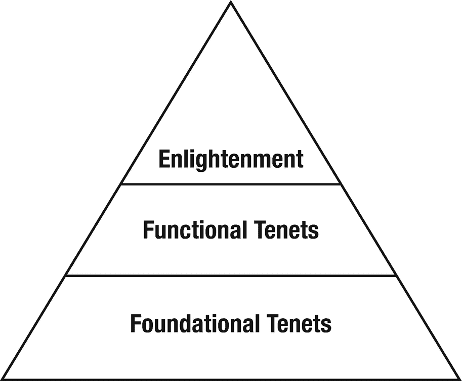

# 1.Linux 理念简介

Unix 哲学是使 Unix [1](#Fn1) 独特而强大的重要部分。已经有很多关于 Unix 哲学的文章。而且 Linux 哲学本质上与 Unix 哲学是一样的，因为它是 Unix 的直系后裔。

最初的 Unix 哲学主要是为系统开发人员设计的。事实上，以肯·汤普森 [2](#Fn2) 和丹尼斯·里奇 [3](#Fn3) 为首的 Unix 开发者以一种对他们有意义的方式设计了 Unix，创建了规则、指导方针和过程方法，然后将它们设计到操作系统的结构中。这对于系统开发人员来说很有效，对于系统管理员来说至少部分有效。这些来自 Unix 操作系统创始者的指导被整理成了一本优秀的书，由 Mike Gancarz 所著的《Unix 的哲学》(T8)*，随后被 Gancarz 先生更新为《Linux 和 Unix 的哲学》(T13)*。 [4](#Fn4)**

 **Eric S. Raymond 的另一本好书《Unix 编程的艺术》提供了作者在 Unix 环境中编程的哲学观点。它在某种程度上也是作者所经历和回忆的 Unix 发展史。这本书的全文也可以在网上免费获得。 [6](#Fn6)

我从这三本书中学到了很多。它们对 Unix 和 Linux 程序员都有很大的价值。在我看来， *Linux 和 Unix 哲学*和*Unix 编程的艺术*应该是 Linux 程序员、系统管理员和开发人员的必读书目。

我从事计算机工作已经超过 45 年了。天哪，那是很长的一段时间！直到我开始使用 Unix 和 Linux，并开始阅读一些关于 Unix、Linux 和它们共享的共同理念的文章和书籍，我才理解为什么 Linux 和 Unix 世界中的许多事情都是这样做的。

在撰写本文时，我已经在 Unix 和 Linux 上工作了 20 多年，我发现 Linux 哲学极大地提高了我作为一名系统管理员的效率和效力。我总是试图遵循 Linux 哲学，因为我的经验是，不管一大群头发尖尖的老板(PHB)施加多大的压力，严格地坚持它，从长远来看总是会有回报的。

最初的 Unix 和 Linux 理念是为那些操作系统的开发者准备的。尽管系统管理员可以将许多原则应用到他们的日常工作中，但是许多重要的原则，特别是对于系统管理员来说，却是缺失的。

在我的 Unix 和 Linux 职业生涯中，我很幸运有几个优秀的导师。他们帮助我获得了失败的信心。当我失败时，我学到的比事情顺利时要多得多，因为他们让我解决了自己给自己带来的问题。这些专家，比我有更多年系统管理员经验的人，从来没有因为我失败而斥责我或惩罚我——他们的信条是，“如果你失败了，你就会学到东西。”我学到了很多。他们教给我的很大一部分是 Linux 哲学，但他们也教给我他们自己的哲学，这些哲学有助于填补原著中缺失的部分。

因此，在我从事 Linux 和 Unix 工作的这些年里，我形成了自己的哲学——它更直接地适用于系统管理员的日常生活和任务。我的哲学部分基于最初的 Unix 和 Linux 哲学，以及我的导师的哲学。当我决定写我自己的书，一本旨在解决当今系统管理员的需求的书时，我从那些原则开始，但是随着我的进步和这本书的结构向我展示，哲学的结构和本质变得比以往任何时候都更加清晰。事实证明，这种哲学与最初的 Linux 哲学有很大的不同。直到那时，我才意识到需要一种新的哲学，一种专门针对系统管理员的哲学。很自然地，我把这种新哲学称为“系统管理员的 Linux 哲学”

这本书是我创造新哲学的成果——它提供了成为更好的系统管理员的独特的实践方法。这本书和它所揭示的哲学是我试图回馈在我成长过程中养育我并帮助我变得更加自信的社区。

因为“系统管理员的 Linux 哲学”这个名字有点长，为了简单起见，在本书中大多数时候我将它称为“哲学”。

## 我是系统管理员吗？

因为这本书是为系统管理员准备的，所以知道你是否是一名系统管理员会对你有所帮助。维基百科 [7](#Fn7) 将系统管理员定义为“负责维护、配置和可靠运行计算机系统的人；尤其是多用户计算机，比如服务器。”根据我的经验，这可能包括计算机和网络硬件、软件、机架和机箱、机房或空间等等。

典型的系统管理员的工作可能包括大量的任务。在小型企业中，系统管理员可能负责所有与计算机相关的事情。在较大的环境中，多个系统管理员可能共同负责保持系统运行所需的所有任务。在某些情况下，您可能甚至不知道自己是系统管理员；你的经理可能只是告诉你开始维护办公室里的一台或多台电脑——不管你喜不喜欢，这都会让你成为一名系统管理员。

还有一个术语“DevOps”，用于描述以前分离的开发和运营组织的交集。在过去，这主要是教系统管理员编写代码，但现在的重点转移到教程序员如何执行操作任务。参与系统管理员的任务使这些人也成为了系统管理员，至少在一部分时间是如此。当我在思科工作时，我有一份 DevOps 类型的工作。一部分时间我编写代码来测试 Linux 设备，其余时间我在测试这些设备的实验室中担任系统管理员。这是我职业生涯中非常有趣和有意义的一段时间。

我创建了这个简短的列表来帮助你确定你是否是一个系统管理员。你知道你是一个系统管理员，如果…

1.  你认为这本书可能是一本有趣的读物。

2.  人们经常请你帮助他们使用电脑。

3.  你每天早上在做其他事情之前都要检查服务器。

4.  您编写 shell 脚本来自动化甚至简单的任务。

5.  您共享您的 shell 脚本。

6.  您的 shell 脚本获得了开源许可。

7.  你知道开源意味着什么。

8.  你记录下你所做的一切。

9.  你黑了无线路由器安装 Linux 软件。

10.  你会发现计算机比大多数人更容易交流。

11.  你懂`:(){ :|:` `&` `}` `;:`

12.  你觉得命令行好玩。

13.  你喜欢完全掌控一切。

14.  你是根。

15.  当应用于软件时，你会理解“像啤酒一样免费”和“像演讲一样免费”的区别。

16.  您在机架外壳中安装了一台计算机。

17.  您已经用散热更好的风扇替换了标准的 CPU 冷却风扇。

18.  你购买零件，自己组装电脑。

19.  你用液体冷却你的 CPU。

20.  你可以在任何东西上安装 Linux。

21.  您的电视机上连接了一个树莓派。

22.  你用树莓派作为家庭网络的防火墙。

23.  您运行自己的电子邮件、DHCP、NTP、NFS、DNS 和/或 SSH 服务器。

24.  你入侵了你的家用电脑，用一个更快的处理器来替换它。

25.  您已经升级了计算机中的 BIOS。

26.  因为经常更换组件，所以您没有盖上电脑的盖子。

27.  您的 ISP 提供的路由器处于“通过”模式。

28.  你用 Linux 电脑当路由器。

29.  …等等…

你明白了。我可以列出更多能让你成为系统管理员的东西，但是会有上百条。我相信你能想出更多适合你的。

## 哲学的结构

对于系统管理员来说，Linux 哲学有三个层次，类似于马斯洛的需求层次。这些层次也象征着我们通过逐渐更高层次的开悟而成长。

底层是基础——我们作为系统管理员需要知道的基本命令和知识，以便执行最底层的工作。中间层由那些建立在基础之上的实用原则组成，并告知系统管理员的日常任务。顶层包含满足我们作为系统管理员的更高需求的原则，它鼓励并使我们能够分享我们的知识。

本书分为三个部分，分别对应于图 [1-1](#Fig1) 所示的哲学层次。在哲学的第一层也是最基本的一层，奠定了基础。我们将了解“Linux 真相”、数据流、标准 IO (STDIO)、转换数据流以及“一切都是文件”的含义随着我们的工作生活开始有所启发，我们发现自己正在学习许多新的命令，如何在简单的命令行程序中有效地使用它们，以及如何利用一切都是文件的事实。这是我们哲学的基础层，在本书的第二部分有所探讨。

图 1-1

面向系统管理员的 Linux 理念的层次结构

然后，我们的旅程超越了简单地在键盘上敲击命令，我们开始探索中间层，哲学的功能方面成为我们的指南。为了更好地利用命令行，我们开始扩展我们的命令行程序来创建经过测试和可维护的 shell 程序，我们保存这些程序并可以重复使用，甚至共享。我们变成了“懒惰的管理员”，开始自动化一切。我们适当地使用 Linux 文件系统层次结构，并以开放格式存储数据。哲学的功能部分可以在第 3 部分找到。

在哲学的顶层，我们进入启蒙阶段，这将在第四部分讨论。随着我们开始超越仅仅执行我们的系统管理员任务和仅仅完成工作，我们对 Linux 设计中的优雅和简单的理解是完美的。我们开始努力优雅地完成自己的工作，保持解决方案简单，简化现有的复杂解决方案，并创建可用和完整的文档。我们开始探索和实验只是为了获取新知识。在这个启蒙阶段，我们开始将我们的知识和方法传递给那些新的专业人员，并且我们积极支持我们最喜欢的开源项目。

在现实生活中，哲学的层次很少是清晰的。我们如何工作和应用哲学的原则可能会因环境、头发浓密的老板、我们的训练水平和我们目前对哲学的理解而异。

## 谁应该读这本书

如果你是或者想成为一名系统管理员，你应该看看这本书。如果你正在履行系统管理员的一些职责，即使这不是你的职位，你应该读这本书。如果你在德文郡工作，你应该读读这本书。如果您是一台或多台 Linux 计算机的 root 用户，您应该阅读这本书。如果你经常使用和喜欢命令行，你应该读这本书。如果你觉得命令行很好玩，很强大，你应该看看这本书。看看下图中的奶牛，她也想让你读这本书。

如果你想了解让最优秀的 Linux 系统管理员变得比普通人更强大的秘密；如果你想理解解开这些秘密的概念；如果你想成为当字节击中 CPU 冷却风扇时其他人都求助的系统管理员，那么这本书就是为你准备的。

这本书不是关于学习新的命令。相反，它是关于使用您应该已经熟悉的常见和众所周知的命令，在命令行阐明 Linux 的底层结构。想想这本书和你将在练习中使用的命令，如医生用来揭示人体内部的 X 射线、CT 扫描和 MRI。这本书将向你展示如何使用一些简单的 Linux 命令来揭示 GNU/Linux 的底层结构。

面向系统管理员的 Linux 哲学旨在揭示和说明命令行的强大功能和灵活性，以及支持这些特性的设计和使用哲学。这种对如何从 Linux 命令行中获取最多信息的理解可以帮助您成为一名更好的系统管理员。

我假设本书的读者至少有一整年的使用 Linux 命令行界面的经验，最好是使用 bash shell，但是任何 shell 都可以。您应该熟悉许多 Linux 命令。

我的期望是，您已经知道如何使用适当的命令执行大部分系统管理员的工作，并为使用适当的设备进行调整。例如，当我告诉您“在/mnt 上挂载 USB 设备”时，您将明白我的意思，并能够确定要挂载哪个设备文件，使用 mount 命令执行挂载，并根据需要访问已挂载的设备以创建或查看内容。

您还应该在一台或多台 Linux 计算机上拥有 root 访问权限，并且至少已经执行了六个月的系统管理员职责。如果你已经在家里的一台或多台电脑上安装了 Linux，你就符合这个要求，应该读这本书。

### 但是我不符合那些要求

也许你不符合任何先前陈述的要求，但无论如何都想读这本书。无论你是想成为一名系统管理员，还是仅仅因为你认为这可能很有趣，如果你还想读这本书，那么就去读吧。

如果你对学习面向系统管理员的 Linux 哲学感兴趣，不管我上面说了什么，你都想继续读这本书，那么，就这么做吧。在这种情况下，我已经试图提供足够的信息，使你有可能进行这些实验的大部分。如果您确实遇到了问题，请联系您当地的 Linux 用户组。世界上有很多这样的组织，我发现这些组织的成员往往非常乐于助人。

如果您有兴趣学习更多关于使用 Linux 命令行和学习系统管理技巧的知识，我推荐三本书。当你进行本书中的实验时，它们会成为很好的参考。

1.  *Pro Linux 系统管理*；马托克、丹尼斯、特恩布尔、詹姆斯、利弗丁克、彼得；压力；国际标准书号 978-1-4842-2008-5

2.  *开始 Linux 命令行*；范·武格特，桑德；压力；国际标准书号 978-1-4302-6829-1

3.  Linux 命令、编辑器和 Shell 编程实用指南第三版；索贝尔，普伦蒂斯霍尔；国际标准书号 978-0-13-308504-4

这三本书应该让您开始使用 Linux 命令行，并帮助您学习系统管理。但是最好的方法是尽可能多地亲自动手。

### 谁不应该读这本书

如果你只是想使用你的网络浏览器，发送电子邮件，也许使用 LibréOffice Writer 程序创建一些文档，如果你不关心 Linux 幕后发生的事情，如果你依赖别人来解决你的计算机问题，这本书不适合你。不读了。

如果你的唯一目的是想了解高级命令以及如何使用它们——这本身就是一个令人钦佩的目标——这本书不适合你。

## Linux 真相

最初引用 Unix 的下面这段话暗示了 Linux 命令行的惊人威力。它也适用于 Linux。

> Unix 并不是为了阻止用户做蠢事而设计的，因为那也会阻止他们做聪明的事情。
> 
> ——道格·怀特

这句话总结了 Unix 和 Linux 压倒一切的真理——操作系统必须信任用户。只有通过扩展这种完全的信任度，用户才能获得操作系统的全部能力。这个真理适用于 Linux，因为它是 Unix 的直接后代。

## 限制性操作系统

保护用户不受其拥有的能力影响的操作系统是从这样一个基本假设开始开发的，即用户不够聪明或知识不足以信任计算机实际上可以提供的全部能力。这些操作系统是限制性的，并且具有用户界面——命令行和图形界面——这些界面通过设计强制执行这些限制。这些限制性的用户界面迫使普通用户和系统管理员等进入一个没有窗户的封闭房间，然后把门砰地关上并上三道锁。那个锁着的房间阻止他们做葛温先生提到的任何聪明的事情。

这种限制性操作系统的命令行界面提供了相对较少的命令，对任何人可能参与的可能活动提供了事实上的限制。一些用户觉得这是一种安慰。从你正在读这本书的事实来判断，我不知道，显然你也不知道。

## Linux 是开放和免费的

从某种意义上说，Linux 从一开始就被设计成开放和免费的，用户和系统管理员应该在他们自己的领域内对操作系统的所有方面拥有完全的访问权。结果是我们可以用 Linux 做那些非常聪明的事情。开放和免费还有其他含义，如免费 Libré开源软件(FLOSS)和免费啤酒，但这种讨论是其他书籍的问题。

即使是最有经验的用户也可以使用 Linux 做“蠢事”。我的经验是，通过开放操作系统的全部功能，从我自己并非罕见的愚蠢中恢复变得容易得多。我发现大多数时候几个命令就可以解决问题，甚至不需要重启。有几次，我不得不切换到较低的运行级别来解决问题。我只是很少需要启动到恢复模式来编辑一个配置文件，我设法破坏得如此严重，它导致了严重的问题，包括无法启动。需要了解 Linux 的基本原理、结构和技术，才能完全释放它的力量，尤其是当东西坏了的时候。Linux 只需要系统管理员的一点理解和知识就可以完全释放它的潜力。

## 真正的知识

任何人都可以记忆或学习命令和程序，但死记硬背不是真正的知识。如果不了解这一理念以及它是如何体现在 Linux 的优雅结构和实现中的，就不可能将正确的命令作为工具来解决复杂的问题。我见过那些对 Linux 有着丰富知识的聪明人无法解决一个相对简单的问题，因为他们没有意识到表面之下结构的优雅。

作为一名系统管理员，在我的许多工作中，我的部分职责是协助招聘新员工。我参加了许多人的技术面试，这些人已经通过了许多微软认证，他们的简历都很好。我也参加了许多面试，在这些面试中，我们寻找 Linux 技能，但是这些申请者中很少有人有证书。当时微软认证是件大事，但在数据中心使用 Linux 的早期，很少有申请人获得认证。

我们通常以旨在确定申请人知识范围的问题开始这些面试。然后，我们将进入更有趣的问题，这些问题将测试他们通过问题找到解决方案的推理能力。我注意到一些非常有趣的结果。很少有 Windows 证书所有者能够通过我们给出的场景进行推理，而很大一部分 Linux 申请人能够这样做。

我认为这一结果部分是由于获得 Windows 证书依赖于记忆而不是实际的动手经验，以及 Windows 是一个封闭的系统，这使得系统管理员无法真正了解它是如何工作的。我认为 Linux 申请人做得更好，因为 Linux 在多个层面上是开放的，逻辑和理性可以用来识别和解决任何问题。任何使用 Linux 一段时间的系统管理员都必须了解 Linux 的体系结构，并且在应用知识、逻辑和推理来解决问题方面有相当丰富的经验。

## 启迪

这本书的大部分内容都发生在 Linux 命令行上，但它不是关于命令本身。在本书中，命令是工具，如果你知道如何照亮它，Linux 的底层结构之美就会通过它们而闪耀。这本书将通过向你展示如何使用这些常见的命令来探索这种美，从而帮助你获得启迪。

除了本书中出现的一两个命令之外，您应该已经熟悉了所有的命令。这本书将使您能够使用那些常见的命令来探索 Linux 的底层，并自己发现 Linux 的真相。

别忘了——这应该会很有趣！

<aside class="FootnoteSection" epub:type="footnotes">Footnotes [1](#Fn1_source)

[T2`https://en.wikipedia.org/wiki/Unix`](https://en.wikipedia.org/wiki/Unix)

  [2](#Fn2_source)

[T2`https://en.wikipedia.org/wiki/Ken_Thompson`](https://en.wikipedia.org/wiki/Ken_Thompson)

  [3](#Fn3_source)

[T2`https://en.wikipedia.org/wiki/Dennis_Ritchie`](https://en.wikipedia.org/wiki/Dennis_Ritchie)

  [4](#Fn4_source)

Mike Gancarz， *Linux 和 Unix 哲学*，数字出版社——爱思唯尔科学出版社，2003 年，ISBN 1-55558-273-7

  [5](#Fn5_source)

Eric S. Raymond，*Unix 编程的艺术*，Addison-Wesley，2003 年 9 月 17 日，ISBN 0-13-142901-9

  [6](#Fn6_source)

Eric S. Raymond，《Unix 编程的艺术》， [`http://www.catb.org/esr/writings/taoup/html/`](http://www.catb.org/esr/writings/taoup/html/)

  [7](#Fn7_source)

[T2`https://en.wikipedia.org/wiki/System_administrator`](https://en.wikipedia.org/wiki/System_administrator)

  [8](#Fn8_source)

慈善，“Ops:现在是每个人的工作”， [`https://opensource.com/article/17/7/state-systems-administration`](https://opensource.com/article/17/7/state-systems-administration)

  [9](#Fn9_source)

维基百科，“马斯洛需求层次理论”， [`https://en.wikipedia.org/wiki/Maslow's_hierarchy_of_needs`](https://en.wikipedia.org/wiki/Maslow%2527s_hierarchy_of_needs)

 </aside>**