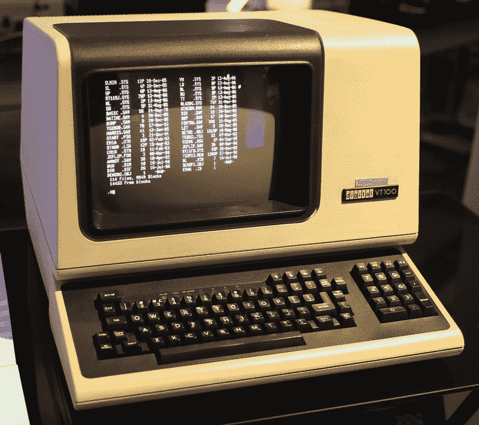
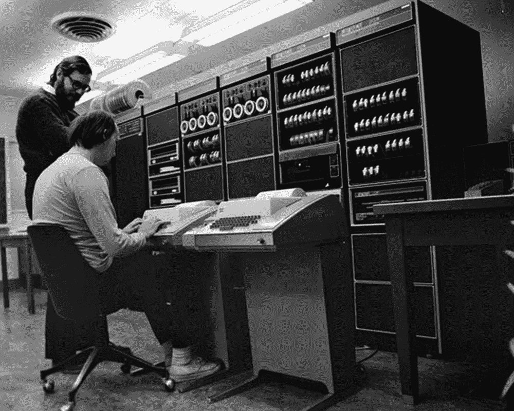
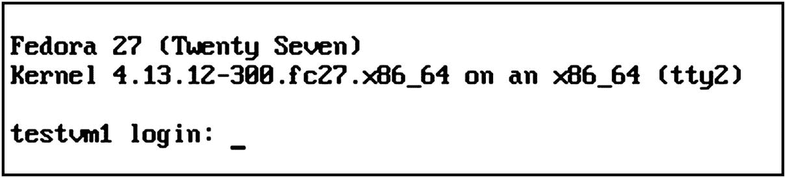
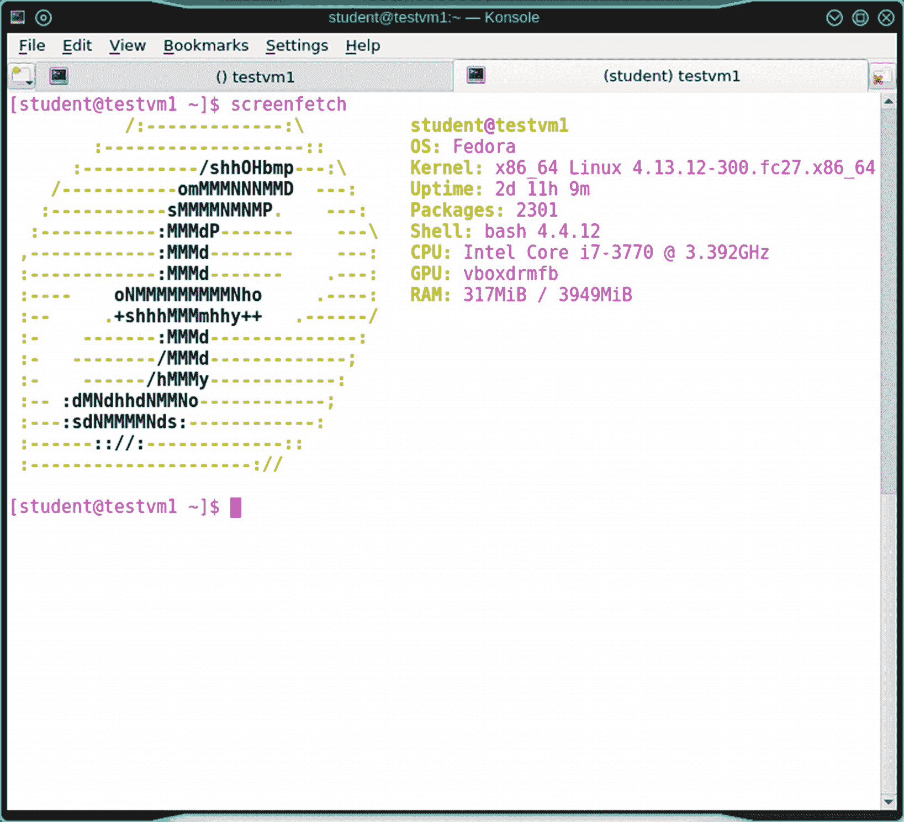
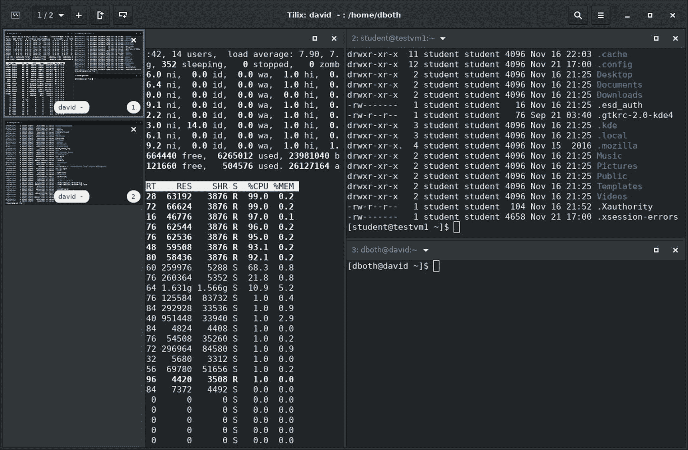
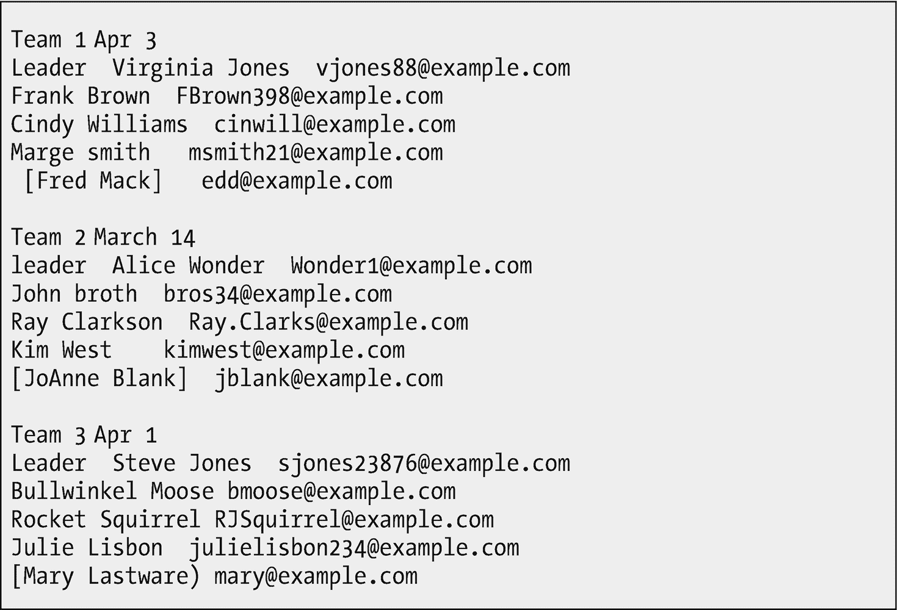
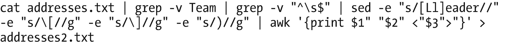

# 7.拥抱 CLI

力量来自 Linux，力量来自命令行界面 CLI。Linux CLI 的强大之处在于它完全没有限制。在这一章中，我们将开始探索命令行的方式，这将阐明它实际上就在你的指尖的力量。

有许多访问命令行的选项，例如虚拟控制台、许多不同的终端模拟器和其他可以提高灵活性和生产率的相关软件。所有这些可能性都将在这一章中讨论，还有一些具体的例子说明命令行是如何执行看似不可能的任务的——或者只是满足尖头发老板。

在我们进一步讨论命令行之前，我们需要做一些准备工作。

### 准备

并非所有的发行版都安装了我们在本章中需要的几个软件包，所以我们现在就安装它们。如果已经安装了这些软件包中的一个或多个，将会显示一条消息指出这一点，但其余的软件包仍将正确安装。将安装一些额外的软件包来满足我们正在安装的软件包的先决条件。

我的包管理器是 dnf，但是你应该使用你的发行版提供的包管理器。以 root 用户身份执行此操作。

```sh
[root@testvm1 ~]# dnf -y install konsole 
tilix

screen 
ksh

tcsh 
zsh

```

在我的测试中，已经安装了 VM Konsole 和 screen，但是命令安装了 ksh、csh、zsh、tilix 和其他三个包来满足依赖关系。

## 定义命令行

命令行是一种在用户和操作系统之间提供文本模式界面的工具。命令行允许用户将命令输入计算机进行处理并查看结果。

Linux 命令行接口是用 bash(Bourne shell)、csh (C shell)和 ksh (Korn shell)这样的 shell 实现的，这里仅举三个例子。任何 shell 的功能都是将用户输入的命令传递给操作系统，操作系统执行命令并将结果返回给 shell。

对命令行的访问是通过某种终端接口进行的。现代 Linux 计算机中常见的终端接口主要有三种类型，但术语可能会令人混淆。所以，请允许我详细地定义这些术语以及其他一些与命令行相关的术语。

## CLI 术语

有几个与命令行相关的术语经常互换使用。当我第一次开始使用 Unix 和 Linux 时，这种对术语的不加区别的使用给我造成了很大的困惑。我认为对系统管理员来说，理解控制台、虚拟控制台、终端、终端仿真器、终端会话和 shell 这些术语之间的区别是很重要的。

当然，只要你能表达你的观点，你可以使用任何对你有用的术语。在本书中，我将尽可能做到精确，因为现实情况是，这些术语的含义存在重大差异，有时这很重要。

### 命令提示符

命令提示符是一串像这样的字符，它有一个闪烁的光标，等待——提示——你输入命令。

```sh
[student@testvm1 ~]$ ◾

```

现代 Linux 安装中典型的命令提示符由用户名组成；主机名；和当前工作目录(PWD)，也称为“当前”目录，都用方括号括起来。波浪号(~)字符表示主目录。

### 命令行

命令行是终端上的一行，包含命令提示和您输入的任何命令。

### 命令行界面

命令行界面是 Linux 操作系统的文本模式用户界面，允许用户键入命令并以文本输出的形式查看结果。

### 末端的

终端是一种旧的硬件，它提供了与大型机或 Unix 计算机主机交互的手段。终端不是电脑；终端仅仅连接到大型机和 Unix 系统。终端——硬件类型——通常通过一条长的串行电缆连接到主机。如图 [7-1](#Fig1) 所示的 DEC VT100 终端通常被称为“哑终端”,以区别于连接到大型机或 Unix 主机时作为终端的 PC 或其他小型计算机。哑终端有足够的逻辑来显示来自主机的数据，并将击键传送回主机。所有的处理和计算都在终端所连接的主机上进行。



图 7-1

DEC VT100 哑终端。本文件根据知识共享署名 2.0 通用许可协议进行许可。作者:杰森·斯科特

甚至更古老的终端，如机械电传打字机(TTY)，比阴极射线管显示器的普遍使用还早。他们使用新闻纸质量的纸卷来记录命令的输入和结果。我上的第一堂大学计算机编程课使用了这些 TTY 设备，它们通过电话线以每秒 300 比特的速度连接到几百英里外的阿格(是的，通用电气)分时计算机。那时我们大学买不起一台自己的电脑。

许多与命令行相关的术语都源于这两种类型的哑终端的历史使用。例如，术语 TTY 仍然被广泛使用，但是我已经很多年没见过真正的 TTY 设备了。再次查看您的 Linux 或 Unix 计算机的/dev 目录。你会发现大量的 TTY 设备文件。

### 注意

我们在第 [5](05.html) 章中讨论了设备文件。

终端设计的唯一目的是允许用户通过输入命令和在纸卷或屏幕上查看结果来与他们所连接的计算机进行交互。术语“终端”倾向于暗示一个独立于计算机的硬件设备，同时用于与计算机通信和交互(图 [7-2](#Fig2) )。



图 7-2

Unix 开发者 Ken Thompson 和 Dennis Ritchie。汤普森正坐在一台用于与 Unix 计算机接口的电传打字终端前。彼得·哈默——由马格努斯·曼斯克上传

### 安慰

控制台是一种特殊的终端，因为它是连接到主机的主要终端。它是系统操作员用来输入命令和执行任务的终端，这些任务在与主机相连的其它终端上是不允许的。当出现问题时，控制台也是主机显示系统级错误消息的唯一终端。

可以有许多终端连接到大型机和 Unix 主机，但只有一个终端是或可以充当控制台。在大多数大型机和 Unix 主机上，控制台通过专门为控制台设计的专用连接进行连接。

与 Unix 一样，Linux 也有运行级别，一些运行级别(如运行级别 1、单用户模式和恢复模式)仅用于维护。在这些运行级别中，只有控制台可以允许系统管理员与系统交互并执行维护。

### 注意

KVM 代表键盘、视频和鼠标，这三种设备是大多数人用来与他们的计算机进行交互的。

在 PC 上，物理控制台通常是直接连接到计算机的键盘、显示器，有时还有鼠标(KVM)。这些是用于在 BIOS 引导序列期间与 BIOS 进行交互的物理设备，可以在 Linux 引导过程的早期阶段用于与 GRUB 进行交互，并选择不同的内核进行引导或修改引导命令以引导到不同的运行级别。

由于 KVM 设备与计算机的紧密物理连接，系统管理员必须在引导过程中亲自出现在该控制台上，以便与计算机进行交互。在引导过程中，系统管理员无法进行远程访问，只有当 SSHD 服务启动并运行时，远程访问才可用。

### 虚拟控制台

运行 Linux 的现代个人电脑和服务器通常没有可以用作控制台的哑终端。Linux 通常为多个虚拟控制台提供功能，允许从单个键盘和显示器进行多次登录。Red Hat Linux、CentOS 和 Fedora Linux 通常为文本模式登录提供六到七个虚拟控制台。如果使用图形界面，第一个虚拟控制台 vc1 将成为 X Window 系统(X)启动后的第一个图形(GUI)会话，而 vc7 将成为第二个 GUI 会话。见图 [7-3](#Fig3) 。



图 7-3

虚拟控制台 2 的登录提示

每个虚拟控制台被分配给对应于控制台编号的功能键。因此 vc1 将被分配给功能键 F1，依此类推。在这些会话之间切换很容易。在你的电脑上你可以按住 **Ctrl-Alt** 键，按下 **F2** 切换到 vc2。然后按住 **Ctrl-Alt** 键，按 **F1** 切换到 vc1 和通常的图形桌面界面。如果没有 GUI 运行，vc1 将只是另一个文本控制台。

虚拟控制台提供了一种使用单个物理系统控制台、键盘、视频显示器和鼠标(KVM)访问多个控制台的方法。这为管理员执行系统维护和解决问题提供了更大的灵活性。还有一些其他方法来增加灵活性，但如果您可以物理访问系统或直接连接的 KVM 设备或一些逻辑 KVM 扩展(如 Integrated Lights Out 或 iLO ),虚拟控制台总是可用的。在某些环境中，screen 命令等其他方法可能不可用，GUI 可能在大多数服务器上也不可用。



图 7-4

打开了两个选项卡的 Konsole 终端仿真程序窗口

### 终端仿真程序

终端仿真器是一种模拟硬件终端(如 VT100)的软件程序。目前大多数终端仿真器可以仿真几种不同类型的硬件终端(图 [7-4](#Fig4) )。大多数终端模拟器都是运行在任何 Linux 图形桌面环境下的图形程序，比如 KDE、Cinnamon、LXDE、GNOME 等等。Linux 控制台<sup>T3 1T5 是 Linux 虚拟控制台的终端仿真器。</sup>

第一个终端仿真器是 Xterm，<sup>[2](#Fn2)T3，最初是由 Thomas Dickey 在 1984 年开发的。 <sup>[3](#Fn3)</sup> Xterm 仍然被维护，并被打包成许多现代 Linux 发行版的一部分。</sup>

其他终端模拟器还包括 Konsole、 <sup>[4](#Fn4)</sup> Tilix、 <sup>[5](#Fn5)</sup> (图 [7-5](#Fig5) )、rxvt、<sup>[6](#Fn6)</sup>gnome-terminal、 <sup>[7](#Fn7)</sup> 终结者、 <sup>[8](#Fn8)</sup> 等等。每个终端模拟器都有一组吸引特定用户群的有趣特性。一些具有在单个窗口中打开多个标签或终端的能力。其他的仅提供执行其功能所需的最小特征集，并且通常在要求小尺寸和效率时使用。



图 7-5

打开了几个会话的 Tilix 实例

我最喜欢的终端模拟器是 Konsole 和 Tilix，因为它们提供了在一个窗口中拥有多个终端模拟器会话的能力。Konsole 使用多个选项卡来实现这一点，我可以在这些选项卡之间切换。

Tilix 提供了在一个窗口会话中平铺多个仿真器会话以及提供多个会话的能力。图 [7-5](#Fig5) 显示了 Tilix 的一个实例，在左侧边栏中显示了两个会话。可见会话虽然部分被侧边栏覆盖，但有三个终端在运行。侧边栏允许在会话之间切换。

其他终端模拟器软件提供了这些功能，但不如 Konsole 和 Tilix 灵活和无缝。

### 伪终端

伪终端是一个 Linux 设备文件，为了与操作系统交互，终端模拟器被逻辑地附加到该文件上。伪终端的设备文件位于/dev/pts 目录中，仅在启动新的终端模拟器会话时创建。它可以是一个新的终端模拟器窗口，也可以是一个终端模拟器(如 Konsole)的现有窗口中的一个新选项卡或面板，它支持在单个窗口中进行多个会话。

/dev/pts 中的设备文件只是每个打开的模拟器会话的一个数字。例如，第一个模拟器是/dev/pts/1。

### 会议

会话是那些可以应用于不同事物的术语中的另一个，然而它基本上保持相同的含义。

最基本的应用是终端会话。这是一个连接到单个用户登录和 shell 的单个终端模拟器。因此，从最基本的意义上来说，会话是登录到本地或远程主机的单个窗口或虚拟控制台，其中运行着命令行 shell。

Tilix 终端仿真器使用术语会话来表示其中有一个或多个终端打开的窗格。在这种情况下，窗格是会话，每个子窗口都是终端。你可以在图 [7-5](#Fig5) 中看到这一点。

### 壳

外壳是操作系统的命令解释器。Linux 可用的许多 shells 中的每一个都将用户或系统管理员输入的命令解释成操作系统可用的形式。当结果返回到 shell 程序时，它会在终端上显示它们。

大多数 Linux 发行版的默认 shell 是 bash shell。bash 代表 Bourne Again Shell，因为 bash shell 基于较早的 Bourne shell，它是由 Steven Bourne 在 1977 年编写的。还有许多其他的外壳。我在这里列出的四个是我最常遇到的，但是还有很多其他的。 <sup>[9](#Fn9)</sup>

*   csh——面向喜欢 C 语言语法的程序员的 C shell。

*   ksh——Korn shell，由 David Korn 编写，受到 Unix 用户的欢迎。

*   tcsh——csh 的一个版本，具有更易于使用的特性。

*   zsh——它结合了其他流行 shells 的许多特性。

所有 shells 都有一些内置的命令，可以补充或替换核心实用程序提供的命令。打开 bash 的手册页，找到“SHELL BUILTIN COMMANDS”一节，查看 SHELL 本身提供的命令列表。

我用过 C shell、Korn shell 和 Z shell。与我尝试过的其他 shell 相比，我仍然更喜欢 bash shell。每个 shell 都有自己的个性和语法。有些对你来说会更好，有些则不那么好。使用最适合你的方法，但这可能需要你至少尝试其他方法。

可以轻松换壳。

### 实验 7-1

因为大多数 Linux 发行版默认使用 bash shell，所以我假设您一直在使用 bash shell，并且它是您的默认 shell。在为本章做准备时，我们安装了另外三个 shells，ksh、tcsh 和 zsh。

以用户学生的身份做这个实验。首先，查看您的命令提示符，应该是这样的:

```sh
[student@testvm1 ~]$

```

这是非根用户的标准 bash 提示符。现在我们把这个改成 ksh shell。只需输入外壳的名称。

```sh
[student@testvm1 ~]$ ksh
$

```

您可以通过提示的不同来判断这是一个不同的 shell。运行几个简单的命令，比如`ls`和`free`，看看这些命令的工作方式有什么不同。这是因为除了内置命令之外，大多数命令都是独立于 shell 的。

尝试向上滚动以获得类似 bash 的命令历史。它不起作用。

```sh
$ zsh
This is the Z Shell configuration function for new users,
zsh-newuser-install.
You are seeing this message because you have no zsh startup files
(the files .zshenv, .zprofile, .zshrc, .zlogin in the directory
~).  This function can help you with a few settings that should
make your use of the shell easier.

You can:

(q)  Quit and do nothing. The function will be run again next time.

(0)  Exit, creating the file ~/.zshrc containing just a comment.
     That will prevent this function being run again.

(1)  Continue to the main menu.

--- Type one of the keys in parentheses ---

```

如果继续，您将看到一系列菜单，这些菜单将帮助您配置 Z shell 以满足您的需求——这是您在此阶段最了解的。我选择“Q ”,只是为了进入与 bash 提示符略有不同的提示符。

```sh
[student@testvm1]~%

```

在 Z shell 中运行几个简单的命令。然后键入 exit 两次，回到最初的 bash shell。

```sh
[student@testvm1]~% w
 14:30:25 up 3 days,  6:12,  3 users,  load average: 0.00, 0.00, 0.02
USER     TTY        LOGIN@   IDLE   JCPU   PCPU WHAT
student  pts/0     Tue08    0.00s  0.07s  0.00s w
root     pts/1     Wed06   18:48   0.26s  0.26s -bash
student  pts/2     08:14    6:16m  0.03s  0.03s -bash
[student@testvm1]~% exit
$ exit
[student@testvm1 ~]$

```

如果您已经在一个 bash shell 中启动了一个 bash shell，您认为会发生什么？

```sh
[student@testvm1 ~]$ bash
[student@testvm1 ~]$ ls
Desktop Documents Downloads Music Pictures Public Templates Videos
[student@testvm1 ~]$ exit
exit
[student@testvm1 ~]$

```

你只是进入了另一个狂欢派对。

这比表面上看起来更能说明问题。首先，每个壳都是一层。启动一个新的 shell 并不会终止以前的 shell。当您从 bash 启动 tcsh 时，bash shell 仍然存在；当您从 tcsh 退出时，您又回到了等待的 bash shell。

事实证明，这正是从 shell 中运行任何命令或进程时所发生的情况。该命令在它自己的会话中运行，父 shell(process)会一直等待，直到该子命令返回并且控制权返回给它，然后才能继续处理进一步的命令。

因此，如果您有一个运行其他命令的脚本——这是脚本的目的——脚本运行每个命令，等待它完成，然后继续运行下一个命令。

可以通过在命令末尾附加一个&符号来修改这种行为，这将调用的命令放在后台，并允许用户继续与 shell 交互，或者让脚本继续处理更多的命令。您只希望使用不需要进一步人工交互或输出到 STDOUT 的命令来实现这一点。当稍后运行的其他命令需要该命令的结果时，您也不希望在后台运行该命令，但可能是在后台任务完成之前。

您可以使用`chsh`命令更改您的 shell，这样它将在您每次登录和启动新的终端会话时保持不变。

### 安全外壳(SSH)

宋承宪其实不是一个壳。`ssh`命令在作为客户端的自身和另一台运行 SSHD 服务器的主机之间启动安全通信链路。服务器端使用的实际命令 shell 是服务器端为该帐户设置的默认 shell，比如 bash shell。

### 屏幕

您可能首先认为“屏幕”是显示 Linux 桌面的设备。这是一个意思。

对于像我们这样的极客来说，screen 是一个程序，一个屏幕管理器，它增强了命令行的能力。screen 实用程序允许在单个终端会话中启动多个 shell，并提供了在运行的 shell 之间导航的方法。

还记得当你有一个运行程序的远程会话，而通信链接失败的时候吗？我已经经历过很多次了。当发生这种情况时，正在运行的程序也被终止，我不得不从头重新启动它。这可能会非常令人沮丧。

筛选程序可以防止这种情况。即使由于网络连接失败而导致与远程主机的连接中断，屏幕会话也将继续运行。它还允许从终端会话断开屏幕会话，并在以后从同一台或不同的计算机重新连接。在屏幕终端会话中运行的所有 CLI 程序将继续在远程主机上运行。这意味着一旦通信重新建立，用户可以重新登录到远程主机，并在远程命令行使用`screen -r`命令将屏幕会话重新连接到终端。

所以我可以在屏幕上启动一些终端会话，使用 **Ctrl-a + d** 从屏幕上断开连接，然后注销。然后，我可以转到另一个位置，登录到一个主机，SSH 到主机运行屏幕，登录，并使用`screen` `-r`命令重新连接到屏幕会话，所有终端会话及其各自的程序仍将运行。

screen 命令在某些环境中很有用，在这些环境中，对硬件控制台的物理访问不可用于提供对虚拟控制台的访问，但是需要多个 shells 的灵活性。你可能会发现使用 screen 程序很方便，在某些情况下，为了快速有效地工作，这样做是必要的。

### 实验 7-2

在这个实验中，我们探索屏幕程序的使用。以学生用户的身份在终端会话中执行本实验。

在我们开始之前，让我们讨论如何向屏幕程序本身发送命令，以便做一些事情，比如打开一个新的终端和在运行的终端会话之间切换。

在这个实验中，我提供了一些指令，比如“按下 **Ctrl-a + c** ”来打开一个新的终端。这意味着你应该在按“a”键的同时按住 Control 键；此时你可以释放控制键和“a”键，因为你已经提醒屏幕程序下一次击键是针对它的；现在按“c”键。这一系列的击键看起来有点复杂，但是我很快就学会了肌肉记忆，现在已经很自然了。我相信你也一样。

对于显示该屏幕会话中所有打开终端列表的序列 **Ctrl-a + "** (双引号)序列，执行 **Ctrl-a** ，释放这些键，然后按下 **shift + "** 。

我发现这个过程的唯一例外是 **Ctrl-a + a** 序列，它在最后两个终端会话之间切换。在松开 Ctrl 键之前，您必须继续按住 Control 键并连续按下“a”键两次。

1.  输入`screen`命令，该命令将清除显示并离开命令提示符。您现在处于屏幕显示管理器中，一个终端会话打开并显示在窗口中。

2.  键入任何命令，例如`ls`，除了命令提示符之外，还会在终端会话中显示一些内容。

3.  按下 **Ctrl-a + c** 在屏幕会话中打开一个新的 shell。

4.  在这个新终端中输入不同的命令，例如`df –h`。

5.  键入 **Ctrl-a + a** 在端子之间切换。

6.  输入 **Ctrl-a + c** 打开第三个端子。

7.  键入 **Ctrl-a + "** 列出打开的终端。使用向上/向下箭头键选择除最后一个以外的任何一个，并点击 **Enter** 键切换到该终端。

8.  要关闭一个终端，键入 **exit** 并按下 **Enter** 键。

9.  键入命令 **Ctrl-a + "** 以验证终端是否已消失。请注意，具有您选择关闭的编号的端子不再存在，其他端子也没有重新编号。

10.  使用 **Ctrl-a + c** 重新打开一个新的终端。

11.  键入 **Ctrl-a + "** 以验证新终端已经创建。请注意，它已在之前关闭的终端位置打开。

12.  要从屏幕会话和所有打开的终端断开，按下 **Ctrl-a + d** 。请注意，这将使所有终端和其中的程序保持完整并仍在运行。

13.  在命令行输入命令`screen` `-list`命令，列出所有当前屏幕会话。如果有多个屏幕会话，这有助于确保重新连接到正确的屏幕会话。

14.  使用命令**屏幕****–r**重新连接到活动屏幕会话。如果打开了多个活动屏幕会话，则会显示一个列表，您可以选择想要连接的会话；您必须输入想要连接的屏幕会话的名称。

我建议您不要在现有的屏幕会话中打开新的屏幕会话。很难在终端之间进行切换，因为屏幕程序并不总是理解向哪个嵌入式会话发送命令。

我一直使用屏幕程序。它是一个强大的工具，为我在命令行上工作提供了极大的灵活性。

## GUI 和 CLI

您可能喜欢并使用许多图形用户界面中的任何一种，即桌面，几乎所有的 Linux 发行版都提供了这种界面；你甚至可以在它们之间切换，因为你会发现某个特定的桌面比如 KDE 更适合某些任务，而另一个比如 GNOME 更适合其他任务。但是您还会发现，管理 Linux 计算机所需的大多数图形工具只是实际执行这些功能的底层 CLI 命令的包装。

图形界面无法达到 CLI 的强大功能，因为 GUI 固有地局限于程序员决定您应该访问的那些功能。这就是 Windows 和其他限制性操作系统的工作方式。他们只允许你使用他们认为你应该拥有的功能和权力。这可能是因为他们认为你真的想屏蔽掉计算机的全部能量，或者是因为他们认为你没有能力处理这种水平的能量。

仅仅因为 GUI 在某些方面有局限性，并不意味着优秀的系统管理员不能利用它来简化他们的工作。我发现我可以更灵活地利用 GUI 来完成命令行任务。通过在桌面上允许多个终端窗口，或者通过使用高级终端仿真程序，比如为 GUI 环境设计的 Tilix 和 Konsole，我可以提高我的生产率。在桌面上打开多个终端使我能够同时登录多台计算机。我也可以多次登录任何一台计算机，使用我自己的用户 ID 打开多个终端会话，并以 root 用户身份打开更多的终端会话。

对我来说，让多个终端会话以多种方式随时可用，就是 GUI 的全部意义。GUI 还可以让我访问像 LibreOffice 这样的程序，我正在用它来写这本书，图形电子邮件和网络浏览应用等等。但是系统管理员的真正权力在命令行中。

Linux 使用由理查德·M·斯托曼、 <sup>[10](#Fn10)</sup> 又名 RMS 和许多其他贡献者编写的 GNU 核心实用程序，作为任何免费版本的 Unix 或类似 Unix 的操作系统所需的免费开源实用程序。GNU 核心实用程序是任何 GNU 操作系统(如 GNU/Linux)的基本文件、外壳和文本操作实用程序，任何系统管理员都可以依赖它在每个版本的 Linux 上运行。此外，每个 Linux 发行版都有一组扩展的实用程序，可以提供更多的功能。

您可以输入命令`info coreutils`来查看 GNU 核心实用程序的列表，并选择单个命令来了解更多信息。您还可以使用 man <command></command>来查看这些命令的 man 页面，以及其他数百个 Linux 命令，这些命令也是每个发行版的标准。

## 非限制性接口

Linux CLI 是非限制性界面，因为它对您如何使用它没有任何限制。

根据定义，GUI 是一个非常严格的界面。你只能以规定的方式执行你被允许的任务，所有这些都是由程序员选择的。你不能超越编写代码的程序员的想象力的极限，或者——更有可能的是——头发尖尖的老板对程序员的限制。

在我看来，任何图形界面最大的缺点就是抑制了自动化的可能性。没有一个 GUI 提供真正自动化任务的能力。取而代之的是，只需反复点击鼠标，就可以对略有不同的数据多次执行相同或相似的操作。

另一方面，CLI 允许在执行任务时有很大的灵活性。这是因为每个 Linux 命令，不仅仅是 GNU 核心实用程序，而且是绝大多数 Linux 命令，都是使用 Linux 哲学的原则编写的，例如，“一切都是一个文件”，“总是使用 STDIO”，“每个程序应该做好一件事”，“避免强制用户界面”，等等。你明白了，我将在本书的后面讨论这些原则，所以如果你还不明白它们的意思，不要太担心。

SysAdmin 的底线是，当开发人员遵循这些原则时，命令行的力量可以被充分利用。

### 邮件列表

此示例突出了 CLI 自动化常见任务的能力的强大和灵活性。

在我的职业生涯中，我管理过几个 listservs，现在仍然如此。人们给我发电子邮件地址列表，让我添加到这些列表中。有一次，我收到了一个 Word 文档中的姓名和电子邮件地址列表，这些信息将被添加到我的一个列表中。

列表本身并不是很长，但是它的格式非常不一致。图 [7-6](#Fig6) 显示了该列表的缩略版本，其中包含名称和域名的更改。原始列表有多余的行、需要删除的方括号和圆括号之类的字符以及一些空行。将这些电子邮件添加到列表所需的格式是`first last <email@example.com>`。



图 7-6

要添加到 listserv 的电子邮件地址原始文档的部分列表

很明显，我需要处理数据，以便将它转换成可接受的格式，输入到列表中。可以使用文本编辑器或文字处理器(如 LibreOffice Writer)对这个小文件进行必要的更改。然而，人们经常给我发这样的文件，所以用文字处理器来做这些修改就成了一件苦差事。尽管 Writer 有很好的搜索和替换功能，但每个字符或字符串都必须单独替换，并且没有办法保存以前的搜索。Writer 确实有一个非常强大的宏功能，但是我对它的两种语言 LibreOffice Basic 和 Python 都不熟悉。我确实知道 bash shell 编程。

我做了一个系统管理员应该做的事情——自动完成任务。我做的第一件事是将地址数据复制到一个名为 addresses.txt 的文本文件中，这样我就可以使用命令行工具来处理它。经过几分钟的工作，我开发了 bash 命令行程序，如图 [7-7](#Fig7) 所示，它产生了所需的输出，即 addresses2.txt 文件。换行是可以接受的，但是在命令完全输入之前不要按回车键。



图 7-7

这个 bash 命令行程序清理图 [7-6](#Fig6) 中的电子邮件地址数据，如果保存为可执行的 shell 脚本，可以多次重用

我将 bash 程序保存在一个可执行文件中，现在我可以在收到新列表的任何时候运行这个程序。有些列表相当短，如图 [7-6](#Fig6) 所示，但其他列表相当长，有时包含数百个地址和许多行不包含要添加到列表中的地址的“内容”。

认识到我的解决方案不是唯一的，这一点非常重要。bash 中有不同的方法来产生相同的输出，也可以使用其他语言，如 Python 和 Perl。当然，还有 LibréOffice Writer 宏。但是我总是可以把 bash 作为任何 Linux 发行版的一部分。我可以在任何 Linux 计算机上使用 bash 程序执行这些任务，甚至是没有 GUI 桌面和没有安装 LibréOffice 的计算机。

#### 解决方案原则

为解决此类问题的程序使用 bash shell 有助于确保解决方案符合其他哲学原则。例如，bash shell 程序可以移植到其他 Linux 和 Unix 环境中。这里列出了这种特殊解决方案所满足的原则。

*   拥抱 CLI

*   做一个懒惰的系统管理员

*   使用 STDIO 和数据流

*   自动化一切

*   总是使用外壳程序

*   将数据存储在平面文本文件中

*   使程序可移植

*   力求优雅

*   找到简单

*   沉默是金

*   测试一切

### 用大数据迷惑他们

> 一个程序的价值与其产出的重量成正比。
> 
> —计算机编程法则

多年前在一个程序员办公室的海报上看到这句话。对于那些太年轻而不记得那些“美好旧时光”的人来说，它指的是一个时代，那时几乎所有的计算机输出都是在宽大的折纸上打印报告的形式。一些程序会从 IBM 1403 打印机中倾倒大量 11 英寸 x15 英寸的扇形折叠连续格式纸 <sup>[11](#Fn11)</sup> 。你在公司层级中的地位可以由你办公室里有多少叠电脑文件以及它们有多高来决定。

尽管那些日子已经成为过去，但大量的数据仍然可能是某种迹象。在我的例子中，这是一种应对对基本上无意义的数据的连续请求的方法。

这是另一个使用命令行的有趣例子。1999 年年中的某个时候，我在北卡罗莱纳州工作，一个 PHB 要求我为安全人员创建一个名单。他们想知道我的“非标准”个人电脑上的每一个软件，以及它的功能。当时我使用的是 Red Hat Linux 6，而不是“标准”的 Windows。

我的困境是弄清楚他们到底想要什么。他们只是想要一个列表吗，比如 Red Hat Linux 6.1，OpenOffice，Mozilla？还是他们想要更多。无论我如何要求澄清，他们只是说他们想要一份非标准的“所有东西”的清单。我了解安全部门的人，我觉得越多越好。

他们说他们想要一份我的 Linux 电脑上所有软件的清单，以及它们的功能，所以我满足了他们。我编写了一个 bash 程序，该程序确定安装在相关计算机上的每个 RPM 包，按字母顺序对它们进行排序，然后使用 RPM 数据库获得软件的基本描述。实验 7-3 展示了我为完成这个任务而编写的小程序。在你自己的电脑上运行，看看结果。

确保使用所示的反勾号(``rpm -qa | sort``)，否则该实验将无法进行。将代码括在反勾号(`)中是一种在评估语句中其余代码之前执行该段代码的方法。因此，首先评估包含的代码，然后将其用作`for`命令的输入列表。这就像数学问题中的圆括号一样，比如 **X=a*3+2*(6-3)** 。括号改变了表达式的求值顺序。

### 实验 7-3

以 root 用户身份执行此实验。

```sh
[root@testvm1 ~]# for I in `rpm -qa | sort`;do echo $I; rpm -qi $I | grep Summary;done

```

这个简单的命令行程序为安装在您计算机上的每个 RPM 包生成两行数据。在我的 testvm1 虚拟机上安装了一个相当普通的程序，结果是 4，630 行代码。

再一次，我可以在程序末尾使用`mailx`命令，通过电子邮件将数据直接发送给发出请求的 PHB。

### 注意

我这样做已经超过 15 年了，我没有那个 bash 程序的副本。在写这一章的时候，我花了大约 5 分钟来重新创建它。

最终结果是几十页的数据，这正是他们所要求的。我知道大部分对他们来说是没有意义的，但这无关紧要，因为我给了他们他们想要的。它只是比他们预期的要多得多，而且大部分都是晦涩难懂的描述——除非你非常熟悉 Linux 的精髓。我想他们只是希望用一页纸列出电子邮件、浏览器和办公软件等东西。

然而，尽管我曾经为 PHB 提供他们所要求的东西很有趣，这个实验确实说明了命令行可以以一些令人惊奇和强大的方式使用。让我们再次列出我们的“非标准”软件，但是增加一个命令。

### 实验 7-4

以 root 用户身份执行此实验。

```sh
[root@testvm1 ~]# for I in `rpm -qa | sort`;do echo $I; rpm -qi $I | grep Summary;done | text2pdf -o /tmp/non-std-software.pdf

```

管道中的最后一个命令`text2pdf`将 ASCII 文本数据流直接转换为文本文件。

## CLI 电源

我希望您能从这些简单的例子中看到 SysAdmin 在使用命令行时所拥有的巨大能力。

在这一章中，你已经发现 Linux 提供了大量的方法来访问命令行和执行你作为系统管理员的工作。您可以使用虚拟控制台和许多不同的终端模拟器。您可以将它们与 screen 程序结合使用，以进一步增强命令行的灵活性。

本章中的例子本身就很有启发性，但是 CLI 的真正力量来自于我也使用 CLI“自动化一切”这一事实，这是该哲学的另一个原则。有经验的系统管理员都知道，如果某件事需要做一次，就需要再做一次，通常是多次。所以为了方便起见，我将这些简单的 bash 代码放在文本文件中，并使这些文件可执行。每当我再次被要求提供同样的信息时，我所要做的就是运行适当的 bash 脚本。

<aside class="FootnoteSection" epub:type="footnotes">Footnotes [1](#Fn1_source)

维基百科，控制台， [`https://en.wikipedia.org/wiki/Linux_console`](https://en.wikipedia.org/wiki/Linux_console)

  [2](#Fn2_source)

维基百科，Xterm， [`https://en.wikipedia.org/wiki/Xterm`](https://en.wikipedia.org/wiki/Xterm)

  [3](#Fn3_source)

维基百科，托马斯迪基，

  [4](#Fn4_source)

维基百科，控制台， [`https://en.wikipedia.org/wiki/Konsole`](https://en.wikipedia.org/wiki/Konsole)

  [5](#Fn5_source)

Fedora 杂志，Tilix， [`https://fedoramagazine.org/try-tilix-new-terminal-emulator-fedora/`](https://fedoramagazine.org/try-tilix-new-terminal-emulator-fedora/)

  [6](#Fn6_source)

维基百科，Rxvt， [`https://en.wikipedia.org/wiki/Rxvt`](https://en.wikipedia.org/wiki/Rxvt)

  [7](#Fn7_source)

维基百科，Gnome 终端， [`https://en.wikipedia.org/wiki/Gnome-terminal`](https://en.wikipedia.org/wiki/Gnome-terminal)

  [8](#Fn8_source)

维基百科，终结器， [`https://en.wikipedia.org/wiki/Terminator_(terminal_emulator`](https://en.wikipedia.org/wiki/Terminator_(terminal_emulator)

  [9](#Fn9_source)

维基百科，比较命令的炮弹， [`https://en.wikipedia.org/wiki/Comparison_of_command_shells`](https://en.wikipedia.org/wiki/Comparison_of_command_shells)

  [10](#Fn10_source)

维基百科，Richard M. Stallman，

  [11](#Fn11_source)

维基百科，连续表格纸， [`https://en.wikipedia.org/wiki/Continuous_stationery`](https://en.wikipedia.org/wiki/Continuous_stationery)

  [12](#Fn12_source)

维基百科，IBM 1403 打印机， [`https://en.wikipedia.org/wiki/IBM_1403`](https://en.wikipedia.org/wiki/IBM_1403)

 </aside>