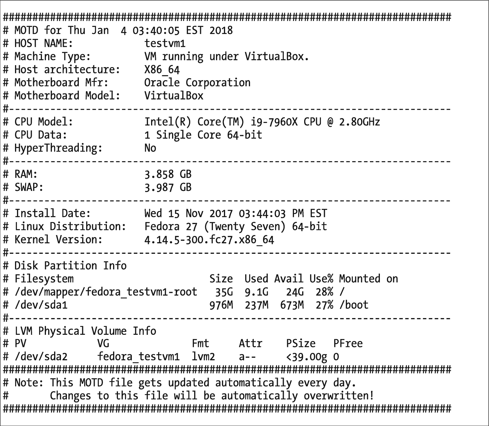
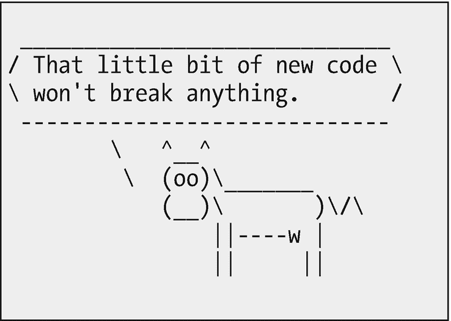

# 十一、尽早测试，经常测试

你知道，我差点忘了包括这一章。忘记测试我编写的程序就像忽略测试程序本身一样容易。

这是为什么呢？

我希望我有一个明确的答案。在某些方面，它类似于文档。一旦程序看起来工作了，我们只想继续做最初让我们写这个程序的任务。

> 总会多一个 bug。
> 
> —卢巴尔斯基的控制论昆虫学定律

不管卢巴斯基是谁，他都是正确的。我们永远也找不到代码中的所有 bug。对于我发现的每一个，似乎总会有另一个突然出现，通常是在非常不合时宜的时候。

在第 [10](10.html) 章，“总是使用 Shell 脚本”，我们开始谈论测试和我用于测试的过程。本章更详细地介绍了测试。您将了解测试如何影响系统管理员所做的许多任务的最终结果。你还会学到测试是哲学的一个组成部分。

然而，测试不仅仅是关于程序。这也是为了验证我们应该已经解决的问题——无论是由硬件、软件还是用户似乎永无止境的破坏方式引起的——实际上已经解决了。这些问题可能与我们编写的应用或实用软件、系统软件、应用和硬件有关。同样重要的是，测试也要确保代码易于使用，界面对用户有意义。

## 程序

我之前的一份工作是在思科公司做基于 Linux 的设备测试员。我开发测试计划，编写 Tcl/Expect 代码来实现测试计划，并帮助跟踪失败的根本原因。我喜欢那份工作，从中学到了很多东西。

我在第 [10](10.html) 章中简单地提到了测试，但是这里有必要提供更多关于我的程序的细节。在编写和测试 shell 脚本时，遵循定义良好的过程有助于获得一致和高质量的结果。我的程序很简单。

1.  创建测试计划，至少是简单的测试计划。

2.  在开发之初就开始测试。

3.  当代码完成时，执行最终测试。

4.  转向生产并进行更多测试。

### 创建测试计划

测试是一项艰苦的工作，它需要一个基于需求陈述的设计良好的测试计划。不管情况如何，从测试计划开始。甚至一个非常基本的测试计划也提供了一些保证，测试将是一致的，并且覆盖代码的所需功能。

任何好的计划都包括测试来验证代码做了它应该做的一切。也就是说，如果你输入 X 并点击按钮 Y，你应该得到结果 Z。因此，您编写一个测试来创建这些条件，然后验证 Z 是结果。

最好的计划包括测试来确定代码失败的程度。当我在 1982 年得到我的第一台 IBM 个人电脑时，我艰难地发现了这一点。

PC 在 1981 年 8 月刚刚发布，员工购买直到 1982 年初才开始。没有太多的项目，尤其是针对孩子的。我想给我的小儿子介绍个人电脑，但是找不到合适的，所以我用 BASIC 写了一个小程序，我想他会喜欢的。坦白地说，我甚至不记得它应该做什么。

我用我能想到的所有方法测试了那个程序。它做了它应该做的一切。然后我把电脑交给儿子，走出房间。我还没走多远，他就喊道:“爸爸！它应该这样做吗？”不是的。我问他做了什么，他描述了一些非常奇怪的按键，我说，“你不应该这样做，”并立即意识到这对他来说是多么愚蠢。

我的问题是我没有测试过程序对意外输入的反应。这似乎是所有程序的一个共同问题。但是我永远不会忘记那个特殊的教训。因此，我总是试图包含测试意外输入的代码，然后我测试以确保程序检测到它并正常失败。

测试计划有许多不同的格式。我处理过所有的问题，从在脑子里记下所有的内容，到在一张纸上记下一些笔记，再到一组复杂的表格，这些表格需要对每个测试进行完整的描述，测试哪些功能代码，测试要完成什么，以及输入和结果应该是什么。

作为一个曾经是但现在不是测试人员的系统管理员，我试图采取中间立场。至少有一个简短的书面测试计划将确保从一个测试运行到下一个测试运行的一致性。您需要多少细节取决于您的开发和测试过程的正式程度。

#### 测试计划内容

我使用 Google 找到的所有样本测试计划文档都很复杂，并且是为具有非常正式的开发和测试过程的大型组织设计的。虽然这些测试计划对那些职位名称中带有“测试”的人来说是好的，但是它们真的不适用于系统管理员和我们更加混乱和快速的依赖于时间的工作环境。正如我们工作的大多数其他方面一样，我们需要有创造力。因此，这里有一个简短的列表，列出了您想要考虑包含在您的测试计划中的事情。修改它以适合你的需要。

*   被测试软件的名称和简短描述。

*   待测试软件特性描述。

*   每次测试的开始条件。

*   每次测试应遵循的程序。

*   对每项测试的预期结果的描述。

*   包括为测试负面结果而设计的特定测试。

*   测试程序如何处理意外输入。

*   对每项测试的通过或失败的清晰描述。

*   模糊测试，将在下面描述。

这个简短的列表应该给你一些创建你自己的测试计划的想法。对于大多数系统管理员来说，这应该保持简单和相当不正式。

### 从头开始测试

我总是在完成可执行的第一部分后就开始测试我的 shell 脚本。无论我是在编写一个简短的命令行程序还是一个可执行文件的脚本，都是如此。

我通常用 shell 脚本模板开始创建新程序，您在实验 10-2 中已经有机会探索过了。我编写帮助过程的代码并测试它。这通常是流程中微不足道的一部分，但它帮助我开始，并确保模板中的东西在一开始就正常工作。此时，很容易修复脚本的模板部分的问题，或者修改它以满足标准模板不能满足的特定需求。

当模板和帮助过程工作时，我继续通过添加注释来创建程序体，以记录满足程序规范所需的编程步骤。现在我开始添加代码来满足每个注释中陈述的需求。这段代码可能需要添加在模板的那个部分中初始化的变量——这现在变成了我们的 shell 脚本。

在这里，测试不仅仅是输入数据和验证结果。这需要一点额外的工作。有时，我会添加一个命令，简单地打印我刚刚编写的代码的中间结果，并进行验证。其他时候，对于更复杂的脚本，我会为“测试模式”添加-t 选项在这种情况下，只有在命令行输入-t 选项时，才会执行内部测试代码。

### 最终测试

代码完成后，我使用已知的输入产生特定的输出，对所有特性和功能进行完整的测试。我还测试了一些随机输入，看看程序现在是否可以处理意外的输入。

最终测试的目的是验证程序现在已经完成，基本上按预期运行。最终测试的很大一部分是为了确保在开发周期早期工作的功能没有被在周期后期添加或更改的代码破坏。

如果您在向脚本中添加新代码时一直在测试脚本，那么在最后的测试中应该不会有什么意外。错了！最终测试中总会有惊喜。一直都是。期待那些惊喜，并准备好花些时间去修复它们。如果在最终测试中没有发现任何错误，那么就没有必要进行最终测试，不是吗？

### 生产中的测试

嗯——什么？

> 直到一个程序投入生产至少六个月后，最有害的错误才会被发现。
> 
> —Troutman 的编程假设

是的，生产中的测试现在被认为是正常的和可取的。作为一名测试人员，这看起来确实是合理的。“但是等等！这很危险，”你说。我的经验是，它并不比在专用测试环境中进行广泛而严格的测试更危险。在某些情况下，没有选择，因为没有测试环境，只有生产环境。

我的一份工作就是这样，我负责维护大量为网站生成动态页面的 Perl CGI 脚本。这个庞大组织的电子邮件管理界面的整个网站都运行在一个非常陈旧的戴尔台式机系统上。那是我们的关键服务器。我有一台更旧的戴尔台式机，我可以通过它登录服务器进行编程。这两台电脑都运行早期版本的 Red Hat Linux。

我们不得不做的唯一选择是在中午的时候进行许多关键的修改，然后在生产中进行测试。那是多么有趣啊！

最终，我们获得了几个额外的旧台式机作为开发和测试环境，但在我们做到这一点之前，这是一个棘手的挑战。缺乏运行这个大型电子邮件系统的设备的部分原因是，它最初只是一个部门的小规模试点测试。随着越来越多的部门一听说这件事就要求加入，这件事迅速失去了控制。试点测试从来没有资金支持，通常幸运的是得到了另一个部门的旧的和不需要的设备。

因此，系统管理员对在生产中测试新的或修改过的脚本并不陌生。任何时候一个脚本被转移到产品中，那都成为最终的测试。生产环境本身构成了该测试最关键的部分。测试人员在测试环境中想象出来的任何东西都不能完全复制真实的生产环境。

所谓的生产中测试的新实践只是对我们系统管理员一直以来所知道的事情的认识。最好的测试是生产——只要它不是唯一的测试。

最终测试之后，程序可以进入生产阶段。生产本身总是一个考验。在隔离的开发和测试环境中编写代码并不能代表真实生产环境中遇到的情况。

无论脚本写得多好，测试得多好，总会有新的 bug 出现在产品中。正如 Troutman 的假设所说，最有害的错误在程序投入生产后的相当长一段时间内不会被发现，并且每个人都认为结果总是正确的。最有害的错误不是那些导致程序崩溃的错误；他们是悄悄导致不正确结果的人。

继续检查脚本产生的结果，即使它已经投入生产。寻找下一个 bug，你最终会找到的。

## 模糊测试

这是我第一次听到时引起我翻白眼的又一个流行语。我了解到它的本质含义很简单——让某人敲击键盘，直到某件事情发生，然后看看程序处理得如何。但是实际上不止如此。

模糊测试有点像我儿子用他的随机输入在不到一分钟的时间里破坏了我的代码。大多数测试计划利用非常具体的输入来生成具体的结果或输出。不管测试是正面的还是负面的成功结果，它仍然是受控的，并且输入和结果是指定的和预期的，例如针对特定故障模式的特定错误消息。

模糊测试是关于处理测试所有方面的随机性，例如开始条件、非常随机和意外的输入、选择的选项的随机组合、低内存、与其他程序的高水平 CPU 争用、测试中程序的多个实例，以及您能想到的应用于测试的任何其他随机条件。

我试着从一开始就做一些模糊测试。如果 bash 脚本不能在早期阶段处理显著的随机性，那么随着我们添加更多的代码，它也不可能变得更好。这也是捕捉这些问题并在代码相对简单时修复它们的好时机。在完成的每个阶段进行一点模糊测试也有助于在问题被更多代码掩盖之前找到问题。

代码完成后，我喜欢做一些更广泛的模糊测试。总是做一些模糊测试。我确实对我遇到的一些结果感到惊讶。测试预期的事情很容易，但是用户通常不会用脚本做预期的事情。

## 自动化测试

测试可以是自动化的，但是我们作为系统管理员所做的大部分工作都有内在的时间压力，不允许花时间编写代码来测试我们的代码。这些压力是我们写的大多数代码又快又脏的原因。所以我们匆忙地编写代码并测试它。

使用像 Tcl/Expect 这样的工具为我们的 shell 脚本编写一个复杂的测试套件是可能的。作为一名系统管理员，我从来没有时间做那么正式的事情。作为一名系统管理员，我做过的最自动化的事情就是编写一个非常短的脚本，通过一组命令来验证测试脚本的一些关键方面。大多数时候，我在程序完成的每一步都进行手工测试。使用 bash 历史可以作为一种合理的替代，并且至少提供一些半自动测试。

我在思科担任测试人员时，使用 Tcl/Expect 编写了很多测试。我的任务是编写将被之前编写的测试床调用的模块。我编写的 Tcl/Expect 代码本来可以作为独立的测试运行，但是测试平台提供了一个框架，该框架聚合了来自各个测试的所有结果，并生成了一组很好的报告，使我们能够看到我们在将错误修复应用于代码方面取得了多大的进展。

有许多商业测试套件可用。许多都非常昂贵，并不特别适合系统管理员使用，因为学习它们需要付出努力，准备测试也需要时间。

编写 Tcl/Expect 程序非常耗时，但在开发大型代码库时，它会非常有用。我最喜欢的 Tcl/Expect 的书是 *Exploring Expect* 、<sup>T3】1T5】，里面包含了大量关于 Tcl 的信息。维基百科上有一篇关于软件测试的优秀文章，有很多更深入的链接。</sup>

## 尝试一下

在实验 10-2 中，你对 shell 脚本模板的副本做了一些修改。在该实验的每一步，您都测试了所做更改的结果，因此您已经熟悉了基本的 SysAdmin 开发过程。本章中的实验将使用该过程来开发和测试一个程序，该程序将列出一些关于您的 Linux 主机的有趣信息和统计数据。最后，我们将会有一个经过充分测试的相当长的脚本。该脚本的典型输出如图 [11-1](#Fig1) 所示。



图 11-1

由您将在本章的实验中创建的 shell 脚本生成的 MOTD 示例

我将这个脚本作为 cron 作业运行，每天生成一个报告，并存储为/etc/motd，这是当天消息文件。每当有人使用远程终端或虚拟控制台登录时，就会显示 MOTD。

在我们开始编码之前，我们需要首先创建一组需求，然后创建一个简单的测试计划。

### MOTD 脚本的要求

一组简单的要求将有助于我们设计程序，并针对我们希望包含的特定功能提供帮助。这些要求应该工作得很好，但要为创造性留有余地。

*   所有的输出都发送到 STDOUT 和 STDERR，以便根据需要进行重定向。

*   提供打印脚本发布版本的选项。

*   以令人满意的格式打印下列数据。
    *   带有当前日期的标题

    *   主机名

    *   机器类型–虚拟机或物理机

    *   主机硬件架构 X86_64 或 i386

    *   主板供应商和型号

    *   CPU 型号和超线程状态

    *   内存容量(GB)

    *   交换空间的大小(GB)

    *   Linux 的安装日期

    *   Linux 发行版

    *   内核版本

    *   磁盘分区信息

    *   LVM 物理卷信息

*   包括描述代码的注释。

*   应该不需要选项来产生期望的输出。

这似乎是一个很长的列表，但是与我看到的一些需求集相比，这是相当短的。我根据一组类似的需求创建了最初的 bash 脚本。我们在第 [10](10.html) 章“总是使用脚本”中创建的脚本模板已经有了可以帮助满足这些需求的代码。

有人可能对这个列表的唯一问题是“取悦”这个词。谁知道对于使用这个脚本的人来说，什么是令人愉快的，什么是令人不愉快的。所以对于这个实验来说，取悦将是我所说的。在其他环境中，可能需要许多页的需求来定义输出的显式格式。在 SysAdmin 环境中，取悦通常是对我们或任何要求编写程序的人有用的。

### MOTD 脚本的测试计划

我们的测试计划简单明了。

*   验证 help (-h)选项显示了正确的帮助信息。

*   验证 GPL (-g)选项显示 GPL 许可证声明。

*   验证要求中规定的所有输出数据均已生成。

*   验证执行测试的系统的所有打印输出是否正确。

*   通过与其他来源进行比较，验证数字输出的值是否正确。由于任何正在运行的计算机的动态性质，这些数字中的一些可能会在运行之间以及与其他来源进行比较时发生变化，但是它们应该相当接近。

*   确保不正确的选项选择会产生相应的错误代码。

*   如果可能，在多个系统上进行测试，包括物理硬件和虚拟机，以验证不同条件下的正确结果。包括英特尔、AMD 以及 ARM 硬件。

*   如果可能的话，用多个 Linux 发行版进行测试。

这个简单的测试计划是我们在测试脚本时需要知道的一切。我们知道需要检查的输出，因为它们是在程序需求中定义的。

最后两项在学习环境中可能是不可能的，但它总是需要考虑的。不同的环境应该用这个脚本产生不同的结果。在我们实际的开发/测试环境之外进行测试有助于确保其他环境的逻辑和结果是准确的。生产中的测试可以帮助解决这个问题。

### 开发脚本

记住，对于系统管理员来说，开发也意味着测试。由于创建完整的脚本需要大量的工作，我将它分成了一系列的实验，在这些实验中，每个实验将开发和测试一段代码来满足部分或全部特定需求。

### 注意

如果您不清楚一些命令是如何工作的，尤其是管道的各个阶段是做什么的，您应该研究一下它们。首先查看管道中每个命令的手册页，了解它的作用。然后构建管道——一次一个命令阶段，以查看结果。当我刚开始做系统管理员的时候，这对于我理解看起来复杂的代码非常有帮助。我仍然依赖这种方法来帮助我理解一些代码是如何工作的。

#### 基础知识

让我们从基础开始——从修改后的模板复制脚本，在内部更改脚本名称，添加简短描述，并更改帮助过程以匹配我们程序的功能。

### 实验 11-1

使用 mymotd 的新名称制作 test1.sh 的副本。您可以以 root 用户或学生用户的身份编辑这个新脚本 mymotd，但是在测试时它必须以 root 用户的身份运行。我建议以非 root 用户的身份编辑 shell 脚本。打开两个终端会话并 su–root 其中一个会话。在终端会话中，以用户 student 的身份在您最喜欢的编辑器中打开 mymotd 脚本。

在我们编辑脚本时，请务必经常保存您的工作。

首先，让我们更改标题注释中的脚本名称，并添加脚本的简短描述。结果应该是这样的。

```sh
#!/bin/bash
###########################################################################
#                                 mymotd                                  #
#                                                                         #
# This bash shell extracts various interesting bits of information about  #
# the Linux host and the operating system itself. It prints this data to  #
# STDOUT in a nice looking format. The results can also be redirected to  #
# the/etc/motd file to create an informational message of the day.        #
#                                                                         #
# Change History                                                          #
# 01/08/2018  David Both    Original code.                                #
#                                                                         #
#                                                                         #
###########################################################################

```

请确保将更改历史记录中的第一行设置为当前日期和您的姓名。

接下来，让我们学习帮助程序。这里所需要的只是添加一个简短的描述、一行描述命令语法的文字和一个可能选项的列表。

```sh
########################################################################
# Help                                                                 #
########################################################################
Help()
{
   # Display Help
   echo "                  mymotd"
   echo "Generate an MOTD that contains information about the system"
   echo " hardware and the installed version of Linux."
   echo
   echo "Syntax:  mymotd [-g|h|v|V]"
   echo "options:"
   echo "g     Print the GPL license notification."
   echo "h     Print this Help."
   echo "v     Verbose mode."
   echo "V     Print software version and exit."
   echo
}

```

让我们进行第一次测试。在作为 root 的终端会话中，将/home/student 设为 PWD，这是新代码所在的位置。现在，每次运行时使用三个选项之一来运行程序；-h 测试帮助工具，-g 测试打印 GPL 语句，-x 测试无效选项。

```sh
[root@testvm1 student]# ./mymotd -h
                  mymotd
Generate an MOTD that contains information about the system
 hardware and the installed version of Linux.

Syntax:  mymotd [-g|h|v|V]
options:
g     Print the GPL license notification.
h     Print this Help.
v     Verbose mode.
V     Print software version and exit.

[root@testvm1 student]# ./mymotd -g

#############################################################################
#  Copyright (C) 2007, 2016  David Both                                      #
#  Millennium Technology Consulting LLC                                      #
#  http://www.millennium-technology.com                                      #
#                                                                            #
#  This program is free software; you can redistribute it and/or modify      #
#  it under the terms of the GNU General Public License as published by      #
#  the Free Software Foundation; either version 2 of the License, or         #
#  (at your option) any later version.                                       #
#                                                                            #
#  This program is distributed in the hope that it will be useful,           #
#  but WITHOUT ANY WARRANTY; without even the implied warranty of            #
#  MERCHANTABILITY or FITNESS FOR A PARTICULAR PURPOSE.  See the             #
#  GNU General Public License for more details.                              #
#                                                                            #
#  You should have received a copy of the GNU General Public License         #
#  along with this program; if not, write to the Free Software               #
#  Foundation, Inc., 59 Temple Place, Suite 330, Boston, MA  02111-1307  USA #
##############################################################################

[root@testvm1 student]# ./mymotd -x
ERROR: Invalid option
                  mymotd
Generate an MOTD that contains information about the system
 hardware and the installed version of Linux.

Syntax: Syntax:  mymotd [-g|h|v|V]
options:
g     Print the GPL license notification.
h     Print this Help.
v     Verbose mode.
V     Print software version and exit.

Program terminated with error ID 10T

```

如果你还能想到任何需要执行的测试，比如模糊测试，现在就去做吧。如果您在测试时发现任何问题，现在就修复它们，然后再次测试。

### 添加健全性检查

在第 [10](10.html) 章中，我们注释掉了健全性检查，以确保脚本由 root 运行，因此我们需要恢复它。我们还将添加一项检查，以确保脚本在 Linux 主机上运行。作为一个 bash 脚本，它可以与各种 Unix 系统兼容，但是一些特定于 Linux 的功能会失败。

### 实验 11-2

首先从根检查中移除注释散列。现在看起来像这样。

```sh
#---------------------------------------------------------------------------
# Check for root.

if [ `id -u` != 0 ]
then
   echo ""
   echo "You must be root user to run this program"
   echo ""
   Quit 1
fi

```

现在做两个快速测试。以 root 用户身份运行程序，以确保 root 用户仍然可以使用该程序。

```sh
[root@testvm1 student]# ./mymotd
        total       used        free      shared  buff/cache   available
Mem:  4046060     254392     2947324         984      844344     3532200
Swap:  4182012         0     4182012

```

以学生用户的身份运行程序，验证非根用户是否收到错误。

```sh
[student@testvm1 ~]$ ./mymotd

You must be root user to run this program

```

如果您发现任何错误，请在我们继续之前修复它们。

让我们添加第二个健全性检查，以确保这个程序在 Linux 系统上运行。该测试使用`uname`命令返回操作系统名称。

在检查 root 用户的代码下面添加以下代码。

```sh
#---------------------------------------------------------------------------
# Check for Linux

if [[ "$(uname -s)" != "Linux" ]]
then
   echo ""
   echo "This script runs on Linux only -- OS detected: $(uname -s)."
   echo ""
   Quit 1
fi
#---------------------------------------------------------------------------

```

我们只能测试积极的结果——也就是说，我们在 Linux 上运行——而不能测试消极的结果，除非我们在非 Linux 主机上测试。但至少让我们做阳性测试。只需运行该命令并验证您没有得到任何错误。

#### 版本号

所有程序都应该有一个版本号。这个脚本已经有一个指定版本号的变量，但是它是脚本模板的版本，而不是我们正在工作的新程序的版本。让我们设置我们的版本号。由于这是在开发过程的早期，它不会是一个完整的版本级别。

我喜欢用三个两位数的部分来表示我的版本号，以保证灵活性。所以让我们从版本 00.01.00 开始，因为它表示代码远未准备好。随着我们越来越接近释放到野外，这个数字将上升，第一次完全释放将是 01.00.00。

### 实验 11-3

首先在代码的变量部分设置版本号。让我们也删除这个部分中的 RC(返回代码)行。这就是我们目前在变量部分所拥有的，但是当我们在本章的其余实验中进行时，更多的变量将被添加到这里。



```sh
# Set initial variables
badoption=0
error=0
verbose=0
Version=00.01.00

```

现在我们甚至测试这一点点新代码，尽管它看起来简单无害。

```sh
[root@testvm1 student]# ./mymotd -V
Version = 00.01.00

```

但是您还没有真正完成测试。您应该对以前编码的函数做一些额外的测试，以确保它们没有被新代码破坏。

至此，基础工作已经完成。我们有一个显示帮助、GNU 许可证声明、执行一些健全性检查和显示版本号的部分脚本。我们不需要向 case 语句添加任何选项，因为我们需要的一切都已经存在了。

#### 主体

现在我们可以添加代码的主体来收集我们想要的数据并显示出来。我们将按照所需的顺序收集数据，并在进行过程中将其打印到 STDOUT。这将使早期测试变得容易。

### 实验 11-4

首先，删除我们用来从脚本中提供一些输出的`free`命令。

现在让我们给程序添加一些代码。在程序主体中，在`Quit`函数调用之前，添加执行这些函数的代码。我们还添加了一些代码来打印我们收集的数据。这提供了一个简单的测试，同时也产生了预期的结果。

这段代码现在看起来像这样。

```sh
########################################################################
########################################################################
# The main body of your program goes here.
########################################################################
########################################################################
# Get the date
Date=`date`
# Get the hostname
host=`hostname`
########################################################################
# Start printing the data using printf to make it pretty               #
########################################################################
printf "#############################################################\n"
printf "# MOTD for $Date\n"
printf "# HOST NAME: \t\t$host \n"

```

在 printf 语句中，\t 在输出中插入一个制表符，\n 是一个换行符。当我第一次编写这个脚本的时候，我花了一段时间来正确格式化整个输出。你有我的知识优势，这是我先做的。

将以下变量添加到初始化部分。

```sh
host=""
Date=""

```

现在让我们运行程序来测试这些结果。

```sh
[root@testvm1 student]# ./mymotd
########################################################################
# MOTD for Sat Jan 13 12:14:34 EST 2018
# HOST NAME:            testvm1

```

这对于我的虚拟机主机来说看起来是正确的。因此，在五行活动代码中——不包括注释行——我们已经开始编写和测试我们的脚本。

到目前为止，代码非常适合这样的开发/测试周期。我们添加代码来获取一些数据，并添加一些代码来打印这些数据。事情会变得更加复杂。

### 实验 11-5

现在，我们想要添加一些代码来确定主机是物理机还是虚拟机，并且我们还想要一些关于主板的信息。我们需要这样做的 Linux 命令`dmidecode`并不总是被安装，所以我们需要确保它存在于我们的主机上。最简单的方法就是尝试安装它。如果不存在，它将被安装。以 root 用户身份执行此操作。

```sh
[root@testvm1 ~]# dnf install -y dmidecode

```

dmidecode 实用程序(其中 dmi 代表桌面管理界面)可以访问由系统管理 BIOS (SMBIOS)维护的硬件数据表。例如，使用以下命令检索有关主板的数据。“-t”表示“类型”，类型 2 是主板。dmidecode 手册页列出了所有可用的数据类型。

```sh
[root@david ~]# dmidecode -t 2
# dmidecode 3.1
Getting SMBIOS data from sysfs.
SMBIOS 3.0.0 present.

Handle 0x0002, DMI type 2, 15 bytes
Base Board Information
        Manufacturer: ASUSTeK COMPUTER INC.
        Product Name: TUF X299 MARK 2
        Version: Rev 1.xx
        Serial Number: 170807951700403
        Asset Tag: Default string
        Features:
                Board is a hosting board
                Board is replaceable
        Location In Chassis: Default string
        Chassis Handle: 0x0003
        Type: Motherboard
        Contained Object Handles: 0

```

上面 dmidecode 命令的结果来自我的主工作站，而不是测试虚拟机。

注意这个 mymotd 脚本是为 Intel 处理器和 Fedora Linux 编写的。它可以与其他芯片和发行版一起工作，但是某些代码部分的结果可能不正确。您可能想自己做一些实验，让这些部分在您的环境中工作。

现在我们已经安装了 dmidecode 工具，我们可以继续添加到我们的程序中。首先，我们想知道主机是虚拟机还是物理机。

### 实验 11-6

现在让我们添加一些代码来告诉我们主机是否是 VM 的物理机器。我们为此需要的信息是每次引导时启动的 dmesg 日志缓冲区的一部分。我们只需要搜索适当的文本字符串。将下面的代码添加到上一个实验的日期和主机名之后。

```sh
########################################################################
# Is this a VirtualBox, VMWare, or Physical Machine.                   #
########################################################################
if dmesg | grep -i "VBOX HARDDISK" > /dev/null
then
   MachineType="VM running under VirtualBox."
elif dmesg | grep -i "vmware" > /dev/null
then
   MachineType="VM running under VMWare."
else
   MachineType="physical machine."
fi
printf "# Machine Type: \t$MachineType\n"

```

将 MachineType 变量添加到脚本的变量部分。然后测试这个新代码。

```sh
[root@testvm1 student]# ./mymotd
#######################################################################
# MOTD for Sun Jan 14 09:49:29 EST 2018
# HOST NAME:            testvm1
# Machine Type:         VM running under VirtualBox.

```

这对于我的测试虚拟机来说也是正确的。您的结果可能不同。

了解主机的体系结构，即它是 32 位还是 64 位的，通常会有所帮助。下一个实验添加了一些代码来确定这一点。

### 实验 11-7

添加以下三行代码，确定主机的架构是 32 位还是 64 位。

```sh
# Get the host physical architecture
HostArch=`echo $HOSTTYPE | tr [:lower:] [:upper:]`
printf "# Host architecture: \t$HostArch\n"

```

将 HostArch 添加到变量部分并进行测试。

```sh
[root@testvm1 student]# ./mymotd
#######################################################################
# MOTD for Sun Jan 14 10:43:05 EST 2018
# HOST NAME:            testvm1
# Machine Type:         VM running under VirtualBox.
# Host architecture:    X86_64

```

这表明我们的虚拟机是 64 位的，这是正确的。如今大多数主机都是 64 位的，只有少数 32 位的还在，比如我的华硕 EeePC。然而，一些小型的单板计算机(SBC)仍然是 32 位的。

即使在虚拟机中，主板信息也很有趣，所以现在让我们来获取这些数据。不用拆开电脑就能获得这些信息的能力非常有用。

### 实验 11-8

以下代码添加在主机架构代码之后，并使用 dmidecode 提取有关主板的信息。

```sh
########################################################################
# Get the motherboard information                                      #
########################################################################
MotherboardMfr=`dmidecode -t 2 | grep Manufacturer | awk -F: '{print $2}' | sed -e "s/^ //"`
MotherboardModel=`dmidecode -t 2 | grep Name | awk -F: '{print $2}' | sed -e "s/^ //"`
printf "# Motherboard Mfr: \t$MotherboardMfr\n"
printf "# Motherboard Model: \t$MotherboardModel\n"
printf "#------------------------------------------------------------\n"

```

注意，获得主板信息的代码行都包含在上面的清单中。请确保在一行中输入它们。我还添加了一行来打印分隔符，以便将其与下一部分数据分开。

将两个新变量添加到变量初始化部分。

```sh
MotherboardMfr=""
MotherboardModel=""

```

现在测试程序以验证结果。

```sh
[root@testvm1 student]# ./mymotd
#######################################################################
# MOTD for Sun Jan 14 10:57:05 EST 2018
# HOST NAME:            testvm1
# Machine Type:         VM running under VirtualBox.
# Host architecture:    X86_64
# Motherboard Mfr:      Oracle Corporation
# Motherboard Model:    VirtualBox
#----------------------------------------------------------------------

```

结果的第一部分对虚拟机来说非常好，非常正确。它看起来很好，容易阅读。

至此，我们已经提取并打印了一些关于主机的一般信息。现在我们想添加一个部分，向我们展示一些关于 CPU 本身的信息。这些信息大部分位于/proc 文件系统中。很多时候它不能作为一个单一的、格式良好的数据点，所以我们需要使用我们的 Linux 工具来提取我们想要的东西并适当地格式化它。

### 实验 11-9

我们从/proc 文件系统中获取 CPU 型号信息开始获取 CPU 信息。这几行代码就是这样做的，所以将它们添加到程序的末尾，正好在`Quit`函数调用的上面。

```sh
########################################################################
# Get the CPU information                                              #
########################################################################
# Starting with the specific hardware model
CPUModel=`grep "^model name" /proc/cpuinfo | head -n 1 | cut -d : -f 2 | sed -e "s/^ //"`CPUModel
printf "# CPU Model:\t\t$CPUModel\n"

```

给 CPUModel 变量赋值的那一行是换行的，所以一定要在程序中的一行中输入。将 CPUModel 变量添加到 variables 部分并进行测试。

```sh
[root@testvm1 student]# ./mymotd
#######################################################################
# MOTD for Sun Jan 14 15:54:24 EST 2018
# HOST NAME:            testvm1
# Machine Type:         VM running under VirtualBox.
# Host architecture:    X86_64
# Motherboard Mfr:      Oracle Corporation
# Motherboard Model:    VirtualBox
#----------------------------------------------------------------------
# CPU Model:            Intel(R) Core(TM) i9-7960X CPU @ 2.80GHz

```

我们代码的这个最新添加产生了关于我们系统中安装的 CPU 的良好信息。

让我们找到一些额外的 CPU 信息，例如 CPU 的数量和封装信息——每个芯片有多少个内核——以及我们是否有超线程技术。

### 实验 11-10

该实验收集了一些 CPU 数据，然后对 CPU 的封装方式以及 CPU 是否能够超线程进行了一些有根据的判断。

首先，让我们在初始化部分添加一些新变量。

```sh
PhysicalChips=0
Siblings=0
HyperThreading="No"
CPUSpeed=""
NumCores=0
Package=0
Arch=""
CPUdata=""
CPUArch=""

```

这里有很多代码，因为它们都是相关的，并且需要完整的测试才能成功。进入时要小心。特别要注意下面清单中的代码行。

```sh
#############################################################################
# Get some CPU details.                                                     #
#############################################################################
# Get number of actual physical chips
PhysicalChips=`grep "^physical id" /proc/cpuinfo | sort | uniq | wc | awk '{print $1}'`
if [ $PhysicalChips -eq 0 ]
then
   let PhysicalChips=1
fi
# Get the total number of cores
CPUs=`cat /proc/cpuinfo | grep "cpu cores" | head -n 1 | cut -d : -f 2 | sed -e "s/^ //"`

# Do we have HyperThreading
Siblings=`grep "^siblings" /proc/cpuinfo | head -n 1 | cut -d : -f 2 | sed -e "s/^ //"`
if [ $Siblings -gt $CPUs ]
then
   # Yes we have HyperThreading
   HyperThreading="Yes"
fi

# Now Cores per CPU
# We are assuming each package has the same number of cores – the next line is wrapped
NumCores=`grep "^cpu cores" /proc/cpuinfo | sort | uniq | awk -F: '{print $2}' | sed -e "s/^ //"`
case "$NumCores" in
   1) Package="Single Core";;
   2) Package="Dual Core";;
   4) Package="Quad Core";;
   6) Package="Six Core";;
   8) Package="Eight Core";;
  12) Package="Twelve Core";;
  16) Package="Sixteen Core";;
  18) Package="Eighteen Core";;
  20) Package="Twenty Core";;
  24) Package="Twenty-four Core";;
  26) Package="Twenty-six Core";;
  28) Package="Twenty-eight Core";;
  30) Package="Thirty Core";;
  32) Package="Thirty-two Core";;
   *) Package="Single Core"
      NumCores=1;;
esac

# Get the CPU architecture which can be different from the host architecture
CPUArch=`arch`
# Now lets put some of this together to make printing easy
CPUdata="$PhysicalChips $Package $CPUArch"

# Get the CPU speed – The next line is wrapped
CPUSpeed=`grep "model name" /proc/cpuinfo | sed -e 's/.*\( [0-9]*.[0-9]*[GM]Hz\)/\1/' -e 's/^ *//g' | uniq`
# Let's print what we have
printf "# CPU Data:\t\t$CPUdata\n"
printf "# HyperThreading:\t$HyperThreading\n"
printf "#-----------------------------------------------------------------\n"

```

输入代码时，请务必仔细检查。然后我们再次测试。

```sh
[root@david development]# ./mymotd
#######################################################################
# MOTD for Mon Jan 15 15:35:09 EST 2018
# HOST NAME:            david
# Machine Type:         physical machine.
# Host architecture:    X86_64
# Motherboard Mfr:      ASUSTeK COMPUTER INC.
# Motherboard Model:    TUF X299 MARK 2
#----------------------------------------------------------------------
# CPU Model:            Intel(R) Core(TM) i9-7960X CPU @ 2.80GHz
# CPU Data:             1 Sixteen Core x86_64
# HyperThreading:       Yes
#----------------------------------------------------------------------

```

我们的前两部分已经完成。下一节详细介绍系统内存要简单一些。

### 实验 11-11

这个实验添加代码来显示一些内存统计数据。这里我们再次使用现成的资源。

/proc/meminfo 文件有我们需要的数据，但它是以 KB 为单位的，为了清楚起见，我们希望它以 GB 为单位。为此，我们将以下过程添加到脚本的过程部分。Bash 没有像样的数学能力，所以这段代码使用 bc calculator 命令，它有自己独特的语法。

```sh
########################################################################
# Convert KB to GB                                                     #
########################################################################
kb2gb()
{
   # Convert KBytes to Giga using 1024
   # first convert the input to MB
   echo "scale=3;$number/1024/1024" | bc
}

```

下面的代码应该添加在脚本末尾的最后一个退出过程调用之前，它从/proc/meminfo 文件中获取数据，然后将数字转换为 GB。然后打印结果。

```sh
############################################################################
# Memory and Swap data                                                     #
############################################################################
# Get memory size in KB.
number=`grep MemTotal /proc/meminfo | awk '{print $2}'`
# Convert to GB
mem=`kb2gb`
# Get swap size in KB
number=`grep SwapTotal /proc/meminfo | awk '{print $2}'`
# Convert to GB
swap=`kb2gb`

printf "# RAM:\t\t\t$mem GB\n"
printf "# SWAP:\t\t\t$swap GB\n"
printf "#-----------------------------------------------------------------\n"

```

我们需要在变量部分添加新的变量。

```sh
number=0
mem=0
swap=0

```

现在又到了考验的时候了。

```sh
[root@david development]# ./mymotd
#######################################################################
# MOTD for Mon Jan 15 21:56:40 EST 2018
# HOST NAME:            david
# Machine Type:         physical machine.
# Host architecture:    X86_64
# Motherboard Mfr:      ASUSTeK COMPUTER INC.
# Motherboard Model:    TUF X299 MARK 2
#----------------------------------------------------------------------
# CPU Model:            Intel(R) Core(TM) i9-7960X CPU @ 2.80GHz
# CPU Data:             1 Sixteen Core x86_64
# HyperThreading:       Yes
#----------------------------------------------------------------------
# RAM:                  62.586 GB
# SWAP:                 14.902 GB
#----------------------------------------------------------------------

```

在 testvm1 主机上，测试结果如下所示。

```sh
[root@testvm1 student]# ./mymotd
#######################################################################
# MOTD for Mon Jan 15 21:57:32 EST 2018
# HOST NAME:            testvm1
# Machine Type:         VM running under VirtualBox.
# Host architecture:    X86_64
# Motherboard Mfr:      Oracle Corporation
# Motherboard Model:    VirtualBox
#----------------------------------------------------------------------
# CPU Model:            Intel(R) Core(TM) i9-7960X CPU @ 2.80GHz
# CPU Data:             1 Quad Core x86_64
# HyperThreading:       No
#----------------------------------------------------------------------
# RAM:                  3.854 GB
# SWAP:                 7.999 GB
#----------------------------------------------------------------------

```

如果您有其他要测试的主机，您应该这样做来验证结果对于其他情况是否正确。

虽然根据我在本章开始时为它创建的需求集，这个脚本还没有完成，但我认为我们已经走得足够远了，你可以自己完成了。所以，我把这个脚本的完成作为一个练习留给你们，全世界的系统管理员。

如果您喜欢这段代码，但是需要一些额外的指导，或者只是不关心如何完成它，那么可以从以下网址下载这段 bash 脚本的完整代码:

[T2`https://github.com/Apress/linux-philo-sysadmins/tree/master/Ch11`](https://github.com/Apress/linux-philo-sysadmins/tree/master/Ch11)

无论您选择哪种方法，您都可以随意修改这些代码，以满足自己的需求。

## 修复脚本

很多时候我们需要修复现有的脚本。我最近写的一个剧本出了点问题。幸运的是，在造成任何损害之前，我就意识到了这个问题。正如您在 mymotd 脚本中看到的，我喜欢提供适量的注释来帮助我在以后解决问题。如果我不必在每次需要修改代码以修复它或添加新功能时都确定代码是如何工作的，这就容易多了。

正如我在本章的“生产测试”一节中提到的，有时候修改一个脚本需要从最基础的开始。在这种情况下，我添加了注释，使代码更容易阅读，并解决了我遇到的任何明显的错误。由于前面提到的情况，我们仅有的环境就是生产。每当我对代码进行哪怕是很小的修改时，我都必须进行测试，以确保修改按预期进行，并且没有任何可能依赖于修改后的代码的东西被破坏。

在最近的一个案例中，是我自己的注释相当好的代码工作不太正常。在这种情况下，在 u 盘上创建了一个 MP3 文件，其文件名包含 MMDDYYYY-X 格式的日期，其中 X 是序列号。我的程序将文件的名称改为包含直接取自文件名的日期，但重新排列为 YYYYMMDD-X，然后将文件复制到服务器。如果记录设备在一天内创建了两个文件，它们具有相同的日期，但是这些文件通过序列号来区分。我的脚本旨在保持它们的顺序，这样它们就可以按照创建的顺序进行排序。

当一个文件被创建并传输，然后同一天又创建了另一个文件时，问题就出现了。它将具有与第一个文件相同的文件名，并在服务器上覆盖它。

为了解决这个问题，我决定使用文件的时间戳以 YYYYMMDD-HHMMSS 的格式创建自己的时间戳，并在新文件名中消除序列号的使用。

这个特殊的修复是一个简单的问题，做了一个小的改动，修正了我以前没有考虑到的边缘情况。测试很容易；只需创建边界条件并运行程序，同时确保当边界条件不存在时程序仍能正确运行。我手头有几个样本 MP3 文件用于测试，只需将它们复制到 USB 记忆棒即可。

## 摘要

为系统管理员测试代码很像写代码——快速且不严谨。我希望最后一点听起来比“反复无常”更好快速编写代码通常意味着快速测试代码。这并不意味着测试 shell 脚本需要随机进行。“尽早测试，经常测试”是让测试成为编码的一部分的一个很好的口号。随着这一原则的应用，测试 shell 脚本的任务变成了第二天性，并且成为了编写脚本过程中不可或缺的一部分。

我发现本章中的 mymotd 脚本是重写我的原始版本的一个很好的借口。我在 2007 年写了这个脚本，我对硬件架构和 Linux 中的报告的更好理解帮助了我这个版本。我对 Linux 工具的了解，不管是新的还是新的，都有所提高，并给了我更多的灵活性来简化这个新脚本。

请注意，变量名都是对正在执行的任务有意义的名称。查看变量名并了解它应该包含的数据类型是可能的。这也有助于简化测试。

<aside class="FootnoteSection" epub:type="footnotes">Footnotes [1](#Fn1_source)

唐·利贝斯，探索期望，奥赖利，2010 年，国际标准书号 978-1565920903

  [2](#Fn2_source)

维基百科，软件测试， [`https://en.wikipedia.org/wiki/Software_testing`](https://en.wikipedia.org/wiki/Software_testing)

 </aside>