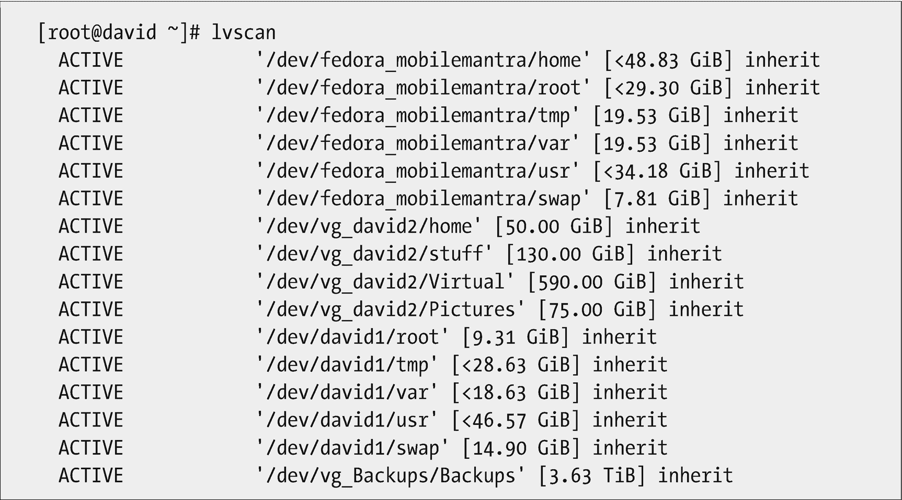
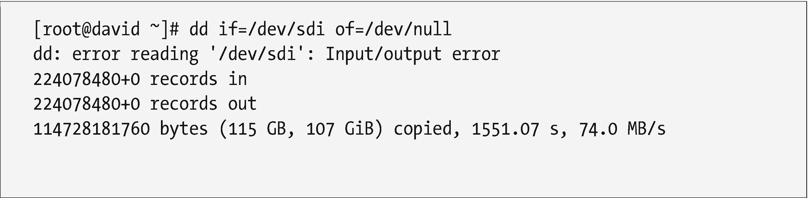
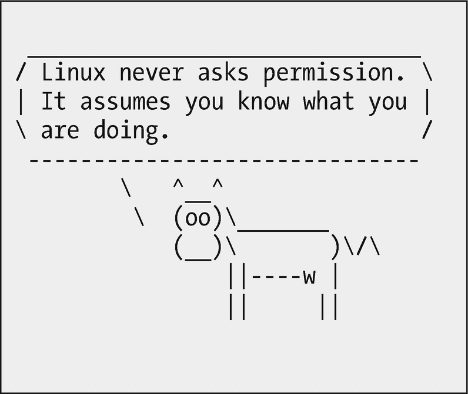

# 十四、为数据使用单独的文件系统

这个特别的原则有很多内容，它需要理解 Linux 文件系统和挂载点的本质。如果你跳过了第 6 章“使用 Linux FHS”，你现在应该回去读一读。

### 注意

本章中术语“文件系统”的主要含义是位于独立分区或逻辑卷上的目录树的一部分，该分区或逻辑卷必须安装在根文件系统的指定安装点上，以便能够对其进行访问。我们还使用这个术语来描述分区或卷上的元数据结构，如 EXT4、XFS 或其他结构。这些不同的用法应该从它们的上下文中弄清楚。

## 为什么我们需要独立的文件系统

在我们的 Linux 主机上维护独立的文件系统至少有三个很好的理由。首先，当硬盘崩溃时，我们可能会丢失损坏的文件系统上的部分或全部数据，但是，正如我们将看到的，崩溃的硬盘上的其他文件系统上的数据仍然可以挽救。

其次，尽管可以访问大量的硬盘空间，文件系统还是有可能被填满。发生这种情况时，单独的文件系统可以最大限度地减少直接影响，并使恢复更容易。

第三，当某些文件系统(如/home)位于不同的文件系统上时，升级会变得更容易。这使得升级变得容易，而不需要从备份中恢复数据。

在我的职业生涯中，我经常遇到这三种情况。在某些情况下，只有一个分区，因此恢复相当困难。当主机配置了单独的文件系统时，从这些情况中恢复总是更容易、更快。

保证所有类型数据的安全是系统管理员工作的一部分。使用单独的文件系统来存储数据可以帮助我们实现这一点。这种做法也可以帮助我们实现成为一个懒惰的管理员的目标。备份确实允许我们恢复在崩溃场景中可能丢失的大部分数据，但是使用单独的文件系统可能允许我们恢复到崩溃时刻的所有数据。从备份恢复需要更长的时间。

### 硬盘崩溃

你的电脑硬盘是否崩溃过，导致你的 Linux 电脑无法启动；崩溃的硬盘上的所有数据；没有最近的备份？我们大多数人都经历过。我们的朋友、同事或顾客也都经历过这种情况。

拥有独立的文件系统使得在某些(但不是全部)硬盘崩溃的情况下从潜在的未受影响的文件系统中恢复数据成为可能。当单个文件系统用于整个目录树时，任何类型的硬盘崩溃都极有可能导致所有数据丢失。

不幸的是，有些硬盘故障模式会导致硬盘无法正常工作，硬盘上的所有数据都会丢失。

### 完整的文件系统

尽管有大量的硬盘空间可供我们使用，文件系统还是会被填满。失控的程序会很快填满文件系统。如果只有一个文件系统，主机很可能会崩溃，许多有价值的数据将会丢失。

我见过文件系统瞬间填满。在只有一个文件系统的主机中，结果可能是灾难性的。具体症状可能各不相同，从用户无法创建新文件、保存修改过的文件或登录桌面，到主机完全无响应甚至无法通过 SSH 远程访问。在某些情况下，重新获得控制的唯一方法是关闭系统并引导至恢复模式。然后，就有可能找到并删除填充磁盘的文件，并尝试了解是什么导致了这种情况。我遇到的最糟糕的情况是为这本书测试一个虚拟机，这个虚拟机不会终止。

在配置了独立文件系统的主机中，填充一个文件系统的任何影响都将被最小化，并且症状的破坏性可能会更小。从这种状况中恢复通常会更快更容易。

## 笔记本哀叹

这发生在今天。

今天——是的，真的，就在我 2017 年 12 月 26 日写这篇文章的今天——我的一个朋友给我发了一条短信，告诉我我一直为她提供支持的笔记本电脑无法启动。

几年前，我的朋友辛迪，也是我的瑜伽教练，变得不开心，因为她的电脑由于恶意软件的侵扰而不断变慢。她请我帮忙，我同意了。我给她讲了 Linux，她决定试试。

这些年来，我帮助辛迪通过硬件维修、软件更新和升级到 Fedora 的新版本来保持她的计算机运行，这也是我让她起步的地方。当她遇到自己无法解决的电脑问题时，她总是先打电话给我。今天也不例外。

第一个文本是在我写这本书的第 8 章时出现的。它说她的电脑无法启动，并在屏幕上打印出一系列重复的信息。经过几次短信交流，我决定我应该看看笔记本电脑，她把它带到了我的家庭办公室。根据/dev/sda 上显示一长串 I/O 错误的消息，我确定硬盘出现了故障。我还告诉她，我不确定是否能从硬盘中恢复数据，但我会尽力而为。

此时，我检查了她的外部 USB 备份驱动器，并确定最近的备份是几个月前的。那部分是我的错，我已经修好了。我们讨论了情况，她告诉我尽我所能。在她离开后，我从笔记本电脑中取出 320GB 硬盘，并将其插入我的硬盘扩展坞的一个插槽中进行探索。

这是我已经知道的。当我在笔记本电脑上安装 Linux 时，我为/usr、/var、/tmp、/swap 和/home 使用了单独的文件系统，就像我安装 Linux 时经常做的那样。这意味着/home 文件系统与根(/)文件系统位于不同的逻辑卷上。因为问题发生在启动过程中——从技术上讲是在启动之后，在 systemd 启动各种服务的过程中——很有可能其他逻辑卷没有受到影响，包括我安装了她的主目录/home 的卷。

硬盘启动后，我使用`lvscan`工具定位我的主工作站上的所有逻辑卷。结果包括故障硬盘上的逻辑卷，如图 [14-1](#Fig1) 所示。



图 14-1

**lvscan** 显示逻辑卷，包括故障硬盘上的逻辑卷

`lvscan`命令的结果还列出了分配给笔记本电脑硬盘上逻辑卷的设备文件。这些设备文件是由 udev <sup>[1](#Fn1)</sup> 在硬盘达到速度并可以读取时创建的。正如我在第 [5](05.html) 章“一切都是文件”中提到的，udev 负责检测新设备何时插入系统，并在/dev 中为它们创建设备文件。

在列出的逻辑卷中有/dev/fedora_mobilemantra/home，这是我朋友的硬盘的主目录。此时，我知道了在我的工作站上的/mnt 上挂载主目录所需要的全部内容。我这样做了，并开始探索主目录。一切看起来都很好，我可以毫无问题地阅读几个文件。

### 注意

我很幸运，硬盘没有发生灾难性的故障。在这种情况下，错误显然是/(根)分区上的坏扇区，这些坏扇区使其他分区保持完整，因此它们可以被恢复。

创建主目录的备份并发现其中的许多文件是否有错误的最简单方法是使用 tar 命令。在创建 tarball 的过程中没有发生错误，所以我能够从主目录中检索所有数据。

当我打电话告诉辛迪，她的数据将继续以数字形式存在时，她非常高兴。

我使用了`dd`命令，如图 [14-2](#Fig2) 所示，对整个硬盘进行了快速测试。在总共 320GB 中仅读取 115GB 后，出现 I/O 错误。我本来可以继续关注错误的位置，但是现在知道错误导致了启动问题就足够了，这表明它们位于/(根)文件系统中。



图 14-2

使用 dd 命令测试硬盘。这也显示了发生的 I/O 错误

将“outfile”数据发送到/dev/null 可以防止它在终端会话中显示为 STDOUT。向终端显示 STDOUT 也会显著降低整个过程的速度。但是，任何指示 I/O 错误的 STDERR 消息仍会显示在终端上。运行此命令时，硬盘或其任何分区都未安装。

我为她的笔记本电脑订购了一个新的硬盘并安装了它。然后，我安装了 Fedora 27，这是目前最新的版本，并将保存的数据恢复到她的主目录中。一切正常，她的所有数据都被证明是完整的。

这个故事很好地说明了为什么要为数据使用单独的文件系统。它还很好地展示了理解 Linux 文件系统的层次结构对我们这些系统管理员来说是很重要的。它显示了/mnt 挂载点和/dev/null 设备的正确用法。这也是一个很好的例子，说明了一切都是一个文件，而/dev 中的设备专用文件可以通过简单的工具来使用。

## 数据安全

这一原则与数据安全和其他任何东西一样重要。在这种情况下，我指的是维护数据的持续存在和完整性意义上的安全性。今天的硬盘是巨大的，有些达到了数 TB。硬盘是电脑中最常见的故障设备之一，还有其他带有机械运动部件的设备，如风扇。因此，硬盘越大，发生故障时丢失的数据就越多。

当然，保护数据安全的一部分就是备份。另一个非常重要的部分是确保数据(实际数据，如文档、项目文件、财务文件、图形、视频、音频、用户配置文件等)尽可能地安全，以免被破坏。因为备用系统也会失灵。

根据 Linux 文件系统分层标准，“破坏根文件系统上的数据的磁盘错误是比任何其他分区上的错误更大的问题。小的根文件系统不容易因为系统崩溃而损坏。 <sup>[2](#Fn2)</sup> “这背后的原因是，在大多数系统中，最大数量的磁盘写入发生在根分区中，因此它最有可能被问题破坏。前一个例子似乎就是这种情况。

由此得出的推论是，作为根文件系统一部分的目录比不是根文件系统一部分的目录更容易受到这些系统崩溃的副作用的影响。这是显而易见的，因为我无法挂载根文件系统，所以无法恢复上面的任何文件。我能够挂载/home 文件系统。

这使我们得出结论，为包含用户数据的目录树维护单独的文件系统是一个好主意。它还强化了上面引用的语句，即根文件系统应该尽可能的小。我的主工作站的根文件系统中的已用空间量只有 444MB，这不是很多。尽管如此，考虑到当前硬盘驱动器的巨大容量，我还是建议为根文件系统分配大约 5GB 的磁盘空间，以备不时之需。

## 推荐

我建议将 Linux 目录树的一些特定部分放在单独的文件系统中。有时，我甚至建议将它们放在单独的硬盘上，以进一步确保它们的安全并便于恢复，因为如果需要替换包含根文件系统的驱动器，则在单独驱动器上维护的文件系统上的数据不需要从备份中恢复。

作为重新安装的目录树的一部分，挂载预先存在的文件系统所需要做的就是在/etc/fstab 文件中添加适当的条目。这样，在新驱动器中安装操作系统后，当系统重新启动时，就可以挂载它们。这种配置可以在 Linux 安装期间使用“定制”磁盘配置来完成。该过程的细节超出了本书的范围。

当前基于 Red Hat 的安装(如 Fedora 和 CentOS)使用的默认磁盘配置可能远非理想。CentOS 7 将除/boot 和用于交换的单独卷之外的所有内容都放在根(/)分区中。

Fedora 27 将 1GB 放在/boot 中，50GB 放在/root 中，几 GB 放在 swap 中——实际容量取决于系统中的 RAM 容量，其余的放在/home 中。在我的测试虚拟机上，这是 195GB。对于我使用的大多数系统来说，这实在是太多了。我通过大量的实验发现，实际数字会随着硬盘的大小而变化。但结果还是一样。

这些默认值可能会导致磁盘使用率达不到最佳水平，并在主机生命周期的后期导致问题。尽管在这些默认安装中,/home 是一个独立的文件系统，但它的大小对于许多环境来说都太大了。例如，我的主工作站上的主目录只有大约 30GB 的数据，包括这本书和许多照片，都可以追溯到 20 多年前。还有其他需要考虑的文件系统。

Linux 文件系统层次结构的三个主要分支专门设计为位于单独的分区或卷上，作为单独的文件系统。 <sup>[3](#Fn3)</sup> 这是可能的，因为符合 Linux FHS 使它如此。这三个分支是/usr、/opt 和/var。我还发现了其他一些分支，它们作为独立的文件系统/home、/tmp 和/opt 工作得很好。

让我们看看目录树的分支，我推荐它们是独立的文件系统。所有这些文件系统都可以放在一个或多个独立于包含根文件系统的硬盘上。这有助于确保不在故障驱动器上的目录分支的整体生存能力。

你可以回头参考表 [6-1](06.html#Tab1) 对 Linux FHS 的这些分支进行简单的描述，也可以参考*文件系统层次标准 V3.0* <sup>[4](#Fn4)</sup> 。

### /boot

/boot 目录树很有趣，因为它不能是逻辑卷配置的一部分。它必须是一个独立的磁盘分区，具有 Linux EXT2、EXT3、EXT4、VFAT 或 XFS 文件系统。这些是当前版本的 Fedora、CentOS6 和 CentOS7 安装程序 Anaconda 支持的唯一文件系统。

因为大多数现代发行版使用逻辑卷管理，所以这个目录必须是一个单独的文件系统。如果是这样，你就没得选了。但是，如果您不使用逻辑卷管理，而是使用直接在原始分区上创建的文件系统，比如 EXT4，那么您可以将/boot 作为根(/)文件系统的一部分。

我建议/boot 始终是一个单独的文件系统，即使主机上的其他文件系统不使用逻辑卷。

### /home

显然/home 应该是一个单独的文件系统。我上面讨论的经验，以及这些年来其他类似的经验，让我非常清楚/home 应该永远是一个独立于目录树其余部分的文件系统。我所熟悉的发行版的默认文件系统配置表明，除了任何大小问题之外，这是一个最佳实践。

例如，当从 Fedora 的一个版本升级到下一个版本时，将我的数据(尤其是/home)放在一个单独的文件系统上使得版本级升级变得很容易，即使我选择不使用提供的升级工具，而只是在旧版本上安装新版本的 Fedora。这需要与从根文件系统损坏中恢复相同的过程；有必要执行文件系统的定制配置，并选择保留现有的主目录而不进行格式化。

/home 也是我建议放在独立于操作系统的硬盘上的文件系统之一。这有助于确保主驱动器出现故障时/home 上的数据是安全的。它还通过将磁盘访问分散到多个硬盘来提高性能，这样操作系统就不必等待用户数据访问，反之亦然。

尽管 FHS 将/home 指定为“主”目录，但它也认识到主目录在目录树中的位置通常取决于组织的标准和管理系统的系统管理员的判断。我遇到过/var/home、/opt/home、/homedirs 等。我喜欢遵循这个标准。

将主目录作为一个单独的文件系统，可以在需要时将它移动到不同的挂载点。为了实现这一点，可能还需要更改其他内容，比如默认路径。

root 用户的主目录是/root，这个目录应该是根文件系统的一部分。这样做的原因是为了确保为了方便起见，我们存储在根主目录中的工具和文件在不挂载其他文件系统的恢复模式和运行级别中仍然可用。

许多与系统服务相关的非登录帐户在其他位置也有主目录。具体位置因服务而异，但通常是作为服务本身一部分的目录。

### /usr

/usr 分支包含不重要的命令，即用户命令，而不是在引导和启动过程中或在恢复模式下运行时需要的系统管理命令。

虽然前面的陈述是在 FHS 文档中发现的，但在 Fedora 和 CentOS 7 上严格来说不再是真实的。为了简化文件系统层次结构，这些发行版在/bin、/sbin、/lib 和/lib64 中使用符号链接来挂载点。/bin 目录是指向/usr/bin 的符号链接，/sbin 是指向/usr/sbin 的符号链接，/lib 是指向/usr/lib 的符号链接，/lib64 是指向/usr/lib64 的符号链接。

引导所需的文件现在是 Linux 初始 RAM 文件系统 initramfs 的一部分。 <sup>[5](#Fn5)</sup> 所以现在是符号链接的目录在引导时不再需要可用。

我通常将/usr 作为一个单独的文件系统，以防止它作为根文件系统的一部分出现问题，同时确保这里数据的安全性。大多数用户级命令和库都位于这里。这被认为是一个包含静态文件的目录树，这些文件在主机运行过程中通常不会改变。

这种树被称为“二级层次”的原因之一是，在许多方面，它的结构类似于从根目录开始的主树。有一个用于本地文件的子目录树/usr/local。

/usr/local 目录树包含子目录 etc、bin、sbin、include、lib、lib64、share 等等。/usr/local 树的目的是存储本地程序和配置文件。

这是我放置所有本地编写的脚本和它们需要的任何配置文件的地方。脚本本身位于/usr/local/bin 中，配置文件位于/usr/local/etc 中。为这些脚本编写的文档(如手册页)位于/usr/local/share 中。

另一种选择是将/usr 作为根文件系统的一部分，但是将/usr/local 作为一个单独的文件系统。反正我只备份/usr/local，因为我从来不对整个系统进行裸机恢复，所以这很有意义。如果我的操作系统或安装它的硬盘有问题，那就需要完全重新安装，除了/usr/local 树之外的所有内容都会在安装过程中重新创建。

/usr 和/usr/local 也可以是单独的文件系统。/usr 文件系统将挂载在/usr 挂载点上，然后本地分支将挂载在/usr/local 挂载点上。

/user 树显然不适合大型程序，如商业软件或大型开源应用。它适用于小型到中等规模的本地编码程序，以满足系统管理员或本地普通用户的需求。

大型软件应用应安装在另一个位置。建议使用/opt 目录树。

### /opt

大型程序应该安装在/opt 目录树中。这个目录应该创建为一个单独的文件系统，以便在必要时可以轻松地扩展它的大小。

/opt 分支支持多个供应商安装其软件的完整子目录层次结构，以及为本地系统管理员使用而保留的完整目录集/opt/bin、/opt/doc、/opt/include、/opt/info、/opt/lib 和/opt/man。 <sup>[6](#Fn6)</sup>

### /var

Linux 文件系统层次结构的/var 分支是一个有趣的组合——嗯，东西。它旨在包含“可变”数据——可以改变的数据，但不是配置数据。因为在任何类型的恢复或维护模式下，或者在初始引导过程中，操作系统都不需要/var 中的数据，所以可以将它安全地创建为一个单独的文件系统。

位于/var 中的数据是用户数据和数据库。我们在/var 中找到许多不同类型的数据。例如，如果主机是 web 服务器，则/www 将包含网站所需的文件。事实上，我的 web 服务器上运行着多个站点，每个站点都有自己的目录，比如/var/wwwboth、/var/wwwlinuxdatabook 等等。这使得确定哪个目录分支包含每个网站的数据变得容易。完成这项工作所需的唯一配置是在网站配置文件中。我使用 Apache web 服务器，所以应该是/etc/httpd/conf/httpd.conf。

Maria db——MySQL 的一个分支——在/var/lib/mysql 中维护它的数据库。SendMail 将用户收件箱存储在/var/spool/mail 中。BIND 为位于/var/named 中的数据库提供名称服务。那里也存储了更多的数据。

### /tmp

/tmp 目录是用户和服务可以临时存储文件的地方。把/tmp 想象成一个任何类型的数据都可以被任何用户或进程临时存储的地方。存储在/tmp 中的文件很有可能会被删除，通常是在下次引导时。

我使用/tmp 下载大文件，比如 ISO 映像，比如各种发行版的安装映像。这些文件可能非常大，加上各种系统进程创建的文件，可以填满一个小的/tmp 文件系统。因此，我喜欢让我的/tmp 文件系统非常大，通常是 10GB 或更多。对于我的主工作站，我目前有 30GB 分配给/tmp。在多 TB 硬盘的今天，30GB 是一个非常合理的大小。

如果/tmp 文件系统被填满，就会发生奇怪的事情。我在第 [6](06.html) 章“使用 Linux FHS”中提到了当我设法填满/tmp 文件系统时出现的问题。GUI 桌面登录失败，因为桌面无法在/tmp 中创建新文件，但是控制台和远程 SSH 登录继续工作。

然而，如果/tmp 是根文件系统的一部分，问题会更严重。在这种情况下，可能会出现许多其他症状，因为各种附加服务无法找到足够的磁盘空间来工作。

### 其他分支

Linux 文件系统层次结构的所有其他分支都必须是根文件系统的原子部分。它们不能作为单独的文件系统创建，也不能在适当的挂载点挂载到目录树中。存储在目录树的这些其他分支中的程序和数据需要在引导的早期阶段以及在低级恢复或维护模式下运行时可用。

## 从独立的文件系统开始

为 Linux 文件系统层次结构的一个或多个组件设置单独的文件系统的最佳时机是首次安装操作系统的时候。大多数 Linux 安装程序，比如 Red Hat 的 Anaconda，都提供了在安装过程中进行定制磁盘配置的能力。此时，您可以指定单独的逻辑卷来包含一个或多个我们在本章中讨论过的文件系统，这些文件系统可以单独挂载。

安装程序——至少是我熟悉的安装程序——还能够识别现有的分区、卷和文件系统，并显示关于它们的标识信息。这使得在包含操作系统的硬盘崩溃并需要更换后重新安装 Linux 变得容易。当需要完全重新安装时，它还支持轻松的版本升级，例如从 Fedora 27 升级到 Fedora 28。无需接触/home、/usr 和/var 文件系统，就可以安装操作系统并重新格式化根文件系统。例如，这将使我所有的个人数据、电子邮件收件箱和我的网站数据保持完整。

## 稍后添加单独的文件系统

在初始安装之后，将这里讨论的一个或多个目录转换成一个单独的文件系统并不特别困难。它只是需要一些远见和计划。

基本流程很简单。事实上，有多种方法可以做到这一点。下面是/home 目录的一个进程的样子。这个过程假设/home 当前不在与根文件系统不同的文件系统上。

1.  如有必要，安装新的硬盘。

2.  在驱动器上创建分区或逻辑卷。

3.  向新分区或卷添加文件系统标签。这使得新文件系统在未挂载时很容易识别，并允许通过标签挂载。

4.  备份当前主目录中的数据。如果有空间，将备份存储在/tmp 中。这是让/tmp 变大的一个很好的理由。

5.  从当前/主目录中删除数据。这个步骤释放了在新文件系统被挂载到文件系统层次结构的主干上的/home 之后不可访问的空间。

6.  在/etc/fstab 中添加一个条目，指定新文件系统在/home 上的挂载。

7.  将新卷挂载到/home。

8.  将数据恢复到/home。

9.  测试并验证所有数据都已正确恢复。

让我们在实验 14-1 中做一个类似的实验。

### 实验 14-1

这个实验应该以 root 用户身份进行。在备份了现有的/home 目录后，我们将删除 USB 设备上的现有分区并创建一个 Linux 分区，将新分区格式化为 EXT4，挂载为/home，然后恢复备份的数据。

**注意**如果您没有注销所有学生用户会话，可能会出现意外结果。

如果您以学生用户身份登录，请注销所有学生登录会话。

**警告！**该实验可能会导致您的个人目录中的数据丢失。您应该仅在用于培训而非用于生产的虚拟机或主机上执行此实验。

我们将使用 USB 驱动器作为新家庭驱动器的位置。如果 USB 设备已经插入您的系统，请将其卸载并移除。

**警告！**该实验将销毁 USB 设备上的所有现有数据。在继续之前，请确保您使用的是为这些实验指定的设备。

将 USB 驱动器插入 USB 端口。不要安装它。使用`dmesg`确定分配给设备的设备专用文件。在我的虚拟机中，这是/dev/sdb。

我们将使用`fdisk`删除现有的分区并创建一个新的 Linus 分区。使用`fdisk`查看现有分区。

```sh
[root@testvm1 ~]# fdisk /dev/sdb

Welcome to fdisk (util-linux 2.30.2).
Changes will remain in memory only, until you decide to write them.
Be careful before using the write command.

Command (m for help): p
Disk /dev/sdb: 62.5 MiB, 65536000 bytes, 128000 sectors
Units: sectors of 1 * 512 = 512 bytes
Sector size (logical/physical): 512 bytes / 512 bytes
I/O size (minimum/optimal): 512 bytes / 512 bytes
Disklabel type: dos
Disk identifier: 0x73696420

Device     Boot Start    End Sectors  Size Id Type
/dev/sdb1        2048 127999  125952 61.5M  c W95 FAT32 (LBA)

Command (m for help):

```

注意，现有的分区可能是 FAT32 (VFAT)分区。我们希望将 EXT4 用于我们的/home 文件系统。删除现有分区，然后打印结果以验证该分区已被删除。



```sh
Command (m for help): d
Selected partition 1
Partition 1 has been deleted.

Command (m for help): p
Disk /dev/sdb: 62.5 MiB, 65536000 bytes, 128000 sectors
Units: sectors of 1 * 512 = 512 bytes
Sector size (logical/physical): 512 bytes / 512 bytes
I/O size (minimum/optimal): 512 bytes / 512 bytes
Disklabel type: dos
Disk identifier: 0x73696420

```

使用设备上的所有空间创建新分区。采用分区类型和数量的默认值。当被问及是否要删除 VFAT 签名时，请回答是。然后采用起始和结束扇区的默认值。

```sh
Command (m for help): n
Partition type
   p   primary (0 primary, 0 extended, 4 free)
   e   extended (container for logical partitions)
Select (default p):

Using default response p.
Partition number (1-4, default 1):
First sector (2048-127999, default 2048):
Last sector, +sectors or +size{K,M,G,T,P} (2048-127999, default 127999):

Created a new partition 1 of type 'Linux' and of size 61.5 MiB.
Partition #1 contains a vfat signature.

Do you want to remove the signature? [Y]es/[N]o: y

The signature will be removed by a write command.

```

验证新分区是 Linux type 83 分区。

```sh
Command (m for help): p
Disk /dev/sdb: 62.5 MiB, 65536000 bytes, 128000 sectors
Units: sectors of 1 * 512 = 512 bytes
Sector size (logical/physical): 512 bytes / 512 bytes
I/O size (minimum/optimal): 512 bytes / 512 bytes
Disklabel type: dos
Disk identifier: 0x73696420

Device     Boot Start    End Sectors  Size Id Type
/dev/sdb1        2048 127999  125952 61.5M 83 Linux

Filesystem/RAID signature on partition 1 will be wiped.

Command (m for help):

```

现在将新的分区表写入 USB 设备。

```sh
Command (m for help): 
w

The partition table has been altered.
Calling ioctl() to re-read partition table.
Syncing disks

[root@testvm1 ~]#

```

创建 EXT4 文件系统。注意，我们将文件系统添加到 sdb1 分区，而不是磁盘本身 sdb。在小型设备上，这不会花费很长时间。

```sh
[root@testvm1 ~]# mkfs -t ext4 /dev/sdb1
mke2fs 1.43.5 (04-Aug-2017)
Creating filesystem with 62976 1k blocks and 15744 inodes
Filesystem UUID: 915c4857-cc81-4637-80ac-5e69d40329df
Superblock backups stored on blocks:
        8193, 24577, 40961, 57345

Allocating group tables: done                            
Writing inode tables: done                            
Creating journal (4096 blocks): done
Writing superblocks and filesystem accounting information: done

```

为分区创建一个标签，然后验证它是否已创建。

```sh
[root@testvm1 ~]# e2label /dev/sdb1 home
[root@testvm1 ~]# e2label /dev/sdb1
home
[root@testvm1 ~]#

```

是时候备份当前的主目录了。由于您执行这些实验的主机是为培训而指定的，因此应该不会有太多备份，所以这不会花很长时间。我们将创建一个简单的 tarball 作为备份。

```sh
[root@testvm1 ~]# tar -cvf /tmp/home.tar /home

```

现在我们需要小心一点。对于这个实验，我们不会在/etc/fstab 中添加条目。并且我们不会删除/home 当前的任何内容。

**提示**在/home 挂载点上挂载位于 USB 设备上的主文件系统不会删除或损坏当前主目录中的现有数据。新文件系统安装在现有数据上，无法再访问这些数据。卸载 USB 设备上的主文件系统后，原始主目录及其数据将再次可访问。

现在让我们在/home 上挂载新创建的主文件系统。我们将使用设备专用文件来明确指定我们想要挂载的设备。这防止了与任何其他可能带有“home”标签的主文件系统的任何潜在冲突我们还快速查看了除 lost+found 目录之外应该为空的内容。

```sh
[root@testvm1 ~]# mount /dev/sdb1 /home ; ls -lR /home
/home:
total 12
drwx------. 2 root root 12288 Feb  2 14:49 lost+found

/home/lost+found:
total 0
[root@testvm1 ~]#

```

请记住,/home 中的原始数据仍然存在，只是被挂载在/home 挂载点上的空文件系统所掩盖。

现在，我们可以将备份数据恢复到主目录。当从 tarball 中提取数据时，它总是被恢复到当前目录中。因此，如果我们想要恢复/home，我们需要在执行提取之前将根目录(/)设置为 PWD，我们在下面的命令中这样做。

```sh
[root@testvm1 ~]# cd / ; tar -xf /tmp/home.tar
[root@testvm1 /]#

```

让我们验证提取是否正常工作。

```sh
[root@testvm1 /]# ls -l /home
total 16
drwx------.  2 root    root    12288 Jan 15 10:04 lost+found
drwx------.  6 student student  1024 Jan 31 09:03 student
[root@testvm1 /]# ls -l /home/student/
total 37
-rw-rw-r--. 1 student student   84 Jan 27 15:28 error.txt
-rw-rw-r--. 1 student student   15 Jan 27 11:41 file0.txt
-rw-rw-r--. 1 student student   15 Jan 27 11:41 file1.txt
-rw-rw-r--. 1 student student   15 Jan 27 11:41 file2.txt
-rw-rw-r--. 1 student student   15 Jan 27 11:41 file3.txt
-rw-rw-r--. 1 student student   15 Jan 27 11:41 file4.txt
-rw-rw-r--. 1 student student   15 Jan 27 11:41 file5.txt
-rw-rw-r--. 1 student student   15 Jan 27 11:41 file6.txt
-rw-rw-r--. 1 student student   15 Jan 27 11:41 file7.txt
-rw-rw-r--. 1 student student   15 Jan 27 11:41 file8.txt
-rw-rw-r--. 1 student student   15 Jan 27 11:41 file9.txt
-rw-rw-r--. 1 student student   60 Jan 27 15:28 good.txt
-rwxr-xr--. 1 student student 9830 Jan 30 09:28 script.template.sh
-rw-rw-r--. 1 student student   42 Jan 27 15:16 test1.txt

```

你也可以这样做。

```sh
[root@testvm1 /]# df -h /home
Filesystem      Size  Used Avail Use% Mounted on
/dev/sdb1        56M   36M   16M  70% /home

```

请注意，由于我使用的 USB 设备非常小，所以只有少量的可用空间。

此时，用户 student 正在使用新的/home 文件系统。以学生用户的身份重新登录，验证一切正常。然后以学生用户的身份注销。

现在我们需要卸载/home 文件系统。

```sh
[root@testvm1 /]# umount /home

```

现在可以安全地从主机上移除 USB 设备了。原来的主目录现在被取消屏蔽，正在使用中。

## 最后的想法

独立的文件系统使我们作为系统管理员的工作更容易。在单独的文件系统中维护部分目录树，我们在驱动器崩溃的情况下提供了更大的灵活性，能够灵活地将文件系统移动到不同的挂载点，并在需要时更容易执行完整的操作系统重新安装。它还提高了目录结构的其他部分在一个硬盘崩溃时的生存能力。

我花了一段时间才明白这是一个好主意，但是从那时起，我一直为这里讨论的目录维护独立的文件系统。不止一次保存了我的数据。

<aside class="FootnoteSection" epub:type="footnotes">Footnotes [1](#Fn1_source)

Unnikrishnan A，Linux， *Udev:现代 Linux 系统设备管理入门【T2， [`https://www.linux.com/news/udev-introduction-device-management-modern-linux-system`](https://www.linux.com/news/udev-introduction-device-management-modern-linux-system)*

  [2](#Fn2_source)

LSB 工作组 Linux 基金会，*文件系统分层标准 V3.0* ，3， [`https://refspecs.linuxfoundation.org/FHS_3.0/fhs-3.0.pdf`](https://refspecs.linuxfoundation.org/FHS_3.0/fhs-3.0.pdf)

  [3](#Fn3_source)

同上，第 3 页。

  [4](#Fn4_source)

同上。

  [5](#Fn5_source)

维基百科，*初始 ramdisk* ， [`https://en.wikipedia.org/wiki/Initial_ramdisk`](https://en.wikipedia.org/wiki/Initial_ramdisk)

  [6](#Fn6_source)

同上，第 13 页。

 </aside>