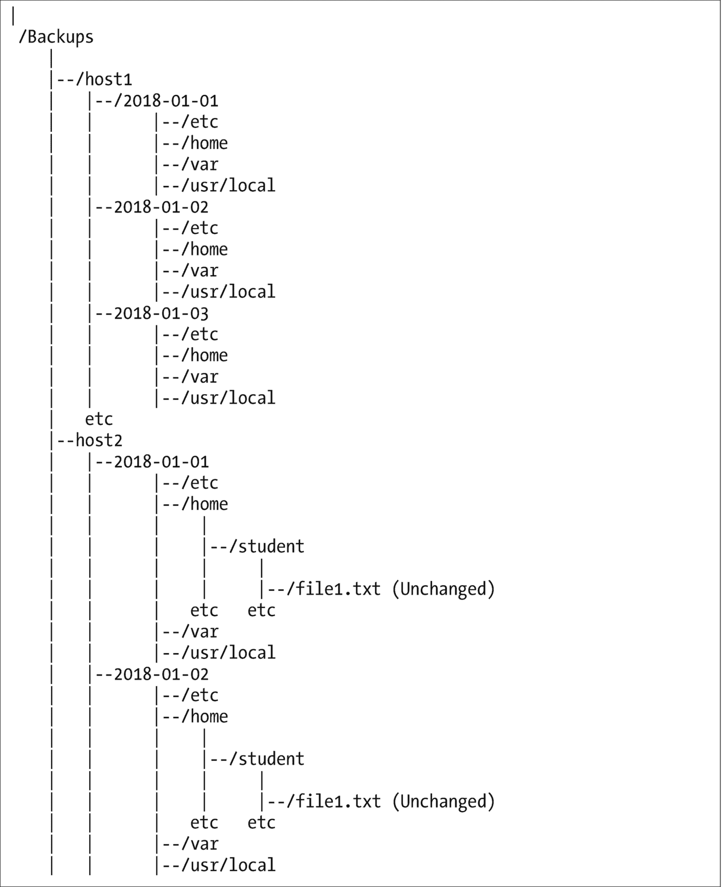

# 二十一、经常备份所有东西

我的电脑不会出任何问题，我也不会丢失我的数据。<sarcasm>右</sarcasm>。

我经历过各种原因造成的数据丢失，其中很多是我自己的错。保持良好的备份总是能让我在中断最少的情况下继续工作。本章讨论了数据丢失的一些常见原因，以及防止数据丢失和便于恢复的方法。

## 数据丢失

不去细说我自己的愚蠢，这里有一些我们可能在不恰当的时候丢失数据的原因。当然，没有丢失数据的合适时机。

**自己造成的**数据丢失有多种形式。最常见的形式是擦除一个或多个重要的文件或目录。

有时删除需要的文件是偶然的。我只是删除了一个目录中的一堆旧文件，后来发现还需要一两个。更多的时候，至少对我来说，我实际上是看着这些文件，然后决定不再需要它们。在我删除它们的一天、两天或一周后，我发现我至少还需要一些刚刚删除的文件。我还对一个文件进行了重大修改并保存了它。再一次，我发现在后来的某个时候，我做了一些不该做的修改，尤其是删除了一些不该删除的内容。

显然，在删除文件或对其进行更改时，有必要注意。这仍然不能阻止我们删除以后可能需要的数据。

**电源故障**可能因多种原因而发生。这包括像长时间断电一样无法挽回地关闭计算机的瞬间断电。不管断电的原因是什么，都有丢失数据的危险，尤其是尚未保存的文档。现代硬盘驱动器和文件系统采用有助于最小化数据丢失概率的策略，但它仍然会发生。

我也经历过停电。回到现代日志文件系统如 EXT3 和 EXT4 之前，我确实经历过一些严重的数据丢失。有助于防止因电源故障而导致数据丢失的一种方法是投资购买不间断电源(UPS ),它可以在足够长的时间内保持主机供电，以执行手动关机或由电源故障本身触发的关机。

**电磁干扰，EMI** ，是来自许多不同来源的各种类型的电磁辐射。这种辐射会干扰包括计算机在内的任何电子设备的正常运行。

当我在佐治亚州亚特兰大的 IBM 个人电脑客户支持中心工作时，我们的第一个办公室距离多宾斯空军基地跑道中心线大约一英里，就在跑道中心线上。各种类型的军用飞机一天 24 小时都在进进出出。大功率军用雷达有时会导致多个系统同时崩溃。在那种环境下，这就是生活的现实。

闪电、静电、微波、旧的阴极射线管显示器、地面线路上的无线电频率脉冲，所有这些以及更多的因素都会引起问题。正如我们在第 [17](17.html) 章中看到的，良好的接地可以降低所有这些类型的电磁干扰的影响。但这并不能使我们的电脑完全免受电磁干扰的影响。

**硬盘故障**也会导致数据丢失。当今计算机中最常见的故障是带有移动机械部件的设备。在频率列表中领先的是冷却风扇，硬盘紧随其后。现代硬盘具有智能功能，可以进行预测性故障分析。Linux 可以监控这些驱动器，并向 root 用户发送一封电子邮件，表明故障即将发生。不要忽视这些电子邮件，因为在硬盘出现故障之前更换硬盘比在硬盘出现故障后更换硬盘并希望备份是最新的要简单得多。

**心怀不满的员工**可以恶意破坏数据。适当的安全程序可以减轻这种类型的威胁，但是备份仍然很方便。

**盗窃**也是丢失数据的一种方式。1993 年，我们搬到北卡罗莱纳州的罗利后不久，当地报纸和电视上刊登了一系列文章，报道了我们一所著名大学的一位科学家的苦难经历。这位科学家把他所有的数据都保存在一台电脑上。他确实有备份——在同一台电脑的另一个硬盘上。当他办公室的电脑被盗时，他所有的实验数据也丢失了，而且再也没有找到。

这是将良好的备份与正在备份的主机分开的一个非常好的理由。

**自然灾害**发生。火灾、洪水、飓风、龙卷风、泥石流、海啸以及更多种类的灾难会毁坏计算机和本地存储的备份。我可以保证，即使我有一个很好的备份，我也不会在火灾、龙卷风或自然灾害将我置于迫在眉睫的危险时花时间去保存备份。

**恶意软件**是可用于各种恶意目的的软件，包括破坏或删除您的数据。

**勒索软件**是一种特定形式的恶意软件，它会加密你的数据并以此勒索赎金。如果你付了赎金，你可能会得到可以解密你的数据的密钥——如果你够幸运的话。

如你所见，丢失数据的方式有很多种。我列出这些可能导致数据损坏或丢失的方式的目的是为了吓唬您进行备份。成功了吗？

## 救援的备份

最近，就在最近——实际上，当我在写这本书的时候——我遇到了一个硬盘崩溃的问题，这个问题破坏了我主目录中的数据。我已经期待了一段时间，所以这并不奇怪。

### 问题

我发现有问题的第一个迹象是来自 S.M.A.R.T(自我监控、分析和报告技术)支持的硬盘驱动器的一系列电子邮件，我的主目录就在这个硬盘上。 <sup>[1](#Fn1)</sup> 这些电子邮件中的每一封都表明一个或多个扇区已经变得有缺陷，并且有缺陷的扇区已经离线，并且预留扇区被分配到它们的位置。这是正常操作；正是出于这个原因，硬盘特意设计了保留扇区。

我们将在第 [22](22.html) 章“追随你的好奇心”中详细讨论好奇心，但几个月前当这些错误信息开始进入我的电子邮箱时，我开始使用我的好奇心。我首先使用`smartctl`命令查看有问题的硬盘驱动器的内部统计数据。原来有缺陷的硬盘已经被替换了，但是——是的，我保留了一些旧的有缺陷的设备，以备像这样的教学时刻使用。我将这个损坏的硬盘安装在我的扩展坞中，以展示有缺陷的硬盘的后果。

你可以和我一起做这个实验，但是你的结果会不同——希望比我有缺陷的驱动器更健康。

实验 21-1 中使用的智能报告可能有点混乱。网页“了解智能报表， <sup>[2](#Fn2)</sup> ”对此有所帮助。维基百科也有一个关于这项技术的有趣页面。 <sup>[3](#Fn3)</sup> 我建议在尝试解释 SMART 结果之前先阅读那些文档；它们可能非常令人困惑。

### 注意

请确保在不用于生产的物理主机上执行此实验。虚拟硬盘的硬件状态无关紧要。

### 实验 21-1

这个实验必须以 root 用户身份进行。

在扩展坞中安装驱动器并将其打开后，dmesg 命令显示该驱动器被指定为设备专用文件/dev/sdi。确保为您的硬盘驱动器使用正确的设备专用文件。您可以使用主机中安装的任何物理硬盘，即使它正在使用中。

为了便于讨论，我将命令的结果分成了几个部分，并删除了大量不相关的数据。

```sh
[root@david ~]# smartctl -x /dev/sdi | less
smartctl 6.5 2016-05-07 r4318 [x86_64-linux-4.15.6-300.fc27.x86_64] (local build)
Copyright (C) 2002-16, Bruce Allen, Christian Franke, www.smartmontools.org

=== START OF INFORMATION SECTION ===
Model Family:     Seagate Barracuda 7200.11
Device Model:     ST31500341AS
Serial Number:    9VS2F303
LU WWN Device Id: 5 000c50 01572aacc
Firmware Version: CC1H
User Capacity:    1,500,301,910,016 bytes [1.50 TB]
Sector Size:      512 bytes logical/physical
Rotation Rate:    7200 rpm
Device is:        In smartctl database [for details use: -P show]
ATA Version is:   ATA8-ACS T13/1699-D revision 4
SATA Version is:  SATA 2.6, 3.0 Gb/s
Local Time is:    Wed Mar 14 14:19:03 2018 EDT
SMART support is: Available - device has SMART capability.
SMART support is: Enabled
AAM level is:     0 (vendor specific), recommended: 254
APM feature is:   Unavailable
Rd look-ahead is: Enabled
Write cache is:   Enabled
ATA Security is:  Disabled, NOT FROZEN [SEC1]
Wt Cache Reorder: Unknown
=== START OF READ SMART DATA SECTION ===
SMART Status not supported: Incomplete response, ATA output registers missing
SMART overall-health self-assessment test result: PASSED
Warning: This result is based on an Attribute check.

```

上面显示的第一部分结果提供了有关硬盘容量和属性的基本信息，如品牌、型号和序列号。这是一个有趣且有用的信息。然而，本节显示，必须带着一点怀疑的态度来看待这份智能数据报告。请注意，我的已知故障驱动器已通过自我评估测试。这似乎意味着驱动器不会发生灾难性故障，尽管它已经发生了。

我们目前最感兴趣的数据在下面两节。请注意，我删掉了大量对这个实验不重要的信息。

```sh
=== START OF READ SMART DATA SECTION ===
<snip – removed list of SMART capabilities.>

SMART Attributes Data Structure revision number: 10
Vendor Specific SMART Attributes with Thresholds:
ID# ATTRIBUTE_NAME          FLAGS    VALUE WORST THRESH FAIL RAW_VALUE
 1 Raw_Read_Error_Rate      POSR--   116   086   006    -    107067871
 3 Spin_Up_Time             PO----   099   099   000    -    0
 4 Start_Stop_Count         -O--CK   100   100   020    -    279
 5 Reallocated_Sector_Ct    PO--CK   048   048   036    -    2143
 7 Seek_Error_Rate          POSR--   085   060   030    -    365075805
 9 Power_On_Hours           -O--CK   019   019   000    -    71783
10 Spin_Retry_Count         PO--C-   100   100   097    -    0
12 Power_Cycle_Count        -O--CK   100   100   020    -    279
184 End-to-End_Error        -O--CK   100   100   099    -    0
187 Reported_Uncorrect      -O--CK   001   001   000    -    1358
188 Command_Timeout         -O--CK   100   098   000    -    12885622796
189 High_Fly_Writes         -O-RCK   001   001   000    -    154
190 Airflow_Temperature_Cel -O---K   071   052   045    -    29 (Min/Max 22/29)
194 Temperature_Celsius     -O---K   029   048   000    -    29 (0 22 0 0 0)
195 Hardware_ECC_Recovered  -O-RC-   039   014   000    -    107067871
197 Current_Pending_Sector  -O--C-   100   100   000    -    0
198 Offline_Uncorrectable   ----C-   100   100   000    -    0
199 UDMA_CRC_Error_Count    -OSRCK   200   200   000    -    20
240 Head_Flying_Hours       ------   100   253   000    -    71781 (50 96 0)
241 Total_LBAs_Written      ------   100   253   000    -    2059064490
242 Total_LBAs_Read         ------   100   253   000    -    260980229
                            ||||||_ K auto-keep
                            |||||__ C event count
                            ||||___ R error rate
                            |||____ S speed/performance
                            ||_____ O updated online
                            |______ P prefailure warning

```

smartctl 命令结果的前一部分显示了硬盘上硬件寄存器中累积的原始数据。原始值对某些错误率没有特别的帮助；如你所见，有些数字显然是伪造的。“值”栏通常更有帮助。阅读参考网页，了解一点为什么。一般来说，数值栏中像 100 这样的数字意味着 100%好，像 001 这样的低数值意味着接近失败——大约 99%的使用寿命都用完了。这真的很奇怪。

在这种情况下，Reallocated_Sector_Ct 的值列中的 048——重新分配的扇区计数——可能意味着大约一半的重新分配扇区已经用完。

数字 001 表示 Reported_Uncorrect(报告的不可纠正的缺陷扇区)和 High_Fly_Writes(磁头飞出硬盘记录表面的距离超过最佳值的写入),这意味着该硬盘的寿命实际上已经结束。经验证据已经证明了这一点。

下一节实际上列出了错误以及错误发生时的相关信息。这是输出中最有帮助的部分。我不试图分析每一个错误；我只是看看是否有多个错误。下面第一行中的数字 1350 是在此硬盘上检测到的错误总数。

```sh
<Snip>

Error 1350 [9] occurred at disk power-on lifetime: 2257 hours (94 days + 1 hours)
 When the command that caused the error occurred, the device was active or idle.

 After command completion occurred, registers were:
 ER -- ST COUNT  LBA_48  LH LM LL DV DC
 -- -- -- == -- == == == -- -- -- -- --
 40 -- 51 00 00 00 04 ed 00 14 59 00 00  Error: UNC at LBA = 0x4ed001459 = 21156074585

 Commands leading to the command that caused the error were:
 CR FEATR COUNT  LBA_48  LH LM LL DV DC  Powered_Up_Time  Command/Feature_Name
 -- == -- == -- == == == -- -- -- -- --  ---------------  ------------------
 60 00 00 00 08 00 04 ed 00 14 58 40 00 11d+10:44:56.878  READ FPDMA QUEUED
 27 00 00 00 00 00 00 00 00 00 00 e0 00 11d+10:44:56.851  READ NATIVE MAX ADDRESS EXT [OBS-ACS-3]
 ec 00 00 00 00 00 00 00 00 00 00 a0 00 11d+10:44:56.849  IDENTIFY DEVICE
 ef 00 03 00 46 00 00 00 00 00 00 a0 00 11d+10:44:56.836  SET FEATURES [Set transfer mode]
 27 00 00 00 00 00 00 00 00 00 00 e0 00 11d+10:44:56.809  READ NATIVE MAX ADDRESS EXT [OBS-ACS-3]

Error 1349 [8] occurred at disk power-on lifetime: 2257 hours (94 days + 1 hours)
 When the command that caused the error occurred, the device was active or idle.

 After command completion occurred, registers were:
 ER -- ST COUNT  LBA_48  LH LM LL DV DC
 -- -- -- == -- == == == -- -- -- -- --
 40 -- 51 00 00 00 04 ed 00 14 59 00 00  Error: UNC at LBA = 0x4ed001459 = 21156074585

 Commands leading to the command that caused the error were:
 CR FEATR COUNT  LBA_48  LH LM LL DV DC  Powered_Up_Time  Command/Feature_Name
 -- == -- == -- == == == -- -- -- -- --  ---------------  ------------------
 60 00 00 00 08 00 04 ed 00 14 58 40 00 11d+10:44:53.953  READ FPDMA QUEUED
 60 00 00 00 08 00 04 f4 00 14 10 40 00 11d+10:44:53.890  READ FPDMA QUEUED
 60 00 00 00 10 00 04 f4 00 14 00 40 00 11d+10:44:53.887  READ FPDMA QUEUED
 60 00 00 00 10 00 04 f3 00 14 f0 40 00 11d+10:44:53.886  READ FPDMA QUEUED
 60 00 00 00 10 00 04 f3 00 14 e0 40 00 11d+10:44:53.886  READ FPDMA QUEUED

Error 1348 [7] occurred at disk power-on lifetime: 2257 hours (94 days + 1 hours)
 When the command that caused the error occurred, the device was active or idle.

 After command completion occurred, registers were:
 ER -- ST COUNT  LBA_48  LH LM LL DV DC
 -- -- -- == -- == == == -- -- -- -- --
 40 -- 51 00 00 00 04 ed 00 14 59 00 00  Error: UNC at LBA = 0x4ed001459 = 21156074585

 Commands leading to the command that caused the error were:
 CR FEATR COUNT  LBA_48  LH LM LL DV DC  Powered_Up_Time  Command/Feature_Name
 -- == -- == -- == == == -- -- -- -- --  ---------------  ------------------
 60 00 00 00 08 00 04 ed 00 14 58 40 00 11d+10:44:50.892  READ FPDMA QUEUED
 27 00 00 00 00 00 00 00 00 00 00 e0 00 11d+10:44:50.865  READ NATIVE MAX ADDRESS EXT [OBS-ACS-3]
 ec 00 00 00 00 00 00 00 00 00 00 a0 00 11d+10:44:50.863  IDENTIFY DEVICE
 ef 00 03 00 46 00 00 00 00 00 00 a0 00 11d+10:44:50.850  SET FEATURES [Set transfer mode]
 27 00 00 00 00 00 00 00 00 00 00 e0 00 11d+10:44:50.823  READ NATIVE MAX ADDRESS EXT [OBS-ACS-3]

Error 1347 [6] occurred at disk power-on lifetime: 2257 hours (94 days + 1 hours)
 When the command that caused the error occurred, the device was active or idle.

<Snip – removed many redundant error listings>

```

这些错误表明磁盘确实有问题。

我决定在更换硬盘之前，先看看还会发生什么。失败的数字在开始时并没有那么糟糕。在灾难性故障发生时，错误计数上升到 1350。

一家名为 Backblaze 的云公司对超过 67，800 个智能硬盘 <sup>[4](#Fn4)</sup> 进行了一些测试，提供了一些基于统计的关于经历了各种报告错误数量的硬盘故障率的见解。这个网页是我发现的第一个展示了报告的 SMART 错误和实际失败率之间的统计相关性的网页。他们的网页也帮助我更好地理解了他们认为应该密切关注的五个智能属性。

在我看来，Backblaze 分析的底线是，在硬盘开始出现他们建议监控的五个统计数据中的任何一个错误报告后，应该尽快更换硬盘。

我的经验似乎证实了这一点，尽管它在统计学上并不显著。在第一次出现问题迹象的几个月内，我的硬盘就失灵了。在无法恢复之前，我的驱动器经历的错误数量非常多，我非常幸运能够从导致/home 文件系统切换到只读(ro)模式的几个错误中恢复过来。只有当 Linux 确定文件系统不稳定并且不可信时，才会出现这种情况。

### 恢复

所以说包含我的主目录的驱动器发生了灾难性的故障是有道理的。恢复是直截了当的，如果有点费时。

我关闭了电脑，取出了有缺陷的 320GB SATA 驱动器，换上了新的 1TB SATA 驱动器，因为我想稍后将额外的空间用于其他存储，然后重新打开了电脑。我创建了一个占用驱动器上所有空间的物理卷(PV ),然后创建了一个填充 PV 的卷组(VG)。我将其中的 250GB 空间用于逻辑卷(LV ),它将成为/home 文件系统。然后，我在逻辑卷上创建了一个 EXT4 文件系统，并使用`e2label`命令给它加上标签“home ”,因为我使用标签挂载文件系统。此时，替换驱动器已经准备好了，所以我将它安装在/home 上。

作为我创建备份的方法的结果，我只需要使用一个简单的复制命令，如代码示例 21-1 所示，就可以将整个主目录恢复到新安装的驱动器。

### 代码示例 21-1

请注意，为了确保正在恢复的数据不会被损坏，我不能以任何在/home 文件系统中拥有文件的非 root 用户身份登录。我以 root 用户身份登录虚拟控制台，并使用以下命令将数据从我的备份恢复到新安装并准备好的替换硬盘。

```sh
cp -Rp /media/Backups/Backups/david/2018-03-04-RSBackup/home/ /home

```

“R”选项遍历整个/home 目录结构，并复制整个目录树中的所有内容。“p”选项保留文件的所有权和权限属性。

在将数据恢复到我的/home 目录之后，我使用我的非特权用户 ID 登录并检查了所有东西。一切都按预期运行，我的所有数据都已正确恢复，包括这本书的文件。

## 按我的方式做

我的备份 shell 脚本是那些具有精心规划优势的程序之一。这是因为在此之前，我编写、使用并发现了许多我自己的备份脚本的错误。我能够更全面地了解我真正需要的备份系统。

我再次从一组需求开始。我已经考虑了几个月了。我已经有了一个使用 tar 在 tgz 文件中创建备份的备份脚本。但是从 tar 文件中提取单个文件或目录是一项很好的工作，需要花费一些时间。每晚还需要一个多小时来进行备份。尽管有 gzip 压缩，大文件意味着只有几天的历史可以保存在我用来备份的外部 USB 硬盘上，因为所有的东西都被备份了多次。

我有很多多年积累的档案。其中一些文件非常大，尤其是我的虚拟机文件。目前，我有大约 18 台虚拟机，每台都有非常大的虚拟磁盘与之关联。这占据了大量的空间。

因此，我需要一个快速的备份解决方案，能够轻松快速地处理非常大的文件，通过节省空间而无需创建某种类型的压缩归档，允许在单个备份驱动器上保存更多历史记录，并且我或我的客户可以在需要时轻松访问特定文件。

### 备份选项

执行备份有许多选项。除了像`tar`这样的老版本，大多数 Linux 发行版都提供了一个或多个额外的开源程序，专门用于执行备份。也有许多商业选择。

这些解决方案都不能完全满足我的需求，我真的想使用另一个我听说过的工具，`rsync`。 <sup>[5](#Fn5)</sup> 设计和实施可行的备份计划并不一定需要昂贵的备份计划。

我一直在试验`rsync`命令，它有一些非常有趣的特性，我已经能够很好地利用它们了。我的主要目标是创建备份，用户可以从这些备份中快速定位和恢复文件，而不必从备份 tarball 中提取数据，并减少创建和备份所需的时间。

本节只打算描述我自己在备份场景中对`rsync`的使用。它并没有介绍`rsync`的所有功能，也没有介绍它的许多其他有趣的用法。

#### 备份

命令由安德鲁·特里吉和保罗·麦克拉斯编写，于 1996 年首次发布。`rsync`的主要目的是远程同步一台计算机上的文件和另一台计算机上的文件。你注意到他们做了什么来创造这个名字吗？`rsync`是一款开源软件，并且提供了我所熟悉的所有发行版。

`rsync`命令可用于同步两个目录或目录树，无论它们是在同一台计算机上还是在不同的计算机上，但它能做的远不止这些。`rsync`创建或更新目标目录，使其与源目录相同。所有常用的 Linux 工具都可以自由访问目标目录，因为它不是存储在 tarball 或 zip 文件或任何其他归档文件类型中；它只是一个包含普通文件的普通目录，普通用户可以使用基本的 Linux 工具进行导航。这符合我的主要目标之一。

`rsync`最重要的特性之一是它用来同步在源目录中已经改变的预先存在的文件的方法。它不是从源文件复制整个文件，而是使用校验和来比较源文件和目标文件的块。如果两个文件中的所有块都相同，则不会传输任何数据。如果数据不同，则仅将源上已更改的数据块传输到目标。这为远程同步节省了大量的时间和网络带宽。例如，当我第一次使用我的`rsync` bash 脚本将我所有的主机备份到一个大的外部 USB 硬盘上时，花了大约 3 个小时。这是因为所有的数据都必须转移，因为这些数据之前都没有备份过。后续备份实际需要 3 到 8 分钟，具体取决于自上次备份以来更改或创建了多少文件。我使用了`time`命令来确定这一点，所以这是经验数据。例如，昨晚花了 3 分 12 秒完成了 6 个远程系统和本地工作站的大约 750GB 数据的备份。当然，只有几百兆字节的数据在一天中被更改，需要备份。

代码示例 21-2 中显示的简单的`rsync`命令可用于同步两个目录及其任何子目录的内容。也就是说，目标目录的内容与源目录的内容同步，以便在同步结束时，目标目录与源目录相同。

### 代码示例 21-2

这是使用`rsync`同步两个目录所需的最少命令。

```sh
rsync -aH sourcedir targetdir

```

-a 选项用于存档模式，它保留权限、所有权和符号(软)链接。H 用于保存硬链接，而不是为每个硬链接创建一个新文件。请注意，源目录或目标目录都可以位于远程主机上。

现在让我们假设昨天我们使用了`rsync`来同步两个目录。今天我们想要重新同步它们，但是我们已经从源目录中删除了一些文件。`rsync`通常的做法是将所有新的或更改的文件复制到目标位置，并将删除的文件留在目标位置。这可能是您想要的行为，但是如果您希望从源中删除的文件也从目标(即备份)中删除，您可以添加- delete 选项来实现这一点。

另一个有趣的选项是- link-dest 选项，这也是我个人最喜欢的选项，因为它极大地增强了 rsync 的功能和灵活性。- link-dest 选项使用硬链接，<sup>[6](#Fn6)</sup><sup>[7](#Fn7)</sup>来创建一系列每日备份，这些备份每天占用的额外空间非常少，创建时间也非常短。

使用该选项指定前一天的目标目录，并为今天指定一个新目录。然后,`rsync`命令创建今天的新目录，在今天的目录中创建昨天目录中每个文件的硬链接。所以我们现在在今天的目录中有一堆指向昨天文件的硬链接。没有创建或复制新文件。只创建了一些昨天文件的硬链接。使用这组指向昨天的目标目录的硬链接创建今天的目标目录后，`rsync`照常执行其同步，但是当在文件中检测到更改时，目标硬链接被昨天的文件的副本替换，然后文件的更改从源复制到目标。

所以现在我们的命令看起来像代码样本 21-3 中的那样。

### 代码示例 21-3

这个版本的 rsync 命令首先在今天的备份目录中为昨天的备份目录中的每个文件创建硬链接。然后，将源目录(正在备份的目录)中的文件与刚刚创建的硬链接进行比较。如果源目录中的文件没有更改，则不会采取进一步的操作。

```sh
rsync -aH --delete --link-dest=yesterdaystargetdir sourcedir todaystargetdir

```

如果对源目录中的文件进行了更改，rsync 会删除指向昨天备份目录中的文件的硬链接，并从昨天的备份中制作文件的精确副本。然后，它将对文件所做的更改从源目录复制到今天的目标备份目录。

`rsync`还删除目标驱动器或目录上已从源目录中删除的文件。

有时也希望将某些目录或文件排除在同步之外。我们通常不关心缓存目录的备份，因为它们可能包含大量数据，与其他数据目录相比，备份它们所需的时间可能会很长。为此，有- exclude 选项。对要排除的文件或目录使用该选项和模式。您可能希望排除浏览器缓存文件，这样您的新命令将类似于代码示例 21-4。

### 代码示例 21-4

```sh
rsync -aH --delete --exclude Cache --link-dest=yesterdaystargetdir sourcedir todaystargetdir

```

请注意，要排除的每个文件模式都必须有单独的排除选项。

`rsync`命令可以与作为源或目标的远程主机同步文件。对于下一个示例，我们假设源目录位于主机名为 remote1 的远程计算机上，目标目录位于本地主机上。尽管 ssh 是在与远程主机之间传输数据时使用的默认通信协议，但我总是添加 SSH 选项。该命令现在看起来像这样。

### 代码示例 21-5

在这段代码中，源目录位于远程主机 remote1 上。

```sh
rsync -aH -e ssh --delete --exclude Cache --link-dest=yesterdaystargetdir remote1:sourcedir todaystargetdir

```

此命令将数据从远程主机上的目录备份到本地主机。

`The rsync`命令有大量的选项，您可以用来定制同步过程。在很大程度上，我在这里描述的相对简单的命令非常适合我的个人需求。请务必阅读 rsync 的大量手册页，以了解它的更多功能以及这里讨论的选项的详细信息。

#### 执行备份

我自动化了我的备份，因为“自动化一切”我编写了一个 bash 脚本`rsbu`，它处理使用`rsync`创建一系列每日备份的细节。这包括确保安装了备份介质，为昨天和今天的备份目录生成名称，在备份介质上创建适当的目录结构(如果它们还不在那里)，执行实际的备份，以及卸载介质。

我在脚本中使用`rsync`命令的方法的最终结果是，我得到了网络中每个主机的备份的日期序列。备份驱动器的结构类似于图 [21-1](#Fig1) 所示。这使得查找可能需要恢复的特定文件变得容易。

 

图 21-1

我的备份数据磁盘的目录结构

因此，从 1 月 1 日的一个空磁盘开始，`rsbu`脚本对我在配置文件中指定的所有文件和目录的每个主机进行了完整的备份。如果您像我一样有很多数据，第一次备份可能需要几个小时。

1 月 2 日，`rsync`命令使用–link-dest =选项创建一个与 1 月 1 日完全相同的新目录结构，然后它在源目录中查找已更改的文件。如果有任何更改，将在 1 月 2 日的目录中制作 1 月 1 日的原始文件的副本，然后从原始文件更新文件中已更改的部分。

第一次备份到空驱动器后，备份只需很少的时间，因为首先会创建硬链接，然后只需要对自上次备份以来发生更改的文件进行进一步的操作。

图 [21-1](#Fig1) 还显示了一个文件/home/student/file1.txt 在 1 月 1 日、2 日和 3 日的 host2 系列备份的更多细节。1 月 2 日，该文件自 1 月 1 日以来一直未更改。在这种情况下，rsync 备份不会复制 1 月 1 日以后的原始数据。它只是创建一个目录条目，其中包含 1 月 2 日目录到 1 月 1 日目录的硬链接，这是一个非常快速的过程。我们现在有两个目录条目指向硬盘上的相同数据。1 月 3 日，文件已经更改。在这种情况下，数据../2018-01-02/home/student/file 1 . txt 复制到新目录，../2018-01-03/home/student/file 1 . txt 以及任何已更改的数据块都将复制到 1 月 3 日的备份文件中。这些策略是使用`rsync`程序的功能实现的，允许备份大量数据，同时节省磁盘空间和复制完全相同的数据文件所需的大量时间。

我的一个过程是每天从一个 cron 作业运行两次备份脚本。第一个迭代执行到内部 4TB 硬盘驱动器的备份。这是始终可用的备份，并且始终是我所有数据的最新版本。如果发生了一些事情，我需要恢复一个文件或所有文件，我可能会失去的最多是几个小时的工作。

第二次备份是在一个旋转的 4TB 外部 USB 硬盘系列中进行的。我每周至少一次从最近的地方开车到我在银行的保险箱。如果我的家庭办公室被破坏，我在那里维护的备份也随之被破坏，我只需从银行获得外部硬盘驱动器，我最多会丢失一周的数据。这种损失很容易恢复。

我用于备份的驱动器，不仅仅是内部硬盘，还有我每周轮换的外部 USB 硬盘，从来没有填满过。这是因为我编写的`rsbu`脚本会在进行新备份之前检查每个驱动器上备份的天数。如果驱动器上有任何超过指定天数的备份，它们将被删除。该脚本使用`find`命令来定位这些备份。天数在 rsbu.conf 配置文件中指定。

当然，在一场彻底的灾难之后，我首先必须为我和我的妻子找到一个有办公空间的新住处，购买部件并构建新的计算机，从剩余的备份中恢复，然后重新创建任何丢失的数据。

我的脚本 rsbu 及其配置文件 rsbu.conf 和一个 READ 是可用的。ME 文件来自 [`https://github.com/Apress/linux-philo-sysadmins/tree/master/Ch21`](https://github.com/Apress/linux-philo-sysadmins/tree/master/Ch21)

#### 恢复测试

没有测试，任何备份方案都是不完整的。您应该定期测试随机文件或整个目录结构的恢复，以确保不仅备份正常工作，而且备份中的数据可以在灾难发生后恢复使用。我见过太多这样的例子，由于这样或那样的原因，备份无法恢复，并且由于缺乏测试而无法发现问题，导致宝贵的数据丢失。

只需选择一个文件或目录进行测试，并将其恢复到测试位置，如/tmp，这样就不会覆盖自备份执行以来可能已更新的文件。验证文件的内容是否符合您的预期。从使用上述 rsync 命令创建的备份中恢复文件，只需从备份中找到要恢复的文件，然后将其复制到要恢复的位置。

我遇到过几次不得不恢复单个文件的情况，有时还需要恢复完整的目录结构。正如我在本章前面所讨论的，有几次我不得不恢复硬盘的全部内容。大多数时候，这是我自己造成的，因为我不小心删除了一个文件或目录。至少有几次是因为硬盘崩溃。所以这些备份确实派上了用场。

### 异地备份

创建良好的备份是备份策略中重要的第一步。将生成的备份介质与原始数据保存在同一物理位置是错误的。

我们已经看到，将所有备份存储在内部驱动器上的计算机被盗会导致重要数据完全丢失且无法恢复。如果原始数据和备份数据存储在同一位置，火灾和其他灾难也会导致原始数据和备份数据丢失。防火保险箱是一种选择，可以减少盗窃和火灾等灾难的威胁。这种保险箱通常在规定的温度下以分钟为单位进行评级，以保护其内容物。我想我个人关心的是，我不知道火会燃烧多长时间或多热。也许保险箱能支撑足够长的时间，但如果不能呢？

我更喜欢像大公司那样为自己做备份。我保留当前的异地备份。对我来说，这个在我银行的保险箱里。对于其他人来说，这可能是“在云”的某个地方。我喜欢我的保险箱解决方案提供的端到端控制。我知道它被保护得很好。如果我小小的家庭办公室被摧毁，银行可能离得足够远，不会受到任何灾难的影响。

对于大公司来说，有一些服务可以将你的备份存储在一个远程、高安全性的地方，有气候控制的保险库。这些服务中的大多数甚至会派装甲卡车到您的设备处，来取走和运输您的备份介质。有些提供高速网络连接，以便可以在远程位置将备份直接备份到自己的存储介质上。

如今，许多人和组织都在进行云备份。我对所谓的“云”持严重保留意见。首先，“云”只是别人电脑的另一种说法。第二，考虑到我读到的所谓安全计算设施遭到黑客攻击的数量，我不太可能将我的数据交给任何维护可从互联网访问的在线备份的外部组织。我更希望我的远程备份数据离线，直到我需要它。

我对云的担心是，除了提供商放在他们网站上的营销信息，我没有办法知道他们的安全措施是否比我自己做的更好。也许他们可以，但作为一名系统管理员，我希望得到一些证明。我毫不怀疑，与许多企业和个人相比，很大一部分云提供商能够更好地管理委托给他们的数据的安全性。我怎么知道那些是什么？请记住，我们谈论的是基于云的备份解决方案，而不是应用或 web 存在解决方案。

我想我可以有一定把握地说，在安全性方面，成熟和公认的云提供商，如 Amazon、Azure、Google 等，肯定比许多中小型组织更值得信赖。我在考虑那些没有全职系统管理员的公司，或者把它外包给那些不太知名的小型本地公司。我还认为，在当今不断遭受网络攻击的世界里，许多经验不足的系统管理员还没有准备好应对互联网所需的高安全级别。

因此，对于许多组织来说，云可能是一个可行的选择。对于其他人来说，一个经验丰富、知识渊博的系统管理员可能是最好的选择。与许多 IT 决策一样，这是一个权衡风险因素并确定您愿意接受多少风险的问题。

## 灾难恢复服务

更进一步说，我工作过的一些地方与一个或多个灾难恢复服务有合同。这种类型的服务是为了维护一个完整的计算机和网络环境，可以在接到通知后立即替换您自己的计算机和网络环境。这通常包括从大型机到基于 Intel 的服务器和工作站的一切。当然，这还不包括在异地备份存储中保存大量数据。

在我工作的一个地方，我们对灾难恢复计划进行季度评估。我们通过英特尔服务器关闭了主机上的所有计算机。我们通知灾难恢复公司我们正在进行一项测试，他们准备了他们的站点，提供了我们恢复和运行所需的各种计算机。我们让备份存储服务将最新的备份介质从他们的安全设施运送到费城的恢复站点。

我们办公室的一群人来到恢复站点，从我们的备份介质中恢复了所有数据，使所有东西都上线，并进行测试以确保一切都正常工作。

总是有问题。一直都是。但这是整个练习的目的——发现我们的策略和程序中的问题。然后修复它们。

## 其他选项

不是每个人都需要灾难恢复服务或大量备份数据存储。对于一些只有一台电脑的个人和非常小的企业来说，几个 USB 拇指驱动器和手动备份到其中一个驱动器就足够了。对于其他人来说，一个相对较小的外部 USB 硬盘驱动器就可以了。

这都是你在你的环境中所需要的。

## “经常”的部分呢？

这很简单。每天至少做一次备份。无论如何？如果一些文件特别重要，而你刚刚创建或修改了它们，那么马上备份它们。

`rsbu`脚本会很快完成这项工作，因为它只会备份已经更改的文件。它以一种仍然允许你在你的计算机上继续工作的方式做到这一点。

## 摘要

作为系统管理员，备份是我们工作中极其重要的一部分。我经历过许多这样的例子:备份实现了我工作过的地方以及我自己的业务和个人数据的快速操作恢复。

执行和维护数据备份有许多选项。我做对我有用的事情，从来没有丢失超过几个小时的数据。

像其他任何东西一样，备份是关于你需要什么的。无论你做什么——做点什么！计算一下，如果你失去了一切——数据、电脑、硬拷贝记录——一切，你会有多痛苦。这一难题包括更换硬件的成本，以及恢复已备份数据和未备份数据所需的时间成本。然后相应地计划和实施您的备份系统和程序。

<aside class="FootnoteSection" epub:type="footnotes">Footnotes [1](#Fn1_source)

您的主机必须安装并运行邮件传输代理(MTA)，如 SendMail。/etc/aliases 文件必须包含一个条目，以便将 root 用户的电子邮件发送到您的电子邮件地址。

  [2](#Fn2_source)

*了解智能报告*， [`https://lime-technology.com/wiki/Understanding_SMART_Reports`](https://lime-technology.com/wiki/Understanding_SMART_Reports)

  [3](#Fn3_source)

维基百科，*【smart】*、 [`https://en.wikipedia.org/wiki/SMART`](https://en.wikipedia.org/wiki/S.M.A.R.T)

  [4](#Fn4_source)

BackBlaze 网站，“智能统计告诉我们关于硬盘的什么”， [`https://www.backblaze.com/blog/what-smart-stats-indicate-hard-drive-failures/`](https://www.backblaze.com/blog/what-smart-stats-indicate-hard-drive-failures/)

  [5](#Fn5_source)

维基百科，*【rsync】*， [`https://en.wikipedia.org/wiki/Rsync`](https://en.wikipedia.org/wiki/Rsync)

  [6](#Fn6_source)

维基百科，*【硬链接】*、 [`https://en.wikipedia.org/wiki/Hard_link`](https://en.wikipedia.org/wiki/Hard_link)

  [7](#Fn7_source)

大卫，Linux 数据手册，*使用 Linux 文件系统中的硬链接和软链接*， [`http://www.linux-databook.info/?page_id=5087`](http://www.linux-databook.info/?page_id=5087)

 </aside>