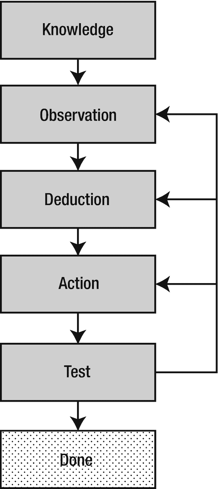

# 二十四、指导年轻的系统管理员

这些年来，我参加了许多培训课程，大多数课程都非常有用，帮助我了解了更多关于 Unix 和 Linux 以及许多其他主题的知识。但是培训——尽管有用和重要——不能涵盖履行系统管理员职责的许多基本方面。

我参加的所有课程都是几天，通常是四五天。关于命令、过程、文件系统、进程以及本书中提到的许多东西，信息太多了，无法涵盖您需要了解的一切。并不是所有的东西都可以在教室里教授。有些事情只能在现实世界的环境中由一个好的导师来教授，通常是在你处于极端压力下解决一个关键问题的时候。

没有什么比让 PHB 或一个或多个奴才在你身后监视并批评你的每一个举动和决定更好的了。它发生了。这些提供每小时进度报告的压力，回答诸如“什么时候能修好”等愚蠢问题的压力，抵制 PHB 试图在一个人的任务上增加三个人的压力，等等，不仅浪费了我们的时间，还打断了我们的思路，降低了我们的整体效率。大多数时候我们知道该做什么和怎么做，我们只是需要一个能让我们相对平静地工作的环境。

一个好的导师会让你在这些情况下做实际的工作，这样你就可以有一个有价值的学习经历，同时避免陷入困境，在不受干扰的情况下承受压力。一个伟大的导师也能够在任何情况下创造学习的机会，不管情况有多危急。

刚开始的时候，我是一个年轻天真的系统管理员。我很幸运，因为我做过几份不同的工作，其他经验丰富的系统管理员愿意指导我，鼓励我。当我问在他们看来答案显而易见的问题时，他们没有一个人嘲笑我。这些耐心的系统管理员从来没有告诉我 RTFM。

## 雇佣合适的人

指导合适的人从来都不简单也不容易；指导错误的人是不可能的。考虑到这一点，让我们来看看如何雇用合适的人。

作为一名系统管理员，特别是如果你是一名高级系统管理员，你的部分工作应该是帮助你的团队雇佣合适的人。如果你的 PHB 让你在招聘过程中孤立无援，你应该尽你所能改变这种情况。幸运的是，在我的大部分工作生涯中，这很少成为问题。聪明的经理会让整个团队参与招聘新成员。

我经历过的最好、最愉快的面试之一是我申请思科公司的测试员和兼职实验室系统管理员的工作。我和经理呆了一会儿，然后部门里的其他人跟了我大约五个小时。他们三三两两地来了，问了我各种各样的问题。每个小组给我一些假设的情况来解决，他们问我一些技术性的问题，并且测试我的耐心。实际上，我在那次面试中很开心，因为每个面试我的人都是他们被雇佣来做的工作的合适人选。我确实得到了那份工作。我不是什么都知道。我确实告诉了面试官那个事实，当它是真实的时候。

有许多方法可以用来雇佣合适的人，但没有万无一失的方法。然而，我发现，合适的面试官和合适的问题对实现这一点大有帮助。

正如我之前提到的，很多面试系统管理员类职位的人都没有准备好，因为他们不知道如何解决问题。有时候，直到你雇佣了这个人，你才能知道这一点，而且在那个时候很难“解雇”他们。我工作过的一个地方采用了动手测试。我们的测试很简单。我们设置了一个 Linux 主机，其中有三个具体但相当简单的问题，申请人必须在指定的时间内解决。

虽然这个测试是关于发现和解决问题，我们也看了申请人完成任务的方式。那些惊慌失措或或多或少随机前进、漫无目的地挣扎的人很快就被我们排除在外了。即使他们没有解决所有的问题，那些带着某种目的感，带着成熟的问题解决算法前进的人，是我们认为最有可能在我们现有的工作中取得成功的人。我们可以轻松地教授技术，但我们不容易教授解决问题的技巧和禅。

测试可能存在法律问题，但是，如果测试真正代表了申请人将要从事的工作类型，并且所有申请人都需要参加测试，那么(请咨询您的律师)应该可以使用测试。

## 指导

一个人如何指导一个年轻的系统管理员？银河系中有多少颗恒星？每个系统管理员都有自己的指导方式，每个年轻的系统管理员都需要不同的知识和不同的方法。

当我有一个优秀的老师时，学习起来更容易，但我发现，当我喜欢一门学科并对它感兴趣时，我的老师的质量几乎没有影响。最好的导师允许甚至鼓励我追随自己的好奇心。即使我没有完成目标，他们也会在我尝试的时候奖励我。

然而，一个真正糟糕的老师不仅可以摧毁学习的欲望，还可以摧毁学习的能力。一个非技术性的例子是我的高中英语文学老师。很明显，她真的很喜欢我们应该学习的书籍、故事、诗歌和其他文学作品。不幸是，她不知道如何教学，也不知道如何将对这门学科的热爱传递给我们这些学生。除了别的以外，我们还学习了莎士比亚，我简直烦透了。

第二年夏天，因为我参加了一些学校的戏剧演出，戏剧老师喜欢我的作品，她把我推荐给爱尔兰山剧院的一名招聘人员，这是一个在密歇根州南部演出莎士比亚剧目的夏季剧团。哇哦！莎士比亚的整个夏天？是的，我很喜欢。那年夏天，作为一名学徒，我对莎士比亚的了解比我在课堂环境中学到的更多，就像我在文学课上遇到的老师一样。

那个夏天，我有几个很好的导师。他们为我们所有人举办了培训班。他们帮助我们学习材料的意义以及表演的技巧。对我来说，理解是最有帮助的。我认为理解是导师可以帮助的最重要的事情之一。死记硬背不是关键——理解、批判性思维和解决问题的技能是我的技术导师赋予我的最重要的东西。

### 导师布鲁斯

我很幸运有许多非常优秀和耐心的导师，他们允许我失败，以便我可以学习。特别是有一个人，布鲁斯，因为他喜欢在他的电子邮件上签名，所以他确保我接受了必要的培训，但他也允许我很快地运用这些培训。他马上给我分配了困难的任务，这些任务迫使我运用新获得的知识，突破自我舒适和自我限制的界限。

布鲁斯和我在两家不同的公司共事多年，这两家公司都需要深厚的 Unix/Linux 知识和技能。我们合作得很好，因为我们都非常擅长我们所做的事情。他理解我开始时的技能水平不如他，但他尊重我所拥有的技能，并给我很多机会去使用这些技能和学习新的技能。

从很多方面来说，BRuce 都是典型的坏脾气系统管理员——这是有充分理由的。我这么说的意思是，当与技术含量较低的人打交道时，如营销人员和 PHB，关于他们想在我们负责的实验室中做的事情，他的第一反应几乎总是一个干脆、明确的“不”。这总是因为项目，无论是什么，都会在实验室中引起问题，因为它们最初是构想出来的，因为它们都没有经过深思熟虑，没有什么可以做，什么不可以做的概念。然后，布鲁斯问了提出请求的人一系列问题，最终让我们知道他们真正想做什么。似乎提出这些请求的大多数人也在尝试设计支持这些项目的基础设施，而这是我们的专业领域，不是他们的。他们也没有很好地考虑他们的项目会如何影响其他使用实验室测试他们项目的人。

布鲁斯并不像有些人想的那样是个混蛋。他在做他的工作，那就是确保实验室对每个使用它的人来说都是完全正常的。我们收到的大多数初始请求都有明显的缺陷。我们有责任确保这些缺陷不会影响实验室的其他部分。BRuce 非常直率，因为我们没有时间处理其他人引起的问题，当时只有我们两个人在实验室中处理超过 15 排 24 个机架，所有这些机架都装满了运行测试的设备，如果有人的实验失控，实验室网络将不得不重新启动。

在那种环境中，不能容忍任何错误。布鲁斯和我只是在执行旨在保护所有用户的实验室准则。作为我的导师，这也是布鲁斯试图帮助我理解的事情——这是一个多数人的利益压倒少数人的利益的时候。实验室的运行方式必须防止一些用户干扰其他用户的工作。

## 解决问题的艺术

我的导师帮助我做的最好的事情之一是制定一个明确的过程，我可以用它来解决几乎任何类型的问题。在我看来，它与科学方法密切相关。

在我为这本书做研究的过程中，我发现了一篇名为“科学方法是如何工作的”的短文，它用一张图表描述了科学方法，这张图表与我为解决问题的五个步骤创建的图表非常相似。因此，作为一名导师，我将此传递给你们，这是我对所有年轻系统管理员的贡献。我希望你和我一样觉得它很有用。

解决任何类型的问题都是艺术、科学，有些人会说，或许还有一点魔法。解决技术问题，如计算机出现的问题，也需要大量的专业知识。

解决任何性质问题的任何方法——包括 Linux 问题——必须不仅仅包括症状列表以及修复或规避导致症状的问题的必要步骤。这种所谓的“症状修复”方法在理论上对管理者来说很好，但在实践中却很糟糕。解决问题的最好方法是拥有大量的相关知识和强大的方法论。

### 解决问题的五个步骤

问题解决过程涉及五个基本步骤，如图 [24-1](#Fig1) 所示。这种算法与脚注 1 中提到的科学方法非常相似，但专门用于解决技术问题。

图 24-1

解决问题的五个步骤与科学方法非常相似

当您对某个问题进行故障诊断时，您可能已经遵循了这些步骤，但您甚至没有意识到这一点。这些步骤是通用的，适用于解决几乎任何类型的问题，而不仅仅是计算机或 Linux 的问题。多年来，我在各种问题中使用这些步骤，却没有意识到这一点。为我整理它们让我在解决问题时更加有效，因为当我陷入困境时，我可以回顾我采取的步骤，验证我在过程中的位置，并在任何适当的步骤重新开始。

在过去，你可能听过几个用于解决问题的其他术语。这个过程的前三个步骤也称为问题确定，即找到问题的根本原因。最后两步是问题解决，实际上就是修复问题。

接下来的部分将更详细地介绍这五个步骤。

### 知识

了解你试图解决问题的主题是第一步。我看到的所有关于科学方法的文章似乎都把这作为一个先决条件。然而，知识的获取是一个持续的过程，由好奇心驱动，并通过使用科学方法探索和通过实验扩展现有知识而获得的知识来增强。这是我在本书中使用术语“实验”而不是“实验室项目”的原因之一。

您必须至少了解 Linux，甚至更多，您必须了解能够与 Linux 交互并影响 Linux 的其他因素，例如硬件、网络，甚至环境因素，例如温度、湿度和 Linux 系统运行的电气环境如何影响它。

通过阅读关于 Linux 和其他主题的书籍和网站可以获得知识。你可以参加课程、研讨会和会议。你也可以在一个网络环境中，通过与其他有知识的人交流，设置一些 Linux 计算机。当你解决一个问题并发现一个特定类型问题的新原因时，你就获得了知识。当试图解决问题导致暂时失败时，您也可以找到新的知识。

课堂在为我们提供新知识方面也很有价值。我个人的偏好是玩——呃，尝试 Linux 或者某个特定的东西，比如网络、名称服务、DHCP、Chrony 等等，然后上一两堂课来帮助我将学到的知识内化。

记住，“没有知识，抵抗是徒劳的，”套用博格人的话。知识就是力量。

### 观察

解决问题的第二步是观察问题的症状。记下所有的问题症状非常重要。观察什么在正常工作也很重要。现在不是试图解决问题的时候；只是观察。

观察的另一个重要部分是问自己关于你看到什么和没有看到什么的问题。除了你需要问的特定问题之外，还有一些一般性的问题。

*   这个问题是由硬件、Linux、应用软件引起的，还是由于缺乏用户知识或培训引起的？

*   这个问题和我见过的其他问题类似吗？

*   是否有错误信息？

*   是否有与该问题相关的日志条目？

*   错误发生前，计算机上发生了什么？

*   如果错误没有发生，我期望会发生什么？

*   最近系统硬件或软件有什么变化吗？

当你努力回答这些问题的时候，其他的问题也会显露出来。这里要记住的重要事情不是具体的问题，而是尽可能多地收集信息。这增加了您对这个特定问题实例的了解，有助于找到解决方案。

当你收集数据时，永远不要假设从别人那里获得的信息是正确的。自己观察一切。如果你和一个在远处的人一起工作，这可能是一个大问题。仔细询问至关重要，当试图确认提供给您的信息时，允许远程访问相关系统的工具非常有用。当在远处询问一个人时，不要问引导性的问题；他们会尽力帮助你，用他们认为你想听的话来回答。

在其他时候，你得到的答案将取决于这个人对 Linux 和一般计算机知识的多少。当一个人知道——或者认为他们知道——计算机时，你得到的答案可能包含难以反驳的假设。而不是问。“你检查了吗……”最好让对方实际执行检查物品所需的任务。与其告诉用户他们应该看到什么，不如让用户向你解释或描述他们看到了什么。同样，远程访问机器可以让您确认提供给您的信息。

最好的问题解决者是那些从不认为任何事情是理所当然的人。他们从不认为他们拥有的信息是 100%准确或完整的。当你所掌握的信息似乎与症状本身相矛盾时，从头开始，就好像你什么信息都没有一样。

在我从事的几乎所有计算机行业的工作中，我们总是试图互相帮助，我在 IBM 的时候也是如此。我一直非常擅长解决问题，有时当另一个客户很难找到问题的根源时，我会出现在客户面前。我要做的第一件事是评估形势。我会问基层行政长官，他们至今已采取了甚么措施去找出问题所在。之后我会从头开始。我一直想亲眼看看结果。很多时候这样做是有回报的，因为我会观察到一些其他人没有注意到的东西。在一次非常奇怪的事件中，我坐在一台大型电脑上修理它。

#### 坐下来工作

这发生在大约 1976 年，当时我还是俄亥俄州利马的一名 IBM CE。我们中的两个人正在安装一台 IBM System 3，它比 IBM 大型机小，比如 360 或 370，但仍然足够大，需要一个自己的房间、高压电源和大量的空气冷却。

当我们遇到问题时，我们已经组装了主 CPU，并开始连接 IBM 1403 行式打印机控制器。打印机控制器安装在 CPU 左侧稍低于桌面高度的位置。那个漂亮的大工作台面的高度正好适合坐着。

我们刚刚把打印机控制器用螺栓固定在 CPU 的框架上，正在做安装说明中的众多检查之一。我们将欧姆表的引线连接在 CPU 的框架和打印机控制器电源的特定端子之间。结果应该是开路，即无穷大电阻，这将表明电源的热引线没有短接到框架。在这种情况下，有一个短-零电阻-这是不好的。不会像你在电视上看到的那样出现壮观的噪音和焰火，但这会是一个问题，因为它会阻止计算机启动。最好在它还在组装的时候就抓住它，而不是以后。

经过一个小时的努力寻找问题，我们无法这样做。我们致电佛罗里达州 Boca Raton 的 System/3 支持中心，并在他们的指导下完成了几个不成功的进一步问题确定步骤。

有点沮丧，我坐在打印机控制单元上。我用眼角的余光看到欧姆表上的指针摆动，表示开路。我向另一位 CE 和 Boca Raton 的 Vern 提到了这一点，后来当我作为课程开发代表(CSR)去那里工作几年时，他成了我的导师之一。

我们从控制器上取下了我曾栖息过的顶盖，幸运的是，我们发现将顶盖固定在打印机控制器框架上的一个螺栓松了，掉进了电源中，导致了短路。当我坐在控制器的顶部时，框架移动了足够的距离，导致螺栓不再接触，从而产生短路。从电源上取下那个松动的螺栓就解决了这个问题。

当时负责 System/3 支持的 Vern 对说明做了一些修改，以覆盖这个问题，以防再次发生。他还与制造人员合作*确保*这种情况不会再次发生，进行检查以确保螺栓在制造过程中正确拧紧。

要记住的事情是真正观察系统的所有部分发生了什么。注意一切，不要忽略丝毫线索。有时，观察 top 或用于监控内核或网络内部功能的其他实用程序可以提供一些线索，让我们朝着正确的方向开始。

有时需要一点运气，比如坐在打印机控制单元上。

### 论证

运用推理技巧从你对症状的观察和你的知识中获取信息，以确定问题的可能原因。我们在第 23 章中详细讨论了不同类型的推理。通过你对问题的观察、你的知识和你过去的经验进行推理的过程是艺术和科学相结合产生灵感、直觉或其他一些神秘的心理过程，这些过程提供了对问题根源的一些洞察力。

在某些情况下，这是一个相当容易的过程。您可以看到一个错误代码，并从可用的资源中查找其含义。或者你观察到一个熟悉的症状，你知道该采取什么措施来解决它。然后，您可以应用您通过阅读 Linux、本书和 Linux 提供的文档所获得的大量知识来推断问题的原因。

在其他情况下，这可能是问题确定过程中非常困难和漫长的一部分。这些是最困难的案件类型。也许是你从未见过的症状，或者是你用过的任何方法都无法解决的问题。正是这些困难的问题需要更多的工作，尤其是更多的推理。

记住症状不是问题是有帮助的。问题导致了症状。你想解决真正的问题，而不仅仅是症状。

### 行动

现在是执行适当的修复操作的时候了。这通常是简单的部分。困难的部分是之前发生的事情——弄清楚该做什么。知道问题的原因后，就很容易确定要采取的正确修复措施。

您采取的具体措施将取决于问题的原因。请记住，我们正在修复根本原因，而不仅仅是试图摆脱或掩盖症状。

一次只做一个改变。如果可以采取多种措施来纠正问题的原因，那么只进行一种改变或采取最有可能解决根本原因的一种措施。选择最有可能解决问题的纠正措施是您在这里要做的事情。无论是你自己的经验告诉你该采取什么行动，还是其他人的经验，从最高到最低优先顺序，一次一个行动。每次行动后测试结果。

### 试验

在采取一些公开的修复措施后，应该对修复进行测试。这通常意味着首先执行失败的任务，但也可能是说明问题的一个简单的命令。

我们在第 [11](11.html) 章讨论了测试以及为 shell 脚本编写代码，这里的过程是一样的。我们做一个单一的改变，采取一个潜在的纠正措施，然后测试该措施的结果。这是我们可以确定哪个纠正措施解决了问题的唯一方法。如果我们要做几个纠正措施，然后测试一次，没有办法知道哪个措施负责修复问题。如果我们想在找到解决方案后退回那些无效的改变，这一点尤其重要。

如果修复操作不成功，您应该重新开始该过程。如果你可以采取额外的纠正措施，回到那个步骤，继续这样做，直到你用尽了所有的可能性，或者确信你已经走上了错误的道路。

测试时一定要检查原来观察到的症状。它们可能由于您采取的行动而发生了变化，您需要意识到这一点，以便在流程的下一次迭代中做出明智的决策。即使问题没有得到解决，症状的改变对于决定如何继续进行也是非常有价值的。

## 例子

我自己解决问题的一个例子发生在我作为一名兼职 Linux 系统管理员的时候。它相当简单，但对于说明我所概述的步骤的流程非常有用。

我收到了一封来自我们一位测试人员的电子邮件，指出他在测试中安装的一个应用崩溃了。它给出了错误消息，表明交换空间不足。这是用户执行的初始**观察**并传送给我。

我的**知识**告诉我，用于测试这个应用的系统有 16GB 的 RAM 和 2GB 的交换空间。以前的经验**(知识)**告诉我，这些计算机中的交换空间几乎从未使用过，RAM 使用率通常远远低于这些机箱中 16GB RAM 的 25%。

在这一点上，我**推断**这个问题实际上不是交换空间的问题，因为这看起来不太可能。我仍然保留着这种可能性，尽管可能性很小。你会发现程序提供的许多错误信息可能会误导人，用户的观察甚至会更误导人。

我做了一些自己的观察。我登录到机器上，使用 **free** 命令作为查看内存和交换空间的工具。我可以**观察到**有很多空闲内存，交换空间使用率为零。我**知道**如果交换空间的使用实际上为零，那么很可能没有可用的交换空间被分配，并且自上次引导以来没有发生分页。

我还从以前的经验**(知识)**中推理出在那个错误信息中可能有真理的内核。也就是说，它很可能是出于某种资源或其他。其他主要消耗资源是 CPU 周期和磁盘空间。

这似乎不是 CPU 问题，所以我使用 **df** 命令观察了磁盘空间，这表明/var 文件系统已满。我**推断**文件系统已满是问题的原因。对/var 的一点探索表明，测试人员的软件确实位于那里，并且已经填满了文件系统。

所有系统都是以 1.5GB 的/var 文件系统启动的。策略是将应用安装在/opt 中，这是我们要测试的应用的设计安装位置，它被配置为占用所有剩余的磁盘空间，因此大小很容易达到 100GB 或更大，对于任何被测试的应用来说都绰绰有余。

我与测试人员讨论了这个问题，并被告知他确实在/var 中安装了应用。我告诉他从那里卸载新程序，并在/opt 中安装应用。在采取这个**行动**之后，我让他**通过执行之前失败的操作来测试**纠正行动。测试成功，问题得以解决。

### 循环

当你解决一个问题时，至少有必要重复一些步骤。例如，如果执行给定的纠正措施不能解决问题，您可能需要尝试另一种已知的措施来解决问题。图 [24-1](#Fig1) 显示你可能需要重复到任何先前的步骤才能继续。

可能有必要返回到观察步骤，收集有关问题的更多信息。我还发现，有时回到知识阶段，收集更多的基础知识是个好主意。后者包括阅读或重读手册，手册页，使用谷歌，任何必要的获取知识的方法，以继续越过我受阻的地方。

灵活一点，如果没有其他方法可以产生一些进步，不要犹豫退一步重新开始。

## 结束语

在这一章中，我们看到了一种解决问题的方法，这种方法适用于许多非技术性的东西，也适用于计算机硬件和软件。我们在这里讨论的是如何在一个算法的框架内使用特定的推理方法来解决问题。这种特殊组合的灵活性非常强大。

我不是告诉你你应该使用这种方法。然而，如果你全力以赴，分析你自己解决问题的方法，你很可能会发现它已经非常接近我在这里描述的算法了。作为一名导师，我建议你花时间分析你自己的方法。我想你会发现这是一次富有成效的时间利用，会很有启发性。

我也恳求你去指导别人。传递知识、技能和你自己的哲学。对于有经验的系统管理员来说，没有什么比这更重要的了。我们的技能是惊人的，我们并不是靠自己取得的。我们很了不起，因为那些指导我们的人，他们认为我们具备成为伟大的系统管理员的素质。我们有责任将这一点传递给年轻的系统管理员。

最后，我有一些了不起的导师，他们知道学习——真正的学习——需要什么，并允许我这样做。你们都给了我从失败中学习的机会。你帮我找到了问题所在，让我重回正轨。你们是我的英雄。敬你，李斯琦，布鲁斯，弗恩，丹，克里斯，希瑟，罗恩，唐，戴夫，厄尔和帕姆。对于你们这些默默无闻的导师，你们真棒！感谢您的支持和指导。

<aside class="FootnoteSection" epub:type="footnotes">Footnotes [1](#Fn1_source)

哈里斯，威廉，*科学方法如何运作【T2， [`https://science.howstuffworks.com/innovation/scientific-experiments/scientific-method6.htm`](https://science.howstuffworks.com/innovation/scientific-experiments/scientific-method6.htm)*

 </aside>