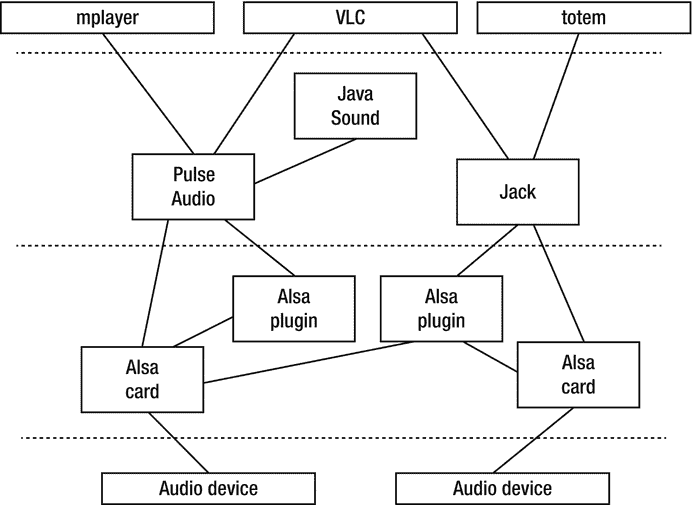
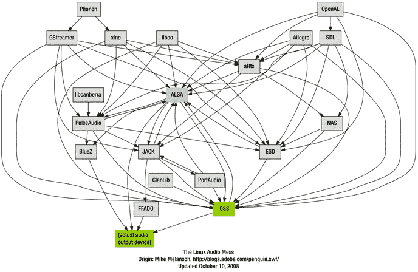
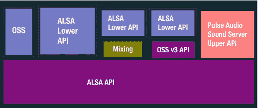

# 四、Linux 声音架构概述

像大多数 Linux 一样，Linux 声音系统已经从一个简单的系统发展成一个复杂得多的系统。本章给出了 Linux 声音系统的组件的高级概述，以及哪些位最适合用于哪些用例。

## 资源

以下是一些资源:

*   Lennart poeting([`http://0pointer.de/blog/projects/guide-to-sound-apis.html`](http://0pointer.de/blog/projects/guide-to-sound-apis.html))的 Linux 声音 API 丛林指南。
*   《工作原理:Linux 音频解释》作者 TuxRadar ( [`http://tuxradar.com/content/how-it-works-linux-audio-explained`](http://tuxradar.com/content/how-it-works-linux-audio-explained) )。
*   疯狂的编码者发布了一篇支持 Linux 中声音的 OSSv4 状态的文章毕竟不是那么抱歉( [`http://insanecoding.blogspot.com.au/2009/06/state-of-sound-in-linux-not-so-sorry.html`](http://insanecoding.blogspot.com.au/2009/06/state-of-sound-in-linux-not-so-sorry.html) )，引来了很多评论。

## 成分

图 [4-1](#Fig1) 表示 Linux 声音系统的不同层次。

图 4-1。

Layers of audio tools and devices

### 设备驱动程序

底层是硬件本身，音频设备。这些设备是由不同制造商制造的声卡，它们都有不同的功能、接口和价格。就像任何硬件一样，为了让它对操作系统可见和有用，必须有一个设备驱动程序。当然，有成千上万为 Linux 编写的设备驱动程序。编写 Linux 设备驱动程序本身就是一门专业，并且有专门的资料来源，例如 Jonathan Corbet、Alessandro Rubini 和 Greg Kroah-Hartman 编写的 Linux 设备驱动程序第三版( [`http://lwn.net/Kernel/LDD3/`](http://lwn.net/Kernel/LDD3/) )。

设备驱动程序必须在“顶部”有标准化的 API，以便设备用户有一个已知的接口来编码。OSS 设备驱动程序 API 被用于音频设备，直到它成为闭源，在这一点上开发人员切换到 ALSA API。当 OSS v4 再次开放时，内核支持 ALSA 接口，而 OSS 不支持。

理想情况下，设备驱动程序 API 应该公开硬件的所有特性，同时不增加额外的负担。对于音频，为音频驱动程序应该做的事情设定界限并不总是那么容易。例如，一些声卡将支持不同来源的模拟信号的混合，而另一些则不支持，一些声卡将具有 MIDI 合成器，而另一些则没有。如果 API 要为支持这些功能的声卡公开这些功能，那么它可能必须在软件中为不支持这些功能的声卡提供这些功能。

关于编写 ALSA 设备驱动程序的文档数量有限。位于 [`www.alsa-project.org/main/index.php/ALSA_Driver_Documentation`](http://www.alsa-project.org/main/index.php/ALSA_Driver_Documentation) 的“ALSA 驱动程序文档”页面指向一些文档，包括 2005 年由岩井隆(Takashi Iwai)编写的关于 ALSA 设备驱动程序( [`www.alsa-project.org/∼tiwai/writing-an-alsa-driver/`](http://www.alsa-project.org/~tiwai/writing-an-alsa-driver/) )的文档。还有本·科林斯 2010 年在 [`http://ben-collins.blogspot.com.au/2010/05/writing-alsa-driver-basics.html`](http://ben-collins.blogspot.com.au/2010/05/writing-alsa-driver-basics.html) 的博客，“写一个 ALSA 司机。”否则，似乎帮助不大。

### 声音服务器

Linux 是一个多任务、多线程的操作系统。并发进程可能想要同时向声卡写入声音。例如，一个邮件阅读器可能想要“叮”用户报告新邮件，即使他们正在一个嘈杂的计算机游戏中。这不同于声卡能够混合来自不同端口的声音的能力，例如 HDMI 输入端口和模拟输入端口。它需要能够混合(或管理)来自不同过程的声音。作为一个微妙的例子，每个进程的音量应该是单独可控的，还是目的地端口(耳机或扬声器)应该是单独可控的？

这些功能超出了设备驱动程序的范围。Linux 通过“声音服务器”解决了这个问题，声音服务器运行在设备驱动之上，管理这些更复杂的任务。在这些声音服务器之上是与声音服务器对话的应用，声音服务器又将结果数字信号传递给设备驱动程序。

这就是声音服务器之间的显著差异。对于专业音频系统，声音服务器必须能够以最小的延迟或其他负面影响来处理和发送音频。对于消费音频，对音量和目的地的控制可能比延迟更重要；你可能不会在意一条新信息“叮”多花了半秒钟。在这两者之间可能还有其他情况，例如需要音频和视觉效果同步的游戏以及需要模拟和数字源同步的Karaoke 播放器。

Linux 下的两大声音服务器是用于专业音频的 Jack 和用于消费系统的 PulseAudio。它们是为不同的用例设计的，因此提供不同的特性。

Lennart Poettering 在“Linux Sound API 丛林指南”( [`http://0pointer.de/blog/projects/guide-to-sound-apis.html`](http://0pointer.de/blog/projects/guide-to-sound-apis.html) )中很好地总结了这些不同的用例:

*   "我想写一个类似媒体播放器的应用！"使用 GStreamer(除非您只关注 KDE，在这种情况下，声子可能是一种替代方法)。
*   "我想在我的应用中添加事件声音！"使用 libcanberra，并根据 XDG 声音主题/命名规范安装声音文件(除非您只关注 KDE，在这种情况下，KNotify 可能是一个替代选择，尽管它有不同的关注点)。
*   "我想做专业的音频编程、硬盘录音、音乐合成、MIDI 接口！"使用插孔和/或完整的 ALSA 接口。
*   "我想做基本的 PCM 音频回放/捕获！"使用安全的 ALSA 子集。
*   “我要给我的游戏加声音！”全屏游戏用 SDL 的音频 API，Gtk+等标准 ui 的简单游戏用 libcanberra。
*   “我要写一个混音器应用！”使用您想要直接支持的层:如果您想要支持增强的桌面软件混音器，请使用 PulseAudio 音量控制 API。如果你想支持硬件混音器，使用 ALSA 混音器 API。
*   “我要给水暖层写音频软件！”使用完整的 ALSA 堆栈。
*   “我想写嵌入式应用的音频软件！”对于技术设备，通常安全的 ALSA 子集是一个很好的选择。然而，这在很大程度上取决于您的用例。

### 复杂性

图 [4-1](#Fig1) 隐藏了 Linux 声音的真正复杂性。迈克·梅兰森(Adobe 工程师)在 2007 年制作了如图 [4-2](#Fig2) 所示的图表。

图 4-2。

Linux audio relationships

这个数字不是最新的。例如，OSS 不再是 Linux 的主要部分。一些特殊情况的复杂性是，例如，PulseAudio 位于 ALSA 之上，它也位于 ALSA 之下，如图 [4-3](#Fig3) (基于 [`http://insanecoding.blogspot.com.au/2009/06/state-of-sound-in-linux-not-so-sorry.html`](http://insanecoding.blogspot.com.au/2009/06/state-of-sound-in-linux-not-so-sorry.html) 的那个)。

图 4-3。

ALSA and PulseAudio . This diagram is upside down compared to mine

解释如下:

*   PulseAudio 可以做 ALSA 做不到的事情，比如混合应用的声音。
*   PulseAudio 将其自身安装为默认的 ALSA 输出设备。
*   一个应用将音频发送到 ALSA 默认设备，后者将音频发送到 PulseAudio。
*   PulseAudio 将其与任何其他音频混合，然后将其发送回 ALSA 的特定设备。
*   然后，ALSA 弹奏混合音。

是的，很复杂，但是它完成了原本很难完成的任务。

## 结论

Linux 声音系统的架构是复杂的，并且新的皱纹会定期添加进来。然而，这对于任何音频系统都是一样的。后续章节将充实这些组件的细节。