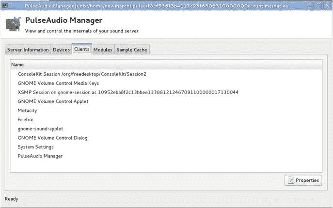
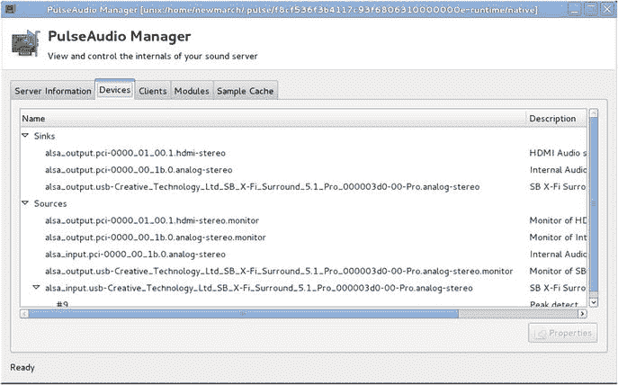
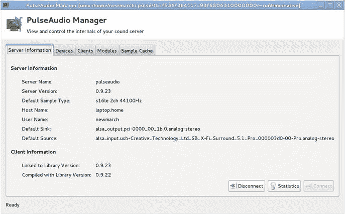
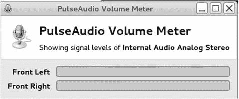
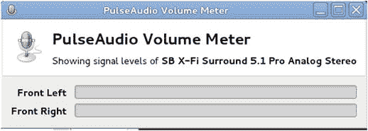
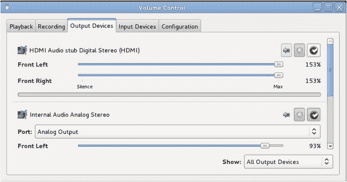
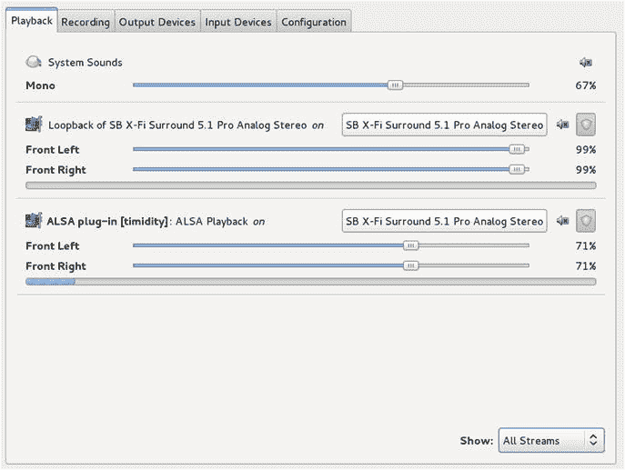
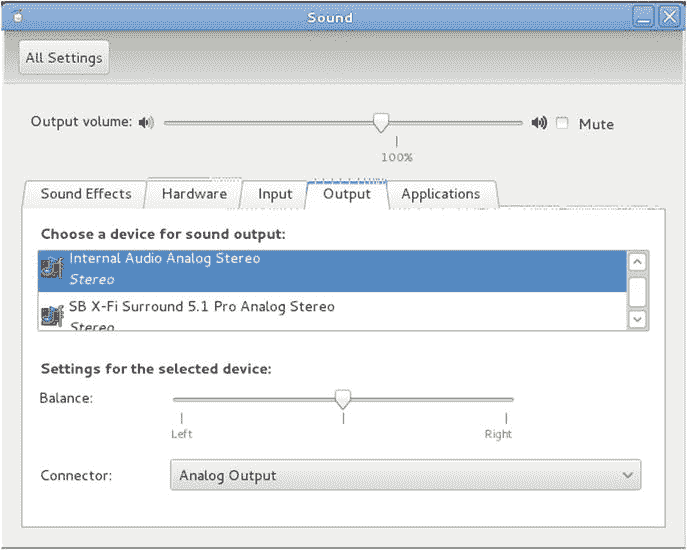

# 6 .脉冲二极管

PulseAudio 是一个声音服务器，位于 ALSA 或 OSS 等设备驱动之上。它提供了比设备驱动程序更多的功能。PulseAudio 专为消费类音频而设计，可轻松在台式机、笔记本电脑和移动设备上使用声音。多个声音源都可以播放给 PulseAudio 服务器，服务器会将它们混合在一起播放。低延迟不是设计目标，因此不适合专业音频。

## 资源

以下是一些资源:

*   PulseAudio 首页( [`www.freedesktop.org/wiki/Software/PulseAudio`](http://www.freedesktop.org/wiki/Software/PulseAudio) )
*   伦纳德的《脉冲音频和杰克》( [`http://0pointer.de/blog/projects/when-pa-and-when-not.html`](http://0pointer.de/blog/projects/when-pa-and-when-not.html) )
*   “专业音频很容易，消费音频很难”( [`http://lac.linuxaudio.org/2010/recordings/day1_1400_Pro_Audio_is_Easy_Consumer_Audio_is_Hard.ogv`](http://lac.linuxaudio.org/2010/recordings/day1_1400_Pro_Audio_is_Easy_Consumer_Audio_is_Hard.ogv) )，Lennart Poettering 的 60 分钟演讲
*   PulseAudio API 文档( [`http://freedesktop.org/software/pulseaudio/doxygen/index.html`](http://freedesktop.org/software/pulseaudio/doxygen/index.html) )

## 开始、停止和暂停脉冲音频

如果你有一个当前的 Linux 系统，PulseAudio 可能正在运行。通过从命令行运行以下命令对此进行测试:

```sh
ps agx | grep pulse

```

如果您看到类似`/usr/bin/pulseaudio --start --log-target=syslog`的行，那么它已经在运行了。

如果它没有运行，而您已经安装了它，那么使用以下命令启动它:

```sh
pulseaudio --start

```

停止 PulseAudio 并不容易。卡拉·施罗德展示了如何在 [`www.linuxplanet.com/linuxplanet/tutorials/7130/2`](http://www.linuxplanet.com/linuxplanet/tutorials/7130/2) 。最基本的问题是，PulseAudio 被设置为在被杀死后重生。你必须通过编辑`/etc/pulse/client.conf`，将`autospawn = yes`改为`autospawn = no`，并将`daemon-binary`设置为`/bin/true`来关闭它。然后，您可以终止该进程，将其从启动文件中删除，等等。

如果您想暂时运行另一个声音系统(如 Jack ),您可能只想暂停 PulseAudio。你可以通过使用`pasuspender`来实现。这需要一个命令(在`--`之后)，并将暂停 PulseAudio 服务器对音频设备的访问，直到子命令完成。例如，下面的代码将运行 Jack 服务器，PulseAudio 将退出，直到它完成:

```sh
pasuspender -- jackd

```

## 用户空间工具

除了编程 API 之外，PulseAudio 还有一系列用户级工具。这些工具提供有关 PulseAudio 系统的信息，并允许各种控制。Gnome 项目也有一个 PulseAudio 感知的控制中心。本节考虑这些工具。

### 帕曼

这将显示有关 PulseAudio 服务器、其设备和客户端的信息。图 [6-1](#Fig1) 到 [6-3](#Fig3) 显示了它给出的信息类型。



图 6-3。

Pulse Audio Manager client information



图 6-2。

Pulse Audio Manager device information



图 6-1。

Pulse Audio Manager server information

### 铺路机

`pavumeter`是一个简单的仪表，用于显示默认设备的输入或输出电平。当`pavumeter`运行时，显示播放设备，如图 [6-4](#Fig4) 所示。



图 6-4。

Pulse Audio playback volume meter

如果由`pavumeter --record`运行，则显示记录设备，如图 [6-5](#Fig5) 所示。



图 6-5。

Pulse Audio record volume meter

### pavucontrol

`pavucontrol`允许您控制不同连接的音频设备的输入和输出音量，如图 [6-6](#Fig6) 所示。



图 6-6。

Pulse Audio pavucontrol output devices

通过这些选项卡，`pavucontrol`是一个设备级混音器，能够控制各个设备的整体音量。

PulseAudio 的一个特殊优势是可以进行应用级混音。如果两个音频源写入同一个 PulseAudio 设备，音频将被混合到输出设备。`pavucontrol`可以使用 Playback 选项卡显示多个应用，显示当前正在混合的所有应用或所有流。每个流都可以单独控制其通道音量。

例如，廉价的卡拉 ok 可以通过以下方式将麦克风的直通模块设置为扬声器:

```sh
pactl load-module module-loopback latency_msec=1

```

卡拉 ok 文件由诸如`kmid`到`timidity`的卡拉 ok 播放器播放。这里有一个例子:

```sh
kmid nightsin.kar

```

当这两个运行时，可以使用`pavucontrol`控制相对音量，如图 [6-7](#Fig7) 。



图 6-7。

Pulse Audio pavucontrol multiple devices

### Gnome 控制中心(声音)

命令`gnome-control-center sound`允许完全查看和控制连接的声音设备，包括选择默认输入和输出设备。看起来像图 [6-8](#Fig8) 。



图 6-8。

Gnome control center

### parec/paplay/pacat

`parec`、`paplay`和`pacatare`是录制和回放声音文件的命令行工具。它们都是指向相同代码的符号链接，只是链接的名称不同。默认格式是 PCM s16。有许多选择，但它们并不总是如你所愿。例如，要以最小的延迟从默认录制设备播放到默认播放设备，请使用以下命令:

```sh
pacat -r --latency-msec=1 | pacat -p --latency-msec=1

```

这实际上有大约 50 毫秒的延迟。

### pactl/pacmd

这两个命令基本上做同样的事情。`pacmd`是选项更多的互动版。例如，带有命令`list-sinks`的`pacmd`包括以下内容:

```sh
        name: <alsa_output.pci-0000_00_1b.0.analog-stereo>
        driver: <module-alsa-card.c>
        flags: HARDWARE HW_MUTE_CTRL HW_VOLUME_CTRL DECIBEL_VOLUME LATENCY FLAT_VOLUME DYNAMIC_LATENCY
        state: SUSPENDED
        suspend cause: IDLE
        priority: 9959
        volume: 0:  93% 1:  93%
                0: -1.88 dB 1: -1.88 dB
                balance 0.00
        base volume: 100%
                     0.00 dB
        volume steps: 65537
        muted: no
        current latency: 0.00 ms
        max request: 0 KiB
        max rewind: 0 KiB
        monitor source: 1
        sample spec: s16le 2ch 44100Hz
        channel map: front-left,front-right
                     Stereo
        used by: 0
        linked by: 0
        configured latency: 0.00 ms; range is 16.00 .. 2000.00 ms
        card: 1 <alsa_card.pci-0000_00_1b.0>
        module: 5
        properties:

                alsa.resolution_bits = "16"
                device.api = "alsa"
                device.class = "sound"
                alsa.class = "generic"
                alsa.subclass = "generic-mix"
                alsa.name = "STAC92xx Analog"
                alsa.id = "STAC92xx Analog"
                alsa.subdevice = "0"
                alsa.subdevice_name = "subdevice #0"
                alsa.device = "0"
                alsa.card = "0"
                alsa.card_name = "HDA Intel PCH"
                alsa.long_card_name = "HDA Intel PCH at 0xe6e60000 irq 47"
                alsa.driver_name = "snd_hda_intel"
                device.bus_path = "pci-0000:00:1b.0"
                sysfs.path = "/devices/pci0000:00/0000:00:1b.0/sound/card0"
                device.bus = "pci"
                device.vendor.id = "8086"
                device.vendor.name = "Intel Corporation"
                device.product.id = "1c20"
                device.product.name = "6 Series/C200 Series Chipset Family High Definition Audio Controller"
                device.form_factor = "internal"
                device.string = "front:0"
                device.buffering.buffer_size = "352800"
                device.buffering.fragment_size = "176400"
                device.access_mode = "mmap+timer"
                device.profile.name = "analog-stereo"
                device.profile.description = "Analog Stereo"
                device.description = "Internal Audio Analog Stereo"
                alsa.mixer_name = "IDT 92HD90BXX"
                alsa.components = "HDA:111d76e7,10280494,00100102"
                module-udev-detect.discovered = "1"
                device.icon_name = "audio-card-pci"
        ports:
                analog-output: Analog Output (priority 9900)
                analog-output-headphones: Analog Headphones (priority 9000)
        active port: <analog-output>

```

### 设备名称

PulseAudio 使用自己的命名约定。使用 PulseAudio FAQ ( [`www.freedesktop.org/wiki/Software/PulseAudio/FAQ#How_do_I_record_stuff.3F`](http://www.freedesktop.org/wiki/Software/PulseAudio/FAQ#How_do_I_record_stuff.3F) )中的代码可以找到源设备(如麦克风)的名称。

```sh
pactl list | grep -A2 'Source #' | grep 'Name: .*\.monitor$' | cut -d" " -f2

```

在我的系统上，这会产生以下结果:

```sh
alsa_output.pci-0000_01_00.1.hdmi-stereo.monitor
alsa_output.pci-0000_00_1b.0.analog-stereo.monitor
alsa_input.pci-0000_00_1b.0.analog-stereo

```

类似地，输出设备如下:

```sh
pactl list | grep -A2 'Sink #' | grep 'Name: .*\.monitor$' | cut -d" " -f2

```

这给出了以下内容:

```sh
alsa_output.pci-0000_01_00.1.hdmi-stereo
alsa_output.pci-0000_00_1b.0.analog-stereo

```

### 环回模块

使用`pactl`，您可以加载模块`module-loopback`,如下所示:

```sh
pactl load-module module-loopback latency_msec=1

```

当加载模块时，声音在内部从输入设备传送到输出设备。延迟实际上为零。

如果你把这个模块装入，比如说，你的笔记本电脑，拔下扬声器，麦克风等等的时候要小心。内部扬声器和麦克风足够近，可以建立一个反馈回路。用以下命令卸载 N 号模块:

```sh
pactl unload-module N

```

(如果您忘记了模块号，只需运行`pactl`就会列出所有模块，这样您就可以识别环回模块。)

### 脉动音频和 ALSA

`pacmd`的输出显示 PulseAudio 使用 ALSA。关系更深:默认的 ALSA 设备是`hw:0`，但是 PulseAudio 覆盖了它。在`/etc/asound.conf`中有一个用来装载`/etc/alsa/pulse-default.conf`的钩子，它包含以下内容:

```sh
pcm.!default {
    type pulse
    hint {
        description "Default"
    }
}

```

这将使用 PulseAudio 模块替换默认设备。

打开默认的 ALSA 设备实际上会调用 PulseAudio，然后 pulse audio 会用它选择的设备回调 ALSA。

## 使用 PulseAudio 编程

PulseAudio 及其文档的来源是 PulseAudio 2.0 ( [`http://freedesktop.org/software/pulseaudio/doxygen/index.html`](http://freedesktop.org/software/pulseaudio/doxygen/index.html) )。使用 PulseAudio 编程有两种方式:简单 API 和异步 API。这两者都将在下面的章节中介绍。

## 简单 API

PulseAudio 有一个“简单”的 API 和一个复杂得多的异步 API。简单的 API 可能足以满足您的需求。

简单 API 有一小组函数，如下所示:

```sh
pa_simple * pa_simple_new (const char *server, const char *name, pa_stream_direction_t dir, const char *dev, const char *stream_name, const pa_sample_spec *ss, const pa_channel_map *map, const pa_buffer_attr *attr, int *error)
        Create a new connection to the server.
void    pa_simple_free (pa_simple *s)
        Close and free the connection to the server.
int     pa_simple_write (pa_simple *s, const void *data, size_t bytes, int *error)
        Write some data to the server.
int     pa_simple_drain (pa_simple *s, int *error)
        Wait until all data already written is played by the daemon.
int     pa_simple_read (pa_simple *s, void *data, size_t bytes, int *error)
        Read some data from the server.
pa_usec_t pa_simple_get_latency (pa_simple *s, int *error)
        Return the playback latency.
int     pa_simple_flush (pa_simple *s, int *error)
        Flush the playback buffer

.

```

### 播放文件

“从文件播放到默认输出设备”旁边显示的程序来自 PulseAudio 网站。基本结构如下:

1.  创建新的播放流(`pa_simple_new`)。
2.  从文件中读取块(`read` )…
3.  …把它们写到流中(`pa_simple_write`)。
4.  通过冲洗水流结束(`pa_simple_drain`)。

节目是`pacat-simple.c`。更奇怪的是，它做了一个`dup2`来将打开的文件描述符映射到`stdin`上，然后从`stdin`中读取。没必要这样。为什么不直接从原始文件描述符中读取呢？

```sh
/***
 *   This file is part of PulseAudio.
 *
 *   PulseAudio is free software; you can redistribute it and/or modify
 *   it under the terms of the GNU Lesser General Public License as published
 *   by the Free Software Foundation; either version 2.1 of the License,
 *   or (at your option) any later version.
 *
 *   PulseAudio is distributed in the hope that it will be useful, but
 *   WITHOUT ANY WARRANTY; without even the implied warranty of
 *   MERCHANTABILITY or FITNESS FOR A PARTICULAR PURPOSE. See the GNU
 *   General Public License for more details.
 *
 *   You should have received a copy of the GNU Lesser General Public License
 *   along with PulseAudio; if not, write to the Free Software
 *   Foundation, Inc., 59 Temple Place, Suite 330, Boston, MA 02111-1307
 *   USA.
 ****/

#ifdef HAVE_CONFIG_H
#include <config.h>
#endif

#include <stdio.h>

#include <unistd.h>
#include <string.h>
#include <errno.h>
#include <fcntl.h>

#include <pulse/simple.h>
#include <pulse/error.h>

#define BUFSIZE 1024

int main(int argc, char*argv[]) {

    // set to NULL for default output device
    char *device = "alsa_output.pci-0000_00_1b.0.analog-stereo";

    /* The Sample format to use */
    static const pa_sample_spec ss = {
        .format = PA_SAMPLE_S16LE,
        .rate = 44100,
        .channels = 2
    };

    pa_simple *s = NULL;
    int ret = 1;
    int error;

    /* replace STDIN with the specified file if needed */
    if (argc > 1) {
        int fd;

        if ((fd = open(argv[1], O_RDONLY)) < 0) {
            fprintf(stderr, __FILE__": open() failed: %s\n", strerror(errno));
            goto finish;
        }

        if (dup2(fd, STDIN_FILENO) < 0) {
            fprintf(stderr, __FILE__": dup2() failed: %s\n", strerror(errno));
            goto finish;
        }

        close(fd);
    }

    /* Create a new playback stream */
    if (!(s = pa_simple_new(NULL, argv[0], PA_STREAM_PLAYBACK, device, "playback", &ss, NULL, NULL, &error))) {
        fprintf(stderr, __FILE__": pa_simple_new() failed: %s\n", pa_strerror(error));
        goto finish;

    }

    for (;;) {
        uint8_t buf[BUFSIZE];
        ssize_t r;

#if 1
        pa_usec_t latency;

        if ((latency = pa_simple_get_latency(s, &error)) == (pa_usec_t) -1) {
            fprintf(stderr, __FILE__": pa_simple_get_latency() failed: %s\n", pa_strerror(error));
            goto finish;
        }

        fprintf(stderr, "%0.0f usec    \r", (float)latency);
#endif

        /* Read some data ... */
        if ((r = read(STDIN_FILENO, buf, sizeof(buf))) <= 0) {
            if (r == 0) /* EOF */
                break;

            fprintf(stderr, __FILE__": read() failed: %s\n", strerror(errno));
            goto finish;
        }

        /* ... and play it */
        if (pa_simple_write(s, buf, (size_t) r, &error) < 0) {
            fprintf(stderr, __FILE__": pa_simple_write() failed: %s\n", pa_strerror(error));
            goto finish;
        }
    }

    /* Make sure that every single sample was played */
    if (pa_simple_drain(s, &error) < 0) {
        fprintf(stderr, __FILE__": pa_simple_drain() failed: %s\n", pa_strerror(error));
        goto finish;

    }

    ret = 0;

finish:

    if (s)
        pa_simple_free(s);

    return ret;
}

```

### 记录到文件中

“从默认输入设备记录到文件”旁边显示的程序来自 PulseAudio 网站。叫`parec-simple.c`。基本结构如下:

1.  创建新的录制流(`pa_simple_new`)。
2.  从流中读取块(`pa_simple_read` )…
3.  …将它们写入输出(`write`)。
4.  通过释放流来结束(`pa_simple_free`)。

注意，您需要使用一个`pa_sample_spec`来告诉 PulseAudio 写入数据的格式。这里我选择了双通道、44100Hz 和 PCM 16 位小端格式。

```sh
/***
  This file is part of PulseAudio.

  PulseAudio is free software; you can redistribute it and/or modify
  it under the terms of the GNU Lesser General Public License as published
  by the Free Software Foundation; either version 2.1 of the License,
  or (at your option) any later version.

  PulseAudio is distributed in the hope that it will be useful, but
  WITHOUT ANY WARRANTY; without even the implied warranty of
  MERCHANTABILITY or FITNESS FOR A PARTICULAR PURPOSE. See the GNU
  General Public License for more details.

  You should have received a copy of the GNU Lesser General Public License
  along with PulseAudio; if not, write to the Free Software
  Foundation, Inc., 59 Temple Place, Suite 330, Boston, MA 02111-1307
  USA.
***/

#ifdef HAVE_CONFIG_H
#include <config.h>
#endif

#include <stdio.h>
#include <unistd.h>
#include <string.h>
#include <errno.h>

#include <pulse/simple.h>
#include <pulse/error.h>

#define BUFSIZE 1024

/* A simple routine calling UNIX write() in a loop */
static ssize_t loop_write(int fd, const void*data, size_t size) {
    ssize_t ret = 0;

    while (size > 0) {
        ssize_t r;

        if ((r = write(fd, data, size)) < 0)
            return r;

        if (r == 0)
            break;

        ret += r;
        data = (const uint8_t*) data + r;
        size -= (size_t) r;
    }

    return ret;

}

int main(int argc, char*argv[]) {
    /* The sample type to use */
    static const pa_sample_spec ss = {
        .format = PA_SAMPLE_S16LE,
        .rate = 44100,
        .channels = 2
    };
    pa_simple *s = NULL;
    int ret = 1;
    int error;

    /* Create the recording stream */
    if (!(s = pa_simple_new(NULL, argv[0], PA_STREAM_RECORD, NULL, "record", &ss, NULL, NULL, &error))) {
        fprintf(stderr, __FILE__": pa_simple_new() failed: %s\n", pa_strerror(error));
        goto finish;
    }

    for (;;) {
        uint8_t buf[BUFSIZE];

        /* Record some data ... */
        if (pa_simple_read(s, buf, sizeof(buf), &error) < 0) {
            fprintf(stderr, __FILE__": pa_simple_read() failed: %s\n", pa_strerror(error));
            goto finish;
        }

        /* And write it to STDOUT */
        if (loop_write(STDOUT_FILENO, buf, sizeof(buf)) != sizeof(buf)) {
            fprintf(stderr, __FILE__": write() failed: %s\n", strerror(errno));
            goto finish;

        }
    }

    ret = 0;

finish:

    if (s)
        pa_simple_free(s);

    return ret;
}

```

此操作的输出是一个 PCM s16 文件。您可以使用`sox`(例如`sox -c 2 -r 44100 tmp.s16 tmp.wav`)将其转换为另一种格式，也可以将其作为原始数据导入 Audacity 并直接播放。

这些对于实时音频有多好？第一个程序可以显示等待时间(将`#if 0`改为`#if 1`)。这段代码也可以复制到第二段。结果并不好。

*   在我的笔记本电脑上录制有 11 毫秒的延迟。
*   回放有 130 毫秒的延迟。

### 从源到汇播放

您可以将这两个程序结合起来，使用录音和播放流从麦克风复制到扬声器。程序是`pa-mic-2-speaker-simple.c`，如下图所示:

```sh
#ifdef HAVE_CONFIG_H
#include <config.h>
#endif

#include <stdio.h>
#include <unistd.h>
#include <string.h>
#include <errno.h>
#include <fcntl.h>

#include <pulse/simple.h>
#include <pulse/error.h>

#define BUFSIZE 32

int main(int argc, char*argv[]) {

    /* The Sample format to use */
    static const pa_sample_spec ss = {
        .format = PA_SAMPLE_S16LE,
        .rate = 44100,
        .channels = 2
    };

    pa_simple *s_in, *s_out = NULL;
    int ret = 1;
    int error;

    /* Create a new playback stream */
    if (!(s_out = pa_simple_new(NULL, argv[0], PA_STREAM_PLAYBACK, NULL, "playback", &ss, NULL, NULL, &error))) {
        fprintf(stderr, __FILE__": pa_simple_new() failed: %s\n", pa_strerror(error));
        goto finish;
    }

      if (!(s_in = pa_simple_new(NULL, argv[0], PA_STREAM_RECORD, NULL, "record", &ss, NULL, NULL, &error))) {
        fprintf(stderr, __FILE__": pa_simple_new() failed: %s\n", pa_strerror(error));
        goto finish;
    }

    for (;;) {
        uint8_t buf[BUFSIZE];

        ssize_t r;

#if 1
        pa_usec_t latency;

        if ((latency = pa_simple_get_latency(s_in, &error)) == (pa_usec_t) -1) {
            fprintf(stderr, __FILE__": pa_simple_get_latency() failed: %s\n", pa_strerror(error));
            goto finish;
        }

        fprintf(stderr, "In:  %0.0f usec    \r\n", (float)latency);

        if ((latency = pa_simple_get_latency(s_out, &error)) == (pa_usec_t) -1) {
            fprintf(stderr, __FILE__": pa_simple_get_latency() failed: %s\n", pa_strerror(error));
            goto finish;
        }

        fprintf(stderr, "Out: %0.0f usec    \r\n", (float)latency);
#endif

        if (pa_simple_read(s_in, buf, sizeof(buf), &error) < 0) {

            fprintf(stderr, __FILE__": read() failed: %s\n", strerror(errno));
            goto finish;
        }

        /* ... and play it */
        if (pa_simple_write(s_out, buf, sizeof(buf), &error) < 0) {
            fprintf(stderr, __FILE__": pa_simple_write() failed: %s\n", pa_strerror(error));
            goto finish;
        }
    }

    /* Make sure that every single sample was played */
    if (pa_simple_drain(s_out, &error) < 0) {
        fprintf(stderr, __FILE__": pa_simple_drain() failed: %s\n", pa_strerror(error));
        goto finish;
    }

    ret = 0;

finish:

    if (s_in)
        pa_simple_free(s_in);
    if (s_out)
        pa_simple_free(s_out);

    return ret;
}

```

试着运行它，你会发现延迟是明显的，并且不令人满意。

## 异步 API

简单的 API 很简单。相比之下，异步 API 又大又复杂。使用这个 API 的例子也很少。

几乎所有与该 API 的交互都是异步的。对 PulseAudio 服务器发出一个调用，当响应就绪时，一个库调用一个回调函数，您将在发出库调用时将这个函数传递给它。这避免了用户代码阻塞或进行轮询调用的需要。

基本结构如下:

1.  创建一个 PulseAudio 主循环(同步:`pa_mainloop_new`)。
2.  获取`mainloop` API 对象，这是一个`mainloop`函数的表(同步:`pa_mainloop_get_api`)。
3.  获取一个上下文对象与 PulseAudio 服务器对话(同步:`pa_context_new`)。
4.  建立与 PulseAudio 服务器的连接。这就是异步:`pa_context_connect`。
5.  从服务器注册上下文状态更改的回调:`pa_context_set_state_callback`。
6.  开始事件处理循环(`pa_mainloop_run`)。
7.  在上下文状态回调中，确定什么状态已经更改。例如，连接已经建立。
8.  在这个回调中，设置、记录或回放流。
9.  为这些流建立进一步的回调。
10.  在流回调中，进行更多的处理，比如将记录流保存到文件中。

步骤 1-7 对于大多数应用来说都是常见的。将调用上下文状态回调来响应服务器中的更改。这些是状态变化，例如`PA_CONTEXT_CONNECTIN`、`PA_CONTEXT_SETTING_NAME`等等。与大多数应用相关的变化将是`PA_CONTEXT_READY`。这意味着应用可以在稳定状态下向服务器发出请求。

在第 8 步中，应用将设置自己的行为。这是通过为各种操作设置进一步的回调函数来实现的，比如列出设备或播放音频。

### 设备列表

函数`pa_context_get_sink_info_list`将设置一个回调函数，列出源设备，如下所示:

```sh
pa_context_get_sink_info_list(c, sinklist_cb, NULL)

```

其中`c`是上下文，`sinklist_cb`是应用的回调，`NULL`是传递给回调的用户数据。

回调的调用方式如下:

```sh
void sinklist_cb(pa_context *c, const pa_sink_info *i, int eol, void *userdata)

```

参数`eol`可以取三个值:负表示某种失败，零表示`pa_sink_info`的有效条目，正表示列表中不再有有效条目。

结构`pa_sink_info`定义如下:

```sh
struct {
  const char *  name;
  uint32_t      index;
  const char *  description;
  pa_sample_spec        sample_spec;
  pa_channel_map        channel_map;
  uint32_t      owner_module;
  pa_cvolume    volume;
  int   mute;
  uint32_t      monitor_source;
  const char *  monitor_source_name;
  pa_usec_t     latency;
  const char *  driver;
  pa_sink_flags_t       flags;
  pa_proplist *         proplist;
  pa_usec_t     configured_latency;
  pa_volume_t   base_volume;
  pa_sink_state_t       state;
  uint32_t      n_volume_steps;
  uint32_t      card;
  uint32_t      n_ports;
  pa_sink_port_info **  ports;
  pa_sink_port_info *   active_port;
  uint8_t       n_formats;
  pa_format_info **     formats;
} pa_sink_info

```

关于此结构的更多信息保存在 Doxygen " `pa_sink_info`结构参考"( [`http://freedesktop.org/software/pulseaudio/doxygen/structpa__sink__info.html`](http://freedesktop.org/software/pulseaudio/doxygen/structpa__sink__info.html) )中。

供参考，主要字段是`name`和`description`。`index`是一些数据结构的不透明索引，在许多 PulseAudio 函数中使用。`proplist`是可能包含有趣信息的一般信息图。这可以通过遍历地图来检索。

输入设备也有类似的回调和数据结构。

```sh
A program to list input and output devices current when the application connects to the server is palist_devices.c:
/**
 * palist_devices.c
 * Jan Newmarch
 */

#include <stdio.h>
#include <string.h>
#include <pulse/pulseaudio.h>

#define _(x) x

// quit when this reaches 2
int no_more_sources_or_sinks = 0;

int ret;

pa_context *context;

void show_error(char *s) {
    fprintf(stderr, "%s\n", s);
}

void print_properties(pa_proplist *props) {
    void *state = NULL;

    printf("  Properties are: \n");
    while (1) {
        char *key;
        if ((key = pa_proplist_iterate(props, &state)) == NULL) {
            return;
        }
        char *value = pa_proplist_gets(props, key);
        printf("   key: %s, value: %s\n", key, value);
    }
}

/**
 * print information about a sink
 */
void sinklist_cb(pa_context *c, const pa_sink_info *i, int eol, void *userdata) {

    // If eol is set to a positive number, you're at the end of the list
    if (eol > 0) {
        printf("**No more sinks\n");
        no_more_sources_or_sinks++;
        if (no_more_sources_or_sinks == 2)
            exit(0);
        return;
    }

    printf("Sink: name %s, description %s\n", i->name, i->description);
    print_properties(i->proplist);
}

/**
 * print information about a source

 */
void sourcelist_cb(pa_context *c, const pa_source_info *i, int eol, void *userdata) {
    if (eol > 0) {
        printf("**No more sources\n");
        no_more_sources_or_sinks++;
        if (no_more_sources_or_sinks == 2)
            exit(0);
        return;
    }

    printf("Source: name %s, description %s\n", i->name, i->description);
    print_properties(i->proplist);
}

void context_state_cb(pa_context *c, void *userdata) {

    switch (pa_context_get_state(c)) {
    case PA_CONTEXT_UNCONNECTED:
    case PA_CONTEXT_CONNECTING:
    case PA_CONTEXT_AUTHORIZING:
    case PA_CONTEXT_SETTING_NAME:
        break;

    case PA_CONTEXT_READY: {
        pa_operation *o;

        // set up a callback to tell us about source devices
        if (!(o = pa_context_get_source_info_list(c,
                                            sourcelist_cb,
                                            NULL
                                                  ))) {
            show_error(_("pa_context_subscribe() failed"));
            return;
        }
        pa_operation_unref(o);

        // set up a callback to tell us about sink devices
        if (!(o = pa_context_get_sink_info_list(c,
                                            sinklist_cb,
                                            NULL
                                                  ))) {
            show_error(_("pa_context_subscribe() failed"));
            return;
        }
        pa_operation_unref(o);

        break;
    }

    case PA_CONTEXT_FAILED:
    case PA_CONTEXT_TERMINATED:
    default:
        return;
    }
}

int main(int argc, char *argv[]) {

    // Define our pulse audio loop and connection variables
    pa_mainloop *pa_ml;
    pa_mainloop_api *pa_mlapi;

    // Create a mainloop API and connection to the default server
    pa_ml = pa_mainloop_new();
    pa_mlapi = pa_mainloop_get_api(pa_ml);
    context = pa_context_new(pa_mlapi, "Device list");

    // This function connects to the pulse server
    pa_context_connect(context, NULL, 0, NULL);

    // This function defines a callback so the server will tell us its state.
    pa_context_set_state_callback(context, context_state_cb, NULL);

    if (pa_mainloop_run(pa_ml, &ret) < 0) {
        printf("pa_mainloop_run() failed.");
        exit(1);
    }
}

```

在我的笔记本电脑上，它给出了以下内容(省略):

```sh
Source: name alsa_output.pci-0000_01_00.1.hdmi-stereo.monitor, description Monitor of HDMI Audio stub Digital Stereo (HDMI)
  Properties are:
   key: device.description, value: Monitor of HDMI Audio stub Digital Stereo (HDMI)
   key: device.class, value: monitor
   key: alsa.card, value: 1
   key: alsa.card_name, value: HDA NVidia
   key: alsa.long_card_name, value: HDA NVidia at 0xe5080000 irq 17
   key: alsa.driver_name, value: snd_hda_intel
   key: device.bus_path, value: pci-0000:01:00.1
   key: sysfs.path, value: /devices/pci0000:00/0000:00:01.0/0000:01:00.1/sound/card1
   key: device.bus, value: pci
   key: device.vendor.id, value: 10de
   key: device.vendor.name, value: nVidia Corporation
   key: device.product.id, value: 0e08
   key: device.product.name, value: HDMI Audio stub
   key: device.string, value: 1
   key: module-udev-detect.discovered, value: 1
   key: device.icon_name, value: audio-card-pci
Source: name alsa_output.pci-0000_00_1b.0.analog-stereo.monitor, description Monitor of Internal Audio Analog Stereo
  Properties are:
   ...
Source: name alsa_input.pci-0000_00_1b.0.analog-stereo, description Internal Audio Analog Stereo
  Properties are:
  ...
Source: name alsa_output.usb-Creative_Technology_Ltd_SB_X-Fi_Surround_5.1_Pro_000003d0-00-Pro.analog-stereo.monitor, description Monitor of SB X-Fi Surround 5.1 Pro Analog Stereo
  Properties are:
  ...
Source: name alsa_input.usb-Creative_Technology_Ltd_SB_X-Fi_Surround_5.1_Pro_000003d0-00-Pro.analog-stereo, description SB X-Fi Surround 5.1 Pro Analog Stereo
  Properties are: 

  ...
**No more sources
Sink: name alsa_output.pci-0000_01_00.1.hdmi-stereo, description HDMI Audio stub Digital Stereo (HDMI)
  Properties are:
   key: alsa.resolution_bits, value: 16
   key: device.api, value: alsa
   key: device.class, value: sound
   key: alsa.class, value: generic
   key: alsa.subclass, value: generic-mix
   key: alsa.name, value: HDMI 0
   key: alsa.id, value: HDMI 0
   key: alsa.subdevice, value: 0
   key: alsa.subdevice_name, value: subdevice #0
   key: alsa.device, value: 3
   key: alsa.card, value: 1
   key: alsa.card_name, value: HDA NVidia
   key: alsa.long_card_name, value: HDA NVidia at 0xe5080000 irq 17
   key: alsa.driver_name, value: snd_hda_intel
   key: device.bus_path, value: pci-0000:01:00.1
   key: sysfs.path, value: /devices/pci0000:00/0000:00:01.0/0000:01:00.1/sound/card1
   key: device.bus, value: pci
   key: device.vendor.id, value: 10de
   key: device.vendor.name, value: nVidia Corporation
   key: device.product.id, value: 0e08
   key: device.product.name, value: HDMI Audio stub

   key: device.string, value: hdmi:1
   key: device.buffering.buffer_size, value: 352768
   key: device.buffering.fragment_size, value: 176384
   key: device.access_mode, value: mmap+timer
   key: device.profile.name, value: hdmi-stereo
   key: device.profile.description, value: Digital Stereo (HDMI)
   key: device.description, value: HDMI Audio stub Digital Stereo (HDMI)
   key: alsa.mixer_name, value: Nvidia GPU 1c HDMI/DP
   key: alsa.components, value: HDA:10de001c,10281494,00100100
   key: module-udev-detect.discovered, value: 1
   key: device.icon_name, value: audio-card-pci
Sink: name alsa_output.pci-0000_00_1b.0.analog-stereo, description Internal Audio Analog Stereo
  Properties are:
  ...
Sink: name alsa_output.usb-Creative_Technology_Ltd_SB_X-Fi_Surround_5.1_Pro_000003d0-00-Pro.analog-stereo, description SB X-Fi Surround 5.1 Pro Analog Stereo
  Properties are:
  ...
**No more sinks

```

一个具有相同效果的替代程序是由 Igor Brezac 和 Eric Connell 编写的 PulseAudio:一个获取设备列表的异步示例( [`www.ypass.net/blog/2009/10/pulseaudio-an-async-example-to-get-device-lists`](http://www.ypass.net/blog/2009/10/pulseaudio-an-async-example-to-get-device-lists) )。它不像前一个那样遵循复杂的路线，因为它只向服务器查询它的设备。然而，它使用自己的状态机来跟踪它在回调过程中的位置！

### 监测正在发生的变化:新的源和汇

前面的程序列出了在建立与服务器的连接时向 PulseAudio 注册的源设备和接收设备。但是，当连接新设备或断开现有设备时，PulseAudio 会在上下文中注册一个更改，这也可以通过回调来监控。

这样做的关键是用`pa_context_subscribe`订阅上下文变化。这需要一个上下文、订阅事件的掩码和用户数据。掩码的可能值在 [`http://freedesktop.org/software/pulseaudio/doxygen/def_8h.html#ad4e7f11f879e8c77ae5289145ecf6947`](http://freedesktop.org/software/pulseaudio/doxygen/def_8h.html#ad4e7f11f879e8c77ae5289145ecf6947) 处描述，包括汇点变化的`PA_SUBSCRIPTION_MASK_SINK`和汇点输入事件的`PA_SUBSCRIPTION_MASK_SINK_INPUT`。

设置回调函数来监控这些变化有点奇怪。函数`pa_context_subscribe`接受一个类型为`pa_context_success_cb`的回调函数，但是它不包含关于回调原因的信息。与其这样，还不如先给`pa_context_set_subscribe_callback`打电话。这需要一个类型为`pa_context_subscribe_cb_t`的回调函数，它确实传递了这样的信息。然后在`pa_context_subscribe`用`NULL`回拨！

在`pa_context_subscribe_cb_t`订阅回调中，可以检查回调的原因并调用适当的代码。如果发现一个新的接收器订阅，那么可以用`pa_context_get_sink_info_by_index`找到关于接收器的信息，这需要另一个回调！在追踪所有这些回调之后，您最终可以获得新设备的信息。

注意`pa_context_get_sink_info_list`使用的回调函数和`pa_context_get_sink_info_by_index`使用的回调函数是一样的。无论接收器设备是单个设备还是设备列表中的一个设备，每个接收器设备都会调用一次回调。

```sh
A program to list devices on connection and also to list changes as devices are connected or disconnected is palist_devices_ongoing.c:
/**
 * palist_clients.c
 * Jan Newmarch
 */

/***
    This file is based on pacat.c and pavuctl.c,  part of PulseAudio.

    pacat.c:
    Copyright 2004-2006 Lennart Poettering
    Copyright 2006 Pierre Ossman <ossman@cendio.se> for Cendio AB

    PulseAudio is free software; you can redistribute it and/or modify
    it under the terms of the GNU Lesser

General Public License as published
    by the Free Software Foundation; either version 2.1 of the License,
    or (at your option) any later version.

    PulseAudio is distributed in the hope that it will be useful, but
    WITHOUT ANY WARRANTY; without even the implied warranty of
    MERCHANTABILITY or FITNESS FOR A PARTICULAR PURPOSE. See the GNU
    General Public License for more details.

    You should have received a copy of the GNU Lesser General Public License
    along with PulseAudio; if not, write to the Free Software
    Foundation, Inc., 59 Temple Place, Suite 330, Boston, MA 02111-1307
    USA.
***/

#include <stdio.h>
#include <string.h>
#include <pulse/pulseaudio.h>

#define _(x) x

int ret;

pa_context *context;

void show_error(char *s) {
    fprintf(stderr, "%s\n", s);
}

void print_properties(pa_proplist *props) {
    void *state = NULL;

    printf("  Properties are: \n");
    while (1) {
        char *key;
        if ((key = pa_proplist_iterate(props, &state)) == NULL) {
            return;
        }
        char *value = pa_proplist_gets(props, key);
        printf("   key: %s, value: %s\n", key, value);
    }
}

/**
 * print information about a sink

 */
void sink_cb(pa_context *c, const pa_sink_info *i, int eol, void *userdata) {

    // If eol is set to a positive number, you're at the end of the list
    if (eol > 0) {
        return;
    }

    printf("Sink: name %s, description %s\n", i->name, i->description);
    // print_properties(i->proplist);
}

/**
 * print information about a source
 */
void source_cb(pa_context *c, const pa_source_info *i, int eol, void *userdata) {
    if (eol > 0) {
        return;
    }

    printf("Source: name %s, description %s\n", i->name, i->description);
    // print_properties(i->proplist);
}

void subscribe_cb(pa_context *c, pa_subscription_event_type_t t, uint32_t index, void *userdata) {

    switch (t & PA_SUBSCRIPTION_EVENT_FACILITY_MASK) {

    case PA_SUBSCRIPTION_EVENT_SINK:
        if ((t & PA_SUBSCRIPTION_EVENT_TYPE_MASK) == PA_SUBSCRIPTION_EVENT_REMOVE)
            printf("Removing sink index %d\n", index);
        else {
            pa_operation *o;
            if (!(o = pa_context_get_sink_info_by_index(c, index, sink_cb, NULL))) {
                show_error(_("pa_context_get_sink_info_by_index() failed"));
                return;

            }
            pa_operation_unref(o);
        }
        break;

    case PA_SUBSCRIPTION_EVENT_SOURCE:
        if ((t & PA_SUBSCRIPTION_EVENT_TYPE_MASK) == PA_SUBSCRIPTION_EVENT_REMOVE)
            printf("Removing source index %d\n", index);
        else {
            pa_operation *o;
            if (!(o = pa_context_get_source_info_by_index(c, index, source_cb, NULL))) {
                show_error(_("pa_context_get_source_info_by_index() failed"));
                return;
            }
            pa_operation_unref(o);
        }
        break;
    }
}

void context_state_cb(pa_context *c, void *userdata) {

    switch (pa_context_get_state(c)) {
    case PA_CONTEXT_UNCONNECTED:
    case PA_CONTEXT_CONNECTING:
    case PA_CONTEXT_AUTHORIZING:
    case PA_CONTEXT_SETTING_NAME:
        break;

    case PA_CONTEXT_READY: {
        pa_operation *o;

        if (!(o = pa_context_get_source_info_list(c,
                                                  source_cb,
                                                  NULL
                                                  ))) {
            show_error(_("pa_context_subscribe() failed"));
            return;
        }
        pa_operation_unref(o);

        if (!(o = pa_context_get_sink_info_list(c,
                                                sink_cb,
                                                NULL
                                                ))) {
            show_error(_("pa_context_subscribe() failed"));
            return;
        }
        pa_operation_unref(o);

        pa_context_set_subscribe_callback(c, subscribe_cb, NULL);

        if (!(o = pa_context_subscribe(c, (pa_subscription_mask_t)
                                       (PA_SUBSCRIPTION_MASK_SINK|
                                        PA_SUBSCRIPTION_MASK_SOURCE), NULL, NULL))) {
            show_error(_("pa_context_subscribe() failed"));
            return;
        }
        pa_operation_unref(o);

        break;
    }

    case PA_CONTEXT_FAILED:
    case PA_CONTEXT_TERMINATED:
    default:
        return;
    }
}

int main(int argc, char *argv[]) {

    // Define our pulse audio loop and connection variables
    pa_mainloop *pa_ml;
    pa_mainloop_api *pa_mlapi;
    pa_operation *pa_op;
    pa_time_event *time_event;

    // Create a mainloop API and connection to the default server

    pa_ml = pa_mainloop_new();
    pa_mlapi = pa_mainloop_get_api(pa_ml);
    context = pa_context_new(pa_mlapi, "Device list");

    // This function connects to the pulse server
    pa_context_connect(context, NULL, 0, NULL);

    // This function defines a callback so the server will tell us its state.
    pa_context_set_state_callback(context, context_state_cb, NULL);

    if (pa_mainloop_run(pa_ml, &ret) < 0) {
        printf("pa_mainloop_run() failed.");
        exit(1);
    }
}

```

### 记录一条小溪

如果你从 FreeDesktop.org([`www.freedesktop.org/wiki/Software/PulseAudio/Download`](http://www.freedesktop.org/wiki/Software/PulseAudio/Download))下载 PulseAudio 的源码，你会在`utils`目录中找到一个名为`pacat.c`的程序。这个程序使用了一些私有 API，不会使用公共库进行编译。它还拥有你期望从制作程序中得到的所有功能。我已经把它去掉了复杂性，这样你就可以找到进入这个 API 的方法。文件是`parec.c`。

```sh
/**

 * parec.c
 * Jan Newmarch
 */

/***
  This file is based on pacat.c,  part of PulseAudio.

  pacat.c:
  Copyright 2004-2006 Lennart Poettering
  Copyright 2006 Pierre Ossman <ossman@cendio.se> for Cendio AB

  PulseAudio is free software; you can redistribute it and/or modify
  it under the terms of the GNU Lesser General Public License as published
  by the Free Software Foundation; either version 2.1 of the License,
  or (at your option) any later version.

  PulseAudio is distributed in the hope that it will be useful, but
  WITHOUT ANY WARRANTY; without even the implied warranty of
  MERCHANTABILITY or FITNESS FOR A PARTICULAR PURPOSE. See the GNU
  General Public License for more details.

  You should have received a copy of the GNU Lesser General Public License
  along with PulseAudio; if not, write to the Free Software
  Foundation, Inc., 59 Temple Place, Suite 330, Boston, MA 02111-1307
  USA.
***/

#include <stdio.h>
#include <string.h>
#include <pulse/pulseaudio.h>

#define CLEAR_LINE "\n"
#define _(x) x

// From pulsecore/macro.h
#define pa_memzero(x,l) (memset((x), 0, (l)))
#define pa_zero(x) (pa_memzero(&(x), sizeof(x)))

int fdout;
char *fname = "tmp.s16";

int verbose = 1;
int ret;

pa_context *context;

static pa_sample_spec sample_spec = {
  .format = PA_SAMPLE_S16LE,
  .rate = 44100,
  .channels = 2
};

static pa_stream *stream = NULL;

/* This is my builtin card. Use paman to find yours
   or set it to NULL to get the default device
*/
static char *device = "alsa_input.pci-0000_00_1b.0.analog-stereo";

static pa_stream_flags_t flags = 0;

void stream_state_callback(pa_stream *s, void *userdata) {
  assert(s);

  switch (pa_stream_get_state(s)) {
  case PA_STREAM_CREATING:
    // The stream has been created, so
    // let's open a file to record to
    printf("Creating stream\n");
    fdout = creat(fname,  0711);
    break;

  case PA_STREAM_TERMINATED:

    close(fdout);
    break;

  case PA_STREAM_READY:

    // Just for info: no functionality in this branch
    if (verbose) {
      const pa_buffer_attr *a;
      char cmt[PA_CHANNEL_MAP_SNPRINT_MAX], sst[PA_SAMPLE_SPEC_SNPRINT_MAX];

      printf("Stream successfully created.");

      if (!(a = pa_stream_get_buffer_attr(s)))
        printf("pa_stream_get_buffer_attr() failed: %s", pa_strerror(pa_context_errno(pa_stream_get_context(s))));
      else {
        printf("Buffer metrics: maxlength=%u, fragsize=%u", a->maxlength, a->fragsize);

      }

      printf("Connected to device %s (%u, %ssuspended).",
             pa_stream_get_device_name(s),
             pa_stream_get_device_index(s),
             pa_stream_is_suspended(s) ? "" : "not ");
    }

    break;

  case PA_STREAM_FAILED:
  default:
    printf("Stream error: %s", pa_strerror(pa_context_errno(pa_stream_get_context(s))));
    exit(1);
  }
}

/*********** Stream callbacks **************/

/* This is called whenever new data is available */
static void stream_read_callback(pa_stream *s, size_t length, void *userdata) {

  assert(s);
  assert(length > 0);

  // Copy the data from the server out to a file
  fprintf(stderr, "Can read %d\n", length);

  while (pa_stream_readable_size(s) > 0) {
    const void *data;
    size_t length;

    // peek actually creates and fills the data vbl
    if (pa_stream_peek(s, &data, &length) < 0) {
      fprintf(stderr, "Read failed\n");
      exit(1);
      return;
    }
    fprintf(stderr, "Writing %d\n", length);
    write(fdout, data, length);

    // swallow the data peeked at before
    pa_stream_drop(s);
  }
}

// This callback gets called when our context changes state.  We really only
// care about when it's ready or if it has failed
void state_cb(pa_context *c, void *userdata) {
  pa_context_state_t state;
  int *pa_ready = userdata;

  printf("State changed\n");
  state = pa_context_get_state(c);
  switch  (state) {
    // There are just here for reference

  case PA_CONTEXT_UNCONNECTED:
  case PA_CONTEXT_CONNECTING:
  case PA_CONTEXT_AUTHORIZING:
  case PA_CONTEXT_SETTING_NAME:
  default:
    break;
  case PA_CONTEXT_FAILED:
  case PA_CONTEXT_TERMINATED:
    *pa_ready = 2;
    break;
  case PA_CONTEXT_READY: {
    pa_buffer_attr buffer_attr;

    if (verbose)
      printf("Connection established.%s\n", CLEAR_LINE);

    if (!(stream = pa_stream_new(c, "JanCapture", &sample_spec, NULL))) {
      printf("pa_stream_new() failed: %s", pa_strerror(pa_context_errno(c)));
      exit(1);
    }

    // Watch for changes in the stream state to create the output file
    pa_stream_set_state_callback(stream, stream_state_callback, NULL);

    // Watch for changes in the stream's read state to write to the output file
    pa_stream_set_read_callback(stream, stream_read_callback, NULL);

    // Set properties of the record buffer

    pa_zero(buffer_attr);
    buffer_attr.maxlength = (uint32_t) -1;
    buffer_attr.prebuf = (uint32_t) -1;
    buffer_attr.fragsize = buffer_attr.tlength = (uint32_t) -1;
    buffer_attr.minreq = (uint32_t) -1;

    // and start recording
    if (pa_stream_connect_record(stream, device, &buffer_attr, flags) < 0) {
      printf("pa_stream_connect_record() failed: %s", pa_strerror(pa_context_errno(c)));
      exit(1);
    }
  }

    break;
  }
}

int main(int argc, char *argv[]) {

  // Define our pulse audio loop and connection variables
  pa_mainloop *pa_ml;
  pa_mainloop_api *pa_mlapi;
  pa_operation *pa_op;
  pa_time_event *time_event;

  // Create a mainloop API and connection to the default server
  pa_ml = pa_mainloop_new();
  pa_mlapi = pa_mainloop_get_api(pa_ml);
  context = pa_context_new(pa_mlapi, "test");

  // This function connects to the pulse server
  pa_context_connect(context, NULL, 0, NULL);

  // This function defines a callback so the server will tell us its state.
  pa_context_set_state_callback(context, state_cb, NULL);

  if (pa_mainloop_run(pa_ml, &ret) < 0) {
    printf("pa_mainloop_run() failed.");
    exit(1);
  }
}

```

### 播放文件

记录输入流是通过调用`pa_stream_peek`在流读取回调中完成的。类似地，播放输出流是通过调用`pa_stream_write`的流写回调来完成的。

在下面的程序中，回调是在上下文状态更改回调的`PA_CONTEXT_READY`分支中设置的。向流写回调传递消费流准备接收的字节数，因此从文件中读取该字节数并将它们写入流。

在文件结尾必须小心。PulseAudio 的输出缓冲区中可能有未播放的素材。这需要在程序退出前排空。这是通过函数`pa_stream_drain`完成的。在文件结束时，首先将流写回调设置为`null`，这样输出流就不会一直调用更多的输入，然后清空流。完成后将调用流排出完成回调，因此程序可以退出(或做其他事情)。

在这个程序中，我包含了比以前更多的回调函数，以展示可以监控的特性范围。

节目是`pacat2.c`。

```sh
/**
 * pacat2.c
 * Jan Newmarch
 */

/***
  This file is based on pacat.c,  part of PulseAudio.

  pacat.c:
  Copyright 2004-2006 Lennart Poettering
  Copyright 2006 Pierre Ossman <ossman@cendio.se> for Cendio AB

  PulseAudio is free software; you can redistribute it and/or modify
  it under the terms of the GNU Lesser General Public License as published
  by the Free Software Foundation; either version 2.1 of the License,
  or (at your option) any later version.

  PulseAudio is distributed in the hope that it will be useful, but
  WITHOUT ANY WARRANTY; without even the implied warranty of
  MERCHANTABILITY or FITNESS FOR A PARTICULAR PURPOSE. See the GNU
  General Public License for more details.

  You should have received a copy of the GNU Lesser General Public License
  along with PulseAudio; if not, write to the Free Software
  Foundation, Inc., 59 Temple Place, Suite 330, Boston, MA 02111-1307
  USA.
***/

#include <stdio.h>
#include <string.h>
#include <pulse/pulseaudio.h>
#include <sys/stat.h>
#include <sys/types.h>
#include <fcntl.h>
#include <errno.h>
#include <unistd.h>

// ???
#define CLEAR_LINE "\n"

// From pulsecore/macro.h JN
#define pa_memzero(x,l) (memset((x), 0, (l)))
#define pa_zero(x) (pa_memzero(&(x), sizeof(x)))

int verbose = 1;
int ret;

static pa_volume_t volume = PA_VOLUME_NORM;
static int volume_is_set = 0;

static int fdin;

static pa_sample_spec sample_spec = {
  .format = PA_SAMPLE_S16LE,
  .rate = 44100,
  .channels = 2
};

static pa_stream *stream = NULL;
static pa_channel_map channel_map;
static pa_proplist *proplist = NULL;

// Define our pulse audio loop and connection variables
static pa_mainloop *mainloop;
static pa_mainloop_api *mainloop_api;
static pa_operation *pa_op;
static pa_context *context = NULL;

static void *buffer = NULL;
static size_t buffer_length = 0, buffer_index = 0;

static pa_io_event* stdio_event = NULL;

// Get device name from e.g. paman
//static char *device = "alsa_output.pci-0000_00_1b.0.analog-stereo";
// Use default device
static char *device = NULL;

static pa_stream_flags_t flags = 0;

static size_t latency = 0, process_time = 0;
static int32_t latency_msec = 1, process_time_msec = 0;

static int raw = 1;

/* Connection draining complete */
static void context_drain_complete(pa_context*c, void *userdata) {
  pa_context_disconnect(c);
}

static void stream_drain_complete(pa_stream*s, int success, void *userdata) {
  pa_operation *o = NULL;

  if (!success) {
    printf("Failed to drain stream: %s", pa_strerror(pa_context_errno(context)));
    exit(1);
  }

  if (verbose)
    printf("Playback stream drained.");

  pa_stream_disconnect(stream);
  pa_stream_unref(stream);
  stream = NULL;

  if (!(o = pa_context_drain(context, context_drain_complete, NULL)))
    pa_context_disconnect(context);

  else {
    pa_operation_unref(o);
    if (verbose)
      printf("Draining connection to server.");
  }
}

/* Start draining */
static void start_drain(void) {
  printf("Draining\n");
  if (stream) {
    pa_operation *o;

    pa_stream_set_write_callback(stream, NULL, NULL);

    if (!(o = pa_stream_drain(stream, stream_drain_complete, NULL))) {
      //printf("pa_stream_drain(): %s", pa_strerror(pa_context_errno(context)));
      exit(1);
      return;
    }

    pa_operation_unref(o);
  } else
    exit(0);
}

/* Write some data to the stream */
static void do_stream_write(size_t length) {
  size_t l;
  assert(length);

  printf("do stream write: Writing %d to stream\n", length);

  if (!buffer || !buffer_length) {
    buffer = pa_xmalloc(length);
    buffer_length = length;
    buffer_index = 0;
    //printf("  return without writing\n");
    //return;

  }

  while (buffer_length > 0) {
    l = read(fdin, buffer + buffer_index, buffer_length);
    if (l <= 0) {
      start_drain();
      return;
    }
    if (pa_stream_write(stream, (uint8_t*) buffer + buffer_index, l, NULL, 0, PA_SEEK_RELATIVE) < 0) {
      printf("pa_stream_write() failed: %s", pa_strerror(pa_context_errno(context)));
      exit(1);
      return;
    }
    buffer_length -= l;
    buffer_index += l;

    if (!buffer_length) {
      pa_xfree(buffer);
      buffer = NULL;
      buffer_index = buffer_length = 0;
    }
  }
}

void stream_state_callback(pa_stream *s, void *userdata) {
  assert(s);

  switch (pa_stream_get_state(s)) {
  case PA_STREAM_CREATING:
    break;
  case PA_STREAM_TERMINATED:

    break;

  case PA_STREAM_READY:

    if (verbose) {
      const pa_buffer_attr *a;
      char cmt[PA_CHANNEL_MAP_SNPRINT_MAX], sst[PA_SAMPLE_SPEC_SNPRINT_MAX];

      printf("Stream successfully created.\n");

      if (!(a = pa_stream_get_buffer_attr(s)))
        printf("pa_stream_get_buffer_attr() failed: %s\n", pa_strerror(pa_context_errno(pa_stream_get_context(s))));
      else {
        printf("Buffer metrics: maxlength=%u, fragsize=%u\n", a->maxlength, a->fragsize);

      }
      /*
        printf("Using sample spec '%s', channel map '%s'.",
        pa_sample_spec_snprint(sst, sizeof(sst), pa_stream_get_sample_spec(s)),
        pa_channel_map_snprint(cmt, sizeof(cmt), pa_stream_get_channel_map(s)));
      */

      printf("Connected to device %s (%u, %ssuspended).\n",
             pa_stream_get_device_name(s),
             pa_stream_get_device_index(s),
             pa_stream_is_suspended(s) ? "" : "not ");
    }

    break;

  case PA_STREAM_FAILED:
  default:
    printf("Stream error: %s", pa_strerror(pa_context_errno(pa_stream_get_context(s))));
    exit(1); //quit(1);

  }
}

/*********** Stream callbacks **************/

static void stream_success(pa_stream *s, int succes, void *userdata) {
  printf("Succeded\n");
}

static void stream_suspended_callback(pa_stream *s, void *userdata) {
  assert(s);

  if (verbose) {
    if (pa_stream_is_suspended(s))
      fprintf(stderr, "Stream device suspended.%s \n", CLEAR_LINE);
    else
      fprintf(stderr, "Stream device resumed.%s \n", CLEAR_LINE);
  }
}

static void stream_underflow_callback(pa_stream *s, void *userdata) {
  assert(s);

  if (verbose)
    fprintf(stderr, "Stream underrun.%s \n",  CLEAR_LINE);
}

static void stream_overflow_callback(pa_stream *s, void *userdata) {
  assert(s);

  if (verbose)
    fprintf(stderr, "Stream overrun.%s \n", CLEAR_LINE);
}

static void stream_started_callback(pa_stream *s, void *userdata) {
  assert(s);

  if (verbose)
    fprintf(stderr, "Stream started.%s \n", CLEAR_LINE);
}

static void stream_moved_callback(pa_stream *s, void *userdata) {
  assert(s);

  if (verbose)
    fprintf(stderr, "Stream moved to device %s (%u, %ssuspended).%s \n", pa_stream_get_device_name(s), pa_stream_get_device_index(s), pa_stream_is_suspended(s) ? "" : "not ",  CLEAR_LINE);
}

static void stream_buffer_attr_callback(pa_stream *s, void *userdata) {
  assert(s);

  if (verbose)
    fprintf(stderr, "Stream buffer attributes changed.%s \n",  CLEAR_LINE);
}

static void stream_event_callback(pa_stream *s, const char *name, pa_proplist *pl, void *userdata) {
  char *t;

  assert(s);
  assert(name);
  assert(pl);

  t = pa_proplist_to_string_sep(pl, ", ");
  fprintf(stderr, "Got event '%s', properties '%s'\n", name, t);
  pa_xfree(t);

}

/* This is called whenever new data may be written to the stream */
static void stream_write_callback(pa_stream *s, size_t length, void *userdata) {
  //assert(s);
  //assert(length > 0);

  printf("Stream write callback: Ready to write %d bytes\n", length);

  printf("  do stream write from stream write callback\n");
  do_stream_write(length);

 }

// This callback gets called when our context changes state.  We really only
// care about when it's ready or if it has failed
void state_cb(pa_context *c, void *userdata) {
  pa_context_state_t state;
  int *pa_ready = userdata;

  printf("State changed\n");
  state = pa_context_get_state(c);
  switch  (state) {
    // There are just here for reference
  case PA_CONTEXT_UNCONNECTED:
  case PA_CONTEXT_CONNECTING:
  case PA_CONTEXT_AUTHORIZING:
  case PA_CONTEXT_SETTING_NAME:
  default:
    break;
  case PA_CONTEXT_FAILED:
  case PA_CONTEXT_TERMINATED:
    *pa_ready = 2;
    break;
  case PA_CONTEXT_READY: {
    pa_buffer_attr buffer_attr;

    if (verbose)
      printf("Connection established.%s\n", CLEAR_LINE);

    if (!(stream = pa_stream_new(c, "JanPlayback", &sample_spec, NULL))) {
      printf("pa_stream_new() failed: %s", pa_strerror(pa_context_errno(c)));
      exit(1); // goto fail;
    }

    pa_stream_set_state_callback(stream, stream_state_callback, NULL);

    pa_stream_set_write_callback(stream, stream_write_callback, NULL);

    //pa_stream_set_read_callback(stream, stream_read_callback, NULL);

    pa_stream_set_suspended_callback(stream, stream_suspended_callback, NULL);
    pa_stream_set_moved_callback(stream, stream_moved_callback, NULL);
    pa_stream_set_underflow_callback(stream, stream_underflow_callback, NULL);
    pa_stream_set_overflow_callback(stream, stream_overflow_callback, NULL);

    pa_stream_set_started_callback(stream, stream_started_callback, NULL);

    pa_stream_set_event_callback(stream, stream_event_callback, NULL);
    pa_stream_set_buffer_attr_callback(stream, stream_buffer_attr_callback, NULL);

    pa_zero(buffer_attr);
    buffer_attr.maxlength = (uint32_t) -1;
    buffer_attr.prebuf = (uint32_t) -1;

    pa_cvolume cv;

    if (pa_stream_connect_playback(stream, NULL, &buffer_attr, flags,
                                   NULL,
                                   NULL) < 0) {
      printf("pa_stream_connect_playback() failed: %s", pa_strerror(pa_context_errno(c)));

      exit(1); //goto fail;
    } else {
      printf("Set playback callback\n");
    }

    pa_stream_trigger(stream, stream_success, NULL);
  }

    break;
  }
}

int main(int argc, char *argv[]) {

  struct stat st;
  off_t size;
  ssize_t nread;

  // We'll need these state variables to keep track of our requests
  int state = 0;
  int pa_ready = 0;

  if (argc != 2) {
    fprintf(stderr, "Usage: %s file\n", argv[0]);
    exit(1);
  }
  // slurp the whole file into buffer
  if ((fdin = open(argv[1],  O_RDONLY)) == -1) {
    perror("open");
    exit(1);
  }

  // Create a mainloop API and connection to the default server
  mainloop = pa_mainloop_new();

  mainloop_api = pa_mainloop_get_api(mainloop);
  context = pa_context_new(mainloop_api, "test");

  // This function connects to the pulse server
  pa_context_connect(context, NULL, 0, NULL);
  printf("Connecting\n");

  // This function defines a callback so the server will tell us it's state.
  // Our callback will wait for the state to be ready.  The callback will
  // modify the variable to 1 so we know when we have a connection and it's
  // ready.
  // If there's an error, the callback will set pa_ready to 2
  pa_context_set_state_callback(context, state_cb, &pa_ready);

  if (pa_mainloop_run(mainloop, &ret) < 0) {
    printf("pa_mainloop_run() failed.");
    exit(1); // goto quit
  }

}

```

当延迟设置为默认值时，每次回调可以写入的字节数是 65，470 字节。这给出了 65，470 / 44，100 秒的最小延迟，即大约 1500 毫秒。当延迟和处理时间都设置为 1 毫秒时，缓冲区大小约为 1440 字节，延迟为 32 毫秒。

### 使用 I/O 回调播放文件

将文件写入输出流很简单:从文件读入缓冲区，并通过写入流来保持清空缓冲区。从文件中读取很简单:使用标准的 Unix `read`函数。您请求读取一些字节，而`read`函数返回实际读取的字节数。这在上一节中已经讨论过了。

PulseAudio 发行版中的程序使用更复杂的系统。它使用 I/O 就绪回调将一些处理传递给 I/O 回调。这利用了两个功能。

*   `pa_stream_writable_size`告知可以向流中写入多少字节。
*   向流中写入一定数量的字节。

逻辑如下:通过从文件中读取来填充缓冲区，同时从缓冲区向流中写入尽可能多的字节，直到达到缓冲区大小的限制或流可以接受的字节数，以较小者为准。

在 PulseAudio 中，这是使用回调函数异步完成的。两个相关的功能如下:

*   函数`pa_stream_set_write_callback()`注册了一个回调函数，只要流准备好被写入，这个回调函数就会被调用。注册回调如下所示:

    ```sh
    pa_stream_set_write_callback(stream, stream_write_callback, NULL)

    ```

    向回调传递要写入的流(`s`)和可以写入的字节数(`length`)。

    ```sh
    void stream_write_callback(pa_stream *s, size_t length, void *userdata)

    ```

*   从文件中读取的回调由保存在`mainloop_api`表中的一个函数注册。注册函数是`io_new`，并被传递一个文件和回调函数的 Unix 文件描述符。注册回调看起来像这样:

    ```sh
    mainloop_api->io_new(mainloop_api,
                         fdin,
                         PA_IO_EVENT_INPUT,
                         stdin_callback, NULL))

    ```

    回调被传递文件描述符(`fd`)来读取。

    ```sh
    void stdin_callback(pa_mainloop_api *mainloop_api, pa_io_event *stdio_event,
                        int fd, pa_io_event_flags_t f, void *userdata)

    ```

    注意 PulseAudio 代码从源文件的描述符到`STDIN_FILENO`做了一个`dup2`，它匹配函数的名称。我看不出这有什么意义，反正他们的代码用的是`fd`。

这些回调应该在什么时候注册？流写回调可以在流创建后的任何时候注册，这是由`pa_stream_new`完成的。对于`stdin`回调，我只能通过在流准备好之后注册它来让它正常工作，也就是说，在流状态回调函数的`PA_STREAM_READY`分支中。

那么，在所有这些之后，程序的逻辑是什么？

*   在`stdin`回调中:
    *   如果缓冲区里有东西，就返回。再加就没有意义了。
    *   如果缓冲区是空的，那么查询流，看看有多少可以写入其中。
    *   如果流没有更多内容，那么只需将一些内容读入缓冲区并返回。
    *   如果流可以被写入，那么从文件中读入缓冲区并将其写入流。
*   在流写回调中:
    *   如果缓冲区不为空，将其内容写入流。

从文件中播放的程序目前看起来像`pacat.c`。

```sh
/***
  This file is based on pacat.c,  part of PulseAudio

.

  pacat.c:
  Copyright 2004-2006 Lennart Poettering
  Copyright 2006 Pierre Ossman <ossman@cendio.se> for Cendio AB

  PulseAudio is free software; you can redistribute it and/or modify
  it under the terms of the GNU Lesser General Public License as published
  by the Free Software Foundation; either version 2.1 of the License,
  or (at your option) any later version.

  PulseAudio is distributed in the hope that it will be useful, but
  WITHOUT ANY WARRANTY; without even the implied warranty of
  MERCHANTABILITY or FITNESS FOR A PARTICULAR PURPOSE. See the GNU
  General Public License for more details.

  You should have received a copy of the GNU Lesser General Public License
  along with PulseAudio; if not, write to the Free Software
  Foundation, Inc., 59 Temple Place, Suite 330, Boston, MA 02111-1307
  USA.
***/

#include <stdio.h>
#include <string.h>
#include <pulse/pulseaudio.h>
#include <sys/stat.h>
#include <sys/types.h>
#include <fcntl.h>
#include <errno.h>
#include <unistd.h>

#define CLEAR_LINE "\n"

// From pulsecore/macro.h JN
#define pa_memzero(x,l) (memset((x), 0, (l)))
#define pa_zero(x) (pa_memzero(&(x), sizeof(x)))

int verbose = 1;
int ret;

static pa_volume_t volume = PA_VOLUME_NORM;
static int volume_is_set = 0;

static int fdin;

.

static pa_sample_spec sample_spec = {
  .format = PA_SAMPLE_S16LE,
  .rate = 44100,
  .channels = 2
};

static pa_stream *stream = NULL;
static pa_channel_map channel_map;
static pa_proplist *proplist = NULL;

// Define our pulse audio loop and connection variables
static pa_mainloop *mainloop;
static pa_mainloop_api *mainloop_api;
static pa_operation *pa_op;
static pa_context *context = NULL;

static void *buffer = NULL;
static size_t buffer_length = 0, buffer_index = 0;

static pa_io_event* stdio_event = NULL;

static char *device = "alsa_output.pci-0000_00_1b.0.analog-stereo";

static pa_stream_flags_t flags = 0;

static size_t latency = 0, process_time = 0;
static int32_t latency_msec = 0, process_time_msec = 0;

static int raw = 1;

/* Write some data to the stream */
static void do_stream_write(size_t length) {
  size_t l;
  assert(length);

  printf("do stream write: Writing %d to stream\n", length);

  if (!buffer || !buffer_length) {
    printf("  return without writing\n");
    return;

.
  }

  l = length;
  if (l > buffer_length)
    l = buffer_length;
  printf("  writing %d\n", l);
  if (pa_stream_write(stream, (uint8_t*) buffer + buffer_index, l, NULL, 0, PA_SEEK_RELATIVE) < 0) {
    printf("pa_stream_write() failed: %s", pa_strerror(pa_context_errno(context)));
    exit(1);
    return;
  }

  buffer_length -= l;
  buffer_index += l;

  if (!buffer_length) {
    pa_xfree(buffer);
    buffer = NULL;
    buffer_index = buffer_length = 0;
  }

}

/* Connection draining complete */
static void context_drain_complete(pa_context*c, void *userdata) {
  pa_context_disconnect(c);
}

static void stream_drain_complete(pa_stream*s, int success, void *userdata) {
  pa_operation *o = NULL;

  if (!success) {
    printf("Failed to drain stream: %s", pa_strerror(pa_context_errno(context)));
    exit(1);
  }

  if (verbose)
    printf("Playback stream drained.");

  pa_stream_disconnect(stream);
  pa_stream_unref(stream);
  stream = NULL;

  if (!(o = pa_context_drain(context, context_drain_complete, NULL)))
    pa_context_disconnect(context);

.
  else {
    pa_operation_unref(o);
    if (verbose)
      printf("Draining connection to server.");
  }
}

/* Start draining */
static void start_drain(void) {
  printf("Draining\n");
  if (stream) {
    pa_operation *o;

    pa_stream_set_write_callback(stream, NULL, NULL);

    if (!(o = pa_stream_drain(stream, stream_drain_complete, NULL))) {
      //printf("pa_stream_drain(): %s", pa_strerror(pa_context_errno(context)));
      exit(1);
      return;
    }

    pa_operation_unref(o);
  } else
    exit(0);
}

/* New data on STDIN **/
static void stdin_callback(pa_mainloop_api *mainloop_api, pa_io_event *stdio_event, int fd, pa_io_event_flags_t f, void *userdata) {
  size_t l, w = 0;
  ssize_t r;

  printf("In stdin callback\n");
  //pa_assert(a == mainloop_api);
  // pa_assert(e);
  // pa_assert(stdio_event == e);

  if (buffer) {
    mainloop_api->io_enable(stdio_event, PA_IO_EVENT_NULL);
    printf("  Buffer isn't null\n");

.
    return;
  }

  if (!stream || pa_stream_get_state(stream) != PA_STREAM_READY || !(l = w = pa_stream_writable_size(stream)))
    l = 4096;

  buffer = pa_xmalloc(l);

  if ((r = read(fd, buffer, l)) <= 0) {
    if (r == 0) {
      if (verbose)
        printf("Got EOF.\n");

      start_drain();

    } else {
      printf("read() failed: %s\n", strerror(errno));
      exit(1);
    }

    mainloop_api->io_free(stdio_event);
    stdio_event = NULL;
    return;
  }
  printf("  Read %d\n", r);

  buffer_length = (uint32_t) r;
  buffer_index = 0;

  if (w) {
    printf("  do stream write from stdin callback\n");
    do_stream_write(w);
  }
}

void stream_state_callback(pa_stream *s, void *userdata) {
  assert(s);

  switch (pa_stream_get_state(s)) {
  case PA_STREAM_CREATING:

.
    break;
  case PA_STREAM_TERMINATED:
    break;

  case PA_STREAM_READY:

    if (verbose) {
      const pa_buffer_attr *a;
      char cmt[PA_CHANNEL_MAP_SNPRINT_MAX], sst[PA_SAMPLE_SPEC_SNPRINT_MAX];

      printf("Stream successfully created.\n");

      if (!(a = pa_stream_get_buffer_attr(s)))
        printf("pa_stream_get_buffer_attr() failed: %s\n", pa_strerror(pa_context_errno(pa_stream_get_context(s))));
      else {
        printf("Buffer metrics: maxlength=%u, fragsize=%u\n", a->maxlength, a->fragsize);

      }
      /*
        printf("Using sample spec '%s', channel map '%s'.",
        pa_sample_spec_snprint(sst, sizeof(sst), pa_stream_get_sample_spec(s)),
        pa_channel_map_snprint(cmt, sizeof(cmt), pa_stream_get_channel_map(s)));

.
      */

      printf("Connected to device %s (%u, %ssuspended).\n",
             pa_stream_get_device_name(s),
             pa_stream_get_device_index(s),
             pa_stream_is_suspended(s) ? "" : "not ");
    }

    // TRY HERE???

    if (!(stdio_event = mainloop_api->io_new(mainloop_api,
                                             fdin, // STDIN_FILENO,
                                             PA_IO_EVENT_INPUT,
                                             stdin_callback, NULL))) {
      printf("io_new() failed.");
      exit(1);
    }

    break;

  case PA_STREAM_FAILED:
  default:
    printf("Stream error: %s", pa_strerror(pa_context_errno(pa_stream_get_context(s))));
    exit(1); //quit(1);
  }
}

/*********** Stream callbacks **************/

static void stream_read_callback(pa_stream *s, size_t length, void *userdata) {
  printf("Raedy to read\n");
}

static void stream_success(pa_stream *s, int succes, void *userdata) {
  printf("Succeded\n")

.;
}

static void stream_suspended_callback(pa_stream *s, void *userdata) {
  assert(s);

  if (verbose) {
    if (pa_stream_is_suspended(s))
      fprintf(stderr, "Stream device suspended.%s \n", CLEAR_LINE);
    else
      fprintf(stderr, "Stream device resumed.%s \n", CLEAR_LINE);
  }
}

static void stream_underflow_callback(pa_stream *s, void *userdata) {
  assert(s);

  if (verbose)
    fprintf(stderr, "Stream underrun.%s \n",  CLEAR_LINE);
}

static void stream_overflow_callback(pa_stream *s, void *userdata) {
  assert(s);

  if (verbose)
    fprintf(stderr, "Stream overrun.%s \n", CLEAR_LINE);
}

static void stream_started_callback(pa_stream *s, void *userdata) {
  assert(s);

  if (verbose)
    fprintf(stderr, "Stream started.%s \n", CLEAR_LINE);
}

static void stream_moved_callback(pa_stream *s, void *userdata) {
  assert(s);

.

  if (verbose)
    fprintf(stderr, "Stream moved to device %s (%u, %ssuspended).%s \n", pa_stream_get_device_name(s), pa_stream_get_device_index(s), pa_stream_is_suspended(s) ? "" : "not ",  CLEAR_LINE);
}

static void stream_buffer_attr_callback(pa_stream *s, void *userdata) {
  assert(s);

  if (verbose)
    fprintf(stderr, "Stream buffer attributes changed.%s \n",  CLEAR_LINE);
}

static void stream_event_callback(pa_stream *s, const char *name, pa_proplist *pl, void *userdata) {
  char *t;

  assert(s);
  assert(name);
  assert(pl);

  t = pa_proplist_to_string_sep(pl, ", ");
  fprintf(stderr, "Got event '%s', properties '%s'\n", name, t);
  pa_xfree(t);
}

/* This is called whenever new data may be written to the stream */
static void stream_write_callback(pa_stream *s, size_t length, void *userdata) {
  //assert(s);

.
  //assert(length > 0);

  printf("Stream write callback: Ready to write %d bytes\n", length);

  if (raw) {
    // assert(!sndfile);

    if (stdio_event)
      mainloop_api->io_enable(stdio_event, PA_IO_EVENT_INPUT);

    if (!buffer)
      return;
    printf("  do stream write from stream write callback\n");
    do_stream_write(length);

  }
}

// This callback gets called when our context changes state.  We really only
// care about when it's ready or if it has failed
void state_cb(pa_context *c, void *userdata) {
  pa_context_state_t state;
  int *pa_ready = userdata;

  printf("State changed\n");
  state = pa_context_get_state(c);
  switch  (state) {
    // There are just here for reference
  case PA_CONTEXT_UNCONNECTED:
  case PA_CONTEXT_CONNECTING:
  case PA_CONTEXT_AUTHORIZING:
  case PA_CONTEXT_SETTING_NAME:
  default:
    break;
  case PA_CONTEXT_FAILED:
  case PA_CONTEXT_TERMINATED:
    *pa_ready = 2;
    break;
  case PA_CONTEXT_READY: {
    pa_buffer_attr buffer_attr;

    if (verbose)
      printf("Connection established.%s\n", CLEAR_LINE);

    if (!(stream = pa_stream_new(c, "JanPlayback", &sample_spec, NULL))) {
      printf("pa_stream_new() failed: %s", pa_strerror(pa_context_errno(c)));
      exit(1); // goto fail;

.
    }

    pa_stream_set_state_callback(stream, stream_state_callback, NULL);

    pa_stream_set_write_callback(stream, stream_write_callback, NULL);

    pa_stream_set_read_callback(stream, stream_read_callback, NULL);

    pa_stream_set_suspended_callback(stream, stream_suspended_callback, NULL);
    pa_stream_set_moved_callback(stream, stream_moved_callback, NULL);
    pa_stream_set_underflow_callback(stream, stream_underflow_callback, NULL);
    pa_stream_set_overflow_callback(stream, stream_overflow_callback, NULL);

    pa_stream_set_started_callback(stream, stream_started_callback, NULL);

    pa_stream_set_event_callback(stream, stream_event_callback, NULL);
    pa_stream_set_buffer_attr_callback(stream, stream_buffer_attr_callback, NULL);

    pa_zero(buffer_attr);
    buffer_attr.maxlength = (uint32_t) -1;
    buffer_attr.prebuf = (uint32_t) -1;

    buffer_attr.fragsize = buffer_attr.tlength = (uint32_t) -1;
    buffer_attr.minreq = (uint32_t) -1;

    pa_cvolume cv;

    if (pa_stream_connect_playback(stream, NULL, &buffer_attr, flags,
                                   NULL,
                                   NULL) < 0) {
      printf("pa_stream_connect_playback() failed: %s", pa_strerror(pa_context_errno(c)));

.
      exit(1); //goto fail;
    } else {
      printf("Set playback callback\n");
    }

    pa_stream_trigger(stream, stream_success, NULL);
  }

    break;
  }
}

int main(int argc, char *argv[]) {

  struct stat st;
  off_t size;
  ssize_t nread;

  // We'll need these state variables to keep track of our requests
  int state = 0;
  int pa_ready = 0;

  if (argc != 2) {
    fprintf(stderr, "Usage: %s file\n", argv[0]);
    exit(1);
  }
  // slurp the whole file into buffer
  if ((fdin = open(argv[1],  O_RDONLY)) == -1) {
    perror("open");
    exit(1);
  }

  // Create a mainloop API and connection to the default server
  mainloop = pa_mainloop_new();
  mainloop_api = pa_mainloop_get_api(mainloop);
  context = pa_context_new(mainloop_api, "test");

  // This function connects to the pulse server
  pa_context_connect(context, NULL, 0, NULL);
  printf("Connecting\n");

  // This function defines a callback so the server will tell us it's state.
  // Our callback will wait for the state to be ready.  The callback will
  // modify the variable to 1 so we know when we have a connection and it's
  // ready.
  // If there's an error, the callback will set pa_ready to 2
  pa_context_set_state_callback(context, state_cb, &pa_ready);

.

  if (pa_mainloop_run(mainloop, &ret) < 0) {
    printf("pa_mainloop_run() failed.");
    exit(1); // goto quit
  }
}

```

### 控制延迟

在 [`www.freedesktop.org/wiki/Software/PulseAudio/Documentation/Developer/Clients/LactencyControl`](http://www.freedesktop.org/wiki/Software/PulseAudio/Documentation/Developer/Clients/LactencyControl) 中描述了管理延迟。

在您的代码中，当调用`pa_stream_connect_playback()` resp 时，您必须执行以下操作。`pa_stream_connect_record()`:

*   在 flags 参数中传递`PA_STREAM_ADJUST_LATENCY`。只有设置了该标志，`PA`才会重新配置低级设备的缓冲区大小，并将其调整到您指定的延迟。
*   在`buffer_attr`参数中传递一个`pa_buffer_attr`结构。在该结构的字段中，确保将每个字段初始化为(`uint32_t) -1`)，除了`tlength`(用于回放)resp。`fragsize`(录音用)。将它们初始化为您想要达到的延迟。使用`pa_usec_to_bytes(&ss, ...)`将延时从时间单位转换为字节。

额外的代码如下:

```sh
    // Set properties of the record buffer
    pa_zero(buffer_attr);
    buffer_attr.maxlength = (uint32_t) -1;
    buffer_attr.prebuf = (uint32_t) -1;

    if (latency_msec > 0) {
      buffer_attr.fragsize = buffer_attr.tlength = pa_usec_to_bytes(latency_msec * PA_USEC_PER_MSEC, &sample_spec);
      flags |= PA_STREAM_ADJUST_LATENCY;
    } else if (latency > 0) {
      buffer_attr.fragsize = buffer_attr.tlength = (uint32_t) latency;
      flags |= PA_STREAM_ADJUST_LATENCY;
    } else
      buffer_attr.fragsize = buffer_attr.tlength = (uint32_t) -1;

    if (process_time_msec > 0) {
      buffer_attr.minreq = pa_usec_to_bytes(process_time_msec * PA_USEC_PER_MSEC, &sample_spec);
    } else if (process_time > 0)
      buffer_attr.minreq = (uint32_t) process_time;
    else
      buffer_attr.minreq = (uint32_t) -1;

```

PulseAudio 还具有估计设备延迟的机制。它使用来自计时事件的信息。必须声明计时器事件回调，如下所示:

```sh
 pa_context_rttime_new(context, pa_rtclock_now() + TIME_EVENT_USEC, time_event_callback, NULL))

```

计时器事件回调是“单次”回调。它安装一个流更新计时器回调，并设置另一个计时器回调。

```sh
void time_event_callback(pa_mainloop_api *m,
                                pa_time_event *e, const struct timeval *t,
                                void *userdata) {
    if (stream && pa_stream_get_state(stream) == PA_STREAM_READY) {
        pa_operation *o;
        if (!(o = pa_stream_update_timing_info(stream, stream_update_timing_callback, NULL)))
          1; //pa_log(_("pa_stream_update_timing_info() failed: %s"), pa_strerror(pa_context_errno(context)));
        else
            pa_operation_unref(o);
    }

    pa_context_rttime_restart(context, e, pa_rtclock_now() + TIME_EVENT_USEC);

```

然后，流更新定时器回调可以估计等待时间。

```sh
void stream_update_timing_callback(pa_stream *s, int success, void *userdata) {
    pa_usec_t l, usec;
    int negative = 0;

    // pa_assert(s);

    fprintf(stderr, "Update timing\n");

    if (!success ||
        pa_stream_get_time(s, &usec) < 0 ||
        pa_stream_get_latency(s, &l, &negative) < 0) {
        fprintf(stderr, "Failed to get latency\n");
        return;
    }

    fprintf(stderr, _("Time: %0.3f sec; Latency: %0.0f usec."),
            (float) usec / 1000000,
            (float) l * (negative?-1.0f:1.0f));
    fprintf(stderr, "        \r");
}

```

通过将`fragsize`和`tlength`设置为-1，将延迟留给 PulseAudio，我得到如下结果:

```sh
Time: 0.850 sec; Latency: 850365 usec.
Time: 0.900 sec; Latency: 900446 usec.
Time: 0.951 sec; Latency: 950548 usec.
Time: 1.001 sec; Latency: 1000940 usec.
Time: 1.051 sec; Latency: 50801 usec.
Time: 1.101 sec; Latency: 100934 usec.
Time: 1.151 sec; Latency: 151007 usec.
Time: 1.201 sec; Latency: 201019 usec.
Time: 1.251 sec; Latency: 251150 usec.
Time: 1.301 sec; Latency: 301160 usec.
Time: 1.351 sec; Latency: 351218 usec.
Time: 1.401 sec; Latency: 401329 usec.
Time: 1.451 sec; Latency: 451400 usec.
Time: 1.501 sec; Latency: 501465 usec.
Time: 1.551 sec; Latency: 551587 usec.
Time: 1.602 sec; Latency: 601594 usec

.

```

将它们设置为 1 毫秒，我得到了以下结果:

```sh
Time: 1.599 sec; Latency: 939 usec.
Time: 1.649 sec; Latency: 1105 usec.
Time: 1.699 sec; Latency: -158 usec.
Time: 1.750 sec; Latency: 1020 usec.
Time: 1.800 sec; Latency: 397 usec.
Time: 1.850 sec; Latency: -52 usec.
Time: 1.900 sec; Latency: 1827 usec.
Time: 1.950 sec; Latency: 529 usec.
Time: 2.000 sec; Latency: -90 usec.
Time: 2.050 sec; Latency: 997 usec.
Time: 2.100 sec; Latency: 436 usec.
Time: 2.150 sec; Latency: 866 usec.
Time: 2.200 sec; Latency: 406 usec.
Time: 2.251 sec; Latency: 1461 usec.
Time: 2.301 sec; Latency: 107 usec.
Time: 2.351 sec; Latency: 1257 usec.

```

完成这一切的程序是`parec-latency.c`。

```sh
/* parec-latency.c */

#include <stdio.h>
#include <string.h>
#include <pulse/pulseaudio.h>

#define CLEAR_LINE "\n"
#define _(x) x

#define TIME_EVENT_USEC 50000

// From pulsecore/macro.h
#define pa_memzero(x,l) (memset((x), 0, (l)))
#define pa_zero(x) (pa_memzero(&(x), sizeof(x)))

int fdout;
char *fname = "tmp.pcm";

int verbose = 1;
int ret;

pa_context *context;

static pa_sample_spec sample_spec = {
  .format = PA_SAMPLE_S16LE,
  .rate = 44100,

  .channels = 2
};

static pa_stream *stream = NULL;

/* This is my builtin card. Use paman to find yours
   or set it to NULL to get the default device
*/
static char *device = "alsa_input.pci-0000_00_1b.0.analog-stereo";

static pa_stream_flags_t flags = 0;

static size_t latency = 0, process_time = 0;
static int32_t latency_msec = 0, process_time_msec = 0;

void stream_state_callback(pa_stream *s, void *userdata) {
  assert(s);

  switch (pa_stream_get_state(s)) {
  case PA_STREAM_CREATING:
    // The stream has been created, so
    // let's open a file to record to
    printf("Creating stream\n");
    fdout = creat(fname,  0711);
    break;

  case PA_STREAM_TERMINATED:

    close(fdout);
    break;

  case PA_STREAM_READY:

    // Just for info: no functionality in this branch
    if (verbose) {
      const pa_buffer_attr *a;
      char cmt[PA_CHANNEL_MAP_SNPRINT_MAX], sst[PA_SAMPLE_SPEC_SNPRINT_MAX];

      printf("Stream successfully created.");

      if (!(a = pa_stream_get_buffer_attr(s)))
        printf("pa_stream_get_buffer_attr() failed: %s", pa_strerror(pa_context_errno(pa_stream_get_context(s))));
      else {
        printf("Buffer metrics: maxlength=%u, fragsize=%u", a->maxlength, a->fragsize);

      }

      printf("Connected to device %s (%u, %ssuspended).",
             pa_stream_get_device_name(s),
             pa_stream_get_device_index(s),
             pa_stream_is_suspended(s) ? "" : "not ");
    }

    break;

  case PA_STREAM_FAILED:
  default:
    printf("Stream error: %s", pa_strerror(pa_context_errno(pa_stream_get_context(s))));
    exit(1);
  }
}

/* Show the current latency */
static void stream_update_timing_callback(pa_stream *s, int success, void *userdata) {
    pa_usec_t l, usec;
    int negative = 0;

    // pa_assert(s);

    fprintf(stderr, "Update timing\n");

    if (!success ||
        pa_stream_get_time(s, &usec) < 0 ||
        pa_stream_get_latency(s, &l, &negative) < 0) {
        // pa_log(_("Failed to get latency"));
        //pa_log(_("Failed to get latency: %s"), pa_strerror(pa_context_errno(context)));
        // quit(1);
        return;
    }

    fprintf(stderr, _("Time: %0.3f sec; Latency: %0.0f usec.\n"),
            (float) usec / 1000000,
            (float) l * (negative?-1.0f:1.0f));
    //fprintf(stderr, "        \r");
}

static void time_event_callback(pa_mainloop_api *m,
                                pa_time_event *e, const struct timeval *t,
                                void *userdata) {
    if (stream && pa_stream_get_state(stream) == PA_STREAM_READY) {
        pa_operation *o;
        if (!(o = pa_stream_update_timing_info(stream, stream_update_timing_callback, NULL)))
          1; //pa_log(_("pa_stream_update_timing_info() failed: %s"), pa_strerror(pa_context_errno(context)));
        else
            pa_operation_unref(o);
    }

    pa_context_rttime_restart(context, e, pa_rtclock_now() + TIME_EVENT_USEC);
}

void get_latency(pa_stream *s) {
  pa_usec_t latency;
  int neg;
  pa_timing_info *timing_info;

  timing_info = pa_stream_get_timing_info(s);

  if (pa_stream_get_latency(s, &latency, &neg) != 0) {
    fprintf(stderr, __FILE__": pa_stream_get_latency() failed\n");

    return;
  }

  fprintf(stderr, "%0.0f usec    \r", (float)latency);
}

/*********** Stream callbacks **************/

/* This is called whenever new data is available */
static void stream_read_callback(pa_stream *s, size_t length, void *userdata) {

  assert(s);
  assert(length > 0);

  // Copy the data from the server out to a file
  //fprintf(stderr, "Can read %d\n", length);

  while (pa_stream_readable_size(s) > 0) {
    const void *data;
    size_t length;

    //get_latency(s);

    // peek actually creates and fills the data vbl
    if (pa_stream_peek(s, &data, &length) < 0) {
      fprintf(stderr, "Read failed\n");
      exit(1);
      return;
    }
    fprintf(stderr, "Writing %d\n", length);
    write(fdout, data, length);

    // swallow the data peeked at before
    pa_stream_drop(s);

  }
}

// This callback gets called when our context changes state.  We really only
// care about when it's ready or if it has failed
void state_cb(pa_context *c, void *userdata) {
  pa_context_state_t state;
  int *pa_ready = userdata;

  printf("State changed\n");
  state = pa_context_get_state(c);
  switch  (state) {
    // There are just here for reference
  case PA_CONTEXT_UNCONNECTED:
  case PA_CONTEXT_CONNECTING:
  case PA_CONTEXT_AUTHORIZING:
  case PA_CONTEXT_SETTING_NAME:
  default:
    break;
  case PA_CONTEXT_FAILED:
  case PA_CONTEXT_TERMINATED:
    *pa_ready = 2;
    break;
  case PA_CONTEXT_READY: {
    pa_buffer_attr buffer_attr;

    if (verbose)
      printf("Connection established.%s\n", CLEAR_LINE);

    if (!(stream = pa_stream_new(c, "JanCapture", &sample_spec, NULL))) {
      printf("pa_stream_new() failed: %s", pa_strerror(pa_context_errno(c)));
      exit(1);
    }

    // Watch for changes in the stream state to create the output file
    pa_stream_set_state_callback(stream, stream_state_callback, NULL);

    // Watch for changes in the stream's read state to write to the output file
    pa_stream_set_read_callback(stream, stream_read_callback, NULL);

    // timing info
    pa_stream_update_timing_info(stream, stream_update_timing_callback, NULL);

    // Set properties of the record buffer
    pa_zero(buffer_attr);
    buffer_attr.maxlength = (uint32_t) -1;
    buffer_attr.prebuf = (uint32_t) -1;

    if (latency_msec > 0) {
      buffer_attr.fragsize = buffer_attr.tlength = pa_usec_to_bytes(latency_msec * PA_USEC_PER_MSEC, &sample_spec);
      flags |= PA_STREAM_ADJUST_LATENCY;
    } else if (latency > 0) {
      buffer_attr.fragsize = buffer_attr.tlength = (uint32_t) latency;
      flags |= PA_STREAM_ADJUST_LATENCY;
    } else
      buffer_attr.fragsize = buffer_attr.tlength = (uint32_t) -1;

    if (process_time_msec > 0) {
      buffer_attr.minreq = pa_usec_to_bytes(process_time_msec * PA_USEC_PER_MSEC, &sample_spec);
    } else if (process_time > 0)
      buffer_attr.minreq = (uint32_t) process_time;
    else
      buffer_attr.minreq = (uint32_t) -1;

    flags |= PA_STREAM_INTERPOLATE_TIMING;

    get_latency(stream);

    // and start recording
    if (pa_stream_connect_record(stream, device, &buffer_attr, flags) < 0) {
      printf("pa_stream_connect_record() failed: %s", pa_strerror(pa_context_errno(c)));
      exit(1);

    }
  }

    break;
  }
}

int main(int argc, char *argv[]) {

  // Define our pulse audio loop and connection variables
  pa_mainloop *pa_ml;
  pa_mainloop_api *pa_mlapi;
  pa_operation *pa_op;
  pa_time_event *time_event;

  // Create a mainloop API and connection to the default server
  pa_ml = pa_mainloop_new();
  pa_mlapi = pa_mainloop_get_api(pa_ml);
  context = pa_context_new(pa_mlapi, "test");

  // This function connects to the pulse server
  pa_context_connect(context, NULL, 0, NULL);

  // This function defines a callback so the server will tell us its state.
  pa_context_set_state_callback(context, state_cb, NULL);

  if (!(time_event = pa_context_rttime_new(context, pa_rtclock_now() + TIME_EVENT_USEC, time_event_callback, NULL))) {
    //pa_log(_("pa_context_rttime_new() failed."));
    //goto quit;
  }

  if (pa_mainloop_run(pa_ml, &ret) < 0) {
    printf("pa_mainloop_run() failed.");
    exit(1);
  }
}

```

### 向扬声器播放麦克风

结合你目前所拥有的，你得到`pa-mic-2-speaker.c`。

```sh
/*
 * Copy from microphone to speaker
 * pa-mic-2-speaker.c
 */

#include <stdio.h>
#include <string.h>
#include <pulse/pulseaudio.h>

#define CLEAR_LINE "\n"
#define BUFF_LEN 4096

// From pulsecore/macro.h
#define pa_memzero(x,l) (memset((x), 0, (l)))
#define pa_zero(x) (pa_memzero(&(x), sizeof(x)))

static void *buffer = NULL;
static size_t buffer_length = 0, buffer_index = 0;

int verbose = 1;
int ret;

static pa_sample_spec sample_spec = {
  .format = PA_SAMPLE_S16LE,
  .rate = 44100,
  .channels = 2
};

static pa_stream *istream = NULL,
                 *ostream = NULL;

// This is my builtin card. Use paman to find yours
//static char *device = "alsa_input.pci-0000_00_1b.0.analog-stereo";
static char *idevice = NULL;
static char *odevice = NULL;

static pa_stream_flags_t flags = 0;

static size_t latency = 0, process_time = 0;
static int32_t latency_msec = 1, process_time_msec = 0;

void stream_state_callback(pa_stream *s, void *userdata) {
  assert(s);

  switch (pa_stream_get_state(s)) {
  case PA_STREAM_CREATING:
    // The stream has been created, so
    // let's open a file to record to
    printf("Creating stream\n");
    // fdout = creat(fname,  0711);
    buffer = pa_xmalloc(BUFF_LEN);
    buffer_length = BUFF_LEN;
    buffer_index = 0;
    break;

  case PA_STREAM_TERMINATED:
    // close(fdout);
    break;

  case PA_STREAM_READY:

    // Just for info: no functionality in this branch
    if (verbose) {
      const pa_buffer_attr *a;
      char cmt[PA_CHANNEL_MAP_SNPRINT_MAX], sst[PA_SAMPLE_SPEC_SNPRINT_MAX];

      printf("Stream successfully created.");

      if (!(a = pa_stream_get_buffer_attr(s)))
        printf("pa_stream_get_buffer_attr() failed: %s", pa_strerror(pa_context_errno(pa_stream_get_context(s))));
      else {
        printf("Buffer metrics: maxlength=%u, fragsize=%u", a->maxlength, a->fragsize);

      }

      printf("Connected to device %s (%u, %ssuspended).",
             pa_stream_get_device_name(s),
             pa_stream_get_device_index(s),
             pa_stream_is_suspended(s) ? "" : "not ");
    }

    break;

  case PA_STREAM_FAILED:
  default:
    printf("Stream error: %s", pa_strerror(pa_context_errno(pa_stream_get_context(s))));
    exit(1);
  }
}

/*********** Stream callbacks **************/

/* This is called whenever new data is available */
static void stream_read_callback(pa_stream *s, size_t length, void *userdata) {

  assert(s);
  assert(length > 0);

  // Copy the data from the server out to a file
  fprintf(stderr, "Can read %d\n", length);

  while (pa_stream_readable_size(s) > 0) {
    const void *data;
    size_t length, lout;

    // peek actually creates and fills the data vbl
    if (pa_stream_peek(s, &data, &length) < 0) {
      fprintf(stderr, "Read failed\n");
      exit(1);
      return;
    }

    fprintf(stderr, "read %d\n", length);
    lout =  pa_stream_writable_size(ostream);
    fprintf(stderr, "Writable: %d\n", lout);
    if (lout == 0) {
      fprintf(stderr, "can't write, zero writable\n");
      return;
    }
    if (lout < length) {
      fprintf(stderr, "Truncating read\n");
      length = lout;
  }

  if (pa_stream_write(ostream, (uint8_t*) data, length, NULL, 0, PA_SEEK_RELATIVE) < 0) {
    fprintf(stderr, "pa_stream_write() failed\n");
    exit(1);
    return;
  }

    // STICK OUR CODE HERE TO WRITE OUT
    //fprintf(stderr, "Writing %d\n", length);
    //write(fdout, data, length);

    // swallow the data peeked at before
    pa_stream_drop(s);
  }
}

/* This is called whenever new data may be written to the stream */
// We don't actually write anything this time
static void stream_write_callback(pa_stream *s, size_t length, void *userdata) {
  //assert(s);
  //assert(length > 0);

  printf("Stream write callback: Ready to write %d bytes\n", length);
 }

// This callback gets called when our context changes state.  We really only
// care about when it's ready or if it has failed
void state_cb(pa_context *c, void *userdata) {
  pa_context_state_t state;
  int *pa_ready = userdata;

  printf("State changed\n");
  state = pa_context_get_state(c);
  switch  (state) {
    // There are just here for reference
  case PA_CONTEXT_UNCONNECTED:
  case PA_CONTEXT_CONNECTING:
  case PA_CONTEXT_AUTHORIZING:
  case PA_CONTEXT_SETTING_NAME:
  default:
    break;
  case PA_CONTEXT_FAILED:
  case PA_CONTEXT_TERMINATED:
    *pa_ready = 2;
    break;
  case PA_CONTEXT_READY: {
    pa_buffer_attr buffer_attr;

    if (verbose)
      printf("Connection established.%s\n", CLEAR_LINE);

    if (!(istream = pa_stream_new(c, "JanCapture", &sample_spec, NULL))) {
      printf("pa_stream_new() failed: %s", pa_strerror(pa_context_errno(c)));
      exit(1);
    }

    if (!(ostream = pa_stream_new(c, "JanPlayback", &sample_spec, NULL))) {
      printf("pa_stream_new() failed: %s", pa_strerror(pa_context_errno(c)));

      exit(1);
    }

    // Watch for changes in the stream state to create the output file
    pa_stream_set_state_callback(istream, stream_state_callback, NULL);

    // Watch for changes in the stream's read state to write to the output file
    pa_stream_set_read_callback(istream, stream_read_callback, NULL);

    pa_stream_set_write_callback(ostream, stream_write_callback, NULL);

    // Set properties of the record buffer
    pa_zero(buffer_attr);
    buffer_attr.maxlength = (uint32_t) -1;
    buffer_attr.prebuf = (uint32_t) -1;

    if (latency_msec > 0) {
      buffer_attr.fragsize = buffer_attr.tlength = pa_usec_to_bytes(latency_msec * PA_USEC_PER_MSEC, &sample_spec);
      flags |= PA_STREAM_ADJUST_LATENCY;
    } else if (latency > 0) {
      buffer_attr.fragsize = buffer_attr.tlength = (uint32_t) latency;
      flags |= PA_STREAM_ADJUST_LATENCY;
    } else
      buffer_attr.fragsize = buffer_attr.tlength = (uint32_t) -1;

    if (process_time_msec > 0) {
      buffer_attr.minreq = pa_usec_to_bytes(process_time_msec * PA_USEC_PER_MSEC, &sample_spec);
    } else if (process_time > 0)
      buffer_attr.minreq = (uint32_t) process_time;
    else
      buffer_attr.minreq = (uint32_t) -1;

    // and start recording
    if (pa_stream_connect_record(istream, idevice, &buffer_attr, flags) < 0) {
      printf("pa_stream_connect_record() failed: %s", pa_strerror(pa_context_errno(c)));
      exit(1);
    }

    if (pa_stream_connect_playback(ostream, odevice, &buffer_attr, flags,
                                   NULL,
                                   NULL) < 0) {
      printf("pa_stream_connect_playback() failed: %s", pa_strerror(pa_context_errno(c)));
      exit(1); //goto fail;
    } else {
      printf("Set playback callback\n");
    }

  }

    break;
  }
}

int main(int argc, char *argv[]) {

  // Define our pulse audio loop and connection variables
  pa_mainloop *pa_ml;
  pa_mainloop_api *pa_mlapi;

  pa_operation *pa_op;
  pa_context *pa_ctx;

  // Create a mainloop API and connection to the default server
  pa_ml = pa_mainloop_new();
  pa_mlapi = pa_mainloop_get_api(pa_ml);
  pa_ctx = pa_context_new(pa_mlapi, "test");

  // This function connects to the pulse server
  pa_context_connect(pa_ctx, NULL, 0, NULL);

  // This function defines a callback so the server will tell us its state.
  pa_context_set_state_callback(pa_ctx, state_cb, NULL);

  if (pa_mainloop_run(pa_ml, &ret) < 0) {
    printf("pa_mainloop_run() failed.");
    exit(1);
  }
}

```

当延迟设置为 1 毫秒时，实际延迟大约为 16 毫秒到 28 毫秒。我无法察觉。

### 设置设备的音量

每个设备都可以通过 PulseAudio 控制其输入或输出音量。被调用的主要接收器是`pa_context_set_sink_volume_by_name`和`pa_context_set_sink_volume_by_index`，对源的调用类似。

这些调用利用了一个叫做`pa_cvolume`的结构。可以使用如下调用来操作此结构:

*   `pa_cvolume_init`
*   `pa_cvolume_set`
*   `pa_cvolume_mute`

在下面的程序中，您通过从`stdin`中读取整数值并使用这些值来设置特定设备上的音量。这种循环最好在 PulseAudio 框架的单独线程中进行。我没有在这里介绍应用线程，而是使用了另一组 PulseAudio 调用，为 PulseAudio 主循环设置了一个单独的线程。这些呼叫如下:

*   `pa_threaded_mainloop`而不是`pa_mainloop`
*   `pa_threaded_mainloop_get_api`而不是`pa_mainloop_get_api`
*   `pa_threaded_mainloop_start`而不是`pa_mainloop_start`

线程调用允许您在自己的线程中启动 PulseAudio，并让当前线程读取音量值。这给出了相对简单的程序`pavolume.c`。

```sh
/**
 * pavolume.c
 * Jan Newmarch
 */

#include <stdio.h>
#include <string.h>
#include <pulse/pulseaudio.h>

#define _(x) x

char *device = "alsa_output.pci-0000_00_1b.0.analog-stereo";

int ret;

pa_context *context;

void show_error(char *s) {
    fprintf(stderr, "%s\n", s);
}

void volume_cb(pa_context *c, int success, void *userdata) {
    if (success)
        printf("Volume set\n");
    else
        printf("Volume not set\n");
}

void context_state_cb(pa_context *c, void *userdata) {

    switch (pa_context_get_state(c)) {
    case PA_CONTEXT_UNCONNECTED:
    case PA_CONTEXT_CONNECTING:
    case PA_CONTEXT_AUTHORIZING:
    case PA_CONTEXT_SETTING_NAME:
        break;

    case PA_CONTEXT_READY: {
        pa_operation *o;

        break;
    }

    case PA_CONTEXT_FAILED:
    case PA_CONTEXT_TERMINATED:

    default:
        return;
    }
}

int main(int argc, char *argv[]) {
    long volume = 0;
    char buf[128];
    struct pa_cvolume v;

    // Define our pulse audio loop and connection variables
    pa_threaded_mainloop *pa_ml;
    pa_mainloop_api *pa_mlapi;

    // Create a mainloop API and connection to the default server
    //pa_ml = pa_mainloop_new();
    pa_ml = pa_threaded_mainloop_new();
    pa_mlapi = pa_threaded_mainloop_get_api(pa_ml);
    context = pa_context_new(pa_mlapi, "Voulme control");

    // This function connects to the pulse server
    pa_context_connect(context, NULL, 0, NULL);

    // This function defines a callback so the server will tell us its state.
    pa_context_set_state_callback(context, context_state_cb, NULL);

    pa_threaded_mainloop_start(pa_ml);
    printf("Enter volume for device %s\n");

    pa_cvolume_init(&v);
    while (1) {
        puts("Enter an integer 0-65536\n");
        fgets(buf, 128, stdin);
        volume = atoi(buf);
        pa_cvolume_set(&v, 2, volume);

        pa_context_set_sink_volume_by_name(context,
                                           device,
                                           &v,
                                           volume_cb,
                                           NULL
                                           );
    }
}

```

### 列出客户

PulseAudio 是一个服务器，它在底层与设备对话，在顶层与客户端对话。客户是音频的生产者和消费者。PulseAudio 的作用之一是将来自不同源客户端的信号混合到共享输出设备。为此，PulseAudio 跟踪客户端的注册，并通过适当的回调将这些注册提供给其他客户端。

程序`palist_clients.c`类似于程序`palist_devices.c`。主要区别在于，当上下文将状态更改为`PA_CONTEXT_READY`时，应用订阅`PA_SUBSCRIPTION_MASK_CLIENT`而不是`(PA_SUBSCRIPTION_MASK_SINK|PA_SUBSCRIPTION_MASK_SOURCE)`，订阅回调请求`pa_context_get_client_info`而不是`pa_context_get_source_info`。

程序`palist_clients.c`如下:

```sh
/**
 * palist_clients.c
 * Jan Newmarch
 */

#include <stdio.h>
#include <string.h>
#include <pulse/pulseaudio.h>

#define CLEAR_LINE "\n"
#define _(x) x

// From pulsecore/macro.h
//#define pa_memzero(x,l) (memset((x), 0, (l)))
//#define pa_zero(x) (pa_memzero(&(x), sizeof(x)))

int ret;

pa_context *context;

void show_error(char *s) {
    /* stub */
}

void print_properties(pa_proplist *props) {
    void *state = NULL;

    printf("  Properties are: \n");
    while (1) {
        char *key;
        if ((key = pa_proplist_iterate(props, &state)) == NULL) {
            return;
        }
        char *value = pa_proplist_gets(props, key);
        printf("   key %s, value %s\n", key, value);
    }
}

void add_client_cb(pa_context *context, const pa_client_info *i, int eol, void *userdata) {

    if (eol < 0) {
        if (pa_context_errno(context) == PA_ERR_NOENTITY)
            return;

        show_error(_("Client callback failure"));
        return;
    }

    if (eol > 0) {
        return;
    }

    printf("Found a new client index %d name %s eol %d\n", i->index, i->name, eol);

    print_properties(i->proplist);
}

void remove_client_cb(pa_context *context, const pa_client_info *i, int eol, void *userdata) {

    if (eol < 0) {
        if (pa_context_errno(context) == PA_ERR_NOENTITY)
            return;

        show_error(_("Client callback failure"));
        return;
    }

    if (eol > 0) {
        return;
    }

    printf("Removing a client index %d name %s\n", i->index, i->name);
    print_properties(i->proplist);
}

void subscribe_cb(pa_context *c, pa_subscription_event_type_t t, uint32_t index, void *userdata) {

    switch (t & PA_SUBSCRIPTION_EVENT_FACILITY_MASK) {

    case PA_SUBSCRIPTION_EVENT_CLIENT:
        if ((t & PA_SUBSCRIPTION_EVENT_TYPE_MASK) == PA_SUBSCRIPTION_EVENT_REMOVE) {
            printf("Remove event at index %d\n", index);
            pa_operation *o;
            if (!(o = pa_context_get_client_info(c, index, remove_client_cb, NULL))) {
                show_error(_("pa_context_get_client_info() failed"));
                return;
            }
            pa_operation_unref(o);

        } else {
            pa_operation *o;
            if (!(o = pa_context_get_client_info(c, index, add_client_cb, NULL))) {
                show_error(_("pa_context_get_client_info() failed"));
                return;
            }
            pa_operation_unref(o);
        }
        break;
    }
}

void context_state_cb(pa_context *c, void *userdata) {

    switch (pa_context_get_state(c)) {
    case PA_CONTEXT_UNCONNECTED:
    case PA_CONTEXT_CONNECTING:
    case PA_CONTEXT_AUTHORIZING:
    case PA_CONTEXT_SETTING_NAME:
        break;

    case PA_CONTEXT_READY: {

        pa_operation *o;

        pa_context_set_subscribe_callback(c, subscribe_cb, NULL);

        if (!(o = pa_context_subscribe(c, (pa_subscription_mask_t)
                                       (PA_SUBSCRIPTION_MASK_CLIENT), NULL, NULL))) {
            show_error(_("pa_context_subscribe() failed"));
            return;
        }
        pa_operation_unref(o);

        if (!(o = pa_context_get_client_info_list(context,
                                                  add_client_cb,
                                                  NULL
        ) )) {
            show_error(_("pa_context_subscribe() failed"));
            return;
        }
        pa_operation_unref(o);

        break;
    }

    case PA_CONTEXT_FAILED:
        return;

    case PA_CONTEXT_TERMINATED:
    default:
        return;
    }
}

void stream_state_callback(pa_stream *s, void *userdata) {
    assert(s);

    switch (pa_stream_get_state(s)) {
    case PA_STREAM_CREATING:

        break;

    case PA_STREAM_TERMINATED:
        break;

    case PA_STREAM_READY:

        break;

    case PA_STREAM_FAILED:
    default:
        printf("Stream error: %s", pa_strerror(pa_context_errno(pa_stream_get_context(s))));
        exit(1);
    }
}

int main(int argc, char *argv[]) {

    // Define our pulse audio loop and connection variables
    pa_mainloop *pa_ml;
    pa_mainloop_api *pa_mlapi;
    pa_operation *pa_op;
    pa_time_event *time_event;

    // Create a mainloop API and connection to the default server
    pa_ml = pa_mainloop_new();
    pa_mlapi = pa_mainloop_get_api(pa_ml);
    context = pa_context_new(pa_mlapi, "test");

    // This function connects to the pulse server
    pa_context_connect(context, NULL, 0, NULL);

    // This function defines a callback so the server will tell us its state.
    //pa_context_set_state_callback(context, state_cb, NULL);
    pa_context_set_state_callback(context, context_state_cb, NULL);

    if (pa_mainloop_run(pa_ml, &ret) < 0) {
        printf("pa_mainloop_run() failed.");
        exit(1);
    }
}

```

我的系统上的输出如下(省略):

```sh
Found a new client index 0 name ConsoleKit Session /org/freedesktop/ConsoleKit/Session2 eol 0
  Properties are:
   key application.name, value ConsoleKit Session /org/freedesktop/ConsoleKit/Session2
   key console-kit.session, value /org/freedesktop/ConsoleKit/Session2
Found a new client index 4 name XSMP Session on gnome-session as 1057eba7239ba1ec3d136359809598590100000018790044 eol 0
  Properties are:
   key application.name, value XSMP Session on gnome-session as 1057eba7239ba1ec3d136359809598590100000018790044
   key xsmp.vendor, value gnome-session

   key xsmp.client.id, value 1057eba7239ba1ec3d136359809598590100000018790044
Found a new client index 5 name GNOME Volume Control Media Keys eol 0
  Properties are:
   ...
Found a new client index 7 name GNOME Volume Control Applet eol 0
  Properties are:
   ...
Found a new client index 53 name Metacity eol 0
  Properties are:
  ...
Found a new client index 54 name Firefox eol 0
  Properties are:
    ...
Found a new client index 248 name PulseAudio Volume Control eol 0
  Properties are:
    ...
Found a new client index 341 name test eol 0
  Properties are:
    ...

```

### 列出客户端源和接收器

客户可以充当信息源；像 MPlayer 和 VLC 这样的程序就是这么做的，它们向 PulseAudio 发送流。其他客户端可以充当接收器。客户端本身由前面的程序监控。为了监控他们的活动，您将`pa_subscribe_callback`上的屏蔽设置为`(PA_SUBSCRIPTION_MASK_CLIENT | PA_SUBSCRIPTION_MASK_SINK_INPUT | PA_SUBSCRIPTION_MASK_SOURCE_OUTPUT)`。在订阅回调中，调用`PA_SUBSCRIPTION_EVENT_SINK_INPUT`分支中的`pa_context_get_sink_input_info`,对源输出进行同样的操作。

向接收器输入回调传递结构`pa_sink_input_info`。这包含熟悉的`name`和`index`字段，但也有一个名为`client`的整数字段。这将接收器输入链接回负责接收器的客户端的索引。在下面的程序中，您还列出了所有客户端，以便可以直观地跟踪这些链接。编程上，PulseAudio 让你自己保留很多信息(比如什么客户端有什么索引)；这里忽略这个。

列出客户机并监视其输入和输出流变化的程序是`pamonitor_clients.c`。

```sh
/**
 * pamonitor_clients.c
 * Jan Newmarch
 */

#include <stdio.h>
#include <string.h>
#include <pulse/pulseaudio.h>

#define CLEAR_LINE "\n"
#define _(x) x

// From pulsecore/macro.h
#define pa_memzero(x,l) (memset((x), 0, (l)))
#define pa_zero(x) (pa_memzero(&(x), sizeof(x)))

int ret;

pa_context *context;

void show_error(char *s) {
    /* stub */
}

void add_client_cb(pa_context *context, const pa_client_info *i, int eol, void *userdata)

{

    if (eol < 0) {
        if (pa_context_errno(context) == PA_ERR_NOENTITY)
            return;

        show_error(_("Client callback failure"));
        return;
    }

    if (eol > 0) {
        return;
    }

    printf("Found a new client index %d name %s eol %d\n", i->index, i->name, eol);
}

void remove_client_cb(pa_context *context, const pa_client_info *i, int eol, void *userdata) {

    if (eol < 0) {
        if (pa_context_errno(context) == PA_ERR_NOENTITY)
            return;

        show_error(_("Client callback failure"));
        return;
    }

    if (eol > 0) {
        return;
    }

    printf("Removing a client index %d name %s\n", i->index, i->name);
}

void sink_input_cb(pa_context *c, const pa_sink_input_info *i, int eol, void *userdata) {
    if (eol < 0) {
        if (pa_context_errno(context) == PA_ERR_NOENTITY)
            return;

        show_error(_("Sink input callback failure"));
        return;
    }

    if (eol > 0) {
        return;
    }
    printf("Sink input found index %d name %s for client %d\n", i->index, i->name, i->client);
}

void source_output_cb(pa_context *c, const pa_source_output_info *i, int eol, void *userdata) {
    if (eol < 0) {
        if (pa_context_errno(context) == PA_ERR_NOENTITY)
            return;

        show_error(_("Source output callback failure"));
        return;

    }

    if (eol > 0) {
        return;
    }
    printf("Source output found index %d name %s for client %d\n", i->index, i->name, i->client);
}

void subscribe_cb(pa_context *c, pa_subscription_event_type_t t, uint32_t index, void *userdata) {

    switch (t & PA_SUBSCRIPTION_EVENT_FACILITY_MASK) {

    case PA_SUBSCRIPTION_EVENT_CLIENT:
        if ((t & PA_SUBSCRIPTION_EVENT_TYPE_MASK) == PA_SUBSCRIPTION_EVENT_REMOVE) {
            printf("Remove event at index %d\n", index);
            pa_operation *o;
            if (!(o = pa_context_get_client_info(c, index, remove_client_cb, NULL))) {
                show_error(_("pa_context_get_client_info() failed"));
                return;
            }
            pa_operation_unref(o);

        } else {
            pa_operation *o;
            if (!(o = pa_context_get_client_info(c, index, add_client_cb, NULL))) {
                show_error(_("pa_context_get_client_info() failed"));
                return;

            }
            pa_operation_unref(o);
        }
        break;

    case PA_SUBSCRIPTION_EVENT_SINK_INPUT:
        if ((t & PA_SUBSCRIPTION_EVENT_TYPE_MASK) == PA_SUBSCRIPTION_EVENT_REMOVE)
            printf("Removing sink input %d\n", index);
        else {
            pa_operation *o;
            if (!(o = pa_context_get_sink_input_info(context, index, sink_input_cb, NULL))) {
                show_error(_("pa_context_get_sink_input_info() failed"));
                return;
            }
            pa_operation_unref(o);
        }
        break;

    case PA_SUBSCRIPTION_EVENT_SOURCE_OUTPUT:
        if ((t & PA_SUBSCRIPTION_EVENT_TYPE_MASK) == PA_SUBSCRIPTION_EVENT_REMOVE)
            printf("Removing source output %d\n", index);
        else {
            pa_operation *o;
            if (!(o = pa_context_get_source_output_info(context, index, source_output_cb, NULL))) {
                show_error(_("pa_context_get_sink_input_info() failed"));
                return;
            }
            pa_operation_unref(o);
        }
        break;
    }
}

void context_state_cb(pa_context *c, void *userdata) {

    switch (pa_context_get_state(c)) {
    case PA_CONTEXT_UNCONNECTED:
    case PA_CONTEXT_CONNECTING:
    case PA_CONTEXT_AUTHORIZING:
    case PA_CONTEXT_SETTING_NAME:
        break;

    case PA_CONTEXT_READY: {
        pa_operation *o;

        pa_context_set_subscribe_callback(c, subscribe_cb, NULL);

        if (!(o = pa_context_subscribe(c, (pa_subscription_mask_t)
                                       (PA_SUBSCRIPTION_MASK_CLIENT |
                                        PA_SUBSCRIPTION_MASK_SINK_INPUT |
                                        PA_SUBSCRIPTION_MASK_SOURCE_OUTPUT), NULL, NULL))) {
            show_error(_("pa_context_subscribe() failed"));
            return;
        }
        pa_operation_unref(o);

        if (!(o = pa_context_get_client_info_list(context,
                                                  add_client_cb,
                                                  NULL
        ) )) {
            show_error(_("pa_context_subscribe() failed"));
            return;
        }
        pa_operation_unref(o);

        break;
    }

    case PA_CONTEXT_FAILED:
        return;

    case PA_CONTEXT_TERMINATED:
    default:
        // Gtk::Main::quit();
        return;
    }
}

void stream_state_callback(pa_stream *s, void *userdata) {
    assert(s);

    switch (pa_stream_get_state(s)) {
    case PA_STREAM_CREATING:

        break;

    case PA_STREAM_TERMINATED:
        break;

    case PA_STREAM_READY:
        break;

    case PA_STREAM_FAILED:
    default:
        printf("Stream error: %s", pa_strerror(pa_context_errno(pa_stream_get_context(s))));
        exit(1);
    }
}

int main(int argc, char *argv[]) {

    // Define our pulse audio loop and connection variables
    pa_mainloop *pa_ml;
    pa_mainloop_api *pa_mlapi;
    pa_operation *pa_op;
    pa_time_event *time_event;

    // Create a mainloop API and connection to the default server
    pa_ml = pa_mainloop_new();
    pa_mlapi = pa_mainloop_get_api(pa_ml);
    context = pa_context_new(pa_mlapi, "test");

    // This function connects to the pulse server
    pa_context_connect(context, NULL, 0, NULL);

    // This function defines a callback so the server will tell us its state.
    //pa_context_set_state_callback(context, state_cb, NULL);
    pa_context_set_state_callback(context, context_state_cb, NULL);

    if (pa_mainloop_run(pa_ml, &ret) < 0) {
        printf("pa_mainloop_run() failed.");
        exit(1);
    }
}

```

我的系统上的输出如下:

```sh
Found a new client index 0 name ConsoleKit Session /org/freedesktop/ConsoleKit/Session2 eol 0
Found a new client index 4 name XSMP Session on gnome-session as 1057eba7239ba1ec3d136359809598590100000018790044 eol 0
Found a new client index 5 name GNOME Volume Control Media Keys eol 0
Found a new client index 7 name GNOME Volume Control Applet eol 0
Found a new client index 53 name Metacity eol 0
Found a new client index 54 name Firefox eol 0

Found a new client index 248 name PulseAudio Volume Control eol 0
Found a new client index 342 name test eol 0

```

### 控制接收客户端的音量

PulseAudio 的一个显著特点是，它不仅可以将流混合到一个设备中，还可以控制每个流的音量。这是对每个设备的音量控制的补充。在`pavucontrol`中，你可以在播放选项卡上看到这一点，在这里可以调整播放客户端的音量。

从程序上来说，这是通过调用带有参数的`pa_context_set_sink_input_volume`来完成的，这些参数是接收输入和音量的索引。在下面的程序中，我按照在`pavolume_client.c`程序中所做的那样，将 PulseAudio 设置为在单独的线程中运行，并在主线程中输入音量值。一个细微的区别是，你必须等待客户端启动接收输入，这是通过休眠来完成的，直到接收输入回调将一个非零值赋给`sink_index`变量。粗糙，是的。在像`pavucontrol`这样的程序中，GUI 无论如何都是在单独的线程中运行的，你不需要求助于这样简单的技巧。

节目是`pavolume_sink.c`。例如，如果你使用 MPlayer 播放一个文件，那么它的音量可以通过这个程序来调整。

```sh
/**
 * pavolume_sink.c
 * Jan Newmarch
 */

#include <stdio.h>
#include <string.h>
#include <pulse/pulseaudio.h>

#define CLEAR_LINE "\n"
#define _(x) x

int ret;

// sink we will control volume on when it is non-zero
int sink_index = 0;
int sink_num_channels;

pa_context *context;

void show_error(char *s) {
    /* stub */
}

void sink_input_cb(pa_context *c, const pa_sink_input_info *i, int eol, void *userdata) {
    if (eol < 0) {
        if (pa_context_errno(context) == PA_ERR_NOENTITY)
            return;

        show_error(_("Sink input callback failure"));
        return;
    }

    if (eol > 0) {
        return;
    }
    printf("Sink input found index %d name %s for client %d\n", i->index, i->name, i->client);
    sink_num_channels = i->channel_map.channels;
    sink_index = i->index;
}

void volume_cb(pa_context *c, int success, void *userdata) {
    if (success)
        printf("Volume set\n");
    else
        printf("Volume not set\n");
}

void subscribe_cb(pa_context *c, pa_subscription_event_type_t t, uint32_t index, void *userdata) {

    switch (t & PA_SUBSCRIPTION_EVENT_FACILITY_MASK) {

    case PA_SUBSCRIPTION_EVENT_SINK_INPUT:
        if ((t & PA_SUBSCRIPTION_EVENT_TYPE_MASK) == PA_SUBSCRIPTION_EVENT_REMOVE)
            printf("Removing sink input %d\n", index);
        else {
            pa_operation *o;
            if (!(o = pa_context_get_sink_input_info(context, index, sink_input_cb, NULL))) {
                show_error(_("pa_context_get_sink_input_info() failed"));
                return;
            }
            pa_operation_unref(o);
        }
        break;
    }
}

void context_state_cb(pa_context *c, void *userdata) {

    switch (pa_context_get_state(c)) {
    case PA_CONTEXT_UNCONNECTED:
    case PA_CONTEXT_CONNECTING:
    case PA_CONTEXT_AUTHORIZING:
    case PA_CONTEXT_SETTING_NAME:
        break;

    case PA_CONTEXT_READY: {
        pa_operation *o;

        pa_context_set_subscribe_callback(c, subscribe_cb, NULL);

        if (!(o = pa_context_subscribe(c, (pa_subscription_mask_t)
                                       (PA_SUBSCRIPTION_MASK_SINK_INPUT), NULL, NULL))) {
            show_error(_("pa_context_subscribe() failed"));
            return;
        }
        break;
    }

    case PA_CONTEXT_FAILED:
        return;

    case PA_CONTEXT_TERMINATED:
    default:
        // Gtk::Main::quit();
        return;
    }
}

void stream_state_callback(pa_stream *s, void *userdata) {
    assert(s);

    switch (pa_stream_get_state(s)) {
    case PA_STREAM_CREATING:
        break;

    case PA_STREAM_TERMINATED:
        break;

    case PA_STREAM_READY:
        break;

    case PA_STREAM_FAILED:
    default:
        printf("Stream error: %s", pa_strerror(pa_context_errno(pa_stream_get_context(s))));
        exit(1);
    }
}

int main(int argc, char *argv[]) {

    // Define our pulse audio loop and connection variables
    pa_threaded_mainloop *pa_ml;
    pa_mainloop_api *pa_mlapi;
    pa_operation *pa_op;
    pa_time_event *time_event;
    long volume = 0;
    char buf[128];
    struct pa_cvolume v;

    // Create a mainloop API and connection to the default server
    pa_ml = pa_threaded_mainloop_new();
    pa_mlapi = pa_threaded_mainloop_get_api(pa_ml);
    context = pa_context_new(pa_mlapi, "test");

    // This function connects to the pulse server
    pa_context_connect(context, NULL, 0, NULL);

    // This function defines a callback so the server will tell us its state.
    //pa_context_set_state_callback(context, state_cb, NULL);
    pa_context_set_state_callback(context, context_state_cb, NULL);

    pa_threaded_mainloop_start(pa_ml);

    /* wait till there is a sink */
    while (sink_index == 0) {
        sleep(1);
    }

    printf("Enter volume for sink %d\n", sink_index);
    pa_cvolume_init(&v);

    while (1) {
        puts("Enter an integer 0-65536");
        fgets(buf, 128, stdin);
        volume = atoi(buf);
        pa_cvolume_set(&v, sink_num_channels, volume);
        pa_context_set_sink_input_volume(context,
                                           sink_index,
                                           &v,
                                           volume_cb,
                                           NULL
                                           );
    }
}

```

## 结论

本章介绍了 PulseAudio。这是目前消费者 Linux 的标准声音系统。有许多实用程序可用于探索 PulseAudio。有两种 API:简单 API 和异步 API。本章介绍了如何使用这些 API 来演奏和录音。还研究了脉搏音频的其他方面。

延迟不是目标，也不是为实时音频设计的。但是，您可以要求延迟较小，如果 PulseAudio 可以做到这一点，它将为您提供合理的性能。但是，PulseAudio 不保证延迟，因此如果最大延迟很关键，那么 PulseAudio 可能不合适。

PulseAudio 目前构建在 ALSA 之上，通常通过使自己成为默认的 ALSA 插件来进行交互。