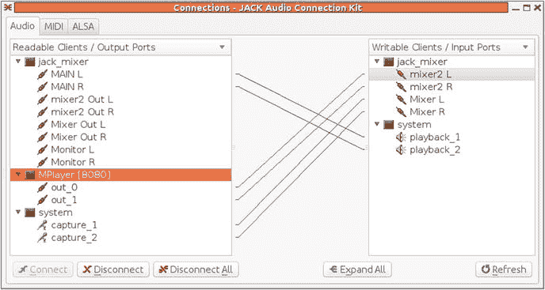
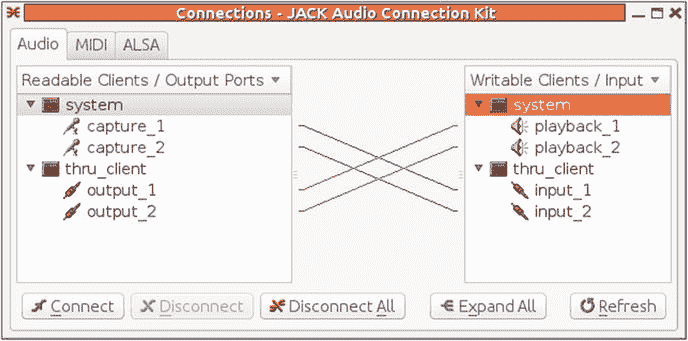
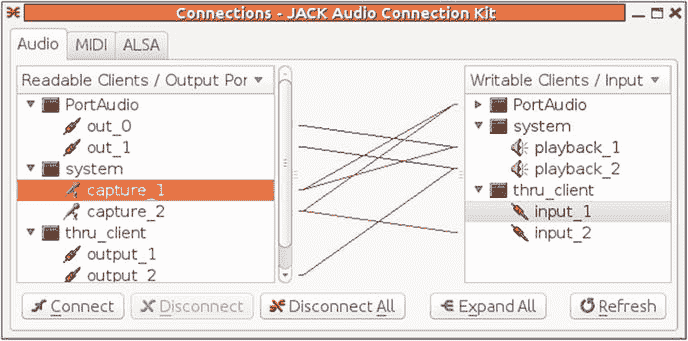
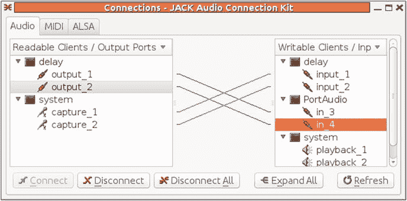
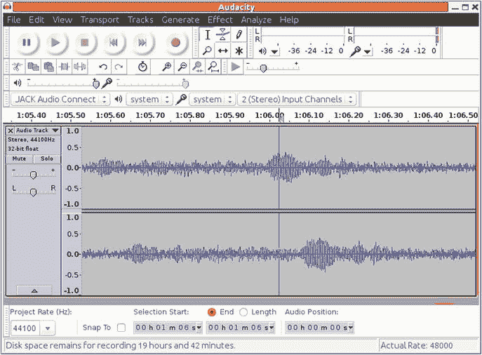

# 七、Jack

在 Linux 中，声音服务器的作用是从多个源获取输入，并将它们路由到多个接收器。Linux 中有几种音频服务器，主要的是 PulseAudio 和 Jack。它们是为不同的角色设计的:PulseAudio 是为消费音频系统设计的，而 Jack 是为专业音频设计的。在 [`http://0pointer.de/blog/projects/when-pa-and-when-not.html`](http://0pointer.de/blog/projects/when-pa-and-when-not.html) 吟诗的伦纳德拟定了一张差异表。主要的一点是，Jack 适用于低延迟至关重要的环境，Jack 在音频链中引入的延迟不到 5 毫秒，而 PulseAudio 可引入高达 2 秒的延迟。其他的区别是 PulseAudio 可以运行在包括手机在内的低质量系统上，而 Jack 通常运行在高质量的音频设备上。文章“[认识 Jack”](http://linux-sound.org/knowing-jack.html)对 Jack 进行了委婉的介绍。本章着眼于专门为 Jack 构建的工具，应用如何使用 Jack，最后是用 Jack 编程。

## 资源

以下是一些资源:

*   Jack API ( [`http://jackaudio.org/files/docs/html/index.html`](http://jackaudio.org/files/docs/html/index.html) )
*   【认识 Jack】( [`http://linux-sound.org/knowing-jack.html`](http://linux-sound.org/knowing-jack.html) )
*   ArchLinux Pro 音频( [`https://wiki.archlinux.org/index.php/Pro_Audio`](https://wiki.archlinux.org/index.php/Pro_Audio) )
*   巴布亚 Jack( [`http://gentoo-en.vfose.ru/wiki/JACK`](http://gentoo-en.vfose.ru/wiki/JACK) )
*   保罗·戴维斯谈 Jack 建筑( [`http://lac.linuxaudio.org/2003/zkm/recordings/paul_davis-jack.ogg`](http://lac.linuxaudio.org/2003/zkm/recordings/paul_davis-jack.ogg) )
*   《认识 Jack》( [`www.linux-magazine.com/content/download/63041/486886/version/1/file/JACK_Audio_Server.pdf`](http://www.linux-magazine.com/content/download/63041/486886/version/1/file/JACK_Audio_Server.pdf) )戴夫·菲利普斯在 Linux 杂志上的文章
*   用 JACK ( [`http://dis-dot-dat.net/index.cgi?item=/jacktuts/starting/`](http://dis-dot-dat.net/index.cgi?item=/jacktuts/starting/) )编写音频应用

## 启动千斤顶

大多数发行版的软件仓库中都有 Jack。您希望安装 Jack2 而不是 Jack1。对于编程，您还需要 libjack2 dev 包，它可能与 jack2 包一起安装。

Jack 服务器是`jackd`。它有一个必需的参数，这是一个声音后端，如 ALSA。最小的命令如下:

```sh
jackd -dalsa

```

跟随选项`-dalsa`会出现 ALSA 选项。在我的一台电脑上，`aplay -l`显示卡 0 有设备 3、7 和 8，我需要指定其中一个:

```sh
jackd -dalsa -d hw:0,3

```

如果您使用的是普通的 Linux 发行版，比如 Fedora 或 Ubuntu，那么如果 PulseAudio 系统正在运行，这很可能会失败。在运行 Jack 时，这可能需要停止，或者至少暂停。停止 PulseAudio 参见上一章。要暂停它，我通常在终端窗口中运行:

```sh
pasuspender cat

```

这将暂停 PulseAudio，直到`cat`终止，当您输入 Ctrl-D 时就会终止。

`jackd`将尝试开始使用 Linux 实时调度程序。如果您想在没有它的情况下运行，请使用以下选项:

```sh
jackd --no-realtime -dalsa

```

如果你想用实时调度程序运行，有几种方法。

*   从 root 用户运行服务器。

*   将用户添加到`audio`和`jackuser`组，如下所示:

```sh
sudo jackd -dalsa

```

```sh
useradd -G audio newmarch
useradd -G jackuser newmarch

```

(在此生效之前，您需要注销并重新登录。)

请注意，如果您以 root 用户身份运行服务器，那么您将无法从不在`jackuser`组中的客户端连接到它。

Jack 没有明显的 systemd 或 upstart 脚本，但是有在 [`http://gentoo-en.vfose.ru/wiki/JACK#Starting_JACK_at_boot_time`](http://gentoo-en.vfose.ru/wiki/JACK#Starting_JACK_at_boot_time) 引导时启动 Jack 的指令。以下说明摘自 GPL 许可下的说明(最后一次修改是在 2012 年):

```sh
#!/sbin/runscript
 # This programm will be used by init in order to launch jackd with the privileges
 # and id of the user defined into /etc/conf.d/jackd

 depend() {
        need alsasound
 }

 start() {
        if ! test -f "${JACKDHOME}/.jackdrc"; then
                eerror "You must start and configure jackd before launch it. Sorry."
                eerror "You can use qjackctl for that."
                return 1
        else JACKDOPTS=$(cat "${JACKDHOME}/.jackdrc"|sed -e 's\/usr/bin/jackd \\')
        fi

        if [ -e /var/run/jackd.pid ]; then
                 rm /var/run/jackd.pid
        fi

        ebegin "Starting JACK Daemon"
        env HOME="${JACKDHOME}" start-stop-daemon --start \
                --quiet --background \
                --make-pidfile --pidfile /var/run/jackd.pid \
                -c ${JACKDUSER} \
                -x /usr/bin/jackd -- ${JACKDOPTS} >${LOG}

        sleep 2
        if ! pgrep -u ${JACKDUSER} jackd > /dev/null; then
                eerror "JACK daemon can't be started! Check logfile: ${LOG}"
        fi
        eend $?
 }

 stop() {
        ebegin "Stopping JACK daemon -- please wait"
        start-stop-daemon --stop --pidfile /var/run/jackd.pid &>/dev/null
        eend $?
 }

 restart() {
        svc_stop
        while `pgrep -u ${JACKDUSER} jackd >/dev/null`; do
                sleep 1
        done
        svc_start
 }

```

文件:`/etc/conf.d/jackd`:

```sh
 # owner of jackd process (Must be an existing user.)
 JACKDUSER="dom"

 # .jackdrc location for that user (Must be existing, JACKDUSER can use
 # qjackctl in order to create it.)
 JACKDHOME="/home/${JACKDUSER}"

 # logfile (/dev/null for nowhere)
 LOG=/var/log/jackd.log

```

创建并保存这两个文件。别忘了把`JACKDUSER`调整到想要的用户名(我猜和你的一样；[作者:是的，这就是 Gentoo 指令所说的！]).我们需要使`/etc/init.d/jackd`可执行:

```sh
# chmod +x /etc/init.d/jackd

```

将脚本添加到默认运行级别:

```sh
# rc-update add jackd default

```

在重启你的系统或者启动这个脚本之前，你必须确定`jackd`已经为`$JACKUSER`配置好了，否则`jackd`将会失败。这是因为脚本会读/ `home/${USER}/.jackdrc`。如果这个文件不存在，创建它的最简单的方法是运行 QJackCtl，如上所述。

关于实时的说明:由于 start-stop-daemon 实现的限制，如果使用`pam_limits. start-stop-daemon`没有实现对`pam_sessions`的支持，则不能通过这种方法以非根用户的身份在实时模式下启动`jackd`，这意味着对`limits.conf`的更改在这种情况下没有影响。

## 用户工具

Jack 只需要使用一个工具:`qjackctl`。这提供了正在播放的 Jack 应用的图形视图，并允许您链接输入和输出。

使用`qjackctl`的一个简单教程是 how to qjackctlconnections([`https://help.ubuntu.com/community/HowToQjackCtlConnections`](https://help.ubuntu.com/community/HowToQjackCtlConnections))。它实际上使用起来非常简单:单击一个源，然后通过单击目的地将它链接到目的地。将显示一条连接它们的线。你要做的就是这些。很多 Jack 应用会帮你做这个，所以你只要观察结果就好了。这方面的说明将在本章后面给出。

## 使用插孔的应用

使用 JACK 的软件有很多，在“使用 Jack 的应用”( [`http://jackaudio.org/applications`](http://jackaudio.org/applications) )中有描述。

### mplayer

要使用千斤顶运行`mplayer`，添加选项`-ao jack`。

```sh
mplayer -ao jack 54154.mp3

```

用这种方式将`mplayer`连接到插孔`system`输出装置。要输出到另一个插孔应用，如`jack-rack`，将输出应用附加到音频输出命令。

```sh
mplayer -ao jack:port=jack_rack 54154.mp3

```

### 可见光通讯

如果包含插孔模块( [`https://wiki.videolan.org/Documentation:Modules/jack/`](https://wiki.videolan.org/Documentation:Modules/jack/) )，VLC 将播放插孔输出。这是一个可下载的 Debian 包，名为`vlc-plugin-jack`。你可以通过查看`jack`是否在`vlc --list`显示 ALSA 而不是 Jack 中被列为一个模块来检查你是否有它。

通过执行以下操作，使用 Jack 播放文件:

```sh
vlc --aout jack 54154.mp3

```

您应该能够使用选项`--jack-connect-regex <string>`连接到特定的 Jack 应用。

### TiMidity

TiMidity 是第 21 章中讨论的 MIDI 播放器。它可以用这个来播放插孔输出设备:

```sh
timidity -Oj 54154.mid

```

### Jack 提供的程序

Jack 带来了大量的客户。

```sh
jack_alias                  jack_midisine
jack_bufsize                jack_monitor_client
jack_connect                jack_multiple_metro
jack_control                jack_net_master
jack_cpu                    jack_net_slave
jack_cpu_load               jack_netsource
jackd                       jack_rec
jackdbus                    jack_samplerate
jack_disconnect             jack_server_control
jack_evmon                  jack_session_notify
jack_freewheel              jack_showtime
jack_iodelay                jack_simple_client
jack_latent_client          jack_simple_session_client
jack_load                   jack_test
jack_lsp                    jack_thru
jack_metro                  jack_transport
jack_midi_dump              jack_unload
jack_midi_latency_test      jack_wait
jack_midiseq                jack_zombie

```

对于其中的许多，源代码可以在 Jack 源代码发行版中获得，并且每个都有一个`man`页面。

比方说，`jack_thru`运行将系统捕获端口连接到`jack_thru`输入端口，将`jack_thru`输出端口连接到系统回放端口。然后，您可以使用`client:port`作为端口名来断开端口连接，如下所示:

```sh
jack_disconnect jack_thru:output_1 system:playback_1

```

这些命令行工具允许您执行与`qjackctl`相同的操作。

### 其他 Jack 程序

使用插孔的应用页面( [`http://jackaudio.org/applications`](http://jackaudio.org/applications) )列出了许多使用插孔的应用。

在`linuxaudio.org`的页面 Jack MIDI Apps ( [`http://apps.linuxaudio.org/apps/categories/jack_midi`](http://apps.linuxaudio.org/apps/categories/jack_midi) )列出了很多使用 Jack 的 MIDI 应用。

## 使用不同的声卡

Jack 的默认 ALSA 设备将是`hw:0`。如果您想使用不同的声卡，那么您可以在启动 Jack 时指定它，如下所示:

```sh
jackd -dalsa -dhw:0

```

我有一个 USB 声霸卡，需要一些额外的参数。

```sh
jackd -dalsa -dhw:2 -r 48000 -S

```

这不是很好；我听到有规律的“滴答”声。

如果没有`-S` (16 位)标志，我只能得到这样一行代码:

```sh
ALSA: cannot set hardware parameters for playback

```

或者，我可以这样运行:

```sh
jackd -dalsa -dplughw:2 -r 48000

```

当我以这种方式开始时，Jack 建议不要使用 ALSA 插头设备，但它迄今为止工作得最好。

## 如何在 Jack 上使用多个声卡？

插孔用于专业音频使用。在这样的系统中，通常只有一个数字采样“时钟”在这个“理想”的插孔世界中，不会有多个独立的声卡，每个都有自己的时钟。我就来说说这个理想世界。如果您需要在有多个声卡的情况下运行 JACK，那么请参阅“我如何将多个声卡用于 Jack？”( [`http://jackaudio.org/multiple_devices`](http://jackaudio.org/multiple_devices) )。

## 混合音频

如果来自两个不同源的两个输出端口连接到同一个输入端口，那么 Jack 将为您混合它们。这可以让你毫不费力地跟着你最喜欢的 MP3 文件一起唱。

1.  将麦克风采集端口连接到回放端口。避免在笔记本电脑的麦克风和扬声器之间建立反馈回路，例如，插入耳机。
2.  启动一个播放器，比如`mplayer`，它也将连接到播放端口，如下所示:

    ```sh
    mplayer -ao jack <MP3 file >

    ```

3.  开始唱歌。

当然，每个信号源都没有音量控制。你可以在你的发行版中插入一个混音器，比如 jack_mixer ( [`http://home.gna.org/jackmixer/`](http://home.gna.org/jackmixer/) )，然后用它来控制每个源的音量，如图 [7-1](#Fig1) 中的`qjackctl`屏幕所示。



图 7-1。

qjackctl showing a mixer of mplayer and system

## 用 Jack 编写音频应用

插孔的设计在其主要作者保罗·戴维斯的插孔音频连接套件( [`http://lac.linuxaudio.org/2003/zkm/slides/paul_davis-jack/title.html`](http://lac.linuxaudio.org/2003/zkm/slides/paul_davis-jack/title.html) )中进行了讨论。目标如下:

*   Jack 应该允许独立应用之间的低延迟、高带宽数据流。
*   虽然不是必需的，但 Jack 应该支持任何流数据类型，而不仅仅是音频。
*   在 active Jack 设置中，将有一台服务器和一个或多个 Jack 插件。可以运行多个 Jack 服务器，但每个服务器将形成一个独立的 Jack 设置。Jack 不会在 Jack 服务器之间定义任何接口。
*   使用 Jack 连接的应用可能有自己的图形界面。Jack 不会对不同的 GUI 工具包或库做任何说明。由于这一要求，下入式千斤顶设置的不同部分可能分布在多个过程中。
*   Jack 应该提供完全的、样本精确的同步(换句话说，所有客户机插件的完全同步执行)。
*   为了表示音频数据，Jack 应该使用 32 位 IEEE 浮点数，标准化为值域[-1，1]。
*   仅支持非交错音频流。
*   一个 Jack 客户端可以消耗或产生多个数据流。
*   Jack API 应该在 ANSI C 中指定，对于如何实现服务器和客户机没有限制。
*   应该可以连接已经运行的应用。
*   应该可以在服务器运行时添加或删除 Jack 客户端。

从这个角度来看，主要目标如下:

*   Jack 应该允许独立应用之间的低延迟、高带宽数据流。
*   Jack 应该提供完全的、样本精确的同步(换句话说，所有客户机插件的完全同步执行)。

第二个由 Jack 框架保证。第一个是由 Jack 框架提供的，只要应用编码正确。

在幕后，Jack 使用快速 Linux (Unix)管道将数据从一个应用传输到另一个应用。每个 Jack 应用中都有一个实时循环，它从输入管道获取数据，并将数据发送到输出管道。为了避免延迟，在读取和写入数据之间应该基本上没有(或者尽可能少)处理；理想的情况是将指针数据从输入传递到输出，或者最多只是做一个`memcpy`。

那么，如何进行加工呢？将读取的数据复制到另一个数据结构并将处理传递给另一个线程，或者将在另一个线程中处理的数据复制到输出管道。任何其他因素都会导致延迟，这可能会变得很明显。特别是某些系统调用本质上是被禁止的:`malloc`可以引起交换；`sleep`是明显的大忌；`read/write`等等，都会引起磁盘 I/O；而`pthread_cond_wait`会……等。

Jack 应用本质上是多线程的。在 Linux 世界中，这意味着 Posix 线程，幸运的是有 Bil Lewis 和 Daniel J. Berg 的书《PThreads Primer ( [`http://www8.cs.umu.se/kurser/TDBC64/VT03/pthreads/pthread-primer.pdf`](http://www8.cs.umu.se/kurser/TDBC64/VT03/pthreads/pthread-primer.pdf) )告诉你关于 Posix 线程的一切！

以下是设置 Jack 应用的机制:

1.  打开与 Jack 服务器的连接:`jack_client_open`。
2.  如果需要，检查连接和紧急援助的状态。
3.  安装一个进程回调处理器来管理 I/O: `jack_set_process_callback`。
4.  安装一个关机回调:`jack_on_shutdown`。
5.  向 Jack 服务器注册输入和输出端口:`jack_port_register`。请注意，每个端口只携带一个单声道通道，因此对于立体声，您将获得两个输入端口。这还没有将它们与管道联系起来。
6.  激活端口。换句话说，告诉 Jack 启动它的处理线程:`jack_activate`。
7.  将端口连接到管道:`jack_connect`。
8.  以某种方式坐在那里。对于文本客户端，只需循环休眠即可。GUI 客户端可能有一个 GUI 处理循环。

## 收集

下面的例子需要链接到各种库。这些是 jack、sndfile、pthread 和 math 库。适当的标志如下:

```sh
INCLUDES = $(shell pkg-config --cflags jack sndfile)
LDLIBS =  $(shell pkg-config --libs jack sndfile) -lpthread -lm

```

## 港口信息

Jack 使用传输单声道 32 位数据的端口。每个端口都有一个字符串形式的名称和属性，如输入和输出。一旦连接到 Jack 服务器，就可以使用`jack_get_ports`查询服务器已知的端口。如果参数是`NULL`或零，那么返回所有端口，或者可以使用模式来限制返回的端口名称。一旦找到一个端口名，就可以把它变成一个`jack_port_t`，并且可以查询它的属性。

完成这项工作的程序是`listports.c`，如下所示:

```sh
/** @file listports.c
 *
 * @brief This client delays one channel by 4096 framse.
 */

#include <stdio.h>
#include <errno.h>
#include <stdlib.h>
#include <string.h>
#include <math.h>
#include <signal.h>
#ifndef WIN32
#include <unistd.h>
#endif
#include <jack/jack.h>

jack_client_t *client;

void print_port_info(char *name) {
    printf("Port name is %s\n", name);
    jack_port_t *port = jack_port_by_name (client, name);
    if (port == NULL) {
        printf("No port by name %s\n", name);
        return;
    }
    printf("  Type is %s\n", jack_port_type(port));

    int flags = jack_port_flags(port);
    if (flags & JackPortIsInput)
        printf("  Is an input port\n");
    else
        printf("  Is an output port\n");
    char **connections = jack_port_get_connections(port);
    char **c = connections;
    printf("  Connected to:\n");
    while ((c != NULL) && (*c != NULL)) {
        printf("    %s\n", *c++);
    }
    if (connections != NULL)
        jack_free(connections);
}

int
main ( int argc, char *argv[] )
{
    int i;
    const char **ports;
    const char *client_name;
    const char *server_name = NULL;
    jack_options_t options = JackNullOption;
    jack_status_t status;

    if ( argc >= 2 )        /* client name specified? */
    {
        client_name = argv[1];
        if ( argc >= 3 )    /* server name specified? */
        {
            server_name = argv[2];
            options |= JackServerName;
        }
    }
    else              /* use basename of argv[0] */
    {
        client_name = strrchr ( argv[0], '/' );
        if ( client_name == 0 )
        {
            client_name = argv[0];
        }
        else
        {
            client_name++;
        }
    }

    /* open a client connection to the JACK server */

    client = jack_client_open ( client_name, options, &status, server_name );
    if ( client == NULL )
    {
        fprintf ( stderr, "jack_client_open() failed, "
                  "status = 0x%2.0x\n", status );
        if ( status & JackServerFailed )
        {
            fprintf ( stderr, "Unable to connect to JACK server\n" );
        }
        exit ( 1 );
    }
    if ( status & JackServerStarted )
    {
        fprintf ( stderr, "JACK server started\n" );
    }
    if ( status & JackNameNotUnique )
    {
        client_name = jack_get_client_name ( client );
        fprintf ( stderr, "unique name `%s' assigned\n", client_name );
    }

    if ( jack_activate ( client ) )
    {
        fprintf ( stderr, "cannot activate client" );
        exit ( 1 );
    }

     ports = jack_get_ports ( client, NULL, NULL, 0 );
    if ( ports == NULL )
    {
        fprintf ( stderr, "no ports\n" );
        exit ( 1 );
    }
    char **p = ports;
    while (*p != NULL)
        print_port_info(*p++);
    jack_free(ports);

    jack_client_close ( client );
    exit ( 0 );
}

```

## 将输入复制到输出

Jack 源代码发行版有一个`example clients`子目录。这个子目录中包含客户端`thru_client.c`，它只是将输入复制到输出。这个例子的处理核心是函数`process`。该函数将输入和输出上可用的若干帧作为参数，并且该函数循环通过(立体声)通道，获得相应的输入和输出缓冲器(用于输入和输出管道)，并且将数据从输入复制到相应的输出。

代码如下:

```sh
/** @file thru_client.c
 *
 * @brief This simple through client demonstrates the basic features of JACK
 * as they would be used by many applications.
 */

#include <stdio.h>
#include <errno.h>
#include <stdlib.h>
#include <string.h>
#include <math.h>
#include <signal.h>
#ifndef WIN32
#include <unistd.h>
#endif
#include <jack/jack.h>

jack_port_t **input_ports;
jack_port_t **output_ports;
jack_client_t *client;

static void signal_handler ( int sig )
{
    jack_client_close ( client );
    fprintf ( stderr, "signal received, exiting ...\n" );
    exit ( 0 );
}

/**
 * The process callback for this JACK application is called in a
 * special realtime thread once for each audio cycle.
 *
 * This client follows a simple rule: when the JACK transport is
 * running, copy the input port to the output.  When it stops, exit.
 */

int
process ( jack_nframes_t nframes, void *arg )
{
    int i;
    jack_default_audio_sample_t *in, *out;
    for ( i = 0; i < 2; i++ )
    {
        in = jack_port_get_buffer ( input_ports[i], nframes );
        out = jack_port_get_buffer ( output_ports[i], nframes );
        memcpy ( out, in, nframes * sizeof ( jack_default_audio_sample_t ) );
    }
    return 0;
}

/**
 * JACK calls this shutdown_callback if the server ever shuts down or
 * decides to disconnect the client.
 */
void
jack_shutdown ( void *arg )
{
    free ( input_ports );
    free ( output_ports );
    exit ( 1 );
}

int
main ( int argc, char *argv[] )
{
    int i;
    const char **ports;
    const char *client_name;
    const char *server_name = NULL;
    jack_options_t options = JackNullOption;
    jack_status_t status;

    if ( argc >= 2 )        /* client name specified? */
    {
        client_name = argv[1];
        if ( argc >= 3 )    /* server name specified? */
        {
            server_name = argv[2];
            options |= JackServerName;
        }
    }
    else              /* use basename of argv[0] */
    {
        client_name = strrchr ( argv[0], '/' );
        if ( client_name == 0 )
        {
            client_name = argv[0];
        }
        else
        {
            client_name++;
        }
    }

    /* open a client connection to the JACK server */

    client = jack_client_open ( client_name, options, &status, server_name );
    if ( client == NULL )
    {
        fprintf ( stderr, "jack_client_open() failed, "
                  "status = 0x%2.0x\n", status );
        if ( status & JackServerFailed )
        {
            fprintf ( stderr, "Unable to connect to JACK server\n" );
        }
        exit ( 1 );
    }
    if ( status & JackServerStarted )
    {
        fprintf ( stderr, "JACK server started\n" );
    }
    if ( status & JackNameNotUnique )
    {
        client_name = jack_get_client_name ( client );
        fprintf ( stderr, "unique name `%s' assigned\n", client_name );
    }

    /* tell the JACK server to call `process()' whenever
       there is work to be done.
    */

    jack_set_process_callback ( client, process, 0 );

    /* tell the JACK server to call `jack_shutdown()' if
       it ever shuts down, either entirely, or if it
       just decides to stop calling us.
    */

    jack_on_shutdown ( client, jack_shutdown, 0 );

    /* create two ports pairs*/
    input_ports = ( jack_port_t** ) calloc ( 2, sizeof ( jack_port_t* ) );
    output_ports = ( jack_port_t** ) calloc ( 2, sizeof ( jack_port_t* ) );

    char port_name[16];
    for ( i = 0; i < 2; i++ )
    {
        sprintf ( port_name, "input_%d", i + 1 );
        input_ports[i] = jack_port_register ( client, port_name, JACK_DEFAULT_AUDIO_TYPE, JackPortIsInput, 0 );
        sprintf ( port_name, "output_%d", i + 1 );
        output_ports[i] = jack_port_register ( client, port_name, JACK_DEFAULT_AUDIO_TYPE, JackPortIsOutput, 0 );
        if ( ( input_ports[i] == NULL ) || ( output_ports[i] == NULL ) )
        {
            fprintf ( stderr, "no more JACK ports available\n" );
            exit ( 1 );
        }
    }

    /* Tell the JACK server that we are ready to roll.  Our
     * process() callback will start running now. */

    if ( jack_activate ( client ) )
    {
        fprintf ( stderr, "cannot activate client" );
        exit ( 1 );
    }

    /* Connect the ports.  You can't do this before the client is
     * activated, because we can't make connections to clients
     * that aren't running.  Note the confusing (but necessary)
     * orientation of the driver backend ports: playback ports are
     * "input" to the backend, and capture ports are "output" from
     * it.
     */

    ports = jack_get_ports ( client, NULL, NULL, JackPortIsPhysical|JackPortIsOutput );
    if ( ports == NULL )
    {
        fprintf ( stderr, "no physical capture ports\n" );
        exit ( 1 );
    }

    for ( i = 0; i < 2; i++ )
        if ( jack_connect ( client, ports[i], jack_port_name ( input_ports[i] ) ) )
            fprintf ( stderr, "cannot connect input ports\n" );

    free ( ports );

    ports = jack_get_ports ( client, NULL, NULL, JackPortIsPhysical|JackPortIsInput );
    if ( ports == NULL )
    {
        fprintf ( stderr, "no physical playback ports\n" );
        exit ( 1 );
    }

    for ( i = 0; i < 2; i++ )
        if ( jack_connect ( client, jack_port_name ( output_ports[i] ), ports[i] ) )
            fprintf ( stderr, "cannot connect input ports\n" );

    free ( ports );

    /* install a signal handler to properly quits jack client */
#ifdef WIN32
    signal ( SIGINT, signal_handler );
    signal ( SIGABRT, signal_handler );
    signal ( SIGTERM, signal_handler );
#else
    signal ( SIGQUIT, signal_handler );
    signal ( SIGTERM, signal_handler );
    signal ( SIGHUP, signal_handler );
    signal ( SIGINT, signal_handler );
#endif

    /* keep running until the transport stops */

    while (1)
    {
#ifdef WIN32
        Sleep ( 1000 );
#else
        sleep ( 1 );
#endif
    }

    jack_client_close ( client );
    exit ( 0 );
}

```

## 延迟音频

虽然这本书不是关于音频效果的，但是你可以通过延迟声音很容易地引入一种效果——延迟。现在这—以及任何耗时的行动—都违背了精神(和实现！)的 Jack，所以只有配合 Jack 模型才能做到。

最简单的想法就是在正确的地方插入`sleep`命令。这将假设对`process`回调的调用是异步发生的，但事实并非如此——它们是在 Jack 处理线程中同步发生的。耗费时间的活动是不允许的。如果你尝试它，你将会在最好的情况下结束大量的 xruns，在最坏的情况下结束 Jack 的癫痫发作。

在这种情况下，解决方案很简单:保留一个保存以前输入的缓冲区，并在请求输出时从该缓冲区中读取旧的条目。一个“足够大”的回绕数组可以做到这一点，旧的条目被读出，新的条目被读入。

以下程序`delay.c`将实时复制左声道，但将左声道延迟 4，096 个样本:

```sh
/** @file delay.c
 *
 * @brief This client delays one channel by 4096 framse.
 */

#include <stdio.h>
#include <errno.h>
#include <stdlib.h>
#include <string.h>
#include <math.h>
#include <signal.h>
#ifndef WIN32
#include <unistd.h>
#endif
#include <jack/jack.h>

jack_port_t **input_ports;
jack_port_t **output_ports;
jack_client_t *client;

#define SIZE 8192
#define DELAY 4096
jack_default_audio_sample_t buffer[SIZE];
int idx, delay_idx;

static void signal_handler ( int sig )
{
    jack_client_close ( client );
    fprintf ( stderr, "signal received, exiting ...\n" );
    exit ( 0 );
}

static void copy2out( jack_default_audio_sample_t *out,
                      jack_nframes_t nframes) {
    if (delay_idx + nframes < SIZE) {
        memcpy(out, buffer + delay_idx,
               nframes * sizeof ( jack_default_audio_sample_t ) );
    } else {
        int frames_to_end = SIZE - delay_idx;
        int overflow = delay_idx + nframes - SIZE;
        memcpy(out, buffer + delay_idx,
               frames_to_end * sizeof ( jack_default_audio_sample_t ) );
        memcpy(out, buffer, overflow * sizeof(jack_default_audio_sample_t));
    }
    delay_idx = (delay_idx + nframes) % SIZE;
}

static void copy2buffer( jack_default_audio_sample_t *in,
                      jack_nframes_t nframes) {
    if (idx + nframes < SIZE) {
        memcpy(buffer + idx, in,
               nframes * sizeof ( jack_default_audio_sample_t ) );
    } else {
        int frames_to_end = SIZE - idx;
        int overflow = idx + nframes - SIZE;
        memcpy(buffer + idx, in,
               frames_to_end * sizeof ( jack_default_audio_sample_t ) );
        memcpy(buffer, in, overflow * sizeof(jack_default_audio_sample_t));
    }
    idx = (idx + nframes) % SIZE;
}

/**
 * The process callback for this JACK application is called in a
 * special realtime thread once for each audio cycle.
 *
 * This client follows a simple rule: when the JACK transport is
 * running, copy the input port to the output.  When it stops, exit.
 */

int
process ( jack_nframes_t nframes, void *arg )
{
    int i;
    jack_default_audio_sample_t *in, *out;

    in = jack_port_get_buffer ( input_ports[0], nframes );
    out = jack_port_get_buffer ( output_ports[0], nframes );
    memcpy ( out, in, nframes * sizeof ( jack_default_audio_sample_t ) );

    in = jack_port_get_buffer ( input_ports[1], nframes );
    out = jack_port_get_buffer ( output_ports[1], nframes );
    copy2out(out, nframes);
    copy2buffer(in, nframes);

    return 0;
}

/**
 * JACK calls this shutdown_callback if the server ever shuts down or
 * decides to disconnect the client.
 */
void
jack_shutdown ( void *arg )
{
    free ( input_ports );
    free ( output_ports );
    exit ( 1 );
}

int
main ( int argc, char *argv[] )
{
    int i;
    const char **ports;
    const char *client_name;
    const char *server_name = NULL;
    jack_options_t options = JackNullOption;
    jack_status_t status;

    if ( argc >= 2 )        /* client name specified? */
    {
        client_name = argv[1];
        if ( argc >= 3 )    /* server name specified? */
        {
            server_name = argv[2];
            options |= JackServerName;
        }
    }
    else              /* use basename of argv[0] */
    {
        client_name = strrchr ( argv[0], '/' );
        if ( client_name == 0 )
        {
            client_name = argv[0];
        }
        else
        {
            client_name++;
        }
    }

    /* open a client connection to the JACK server */

    client = jack_client_open ( client_name, options, &status, server_name );
    if ( client == NULL )
    {
        fprintf ( stderr, "jack_client_open() failed, "
                  "status = 0x%2.0x\n", status );
        if ( status & JackServerFailed )
        {
            fprintf ( stderr, "Unable to connect to JACK server\n" );
        }
        exit ( 1 );
    }
    if ( status & JackServerStarted )
    {
        fprintf ( stderr, "JACK server started\n" );
    }
    if ( status & JackNameNotUnique )
    {
        client_name = jack_get_client_name ( client );
        fprintf ( stderr, "unique name `%s' assigned\n", client_name );
    }

    /* tell the JACK server to call `process()' whenever
       there is work to be done.
    */

    jack_set_process_callback ( client, process, 0 );

    /* tell the JACK server to call `jack_shutdown()' if
       it ever shuts down, either entirely, or if it
       just decides to stop calling us.
    */

    jack_on_shutdown ( client, jack_shutdown, 0 );

    /* create two ports pairs*/
    input_ports = ( jack_port_t** ) calloc ( 2, sizeof ( jack_port_t* ) );
    output_ports = ( jack_port_t** ) calloc ( 2, sizeof ( jack_port_t* ) );

    char port_name[16];
    for ( i = 0; i < 2; i++ )
    {
        sprintf ( port_name, "input_%d", i + 1 );
        input_ports[i] = jack_port_register ( client, port_name, JACK_DEFAULT_AUDIO_TYPE, JackPortIsInput, 0 );
        sprintf ( port_name, "output_%d", i + 1 );
        output_ports[i] = jack_port_register ( client, port_name, JACK_DEFAULT_AUDIO_TYPE, JackPortIsOutput, 0 );
        if ( ( input_ports[i] == NULL ) || ( output_ports[i] == NULL ) )
        {
            fprintf ( stderr, "no more JACK ports available\n" );
            exit ( 1 );
        }
    }

    bzero(buffer, SIZE * sizeof ( jack_default_audio_sample_t ));
    delay_idx = 0;
    idx = DELAY;

    /* Tell the JACK server that we are ready to roll.  Our
     * process() callback will start running now. */

    if ( jack_activate ( client ) )
    {
        fprintf ( stderr, "cannot activate client" );
        exit ( 1 );
    }

    /* Connect the ports.  You can't do this before the client is
     * activated, because we can't make connections to clients
     * that aren't running.  Note the confusing (but necessary)
     * orientation of the driver backend ports: playback ports are
     * "input" to the backend, and capture ports are "output" from
     * it.
     */

    ports = jack_get_ports ( client, NULL, NULL, JackPortIsPhysical|JackPortIsOutput );
    if ( ports == NULL )
    {
        fprintf ( stderr, "no physical capture ports\n" );
        exit ( 1 );
    }

    for ( i = 0; i < 2; i++ )
        if ( jack_connect ( client, ports[i], jack_port_name ( input_ports[i] ) ) )
            fprintf ( stderr, "cannot connect input ports\n" );

    free ( ports );

    ports = jack_get_ports ( client, NULL, NULL, JackPortIsPhysical|JackPortIsInput );
    if ( ports == NULL )
    {
        fprintf ( stderr, "no physical playback ports\n" );
        exit ( 1 );
    }

    for ( i = 0; i < 2; i++ )
        if ( jack_connect ( client, jack_port_name ( output_ports[i] ), ports[i] ) )
            fprintf ( stderr, "cannot connect input ports\n" );

    free ( ports );

    /* install a signal handler
to properly quits jack client */
#ifdef WIN32
    signal ( SIGINT, signal_handler );
    signal ( SIGABRT, signal_handler );
    signal ( SIGTERM, signal_handler );
#else
    signal ( SIGQUIT, signal_handler );
    signal ( SIGTERM, signal_handler );
    signal ( SIGHUP, signal_handler );
    signal ( SIGINT, signal_handler );
#endif

    /* keep running until the transport stops */

    while (1)
    {
#ifdef WIN32
        Sleep ( 1000 );
#else
        sleep ( 1 );
#endif
    }

    jack_client_close ( client );
    exit ( 0 );
}

```

## 勇敢面对 Jack

Audacity 是 Jack-aware。您可以使用它来捕获和显示 Jack 流。但这并不意味着对用户来说，它的播放方式很好！对于正在运行的 Jack 系统，启动 Audacity 会向 Jack 注册它，但是没有输入或输出端口。只有当您使用 Audacity 开始记录会话时，这些才会显示出来。然后它在 Jack 内部建立自己的链接。

例如，`thru_client`作为 Jack 中唯一的客户端，`qjackctl`显示连接，如图 [7-2](#Fig2) 所示。



图 7-2。

Qjackctl showing thru_client

在该图中，捕捉设备连接到`thru_client`输入，而`thru_client`输出连接到回放输出。

仅仅启动 Audacity 而不记录任何东西并不会对这个连接图产生任何变化。

但是当 Audacity 在`thru_client`已经运行的情况下开始记录时，`qjackctl`显示已经建立的链接，如图 [7-3](#Fig3) 所示。



图 7-3。

Qjackctl with thru_client and Audacity

这要复杂得多:Audacity 显示为 PortAudio 设备，捕获设备链接到 PortAudio 输入，PortAudio 输出链接到回放设备。现有的`thru_client`环节基本废弃。要设置您想要的情况，这些必须根据需要重新链接。

为了演示延迟一个通道的效果，启动 Jack，启动`delay`，然后启动 Audacity。根据图 [7-4](#Fig4) 重新连接端口。



图 7-4。

Qjackctl wih delay

也就是说，捕捉端口链接到`delay`输入端口，`delay`输出端口链接到 PortAudio (Audacity)输入端口，PortAudio 输出端口链接到回放端口。

Audacity 捕获的波形清楚地显示了左声道相对于右声道的延迟(图 [7-5](#Fig5) )。



图 7-5。

Audacity showing delay

## 演奏正弦波

复制示例没有显示缓冲区中内容的细节:内容来自`jack_default_audio_sample_t`。宏`JACK_DEFAULT_AUDIO_TYPE`中描述了这些内容，默认值为“32 位浮点单声道音频”

除了简单地传递音频之外，您还需要处理这种格式的数据。示例程序`simple_client.c`用 32 位浮点正弦曲线值填充数组。在每次调用`process`时，它将数据从正弦曲线数组复制到输出缓冲区。对于左声道和右声道，正弦曲线阵列的增量是不同的，以在每个声道上给出不同的音符。

注意，正弦曲线数组的计算不是在`process`函数中完成的。那太慢了，会造成延迟。

该计划如下:

```sh
/** @file simple_client.c
 *
 * @brief This simple client demonstrates the basic features of JACK
 * as they would be used by many applications.
 */

#include <stdio.h>
#include <errno.h>
#include <stdlib.h>
#include <string.h>
#include <math.h>
#include <signal.h>
#ifndef WIN32
#include <unistd.h>
#endif
#include <jack/jack.h>

jack_port_t *output_port1, *output_port2;
jack_client_t *client;

#ifndef M_PI
#define M_PI  (3.14159265)
#endif

#define TABLE_SIZE   (200)
typedef struct
{
    float sine[TABLE_SIZE];
    int left_phase;
    int right_phase;
}
paTestData;

static void signal_handler(int sig)
{
        jack_client_close(client);
        fprintf(stderr, "signal received, exiting ...\n");
        exit(0);
}

/**
 * The process callback for this JACK application is called in a
 * special realtime thread once for each audio cycle.
 *
 * This client follows a simple rule: when the JACK transport is
 * running, copy the input port to the output.  When it stops, exit.
 */

int
process (jack_nframes_t nframes, void *arg)
{
        jack_default_audio_sample_t *out1, *out2;
        paTestData *data = (paTestData*)arg;
        int i;

        out1 = (jack_default_audio_sample_t*)jack_port_get_buffer (output_port1, nframes);
        out2 = (jack_default_audio_sample_t*)jack_port_get_buffer (output_port2, nframes);

        for( i=0; i<nframes; i++ )
    {
        out1[i] = data->sine[data->left_phase];  /* left */
        out2[i] = data->sine[data->right_phase];  /* right */
        data->left_phase += 1;
        if( data->left_phase >= TABLE_SIZE ) data->left_phase -= TABLE_SIZE;
        data->right_phase += 3; /* higher pitch so we can distinguish left and right. */
        if( data->right_phase >= TABLE_SIZE ) data->right_phase -= TABLE_SIZE;
    }

        return 0;
}

/**
 * JACK calls this shutdown_callback if the server ever shuts down or
 * decides to disconnect the client.
 */
void
jack_shutdown (void *arg)
{
        exit (1);
}

int
main (int argc, char *argv[])
{
        const char **ports;
        const char *client_name;
        const char *server_name = NULL;
        jack_options_t options = JackNullOption;
        jack_status_t status;
        paTestData data;
        int i;

        if (argc >= 2) {                /* client name specified? */
                client_name = argv[1];
                if (argc >= 3) {        /* server name specified? */
                        server_name = argv[2];
            int my_option = JackNullOption | JackServerName;
                        options = (jack_options_t)my_option;
                }
        } else {                        /* use basename of argv[0] */
                client_name = strrchr(argv[0], '/');
                if (client_name == 0) {
                        client_name = argv[0];
                } else {
                        client_name++;
                }
        }

        for( i=0; i<TABLE_SIZE; i++ )
    {
        data.sine[i] = 0.2 * (float) sin( ((double)i/(double)TABLE_SIZE) * M_PI * 2\. );
    }
    data.left_phase = data.right_phase = 0;

        /* open a client connection to the JACK server */

        client = jack_client_open (client_name, options, &status, server_name);
        if (client == NULL) {
                fprintf (stderr, "jack_client_open() failed, "
                         "status = 0x%2.0x\n", status);
                if (status & JackServerFailed) {
                        fprintf (stderr, "Unable to connect to JACK server\n");
                }
                exit (1);
        }
        if (status & JackServerStarted) {
                fprintf (stderr, "JACK server started\n");
        }
        if (status & JackNameNotUnique) {
                client_name = jack_get_client_name(client);
                fprintf (stderr, "unique name `%s' assigned\n", client_name);
        }

        /* tell the JACK server to call `process()' whenever
           there is work to be done.
        */

        jack_set_process_callback (client, process, &data);

        /* tell the JACK server to call `jack_shutdown()' if
           it ever shuts down, either entirely, or if it
           just decides to stop calling us.
        */

        jack_on_shutdown (client, jack_shutdown, 0);

        /* create two ports */

        output_port1 = jack_port_register (client, "output1",
                                          JACK_DEFAULT_AUDIO_TYPE,
                                          JackPortIsOutput, 0);

        output_port2 = jack_port_register (client, "output2",
                                          JACK_DEFAULT_AUDIO_TYPE,
                                          JackPortIsOutput, 0);

        if ((output_port1 == NULL) || (output_port2 == NULL)) {
                fprintf(stderr, "no more JACK ports available\n");
                exit (1);
        }

        /* Tell the JACK server that we are ready to roll.  Our
         * process() callback will start running now. */

        if (jack_activate (client)) {
                fprintf (stderr, "cannot activate client");
                exit (1);
        }

        /* Connect the ports.  You can't do this before the client is
         * activated, because we can't make connections to clients
         * that aren't running.  Note the confusing (but necessary)
         * orientation of the driver backend ports: playback ports are
         * "input" to the backend, and capture ports are "output" from
         * it.
         */

        ports = jack_get_ports (client, NULL, NULL,
                                JackPortIsPhysical|JackPortIsInput);
        if (ports == NULL) {
                fprintf(stderr, "no physical playback ports\n");
                exit (1);
        }

        if (jack_connect (client, jack_port_name (output_port1), ports[0])) {
                fprintf (stderr, "cannot connect output ports\n");
        }

        if (jack_connect (client, jack_port_name (output_port2), ports[1])) {
                fprintf (stderr, "cannot connect output ports\n");
        }

        free (ports);

    /* install a signal handler to properly quits jack client */
#ifdef WIN32
        signal(SIGINT, signal_handler);
    signal(SIGABRT, signal_handler);
        signal(SIGTERM, signal_handler);
#else
        signal(SIGQUIT, signal_handler);
        signal(SIGTERM, signal_handler);
        signal(SIGHUP, signal_handler);
        signal(SIGINT, signal_handler);
#endif

        /* keep running until the Ctrl+C */

        while (1) {
        #ifdef WIN32
                Sleep(1000);
        #else
                sleep (1);
        #endif
        }

        jack_client_close (client);
        exit (0);
}

```

## 将输入保存到磁盘

磁盘 I/O 不能在 Jack 处理循环中执行；只是太慢了。将输入保存到文件需要使用单独的线程来管理磁盘 I/O，并在插孔和磁盘线程之间传递控制。

示例中的程序`capture_client.c`就是这样做的。

```sh
/*
    Copyright (C) 2001 Paul Davis
    Copyright (C) 2003 Jack O'Quin

    This program is free software; you can redistribute it and/or modify
    it under the terms of the GNU General Public License as published by
    the Free Software Foundation; either version 2 of the License, or
    (at your option) any later version.

    This program is distributed in the hope that it will be useful,
    but WITHOUT ANY WARRANTY; without even the implied warranty of
    MERCHANTABILITY or FITNESS FOR A PARTICULAR PURPOSE.  See the
    GNU General Public License for more details.

    You should have received a copy of the GNU General Public License
    along with this program; if not, write to the Free Software
    Foundation, Inc., 675 Mass Ave, Cambridge, MA 02139, USA.

    * 2002/08/23 - modify for libsndfile 1.0.0 <andy@alsaplayer.org>
    * 2003/05/26 - use ringbuffers - joq
*/

#include <stdio.h>
#include <stdlib.h>
#include <string.h>
#include <errno.h>
#include <unistd.h>
#include <sndfile.h>
#include <pthread.h>
#include <signal.h>
#include <getopt.h>
#include <jack/jack.h>
#include <jack/ringbuffer.h>

typedef struct _thread_info {
    pthread_t thread_id;
    SNDFILE *sf;
    jack_nframes_t duration;
    jack_nframes_t rb_size;
    jack_client_t *client;
    unsigned int channels;
    int bitdepth;
    char *path;
    volatile int can_capture;
    volatile int can_process;
    volatile int status;
} jack_thread_info_t;

/* JACK data */
unsigned int nports;
jack_port_t **ports;
jack_default_audio_sample_t **in;
jack_nframes_t nframes;
const size_t sample_size = sizeof(jack_default_audio_sample_t);

/* Synchronization between process thread and disk thread. */
#define DEFAULT_RB_SIZE 16384           /* ringbuffer size in frames */
jack_ringbuffer_t *rb;
pthread_mutex_t disk_thread_lock = PTHREAD_MUTEX_INITIALIZER;
pthread_cond_t  data_ready = PTHREAD_COND_INITIALIZER;
long overruns = 0;
jack_client_t *client;

static void signal_handler(int sig)
{
        jack_client_close(client);
        fprintf(stderr, "signal received, exiting ...\n");
        exit(0);
}

static void *
disk_thread (void *arg)
{
        jack_thread_info_t *info = (jack_thread_info_t *) arg;
        static jack_nframes_t total_captured = 0;
        jack_nframes_t samples_per_frame = info->channels;
        size_t bytes_per_frame = samples_per_frame * sample_size;
        void *framebuf = malloc (bytes_per_frame);

        pthread_setcanceltype (PTHREAD_CANCEL_ASYNCHRONOUS, NULL);
        pthread_mutex_lock (&disk_thread_lock);

        info->status = 0;

        while (1) {

                /* Write the data one frame at a time.  This is
                 * inefficient, but makes things simpler. */
                while (info->can_capture &&
                       (jack_ringbuffer_read_space (rb) >= bytes_per_frame)) {

                        jack_ringbuffer_read (rb, framebuf, bytes_per_frame);

                        if (sf_writef_float (info->sf, framebuf, 1) != 1) {
                                char errstr[256];
                                sf_error_str (0, errstr, sizeof (errstr) - 1);
                                fprintf (stderr,
                                         "cannot write sndfile (%s)\n",
                                         errstr);
                                info->status = EIO; /* write failed */
                                goto done;
                        }

                        if (++total_captured >= info->duration) {
                                printf ("disk thread finished\n");
                                goto done;
                        }
                }

                /* wait until process() signals more data */
                pthread_cond_wait (&data_ready, &disk_thread_lock);
        }

 done:
        pthread_mutex_unlock (&disk_thread_lock);
        free (framebuf);
        return 0;
}

static int
process (jack_nframes_t nframes, void *arg)
{
        int chn;
        size_t i;
        jack_thread_info_t *info = (jack_thread_info_t *) arg;

        /* Do nothing until we're ready to begin. */
        if ((!info->can_process) || (!info->can_capture))
                return 0;

        for (chn = 0; chn < nports; chn++)
                in[chn] = jack_port_get_buffer (ports[chn], nframes);

        /* Sndfile requires interleaved data.  It is simpler here to
         * just queue interleaved samples to a single ringbuffer. */
        for (i = 0; i < nframes; i++) {
                for (chn = 0; chn < nports; chn++) {
                        if (jack_ringbuffer_write (rb, (void *) (in[chn]+i),
                                              sample_size)
                            < sample_size)
                                overruns++;
                }
        }

        /* Tell the disk thread there is work to do.  If it is already
         * running, the lock will not be available.  We can't wait
         * here in the process() thread, but we don't need to signal
         * in that case, because the disk thread will read all the
         * data queued before waiting again. */
        if (pthread_mutex_trylock (&disk_thread_lock) == 0) {
            pthread_cond_signal (&data_ready);
            pthread_mutex_unlock (&disk_thread_lock);
        }

        return 0;
}

static void
jack_shutdown (void *arg)
{
        fprintf(stderr, "JACK shut down, exiting ...\n");
        exit(1);
}

static void
setup_disk_thread (jack_thread_info_t *info)
{
        SF_INFO sf_info;
        int short_mask;

        sf_info.samplerate = jack_get_sample_rate (info->client);
        sf_info.channels = info->channels;

        switch (info->bitdepth) {
                case 8: short_mask = SF_FORMAT_PCM_U8;
                        break;
                case 16: short_mask = SF_FORMAT_PCM_16;
                         break;
                case 24: short_mask = SF_FORMAT_PCM_24;
                         break;
                case 32: short_mask = SF_FORMAT_PCM_32;
                         break;
                default: short_mask = SF_FORMAT_PCM_16;
                         break;
        }
        sf_info.format = SF_FORMAT_WAV|short_mask;

        if ((info->sf = sf_open (info->path, SFM_WRITE, &sf_info)) == NULL) {
                char errstr[256];
                sf_error_str (0, errstr, sizeof (errstr) - 1);
                fprintf (stderr, "cannot open sndfile \"%s\" for output (%s)\n", info->path, errstr);
                jack_client_close (info->client);
                exit (1);
        }

        info->duration *= sf_info.samplerate;
        info->can_capture = 0;

        pthread_create (&info->thread_id, NULL, disk_thread, info);
}

static void
run_disk_thread (jack_thread_info_t *info)
{
        info->can_capture = 1;
        pthread_join (info->thread_id, NULL);
        sf_close (info->sf);
        if (overruns > 0) {
                fprintf (stderr,
                         "jackrec failed with %ld overruns.\n", overruns);
                fprintf (stderr, " try a bigger buffer than -B %"
                         PRIu32 ".\n", info->rb_size);
                info->status = EPIPE;
        }
}

static void
setup_ports (int sources, char *source_names[], jack_thread_info_t *info)
{
        unsigned int i;
        size_t in_size;

        /* Allocate data structures that depend on the number of ports. */
        nports = sources;
        ports = (jack_port_t **) malloc (sizeof (jack_port_t *) * nports);
        in_size =  nports * sizeof (jack_default_audio_sample_t *);
        in = (jack_default_audio_sample_t **) malloc (in_size);
        rb = jack_ringbuffer_create (nports * sample_size * info->rb_size);

        /* When JACK is running realtime, jack_activate() will have
         * called mlockall() to lock our pages into memory.  But, we
         * still need to touch any newly allocated pages before
         * process() starts using them.  Otherwise, a page fault could
         * create a delay that would force JACK to shut us down. */
        memset(in, 0, in_size);
        memset(rb->buf, 0, rb->size);

        for (i = 0; i < nports; i++) {
                char name[64];

                sprintf (name, "input%d", i+1);

                if ((ports[i] = jack_port_register (info->client, name, JACK_DEFAULT_AUDIO_TYPE, JackPortIsInput, 0)) == 0) {
                        fprintf (stderr, "cannot register input port \"%s\"!\n", name);
                        jack_client_close (info->client);
                        exit (1);
                }
        }

        for (i = 0; i < nports; i++) {
                if (jack_connect (info->client, source_names[i], jack_port_name (ports[i]))) {
                        fprintf (stderr, "cannot connect input port %s to %s\n", jack_port_name (ports[i]), source_names[i]);
                        jack_client_close (info->client);
                        exit (1);
                }
        }

        info->can_process = 1;          /* process() can start, now */
}

int
main (int argc, char *argv[])
{
    jack_thread_info_t thread_info;
        int c;
        int longopt_index = 0;
        extern int optind, opterr;
        int show_usage = 0;
        char *optstring = "d:f:b:B:h";
        struct option long_options[] = {
                { "help", 0, 0, 'h' },
                { "duration", 1, 0, 'd' },
                { "file", 1, 0, 'f' },
                { "bitdepth", 1, 0, 'b' },
                { "bufsize", 1, 0, 'B' },
                { 0, 0, 0, 0 }
        };

        memset (&thread_info, 0, sizeof (thread_info));
        thread_info.rb_size = DEFAULT_RB_SIZE;
        opterr = 0;

        while ((c = getopt_long (argc, argv, optstring, long_options, &longopt_index)) != -1) {
                switch (c) {
                case 1:
                        /* getopt signals end of '-' options */
                        break;

                case 'h':
                        show_usage++;
                        break;
                case 'd':
                        thread_info.duration = atoi (optarg);
                        break;
                case 'f':
                        thread_info.path = optarg;
                        break;
                case 'b':
                        thread_info.bitdepth = atoi (optarg);
                        break;
                case 'B':
                        thread_info.rb_size = atoi (optarg);
                        break;
                default:
                        fprintf (stderr, "error\n");
                        show_usage++;
                        break;
                }
        }

        if (show_usage || thread_info.path == NULL || optind == argc) {
                fprintf (stderr, "usage: jackrec -f filename [ -d second ] [ -b bitdepth ] [ -B bufsize ] port1 [ port2 ... ]\n");
                exit (1);
        }

        if ((client = jack_client_open ("jackrec", JackNullOption, NULL)) == 0) {
                fprintf (stderr, "JACK server not running?\n");
                exit (1);
        }

        thread_info.client = client;
        thread_info.channels = argc - optind;
        thread_info.can_process = 0;

        setup_disk_thread (&thread_info);

        jack_set_process_callback (client, process, &thread_info);
        jack_on_shutdown (client, jack_shutdown, &thread_info);

        if (jack_activate (client)) {
                fprintf (stderr, "cannot activate client");
        }

        setup_ports (argc - optind, &argv[optind], &thread_info);

     /* install a signal handler to properly quits jack client */
    signal(SIGQUIT, signal_handler);
        signal(SIGTERM, signal_handler);
        signal(SIGHUP, signal_handler);
        signal(SIGINT, signal_handler);

        run_disk_thread (&thread_info);

        jack_client_close (client);

        jack_ringbuffer_free (rb);

        exit (0);
}

```

## 与 ALSA 设备交互

Jack 最终将从设备获取输入，并将输出发送到设备。目前，它们最有可能是 ALSA 的设备。因此，在 Jack 处理和 ALSA 输入输出之间必须有一个桥梁。这将涉及 ALSA 编程的所有复杂性。

幸运的是，有 Jack 客户端可以做到这一点。Jack 框架将按照启动 Jack 服务器时指定的那样与它们对话。

```sh
jackd -dalsa

```

所以，你不需要担心那个接口。对于勇敢和好奇的人来说，Jack source 有一个示例目录，其中包括文件`alsa_in.c`和`alsa_out.c`。它们包含作者的评论，比如`"// Alsa stuff… i dont want to touch this bullshit in the next years.... please…"`，给你一个合理的警告，对于一般的 Jack 编程来说，这并不容易，也没有必要。

## 结论

这一章从用户的角度讲述了 Jack 的使用，也讲述了 Jack 客户端的编程。