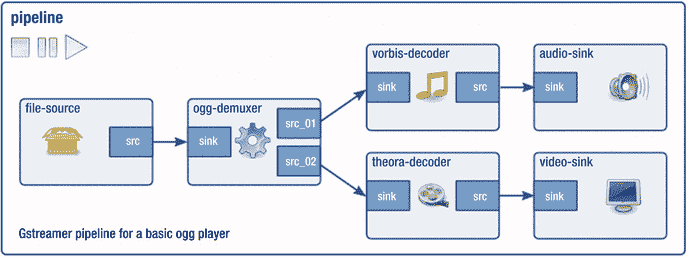

# 10.GStreamer

GStreamer 是一个组件库，可以在复杂的管道中连接在一起。它可以用于过滤、转换格式和混音。它可以处理音频和视频格式，但本章只讨论音频。它着眼于使用 GStreamer 的用户级机制，以及链接 GStreamer 组件的编程模型。为编写新组件提供了参考。

## 资源

以下是一些资源:

*   用 GStreamer ( [`www.ibm.com/developerworks/aix/library/au-gstreamer.html?ca=dgr-lnxw07GStreamer`](http://www.ibm.com/developerworks/aix/library/au-gstreamer.html?ca=dgr-lnxw07GStreamer) )进行多用途多媒体处理
*   GStreamer 插件引用( [`http://gstreamer.freedesktop.org/documentation/`](http://gstreamer.freedesktop.org/documentation/) )
*   插件的“GStreamer 编写器指南”(1.9.90) ( [`https://gstreamer.freedesktop.org/data/doc/gstreamer/head/pwg/html/index.html`](https://gstreamer.freedesktop.org/data/doc/gstreamer/head/pwg/html/index.html) )

## 概观

GStreamer 使用管道模型来连接元素，这些元素是源、过滤器和接收器。图 [10-1](#Fig1) 为模型。


图 10-1。

GStreamer pipeline model

每个元素有零个或多个焊盘，可以是产生数据的源焊盘，也可以是消耗数据的宿焊盘，如图 [10-2](#Fig2) 所示。


图 10-2。

GStreamer source and sink pads

pad 可以是静态的，也可以是响应事件而动态创建或销毁的。例如，要处理一个容器文件(如 MP4 ),元素必须先读取足够多的文件内容，然后才能确定所包含对象的格式，如 H.264 视频。完成后，它可以为下一阶段创建一个源 pad 来使用数据。

GStreamer 并不局限于像命令语言`bash`这样的线性流水线。例如，解复用器可能需要将音频和视频分开，并分别进行处理，如图 [10-3](#Fig3) 所示。



图 10-3。

Complex GStreamer pipeline

元素遵循状态模型，如下所示:

*   `GST_STATE_NULL`
*   `GST_STATE_READY`
*   `GST_STATE_PAUSED`
*   `GST_STATE_PLAYING`

通常会创建元素并将其从`NULL`移动到`PLAYING`。其他状态可以进行更精确的控制。

元素还可以生成包含数据流状态信息的事件。事件通常在内部处理，但也可能被监视，例如表示数据流结束或数据流格式的事件。

插件是可加载的代码块。通常，一个插件包含单个元素的实现，但它可能包含更多元素。

每个 pad 都有一个相关的功能列表。每个功能都是关于 pad 可以处理什么的陈述。这包括有关数据类型(例如，`audio/raw`)、格式(S32LE、U32LE、S16LE、U16LE 等)、数据速率(例如，每秒 1-2147483647 位)等信息。当源焊盘链接到宿焊盘时，这些能力用于确定元件将如何通信。

## 命令行处理

处理 GStreamer 有三个层次:通过使用命令行，通过编写 C 程序(或者 Python、Perl、C++等等)链接元素，或者通过编写新元素。本节介绍命令行工具。

### 商品及服务税-检查

不带参数的命令`gst-inspect`(在我的 Ubuntu 系统上，`gst-inspect-1.0`)显示了插件列表、它们的元素和简短描述。简要摘录如下:

```sh
...
audiomixer:  liveadder: AudioMixer
audioparsers:  aacparse: AAC audio stream parser
audioparsers:  ac3parse: AC3 audio stream parser
audioparsers:  amrparse: AMR audio stream parser
audioparsers:  dcaparse: DTS Coherent Acoustics audio stream parser
audioparsers:  flacparse: FLAC audio parser
audioparsers:  mpegaudioparse: MPEG1 Audio Parser
audioparsers:  sbcparse: SBC audio parser
audioparsers:  wavpackparse: Wavpack audio stream parser
audiorate:  audiorate: Audio rate adjuster
...

```

这表明插件`audioparsers`包含许多元素，比如`aacparse`，它是一个“AAC 音频流解析器”

当以插件作为参数运行时，`gst-inspect`显示了关于插件的更多细节。

```sh
$gst-inspect-1.0 audioparsers
Plugin Details:
  Name                     audioparsers
  Description              Parsers for various audio formats
  Filename                 /usr/lib/x86_64-linux-gnu/gstreamer-1.0/libgstaudioparsers.so
  Version                  1.8.1
  License                  LGPL
  Source module            gst-plugins-good
  Source release date      2016-04-20
  Binary package           GStreamer Good Plugins (Ubuntu)
  Origin URL               https://launchpad.net/distros/ubuntu/+source/gst-plugins-good1.0

  aacparse: AAC audio stream parser
  amrparse: AMR audio stream parser
  ac3parse: AC3 audio stream parser
  dcaparse: DTS Coherent Acoustics audio stream parser
  flacparse: FLAC audio parser
  mpegaudioparse: MPEG1 Audio Parser
  sbcparse: SBC audio parser
  wavpackparse: Wavpack audio stream parser

  8 features:
  +-- 8 elements

```

特别要注意的是，它来自模块`gst-plugins-good`。插件按照稳定性、许可等进行分类。

当以元素作为参数运行时，`gst-inspect`显示了关于元素的大量信息。

```sh
$gst-inspect-1.0 aacparse
Factory Details:
  Rank                     primary + 1 (257)
  Long-name                AAC audio stream parser
  Klass                    Codec/Parser/Audio
  Description              Advanced Audio Coding parser
  Author                   Stefan Kost <stefan.kost@nokia.com>

Plugin Details:
  Name                     audioparsers
  Description              Parsers for various audio formats
  Filename                 /usr/lib/x86_64-linux-gnu/gstreamer-1.0/libgstaudioparsers.so
  Version                  1.8.1
  License                  LGPL
  Source module            gst-plugins-good
  Source release date      2016-04-20
  Binary package           GStreamer Good Plugins (Ubuntu)
  Origin URL               https://launchpad.net/distros/ubuntu/+source/gst-plugins-good1.0

GObject
 +----GInitiallyUnowned
       +----GstObject
             +----GstElement
                   +----GstBaseParse
                         +----GstAacParse

Pad Templates:
  SINK template: 'sink'
    Availability: Always
    Capabilities:
      audio/mpeg
            mpegversion: { 2, 4 }

  SRC template: 'src'
    Availability: Always
    Capabilities:
      audio/mpeg
                 framed: true
            mpegversion: { 2, 4 }
          stream-format: { raw, adts, adif, loas }

Element Flags:
  no flags set

Element Implementation:
  Has change_state() function: gst_base_parse_change_state

Element has no clocking capabilities.
Element has no URI handling capabilities.

Pads:
  SINK: 'sink'
    Pad Template: 'sink'
  SRC: 'src'
    Pad Template: 'src'

Element Properties:
  name                : The name of the object
                        flags: readable, writable
                        String. Default: "aacparse0"
  parent              : The parent of the object
                        flags: readable, writable
                        Object of type "GstObject"
  disable-passthrough : Force processing (disables passthrough)
                        flags: readable, writable
                        Boolean. Default: false

```

这表明它可以采用音频/mpeg 版本 2 或 4，并将数据转换为各种格式的音频/mpeg 版本 2 或 4。

### GST-发现者

命令`gst-discoverer`(在我的系统`gst-discoverer-1.0`上)可以用来给出关于资源的信息，比如文件或者 URIs。在一个名为`audio_01.ogg`的音频文件上，它给出了以下信息:

```sh
$gst-discoverer-1.0 enigma/audio_01.ogg
Analyzing file:enigma/audio_01.ogg
Done discovering file:enigma/audio_01.ogg

Topology:
  container: Ogg
    audio: Vorbis

Properties:
  Duration: 0:02:03.586666666
  Seekable: yes
  Tags:
      encoder: Xiph.Org libVorbis I 20020717
      encoder version: 0
      audio codec: Vorbis
      nominal bitrate: 112001
      bitrate: 112001
      container format: Ogg

```

### GST-设备-监视器

该命令可以提供关于系统中设备的大量信息:

```sh
$gst-device-monitor-1.0
Probing devices...

Device found:

        name  : Monitor of Built-in Audio Digital Stereo (HDMI)
        class : Audio/Source
        caps  : audio/x-raw, format=(string){ S16LE, S16BE, F32LE, F32BE, S32LE, S32BE, S24LE, S24BE, S24_32LE, S24_32BE, U8 }, layout=(string)interleaved, rate=(int)[ 1, 2147483647 ], channels=(int)[ 1, 32 ];
                audio/x-alaw, rate=(int)[ 1, 2147483647 ], channels=(int)[ 1, 32 ];
                audio/x-mulaw, rate=(int)[ 1, 2147483647 ], channels=(int)[ 1, 32 ];
        properties:
                device.description = "Monitor\ of\ Built-in\ Audio\ Digital\ Stereo\ \(HDMI\)"
                device.class = monitor
                alsa.card = 0
                alsa.card_name = "HDA\ Intel\ HDMI"
                alsa.long_card_name = "HDA\ Intel\ HDMI\ at\ 0xf7214000\ irq\ 52"
                alsa.driver_name = snd_hda_intel
                device.bus_path = pci-0000:00:03.0
                sysfs.path = /devices/pci0000:00/0000:00:03.0/sound/card0
                device.bus = pci
                device.vendor.id = 8086
                device.vendor.name = "Intel\ Corporation"
                device.product.id = 160c
                device.product.name = "Broadwell-U\ Audio\ Controller"
                device.form_factor = internal
                device.string = 0
                module-udev-detect.discovered = 1
                device.icon_name = audio-card-pci
...

```

这是关于我的 HDMI 显示器的音频功能的大量信息，然后是关于我的其他设备的音频和视频功能的其他信息。

### 商品及服务税-播放

这个程序是一站式播放各种媒体文件和 URIs，如下:

```sh
      $gst-play-1.0 enigma/audio_01.ogg

```

### 商品及服务税-推出

`gst-launch`程序允许你建立一个命令管道来处理媒体数据。格式如下:

```sh
      gst-launch <elmt> [<args>] ! <elmt> [<args>] ! ...

```

例如，要通过 ALSA 播放 WAV 文件，请使用以下命令:

```sh
      $gst-launch-1.0 filesrc location=enigma/audio_01.wav ! wavparse ! alsasink

```

使用 GStreamer 管道最困难的部分似乎是选择合适的插件。这看起来有点像艺术。请参阅位于 [`http://wiki.oz9aec.net/index.php/Gstreamer_cheat_sheet`](http://wiki.oz9aec.net/index.php/Gstreamer_cheat_sheet) 的 GStreamer 备忘单以获取帮助。

例如，Ogg 文件是一种容器格式，通常包含 Vorbis 音频流和 Theora 视频流(尽管它们可以包含其他数据格式)。它们播放音频或视频，或者两者都播放，必须使用解复用器从容器中提取流，解码，然后播放。播放音频有多种方式，包括以下三种:

```sh
    $gst-launch-1.0 filesrc location=enigma/audio_01.ogg ! oggdemux ! vorbisdec ! audioconvert ! alsasink

    $gst-launch-1.0 filesrc location=enigma/audio_01.ogg ! oggdemux ! vorbisdec ! autoaudiosink

    $gst-launch-1.0 uridecodebin uri=file:enigma/audio_01.ogg ! audioconvert ! autoaudiosink

```

GStreamer 管道的语法允许将一个管道分成多个管道，例如管理音频和视频流。这在 GStreamer 的在线文档中有所介绍。

## 编程

同样的管道原则也适用于`gst-launch`，但是当然在 C 编程级别有更多的管道需要关注。以下来自 [`http://docs.gstreamer.com/display/GstSDK/Basic+tutorials`](http://docs.gstreamer.com/display/GstSDK/Basic+tutorials) 的 GStreamer SDK 基础教程的程序与最后一个`gst-launch`示例(`$gst-launch-1.0 uridecodebin uri=... ! audioconvert ! autoaudiosink`)做的一样。

GStreamer 元素是通过如下调用创建的:

```sh
data.source = gst_element_factory_make ("uridecodebin", "source");

```

管道是用这个建造的:

```sh
data.pipeline = gst_pipeline_new ("test-pipeline")
gst_bin_add_many (GST_BIN (data.pipeline), data.source, data.convert , data.sink, NULL);

```

最终所有的元素都必须被连接起来。现在，`convert`和`sink`可以与以下链接:

```sh
gst_element_link (data.convert, data.sink)

```

要播放的 URI 设置如下:

```sh
g_object_set (data.source, "uri", "http://docs.gstreamer.com/media/sintel_trailer-480p.webm", NULL);

```

数据源是一个容器；在我之前的例子中，它是一个 Ogg 容器，这里它是一个 web 媒体 URL。在读取足够的数据以确定数据格式和参数之前，这不会在数据源元素上创建源填充。因此，C 程序必须为`pad-added`添加一个事件处理程序，它是这样做的:

```sh
g_signal_connect (data.source, "pad-added", G_CALLBACK (pad_added_handler), &data);

```

当一个 pad 被添加到源时，`pad_added_handler`将被调用。这做了很多类型检查并得到了新的 pad，但最终完成了链接`source`和`convert`元素的关键步骤。

```sh
gst_pad_link (new_pad, sink_pad)

```

然后，应用程序通过将状态改变为`PLAYING`开始播放，并等待正常终止(`GST_MESSAGE_EOS`)或其他消息。

```sh
gst_element_set_state (data.pipeline, GST_STATE_PLAYING);
bus = gst_element_get_bus (data.pipeline);
msg = gst_bus_timed_pop_filtered (bus, GST_CLOCK_TIME_NONE,
        GST_MESSAGE_STATE_CHANGED | GST_MESSAGE_ERROR | GST_MESSAGE_EOS);

```

代码的最后一部分进行清理。完整的程序如下:

```sh
#include <gst/gst.h>

/* Structure to contain all our information, so we can pass it to callbacks */
typedef struct _CustomData {
  GstElement *pipeline;
  GstElement *source;
  GstElement *convert;
  GstElement *sink;
} CustomData;

/* Handler for the pad-added signal */
static void pad_added_handler (GstElement *src, GstPad *pad, CustomData *data);

int main(int argc, char *argv[]) {
  CustomData data;
  GstBus *bus;
  GstMessage *msg;
  GstStateChangeReturn ret;
  gboolean terminate = FALSE;

  /* Initialize GStreamer */
  gst_init (&argc, &argv);

  /* Create the elements */
  data.source = gst_element_factory_make ("uridecodebin", "source");
  data.convert = gst_element_factory_make ("audioconvert", "convert");
  data.sink = gst_element_factory_make ("autoaudiosink", "sink");

  /* Create the empty pipeline */
  data.pipeline = gst_pipeline_new ("test-pipeline");

  if (!data.pipeline || !data.source || !data.convert || !data.sink) {
    g_printerr ("Not all elements could be created.\n");
    return -1;
  }

  /* Build the pipeline. Note that we are NOT linking the source at this
   * point. We will do it later. */
  gst_bin_add_many (GST_BIN (data.pipeline), data.source, data.convert , data.sink, NULL);
  if (!gst_element_link (data.convert, data.sink)) {
    g_printerr ("Elements could not be linked.\n");
    gst_object_unref (data.pipeline);
    return -1;
  }

  /* Set the URI to play */
  g_object_set (data.source, "uri", "http://docs.gstreamer.com/media/sintel_trailer-480p.webm", NULL);

  /* Connect to the pad-added signal */
  g_signal_connect (data.source, "pad-added", G_CALLBACK (pad_added_handler), &data);

  /* Start playing */
  ret = gst_element_set_state (data.pipeline, GST_STATE_PLAYING);
  if (ret == GST_STATE_CHANGE_FAILURE) {
    g_printerr ("Unable to set the pipeline to the playing state.\n");
    gst_object_unref (data.pipeline);
    return -1;
  }

  /* Listen to the bus */
  bus = gst_element_get_bus (data.pipeline);
  do {
    msg = gst_bus_timed_pop_filtered (bus, GST_CLOCK_TIME_NONE,
        GST_MESSAGE_STATE_CHANGED | GST_MESSAGE_ERROR | GST_MESSAGE_EOS);

    /* Parse message */
    if (msg != NULL) {
      GError *err;
      gchar *debug_info;

      switch (GST_MESSAGE_TYPE (msg)) {
        case GST_MESSAGE_ERROR:
          gst_message_parse_error (msg, &err, &debug_info);
          g_printerr ("Error received from element %s: %s\n", GST_OBJECT_NAME (msg->src), err->message);
          g_printerr ("Debugging information: %s\n", debug_info ? debug_info : "none");
          g_clear_error (&err);
          g_free (debug_info);
          terminate = TRUE;
          break;
        case GST_MESSAGE_EOS:
          g_print ("End-Of-Stream reached.\n");
          terminate = TRUE;
          break;
        case GST_MESSAGE_STATE_CHANGED:
          /* We are only interested in state-changed messages from the pipeline */
          if (GST_MESSAGE_SRC (msg) == GST_OBJECT (data.pipeline)) {
            GstState old_state, new_state, pending_state;
            gst_message_parse_state_changed (msg, &old_state, &new_state, &pending_state);
            g_print ("Pipeline state changed from %s to %s:\n",
                gst_element_state_get_name (old_state), gst_element_state_get_name (new_state));
          }
          break;
        default:
          /* We should not reach here */
          g_printerr ("Unexpected message received.\n");
          break;
      }
      gst_message_unref (msg);
    }
  } while (!terminate);

  /* Free resources */
  gst_object_unref (bus);
  gst_element_set_state (data.pipeline, GST_STATE_NULL);
  gst_object_unref (data.pipeline);
  return 0;
}

/* This function will be called by the pad-added signal */
static void pad_added_handler (GstElement *src, GstPad *new_pad, CustomData *data) {
  GstPad *sink_pad = gst_element_get_static_pad (data->convert, "sink");
  GstPadLinkReturn ret;
  GstCaps *new_pad_caps = NULL;
  GstStructure *new_pad_struct = NULL;
  const gchar *new_pad_type = NULL;

  g_print ("Received new pad '%s' from '%s':\n", GST_PAD_NAME (new_pad), GST_ELEMENT_NAME (src));

  /* If our converter is already linked, we have nothing to do here */
  if (gst_pad_is_linked (sink_pad)) {
    g_print ("  We are already linked. Ignoring.\n");
    goto exit;
  }

  /* Check the new pad's type */
  new_pad_caps = gst_pad_get_caps (new_pad);
  new_pad_struct = gst_caps_get_structure (new_pad_caps, 0);
  new_pad_type = gst_structure_get_name (new_pad_struct);
  if (!g_str_has_prefix (new_pad_type, "audio/x-raw")) {
    g_print ("  It has type '%s' which is not raw audio. Ignoring.\n", new_pad_type);
    goto exit;
  }

  /* Attempt the link */
  ret = gst_pad_link (new_pad, sink_pad);
  if (GST_PAD_LINK_FAILED (ret)) {
    g_print ("  Type is '%s' but link failed.\n", new_pad_type);
  } else {
    g_print ("  Link succeeded (type '%s').\n", new_pad_type);
  }

exit:
  /* Unreference the new pad's caps, if we got them */
  if (new_pad_caps != NULL)
    gst_caps_unref (new_pad_caps);

  /* Unreference the sink pad */
  gst_object_unref (sink_pad);
}

```

## 编写插件

编写新的 GStreamer 插件是一项艰巨的任务。位于 [`https://gstreamer.freedesktop.org/data/doc/gstreamer/head/pwg/html/index.html`](https://gstreamer.freedesktop.org/data/doc/gstreamer/head/pwg/html/index.html) 的文档“GStreamer 作者指南”对此给出了广泛的建议。

## 结论

本章从命令行和一个示例 C 程序两个方面介绍了 GStreamer 的使用。有一个庞大的可用插件列表，可以满足音频/视频开发人员的许多需求。我只是触及了 GStreamer 的皮毛，它还有许多其他特性，包括与 GTK 工具包的集成。